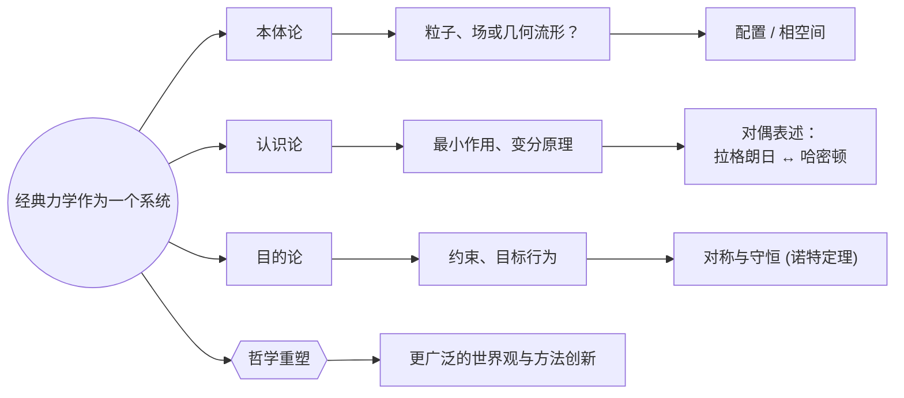

# 通过现代哲学视角重新审视经典力学
* * *

--- 通过统一本体论、认识论和目的论，我们重塑对运动和实在的理解。

# 第一章 引言与哲学动机

**题记：**  
“力学开始于对运动的研究；我们现在超越运动，探究实在的本质。”

本章为通过当代哲学视角审视经典力学奠定基础。它首先追溯这一学科如何从牛顿定律定义的领域不断与关于真正存在(本体论)、我们如何获得其知识(认识论)以及物理定律中是否存在任何目的论(目标导向)维度的更深层次问题相交。通过强调这三个哲学领域，我们创建一个平台，后续章节将在此基础上对经典力学进行全面重新审视 —— 这不仅超越单纯的公式熟练度，还探讨该学科的基础结构和意义。

从历史的角度看，牛顿的时代确立了力和绝对空间作为解释支柱的概念。然而，随着我们继续前进，观察到现代分析力学(例如拉格朗日和哈密顿形式主义)逐渐将力从其核心地位移除，而是指向几何、约束和能量原理作为基本要素。这些转变不仅仅是改进了解决问题的方法：它们重塑了我们对实在、运动和目的的理解。因此，采取哲学方法不仅仅是一个可选练习；它是解锁深入理解经典力学为何继续照亮并挑战我们的世界观的原因和方式的途径。

## 1.1 从牛顿定律到分析力学

本节提供一个简明的综述，概述从牛顿力学到拉格朗日/哈密顿的主要范式转移，并强调伴随的哲学转变。

经典力学以其追溯至艾萨克·牛顿三大运动定律而闻名，将力、质量和绝对空间视为本体论基石。在这种原始观点中，宇宙是一个由力作用于惯性物质的大舞台，这些力本身被视为真实且不可还原的存在。这种方法无疑是革命性的：它在一个单一的数学框架下统一了地球和天体领域，推动了几百年的科学进步，并塑造了我们对世界“运作”方式的直观理解。

然而，随着时间的推移，新的数学见解和科学发现开始改变力学的概念核心。由拉格朗日和哈密顿等杰出人物领导的分析视角更加关注能量泛函、广义坐标和最小作用量原理等全局原则，而不是原始力。这些变化暗示了力可能被降级为衍生效应：例如，在拉格朗日力学中，力来源于势能的梯度(或来自约束)，而在哈密顿力学中，它对应于动量的变化率，由更全面的能量函数编码。几何和抽象构造越来越受到重视，表明最有效的描述实在的方式不是通过推拉，而是通过构型空间或相空间的形状和结构。

简而言之，从牛顿力学到分析形式主义的转变带来了深远的哲学影响。牛顿将力和绝对空间定位为主要“实在”，而分析力学引入了一种更为微妙的本体论 —— 系统由势能导航，受边界条件约束，并通过连续变分计算最佳理解。这一轨迹预示着力学将进一步扩展到辛几何、规范理论甚至量子背景中，因此看到每个概念进展如何重申或重塑我们认为物理实在的基石变得至关重要。

## 1.2 本体论、认识论和目的论的相关性

本节明确定义这些哲学术语，并将其与经典力学中的主题联系起来。

上述范式转移自然引导我们转向三个在物理理论解释中具有重大影响的哲学轴心：

1. **本体论** – 研究什么真正存在。  
   在牛顿时代，力和质量被视为真实、具体的宇宙构建块。在拉格朗日/哈密顿力学中，实在似乎越来越多地与构型空间、势能和作用等无形构造相认同。关键的本体论问题出现了：粒子是“真实的”，还是真正的存在在于指导其轨迹的几何结构？

2. **认识论** – 研究我们如何获得和验证知识。  
   经典力学不仅提供了方程，还提供了一整套用于解释和预测运动的方法论(例如建模、约束、能量变化)。我们必须问：我们如何在思维上构建和完善这些模型以确保它们反映自然？变分原理、对称性和勒让德变换都是知识框架的例子，它们超出了基于力的直觉。

3. **目的论** – 研究目的或有向过程。  
   尽管目的论传统上存在于生物学或哲学讨论中，物理学的某些方面 —— 如最小作用量原理 —— 听起来非常有目的性：系统“选择”使作用最小化(或极值化)的路径。虽然机械系统不一定真的具有“意图”，但数学上的平行关系邀请我们进行反思。宇宙是否包含类似于有意设计的原则，或者目的论仅仅是总结约束和定律的一种优雅方式？

通过将经典力学置于这三个哲学领域中，我们认识到它不仅仅是轨道运动或旋转陀螺的一组值得尊敬的公式。相反，经典力学成为一种通过它我们可以解码实在、测试我们的概念框架，并思考“目的”是否隐藏在纯粹确定性过程的幻象背后的透镜。后续章节将分别扩展这些主题 —— 本体论、认识论和目的论 —— 最终导致对经典力学作为一个哲学系统的更广泛重构，这对我们的宇宙理解有着深远的影响。

# 第二章 本体论思考：经典力学中什么是真实的？

**题记：**  
“当我们测量运动时，我们是在与实在对比 —— 是粒子、场还是流形真正存在？”

经典力学长期以来被誉为研究运动物体的科学 —— 力、质量和轨迹的科学。然而，在这一看似直接的描述之下隐藏着一个深刻的本体论问题：这些概念在更宏大的实在中代表什么？本章探讨经典力学如何框定“宇宙的物质”，揭示从以力为中心的叙述到基于几何的形式主义的连续演变。我们探讨基本存在是否存在于离散粒子、连续场或抽象流形中，以及对构型空间和相空间的深入解读如何阐明物理实在的本质。通过探索约束、势能和规范场，我们看到力学的每一层如何重新定义我们所说的“真实”，促使我们面对随着理论成熟，本体论本身是否发生变化的问题。

## 2.1 从以力为中心到以几何为中心的演变

本节展示力曾经作为核心本体论的地位，但逐渐让位于哈密顿量、拉格朗日量和几何。

牛顿世界观将力视为物理实在的核心 —— 一种作用于惯性质量产生加速度的真实代理。在这种框架下，力不仅仅是计算工具，而是连接因果关系的有形实体。尽管这种观点非常成功，但它隐含地假设空间和时间为力提供了一个静态背景。

分析力学极大地重塑这一本体论图景。在拉格朗日力学中，重点转移到作用量原理 —— 时间上的拉格朗日量积分 —— 使力成为由势能导数派生的次要现象。同样，在哈密顿力学中，力的概念源自相空间中的哈密顿函数梯度。两种形式主义都将力降为衍生概念：它不再是独立的“事物”，而是如能量函数的部分导数等更深层数学结构的表现。

这种改变的关注点意味着本体论的转变：不再是以力为核心，而是系统的构型或相空间的几何成为中心“实在”。关键对象是轨迹及其塑造它们的约束，无论这些约束来自势能还是广义坐标。实际上，经典力学从“推拉”的世界观转变为由几何和全局能量表面引导的世界观。这种转变暗示实在的本质可能在于系统如何导航复杂的流形，而不是外部力如何驱动它们。

## 2.2 构型空间、相空间和辛流形

本节澄清为什么这些数学空间在高级经典力学中代表实在。

既然力已被降为衍生概念，我们接下来问：如果不是力，那么机械实在的核心是什么？答案以构型空间(对于拉格朗日形式)和相空间(对于哈密顿形式)的形式出现。构型空间从常规坐标抽象出一组最小的广义变量，捕捉系统的本质自由度。这种抽象虽然看似数学化，但却具有本体论主张：它认为“真实”系统完全由这些广义坐标描述 —— 严格来说，不需要对宇宙背景进行额外的参照。

相空间更进一步，将每个广义坐标与其对应的动量配对，创建一个更丰富的 $2n$ 维结构。这个空间由辛形式组织，将系统的完整状态编码在一个单一的几何对象中。在这种观点下，实在是在辛流形上演绎的，其中点表示状态，流过这个流形表示时间演化。哈密顿方程呈现为几何流 —— “辛流” —— 保持底层辛结构，强化了几何而非力是主要驱动力的观点。

即使是约束和势能也很好地融入了这种几何视角。完整约束将流形限制为子空间，塑造可能的运动而无需直接的“推力”。势能类似地表现为标量场，弯曲可达状态的几何，产生反映能量景观局部曲率的“运动路径”。综合来看，这些概念将根本问题“什么是存在的？”转化为关于轨道如何嵌入结构化流形的陈述。无论是讨论高级理论中的规范场还是日常问题中的摩擦约束，本体论线索依然存在：经典力学已成为一种以几何为中心的实在描述，其中“力”和“相互作用”显现为流形结构、势能景观或边界条件的局部读数。

因此，经典力学逐步放弃幼稚的基于力的公理，转而接受更高层次的描述，其中空间和辛形式锚定了我们对“真实”的概念。这种转变为后续章节奠定基础，我们将知识构建(认识论)和可能的目的(目的论)编织进这个织锦中，使我们更接近对力学本身的全面哲学重构。

# 第三章 认识论框架：我们如何知道我们知道的？

**题记：**  
“通过制定作用量和对称性，我们不仅仅是在解方程 —— 我们还在衡量‘知道’意味着什么。”

在任何科学学科中，知识既不是静态的事实清单，也不是随机的方程集合。它是通过特定原则构建的，通过观察或逻辑验证，并不断测试其一致性和预测能力。经典力学是一个特别显著的例子。它的形式主义 —— 从牛顿定律到哈密顿正则方程 —— 既来源于经验数据(天体或地球上的)，也来源于大胆的理论综合。本章探讨经典力学如何提供并验证知识：它通过哪些认识论渠道组织现象、统一不同的观察结果，并提供对物理实在的更深入理解？

从前几章的角度来看，我们可以看到经典力学已经从以力为中心的观点转向以几何为中心的解释，微妙地改变我们对运动“真理”的概念化方式。认识论视角揭示采用拉格朗日或哈密顿方法不仅仅是出于方便；这些框架强有力地约束我们发现、形式化和确认知识的方式。换句话说，力学的结构本身塑造我们所认为的真实和可理解的内容。通过变分原理、模型和对称性，经典力学因此成为科学理论作为认识引擎的一个典型例子 —— 在经验适当性和概念优雅性的双重约束下运行的求真装置。

## 3.1 最小作用量原理作为一种认识工具

本节揭示最小作用量原理如何封装观测数据和理论优雅性。

高级力学中最显著的统一线索之一是最小(或驻定)作用量原理。在拉格朗日形式中，这一原理指出系统的物理轨迹使一个称为作用量 $S$ 的积分最小(或极值)。从认识论角度来看，最小作用量原理完成了两个关键功能：

1. **将观测数据浓缩为单一泛函**  
   不再单独分析每个现象的所有“力”或相互作用，最小作用量原理将它们编织成一个全局量 $S = \int L \, dt$。拉格朗日 $L$ 将动能和势能项汇集在一起。关于运动的观测数据 —— 无论是抛射物轨迹、行星轨道还是摆动振荡 —— 都可以编码在同一形式结构中。真实系统确实遵循满足欧拉-拉格朗日方程(由最小化 $S$ 导出)的路径，这提供了自然观察行为与理论上的驻定作用量概念之间的深刻同步。

2. **提供理论经济性和优雅性**  
   在物理学中，“描述的经济性”往往标志着深刻的内在统一性。最小作用量原理用单个全局条件替代多个依赖于力的陈述。这种全局观点不仅简化推导(例如，在较少假设下推导运动定律)，还提供概念上的优雅性：它将广泛的现象 —— 经典、相对论甚至量子(在路径积分形式中) —— 以相同的变分模式联系在一起。从认识论角度看，这种统一是无价的：它简化了新定律的搜索，澄清了旧定律之间的关系，并提出了通往更深层次、更普遍理论的途径。

### 3.1.1 自然为何“选择”极值作用量路径？

虽然我们不能断言自然故意“选择”最小作用量，但两条认识论线索互相补充，强化了这一原理：

- **经验适当性**：一次又一次的实验证实，实际世界的运动满足欧拉-拉格朗日方程。因此，假设一个驻定作用量原理非常有效 —— 它在机械系统、波动现象、光学等领域都取得了成功。
- **概念一致性**：驻定作用量观点与诺特定理中的守恒律以及关于空间、时间及内部自由度的对称性论点完美契合。它成为一个中心市场，在这里数学、实验和理论洞察无缝交换价值。

简而言之，最小作用量原理不仅仅是一种公式化的工具；它是一种认识架构，指导我们如何统一数据、表示运动并预见新的发现。

## 3.2 对偶性、勒让德变换及其他认识桥梁

本节讨论变换(勒让德)和对偶形式(拉格朗日/哈密顿)如何拓宽我们的“知道”方式。

虽然最小作用量原理支撑着拉格朗日形式，但在哈密顿力学中出现等价表述。连接这两种观点的过渡是**勒让德变换**，一种代数-几何技术，用一组互补变量重新表达一种描述。从认识论角度来看，这种对偶性和变换过程揭示了更深的真理：

1. **多种视角，一个实在**  
   如果拉格朗日力学将速度 $\dot{q}$ 视为关键动力学变量，那么哈密顿力学同样重视动量 $p$。勒让德变换表明两种图景是对同一潜在现象的一致呈现，只是用不同坐标表示。这种“最低公分母”促进了更稳健的知识感：任何单一形式的成功或局限可以通过其对应形式进行测试。它们的一致性再次确认了系统更深的结构性真理，超越了坐标选择。

2. **知识的弹性**  
   在科学中，知识的弹性通常通过方法冗余增加。拥有两个经过良好测试且预测一致的框架(拉格朗日和哈密顿)增强了理论的可信度。此外，每种方法在不同情境中表现出色 —— 在拉格朗日图景中约束往往更简单，而在哈密顿世界中典范变换和相空间几何更为突出。这种互补性质扩展了我们解决各种问题的能力，从设计天体力学中的稳定轨道到制定量子类比。

3. **建模灵活性与深层真理**  
   一个微妙的认识论问题是：形式主义的多样性是否表明力学的本质是“坐标依赖的”，还是暗示在不同表示之下存在一个普遍的骨架？许多人会认为它强调了更深层次的统一性 —— 由辛几何、规范不变性或拓扑考虑捕捉到的不变结构，而局部坐标集合(在构型空间中的拉格朗日量，在相空间中的哈密顿量)仅仅反映该潜在实在的部分“投影”。因此，勒让德变换的作用超出了数学范畴，进入认识演示：可以从不同角度看待底层机械系统，每个视角尽管关注不同的变量，但都是同样合法的。

总之，像勒让德映射这样的变换以及拉格朗日/哈密顿力学之间的相互作用代表了认识桥梁 —— 扩展、测试并巩固我们理解的工具。通过揭示不同但等效的描述可以共存，经典力学强调它并未锁定于单一视角集合。这种双重(或多重)视角方法体现了理论的灵活性和概念强度，使其能够处理从受约束的刚体运动到量子场类比的各种问题。

## 3.3 结论

经典力学中的认识论远不止是一个“它能否预测实验结果？”的问题。它延伸到知识是如何通过如最小作用量或辛结构等深刻组织原则构建、验证和交叉检查的。认识到相同的物理可以用多种但收敛的形式主义来表达，我们获得了对所获得知识的坚定信心，这种知识植根于对物理定律的真正理解，而不仅仅是短暂的数据拟合。这种观点自然而然地引导我们走向下一个目的论问题 —— 如果经典力学能够如此优雅地统一知识，是否也暗示了自然在其运动中具有某种定向性或“目标”？我们将在下一章探讨这些想法，将其作为机械系统的目的论维度。

# 第四章 目的论维度：目的、约束与普遍性

**题记：**  
“每一个微分方程背后可能隐藏着实在的目的性形状 —— 自然中目的论结构的回响。”

原则上，经典力学似乎远离任何“目的”的概念。毕竟，牛顿定律以其非目的论特征著称：它们描述了力如何改变动量，而不涉及运动的任何“目标”。然而，当我们深入探讨 —— 特别是通过分析力学的视角 —— 微妙的目的论类比开始浮现。无论是作为约束引导系统行为，还是作为自然“偏好”最小化作用量，经典力学都与暗示物理定律中某种潜在方向性的框架产生共鸣。本章探讨这些“目标导向”类比如何被解释，以及它们如何帮助统一我们对约束、平衡、对称性和守恒定律的理解。

## 4.1 约束作为目的？

本节将约束不仅解释为几何限制，而且视为机械系统中潜在“方向”或“意图”的提示。

经典力学中的大多数系统并不能自由地在一个无约束的无限空间中移动。相反，它们面临着完整或非完整约束 —— 这些关系要么将位置限制在某些子流形上，要么在每个瞬间限制可能的速度向量。虽然这些约束可以是纯粹几何的(例如，在钢线上受限移动的珠子)，但它们通常像“指令”一样起作用，塑造系统的演化。

1. **完整约束 vs 非完整约束**  
   - 完整约束可以写成坐标上的代数方程(例如，球面上的一个粒子)。可以说，系统的“目的”是保持在这个流形上。无论我们将一个摆锤绕支点摆动，还是一个滚动的球体，系统都“遵循”约束，仿佛它是一个内部指令，不允许偏离允许的表面。  
   - 相反，非完整约束出现在速度层面上(例如，无滑动滚动)，增加系统如何移动的动态规则。这给允许的速度空间施加了一种“方向性” —— 关于运动下一步可能去向的隐含指令。

2. **约束作为“意图通道”**  
   在哲学意义上，可以认为约束体现了微观层面的目的论：它们引导系统走向否则无法达到的特定轨迹。系统本身并不“选择”这些轨迹，但从观察者的角度来看，就好像系统有一个嵌入的“意图”或“目标”，始终满足约束。这样看，约束不仅减少自由度，还塑造系统的涌现行为，使其呈现出“有目的”的形式。

3. **构建平衡和优选路径**  
   约束可以创建稳定或不稳定的平衡，实际上起到了“吸引子”的作用。在一个稳定平衡中，小扰动会被自然纠正，就像系统在“寻找”返回指定静止配置一样。这种现象长期以来在传统物理学中被解释为简单的能量最小化问题，但在目的论角度下可以理解为：系统“瞄准”与其约束一致的最低势能。尽管这是比喻性的语言，但它可以突出约束如何雕塑解空间以偏爱某些结果。

通过这个视角，约束不仅仅是限制运动。它们强加了系统自由度必须遵守的方向条件，默默地回响着一种目的论的语调：“系统必须保持在这条路径上”，或者，“它不能偏离这些速度方向”。无论我们将此解读为真正的目的，还是作为一种比喻性的解释工具，约束与目的论语言之间的契合加深了我们对经典力学的概念把握。

## 4.2 对称性、守恒律与自然的“目标”

本节将守恒律与隐含的目的论联系起来 —— 自然“意图”保存某些量。

经典力学和场论高级讨论的一个显著特征是对称性与守恒律之间深刻的联系，体现在著名的诺特定理中。当系统的拉格朗日量在连续对称变换(如时间平移或旋转)下不变时，相应的量(能量、角动量等)在时间上保持不变。该定理不仅统一了许多物理观察，也为一种目的论解读打开大门。

1. **诺特定理作为目的论和谐**  
   如果系统的拉格朗日量在某些变换下(如时间原点的移动)不变，则能量保持守恒。可以比喻地说，自然“寻求”在均匀时间变化面前保持能量含量。类似地，旋转对称性产生了一个“目标”，即保持角动量。从机械角度看，没有意识设计，但结果是，一旦存在对称性，某些核心量就不会改变。这种结构刚性可以解读为自然“意图”维护不变性。

2. **守恒作为指导目的**  
   在日常语言中，我们可能会说系统“旨在”保持动量或能量，并调整其他参数以实现这一目标。尽管“旨在”并不是字面意义上的主动驱动，但对称性与守恒律的相互作用在纯概念描述中表现出目的论特征。最小作用量原理本身通过诺特定理巧妙地连接到这些不变量，表明“最优”或“驻定”路径也与宇宙更广泛的连贯性相吻合 —— 即某些对称结构必须保持不变。

3. **从比喻到方法**  
   尽管目的论语言如果过于字面化可能是危险的，但它在方法论上具有启发性。它促使我们注意到经典力学中的模式或结构，仿佛自然在“保存”或“追求”某些东西。这个比喻可以引导研究人员预期，如果引入新的对称性或约束，定律可能会是什么样子。事实上，现代物理学中统一定律的探索往往依赖于寻找更深的对称性，以期发现新的守恒原理或耦合常数。

通过将约束驱动运动(第 4.1 节)与受诺特启发的守恒律相结合，经典力学不仅解释了事物如何移动，还在隐含的目的论意义上框定了“为什么”。无论我们设想摆锤寻求平衡，还是宇宙保持动量，目的论作为一种概念立场浮现在约束、驻定性及守恒律不可动摇的可靠性之间。

## 4.3 结论

目的论可能不是经典力学的标准口号，但每当约束、稳定性、对称性和守恒律共同作用产生有序且充满方向的结果时，其回声便响起。即使没有任何有意识的选择在起作用，也不能否认最小作用量原理、稳定平衡和诺特定理描绘了一幅自然图景，即始终“偏好”某些路径、状态或不变量。将此称为“目的”的解释性步骤可能是哲学性的而非科学性的，但它揭示了一个概念一致性层，丰富了教学和理论探索。从这里，我们将进入第五章，在那里，本体论、认识论和目的论的线索汇聚成对经典力学的全新哲学解读 —— 将其视为一门并非过时的学科，而是理解物理定律中固有的结构理性的时间方案。

# 第五章 哲学重构：经典力学的现代视角

**题记：**  
“以新的视角看待经典力学，就是改变我们的宇宙观 —— 超越方程，我们发现一种描述存在的方法。”

经典力学常被视为“旧”物理学的基石 —— 被相对论和量子理论超越的历史遗迹。然而，当通过本体论、认识论和目的论的视角重新审视时，它揭示自己是一个不断发展的概念框架，具有深刻的哲学深度。本章综合前面的讨论，提出经典力学不仅仅是计算公式集合，而是关于实在、知识，甚至是自然法则中嵌入的目的可能性的一幅丰富的思想画卷。通过将几何、作用原理和约束统一成一个连贯的世界观，我们可以看到经典力学不仅仅是一种“过时的科学”，而是一种生动且富有创造力的方法，用于理解我们的宇宙 —— 一种能够激发创造性扩展并塑造未来科学思维的方法。

## 5.1 核心综合：从牛顿公理到几何基础

本节展示整个概念弧(力 → 几何 → 势能 → 作用)如何将经典力学重新定位为一个不断发展的哲学系统。

在其起源时，经典力学依赖于假设力和质量为主要因素的牛顿公理。这些概念隐含地假设绝对空间和时间的存在 —— 独立于其所包含的现象的结构。然而，经过几个世纪的发展，该学科已经超越基于力的模型，转向以几何和变分原理为中心的表述：

1. **从力到势能**  
   在拉格朗日表述中，力源自于一个势能函数，使它们成为底层能量结构的涌现细节，而不是不可约简的公理。因此，“力”的概念被降级为能量梯度和约束如何塑造系统演化的副产品。

2. **从势能到全局作用**  
   最小(或驻定)作用原理通过假设系统的轨迹具有全局性质，进一步弱化了局部力的概念。与其用推拉相互作用来描述运动，我们将运动视为一条路径在时间上极值化一个积分(即作用量)的结果。这种转变暗示了一种整体观点，其中整个轨迹 —— 进而扩展到系统的全部历史 —— 共同决定了其动力学。

3. **从作用到几何**  
   哈密顿力学、辛流形和相空间技术通过强调几何流、守恒量和嵌入在一个辛结构中的不变量，进一步摆脱幼稚的力的图景。“真实”的机械系统本体论和认识论上的实质成为其状态空间的几何，而不是粒子受到力的扰动的概念。

这些转换共同构成了力学的一种哲学重构。它不再是关于作为粗暴事实的力，而是关于运动的拓扑和几何，塑造可能演化过程的不变性，以及统一看似不同现象的全局原则(最小作用原理、守恒定律)。这种重构对我们世界观有重大影响：一旦力被视为衍生而非基本，宇宙看起来更像是一幅由优雅编排的结构所治理的和谐挂毯，而不是碰撞事件的战场。

## 5.2 对未来研究与教育的影响

本节提供如何利用这些哲学见解进行高级教学、研究合作和概念扩展(例如，在量子或相对论框架中)的指南。

将经典力学视为动态且哲学丰富的系统为新的教学、研究甚至物理想象方式奠定基础：

1. **教学方法**  
   - 几何优先课程：早期引入拉格朗日和哈密顿方法以及最小作用原理，可以帮助学生超越力主导的观点。将这些概念与易于可视化的几何形式(如相位图)联系起来，可以培养对运动本质的更深层次直觉。  
   - 强调约束和变分方法：不要将约束归类为高级主题，而是将其整合进初始框架，展示看似简单的边界条件如何产生“有目的”或“导向”的运动。这种视角鼓励学生结构性思考，而不是记忆一系列方程。

2. **研究对话**  
   - 桥接经典与现代物理学：通过突出几何和作用原理，经典力学成为通往量子力学(例如，通过路径积分)或广义相对论(例如，通过弯曲时空中的测地线运动)的概念跳板。研究人员可以利用这些类比来制定新兴领域(如量子引力或高级规范理论)中的新假设，将其建立在经过数世纪考验的力学原理之上。  
   - 新理论中的哲学反思：认识到力学作为存在、知识和方向的框架，鼓励理论物理学家在深入计算之前提出基础问题。例如，询问什么是“真正真实”的或者“目的”如何在宇宙尺度上体现，可以启发新的研究路线和新颖的数学形式主义。

3. **概念扩展**  
   - 跨学科参与：认识到经典力学可以从哲学角度解释，为与哲学家、认知科学家、数学家及其他研究复杂系统结构模式的人士的合作打开了大门。变分原理和约束的普遍性质与生物学、经济学和系统理论中的模型共鸣。  
   - 对机械解释态度的演变：基于几何/作用的世界观为古老的机械口号“自然是一台机器”增添了细微差别。相反，自然界可以被视为一种活生生的几何，一个由互相关联的约束、对称性和流构成的领域，既反映又超越直接的因果叙述。

简而言之，采用哲学视角不仅仅是刷新我们如何教学或进行研究；它将经典力学重新定义为一种共享语言，用于跨多样科学学科理解模式和结构。通过这样做，我们保持了点燃牛顿时代的创造火花，并将其带入理论探索的新前沿 —— 最终提醒我们，力学不仅仅是计算轨道的问题，而是感知宇宙深层理性架构的问题。

## 5.3 结论

这一基于几何、约束和作用原理的经典力学哲学重构促使我们剥离纯粹以力为中心的叙述残余，转而欣赏该领域的潜力，以阐明关于实在、知识和目的的基本问题。通过整合本体论、认识论和目的论视角，经典力学转变为一个充满活力的知识体系 —— 在概念上有丰富细腻之处，并对未来创新开放。结论章节将把这些线索联系起来，强调这种对力学的更新解读不仅告知科学教育或专门研究，还涉及关于我们追求意义过程中物理学角色的更广泛文化与智力对话。

## 第六章 结论

**题记：**  
“重构力学就是重构我们对实在的方法 —— 这一旅程既是科学的，也是哲学的。”

经典力学最初可能看起来像是物理学中一个封闭的章节，被更现代的理论所掩盖。然而，正如本文档所探讨的，通过本体论、认识论和目的论的视角回归其基础，揭示了它是一个非常肥沃的概念领域。我们已经看到“力”如何让位于几何和作用泛函；“知道”如何在变分原理和对偶表述中结晶；以及微妙的目的论色彩如何支撑约束和对称-守恒定律。在每个转折点上，经典力学都提供了一个工具，用于探究超越公式熟练度的深层次哲学问题。

一个核心见解是“力学”的多层次含义。历史上，它是关于预测行星轨道和轨迹的。现在，从哲学上重新定义，它成为一种检验实在本质(它是由粒子还是流形结构构成？)、“知道”方法(为什么变分原理如此有效？)以及自然法则中“目的”可能性(最小作用是否反映了最低消耗的基本目标？)的手段。综合来看，这些观点表明经典力学 —— 远未过时 —— 继续激发新的思考，挑战我们如何定义物理中的存在、知识和方向性。

采用这种更新的哲学视角也可以扩展我们的宇宙观。通过将宇宙视为几何、约束和能量流之间的无缝互动，而不是作为孤立力的集合，我们可能会发现质疑科学中根深蒂固假设的新方法。这些问题可能会开辟量子解释、宇宙学建模或甚至生物学和社会科学中的跨学科类比等领域的未探索路径。在实际研究中，分析力学揭示的深层结构统一可以作为制定和测试新理论的蓝图。在教育中，强调经典方程背后的概念框架可以培养学习者更深的科学直觉和智力好奇心。

简而言之，经典力学不仅仅是一种遗迹，而是一个门户：一个我们可以从中窥视世界深刻统一和秩序的视角。拥抱一种哲学立场 —— 交织本体论、认识论和目的论 —— 不仅仅是使历史理论生动起来。它激发了一种视角的转变：力学不仅成为模拟运动的工具，而且成为反思实在框架以及科学探究如何照亮它的工具。

无论是教学、研究，还是仅仅思考物理法则的范围，以哲学深度来接近经典力学都可以解锁丰富的见解。它促使我们大胆开放新的范式，准备好在看似不同的领域下看到模式，并愿意问：如果我们重新想象这个“经典”体系作为一个不断发展的思想系统，连接理性和神秘、经验与存在的，未来会是什么样？最终，这个问题是这个项目的中心 —— 一个问题的答案承诺再次重塑我们对运动、实在及其在其中的位置的理解。

# 附录 A：概念概览及相互关系

以下是旨在阐明核心思想 —— 本体论、认识论、目的论、几何以及哲学重塑 —— 及其在经典力学背景下的相互联系的简要概述。

## A.1 关键概念及其关系

1. **本体论基础**  
   - 关注什么是最终“真实的”：粒子、场、几何或作用原理。  
   - 从以力为中心的世界观转向基于势能、约束和流形结构的世界观。

2. **认识论基础**  
   - 研究我们在力学中如何构建、验证和完善知识。  
   - 强调变分原理、对偶形式(拉格朗日/哈密顿)，以及它们如何共同增强理论可信度。

3. **目的论(目标导向)再解读**  
   - 探索目标导向的类比，特别是通过约束和最小作用定律。  
   - 检查对称性和守恒如何暗示自然法则中的微妙“方向性”。

4. **几何、约束和辛结构**  
   - 强调配置空间和相空间以及哈密顿力学中的辛流形的基本作用。  
   - 展示约束如何塑造轨迹，有时似乎赋予系统“意图”。

5. **哲学重塑**  
   - 提出经典力学不仅仅是一门历史学科 —— 而是作为一种充满活力的哲学系统，它影响世界观、方法和智力创造力。  
   - 设想扩展到教育、跨学科研究和高级理论框架(量子、宇宙学等)。

## A.2 核心关系图

**图示说明：**

1. **经典力学作为一个系统** (A) 是涵盖三个主要维度 —— 本体论 (B)、认识论 (C) 和目的论 (D) 的总体框架。  
2. **本体论** (B) 锚定了关于什么“真正存在”的讨论，引出实在最好是由离散粒子、连续场还是抽象流形 (E) 描述的问题。这些进一步指向机械系统的几何表示在配置空间和相空间 (H) 中的应用。  
3. **认识论** (C) 解决了力学中知识如何被表述、验证和完善的。核心方法包括变分原理和最小作用原理 (F)，然后在拉格朗日和哈密顿形式主义 (I) 中有对偶表示。  
4. **目的论** (D) 引入了目的性或目标导向行为的概念。约束和某些驻定性条件可以“引导”系统，暗示目的论主题 (G)。此外，更深层次的对称性产生守恒定律 (J)，可能被视为自然“意图”保存特定不变量。  
5. 所有三条概念线索汇聚到**哲学重塑** (K)，其中经典力学被重新诠释为一个活生生的、充满哲学内涵的学科。这最终扩展到教育、跨学科研究和新的理论方向 (L)。

通过这一概念图示，读者可以看到本体论、认识论、目的论和几何如何彼此关键地相互影响，共同描绘出一幅经典的力学不仅是静态的历史遗迹，而是持续进行的哲学冒险的整体画面。

