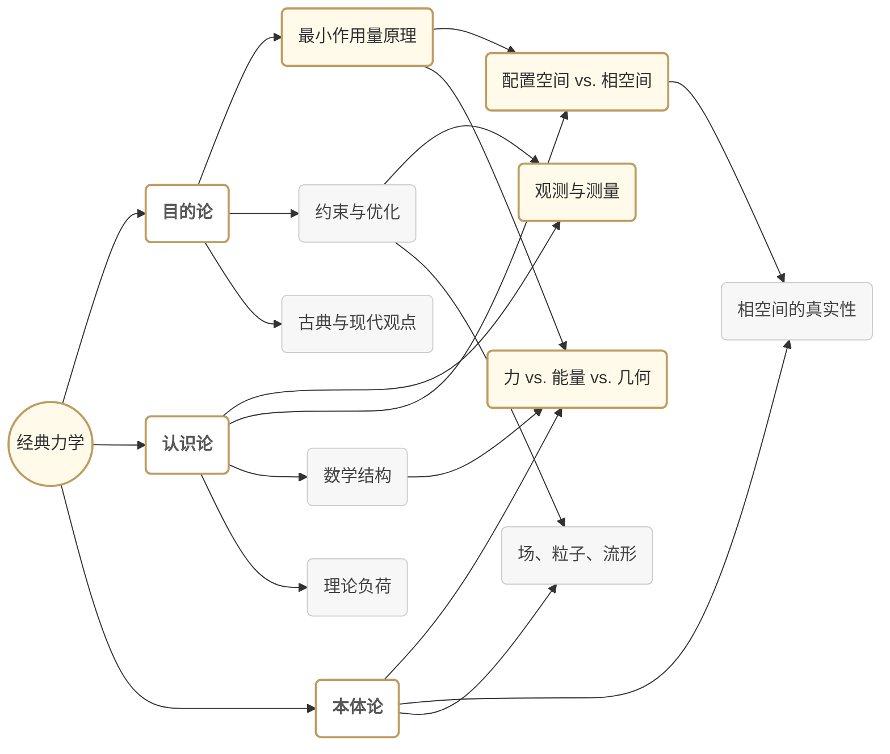

# 通过现代哲学视角重新构想经典力学
* * *

--- 只有挑战我们的框架，才能解锁运动和实在背后的更深层次真理。

# **1. 核心观点与中心概念**  
*题记：“从运动的根源到存在的边缘 —— 我们的视角改变一切。”*

通过目的论、认识论和本体论的视角来看，经典力学从单纯的数学模型集合转变为对实在结构的深刻探究。从目的论的角度，我们可能会问“为什么自然似乎在优化或最小化某些量？”从认识论的角度，我们面对的是“我们如何真正知道运动的基本原理？”从本体论的角度，我们探讨的是“机械描述中实际存在的是什么 —— 力、能量、几何，还是更基本的东西？”这些问题超越了方程式的常规范围，进入了经典力学所隐含的更深哲学领域。

经典力学的核心有几个相互交织的概念：

1. **最小作用量原理(PLA)**：通常作为产生牛顿或哈密顿方程的变分规则被引入，它也可以被视为一种潜在的目的论陈述：系统所采取的路径可能反映了自然界中某种“最优”或“极值”的设计。这究竟是一个纯粹的数学工具，还是深层次目的的证据，是关键的哲学节点。

2. **对偶视角(拉格朗日力学和哈密顿力学)**：拉格朗日力学将问题表述为配置空间中的动能-势能交换，而哈密顿力学则转向相空间 —— 动量与坐标配对。尽管两者在原则上是数学等价的，但每个视角都引导我们关注不同的概念结构(例如，配置 vs. 动量，速度 vs. 能量)。这种对偶性突显我们在捕捉运动本质时的认识论选择。

3. **配置空间与相空间**：从坐标和速度的观点(配置空间)到坐标和动量的观点(相空间)的转变不仅仅是技术上的重新表述：它改变了“状态”、“时间演化”和“观察”的意义，所有这些都具有认识论和本体论的重要性。我们是在描述事件的绝对几何，还是一个更抽象的可能性流形？

综上所述，这些主题阐明了本文档的核心论点：**看似简朴的经典力学框架隐藏着关于目的、知识和存在的根本问题**。解决这些问题不仅丰富了我们对机械定律的理解，还重新定义了它们 —— 以可能与广泛的哲学范式共鸣的方式，甚至开辟新的研究途径。通过从目的论、认识论和本体论的角度来探讨运动，我们发现经典力学站在严谨科学与深刻人类探究的交汇点上。

# 2. 重构力学的哲学基础  
*题记：“在理解为何提问‘如何’时，我们重新定义了真正支配运动的东西。”*

为了从更深的角度重构经典力学，我们必须面对它所依赖的哲学支柱。目的论、认识论和本体论 —— 各自以不同方式塑造了我们对什么是运动、为什么会发生以及我们如何声称了解它的观念。通过交织这些视角，我们揭示引导力学从亚里士多德到现代量子思想家演化的潜在线索，展示“目的”和“实在”的旧问题如何在今天的表述中持续存在。

## 2.1 目的论：从亚里士多德的目的到费曼的实用主义

在力学领域，目的论关注的是运动背后的“为什么”。历史上，亚里士多德提出自然过程倾向于达到“终点”或“目标”；他的宇宙充满了最终原因。后来的理论家，如莫佩尔蒂和欧拉，通过最小作用量原理等想法引入了某种类似“目的”的概念 —— 似乎系统自发地寻求最小或最优配置。

然而，现代的谨慎 —— 以理查德·费曼为代表 —— 提醒我们不要将有意识的“目标”归因于粒子和场。相反，数学物理学家的观点将目的论简化为一组紧凑的方程和变分陈述。最小作用是否意味着自然的设计，还是仅仅是一个强大的统一模型？在许多现代文本中，目的论的含义被软化以反映方法上的便利性：物理定律看起来是“优化”的，但这可能不过是我们数学视角的结果。
- 从严格的科学角度来看，目的论有可能将描述的优雅与实际的“目的”混淆。
- 然而，从更广泛的哲学立场来看，与有目的设计的共鸣不能轻易忽视 —— 它突显了看似“意图”与非个人形式之间的持久张力。

## 2.2 认识论：力学中的知识架构

如果目的论探索的是“为什么”，那么认识论则探讨我们是如何“知道”的。在经典力学中，我们的知识链源于经验观察、数学和我们选择的概念框架：

1. **观察作为起点**：受到牛顿定律实证成功的启发，力学始终重视可测量的现象 —— 加速度、力或能量。但是从原始数据到方程的路径铺满了关于连续性、可微性和理想实验可行性的假设。

2. **数学结构与建模**：一旦我们决定了一个方法(例如，拉格朗日 vs. 哈密顿形式)，我们就承诺了一种内部的“语言” —— 状态、变换和守恒量。这些结构强加了一定的世界观 —— 无论是基于速度的还是动量的，局部微分定律还是全局变分原则。因此，我们的认识论立场严重依赖于所选模型的内在一致性和预测能力。

3. **可靠性和理论负荷**：当数学预测与实验结果一致时，它们得到验证。然而，每个实验都是“理论负荷”的，由先前关于如何测量力、位置或时间的假设塑造。因此，即使是“经典”力学也不是中立的。我们的技术 —— 如坐标系统或运动积分 —— 依赖于更大的认识论框架：我们相信时空的连续性，实数在模拟自然界中的充分性等。

简而言之，通过承认我们对力学的知识本质上与我们施加的框架紧密相关，我们为自己打开了新的视角。从基于力的方法转变为基于作用的方法不仅是技术上的修订 —— 它是一种认识论上的重新配置，改变了我们认为交互和进化的“本质”所在。

## 2.3 本体论：机械理论中真正“存在”的是什么？

我们哲学三元组的最后一部分涉及本体论：经典力学中存在的性质或存在。最简单的情况是，早期的牛顿本体论认为宇宙是由具有明确力的粒子组成的。但分析力学的出现使这一图景复杂化：

1. **场 vs. 粒子 vs. 几何**：  
   - 在牛顿的原意中，“粒子”和“力”是真实的构成要素。  
   - 到了拉格朗日和哈密顿的时代，“能量”或“作用”可以被视为更基本的实体。  
   - 在现代几何或辛处理中，可以说流形结构本身 —— 由 $(q,p)$ 标记的点组成 —— 以更初级的方式“存在”。

2. **抽象层次**：  
   - 坐标 $(q, \dot{q})$ 或 $(q,p)$ 只是真实过程的方便标签，还是它们反映了时空更深层次的真理？  
   - 当我们谈论“相空间”时，我们指的是物理上真实的 $6N$ 维流形(对于 $N$ 个粒子)还是仅仅是为了系统化知识的数学工具？

3. **力学与实在**：  
   - 有些人将最小作用量原理解释为关于自然如何“选择”其实现路径的一个本体论上“真实”的陈述。  
   - 其他人则采取更工具性的立场，将其视为编码运动方程的一种简洁方式，而不提出任何更深层次的存在主张。

这种张力强调了重新思考力学中的“存在什么”如何导致我们重新评估经典定律本身的地位。它们可能是编织在时空结构中的基本真理，或者它们可能是由更深层次的、可能是量子或涌现的实在塑造的近似框架。

## 2.4 关于哲学基础的结语

目的论、认识论和本体论不仅仅是为一部力学论文增添智力上的装饰；它们影响着我们理论所依赖的结构。通过追溯目的论元素(目的或优化)、认识论承诺(我们如何证明知识)和本体论主张(我们相信力学根本描述的是什么)，我们为重新构想经典力学奠定了基础，使其既符合其令人敬畏的数学成功，又体现了赋予其诞生的哲学深度。

在接下来的章节中，我们将看到这个三元组一次又一次地浮现 —— 无论是分析从牛顿到拉格朗日的历史轨迹，研究相空间中的对偶性，还是探究“真正存在”于力、能量或作用的抽象背后的东西。通过拥抱这些基础问题，我们为一个复兴的、具有哲学意识的力学世界观腾出了空间，准备应对心灵和自然的复杂性。

# 3. 经典力学的哲学轨迹

## 3.1 从牛顿到分析力学  
*题记：“每一次运动的重新表述也是转变我们对自然界蓝图看法的一步。”*

经典力学由艾萨克·牛顿开创，最初围绕力驱动运动的概念成形。在牛顿的表述中，每个速度的变化都与相应的力相关联，捕捉外部影响如何“导致”物体运动的改变。这一图景几个世纪以来作为指导灯塔，使行星轨道、落体和无数机械系统的精确预测成为可能。

然而，随着物理学家探索更复杂的系统 —— 如约束运动、多粒子相互作用或旋转动力学 —— 以力为中心的方法开始显得笨拙。问题出现了：我们是否只是枚举系统中的每一个力，还是可能存在一个更统一的原则？**分析力学**应运而生，它将注意力从直接的力因果关系转移到能量平衡、对称性和约束上。两个特别有影响力的重构出现了：

1. **拉格朗日力学**：基于拉格朗日量 $L = T - V$ (动能减势能)。通过对时间内的 $L$ 积分进行极值化处理，可以推导出描述整个轨迹动态的欧拉-拉格朗日方程。这里，约束和广义坐标占据中心位置。运动不再仅仅关注“哪个力在推动？”而是更多地关于“如何平衡能量并塑造可能的路径。”

2. **哈密顿力学**：用哈密顿量 $H$ (通常对应总能量)重新定义问题。我们不再追踪力，而是强调**共轭动量**。哈密顿方程描述相空间中坐标和动量的时间演化，揭示更深的结构，如辛几何和运动积分。

从哲学角度来看，从牛顿到拉格朗日和哈密顿的进步反映了概念焦点的演变：

- **从“为什么存在力？”到“如何用一个统一原则编码所有运动？”**  
  牛顿方法引导人们解剖每一个相互作用，而分析力学则将它们整合为普遍的功能(拉格朗日量、哈密顿量)。通过这样做，它微妙地用能量或作用的整体概念取代了直接的力因果关系。

- **从“力作为最终原因”到“约束和对称性选择路径”。**  
  分析力学对约束、边界条件和能量表面的强调表明，运动的“原因”或许可以通过边界项和全局属性更好地描述，而不是局部的推拉作用。

这种转变不仅反映数学偏好，更是深层次的哲学再构想：运动定律被编码在一个抽象的功能或基于能量的蓝图中，邀请我们将机械现象视为对称性、不变量和极值原理的织锦，而不是各个独立力的分段作用。

## 3.2 作用原理、变分方法和对偶性  
*题记：“在寻找‘最短’路径的过程中，我们常常发现最深刻的对称性。”*

如果牛顿通过将运动与外部冲动联系起来奠定了基础，那么**最小作用量原理**(PLA)则将运动重新定义为所有可能路径上的普遍优化 —— 至少是驻定性的结果。这一飞跃既是优雅的统一，也为哲学辩论提供了肥沃的土壤。其核心在于：

1. **变分计算**：不是专注于每一时刻的净力，而是构想系统在初始状态和最终状态之间可能遵循的所有潜在轨迹。实际轨迹通过使作用积分 —— 大致是对时间内的 $L$ 积分 —— 达到极值来区分。这种方法巧妙地编码了约束，甚至暗示了量子类比(通过路径积分)，指向经典方程下更深的几何结构。

2. **勒让德变换**：连接**拉格朗日**和**哈密顿**力学，勒让德变换将视角从速度坐标 $\dot{q}$ 转移到动量 $p$。这种重新参数化阐明了基于能量的描述(哈密顿量)和基于轨迹的描述(拉格朗日量)之间的联系。几何上，它将切丛转换为余切丛，揭示了一种**辛结构** —— 一种优雅的 $2$-形式 $\omega$，以封闭且非退化的方式组织整个相空间。

3. **对偶性**：从 $(q,\dot{q})$ 到 $(q,p)$ 的转换强调了多重对偶性。正如位置和动量配对一样，在某些高级分析中，能量和时间也成配对。最小作用量原理因此与更广泛的哲学讨论产生共鸣：

   - **目的论潜流**：莫佩尔蒂和欧拉认为自然的“效率”或“经济性”指向更深层的设计或目的。系统的路径不仅仅通过累积瞬间的力来找到；它是从一个整体、全球的原则中浮现出来的。
   - **数学优雅 vs. 真实目的**：现代表述(如费曼的方式)通常将目的论简化为形式上的便利 —— 自然并不“瞄准”最小作用，而是遵守当以作用最小化形式表达时简洁的方程。争论持续着这种简洁性是偶然的还是指示更高的形而上学真理。

通过突出 PLA，我们看到经典思维方式如何转变为**全局**观点：局部力定律成为更深层次综合原则的一个方面。相空间的几何(辛流形)、共轭变量的配对(位置 $\sim$ 动量，能量 $\sim$ 时间)以及由变分对称性产生的运动积分(诺特定理)都指向一个跨越机械实在多个方面的对偶性织锦。

总之，**从基于力的牛顿规则到基于作用的分析力学的旅程**不仅标志着技术上的便利，而且是一种哲学觉醒。运动不再是合力的产物；它由约束、对称性和变分原理的汇合决定，这些因素揭示普遍定律的晶格结构。无论从中读出一条细长的目的论线索还是纯粹的形式结构，都是解释的问题，但不可否认的是，最小作用量原理将机械现象框定在一个更广泛、更统一的视野中 —— 其中几何和数学合作揭示了自然界最深刻的路径。

# 4. 认识论维度：知识、模型与表示

## 4.1 配置空间 vs. 相空间  
*题记：“在重构空间时，我们重塑可以提出的问题 —— 以及可能找到的答案。”*

经典力学中一个常被忽视的基本问题(从哲学角度来看)是：“我们如何选择表示系统？” 实际上，两种主要的表示方法占据主导地位，每种方法都嵌入在不同的数学结构中：

1. **配置空间(切丛视角)**  
   - 在这里，系统的状态由其广义坐标 $q$ 及其时间导数 $\dot{q}$ 描述。几何上，这一框架占据**切丛** $T\mathcal{Q}$，其中每个点对应 $(q, \dot{q})$。  
   - 这一观点奠定了**拉格朗日力学**的基础，强调速度和势能/动能。当处理坐标或运动形式的约束时，这种方法感觉自然：每个速度向量“位于”配置点 $q$ 的正上方。

2. **相空间(余切丛视角)**  
   - 在这里，我们用坐标 $q$ 及其共轭动量 $p$ 来重新描述系统的状态。该结构是**余切丛** $T^{*}\mathcal{Q}$。  
   - 这一形式主义是**哈密顿力学**的原生形式，其中动量变得与位置一样重要。辛几何在这种设置下自然出现：$\omega = \mathrm{d}q \wedge \mathrm{d}p$ 捕捉流形的基本 $2$-形式，赋予相空间特殊的几何和拓扑性质。

从认识论的角度来看，选择配置空间还是相空间不仅仅是代数上的便利。它影响了我们对因果关系、约束和守恒定律提问的方式。配置空间关注速度的局部变化(通常更适用于应用边界条件)，而相空间则引导我们进入全局几何，在那里动量、能量和运动积分变得透明。

至关重要的是，**诺特定理**通过将连续对称性与守恒定律联系起来，架起了这些视角之间的桥梁。无论我们采用拉格朗日坐标还是哈密顿坐标，诺特定理都成立，但解释可能会有微妙的不同。在配置空间中，人们可能将对称性视为 $(q,\dot{q})$ 坐标的变换；而在相空间中，同样的对称性表现为保持辛形式的正则变换。这表明“对称性”和“守恒”不仅仅是偶然现象，而是超越单一表示选择的深层次结构。

因此，每个框架以不同方式扩展或限制我们的知识。配置空间可能突显约束如何减少自由度，而相空间可以揭示全局可积性和混沌。因此，每个视角更清晰地揭示某些模式或不变量，微妙地影响我们如何构思、测量和解释机械现象。

## 4.2 边界条件、约束及非完整系统的角色  
*题记：“当摩擦介入时，纯粹性消退 —— 然而，实在知识的本质就在于此。”*

在理论上，许多机械表述始于理想化的假设 —— 无摩擦表面、刚体、完美约束。然而，实在世界的情景很少遵循如此整洁的抽象。两个显著影响我们认识论立场的相关方面是：

1. **边界条件**  
   - 在经典推导中轻描淡写提及的边界条件决定了我们如何设定初始和最终状态，以及偏导数是否(以及如何)消失(为零)。在拉格朗日力学中，我们通常固定末端配置，以便在变分原理中不出现不必要的边界项。然而，在更高级或实在的情境中(例如，自由端点、脉冲碰撞或与环境交换物质/能量的开放系统)，边界项不会简单地消失(为零)。  
   - 从认识论的角度看，指定边界条件揭示了我们认为哪些数据是“合法的”：位置、动量、能量或其他内容。这一选择突显了实验和外部相互作用在多大程度上定义了物理可观测性以及模型中的“真实”。

2. **非完整约束**  
   - 经典的“完整”约束通常可以表示为坐标的代数关系，并通过积分来减少自由度。然而，许多实际系统 —— 如无滑动滚动运动 —— 引入了依赖于速度的约束，这些约束无法整合为整齐的坐标条件。这种**非完整**约束使简化系统的维度变得复杂甚至无效。  
   - 从几何角度看，这些约束可以解释为切丛(或相空间)上的分布，禁止某些方向的运动。将这些约束视为纯粹的“认识论围栏”(我们对摩擦或滚动接触的部分理解)还是“本体论事实”(物体与表面相互作用的真实方面)部分是一种哲学立场。实际上，承认非完整约束改变了我们建模系统的方式，包括哪些变量被视为基本变量以及哪些拉格朗日量或哈密顿量仍然有效。

总之，边界条件和约束提醒我们，即使在经典领域内，力学也与观察、理想化以及实际系统的复杂性紧密交织。我们很少享有无限的自由；摩擦、滚动或与环境的相互作用阻碍了纯运动。理解这些限制不仅细化了我们的方程，还突显了测量和抽象在选择使用哪种“运动理论”中的作用。通过仔细检查边界项和高级约束，我们看到经典力学不是静态的普遍真理体系，而是现象如何通过人类概念、实验能力以及日常物质固有的不可约复杂性被分割的反映 —— 有时是近似的，有时是精确的。

# 5. 本体论视角：经典力学中存在什么？

## 5.1 力、能量或几何？  
*题记：“质疑什么是真实，就是在检验力学语言本身的基础。”*

尽管经典力学看似清晰和精确，但它仍然可能掩盖其理论宇宙中真正“存在”的问题。传统上，牛顿力学认为物理“实体” —— 具有质量的粒子 —— 在力的作用下运动。然而，当我们从牛顿的推拉概念转向分析形式时，出现了替代的本体论框架：

1. **以力为中心的实在(牛顿观点)**  
   - 在这里，基本本体论包括离散的粒子及其作用在其上的力。力被认为是可测量且定义明确的，是瞬间改变动量的原因。这种观点与一种几乎“接触”为基础的实在概念一致：物体和场是不同的、空间上明确定义的实体，它们相互推拉。

2. **基于能量的实在(分析力学)**  
   - 拉格朗日和哈密顿表述表明，“能量”(动能、势能、总能量)可能比力更具本体论上的基础性。与其枚举每一个力，我们关注一个全局函数 —— 如哈密顿量 —— 它决定状态如何随时间演化。在这种意义上，能量成为统一的线索；力可以被解释为势能或动量流的偏导数。在这个图景中，实在围绕着能量的连续转换和守恒，减少了直接“因果关系”的角色，而倾向于微分约束和边界条件。

3. **几何或结构实在(现代辛几何观点)**  
   - 哈密顿力学还引入辛流形，实际上是一个编码所有可能状态 $(q, p)$ 的结构化相空间。相空间中的形式 $\omega = \mathrm{d}q \wedge \mathrm{d}p$ 蕴含一个深刻的几何原理，将整个动力学统一到一个单一的流形中，其中正则变换保持辛结构。  
   - 一些哲学家和数学家认为，这种几何流形本身就是“存在”的最真实表示。力和能量成为更深层次、更抽象几何中的涌现属性。在这里，实在不是空间中的“物质”运动，而是根据辛定律在高维流形上流动的点(或分布)。

在决定这些观点之间的选择时，我们必须面对实在是否更多依赖于有形的相互作用(牛顿力)、整体不变量(能量)或超越特定坐标选择的抽象几何。没有一种立场普遍占优：每种不仅提供了自己的预测，还框定了“存在”的内容 —— 粒子、能量通量或运动的结构拓扑。最终，选择可能反映了关于离散性与连续性、局部行为与全局原则以及力的根本作用(或非作用)的深层哲学偏好。通过揭示这些偏见，可以看到方法的变化如何转变机械现象的整个解释框架。

## 5.2 目的论调与物理实用主义  
*题记：“在目的与实用主义之间的张力中，我们瞥见了自然的诗意与精确。”*

最小作用量原理长期以来诱使解释者赋予力学以目的论意义。莫佩尔蒂、欧拉等人主张自然“选择”最小化作用的路径 —— 召唤出一种近乎有意的优雅。然而，现代科学常常对无生命系统的导向性建议感到不满：

1. **古典目的论：**  
   - 最小作用量原理的历史陈述有时带有准神学色彩：即上帝或自然本身“偏好”运动中的经济性。如果宇宙体现完美，最小作用量只是这种内在和谐的反映。  
   - 在这种传统的解读中，系统“旨在”减少或优化某个量 —— 作用量 —— 赋予运动定律一种隐含的方向感或最终原因。

2. **当代模型视角：**  
   - 物理学家如费曼将这种目的论调重新解释为数学建模的人工产物。他著名的名言：“粒子不知道它要去哪里”。相反，人们可以通过从局部力平衡(牛顿)或全局泛函最小值(拉格朗日/哈密顿)两种方式来获得相同的经典方程。换句话说，形式上的优雅是一种统一的便利，而不是内在目的的证据。  
   - 许多现代分析认为，“最优路径”自然地从解决约束下的微分方程中出现。变分计算极其强大 —— 但不需要任何拟人化或宇宙善意。它只是组织运动方程的语言，使其成为一个紧凑、全局一致的原则。

3. **量子与涌现现象：**  
   - 目的论或纯粹实用主义解释之间的辩论继续存在于量子背景下，其中路径积分涵盖无限可能的轨迹。虽然经典力学从“附近”路径的构造干涉中出现(驻定相近似)，但在经典极限中，这一原理看起来可疑地具有目的论色彩。  
   - 在涌现系统 —— 从自我组织的生物过程到某些凝聚态 —— “最小作用量”或“最小能量”解似乎被系统“寻求”。然而，更深层次的解释通常在于选择压力、稳定性标准或相动态的必然性，而非有意的目的。

因此，最小作用量陈述是否回响隐藏的目的论或展示了复杂的数学框架仍然是一个开放的哲学问题。它捕捉了自然优雅的诗意或直观解读与科学坚持中立、可测试模型之间反复出现的紧张关系。通过承认这两种角度，我们可以看到相同的方程如何引发不同的存在结论。经典力学能够同时激发强大的工程成就、美学欣赏和神学推测，这证明了它在人类试图解码运动的深层逻辑或精神方面持久的吸引力。

# 6. 从哲学视角重构经典力学

## 6.1 提出的理论重构  
*题记：“当我们重新构想核心定义时，我们重塑整个机械理论的地平线。”*

在探讨了目的论、认识论和本体论这三者之后，我们发现自己处于一个可以问这样一个问题的位置：如果我们明确地将这些哲学线索编织到其基础中，经典力学会是什么样子？不再将目的论视为禁忌或仅仅是历史上的好奇心，或将认识论视为方程后的思考，或将本体论视为物理定律的脚注，我们可以提出一种重构，在这种重构中，这些视角被视为基本的、生成性的力量。

1. **牛顿、拉格朗日和哈密顿的综合**  
   - 不再将牛顿力学、拉格朗日力学和哈密顿力学视为完全独立的形式，而是视它们为同一潜在实在的不同互补窗口。目的论观点可以突出全局作用原理。认识论视角可以更清晰地提出我们如何“知道”或测量状态的问题 —— 无论是力、能量还是相空间点。本体论方法弥合了关于什么是真正“存在”的争论，从离散力到能量流再到几何结构。  
   - 在单一的、具有哲学意识的架构中重构这些形式主义，使教师和研究人员能够在不同的机械视角之间灵活转换。例如，最小作用量原理不必被简化为纯粹的计算捷径；它可以保留一个“为什么”的维度，丰富描述和洞察。

2. **澄清参考标架与寻求终极定律**  
   - 这种整体立场的一个哲学优势是认识到“终极定律”可能不是最终目标。经典力学可以被重新构想为一个不断发展的强大模块化模型网络 —— 每个模型在某些领域内有效，每个提供部分真理，共同映射到物理实在中。  
   - 寻找更深层次、更全面的“万有理论”的猫鼠游戏仍然开放，但重构对话帮助我们将力学视为一个灵活的动态框架。我们接受这样的观念，即我们采用的观点(基于力的、基于能量的或基于几何的)与我们提出的问题类型、我们可以收集的实验数据以及我们的概念目标密不可分。

3. **对教学和研究的影响**  
   - 强调目的论、认识论和本体论可以帮助教育工作者培养对力学的广泛理解，而不仅仅是解决问题。学生不仅学习方程，还了解选择某些形式主义背后的理由、每个假设的哲学利害关系以及这些假设如何影响实际应用。  
   - 对于研究人员，这种哲学意识在跨学科背景下熠熠生辉：分析复杂系统、桥接量子或统计力学或解决涌现的自组织现象。每个领域都受益于质疑“什么是真实”、“我们如何知道”以及“自然为何会选择某些最优或受限路径”的能力。

通过在一个统一的哲学框架内“混搭”牛顿、拉格朗日和哈密顿，我们发现了新的视角。最小作用量原理中的目的论暗示不应被草率地抛弃，而应作为概念工具置于括号中，开放解释但强有力地统一。同样，承认我们的认识过程决定了我们测量哪些变量 —— 且这些测量反馈到我们的机械模型中 —— 促进了谦逊和创造力的平衡发展。

## 6.2 实践和概念影响  
*题记：“面对知识的边界，我们将力学重写为心灵与物质之间的对话。”*

经典力学的重新哲学构建不仅仅改进了讲义；它改变了我们应对尖端科学和工程挑战的方式。通过将目的论、认识论和本体论编织在一起，我们发现了一系列新的或重新构想的可能性：

1. **新的几何见解和计算方法**  
   - 当我们不将几何视为计算上的便利，而是视为带有本体论视角时，新颖的计算算法可能会出现 —— 特别是在机器人学、控制理论或高维优化中。如果我们将约束或对称性视为真正的“存在”，我们可能会优先考虑保持结构的算法(例如，辛积分器)，这些算法本质上尊重相空间的几何特性。  
   - 在机器学习和人工智能领域的研究人员可以从将机械模型视为平台中受益，这些平台用于解释“作用最小化”如何推广，从而在经典建模和数据驱动方法之间产生新的协同效应。

2. **桥接到复杂系统和控制理论**  
   - 在机器人学或先进的控制系统中，目的论框架 —— 系统行为“仿佛”它们试图优化或驻定某些函数 —— 可以为更全面的设计策略提供信息。与其通过局部反馈强制解决方案，我们可以设计鼓励涌现的系统级行为的约束或能量景观。  
   - 同样，承认认识论约束的层叠(传感器限制、计算近似)有助于构建与系统的深层几何或能量学对齐的稳健、容错解决方案。

3. **量子跃迁和后经典理论**  
   - 将经典力学视为更广泛织锦的一部分的哲学立场鼓励我们将量子力学视为并非一组不相关的规则，而是保留某些经典原则(例如，路径积分中的最小作用量)的扩展或继任者，尽管具有概率性细微差别。  
   - 这一视角也为桥接涌现现象 —— 如凝聚态相或生物自组织 —— 与经典基础铺平了道路，揭示了经典几何或目的论类比在量子或复杂适应性领域内的持续存在。

4. **开放问题和新创新**  
   - 关注目的论，我们不可避免地遇到更大的问题：为什么宇宙会展现出稳定的定律或明显的潜在最优性？虽然这种探究通常超出了物理学的典型范围，但它可以在理论宇宙学、科学哲学甚至 AI 驱动的研究议程中激发概念突破。  
   - 认识论框架与测量装置之间的相互作用可以激发新的实验设计，特别是在引力波探测、高精度卫星编队或微机电系统等领域。认识到测量以微妙方式塑造“什么是真实”可以同时改进实验和理论。

因此，力学的哲学重新审视不仅仅是一个学术练习：它为那些旨在突破技术、理论框架和跨学科创新边界的人员提供了具体的、实用的好处。通过将经典力学视为心灵与物质之间的对话 —— 而不是静态的教条法则集合 —— 我们始终保持开放的态度，迎接一直推动科学进步的创造性流动。通过注入目的论的细微差别、敏锐的认识论反思和扩大的本体论感，经典力学可以继续进化，正如几个世纪以来一样，以应对理解和发明的持续挑战。

# 7. 结论与未来方向  
*题记：“在看到比公式更深的内容时，我们发现宇宙的舞蹈比我们想象的更简单也更神秘。”*

到目前为止，我们通过目的论、认识论和本体论这三个基础支柱，用现代哲学视角重新审视了经典力学。这一探索表明，尽管方程和计算是不可或缺的，但它们并不能穷尽机械理论的丰富性。实际上，通过探讨潜在动机(目的论)、知识框架(认识论)以及关于“存在”的观点(本体论)，我们发现经典力学不仅是工程师和物理学家的工具集，而且是一个物理学与人类好奇心中的深层问题相交汇的活生生的对话。

1. **重申我们的核心哲学目标**  
   - 在目的论上，我们探讨了最小或极值原理(如最小作用量原理)如何引发自然界中“目的”的问题 —— 即使现代物理学倾向于将这些原理解释为优雅的数学形式而非字面上的目标或终点。  
   - 在认识论上，我们看到表示的选择(配置空间 vs. 相空间)和约束的处理揭示了测量、假设和理论构造以微妙且基础的方式塑造我们观察到的实在。  
   - 在本体论上，从基于力的力学向基于能量或几何描述的演变辩论突显了我们如何不断细化对“什么是真实”的看法，远离关于空旷空间中作用力的静态教条，转而支持更具结构性或关系性的解释。

2. **呼吁更深入的研究和反思**  
   - **对于教师**：结合这些哲学线索可以丰富课堂讨论。与其将牛顿定律或哈密顿形式主义视为“已定科学”，教育者可以通过展示每个方程背后都有一个跨越几个世纪的关于自然为何遵循这些定律以及我们如何解释这些定律的对话来激发学生的好奇心。  
   - **对于研究人员**：反思目的论、认识论和本体论开辟了跨学科研究的新途径 —— 从控制理论到量子基础，从宇宙学到计算建模。认识到我们的框架源于特定的哲学承诺揭示了算法设计、实验设置或理论扩展中的创造性新方向。  
   - **对于科学和哲学的学生**：严谨性和反思的结合培养了一种不仅擅长解决问题而且对解决方案的深层意义持开放态度的心态。这种开放性可能会带来纯粹公式化方法可能错过的突破。

3. **迈向创造性的科学进步**  
   - 通过将焦点从纯粹的过程操作转移到有思想、具有哲学意识的研究，我们利用了既有的数学的“硬”力量和概念探究中得出的“软”洞察。这种对偶能力帮助我们将力学适应新兴领域，如机器人集群、复杂自适应系统和神经形态计算架构 —— 在这些领域，结构、功能和目的的相互作用往往处于中心位置。  
   - 最终，这种方法不仅仅是改进现有知识；它可以为尚未构想的整个范式奠定基础。在以新的审视重新评估基本概念时，我们为可能重新定义物理学、工程学甚至我们对实在的哲学理解的激进创新留下了空间。

在总结中，我们对经典力学的看法 —— 不再仅仅是一个公式的群岛 —— 仍然与关于目的、有限知识和世界实质的大问题不可分割。当我们继续完善我们的理论并在技术中发挥其力量时，我们也应保持最初吸引人类仰望星空并问“为什么天体会如此运动？”的哲学好奇精神。前方的道路邀请我们不断挑战我们的框架，并在此过程中解锁关于运动、物质和心灵的更深层次的真理。

# 附录 A：概念综合

下面是一个概念图，展示关键哲学视角 —— 目的论、认识论和本体论 —— 如何影响文档的主要主题。该图还强调了这些主题如何与核心机械构造如力、能量和几何相互交织。

**阅读图示**：

1. 主节点“经典力学”(A)锚定了整个讨论。  
2. 三个主要主题 —— 目的论、认识论和本体论 —— 分支出来，代表了文档中探讨的基本哲学立场。  
3. 在每个主题下，图表列出了文本中讨论的核心思想或代表性概念：  
   - 目的论(B1)连接到最小作用量原理(C1)和古典与现代解释的线索(C3)。  
   - 认识论(B2)探讨了我们如何观测和测量(D1)，进而引出配置空间与相空间的选择(D2)。  
   - 本体论(B3)提出了力学中真正“存在”的问题(E1)，无论是力、能量还是更深层次的几何结构(E3)。  
4. 交叉链接展示了这些主题如何相互启发、相互促进的：例如，最小作用量原理(C1)与状态表示(D2)和力与能量的辩论(E1)相关联。  
5. 这样，图示直观地描绘了目的论问题、认识论框架和本体论断言在经典力学中的相互关联性质。

通过将此图示作为指南，读者可以将每个概念置于文档更广泛的哲学背景中，快速掌握目的论、认识论和本体论如何相互锁定，从而丰富我们对牛顿力学和分析力学的理解。

