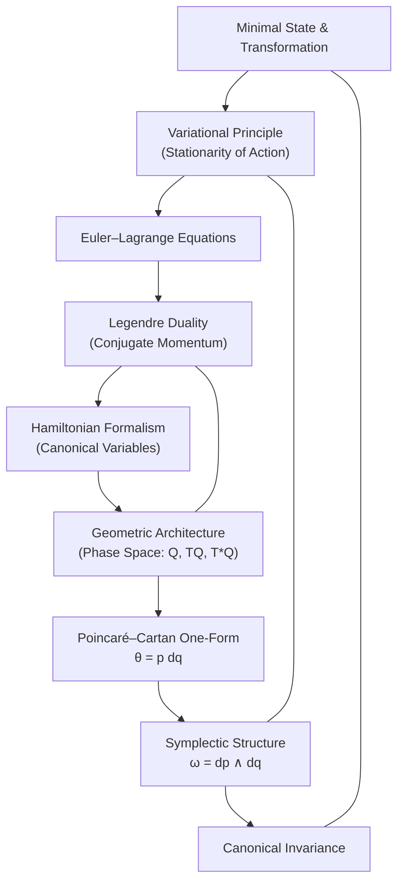

# Reconstructing Classical Mechanics: A Fundamental Reimagining
* * *

--- Simplicity in Foundations, Universality in Motion.

# **I. Introduction**  
**Epigraph:**  
*"The universe speaks in the language of simplicity; to hear it, we must first unlearn the superfluous."*

Classical mechanics, in its conventional guise, is often presented through the well-established yet multifaceted formulations of Newtonian, Lagrangian, and Hamiltonian theories. Each of these approaches has contributed immensely to our understanding of motion and dynamics. However, beneath their empirical successes lies a layered structure—one that, when stripped to its bare essentials, reveals a far more elegant and universal foundation.

## I.1. A Review of Standard Approaches

**Newtonian Mechanics:**  
At the most familiar level, classical mechanics is introduced via Newton's laws of motion. Here, the dynamics of a system are governed by the relation  
$$
F = m\,a,
$$  
with forces directly causing accelerations. Although this formulation effectively describes everyday phenomena, it is largely kinematic and largely language of forces, which in many complex scenarios can obscure deeper underlying symmetries.

**Lagrangian Mechanics:**  
In contrast, Lagrangian mechanics recasts dynamics through the principle of least action. The evolution of a system is encapsulated in the action functional  
$$
S[q(t)] = \int_{t_1}^{t_2} L(q, \dot{q}, t)\,dt,
$$  
with the stationarity condition ($\delta S = 0$) leading directly to the Euler–Lagrange equations. This variational method shifts the emphasis from forces to energy differences and boundary contributions, hinting at a richer geometric structure. Yet, much of the elegance remains hidden beneath layers of historical derivations and technical details.

**Hamiltonian Mechanics:**  
Hamiltonian mechanics further elevates this framework by introducing a dual description in phase space. Through the Legendre transform, the Hamiltonian  
$$
H(q, p, t) = p\,\dot{q} - L(q, \dot{q}, t)
$$  
arises, highlighting the interplay between configuration variables $q$ and their conjugate momenta $p$. This formalism not only encapsulates conservation laws in an invariant manner but also brings to the fore the symplectic structure of phase space—a geometry that remains robust under canonical transformations.

## I.2. The Need for a Fundamentally Reimagined Framework

Despite the successes of these traditional formulations, they are built upon centuries of incremental development. In doing so, many “accidental” details have accumulated, occasionally obscuring the core principles that govern the dynamics of physical systems. What if—stripping away all historical trappings—we could reassemble classical mechanics from the ground up using only the most basic, transcendent ideas from modern mathematics and physics?

Our project aims to do exactly this. We start by questioning the very notion of a “state” and its transformation, setting aside the conventional labels of position and velocity in favor of an invariant description that is directly tied to nature’s symmetries. We then build a framework where the optimality principle—expressed as the stationarity of a suitably defined action ($\delta S = 0$)—serves as the central axiom from which dynamics emerge. Through the Legendre transform, we uncover a fundamental duality between what is traditionally known as configuration space and momentum space, thereby unifying them into a single geometric object.

## I.3. Modern Mathematical Intuition

Our reexamination will be underpinned by modern mathematical tools:  
- **Differential Geometry:** Which provides a coordinate-free language to describe the evolution of systems on smooth manifolds.  
- **Variational Analysis:** Offering deep insights into how optimal paths arise naturally as solutions to $\delta S = 0$, beyond standard computational techniques.  
- **Symmetry Groups:** Whose invariances not only clarify conservation laws but also reveal hidden geometric structures, such as those expressed in symplectic forms.

These modern viewpoints reveal that what we conventionally consider as separate formulations—Newtonian, Lagrangian, and Hamiltonian mechanics—are in fact different manifestations of a single, coherent conceptual framework. By reimagining classical mechanics from its most elemental constituents, we aspire to unearth the simplicity that has always been at its core.

## I.4. Setting the Stage

This document is organized as a layered journey, beginning with the formulation of minimal states and invariant transformations, progressing through the variational principle and its dual reformulation, and culminating in a comprehensive geometric architecture of phase space and symplectic structure. Each chapter builds upon the previous one, with the ultimate goal of reconstructing classical mechanics in a form that is both fundamentally simple and universally applicable.

In the chapters that follow, we will peel away the historical layers, distilling classical mechanics to its essence and exposing not only its profound beauty but also its potential to inspire new directions in both theoretical and applied physics. This reimagined framework is intended to serve as a springboard for deep inquiry and innovation, inviting us to explore realms of motion and dynamics with renewed clarity and purpose.

# **II. Foundational Primitives: Minimal States and Transformations**  
**Epigraph:**  
*"From the void of complexity, simplicity emerges as the true essence of being."*

In our quest to reconstruct classical mechanics from its most fundamental roots, we begin by asking: What is the simplest description of a physical system? To answer this, we introduce the notion of a **state** and the **transformations** that act upon it, unburdened by extraneous coordinate dependence.

## II.1. Abstract Definition of a State

A **state** can be understood as the most elementary carrier of all information about a system at a given moment—an idealized snapshot that encompasses the essential properties of the system. In our framework, we define a state as an element of an abstract set $\mathcal{S}$, endowed with the minimal structure necessary to capture its physical nature. Unlike traditional views that rely on specific coordinates or even spatial positions, our notion of a state is entirely **coordinate-invariant**. In other words, if $s \in \mathcal{S}$ represents a state, then its definition does not depend on any particular embedding in a coordinate space.

Mathematically, one may envision the state space as a manifold equipped with a minimal but sufficient structure for dynamics. For example, rather than beginning with a coordinate chart, we simply assume that there exists an abstract manifold $\mathcal{M}$ such that each physical state corresponds to a point in $\mathcal{M}$. The inherent quality of such a state is its universality—it encapsulates the minimal information needed to describe the system irrespective of the observer or coordinate system.

## II.2. Invariant Transformations as the Language of Change

Having defined a state in its most minimal form, the next step is to formalize how states evolve or how one state relates to another. These relationships are captured by **transformations**, which are mappings between states that preserve the intrinsic structure of the state space. We denote a transformation by a mapping  
$$
T: \mathcal{S} \to \mathcal{S}.
$$

The fundamental idea here is that transformations encode the change or evolution of states while respecting the underlying invariants. In our abstract formulation, these transformations are not arbitrary; they belong to a family of **invariance groups** that preserve the essential properties of the state space. For instance, if a transformation $T$ preserves the intrinsic distance, order, or any other structural feature defined on $\mathcal{M}$, then we say that
$$
T(s) \quad \text{has the same intrinsic structure as} \quad s,
$$
for every $s \in \mathcal{S}$.

These invariant transformations form the language through which nature communicates changes. They play an analogous role to symmetries in modern physics, where the invariance under a particular group (e.g., a Lie group) is directly linked to a conservation law. For example, invariance under time translations leads to energy conservation, while spatial translation invariance gives rise to momentum conservation. In our primordial language, the emphasis is not on the specific conserved quantity but on the simple fact that nature evolves in a way that preserves a set of fundamental, underlying structures.

## II.3. Inherent Symmetry Principles as Structural Pillars

Embedded within both the definition of a state and its transformations are the **symmetry principles** that are central to all of physics. These principles, by their very nature, are independent of any coordinate representation. A symmetry in this context is an automorphism of the state space:
$$
\Phi: \mathcal{S} \to \mathcal{S}
$$
that leaves the structural characteristics of every state invariant. Such an automorphism can be thought of as a distilled expression of a conservation law—a manifestation of the idea that the dynamics of a system do not alter its essential properties.

From the minimal state $s$ and the set of transformations $T$ that act upon it, we derive an entire hierarchy of concepts. For instance, when these transformations satisfy group properties—closure, associativity, existence of an identity element, and inverses—they form a symmetry group $G$. This group structure is not an artificial imposition but a natural consequence of the invariant way in which states interact and evolve.

## II.4. Interconnections and the Seeds of Further Structure

The foundational primitives introduced here—the abstract state and its invariant transformations—are not isolated ideas. Rather, they act as the seeds from which later, more elaborate structures naturally grow. The variational formulation of classical mechanics, which will be developed in subsequent sections, arises from considering how these minimal states change optimally. The duality between different descriptions of the state (such as configuration versus momentum) and the resulting geometric structure of phase space (with its inherent symplectic form) all trace back to the fundamental notions delineated here.

By beginning with a view of states that is stripped to its minimal, coordinate-free essence, and by defining the transformations that preserve this minimal structure, we uncover the inherent simplicity that underlies all of dynamics. This approach not only offers a more transparent understanding of classical mechanics but also opens the door to new ways of thinking about established concepts, inviting us to see the old in a refreshing, fundamentally reimagined light.

In the following chapters, we will build upon these primitives, gradually developing a full-fledged framework for classical mechanics that is both deeply insightful and flexible enough to inspire new theoretical avenues.

# **III. Dynamics Arising from Optimality: The Variational Principle**  
**Epigraph:**  
*"Nature favors the path of least resistance—not by chance, but by design."*

In classical mechanics, the evolution of any system is profoundly dictated by the principle of optimality. Rather than specifying forces directly, we assert that the true path taken by nature is one of stationarity relative to a specific quantity—the action. This fundamental concept is encapsulated in the variational principle, which dictates that the actual trajectory of a system is such that the variation of an appropriately defined action functional vanishes.

## III.1. The Action Functional

We begin by defining the action functional $S[q(t)]$ associated with a system that evolves along a path $q(t)$ between two instants $t_1$ and $t_2$. The action is given by
$$
S[q(t)] = \int_{t_1}^{t_2} L(q, \dot{q}, t) \, dt,
$$
where $L(q, \dot{q}, t)$ is the Lagrangian function of the system, representing the difference between the kinetic and potential energies (or more generally, the quantity whose stationary value encapsulates the correct dynamics). The Lagrangian is assumed to be a smooth function of its arguments, ensuring that the action is well-defined over sufficiently smooth paths $q(t)$.

## III.2. Derivation of the Euler–Lagrange Equations

To uncover the dynamics encoded within $S[q(t)]$, we consider an arbitrary infinitesimal variation $q(t) \rightarrow q(t) + \delta q(t)$ that leaves the endpoints fixed, namely,
$$
\delta q(t_1) = \delta q(t_2) = 0.
$$

The corresponding variation of the action is
$$
\delta S = \delta \int_{t_1}^{t_2} L(q, \dot{q}, t) \, dt = \int_{t_1}^{t_2} \left( \frac{\partial L}{\partial q}\, \delta q + \frac{\partial L}{\partial \dot{q}} \, \delta \dot{q} \right) dt.
$$

Recognizing that $\delta \dot{q} = \frac{d}{dt} (\delta q)$, this expression becomes
$$
\delta S = \int_{t_1}^{t_2} \left( \frac{\partial L}{\partial q}\, \delta q + \frac{\partial L}{\partial \dot{q}}\, \frac{d}{dt} (\delta q) \right) dt.
$$

To make further progress, we integrate the term containing $\delta \dot{q}$ by parts:
$$
\int_{t_1}^{t_2} \frac{\partial L}{\partial \dot{q}}\, \frac{d}{dt} (\delta q) \, dt = \left. \frac{\partial L}{\partial \dot{q}}\, \delta q \right|_{t_1}^{t_2} - \int_{t_1}^{t_2} \frac{d}{dt} \left( \frac{\partial L}{\partial \dot{q}} \right) \delta q \, dt.
$$

Because the variations vanish at the endpoints, the boundary term $\left. \frac{\partial L}{\partial \dot{q}}\, \delta q \right|_{t_1}^{t_2}$ is zero. Thus, the variation of the action reduces to
$$
\delta S = \int_{t_1}^{t_2} \left[ \frac{\partial L}{\partial q} - \frac{d}{dt} \left( \frac{\partial L}{\partial \dot{q}} \right) \right] \delta q \, dt.
$$

For the action $S$ to be stationary under arbitrary variations $\delta q(t)$, the integrand must vanish identically. This requirement yields the celebrated **Euler–Lagrange equation**:
$$
\frac{d}{dt} \left( \frac{\partial L}{\partial \dot{q}} \right) - \frac{\partial L}{\partial q} = 0.
$$

This differential equation provides a complete description of the system's dynamics solely from the principle of stationarity.

## III.3. Discussion of Boundary Terms and Their Implications

While our derivation assumed fixed endpoints (thereby nullifying the boundary term), a deeper inspection reveals that boundary contributions carry significant physical meaning when the endpoints are allowed to vary. In such cases, the boundary term
$$
\left. \frac{\partial L}{\partial \dot{q}}\, \delta q \right|_{t_1}^{t_2}
$$
cannot be dismissed trivially. This term is intimately connected with the notion of canonical momenta. Indeed, by defining the momentum conjugate to $q$ as
$$
p = \frac{\partial L}{\partial \dot{q}},
$$
the boundary contribution effectively encodes how a variation in the state at the boundaries influences the system's evolution. Consequently, the term $p\, \delta q$ can be seen as a precursor to introducing the geometric structures (such as the Poincaré–Cartan one-form) that will be elaborated upon in subsequent chapters. Even in scenarios where the endpoints are fixed, acknowledging the potential significance of boundary terms enriches our understanding of conservation laws and symmetries in the overall framework.

## III.4. The Essence of Variational Optimality

At its heart, the variational principle embodies the idea that the path taken by a system is one that renders the action stationary. This requirement of optimality—whether it manifests as a strict minimum, a maximum, or a saddle point—is not an artifact of mathematical convenience. Rather, it is a profound statement about the intrinsic nature of physical processes. By evolving along a path of stationary action, a system effectively "chooses" the most efficient way to transition between states, reflecting a deep-seated property of nature itself.

This perspective not only streamlines the derivation of motion equations but also provides a unifying principle that underlies both classical and quantum formulations of mechanics. The optimization inherent in the action principle hints at a universality in the behavior of physical systems—one that is ultimately tied to the symmetry and invariance properties of the underlying space in which they evolve.

## III.5. Transition to Dual Approaches

The variational formulation, with its emphasis on the stationarity of the action, forms the cornerstone of classical mechanics. It reveals the mechanism by which state evolution is determined without resorting to external forces. Moreover, this approach paves the way for a dual description of dynamics through the Legendre transform—a topic we will explore in detail in the next chapter. By transitioning from the Euler–Lagrange equations to Hamiltonian dynamics, we uncover an intricate duality between configuration and momentum variables, ultimately enriching our geometric understanding of the mechanics of motion.

## III.6. Conclusion

In summary, by demanding that the action $S[q(t)] = \int_{t_1}^{t_2} L(q, \dot{q}, t)\,dt$ remains stationary under infinitesimal variations, we derive the Euler–Lagrange equations, which dictate the natural evolution of the system. This variational principle is not a mere tool for obtaining equations of motion—it is a statement about the optimality underpinning the fabric of nature. It reveals that the dynamics of a system are governed by an intrinsic drive to follow the path of stationary action, a concept that resonates deeply with the modern, geometrically inspired view of classical mechanics.

# **IV. From Variational Calculus to Duality: Legendre Transform and Beyond**  
**Epigraph:**  
*"In every transformation, a dual truth is hidden, waiting to be unveiled."*

Building on the variational foundation, we now shift our focus to how the dynamics inferred from stationarity of the action can be recast in an equivalent—but profoundly dual—formulation. This dual picture emerges naturally through the **Legendre transform**, which bridges the Euler–Lagrange (variational) description with the Hamiltonian framework.

## IV.1. The Legendre Transform: Definition and Derivation

Consider a system described by the Lagrangian  
$$
L(q, \dot{q}, t),
$$  
where $q$ denotes the configuration variables and $\dot{q}$ their time derivatives. From the variational principle we derived the Euler–Lagrange equations; however, these equations are expressed in terms of both $q$ and $\dot{q}$. To set up a dual formulation, we define the conjugate momentum $p$ by  
$$
p = \frac{\partial L}{\partial \dot{q}}.
$$

Assuming the regularity condition—that is, the Hessian  
$$
\frac{\partial^2 L}{\partial \dot{q}^2}
$$  
is nondegenerate—we can invert this relationship to express $\dot{q}$ in terms of $q$ and $p$. The Legendre transform then introduces the Hamiltonian $H(q, p, t)$ as follows:  
$$
H(q, p, t) = p \dot{q} - L(q, \dot{q}, t),
$$  
where $\dot{q} = \dot{q}(q, p, t)$ is understood as a function obtained from inverting the momentum relation.

## IV.2. Unveiling Duality: Configuration Space vs. Momentum Space

The transformation encoded by the Legendre transform unveils a deep duality between two seemingly distinct realms:

- **Configuration Space ($Q$) and Tangent Bundle ($TQ$):**  
  In the Lagrangian formulation, the state of the system is described by $(q, \dot{q})$, residing in the tangent bundle $TQ$. Although $q$ conveys the position, $\dot{q}$ provides the rate of change—together forming a complete picture of the dynamical state.

- **Momentum Space and Cotangent Bundle ($T^*Q$):**  
  Upon performing the Legendre transform, the natural variables become $(q, p)$, which reside in the cotangent bundle $T^*Q$. Here, $p$ represents the conjugate momentum. This shift encapsulates how the same physical information is repackaged: instead of tracking velocities $\dot{q}$, we follow momenta $p$.  

This duality is profound; it is not simply a change of variables but rather a transformation that reveals the hidden geometric structure of classical mechanics. The Euler–Lagrange formalism and the Hamiltonian formalism are two faces of the same coin, related through this transformative mapping. In essence, the Legendre transform exposes the intrinsic symmetry between $q$ and $p$ that underlies the dynamics.

## IV.3. Complementary Roles of the Euler–Lagrange and Hamiltonian Formalisms

The Euler–Lagrange equations, derived from the principle of stationary action, provide a powerful method for obtaining the equations of motion directly from the Lagrangian. They encapsulate the dynamics in a coordinate-dependent way through the relation:  
$$
\frac{d}{dt} \left( \frac{\partial L}{\partial \dot{q}} \right) - \frac{\partial L}{\partial q} = 0.
$$

On the other hand, the Hamiltonian formulation—obtained after the Legendre transform—recasts the dynamics in terms of the evolution of $q$ and its conjugate momentum $p$. Hamilton’s equations are expressed as:  
$$
\dot{q} = \frac{\partial H}{\partial p}, \qquad \dot{p} = -\frac{\partial H}{\partial q}.
$$

This dual description is not merely a mathematical curiosity; it provides significant advantages:
- **Geometric Clarity:** The Hamiltonian formulation naturally gives rise to a symplectic structure on $T^*Q$, where the invariant symplectic form $\omega = dp \wedge dq$ underpins the evolution and conservation laws.
- **Invariance and Canonical Transformations:** The framework is ideally suited to discuss canonical transformations, which are changes of variables in $T^*Q$ that preserve the symplectic geometry and thus the fundamental structure of the theory.
- **Extension to Quantum Mechanics and Field Theory:** The dual formalism and its geometric interpretation serve as essential stepping stones for the transition to quantum mechanics (via canonical quantization) and further extensions to field theories.

Thus, while the Euler–Lagrange approach emphasizes the variational origin of dynamics, the Hamiltonian perspective illuminates the deep geometric duality of the theory.

## IV.4. Beyond the Transform: Implications of Duality

The Legendre transform not only provides an alternative description of mechanics but also hints at a richer conceptual framework:
- **Invariant Structures:** The duality between $q$ and $p$ suggests that the fundamental laws of motion are independent of the particular representation chosen. This invariance underlies the construction of conservation laws and symmetries.
- **Unified Description:** From the variational principle to the Hamiltonian formulation, the dynamics of a system are unified under a common principle of optimality and invariance. Even as one moves between different representations, the underlying physical content remains unchanged.
- **Gateway to Modern Geometry:** The mapping from $TQ$ to $T^*Q$ heralds the entrance to modern symplectic geometry—a realm in which the evolution of physical systems is encoded in invariant geometric structures that persist under transformations.

## IV.5. Concluding Remarks on Duality

In summary, the Legendre transform acts as the portal through which the dual nature of classical mechanics is revealed. It connects the variational, Euler–Lagrange description with the dual, Hamiltonian picture, unifying the dynamics on configuration and momentum spaces. This transformation is not just a change of mathematical formalism; it is a profound insight into the structure of the theory itself—one that speaks to the universality and invariance of the laws governing nature.

By embracing this duality, we not only gain a deeper understanding of classical mechanics but also set the stage for exploring further geometric and theoretical developments. In the chapters that follow, this dual perspective will serve as the foundation for constructing the symplectic architecture of phase space, ultimately enriching our grasp of the complete, invariant structure of dynamical systems.

# **V. The Geometric Architecture of Dynamics: Phase Space and Symplectic Structure**  
**Epigraph:**  
*"Within the geometry of motion lies the immutable rhythm of the cosmos."*

The geometric formulation of classical mechanics offers a profound lens through which we view the laws of motion. Far from being a mere reformulation, this perspective reveals that the dynamics are governed by invariant geometric structures that remain unchanged under natural transformations. In this chapter, we construct the geometric foundation by defining the spaces in which dynamics live and by introducing the symplectic forms that encapsulate invariance and conservation.

## V.1. Configuration Space, Tangent Bundle, and Cotangent Bundle

At the foundation lies the **configuration space** $Q$, which represents all possible positions or configurations that a physical system can assume. Each point $q \in Q$ specifies a unique configuration of the system, independent of any additional structure.

In the Lagrangian formulation, dynamics are naturally described on the **tangent bundle** $TQ$ of the configuration space. The tangent bundle is the collection of all tangent vectors at every point of $Q$. A point in $TQ$ is denoted by $(q, \dot{q})$, where $\dot{q}$ represents the velocity at $q$. This bundle serves as the natural arena for expressing the Lagrangian function  
$$
L(q, \dot{q}, t),
$$  
and for formulating the Euler–Lagrange equations.

Dual to the tangent bundle is the **cotangent bundle** $T^*Q$, which is the space of all covectors (or momenta) attached to each point in $Q$. A point in $T^*Q$ is denoted as $(q, p)$, where $p$ is the conjugate momentum defined by  
$$
p = \frac{\partial L}{\partial \dot{q}}.
$$  
The cotangent bundle is the natural setting for Hamiltonian mechanics, capturing the dynamics in a form that emphasizes a deep duality between positions and momenta derived via the Legendre transform.

## V.2. The Poincaré–Cartan One-Form

Central to the geometric formulation is the **Poincaré–Cartan one-form**, which is defined on the cotangent bundle $T^*Q$. In local coordinates, the one-form is given by  
$$
\theta = p\,dq.
$$

This one-form encapsulates the infinitesimal work done along a trajectory and provides a powerful tool to relate the variational principle with symplectic geometry. When integrated along paths in $T^*Q$, $\theta$ recovers essential information about the system’s dynamics.

## V.3. Deriving the Symplectic Form

The next step in our geometric construction is to define the **symplectic form** $\omega$, which is obtained as the exterior derivative of the Poincaré–Cartan one-form:
$$
\omega = -\,d\theta.
$$

Computing the exterior derivative explicitly, we have
$$
d\theta = d(p\,dq) = dp \wedge dq,
$$
thus,
$$
\omega = -\,d\theta = dp \wedge dq.
$$

This two-form $\omega$ enjoys three essential properties:
- **Closedness:** $d\omega = 0$. This follows directly from the property of exterior derivatives, ensuring that the symplectic structure is preserved under smooth deformations.
- **Non-degeneracy:** The map from the tangent space of $T^*Q$ to its dual induced by $\omega$ is an isomorphism, which is crucial for defining dynamics uniquely.
- **Invariance under Canonical Transformations:** The symplectic form remains invariant under transformations that preserve the canonical structure. Such transformations, called canonical or symplectic transformations, are the geometric manifestation of the conservation laws inherent in the dynamics.

## V.4. Canonical Transformations and Conservation Laws

A **canonical transformation** is a change of coordinates in $T^*Q$ from $(q, p)$ to $(Q, P)$ that preserves the symplectic form:
$$
\omega = dp \wedge dq = dP \wedge dQ.
$$

These transformations form a group known as the symplectic group, and their invariance properties are directly tied to the conservation laws via Noether’s theorem. For example:
- Invariance under time translations corresponds to energy conservation.
- Invariance under spatial translations corresponds to momentum conservation.
- Invariance under rotations relates to the conservation of angular momentum.

The preservation of $\omega$ throughout canonical transformations ensures that the deep geometric structure, and hence the fundamental laws of motion, remain intact even as one reparameterizes the system’s degrees of freedom.

## V.5. Integration with Variational and Dual Formulations

The construction introduced in this chapter extends and integrates the duality outlined in Chapter IV. Recall that the Legendre transform provided a bridge from the Euler–Lagrange formulation in $TQ$ to the Hamiltonian description in $T^*Q$. The symplectic structure on $T^*Q$ reinforces this duality by offering a coordinate-free, intrinsically geometric description of dynamics.

In effect, the variational principle—which demanded that the action  
$$
S[q(t)] = \int_{t_1}^{t_2} L(q, \dot{q}, t) \, dt
$$
be stationary—can now be interpreted within the geometric framework. Here, trajectories in $T^*Q$ are governed by the symplectic form $\omega$, and their evolution is completely determined by the Hamiltonian $H(q, p, t)$ via Hamilton’s equations:
$$
\dot{q} = \frac{\partial H}{\partial p}, \qquad \dot{p} = -\frac{\partial H}{\partial q}.
$$

Because these equations arise from the preservation of $\omega$, they epitomize the union of the variational, dual, and geometric perspectives within classical mechanics.

## V.6. Concluding Remarks on the Geometric Architecture

The geometric architecture we have constructed, defined by the configuration space $Q$, its tangent and cotangent bundles, the Poincaré–Cartan one-form $\theta = p\,dq$, and the symplectic form $\omega = dp \wedge dq$, is not merely a reformulation of classical mechanics—it is a deep, invariant description of how physical systems evolve. Canonical transformations preserve this structure, ensuring that the conservation laws and symmetries are manifest regardless of the coordinate system employed.

This geometric viewpoint not only unifies the dual pictures provided by the Euler–Lagrange and Hamiltonian formalisms but also sets the stage for further advances. It forms the bedrock upon which modern symplectic geometry and even elements of quantum mechanics are built.

In summary, the immutable rhythm of the cosmos is encoded in the symplectic geometry of phase space—a language that captures the essential invariance and conservation principles governing the evolution of all physical systems. This framework, emerging naturally from the duality revealed by the variational principle and the Legendre transform, provides a compelling and unified foundation for understanding classical mechanics at its most fundamental level.

# **VI. Synthesis and New Horizons: Integrating Frameworks and Future Perspectives**  
**Epigraph:**  
*"Every new insight is the seed of tomorrow’s discoveries."*

Our journey through the foundations of classical mechanics has been one of progressive unveiling—from the definition of minimal states and invariant transformations, through the variational principle and its dual reformulation, to the intricate geometric architecture featuring phase space and symplectic forms. In this final chapter, we synthesize these concepts and chart a course toward future discoveries by integrating modern insights with classical ideas.

## VI.1. Recapitulating the Journey

We began by positing that a system's evolution is best understood through its most elementary description. By defining a **state** abstractly—independent of any coordinate system—and identifying the associated invariant transformations, we laid the groundwork for a formulation that transcends traditional, coordinate-bound perspectives.

The **variational principle**, encapsulated by the requirement  
$$
\delta S = 0, \quad\text{with } S[q(t)] = \int_{t_1}^{t_2} L(q,\,\dot{q},\,t)\,dt,
$$  
was then introduced as the engine of dynamics. This principle not only yields the Euler–Lagrange equations but also reveals the natural emergence of conservation laws and invariant structures when boundary contributions are duly considered.

To bridge the gap between the variational formulation and a dual, more geometric understanding, we applied the **Legendre transform**. This transformation maps the Lagrangian formulation on the tangent bundle $TQ$ to the Hamiltonian picture on the cotangent bundle $T^*Q$, thereby unveiling a deep duality between configuration and momentum spaces. The transition brought forth Hamilton’s equations  
$$
\dot{q} = \frac{\partial H}{\partial p}, \quad \dot{p} = -\frac{\partial H}{\partial q},
$$  
which not only reassert the dynamics but also hint at an underlying geometric unity.

Moving further, we constructed the **geometric architecture** of classical mechanics. By introducing the Poincaré–Cartan one-form  
$$
\theta = p\,dq,
$$  
and deriving the symplectic form  
$$
\omega = -\,d\theta = dp \wedge dq,
$$  
we encapsulated the essence of invariance and conservation in a coordinate-free framework. The invariance of $\omega$ under canonical transformations guarantees that the geometric structure—and hence the physical laws—remains unaltered under change of perspective.

## VI.2. Comparing the Restructured and Traditional Approaches

Traditional approaches to classical mechanics, such as the Newtonian, Lagrangian, and Hamiltonian formulations, each offer invaluable insights into the dynamics of physical systems. However, they often rely on historical constructs and coordinate-dependent formalism. Our reconstructed framework, by contrast, strives for **foundational minimalism**. It strips away the accumulated layers to expose the core principles:

- **Beyond Coordinates:** By defining states in an invariant, abstract manner, we overcome the limitations of coordinate-dependent descriptions.
- **Unified Variational and Geometric View:** The variational principle is reinterpreted not merely as a computational tool but as indicative of an underlying optimality. When augmented with the Legendre transform and symplectic geometry, it furnishes a dual picture that unifies the Euler–Lagrange and Hamiltonian formalisms.
- **Inherent Invariance:** Our approach emphasizes symmetries and invariances—from the invariance of the action under transformations to the preservation of the symplectic form under canonical transformations—highlighting universal conservation laws as natural consequences of the geometric structure.

In doing so, the restructured formulation offers greater clarity, facilitating deeper theoretical investigations and revealing connections that might remain obscured in more conventional treatments.

## VI.3. Novel Connections and Future Directions

**a. Quantum Mechanics and Beyond:**  
The geometric framework set forth here lays a promising foundation for **quantum mechanics**. The symplectic structure of phase space, and the duality between $q$ and $p$, suggest natural pathways for canonical quantization. Indeed, by reformulating quantum dynamics in a similar invariant fashion, we may uncover new insights into the quantum-classical correspondence and address unresolved issues concerning quantum state evolution and measurement.

**b. Field Theories and Gauge Invariance:**  
The principles underlying our reconstruction are not confined to finite-dimensional systems. They have analogs in **field theories**, where infinite-dimensional configuration spaces and their cotangent bundles emerge. The invariance principles discussed here are intimately tied to the concept of gauge invariance and may lead to a more geometric understanding of fundamental interactions in high-energy physics.

**c. Interdisciplinary Applications:**  
Beyond the traditional realms of physics, the concepts of minimal state definitions, optimality, and symplectic invariance have potential applications in a variety of fields. For example:
- **Control Theory and Robotics:** The notion of an optimal trajectory governed by invariant principles can inspire new algorithms for robotic motion and dynamic control systems.
- **Complex Systems and Economics:** Abstract state spaces and invariant transformations offer a fresh perspective for modeling evolutionary dynamics in complex adaptive systems and economic networks.
- **Machine Learning and Optimization:** Techniques rooted in variational principles may lead to the development of new optimization methods that inherently preserve geometric or topological structures in high-dimensional data.

**d. Mathematical Developments:**  
The interplay between variational calculus, the Legendre transform, and symplectic geometry opens up rich mathematical landscapes. Advances in differential geometry, topology, and even category theory could further illuminate the underlying structures of physics and inspire new branches of research in mathematical physics.

## VI.4. Concluding Synthesis

By integrating the modern foundational approach with classical precepts, we have reimagined classical mechanics as a unified, geometrically invariant structure. This synthesis not only clarifies the intrinsic nature of dynamical systems but also serves as a springboard for future research. Whether extending these ideas into the quantum realm, fusing them with field theoretical constructs, or applying them to interdisciplinary challenges, the restructured framework exemplifies the deep unity underlying diverse physical phenomena.

In reflecting upon our journey—from minimal primitives to the sophisticated geometry of phase space—it becomes apparent that every new insight paves the way for further discovery. As we continue to probe the fundamental structure of nature, the principles of optimality, duality, and invariance will remain our guiding lights, promising to unlock even more profound secrets of the universe.

This synthesis not only bridges the gap between traditional and modern formulations but also charts a visionary path forward, inspiring both theoretical advancements and practical applications in the evolving landscape of science.

# **VII. Conclusion**  
**Epigraph:**  
*"In the quest for truth, simplicity is not naïveté—it is the direct path to profound understanding."*

As we draw this exploration to a close, it is essential to look back upon the journey we have undertaken—a journey that sought to reconstruct classical mechanics from its most fundamental roots. We began with the notion that a minimal, invariant description of a state and its transformations offers an unparalleled clarity. By stripping away coordinate-dependent details, we exposed the core ideas that underlie physical dynamics.

At the heart of our formulation lies the **variational principle**. Expressed as the stationarity of the action  
$$
S[q(t)] = \int_{t_1}^{t_2} L(q, \dot{q}, t)\,dt,
$$
this principle is not simply a mathematical convenience but a profound assertion that nature evolves optimally. Through the requirement that $\delta S = 0$, we derived the Euler–Lagrange equations—equations that intrinsically manifest the conservation laws governing a system.

Complementing this variational viewpoint, the **Legendre transform** unveiled a remarkable duality between configuration (positions and velocities) and momentum. This duality is more than a change of variables; it reveals a deep geometric symmetry. By transitioning from the tangent bundle $TQ$ to the cotangent bundle $T^*Q$, our framework naturally integrates the Hamiltonian formalism and brings forth the notion of symplectic structure.

The construction of the **geometric architecture**—from defining the configuration space $Q$, through establishing the Poincaré–Cartan one-form  
$$
\theta = p\,dq,
$$
to deriving the symplectic form
$$
\omega = -\,d\theta = dp \wedge dq,
$$
—provides an invariant foundation where canonical transformations preserve the immutable geometry of motion. This geometric viewpoint not only reconciles the variational and dual approaches but also enriches our understanding of conservation principles and invariance.

In synthesizing these ideas, we reaffirm the power of **minimal foundational concepts** and the value of **variational optimality**—practices that expose the essential architecture of dynamics. Our framework encourages a perspective where geometric duality and symplectic invariance are not mere artifacts of formalisms, but fundamental truths that can guide further inquiry.

Looking forward, this refined reconstruction serves not only as an enhanced understanding of classical systems but also as a robust springboard into new realms. It invites further research in:

- **Quantum Mechanics:** By bridging the gap between classical and quantum descriptions, leveraging canonical quantization and exploring quantum-classical correspondences.  
- **Field Theories and Gauge Invariance:** Extending these principles to the infinite-dimensional realms of field theory may provide fresh insights into the interactions governing elementary particles and forces.  
- **Interdisciplinary Applications:** Applying invariant geometric structures to control theory, robotics, complex systems, and even optimization in high-dimensional data can foster cross-disciplinary breakthroughs.

Ultimately, the spirit of our reimagined approach lies in its unyielding commitment to simplicity and universality. By returning to the essential principles and reassembling the framework from first principles, we open the door to profound new understandings and innovative pathways in modern physics.

This refined framework is a clarion call for exploration—an invitation to look deeper into the fabric of reality, to acknowledge the hidden symmetries and invariances that bind the physical universe together, and to use these insights as the foundation for future discoveries. In this quest for truth, embracing minimalism and optimality will continue to illuminate the path, guiding us ever closer to the fundamental essence of motion and the mysteries that lie beyond.

# Appendix A: Conceptual Interconnections

Below is an appendix section that summarizes, via both a table and a diagram, the relationships among the core ideas and important concepts developed in the document.

## A.1. Table of Core Concepts and Their Relationships

| **Core Concept**                     | **Related Concepts**                                                                                                                                                     | **Description/Relationship**                                                                                                                                                                                                                          |
|--------------------------------------|--------------------------------------------------------------------------------------------------------------------------------------------------------------------------|-------------------------------------------------------------------------------------------------------------------------------------------------------------------------------------------------------------------------------------------------------|
| **Minimal State and Transformation** | Invariance; Abstract state space $\mathcal{S}$; Symmetry Groups                                                                                                      | The starting point in the reconstruction. States are defined without reliance on coordinates, while invariant transformations and their group properties encode the “language of change” and symmetry principles inherent to all dynamics.          |
| **Variational Principle**            | Stationarity ($\delta S = 0$); Action Functional $S[q(t)]$                                                                                                      | Nature’s optimality principle, where the actual evolution of the system minimizes or renders the action stationary. This principle naturally leads to the Euler–Lagrange equations, serving as the engine of classical dynamics.              |
| **Euler–Lagrange Structure**         | Lagrangian Function $L(q, \dot{q}, t)$; Boundary Contributions                                                                                                        | Derived from the stationary condition on the action, these equations provide a complete description of the dynamics. They reveal the underlying conservation laws when boundary terms are treated with due care.                                  |
| **Legendre Duality**                 | Conjugate Momentum $p = \frac{\partial L}{\partial \dot{q}}$; Duality between $TQ$ and $T^*Q$                                                                 | The Legendre transform recasts the Euler–Lagrange formulation into the Hamiltonian framework, unveiling a profound duality between configuration (position/velocity) and momentum descriptions.                                                    |
| **Hamiltonian Formalism**            | Hamilton’s Equations; Canonical Variables $(q, p)$                                                                                                                     | This dual picture, emerging from Legendre duality, expresses the system’s dynamics in terms of canonical variables, thereby highlighting intrinsic conservation laws and setting the stage for geometric interpretation through phase space.    |
| **Geometric Architecture (Phase Space)** | Configuration Space $Q$; Tangent Bundle $TQ$; Cotangent Bundle $T^*Q$                                                                                        | The geometric stage on which the dynamics unfold. Whereas $TQ$ hosts the Lagrangian picture, $T^*Q$ provides the natural arena for Hamiltonian dynamics and underpins the whole geometric formulation of classical mechanics.           |
| **Poincaré–Cartan One-Form**         | $\theta = p\,dq$                                                                                                                                                      | A differential one-form that connects variational principles to geometry. It captures the infinitesimal work along trajectories in phase space and is a precursor to the symplectic structure.                                                  |
| **Symplectic Structure**             | Symplectic Form $\omega = -d\theta = dp \wedge dq$; Canonical Transformations; Invariance                                                                              | This invariant geometric structure encodes conservation laws and ensures the consistency of dynamics under coordinate transformations. It forms the rigorous mathematical foundation for canonical invariance in the Hamiltonian framework.    |
| **Canonical Invariance**             | Preservation under Canonical (Symplectic) Transformations; Noether’s Theorem                                                                                             | Emphasizes that physical laws remain unchanged under symplectic reparameterizations, thereby reflecting the profound link between underlying symmetries and conserved quantities (e.g., energy, momentum, angular momentum).                     |

## A.2. The Diagram of Conceptual Relationships

Below is a diagram that visually captures the flow and interrelationships among the core concepts:

**Explanation:**  
- **A → B:** The reconstruction begins with a minimal, coordinate-invariant definition of state and transformation, evolving into the universal variational principle.  
- **B → C:** Imposing stationarity on the action yields the Euler–Lagrange equations that describe state evolution.  
- **C → D:** Application of the Legendre transform converts the Euler–Lagrange framework into a dual formulation by defining conjugate momenta.  
- **D → E:** This transformation naturally leads to Hamiltonian dynamics with canonical variables.  
- **E → F:** Hamiltonian mechanics takes shape on the geometric foundation of phase space, structured by configuration space and its bundles.  
- **F → G → H:** The Poincaré–Cartan one-form is introduced on the cotangent bundle, whose exterior derivative yields the symplectic form.  
- **H → I:** The symplectic structure enforces canonical invariance, ensuring that the deep geometry underpins conservation laws and physical symmetries.  
- **Cross-links:** The variational principle (B) and Legendre duality (D) are deeply connected to the emerging geometric structure (F, H), which in turn cycles back to reinforce the foundational concepts.

This appendix should assist readers in quickly visualizing and understanding how the core concepts interlock to form a coherent, unified framework in our reimagined classical mechanics.

