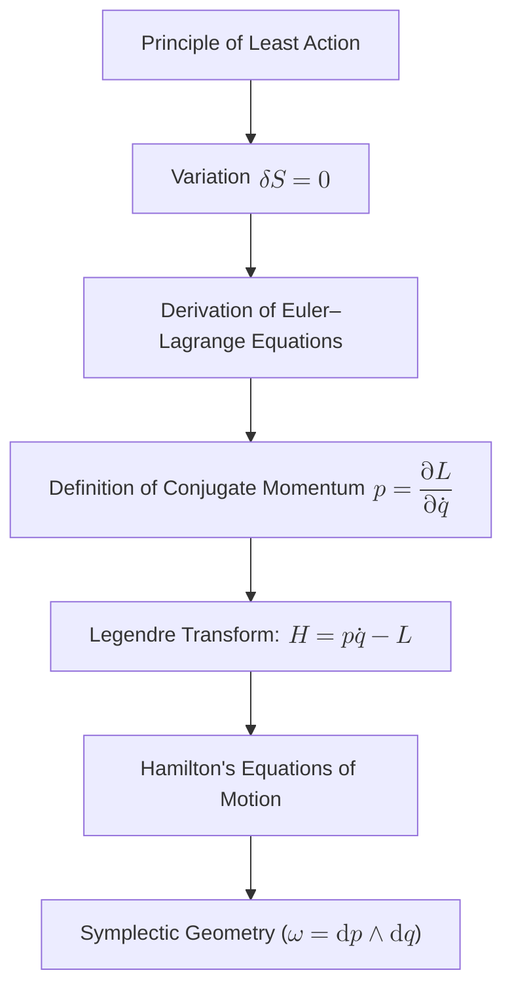

# Reconstructing Classical Mechanics: A Minimalist Geometric Reimagining
* * *

--- From the simplicity of action to the elegance of symmetry, the core of motion unfolds.

# Chapter I: Introduction

**Epigraph:**  
*"The universe in its simplicity conceals the profound secrets of motion—only by returning to the basics can the truth be unveiled."*

Classical mechanics has long served as the cornerstone of our understanding of the physical world. Its evolution—from the intuitive formulations of Newtonian mechanics, through the refined elegance of Lagrangian methods, to the energy-centric beauty of Hamiltonian dynamics—has shaped centuries of scientific thought. Yet, even after such extensive development, fundamental questions persist: **What is force? What is motion at its most elemental level?**

Historically, Newtonian mechanics provided a remarkably pragmatic description of motion via the simple equation  
$$
F = ma,
$$  
where force is treated as a given, an externally imposed stimulus that compels changes in velocity. Though this empirical approach has proven indispensable for countless applications, it leaves the deeper nature of motion unexplained. The Newtonian viewpoint, despite its practical success, tends to obscure the inherent connection between energy, geometry, and dynamical evolution.

In contrast, the advent of analytical mechanics brought forth a paradigm shift. The Principle of Least Action—stated as  
$$
S = \int_{t_1}^{t_2} L(q, \dot{q}, t) \, dt,
$$  
with the stationarity condition 
$$
\delta S = 0,
$$  
reveals that the paths taken by physical systems are those which optimize a certain cumulative quantity (the action). This variational approach naturally leads to the Euler–Lagrange equations, from which the classical equations of motion emerge not by decree, but through an intrinsic process of optimization. In so doing, the notion of force becomes an emergent concept—a footprint of deeper energy gradients and symmetries—rather than an a priori axiom.

Further sophistication appears in Hamiltonian mechanics, where dynamics are framed within the context of phase space and governed by energy conservation. The Legendre transform bridges the Lagrangian and Hamiltonian pictures, demonstrating that the dual realms of configuration and momentum are two expressions of the same underlying truth. Canonical transformations and the elegant structure of symplectic geometry encode invariance properties that lie at the heart of all dynamical laws.

This document is conceived as a radical reimagining of classical mechanics. In it, we aim to _reconstruct_ the entire framework from a minimal set of fundamental principles—eschewing historical preconceptions—to expose the core essence of motion in its purest form. By discarding the superfluous layers built over time, we focus on a few self-evident concepts such as the Principle of Least Action, energy invariance, and geometric duality. These concepts form the inner circle of our reconstruction, from which the traditional ideas of forces, equations of motion, and conservation laws naturally emerge as outer layers.

Our intended audience is advanced educators and researchers, individuals who are already well-versed in the established formulations of classical mechanics yet seek a deeper, more unified understanding. We invite you to join us in this intellectual expedition—a journey that challenges the status quo and opens the door to potentially transformative perspectives. In what follows, we will navigate from the most elementary notions to the full-scale edifice of classical dynamics, ultimately illuminating the profound simplicity that governs the universe.

This introductory chapter sets the philosophical and conceptual stage that motivates our reconstruction. It underscores persistent ambiguities about force and motion, and it lays out the rationale for re-examining classical mechanics through the lens of modern variational and geometric insights. Subsequent chapters will build on this foundation, progressively developing a unified framework that not only recovers traditional results but also suggests bold new directions for research in dynamics.

# Chapter II: Core Foundations—The Minimalist Bedrock

**Epigraph:**  
*"From the smallest spark of intuition, the flame of understanding is born."*

In reimagining classical mechanics from first principles, we begin by setting aside the accumulated historical formulations and reducing the subject to a few elementary, self-evident ideas. These core concepts—variational optimality, energy as a primitive invariant, and the underlying geometric structures—form the unifying backbone of our entire dynamical framework.

## II.1. The Principle of Least Action

At the heart of this minimalist reconstruction lies the **Principle of Least Action**. Instead of describing forces as external impositions, we turn our attention to a quantity that encapsulates the whole motion: the **action**. We define the action functional as
$$
S = \int_{t_1}^{t_2} L(q,\dot{q},t)\,dt,
$$
where $L(q,\dot{q},t)$ is the Lagrangian, a function that typically represents the difference between the kinetic and potential energies of the system. The cornerstone of this variational approach is the **stationarity condition**
$$
\delta S = 0,
$$
which asserts that the true evolution of the system is such that any infinitesimal variation in the path $q(t)$, with fixed endpoints, does not change the value of $S$. This principle captures the idea that nature “chooses” the path of optimal (or, more precisely, stationary) action. It is from this very condition that the equations of motion emerge naturally, thereby unifying the dynamic behavior under a single, elegant principle.

## II.2. Energy as a Primitive Notion

In this new formulation, **energy** is not a mere supplementary concept but a fundamental invariant that springs forth from the optimality embedded within the action. Unlike traditional views where force and acceleration are primary, energy is seen here as an emergent property defined by the structure of the Lagrangian itself. Energy conservation, for instance, is a direct consequence of the invariance of the action under time translations, as made precise by Noether's theorem.

Energy thus becomes a measure of the system’s potential to do work, and it is intertwined with the very notion of symmetry and invariance. Its conservation is not imposed but derived from the deep connection between the optimality criteria (i.e., the stationarity of the action) and the temporal symmetry of the underlying Lagrangian framework.

## II.3. Underlying Geometric Structures

A complete understanding of classical mechanics requires a geometrical language that reveals the inner workings of dynamical systems. We begin with the **configuration space** $Q$, which is the manifold that represents all possible positions of a system. However, to capture the dynamics—specifically, how positions change with time—we introduce the **tangent bundle** $TQ$, a space composed of all pairs $(q,\dot{q})$ that summarize both configuration and velocity.

Parallel to this, the **cotangent bundle** $T^*Q$ serves as the stage for the Hamiltonian formulation, representing the phase space where each point is given by a configuration $q$ and its associated momentum $p$. The geometric beauty of this representation is fully realized when we endow $T^*Q$ with a symplectic structure. In particular, the symplectic form
$$
\omega = \mathrm{d}p \wedge \mathrm{d}q
$$
captures the invariant geometric properties of phase space that remain preserved under dynamical evolution. This symplectic geometry not only unifies the Lagrangian and Hamiltonian pictures via the Legendre transform but also encapsulates the inherent duality between configurations and momenta.

## II.4. Invariance and Symmetry

The final core concept in our minimalist bedrock is that of **invariance** and **symmetry**. In the modern formulation of classical mechanics, symmetry under specific transformations is not an abstract property but the very source of conservation laws. For instance, the invariance of the action under time translations leads directly to energy conservation, while spatial invariance yields the conservation of linear momentum.

This profound relationship is encapsulated in **Noether's theorem**, which formally establishes that every differentiable symmetry of the action corresponds to a conservation law. Such invariances are not accidental; they represent the deep-seated geometric nature of the dynamical framework. They are the threads that tie together variational optimality, geometric structure, and the emergence of physical quantities such as energy and momentum.

## II.5. Conclusion

The three core ideas presented above—variational optimality (embodied in the Principle of Least Action), the primacy of energy as an invariant emerging from symmetry, and the rich geometric structures underlying the dynamical spaces—are deeply interwoven. Each concept supports and enriches the others:

- **Variational optimality** leads to the equations of motion through the stationarity condition $\delta S=0$, setting the stage for the emergence of energy as a measurable invariant.
- The **invariance and symmetry** of the action provide the foundation for energy conservation, linking variational principles with the dynamical stability of a system.
- The **geometric structures** of $Q$, $TQ$, and $T^*Q$ offer a precise mathematical framework in which these invariances are naturally expressed, revealing that the seemingly disparate notions of configuration, velocity, and momentum are merely different faces of the same underlying reality.

Together, these ideas form the unifying backbone of our reconstituted framework—a logical and conceptually minimal arena from which classical mechanics, in all its traditional formulations, emerges as an effective and layered description of a deeper, more elegant structure.

In summary, by reexamining classical mechanics through the lens of minimal, modern principles, we set the stage for a profound simplification and unification of dynamical theory. This chapter serves as the bedrock upon which the entire edifice of classical mechanics is built—revealing that at its core, the behavior of physical systems is governed not by externally imposed forces but by the intrinsic interplay of variational optimality, energy invariance, and geometric symmetry.

# Chapter III: Dynamics as Emergence from Variational and Geometric Principles

**Epigraph:**  
*"In the calculus of nature, every motion is etched by the whisper of symmetry."*

In this chapter, we unveil how the dynamics of a physical system naturally emerge from the minimalist foundations laid in Chapter II. By applying the Principle of Least Action and exploring the interplay between geometric structures and invariance, we derive the equations governing motion. In doing so, we reveal that the familiar laws of classical mechanics are not postulated but rather arise as a consequence of deeper, variational optimality. Let us delve into the core steps of this reconstruction.

## III.1. Derivation of the Euler–Lagrange Equations

The starting point is the action functional
$$
S = \int_{t_1}^{t_2} L(q,\dot{q},t)\,dt,
$$
where $L(q,\dot{q},t)$ is the Lagrangian of the system, often given by the difference between kinetic energy $T$ and potential energy $V$; that is, $L = T - V$. According to the Principle of Least Action, the actual path $q(t)$ taken by the system renders the action stationary. In mathematical terms, this is expressed by the stationarity condition
$$
\delta S = 0.
$$
To understand this, consider a variation $q(t) \rightarrow q(t) + \delta q(t)$ with fixed endpoints $\delta q(t_1) = \delta q(t_2) = 0$. The first-order variation in the action is given by
$$
\delta S = \int_{t_1}^{t_2} \left[\frac{\partial L}{\partial q}\delta q + \frac{\partial L}{\partial \dot{q}}\,\delta\dot{q}\right] dt.
$$
Integrating the second term by parts and applying the fixed endpoints condition, we obtain
$$
\delta S = \int_{t_1}^{t_2} \left( \frac{\partial L}{\partial q} - \frac{d}{dt}\frac{\partial L}{\partial \dot{q}} \right) \delta q \, dt.
$$
For $\delta S = 0$ to hold for arbitrary variations $\delta q(t)$, it is necessary that
$$
\frac{d}{dt}\left(\frac{\partial L}{\partial \dot{q}}\right) - \frac{\partial L}{\partial q} = 0.
$$
This is the celebrated Euler–Lagrange equation, the cornerstone of the variational formulation of classical mechanics. It encapsulates the idea that the path taken by a system is the one for which the action is stationary, thus linking the abstract concept of optimality to concrete differential equations governing motion.

## III.2. Emergence of Force as a Gradient

In contexts where the Lagrangian takes the form
$$
L(q,\dot{q},t) = T(\dot{q}) - V(q),
$$
the Euler–Lagrange equation becomes particularly illuminating. For such systems, the partial derivative $\frac{\partial L}{\partial q}$ is associated with the gradient of the potential energy $V$. Specifically, one can show that
$$
\frac{\partial L}{\partial q} = - \frac{\partial V}{\partial q},
$$
so that the Euler–Lagrange equation simplifies to
$$
\frac{d}{dt}\left(\frac{\partial T}{\partial \dot{q}}\right) + \frac{\partial V}{\partial q} = 0.
$$
If we identify the term
$$
F = -\frac{\partial V}{\partial q},
$$
as the force acting on the system, the above equation becomes a generalized form of Newton's second law. Notice that this force is not inserted as an ad hoc assumption but is itself an emergent consequence of the imposed stationarity condition. It arises directly from the spatial variations in the energy landscape, reinforcing the view that forces are secondary, derivative concepts.

## III.3. The Role of Legendre Duality

While the Lagrangian formalism elegantly provides a route from variational principles to the equations of motion, another equally profound perspective is offered by the Hamiltonian formulation. The transition from one formulation to the other is achieved via the **Legendre transform**.

Define the conjugate momentum $p$ as
$$
p = \frac{\partial L}{\partial \dot{q}}.
$$
The Hamiltonian $H(q,p,t)$ is then defined by
$$
H(q,p,t) = p\dot{q} - L(q,\dot{q},t),
$$
where $\dot{q}$ must be expressed in terms of $p$ and $q$ by inverting the definition of the momentum. This transformation reveals a deep **duality** between the Lagrangian and Hamiltonian descriptions. In the Hamiltonian framework, the evolution of a system is governed by Hamilton’s equations:
$$
\dot{q} = \frac{\partial H}{\partial p}, \qquad \dot{p} = -\frac{\partial H}{\partial q}.
$$
These equations not only recast the dynamics in a language that emphasizes energy conservation but also expose hidden symmetries and conservation laws encoded by the structure of the Hamiltonian. The Legendre duality thereby serves as a bridge between the variational (Lagrangian) and energy (Hamiltonian) formalisms, reinforcing the idea that the observable dynamics are deeply intertwined with the abstract notion of duality.

## III.4. Symplectic Geometry and Canonical Structures

At the apex of the geometric interpretation lies the structure of **symplectic geometry**. In the Hamiltonian picture, phase space is modeled by the cotangent bundle $T^*Q$, which is endowed with a canonical **symplectic form**
$$
\omega = \mathrm{d}p \wedge \mathrm{d}q.
$$
This $\omega$ is a closed and non-degenerate two-form, whose invariance under canonical transformations speaks to the fundamental geometrical nature of the dynamics. The preservation of the symplectic form under time evolution is a geometric manifestation of the conservation laws dictated by the invariance of the action. In other words, while we derived the equations of motion from the variational principle, it is the symplectic structure that ensures these equations respect the underlying invariance and duality of the system.

By uniting the ideas of variational optimality, Legendre duality, and symplectic geometry, we achieve a comprehensive and unified description of dynamics. The emergence of equations like the Euler–Lagrange and Hamilton’s equations is not an isolated occurrence but a natural result of the intrinsic structure of the theory. Every aspect—from the very definition of force as a gradient to the conservation laws emerging from symmetry—is shadowed by a deeper, geometric order.

## III.5. Conclusion

To recapitulate, the derivation of dynamics follows from a seamless synthesis of core ideas:
- The **stationarity of the action** drives the derivation of the Euler–Lagrange equations.
- **Force**, traditionally accepted as an external input, emerges as a consequence of energy gradients in a system.
- The **Legendre transform** reveals the dual nature of dynamics, linking the Lagrangian and Hamiltonian frameworks.
- The encapsulation of dynamics within **symplectic geometry** ensures that the underlying invariance and conservation laws are manifest and preserved.

This unified narrative not only crystallizes the essential principles underlying classical mechanics but also highlights the inherent beauty of its structure—a beauty that stems from the deep interconnections between variational principles, energy invariance, and geometric duality.

In summary, the emergence of dynamics from variational and geometric principles demonstrates that classical mechanics is far more than a set of postulated laws; it is a systematic consequence of the interplay between optimality, duality, and symmetry. This chapter has illuminated the pathway from the minimalist bedrock of fundamental concepts to the full edifice of dynamical behavior, setting the stage for both traditional insights and novel frontiers in the study of motion.

# Chapter IV: Unifying Classical Mechanics—From Newton to Beyond

**Epigraph:**  
*"From the fundamental spark grows the edifice of motion, each layer echoing the harmony of nature."*

In the preceding chapters, we have distilled classical mechanics to its purest elements through a minimalist lens: starting from the Principle of Least Action, the primacy of energy as an invariant, and the deep geometric structures that underpin physical systems. Now, we turn our attention to merging this modern, refined reconstruction with the traditional Newtonian framework. In doing so, we reveal that the familiar equation
$$
F = ma
$$
is not an irreducible axiom but an emergent, effective description—a macroscopic manifestation of far deeper, variational, and geometric laws.

## IV.1. Emergence of Newtonian Dynamics

At first glance, the Newtonian formulation appears self-evident: forces cause accelerations in a straightforward, linear fashion. However, when we revisit the Principle of Least Action, we see that the dynamics of any system are governed by
$$
\delta S = 0, \quad \text{with} \quad S = \int_{t_1}^{t_2} L(q,\dot{q},t)\,dt.
$$
Assuming a Lagrangian of the form
$$
L(q,\dot{q},t) = T(\dot{q}) - V(q),
$$
where $T$ is the kinetic energy (typically $\frac{1}{2}m\dot{q}^2$) and $V$ is the potential energy, the stationarity condition immediately gives us the Euler–Lagrange equations:
$$
\frac{d}{dt}\left(\frac{\partial L}{\partial \dot{q}}\right) - \frac{\partial L}{\partial q} = 0.
$$
Carrying out the derivatives explicitly, we obtain
$$
m\ddot{q} + \frac{\partial V}{\partial q} = 0,
$$
or equivalently,
$$
m\ddot{q} = -\frac{\partial V}{\partial q}.
$$
Here, the term
$$
F = -\frac{\partial V}{\partial q}
$$
emerges naturally as the gradient of the potential energy. Thus, what we traditionally call "force" is nothing more than a macroscopic artifact derived from the deeper principle of optimality. In this light, Newton's second law is seen as the effective description for systems where the intricate underlying variational structure has been averaged into a simple, emergent rule of thumb.

## IV.2. Canonical Transformations and Invariance

While the Lagrangian formulation derives the equations of motion from variational principles, the Hamiltonian approach provides a complementary perspective rooted in symmetry and conservation. By defining the conjugate momentum as
$$
p = \frac{\partial L}{\partial \dot{q}},
$$
we construct the Hamiltonian
$$
H(q,p,t) = p\dot{q} - L(q,\dot{q},t),
$$
which re-expresses dynamics in terms of the variables $(q,p)$ of phase space. Hamilton’s equations
$$
\dot{q} = \frac{\partial H}{\partial p} \quad \text{and} \quad \dot{p} = -\frac{\partial H}{\partial q},
$$
are not simply a reformulation; they highlight the duality inherent in the system, commonly known as **Legendre duality**. This elegant symmetry ensures that changes in one variable are mirrored by corresponding changes in its dual counterpart.

Moreover, the phase space is endowed with a canonical symplectic structure, encapsulated by the symplectic form
$$
\omega = \mathrm{d}p \wedge \mathrm{d}q.
$$
The invariance of $\omega$ under **canonical transformations** guarantees that the essential geometrical features of the system remain untouched, irrespective of the coordinate representation. Invariances of this type are the backbone of Noether’s theorem, which tightly links continuous symmetries to conservation laws. The very conservation of energy, momentum, and angular momentum is a direct consequence of these underlying invariances—further cementing their role in our reconstructed framework.

## IV.3. Bridging Old and New

When viewed through the refined lens of variational and geometric principles, the classical Newtonian picture appears as a macroscopic, emergent layer overlaying a far richer and more nuanced substrate. The effective force law $F=ma$ is recovered in the appropriate limits; however, its derivation from first principles exposes its inherent conditionality. In our modern reconstruction:
- **Optimality** is the primal driver, ensuring that motion follows the path which renders the action stationary.
- **Energy invariance** arises naturally from the symmetry of time, endowing the conserved quantities that inform Newtonian dynamics.
- **Geometric duality** reinterprets the roles of position and momentum, thereby revealing the deep, underlying unity between the Lagrangian and Hamiltonian formulations.

Thus, classical Newtonian dynamics are not at odds with the minimalist geometric view; rather, they emerge seamlessly from it when the aggregate effects of microscopic optimality are integrated over macroscopic scales. This synthesis not only recovers the familiar laws but also provides new insights into their origins, suggesting that our traditional approach is but a shadow cast by a more fundamental, variational truth.

## IV.4. Implications for Complex Systems

The unification of classical mechanics within this framework opens the door to generalized extensions and applications. For instance, in systems with constraints—ranging from the rolling, compounded motion of rigid bodies to the deformation dynamics in elastic media—the variational approach provides the ideal language for incorporating restrictions seamlessly via Lagrange multipliers and constraint forces.

Similarly, the geometric perspective inspires novel approaches in field theories and modern physics. By treating the configuration space of fields as infinite-dimensional manifolds and endowing them with appropriate symplectic structures, one can extend these reconstruction ideas into quantum mechanics and beyond. The same robust methodology may yield breakthroughs in understanding non-standard interactions, chaotic systems, and emergent phenomena in complex media.

In summary, the traditional Newtonian formulation is not an isolated relic but an effective, emergent layer atop a profoundly interconnected structure. Our unified reconstruction not only recovers the canonical $F=ma$ framework in a natural, optimality-based limit but also transcends it, offering a coherent, geometrically grounded vision that is amenable to generalization and innovation.

## IV.5. Conclusion

By bridging historical formulations with modern variational and geometric insights, we uncover a unified narrative where classical laws are emergent, layered expressions of deep, underlying principles. This chapter serves as a crucial juncture, linking the minimalist bedrock to the macroscopic descriptions that have long guided physics, and paving the way for exploring even richer territories in the study of motion.

# Chapter V: Beyond Classical Mechanics—New Frontiers and Future Directions

**Epigraph:**  
*"True progress arises when the foundations are questioned and reimagined."*

In exploring the unified, minimalist reconstruction of classical mechanics, we now venture beyond its established domains toward a landscape rich with novel perspectives and transformative potential. By questioning the foundations and reimagining established frameworks, we not only deepen our understanding of motion but also open up pathways to extend these ideas into quantum mechanics, field theories, and beyond. In this chapter, we embark on an exploration of these frontiers, reflecting on both the philosophical implications and the promising avenues for future research.

## V.1. Extensions to Quantum and Field Theories

The geometric and variational principles that form the bedrock of our classical reconstruction are not confined to the realm of macroscopic phenomena. Instead, they resonate deeply with the formulations of quantum mechanics and modern field theories. Consider the following points:

- **Path Integrals and Variational Principles:**  
  The Feynman path integral formulation of quantum mechanics is, in essence, a direct descendant of the Principle of Least Action. In this picture, the probability amplitude for a quantum system to transition from one state to another is obtained by summing over all possible trajectories, each weighted by $\exp(iS/\hbar)$. This profound relationship suggests that the optimal, stationary pathways which dominate classical behavior emerge as the most significant contributions in the quantum regime. The transition from the deterministic world of classical mechanics to the probabilistic nature of quantum mechanics thus can be viewed through the prism of variational calculus.

- **Geometric Quantization and Symplectic Structures:**  
  The central role of symplectic geometry in classical phase space provides a natural bridge to quantum theory via geometric quantization. In this framework, the transformation of classical variables $(q, p)$ into operators on a Hilbert space respects the underlying symplectic structure. Such a procedure not only preserves the invariance properties observed in classical mechanics but also embeds them into the fabric of quantum dynamics. This geometric perspective has spurred advances in understanding gauge theories and topological quantum field theories (TQFTs), where the interplay between topology, geometry, and physics becomes paramount.

- **Field Theories and Continuous Systems:**  
  Extending the variational and geometric principles to field theories involves generalizing the configuration space to fields defined over spacetime. Here, the action takes the form
  $$
  S = \int_{\mathcal{M}} \mathcal{L}(\phi, \partial_\mu\phi, x^\mu)\,d^4x,
  $$
  where $\phi$ represents a field and $\mathcal{L}$ is the Lagrangian density. The stationary condition $\delta S=0$ yields field equations that underpin theories ranging from classical electromagnetism to the Standard Model of particle physics. This unification, achieved through the language of fiber bundles and global symmetries, is a testament to the power and generality of our minimalist approach.

Through these extensions, the core ideas that once described the trajectories of particles evolve into a universal framework that can account for the behavior of fields and quantum entities alike. The conceptual unity provided by variational and geometric methods hints at a deeper correspondence between the classical and quantum worlds—a correspondence that may ultimately offer profound insights into the nature of reality.

## V.2. Philosophical and Epistemological Implications

The process of reconstructing classical mechanics from a minimal set of self-evident principles carries significant philosophical and epistemological weight. When we derive familiar laws as emergent properties of deeper variational and geometric imperatives, several profound implications arise:

- **Emergence of Truth:**  
  In this reconstruction, what we traditionally accept as axiomatic—such as Newton's $F = ma$—is shown to be an emergent phenomenon. This raises the philosophical question of whether the so-called "truth" in physics is an intrinsic feature of nature or a construct derived from our foundational assumptions. The notion of emergent truth challenges us to rethink the reliability of our established theories and to consider that deeper, perhaps even more abstract principles, might govern the fabric of reality.

- **Nature of Observation and Reality:**  
  The transition from the deterministic equations of classical mechanics to the probabilistic framework of quantum theory reflects not only mathematical ingenuity but also a shift in our understanding of what constitutes objective reality. If the laws of motion themselves are emergent from a more fundamental variational process, then the role of observation and measurement in crystallizing physical truths may be more subtle and intertwined with the structure of the theory than previously assumed.

- **Interplay between Mathematics and Physics:**  
  The fact that principles of symmetry, optimality, and geometry emerge as central themes underscores the deep, sometimes mysterious, relationship between pure mathematics and the physical world. This reconstruction makes us appreciate that the language of mathematics is not merely a descriptive tool but may indeed reveal the very fabric of physical reality.

These reflections invite educators and researchers to consider new epistemological frameworks—ones that appreciate both the limitations of traditional approaches and the boundless potential of a minimalist, unified vision of mechanics.

## V.3. Prospective Research Avenues

The unified, minimalist reconstruction of classical mechanics not only recontextualizes established theories but also suggests bold new directions for future research:

- **Higher-Category Theories:**  
  One provocative avenue is the exploration of higher-category theories, where traditional objects and morphisms in mathematics are replaced by structures that capture multi-layered or hierarchical relationships. Such theories may provide a novel language in which to describe the interplay between different scales of physical phenomena, including the emergent properties of complex systems.

- **Topological Quantum Field Theories (TQFTs):**  
  Building on the geometric underpinnings of classical mechanics, TQFTs offer a framework in which physical theories are defined purely by topological invariants. This direction holds promise for unravelling the mysteries of quantum gravity and for establishing connections between disparate areas of physics, from string theory to condensed matter physics.

- **Unification Schemes in Dynamics:**  
  By extending the minimalist approach, one might attempt to formulate a unified theory that seamlessly integrates classical, quantum, and relativistic dynamics. Such a scheme would aim to derive all known forces and interactions from a limited set of variational and geometric principles, potentially leading to unexpected connections and new predictive power.

- **Non-Standard and Complex Systems:**  
  The reconstruction also paves the way for new insights into systems that lie outside the traditional boundaries of classical mechanics. These include systems with strong interactions, chaotic behavior, and even emergent phenomena in biological or social systems. Adapting the minimalist framework to these contexts may yield innovative models with wide-ranging applications.

## V.4. Conclusion

The unified vision presented in this chapter not only broadens the scope of classical mechanics but also ties it to a vast landscape of scientific and philosophical inquiry. By extending classical principles into the quantum realm, reflecting on the nature of truth, and proposing new research avenues, we demonstrate that our minimalist reconstruction is not merely an alternative formulation—it is a gateway to future discovery.

The transformative potential of this approach lies in its ability to bridge established paradigms with frontier theories. It challenges us to re-evaluate the foundations of physics and to explore the interplay of simplicity, symmetry, and complexity in ways that may lead to a more complete understanding of the universe.

In summary, the minimalist geometric reimagining of classical mechanics reaches far beyond its traditional confines. It offers a framework that can inform and guide extensions into quantum and field theories, prompt philosophical introspection, and inspire bold new research directions. True progress, as encapsulated in the epigraph, arises when we dare to question and reconstitute our foundational assumptions, paving the way for a deeper, more unified understanding of nature.

# Chapter VI: Conclusion

**Epigraph:**  
*"In the quiet core of simplicity, the universe reveals its eternal order."*

In this work, we have embarked on a journey to reimagine classical mechanics from the ground up—stripping away the layers of historical formulation and reconstructing the subject from a core set of modern principles. By starting with the **Principle of Least Action**, we have established that the behavior of physical systems is governed not by arbitrarily imposed forces, but by an intrinsic drive toward optimality. The action functional
$$
S = \int_{t_1}^{t_2} L(q,\dot{q},t)\,dt
$$
and its stationarity condition, $\delta S = 0$, serve as our starting point, leading naturally to the **Euler–Lagrange equations** that encapsulate the dynamical behavior of systems.

We then recognized that **energy** is more than a mere add-on; it is a primitive invariant whose conservation arises from the inherent symmetries of the physical world. This insight not only deepens our understanding of classical dynamics—it also bridges the gap between the Lagrangian and Hamiltonian formulations through the **Legendre transform**
$$
p = \frac{\partial L}{\partial \dot{q}}, \qquad H(q,p,t) = p\dot{q} - L(q,\dot{q},t).
$$
The geometric structures underlying these formulations—configuration space $Q$, the tangent bundle $TQ$, and the cotangent bundle $T^*Q$ equipped with its symplectic form
$$
\omega = \mathrm{d}p \wedge \mathrm{d}q,
$$
reinforce the notion that the laws of motion are inextricably linked to invariance and symmetry. The duality between the Lagrangian and Hamiltonian pictures, revealed through canonical transformations and the elegant symplectic framework, underscores the natural emergence of concepts like force, which in our reconstruction appears as a derivative phenomenon (e.g., $F = -\frac{\partial V}{\partial q}$) arising from deep variational principles.

This minimalist, geometric reimagining of classical mechanics not only recovers traditional formulations—such as the Newtonian $F = ma$ expressed as an effective macroscopic theory—but also unifies them under a single, coherent framework. The layered progression, from the fundamental spark of variational optimality to the expansive edifice of emergent dynamics, demonstrates that classical laws are not isolated postulates but arise from a harmonious interplay of deep mathematical truths.

Looking forward, the insights gleaned from this reconstruction call for a deeper inquiry into the nature of physical laws. The unity and coherence achieved here suggest that many phenomena traditionally treated as separate may, in fact, be interrelated manifestations of the same underlying variational and geometric principles. This perspective invites further exploration in both theoretical and applied domains—from the quantum to the cosmological—and challenges us to consider new unification schemes that might bridge the gap between classical and modern physics.

In essence, by reconstituting classical mechanics from a small set of fundamental, modern concepts, we have not only provided a fresh, elegant lens through which to view familiar dynamics but have also laid the groundwork for future discoveries. The quest to understand the universe, guided by simplicity, symmetry, and geometric insight, remains an open invitation to continue questioning and reimagining the very foundations of physical reality.

# Appendix A: Supplementary Material and Detailed Proofs

This appendix provides the mathematical backbone to the core developments presented in the main text. It contains detailed derivations, proofs, and diagrams that support the minimalist, geometric reconstruction of classical mechanics. This material is intended as a resource for the discerning reader who wishes to delve deeper into the rigorous underpinnings of our framework.

## A.1. Detailed Derivation of the Euler–Lagrange Equations

The starting point of our variational approach is the action functional defined by
$$
S[q(t)] = \int_{t_1}^{t_2} L(q(t), \dot{q}(t), t) \, dt,
$$
where $L(q, \dot{q}, t)$ is the Lagrangian of the system. The principle of least (or stationary) action insists that the true evolution $q(t)$ of the system between fixed endpoints $q(t_1)$ and $q(t_2)$ makes the first variation of the action vanish:
$$
\delta S = 0.
$$

### A.1.1. Step-by-Step Derivation

1. **Apply a Variation:**  
   Consider an infinitesimal variation of the path:
   $$
   q(t) \rightarrow q(t) + \delta q(t),
   $$
   with the endpoints fixed:
   $$
   \delta q(t_1) = \delta q(t_2) = 0.
   $$

2. **Vary the Action:**  
   The variation in the action is given by:
   $$
   \delta S = \int_{t_1}^{t_2} \left[ \frac{\partial L}{\partial q}\delta q(t) + \frac{\partial L}{\partial \dot{q}} \delta \dot{q}(t) \right] dt.
   $$

3. **Integration by Parts:**  
   Notice that:
   $$
   \delta \dot{q}(t) = \frac{d}{dt} \delta q(t).
   $$
   Integrate the second term by parts:
   $$
   \int_{t_1}^{t_2} \frac{\partial L}{\partial \dot{q}} \frac{d}{dt}\delta q(t) \, dt = \left. \frac{\partial L}{\partial \dot{q}} \delta q(t) \right|_{t_1}^{t_2} - \int_{t_1}^{t_2} \frac{d}{dt}\left(\frac{\partial L}{\partial \dot{q}}\right) \delta q(t) \, dt.
   $$
   The boundary term vanishes due to the fixed endpoints, leaving:
   $$
   \delta S = \int_{t_1}^{t_2} \left[ \frac{\partial L}{\partial q} - \frac{d}{dt}\left(\frac{\partial L}{\partial \dot{q}}\right) \right] \delta q(t) \, dt.
   $$

4. **Stationarity Condition:**  
   Since the variation $\delta q(t)$ is arbitrary, the integrand must vanish for the action to be stationary:
   $$
   \frac{d}{dt}\left(\frac{\partial L}{\partial \dot{q}}\right) - \frac{\partial L}{\partial q} = 0.
   $$
   This is the **Euler–Lagrange equation**, a fundamental result linking the variational principle with the equations of motion.

## A.2. Mathematical Exposition of the Legendre Transform and Symplectic Geometry

### A.2.1 Legendre Transform

The **Legendre transform** serves as the bridge between the Lagrangian and Hamiltonian formalisms. Starting with the Lagrangian $L(q, \dot{q}, t)$, we define the conjugate momentum:
$$
p = \frac{\partial L}{\partial \dot{q}}.
$$
Assuming this relation is invertible (i.e., we can express $\dot{q}$ as a function of $q$ and $p$), the Hamiltonian $H$ is defined by
$$
H(q,p,t) = p \dot{q} - L(q, \dot{q}, t).
$$

This transformation:
- **Exposes Duality:** It reveals the dual roles of $q$ (configuration) and $p$ (momentum), emphasizing the geometric underpinning of these variables.
- **Leads to Hamilton’s Equations:** Differentiating $H$ with respect to $q$ and $p$ yields:
  $$
  \dot{q} = \frac{\partial H}{\partial p}, \quad \dot{p} = -\frac{\partial H}{\partial q}.
  $$
  These equations govern the evolution of the system in phase space.

### A.2.2 Symplectic Geometry

The language of **symplectic geometry** formalizes the structure present in the Hamiltonian description. Consider the phase space $T^*Q$, the cotangent bundle over the configuration space $Q$. It is equipped with a canonical symplectic form:
$$
\omega = \mathrm{d}p \wedge \mathrm{d}q.
$$

Key properties include:
- **Closedness:**  
  $$
  \mathrm{d}\omega = 0,
  $$
  signifying that $\omega$ is a closed form.
- **Non-degeneracy:** This property guarantees a one-to-one correspondence between vectors and covectors in phase space.

Symplectic geometry ensures that Hamilton’s equations preserve the symplectic structure, an expression of the fundamental invariance embedded in the physical laws. Moreover, canonical transformations—those that preserve $\omega$—highlight the inherent geometric uniformity across different representations of the dynamics.

## A.3. Diagrams Illustrating the Concentric, Layered Construction

The following diagrams illustrate the layered progression from the minimal core principles to the full structure of classical dynamics:

### A.3.1. Diagram 1: Concentric Layers of the Framework

```
               [Minimalist Geometric Core]
                (Variational Optimality,
                 Energy Invariance,
                 Geometric Structures)
                           │
                           ▼
             [Euler–Lagrange Equations]
       (Derivation from the Principle of Least Action)
                           │
                           ▼
              [Legendre Transform & Duality]
         (Connecting Lagrangian and Hamiltonian Views)
                           │
                           ▼
             [Symplectic Geometry & Canonical
                     Transformations]
                           │
                           ▼
         [Emergent Macroscopic Laws (e.g., F = ma)]
```

### A.3.2. Diagram 2: Flow from Variational Principle to Dynamics



## A.4. Additional References and Notes on Extended Topics

For those seeking to explore the subject further, the following texts and articles may serve as excellent starting points:

- **Arnold, V.I., & Khesin, B.** (1998). *Topological Methods in Hydrodynamics*.  
  _Explores the deep connections between geometry and dynamics._
- **Goldstein, H., Poole, C., & Safko, J.** (2002). *Classical Mechanics*.  
  _Provides a comprehensive treatment of the traditional and modern formulations._
- **Lanczos, C.** (1970). *The Variational Principles of Mechanics*.  
  _A classic text that emphasizes the variational approach to mechanics._
- **Marsden, J.E., & Ratiu, T.S.** (1999). *Introduction to Mechanics and Symmetry*.  
  _Covers advanced topics in symplectic geometry and geometric mechanics._
- **Noether, E.** (1918). *Invariante Variationsprobleme*.  
  _The foundational paper establishing the correspondence between symmetries and conservation laws._

### A.4.1. Notes on Extended Topics

- **Higher-Category Theories:**  
  Emerging research suggests that multi-layered categorical structures might better capture the interplay between dynamics at different scales.
- **Topological Quantum Field Theories (TQFTs):**  
  Utilizing topological invariants and symplectic geometry, TQFTs provide fresh insights into quantum gravity and gauge theories.
- **Non-Standard Interactions:**  
  Modern research continues to explore systems that fall outside the purview of traditional mechanics, such as those exhibiting chaotic behavior or emergent phenomena in complex systems.

## A.5. Conclusion

This supplementary material is intended to enrich the reader’s understanding of the minimalist, geometric reimagining of classical mechanics. By providing detailed derivations, robust mathematical expositions, and illustrative diagrams, we hope to offer a comprehensive resource that not only supports the main text but also invites further exploration into the elegant structure underlying the fabric of motion.

