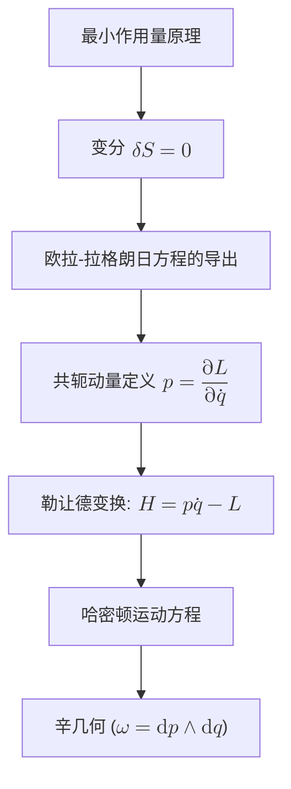

# 重构经典力学：一种极简主义的几何重构
* * *

--- 从作用量的简单性到对称性的优雅，运动的本质逐渐展开。

# 第一章：引言

**题词：**  
*"宇宙在其简约中隐藏了运动的深刻秘密 —— 唯有回归基础，真相方可揭示。"*

经典力学长期以来一直是理解物理世界的核心支柱。其演变历程 —— 从牛顿力学的直观表述，到拉格朗日方法的精致优雅，再到哈密顿动力学的能量中心之美 —— 塑造了数个世纪的科学思想。然而，即使经历了如此广泛的发展，一些根本性的问题依然存在：**什么是力？运动在其最基本的层面上是什么？**

历史上，牛顿力学通过简单的方程  
$$
F = ma,
$$  
提供了一个极为实用的运动描述，其中力被视为给定的、外部施加的刺激，促使速度发生变化。尽管这种经验方法在无数应用中被证明不可或缺，但它未能解释运动的更深层次本质。牛顿的观点，尽管在实践中取得了巨大成功，却往往掩盖了能量、几何与动力学演化之间的内在联系。

相比之下，分析力学的出现带来了范式转变。最小作用量原理 —— 表述为  
$$
S = \int_{t_1}^{t_2} L(q, \dot{q}, t) \, dt,
$$  
以及驻定条件  
$$
\delta S = 0,
$$  
揭示了物理系统所采取的路径是优化某一累积量(作用量)的结果。这种变分方法自然导出了欧拉-拉格朗日方程，从中经典的运动方程并非由命令得出，而是通过一个内在的优化过程自然涌现。通过这种方式，力的概念成为一个涌现现象 —— 能量梯度和对称性的足迹 —— 而非先验公理。

在哈密顿力学中，动力学被置于相空间的背景下，并由能量守恒定律支配。勒让德变换连接了拉格朗日与哈密顿图景，展示了构型与动量这两个领域是对同一底层真理的不同表达。典范变换和辛几何的优美结构编码了位于所有动力学定律核心的不变性性质。

本文档旨在对经典力学进行彻底的重新构想。我们试图从一组极简的基本原理出发，**重建**整个框架，摒弃历史上的先入之见，以揭示运动最纯粹的本质。通过剥离随着时间积累的多余层次，我们专注于几个不言自明的概念，如最小作用量原理、能量不变性和几何对偶性。这些概念构成了我们重构的内核，而传统的力、运动方程和守恒定律则自然地作为外层涌现。

我们的目标读者是高级教育者和研究者，他们是已经熟悉经典力学既定表述的人士，但寻求更深层次、更统一的理解。我们邀请你加入这一智力探险之旅 —— 一段挑战现状并开启潜在变革视角的旅程。接下来，我们将从最基本的概念导航至经典动力学的完整体系，最终阐明支配宇宙的深刻简约性。

本引言章节为我们的重构奠定了哲学与概念的基础。它强调了关于力和运动的持久模糊性，并阐述了通过现代变分与几何洞见重新审视经典力学的理由。后续章节将在此基础上逐步发展一个统一框架，不仅恢复传统结果，还暗示了动力学研究的全新方向。

# 第二章：核心基础 —— 极简主义的基石

**题词：**  
*"从最微小的直观火花中，理解的火焰得以诞生。"*

在从第一性原理重新构想经典力学时，我们首先搁置积累的历史表述，将这一主题简化为几个基本且不言自明的概念。这些核心概念 —— 变分优化性、能量作为原始不变量以及底层几何结构 —— 构成了我们整个动力学框架的统一支柱。

## II.1 最小作用量原理

在这个极简主义重构的核心是**最小作用量原理**。我们不再将力描述为外部施加的作用，而是转向一个能够概括整个运动的量：**作用量**。我们将作用量泛函定义为
$$
S = \int_{t_1}^{t_2} L(q,\dot{q},t)\,dt,
$$
其中 $L(q,\dot{q},t)$ 是拉格朗日函数，通常表示系统的动能与势能之差。这个变分方法的核心是**驻定条件**
$$
\delta S = 0,
$$
它断言系统的真正演化路径使得任意固定端点的无穷小路径变化都不会改变 $S$ 的值。这一原理捕捉自然界“选择”最优(或更精确地说，驻定)作用量路径的思想。正是从这一条件出发，运动方程自然涌现，从而将动力学行为统一在一个单一而优美的原则之下。

## II.2 能量作为原始概念

在这种新表述中，**能量**不再是一个补充性的概念，而是一个从作用量中嵌入的优化性中产生的基本不变量。与传统观点中将力和加速度视为首要概念不同，这里能量被视为由拉格朗日函数结构定义的一个涌现性质。例如，能量守恒是作用量在时间平移下不变性的直接结果，这由诺特定理精确阐明。

因此，能量成为衡量系统做功能力的标准，并与对称性和不变性的概念紧密交织。其守恒性并非强加，而是从优化标准(即作用量的驻定性)与底层拉格朗日框架的时间对称性之间的深刻联系中推导出来的。

## II.3 底层几何结构

对经典力学的完整理解需要一种揭示动力系统内部运作的几何语言。我们从**构型空间** $Q$ 开始，这是一个代表系统所有可能位置的流形。然而，为了捕捉动力学 —— 具体来说，位置如何随时间变化 —— 我们引入**切丛** $TQ$，这是一个由所有 $(q,\dot{q})$ 对组成的空间，总结了构型和速度的信息。

与此平行的是，**余切丛** $T^*Q$ 作为哈密顿表述的舞台，表示相空间，其中每个点由构型 $q$ 及其对应的动量 $p$ 给出。当赋予 $T^*Q$ 辛结构时，这种几何表达的美感得以完全展现。特别是辛形式
$$
\omega = \mathrm{d}p \wedge \mathrm{d}q
$$
捕捉相空间中在动力学演化下保持不变的几何性质。这种辛几何不仅通过勒让德变换统一了拉格朗日和哈密顿图景，还封装了构型与动量之间的内在对偶性。

## II.4 不变性和对称性

我们极简主义基石中的最后一个核心概念是**不变性**和**对称性**。在经典力学的现代表述中，特定变换下的对称性不仅是抽象属性，更是守恒定律的根本来源。例如，作用量在时间平移下的不变性直接导致能量守恒，而空间不变性则产生线性动量守恒。

这种深刻的联系被封装在**诺特定理**中，该定理正式确立了作用量的每一个可微对称性都对应一个守恒定律。这些不变性并非偶然；它们代表了动力学框架的深层几何本质。它们是将变分优化性、几何结构与诸如能量和动量等物理量的涌现性联系在一起的纽带。

## II.5 结论

上述三个核心思想 —— 体现在最小作用量原理中的变分优化性、作为从对称性中涌现的不变量的能量优先性以及动力学空间背后的丰富几何结构 —— 是深深交织在一起的。每个概念都支持并丰富了其他概念：

- **变分优化性**通过驻定条件 $\delta S=0$ 导出运动方程，为能量作为一个可测量不变量的涌现奠定基础。
- 作用量的**不变性和对称性**提供能量守恒的基础，将变分原理与系统的动力学稳定性联系起来。
- $Q$、$TQ$ 和 $T^*Q$ 的**几何结构**提供一个精确的数学框架，在其中这些不变性自然表达，揭示看似不同的构型、速度和动量概念实际上是同一底层现实的不同侧面。

这些思想共同构成我们重构框架的统一支柱 —— 一个逻辑严谨且概念极简的舞台，从中经典力学的所有传统表述作为更深层次、更优雅结构的有效且分层描述涌现出来。

总之，通过以极简、现代的原则重新审视经典力学，我们为动力学理论的深刻简化和统一奠定基础。本章作为整个经典力学大厦的基石，揭示了物理系统的行为并非由外部施加的力所支配，而是由变分优化性、能量不变性和几何对称性的内在相互作用所决定。

# 第三章：动力学从变分与几何原理中的涌现

**题词：**  
*"在自然的微积分中，每一个运动都被对称性的低语所铭刻。"*

在本章中，我们揭示物理系统的动力学如何自然地从第二章奠定的极简主义基础中涌现。通过应用最小作用量原理并探索几何结构与不变性之间的相互作用，我们推导出支配运动的方程。在此过程中，我们揭示经典力学的熟悉定律并非假设，而是更深层次变分优化的结果。让我们深入探讨这一重构的核心步骤。

## III.1 欧拉-拉格朗日方程的推导

起点是作用量泛函
$$
S = \int_{t_1}^{t_2} L(q,\dot{q},t)\,dt,
$$
其中 $L(q,\dot{q},t)$ 是系统的拉格朗日函数，通常由动能 $T$ 和势能 $V$ 的差值给出；即 $L = T - V$。根据最小作用量原理，系统实际采取的路径 $q(t)$ 使作用量驻定。用数学语言表达，这由驻定条件
$$
\delta S = 0
$$
描述。为了理解这一点，考虑一个变化 $q(t) \rightarrow q(t) + \delta q(t)$，且固定端点条件为 $\delta q(t_1) = \delta q(t_2) = 0$。作用量的一阶变分为
$$
\delta S = \int_{t_1}^{t_2} \left[\frac{\partial L}{\partial q}\delta q + \frac{\partial L}{\partial \dot{q}}\,\delta\dot{q}\right] dt.
$$
通过对第二项分部积分并应用固定端点条件，我们得到
$$
\delta S = \int_{t_1}^{t_2} \left( \frac{\partial L}{\partial q} - \frac{d}{dt}\frac{\partial L}{\partial \dot{q}} \right) \delta q \, dt.
$$
为了使 $\delta S = 0$ 对任意变化 $\delta q(t)$ 成立，必须有
$$
\frac{d}{dt}\left(\frac{\partial L}{\partial \dot{q}}\right) - \frac{\partial L}{\partial q} = 0.
$$
这就是著名的欧拉-拉格朗日方程，变分形式的经典力学的核心。它概括了系统的路径是使作用量驻定的路径这一思想，从而将抽象的优化概念与具体的运动微分方程联系起来。

## III.2 力作为梯度的涌现

在拉格朗日函数具有形式
$$
L(q,\dot{q},t) = T(\dot{q}) - V(q),
$$
的情况下，欧拉-拉格朗日方程变得尤为清晰。对于这样的系统，偏导数 $\frac{\partial L}{\partial q}$ 与势能 $V$ 的梯度相关联。具体来说，可以证明
$$
\frac{\partial L}{\partial q} = - \frac{\partial V}{\partial q},
$$
因此欧拉-拉格朗日方程简化为
$$
\frac{d}{dt}\left(\frac{\partial T}{\partial \dot{q}}\right) + \frac{\partial V}{\partial q} = 0.
$$
如果我们识别该项
$$
F = -\frac{\partial V}{\partial q},
$$
作为作用于系统的力，则上述方程成为牛顿第二定律的广义形式。注意，这种力并非作为一个临时假设插入，而是驻定条件的直接结果。它直接源于能量景观的空间变化，强化了力是次要、派生概念的观点。

## III.3 勒让德对偶的作用

尽管拉格朗日形式优雅地提供一条从变分原理到运动方程的途径，哈密顿表述提供另一个同样深刻的视角。从一种表述到另一种表述的转换是通过**勒让德变换**实现的。

定义共轭动量 $p$ 为
$$
p = \frac{\partial L}{\partial \dot{q}}.
$$
然后哈密顿函数 $H(q,p,t)$ 定义为
$$
H(q,p,t) = p\dot{q} - L(q,\dot{q},t),
$$
其中 $\dot{q}$ 必须通过动量的定义逆向表示为 $p$ 和 $q$ 的函数。这一变换揭示拉格朗日和哈密顿描述之间深刻的**对偶性**。在哈密顿框架中，系统的演化由哈密顿方程控制：
$$
\dot{q} = \frac{\partial H}{\partial p}, \qquad \dot{p} = -\frac{\partial H}{\partial q}.
$$
这些方程不仅以强调能量守恒的语言重铸了动力学，还揭示了隐藏在哈密顿结构中的对称性和守恒定律。因此，勒让德对偶充当了变分(拉格朗日)和能量(哈密顿)形式之间的桥梁，强化了可观测动力学与抽象对偶概念之间的深刻联系。

## III.4 辛几何与正则结构

在几何解释的顶点上，辛几何的结构起着核心作用。在哈密顿图景中，相空间由余切丛 $T^*Q$ 建模，其被赋予一个正则的**辛形式**
$$
\omega = \mathrm{d}p \wedge \mathrm{d}q.
$$
这个 $\omega$ 是一个封闭且非退化的 $2$-形式，其在正则变换下的不变性反映了动力学的基本几何性质。辛形式在时间演化下的保持是对作用量不变性所决定的守恒定律的几何体现。换句话说，虽然我们从变分原理推导出运动方程，但正是辛结构确保这些方程尊重系统的底层不变性和对偶性。

通过结合变分优化、勒让德对偶和辛几何的思想，我们实现了对动力学的全面统一描述。诸如欧拉-拉格朗日方程和哈密顿方程的涌现并非孤立事件，而是理论内在结构的自然结果。从力作为梯度的定义到从对称性中涌现出的守恒定律，每个方面都受到更深层次几何秩序的影射。

## III.5 结论

综上所述，动力学的推导遵循核心思想的无缝综合：
- **作用量的驻定性**驱动了欧拉-拉格朗日方程的推导。
- **力**，传统上被视为外部输入，作为系统能量梯度的结果而涌现。
- **勒让德变换**揭示了动力学的对偶性质，连接了拉格朗日和哈密顿框架。
- 动力学在**辛几何**中的封装确保了底层不变性和守恒定律的显现与保持。

这一统一叙述不仅凝练了经典力学的本质原理，还突显其结构的内在美 —— 这种美源于变分原理、能量不变性和几何对偶性之间的深刻联系。

总之，动力学从变分和几何原理中的涌现表明，经典力学远不止是一组假设的定律；它是优化、对偶性和对称性相互作用的系统结果。本章阐明了从基本概念的极简主义基础到完整动力学行为大厦的路径，为传统见解和运动研究的新前沿奠定基础。

# 第四章：统一经典力学 —— 从牛顿到超越

**题词：**  
*"从基础的火花中，运动的大厦逐渐生长，每一层都映射着自然的和谐。"*

在前几章中，我们通过极简主义的视角将经典力学提炼为其最纯粹的元素：从最小作用量原理出发，能量作为不变量的核心地位，以及支撑物理系统的深层几何结构。现在，我们将注意力转向将这一现代、精炼的重构与传统的牛顿框架相结合。在此过程中，我们揭示了熟悉的方程
$$
F = ma
$$
并非不可约的基本公理，而是更深层次、变分和几何定律的涌现、有效的描述 —— 是这些定律在宏观尺度上的具体体现。

## IV.1 牛顿动力学的涌现

乍一看，牛顿表述似乎不言自明：力以简单线性的方式引起加速度。然而，当我们重新审视最小作用量原理时，我们看到任何系统的动力学均由
$$
\delta S = 0, \quad \text{其中} \quad S = \int_{t_1}^{t_2} L(q,\dot{q},t)\,dt
$$
控制。假设拉格朗日函数具有形式
$$
L(q,\dot{q},t) = T(\dot{q}) - V(q),
$$
其中 $T$ 是动能(通常为 $\frac{1}{2}m\dot{q}^2$)，$V$ 是势能，则驻定条件立即给出欧拉-拉格朗日方程：
$$
\frac{d}{dt}\left(\frac{\partial L}{\partial \dot{q}}\right) - \frac{\partial L}{\partial q} = 0.
$$
显式计算导数后，我们得到
$$
m\ddot{q} + \frac{\partial V}{\partial q} = 0,
$$
或等价地，
$$
m\ddot{q} = -\frac{\partial V}{\partial q}.
$$
这里，该项
$$
F = -\frac{\partial V}{\partial q}
$$
自然地作为势能的梯度出现。因此，我们传统上称为“力”的东西不过是从更深的优化原则推导出的宏观产物。在这种观点下，牛顿第二定律被视为系统中复杂的底层变分结构被平均化为一个简单的、涌现的经验法则的有效描述。

## IV.2 正则变换与不变性

虽然拉格朗日表述从变分原理推导出运动方程，哈密顿方法提供了一个基于对称性和守恒定律的互补视角。通过定义共轭动量为
$$
p = \frac{\partial L}{\partial \dot{q}},
$$
我们构建哈密顿函数
$$
H(q,p,t) = p\dot{q} - L(q,\dot{q},t),
$$
它用相空间变量 $(q,p)$ 重新表达动力学。哈密顿方程
$$
\dot{q} = \frac{\partial H}{\partial p} \quad \text{和} \quad \dot{p} = -\frac{\partial H}{\partial q},
$$
不仅仅是一种重新表述；它们突显系统中的固有对偶性，通常称为**勒让德对偶**。这种优雅的对称性确保一个变量的变化会由其对偶变量的相应变化反映。

此外，相空间被赋予正则辛结构，由辛形式
$$
\omega = \mathrm{d}p \wedge \mathrm{d}q
$$
封装。辛形式 $\omega$ 在**正则变换**下的不变性保证系统的本质几何特征不受坐标表示的影响。这种类型的不变性是诺特定理的支柱，它将连续对称性与守恒定律紧密联系起来。能量、动量和角动量的守恒正是这些底层不变性的直接结果 —— 进一步巩固了它们在我们重构框架中的核心作用。

## IV.3 联结旧理论与新理论

通过变分和几何原则的精炼视角来看，经典的牛顿图景表现为覆盖在更为丰富、细致底层数学结构之上的宏观涌现层。在适当的极限下，有效力定律 $F=ma$ 可以恢复；然而，从第一性原理推导它揭示其内在条件性。在我们的现代重构中：
- **优化性**是首要驱动力，确保运动沿着使作用量驻定的路径进行。
- **能量不变性**自然地从时间对称性中产生，赋予了决定牛顿动力学的守恒量。
- **几何对偶性**重新诠释位置和动量的角色，从而揭示拉格朗日和哈密顿表述之间的深层统一。

因此，经典牛顿动力学与极简主义几何观并不矛盾；相反，当微观优化的累积效应在宏观尺度上整合时，它们无缝地从中涌现。这种综合不仅恢复了熟悉的定律，还提供对其起源的新见解，表明我们传统的做法不过是更基本、变分真理投下的阴影。

## IV.4 对复杂系统的启示

在这一框架内统一经典力学为广义扩展和应用打开了大门。例如，在受约束的系统中 —— 从刚体的滚动复合运动到弹性介质中的变形动力学 —— 变分方法提供了通过拉格朗日乘子和约束力无缝纳入限制的理想语言。

同样，几何视角启发了场论和现代物理学中的新方法。通过将场的构型空间视为无限维流形，并赋予它们适当的辛结构，可以将这些重构思想扩展到量子力学及其他领域。同样的强大方法可能在理解非标准相互作用、混沌系统和复杂介质中的涌现现象方面带来突破。

总之，传统的牛顿表述并非孤立的遗物，而是深刻互联结构上的有效涌现层。我们的统一重构不仅在自然的优化基础上恢复了规范的 $F=ma$ 框架，还超越了它，提供了一种连贯、基于几何的观点，易于推广和创新。

## IV.5 结论

通过将历史表述与现代变分和几何洞见相结合，我们揭示了一个统一的叙述，在这个叙述中，经典定律是深层底层原理的涌现、分层表达。本章作为一个关键节点，将极简主义基础与长期以来指导物理学的宏观描述连接起来，为进一步探索运动研究的更丰富领域铺平了道路。

# 第五章：超越经典力学 —— 新前沿与未来方向

**题词：**  
*"真正的进步源于对基础的质疑与重新构想。"*

在探索经典力学的统一极简重构后，我们现在迈向其已建立领域的边界之外，进入一个充满新颖视角和变革潜力的领域。通过质疑基础并重新构想既定框架，我们不仅加深了对运动的理解，还开辟了将这些思想扩展到量子力学、场论及其他领域的路径。在本章中，我们将探索这些前沿领域，反思其哲学意义及未来研究的有希望方向。

## V.1 向量子与场论的扩展

构成我们经典重构基础的几何与变分原理并不局限于宏观现象的范畴。相反，它们与量子力学和现代场论的表述深刻共鸣。考虑以下几点：

- **路径积分与变分原理：**  
  费曼路径积分形式的量子力学本质上是最小作用量原理的直接继承者。在这种图景中，量子系统从一个状态过渡到另一个状态的概率幅值通过求和所有可能轨迹获得，每个轨迹加权为 $\exp(iS/\hbar)$。这种深刻的联系表明，在支配经典行为的最优驻定路径在量子领域中作为最重要的贡献出现。因此，从经典力学的确定性世界到量子力学的概率性质的转变可以通过变分微积分的棱镜来理解。

- **几何量子化与辛结构：**  
  辛几何在经典相空间中的核心角色通过几何量子化提供通往量子理论的自然桥梁。在此框架中，经典变量 $(q, p)$ 转换为希尔伯特空间上的算符时尊重底层的辛结构。这种程序不仅保留经典力学中观察到的不变性特性，还将它们嵌入到量子动力学的织体中。这一几何视角推动了对规范理论和拓扑量子场论(TQFTs)的理解进展，其中拓扑、几何与物理之间的相互作用变得至关重要。

- **场论与连续系统：**  
  将变分与几何原理扩展到场论涉及将构型空间推广到定义在时空上的场。在这里，作用量的形式为
  $$
  S = \int_{\mathcal{M}} \mathcal{L}(\phi, \partial_\mu\phi, x^\mu)\,d^4x,
  $$
  其中 $\phi$ 表示场，$\mathcal{L}$ 是拉格朗日密度。驻定条件 $\delta S=0$ 导出场方程，这些方程支撑从经典电磁学到粒子物理标准模型的理论。通过纤维丛和全局对称性的语言实现的这种统一，证明了我们极简方法的强大和普遍性。

通过这些扩展，曾经描述粒子轨迹的核心思想演变为一个通用框架，可以解释场和量子实体的行为。变分与几何方法提供的概念统一暗示经典与量子世界之间更深层次的对应关系 —— 这种对应关系最终可能对现实的本质提供深刻见解。

## V.2 哲学与认识论意义

从一组自明的基本原理重构经典力学具有重要的哲学与认识论意义。当我们推导出熟悉的定律作为更深层次变分与几何要求的涌现属性时，出现了几个深远的意义：

- **真理的涌现：**  
  在此重构中，我们传统上视为公理的内容 —— 如牛顿的 $F = ma$ —— 被证明是一种涌现现象。这引发了物理学中的所谓“真理”是否是自然的固有特征或从我们基础假设中衍生出的构造这一哲学问题。涌现真理的概念促使我们重新思考我们已建立理论的可靠性，并考虑更深甚至更抽象的原则可能支配现实的织体。

- **观测与现实的本质：**  
  从经典力学的确定性方程到量子理论的概率框架的转变不仅反映了数学的巧妙，也反映了我们对客观现实构成的理解的转变。如果运动定律本身是从更基本的变分过程涌现出来的，那么观测和测量在结晶物理真理中的作用可能比以前假定的更为微妙且与理论结构交织在一起。

- **数学与物理学的相互作用：**  
  对称性、优化性和几何性原则的出现为核心主题的事实强调了纯数学与物理世界之间深刻而有时神秘的关系。这种重构使我们认识到数学语言不仅是描述工具，也可能揭示物理现实的本质。

这些反思邀请教育工作者和研究人员考虑新的认识论框架 —— 这些框架欣赏传统方法的局限性以及极简统一力学观的无限潜力。

## V.3 潜在的研究方向

经典力学的统一极简重构不仅重新诠释了既定理论，还提出了大胆的新研究方向：

- **高阶范畴理论：**  
  一个引人注目的方向是探索高阶范畴理论，其中数学中的传统对象和态射被捕捉多层或分层关系的结构所取代。此类理论可能提供一种新语言，用以描述不同尺度物理现象之间的相互作用，包括复杂系统的涌现属性。

- **拓扑量子场论(TQFTs)：**  
  基于经典力学的几何基础，TQFTs 提供了一个仅由拓扑不变量定义物理理论的框架。这一方向有望解开量子引力之谜，并在弦理论到凝聚态物理等不同物理领域之间建立联系。

- **动力学的统一方案：**  
  通过扩展极简方法，人们可能尝试制定一个无缝整合经典、量子和相对论动力学的统一理论。这种方案旨在从有限的变分与几何原则集合中推导出所有已知力和相互作用，可能导致意想不到的联系和新的预测能力。

- **非标准与复杂系统：**  
  该重构也为传统经典力学边界之外的系统提供了新见解。这些包括具有强相互作用、混沌行为甚至生物或社会系统中的涌现现象的系统。将极简框架适应这些背景可能产生具有广泛应用的创新模型。

## V.4 结论

本章提出的统一愿景不仅拓宽了经典力学的范围，还将它与广泛的科学和哲学探究领域联系起来。通过将经典原理扩展到量子领域，反思真理的本质，并提出新的研究方向，我们展示了我们的极简重构不仅仅是一种替代表述 —— 它是通向未来发现的门户。

这种方法的变革潜力在于其连接既有范式与前沿理论的能力。它挑战我们重新评估物理学的基础，并探索简单性、对称性与复杂性之间的相互作用，这可能导致对宇宙更完整理解的方式。

总之，经典力学的极简几何重构远远超出了其传统限制。它提供了一个可以指导量子和场论扩展、引发哲学内省并激励大胆新研究方向的框架。正如题词所概括的那样，真正的进步源于我们敢于质疑并重构基础假设，从而为更深入、更统一的自然理解铺平道路。

# 第六章：结论

**题词：**  
*"在简约的核心中，宇宙揭示其永恒的秩序。"*

在这项工作中，我们踏上了一段从头开始重新构想经典力学的旅程 —— 剥离历史表述的层层外壳，并从一组现代核心原则重建这一学科。通过以**最小作用量原理**为起点，我们确立了物理系统的运动并非由任意施加的力决定，而是由一种追求最优性的内在驱动力支配。作用量泛函
$$
S = \int_{t_1}^{t_2} L(q,\dot{q},t)\,dt
$$
及其驻定性条件 $\delta S = 0$ 成为我们出发点，自然导出**欧拉-拉格朗日方程**，这些方程概括了系统的动力学行为。

我们还认识到，**能量**不仅仅是一个附加属性；它是一个原始不变量，其守恒性源于物理世界的固有对称性。这一洞见不仅加深了我们对经典动力学的理解，还通过**勒让德变换**
$$
p = \frac{\partial L}{\partial \dot{q}}, \qquad H(q,p,t) = p\dot{q} - L(q,\dot{q},t)
$$
弥合了拉格朗日和哈密顿表述之间的鸿沟。这些表述背后的几何结构 —— 构型空间 $Q$、切丛 $TQ$ 和余切丛 $T^*Q$ 配备其辛形式
$$
\omega = \mathrm{d}p \wedge \mathrm{d}q,
$$
进一步强化了运动定律与不变性和对称性不可分割的联系。通过正则变换和优雅的辛框架揭示的拉格朗日与哈密顿图景的对偶性，突显了诸如力等概念的自然涌现(例如，在我们的重构中，$F = -\frac{\partial V}{\partial q}$ 是深层变分原理的衍生现象)。

这种极简主义、几何化的经典力学重构不仅恢复了传统表述 —— 如牛顿的 $F = ma$ 被表达为一种有效的宏观理论 —— 还将其统一在一个单一连贯的框架下。从变分最优性的基本火花到涌现动力学的广阔大厦，这一层进式进展表明，经典定律并非孤立的公设，而是深层数学真理和谐相互作用的结果。

展望未来，从这一重构中获得的洞见要求我们对物理定律的本质进行更深入的探究。这里实现的统一性和连贯性表明，许多传统上被视为独立的现象实际上可能是相同底层变分和几何原则的相互关联表现。这一视角邀请我们在理论和应用领域进行进一步探索 —— 从量子到宇宙学 —— 并挑战我们考虑新的统一方案，可能弥合经典物理与现代物理之间的差距。

本质上，通过从少量基础现代概念重构经典力学，我们不仅提供了一个全新的、优雅的视角来审视熟悉的动力学，还为未来的发现奠定了基础。在简约、对称性和几何洞察的指引下，理解宇宙的追求仍然是一个开放的邀请，继续质疑和重新构想物理现实的基础。

# 附录 A：补充材料与详细证明

本附录提供了主文中核心发展的数学支撑。它包含详细的推导、证明和图表，支持经典力学的极简主义、几何化重构。此材料旨在作为希望深入研究我们框架严谨基础的读者的资源。

## A.1 欧拉-拉格朗日方程的详细推导

我们变分方法的起点是由以下定义的作用量泛函：
$$
S[q(t)] = \int_{t_1}^{t_2} L(q(t), \dot{q}(t), t) \, dt,
$$
其中 $L(q, \dot{q}, t)$ 是系统的拉格朗日函数。最小(或驻定)作用量原理坚持系统在固定端点 $q(t_1)$ 和 $q(t_2)$ 之间的真正演化 $q(t)$ 应使作用量的一阶变分为零：
$$
\delta S = 0.
$$

### A.1.1 步骤推导

1. **施加变分：**  
   考虑路径的无穷小变分：
   $$
   q(t) \rightarrow q(t) + \delta q(t),
   $$
   端点固定：
   $$
   \delta q(t_1) = \delta q(t_2) = 0.
   $$

2. **变分作用量：**  
   作用量的变分由以下给出：
   $$
   \delta S = \int_{t_1}^{t_2} \left[ \frac{\partial L}{\partial q}\delta q(t) + \frac{\partial L}{\partial \dot{q}} \delta \dot{q}(t) \right] dt.
   $$

3. **分部积分：**  
   注意到：
   $$
   \delta \dot{q}(t) = \frac{d}{dt} \delta q(t).
   $$
   对第二项分部积分：
   $$
   \int_{t_1}^{t_2} \frac{\partial L}{\partial \dot{q}} \frac{d}{dt}\delta q(t) \, dt = \left. \frac{\partial L}{\partial \dot{q}} \delta q(t) \right|_{t_1}^{t_2} - \int_{t_1}^{t_2} \frac{d}{dt}\left(\frac{\partial L}{\partial \dot{q}}\right) \delta q(t) \, dt.
   $$
   由于端点固定，边界项消失，留下：
   $$
   \delta S = \int_{t_1}^{t_2} \left[ \frac{\partial L}{\partial q} - \frac{d}{dt}\left(\frac{\partial L}{\partial \dot{q}}\right) \right] \delta q(t) \, dt.
   $$

4. **驻定性条件：**  
   由于变分 $\delta q(t)$ 是任意的，要使作用量驻定，被积函数必须为零：
   $$
   \frac{d}{dt}\left(\frac{\partial L}{\partial \dot{q}}\right) - \frac{\partial L}{\partial q} = 0.
   $$
   这是**欧拉-拉格朗日方程**，将变分原理与运动方程联系起来的一个基本结果。

## A.2 勒让德变换与辛几何的数学阐述

### A.2.1 勒让德变换

**勒让德变换**充当了拉格朗日和哈密顿形式之间的桥梁。从拉格朗日函数 $L(q, \dot{q}, t)$ 出发，我们定义共轭动量：
$$
p = \frac{\partial L}{\partial \dot{q}}.
$$
假设此关系可逆(即我们可以将 $\dot{q}$ 表达为 $q$ 和 $p$ 的函数)，哈密顿函数 $H$ 定义为
$$
H(q,p,t) = p \dot{q} - L(q, \dot{q}, t).
$$

该变换具有以下特性：
- **揭示对偶性**：它揭示了 $q$ (构型)和 $p$ (动量)的对偶角色，强调了这些变量的几何基础。
- **导出哈密顿方程**：对 $H$ 分别关于 $q$ 和 $p$ 求导得到：
  $$
  \dot{q} = \frac{\partial H}{\partial p}, \quad \dot{p} = -\frac{\partial H}{\partial q}.
  $$
  这些方程控制相空间中系统的演化。

### A.2.2 辛几何

**辛几何**的语言形式化了哈密顿描述中存在的结构。考虑相空间 $T^*Q$，这是构型空间 $Q$ 上的余切丛。它配备规范的辛形式：
$$
\omega = \mathrm{d}p \wedge \mathrm{d}q.
$$

关键性质包括：
- **闭合性：**  
  $$
  \mathrm{d}\omega = 0,
  $$
  表明 $\omega$ 是闭形式。
- **非退化性：** 此性质保证相空间中向量与余向量之间的一一对应。

辛几何确保哈密顿方程保持辛结构，这是物理定律中嵌入的基本不变性的表达。此外，正则变换(那些保持 $\omega$ 的变换)突显不同动力学表示之间固有的几何一致性。

## A.3 图表说明逐层构建过程

以下图表说明了从极简核心原则到经典动力学完整结构的逐层进展：

### A.3.1 图表 1：框架的同心层次

```
               [极简几何核心]
                (变分最优性，
                 能量不变性，
                 几何结构)
                     │
                     ▼
             [欧拉-拉格朗日方程]
       (从最小作用量原理导出)
                     │
                     ▼
              [勒让德变换与对偶性]
         (连接拉格朗日与哈密顿视图)
                     │
                     ▼
             [辛几何与正则变换]
                     │
                     ▼
         [涌现宏观定律(如 F = ma)]
```

### A.3.2 图表 2：从变分原理到动力学的流程



