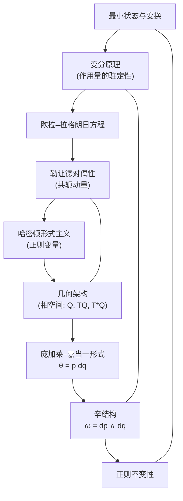

# 重构经典力学：基础的重新构想
* * *

--- 基础中的简洁，运动中的普遍性。

# **I. 引言**  
**题词：**  
*"宇宙以简洁的语言诉说；要听到它，我们必须首先忘却多余的。"*

经典力学在其传统形式中，通常通过牛顿、拉格朗日和哈密顿理论的既定且多面的表述来呈现。这些方法中的每一种都极大地促进了我们对运动和动力学的理解。然而，在它们的经验成功之下隐藏着一个分层结构 —— 当将其简化到最基本的本质时，揭示出一个更为优雅且普遍的基础。

## I.1. 标准方法回顾

**牛顿力学：**  
在最熟悉的层面上，经典力学通过牛顿运动定律引入。在这里，系统的动力学由关系式  
$$
F = m\,a,
$$  
支配，力直接导致加速度。尽管这种表述有效地描述了日常现象，但它主要是运动学的，并且主要依赖于力的语言，这在许多复杂场景中可能掩盖了更深层次的对称性。

**拉格朗日力学：**  
相比之下，拉格朗日力学通过最小作用量原理重新表述了动力学。系统的演化被封装在作用泛函中  
$$
S[q(t)] = \int_{t_1}^{t_2} L(q, \dot{q}, t)\,dt,
$$  
驻定性条件 ($\delta S = 0$) 直接导致欧拉-拉格朗日方程。这种变分方法将重点从力转移到能量差和边界贡献上，暗示了一个更丰富的几何结构。然而，许多优雅之处仍隐藏在历史推导和技术细节的层层之中。

**哈密顿力学：**  
哈密顿力学进一步提升了这一框架，通过相空间引入了对偶描述。通过勒让德变换，哈密顿量  
$$
H(q, p, t) = p\,\dot{q} - L(q, \dot{q}, t)
$$  
出现，突显了构型变量 $q$ 及其共轭动量 $p$ 之间的相互作用。这种形式不仅以不变的方式封装了守恒定律，还揭示了相空间的辛结构 —— 一种在正则变换下保持稳健的几何结构。

## I.2. 对基础重新想象框架的需求

尽管这些传统表述取得了成功，但它们是几个世纪逐步发展的结果。在这个过程中，许多“偶然”的细节累积下来，有时会掩盖支配物理系统动力学的核心原则。那么，如果我们剥去所有历史束缚，仅使用现代数学和物理学中最基本、最超越性的思想从头开始重新组装经典力学，会怎样呢？

我们的项目旨在做到这一点。我们首先质疑“状态”及其变换的概念，放弃传统的位移和速度标签，转而采用直接与自然界对称性相关的不变描述。然后，我们构建一个框架，其中最优性原理 —— 表达为适当定义的作用量的驻定性 ($\delta S = 0$) —— 作为动力学产生的中心公理。通过勒让德变换，我们揭示了传统意义上的构型空间和动量空间之间的一种基本对偶性，从而将它们统一为单一的几何对象。

## I.3. 现代数学直觉

我们的重新审视将以现代数学工具为基础：  
- **微分几何：** 提供了一种坐标无关的语言，用于描述光滑流形上系统的演化。  
- **变分分析：** 提供深刻见解，说明最优路径如何自然地作为 $\delta S = 0$ 的解出现，超越标准计算技术。  
- **对称群：** 其不变性不仅阐明了守恒定律，还揭示了隐藏的几何结构，例如辛形式中表达的那些。

这些现代观点表明，我们传统上认为是分离的表述 —— 牛顿、拉格朗日和哈密顿力学 —— 实际上是单一连贯概念框架的不同表现形式。通过对经典力学从其最基本的构成要素进行重新想象，我们希望挖掘出其核心的简洁性。

## I.4. 铺垫舞台

本文档被组织为一个分层的旅程，从最小状态和不变变换的公式化开始，经过变分原理及其对偶重构，最终达到相空间和辛结构的全面几何架构。每一章都建立在前一章的基础上，最终目标是以一种既根本简单又普遍适用的形式重建经典力学。

在接下来的章节中，我们将剥离历史层次，将经典力学提炼为其本质，不仅揭示其深刻的美，还揭示其激发理论和应用物理学新方向的潜力。这个重新想象的框架旨在作为深入探究和创新的跳板，邀请我们以焕然一新的清晰度和目标探索运动和动力学的领域。

# **II. 基础原语：最小状态与变换**  
**题词：**  
*"从复杂性的虚空中，简洁作为存在的真正本质浮现出来。"*

在我们从最根本的根源重建经典力学的过程中，首先提出的问题是：物理系统的最简单描述是什么？为了解答这一问题，我们引入了**状态**的概念以及作用于其上的**变换**，摆脱多余的坐标依赖。

## II.1. 状态的抽象定义

一个**状态**可以被理解为系统在某一时刻的所有信息的最基本载体 —— 一个理想化的快照，涵盖了系统的本质属性。在我们的框架中，我们将状态定义为一个抽象集合 $\mathcal{S}$ 的元素，该集合配备了捕捉其物理性质所需的最小结构。与依赖特定坐标甚至空间位置的传统观点不同，我们对状态的理解完全是**坐标不变的**。换句话说，如果 $s \in \mathcal{S}$ 表示一个状态，则其定义不依赖于任意特定的坐标空间嵌入。

数学上，可以将状态空间设想为一个配备了动力学所需的最小但充分结构的流形。例如，不必从坐标图表开始，我们仅假设存在一个抽象流形 $\mathcal{M}$，使得每个物理状态对应于 $\mathcal{M}$ 中的一个点。这种状态的本质特性是其普适性 —— 它封装了描述系统所需的基本信息，无论观察者或坐标系如何。

## II.2. 不变变换作为变化的语言

在以最简形式定义状态之后，下一步是形式化状态如何演化或一个状态如何与另一个状态相关联。这些关系由**变换**捕捉，变换是状态之间的映射，保留状态空间的内在结构。我们用映射表示变换为  
$$
T: \mathcal{S} \to \mathcal{S}.
$$

这里的核心思想是，变换编码状态的变化或演化，同时尊重状态空间的底层不变量。在我们的抽象表述中，这些变换不是任意的；它们属于一组**不变群**，该组保留状态空间的本质属性。例如，如果变换 $T$ 保持 $\mathcal{M}$ 上定义的内在距离、顺序或其他结构性特征不变，则我们说  
$$
T(s) \quad \text{has the same intrinsic structure as} \quad s,
$$
对于每个 $s \in \mathcal{S}$ 成立。

这些不变变换构成了自然界表达变化的语言。它们在现代物理学中扮演类似于对称性的角色，其中在某个特定群(例如李群)下的不变性直接与守恒定律相关联。例如，时间平移不变性导致能量守恒，而空间平移不变性导致动量守恒。在我们的原始语言中，重点不在于具体的守恒量，而是自然演化的简单事实，即它保留了一组基本的底层结构。

## II.3. 内在对称原理作为结构支柱

嵌入在状态定义及其变换中的**对称原理**是整个物理学的核心。这些原理本质上独立于任何坐标表示。在此上下文中，对称性是状态空间的一个自同构：
$$
\Phi: \mathcal{S} \to \mathcal{S}
$$
它使每个状态的结构性特征保持不变。这样的自同构可以被视为守恒定律的一种精炼表达 —— 体现了系统动力学不会改变其本质属性的思想。

从最小状态 $s$ 和作用于其上的变换集合 $T$ 出发，我们可以推导出一整套概念层次。例如，当这些变换满足群性质 —— 封闭性、结合律、单位元的存在性和逆元的存在性时，它们形成一个对称群 $G$。这种群结构不是人为强加的，而是状态相互作用和演化方式的自然结果。

## II.4. 相互联系与进一步结构的种子

这里引入的基础原语 —— 抽象状态及其不变变换 —— 并不是孤立的概念。相反，它们充当更复杂结构自然生长的种子。后续章节中将发展的经典力学的变分公式，源自考虑这些最小状态如何最优地变化。不同状态描述之间的对偶性(如构型与动量之间的对偶性)以及相空间的几何结构(及其固有的辛形式)都可以追溯到此处阐述的基本概念。

通过从去除至极简、坐标无关的状态视角出发，并定义保留此最小结构的变换，我们揭示了动力学背后的固有简洁性。这种方法不仅提供了对经典力学更透明的理解，还开启了重新思考已建立概念的新途径，邀请我们以焕然一新的方式看待旧有理论。

在接下来的章节中，我们将基于这些原语逐步构建一个完整而深入的经典力学框架，既富有洞察力又足够灵活，能够激发新的理论方向。

# **III. 动力学源于最优性：变分原理**  
**题词：**  
*"自然偏爱阻力最小的路径 —— 这不是偶然，而是设计使然。"*

在经典力学中，任何系统的演化都深刻地受最优性原则支配。我们断言，自然界所采取的真实路径是相对于某个特定量 —— 作用量而言的驻定路径。这一基本概念被封装在变分原理中，该原理规定实际的系统轨迹使得适当定义的作用泛函的变化为零。

## III.1. 作用泛函

我们首先定义与系统相关的作用泛函 $S[q(t)]$，该系统沿着路径 $q(t)$ 在两个时刻 $t_1$ 和 $t_2$ 之间演化。作用量由下式给出：
$$
S[q(t)] = \int_{t_1}^{t_2} L(q, \dot{q}, t) \, dt,
$$
其中 $L(q, \dot{q}, t)$ 是系统的拉格朗日函数，表示动能和势能之差(或者更一般地，其驻定值封装了正确动力学的量)。假设拉格朗日函数是其自变量的光滑函数，从而保证作用量在足够光滑的路径 $q(t)$ 上良好定义。

## III.2. 欧拉-拉格朗日方程的推导

为了揭示 $S[q(t)]$ 中编码的动力学，我们考虑任意无穷小变化 $q(t) \rightarrow q(t) + \delta q(t)$，并且固定端点，即
$$
\delta q(t_1) = \delta q(t_2) = 0.
$$

相应的作用量的变化为
$$
\delta S = \delta \int_{t_1}^{t_2} L(q, \dot{q}, t) \, dt = \int_{t_1}^{t_2} \left( \frac{\partial L}{\partial q}\, \delta q + \frac{\partial L}{\partial \dot{q}} \, \delta \dot{q} \right) dt.
$$

注意到 $\delta \dot{q} = \frac{d}{dt} (\delta q)$，此表达式变为
$$
\delta S = \int_{t_1}^{t_2} \left( \frac{\partial L}{\partial q}\, \delta q + \frac{\partial L}{\partial \dot{q}}\, \frac{d}{dt} (\delta q) \right) dt.
$$

为了进一步推进，我们将包含 $\delta \dot{q}$ 的项分部积分：
$$
\int_{t_1}^{t_2} \frac{\partial L}{\partial \dot{q}}\, \frac{d}{dt} (\delta q) \, dt = \left. \frac{\partial L}{\partial \dot{q}}\, \delta q \right|_{t_1}^{t_2} - \int_{t_1}^{t_2} \frac{d}{dt} \left( \frac{\partial L}{\partial \dot{q}} \right) \delta q \, dt.
$$

由于变化在端点处消失(为零)，边界项 $\left. \frac{\partial L}{\partial \dot{q}}\, \delta q \right|_{t_1}^{t_2}$ 为零。因此，作用量的变化简化为
$$
\delta S = \int_{t_1}^{t_2} \left[ \frac{\partial L}{\partial q} - \frac{d}{dt} \left( \frac{\partial L}{\partial \dot{q}} \right) \right] \delta q \, dt.
$$

为了使作用量 $S$ 在任意变化 $\delta q(t)$ 下保持驻定，被积函数必须恒等于零。这一要求产生了著名的**欧拉-拉格朗日方程**：
$$
\frac{d}{dt} \left( \frac{\partial L}{\partial \dot{q}} \right) - \frac{\partial L}{\partial q} = 0.
$$

这个微分方程仅从驻定性原理出发，完整描述了系统的动力学。

## III.3. 边界项及其含义的讨论

尽管我们的推导假设了固定端点(从而使边界项为零)，但更深入的检查表明，当允许端点变化时，边界贡献具有重要的物理意义。在这种情况下，边界项
$$
\left. \frac{\partial L}{\partial \dot{q}}\, \delta q \right|_{t_1}^{t_2}
$$
不能轻易忽略。这一项与正则动量的概念密切相关。事实上，通过定义与 $q$ 共轭的动量为
$$
p = \frac{\partial L}{\partial \dot{q}},
$$
边界贡献实际上编码了边界状态变化如何影响系统的演化。因此，项 $p\, \delta q$ 可以被视为引入几何结构(例如庞加莱-嘉当 $1$-形式)的前奏，这些将在后续章节中详细阐述。即使在端点固定的情况下，承认边界项的潜在重要性也能丰富我们对整体框架中守恒定律和对称性的理解。

## III.4. 变分最优性的本质

本质上，变分原理体现了这样一个思想：系统所采取的路径是使作用量驻定的路径。这种最优性要求 —— 无论它表现为严格极小值、极大值还是鞍点 —— 都不是数学便利性的产物。相反，它是关于物理过程内在性质的深刻陈述。通过沿着驻定作用量的路径演化，系统有效地“选择”了在状态间转换的最有效方式，反映了自然本身的深层属性。

这一视角不仅简化了运动方程的推导，还提供了一个统一的原则，该原则贯穿于经典力学和量子力学的表述之中。作用量原理中的优化暗示了物理系统行为的普遍性，这种普遍性最终与它们演化的底层空间的对称性和不变性性质相关联。

## III.5. 转向对偶方法

强调作用量驻定性的变分公式构成了经典力学的基石。它揭示了状态演化是如何在不诉诸外力的情况下确定的。此外，这种方法为通过勒让德变换对动力学进行对偶描述铺平了道路 —— 这一主题将在下一章中详细探讨。从欧拉-拉格朗日方程过渡到哈密顿动力学，我们揭示了构型变量和动量变量之间的复杂对偶性，最终丰富了我们对运动力学的几何理解。

## III.6. 结论

总之，通过要求作用量 $S[q(t)] = \int_{t_1}^{t_2} L(q, \dot{q}, t)\,dt$ 在无穷小变化下保持驻定，我们推导出欧拉-拉格朗日方程，这些方程规定了系统的自然演化。这一变分原理不仅仅是获得运动方程的工具 —— 它是一个关于自然界织物背后最优性的陈述。它揭示了系统的动力学受一种内在驱动力支配，这种驱动力促使系统遵循驻定作用量的路径，这一概念与现代几何启发的经典力学观点深深共鸣。

# **IV. 从变分计算到对偶性：勒让德变换及其超越**  
**题词：**  
*"在每一次变换中，都隐藏着一种对偶真理，他等待被揭示。"*

基于变分原理的基础，我们现在将注意力转向如何将以作用量驻定性推导的动力学重新表述为一种等价但深刻对偶的形式。这种对偶图像自然地通过**勒让德变换**浮现，它连接了欧拉-拉格朗日(变分)描述与哈密顿框架。

## IV.1. 勒让德变换：定义与推导

考虑由拉格朗日函数描述的系统  
$$
L(q, \dot{q}, t),
$$  
其中 $q$ 表示构型变量，$\dot{q}$ 是其时间导数。从变分原理出发，我们得到欧拉-拉格朗日方程；然而，这些方程同时涉及 $q$ 和 $\dot{q}$。为了建立对偶表述，我们定义共轭动量 $p$ 为  
$$
p = \frac{\partial L}{\partial \dot{q}}.
$$

假设正则性条件成立 —— 即海森矩阵  
$$
\frac{\partial^2 L}{\partial \dot{q}^2}
$$  
是非退化的 —— 我们可以反解此关系，将 $\dot{q}$ 表示为 $q$ 和 $p$ 的函数。随后，勒让德变换引入哈密顿量 $H(q, p, t)$ 如下：  
$$
H(q, p, t) = p \dot{q} - L(q, \dot{q}, t),
$$  
其中 $\dot{q} = \dot{q}(q, p, t)$ 被理解为通过反解动量关系得到的函数。

## IV.2. 揭示对偶性：构型空间与动量空间

勒让德变换所编码的转换揭示两个看似不同领域之间的深刻对偶性：

- **构型空间 ($Q$) 和切丛 ($TQ$):**  
  在拉格朗日表述中，系统的状态由 $(q, \dot{q})$ 描述，位于切丛 $TQ$ 中。虽然 $q$ 表示位置，但 $\dot{q}$ 提供变化率 —— 二者共同构成动力学状态的完整图景。

- **动量空间和余切丛 ($T^*Q$):**  
  在进行勒让德变换后，自然变量变为 $(q, p)$，它们位于余切丛 $T^*Q$ 中。这里，$p$ 表示共轭动量。这一转变封装了相同物理信息的重新打包：我们不再追踪速度 $\dot{q}$，而是关注动量 $p$。

这种对偶性极为深刻；它不仅仅是变量的变化，而是一种揭示经典力学隐藏几何结构的变换。欧拉-拉格朗日形式和哈密顿形式是同一理论的两面，通过这种变换映射相互关联。本质上，勒让德变换揭示 $q$ 和 $p$ 之间支撑动力学的内在对称性。

## IV.3. 欧拉-拉格朗日形式与哈密顿形式的互补角色

欧拉-拉格朗日方程通过驻定作用量原理直接从拉格朗日函数获得运动方程，提供了一种强大的方法。它们以坐标相关的方式封装动力学，关系如下：  
$$
\frac{d}{dt} \left( \frac{\partial L}{\partial \dot{q}} \right) - \frac{\partial L}{\partial q} = 0.
$$

另一方面，经过勒让德变换后的哈密顿表述将动力学重铸为 $q$ 及其共轭动量 $p$ 的演化。哈密顿方程表示为：  
$$
\dot{q} = \frac{\partial H}{\partial p}, \qquad \dot{p} = -\frac{\partial H}{\partial q}.
$$

这种对偶描述不仅仅是一个数学上的奇思妙想；它提供了显著的优势：
- **几何清晰性**：哈密顿表述自然地在 $T^*Q$ 上产生辛结构，其中不变的辛形式 $\omega = dp \wedge dq$ 支撑了演化和守恒定律。
- **不变性和正则变换**：该框架非常适合讨论正则变换，即 $T^*Q$ 上保持辛几何的变量变换，从而保留理论的基本结构。
- **向量子力学和场论的扩展**：对偶形式及其几何解释是过渡到量子力学(通过正则量子化)以及进一步扩展到场论的重要基石。

因此，尽管欧拉-拉格朗日方法强调动力学的变分起源，哈密顿视角则照亮了理论深刻的几何对偶性。

## IV.4. 超越变换：对偶性的意义

勒让德变换不仅提供了力学的另一种描述，还暗示了一个更丰富的概念框架：
- **不变结构**： $q$ 和 $p$ 之间的对偶性表明运动基本定律独立于所选择的具体表示。这种不变性构成守恒定律和对称性的基础。
- **统一描述**：从变分原理到哈密顿表述，系统的动力学在最优性和不变性的共同原则下实现统一。即使在不同表示之间转换，底层的物理内容依然保持不变。
- **通往现代几何的大门**：从 $TQ$ 到 $T^*Q$ 的映射预示了进入现代辛几何的领域，在这个领域中，物理系统的演化被编码在变换下持久的不变几何结构中。

## IV.5. 关于对偶性的总结

总之，勒让德变换充当了揭示经典力学对偶本质的门户。它将变分的欧拉-拉格朗日描述与对偶的哈密顿图像连接起来，统一了构型空间和动量空间上的动力学。这种变换不仅仅是一种数学形式的变化；它是对理论本身结构的深刻洞察 —— 一种诉说着支配自然界规律的普遍性和不变性的语言。

通过接受这种对偶性，我们不仅获得了对经典力学更深入的理解，还为探索进一步的几何和理论发展奠定基础。在接下来的章节中，这种对偶视角将成为构建相空间辛结构的基础，最终丰富我们对动力学系统完整不变结构的掌握。

# **V. 动力学的几何架构：相空间与辛结构**  
**题词：**  
*"运动的几何中蕴含着宇宙不变的节奏。"*

经典力学的几何表述提供一个深刻的视角，使我们得以审视运动定律。这远非简单的重新表述，这一视角揭示了动力学受不变几何结构的支配，这些结构在自然变换下保持不变。在本章中，我们通过定义动力学所处的空间并引入封装不变性和守恒性的辛形式，构建几何基础。

## V.1. 构型空间、切丛和余切丛

位于**构型空间** $Q$ 的基础，它表示物理系统可以假设的所有可能位置或构型。每个点 $q \in Q$ 指定系统的唯一构型，独立于任意附加结构。

在拉格朗日表述中，动力学在构型空间的**切丛** $TQ$ 上被自然地描述。切丛是 $Q$ 每一点上所有切向量的集合。$TQ$ 中的一点记为 $(q, \dot{q})$，其中 $\dot{q}$ 表示 $q$ 处的速度。该丛作为表达拉格朗日函数  
$$
L(q, \dot{q}, t),
$$  
以及推导欧拉-拉格朗日方程的自然场所。

与切丛对偶的是**余切丛** $T^*Q$，它是连接到 $Q$ 每一点的所有余向量(或动量)的空间。$T^*Q$ 中的一个点记为 $(q, p)$，其中 $p$ 是由以下关系定义的共轭动量：  
$$
p = \frac{\partial L}{\partial \dot{q}}.
$$  
余切丛是哈密顿力学的自然环境，以强调通过勒让德变换导出的位置和动量之间的深刻对偶性的方式捕捉动力学。

## V.2. 庞加莱-嘉当 $1$-形式

几何表述的核心是定义在余切丛 $T^*Q$ 上的**庞加莱-嘉当 $1$-形式**。在局部坐标中，该 $1$-形式由下式给出：  
$$
\theta = p\,dq.
$$

此 $1$-形式封装沿着轨迹所做的无穷小功，并提供了将变分原理与辛几何联系起来的强大工具。当沿着 $T^*Q$ 中的路径积分时，$\theta$ 恢复了关于系统动力学的基本信息。

## V.3. 辛形式的推导

我们几何构造的下一步是定义**辛形式** $\omega$，它是庞加莱-嘉当 $1$-形式的外微分：
$$
\omega = -\,d\theta.
$$

显式计算外微分，我们有  
$$
d\theta = d(p\,dq) = dp \wedge dq,
$$  
因此，  
$$
\omega = -\,d\theta = dp \wedge dq.
$$  

这个 $2$-形式 $\omega$ 具有三个基本性质：
- **闭合性**： $d\omega = 0$。这直接由外微分的性质得出，确保辛结构在光滑变形下保持不变。
- **非退化性**：由 $\omega$ 诱导的从 $T^*Q$ 的切空间到其对偶空间的映射是一个同构，这对于唯一定义动力学至关重要。
- **正则变换下的不变性**：辛形式在保持正则结构的变换下保持不变。这些变换称为正则变换或辛变换，是动力学固有的守恒律的几何体现。

## V.4. 正则变换与守恒律

**正则变换**是 $T^*Q$ 中从 $(q, p)$ 到 $(Q, P)$ 的坐标变换，它保持辛形式不变：  
$$
\omega = dp \wedge dq = dP \wedge dQ.
$$  

这些变换构成一个被称为辛群的群，它们的不变性性质直接通过诺特定理与守恒律相关联。例如：
- 时间平移的不变性对应能量守恒。
- 空间平移的不变性对应动量守恒。
- 旋转的不变性对应角动量守恒。

在整个正则变换过程中保持 $\omega$ 不变，确保了深层几何结构以及基本运动定律即使在重新参数化系统的自由度时也保持完整。

## V.5. 与变分和对偶表述的整合

本章介绍的构造扩展并整合了第四章概述的对偶性。回想一下，勒让德变换提供了从 $TQ$ 中的欧拉-拉格朗日表述到 $T^*Q$ 中的哈密顿描述的桥梁。$T^*Q$ 上的辛结构通过提供无坐标的内在几何动力学描述强化了这种对偶性。

实际上，要求作用量  
$$
S[q(t)] = \int_{t_1}^{t_2} L(q, \dot{q}, t) \, dt
$$  
驻定的变分原理现在可以在几何框架内进行解释。在这里，$T^*Q$ 中的轨迹由辛形式 $\omega$ 支配，其演化完全由哈密顿量 $H(q, p, t)$ 通过哈密顿方程决定：  
$$
\dot{q} = \frac{\partial H}{\partial p}, \qquad \dot{p} = -\frac{\partial H}{\partial q}.
$$  

由于这些方程源自 $\omega$ 的保持，它们体现了经典力学中变分、对偶和几何视角的统一。

## V.6. 关于几何架构的总结

我们构建的几何架构，由构型空间 $Q$、其切丛和余切丛、庞加莱-嘉当 $1$-形式 $\theta = p\,dq$ 和辛形式 $\omega = dp \wedge dq$ 定义，不仅仅是经典力学的重新表述 —— 它是对物理系统如何演化的深刻且不变的描述。正则变换保持这种结构，确保无论使用何种坐标系统，守恒律和对称性都显现出来。

这种几何观点不仅统一了欧拉-拉格朗日和哈密顿形式所提供的对偶图像，还为进一步的发展奠定基础。它是现代辛几何甚至量子力学部分元素的基础。

总之，宇宙不变的节奏被编码在相空间的辛几何中 —— 一种捕捉所有物理系统演化的本质不变性和守恒原则的语言。这一框架自然地从变分原理和勒让德变换揭示的对偶性中浮现，为在最根本层面上理解经典力学提供了令人信服且统一的基础。

# **VI. 综合与新视野：整合框架与未来展望**  
**题词：**  
*"每一个新的洞见都是明日发现的种子。"*

我们探索经典力学基础的旅程是一次逐步揭示的过程 —— 从定义最小状态和不变变换出发，经过变分原理及其对偶重述，到相空间和辛形式所展现的复杂几何架构。在本章中，我们将综合这些概念，并通过将现代洞见与经典思想相结合，为未来的发现指明方向。

## VI.1. 回顾旅程

我们从假设系统的演化最好通过其最简单的描述来理解开始。通过抽象地定义一个**状态** —— 独立于任意坐标系统 —— 并识别相关的不变变换，我们为超越传统的局限于坐标的表述奠定了基础。

随后引入了**变分原理**，它由以下要求封装：  
$$
\delta S = 0, \quad\text{with } S[q(t)] = \int_{t_1}^{t_2} L(q,\,\dot{q},\,t)\,dt,
$$  
这一原理不仅导出了欧拉-拉格朗日方程，还揭示了当边界项被适当考虑时，守恒律和不变结构的自然出现。

为了弥合变分表述与更几何化、对偶理解之间的差距，我们应用了**勒让德变换**。该变换将切丛 $TQ$ 上的拉格朗日表述映射到余切丛 $T^*Q$ 上的哈密顿图像，从而揭示了构型空间与动量空间之间深刻的对偶性。这一转变带来了哈密顿方程  
$$
\dot{q} = \frac{\partial H}{\partial p}, \quad \dot{p} = -\frac{\partial H}{\partial q},
$$  
它们不仅重新确认了动力学，还暗示了一种潜在的几何统一性。

进一步地，我们构建了经典力学的**几何架构**。通过引入庞加莱-嘉当 $1$-形式  
$$
\theta = p\,dq,
$$  
以及推导出的辛形式  
$$
\omega = -\,d\theta = dp \wedge dq,
$$  
我们在无坐标的框架下封装了不变性和守恒的本质。$\omega$ 在正则变换下的不变性保证了几何结构 —— 以及物理定律 —— 在视角变化下保持不变。

## VI.2. 重构方法与传统方法的比较

经典力学的传统方法，如牛顿、拉格朗日和哈密顿表述，各自提供了对物理系统动力学的宝贵见解。然而，它们通常依赖于历史构造和坐标相关的形式主义。相比之下，我们的重构框架追求**基础极简主义**。它剥离了积累的层次，暴露了核心原则：

- **超越坐标**：通过以不变的抽象方式定义状态，我们克服了坐标相关描述的局限性。
- **统一的变分与几何视角**：变分原理不再仅仅被视为一种计算工具，而是作为底层最优性的指示器。当结合勒让德变换和辛几何时，它提供了一个统一欧拉-拉格朗日形式和哈密顿形式的对偶图像。
- **内在不变性**：我们的方法强调对称性和不变性 —— 从作用量在变换下的不变性到辛形式在正则变换下的保持 —— 突显普遍守恒律是几何结构的自然结果。

通过这样做，重构的表述提供了更大的清晰度，促进了更深入的理论研究，并揭示了可能在更传统处理中被掩盖的联系。

## VI.3. 新的联系与未来方向

**a. 量子力学及更远领域：**  
此处提出的几何框架为**量子力学**奠定了有希望的基础。相空间的辛结构以及 $q$ 和 $p$ 的对偶性暗示了规范量化的自然途径。事实上，通过以类似的不变方式重新表述量子动力学，我们可能会揭示关于量子-经典对应的新见解，并解决有关量子态演化和测量的未解决问题。

**b. 场论与规范不变性：**  
我们重构背后的原则并不局限于有限维系统。它们在**场论**中有类似物，在那里出现了无限维构型空间及其余切丛。这里讨论的不变性原则与规范不变性的概念密切相关，可能引导我们对高能物理学中的基本相互作用进行更几何的理解。

**c. 跨学科应用：**  
除了传统的物理领域之外，最小状态定义、最优性以及辛不变性的概念在许多领域具有潜在应用。例如：
- **控制理论与机器人学**：由不变原则支配的最佳轨迹的概念可以启发新的机器人运动和动态控制系统算法。
- **复杂系统与经济学**：抽象状态空间和不变变换为建模复杂适应系统和经济网络的演化动力学提供了新视角。
- **机器学习与优化**：基于变分原理的技术可能导致开发新的优化方法，这些方法本质上保留高维数据中的几何或拓扑结构。

**d. 数学发展：**  
变分微积分、勒让德变换和辛几何之间的相互作用开辟了丰富的数学领域。微分几何、拓扑甚至范畴论的进步可能会进一步阐明物理的底层结构，并激发数学物理学的新研究分支。

## VI.4. 综合结论

通过将现代基础方法与经典原理相结合，我们重新构想了经典力学作为一个统一的、几何不变的结构。这种综合不仅阐明了动力学系统的内在本质，还为未来的研究提供了跳板。无论是将这些思想扩展到量子领域，将其与场论构造融合，还是将其应用于跨学科挑战，重构的框架都体现了多样化物理现象背后的深刻统一性。

回顾我们的旅程 —— 从最小原语到相空间的复杂几何 —— 显而易见的是，每一个新的洞见都为进一步的发现铺平了道路。随着我们继续探究自然的基本结构，最优性、对偶性和不变性原则将继续成为我们的指引之光，承诺揭示宇宙更深层次的秘密。

这种综合不仅弥合了传统与现代表述之间的鸿沟，还描绘了一条富有远见的前进之路，激励理论进步和科学演变背景下的实际应用。

# **VII. 结论**  
**题词：**  
*"在追求真理的过程中，简洁不是幼稚 —— 它是通往深刻理解的直接路径。"*

随着我们结束这一探索之旅，回顾我们所经历的过程至关重要 —— 这是一段试图从最根本的基础重构经典力学的旅程。我们从这样一个观念开始：状态及其变换的最小化、不变性描述提供了无与伦比的清晰度。通过剥离坐标相关的细节，我们揭示了物理动力学背后的本质思想。

我们表述的核心在于**变分原理**。以作用量的驻定性表达为  
$$
S[q(t)] = \int_{t_1}^{t_2} L(q, \dot{q}, t)\,dt,
$$  
这一原理不仅仅是数学上的便利，而是对自然界最优演化的深刻断言。通过要求 $\delta S = 0$，我们推导出了欧拉-拉格朗日方程 —— 这些方程内在地体现了支配系统的守恒律。

作为变分视角的补充，**勒让德变换**揭示了构型(位置和速度)与动量之间的显著对偶性。这种对偶性远不止是变量的变换；它揭示了一种深刻的几何对称性。通过从切丛 $TQ$ 转换到余切丛 $T^*Q$，我们的框架自然整合了哈密顿形式，并引入了辛结构的概念。

**几何架构**的构建 —— 从定义构型空间 $Q$，到建立庞加莱-嘉当 $1$-形式  
$$
\theta = p\,dq,
$$  
再到推导的辛形式  
$$
\omega = -\,d\theta = dp \wedge dq,
$$  
提供了一个不变的基础，在此基础之上正则变换保持运动的不变几何。这种几何视角不仅调和了变分与对偶方法，还深化了我们对守恒原则和不变性的理解。

通过综合这些思想，我们再次确认了**极简基础概念**的力量以及**变分最优性**的价值 —— 这些实践揭示了动力学的本质架构。我们的框架鼓励这样一种观点：几何对偶性和辛不变性并非仅仅是形式主义的产物，而是可以引导进一步探究的基本真理。

展望未来，这一精炼的重构不仅加深了我们对经典系统的理解，还为新的领域提供了坚实的基础。它邀请进一步研究的方向包括：

- **量子力学**：通过弥合经典与量子描述之间的差距，利用规范量化并探索量子-经典对应关系。  
- **场论与规范不变性**：将这些原则扩展到场论的无穷维领域，可能为支配基本粒子和力的相互作用提供新的见解。  
- **跨学科应用**：将不变几何结构应用于控制理论、机器人学、复杂系统甚至高维数据优化，可促进跨学科突破。

最终，我们重新构想的方法的精神在于其对简单性和普遍性的不懈承诺。通过回归本质原则并从第一性原理重新组装框架，我们为深刻的新理解和现代物理学中的创新路径打开了大门。

这一精炼的框架是对探索的明确呼唤 —— 它邀请我们更深入地审视现实的结构，承认将物理宇宙结合在一起的隐藏对称性和不变性，并将这些洞见作为未来发现的基础。在这追求真理的过程中，拥抱极简主义和最优性将继续照亮道路，引导我们更加接近运动的根本本质以及超越其后的奥秘。

# 附录 A：概念的相互联系

以下的附录部分，通过表格和图表总结本文档中发展的核心思想和重要概念之间的关系。

## A.1. 核心概念及其关系表

| **核心概念**                     | **相关概念**                                                                                                                                                     | **描述/关系**                                                                                                                                                                                                                          |
|--------------------------------------|--------------------------------------------------------------------------------------------------------------------------------------------------------------------------|-------------------------------------------------------------------------------------------------------------------------------------------------------------------------------------------------------------------------------------------------------|
| **最小状态与变换**                 | 不变性；抽象状态空间 $\mathcal{S}$；对称群                                                                                                      | 重构的起点。状态定义不依赖于坐标，而不变变换及其群性质编码所有动力学固有的“变化语言”和对称原则。                                                                                   |
| **变分原理**                       | 驻定性 ($\delta S = 0$)；作用量泛函 $S[q(t)]$                                                                                                      | 自然界的最优性原理，系统的真实演化使作用量最小化或驻定化。这一原理自然导出欧拉-拉格朗日方程，作为经典动力学的引擎。                                                                 |
| **欧拉-拉格朗日结构**              | 拉格朗日函数 $L(q, \dot{q}, t)$；边界项                                                                                                        | 由作用量的驻定条件导出，这些方程提供了动力学的完整描述。当边界项被适当处理时，它们揭示了底层守恒律。                                                                                  |
| **勒让德对偶性**                   | 共轭动量 $p = \frac{\partial L}{\partial \dot{q}}$；$TQ$ 和 $T^*Q$ 的对偶性                                                                 | 勒让德变换将欧拉-拉格朗日表述转换为哈密顿框架，揭示了构型(位置/速度)和动量描述之间深刻的对偶性。                                                                                 |
| **哈密顿形式主义**                 | 哈密顿方程；正则变量 $(q, p)$                                                                                                                     | 这一从勒让德对偶性产生的对偶图像，用正则变量表达系统的动力学，突显内在守恒律，并为通过相空间的几何解释奠定基础。                                                                   |
| **几何架构(相空间)**             | 构型空间 $Q$；切丛 $TQ$；余切丛 $T^*Q$                                                                                        | 动力学展开的几何舞台。$TQ$ 是拉格朗日图像的宿主，而 $T^*Q$ 提供了哈密顿动力学的自然场所，并支撑经典力学的整体几何表述。                                                           |
| **庞加莱-嘉当 $1$-形式**              | $\theta = p\,dq$                                                                                                                                                      | 一个微分 $1$-形式，连接变分原理与几何。它捕捉相空间轨迹上的无穷小功，是辛结构的前驱。                                                                                                  |
| **辛结构**                         | 辛形式 $\omega = -d\theta = dp \wedge dq$；正则变换；不变性                                                                              | 这一不变的几何结构编码守恒律，并确保动力学在坐标变换下的一致性。它构成哈密顿框架中正则不变性的严格数学基础。                                                                 |
| **正则不变性**                     | 在正则(辛)变换下的保持性；诺特定理                                                                                             | 强调物理定律在辛重新参数化下保持不变，反映底层对称性与守恒量(如能量、动量、角动量)之间的深刻联系。                                                                               |

## A.2. 概念关系图

以下是图表，直观地捕捉了核心概念之间的流动和相互关系：

**说明：**  
- **A → B**：重构从最小化、坐标不变的状态和变换定义开始，演变为普遍的变分原理。  
- **B → C**：对作用量施加驻定性条件，得到描述状态演化的欧拉-拉格朗日方程。  
- **C → D**：应用勒让德变换通过定义共轭动量将欧拉-拉格朗日框架转换为对偶表述。  
- **D → E**：这一变换自然引出具有正则变量的哈密顿动力学。  
- **E → F**：哈密顿力学建立在相空间的几何基础上，由构型空间及其丛结构化。  
- **F → G → H**：在余切丛上引入庞加莱-嘉当 $1$-形式，其外导数产生辛形式。  
- **H → I**：辛结构强制正则不变性，确保深层几何支撑守恒律和物理对称性。  
- **交叉链接**：变分原理 (B) 和勒让德对偶性 (D) 与新兴的几何结构 (F, H) 深刻相连，并循环回溯以强化基础概念。

本附录可以帮助读者快速可视化并理解核心概念如何相互交织，形成我们在重新构想的经典力学中的连贯统一框架。

