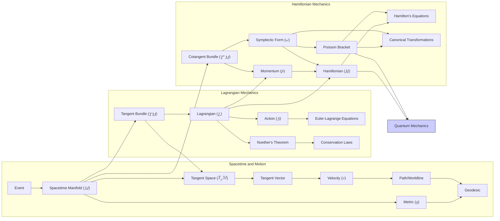

# Dynamics from First Principles: A Geometric Reconstruction of Classical Mechanics
* * *

--- From the flow of change arises the structure of symmetry.

# **Part I: The Foundation: Spacetime and Motion**
* * *

# **Chapter 1: The Arena: Spacetime as a Manifold**

*Epigraph:* "Nature is written in mathematical language." – Galileo Galilei

This chapter lays the groundwork for our geometric reconstruction of classical mechanics. We begin by introducing the fundamental concepts of events and the spacetime manifold, providing the mathematical stage upon which all physical phenomena will unfold.

## **1.1 Events and the Spacetime Manifold ($\mathcal{M}$)**

At the most fundamental level, physics is concerned with describing *events*. An event represents a physical occurrence localized in both space and time. It is the most primitive concept in our construction. To give these intuitive notions a precise mathematical meaning, we introduce the concept of a *manifold*.

A *smooth manifold* $\mathcal{M}$ is a topological space that locally resembles Euclidean space $\mathbb{R}^n$. This means that for every point $p \in \mathcal{M}$, there exists a neighborhood of $p$ that is homeomorphic to an open subset of $\mathbb{R}^n$. This local resemblance allows us to introduce *coordinate charts* or *local coordinate systems*. A coordinate chart is a pair $(U, \phi)$, where $U$ is an open subset of $\mathcal{M}$ and $\phi: U \rightarrow \mathbb{R}^n$ is a homeomorphism onto an open subset of $\mathbb{R}^n$. The map $\phi$ assigns $n$ real numbers $(x^1, x^2, ..., x^n)$ to each point in $U$, which we call the *coordinates* of the point in that chart.

The crucial aspect here is that the manifold $\mathcal{M}$ itself exists *independently* of any specific coordinate system. Coordinates are merely tools for describing points relative to a chosen frame of reference. This distinction is vital: physical laws should be formulated in a coordinate-independent manner, reflecting the intrinsic geometry of spacetime.

For our purposes, the manifold $\mathcal{M}$ represents the collection of all possible events, and we will call it the *spacetime manifold* or the *event manifold*. Each point $p \in \mathcal{M}$ corresponds to a unique event. The dimension of $\mathcal{M}$ determines the number of independent parameters needed to specify an event. In classical mechanics, we typically consider a four-dimensional spacetime (three spatial dimensions and one time dimension), although the formalism can be readily generalized to other dimensions.

The *smooth structure* of $\mathcal{M}$ is essential. It means that if we have two overlapping coordinate charts $(U, \phi)$ and $(V, \psi)$, the transition map $\psi \circ \phi^{-1}: \phi(U \cap V) \rightarrow \psi(U \cap V)$ is a smooth (infinitely differentiable) function. This smoothness ensures that we can perform calculus on the manifold, which is crucial for describing physical processes.

## **1.2 Locality, Causality, and the Metric**

Two fundamental principles guide our construction of spacetime: *locality* and *causality*.

The principle of *locality* states that physical interactions are local. An event at a point $p \in \mathcal{M}$ can only directly influence or be influenced by events in its immediate neighborhood. There is no "action at a distance." This principle is deeply ingrained in modern physics and has profound implications for the structure of physical theories.

*Causality* introduces a notion of temporal order between events. It states that certain events can "cause" others, establishing a partial ordering on the set of events. This ordering implies a distinction between past, present, and future. Mathematically, this can be formalized by introducing a *time orientation* on the manifold, which allows us to distinguish between future-directed and past-directed curves.

To quantify distances and time intervals between events, we introduce a *metric tensor* $g$ on the manifold $\mathcal{M}$. The metric $g$ is a symmetric, non-degenerate tensor field of type $(0, 2)$. At each point $p \in \mathcal{M}$, the metric $g_p$ is a bilinear form on the tangent space $T_p\mathcal{M}$. Given two tangent vectors $u, v \in T_p\mathcal{M}$, the metric $g_p(u, v)$ returns a scalar value.

The metric allows us to define the *line element* $ds^2 = g_{\mu\nu}dx^\mu dx^\nu$, which represents the infinitesimal "distance squared" between two infinitesimally separated events with coordinate separation $dx^\mu$. The signature of the metric determines the causal structure of spacetime. For example, in Minkowski spacetime (used in special relativity), the metric has a signature of $(-1, 1, 1, 1)$, leading to the familiar distinction between timelike, spacelike, and null intervals.

In summary, the metric $g$ provides the essential geometric structure of spacetime, defining distances, time intervals, and the causal relationships between events. It is a crucial ingredient for formulating dynamical laws. The metric is not just "there", but is itself a dynamical object in general relativity.

This chapter has laid the foundations for our reconstruction of classical mechanics. We have introduced the concepts of events, the spacetime manifold, and the metric, which provide the mathematical arena for describing motion and physical interactions. In the next chapter, we will delve into the description of motion itself, introducing the concepts of tangent vectors, velocities, and paths.

# **Chapter 2: Describing Motion: Kinematics**

*Epigraph:* "Every body continues in its state of rest, or of uniform motion in a right line, unless it is compelled to change that state by forces impressed upon it." - Isaac Newton

This chapter focuses on *kinematics*, the description of motion without considering its causes. We will formalize the concepts of velocity and trajectories within the framework of the spacetime manifold introduced in the previous chapter.

## **2.1 Tangent Vectors and Velocity**

In Chapter 1, we established the spacetime manifold $\mathcal{M}$ as the arena for physical events. Now, we need a way to describe how things *change* within this arena. This leads us to the concept of *tangent vectors*.

Consider a point $p \in \mathcal{M}$. The *tangent space* at $p$, denoted $T_p\mathcal{M}$, is a vector space that captures the notion of "directions" or "infinitesimal displacements" at $p$. One way to define tangent vectors is through *directional derivatives*. Let $f: \mathcal{M} \rightarrow \mathbb{R}$ be a smooth function on the manifold. A tangent vector $v \in T_p\mathcal{M}$ can be defined as a linear map $v: C^\infty(\mathcal{M}) \rightarrow \mathbb{R}$ (where $C^\infty(\mathcal{M})$ is the space of smooth functions on $\mathcal{M}$) that satisfies the Leibniz rule:
$$
v(fg) = f(p)v(g) + g(p)v(f)
$$
for any smooth functions $f, g \in C^\infty(\mathcal{M})$.

In a local coordinate chart $(U, \phi)$ around $p$, a tangent vector $v$ can be expressed as a linear combination of the *coordinate basis vectors* $\frac{\partial}{\partial x^\mu}$:
$$
v = v^\mu \frac{\partial}{\partial x^\mu}\bigg|_p.
$$
The components $v^\mu$ are the components of the tangent vector $v$ in this coordinate basis.

Now, let's connect tangent vectors to the concept of *velocity*. Imagine a curve $\gamma: \mathbb{R} \rightarrow \mathcal{M}$ passing through the point $p$ at some parameter value $t_0$, i.e., $\gamma(t_0) = p$. The *tangent vector* to the curve $\gamma$ at $t_0$, denoted $\dot{\gamma}(t_0)$, is an element of the tangent space $T_p\mathcal{M}$. In a local coordinate chart, its components are given by:
$$
\dot{\gamma}^\mu(t_0) = \frac{dx^\mu}{dt}\bigg|_{t=t_0}.
$$
This tangent vector $\dot{\gamma}(t_0)$ represents the *velocity* of the curve at the point $p$. It indicates the direction and "rate of change" of the curve at that point.

It is crucial to distinguish between the components $v^\mu$ of a tangent vector and the related quantity $v_\mu = g_{\mu\nu}v^\nu$, which is obtained by "lowering the index" using the metric tensor $g_{\mu\nu}$. While in Euclidean space with Cartesian coordinates, there is no numeric difference between $v^\mu$ and $v_\mu$, in general, these are distinct objects with different transformation properties under coordinate changes. $v^\mu$ are the *contravariant* components of the vector, while $v_\mu$ are the *covariant* components. The metric tensor $g_{\mu\nu}$ serves as the "bridge" between these two representations.

## **2.2 Paths and Worldlines**

A *path* or *curve* in spacetime is a smooth map $\gamma: I \rightarrow \mathcal{M}$, where $I$ is an interval of real numbers (often representing time). A path describes a continuous sequence of events in spacetime. If the path represents the trajectory of a physical object, it is often called a *worldline*.

The tangent vector $\dot{\gamma}(t)$ to the path $\gamma$ at a given value of the parameter $t$ represents the *velocity* of the object at the event $\gamma(t)$. As discussed in the previous section, $\dot{\gamma}(t)$ is an element of the tangent space $T_{\gamma(t)}\mathcal{M}$.

A particularly important class of paths are *geodesics*. A geodesic is a curve that locally minimizes the distance between two points. More precisely, a geodesic is a curve whose tangent vector remains parallel to itself as it is transported along the curve. In a flat spacetime (where the metric components are constant in a suitable coordinate system), geodesics correspond to straight lines. In a curved spacetime, geodesics are the "straightest possible" paths.

Mathematically, a geodesic $\gamma(t)$ satisfies the *geodesic equation*:
$$
\frac{d^2x^\mu}{dt^2} + \Gamma^\mu_{\alpha\beta}\frac{dx^\alpha}{dt}\frac{dx^\beta}{dt} = 0
$$
where $\Gamma^\mu_{\alpha\beta}$ are the *Christoffel symbols*, which are determined by the metric tensor and its derivatives.

In the absence of external forces, free particles in classical mechanics follow geodesics in spacetime. This is a crucial link between the geometry of spacetime and the motion of objects.

This chapter has formalized the description of motion within our geometric framework. We have introduced tangent vectors as representations of velocity, paths as trajectories of objects, and geodesics as the natural paths followed by free particles. This sets the stage for the next part of our reconstruction, where we will introduce the concept of dynamics and the principle of least action.

# **Part II: Dynamics: The Principle of Least Action**
* * *

# **Chapter 3: The Principle of Least Action: The Guiding Principle**

*Epigraph:* "The most beautiful and most profound experience is the sensation of the mystical." – Albert Einstein

This chapter introduces the *principle of least action*, a cornerstone of classical mechanics and indeed much of modern physics. This principle provides a powerful and elegant way to derive the equations of motion for a physical system.

## **3.1 The Lagrangian and the Action**

In the previous chapter, we described motion kinematically, focusing on trajectories and velocities. Now, we introduce the concept of *dynamics*, which deals with the *causes* of motion. The principle of least action provides a unifying framework for understanding these causes.

The central object in this framework is the *Lagrangian* function, denoted $L$. The Lagrangian is a smooth function defined on the tangent bundle $T\mathcal{M}$ of the spacetime manifold $\mathcal{M}$:
$$
L: T\mathcal{M} \rightarrow \mathbb{R}.
$$
This means that the Lagrangian takes as input a point on the manifold (representing an event) and a tangent vector at that point (representing a velocity). It returns a real number, which physically represents the *difference* between the kinetic energy and the potential energy of the system at that particular state of motion.

Given a path $\gamma: [t_1, t_2] \rightarrow \mathcal{M}$ in spacetime, the *action* $S[\gamma]$ associated with this path is defined as the integral of the Lagrangian along the path:
$$
S[\gamma] = \int_{t_1}^{t_2} L(\gamma(t), \dot{\gamma}(t)) dt.
$$
Here, $\gamma(t)$ represents the position of the object at time $t$, and $\dot{\gamma}(t)$ represents its velocity at that time. The action $S[\gamma]$ is a *functional*, meaning it takes a function (the path $\gamma$) as input and returns a real number.

The principle of least action states that the *actual* path followed by a physical system between two given events is the one that *extremizes* (usually minimizes) the action. In other words, the physical trajectory is the one for which the variation of the action is zero:
$$
\delta S[\gamma] = 0.
$$
This principle is remarkably powerful. It provides a single, elegant statement from which we can derive the equations of motion for a wide variety of physical systems. Before deriving the Euler-Lagrange equations, it is important to motivate the use of a variational principle. One way to do this is to consider the analogy with Fermat's principle in optics, which states that light travels along the path of shortest time. The principle of least action generalizes this idea to mechanics.

## **3.2 The Euler-Lagrange Equations**

To find the path that extremizes the action, we use the calculus of variations. Consider a variation of the path $\gamma(t)$ given by:
$$
\gamma'(t) = \gamma(t) + \epsilon \eta(t)
$$
where $\epsilon$ is a small parameter and $\eta(t)$ is a smooth function that vanishes at the endpoints $t_1$ and $t_2$: $\eta(t_1) = \eta(t_2) = 0$. This condition ensures that the endpoints of the path are fixed.

The variation of the action is then given by:
$$
\delta S = \frac{d}{d\epsilon}\bigg|_{\epsilon=0} \int_{t_1}^{t_2} L(\gamma(t) + \epsilon \eta(t), \dot{\gamma}(t) + \epsilon \dot{\eta}(t)) dt.
$$
Performing the differentiation and integrating by parts (using the boundary conditions on $\eta(t)$), we obtain:
$$
\delta S = \int_{t_1}^{t_2} \left(\frac{\partial L}{\partial q^i} - \frac{d}{dt}\frac{\partial L}{\partial \dot{q}^i}\right) \eta^i(t) dt
$$
where $q^i$ are local coordinates on $\mathcal{M}$.

For the action to be extremized, we require $\delta S = 0$ for *any* variation $\eta(t)$. This leads to the *Euler-Lagrange equations*:
$$
\frac{d}{dt}\frac{\partial L}{\partial \dot{q}^i} - \frac{\partial L}{\partial q^i} = 0
$$
These equations are the equations of motion for the system. They are second-order differential equations for the coordinates $q^i(t)$.

Let's consider a few examples:

* **Free Particle:** For a free particle in flat spacetime with metric $\eta_{\mu\nu}$, the Lagrangian is $L = \frac{1}{2}m\eta_{\mu\nu}\dot{x}^\mu\dot{x}^\nu$. The Euler-Lagrange equations give $\ddot{x}^\mu = 0$, which describes motion with constant velocity.
* **Particle in a Potential:** For a particle in a potential $V(x)$, the Lagrangian is $L = \frac{1}{2}m|\dot{x}|^2 - V(x)$. The Euler-Lagrange equations give $m\ddot{x} = -\nabla V(x)$, which is Newton's second law.
* **Multiple Interacting Particles:** For multiple interacting particles, the Lagrangian includes interaction terms in the potential. The Euler-Lagrange equations then describe the coupled motion of the particles.
* **Geodesic Motion (no external forces):** If we consider the Lagrangian $L = \frac{1}{2}g_{\mu\nu}\dot{x}^\mu\dot{x}^\nu$ and apply the Euler-Lagrange equations, we can derive the geodesic equation given in the previous chapter. This shows that free motion (in the absence of external forces) is equivalent to geodesic motion.

This chapter has introduced the principle of least action and derived the Euler-Lagrange equations. This variational principle provides a powerful and elegant way to derive the equations of motion for a wide range of physical systems, connecting the geometry of spacetime to the dynamics of motion. The relationship with conservation of energy will be explored in the next chapter, as a consequence of symmetries of the Lagrangian.

# **Chapter 4: Symmetries and Conservation Laws: Noether's Theorem**

*Epigraph:* "Symmetry, as wide or as narrow as you may define its meaning, is one idea by which man through the ages has tried to comprehend and create order, beauty, and perfection." – Hermann Weyl

This chapter explores the profound connection between symmetries and conservation laws, a cornerstone of physics known as Noether's theorem. This theorem provides a deep and elegant link between the mathematical structure of a physical system (its symmetries) and its observable behavior (conserved quantities).

## **4.1 Infinitesimal Transformations and Lie Groups**

Before stating and proving Noether's theorem, we need to introduce some essential mathematical tools for analyzing symmetries. A *symmetry* of a physical system is a transformation that leaves the system's dynamics invariant. Mathematically, we are interested in continuous symmetries, which can be described by *Lie groups*.

A *Lie group* $G$ is a group that is also a smooth manifold, such that the group operations (multiplication and inversion) are smooth maps. Examples of Lie groups include the group of rotations in three dimensions SO(3), the group of translations in $\mathbb{R}^n$, and the Lorentz group.

Consider a one-parameter family of transformations $g(s)$, where $s \in \mathbb{R}$ is a parameter, such that $g(0)$ is the identity transformation. Such a family defines a curve in the Lie group $G$. The *infinitesimal generator* of this transformation is defined as the tangent vector to this curve at the identity:
$$
X = \frac{d}{ds}\bigg|_{s=0} g(s).
$$
The set of all infinitesimal generators forms the *Lie algebra* $\mathfrak{g}$ of the Lie group $G$. The Lie algebra is a vector space equipped with a *Lie bracket* operation $[\cdot, \cdot]$, which captures the commutation relations of the generators.

For example, consider rotations in the $xy$-plane, generated by:
$$
R(\theta) = \begin{pmatrix} \cos\theta & -\sin\theta \\ \sin\theta & \cos\theta \end{pmatrix}.
$$
The infinitesimal generator is found by differentiating with respect to $\theta$ and setting $\theta = 0$:
$$
X = \frac{d}{d\theta}\bigg|_{\theta=0} R(\theta) = \begin{pmatrix} 0 & -1 \\ 1 & 0 \end{pmatrix}.
$$

##  **4.2 Noether's Theorem**

Noether's theorem establishes a one-to-one correspondence between continuous symmetries of the Lagrangian and conserved quantities. More precisely:

*If the Lagrangian $L$ is invariant under a one-parameter family of transformations generated by $X$, then the quantity*
$$
Q = \frac{\partial L}{\partial \dot{q}^i} X^i
$$
*is conserved along the system's trajectory; i.e., $\frac{dQ}{dt} = 0$.*

Here, $X^i$ are the components of the vector field generated by the infinitesimal transformation $X$.

*Proof:* Suppose the Lagrangian is invariant under the transformation $q^i \rightarrow q^i + \epsilon X^i$. This means:
$$
L(q^i + \epsilon X^i, \dot{q}^i + \epsilon \dot{X}^i) = L(q^i, \dot{q}^i).
$$
Taking the derivative with respect to $\epsilon$ and setting $\epsilon = 0$, we get:
$$
\frac{\partial L}{\partial q^i} X^i + \frac{\partial L}{\partial \dot{q}^i} \dot{X}^i = 0.
$$
Now, using the Euler-Lagrange equations:
$$
\frac{d}{dt}\frac{\partial L}{\partial \dot{q}^i} = \frac{\partial L}{\partial q^i},
$$
we can rewrite the previous equation as:
$$
\frac{d}{dt}\left(\frac{\partial L}{\partial \dot{q}^i} X^i\right) = \frac{\partial L}{\partial q^i} X^i + \frac{\partial L}{\partial \dot{q}^i} \dot{X}^i = 0.
$$
Therefore, the quantity $Q = \frac{\partial L}{\partial \dot{q}^i} X^i$ is conserved.

*Examples:*

* **Time Translation Invariance:** If the Lagrangian does not explicitly depend on time ($\frac{\partial L}{\partial t} = 0$), then the system is invariant under time translations. The conserved quantity is the *energy* of the system:
    $$
    E = \frac{\partial L}{\partial \dot{q}^i} \dot{q}^i - L
    $$

* **Spatial Translation Invariance:** If the Lagrangian is invariant under spatial translations in a given direction, then the corresponding component of *linear momentum* is conserved.

* **Rotational Invariance:** If the Lagrangian is invariant under rotations about an axis, then the corresponding component of *angular momentum* is conserved.

Noether's theorem provides a profound connection between symmetries and conservation laws. It is a powerful tool for understanding the fundamental principles governing physical systems and has deep implications in various areas of physics, including classical mechanics, quantum mechanics, and field theory. It highlights the deep relationship between geometry (symmetries) and physics (conserved quantities).

# **Part III: Hamiltonian Mechanics: The Geometry of Phase Space**
* * *

# **Chapter 5: Phase Space: The Cotangent Bundle**

*Epigraph:* "The only way to do great work is to love what you do." - Steve Jobs

This chapter introduces the concept of *phase space*, the natural arena for Hamiltonian mechanics. We will define phase space as the cotangent bundle of the spacetime manifold and equip it with its essential geometric structure: the canonical symplectic form.

## **5.1 The Cotangent Bundle $T^*\mathcal{M}$**

In Lagrangian mechanics, the fundamental objects are positions and velocities, represented by points on the tangent bundle $T\mathcal{M}$. In Hamiltonian mechanics, we shift our focus to positions and *momenta*. The natural mathematical structure to represent these pairs is the *cotangent bundle* $T^*\mathcal{M}$.

Recall that for each point $p \in \mathcal{M}$, the tangent space $T_p\mathcal{M}$ is a vector space. The *dual space* to $T_p\mathcal{M}$, denoted $T^*_p\mathcal{M}$, is the space of all linear functionals on $T_p\mathcal{M}$. A linear functional is a linear map $\alpha: T_p\mathcal{M} \rightarrow \mathbb{R}$. The elements of $T^*_p\mathcal{M}$ are called *cotangent vectors* or *one-forms*.

If $\{e_1, ..., e_n\}$ is a basis for $T_p\mathcal{M}$, then there exists a dual basis $\{\theta^1, ..., \theta^n\}$ for $T^*_p\mathcal{M}$ such that:
$$
\theta^i(e_j) = \delta^i_j,
$$
where $\delta^i_j$ is the Kronecker delta.

The *cotangent bundle* $T^*\mathcal{M}$ is the union of all cotangent spaces at all points of $\mathcal{M}$:
$$
T^*\mathcal{M} = \bigcup_{p \in \mathcal{M}} T^*_p\mathcal{M}
$$
$T^*\mathcal{M}$ is itself a smooth manifold. If $(q^1, ..., q^n)$ are local coordinates on $\mathcal{M}$, then a point in $T^*\mathcal{M}$ can be described by coordinates $(q^1, ..., q^n, p_1, ..., p_n)$, where the $p_i$ are the components of a cotangent vector in the dual basis $\{\mathrm{d}q^1, ..., \mathrm{d}q^n\}$. These $p_i$ are interpreted as *generalized momenta*.

The relationship between the Lagrangian and the momenta can be seen through the following: given a Lagrangian $L(q, \dot{q})$, the generalized momenta are defined as
$$
p_i = \frac{\partial L}{\partial \dot{q}^i}.
$$
This defines a map from $T\mathcal{M}$ to $T^*\mathcal{M}$.

The metric $g$ on the configuration space $\mathcal{M}$ induces a natural metric on $T^*\mathcal{M}$ and thus a notion of volume in phase space. If we have coordinates $(q^i)$ on $\mathcal{M}$, and associated momenta $(p_i)$, then the volume form is given by
$$
\text{Vol} = \mathrm{d}q^1 \wedge \dots \wedge \mathrm{d}q^n \wedge \mathrm{d}p_1 \wedge \dots \wedge \mathrm{d}p_n.
$$
This volume form will be important when discussing Liouville’s theorem later.

## **5.2 The Canonical Symplectic Form**

The cotangent bundle $T^*\mathcal{M}$ is not just a manifold; it possesses a crucial additional structure: a *symplectic form*. This form is essential for defining Hamiltonian dynamics.

The *canonical one-form* $\theta$ on $T^*\mathcal{M}$ is defined as follows: let $(q, p)$ be local coordinates on $T^*\mathcal{M}$, where $q$ are coordinates on $\mathcal{M}$ and $p$ are the corresponding momenta. Then:
$$
\theta = p_i \mathrm{d}q^i.
$$
The *canonical symplectic form* $\omega$ is then defined as the exterior derivative of $\theta$:
$$
\omega = \mathrm{d}\theta = \mathrm{d}p_i \wedge \mathrm{d}q^i.
$$
The wedge product $\wedge$ denotes the exterior product, which is antisymmetric: $\mathrm{d}q^i \wedge \mathrm{d}q^j = -\mathrm{d}q^j \wedge \mathrm{d}q^i$.

The symplectic form $\omega$ is a *closed* ($d\omega = 0$) and *non-degenerate* 2-form. These properties are crucial for the structure of Hamiltonian mechanics. Non-degeneracy means that for every point $x\in T^*\mathcal{M}$ and every nonzero $X \in T_x(T^*\mathcal{M})$, there exists a $Y \in T_x(T^*\mathcal{M})$ such that $\omega_x(X,Y) \ne 0$.

The symplectic form gives a way to define a bracket operation between functions on phase space called the Poisson bracket, which will be discussed in the next chapter. The symplectic form is the most fundamental structure on phase space and underlies all of Hamiltonian mechanics.

In this chapter, we have introduced the concept of phase space as the cotangent bundle $T^*\mathcal{M}$ and equipped it with the canonical symplectic form $\omega$. This geometric structure provides the foundation for the Hamiltonian formulation of dynamics, which we will explore in the next chapter.

# **Chapter 6: Hamiltonian Dynamics: Evolution in Phase Space**

*Epigraph:* "The laws of physics are the same for all observers in uniform motion relative to one another." - Albert Einstein

This chapter delves into the heart of Hamiltonian mechanics, describing the evolution of physical systems in phase space. We will introduce the Hamiltonian function, derive Hamilton's equations of motion, and explore the powerful concepts of Poisson brackets and canonical transformations.

## **6.1 The Hamiltonian and Hamilton's Equations**

In the Lagrangian formalism, the dynamics are encoded in the Lagrangian function $L(q, \dot{q})$, which depends on generalized coordinates $q^i$ and generalized velocities $\dot{q}^i$. In Hamiltonian mechanics, we shift our focus to the *Hamiltonian* function $H(q, p)$, which depends on generalized coordinates $q^i$ and generalized *momenta* $p_i$. The transition between these two formalisms is achieved through the *Legendre transformation*.

Given a Lagrangian $L(q, \dot{q})$, the generalized momenta are defined as:
$$
p_i = \frac{\partial L}{\partial \dot{q}^i}.
$$
The Hamiltonian $H(q, p)$ is then defined as:
$$
H(q, p) = p_i \dot{q}^i - L(q, \dot{q})
$$
where $\dot{q}^i$ is expressed in terms of $q$ and $p$ by inverting the above equation for $p_i$. The Hamiltonian represents the *total energy* of the system.

Now, let's derive Hamilton's equations of motion. Recall the canonical symplectic form $\omega$ on phase space $T^*\mathcal{M}$:
$$
\omega = dp_i \wedge dq^i.
$$
The dynamics are generated by a vector field $X_H$ on $T^*\mathcal{M}$, called the *Hamiltonian vector field*, defined by the equation:
$$
\omega(X_H, \cdot) = -dH.
$$
In local coordinates, this equation leads to *Hamilton's equations*:
$$
\dot{q}^i = \frac{\partial H}{\partial p_i}, \quad \dot{p}_i = -\frac{\partial H}{\partial q^i}.
$$
These equations describe the evolution of the system in phase space. They are first-order differential equations, unlike the second-order Euler-Lagrange equations.

*Examples:*

* **Harmonic Oscillator:** For a simple harmonic oscillator with Lagrangian $L = \frac{1}{2}m\dot{x}^2 - \frac{1}{2}kx^2$, the Hamiltonian is $H = \frac{p^2}{2m} + \frac{1}{2}kx^2$. Hamilton's equations then give the familiar equations of motion for the oscillator.
* **Central Force Problem:** For a particle moving in a central potential, the Hamiltonian can be expressed in polar coordinates, and Hamilton’s equations can be used to derive the conservation of angular momentum and the radial equation of motion. This approach is often simpler than using the Euler-Lagrange equations in polar coordinates.
* It is important to show how these examples can be derived using the Lagrangian formalism as well, thus demonstrating the equivalence of the two methods.

## **6.2 Poisson Brackets and Canonical Transformations**

The *Poisson bracket* is a fundamental tool in Hamiltonian mechanics. It is defined as a bilinear operation on functions on phase space:
$$
\{f, g\} = \frac{\partial f}{\partial q^i}\frac{\partial g}{\partial p_i} - \frac{\partial f}{\partial p_i}\frac{\partial g}{\partial q^i}
$$
where $f$ and $g$ are smooth functions on $T^*\mathcal{M}$.

The Poisson bracket has several important properties:

*   *Antisymmetry:* $\{f, g\} = -\{g, f\}$
*   *Linearity:* $\{af + bg, h\} = a\{f, h\} + b\{g, h\}$
*   *Leibniz rule:* $\{fg, h\} = f\{g, h\} + \{f, h\}g$
*   *Jacobi identity:* $\{\{f, g\}, h\} + \{\{g, h\}, f\} + \{\{h, f\}, g\} = 0$

The Jacobi identity is of particular importance. It ensures that the Poisson bracket defines a Lie algebra structure on the space of functions on phase space.

The time evolution of a function $f$ on phase space is given by:
$$
\frac{df}{dt} = \{f, H\} + \frac{\partial f}{\partial t}.
$$
If $f$ does not explicitly depend on time, then $\frac{df}{dt} = \{f, H\}$. This shows that the Hamiltonian generates time evolution in phase space.

A *canonical transformation* is a transformation of phase space coordinates $(q, p) \rightarrow (Q, P)$ that preserves the canonical symplectic form:
$$
dP_i \wedge dQ^i = dp_i \wedge dq^i.
$$
Canonical transformations are crucial because they preserve the form of Hamilton's equations. This means that if $(q, p)$ satisfy Hamilton's equations with Hamiltonian $H(q, p)$, then the transformed coordinates $(Q, P)$ will satisfy Hamilton's equations with a transformed Hamiltonian $K(Q, P)$.

*Generating functions* provide a powerful tool for finding canonical transformations. A generating function is a function of the old and new coordinates (or some combination thereof) that implicitly defines the transformation. There are four types of generating functions, depending on which variables are used. For example, a generating function of type 1, $F_1(q, Q, t)$, relates the old and new coordinates through the equations:
$$
p_i = \frac{\partial F_1}{\partial q^i}, \quad P_i = -\frac{\partial F_1}{\partial Q^i}, \quad K = H + \frac{\partial F_1}{\partial t}.
$$

This chapter has introduced the Hamiltonian formalism, providing an alternative and often more powerful way to describe classical dynamics. The concepts of Poisson brackets and canonical transformations are essential tools for analyzing Hamiltonian systems and will be crucial for understanding connections to other areas of physics, like quantum mechanics.

# **Part IV: Extensions and Connections**
* * *

# **Chapter 7: Constrained Systems**

*Epigraph:* “The important thing is not to stop questioning. Curiosity has its own reason for existence.” ― Albert Einstein

In many physical systems, the motion of particles is restricted by certain conditions, known as *constraints*. This chapter explores how to incorporate these constraints into the Lagrangian and Hamiltonian formalisms.

## **7.1 Holonomic and Non-Holonomic Constraints**

Constraints can be broadly classified into two categories: *holonomic* and *non-holonomic*.

* **Holonomic Constraints:** A holonomic constraint can be expressed as an equation relating the coordinates of the system:
    $$
    f(q^1, q^2, ..., q^n, t) = 0.
    $$
   This equation reduces the number of independent degrees of freedom of the system. For example, a particle constrained to move on the surface of a sphere is subject to a holonomic constraint. If we have $k$ independent holonomic constraints $f_a(q,t)=0$, $a=1,...,k$, then the configuration space is reduced to a $n-k$ dimensional submanifold of the initial configuration space.

* **Non-Holonomic Constraints:** A non-holonomic constraint cannot be expressed in the form of an equation relating the coordinates alone. Instead, it typically involves the velocities as well:
    $$
    g(q^1, q^2, ..., q^n, \dot{q}^1, \dot{q}^2, ..., \dot{q}^n, t) = 0,
    $$
   or, more generally, as a set of Pfaffian constraints:
    $$
    \sum_{i=1}^n A_i(q,t) \mathrm{d}q^i + B(q,t)\mathrm{d}t = 0.
    $$
   These equations cannot be integrated to obtain equations relating only the coordinates. A classic example is a rolling wheel: the constraint that the wheel rolls without slipping is non-holonomic. The set of accessible configurations is not reduced, but the possible velocities are.

*Geometric Interpretation:*

Holonomic constraints define submanifolds of the configuration space. The motion is restricted to lie on these submanifolds. Non-holonomic constraints, on the other hand, restrict the possible velocities at each point in configuration space. They define a distribution (a subspace of the tangent space at each point), and the motion must be tangent to this distribution.

*Incorporating Holonomic Constraints in the Lagrangian Formalism:*

For holonomic constraints $f_a(q,t)=0$, we can incorporate them into the Lagrangian using *Lagrange multipliers*. We define a new Lagrangian:
$$
L' = L + \lambda^a f_a
$$
where $\lambda^a$ are the Lagrange multipliers. The Euler-Lagrange equations for $L'$ then give the equations of motion, along with the constraint equations $f_a = 0$. The Lagrange multipliers can be interpreted as the forces of constraint.

## **7.2 Dirac’s Theory of Constraints**

When dealing with singular Lagrangians (Lagrangians for which the Hessian matrix $\frac{\partial^2 L}{\partial \dot{q}^i \partial \dot{q}^j}$ is singular), the standard Legendre transformation is not invertible, and we cannot express all the velocities in terms of the momenta. This situation often arises in systems with gauge symmetries. Dirac developed a systematic procedure for handling these *constrained Hamiltonian systems*.

*Primary Constraints:*

The failure to invert the Legendre transform leads to *primary constraints* of the form:
$$
\phi_m(q, p) \approx 0
$$
where the symbol "$\approx$" denotes a *weak equality*, meaning that the constraint holds only on the constraint surface in phase space.

*Hamiltonian and Total Hamiltonian:*

We define the *canonical Hamiltonian* $H_c$ as usual through the Legendre transform. We then construct the *total Hamiltonian* $H_T$:
$$
H_T = H_c + u^m \phi_m
$$
where $u^m$ are undetermined multipliers.

*Secondary Constraints:*

We require that the primary constraints be preserved in time, i.e.,
$$
\dot{\phi}_m = \{\phi_m, H_T\} \approx 0.
$$
This condition can lead to new constraints, called *secondary constraints*. We continue this process until no new constraints are generated.

*Classification of Constraints:*

Constraints can be further classified as *first class* or *second class*.

* *First-class constraints* have vanishing Poisson brackets with all other constraints: $\{\phi_m, \phi_n\} \approx 0$. These are associated with gauge symmetries.
* *Second-class constraints* have non-vanishing Poisson brackets with at least one other constraint.

*Dirac Brackets:*

For systems with second-class constraints, Dirac introduced a modified Poisson bracket, called the *Dirac bracket*, which takes into account the constraints. The Dirac bracket ensures that the constraints are strongly zero (hold everywhere in phase space).

Dirac's theory of constraints provides a consistent and powerful framework for dealing with singular Lagrangians and constrained Hamiltonian systems. It is essential for understanding gauge theories and other important areas of physics. This framework is also crucial in the quantization of constrained systems.

This chapter has provided an overview of constrained systems in classical mechanics, covering both holonomic and non-holonomic constraints and introducing Dirac's theory for handling singular Lagrangians. This completes the core structure of our geometric reconstruction of classical mechanics, setting the stage for exploring connections to other fields in the final chapter.

# **Chapter 8: Connections to Other Fields**

*Epigraph:* “Science is a process of continuous learning. It’s like a spiral, we go around and around, but each time we’re on a higher level.” – K. Tsitolovsky

This final chapter briefly explores the connections between the geometric formulation of classical mechanics developed in this book and other important areas of physics, namely classical field theory and quantum mechanics. These connections reveal the unifying power of the underlying mathematical structures.

## **8.1 Classical Field Theory (briefly)**

Classical field theory extends the concepts of classical mechanics to systems with infinitely many degrees of freedom, describing continuous physical systems such as electromagnetic fields, fluid dynamics, and elasticity. The key concept here is the transition from discrete particle coordinates to continuous *fields*.

Instead of describing the motion of a finite number of particles with coordinates $q^i(t)$, we now consider fields $\phi^a(x, t)$, where $x$ represents spatial coordinates and $t$ represents time. The index $a$ labels different field components (e.g., the components of the electromagnetic field).

The dynamics of fields are also governed by the principle of least action. However, instead of a Lagrangian $L$ that depends on particle coordinates and velocities, we now have a *Lagrangian density* $\mathcal{L}$ that depends on the fields and their derivatives:
$$
\mathcal{L} = \mathcal{L}(\phi^a(x, t), \partial_\mu \phi^a(x, t))
$$
where $\partial_\mu = \frac{\partial}{\partial x^\mu}$ represents the spacetime derivatives.

The *action* $S$ is then given by the integral of the Lagrangian density over spacetime:
$$
S[\phi] = \int d^4x \, \mathcal{L}(\phi^a, \partial_\mu \phi^a)
$$
where $d^4x = dt \, d^3x$ is the four-dimensional volume element.

Extremizing the action with respect to variations of the fields leads to the *Euler-Lagrange equations for fields*:
$$
\frac{\partial \mathcal{L}}{\partial \phi^a} - \partial_\mu \left(\frac{\partial \mathcal{L}}{\partial (\partial_\mu \phi^a)}\right) = 0.
$$

*Example: Electromagnetism*

The Lagrangian density for the electromagnetic field in vacuum is given by:
$$
\mathcal{L} = -\frac{1}{4\mu_0} F_{\mu\nu} F^{\mu\nu}
$$
where $F_{\mu\nu} = \partial_\mu A_\nu - \partial_\nu A_\mu$ is the electromagnetic field tensor, and $A_\mu$ is the electromagnetic four-potential. Applying the Euler-Lagrange equations to this Lagrangian density yields Maxwell's equations in vacuum.

This brief overview demonstrates how the principle of least action can be extended to describe continuous systems, bridging the gap between classical mechanics and classical field theory.

## **8.2 The Classical Limit of Quantum Mechanics**

There are profound connections between classical mechanics, as formulated in this book, and quantum mechanics. One crucial link is provided by the *Poisson bracket*.

In quantum mechanics, physical observables are represented by operators on a Hilbert space. The time evolution of these operators is governed by the Heisenberg equation:
$$
\frac{d\hat{A}}{dt} = \frac{i}{\hbar}[\hat{H}, \hat{A}] + \frac{\partial \hat{A}}{\partial t}
$$
where $\hat{A}$ is an operator representing an observable, $\hat{H}$ is the Hamiltonian operator, $[\cdot, \cdot]$ denotes the commutator, and $\hbar$ is the reduced Planck constant.

Comparing this with the classical equation for the time evolution of a function on phase space:
$$
\frac{df}{dt} = \{f, H\} + \frac{\partial f}{\partial t}
$$
we see a striking similarity. The Poisson bracket in classical mechanics plays the role of the commutator (up to a factor of $i/\hbar$) in quantum mechanics. This suggests a deep connection between the two theories.

The *classical limit* of quantum mechanics can be formally obtained by taking $\hbar \rightarrow 0$. In this limit, the commutator becomes the Poisson bracket:
$$
\frac{i}{\hbar}[\hat{A}, \hat{B}] \rightarrow \{A, B\}.
$$
This correspondence principle is crucial in understanding how classical mechanics emerges from quantum mechanics.

*Ehrenfest's Theorem:*

Ehrenfest's theorem provides another important link. It states that the time evolution of the expectation values of quantum operators follows classical equations of motion in certain limits. For example, for a particle in a potential:
$$
m\frac{d^2\langle \hat{x} \rangle}{dt^2} = -\langle \nabla V(\hat{x}) \rangle.
$$

In the classical limit where the wave function is highly localized (approaching a delta function), we have $\langle \nabla V(\hat{x}) \rangle \approx \nabla V(\langle \hat{x} \rangle)$, and we recover Newton's second law.

This discussion shows how the geometric formulation of classical mechanics provides a natural bridge to other areas of physics. The principle of least action, the concepts of phase space, symplectic geometry, and the Poisson bracket all play crucial roles in these connections, demonstrating the unifying power of the mathematical structures underlying physical theories. This concludes our journey through the geometric reconstruction of classical mechanics.

# **Appendix A : Core Concepts and Their Interrelations**

This appendix provides a concise overview of the core concepts introduced in this book and their interrelationships. This serves as a quick reference for readers to grasp the overall structure of our geometric reconstruction of classical mechanics.

We can represent the relationships between these concepts in a few ways. First, a table summarizing the key concepts and their roles is presented. Following that, a diagram visually depicts the flow of ideas.

## **A.1 Table of Core Concepts and Their Roles**

| Concept             | Description                                                                                                                                                                                                                                                 | Role in the Reconstruction                                                                                                                                                                                                                 | Related Concepts                                                                                                                                                                                                      |
|----------------------|-------------------------------------------------------------------------------------------------------------------------------------------------------------------------------------------------------------------------------------------------------------|------------------------------------------------------------------------------------------------------------------------------------------------------------------------------------------------------------------------------------------|---------------------------------------------------------------------------------------------------------------------------------------------------------------------------------------------------------------------|
| Event                | A point in spacetime representing a physical occurrence localized in space and time.                                                                                                                                                                    | The fundamental building block of our spacetime description.                                                                                                                                                                  | Spacetime Manifold $\mathcal{M}$                                                                                                                                                                                           |
| Spacetime Manifold $\mathcal{M}$ | A smooth manifold representing the collection of all possible events.                                                                                                                                                                                 | The arena for all physical phenomena. Provides the mathematical stage for defining motion and dynamics.                                                                                                                                | Event, Metric $g$, Tangent Space $T_p\mathcal{M}$, Cotangent Bundle $T^*\mathcal{M}$                                                                                                                            |
| Metric $g$           | A tensor field on $\mathcal{M}$ that defines distances, time intervals, and the causal structure of spacetime.                                                                                                                                             | Provides the geometric structure of spacetime, enabling the quantification of distances and time intervals. Crucial for defining geodesics.                                                                                               | Spacetime Manifold $\mathcal{M}$, Tangent Vectors, Geodesics                                                                                                                                                           |
| Tangent Vector       | A vector in the tangent space $T_p\mathcal{M}$ representing a direction and "infinitesimal displacement" at a point $p \in \mathcal{M}$. It can be defined as a directional derivative.                                                                        | Represents velocity as the tangent vector to a curve in spacetime.                                                                                                                                                                 | Spacetime Manifold $\mathcal{M}$, Tangent Space $T_p\mathcal{M}$, Velocity, Path                                                                                                                               |
| Path/Worldline       | A smooth map $\gamma: I \rightarrow \mathcal{M}$ representing the trajectory of a particle in spacetime.                                                                                                                                                | Connects the concept of motion to a physical trajectory.                                                                                                                                                                        | Tangent Vector, Velocity, Geodesic                                                                                                                                                                                |
| Geodesic             | A curve that locally minimizes the distance between two points. In the absence of forces, free particles follow geodesics.                                                                                                                                   | Connects the geometry of spacetime to free particle motion.                                                                                                                                                                  | Metric $g$, Path/Worldline                                                                                                                                                                                          |
| Lagrangian $L$       | A function $L: T\mathcal{M} \rightarrow \mathbb{R}$ representing the difference between kinetic and potential energy.                                                                                                                                      | The central object in the Lagrangian formalism. Used to define the action.                                                                                                                                                           | Tangent Bundle $T\mathcal{M}$, Action $S$                                                                                                                                                                            |
| Action $S$           | A functional $S[\gamma] = \int L(\gamma, \dot{\gamma}) dt$ that takes a path as input and returns a real number.                                                                                                                                        | The principle of least action states that physical trajectories extremize the action.                                                                                                                                                | Lagrangian $L$, Euler-Lagrange Equations                                                                                                                                                                           |
| Euler-Lagrange Equations | Differential equations derived from the principle of least action that determine the equations of motion.                                                                                                                                            | The equations of motion in the Lagrangian formalism.                                                                                                                                                                       | Action $S$, Lagrangian $L$                                                                                                                                                                                           |
| Noether's Theorem   | Relates continuous symmetries of the Lagrangian to conserved quantities.                                                                                                                                                                             | Connects symmetries to conservation laws (energy, momentum, angular momentum).                                                                                                                                                       | Lagrangian $L$, Symmetries, Conservation Laws                                                                                                                                                                      |
| Cotangent Bundle $T^*\mathcal{M}$ | The dual to the tangent bundle, representing positions and momenta. The phase space of Hamiltonian mechanics.                                                                                                                                       | The natural arena for Hamiltonian mechanics.                                                                                                                                                                               | Tangent Bundle $T\mathcal{M}$, Momentum, Symplectic Form $\omega$                                                                                                                                                              |
| Momentum $p$        | An element of the cotangent space $T^*_p\mathcal{M}$. Represents the "impulse" of motion. Related to the Lagrangian by $p_i = \frac{\partial L}{\partial \dot{q}^i}$.                                                                                       | One of the fundamental variables in Hamiltonian mechanics.                                                                                                                                                                 | Cotangent Bundle $T^*\mathcal{M}$, Lagrangian $L$                                                                                                                                                                            |
| Symplectic Form $\omega$ | A closed and non-degenerate 2-form on $T^*\mathcal{M}$, given by $\omega = dp_i \wedge dq^i$ in canonical coordinates.                                                                                                                                   | Provides the geometric structure of phase space. Crucial for defining Hamilton's equations and Poisson brackets.                                                                                                                            | Cotangent Bundle $T^*\mathcal{M}$, Hamiltonian $H$, Poisson Bracket                                                                                                                                                            |
| Hamiltonian $H$      | A function $H: T^*\mathcal{M} \rightarrow \mathbb{R}$ representing the total energy of the system. Obtained from the Lagrangian via the Legendre transformation.                                                                                             | The central object in the Hamiltonian formalism. Generates time evolution in phase space.                                                                                                                                    | Cotangent Bundle $T^*\mathcal{M}$, Symplectic Form $\omega$, Hamilton's Equations, Legendre Transformation                                                                                                             |
| Hamilton's Equations | First-order differential equations derived using the symplectic form that describe the evolution of the system in phase space: $\dot{q}^i = \frac{\partial H}{\partial p_i}, \quad \dot{p}_i = -\frac{\partial H}{\partial q^i}$.                               | The equations of motion in the Hamiltonian formalism.                                                                                                                                                                       | Hamiltonian $H$, Symplectic Form $\omega$                                                                                                                                                                            |
| Poisson Bracket      | A bilinear operation on functions on phase space that plays a crucial role in Hamiltonian mechanics and the connection to quantum mechanics.                                                                                                          | Encodes the fundamental structure of Hamiltonian dynamics. Related to the commutator in quantum mechanics.                                                                                                                            | Hamiltonian $H$, Symplectic Form $\omega$, Canonical Transformations                                                                                                                                                 |
| Canonical Transformation | A transformation of phase space coordinates that preserves the symplectic form.                                                                                                                                                                     | Preserves the form of Hamilton's equations. Provides a powerful tool for simplifying Hamiltonian systems.                                                                                                                            | Symplectic Form $\omega$, Poisson Bracket                                                                                                                                                                            |

## **A.2 Diagram of Concept Relationships**

This diagram visually represents the flow of concepts, starting from the fundamental notions of events and spacetime, progressing through Lagrangian and Hamiltonian mechanics, and finally connecting to quantum mechanics. The table and diagram together offer a comprehensive overview of the core ideas and their deep interconnections, facilitating a deeper understanding of the geometric structure of classical mechanics.

