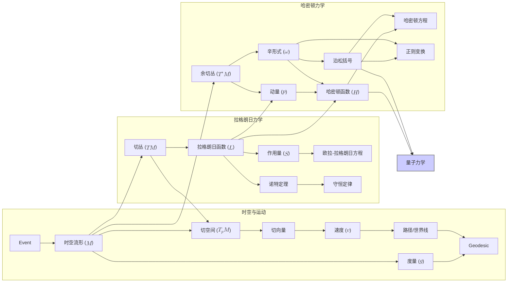

# 从第一原理出发的动力学：经典力学的几何重构
* * *

--- 从变化的流中涌现出对称性的结构。

# **第一部分：基础：时空与运动**
* * *

# **第一章：舞台：作为流形的时空**

*题词:* “自然是以数学语言书写的。” – 伽利略·伽利莱

本章为我们的经典力学几何重构奠定了基础。我们首先介绍事件和时空流形的基本概念，提供一个所有物理现象将在此展开的数学舞台。

## **1.1 事件与时空流形 ($\mathcal{M}$)**

在最基本的层面上，物理学关注的是描述**事件**。一个事件表示一个在空间和时间上局部化的物理发生。它是我们在构建中最原始的概念。为了给这些直观的概念赋予精确的数学意义，我们引入了**流形**的概念。

一个**光滑流形** $\mathcal{M}$ 是一个拓扑空间，它局部类似于欧几里得空间 $\mathbb{R}^n$。这意味着对于每一个点 $p \in \mathcal{M}$，存在一个邻域，该邻域同胚于 $\mathbb{R}^n$ 的一个开子集。这种局部相似性使我们可以引入**坐标图表**或**局部坐标系统**。一个坐标图表是一个二元组 $(U, \phi)$，其中 $U$ 是 $\mathcal{M}$ 的一个开子集，$\phi: U \rightarrow \mathbb{R}^n$ 是一个同胚到 $\mathbb{R}^n$ 的一个开子集上的映射。映射 $\phi$ 给每个点 $p \in U$ 分配 $n$ 个实数 $(x^1, x^2, ..., x^n)$，我们称这些为该图表中的点的**坐标**。

这里的关键是流形 $\mathcal{M}$ 本身**独立**于任何具体的坐标系存在。坐标只是用于相对于选定的参考系统描述点的工具。这一区别至关重要：物理定律应当以坐标无关的方式表述，反映时空的内在几何。

对于我们的目的，流形 $\mathcal{M}$ 表示所有可能事件的集合，我们将称之为**时空流形**或**事件流形**。每个点 $p \in \mathcal{M}$ 对应一个唯一的事件。$\mathcal{M}$ 的维数决定指定一个事件所需的独立参数的数量。在经典力学中，我们通常考虑四维时空(三个空间维度和一个时间维度)，尽管该形式可以很容易地推广到其他维度。

$\mathcal{M}$ 的**光滑结构**是必不可少的。这意味着如果我们有两个重叠的坐标图表 $(U, \phi)$ 和 $(V, \psi)$，过渡映射 $\psi \circ \phi^{-1}: \phi(U \cap V) \rightarrow \psi(U \cap V)$ 是一个光滑(无限可微)函数。这种光滑性确保我们可以在流形上进行微积分运算，这对于描述物理过程至关重要。

## **1.2 局域性、因果性和度量**

两个基本原理指导我们构建时空：**局域性**和**因果性**。

**局域性**原则指出，物理相互作用是局域的。一个位于点 $p \in \mathcal{M}$ 的事件只能直接影响或被其邻近区域内的事件影响。不存在“远距作用”。这一原则深深植根于现代物理学，并对物理理论的结构有深远的影响。

**因果性**引入了事件之间的时间顺序概念。它指出某些事件可以“引起”其他事件，从而在事件集上建立部分序关系。这种排序意味着过去、现在和未来的区分。数学上，这可以通过在流形上引入**时间定向**来形式化，这使我们能够区分未来指向和过去指向的曲线。

为了量化事件之间的距离和时间间隔，我们在流形 $\mathcal{M}$ 上引入了一个**度量张量** $g$。度量 $g$ 是一个对称的、非退化的 $(0, 2)$ 型张量场。在每个点 $p \in \mathcal{M}$，度量 $g_p$ 是切空间 $T_p\mathcal{M}$ 上的双线性形式。给定两个切向量 $u, v \in T_p\mathcal{M}$，度量 $g_p(u, v)$ 返回一个标量值。

度量允许我们定义**线元** $ds^2 = g_{\mu\nu}dx^\mu dx^\nu$，它表示两个无穷接近的事件之间坐标的无穷小分离 $dx^\mu$ 所对应的无穷小“距离平方”。度量的符号决定时空的因果结构。例如，在闵可夫斯基时空(用于狭义相对论)中，度量具有 $(-1, 1, 1, 1)$ 的符号，导致类时、类空和零测地线区间的熟悉区分。

总之，度量 $g$ 提供时空的基本几何结构，定义距离、时间间隔以及事件之间的因果关系。它是制定动力学定律的关键成分。度量不仅仅是“在那里”，在广义相对论中它本身就是一个动力学对象。

本章为我们的经典力学重构奠定了基础。我们介绍了事件、时空流形和度量的概念，这些提供了描述运动和物理相互作用的数学舞台。在下一章中，我们将深入探讨运动本身的描述，引入切向量、速度和路径的概念。

# **第二章：描述运动：运动学**

*题词:* “每个物体都会保持其静止状态或沿直线作匀速运动，除非受到外力的作用而被迫改变这种状态。” - 艾萨克·牛顿

本章专注于**运动学**，即不考虑运动原因的运动描述。我们将在前一章引入的时空流形框架内形式化速度和轨迹的概念。

## **2.1 切向量与速度**

在第一章中，我们将时空流形 $\mathcal{M}$ 建立为物理事件的舞台。现在，我们需要一种方法来描述事物在这个舞台上的**变化**。这引导我们引入**切向量**的概念。

考虑一个点 $p \in \mathcal{M}$。点 $p$ 处的**切空间**，记作 $T_p\mathcal{M}$，是一个捕捉“方向”或“无穷小位移”概念的向量空间。定义切向量的一种方式是通过**方向导数**。设 $f: \mathcal{M} \rightarrow \mathbb{R}$ 是流形上的一个光滑函数。切向量 $v \in T_p\mathcal{M}$ 可以被定义为一个线性映射 $v: C^\infty(\mathcal{M}) \rightarrow \mathbb{R}$(其中 $C^\infty(\mathcal{M})$ 是流形上的光滑函数空间)，它满足莱布尼茨规则：
$$
v(fg) = f(p)v(g) + g(p)v(f)
$$
对于任意光滑函数 $f, g \in C^\infty(\mathcal{M})$ 成立。

在一个围绕 $p$ 的局部坐标图表 $(U, \phi)$ 中，切向量 $v$ 可以表示为**坐标基向量** $\frac{\partial}{\partial x^\mu}$ 的线性组合：
$$
v = v^\mu \frac{\partial}{\partial x^\mu}\bigg|_p.
$$
分量 $v^\mu$ 是切向量 $v$ 在该坐标基中的分量。

现在，让我们将切向量与**速度**的概念联系起来。想象一条曲线 $\gamma: \mathbb{R} \rightarrow \mathcal{M}$ 在某个参数值 $t_0$ 时通过点 $p$，即 $\gamma(t_0) = p$。曲线 $\gamma$ 在 $t_0$ 处的**切向量**，记作 $\dot{\gamma}(t_0)$，是切空间 $T_p\mathcal{M}$ 的一个元素。在局部坐标图表中，其分量由下式给出：
$$
\dot{\gamma}^\mu(t_0) = \frac{dx^\mu}{dt}\bigg|_{t=t_0}.
$$
这个切向量 $\dot{\gamma}(t_0)$ 表示曲线在点 $p$ 处的**速度**。它指出了曲线在该点的方向和“变化率”。

区分切向量的分量 $v^\mu$ 和通过度量张量 $g_{\mu\nu}$ “降指标”得到的相关量 $v_\mu = g_{\mu\nu}v^\nu$ 是至关重要的。尽管在欧几里得空间的笛卡尔坐标系中，$v^\mu$ 和 $v_\mu$ 没有数值上的区别，但在一般情况下，它们是在坐标变换下具有不同变换性质的不同对象。$v^\mu$ 是向量的**逆变**分量，而 $v_\mu$ 是**协变**分量。度量张量 $g_{\mu\nu}$ 作为这两种表示之间的“桥梁”。

## **2.2 路径与世界线**

时空中的**路径**或**曲线**是光滑映射 $\gamma: I \rightarrow \mathcal{M}$，其中 $I$ 是实数的一个区间(通常代表时间)。路径描述时空中的连续事件序列。如果路径表示一个物理对象的轨迹，则常被称为**世界线**。

给定参数值 $t$ 时，路径 $\gamma$ 的切向量 $\dot{\gamma}(t)$ 表示物体在事件 $\gamma(t)$ 处的**速度**。如前所述，$\dot{\gamma}(t)$ 是切空间 $T_{\gamma(t)}\mathcal{M}$ 的一个元素。

一类特别重要的路径是**测地线**。测地线是一条局部最小化两点间距离的曲线。更精确地说，测地线是一条其切向量在沿曲线平行传输时保持不变的曲线。在平坦时空中(其中度量分量在适当的坐标系中是常数)，测地线对应于直线。在弯曲时空中，测地线是“尽可能直”的路径。

数学上，测地线 $\gamma(t)$ 满足**测地线方程**：
$$
\frac{d^2x^\mu}{dt^2} + \Gamma^\mu_{\alpha\beta}\frac{dx^\alpha}{dt}\frac{dx^\beta}{dt} = 0
$$
其中 $\Gamma^\mu_{\alpha\beta}$ 是**克里斯托费尔符号**，由度量张量及其导数决定。

在外力不存在的情况下，经典力学中的自由粒子在时空中沿测地线运动。这是时空几何与物体运动之间的重要联系。

本章已经形式化了在我们的几何框架内对运动的描述。我们引入了切向量作为速度的表示，路径作为物体的轨迹，以及测地线作为自由粒子自然遵循的路径。这为下一阶段的重构奠定了基础，在那里我们将引入动力学的概念和最小作用原理。

# **第二部分：动力学：最小作用量原理**
* * *

# **第三章：最小作用量原理：指导原则**

*题词:* “最美和最深刻的经历是对神秘的感知。” – 阿尔伯特·爱因斯坦

本章介绍**最小作用量原理**，这是经典力学以及现代物理学许多领域的基石。这一原理提供一种强大而优雅的方法来推导物理系统的运动方程。

## **3.1 拉格朗日函数与作用量**

在上一章中，我们从运动学的角度描述了运动，重点放在轨迹和速度上。现在，我们引入**动力学**的概念，它处理的是运动的**原因**。最小作用量原理为理解这些原因提供了统一的框架。

该框架中的核心对象是**拉格朗日函数**，记作 $L$。拉格朗日函数是在时空流形 $\mathcal{M}$ 的切丛 $T\mathcal{M}$ 上定义的一个光滑函数：
$$
L: T\mathcal{M} \rightarrow \mathbb{R}.
$$
这意味着拉格朗日函数以流形上的一个点(表示事件)和该点处的一个切向量(表示速度)作为输入，并返回一个实数，该实数在物理上代表系统在该特定运动状态下动能与势能之间的**差值**。

给定时空中的一条路径 $\gamma: [t_1, t_2] \rightarrow \mathcal{M}$，与此路径相关联的**作用量** $S[\gamma]$ 定义为沿路径对拉格朗日函数的积分：
$$
S[\gamma] = \int_{t_1}^{t_2} L(\gamma(t), \dot{\gamma}(t)) dt.
$$
这里，$\gamma(t)$ 表示物体在时间 $t$ 时的位置，$\dot{\gamma}(t)$ 表示它在该时间的速度。作用量 $S[\gamma]$ 是一个**泛函**，意味着它以一个函数(路径 $\gamma$)作为输入并返回一个实数。

最小作用量原理指出，物理系统在两个给定事件之间实际遵循的路径是使作用量**极化**(通常是最小化)的路径。换句话说，物理轨迹是使作用量变化为零的路径：
$$
\delta S[\gamma] = 0.
$$
这一原理非常强大。它提供一个单一、优雅的陈述，从中我们可以推导出各种物理系统的运动方程。在推导欧拉-拉格朗日方程之前，重要的是要激发使用变分原理的理由。一种方法是考虑光学中费马原理的类比，费马原理指出光沿最短时间的路径传播。最小作用量原理将这一思想推广到力学中。

## **3.2 欧拉-拉格朗日方程**

为了找到使作用量极化的路径，我们使用变分法。考虑路径 $\gamma(t)$ 的一个变分，给出为：
$$
\gamma'(t) = \gamma(t) + \epsilon \eta(t)
$$
其中 $\epsilon$ 是一个小参数，$\eta(t)$ 是一个在端点 $t_1$ 和 $t_2$ 处为零的光滑函数：$\eta(t_1) = \eta(t_2) = 0$。这个条件确保路径的端点是固定的。

作用量的变化由下式给出：
$$
\delta S = \frac{d}{d\epsilon}\bigg|_{\epsilon=0} \int_{t_1}^{t_2} L(\gamma(t) + \epsilon \eta(t), \dot{\gamma}(t) + \epsilon \dot{\eta}(t)) dt.
$$
进行微分并分部积分(利用 $\eta(t)$ 的边界条件)，我们得到：
$$
\delta S = \int_{t_1}^{t_2} \left(\frac{\partial L}{\partial q^i} - \frac{d}{dt}\frac{\partial L}{\partial \dot{q}^i}\right) \eta^i(t) dt
$$
其中 $q^i$ 是流形 $\mathcal{M}$ 上的局部坐标。

为了使作用量极化，我们需要对于**任意**变分 $\eta(t)$ 有 $\delta S = 0$。这导致**欧拉-拉格朗日方程**：
$$
\frac{d}{dt}\frac{\partial L}{\partial \dot{q}^i} - \frac{\partial L}{\partial q^i} = 0
$$
这些方程是系统的运动方程。它们是关于坐标 $q^i(t)$ 的二阶微分方程。

让我们考虑几个例子：

* **自由粒子：** 对于平坦时空中的自由粒子，度量为 $\eta_{\mu\nu}$，拉格朗日函数为 $L = \frac{1}{2}m\eta_{\mu\nu}\dot{x}^\mu\dot{x}^\nu$。欧拉-拉格朗日方程给出 $\ddot{x}^\mu = 0$，描述了匀速运动。
* **在势场中的粒子：** 对于在势场 $V(x)$ 中的粒子，拉格朗日函数为 $L = \frac{1}{2}m|\dot{x}|^2 - V(x)$。欧拉-拉格朗日方程给出 $m\ddot{x} = -\nabla V(x)$，即牛顿第二定律。
* **多个相互作用的粒子：** 对于多个相互作用的粒子，拉格朗日函数在势中包含相互作用项。欧拉-拉格朗日方程则描述粒子的耦合运动。
* **测地线运动(无外力)：** 如果我们考虑拉格朗日函数 $L = \frac{1}{2}g_{\mu\nu}\dot{x}^\mu\dot{x}^\nu$ 并应用欧拉-拉格朗日方程，我们可以推导出前一章给出的测地线方程。这表明自由运动(在外力不存在的情况下)等同于测地线运动。

本章介绍了最小作用量原理并推导了欧拉-拉格朗日方程。这一变分原理提供一种强大而优雅的方法来推导广泛物理系统的运动方程，将时空的几何与运动的动力学联系起来。能量守恒的关系将在下一章中探讨，作为拉格朗日函数对称性的结果。

# **第四章：对称性和守恒定律：诺特定理**

*题词:* “对称性，无论你将其定义得多么广泛或狭窄，都是人类通过各个时代试图理解和创造秩序、美丽和完美的一个理念。” – 赫尔曼·外尔

本章探讨对称性与守恒定律之间深刻的关系，这是物理学的一个基石，即诺特定理。该定理提供一个将物理系统的数学结构(其对称性)与其可观测行为(守恒量)联系起来的深刻而优雅的链接。

## **4.1 无穷小变换与李群**

在陈述和证明诺特定理之前，我们需要介绍一些分析对称性的基本数学工具。物理系统的**对称性**是指使系统动力学不变的变换。数学上，我们关注的是可以由**李群**描述的连续对称性。

**李群** $G$ 是一个既是群又是光滑流形的集合，使得群操作(乘法和逆)是光滑映射。李群的例子包括三维旋转群 SO(3)、$\mathbb{R}^n$ 中的平移群以及洛伦兹群。

考虑一个参数为 $s \in \mathbb{R}$ 的单参数变换族 $g(s)$，其中 $g(0)$ 是单位变换。这样的族定义在李群 $G$ 中的一条曲线。该变换的**无穷小生成元**定义为这条曲线在单位处的切向量：
$$
X = \frac{d}{ds}\bigg|_{s=0} g(s).
$$
所有无穷小生成元的集合构成了李群 $G$ 的**李代数** $\mathfrak{g}$。李代数是一个配备**李括号**运算 $[\cdot, \cdot]$ 的向量空间，它捕捉生成元之间的交换关系。

例如，考虑由下式生成的 $xy$-平面中的旋转：
$$
R(\theta) = \begin{pmatrix} \cos\theta & -\sin\theta \\ \sin\theta & \cos\theta \end{pmatrix}.
$$
无穷小生成元可以通过对 $\theta$ 求导并在 $\theta = 0$ 处取值得到：
$$
X = \frac{d}{d\theta}\bigg|_{\theta=0} R(\theta) = \begin{pmatrix} 0 & -1 \\ 1 & 0 \end{pmatrix}.
$$

## **4.2 诺特定理**

诺特定理建立拉格朗日函数的连续对称性与守恒量之间的一一对应关系。更精确地说：

*如果拉格朗日函数 $L$ 在由 $X$ 生成的单参数变换族下不变，则量*
$$
Q = \frac{\partial L}{\partial \dot{q}^i} X^i
$$
*沿系统的轨迹是守恒的；即，$\frac{dQ}{dt} = 0$.*

这里，$X^i$ 是由无穷小变换 $X$ 生成的向量场的分量。

*证明:* 假设拉格朗日函数在变换 $q^i \rightarrow q^i + \epsilon X^i$ 下不变。这意味着：
$$
L(q^i + \epsilon X^i, \dot{q}^i + \epsilon \dot{X}^i) = L(q^i, \dot{q}^i).
$$
对 $\epsilon$ 求导并在 $\epsilon = 0$ 处取值，我们得到：
$$
\frac{\partial L}{\partial q^i} X^i + \frac{\partial L}{\partial \dot{q}^i} \dot{X}^i = 0.
$$
现在，使用欧拉-拉格朗日方程：
$$
\frac{d}{dt}\frac{\partial L}{\partial \dot{q}^i} = \frac{\partial L}{\partial q^i},
$$
我们可以将上述方程重写为：
$$
\frac{d}{dt}\left(\frac{\partial L}{\partial \dot{q}^i} X^i\right) = \frac{\partial L}{\partial q^i} X^i + \frac{\partial L}{\partial \dot{q}^i} \dot{X}^i = 0.
$$
因此，量 $Q = \frac{\partial L}{\partial \dot{q}^i} X^i$ 是守恒的。

**例子:**

* **时间平移不变性：** 如果拉格朗日函数不显式依赖于时间 ($\frac{\partial L}{\partial t} = 0$)，则系统在时间平移下是不变的。守恒量是系统的**能量**：
    $$
    E = \frac{\partial L}{\partial \dot{q}^i} \dot{q}^i - L
    $$

* **空间平移不变性：** 如果拉格朗日函数在给定方向的空间平移下不变，则相应的**线动量**分量是守恒的。

* **旋转不变性：** 如果拉格朗日函数在绕某轴的旋转下不变，则相应的**角动量**分量是守恒的。

诺特定理提供对称性与守恒定律之间的深刻联系。它是理解物理系统的基本原理的强大工具，并在经典力学、量子力学和场论等各个领域有深远的影响。它突出了几何(对称性)与物理(守恒量)之间的深刻关系。

# **第三部分：哈密顿力学：相空间的几何**
* * *

# **第五章：相空间：余切丛**

*题词:* “成就伟大工作的唯一方法是热爱你所做的。” - 史蒂夫·乔布斯

本章介绍**相空间**的概念，这是哈密顿力学的自然舞台。我们将定义相空间为时空流形的余切丛，并为其配备基本的几何结构：典范辛形式。

## **5.1 余切丛 $T^*\mathcal{M}$**

在拉格朗日力学中，基本对象是位置和速度，由切丛 $T\mathcal{M}$ 上的点表示。在哈密顿力学中，我们将注意力转移到位置和**动量**上。表示这些对的自然数学结构是**余切丛** $T^*\mathcal{M}$。

回忆一下，对于每个点 $p \in \mathcal{M}$，切空间 $T_p\mathcal{M}$ 是一个向量空间。$T_p\mathcal{M}$ 的**对偶空间**，记作 $T^*_p\mathcal{M}$，是所有从 $T_p\mathcal{M}$ 到 $\mathbb{R}$ 的线性泛函的空间。线性泛函是从 $T_p\mathcal{M}$ 到 $\mathbb{R}$ 的线性映射 $\alpha: T_p\mathcal{M} \rightarrow \mathbb{R}$。$T^*_p\mathcal{M}$ 的元素称为**余切向量**或 **$1$-形式**。

如果 $\{e_1, ..., e_n\}$ 是 $T_p\mathcal{M}$ 的一个基，则存在 $T^*_p\mathcal{M}$ 的对偶基 $\{\theta^1, ..., \theta^n\}$，使得：
$$
\theta^i(e_j) = \delta^i_j,
$$
其中 $\delta^i_j$ 是克罗内克 delta 参数。

**余切丛** $T^*\mathcal{M}$ 是所有点处的余切空间的并集：
$$
T^*\mathcal{M} = \bigcup_{p \in \mathcal{M}} T^*_p\mathcal{M}
$$
$T^*\mathcal{M}$ 本身是一个光滑流形。如果 $(q^1, ..., q^n)$ 是 $\mathcal{M}$ 上的局部坐标，则 $T^*\mathcal{M}$ 中的一个点可以由坐标 $(q^1, ..., q^n, p_1, ..., p_n)$ 描述，其中 $p_i$ 是余切向量在对偶基 $\{\mathrm{d}q^1, ..., \mathrm{d}q^n\}$ 中的分量。这些 $p_i$ 被解释为**广义动量**。

拉格朗日函数与动量之间的关系可以通过以下方式看出：给定一个拉格朗日函数 $L(q, \dot{q})$，广义动量定义为
$$
p_i = \frac{\partial L}{\partial \dot{q}^i}.
$$
这定义了一个从 $T\mathcal{M}$ 到 $T^*\mathcal{M}$ 的映射。

配置空间 $\mathcal{M}$ 上的度量 $g$ 诱导在 $T^*\mathcal{M}$ 上的自然度量，从而给出相空间中的体积概念。如果我们有 $\mathcal{M}$ 上的坐标 $(q^i)$ 和相应的动量 $(p_i)$，则体积形式由下式给出
$$
\text{Vol} = \mathrm{d}q^1 \wedge \dots \wedge \mathrm{d}q^n \wedge \mathrm{d}p_1 \wedge \dots \wedge \mathrm{d}p_n.
$$
这个体积形式在讨论刘维尔定理时将非常重要。

## **5.2 典范辛形式**

余切丛 $T^*\mathcal{M}$ 不仅仅是一个流形；它还具备一个关键的额外结构：**辛形式**。这种形式对于定义哈密顿动力学至关重要。

**典范 $1$-形式** $\theta$ 在 $T^*\mathcal{M}$ 上定义如下：设 $(q, p)$ 是 $T^*\mathcal{M}$ 上的局部坐标，其中 $q$ 是 $\mathcal{M}$ 上的坐标，$p$ 是相应的动量。则：
$$
\theta = p_i \mathrm{d}q^i.
$$
**典范辛形式** $\omega$ 定义为 $\theta$ 的外导数：
$$
\omega = \mathrm{d}\theta = \mathrm{d}p_i \wedge \mathrm{d}q^i.
$$
楔积 $\wedge$ 表示外积，它是反对称的：$\mathrm{d}q^i \wedge \mathrm{d}q^j = -\mathrm{d}q^j \wedge \mathrm{d}q^i$。

辛形式 $\omega$ 是一个**闭合的** ($d\omega = 0$) 和**非退化的** $2$-形式。这些性质对于哈密顿力学的结构至关重要。非退化意味着对于每个点 $x\in T^*\mathcal{M}$ 和每个非零 $X \in T_x(T^*\mathcal{M})$，存在一个 $Y \in T_x(T^*\mathcal{M})$ 使得 $\omega_x(X,Y) \ne 0$。

辛形式提供一种在相空间上的函数之间定义括号运算的方法，称为泊松括号，这将在下一章中讨论。辛形式是相空间中最基本的结构，并构成所有哈密顿力学的基础。

在本章中，我们介绍了相空间作为余切丛 $T^*\mathcal{M}$ 并为其配备典范辛形式 $\omega$。这一几何结构为哈密顿动力学的表述提供基础，我们将在下一章中探讨。

# **第六章：哈密顿动力学：相空间中的演化**

*题词:* “对于所有相对于彼此做匀速运动的观察者，物理定律是相同的。” - 阿尔伯特·爱因斯坦

本章深入探讨哈密顿力学的核心，描述物理系统在相空间中的演化。我们将介绍哈密顿函数，推导哈密顿运动方程，并探索泊松括号和正则变换的强大概念。

## **6.1 哈密顿函数与哈密顿方程**

在拉格朗日形式中，动力学被编码在依赖于广义坐标 $q^i$ 和广义速度 $\dot{q}^i$ 的拉格朗日函数 $L(q, \dot{q})$ 中。在哈密顿力学中，我们转向依赖于广义坐标 $q^i$ 和广义**动量** $p_i$ 的**哈密顿**函数 $H(q, p)$。这两种形式之间的转换是通过**勒让德变换**实现的。

给定一个拉格朗日函数 $L(q, \dot{q})$，广义动量定义为：
$$
p_i = \frac{\partial L}{\partial \dot{q}^i}.
$$
哈密顿函数 $H(q, p)$ 然后定义为：
$$
H(q, p) = p_i \dot{q}^i - L(q, \dot{q})
$$
其中 $\dot{q}^i$ 通过上述关于 $p_i$ 的方程反解表示为 $q$ 和 $p$ 的函数。哈密顿函数代表系统的**总能量**。

现在，让我们推导哈密顿运动方程。回忆一下相空间 $T^*\mathcal{M}$ 上的典范辛形式 $\omega$：
$$
\omega = dp_i \wedge dq^i.
$$
动力学由相空间 $T^*\mathcal{M}$ 上的向量场 $X_H$ 生成，称为**哈密顿向量场**，它由以下方程定义：
$$
\omega(X_H, \cdot) = -dH.
$$
在局部坐标下，这个方程导致**哈密顿方程**：
$$
\dot{q}^i = \frac{\partial H}{\partial p_i}, \quad \dot{p}_i = -\frac{\partial H}{\partial q^i}.
$$
这些方程描述了系统在相空间中的演化。它们是一阶微分方程，不同于二阶的欧拉-拉格朗日方程。

**例子:**

* **谐振子：** 对于具有拉格朗日函数 $L = \frac{1}{2}m\dot{x}^2 - \frac{1}{2}kx^2$ 的简单谐振子，哈密顿函数为 $H = \frac{p^2}{2m} + \frac{1}{2}kx^2$。哈密顿方程给出了谐振子熟悉的运动方程。
* **中心力问题：** 对于在中心势场中运动的粒子，哈密顿函数可以用极坐标表示，哈密顿方程可以用来推导角动量守恒和径向运动方程。这种方法通常比在极坐标中使用欧拉-拉格朗日方程更简单。
* 重要的是展示如何使用拉格朗日形式来推导这些例子，从而证明两种方法的等价性。

## **6.2 泊松括号与正则变换**

**泊松括号**是哈密顿力学中的基本工具。它被定义为相空间上函数的双线性运算：
$$
\{f, g\} = \frac{\partial f}{\partial q^i}\frac{\partial g}{\partial p_i} - \frac{\partial f}{\partial p_i}\frac{\partial g}{\partial q^i}
$$
其中 $f$ 和 $g$ 是 $T^*\mathcal{M}$ 上的光滑函数。

泊松括号有以下几个重要性质：

*   **反对称性:** $\{f, g\} = -\{g, f\}$
*   **线性:** $\{af + bg, h\} = a\{f, h\} + b\{g, h\}$
*   **莱布尼兹规则:** $\{fg, h\} = f\{g, h\} + \{f, h\}g$
*   **雅可比恒等式:** $\{\{f, g\}, h\} + \{\{g, h\}, f\} + \{\{h, f\}, g\} = 0$

雅可比恒等式尤为重要。它确保泊松括号在相空间函数空间上定义一个李代数结构。

相空间上函数 $f$ 的时间演化由下式给出：
$$
\frac{df}{dt} = \{f, H\} + \frac{\partial f}{\partial t}.
$$
如果 $f$ 不显式依赖于时间，则 $\frac{df}{dt} = \{f, H\}$。这表明哈密顿函数在相空间中生成时间演化。

**正则变换**是相空间坐标 $(q, p) \rightarrow (Q, P)$ 的变换，它保持典范辛形式不变：
$$
dP_i \wedge dQ^i = dp_i \wedge dq^i.
$$
正则变换至关重要，因为它们保持哈密顿方程的形式。这意味着如果 $(q, p)$ 满足哈密顿方程且哈密顿函数为 $H(q, p)$，则变换后的坐标 $(Q, P)$ 将满足哈密顿方程且变换后的哈密顿函数为 $K(Q, P)$。

**生成函数**提供一种强大的工具来寻找正则变换。生成函数是旧坐标和新坐标(或某些组合)的函数，它隐式地定义了变换。根据使用的变量不同，生成函数有四种类型。例如，类型 1 的生成函数 $F_1(q, Q, t)$ 通过以下方程将旧坐标和新坐标联系起来：
$$
p_i = \frac{\partial F_1}{\partial q^i}, \quad P_i = -\frac{\partial F_1}{\partial Q^i}, \quad K = H + \frac{\partial F_1}{\partial t}.
$$

本章介绍了哈密顿形式，提供一种替代且通常更强大的方法来描述经典动力学。泊松括号和正则变换的概念是分析哈密顿系统的基本工具，并将在理解与其他物理领域(如量子力学)的联系中起到关键作用。

# **第四部分：扩展与联系**
* * *

# **第七章：约束系统**

*题词:* “重要的不是停止提问。好奇心有其存在的理由。” —— 阿尔伯特·爱因斯坦

在许多物理系统中，粒子的运动受到某些条件的限制，这些条件被称为*约束*。本章探讨如何将这些约束纳入拉格朗日和哈密顿形式中。

## **7.1 完整约束与非完整约束**

约束可以大致分为两类：**完整约束**(holonomic)和**非完整约束**(non-holonomic)。

*   **完整约束：** 完整约束可以用一个方程来表示系统坐标的相互关系：
    $$
    f(q^1, q^2, ..., q^n, t) = 0.
    $$
    这个方程减少了系统的独立自由度。例如，被限制在球面上运动的粒子服从一个完整约束。如果我们有 $k$ 个独立的完整约束 $f_a(q,t)=0$，$a=1,...,k$，那么配置空间被减少到初始配置空间的一个 $n-k$ 维子流形。

*   **非完整约束：** 非完整约束不能仅通过坐标之间的方程来表达。相反，它通常还涉及速度：
    $$
    g(q^1, q^2, ..., q^n, \dot{q}^1, \dot{q}^2, ..., \dot{q}^n, t) = 0,
    $$
    或者更一般地，作为一组Pfaffian约束：
    $$
    \sum_{i=1}^n A_i(q,t) \mathrm{d}q^i + B(q,t)\mathrm{d}t = 0.
    $$
    这些方程无法积分成仅涉及坐标的方程。一个经典的例子是滚动的轮子：轮子无滑动滚动的约束是非完整的。可访问的配置集合不被减少，但可能的速度受到了限制。

**几何解释：**

完整约束定义配置空间的子流形。运动被限制在这些子流形上。另一方面，非完整约束限制配置空间中每个点的可能速度。它们定义一个分布(每个点的切空间的一个子空间)，运动必须与这个分布相切。

**在拉格朗日形式中引入完整约束：**

对于完整约束 $f_a(q,t)=0$，我们可以通过**拉格朗日乘数**将其纳入拉格朗日函数中。我们定义一个新的拉格朗日函数：
$$
L' = L + \lambda^a f_a
$$
其中 $\lambda^a$ 是拉格朗日乘数。$L'$ 的欧拉-拉格朗日方程给出运动方程以及约束方程 $f_a = 0$。拉格朗日乘数可以解释为约束力。

## **7.2 狄拉克的约束理论**

当处理奇异拉格朗日函数(即二阶导数矩阵 $\frac{\partial^2 L}{\partial \dot{q}^i \partial \dot{q}^j}$ 奇异的拉格朗日函数)时，标准的勒让德变换不可逆，我们无法用动量表示所有的速度。这种情况在具有规范对称性的系统中经常出现。狄拉克发展了一种系统的方法来处理这些**约束哈密顿系统**。

**初级约束：**

勒让德变换不可逆导致形式为
$$
\phi_m(q, p) \approx 0
$$
的**初级约束**，其中符号 "$\approx$" 表示**弱等式**，意味着该约束仅在相空间的约束曲面上成立。

**哈密顿量和总哈密顿量：**

我们按照惯例通过勒让德变换定义**典范哈密顿量** $H_c$。然后我们构造**总哈密顿量** $H_T$：
$$
H_T = H_c + u^m \phi_m
$$
其中 $u^m$ 是未定乘数。

**次级约束：**

我们要求初级约束在时间演化中保持不变，即
$$
\dot{\phi}_m = \{\phi_m, H_T\} \approx 0.
$$
这个条件可能导致新的约束，称为**次级约束**。我们继续这个过程，直到不再生成新的约束。

**约束的分类：**

约束可以进一步分为**第一类约束**和**第二类约束**。

*   **第一类约束**与其他所有约束的泊松括号为零：$\{\phi_m, \phi_n\} \approx 0$。这些约束与规范对称性相关。
*   **第二类约束**与其他至少一个约束的泊松括号不为零。

**狄拉克括号：**

对于具有第二类约束的系统，狄拉克引入一种修改后的泊松括号，称为**狄拉克括号**，它考虑约束。狄拉克括号确保约束在相空间中处处为零(强零)。

狄拉克的约束理论提供一个处理奇异拉格朗日函数和约束哈密顿系统的连贯且强大的框架。它是理解规范理论和其他重要物理领域所必需的。这个框架在约束系统的量子化中也至关重要。

本章概述了经典力学中的约束系统，涵盖了完整约束和非完整约束，并介绍了处理奇异拉格朗日函数的狄拉克理论。这完成了我们对经典力学的几何重构的核心结构，为探索与其他领域的联系奠定了基础。

# **第八章：与其他领域的联系**

*题词:* “科学是一个持续学习的过程。它就像一个螺旋，我们一圈又一圈地前进，但每次都在更高的层次上。” —— K. 茨托洛夫斯基

本章最后简要探讨本书中发展的经典力学的几何表述与其他重要物理领域之间的联系，即经典场论和量子力学。这些联系揭示了底层数学结构的统一力量。

## **8.1 经典场论(简述)**

经典场论将经典力学的概念扩展到具有无限多自由度的系统，描述如电磁场、流体力学和弹性理论等连续物理系统。这里的关键概念是从离散粒子坐标过渡到连续**场**。

我们不再描述有限数量粒子的运动，其坐标为 $q^i(t)$，而是考虑场 $\phi^a(x, t)$，其中 $x$ 表示空间坐标，$t$ 表示时间。指标 $a$ 标记不同的场分量(例如，电磁场的分量)。

场的动力学同样由最小作用原理支配。然而，代替依赖于粒子坐标和速度的拉格朗日函数 $L$，我们现在有一个依赖于场及其导数的**拉格朗日密度** $\mathcal{L}$：
$$
\mathcal{L} = \mathcal{L}(\phi^a(x, t), \partial_\mu \phi^a(x, t))
$$
其中 $\partial_\mu = \frac{\partial}{\partial x^\mu}$ 表示时空导数。

**作用量** $S$ 然后由拉格朗日密度在时空上的积分给出：
$$
S[\phi] = \int d^4x \, \mathcal{L}(\phi^a, \partial_\mu \phi^a)
$$
其中 $d^4x = dt \, d^3x$ 是四维体积元。

相对于场的变化使作用量极值化，导致**场的欧拉-拉格朗日方程**：
$$
\frac{\partial \mathcal{L}}{\partial \phi^a} - \partial_\mu \left(\frac{\partial \mathcal{L}}{\partial (\partial_\mu \phi^a)}\right) = 0.
$$

**例子：电磁学**

真空中的电磁场的拉格朗日密度由下式给出：
$$
\mathcal{L} = -\frac{1}{4\mu_0} F_{\mu\nu} F^{\mu\nu}
$$
其中 $F_{\mu\nu} = \partial_\mu A_\nu - \partial_\nu A_\mu$ 是电磁场张量，$A_\mu$ 是电磁四势。将此拉格朗日密度应用于欧拉-拉格朗日方程，得到真空中的麦克斯韦方程。

这个简要概述展示最小作用原理如何被扩展以描述连续系统，从而弥合经典力学与经典场论之间的差距。

## **8.2 量子力学的经典极限**

经典力学(如本书所述)与量子力学之间存在深刻的联系。其中一个关键的连接是由**泊松括号**提供的。

在量子力学中，物理可观测量由希尔伯特空间上的算子表示。这些算子的时间演化由海森堡方程支配：
$$
\frac{d\hat{A}}{dt} = \frac{i}{\hbar}[\hat{H}, \hat{A}] + \frac{\partial \hat{A}}{\partial t}
$$
其中 $\hat{A}$ 是表示可观测量的算子，$\hat{H}$ 是哈密顿算子，$[\cdot, \cdot]$ 表示对易子，$\hbar$ 是约化普朗克常数。

将此与相空间上函数的时间演化经典方程比较：
$$
\frac{df}{dt} = \{f, H\} + \frac{\partial f}{\partial t}
$$
我们看到惊人的相似性。经典力学中的泊松括号在量子力学中扮演对易子的角色(相差一个 $i/\hbar$ 的因子)。这表明两种理论之间有深刻联系。

量子力学的**经典极限**可以通过取 $\hbar \rightarrow 0$ 正式获得。在此极限下，对易子变为泊松括号：
$$
\frac{i}{\hbar}[\hat{A}, \hat{B}] \rightarrow \{A, B\}.
$$
这种对应原理对于理解经典力学如何从量子力学中涌现至关重要。

**埃伦费斯特定理：**

埃伦费斯特定理提供另一个重要的联系。该定理指出，在某些极限下，量子算子期望值的时间演化遵循经典运动方程。例如，对于处于势场中的粒子：
$$
m\frac{d^2\langle \hat{x} \rangle}{dt^2} = -\langle \nabla V(\hat{x}) \rangle.
$$

在波函数高度局域化的经典极限(接近狄拉克 $\delta$ 函数)下，我们有 $\langle \nabla V(\hat{x}) \rangle \approx \nabla V(\langle \hat{x} \rangle)$，并恢复牛顿第二定律。

这章讨论展示了经典力学的几何表述如何为其他物理领域提供自然的桥梁。最小作用原理、相空间的概念、辛几何和泊松括号都在这些联系中发挥着关键作用，展示了物理理论底层数学结构的统一力量。这标志着我们通过经典力学的几何重构之旅的结束。

# **附录 A : 核心概念及其相互关系**

本附录提供本书中引入的核心概念及其相互关系的简明概述。这为读者提供一个快速参考，以掌握我们对经典力学几何重构的整体结构。

我们可以用几种方式来表示这些概念之间的关系。首先，呈现一个总结关键概念及其作用的表格。随后，使用图示直观地描绘思路的流程。

## **A.1 核心概念及其角色表格**

## **A.1 核心概念及其作用表**

| 概念                   | 描述                                                                                                                              | 在重构中的角色                              | 相关概念                                                   |
| -------------------- | ------------------------------------------------------------------------------------------------------------------------------- | ------------------------------------ | ------------------------------------------------------ |
| 事件                   | 时空中的一个点，表示在空间和时间中局部化的一个物理现象。                                                                                                    | 我们时空描述的基本构建块。                        | 时空流形 $\mathcal{M}$                                     |
| 时空流形 $\mathcal{M}$   | 一个光滑流形，表示所有可能事件的集合。                                                                                                             | 所有物理现象的舞台。为定义运动和动力学提供数学平台。           | 事件, 度量 $g$, 切空间 $T_p\mathcal{M}$, 余切丛 $T^*\mathcal{M}$ |
| 度量 $g$               | 定义时空的距离、时间间隔和因果结构的 $\mathcal{M}$ 上的张量场。                                                                                         | 提供时空的几何结构，使得可以量化距离和时间间隔。对于定义测地线至关重要。 | 时空流形 $\mathcal{M}$, 切向量, 测地线                           |
| 切向量                  | 切空间 $T_p\mathcal{M}$ 中的一个向量，表示点 $p \in \mathcal{M}$ 处的方向和“无穷小位移”。它可以被定义为方向导数。                                                   | 表示作为时空曲线切向量的速度。                      | 时空流形 $\mathcal{M}$, 切空间 $T_p\mathcal{M}$, 速度, 路径       |
| 路径/世界线               | 一个光滑映射 $\gamma: I \rightarrow \mathcal{M}$，表示时空中粒子的轨迹。                                                                          | 将运动的概念与物理轨迹联系起来。                     | 切向量, 速度, 测地线                                           |
| 测地线                  | 一条局部最小化两点之间距离的曲线。在没有外力的情况下，自由粒子沿测地线运动。                                                                                          | 将时空的几何结构与自由粒子的运动联系起来。                | 度量 $g$, 路径/世界线                                         |
| 拉格朗日函数 $L$           | 一个函数 $L: T\mathcal{M} \rightarrow \mathbb{R}$，表示动能和势能之间的差值。                                                                     | 拉格朗日形式主义中的核心对象。用于定义作用量。              | 切丛 $T\mathcal{M}$, 作用量 $S$                             |
| 作用量 $S$              | 一个泛函 $S[\gamma] = \int L(\gamma, \dot{\gamma}) dt$，它以路径为输入并返回一个实数。                                                              | 最小作用量原理指出，物理轨迹使作用量极值化。               | 拉格朗日函数 $L$, 欧拉-拉格朗日方程                                  |
| 欧拉-拉格朗日方程            | 从最小作用量原理推导出的决定运动方程的微分方程。                                                                                                        | 拉格朗日形式主义中的运动方程。                      | 作用量 $S$, 拉格朗日函数 $L$                                    |
| 诺特定理                 | 将拉格朗日函数的连续对称性与守恒量联系起来。                                                                                                          | 将对称性与守恒定律(能量、动量、角动量)连接起来。            | 拉格朗日函数 $L$, 对称性, 守恒定律                                  |
| 余切丛 $T^*\mathcal{M}$ | 切丛的对偶，表示位置和动量。哈密顿力学的相空间。                                                                                                        | 哈密顿力学的自然舞台。                          | 切丛 $T\mathcal{M}$, 动量, 辛形式 $\omega$                    |
| 动量 $p$               | 余切空间 $T^*_p\mathcal{M}$ 中的一个元素。表示运动的“冲量”。通过 $p_i = \frac{\partial L}{\partial \dot{q}^i}$ 与拉格朗日函数相关联。                           | 哈密顿力学中的一个基本变量。                       | 余切丛 $T^*\mathcal{M}$, 拉格朗日函数 $L$                       |
| 辛形式 $\omega$         | 在 $T^*\mathcal{M}$ 上的一个闭且非退化的 $2$-形式，在正则坐标下由 $\omega = dp_i \wedge dq^i$ 给出。                                                    | 提供相空间的几何结构。对于定义哈密顿方程和泊松括号至关重要。       | 余切丛 $T^*\mathcal{M}$, 哈密顿函数 $H$, 泊松括号                  |
| 哈密顿函数 $H$            | 一个函数 $H: T^*\mathcal{M} \rightarrow \mathbb{R}$，表示系统的总能量。通过勒让德变换从拉格朗日函数获得。                                                      | 哈密顿形式主义中的核心对象。生成相空间中的时间演化。           | 余切丛 $T^*\mathcal{M}$, 辛形式 $\omega$, 哈密顿方程, 勒让德变换       |
| 哈密顿方程                | 使用辛形式推导出的描述系统在相空间中演化的第一阶微分方程：$\dot{q}^i = \frac{\partial H}{\partial p_i}, \quad \dot{p}_i = -\frac{\partial H}{\partial q^i}$. | 哈密顿形式主义中的运动方程。                       | 哈密顿函数 $H$, 辛形式 $\omega$                                |
| 泊松括号                 | 相空间上函数的双线性运算，在哈密顿力学中起着关键作用，并与量子力学的关联。                                                                                           | 编码哈密顿动力学的基本结构。与量子力学中的对易子有关。          | 哈密顿函数 $H$, 辛形式 $\omega$, 正则变换                          |
| 正则变换                 | 保持辛形式不变的相空间坐标的变换。                                                                                                               | 保持哈密顿方程的形式不变。为简化哈密顿系统提供强有力的工具。       | 辛形式 $\omega$, 泊松括号                                     |

## **A.2 概念关系图**

该图直观地表示了从事件和时空的基本概念开始，经过拉格朗日力学和哈密顿力学，最终连接到量子力学的概念流程。表格和图一起提供了核心思想及其深刻相互联系的全面概述，有助于更深入地理解经典力学的几何结构。

