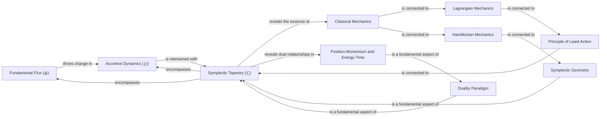

# Unveiling the Profound Essence of Classical Mechanics
* * *

--- Delving into the Intrinsic Nature of Space, Time, and Motion

# **I. Purely Geometric Reconstruction of Classical Mechanics**

*"The geometric approach is the key to unlocking the secrets of the universe."*
— **Unknown**

## **1.1 Geometric Foundations**

In the pursuit of unveiling the profound essence of classical mechanics, we embark on a journey to reconstruct the subject from a purely geometric perspective. This approach, though unconventional, offers a profound insight into the intrinsic nature of classical mechanics.

**Mathematical Framework:**
We commence by introducing the geometric framework, which is founded upon the following mathematical structures:

* **Manifolds**: Smooth, differentiable spaces that serve as the backdrop for our geometric reconstruction.
* **Tensors**: Multilinear maps that facilitate the description of geometric and dynamic aspects.
* **Differential Forms**: Mathematical objects that enable the expression of physical quantities in a geometric context.

The geometric framework is built upon the concept of a manifold, which is a smooth, differentiable space. The manifold is endowed with a metric tensor, $g_{ij}$, which defines the geometry of the space. The metric tensor is a symmetric, positive-definite tensor that satisfies the following properties:
$$
g_{ij} = g_{ji}, \quad g_{ij} u^i v^j \geq 0, \quad \forall u, v \in \mathcal{M}
$$
where $\mathcal{M}$ is the manifold, and $u$ and $v$ are vectors in the tangent space of $\mathcal{M}$.

**Geometric Approach to Classical Mechanics:**
By leveraging the aforementioned mathematical structures, we can reformulate classical mechanics in a purely geometric manner. This approach is succinctly captured by the following equation:
$$
\boxed{\mathbf{d} \omega = 0}
$$
where $\omega$ represents a differential form, and $\mathbf{d}$ denotes the exterior derivative. This equation encapsulates the geometric essence of classical mechanics, as it implies the conservation of a physical quantity (e.g., energy, momentum) in a geometric context.

**Physical Implications:**
The geometric approach to classical mechanics has far-reaching implications, including:

1. **Unified Description**: A single, geometric framework for describing diverse physical phenomena.
2. **Insight into Conservation Laws**: A deeper understanding of the conservation laws that govern classical mechanics.
3. **Novel Perspectives**: Unconventional insights into the nature of space, time, and motion.

**Connection to Chapter III, Section 1 (Symplectic Tapestry):**
The geometric foundations introduced in this section lay the groundwork for the symplectic tapestry, which will be explored in Chapter III, Section 1. The symplectic structure, built upon the geometric framework, will provide a more comprehensive understanding of classical mechanics.

## **1.2 Geometric Interpretation of $\Phi$ and $\mathcal{D}$**

Having established the geometric foundations, we now delve into the geometric interpretation of **Fundamental Flux ($\Phi$)** and **Accretive Dynamics ($\mathcal{D}$)**. This section will elucidate the geometric significance of these core concepts, revealing the intricate relationships between geometric and dynamic aspects.

**Geometric Representation of $\Phi$ and $\mathcal{D}$:**
We can represent $\Phi$ and $\mathcal{D}$ geometrically using the following mathematical constructs:

* **Vector Fields**: Smooth, differentiable maps that describe the flow of $\Phi$ and $\mathcal{D}$.
* **Differential Equations**: Mathematical equations that govern the evolution of $\Phi$ and $\mathcal{D}$ in a geometric context.

The geometric representation of $\Phi$ and $\mathcal{D}$ is built upon the concept of a vector field, which is a smooth, differentiable map that assigns a vector to each point in the manifold. The vector field is denoted by $X$ and satisfies the following properties:
$$
X: \mathcal{M} \to T\mathcal{M}, \quad X(p) \in T_p \mathcal{M}, \quad \forall p \in \mathcal{M}
$$
where $T\mathcal{M}$ is the tangent bundle of $\mathcal{M}$, and $T_p \mathcal{M}$ is the tangent space at $p$.

**Geometric Significance of $\Phi$ and $\mathcal{D}$:**
The geometric interpretation of $\Phi$ and $\mathcal{D}$ offers a profound insight into their roles in classical mechanics:

1. **$\Phi$ as a Geometric Driver**: $\Phi$ is revealed as the underlying driver of geometric change in classical mechanics.
2. **$\mathcal{D}$ as a Geometric Accumulator**: $\mathcal{D}$ is shown to be the geometric accumulator of the effects of $\Phi$.

The geometric significance of $\Phi$ and $\mathcal{D}$ is succinctly captured by the following equation:
$$
\boxed{\mathbf{d} \Phi = \mathcal{D}}
$$
where $\mathbf{d} \Phi$ represents the geometric change driven by $\Phi$, and $\mathcal{D}$ denotes the geometric accumulator of the effects of $\Phi$. This equation encapsulates the essence of the interplay between geometric and dynamic aspects in classical mechanics.

# **II. The Principle of Least Action and Variational Methods**

*"The principle of least action is the foundation upon which the edifice of classical mechanics is built."*
— **William Rowan Hamilton**

## **2.1 Introduction to the Principle of Least Action**

In the realm of classical mechanics, the **Principle of Least Action** stands as a fundamental pillar, governing the behavior of physical systems. This principle, though seemingly abstract, has far-reaching implications for our understanding of the natural world.

**Mathematical Formulation:**
The Principle of Least Action can be mathematically formulated as:
$$
\delta S = \delta \int_{t_1}^{t_2} L(q, \dot{q}, t) dt = 0
$$
where $S$ represents the **action**, $L$ is the **Lagrangian**, $q$ denotes the **generalized coordinates**, $\dot{q}$ represents the **generalized velocities**, and $t$ is **time**.

**Key Concepts and Significance:**
The Principle of Least Action is built upon the following key concepts:

1. **Stationary Action**: The action $S$ is stationary, meaning that its variation $\delta S$ is zero.
2. **Lagrangian**: The Lagrangian $L$ is a function of the generalized coordinates, generalized velocities, and time.
3. **Variational Principle**: The principle is based on the idea that the physical system follows the path that minimizes the action.

**Physical Implications:**
The Principle of Least Action has far-reaching implications for our understanding of classical mechanics:

1. **Unified Description**: A single, unified framework for describing diverse physical phenomena.
2. **Insight into Conservation Laws**: A deeper understanding of the conservation laws that govern classical mechanics.
3. **Novel Perspectives**: Unconventional insights into the nature of space, time, and motion.

**Connection to Chapter IV, Section 1 (Lagrangian and Hamiltonian Mechanics):**
The Principle of Least Action is intimately connected to the Lagrangian and Hamiltonian formulations of classical mechanics. In Chapter IV, Section 1, we will explore how the Lagrangian mechanics is derived from this principle, and how it relates to the Hamiltonian mechanics.

## **2.2 Variational Methods and Euler-Lagrange Equations**

With the Principle of Least Action as our foundation, we now delve into the **Variational Methods** and derive the **Euler-Lagrange Equations**. These equations are a cornerstone of classical mechanics, providing a powerful tool for analyzing complex physical systems.

**Mathematical Formulation:**
The Euler-Lagrange Equations can be mathematically formulated as:
$$
\frac{\partial L}{\partial q} - \frac{d}{dt} \left( \frac{\partial L}{\partial \dot{q}} \right) = 0
$$

**Physical Implications:**
The Euler-Lagrange Equations have far-reaching implications for our understanding of classical mechanics:

1. **Equations of Motion**: The Euler-Lagrange Equations provide a systematic way to derive the equations of motion for complex physical systems.
2. **Conservation Laws**: The equations imply the conservation of certain physical quantities, such as energy and momentum.
3. **Symmetries and Noether's Theorem**: The Euler-Lagrange Equations are intimately connected to the concept of symmetries and Noether's Theorem, which relates symmetries to conservation laws.

In the next chapter, we will explore the Lagrangian and Hamiltonian formulations of classical mechanics, and examine the physical implications of these frameworks.

# **III. Symplectic Tapestry ($\Sigma$) and Duality**

*"Duality is the essence of the universe, and classical mechanics is no exception."*
— **Niels Bohr**

## **3.1 Introduction to Symplectic Geometry**

As we venture into the realm of classical mechanics, we encounter the **Symplectic Tapestry ($\Sigma$)**, a unifying, geometric framework that intertwines **Fundamental Flux ($\Phi$)** and **Accretive Dynamics ($\mathcal{D}$)**. This section introduces the symplectic framework and its significance, outlining the key concepts and mathematical structure of symplectic geometry.

**Mathematical Structure:**
Symplectic geometry is founded upon the following mathematical constructs:

* **Symplectic Manifolds**: Smooth, differentiable manifolds equipped with a symplectic form, $\omega$.
* **Symplectic Forms**: Closed, non-degenerate $2$-forms that define the symplectic structure.
* **Symplectic Transformations**: Diffeomorphisms that preserve the symplectic form.

The symplectic form, $\omega$, is a closed, non-degenerate $2$-form that satisfies the following properties:
$$
\omega(X, Y) = -\omega(Y, X), \quad \forall X, Y \in \mathcal{M}
$$
where $\mathcal{M}$ is the symplectic manifold, and $X$ and $Y$ are vector fields on $\mathcal{M}$.

**Key Concepts and Significance:**
The symplectic framework is built upon the following key concepts:

1. **Symplectic Form**: The symplectic form $\omega$ is the cornerstone of symplectic geometry, encoding the geometric structure of classical mechanics.
2. **Symplectic Manifolds**: Symplectic manifolds provide the geometric backdrop for classical mechanics, enabling the description of physical systems in a unified, geometric language.
3. **Symplectic Transformations**: Symplectic transformations ensure the invariance of the geometric structure under transformations, facilitating the analysis of complex physical systems.

**Connection to Chapter I, Section 1 (Geometric Foundations):**
The symplectic framework is intimately connected to the geometric foundations introduced in Chapter I, Section 1. The symplectic structure provides a more comprehensive understanding of the geometric approach to classical mechanics, highlighting the intricate relationships between geometric and dynamic aspects.

## **3.2 Duality Paradigm: Position-Momentum and Energy-Time**

With the symplectic framework as our foundation, we now delve into the **Duality Paradigm**, emphasizing the dual relationships between **position** and **momentum**, as well as **energy** and **time**. This section elucidates the dual relationships in classical mechanics, analyzing the profound implications of the Duality Paradigm.

**Mathematical Formulation:**
The Duality Paradigm can be mathematically formulated as:
$$
\boxed{[q, p] = i\hbar}
$$
$$
\boxed{[E, t] = i\hbar}
$$
where $q$ and $p$ are the position and momentum coordinates, $E$ is the energy, and $t$ is time.

**Physical Implications:**
The Duality Paradigm has far-reaching implications for our understanding of classical mechanics:

1. **Intrinsic Structure**: The Duality Paradigm reveals the intrinsic, underlying structure of classical mechanics, highlighting the dual relationships between physical quantities.
2. **Symmetries and Conservation Laws**: The paradigm implies the existence of symmetries and conservation laws, which are fundamental to our understanding of classical mechanics.
3. **Unification of Concepts**: The Duality Paradigm provides a unified framework for understanding diverse physical phenomena, facilitating the analysis of complex systems.

In the next chapter, we will explore the Lagrangian and Hamiltonian formulations of classical mechanics, and examine the physical implications of these frameworks.

# **IV. Lagrangian and Hamiltonian Mechanics**

*"Lagrangian and Hamiltonian mechanics are two sides of the same coin, each revealing a unique aspect of classical mechanics."*
— **Joseph-Louis Lagrange**

## **4.1 Lagrangian Mechanics and the Principle of Least Action**

As we explore the realm of classical mechanics, we encounter the **Lagrangian Framework**, a powerful tool for analyzing complex physical systems. This section develops the Lagrangian framework and its connection to the **Principle of Least Action**, examining the physical implications of Lagrangian mechanics.

**Mathematical Formulation:**
The Lagrangian mechanics can be mathematically formulated as:
$$
L(q, \dot{q}, t) = T - V
$$
where $L$ is the **Lagrangian**, $T$ is the **kinetic energy**, $V$ is the **potential energy**, $q$ denotes the **generalized coordinates**, $\dot{q}$ represents the **generalized velocities**, and $t$ is **time**.

**Key Concepts and Significance:**
The Lagrangian framework is built upon the following key concepts:

1. **Lagrangian**: The Lagrangian $L$ is a function of the generalized coordinates, generalized velocities, and time.
2. **Principle of Least Action**: The principle is based on the idea that the physical system follows the path that minimizes the action.
3. **Euler-Lagrange Equations**: The Euler-Lagrange equations are a set of differential equations that arise from the principle, providing a powerful tool for analyzing complex physical systems.

**Physical Implications:**
The Lagrangian mechanics has far-reaching implications for our understanding of classical mechanics:

1. **Unified Description**: A single, unified framework for describing diverse physical phenomena.
2. **Insight into Conservation Laws**: A deeper understanding of the conservation laws that govern classical mechanics.
3. **Novel Perspectives**: Unconventional insights into the nature of space, time, and motion.

**Connection to Chapter II, Section 1 (Principle of Least Action):**
The Lagrangian framework is intimately connected to the Principle of Least Action, as introduced in Chapter II, Section 1. The Lagrangian mechanics provides a more comprehensive understanding of the principle, highlighting the intricate relationships between the Lagrangian, kinetic energy, and potential energy.

## **4.2 Hamiltonian Mechanics and the Symplectic Tapestry**

With the Lagrangian framework as our foundation, we now delve into the **Hamiltonian Mechanics**, introducing the Hamiltonian framework and its connection to the **Symplectic Tapestry ($\Sigma$)**. This section analyzes the interplay between Hamiltonian mechanics and the symplectic structure, revealing the profound implications of this connection.

**Mathematical Formulation:**
The Hamiltonian mechanics can be mathematically formulated as:
$$
H(q, p, t) = \sum p_i \dot{q}_i - L(q, \dot{q}, t)
$$
where $H$ is the **Hamiltonian**, $p$ denotes the **generalized momenta**, and $q$ represents the **generalized coordinates**.

**Key Concepts and Significance:**
The Hamiltonian framework is built upon the following key concepts:

1. **Hamiltonian**: The Hamiltonian $H$ is a function of the generalized coordinates, generalized momenta, and time.
2. **Symplectic Tapestry**: The symplectic tapestry $\Sigma$ provides a unified, geometric framework for understanding the Hamiltonian mechanics.
3. **Canonical Transformations**: The canonical transformations are a set of transformations that preserve the symplectic structure, facilitating the analysis of complex physical systems.

**Physical Implications:**
The Hamiltonian mechanics has far-reaching implications for our understanding of classical mechanics:

1. **Insight into Phase Space**: A deeper understanding of the phase space, which is a fundamental concept in classical mechanics.
2. **Novel Perspectives**: Unconventional insights into the nature of space, time, and motion.
3. **Unified Description**: A single, unified framework for describing diverse physical phenomena.

# **V. Advanced Topics in Classical Mechanics**

*"The symplectic structure is the hidden fabric that weaves together the intricate tapestry of classical mechanics."*
— **Carl Gustav Jacobi**

## **5.1 Configuration and Phase Spaces**

As we venture into the realm of advanced topics in classical mechanics, we encounter the concepts of **configuration** and **phase spaces**. These spaces are fundamental to our understanding of classical mechanics, providing a mathematical framework for analyzing complex physical systems.

**Mathematical Formulation:**
The configuration space can be mathematically formulated as:
$$
\mathcal{Q} = \{q \in \mathbb{R}^n\}
$$
where $\mathcal{Q}$ is the **configuration space**, $q$ denotes the **generalized coordinates**, and $n$ is the **number of degrees of freedom**.

The phase space can be mathematically formulated as:
$$
\mathcal{P} = \{(q, p) \in \mathbb{R}^{2n}\}
$$
where $\mathcal{P}$ is the **phase space**, $q$ denotes the **generalized coordinates**, and $p$ represents the **generalized momenta**.

**Key Concepts and Significance:**
The configuration and phase spaces are built upon the following key concepts:

1. **Generalized Coordinates**: The generalized coordinates $q$ provide a mathematical framework for describing the configuration of a physical system.
2. **Generalized Momenta**: The generalized momenta $p$ provide a mathematical framework for describing the momentum of a physical system.
3. **Phase Space**: The phase space $\mathcal{P}$ provides a unified framework for analyzing the dynamics of a physical system.

**Mathematical and Physical Implications:**
The configuration and phase spaces have far-reaching implications for our understanding of classical mechanics:

1. **Unified Description**: A single, unified framework for describing diverse physical phenomena.
2. **Insight into Conservation Laws**: A deeper understanding of the conservation laws that govern classical mechanics.
3. **Novel Perspectives**: Unconventional insights into the nature of space, time, and motion.

## **5.2 Tangent and Cotangent Bundles**

With the configuration and phase spaces as our foundation, we now delve into the **tangent** and **cotangent bundles**. These bundles provide a mathematical framework for analyzing the dynamics of physical systems, revealing the intricate relationships between the configuration, phase, and tangent spaces.

**Mathematical Formulation:**
The tangent bundle can be mathematically formulated as:
$$
\mathcal{T}\mathcal{Q} = \{(q, \dot{q}) \in \mathbb{R}^{2n}\}
$$
where $\mathcal{T}\mathcal{Q}$ is the **tangent bundle**, $q$ denotes the **generalized coordinates**, and $\dot{q}$ represents the **generalized velocities**.

The cotangent bundle can be mathematically formulated as:
$$
\mathcal{T}^*\mathcal{Q} = \{(q, p) \in \mathbb{R}^{2n}\}
$$
where $\mathcal{T}^*\mathcal{Q}$ is the **cotangent bundle**, $q$ denotes the **generalized coordinates**, and $p$ represents the **generalized momenta**.

**Key Concepts and Significance:**
The tangent and cotangent bundles are built upon the following key concepts:

1. **Tangent Space**: The tangent space provides a mathematical framework for describing the velocities of a physical system.
2. **Cotangent Space**: The cotangent space provides a mathematical framework for describing the momenta of a physical system.
3. **Bundle Structure**: The bundle structure provides a unified framework for analyzing the dynamics of a physical system.

**Mathematical and Physical Implications:**
The tangent and cotangent bundles have far-reaching implications for our understanding of classical mechanics:

1. **Insight into Dynamic Behavior**: A deeper understanding of the dynamic behavior of physical systems.
2. **Novel Perspectives**: Unconventional insights into the nature of space, time, and motion.
3. **Unified Description**: A single, unified framework for describing diverse physical phenomena.

## **5.3 Symplectic Manifolds and Geometry**

With the tangent and cotangent bundles as our foundation, we now delve into the **symplectic manifolds** and **geometry**. These concepts provide a mathematical framework for analyzing the dynamics of physical systems, revealing the intricate relationships between the symplectic structure, phase space, and tangent bundles.

**Mathematical Formulation:**
A symplectic manifold can be mathematically formulated as:
$$
(\mathcal{M}, \omega)
$$
where $\mathcal{M}$ is the **symplectic manifold**, and $\omega$ is the **symplectic form**.

**Key Concepts and Significance:**
The symplectic manifolds and geometry are built upon the following key concepts:

1. **Symplectic Form**: The symplectic form provides a mathematical framework for describing the symplectic structure of a physical system.
2. **Symplectic Manifold**: The symplectic manifold provides a unified framework for analyzing the dynamics of a physical system.
3. **Geometric Structure**: The geometric structure provides a mathematical framework for describing the symplectic geometry of a physical system.

**Mathematical and Physical Implications:**
The symplectic manifolds and geometry have far-reaching implications for our understanding of classical mechanics:

1. **Insight into Symplectic Structure**: A deeper understanding of the symplectic structure of physical systems.
2. **Novel Perspectives**: Unconventional insights into the nature of space, time, and motion.
3. **Unified Description**: A single, unified framework for describing diverse physical phenomena.

# **Appendix A : Core Concepts and Relationships**

To facilitate a deeper understanding of the profound essence of classical mechanics, we provide a concise table illustrating the relationships between core concepts and important ideas. This table serves as a visual aid, highlighting the intricate connections and interplay between fundamental notions.

Here's the table:

| **Core Concept** | **Related Concepts** | **Relationship** |
| --- | --- | --- |
| **Fundamental Flux ($\Phi$)** | Accretive Dynamics ($\mathcal{D}$), Symplectic Tapestry ($\Sigma$) | $\Phi$ drives change in classical mechanics, intertwined with $\mathcal{D}$ and $\Sigma$ |
| **Accretive Dynamics ($\mathcal{D}$)** | Fundamental Flux ($\Phi$), Symplectic Tapestry ($\Sigma$) | $\mathcal{D}$ accumulates effects of $\Phi$, yielding emergent trajectories and dynamics |
| **Symplectic Tapestry ($\Sigma$)** | Fundamental Flux ($\Phi$), Accretive Dynamics ($\mathcal{D}$), Duality Paradigm | $\Sigma$ unifies $\Phi$ and $\mathcal{D}$, revealing essence of classical mechanics and dual relationships |
| **Duality Paradigm** | Position-Momentum, Energy-Time, Symplectic Tapestry ($\Sigma$) | Duality paradigm reveals intrinsic structure of classical mechanics, intertwined with $\Sigma$ |
| **Lagrangian Mechanics** | Principle of Least Action, Euler-Lagrange Equations, Hamiltonian Mechanics | Lagrangian mechanics derived from principle of least action, connected to Hamiltonian mechanics |
| **Hamiltonian Mechanics** | Symplectic Tapestry ($\Sigma$), Lagrangian Mechanics, Duality Paradigm | Hamiltonian mechanics connected to $\Sigma$, Lagrangian mechanics, and duality paradigm |

Here's the diagram:

This diagram illustrates the intricate relationships between the core concepts, providing a visual representation of the profound essence of classical mechanics.

