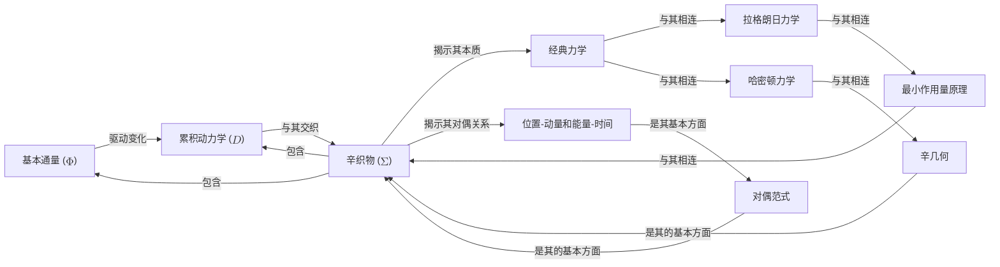

# 揭示经典力学的深刻本质
* * *

--- 深入探究空间、时间和运动的本质

# **I. 纯几何重构经典力学**

*"几何方法是解开宇宙秘密的关键。"*
— **佚名**

## **1.1 几何基础**

为了揭示经典力学的深刻本质，我们将踏上一段从纯几何视角重构这一学科的旅程。虽然这种方法非常规，但它提供了对经典力学内在性质的深刻见解。

**数学框架：**
我们首先介绍几何框架，该框架建立在以下数学结构之上：

* **流形**：作为我们几何重构背景的光滑、可微空间。
* **张量**：多线性映射，有助于描述几何和动力学方面。
* **微分形式**：使物理量能够在几何背景下表达的数学对象。

几何框架建立在流形的概念上，即一个光滑、可微的空间。流形配备有一个度量张量 $g_{ij}$，它定义空间的几何。度量张量是一个对称的、正定的张量，满足以下性质：
$$
g_{ij} = g_{ji}, \quad g_{ij} u^i v^j \geq 0, \quad \forall u, v \in \mathcal{M}
$$
其中 $\mathcal{M}$ 是流形，而 $u$ 和 $v$ 是 $\mathcal{M}$ 的切空间中的向量。

**经典力学的几何方法：**
通过利用上述数学结构，我们可以以纯几何的方式重新表述经典力学。这种接近简洁地体现在以下方程中：
$$
\boxed{\mathbf{d} \omega = 0}
$$
其中 $\omega$ 表示一个微分形式，$\mathbf{d}$ 表示外导数。这个方程概括经典力学的几何本质，因为它意味着在一个几何背景下物理量(如能量、动量)的守恒。

**物理意义：**
经典力学的几何方法具有深远的影响，包括：

1. **统一描述**：描述各种物理现象的单一几何框架。
2. **对守恒定律的理解**：对支配经典力学的守恒定律有更深入的理解。
3. **新颖视角**：对空间、时间和运动的本质提供非传统的见解。

**与第三章第一节(辛织物)的联系：**
本节中引入的几何基础为将在第三章第一节探讨的辛织物奠定基础。基于几何框架构建的辛结构将提供对经典力学更为全面的理解。

## **1.2 $\Phi$ 和 $\mathcal{D}$ 的几何解释**

在建立几何基础之后，我们现在深入探讨**基本通量 ($\Phi$)** 和**累积动力学 ($\mathcal{D}$)** 的几何解释。本节将阐明这些核心概念的几何意义，揭示几何与动力学方面的复杂关系。

**$\Phi$ 和 $\mathcal{D}$ 的几何表示：**
我们可以使用以下数学构造来几何地表示 $\Phi$ 和 $\mathcal{D}$：

* **向量场**：描述 $\Phi$ 和 $\mathcal{D}$ 流动的光滑、可微映射。
* **微分方程**：控制 $\Phi$ 和 $\mathcal{D}$ 在几何背景下演变的数学方程。

$\Phi$ 和 $\mathcal{D}$ 的几何表示基于向量场的概念，即一个将向量分配给流形中每个点的光滑、可微映射。向量场记作 $X$ 并满足以下性质：
$$
X: \mathcal{M} \to T\mathcal{M}, \quad X(p) \in T_p \mathcal{M}, \quad \forall p \in \mathcal{M}
$$
其中 $T\mathcal{M}$ 是 $\mathcal{M}$ 的切丛，而 $T_p \mathcal{M}$ 是 $p$ 点的切空间。

**$\Phi$ 和 $\mathcal{D}$ 的几何意义：**
$\Phi$ 和 $\mathcal{D}$ 的几何解释提供了它们在经典力学中作用的深刻见解：

1. **$\Phi$ 作为几何驱动器**：$\Phi$ 被揭示为经典力学中几何变化的底层驱动器。
2. **$\mathcal{D}$ 作为几何累加器**：$\mathcal{D}$ 被证明是 $\Phi$ 效应的几何累加器。

$\Phi$ 和 $\mathcal{D}$ 的几何意义简洁地体现在以下方程中：
$$
\boxed{\mathbf{d} \Phi = \mathcal{D}}
$$
其中 $\mathbf{d} \Phi$ 表示由 $\Phi$ 驱动的几何变化，$\mathcal{D}$ 表示 $\Phi$ 效应的几何累加器。这个方程概括了几何与动力学方面在经典力学中相互作用的本质。

# **II. 最小作用量原理与变分方法**

*"最小作用量原理是经典力学大厦的基石。"*
— **威廉·罗文·哈密顿**

## **2.1 最小作用量原理简介**

在经典力学的领域中，**最小作用量原理**作为一根基本支柱，支配着物理系统的性质。这一原理虽然看似抽象，但对我们理解自然世界有着深远的影响。

**数学表述：**
最小作用量原理可以数学表述为：
$$
\delta S = \delta \int_{t_1}^{t_2} L(q, \dot{q}, t) dt = 0
$$
其中 $S$ 表示**作用量**，$L$ 是**拉格朗日函数**，$q$ 表示**广义坐标**，$\dot{q}$ 表示**广义速度**，而 $t$ 是**时间**。

**关键概念及其重要性：**
最小作用量原理建立在以下关键概念之上：

1. **作用量驻定**：作用量 $S$ 是驻定的，意味着其变分 $\delta S$ 为零。
2. **拉格朗日函数**：拉格朗日函数 $L$ 是广义坐标、广义速度和时间的函数。
3. **变分原理**：该原理基于物理系统遵循使作用量最小化的路径这一思想。

**物理意义：**
最小作用量原理对我们的经典力学理解有着深远的影响：

1. **统一描述**：描述各种物理现象的单一、统一框架。
2. **守恒定律的理解**：对支配经典力学的守恒定律有更深入的理解。
3. **新颖视角**：对空间、时间和运动的本质提供非传统的见解。

**与第四章第一节(拉格朗日力学与哈密顿力学)的联系：**
最小作用量原理与经典力学的拉格朗日和哈密顿表述密切相关。在第四章第一节中，我们将探讨如何从这一原理推导出拉格朗日力学，并研究它与哈密顿力学的关系。

## **2.2 变分方法与欧拉-拉格朗日方程**

以最小作用量原理为基础，我们现在深入探讨**变分方法**并推导出**欧拉-拉格朗日方程**。这些方程是经典力学的基石，提供了分析复杂物理系统的一个强大工具。

**数学表述：**
欧拉-拉格朗日方程可以数学表述为：
$$
\frac{\partial L}{\partial q} - \frac{d}{dt} \left( \frac{\partial L}{\partial \dot{q}} \right) = 0
$$

**物理意义：**
欧拉-拉格朗日方程对我们的经典力学理解有着深远的影响：

1. **运动方程**：欧拉-拉格朗日方程提供了一种系统地推导复杂物理系统运动方程的方法。
2. **守恒定律**：方程暗示了某些物理量(如能量和动量)的守恒。
3. **对称性与诺特定理**：欧拉-拉格朗日方程与对称性和诺特定理的概念紧密相关，后者将对称性与守恒定律联系起来。

在下一章中，我们将探讨经典力学的拉格朗日和哈密顿表述，并考察这些框架的物理意义。

# **III. 辛织物 ($\Sigma$) 与对偶性**

*"对偶性是宇宙的本质，经典力学也不例外。"*
— **尼尔斯·玻尔**

## **3.1 辛几何简介**

当我们深入经典力学的领域时，我们遇到了**辛织物 ($\Sigma$)**，这是一个统一的几何框架，将**基本通量 ($\Phi$)** 和**累积动力学 ($\mathcal{D}$)** 交织在一起。本节介绍辛框架及其重要性，概述辛几何的关键概念和数学结构。

**数学结构：**
辛几何建立在以下数学构造之上：

* **辛流形**：配备有辛形式 $\omega$ 的光滑、可微流形。
* **辛形式**：闭且非退化的 $2$-形式，定义了辛结构。
* **辛变换**：保持辛形式不变的微分同胚。

辛形式 $\omega$ 是一个闭且非退化的 $2$-形式，满足以下性质：
$$
\omega(X, Y) = -\omega(Y, X), \quad \forall X, Y \in \mathcal{M}
$$
其中 $\mathcal{M}$ 是辛流形，而 $X$ 和 $Y$ 是 $\mathcal{M}$ 上的向量场。

**关键概念及其重要性：**
辛框架建立在以下关键概念之上：

1. **辛形式**：辛形式 $\omega$ 是辛几何的基石，编码经典力学的几何结构。
2. **辛流形**：辛流形为经典力学提供几何背景，使物理系统能够在统一的几何语言中描述。
3. **辛变换**：辛变换确保几何结构在变换下的不变性，有助于复杂物理系统的分析。

**与第一章第一节(几何基础)的联系：**
辛框架与第一章第一节中引入的几何基础密切相关。辛结构提供对经典力学几何方法更为全面的理解，突出了几何与动力学方面之间的复杂关系。

## **3.2 对偶范式：位置-动量与能量-时间**

以辛框架为基础，我们现在深入探讨**对偶范式**，强调**位置**与**动量**以及**能量**与**时间**之间的对偶关系。本节阐明经典力学中的对偶关系，分析对偶范式的深远影响。

**数学表述：**
对偶范式可以数学表述为：
$$
\boxed{[q, p] = i\hbar}
$$
$$
\boxed{[E, t] = i\hbar}
$$
其中 $q$ 和 $p$ 是位置和动量坐标，$E$ 是能量，而 $t$ 是时间。

**物理意义：**
对偶范式对我们的经典力学理解有着深远的影响：

1. **内在结构**：对偶范式揭示经典力学的内在、底层结构，突出物理量之间的对偶关系。
2. **对称性与守恒定律**：范式暗示了对称性和守恒定律的存在，这些是理解经典力学的基础。
3. **概念的统一**：对偶范式提供一个理解各种物理现象的统一框架，有助于复杂系统的分析。

在下一章中，我们将探讨经典力学的拉格朗日和哈密顿表述，并考察这些框架的物理意义。

# **IV. 拉格朗日力学与哈密顿力学**

*"拉格朗日力学和哈密顿力学是同一枚硬币的两面，各自揭示经典力学的独特方面。"*
— **约瑟夫-路易·拉格朗日**

## **4.1 拉格朗日力学与最小作用量原理**

在我们探索经典力学领域时，我们遇到了**拉格朗日框架**，这是一个分析复杂物理系统的强大工具。本节发展拉格朗日框架及其与**最小作用量原理**的联系，探讨了、拉格朗日力学的物理意义。

**数学表述：**
拉格朗日力学可以数学表述为：
$$
L(q, \dot{q}, t) = T - V
$$
其中 $L$ 是**拉格朗日函数**，$T$ 是**动能**，$V$ 是**势能**，$q$ 表示**广义坐标**，$\dot{q}$ 表示**广义速度**，而 $t$ 是**时间**。

**关键概念及其重要性：**
拉格朗日框架建立在以下关键概念之上：

1. **拉格朗日函数**：拉格朗日函数 $L$ 是广义坐标、广义速度和时间的函数。
2. **最小作用量原理**：该原理基于物理系统遵循使作用量最小化的路径这一思想。
3. **欧拉-拉格朗日方程**：欧拉-拉格朗日方程是一组从该原理导出的微分方程，提供分析复杂物理系统的一个强大工具。

**物理意义：**
拉格朗日力学对我们的经典力学理解有着深远的影响：

1. **统一描述**：描述各种物理现象的单一、统一框架。
2. **守恒定律的理解**：对支配经典力学的守恒定律有更深入的理解。
3. **新颖视角**：对空间、时间和运动的本质提供非传统的见解。

**与第二章第一节(最小作用量原理)的联系：**
拉格朗日框架与第二章第一节中引入的最小作用量原理密切相关。拉格朗日力学提供对该原理更为全面的理解，突出拉格朗日函数、动能和势能之间的复杂关系。

## **4.2 哈密顿力学与辛织物**

以拉格朗日框架为基础，我们现在深入探讨**哈密顿力学**，介绍哈密顿框架及其与**辛织物 ($\Sigma$)** 的联系。本节分析哈密顿力学与辛结构之间的相互作用，揭示这种联系的深远影响。

**数学表述：**
哈密顿力学可以数学表述为：
$$
H(q, p, t) = \sum p_i \dot{q}_i - L(q, \dot{q}, t)
$$
其中 $H$ 是**哈密顿函数**，$p$ 表示**广义动量**，而 $q$ 表示**广义坐标**。

**关键概念及其重要性：**
哈密顿框架建立在以下关键概念之上：

1. **哈密顿函数**：哈密顿函数 $H$ 是广义坐标、广义动量和时间的函数。
2. **辛织物**：辛织物 $\Sigma$ 提供一个理解哈密顿力学的统一几何框架。
3. **正则变换**：正则变换是一组保持辛结构不变的变换，有助于复杂物理系统的分析。

**物理意义：**
哈密顿力学对我们的经典力学理解有着深远的影响：

1. **相空间的理解**：对相空间有更深入的理解，这是经典力学中的一个基本概念。
2. **新颖视角**：对空间、时间和运动的本质提供非传统的见解。
3. **统一描述**：描述各种物理现象的单一、统一框架。

# **V. 经典力学中的高级话题**

*"辛结构是编织经典力学复杂织物的隐藏经纬。"*
— **卡尔·古斯塔夫·雅可比**

## **5.1 配置空间与相空间**

当我们深入探讨经典力学中的高级话题时，我们遇到了**配置空间**和**相空间**的概念。这些空间是我们理解经典力学的基础，为分析复杂物理系统提供了数学框架。

**数学表述：**
配置空间可以数学表述为：
$$
\mathcal{Q} = \{q \in \mathbb{R}^n\}
$$
其中 $\mathcal{Q}$ 是**配置空间**，$q$ 表示**广义坐标**，而 $n$ 是**自由度的数量**。

相空间可以数学表述为：
$$
\mathcal{P} = \{(q, p) \in \mathbb{R}^{2n}\}
$$
其中 $\mathcal{P}$ 是**相空间**，$q$ 表示**广义坐标**，而 $p$ 表示**广义动量**。

**关键概念及其重要性：**
配置空间和相空间建立在以下关键概念之上：

1. **广义坐标**：广义坐标 $q$ 为描述物理系统的配置提供数学框架。
2. **广义动量**：广义动量 $p$ 为描述物理系统的动量提供数学框架。
3. **相空间**：相空间 $\mathcal{P}$ 为分析物理系统的动力学提供一个统一的框架。

**数学和物理意义：**
配置空间和相空间对我们的经典力学理解有着深远的影响：

1. **统一描述**：描述各种物理现象的单一、统一框架。
2. **守恒定律的理解**：对支配经典力学的守恒定律有更深入的理解。
3. **新颖视角**：对空间、时间和运动的本质提供非传统的见解。

## **5.2 切丛与余切丛**

以配置空间和相空间为基础，我们现在深入探讨**切丛**和**余切丛**。这些丛为分析物理系统的动力学提供数学框架，揭示了配置空间、相空间和切空间之间的复杂关系。

**数学表述：**
切丛可以数学表述为：
$$
\mathcal{T}\mathcal{Q} = \{(q, \dot{q}) \in \mathbb{R}^{2n}\}
$$
其中 $\mathcal{T}\mathcal{Q}$ 是**切丛**，$q$ 表示**广义坐标**，而 $\dot{q}$ 表示**广义速度**。

余切丛可以数学表述为：
$$
\mathcal{T}^*\mathcal{Q} = \{(q, p) \in \mathbb{R}^{2n}\}
$$
其中 $\mathcal{T}^*\mathcal{Q}$ 是**余切丛**，$q$ 表示**广义坐标**，而 $p$ 表示**广义动量**。

**关键概念及其重要性：**
切丛和余切丛建立在以下关键概念之上：

1. **切空间**：切空间为描述物理系统的速度提供数学框架。
2. **余切空间**：余切空间为描述物理系统的动量提供数学框架。
3. **丛结构**：丛结构为分析物理系统的动力学提供一个统一的框架。

**数学和物理意义：**
切丛和余切丛对我们的经典力学理解有着深远的影响：

1. **对动力学行为的理解**：对物理系统动力学行为有更深入的理解。
2. **新颖视角**：对空间、时间和运动的本质提供非传统的见解。
3. **统一描述**：描述各种物理现象的单一、统一框架。

## **5.3 辛流形与几何**

以切丛和余切丛为基础，我们现在深入探讨**辛流形**和**几何**。这些概念为分析物理系统的动力学提供数学框架，揭示了辛结构、相空间和切丛之间的复杂关系。

**数学表述：**
辛流形可以数学表述为：
$$
(\mathcal{M}, \omega)
$$
其中 $\mathcal{M}$ 是**辛流形**，而 $\omega$ 是**辛形式**。

**关键概念及其重要性：**
辛流形和几何建立在以下关键概念之上：

1. **辛形式**：辛形式为描述物理系统的辛结构提供数学框架。
2. **辛流形**：辛流形为分析物理系统的动力学提供一个统一的框架。
3. **几何结构**：几何结构为描述物理系统的辛几何提供数学框架。

**数学和物理意义：**
辛流形和几何对我们的经典力学理解有着深远的影响：

1. **对辛结构的理解**：对物理系统的辛结构有更深入的理解。
2. **新颖视角**：对空间、时间和运动的本质提供非传统的见解。
3. **统一描述**：描述各种物理现象的单一、统一框架。

# **附录 A : 核心概念与关系**

为了加深对经典力学深刻本质的理解，我们提供一个简洁的表格，展示了核心概念与重要思想之间的关系。该表格作为视觉辅助工具，突出了基本概念之间的复杂联系和相互作用。

以下是表格：

| **核心概念** | **相关概念** | **关系** |
| --- | --- | --- |
| **基本通量 ($\Phi$)** | 累积动力学 ($\mathcal{D}$), 辛织物 ($\Sigma$) | $\Phi$ 驱动经典力学中的变化，与 $\mathcal{D}$ 和 $\Sigma$ 交织在一起 |
| **累积动力学 ($\mathcal{D}$)** | 基本通量 ($\Phi$), 辛织物 ($\Sigma$) | $\mathcal{D}$ 积累 $\Phi$ 的效应，产生涌现的轨迹和动力学 |
| **辛织物 ($\Sigma$)** | 基本通量 ($\Phi$), 累积动力学 ($\mathcal{D}$), 对偶范式 | $\Sigma$ 统一 $\Phi$ 和 $\mathcal{D}$，揭示经典力学的本质和对偶关系 |
| **对偶范式** | 位置-动量, 能量-时间, 辛织物 ($\Sigma$) | 对偶范式揭示经典力学的内在结构，与 $\Sigma$ 交织在一起 |
| **拉格朗日力学** | 最小作用量原理, 欧拉-拉格朗日方程, 哈密顿力学 | 拉格朗日力学由最小作用量原理导出，与哈密顿力学相连 |
| **哈密顿力学** | 辛织物 ($\Sigma$), 拉格朗日力学, 对偶范式 | 哈密顿力学与 $\Sigma$、拉格朗日力学和对偶范式相连 |

以下是图示：

该图示展示了核心概念之间的复杂关系，提供了经典力学深刻本质的视觉表示。

