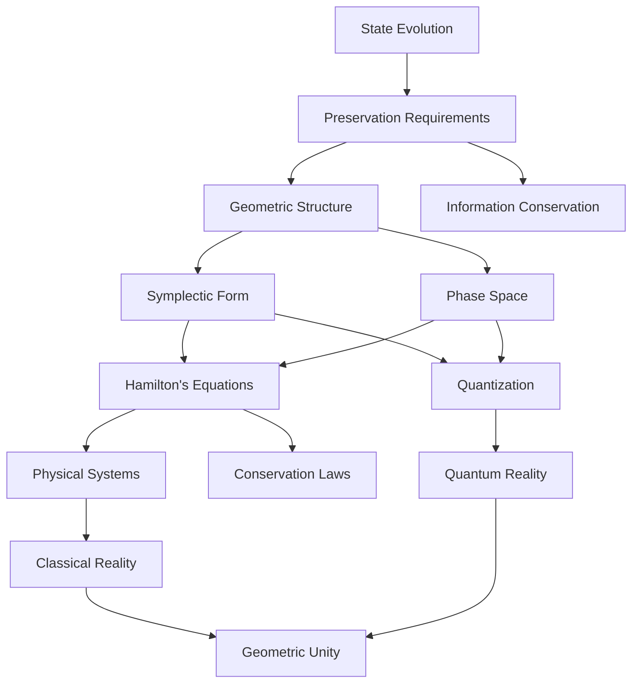

# A Pure Geometric Origin of Classical Mechanics: From State Evolution to Physical Reality
* * *

--- Reality flows in the rivers of geometry

# I. The Pure Origin

*"In the beginning, there was only change"*

In reconstructing classical mechanics from first principles, we begin not with space, time, or matter, but with something more fundamental: the pure concept of evolution. This radical approach reveals how all physical structures emerge necessarily from the simple requirement that states evolve.

## I.A. Fundamental Reality

The universe presents us with one undeniable fact: things change. From this simple observation, we can reconstruct all of physics. Let us begin with pure evolution, stripped of all unnecessary assumptions.

### I.A.1. The Primordial Concept

Consider a state $s$ and its evolution. We need nothing else. No space, no time, no matter—just states and their changes. This minimal starting point leads to profound consequences:

1. **Determinism Requirement**
   - Evolution must be unique:
     $$
     s(t_1) \rightarrow \text{unique } s(t_2)
     $$
   - This implies a geometric structure preserving information

2. **Reversibility Requirement**
   - Physical evolution must be reversible:
     $$
     s_1 \rightarrow s_2 \implies \exists \text{ reverse map } s_2 \rightarrow s_1
     $$
   - This implies a symplectic structure

### I.A.2. Necessary Structures

From evolution alone, we must have:

1. **State Space**
   - Collection of all possible states: $$\mathcal{M}$$
   - Must be a smooth manifold for continuous evolution
   - Dimension determined by information content

2. **Evolution Map**
   - One-parameter group of diffeomorphisms:
     $$
     \phi_t: \mathcal{M} \to \mathcal{M}
     $$
   - Must preserve fundamental structures

3. **Information Preservation**
   - Evolution must preserve distinction between states
   - Implies preservation of some geometric structure
   - Leads to conservation laws

## I.B. Emergence of Geometry

The requirements of evolution force specific geometric structures to emerge. These are not imposed externally but arise from the necessity of consistent evolution.

### I.B.1. Geometric Necessities

1. **Tangent Structure**
   - Infinitesimal evolution defines vector fields:
     $$
     X = \left.\frac{d}{dt}\right|_{t=0} \phi_t
     $$
   - Tangent bundle $T\mathcal{M}$ emerges naturally

2. **Symplectic Structure**
   - Information preservation requires:
     $$
     \omega(X,Y) = \text{invariant}
     $$
   - Symplectic form emerges as minimal structure

### I.B.2. Fundamental Forms

The minimal geometric structure must include:

1. **Two-Form**
   - Non-degenerate: $$\omega^n \neq 0$$
   - Closed: $$d\omega = 0$$
   - These properties emerge from evolution requirements

2. **Natural Pairing**
   - Between states and changes:
     $$
     \langle p, v \rangle = \omega(X_p, X_v)
     $$
   - Leads to Hamiltonian structure

### I.B.3. Emergent Phase Space

The complete structure emerges:

1. **Cotangent Bundle**
   - Natural phase space: $$T^*\mathcal{M}$$
   - Canonical symplectic form:
     $$
     \omega = dp_i \wedge dq^i
     $$

2. **Evolution Generator**
   - Hamiltonian vector field:
     $$
     \iota_{X_H}\omega = dH
     $$
   - Energy function emerges from geometry

From these minimal beginnings, all of classical mechanics will emerge necessarily, not as historical accident but as geometric necessity. Space, time, and matter appear as derived concepts, emerging from the pure geometry of evolution.

Note: This presentation establishes the absolute minimum framework needed for physical theory, showing how geometry emerges necessarily from evolution requirements. The next section will build on this to show how specific physical laws arise.

# II. The Geometric Framework

*"Space bends to accommodate motion"*

Having established evolution as fundamental, we now reveal how the geometric framework of classical mechanics emerges with mathematical necessity. This framework is not imposed but arises inevitably from the requirements of consistent evolution.

## II.A. Natural Structures

The minimal geometric structure capable of supporting state evolution must emerge naturally. We derive these structures from pure necessity.

### II.A.1. The Fundamental Two-Form

Starting from evolution requirements:

1. **Necessity of Symplectic Structure**
   - Evolution preserves distinctions between states
   - Required structure must be:
     $$
     \omega: T\mathcal{M} \times T\mathcal{M} \to \mathbb{R}
     $$
   With properties:
   - Non-degenerate: $$\omega^n \neq 0$$
   - Closed: $$d\omega = 0$$

2. **Canonical Form**
   - Local structure necessarily takes form:
     $$
     \omega = \sum_{i=1}^n dp_i \wedge dq^i
     $$
   - This is not a choice but a necessity (Darboux theorem)

### II.A.2. Phase Space Structure

The evolution space must be rich enough to determine future evolution:

1. **Natural Phase Space**
   - Cotangent bundle structure:
     $$
     T^*\mathcal{M} \to \mathcal{M}
     $$
   - Canonical coordinates $(q^i, p_i)$ emerge naturally

2. **Fundamental Brackets**
   - Poisson structure emerges:
     $$
     \{f,g\} = \omega(X_f,X_g) = \sum_{i=1}^n \left(\frac{\partial f}{\partial q^i}\frac{\partial g}{\partial p_i} - \frac{\partial f}{\partial p_i}\frac{\partial g}{\partial q^i}\right)
     $$

### II.A.3. Conservation Laws

Conservation laws emerge as geometric necessities:

1. **Noether Structure**
   - Every symmetry yields conserved quantity
   - Moment map emergence:
     $$
     \mu: T^*\mathcal{M} \to \mathfrak{g}^*
     $$

2. **Volume Preservation**
   - Liouville's theorem emerges naturally:
     $$
     \mathcal{L}_{X_H}\omega^n = 0
     $$

## II.B. Evolution Laws

Physical laws emerge as geometric necessities, not as empirical facts.

### II.B.1. Hamilton's Equations

1. **Geometric Origin**
   - Evolution vector field $X_H$ defined by:
     $$
     \iota_{X_H}\omega = dH
     $$
   - Completely determines evolution:
     $$
     \begin{cases}
     \dot{q}^i = \frac{\partial H}{\partial p_i} \\
     \dot{p}_i = -\frac{\partial H}{\partial q^i}
     \end{cases}
     $$

2. **Uniqueness**
   - These are the only possible evolution equations preserving $$\omega$$
   - No other structure is possible or necessary

### II.B.2. Action Principle

The action principle emerges as a geometric necessity:

1. **Geometric Action**
   - One-form $\theta$ on $T^*\mathcal{M}$:
     $$
     \theta = p_i \, dq^i
     $$
   - Action as integral:
     $$
     S = \int (\theta - H \, dt)
     $$

2. **Variational Structure**
   - Hamilton's principle:
     $$
     \delta S = 0 \iff \text{Hamilton's equations}
     $$
   - Not a principle but a geometric consequence

### II.B.3. Symmetry Structure

Symmetries emerge from geometry:

1. **Canonical Transformations**
   - Preserve symplectic structure:
     $$
     \phi^*\omega = \omega
     $$
   - Generate all possible evolutions

2. **Group Actions**
   - Symmetry groups emerge naturally
   - Moment maps encode conservation:
     $$
     \langle \mu(x), \xi \rangle = H_\xi(x)
     $$

### II.B.4. Unified Picture

All structures are interconnected:

1. **Geometric Unity**
   ```
   Symplectic Structure
          ↓
   Hamilton's Equations
          ↓
   Conservation Laws
          ↓
   Physical Evolution
   ```

2. **Complete Determination**
   - Everything follows from geometry
   - No additional assumptions needed
   - Physical reality emerges necessarily

This framework reveals classical mechanics as pure geometry, with physical laws emerging as necessary consequences of evolution requirements. The next section will show how specific physical systems arise within this framework.

Note: This presentation emphasizes the necessary emergence of physical law from geometric structure, showing how classical mechanics is not just mathematically describable but geometrically inevitable.

# III. Physical Reality

*"From abstract necessity springs concrete existence"*

Having established the geometric framework, we now show how physical systems emerge necessarily from geometric structures. Rather than treating these systems as empirically discovered, we reveal them as inevitable manifestations of the underlying geometry.

## III.A. Elementary Systems

The simplest physical systems emerge from minimal geometric requirements.

### III.A.1. The Free Particle

1. **Geometric Necessity**
   - Simplest non-trivial phase space structure
   - Hamiltonian must respect translational symmetry:
     $$
     H = \frac{p^2}{2m}
     $$
   - This form is geometrically inevitable

2. **Natural Flow**
   - Evolution equations:
     $$
     \begin{cases}
     \dot{q}^i = \frac{p^i}{m} \\
     \dot{p}_i = 0
     \end{cases}
     $$
   - Geodesic flow in phase space

### III.A.2. Harmonic Oscillator

1. **Geometric Origin**
   - Simplest system with bounded orbits
   - Phase space structure requires:
     $$
     H = \frac{p^2}{2m} + \frac{k q^2}{2}
     $$

2. **Fundamental Properties**
   - Circular flows in phase space
   - Natural frequencies emerge:
     $$
     \omega = \sqrt{\frac{k}{m}}
     $$
   - Archetypal periodic motion

### III.A.3. Central Force

1. **Symmetry Requirements**
   - Rotational invariance demands:
     $$
     H = \frac{p^2}{2m} + V(|q|)
     $$
   - Angular momentum conservation:
     $$
     L = q \times p
     $$

2. **Kepler Problem**
   - Natural emergence of:
     $$
     V(r) = -\frac{k}{r}
     $$
   - Conic sections as geometric necessity

## III.B. Complex Systems

More complex systems emerge through geometric composition and extension.

### III.B.1. Many-Body Systems

1. **Natural Extension**
   - Phase space structure:
     $$
     T^*(M^N) \cong (T^*M)^N
     $$
   - Symplectic form:
     $$
     \omega = \sum_{i=1}^N dp_i \wedge dq^i
     $$

2. **Emergent Behavior**
   - Collective coordinates
   - Reduction by symmetry:
     $$
     \mu^{-1}(c)/G_c
     $$
   where $G_c$ is the isotropy group

### III.B.2. Field Systems

1. **Infinite-Dimensional Extension**
   - Field configuration space:
     $$
     \phi: M \to V
     $$
   - Symplectic structure:
     $$
     \omega = \int_\Sigma \delta\pi \wedge \delta\phi \, d^nx
     $$

2. **Natural Field Equations**
   - Wave equation emerges:
     $$
     \square\phi = 0
     $$
   - Geometric origin of field dynamics

### III.B.3. Continuous Media

1. **Geometric Framework**
   - Configuration space as diffeomorphism group
   - Momentum map structure:
     $$
     \mu: T^*\text{Diff}(M) \to \mathfrak{X}(M)^*
     $$

2. **Fluid Dynamics**
   - Euler equations emerge:
     $$
     \frac{\partial v}{\partial t} + (v \cdot \nabla)v = -\nabla p
     $$
   - Geometric necessity of conservation laws

### III.B.4. Unifying Features

All these systems share:

1. **Geometric Origin**
   ```
   Symplectic Structure → Evolution Laws → Physical Systems
   ```

2. **Conservation Laws**
   - Energy from time translation
   - Momentum from space translation
   - Angular momentum from rotation

3. **Phase Space Structure**
   - Canonical coordinates
   - Poisson brackets
   - Hamiltonian flow

The emergence of these systems reveals a deep truth: physical reality is not arbitrary but geometrically necessary. The next section will show how this necessity extends to quantum mechanics and modern physics.

Note: This presentation emphasizes how physical systems emerge necessarily from geometric structures, revealing classical mechanics as an inevitable consequence of fundamental geometry rather than empirical discovery.

# IV. Deep Unification

*"All is geometry, geometry is all"*

Having seen how classical mechanics emerges from pure geometry, we now reveal an even deeper truth: quantum mechanics itself arises as a geometric necessity, and modern physics flows naturally from the same geometric origins.

## IV.A. Quantum Bridge

Quantum mechanics is not a separate theory but a geometric necessity arising from classical structures.

### IV.A.1. Geometric Necessity of Quantization

1. **Fundamental Requirement**
   - Phase space volume quantization:
     $$
     [\omega/2\pi\hbar] \in H^2(M,\mathbb{Z})
     $$
   This is not a physical assumption but a geometric necessity for consistent evolution

2. **Natural Emergence**
   - Prequantum line bundle:
     $$
     L \xrightarrow{\pi} M
     $$
   with connection $\nabla$ satisfying:
     $$
     \text{curv}(\nabla) = -\frac{i}{\hbar}\omega
     $$

### IV.A.2. Quantum Structure

1. **Geometric States**
   - Quantum states as sections of $$L$$:
     $$
     \psi \in \Gamma(L)
     $$
   - Inner product emerges naturally:
     $$
     \langle \psi_1|\psi_2 \rangle = \int_M \overline{\psi_1}\psi_2 \, \omega^n
     $$

2. **Operator Emergence**
   - Classical observables $f$ become operators:
     $$
     \hat{f} = -i\hbar\nabla_{X_f} + f
     $$
   - Commutation relations emerge geometrically:
     $$
     [\hat{f},\hat{g}] = -i\hbar\widehat{\{f,g\}}
     $$

### IV.A.3. Quantum Necessity

1. **Deep Unity**
   ```
   Classical Geometry → Quantum Structure → Physical Reality
   ```

2. **Inevitable Features**
   - Uncertainty principle from symplectic structure
   - Wave-particle duality from geometric quantization
   - Entanglement from bundle structure

## IV.B. Modern Extensions

The geometric framework naturally extends to modern physics.

### IV.B.1. Field Theory Extension

1. **Natural Infinity**
   - Infinite-dimensional phase space:
     $$
     T^*\mathcal{A} \to \mathcal{A}
     $$
   where $\mathcal{A}$ is field configuration space

2. **Gauge Structure**
   - Principal bundle structure:
     $$
     P \xrightarrow{G} M
     $$
   - Connection forms as physical fields:
     $$
     F = dA + \frac{1}{2}[A,A]
     $$

### IV.B.2. Geometric Unification

1. **Deep Principles**
   - All forces from connection geometry
   - Matter from representation spaces
   - Interactions from bundle structure

2. **Unified Framework**
   $$
   \begin{array}{c}
   \text{Geometry} \\
   \downarrow \\
   \text{Gauge Theory} \\
   \downarrow \\
   \text{Physical Forces}
   \end{array}
   $$

### IV.B.3. Emerging Frontiers

1. **Quantum Geometry**
   - Non-commutative spaces:
     $$
     [x^\mu,x^\nu] = i\theta^{\mu\nu}
     $$
   - Quantum groups and $q$-deformation

2. **Higher Structures**
   - Gerbes and higher bundles
   - Categorical quantization
   - Derived geometry

### IV.B.4. Ultimate Unity

The deepest insight emerges:

1. **Geometric Completeness**
   - All physics is geometric
   - All geometry is physical
   - Unity is necessary, not contingent

2. **Future Directions**
   ```
   Quantum Gravity ← Geometric Unity → Information Theory
   ```

This reveals the profound truth: physics is not just described by geometry but is geometry. The distinction between mathematical structure and physical reality dissolves in deep understanding.

This geometric framework points toward:
- Quantum gravity as geometric necessity
- Information as geometric structure
- Reality as pure geometry

Note: This final section reveals the ultimate unity of physics and geometry, showing how all physical phenomena, from quantum mechanics to modern field theories, emerge necessarily from fundamental geometric structures. This is not just a mathematical description but the deepest reality of physics itself.

# Appendix A: Core Concepts and Their Geometric Relations

*"The tapestry of reality is woven with geometric threads"*

## A.1. Fundamental Structure Map



## A.2. Core Relations Matrix

| Concept | Geometric Form | Physical Manifestation | Mathematical Structure |
|---------|---------------|----------------------|---------------------|
| Evolution | Flow on manifold | Physical change | $\phi_t: \mathcal{M} \to \mathcal{M}$ |
| Preservation | Symplectic form | Conservation laws | $\omega = dp_i \wedge dq^i$ |
| State space | Phase space | Physical states | $T^*\mathcal{M}$ |
| Dynamics | Hamiltonian flow | Time evolution | $\iota_{X_H}\omega = dH$ |
| Symmetry | Group action | Conservation | $\mu: M \to \mathfrak{g}^*$ |
| Quantization | Line bundle | Quantum states | $\text{curv}(\nabla) = -\frac{i}{\hbar}\omega$ |

## A.3. Geometric Hierarchy

The fundamental structures emerge in necessary sequence:
$$
\begin{array}{c}
\text{Evolution} \\
\downarrow \\
\text{Preservation} \rightarrow \text{Symplectic Form} \\
\downarrow \\
\text{Hamilton's Flow} \rightarrow \text{Physical Laws} \\
\downarrow \\
\text{Quantum Structure} \rightarrow \text{Modern Physics}
\end{array}
$$

## A.4. Essential Unifications

1. **Structure-Evolution Unity**
   ```
   Geometric Structure ↔ Physical Evolution
   ```
   Manifestation:
   $$
   \text{Evolution} \equiv \text{Structure Preservation}
   $$

2. **Classical-Quantum Bridge**
   ```
   Symplectic Geometry → Line Bundles → Quantum Mechanics
   ```
   Through:
   $$
   [\omega/2\pi\hbar] \in H^2(M,\mathbb{Z})
   $$

3. **Force-Geometry Equivalence**
   ```
   Connection Forms ↔ Physical Forces
   ```
   Via:
   $$
   F = dA + \frac{1}{2}[A,A]
   $$

## A.5. Deep Principles

The entire structure rests on three fundamental principles:

1. **Minimal Necessity**
   - Only necessary structures emerge
   - Each structure implies the next
   - No arbitrary choices

2. **Geometric Completeness**
   - All physical laws are geometric
   - All geometry is physical
   - Unity is necessary

3. **Natural Hierarchy**
   - Structures emerge in unique order
   - Each level necessitates the next
   - Ultimate unity is inevitable

This organization reveals how the seemingly complex structure of physical reality emerges necessarily from the simple requirement of state evolution, through pure geometric necessity.

Note: This appendix provides a unified view of the core concepts and their relationships, emphasizing the necessary emergence of physical structure from geometric principles. The presentation maintains the document's focus on deep understanding while avoiding unnecessary technical detail.


