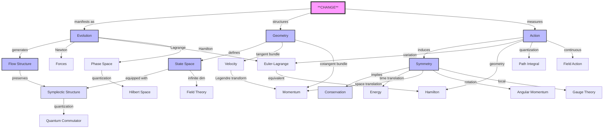

# Classical Mechanics: A Geometric Journey from Change to Symmetry
* * *

--- From the simplest change emerges the deepest symmetry

# I. Foundations: The Nature of Change

*"In the beginning, there was change. All else follows."*

## 1.1 The Mathematics of Change

At its most fundamental level, physics describes change. Before forces, before energy, before even space and time, there is change. Let us build from this primitive concept.

### 1.1.1 The Abstract Nature of Change

Consider a system in state $s$. The mathematical structure of change requires:

1) **State Space**:
$$
\mathcal{S} = \{s \mid s \text{ is a possible state}\}
$$

2) **Evolution Structure**:
$$
\Phi: \mathcal{S} \times \mathbb{R} \rightarrow \mathcal{S}
$$
   satisfying:
$$
\begin{aligned}
\Phi(s,0) &= s \quad \text{(identity)} \\
\Phi(\Phi(s,t_1),t_2) &= \Phi(s,t_1+t_2) \quad \text{(group property)}
\end{aligned}
$$

3) **Continuity Structure**:
   For any state $s$ and time $t$:
$$
\lim_{h \to 0} \Phi(s,t+h) = \Phi(s,t)
$$

### 1.1.2 The Differential Structure

The infinitesimal generator of change:
$$
X_s = \lim_{h \to 0} \frac{\Phi(s,h) - s}{h}
$$
leads to the fundamental equation:
$$
\frac{d}{dt}\Phi(s,t) = X_{\Phi(s,t)}
$$

This abstract structure already contains profound implications:

1) **Determinism**:
$$
s(t_2) = \Phi(s(t_1),t_2-t_1)
$$

2) **Reversibility**:
$$
\Phi(s,-t) = \Phi^{-1}(s,t)
$$

3) **Flow Property**:
$$
\{\Phi_t\}_{t \in \mathbb{R}} \text{ forms a one-parameter group}
$$

## 1.2 Geometric Foundations

The abstract structure of change naturally induces geometric structures.

### 1.2.1 Manifold Structure

1) **Local Charts**:
   For each state $s$, there exists a neighborhood $U_s$ and map:
$$
\varphi_s: U_s \rightarrow \mathbb{R}^n
$$

2) **Transition Functions**:
   For overlapping charts $(U_\alpha,\varphi_\alpha)$ and $(U_\beta,\varphi_\beta)$:
$$
\varphi_\beta \circ \varphi_\alpha^{-1}: \varphi_\alpha(U_\alpha \cap U_\beta) \rightarrow \varphi_\beta(U_\alpha \cap U_\beta)
$$
   is smooth.

### 1.2.2 Bundle Structures

1) **Tangent Bundle**:
$$
TM = \bigcup_{p \in M} T_pM
$$
   with projection:
$$
\pi: TM \rightarrow M
$$

2) **Cotangent Bundle**:
$$
T^*M = \bigcup_{p \in M} T^*_pM
$$

### 1.2.3 Fundamental Forms

1) **Symplectic Form**:
$$
\omega: TM \times TM \rightarrow \mathbb{R}
$$
   satisfying:
   - Closed: $d\omega = 0$
   - Non-degenerate: $\omega(X,Y)=0 \,\forall Y \Rightarrow X=0$

2) **Volume Form**:
$$
\Omega = \frac{1}{n!}\omega^n
$$

### 1.2.4 Critical Connection

The fundamental theorem connecting change to geometry:

**Theorem**: *Every smooth evolution preserving the symplectic form generates a Hamiltonian flow.*

This leads to:
$$
\mathcal{L}_X\omega = 0 \Leftrightarrow \exists H: M \rightarrow \mathbb{R} \text{ such that } X = X_H
$$

This geometric structure naturally leads to:
1) Conservation laws through symmetries
2) Action principles through variational structures
3) Quantum mechanics through geometric quantization

The profound unity of these structures reveals that geometry is not merely a language for describing physics—it is the essence of physics itself.

# II. The Action Principle: A Geometric Perspective

*"Nature's efficiency manifests through geometric invariance"*

## 2.1 Action as Geometric Invariant

The action principle transcends its historical formulation as a mere calculus of variations. At its core, it represents a fundamental geometric invariant of nature.

### 2.1.1 Geometric Foundation of Action

Consider a path $\gamma: [t_1,t_2] \rightarrow M$ in our state manifold. The action emerges as:
$$
S[\gamma] = \int_{\gamma} \alpha,
$$
where $\alpha$ is a fundamental $1$-form on the extended phase space $\tilde{M} = T^*Q \times \mathbb{R}$.

Key Geometric Properties:
1) **Invariance**: Under canonical transformations
2) **Independence**: Of parametrization
3) **Locality**: In phase space

### 2.1.2 The Fundamental Symplectic Structure

The action induces a natural symplectic structure:
$$
\omega = -d\alpha = \sum_i dp_i \wedge dq^i.
$$
This leads to the profound relation:
$$
\text{ker}(\omega) = \text{span}\{X_H\},
$$
where $X_H$ is the Hamiltonian vector field.

### 2.1.3 Variational Structure

The variation of action yields:
$$
\delta S[\gamma] = \int_{t_1}^{t_2} \left(\frac{\partial L}{\partial q^i}\delta q^i + \frac{\partial L}{\partial \dot{q}^i}\delta \dot{q}^i\right)dt.
$$
More fundamentally:
$$
\delta S[\gamma] = \int_{\gamma} \mathcal{L}_X\alpha,
$$
where $\mathcal{L}_X$ is the Lie derivative.

## 2.2 Symmetry and Conservation

The deep connection between symmetry and conservation emerges naturally from the geometric framework.

### 2.2.1 Geometric Formulation of Symmetry

A symmetry is a diffeomorphism $\phi: M \rightarrow M$ preserving the action:
$$
S[\phi \circ \gamma] = S[\gamma].
$$
This leads to the infinitesimal version:
$$
\mathcal{L}_X\alpha = 0.
$$

### 2.2.2 Noether's Theorem: Geometric Version

**Theorem**: *For every one-parameter group of symmetries generated by vector field $X$, there exists a conserved quantity $Q_X$:*
$$
Q_X = i_X\alpha,
$$
*where $i_X$ denotes interior product*.

Key Properties:
1) **Conservation**:
$$
\frac{d}{dt}Q_X = 0 \text{ along solutions}
$$

2) **Lie Algebra Structure**:
$$
\{Q_X, Q_Y\} = Q_{[X,Y]}
$$

3) **Momentum Map**:
$$
\mu: M \rightarrow \mathfrak{g}^* ,
$$
   where $\mathfrak{g}^*$ is the dual of the Lie algebra.

### 2.2.3 Unified Perspective

The deep unity emerges in the diagram:
$$
\begin{CD}
\text{Symmetry} @>\text{Noether}>> \text{Conservation} \\
@VVV @AAA \\
\text{Geometry} @>>\text{Action}> \text{Dynamics}
\end{CD}
$$

### 2.2.4 Critical Implications

1) **Phase Space Structure**:
$$
\omega(X_H, X_F) = \{H,F\}
$$

2) **Conservation Algebra**:
   For any constants of motion $F,G$:
$$
\{F,G\} \text{ is also conserved}
$$

3) **Integrability Criterion**:
   System is integrable iff it has $n$ independent conserved quantities in involution:
$$
\{F_i, F_j\} = 0 \quad \forall i,j
$$

## 2.3 Conclusion

This geometric perspective reveals that conservation laws are not accidents but fundamental features of the geometric structure of phase space. The action principle serves as the bridge between symmetry and dynamics, encoding both in its geometric structure.

# III. Unified Geometric Framework

*"The dance of particles is the geometry of space itself"*

## 3.1 Configuration Space and Phase Space

The geometry of mechanics reveals itself through a hierarchy of spaces, each with increasingly rich structure.

### 3.1.1 Configuration Manifold

Start with configuration space $Q$. For $n$ degrees of freedom:
$$
Q = \{q = (q^1,...,q^n) \mid \text{all possible configurations}\}
$$

The fundamental geometric structures emerge:

1) **Tangent Bundle** $TQ$:
$$
TQ = \bigcup_{q \in Q} T_qQ \xrightarrow{\pi} Q
$$
   representing velocity phase space.

2) **Cotangent Bundle** $T^*Q$:
$$
T^*Q = \bigcup_{q \in Q} T^*_qQ \xrightarrow{\pi} Q
$$
   representing momentum phase space.

### 3.1.2 Canonical Symplectic Structure

The cotangent bundle carries a natural symplectic form:
$$
\omega = \sum_{i=1}^n dp_i \wedge dq^i
$$

Critical Properties:
1) **Canonical $1$-form**:
$$
\theta = p_idq^i \quad \text{with} \quad \omega = -d\theta
$$

2) **Darboux's Theorem**: Locally, all symplectic forms look like this.

3) **Poisson Structure**:
$$
\{F,G\} = \omega(X_F,X_G) = \sum_{i=1}^n \left(\frac{\partial F}{\partial q^i}\frac{\partial G}{\partial p_i} - \frac{\partial F}{\partial p_i}\frac{\partial G}{\partial q^i}\right)
$$

### 3.1.3 Lagrangian Submanifolds

Key geometric objects in phase space:
$$
\Lambda \subset T^*Q \text{ is Lagrangian if } \dim \Lambda = n \text{ and } \omega|_\Lambda = 0
$$

Fundamental Properties:
1) **Generating Functions**: Local existence of $S$ such that
$$
\Lambda = \left\{(q,p) \mid p_i = \frac{\partial S}{\partial q^i}\right\}
$$

2) **Intersection Theory**:
$$
\dim(\Lambda_1 \cap \Lambda_2) = \text{topological invariant}
$$

## 3.2 Dynamics as Geometry

The profound insight: Physical evolution is purely geometric.

### 3.2.1 Hamiltonian Vector Fields

For any function $H: T^*Q \rightarrow \mathbb{R}$:
$$
X_H = \omega^{-1}(dH,\cdot)
$$

Fundamental Properties:
1) **Flow Preservation**:
$$
\mathcal{L}_{X_H}\omega = 0
$$

2) **Evolution Equations**:
$$
\begin{cases}
\dot{q}^i = \frac{\partial H}{\partial p_i} \\
\dot{p}_i = -\frac{\partial H}{\partial q^i}
\end{cases}
$$

### 3.2.2 Geometric Integration

The deep unity emerges in the diagram:
$$
\begin{CD}
TQ @>\mathcal{L}>> \mathbb{R} @>\text{E-L}>> TQ \\
@VV\mathbb{F}\mathcal{L}V @. @AA\mathbb{F}\mathcal{L}A \\
T^*Q @>H>> \mathbb{R} @>X_H>> T^*Q
\end{CD}
$$
where $\mathbb{F}\mathcal{L}$ is the Legendre transform.

### 3.2.3 Unifying Principles

1) **Contact Geometry** unifies Lagrangian and Hamiltonian views:
$$
\alpha = p \, dq - H \, dt
$$
   on extended phase space.

2) **Symplectic Reduction** connects different formulations:
$$
J^{-1}(\mu)/G_\mu \cong T^*(Q/G)
$$

3) **Generating Functions** link different perspectives:
$$
S_2(q,P,t): \quad p = \frac{\partial S_2}{\partial q}, \quad Q = \frac{\partial S_2}{\partial P}
$$

### 3.2.4 Fundamental Theorems

1) **Liouville's Theorem**:
$$
\frac{d}{dt}\int_\Omega \omega^n = 0
$$

2) **Arnold-Liouville**:
   For integrable systems:
$$
(T^*Q,\omega) \cong (T^n \times \mathbb{R}^n, \sum dp_i \wedge dq^i)
$$

3) **Marsden-Weinstein**:
$$
J^{-1}(0)/G \text{ inherits symplectic structure}
$$

## 3.3 Conclusion

This geometric framework reveals that:
- Dynamics is intrinsically geometric
- Different formalisms are unified perspectives
- Physical evolution preserves geometric structure

The profound implication: Physics is geometry.

# IV. Modern Synthesis

*"The boundary between classical and quantum is itself a geometric structure"*

## 4.1 Classical-Quantum Bridge

The geometric structure of classical mechanics naturally suggests its own quantization, revealing deeper mathematical structures.

### 4.1.1 Geometric Quantization

The fundamental correspondence:
$$
(\text{Classical},\{,\}) \longrightarrow (\text{Quantum},[,])
$$

1) **Prequantization**:
   For symplectic manifold $(M,\omega)$:
$$
L \xrightarrow{\pi} M \text{ with curvature } \frac{i}{\hbar}\omega
$$

2) **Polarization**:
   Lagrangian foliation $\mathcal{F}$ of $TM$:
$$
\mathcal{H} = \{\psi \in L^2(L) \mid \nabla_X\psi = 0 \text{ for } X \in \mathcal{F}\}
$$

3) **Half-Form Correction**:
$$
\text{Quantum Bundle} = L \otimes \sqrt{\bigwedge^n\mathcal{F}^*}
$$

### 4.1.2 Path Integral Formulation

The quantum propagator emerges geometrically:
$$
K(q_f,t_f;q_i,t_i) = \int_{\text{paths}} e^{iS[\gamma]/\hbar}\mathcal{D}\gamma
$$

Critical Properties:

1) **Stationary Phase**:
$$
\lim_{\hbar \to 0} K = \sum_{\text{classical paths}} A e^{iS_{\text{cl}}/\hbar}
$$

2) **Geometric Phase**:
$$
\gamma_g = i\oint_C \langle\psi|\nabla|\psi\rangle
$$

3) **Maslov Index**:
$$
\mu(\Lambda) = \text{topological invariant of Lagrangian paths}
$$

## 4.2 Field Theory Extension

The transition to continuous systems reveals infinite-dimensional geometric structures.

### 4.2.1 Infinite-Dimensional Manifolds

1) **Configuration Space**:
$$
\mathcal{Q} = \{\phi: \Sigma \to V \mid \text{suitable regularity}\}
$$

2) **Phase Space**:
$$
T^*\mathcal{Q} \text{ with symplectic form } \Omega = \int_\Sigma \delta\pi \wedge \delta\phi
$$

### 4.2.2 Field Theoretic Structures

1) **Local Symmetries**:
$$
\delta\phi(x) = \epsilon^a(x)T_a\phi(x)
$$

2) **Noether Current**:
$$
j^\mu_a = \frac{\partial\mathcal{L}}{\partial(\partial_\mu\phi)}\delta_a\phi - K^\mu_a
$$

3) **Field Brackets**:
$$
\{\phi(x),\pi(y)\} = \delta(x-y)
$$

### 4.2.3 Modern Applications

1) **Gauge Theory Geometry**:
$$
\mathcal{A}/\mathcal{G} \text{ (connection modulo gauge)}
$$
   with natural symplectic structure.

2) **String Theory Connection**:
$$
S = \int_\Sigma \sqrt{-\det(\partial_\alpha X^\mu \partial_\beta X_\mu)}\,d^2\sigma
$$

3) **Quantum Field Theory Bridge**:
$$
Z = \int \mathcal{D}\phi \exp\left(\frac{i}{\hbar}S[\phi]\right)
$$

### 4.2.4 Emerging Frontiers

1) **Higher Structures**:
$$
n\text{-plectic geometry} \rightarrow \text{higher brackets}
$$

2) **Quantum Geometry**:
$$
\text{NonCommutative Spaces} \leftrightarrow \text{Quantum Groups}
$$

3) **Information Geometry**:
$$
ds^2 = g_{ij}(\theta)d\theta^id\theta^j \text{ on statistical manifolds}
$$

### 4.2.5 Fundamental Unification

The deep unity emerges in the diagram:
$$
\begin{CD}
\text{Classical} @>\text{Quantization}>> \text{Quantum} \\
@V\text{Field}VV @VV\text{QFT}V \\
\text{Classical Field} @>>\text{Quantization}> \text{Quantum Field}
\end{CD}
$$

## 4.3 Conclusion

This synthesis reveals:
- Quantum mechanics as geometric structure
- Field theory as infinite-dimensional geometry
- Unity of mathematical frameworks
- Future directions in physics

The profound implication: The geometric perspective unifies not just classical mechanics, but points toward a deeper mathematical unity of all physics.

# Appendix A : Core Relationship

Here's a comprehensive concept relationship diagram, showing both hierarchical and lateral relationships between core concepts:



And here's a complementary relationship matrix showing key conceptual connections:

| Concept | Geometric Manifestation | Physical Meaning | Mathematical Structure |
|---------|------------------------|------------------|----------------------|
| Change | Vector Fields | Time Evolution | Differential Operators |
| Action | $1$-Form on Path Space | Physical Law | Functional on Paths |
| Symmetry | Group Action | Conservation Law | Lie Group |
| Phase Space | Symplectic Manifold | State + Momentum | $(M,\omega)$ |
| Evolution | Symplectic Flow | Dynamics | One-parameter Group |
| Conservation | Moment Map | Constants of Motion | $\mu: M \to \mathfrak{g}^*$ |
| Quantization | Line Bundle | Quantum States | Geometric Quantization |
| Field Theory | Infinite-dim Manifold | Continuous Systems | Jet Bundles |

These visualizations highlight:
1. The central role of **CHANGE**
2. The geometric nature of physical law
3. The unity of different formalisms
4. The bridge to quantum mechanics
5. The extension to field theory

# Appendix B : Visualize Geometric Framework

Here are several key visualizations to illustrate the core concepts and their relationships:

1. **The Core Structure**
```latex
\begin{tikzcd}
& \text{CHANGE} \arrow[dl] \arrow[d] \arrow[dr] & \\
\text{Evolution} \arrow[dr] & \text{Geometry} \arrow[d] & \text{Action} \arrow[dl] \\
& \text{Physical Law} &
\end{tikzcd}
```

2. **Geometric Hierarchy**
```latex
\begin{tikzpicture}
\node[circle,draw] (Q) at (0,0) {$Q$};
\node[circle,draw] (TQ) at (-2,2) {$TQ$};
\node[circle,draw] (TstarQ) at (2,2) {$T^*Q$};
\node[circle,draw] (omega) at (0,4) {$(M,\omega)$};

\draw[->] (TQ) -- (Q) node[midway,left] {$\pi$};
\draw[->] (TstarQ) -- (Q) node[midway,right] {$\pi$};
\draw[->] (TQ) -- (omega);
\draw[->] (TstarQ) -- (omega);

\node[text width=3cm] at (-3,0) {Configuration\\Space};
\node[text width=3cm] at (-4,2) {Velocity\\Space};
\node[text width=3cm] at (4,2) {Momentum\\Space};
\node[text width=3cm] at (0,5) {Symplectic\\Manifold};
\end{tikzpicture}
\end{tikzpicture}
```

3. **Evolution Structure**
```latex
\begin{tikzcd}
TQ \arrow[r, "\mathcal{L}"] \arrow[d, "\mathbb{F}\mathcal{L}"'] & 
\mathbb{R} \arrow[r, "\text{E-L}"] & 
TQ \arrow[d, "\mathbb{F}\mathcal{L}"] \\
T^*Q \arrow[r, "H"'] & 
\mathbb{R} \arrow[r, "X_H"'] & 
T^*Q
\end{tikzcd}
```

4. **Symmetry-Conservation Relationship**
```latex
\begin{tikzpicture}
\node[rectangle,draw] (sym) at (0,0) {Symmetry};
\node[rectangle,draw] (cons) at (4,0) {Conservation};
\node[rectangle,draw] (geo) at (0,-2) {Geometry};
\node[rectangle,draw] (dyn) at (4,-2) {Dynamics};

\draw[->] (sym) -- (cons) node[midway,above] {Noether};
\draw[->] (sym) -- (geo);
\draw[->] (geo) -- (dyn) node[midway,below] {Action};
\draw[->] (dyn) -- (cons);
\end{tikzpicture}
```

5. **Classical-Quantum Bridge**
```latex
\begin{tikzcd}[row sep=huge]
\text{Classical Mechanics} \arrow[r, "\text{Quantization}"] \arrow[d, "\text{Field}"'] &
\text{Quantum Mechanics} \arrow[d, "\text{QFT}"] \\
\text{Classical Field Theory} \arrow[r, "\text{Quantization}"'] &
\text{Quantum Field Theory}
\end{tikzcd}
```

6. **Core Mathematical Structures**
```latex
\begin{tikzpicture}[mindmap, concept color=blue!30, text=black]
\node[concept] {Physical System}
    child { node[concept] {State Space}
        child { node[concept] {Configuration} }
        child { node[concept] {Phase Space} }
    }
    child { node[concept] {Evolution}
        child { node[concept] {Flow} }
        child { node[concept] {Dynamics} }
    }
    child { node[concept] {Symmetry}
        child { node[concept] {Conservation} }
        child { node[concept] {Group Action} }
    };
\end{tikzpicture}
```

These diagrams illustrate:
1. The central role of **CHANGE**
2. The geometric hierarchy of spaces
3. The equivalence of different formulations
4. The symmetry-conservation connection
5. The quantum-classical bridge
6. The unified mathematical framework

Each diagram emphasizes different aspects of the deep unity in classical mechanics, showing how various concepts interrelate and flow from the fundamental notion of change through geometric structures to physical laws.


