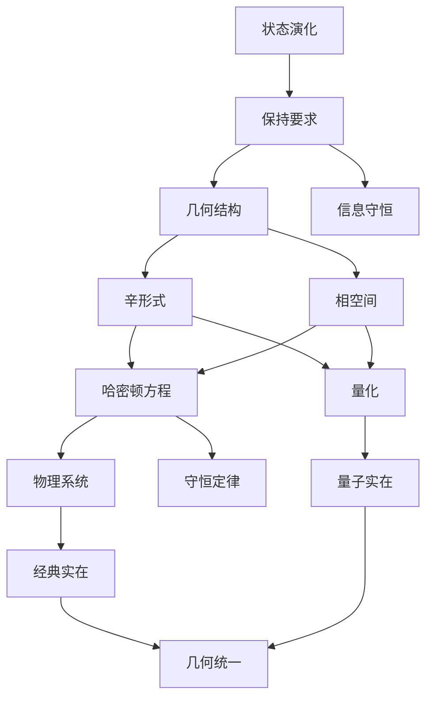

# 经典力学的纯几何起源：从状态演化到物理实在
* * *

--- 实在于几何的河流中流淌

# I. 纯粹起源

*"起初，唯有变化"*

在从第一原理重建经典力学时，我们不是从空间、时间或物质开始，而是从更为根本的概念：纯粹的演化。这种激进的方法揭示所有物理结构如何必然地从状态演化的简单要求中涌现。

## I.A. 基本实在

宇宙向我们呈现了一个不可否认的事实：事物在变化。从这个简单的观察出发，我们可以重建所有的物理学。让我们从纯粹的演化开始，剥离所有不必要的假设。

### I.A.1. 原初概念

考虑一个状态 $s$ 及其演化。我们不需要其他任何东西。没有空间，没有时间，没有物质——只有状态及其变化。这个最小的起点带来了深远的后果：

1. **决定性要求**
   - 演化必须是唯一的：
     $$
     s(t_1) \rightarrow \text{unique } s(t_2)
     $$
   - 这意味着存在一个保持信息的几何结构

2. **可逆性要求**
   - 物理演化必须是可逆的：
     $$
     s_1 \rightarrow s_2 \implies \exists \text{ reverse map } s_2 \rightarrow s_1
     $$
   - 这意味着存在一个辛结构

### I.A.2. 必要结构

仅从演化出发，我们必须有：

1. **状态空间**
   - 所有可能状态的集合：$\mathcal{M}$
   - 必须是一个光滑流形以实现连续演化
   - 维度由信息内容决定

2. **演化映射**
   - 单参数微分同胚群：
     $$
     \phi_t: \mathcal{M} \to \mathcal{M}
     $$
   - 必须保持基本结构

3. **信息保持**
   - 演化必须保持状态之间的区别
   - 这意味着某些几何结构的保持
   - 将导致守恒定律

## I.B. 几何的涌现

演化的必要性迫使特定的几何结构出现。这些结构不是外部强加的，而是从一致演化的必要性中自然产生。

### I.B.1. 几何必要性

1. **切结构**
   - 无穷小演化定义向量场：
     $$
     X = \left.\frac{d}{dt}\right|_{t=0} \phi_t
     $$
   - 切丛 $T\mathcal{M}$ 自然涌现

2. **辛结构**
   - 信息保存要求：
     $$
     \omega(X,Y) = \text{invariant}
     $$
   - 辛形式作为最小结构涌现

### I.B.2. 基本形式

最小的几何结构必须包括：

1. **$2$-形式**
   - 非退化：$\omega^n \neq 0$
   - 闭合：$d\omega = 0$
   - 这些性质从演化要求中涌现

2. **自然配对**
   - 状态与变化之间：
     $$
     \langle p, v \rangle = \omega(X_p, X_v)
     $$
   - 导致哈密顿结构

### I.B.3. 涌现的相空间

完整的结构涌现：

1. **余切丛**
   - 自然相空间：$T^*\mathcal{M}$
   - 标准辛形式：
     $$
     \omega = dp_i \wedge dq^i
     $$

2. **演化生成元**
   - 哈密顿向量场：
     $$
     \iota_{X_H}\omega = dH
     $$
   - 能量函数从几何中涌现

从这些最小的开端，所有的经典力学将必然地涌现，不是历史的偶然，而是几何的必然。空间、时间和物质作为派生概念，从演化的纯几何中涌现。

备注：此部分建立物理理论所需的绝对最小框架，展示了几何如何从演化要求中必然地涌现。下一节将在此基础上展示具体物理定律的产生。

# II. 几何框架

*"空间弯曲以适应运动"*

在确立演化为基本概念后，我们现在揭示经典力学的几何框架如何以数学必然性涌现。这个框架不是被强加的，而是从一致演化的必要性中不可避免地产生的。

## II.A. 自然结构

能够支持状态演化的最小几何结构必须自然地涌现。我们从纯粹的必要性推导这些结构。

### II.A.1. 基本 $2$-形式

从演化要求出发：

1. **辛结构的必要性**
   - 演化保持状态之间的区别
   - 所需结构必须是：
     $$
     \omega: T\mathcal{M} \times T\mathcal{M} \to \mathbb{R}
     $$
   具有性质：
   - 非退化：$\omega^n \neq 0$
   - 闭合：$d\omega = 0$

2. **标准形式**
   - 局部结构必然采取以下形式：
     $$
     \omega = \sum_{i=1}^n dp_i \wedge dq^i
     $$
   - 这不是一个选择，而是一个必然性(Darboux 定理)

### II.A.2. 相空间结构

演化空间必须足够丰富以确定未来的演化：

1. **自然相空间**
   - 余切丛结构：
     $$
     T^*\mathcal{M} \to \mathcal{M}
     $$
   - 标准坐标 $(q^i, p_i)$ 自然涌现

2. **基本括号**
   - 泊松结构涌现：
     $$
     \{f,g\} = \omega(X_f,X_g) = \sum_{i=1}^n \left(\frac{\partial f}{\partial q^i}\frac{\partial g}{\partial p_i} - \frac{\partial f}{\partial p_i}\frac{\partial g}{\partial q^i}\right)
     $$

### II.A.3. 守恒定律

守恒定律作为几何必要性涌现：

1. **Noether 结构**
   - 每个对称性产生一个守恒量
   - 动量映射涌现：
     $$
     \mu: T^*\mathcal{M} \to \mathfrak{g}^*
     $$

2. **体积保持**
   - Liouville 定理自然涌现：
     $$
     \mathcal{L}_{X_H}\omega^n = 0
     $$

## II.B. 演化定律

物理定律作为几何必要性涌现，而不做为经验事实。

### II.B.1. 哈密顿方程

1. **几何起源**
   - 演化向量场 $X_H$ 由以下定义：
     $$
     \iota_{X_H}\omega = dH
     $$
   - 完全确定演化：
     $$
     \begin{cases}
     \dot{q}^i = \frac{\partial H}{\partial p_i} \\
     \dot{p}_i = -\frac{\partial H}{\partial q^i}
     \end{cases}
     $$

2. **唯一性**
   - 这些是唯一可能的保持 $\omega$ 的演化方程
   - 没有其他结构是可能或必要的

### II.B.2. 作用量原理

作用量原理作为几何必要性涌现：

1. **几何作用量**
   - 余切丛 $T^*\mathcal{M}$ 上的 $1$-形式 $\theta$：
     $$
     \theta = p_i \, dq^i
     $$
   - 作用量作为积分：
     $$
     S = \int (\theta - H \, dt)
     $$

2. **变分结构**
   - 哈密顿原理：
     $$
     \delta S = 0 \iff \text{Hamilton's equations}
     $$
   - 不是一个原理，而是几何结果

### II.B.3. 对称性结构

对称性从几何中涌现：

1. **正则变换**
   - 保持辛结构：
     $$
     \phi^*\omega = \omega
     $$
   - 生成所有可能的演化

2. **群作用**
   - 对称群自然涌现
   - 动量映射编码守恒：
     $$
     \langle \mu(x), \xi \rangle = H_\xi(x)
     $$

### II.B.4. 统一图景

所有结构相互关联：

1. **几何统一**
   ```
   辛结构
     ↓
   哈密顿方程
     ↓
   守恒定律
     ↓
   物理演化
   ```

2. **完全确定**
   - 一切皆源自几何
   - 不需要额外假设
   - 物理实在必然涌现

这个框架揭示经典力学作为纯粹的几何，物理定律作为演化要求的必要后果涌现。下一节将展示具体物理系统如何在这个框架内涌现。

备注：本节强调了物理定律从几何结构中必然涌现，展示了经典力学不仅是数学可描述的，而且是几何上不可避免的。

# III. 物理实在

*"从抽象的必然性中涌现具体的实在"*

在建立几何框架后，我们现在展示物理系统如何必然地从几何结构中涌现。我们不是将这些系统视为经验发现的，而是揭示它们为底层几何的不可避免的表现。

## III.A. 基本系统

最简单的物理系统从最小的几何要求中涌现。

### III.A.1. 自由粒子

1. **几何必然性**
   - 最简单的非平凡相空间结构
   - 哈密顿量必须尊重平移对称性：
     $$
     H = \frac{p^2}{2m}
     $$
   - 这种形式是几何上不可避免的

2. **自然流**
   - 演化方程：
     $$
     \begin{cases}
     \dot{q}^i = \frac{p^i}{m} \\
     \dot{p}_i = 0
     \end{cases}
     $$
   - 相空间中的测地线流

### III.A.2. 谐振子

1. **几何起源**
   - 具有有界轨道的最简单系统
   - 相空间结构要求：
     $$
     H = \frac{p^2}{2m} + \frac{k q^2}{2}
     $$

2. **基本性质**
   - 相空间中的圆周流
   - 自然频率涌现：
     $$
     \omega = \sqrt{\frac{k}{m}}
     $$
   - 典型的周期运动

### III.A.3. 中心力

1. **对称性要求**
   - 旋转不变性要求：
     $$
     H = \frac{p^2}{2m} + V(|q|)
     $$
   - 角动量守恒：
     $$
     L = q \times p
     $$

2. **开普勒问题**
   - 自然涌现的势能：
     $$
     V(r) = -\frac{k}{r}
     $$
   - 圆锥截线作为几何必然性

## III.B. 复杂系统

更复杂的系统通过几何组合和扩展涌现。

### III.B.1. 多体系统

1. **自然扩展**
   - 相空间结构：
     $$
     T^*(M^N) \cong (T^*M)^N
     $$
   - 辛形式：
     $$
     \omega = \sum_{i=1}^N dp_i \wedge dq^i
     $$

2. **涌现行为**
   - 集合坐标
   - 通过对称性约化：
     $$
     \mu^{-1}(c)/G_c
     $$
   其中 $G_c$ 是各向同性群

### III.B.2. 场系统

1. **无限维扩展**
   - 场配置空间：
     $$
     \phi: M \to V
     $$
   - 辛结构：
     $$
     \omega = \int_\Sigma \delta\pi \wedge \delta\phi \, d^nx
     $$

2. **自然场方程**
   - 波动方程涌现：
     $$
     \square\phi = 0
     $$
   - 场动力学的几何起源

### III.B.3. 连续介质

1. **几何框架**
   - 配置空间作为微分同胚群
   - 动量映射结构：
     $$
     \mu: T^*\text{Diff}(M) \to \mathfrak{X}(M)^*
     $$

2. **流体力学**
   - Euler方程涌现：
     $$
     \frac{\partial v}{\partial t} + (v \cdot \nabla)v = -\nabla p
     $$
   - 守恒定律的几何必然性

### III.B.4. 统一特征

所有这些系统共享：

1. **几何起源**
   ```
   辛结构 → 演化定律 → 物理系统
   ```

2. **守恒定律**
   - 能量来自于时间平移
   - 动量来自于空间平移
   - 角动量来自于旋转

3. **相空间结构**
   - 标准坐标
   - 泊松括号
   - 哈密顿流

这些系统的涌现揭示一个深刻的真理：物理实在是不是任意的，而是几何上必然的。下一节将展示这种必然性如何延伸到量子力学和现代物理学。

备注：此部分强调了物理系统如何必然地从几何结构中涌现，揭示了经典力学作为基本几何的不可避免的结果，而不是经验发现。

# IV. 深层统一

*"一切都是几何，几何就是一切"*

在看到经典力学如何从纯几何中涌现后，我们现在揭示一个更深层次的真理：量子力学本身作为几何的必然性涌现，现代物理学自然地从相同的几何起源中流出。

## IV.A. 量子桥梁

量子力学不是一个独立的理论，而是从经典结构中涌现出的几何必然性。

### IV.A.1. 量化几何的必然性

1. **基本要求**
   - 相空间体积量化：
     $$
     [\omega/2\pi\hbar] \in H^2(M,\mathbb{Z})
     $$
   这不是一个物理假设，而是为了保持一致演化所需的几何必然性

2. **自然涌现**
   - 预量子线丛：
     $$
     L \xrightarrow{\pi} M
     $$
   其联络 $\nabla$ 满足：
     $$
     \text{curv}(\nabla) = -\frac{i}{\hbar}\omega
     $$

### IV.A.2. 量子结构

1. **几何态**
   - 量子态作为 $L$ 的截面：
     $$
     \psi \in \Gamma(L)
     $$
   - 内积自然涌现：
     $$
     \langle \psi_1|\psi_2 \rangle = \int_M \overline{\psi_1}\psi_2 \, \omega^n
     $$

2. **算符涌现**
   - 经典可观测量 $f$ 成为算符：
     $$
     \hat{f} = -i\hbar\nabla_{X_f} + f
     $$
   - 对易关系几何地涌现：
     $$
     [\hat{f},\hat{g}] = -i\hbar\widehat{\{f,g\}}
     $$

### IV.A.3. 量子必然性

1. **深层统一**
   ```
   经典几何 → 量子结构 → 物理实在
   ```

2. **不可避免的特征**
   - 不确定性原理来自辛结构
   - 波粒二象性来自几何量化
   - 纠缠来自丛结构

## IV.B. 现代扩展

几何框架自然地扩展到现代物理学。

### IV.B.1. 场论扩展

1. **自然无穷维**
   - 无穷维相空间：
     $$
     T^*\mathcal{A} \to \mathcal{A}
     $$
   其中 $\mathcal{A}$ 是场配置空间

2. **规范结构**
   - 主丛结构：
     $$
     P \xrightarrow{G} M
     $$
   - 联络形式作为物理场：
     $$
     F = dA + \frac{1}{2}[A,A]
     $$

### IV.B.2. 几何统一

1. **深层原理**
   - 所有的力来自联络几何
   - 物质来自表示空间
   - 相互作用来自丛结构

2. **统一框架**
   $$
   \begin{array}{c}
   \text{Geometry} \\
   \downarrow \\
   \text{Gauge Theory} \\
   \downarrow \\
   \text{Physical Forces}
   \end{array}
   $$

### IV.B.3. 新兴前沿

1. **量子几何**
   - 非交换空间：
     $$
     [x^\mu,x^\nu] = i\theta^{\mu\nu}
     $$
   - 量子群和 $q$-形变

2. **高阶结构**
   - 叠层和高阶丛
   - 范畴量化
   - 导出几何

### IV.B.4. 最终统一

最深刻的洞见浮现：

1. **几何完备性**
   - 所有物理都是几何的
   - 所有几何就是物理的
   - 统一就是必然的，不是偶然的

2. **未来方向**
   ```
   量子引力 ← 几何统一 → 信息理论
   ```

这揭示了深刻的真理：物理学不仅仅是被几何描述的，而就是几何。数学结构与物理实在之间的区别在深入理解中消失。

这个几何框架指向：
- 量子引力作为几何必然性
- 信息作为几何结构
- 实在作为纯几何

备注：这一最终部分揭示了物理学和几何的终极统一，展示了从量子力学到现代场论的所有物理现象如何必然地从基本几何结构中涌现。这不仅是数学描述，而是物理学本身的最深层次现实。

# 附录 A：核心概念及其几何关系

*"实在的织锦由几何丝线编织而成"*

## A.1. 基本结构图



## A.2. 核心关系矩阵

| 概念 | 几何形式 | 物理表现 | 数学结构 |
|---------|---------------|----------------------|---------------------|
| 演化 | 流形上的流 | 物理变化 | $\phi_t: \mathcal{M} \to \mathcal{M}$ |
| 保持 | 辛形式 | 守恒定律 | $\omega = dp_i \wedge dq^i$ |
| 状态空间 | 相空间 | 物理状态 | $T^*\mathcal{M}$ |
| 动力学 | 哈密顿流 | 时间演化 | $\iota_{X_H}\omega = dH$ |
| 对称性 | 群作用 | 守恒 | $\mu: M \to \mathfrak{g}^*$ |
| 量化 | 线丛 | 量子态 | $\text{curv}(\nabla) = -\frac{i}{\hbar}\omega$ |

## A.3. 几何层次

基本结构以必要的顺序涌现：
$$
\begin{array}{c}
\text{Evolution} \\
\downarrow \\
\text{Preservation} \rightarrow \text{Symplectic Form} \\
\downarrow \\
\text{Hamilton's Flow} \rightarrow \text{Physical Laws} \\
\downarrow \\
\text{Quantum Structure} \rightarrow \text{Modern Physics}
\end{array}
$$

## A.4. 本质统一

1. **结构-演化统一**
   ```
   几何结构 ↔ 物理演化
   ```
   表现为：
   $$
   \text{演化} \equiv \text{结构保持}
   $$

2. **经典-量子桥梁**
   ```
   辛几何 → 线丛 → 量子力学
   ```
   通过下式达成：
   $$
   [\omega/2\pi\hbar] \in H^2(M,\mathbb{Z})
   $$

3. **力-几何等价**
   ```
   联络形式 ↔ 物理力
   ```
   通过下式达成：
   $$
   F = dA + \frac{1}{2}[A,A]
   $$

## A.5. 深层原理

整个结构基于三个基本原则：

1. **最小必然性**
   - 只有必要的结构涌现
   - 每个结构蕴含下一个
   - 没有任意选择

2. **几何完备性**
   - 所有物理定律都是几何的
   - 所有几何就是物理的
   - 统一是必然的

3. **自然层次**
   - 结构以唯一顺序涌现
   - 每个层次需要下一个层
   - 最终统一是不可避免的

这种组织揭示了看似复杂的物理实在结构如何从状态演化的简单要求中，通过纯几何必然性必然地涌现。

注：此附录提供了一个统一的核心概念及其关系视图，强调了物理结构从几何原理中必然涌现。该呈现保持了文档对深入理解的关注，同时避免了不必要的技术细节。

