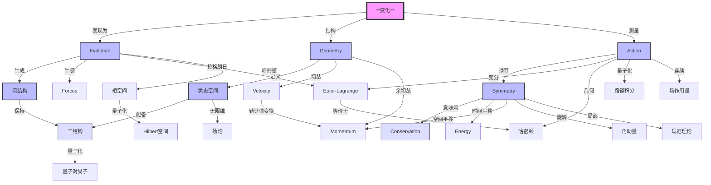

# 经典力学：从变化到对称的几何之旅
* * *

--- 从最简单的变化中涌现出最深刻的对称性

# I. 基础：变化的本质

*"起初，有变化。其余一切随之而来。”*

## 1.1 变化的数学

在最根本的层面上，物理学描述变化。在力量面前，在能量面前，甚至在空间和时间面前，都有着变化。让我们从这个原始概念开始构建。

### 1.1.1 变化的抽象性质

考虑一个处于状态 $s$ 的系统。变化的数学结构要求：

1) **状态空间**：
$$
\mathcal{S} = \{s \mid s \text{ is a possible state}\}
$$

2) **演化结构**：
$$
\Phi: \mathcal{S} \times \mathbb{R} \rightarrow \mathcal{S}
$$
   满足：
$$
\begin{aligned}
\Phi(s,0) &= s \quad \text{(identity)} \\
\Phi(\Phi(s,t_1),t_2) &= \Phi(s,t_1+t_2) \quad \text{(group property)}
\end{aligned}
$$

3) **连续性结构**：
   对于任意状态 $s$ 和时间 $t$：
$$
\lim_{h \to 0} \Phi(s,t+h) = \Phi(s,t)
$$

### 1.1.2 微分结构

变化的无穷小生成元：
$$
X_s = \lim_{h \to 0} \frac{\Phi(s,h) - s}{h}
$$
导致基本方程：
$$
\frac{d}{dt}\Phi(s,t) = X_{\Phi(s,t)}
$$

这种抽象结构已经包含了深刻的含义：

1) **决定论**：
$$
s(t_2) = \Phi(s(t_1),t_2-t_1)
$$

2) **可逆性**：
$$
\Phi(s,-t) = \Phi^{-1}(s,t)
$$

3) **流性质**：
$$
\{\Phi_t\}_{t \in \mathbb{R}} \text{ forms a one-parameter group}
$$

## 1.2 几何基础

变化的抽象结构自然地诱导几何结构。

### 1.2.1 流形结构

1) **局部图表**：
   对于每个状态 $s$，存在一个邻域 $U_s$ 和映射：
$$
\varphi_s: U_s \rightarrow \mathbb{R}^n
$$

2) **转换函数**：
   对于重叠的图表 $(U_\alpha,\varphi_\alpha)$ 和 $(U_\beta,\varphi_\beta)$：
$$
\varphi_\beta \circ \varphi_\alpha^{-1}: \varphi_\alpha(U_\alpha \cap U_\beta) \rightarrow \varphi_\beta(U_\alpha \cap U_\beta)
$$
   是光滑的。

### 1.2.2 丛结构

1) **切丛**：
$$
TM = \bigcup_{p \in M} T_pM
$$
   带有投影：
$$
\pi: TM \rightarrow M
$$

2) **余切丛**：
$$
T^*M = \bigcup_{p \in M} T^*_pM
$$

### 1.2.3 基本形式

1) **辛形式**：
$$
\omega: TM \times TM \rightarrow \mathbb{R}
$$
   满足：
   - 闭合：$d\omega = 0$
   - 非退化：$\omega(X,Y)=0 \,\forall Y \Rightarrow X=0$

2) **体积形式**：
$$
\Omega = \frac{1}{n!}\omega^n
$$

### 1.2.4 关键联系

连接变化与几何的基本定理：

**定理**：*每一个保持辛形式的光滑演化生成一个哈密顿流。*

这导致：
$$
\mathcal{L}_X\omega = 0 \Leftrightarrow \exists H: M \rightarrow \mathbb{R} \text{ such that } X = X_H
$$

这种几何结构自然地引出：
1) 通过对称性的守恒律
2) 通过变分结构的作用量原理
3) 通过几何量子化的量子力学

这些结构的深刻统一揭示几何不仅是描述物理学的语言 —— 它是物理学的本质本身。

# II. 作用量原理：几何视角

*"自然的效应通过几何不变性表现出来"*

## 2.1 作为几何不变量的作用量

作用量原理超越了其作为变分法的历史表述。在其核心，它代表自然界的一个基本几何不变量。

### 2.1.1 作用量的几何基础

考虑状态流形中的路径 $\gamma: [t_1,t_2] \rightarrow M$。作用量出现为：
$$
S[\gamma] = \int_{\gamma} \alpha,
$$
其中 $\alpha$ 是扩展相空间 $\tilde{M} = T^*Q \times \mathbb{R}$ 上的基本 $1$-形式。

关键几何性质：
1) **不变性**：在正则变换下
2) **独立性**：于参数化中
3) **局部性**：在相空间中

### 2.1.2 基本辛结构

作用量诱导一个自然的辛结构：
$$
\omega = -d\alpha = \sum_i dp_i \wedge dq^i.
$$
这导致深刻的关系：
$$
\text{ker}(\omega) = \text{span}\{X_H\},
$$
其中 $X_H$ 是哈密顿向量场。

### 2.1.3 变分结构

作用量的变分产生：
$$
\delta S[\gamma] = \int_{t_1}^{t_2} \left(\frac{\partial L}{\partial q^i}\delta q^i + \frac{\partial L}{\partial \dot{q}^i}\delta \dot{q}^i\right)dt.
$$
更根本地：
$$
\delta S[\gamma] = \int_{\gamma} \mathcal{L}_X\alpha,
$$
其中 $\mathcal{L}_X$ 是李导数。

## 2.2 对称性和守恒

对称性和守恒之间的深刻联系自然地从几何框架中涌现。

### 2.2.1 对称性的几何表述

对称性是保持作用量不变的微分同胚 $\phi: M \rightarrow M$：
$$
S[\phi \circ \gamma] = S[\gamma].
$$
这导致无穷小版本：
$$
\mathcal{L}_X\alpha = 0.
$$

### 2.2.2 诺特定理：几何版本

**定理**：*对于由向量场 $X$ 生成的每一个单参数群对称性，存在一个守恒量 $Q_X$：*
$$
Q_X = i_X\alpha,
$$
*其中 $i_X$ 表示内积*。

关键性质：
1) **守恒**：
$$
\frac{d}{dt}Q_X = 0 \text{ along solutions}
$$

2) **李代数结构**：
$$
\{Q_X, Q_Y\} = Q_{[X,Y]}
$$

3) **动量映射**：
$$
\mu: M \rightarrow \mathfrak{g}^*,
$$
   其中 $\mathfrak{g}^*$ 是李代数的对偶。

### 2.2.3 统一视角

深刻的统一性体现在交换图中：
$$
\begin{CD}
\text{Symmetry} @>\text{Noether}>> \text{Conservation} \\
@VVV @AAA \\
\text{Geometry} @>>\text{Action}> \text{Dynamics}
\end{CD}
$$

### 2.2.4 关键含义

1) **相空间结构**：
$$
\omega(X_H, X_F) = \{H,F\}
$$

2) **守恒代数**：
   对于任意运动常数 $F,G$：
$$
\{F,G\} \text{ is also conserved}
$$

3) **可积性准则**：
   系统是可积的，当且仅当它有 $n$ 个相互对合的独立守恒量：
$$
\{F_i, F_j\} = 0 \quad \forall i,j
$$

## 2.3 结论

这种几何视角揭示守恒律不是偶然现象，而是相空间几何结构的基本特征。作用量原理作为对称性和动力学之间的桥梁，将其两者编码在其几何结构中。

# III. 统一的几何框架

*"粒子的舞蹈即是空间本身的几何"*

## 3.1 构型空间与相空间

力学的几何通过一系列层次化的空间展现出来，每个空间具有越来越丰富的结构。

### 3.1.1 构型流形

从构型空间 $Q$ 开始。对于 $n$ 个自由度：
$$
Q = \{q = (q^1,...,q^n) \mid \text{all possible configurations}\}
$$

基本的几何结构涌现：

1) **切丛** $TQ$：
$$
TQ = \bigcup_{q \in Q} T_qQ \xrightarrow{\pi} Q
$$
   表示速度相空间。

2) **余切丛** $T^*Q$：
$$
T^*Q = \bigcup_{q \in Q} T^*_qQ \xrightarrow{\pi} Q
$$
   表示动量相空间。

### 3.1.2 正则辛结构

余切丛携带一个自然的辛形式：
$$
\omega = \sum_{i=1}^n dp_i \wedge dq^i
$$

关键性质：
1) **正则 $1$-形式**：
$$
\theta = p_idq^i \quad \text{with} \quad \omega = -d\theta
$$

2) **Darboux 定理**：局部上，所有辛形式看起来都与此类似。

3) **泊松结构**：
$$
\{F,G\} = \omega(X_F,X_G) = \sum_{i=1}^n \left(\frac{\partial F}{\partial q^i}\frac{\partial G}{\partial p_i} - \frac{\partial F}{\partial p_i}\frac{\partial G}{\partial q^i}\right)
$$

### 3.1.3 拉格朗日子流形

相空间中的关键几何对象：
$$
\Lambda \subset T^*Q \text{ is Lagrangian if } \dim \Lambda = n \text{ and } \omega|_\Lambda = 0
$$

基本性质：
1) **生成函数**：局部存在 $S$ 使得
$$
\Lambda = \left\{(q,p) \mid p_i = \frac{\partial S}{\partial q^i}\right\}
$$

2) **交叉理论**：
$$
\dim(\Lambda_1 \cap \Lambda_2) = \text{topological invariant}
$$

## 3.2 动力学作为几何

深刻的洞见：物理演化完全是几何的。

### 3.2.1 哈密顿向量场

对于任意函数 $H: T^*Q \rightarrow \mathbb{R}$：
$$
X_H = \omega^{-1}(dH,\cdot)
$$

基本性质：
1) **流保持**：
$$
\mathcal{L}_{X_H}\omega = 0
$$

2) **演化方程**：
$$
\begin{cases}
\dot{q}^i = \frac{\partial H}{\partial p_i} \\
\dot{p}_i = -\frac{\partial H}{\partial q^i}
\end{cases}
$$

### 3.2.2 几何积分

深刻的统一性体现在交换图中：
$$
\begin{CD}
TQ @>\mathcal{L}>> \mathbb{R} @>\text{E-L}>> TQ \\
@VV\mathbb{F}\mathcal{L}V @. @AA\mathbb{F}\mathcal{L}A \\
T^*Q @>H>> \mathbb{R} @>X_H>> T^*Q
\end{CD}
$$
其中 $\mathbb{F}\mathcal{L}$ 是勒让德变换。

### 3.2.3 统一原理

1) **接触几何**统一拉格朗日和哈密顿观点：
$$
\alpha = p \, dq - H \, dt
$$
   在扩展相空间上成立。

2) **辛约化**连接不同的表述：
$$
J^{-1}(\mu)/G_\mu \cong T^*(Q/G)
$$

3) **生成函数**链接不同视角：
$$
S_2(q,P,t): \quad p = \frac{\partial S_2}{\partial q}, \quad Q = \frac{\partial S_2}{\partial P}
$$

### 3.2.4 基本定理

1) **Liouville 定理**：
$$
\frac{d}{dt}\int_\Omega \omega^n = 0
$$

2) **Arnold-Liouville 定理**：
   对于可积系统：
$$
(T^*Q,\omega) \cong (T^n \times \mathbb{R}^n, \sum dp_i \wedge dq^i)
$$

3) **Marsden-Weinstein 定理**：
$$
J^{-1}(0)/G \text{ inherits symplectic structure}
$$

## 3.3 结论

这个几何框架揭示：
- 动力学本质上是几何的
- 不同的形式体系是统一的观点
- 物理演化保持几何结构

深刻的含义：物理即几何。

# IV. 现代综合

*"经典力学与量子力学之间的界限本身是一种几何结构"*

## 4.1 经典-量子桥梁

经典力学的几何结构自然地提示其自身的量子化，揭示更深层次的数学结构。

### 4.1.1 几何量子化

基本对应关系：
$$
(\text{Classical},\{,\}) \longrightarrow (\text{Quantum},[,])
$$

1) **预量子化**：
   对于辛流形 $(M,\omega)$：
$$
L \xrightarrow{\pi} M \text{ with curvature } \frac{i}{\hbar}\omega
$$

2) **极化**：
   $TM$ 的拉格朗日子叶层 $\mathcal{F}$：
$$
\mathcal{H} = \{\psi \in L^2(L) \mid \nabla_X\psi = 0 \text{ for } X \in \mathcal{F}\}
$$

3) **半形式校正**：
$$
\text{Quantum Bundle} = L \otimes \sqrt{\bigwedge^n\mathcal{F}^*}
$$

### 4.1.2 路径积分表述

量子传播子以几何方式涌现：
$$
K(q_f,t_f;q_i,t_i) = \int_{\text{paths}} e^{iS[\gamma]/\hbar}\mathcal{D}\gamma
$$

关键性质：

1) **驻定相位**：
$$
\lim_{\hbar \to 0} K = \sum_{\text{classical paths}} A e^{iS_{\text{cl}}/\hbar}
$$

2) **几何相位**：
$$
\gamma_g = i\oint_C \langle\psi|\nabla|\psi\rangle
$$

3) **Maslov 指标**：
$$
\mu(\Lambda) = \text{topological invariant of Lagrangian paths}
$$

## 4.2 场论扩展

向连续系统的过渡揭示无限维的几何结构。

### 4.2.1 无限维流形

1) **构型空间**：
$$
\mathcal{Q} = \{\phi: \Sigma \to V \mid \text{suitable regularity}\}
$$

2) **相空间**：
$$
T^*\mathcal{Q} \text{ with symplectic form } \Omega = \int_\Sigma \delta\pi \wedge \delta\phi
$$

### 4.2.2 场论结构

1) **局部对称性**：
$$
\delta\phi(x) = \epsilon^a(x)T_a\phi(x)
$$

2) **诺特定理流**：
$$
j^\mu_a = \frac{\partial\mathcal{L}}{\partial(\partial_\mu\phi)}\delta_a\phi - K^\mu_a
$$

3) **场括号**：
$$
\{\phi(x),\pi(y)\} = \delta(x-y)
$$

### 4.2.3 现代应用

1) **规范理论几何**：
$$
\mathcal{A}/\mathcal{G} \text{ (connection modulo gauge)}
$$
   带有自然的辛结构。

2) **弦理论联系**：
$$
S = \int_\Sigma \sqrt{-\det(\partial_\alpha X^\mu \partial_\beta X_\mu)}\,d^2\sigma
$$

3) **量子场论桥梁**：
$$
Z = \int \mathcal{D}\phi \exp\left(\frac{i}{\hbar}S[\phi]\right)
$$

### 4.2.4 新兴前沿

1) **高阶结构**：
$$
n\text{-plectic geometry} \rightarrow \text{higher brackets}
$$

2) **量子几何**：
$$
\text{NonCommutative Spaces} \leftrightarrow \text{Quantum Groups}
$$

3) **信息几何**：
$$
ds^2 = g_{ij}(\theta)d\theta^id\theta^j \text{ on statistical manifolds}
$$

### 4.2.5 基本统一

深刻的统一性体现在交换图中：
$$
\begin{CD}
\text{Classical} @>\text{Quantization}>> \text{Quantum} \\
@V\text{Field}VV @VV\text{QFT}V \\
\text{Classical Field} @>>\text{Quantization}> \text{Quantum Field}
\end{CD}
$$

## 4.3 结论

这一综合揭示：
- 量子力学作为几何结构
- 场论作为无限维几何
- 数学框架的统一
- 物理学的未来方向

深刻的含义：几何视角不仅统一了经典力学，还指向所有物理学更深层次的数学统一。

# 附录 A : 核心关系

以下是一个综合的概念关系图，展示了核心概念之间的层次和横向关系：

以下是补充的概念关系矩阵，展示了关键概念的连接：

| 概念 | 几何表现 | 物理意义 | 数学结构 |
|---------|------------------------|------------------|----------------------|
| 变化 | 向量场 | 时间演化 | 微分算子 |
| 作用量 | 路径空间上的 $1$-形式 | 物理定律 | 路径的功能 |
| 对称性 | 群作用 | 守恒律 | 李群 |
| 相空间 | 辛流形 | 状态+动量 | $(M,\omega)$ |
| 演化 | 辛流 | 动力学 | 单参数群 |
| 守恒 | 动量映射 | 运动常数 | $\mu: M \to \mathfrak{g}^*$ |
| 量子化 | 线丛 | 量子态 | 几何量子化 |
| 场论 | 无限维流形 | 连续系统 | 喷射丛 |

这些可视化突出了：
1. **变化**的核心角色
2. 物理定律的几何性质
3. 不同形式体系的统一
4. 通往量子力学的桥梁
5. 场论的扩展

