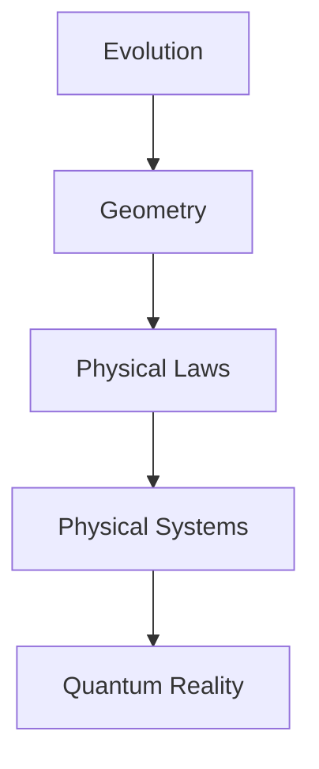

# A Pure Geometric Foundation of Classical Mechanics: From Evolution to Reality

**Motto**: *"Reality emerges from the dance of evolution and geometry"*

## Core Foundation

### Primary Thesis
Physics, at its deepest level, is the study of evolution constrained by geometric necessity. Classical mechanics emerges not as a collection of empirical laws but as the inevitable consequence of consistent state evolution.

### Fundamental Principles
1. **Evolution Primacy**: Nothing exists except states and their changes
2. **Geometric Necessity**: All structures emerge from evolution requirements
3. **Minimal Completeness**: Only necessary structures survive
4. **Natural Unity**: All physical laws are geometric consequences

## Document Architecture

### I. From Evolution to Geometry
**Epigraph**: *"First there was change, and from change arose form"*

#### I.A. The Primordial Concept
**Goal**: Establish evolution as the singular foundation
- Evolution as the only primitive concept
- Necessity of state space
- Information preservation requirement

#### I.B. Emergence of Structure
**Goal**: Show how geometry emerges necessarily
- Natural appearance of symplectic form
- Phase space as inevitable framework
- Conservation from geometry

### II. The Language of Nature
**Epigraph**: *"Mathematics is not our invention but nature's own tongue"*

#### II.A. Geometric Framework
**Goal**: Develop minimal necessary mathematical structure
- Symplectic manifolds from evolution
- Natural appearance of Poisson brackets
- Moment maps and symmetry

#### II.B. Physical Laws
**Goal**: Derive physics from geometry
- Hamilton's equations as geometric necessity
- Action principle as structural consequence
- Conservation laws from symmetry

### III. The Physical World
**Epigraph**: *"Concrete reality flows from abstract necessity"*

#### III.A. Fundamental Systems
**Goal**: Show how basic physical systems emerge
- Free particle as simplest evolution
- Oscillator as natural periodicity
- Central forces from symmetry

#### III.B. Complex Reality
**Goal**: Extend to real physical systems
- Many-body systems
- Field theories
- Continuous media

### IV. Ultimate Unity
**Epigraph**: *"At the deepest level, all is one"*

#### IV.A. Quantum Bridge
**Goal**: Show quantum mechanics as geometric necessity
- Geometric quantization
- Natural emergence of operators
- Uncertainty from geometry

#### IV.B. Modern Vision
**Goal**: Connect to contemporary physics
- Gauge theories as geometric requirement
- Path to quantum gravity
- Information theoretic perspective

## Writing Guidelines

### Core Principles
1. **Geometric Focus**
   - Every physical concept must emerge from geometry
   - No arbitrary assumptions allowed
   - Clear chain of necessity

2. **Logical Flow**
   - Each concept builds necessarily from previous ones
   - Clear connection between sections
   - Natural progression of ideas

3. **Mathematical Precision**
   - Rigorous but not overwhelming
   - Focus on geometric meaning
   - Essential formalism only

### Interconnections

1. **Vertical Structure**

2. **Horizontal Unity**
- Each level complete in itself
- Natural connections between topics
- Geometric unity throughout

### Mathematical Framework
- Start with pure evolution concept
- Introduce geometry only as needed
- Build to modern mathematical structures

[Note: Each section should demonstrate how its content emerges necessarily from previous sections, maintaining the theme of geometric inevitability throughout.]

