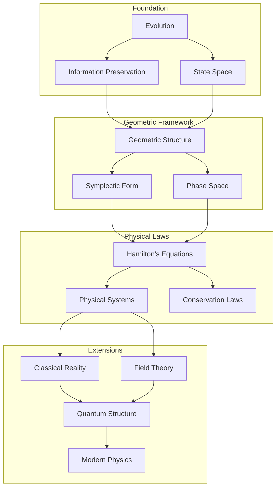
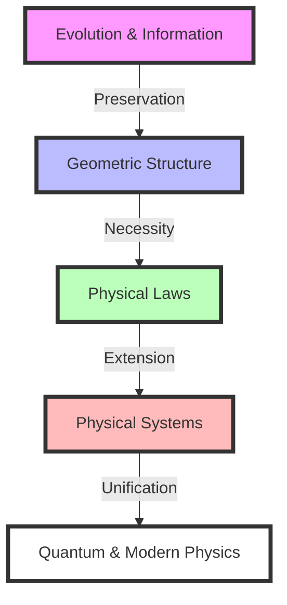

# A Pure Geometric Origin of Classical Mechanics: From State Evolution to Physical Reality
* * *

--- Reality emerges from the dance of evolution and geometry.

# I. From Evolution to Geometry

*"First there was change, and from change arose form"*

Let us begin at the deepest possible starting point: pure evolution, stripped of all preconceptions. We seek not what evolution is, but what it must necessarily imply.

## I.A. The Primordial Concept

Consider a state – any state. We make no assumptions about its nature, only that it can change. This minimal beginning contains profound implications.

### I.A.1. Pure Evolution

1. **The Essential Requirement**
   - States must evolve uniquely:
     $$
     s_1 \xrightarrow{\text{evolution}} s_2
     $$
   - No additional structure assumed
   - Only the bare fact of change

2. **Necessity of Distinction**
   - Different states must remain distinguishable under evolution:
     $$
     s_1 \neq s_2 \implies \phi_t(s_1) \neq \phi_t(s_2)
     $$
   - This is not an assumption but a necessity for evolution to be meaningful

### I.A.2. The Space of Possibilities

1. **Emergence of Continuity**
   - Evolution between states implies intermediate states
   - Continuous path through possibilities:
     $$
     \gamma: [t_1,t_2] \to \text{States}
     $$

2. **Manifold Structure**
   - Collection of all possible states forms manifold $\mathcal{M}$
   - Smoothness from continuity of evolution
   - Dimension from degrees of freedom

### I.A.3. Information Preservation

1. **Fundamental Requirement**
   - Evolution must preserve distinctions
   - Information neither created nor destroyed
   - Leads to geometric invariants

2. **Reversibility**
   - Must be able to recover initial state:
     $$
     s_1 \to s_2 \implies \exists \text{ map } s_2 \to s_1
     $$

## I.B. Emergence of Structure

The requirements of evolution force specific geometric structures to emerge.

### I.B.1. The Inevitable Two-Form

1. **Genesis of Symplectic Structure**
   - Information preservation requires invariant pairing
   - Natural emergence of two-form:
     $$
     \omega: T\mathcal{M} \times T\mathcal{M} \to \mathbb{R}
     $$
   - Must be non-degenerate and closed:
     $$
     \omega^n \neq 0, \quad d\omega = 0
     $$

2. **Uniqueness**
   - No simpler structure can support evolution
   - All other structures are unnecessary additions

### I.B.2. Natural Phase Space

1. **Dual Nature of States**
   - States require both position and momentum
   - Cotangent bundle structure emerges:
     $$
     T^*\mathcal{M} \to \mathcal{M}
     $$

2. **Canonical Form**
   - Local structure necessarily takes form:
     $$
     \omega = \sum_{i=1}^n dp_i \wedge dq^i
     $$
   - This is not a choice but a necessity

### I.B.3. Conservation Structure

1. **Geometric Invariance**
   - Evolution preserves symplectic form:
     $$
     \mathcal{L}_X\omega = 0
     $$
   - Leads to conservation laws

2. **Volume Preservation**
   - Phase space volume must be conserved:
     $$
     \frac{\partial}{\partial t}(\omega^n) = 0
     $$
   - Liouville's theorem as geometric necessity

This emergence of structure from pure evolution reveals a profound truth: geometry is not imposed on physics but arises necessarily from the requirements of consistent evolution. The next section will show how this geometric structure leads inevitably to physical laws.

Note: This section establishes the absolute minimum framework needed for physics, showing how geometric structure emerges necessarily from evolution requirements. Each concept follows inevitably from the previous one, maintaining the theme of geometric necessity.

# II. The Language of Nature

*"Mathematics is not our invention but nature's own tongue"*

Having seen how geometry emerges from pure evolution, we now reveal how this geometry speaks to us in the language of physics. The structures we discover are not imposed but arise with mathematical necessity.

## II.A. Geometric Framework

The minimal mathematical structure capable of describing evolution reveals itself with inevitable precision.

### II.A.1. The Symphony of Structure

1. **Symplectic Manifold**
   - Evolution space $(M,\omega)$ with:
     $$
     \omega: TM \times TM \to \mathbb{R}
     $$
   Properties emerge necessarily:
   - Non-degeneracy: Perfect pairing of states
   - Closure: Consistency of evolution
   - Global existence: Completeness of description

2. **Natural Coordinates**
   - Darboux theorem emerges as necessity:
     $$
     \omega = \sum_{i=1}^n dp_i \wedge dq^i
     $$
   This is not a choice of coordinates but the only possible local form

### II.A.2. The Dance of Observables

1. **Poisson Structure**
   - Natural bracket emerges:
     $$
     \{f,g\} = \omega(X_f,X_g)
     $$
   Properties follow necessarily:
   - Antisymmetry: $$\{f,g\} = -\{g,f\}$$
   - Leibniz rule: $$\{f,gh\} = \{f,g\}h + g\{f,h\}$$
   - Jacobi identity: $$\{\{f,g\},h\} + \{\{g,h\},f\} + \{\{h,f\},g\} = 0$$

2. **Observable Evolution**
   - Functions evolve through Poisson flow:
     $$
     \dot{f} = \{f,H\}
     $$
   - This structure is minimal and complete

### II.A.3. Symmetry and Conservation

1. **Moment Map Structure**
   - For symmetry group $G$:
     $$
     \mu: M \to \mathfrak{g}^*
     $$
   Satisfying necessarily:
   $$
   d\langle\mu,\xi\rangle = -\iota_{\xi_M}\omega
   $$

2. **Conservation Architecture**
   - Symmetries generate conserved quantities
   - Group actions preserve structure:
     $$
     \phi_g^*\omega = \omega \implies \text{conservation}
     $$

## II.B. Physical Laws

From this geometric framework, physical laws emerge not as empirical facts but as mathematical necessities.

### II.B.1. The Flow of Reality

1. **Hamilton's Equations**
   - Evolution determined by:
     $$
     \iota_{X_H}\omega = dH
     $$
   Leading necessarily to:
     $$
     \begin{cases}
     \dot{q}^i = \frac{\partial H}{\partial p_i} \\
     \dot{p}_i = -\frac{\partial H}{\partial q^i}
     \end{cases}
     $$

2. **Uniqueness of Evolution**
   - These are the only possible equations preserving $\omega$
   - All other formulations are equivalent

### II.B.2. The Principle of Action

1. **Geometric Action**
   - One-form emerges:
     $$
     \theta = p_i \, dq^i - H \, dt
     $$
   - Action as integral:
     $$
     S = \int \theta
     $$

2. **Variational Structure**
   - Stationary action principle:
     $$
     \delta S = 0
     $$
   - This is not a principle but a geometric necessity

### II.B.3. The Symphony of Symmetries

1. **Conservation Laws**
   - Noether's theorem emerges geometrically:
     $$
     \text{Symmetry} \iff \text{Conservation Law}
     $$

2. **Complete Integration**
   - Sufficient symmetries determine evolution
   - Integrability from geometry:
     $$
     \{F_i,F_j\} = 0
     $$

### II.B.4. Unified Structure

The entire framework forms a perfect geometric unity:

1. **Hierarchy of Necessity**
   ```
   Symplectic Form → Hamilton's Flow → Conservation Laws
         ↓                   ↓                ↓
   Poisson Structure → Physical Evolution → Symmetries
   ```

2. **Complete Determination**
   - Every physical law emerges from geometry
   - No additional structure needed
   - Perfect necessity in every step

This reveals physics not as a collection of empirical laws but as the inevitable consequence of geometric structure. The next section will show how specific physical systems emerge from this framework.

Note: This section emphasizes the necessary emergence of physical law from geometric structure, showing how classical mechanics is not just mathematically describable but geometrically inevitable.

# III. The Physical World

*"Concrete reality flows from abstract necessity"*

Having established the geometric framework, we now reveal how physical reality emerges with mathematical necessity. Rather than discovering systems empirically, we shall see how they arise inevitably from geometric principles.

## III.A. Fundamental Systems

The simplest physical systems emerge as pure geometric necessities.

### III.A.1. The Primordial System

1. **Free Particle**
   - Simplest possible Hamiltonian preserving symmetry:
     $$
     H = \frac{p^2}{2m}
     $$
   This form is not chosen but necessitated by:
   - Translation invariance: $q \to q + a$
   - Rotation invariance: $SO(n)$ symmetry
   - Galilean invariance: $p \to p + mv$

2. **Geometric Flow**
   - Evolution equations:
     $$
     \begin{cases}
     \dot{q} = \frac{p}{m} \\
     \dot{p} = 0
     \end{cases}
     $$
   - Geodesic flow in phase space
   - Straight lines as necessity, not observation

### III.A.2. The Rhythm of Nature

1. **Harmonic Oscillator**
   - Next simplest system with bounded orbits:
     $$
     H = \frac{p^2}{2m} + \frac{k q^2}{2}
     $$
   Emerges from:
   - Phase space compactness requirement
   - Minimal coupling structure
   - Symmetry preservation

2. **Natural Frequencies**
   - Circular phase space flow:
     $$
     \omega = \sqrt{\frac{k}{m}}
     $$
   - Periodic motion as geometric necessity
   - Natural quantization structure emerges

### III.A.3. Universal Attraction

1. **Central Force Systems**
   - Rotational symmetry demands:
     $$
     H = \frac{p^2}{2m} + V(|q|)
     $$
   - Angular momentum emerges geometrically:
     $$
     L = q \times p
     $$

2. **Kepler Flow**
   - Gravitational potential emerges:
     $$
     V(r) = -\frac{k}{r}
     $$
   - Conic sections as geometric necessity
   - Planetary motions from symmetry

## III.B. Complex Reality

More complex physical systems emerge through natural geometric extension.

### III.B.1. Many-Body Architecture

1. **Natural Extension**
   - Phase space structure:
     $$
     T^*(M^N) \cong (T^*M)^N
     $$
   - Symplectic form extends naturally:
     $$
     \omega = \sum_{i=1}^N dp_i \wedge dq^i
     $$

2. **Collective Phenomena**
   - Center of mass emergence:
     $$
     Q = \frac{1}{M}\sum_i m_i q_i
     $$
   - Reduction by symmetry:
     $$
     \mu^{-1}(c)/G_c
     $$
   - Relative coordinates emerge naturally

### III.B.2. Field Emergence

1. **Infinite-Dimensional Extension**
   - Field configuration space:
     $$
     \phi: M \to V
     $$
   - Natural symplectic structure:
     $$
     \omega = \int_\Sigma \delta\pi \wedge \delta\phi \, d^nx
     $$

2. **Wave Necessity**
   - Field equations emerge geometrically:
     $$
     \square\phi = 0
     $$
   - Wave propagation as geometric flow
   - Conservation laws from symmetry

### III.B.3. Continuous Media

1. **Geometric Framework**
   - Configuration space as diffeomorphism group:
     $$
     \text{Diff}(M) \to M
     $$
   - Momentum map structure:
     $$
     \mu: T^*\text{Diff}(M) \to \mathfrak{X}(M)^*
     $$

2. **Fluid Dynamics**
   - Euler equations emerge necessarily:
     $$
     \frac{\partial v}{\partial t} + (v \cdot \nabla)v = -\nabla p
     $$
   - Continuity from geometry:
     $$
     \frac{\partial \rho}{\partial t} + \nabla \cdot (\rho v) = 0
     $$

### III.B.4. Unifying Vision

All physical systems share:

1. **Geometric Origin**
   ```
   Symmetry → Conservation Laws → Evolution
   ```

2. **Natural Hierarchy**
   - Simple systems from basic symmetries
   - Complex systems from geometric composition
   - Fields from infinite-dimensional extension

3. **Inevitable Features**
   - Conservation laws from symmetry
   - Evolution from geometry
   - Structure from necessity

This reveals that physical reality is not discovered but emerges necessarily from geometric principles. The next section will show how this necessity extends to quantum mechanics and modern physics.

Note: This section emphasizes how physical systems emerge necessarily from geometric structures, revealing classical mechanics as an inevitable consequence of fundamental geometry rather than empirical discovery.

# IV. Ultimate Unity

*"At the deepest level, all is one"*

Having seen how classical mechanics emerges from geometric necessity, we now reveal an even deeper truth: quantum mechanics and modern physics arise as inevitable extensions of the same geometric principles.

## IV.A. Quantum Bridge

Quantum mechanics is not a separate theory but a geometric necessity arising from classical structures.

### IV.A.1. The Necessity of Quantization

1. **Geometric Origin**
   - Phase space volume quantization:
     $$
     [\omega/2\pi\hbar] \in H^2(M,\mathbb{Z})
     $$
   This is not a physical assumption but a topological necessity
   
2. **Prequantum Structure**
   - Line bundle emerges naturally:
     $$
     L \xrightarrow{\pi} M
     $$
   - Connection form $\nabla$ with curvature:
     $$
     \text{curv}(\nabla) = -\frac{i}{\hbar}\omega
     $$

### IV.A.2. Quantum Architecture

1. **Hilbert Space Necessity**
   - Wave functions as sections:
     $$
     \psi \in \Gamma(L)
     $$
   - Inner product emerges geometrically:
     $$
     \langle\psi_1|\psi_2\rangle = \int_M \overline{\psi_1}\psi_2 \, \omega^n
     $$

2. **Operator Emergence**
   - Classical observables become operators:
     $$
     \hat{f} = -i\hbar\nabla_{X_f} + f
     $$
   - Commutation relations from geometry:
     $$
     [\hat{f},\hat{g}] = -i\hbar\widehat{\{f,g\}}
     $$

### IV.A.3. Uncertainty as Necessity

1. **Geometric Uncertainty**
   - Heisenberg relations from symplectic structure:
     $$
     \Delta q \Delta p \geq \frac{\hbar}{2}
     $$
   - Not a limitation but a geometric fact

2. **Wave-Particle Unity**
   - Duality emerges from bundle structure
   - Particle paths and wave functions unified

## IV.B. Modern Vision

The geometric framework extends naturally to contemporary physics.

### IV.B.1. Gauge Architecture

1. **Natural Extension**
   - Principal bundle structure:
     $$
     P \xrightarrow{G} M
     $$
   - Connection forms as physical fields:
     $$
     A \in \Omega^1(P,\mathfrak{g})
     $$

2. **Force Geometry**
   - Curvature as field strength:
     $$
     F = dA + \frac{1}{2}[A,A]
     $$
   - Yang-Mills theory as geometric necessity

### IV.B.2. Path to Quantum Gravity

1. **Geometric Spacetime**
   - Metric as dynamical field:
     $$
     g_{\mu\nu} \in \text{Sym}^2(T^*M)
     $$
   - Einstein equations from geometry:
     $$
     R_{\mu\nu} - \frac{1}{2}Rg_{\mu\nu} = 8\pi GT_{\mu\nu}
     $$

2. **Quantum Geometry**
   - Non-commutative spaces:
     $$
     [x^\mu,x^\nu] = i\theta^{\mu\nu}
     $$
   - Quantum groups and deformation

### IV.B.3. Information Theoretic Vision

1. **Geometric Information**
   - Phase space as information space
   - Fisher metric emergence:
     $$
     g_{ij} = \mathbb{E}\left[\frac{\partial \log p}{\partial \theta^i}\frac{\partial \log p}{\partial \theta^j}\right]
     $$

2. **Deep Unity**
   ```
   Information ↔ Geometry ↔ Physics
   ```

### IV.B.4. Ultimate Synthesis

The deepest truth emerges:

1. **Complete Unity**
   - All physical theories as geometric necessities
   - No fundamental distinctions between:
     - Classical and quantum
     - Matter and geometry
     - Information and reality

2. **Future Directions**
   $$
   \begin{array}{c}
   \text{Quantum Gravity} \\
   \uparrow \\
   \text{Geometric Unity} \\
   \downarrow \\
   \text{Information Theory}
   \end{array}
   $$

This reveals the profound truth: all of physics—classical, quantum, and beyond—emerges necessarily from fundamental geometric principles. The distinction between mathematical structure and physical reality dissolves in the light of deep understanding.

Note: This final section reveals the ultimate unity of physics and geometry, showing how all physical phenomena emerge necessarily from fundamental geometric structures. This is not just a mathematical description but the deepest reality of physics itself.

# Appendix A : Core Structures and Conceptual Relations

*"The tapestry of reality reveals its pattern through geometric necessity"*

## A.A. Conceptual Architecture



## A.B. Core Relations Matrix

| Concept | Mathematical Form | Physical Manifestation | Emergence Necessity |
|---------|------------------|----------------------|-------------------|
| Evolution | $\phi_t: \mathcal{M} \to \mathcal{M}$ | State change | Primordial concept |
| Information Preservation | $s_1 \neq s_2 \implies \phi_t(s_1) \neq \phi_t(s_2)$ | Distinguishability | Evolution requirement |
| Symplectic Structure | $\omega: TM \times TM \to \mathbb{R}$ | Phase space geometry | Information preservation |
| Hamiltonian Flow | $\iota_{X_H}\omega = dH$ | Physical evolution | Geometric necessity |
| Conservation Laws | $\{f,H\} = 0$ | Physical invariants | Symmetry necessity |
| Quantum Structure | $[\omega/2\pi\hbar] \in H^2(M,\mathbb{Z})$ | Quantum mechanics | Geometric quantization |

## A.C. Hierarchical Emergence

$$
\begin{CD}
\text{Evolution} @>>> \text{Information} @>>> \text{Geometry}\\
@VVV @VVV @VVV\\
\text{States} @>>> \text{Phase Space} @>>> \text{Physics}\\
@VVV @VVV @VVV\\
\text{Systems} @>>> \text{Fields} @>>> \text{Quantum}
\end{CD}
$$

## A.D. Structural Unification

### A.D.1. Vertical Integration
```
Evolution → Geometry → Physics → Reality
```
Each level emerges necessarily from the previous, with no arbitrary choices.

### A.D.2. Horizontal Integration
For each level:
- **Foundation**: State ↔ Evolution ↔ Information
- **Framework**: Form ↔ Structure ↔ Symmetry
- **Physics**: Law ↔ Conservation ↔ System
- **Reality**: Classical ↔ Quantum ↔ Modern

## A.E. Deep Relations

### A.E.1. Primary Dualities
- Evolution ⟷ Structure
- Information ⟷ Geometry
- Classical ⟷ Quantum

### A.E.2. Essential Unities
- Form = Function
- Geometry = Physics
- Information = Reality

## A.F. Emergence Chain

The necessity hierarchy:


This organizational structure reveals how all physical concepts emerge necessarily from the fundamental requirement of consistent evolution, forming a complete and unified geometric framework for understanding reality.

Note: This appendix provides multiple perspectives on the core relationships, allowing readers to grasp the deep unity of the framework through different conceptual lenses.

