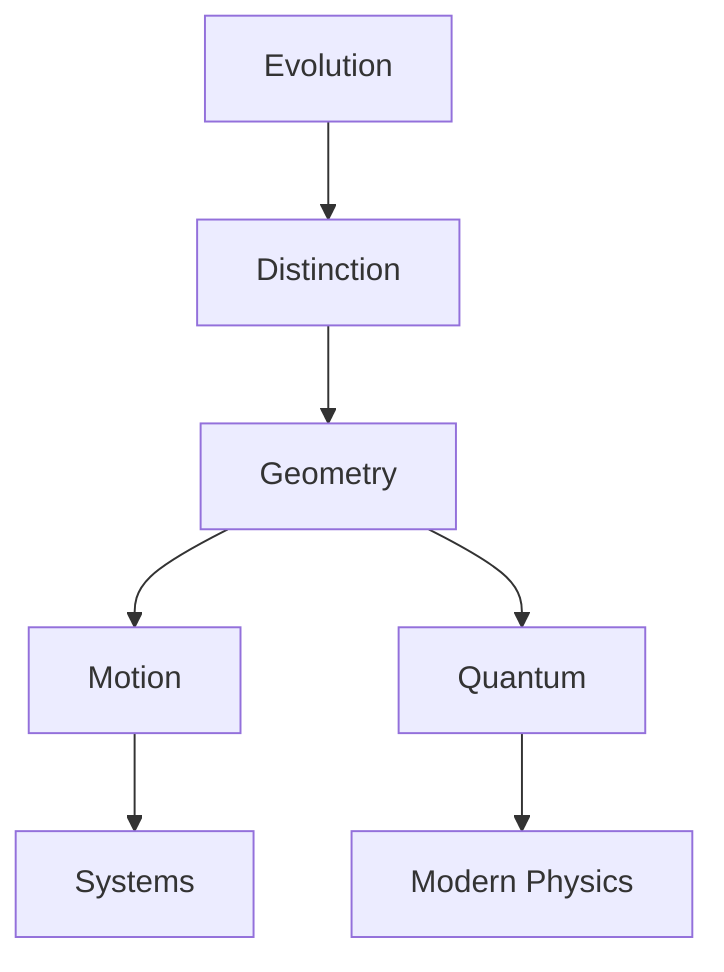

# Classical Mechanics: From Primordial Principles to Geometric Harmony

**Motto**: *"In the dance of evolution lies the essence of mechanics"*

## Core Viewpoint
Classical mechanics emerges from a single primordial concept: **evolution**. All structures, laws, and phenomena in mechanics arise necessarily from the requirements of consistent evolution. This view unifies classical mechanics as a geometric framework where motion, symmetry, and conservation emerge naturally from evolution requirements.

## Core Concepts
1. **Evolution**: The fundamental concept from which all mechanics emerges
2. **Distinction**: The preservation of differences between states during evolution
3. **Action**: The quantity that encodes evolution paths
4. **Geometric Structure**: The necessary framework that supports evolution
5. **Symmetry**: The invariances that arise from evolution requirements
6. **Conservation**: The necessities that maintain distinction

## Document Structure

### Chapter 1: The Origin of Mechanics
*Epigraph: "From the singular arises the many"*

#### 1.1 The Primordial Concept: Evolution
- Evolution as the foundation
- Requirements for meaningful evolution
- Necessity of distinction preservation

#### 1.2 Emergence of Structure
- Geometric necessities
- Configuration space as possibility space
- Phase space as evolution space

[Writing Focus: Emphasize how each structure emerges necessarily from evolution requirements]

### Chapter 2: The Architecture of Motion
*Epigraph: "Form follows function, function dictates form"*

#### 2.1 The Geometry of Evolution
- Symplectic structure necessity
- Conservation from geometry
- Action principle emergence

#### 2.2 Flow and Invariance
- Hamiltonian flow as natural evolution
- Symmetries as necessities
- Conservation laws as structure

[Writing Focus: Show how motion arises geometrically from evolution requirements]

### Chapter 3: Physical Systems as Geometric Necessities
*Epigraph: "The simple contains the profound"*

#### 3.1 Fundamental Systems
- Free motion from symmetry
- Oscillations from closure
- Central forces from rotational invariance

#### 3.2 Complex Systems
- Many-body dynamics
- Field emergence
- Continuous media

[Writing Focus: Demonstrate how physical systems emerge from geometric structure]

### Chapter 4: Quantum Structure as Geometric Necessity
*Epigraph: "The discrete emerges from the continuous"*

#### 4.1 Quantization from Geometry
- Bundle structure necessity
- Wave functions as sections
- Uncertainty from symplectic form

#### 4.2 Modern Extensions
- Gauge theories
- Information geometry
- Path to gravity

[Writing Focus: Show how quantum mechanics emerges naturally from classical geometry]

## Writing Guidelines
1. Start each section by showing how its content emerges necessarily from previous structures
2. Emphasize geometric necessity over historical development
3. Build concepts layer by layer, with each layer arising naturally from the previous
4. Focus on deep connections and unifying principles
5. Use mathematical precision with geometric intuition

## Key Relationships

