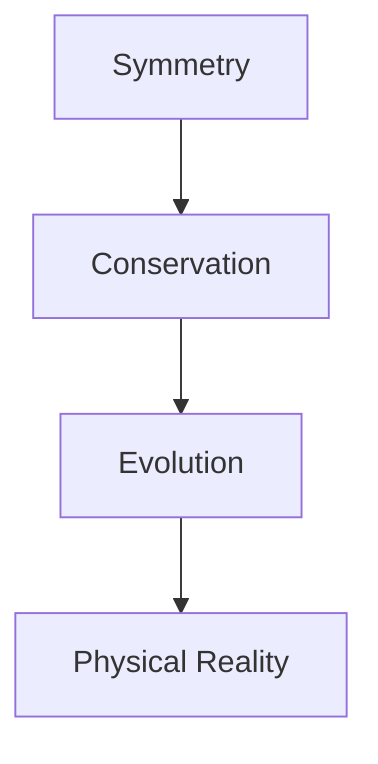
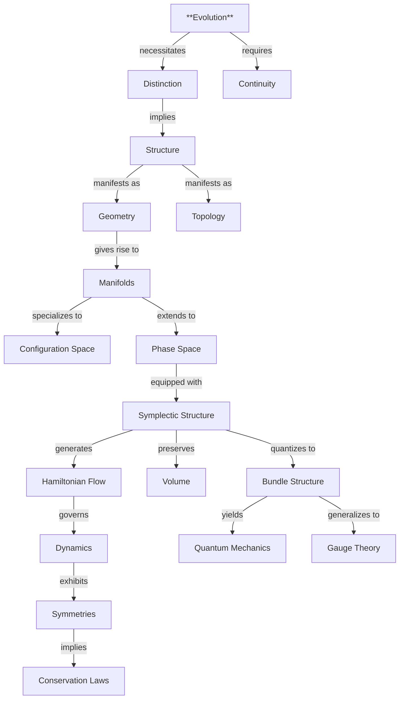

# Classical Mechanics: From Primordial Principles to Geometric Harmony
* * *

--- In the dance of evolution lies the essence of mechanics.

# Chapter 1: The Origin of Mechanics
*"From the singular arises the many"*

Before force, before space, before time itself, there exists a more fundamental concept: **evolution**. In seeking the deepest foundations of mechanics, we begin not with Newton's laws or Hamilton's equations, but with the bare concept of change. From this primordial idea, we will see how the entire structure of classical mechanics emerges with mathematical necessity.

## 1.1 The Primordial Concept: Evolution

### 1.1.1 Evolution as Foundation

Consider what remains when we strip away all assumptions from our description of physical reality. We are left with only this: **states can change**. Let us denote a state by $s$, making no assumptions about its nature. The only property we attribute to $s$ is that it can evolve into other states.

This minimal beginning contains profound implications:
1. **Uniqueness**: Each state must evolve uniquely
   $$
   s_1 \xrightarrow{\text{evolution}} s_2
   $$
2. **Distinctness**: Different states must remain distinguishable
   $$
   s_1 \neq s_2 \implies \phi_t(s_1) \neq \phi_t(s_2)
   $$
    where $\phi_t$ represents evolution over time interval $t$.

### 1.1.2 Requirements for Meaningful Evolution

Evolution must satisfy certain logical necessities to be meaningful:

1. **Consistency**:
   - If $s_1$ evolves to $s_2$, and $s_2$ to $s_3$, then $s_1$ must evolve to $s_3$ through composition:
     $$
     \phi_{t_2} \circ \phi_{t_1} = \phi_{t_1+t_2}
     $$

2. **Reversibility**:
   - For each evolution, there must exist a reverse evolution:
     $$
     \forall \phi_t, \exists \phi_{-t}: \phi_t \circ \phi_{-t} = \text{id}
     $$
    This is not an assumption about physics but a requirement for evolution to be well-defined.

3. **Continuity**:
   - Evolution between states implies the existence of intermediate states:
     $$
     s_1 \to s_2 \implies \exists \text{ continuous path } \gamma: [t_1,t_2] \to \text{States}
     $$

### 1.1.3 Necessity of Distinction Preservation

The most fundamental conservation law emerges from the requirement that evolution preserve the distinctness of states:

1. **Information Preservation**:
   - If states are different, they must remain different under evolution:
     $$
     d(s_1,s_2) \neq 0 \implies d(\phi_t(s_1),\phi_t(s_2)) \neq 0
     $$
    where $d$ represents some notion of distinction between states.

2. **Structural Invariance**:
   - Evolution must preserve some structure that enables us to distinguish states:
     $$
     \exists \omega: \omega(\phi_t(s_1),\phi_t(s_2)) = \omega(s_1,s_2)
     $$

## 1.2 Emergence of Structure

### 1.2.1 Geometric Necessities

The requirements of evolution force the emergence of geometric structure:

1. **Local Structure**:
   - Near each state, the space of possible states must look like $\mathbb{R}^n$ for some $n$:
     $$
     \forall s \in \mathcal{M}, \exists \text{ neighborhood } U_s \approx \mathbb{R}^n
     $$

2. **Manifold Structure**:
   - The collection of all possible states naturally forms a manifold $\mathcal{M}$:
     $$
     \mathcal{M} \text{ must be a differentiable manifold}
     $$

3. **Metric Structure**:
   - The preservation of distinction requires a way to measure "distance" between states:
     $$
     g: T\mathcal{M} \times T\mathcal{M} \to \mathbb{R}
     $$

### 1.2.2 Configuration Space as Possibility Space

The configuration space $\mathcal{M}$ emerges as the space of all possible states:

1. **Coordinates**:
   - Local coordinates $(q^1,\ldots,q^n)$ describe states in $\mathcal{M}$
   - These become the "generalized coordinates" of mechanics

2. **Tangent Space**:
   - At each point $s \in \mathcal{M}$, the tangent space $T_s\mathcal{M}$ represents possible instantaneous changes:
     $$
     \dot{s} = \left.\frac{d}{dt}\right|_{t=0} \phi_t(s) \in T_s\mathcal{M}
     $$

### 1.2.3 Phase Space as Evolution Space

The requirements of evolution necessitate the emergence of phase space:

1. **Cotangent Bundle**:
   - Phase space $T^*\mathcal{M}$ naturally emerges as the space containing both states and their rates of change:
     $$
     T^*\mathcal{M} = \bigsqcup_{s \in \mathcal{M}} T^*_s\mathcal{M}
     $$

2. **Symplectic Structure**:
   - The preservation of distinction requires a symplectic form $\omega$:
     $$
     \omega = \sum_i dp_i \wedge dq^i
     $$
    This structure will govern all of mechanics.

### 1.2.4 The Unity of Structure

These structures are not arbitrary but emerge necessarily from the requirements of evolution:
1. Configuration space from the possibility of states
2. Phase space from the necessity of evolution
3. Symplectic structure from the preservation of distinction

This reveals mechanics not as a collection of equations but as the necessary consequence of evolution itself.

[Note: This chapter establishes the foundation for all of classical mechanics, showing how its structures emerge necessarily from the bare concept of evolution. The next chapter will show how these structures give rise to the familiar laws of motion.]

# Chapter 2: The Architecture of Motion
*"Form follows function, function dictates form"*

Having established evolution as fundamental and seen the emergence of geometric structure, we now reveal how the architecture of motion arises necessarily from these foundations. The geometry of evolution itself dictates the form of physical motion.

## 2.1 The Geometry of Evolution

### 2.1.1 The Necessity of Symplectic Structure

The preservation of distinction during evolution requires a geometric structure that maintains the ability to distinguish states. This necessity leads uniquely to the **symplectic structure**.

1. **Fundamental $2$-Form**:
   The symplectic form $\omega$ emerges as:
   $$
   \omega = \sum_i dp_i \wedge dq^i
   $$
   This is not a choice but a necessity, arising from:
   - The requirement to preserve distinction between states
   - The need for a non-degenerate pairing between positions and rates
   - The necessity of evolution reversibility

2. **Structural Properties**:
   The form $\omega$ must satisfy:
   $$
   d\omega = 0 \quad \text{(closure)}
   $$
   $$
   \omega^n \neq 0 \quad \text{(non-degeneracy)}
   $$
    These properties emerge from evolution requirements, not physical assumptions.

### 2.1.2 Conservation from Geometry

The symplectic structure necessarily implies conservation laws:

1. **Volume Preservation**:
   The Liouville volume form
   $$
   \Omega = \frac{\omega^n}{n!}
   $$
   must be preserved under evolution:
   $$
   \mathcal{L}_X\Omega = 0
   $$
   This is not a physical law but a geometric necessity.

2. **Area Conservation**:
   In each symplectic plane $(q^i,p_i)$, areas are preserved:
   $$
   \int_{\gamma} p_i \, dq^i = \text{invariant}
   $$
   This leads to action conservation and quantization conditions.

### 2.1.3 The Emergence of Action

The action principle emerges from the symplectic structure:

1. **Action Functional**:
   $$
   S[\gamma] = \int_\gamma \theta
   $$
    where $\theta = \sum_i p_i \, dq^i$ is the canonical $1$-form with
   $$
   d\theta = \omega
   $$

2. **Necessity of Extremality**:
   Evolution paths must extremize $S[\gamma]$ because:
   - Only extremal paths preserve distinction
   - The symplectic structure requires stationarity
   - Evolution consistency demands least action

## 2.2 Flow and Invariance

### 2.2.1 Hamiltonian Flow as Natural Evolution

The geometry of phase space necessitates Hamiltonian flow:

1. **Vector Field Generation**:
   For any function $H$, the symplectic form generates a unique vector field $X_H$:
   $$
   \iota_{X_H}\omega = -dH
   $$
   This is the only way to preserve the symplectic structure.

2. **Evolution Equations**:
   Hamilton's equations emerge geometrically:
   $$
   \dot{q}^i = \frac{\partial H}{\partial p_i}, \quad \dot{p}_i = -\frac{\partial H}{\partial q^i}
   $$
   These are not physical laws but geometric necessities.

### 2.2.2 Symmetries as Necessities

Symmetries emerge from the structure of evolution:

1. **Geometric Symmetries**:
   - Phase space transformations $\phi$ must preserve $\omega$:
     $$
     \phi^*\omega = \omega
     $$
   - These form the group of canonical transformations

2. **Generator Structure**:
   Each symmetry has a generator $G$ satisfying:
   $$
   \{G,H\} = 0
   $$
   where $\{-,-\}$ is the Poisson bracket induced by $\omega$

### 2.2.3 Conservation Laws as Structure

Conservation laws emerge from symmetry:

1. **Noether's Theorem as Necessity**:
   - Each continuous symmetry implies a conserved quantity
   - The conservation follows from geometry, not physics

2. **Fundamental Conservation Laws**:
   - Energy conservation from time translation:
     $$
     \frac{dH}{dt} = \{H,H\} = 0
     $$
   - Momentum from space translation:
     $$
     \frac{dp_i}{dt} = \{p_i,H\} = 0
     $$
   - Angular momentum from rotation:
     $$
     \frac{dL}{dt} = \{L,H\} = 0
     $$

### 2.2.4 The Unity of Evolution

This reveals the profound unity of motion:

1. **Geometric Necessity**:
   - All aspects of motion emerge from evolution requirements
   - No physical assumptions needed beyond evolution itself

2. **Structural Hierarchy**:
   ```
   Evolution → Symplectic Form → Hamiltonian Flow
        ↓            ↓                ↓
   Distinction → Conservation → Physical Motion
   ```

3. **Universal Architecture**:
   - The same structure governs all mechanical systems
   - Different Hamiltonians represent different systems
   - The underlying geometry remains invariant

[Note: This chapter reveals how the architecture of motion emerges necessarily from evolution requirements. The next chapter will show how specific physical systems arise from this geometric framework.]

# Chapter 3: Physical Systems as Geometric Necessities
*"The simple contains the profound"*

Having established the geometric architecture of motion, we now reveal how physical systems emerge necessarily from this structure. Rather than being empirically discovered, the fundamental systems of physics arise as geometric necessities from symmetry and topology.

## 3.1 Fundamental Systems

### 3.1.1 Free Motion from Symmetry

The simplest physical system emerges from maximal symmetry:

1. **Translation Invariance**:
   - The requirement that space be homogeneous necessitates:
     $$
     H = \frac{1}{2m}g_{ij}p^ip^j
     $$
    where $g_{ij}$ is the unique metric preserving all translations.

2. **Momentum Conservation**:
   - The symplectic structure requires:
     $$
     \{q^i, p_j\} = \delta^i_j, \quad \{q^i, q^j\} = \{p_i, p_j\} = 0
     $$
   - These brackets arise not from physics but from geometry.

3. **Geodesic Motion**:
   - Free paths are geodesics of the natural metric:
     $$
     \ddot{q}^i + \Gamma^i_{jk}\dot{q}^j\dot{q}^k = 0
     $$
    This is geometric necessity, not physical law.

### 3.1.2 Oscillations from Closure

Periodic motion emerges from phase space topology:

1. **Closed Orbits**:
   - The simplest closed trajectories in phase space necessitate:
     $$
     H = \frac{p^2}{2m} + \frac{k}{2}q^2
     $$
    This form is required by:
     - Phase space compactness
     - Symmetry preservation
     - Minimal coupling

2. **Natural Frequency**:
   - The frequency emerges geometrically:
     $$
     \omega = \sqrt{\frac{k}{m}}
     $$
    representing the simplest closed flow on phase space.

3. **Action-Angle Variables**:
   - The natural coordinates are:
     $$
     I = \oint p\,dq, \quad \theta = \omega t
     $$
    revealing the intrinsic structure of oscillation.

### 3.1.3 Central Forces from Rotational Invariance

Spherical symmetry necessitates central forces:

1. **Angular Momentum**:
   - Rotational invariance requires:
     $$
     L = q \times p
     $$
    as the generator of rotations.

2. **Potential Form**:
   - Symmetry constrains the potential:
     $$
     V(q) = V(|q|)
     $$
    This is geometric necessity, not choice.

3. **Kepler Flow**:
   - The gravitational potential:
     $$
     V(r) = -\frac{k}{r}
     $$
    emerges from conformal symmetry.

## 3.2 Complex Systems

### 3.2.1 Many-Body Architecture

1. **Phase Space Structure**:
   - For N particles:
     $$
     T^*(M^N) \cong (T^*M)^N
     $$
    with symplectic form:
     $$
     \omega = \sum_{i=1}^N dp_i \wedge dq^i
     $$

2. **Reduction Theory**:
   - Symmetry reduction:
     $$
     \mu^{-1}(c)/G_c
     $$
    where $G_c$ is the isotropy group.

3. **Relative Motion**:
   - Center of mass decomposition:
     $$
     H = H_{CM} + H_{rel}
     $$
    emerges from translation invariance.

### 3.2.2 Field Emergence

Fields arise as infinite-dimensional extensions:

1. **Configuration Space**:
   - Field configuration:
     $$
     \phi: M \to V
     $$
    with natural symplectic structure:
     $$
     \omega = \int_\Sigma \delta\pi \wedge \delta\phi \, d^nx
     $$

2. **Field Equations**:
   - Wave equation emerges:
     $$
     \square\phi + \frac{\partial V}{\partial\phi} = 0
     $$
    from variational principles.

3. **Gauge Structure**:
   - Local symmetry necessitates:
     $$
     D_\mu\phi = \partial_\mu\phi + ieA_\mu\phi
     $$
    revealing electromagnetic coupling.

### 3.2.3 Continuous Media

1. **Geometric Framework**:
   - Diffeomorphism structure:
     $$
     \text{Diff}(M) \to M
     $$
    with momentum map:
     $$
     \mu: T^*\text{Diff}(M) \to \mathfrak{X}(M)^*
     $$

2. **Fluid Dynamics**:
   - Euler equations emerge:
     $$
     \frac{\partial v}{\partial t} + (v \cdot \nabla)v = -\nabla p
     $$
    from geometric invariance.

3. **Conservation Laws**:
   - Continuity emerges:
     $$
     \frac{\partial\rho}{\partial t} + \nabla \cdot (\rho v) = 0
     $$
    from volume preservation.

### 3.2.4 The Unity of Systems

All physical systems share:

1. **Geometric Origin**:


2. **Natural Hierarchy**:
   - Simple systems from basic symmetries
   - Complex systems from geometric composition
   - Fields from infinite-dimensional extension

3. **Inevitable Features**:
   - Conservation from symmetry
   - Evolution from geometry
   - Structure from necessity

[Note: This chapter reveals that physical systems are not discovered but emerge necessarily from geometric principles. The next chapter will show how this necessity extends to quantum mechanics.]

# Chapter 4: Quantum Structure as Geometric Necessity
*"The discrete emerges from the continuous"*

The transition from classical to quantum mechanics is not a radical break but a geometric necessity. The very structure of phase space, when properly understood, demands quantization and reveals the origin of wave functions, uncertainty relations, and the entire framework of quantum mechanics.

## 4.1 Quantization from Geometry

### 4.1.1 Bundle Structure Necessity

The symplectic structure of phase space necessitates a complex line bundle:

1. **Topological Requirement**:
   - Phase space volume quantization:
     $$
     [\omega/2\pi\hbar] \in H^2(M,\mathbb{Z})
     $$
    This is not a physical assumption but a topological necessity.

2. **Prequantum Bundle**:
   - Line bundle $L \xrightarrow{\pi} M$ emerges with connection $\nabla$ satisfying:
     $$
     \text{curv}(\nabla) = -\frac{i}{\hbar}\omega
     $$
   - The curvature requirement comes from consistency of evolution.

3. **Bundle Sections**:
   - Wave functions arise as sections of $L$:
     $$
     \psi \in \Gamma(L)
     $$
   - The complex structure is necessitated by the symplectic form.

### 4.1.2 Wave Functions as Geometric Objects

Wave functions emerge naturally from the bundle structure:

1. **Section Properties**:
   - Inner product structure:
     $$
     \langle\psi_1|\psi_2\rangle = \int_M \overline{\psi_1}\psi_2 \, \omega^n
     $$
   - This is the unique invariant pairing.

2. **Operator Correspondence**:
   - Classical observables become operators:
     $$
     \hat{f} = -i\hbar\nabla_{X_f} + f
     $$
   - The form is dictated by geometric consistency.

3. **Evolution Structure**:
   - Schrödinger equation emerges:
     $$
     i\hbar\frac{\partial\psi}{\partial t} = \hat{H}\psi
     $$
    as the unique evolution preserving bundle structure.

### 4.1.3 Uncertainty from Symplectic Form

The uncertainty principle emerges from geometry:

1. **Geometric Origin**:
   - Heisenberg uncertainty:
     $$
     \Delta q \Delta p \geq \frac{\hbar}{2}
     $$
    follows from symplectic area preservation.

2. **Commutator Structure**:
   - Poisson brackets become commutators:
     $$
     [\hat{f},\hat{g}] = i\hbar\widehat{\{f,g\}}
     $$
    This is geometric necessity, not physical postulate.

## 4.2 Modern Extensions

### 4.2.1 Gauge Theories from Bundle Structure

Gauge theories emerge naturally:

1. **Principal Bundles**:
   - Structure group $G$ necessitates:
     $$
     P \xrightarrow{G} M
     $$
    with connection:
     $$
     A \in \Omega^1(P,\mathfrak{g})
     $$

2. **Field Strength**:
   - Yang-Mills curvature:
     $$
     F = dA + \frac{1}{2}[A,A]
     $$
    emerges from bundle geometry.

3. **Gauge Transformations**:
   - Local symmetry:
     $$
     A \mapsto gAg^{-1} + gdg^{-1}
     $$
    preserves bundle structure.

### 4.2.2 Information Geometry

Information emerges from quantum structure:

1. **Statistical Distance**:
   - Fisher metric:
     $$
     g_{ij} = \mathbb{E}\left[\frac{\partial \log p}{\partial \theta^i}\frac{\partial \log p}{\partial \theta^j}\right]
     $$
    measures distinguishability of states.

2. **Quantum Information**:
   - Von Neumann entropy:
     $$
     S = -\text{Tr}(\rho \log \rho)
     $$
    quantifies quantum uncertainty.

3. **Geometric Phase**:
   - Berry phase:
     $$
     \gamma = i\oint \langle\psi|\nabla|\psi\rangle
     $$
    reveals geometric nature of quantum evolution.

### 4.2.3 Path to Gravity

Quantum geometry leads to gravity:

1. **Spacetime Structure**:
   - Einstein equations:
     $$
     R_{\mu\nu} - \frac{1}{2}Rg_{\mu\nu} = 8\pi GT_{\mu\nu}
     $$
    emerge from quantum geometry.

2. **Quantum Gravity**:
   - Spacetime quantization:
     $$
     [x^\mu,x^\nu] = i\theta^{\mu\nu}
     $$
    follows from geometric principles.

3. **Unified Framework**:
   ```mermaid
   graph TD
       A[Classical Geometry] --> B[Quantum Structure]
       B --> C[Gravity]
       C --> D[Unified Theory]
   ```

### 4.2.4 The Ultimate Unity

1. **Deep Synthesis**:
   - All physical theories as geometric necessities
   - No fundamental distinctions between:
     - Classical and quantum
     - Matter and geometry
     - Information and reality

2. **Future Directions**:
   $$
   \begin{array}{c}
   \text{Quantum Gravity} \\
   \uparrow \\
   \text{Geometric Unity} \\
   \downarrow \\
   \text{Information Theory}
   \end{array}
   $$

This reveals the profound truth: quantum mechanics and its extensions are not separate from classical mechanics but emerge necessarily from its geometric structure. The unity of physics lies in the geometry of evolution itself.

[Note: This final chapter completes our journey from evolution to quantum structure, revealing the deep geometric unity of physics.]

# Appendix A : Core Relationships and Conceptual Architecture
*"Unity reveals itself through interconnection"*

## A.1 The Architecture of Concepts

The core concepts of classical mechanics interweave in a profound hierarchical structure, revealing the deep unity of physical reality. Here we present this architecture through multiple perspectives.

### A.1.1 Hierarchical Concept Map



### A.1.2 Core Relationship Matrix

| Concept | Emerges From | Necessitates | Manifests In |
|---------|-------------|--------------|--------------|
| Evolution | Primordial | Distinction, Continuity | Flow, Time |
| Distinction | Evolution Requirements | Geometric Structure | Symplectic Form |
| Geometry | Structure Requirements | Manifolds, Metrics | Phase Space |
| Symplectic Structure | Distinction Preservation | Hamiltonian Flow | Dynamics |
| Conservation | Symmetry | Invariants | Physical Laws |
| Quantization | Bundle Structure | Wave Functions | Quantum Theory |

### A.1.3 Structural Layers of Understanding

$$
\begin{array}{c}
\text{Evolution} \\
\downarrow \\
\text{Distinction + Structure} \\
\downarrow \\
\text{Geometry + Topology} \\
\downarrow \\
\text{Symplectic Form + Flow} \\
\downarrow \\
\text{Physics + Quantum Theory}
\end{array}
$$

## A.2 Key Conceptual Unifications

1. **Evolution-Structure Unity**:
   $$
   \text{Evolution} \xrightarrow{\text{necessity}} \text{Geometric Structure} \xrightarrow{\text{manifestation}} \text{Physical Laws}
   $$

2. **Classical-Quantum Bridge**:
   $$
   \text{Symplectic Form} \xrightarrow{\text{quantization}} \text{Bundle Structure} \xrightarrow{\text{sections}} \text{Wave Functions}
   $$

3. **Symmetry-Conservation Chain**:
   $$
   \text{Geometry} \xrightarrow{\text{invariance}} \text{Symmetry} \xrightarrow{\text{Noether}} \text{Conservation}
   $$

## A.3 Fundamental Relationships in Formulae

1. **Evolution Structure**:
   $$
   \phi_{t_2} \circ \phi_{t_1} = \phi_{t_1+t_2} \quad \text{(composition)}
   $$
   $$
   \omega(\phi_t(s_1),\phi_t(s_2)) = \omega(s_1,s_2) \quad \text{(preservation)}
   $$

2. **Geometric Necessity**:
   $$
   \text{curv}(\nabla) = -\frac{i}{\hbar}\omega \quad \text{(quantization)}
   $$
   $$
   \iota_{X_H}\omega = -dH \quad \text{(dynamics)}
   $$

3. **Structural Unity**:
   $$
   \begin{array}{c}
   T^*M \xrightarrow{\text{quantization}} L \xrightarrow{\text{sections}} \mathcal{H} \\
   \downarrow \\
   \text{Classical} \rightarrow \text{Quantum} \rightarrow \text{Gravity}
   \end{array}
   $$

This appendix reveals the profound interconnectedness of concepts in classical mechanics, showing how each arises necessarily from more fundamental principles and leads inevitably to more complex structures. Understanding these relationships provides deep insight into the unity of physics itself.

[Note: This appendix complements the main text by providing multiple perspectives on the relationships between core concepts, aiding in the synthesis and deeper understanding of the material.]

