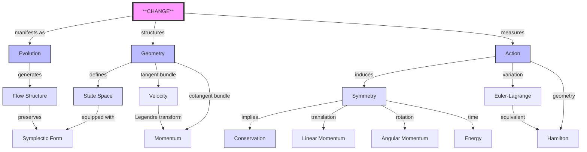
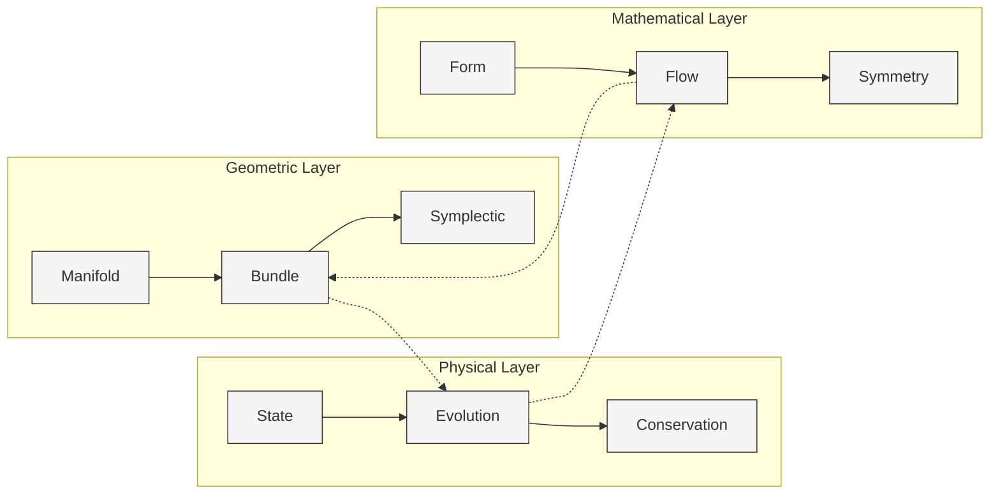

# Classical Mechanics: A Geometric Journey from Change to Symmetry
* * *

--- From the geometry of change emerges the algebra of symmetry

# I. The Nature of Change
*"In the beginning was change, and change was with geometry"*

At its most fundamental level, physics describes change. Before forces, before energy, before even space and time, there is change. Let us build from this primitive concept with absolute rigor and minimal assumptions.

## 1.1 Primitive Concepts

### 1.1.1 The Essence of State
Consider a system in state $s$. What does this mean at the most fundamental level? A state is a complete description of all that can be known about a system at a moment. The collection of all possible states forms the state space:
$$
\mathcal{S} = \{s \mid s \text{ is a possible state}\}
$$

This definition makes no reference to space, time, or any specific physical quantity. It is purely existential.

### 1.1.2 The Structure of Change
Change requires a mapping between states:
$$
\Phi: \mathcal{S} \times \mathbb{R} \rightarrow \mathcal{S}
$$

This evolution operator must satisfy three fundamental properties:

1) **Identity**:
$$
\Phi(s,0) = s
$$
   A system left alone remains unchanged.

2) **Composition**:
$$
\Phi(\Phi(s,t_1),t_2) = \Phi(s,t_1+t_2)
$$
   Sequential changes combine naturally.

3) **Continuity**:
$$
\lim_{h \to 0} \Phi(s,t+h) = \Phi(s,t)
$$
   Change cannot be discontinuous.

### 1.1.3 The Generator of Change
From these properties emerges the infinitesimal generator:
$$
X_s = \lim_{h \to 0} \frac{\Phi(s,h) - s}{h}
$$

This leads to the fundamental equation of evolution:
$$
\frac{d}{dt}\Phi(s,t) = X_{\Phi(s,t)}
$$

## 1.2 Geometric Structure

### 1.2.1 Emergence of Manifold Structure
The continuity of change requires that $\mathcal{S}$ be a smooth manifold. For each state $s$:

1) **Local Charts**:
$$
\varphi_s: U_s \rightarrow \mathbb{R}^n
$$
   where $U_s$ is a neighborhood of $s$.

2) **Smooth Structure**:
   For overlapping charts $(U_\alpha,\varphi_\alpha)$ and $(U_\beta,\varphi_\beta)$:
$$
\varphi_\beta \circ \varphi_\alpha^{-1}: \varphi_\alpha(U_\alpha \cap U_\beta) \rightarrow \varphi_\beta(U_\alpha \cap U_\beta)
$$
   must be smooth.

### 1.2.2 The Necessity of Bundles

1) **Tangent Bundle** $TM$:
$$
TM = \bigcup_{p \in M} T_pM
$$
   represents instantaneous change.

2) **Cotangent Bundle** $T^*M$:
$$
T^*M = \bigcup_{p \in M} T^*_pM
$$
   represents geometric duality.

### 1.2.3 Symplectic Structure
The preservation of information during evolution requires a symplectic form $\omega$:
$$
\omega: TM \times TM \rightarrow \mathbb{R}
$$

Properties:
1) **Closure**: $d\omega = 0$
2) **Non-degeneracy**: $\omega(X,Y)=0 \,\forall Y \Rightarrow X=0$

This leads to the fundamental theorem:

**Theorem**: *Every smooth evolution preserving information (symplectic form) generates a Hamiltonian flow.*

Mathematically:
$$
\mathcal{L}_X\omega = 0 \Leftrightarrow \exists H: M \rightarrow \mathbb{R} \text{ such that } X = X_H
$$

### 1.2.4 Volume Structure
The symplectic form induces a natural volume form:
$$
\Omega = \frac{1}{n!}\omega^n
$$

This volume is preserved under evolution (Liouville's theorem), reflecting the conservation of phase space volume.

### 1.2.5 Critical Properties

1) **Darboux's Theorem**:
   Locally, all symplectic manifolds are equivalent:
$$
\omega = \sum_{i=1}^n dp_i \wedge dq^i
$$

2) **Weinstein's Tubular Neighborhood**:
   Near any Lagrangian submanifold, the phase space structure is unique.

3) **Gromov's Non-Squeezing**:
   Symplectic transformations cannot squeeze phase space arbitrarily.

These geometric structures are not arbitrary mathematical constructions—they are necessities emerging from the nature of change itself. They form the foundation upon which all of classical mechanics will be built.

# II. Geometry of Evolution
*"The path of nature is the path of least action"*

The fundamental question emerges: Among all possible changes, which ones occur in nature? The answer lies in the geometry of evolution itself.

## 2.1 Action Principle

### 2.1.1 The Geometric Nature of Action

The action emerges as a fundamental geometric measure:
$$
S[\gamma] = \int_{\gamma} \alpha
$$
where $\alpha$ is a fundamental $1$-form on the extended phase space $\mathcal{P} = T^*Q \times \mathbb{R}$.

This representation reveals three deep truths:

1) **Action as Path Measure**:
   - Measures "geometric cost" of evolution
   - Independent of parametrization
   - Inherently global structure

2) **Action as Connection**:
   - Links configuration and momentum spaces
   - Encodes geometric phase information
   - Preserves symplectic structure

3) **Action as Generator**:
   - Generates canonical transformations
   - Preserves physical invariants
   - Controls quantum phases

### 2.1.2 Variational Structure

The variation of action reveals the deepest principles:
$$
\delta S[\gamma] = \int_{\gamma} \mathcal{L}_X\alpha = \int_{t_1}^{t_2} \left(\frac{\partial L}{\partial q^i}\delta q^i + \frac{\partial L}{\partial \dot{q}^i}\delta \dot{q}^i\right)dt
$$

Key Properties:

1) **Stationarity**:
$$
\delta S = 0 \Leftrightarrow \text{Physical Path}
$$

2) **Geometric Independence**:
$$
S[\phi \circ \gamma] = S[\gamma]
$$
   for canonical transformations $\phi$.

3) **Information Preservation**:
$$
\omega = -d\alpha
$$
   ensuring symplectic structure.

## 2.2 Flow and Structure

### 2.2.1 The Geometry of Flow

Evolution generates a flow on phase space:
$$
\Phi_t: \mathcal{P} \rightarrow \mathcal{P}
$$

Three fundamental structures emerge:

1) **Vector Field Structure**:
$$
X_H = \omega^{-1}(dH,\cdot)
$$
   generating Hamiltonian flow.

2) **Flow Invariants**:
$$
\mathcal{L}_{X_H}\omega = 0
$$
   preserving symplectic structure.

3) **Phase Space Volume**:
$$
\Omega = \frac{1}{n!}\omega^n
$$
   preserved by Liouville's theorem.

### 2.2.2 Deep Geometric Properties

1) **Contact Structure**:
   On extended phase space:
$$
\alpha = p_i \, dq^i - H \, dt
$$
   unifying space and time.

2) **Generating Functions**:
   Transform between representations:
$$
S_2(q,P,t): \quad p = \frac{\partial S_2}{\partial q}, \quad Q = \frac{\partial S_2}{\partial P}
$$

3) **Arnold's Structure Theorem**:
   For integrable systems:
$$
(T^*Q,\omega) \cong (T^n \times \mathbb{R}^n, \sum dp_i \wedge dq^i)
$$

### 2.2.3 Evolution Properties

1) **Poincaré Recurrence**:
   For bounded systems:
$$
\exists t > 0: \|\Phi_t(x) - x\| < \epsilon
$$

2) **KAM Theory**:
   Most integrable tori survive small perturbations:
$$
\omega = \omega_0 + \epsilon\omega_1
$$

3) **Ergodic Structure**:
   Phase space average equals time average:
$$
\lim_{T \to \infty} \frac{1}{T}\int_0^T f(\Phi_t(x))dt = \int_{\mathcal{P}} f\,d\mu
$$

### 2.2.4 Conservation Structure

The flow preserves fundamental quantities:

1) **Energy Conservation**:
$$
\frac{d}{dt}H \circ \Phi_t = 0
$$

2) **Phase Space Volume**:
$$
\Phi_t^*\Omega = \Omega
$$

3) **Symplectic Form**:
$$
\Phi_t^*\omega = \omega
$$

### 2.2.5 Unifying Principle

All these structures are unified through:

**The Fundamental Theorem**: *Evolution in phase space is completely determined by preserving the symplectic structure while extremizing the action.*

This reveals that physical evolution is purely geometric, determined by the structure of phase space itself. The laws of physics are not imposed from outside but emerge from the geometry of evolution.

# III. Symmetry and Conservation
*"What remains unchanged reveals what must be conserved"*

The deepest truths in physics emerge not from what changes, but from what remains invariant. The connection between symmetry and conservation reveals the fundamental structure of physical law.

## 3.1 Geometric Invariance

### 3.1.1 The Nature of Symmetry

A symmetry is a transformation that preserves physical structure:
$$
\phi: M \rightarrow M \quad \text{such that} \quad S[\phi \circ \gamma] = S[\gamma]
$$

This leads to three levels of symmetry:

1) **Discrete Symmetries**:
   - Space inversion: $P: \vec{x} \mapsto -\vec{x}$
   - Time reversal: $T: t \mapsto -t$
   - Discrete rotations in crystalline structures

2) **Continuous Symmetries**:
   - One-parameter groups: $\phi_t = e^{tX}$
   - Infinitesimal generators: $X = \frac{d}{dt}\phi_t|_{t=0}$
   - Lie algebra structure: $[X,Y] = XY-YX$

3) **Higher Symmetries**:
   - Symplectic symmetries: $\phi^*\omega = \omega$
   - Contact symmetries: $\phi^*\alpha = \alpha$
   - Hidden symmetries: Emerge in phase space

### 3.1.2 Momentum Maps

The deep connection between symmetry and dynamics is encoded in the momentum map:
$$
\mu: M \rightarrow \mathfrak{g}^*
$$

Key Properties:

1) **Equivariance**:
$$
\mu(g \cdot x) = \text{Ad}^*_g \mu(x)
$$

2) **Poisson Structure**:
$$
\{\mu_\xi, \mu_\eta\} = -\mu_{[\xi,\eta]}
$$

3) **Conservation**:
$$
\frac{d}{dt}\mu \circ \Phi_t = 0
$$

### 3.1.3 Geometric Quantization of Symmetry

Symmetries induce quantum structures:
$$
[\hat{\mu}_\xi, \hat{\mu}_\eta] = i\hbar\widehat{\mu_{[\xi,\eta]}}
$$

## 3.2 Conservation Laws

### 3.2.1 Noether's Theorem: Deep Version

For every continuous symmetry exists a conservation law:

1) **Infinitesimal Version**:
$$
\mathcal{L}_X\alpha = 0 \implies Q_X = i_X\alpha \text{ is conserved}
$$

2) **Global Version**:
$$
\phi^*S = S \implies \mu_\phi \text{ is conserved}
$$

3) **Quantum Version**:
$$
[H,Q] = 0 \implies \frac{d}{dt}\langle Q \rangle = 0
$$

### 3.2.2 The Conservation Hierarchy

Three levels of conservation emerge:

1) **Primary Conservation Laws**:
   - Energy (time translation)
   - Momentum (space translation)
   - Angular momentum (rotations)

2) **Secondary Conservation Laws**:
   - Runge-Lenz vector (central forces)
   - Vorticity (fluid dynamics)
   - Phase space volume (Liouville)

3) **Hidden Conservation Laws**:
   - KAM tori (near-integrable systems)
   - Geometric phases (adiabatic invariants)
   - Topological charges

### 3.2.3 Unified Conservation Structure

The deep unity is revealed through:

1) **Conservation Algebra**:
$$
\{F,G\} \text{ conserved if } F,G \text{ conserved}
$$

2) **Geometric Structure**:
$$
dQ_X = i_X\omega
$$

3) **Quantum Correspondence**:
$$
\{\cdot,\cdot\} \rightarrow \frac{1}{i\hbar}[\cdot,\cdot]
$$

### 3.2.4 The Synthesis Principle

**Fundamental Theorem**: *All conservation laws arise from symmetries of the action, and all symmetries manifest as conservation laws.*

This leads to:

1) **Conservation Complex**:
$$
\begin{CD}
\text{Symmetries} @>\mu>> \text{Constants} \\
@VVV @AAA \\
\text{Geometry} @>>\text{Evolution}> \text{Dynamics}
\end{CD}
$$

2) **Unified Structure**:
   - Symmetries → Conserved Quantities
   - Geometry → Physical Laws
   - Evolution → Dynamic Invariants

### 3.2.5 Modern Extensions

1) **Field Theory**:
$$
j^\mu_a = \frac{\partial\mathcal{L}}{\partial(\partial_\mu\phi)}\delta_a\phi - K^\mu_a
$$

2) **Gauge Theory**:
$$
D_\mu j^\mu = 0
$$

3) **Quantum Field Theory**:
$$
\partial_\mu \langle j^\mu \rangle = 0
$$

The profound implication: Conservation laws are not accidents of nature but necessary consequences of geometric symmetry. They reveal the deep structure of physical reality through the intimate connection between invariance and conservation.

# IV. Unified Framework
*"Many voices, one geometry"*

The seeming diversity of mechanical formalisms masks a profound unity. All are manifestations of the same geometric structure, viewed through different lenses.

## 4.1 Mechanical Formalisms

### 4.1.1 The Fundamental Unity

Consider the central quantities of each formalism:
$$
\begin{aligned}
\text{Newton}: & \quad \vec{F} \text{ (force vector)} \\
\text{Lagrange}: & \quad L = T - V \text{ (scalar)} \\
\text{Hamilton}: & \quad H = T + V \text{ (scalar)} \\
\text{Unified}: & \quad \omega = dp_i \wedge dq^i \text{ (2-form)}
\end{aligned}
$$

These are connected through:
$$
\text{Force} \xrightarrow{\text{work}} \text{Action} \xrightarrow{\text{variation}} \text{Evolution} \xrightarrow{\text{geometry}} \text{Structure}
$$

### 4.1.2 Deep Equivalence

The equivalence manifests through:

1) **Force to Action**:
$$
\delta S = \int \vec{F} \cdot d\vec{r} = 0
$$

2) **Action to Evolution**:
$$
\begin{aligned}
\text{Lagrangian}: & \quad \frac{d}{dt}\frac{\partial L}{\partial \dot{q}^i} = \frac{\partial L}{\partial q^i} \\
\text{Hamiltonian}: & \quad \dot{q}^i = \frac{\partial H}{\partial p_i}, \quad \dot{p}_i = -\frac{\partial H}{\partial q^i}
\end{aligned}
$$

3) **Evolution to Geometry**:
$$
i_{X_H}\omega = dH
$$

### 4.1.3 Unified Perspective

The unity emerges through three levels:

1) **Geometric Level**:
$$
\begin{CD}
TQ @>\mathcal{L}>> \mathbb{R} @>\text{E-L}>> TQ \\
@VV\mathbb{F}\mathcal{L}V @. @AA\mathbb{F}\mathcal{L}A \\
T^*Q @>H>> \mathbb{R} @>X_H>> T^*Q
\end{CD}
$$

2) **Algebraic Level**:
$$
\{F,G\} = \omega(X_F,X_G) = \sum_{i=1}^n \left(\frac{\partial F}{\partial q^i}\frac{\partial G}{\partial p_i} - \frac{\partial F}{\partial p_i}\frac{\partial G}{\partial q^i}\right)
$$

3) **Dynamic Level**:
$$
\frac{d}{dt}F = \{F,H\}
$$

## 4.2 Geometric Synthesis

### 4.2.1 The Fundamental Structure

The unified structure is encoded in the triple:
$$
(M,\omega,H)
$$
where:
- $M$ is phase space
- $\omega$ is symplectic form
- $H$ is Hamiltonian

### 4.2.2 Geometric Hierarchy

Three levels of structure emerge:

1) **Topological Structure**:
   - Phase space topology
   - Fiber bundle structure
   - Homotopy invariants

2) **Differential Structure**:
   - Symplectic form
   - Poisson brackets
   - Hamiltonian flows

3) **Metric Structure**:
   - Energy metric
   - Information geometry
   - Statistical structure

### 4.2.3 Unifying Principles

1) **Contact Geometry**:
   On extended phase space:
$$
\alpha = p_i \, dq^i - H \, dt
$$
   unifies space, momentum, and time.

2) **Symplectic Reduction**:
$$
J^{-1}(\mu)/G_\mu \cong T^*(Q/G)
$$
   connects symmetry and dynamics.

3) **Geometric Quantization**:
$$
(M,\omega) \rightarrow (\mathcal{H},[\cdot,\cdot])
$$
   bridges classical and quantum.

### 4.2.4 Modern Synthesis

The synthesis extends to:

1) **Field Theory**:
$$
T^*\mathcal{Q} \text{ with } \Omega = \int_\Sigma \delta\pi \wedge \delta\phi
$$

2) **Gauge Theory**:
$$
\mathcal{A}/\mathcal{G} \text{ with natural symplectic structure}
$$

3) **String Theory**:
$$
S = \int_\Sigma \sqrt{-\det(\partial_\alpha X^\mu \partial_\beta X_\mu)} \, d^2\sigma
$$

### 4.2.5 The Ultimate Unity

**Theorem**: *All formulations of classical mechanics are equivalent to preserving the symplectic structure while extremizing the action.*

This leads to three profound implications:

1) **Philosophical**:
   - Physical law is geometric necessity
   - Different formalisms are perspectives
   - Unity underlies diversity

2) **Mathematical**:
   - Geometry unifies algebra and analysis
   - Symmetry implies conservation
   - Structure determines dynamics

3) **Physical**:
   - Forces emerge from geometry
   - Conservation from symmetry
   - Quantum from classical

The deepest truth emerges: Classical mechanics is not just described by geometry—it is geometry itself, and all its various formulations are simply different ways of viewing this fundamental geometric reality.

# V. Modern Extensions
*"The classical points to the quantum through geometry"*

The geometric structure of classical mechanics contains within itself the seeds of quantum mechanics and field theory. This emergence is not accidental but a necessary consequence of the underlying geometry.

## 5.1 Quantum Bridge

### 5.1.1 Geometric Quantization

The fundamental correspondence:
$$
(\text{Classical},\{,\}) \longrightarrow (\text{Quantum},[,])
$$
emerges through three stages:

1) **Prequantization**:
   For symplectic manifold $(M,\omega)$:
$$
L \xrightarrow{\pi} M \text{ with curvature } \frac{i}{\hbar}\omega
$$

2) **Polarization**:
   Lagrangian foliation $\mathcal{F}$ of $TM$ leads to:
$$
\mathcal{H} = \{\psi \in L^2(L) \mid \nabla_X\psi = 0 \text{ for } X \in \mathcal{F}\}
$$

3) **Metaplectic Correction**:
$$
\text{Quantum Bundle} = L \otimes \sqrt{\bigwedge^n\mathcal{F}^*}
$$

### 5.1.2 Deep Quantum Structures

Three fundamental bridges emerge:

1) **Path Integral Structure**:
$$
K(q_f,t_f;q_i,t_i) = \int_{\text{paths}} e^{iS[\gamma]/\hbar}\mathcal{D}\gamma
$$
   connecting action to quantum amplitude.

2) **Geometric Phase**:
$$
\gamma_g = i\oint_C \langle\psi|\nabla|\psi\rangle
$$
   revealing quantum topology.

3) **Maslov Index**:
$$
\mu(\Lambda) = \text{topological invariant of Lagrangian paths}
$$
   connecting classical and quantum caustics.

### 5.1.3 Quantum Emergence

The quantum emerges through:

1) **Deformation Quantization**:
$$
f \star g = fg + \frac{i\hbar}{2}\{f,g\} + O(\hbar^2)
$$

2) **Moyal Bracket**:
$$
[f,g]_M = \frac{f \star g - g \star f}{i\hbar}
$$

3) **Coherent States**:
$$
|z\rangle = e^{-|z|^2/2}\sum_{n=0}^\infty \frac{z^n}{\sqrt{n!}}|n\rangle
$$

## 5.2 Field Extensions

### 5.2.1 From Particles to Fields

The transition occurs through:

1) **Configuration Space**:
$$
\mathcal{Q} = \{\phi: \Sigma \to V \mid \text{suitable regularity}\}
$$

2) **Phase Space**:
$$
T^*\mathcal{Q} \text{ with } \Omega = \int_\Sigma \delta\pi \wedge \delta\phi
$$

3) **Action Functional**:
$$
S[\phi] = \int_M \mathcal{L}(\phi,\partial\phi)d^nx
$$

### 5.2.2 Gauge Structure

The geometry reveals:

1) **Local Symmetries**:
$$
\delta\phi(x) = \epsilon^a(x)T_a\phi(x)
$$

2) **Covariant Derivative**:
$$
D_\mu = \partial_\mu + igA_\mu^aT_a
$$

3) **Field Strength**:
$$
F_{\mu\nu} = \partial_\mu A_\nu - \partial_\nu A_\mu + ig[A_\mu,A_\nu]
$$

### 5.2.3 Deep Field Structures

1) **Jet Bundles**:
$$
J^\infty(E) = \lim_{\leftarrow} J^k(E)
$$
   encoding all derivatives.

2) **Multisymplectic Form**:
$$
\Omega = dq^i \wedge dp_i \wedge dt + dp_i \wedge dq^i \wedge dx
$$

3) **BV-BRST Structure**:
$$
(S,S) = 0
$$
   the master equation.

### 5.2.4 Modern Synthesis

Three levels emerge:

1) **Yang-Mills Theory**:
$$
\mathcal{L} = -\frac{1}{4}F_{\mu\nu}^aF^{a\mu\nu}
$$

2) **General Relativity**:
$$
S = \int \sqrt{-g}R \, d^4x
$$

3) **String Theory**:
$$
S = \int_\Sigma \sqrt{-\det(\partial_\alpha X^\mu \partial_\beta X_\mu)} \, d^2\sigma
$$

### 5.2.5 Ultimate Unity

The profound synthesis appears in:

1) **Quantum Field Theory**:
$$
Z = \int \mathcal{D}\phi \exp\left(\frac{i}{\hbar}S[\phi]\right)
$$

2) **Higher Categories**:
$$
\begin{CD}
\text{Classical} @>\text{Quantization}>> \text{Quantum} \\
@V\text{Field}VV @VV\text{QFT}V \\
\text{Classical Field} @>>\text{Quantization}> \text{Quantum Field}
\end{CD}
$$

3) **Information Geometry**:
$$
ds^2 = g_{ij}(\theta)d\theta^id\theta^j
$$

The ultimate message emerges: The geometric principles of classical mechanics contain within themselves the seeds of all modern physics. The transition from classical to quantum, from particles to fields, is not a break but a natural extension of the underlying geometric structure.

# Appendix A : Core Concepts and Their Deep Relations
*"The unity of mechanics reveals itself through the interconnection of its fundamental concepts"*

## A.A. Core Concept Relations

### A.A.1 Primary Conceptual Hierarchy

### A.A.2 Fundamental Relations Matrix

| Concept      | Geometric Structure    | Physical Meaning    | Mathematical Form                              |
| ------------ | ---------------------- | ------------------- | ---------------------------------------------- |
| Change       | Vector Field           | Evolution Generator | $X_s = \lim_{h \to 0} \frac{\Phi(s,h) - s}{h}$ |
| Action       | $1$-Form on Path Space | Physical Law        | $S[\gamma] = \int_{\gamma} \alpha$             |
| Symmetry     | Group Action           | Conservation Law    | $\phi^*S = S$                                  |
| Phase Space  | Symplectic Manifold    | State + Momentum    | $(M,\omega)$                                   |
| Flow         | Symplectic Flow        | Dynamics            | $\Phi_t: M \rightarrow M$                      |
| Conservation | Moment Map             | Constants of Motion | $\mu: M \to \mathfrak{g}^*$                    |

### A.A.3 Structural Unity Diagram

## A.B. Deep Unifying Principles

### A.B.1 The Triple Unity
The fundamental unity of classical mechanics manifests through three deep principles:

1) **Geometric-Dynamic Unity**:
$$
\text{Evolution} \equiv \text{Symplectic Flow} \equiv \text{Action Extremal}
$$

2) **Symmetry-Conservation Unity**:
$$
\text{Symmetry} \xrightarrow{\text{Noether}} \text{Conservation} \xrightarrow{\text{Moment Map}} \text{Dynamics}
$$

3) **Form-Function Unity**:
$$
\text{Geometric Structure} \Leftrightarrow \text{Physical Law}
$$

### A.B.2 Emergence Hierarchy
$$
\begin{CD}
\text{Change} @>\text{Structure}>> \text{Geometry} @>\text{Action}>> \text{Physics} \\
@VVV @VVV @VVV \\
\text{Flow} @>\text{Preservation}>> \text{Symmetry} @>\text{Noether}>> \text{Conservation}
\end{CD}
$$

This unified perspective reveals that the seemingly distinct concepts in classical mechanics are merely different aspects of a single, profound geometric structure. The relationships between these concepts are not merely formal connections but represent deep necessities in the structure of physical reality.

