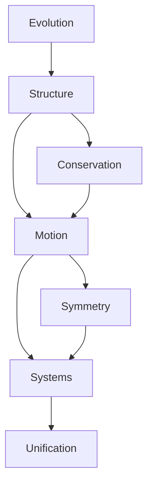

# The Geometric Origin of Classical Mechanics: From Evolution to Structure

**Motto**: *"In the dance of geometry lies the essence of motion"*

## Core Vision

Classical mechanics fundamentally arises from the interplay between evolution and structure. By starting from the bare concept of evolution and deriving necessary geometric structures, we reveal how physical laws emerge not as empirical observations but as mathematical necessities.

## Core Principles

1. **Evolution Primacy**: Evolution of states is the only foundational concept
2. **Structural Necessity**: Geometric structures emerge from evolution requirements
3. **Minimal Construction**: Each element arises necessarily from previous ones
4. **Natural Unity**: All physical laws flow from geometric structure

## Document Framework

### I. The Nature of Evolution
**Epigraph**: *"First was change, and from change arose all"*

#### I.A. Pure Evolution
**Goal**: Establish evolution as the singular foundation
- Evolution as primitive concept
- Requirements for meaningful change
- Conservation of distinction

#### I.B. Geometric Requirements
**Goal**: Show how geometry emerges necessarily
- Necessity of manifold structure
- Emergence of tangent space
- Conservation structures

[Note: This section provides the philosophical and mathematical foundation, emphasizing how geometry arises from pure evolution.]

### II. The Structure of Motion
**Epigraph**: *"Form follows function, and function flows from form"*

#### II.A. Natural Structures
**Goal**: Develop the minimal necessary framework
- Symplectic manifolds from evolution
- Phase space emergence
- Conservation laws as necessity

#### II.B. Dynamic Architecture
**Goal**: Show how motion arises from structure
- Hamilton's flow from geometry
- Action principle as necessity
- Time evolution and symmetry

[Note: This section reveals how physical laws emerge from geometric structure.]

### III. Physical Manifestations
**Epigraph**: *"From abstract necessity flows concrete reality"*

#### III.A. Elementary Systems
**Goal**: Derive basic physical systems
- Free motion from symmetry
- Oscillations from closure
- Forces from geometry

#### III.B. Complex Realities
**Goal**: Extend to real systems
- Many-body dynamics
- Field emergence
- Continuous media

[Note: This section demonstrates how physical systems arise naturally.]

### IV. Deep Unification
**Epigraph**: *"At the core, all is one"*

#### IV.A. Quantum Emergence
**Goal**: Show quantum mechanics as geometric necessity
- Quantization from topology
- Wave functions from bundles
- Uncertainty from geometry

#### IV.B. Modern Implications
**Goal**: Connect to contemporary physics
- Gauge theories as structure
- Information as geometry
- Path to quantum gravity

[Note: This section reveals broader implications and connections.]

## Construction Guidelines

### Principles
1. Build from evolution alone
2. Introduce concepts only when necessary
3. Emphasize geometric inevitability
4. Maintain rigorous logic

### Flow

### Key Interconnections
- Evolution requirements → Geometric structure
- Structure → Conservation laws
- Conservation → Physical systems
- Systems → Quantum emergence

