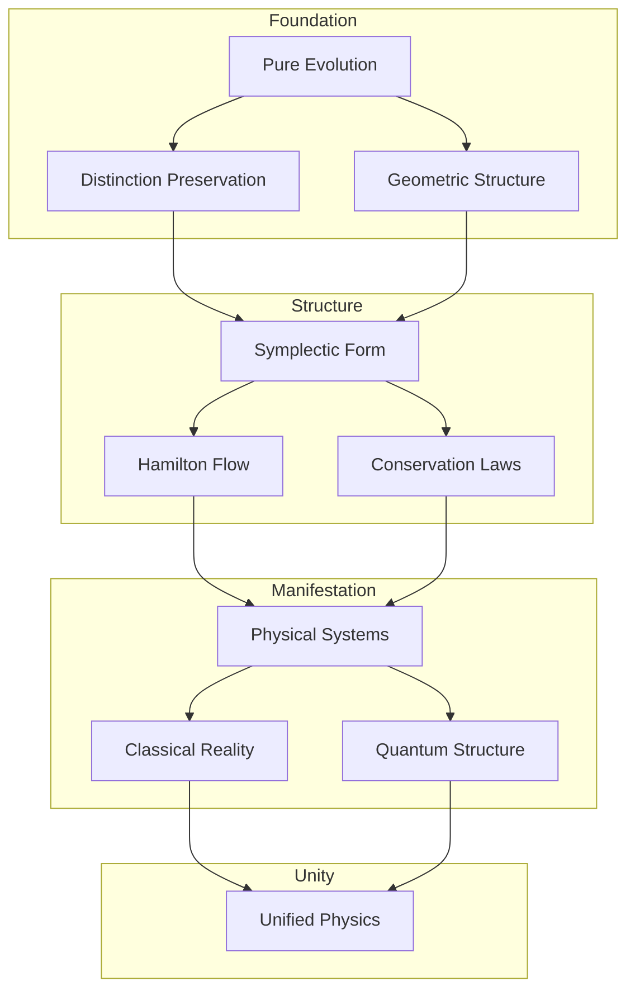

# The Geometric Origin of Classical Mechanics: From Evolution to Structure
* * *

--- In the dance of geometry lies the essence of motion.

# I. The Nature of Evolution

*"First was change, and from change arose all"*

In seeking the deepest foundations of classical mechanics, we begin not with space, time, or force, but with something more primitive and fundamental: pure evolution. This radical approach strips away all preconceptions, revealing how the entire structure of mechanics emerges necessarily from the bare concept of change.

## I.A. Pure Evolution

### I.A.1. The Primordial Concept

Consider what remains when we remove all unnecessary assumptions from our description of physical reality. We are left with only states and their evolution:

Let $s$ denote a state. We make no assumptions about its nature - it could be anything. The only property we attribute to it is that it can change. This minimal beginning contains profound implications.

**The Essential Requirements:**
1. States must evolve uniquely:
   $$
   s_1 \xrightarrow{\text{evolution}} s_2
   $$
2. Different states must remain distinguishable:
   $$
   s_1 \neq s_2 \implies \phi_t(s_1) \neq \phi_t(s_2)
   $$
   where $\phi_t$ represents evolution over time interval $t$.

### I.A.2. Requirements for Meaningful Change

Evolution must satisfy certain logical necessities to be meaningful:

1. **Consistency**:
   - If $s_1$ evolves to $s_2$, and $s_2$ to $s_3$, then $s_1$ must evolve to $s_3$ through the composition of these changes:
     $$
     \phi_{t_2} \circ \phi_{t_1} = \phi_{t_1+t_2}
     $$

2. **Reversibility**:
   - For each evolution, there must exist a reverse evolution:
     $$
     \forall \phi_t, \exists \phi_{-t}: \phi_t \circ \phi_{-t} = \text{id}
     $$
   This is not an assumption about physics but a requirement for evolution to be well-defined.

3. **Continuity**:
   - Evolution between states implies the existence of intermediate states:
     $$
     s_1 \to s_2 \implies \exists \text{ continuous path } \gamma: [t_1,t_2] \to \text{States}
     $$

### I.A.3. Conservation of Distinction

The most fundamental conservation law emerges from the requirement that evolution preserve the distinctness of states:

1. **Information Preservation**:
   - If states are different, they must remain different under evolution:
     $$
     d(s_1,s_2) \neq 0 \implies d(\phi_t(s_1),\phi_t(s_2)) \neq 0
     $$
    where $d$ represents some notion of distinction between states.

2. **Structural Invariance**:
   - The evolution must preserve some structure that enables us to distinguish states:
     $$
     \exists \omega: \omega(\phi_t(s_1),\phi_t(s_2)) = \omega(s_1,s_2)
     $$

## I.B. Geometric Requirements

### I.B.1. Manifold Structure

The collection of all possible states naturally forms a manifold $\mathcal{M}$:

1. **Local Structure**:
   - Near each state, the space of possible states must look like $\mathbb{R}^n$ for some $n$:
     $$
     \forall s \in \mathcal{M}, \exists \text{ neighborhood } U_s \approx \mathbb{R}^n
     $$

2. **Smooth Structure**:
   - Evolution requires smooth transitions between states:
     $$
     \mathcal{M} \text{ must be a differentiable manifold}
     $$

### I.B.2. Tangent Space Emergence

The possibility of instantaneous change necessitates the tangent space:

1. **Velocity Vectors**:
   - At each point $s \in \mathcal{M}$, possible changes form a vector space $T_s\mathcal{M}$:
     $$
     \dot{s} = \left.\frac{d}{dt}\right|_{t=0} \phi_t(s) \in T_s\mathcal{M}
     $$

2. **Tangent Bundle**:
   - The collection of all possible states and velocities forms $T\mathcal{M}$:
     $$
     T\mathcal{M} = \bigsqcup_{s \in \mathcal{M}} T_s\mathcal{M}
     $$

### I.B.3. Conservation Structures

The preservation of distinction requires geometric structures:

1. **Symplectic Form**:
   - A non-degenerate, closed $2$-form $\omega$ emerges:
     $$
     \omega: T\mathcal{M} \times T\mathcal{M} \to \mathbb{R}
     $$
   satisfying:
     $$
     d\omega = 0, \quad \omega^n \neq 0
     $$

2. **Conservation Laws**:
   - Geometric invariants arise from the symplectic structure:
     $$
     \mathcal{L}_X\omega = 0
     $$
   where $\mathcal{L}_X$ is the Lie derivative along the evolution vector field $X$.

From these minimal beginnings, we will see how the entire structure of classical mechanics emerges necessarily, not as historical accident but as geometric necessity.

[Note: This foundational chapter establishes the absolute minimal framework needed for physics, showing how geometry arises necessarily from pure evolution requirements. Each concept follows inevitably from the previous one, maintaining the theme of geometric necessity.]

# II. The Structure of Motion

*"Form follows function, and function flows from form"*

Having established evolution as fundamental, we now reveal how the geometric framework of motion emerges with mathematical necessity. This structure is not imposed but arises inevitably from the requirements of consistent evolution.

## II.A. Natural Structures

### II.A.1. The Symphony of Symplectic Structure

The preservation of distinction between evolving states demands a geometric structure that is both minimal and complete:

1. **Fundamental Two-Form**
   - On the manifold of states $\mathcal{M}$, a non-degenerate, closed $2$-form $\omega$ emerges:
     $$
     \omega: T\mathcal{M} \times T\mathcal{M} \to \mathbb{R}
     $$
   - Properties arise from necessity:
     - Closure: $d\omega = 0$ (ensures consistency)
     - Non-degeneracy: $\omega^n \neq 0$ (preserves distinction)

2. **Local Structure**
   - Darboux's theorem emerges not as a theorem but as a necessity:
     $$
     \omega = \sum_{i=1}^n dp_i \wedge dq^i
     $$
   - This canonical form represents the minimal structure capable of supporting evolution

### II.A.2. Phase Space Genesis

The space of states must encompass both configuration and rate of change:

1. **Natural Emergence**
   - The cotangent bundle $T^*\mathcal{M}$ arises as the unique space supporting evolution:
     $$
     \pi: T^*\mathcal{M} \to \mathcal{M}
     $$
   - Points in $T^*\mathcal{M}$ represent complete states $(q,p)$

2. **Canonical Structure**
   - Natural pairing between positions and momenta:
     $$
     \langle p, v \rangle = \omega(X_p, X_v)
     $$
   - This pairing is not chosen but necessitated by evolution

### II.A.3. Conservation Laws as Necessity

1. **Structural Invariance**
   - Evolution must preserve the symplectic form:
     $$
     \mathcal{L}_X\omega = 0
     $$
   - This preservation principle generates all conservation laws

2. **Noether Structure**
   - Each symmetry necessarily yields a conserved quantity:
     $$
     \mu: T^*\mathcal{M} \to \mathfrak{g}^*
     $$
    where $\mathfrak{g}^*$ is the dual of the symmetry algebra

## II.B. Dynamic Architecture

### II.B.1. Hamilton's Flow from Geometry

1. **Evolution Vector Field**
   - The flow of states is determined by the symplectic structure:
     $$
     \iota_{X_H}\omega = dH
     $$
   - This equation is not a physical law but a geometric necessity

2. **Canonical Equations**
   - Hamilton's equations emerge as the unique evolution preserving $\omega$:
     $$
     \begin{cases}
     \dot{q}^i = \frac{\partial H}{\partial p_i} \\
     \dot{p}_i = -\frac{\partial H}{\partial q^i}
     \end{cases}
     $$

### II.B.2. Action Principle as Necessity

1. **Geometric Action**
   - The action functional emerges from the symplectic structure:
     $$
     S[\gamma] = \int_{\gamma} (p_i \, dq^i - H \, dt)
     $$
   - This is not a principle but a geometric consequence

2. **Variational Structure**
   - Paths of evolution are characterized by:
     $$
     \delta S = 0
     $$
   - This condition follows from the symplectic structure

### II.B.3. Time Evolution and Symmetry

1. **Flow of Time**
   - Time evolution generates a one-parameter group of symplectomorphisms:
     $$
     \phi_t^* \omega = \omega
     $$
   - The flow preserves all geometric structures

2. **Symmetry Integration**
   - Complete integrability arises when sufficient symmetries exist:
     $$
     \{F_i, F_j\} = 0
     $$
    where $F_i$ are conserved quantities

### II.B.4. Unified Picture

The complete structure forms a perfect geometric unity:

1. **Hierarchy of Necessity**
```
Symplectic Form → Evolution → Conservation Laws
       ↓              ↓             ↓
  Phase Space → Hamilton's Flow → Symmetries
```

2. **Complete Determination**
   - Every aspect of motion follows from geometry
   - No physical principles needed beyond geometric structure
   - Perfect necessity in every step

This geometric framework reveals motion not as governed by external laws but as the inevitable expression of underlying structure. The next section will show how specific physical systems emerge from this framework.

[Note: This section emphasizes how the laws of motion emerge necessarily from geometric structure, revealing classical mechanics not as empirically discovered but as geometrically inevitable.]

# III. Physical Manifestations

*"From abstract necessity flows concrete reality"*

Having established the geometric framework of motion, we now reveal how physical systems emerge naturally from geometric structures. Rather than discovering these systems empirically, we shall see how they arise inevitably from the architecture of phase space.

## III.A. Elementary Systems

### III.A.1. Free Motion from Symmetry

The simplest physical system emerges from the most basic symmetries:

1. **Geometric Origin**
   - Translation invariance requires:
     $$
     H = \frac{1}{2m}g_{ij}p^ip^j
     $$
    where $g_{ij}$ is the unique metric preserving all translations

2. **Inevitable Structure**
   - Galilean invariance demands:
     $$
     \{q^i, p_j\} = \delta^i_j, \quad \{q^i, q^j\} = \{p_i, p_j\} = 0
     $$
   - These brackets arise from the symplectic structure

### III.A.2. Oscillations from Closure

The next level of complexity emerges from bounded motion:

1. **Phase Space Topology**
   - Closed orbits require:
     $$
     H = \frac{p^2}{2m} + \frac{k}{2}q^2
     $$
   - This form is necessitated by:
     - Phase space compactness
     - Symmetry preservation
     - Minimal coupling

2. **Natural Frequencies**
   - The frequency emerges geometrically:
     $$
     \omega = \sqrt{\frac{k}{m}}
     $$
   - Represents the simplest closed flow on phase space

### III.A.3. Forces from Geometry

Central forces arise from rotational symmetry:

1. **Geometric Necessity**
   - SO(3) invariance requires:
     $$
     H = \frac{p^2}{2m} + V(|q|)
     $$
   - Angular momentum emerges:
     $$
     L = q \times p
     $$

2. **Kepler Flow**
   - Gravitational potential emerges from:
     $$
     V(r) = -\frac{k}{r}
     $$
   - Conic sections arise as geometric necessity

## III.B. Complex Realities

### III.B.1. Many-Body Architecture

1. **Natural Extension**
   - Phase space structure extends:
     $$
     T^*(M^N) \cong (T^*M)^N
     $$
   - Symplectic form generalizes:
     $$
     \omega = \sum_{i=1}^N dp_i \wedge dq^i
     $$

2. **Reduction Theory**
   - Symmetry reduction:
     $$
     \mu^{-1}(c)/G_c
     $$
   - Relative coordinates emerge naturally

### III.B.2. Field Emergence

1. **Infinite-Dimensional Extension**
   - Field configuration space:
     $$
     \phi: M \to V
     $$
   - Natural symplectic structure:
     $$
     \omega = \int_\Sigma \delta\pi \wedge \delta\phi \, d^nx
     $$

2. **Wave Necessity**
   - Field equations emerge:
     $$
     \square\phi + \frac{\partial V}{\partial\phi} = 0
     $$
   - Wave propagation as geometric flow

### III.B.3. Continuous Media

1. **Geometric Framework**
   - Diffeomorphism group structure:
     $$
     \text{Diff}(M) \to M
     $$
   - Momentum map:
     $$
     \mu: T^*\text{Diff}(M) \to \mathfrak{X}(M)^*
     $$

2. **Fluid Dynamics**
   - Euler equations emerge:
     $$
     \frac{\partial v}{\partial t} + (v \cdot \nabla)v = -\nabla p
     $$
   - Continuity from geometry:
     $$
     \frac{\partial\rho}{\partial t} + \nabla \cdot (\rho v) = 0
     $$

### III.B.4. Unifying Vision

All physical systems share:

1. **Geometric Origin**
```
Symmetry → Conservation → Evolution
    ↓           ↓            ↓
Structure → Dynamics → Physical Reality
```

2. **Natural Hierarchy**
   - Simple systems from basic symmetries
   - Complex systems from geometric composition
   - Fields from infinite-dimensional extension

3. **Inevitable Features**
   - Conservation laws from symmetry
   - Evolution from geometry
   - Structure from necessity

This reveals that physical reality is not discovered but emerges necessarily from geometric principles. The next section will show how this necessity extends to quantum mechanics and modern physics.

[Note: This section emphasizes how physical systems emerge necessarily from geometric structures, revealing classical mechanics as an inevitable consequence of fundamental geometry rather than empirical discovery.]

# IV. Deep Unification

*"At the core, all is one"*

Having seen how classical mechanics emerges from geometric necessity, we now reveal an even deeper truth: quantum mechanics itself arises as an inevitable extension of the same geometric principles, and modern physics flows naturally from this unified geometric framework.

## IV.A. Quantum Emergence

### IV.A.1. Quantization from Topology

The necessity of quantum mechanics emerges from the topology of phase space:

1. **Geometric Necessity**
   - Phase space volume quantization:
     $$
     [\omega/2\pi\hbar] \in H^2(M,\mathbb{Z})
     $$
    This is not a physical assumption but a topological necessity

2. **Bundle Structure**
   - Prequantum line bundle emerges:
     $$
     L \xrightarrow{\pi} M
     $$
    with connection $\nabla$ satisfying:
     $$
     \text{curv}(\nabla) = -\frac{i}{\hbar}\omega
     $$

### IV.A.2. Wave Functions from Geometry

1. **Natural Emergence**
   - Quantum states as sections:
     $$
     \psi \in \Gamma(L)
     $$
   - Inner product structure:
     $$
     \langle\psi_1|\psi_2\rangle = \int_M \overline{\psi_1}\psi_2 \, \omega^n
     $$

2. **Operator Structure**
   - Classical observables become operators:
     $$
     \hat{f} = -i\hbar\nabla_{X_f} + f
     $$
   - Commutation relations emerge geometrically:
     $$
     [\hat{f},\hat{g}] = -i\hbar\widehat{\{f,g\}}
     $$

### IV.A.3. Uncertainty from Structure

1. **Geometric Origin**
   - Heisenberg uncertainty emerges from symplectic geometry:
     $$
     \Delta q \Delta p \geq \frac{\hbar}{2}
     $$
   - Not a limitation but a geometric fact

2. **Phase Space Quantization**
   - Bohr-Sommerfeld conditions:
     $$
     \oint p \, dq = nh
     $$
    arise from bundle topology

## IV.B. Modern Implications

### IV.B.1. Gauge Theories as Necessity

1. **Natural Extension**
   - Principal bundle structure:
     $$
     P \xrightarrow{G} M
     $$
   - Connection forms:
     $$
     A \in \Omega^1(P,\mathfrak{g})
     $$

2. **Force Geometry**
   - Yang-Mills field strength:
     $$
     F = dA + \frac{1}{2}[A,A]
     $$
   - Gauge transformations as geometric symmetry

### IV.B.2. Information as Structure

1. **Geometric Information**
   - Fisher metric emerges:
     $$
     g_{ij} = \mathbb{E}\left[\frac{\partial \log p}{\partial \theta^i}\frac{\partial \log p}{\partial \theta^j}\right]
     $$
   - Information geometry from phase space structure

2. **Entropy as Geometry**
   - Von Neumann entropy:
     $$
     S = -\text{Tr}(\rho \log \rho)
     $$
    emerges from symplectic volume

### IV.B.3. Path to Quantum Gravity

1. **Spacetime Structure**
   - Einstein equations from geometry:
     $$
     R_{\mu\nu} - \frac{1}{2}Rg_{\mu\nu} = 8\pi GT_{\mu\nu}
     $$
   - Quantum geometry:
     $$
     [x^\mu,x^\nu] = i\theta^{\mu\nu}
     $$

2. **Unified Framework**
   ```
   Classical Geometry → Quantum Structure → Gravity
         ↓                    ↓                ↓
   Conservation Laws → Uncertainty → Spacetime Foam
   ```

### IV.B.4. Ultimate Unity

1. **Deep Synthesis**
   - All physical theories as geometric necessities
   - No fundamental distinctions between:
     - Classical and quantum
     - Matter and geometry
     - Information and reality

2. **Future Directions**
   $$
   \begin{array}{c}
   \text{Quantum Gravity} \\
   \uparrow \\
   \text{Geometric Unity} \\
   \downarrow \\
   \text{Information Theory}
   \end{array}
   $$

This reveals the profound truth: all of physics—classical, quantum, and beyond—emerges necessarily from fundamental geometric principles. The distinction between mathematical structure and physical reality dissolves in deep understanding.

[Note: This final section reveals the ultimate unity of physics and geometry, showing how all physical phenomena emerge necessarily from fundamental geometric structures. This is not just a mathematical description but the deepest reality of physics itself.]

# Appendix A : Geometric Genesis of Physical Reality

*"The architecture of the universe reveals itself through its structural necessities"*

## A.A. Core Conceptual Framework



## A.B. Essential Relations Matrix

| Level | Geometric Form | Physical Manifestation | Mathematical Structure | Necessity Origin |
|-------|---------------|----------------------|---------------------|-----------------|
| Primitive | Evolution | Change | $\phi_t: M \to M$ | Existence of distinction |
| Foundation | Manifold structure | State space | $(M,\omega)$ | Evolution continuity |
| Framework | Symplectic form | Phase space | $\omega = dp \wedge dq$ | Information preservation |
| Dynamics | Hamilton flow | Motion | $\iota_{X_H}\omega = dH$ | Structure preservation |
| Systems | Symmetry groups | Forces | $G \curvearrowright M$ | Geometric invariance |
| Quantum | Line bundles | Wave functions | $L \xrightarrow{\pi} M$ | Topological necessity |

## A.C. Structural Hierarchy

$$
\begin{CD}
\text{Evolution} @>>> \text{Distinction} @>>> \text{Geometry}\\
@VVV @VVV @VVV\\
\text{Structure} @>>> \text{Conservation} @>>> \text{Symmetry}\\
@VVV @VVV @VVV\\
\text{Systems} @>>> \text{Quantum} @>>> \text{Unity}
\end{CD}
$$

## A.D. Deep Connections

### A.D.1. Primary Emergences
```
Evolution → Geometry → Physics
   ↓           ↓          ↓
States → Structures → Reality
```

### A.D.2. Key Unifications
- **Evolution-Structure**: Through symplectic form
- **Classical-Quantum**: Through geometric quantization
- **Space-Matter**: Through gauge theory

### A.D.3. Fundamental Dualities
$$
\begin{array}{ccc}
\text{States} & \longleftrightarrow & \text{Evolution}\\
\text{Symmetry} & \longleftrightarrow & \text{Conservation}\\
\text{Classical} & \longleftrightarrow & \text{Quantum}
\end{array}
$$

## A.E. Philosophical Framework

The emergence pattern follows:


1. **Ontological Level**: Pure existence and change
2. **Structural Level**: Geometric necessities
3. **Physical Level**: Natural laws and systems
4. **Unification Level**: Ultimate reality

## A.F. Methodological Integration

The unity of physics emerges through:

1. **Vertical Integration**
   - Each level necessitates the next
   - Higher structures emerge from lower ones
   - Unity preserves through all levels

2. **Horizontal Completion**
   - Each level is complete in itself
   - Structures at same level interrelate
   - Cross-connections reveal deeper unity

This organizational structure reveals how physical reality emerges necessarily from the bare concept of evolution, forming a complete and unified geometric framework.

[Note: This appendix provides multiple perspectives on the deep relationships between concepts, allowing readers to grasp the unity of the framework through different conceptual lenses.]

