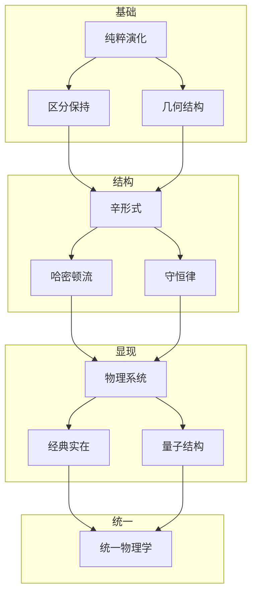
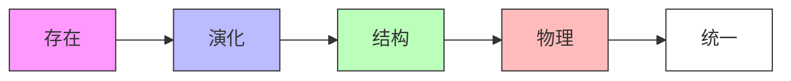

# 经典力学的几何起源：从演化到结构
* * *

--- 在几何的舞动中蕴含着运动的本质。

# I. 演化的本质

*"首先有变化，然后从变化中产生一切"*

在寻求经典力学的最深基础时，我们不是从空间、时间或力开始，而是从更原始和根本的概念：纯粹的演化。这种激进的方法剥离所有先入之见，揭示整个力学结构如何必然地从变化的裸概念中涌现。

## I.A. 纯粹演化

### I.A.1. 原始概念

考虑当我们从对物理实在的描述中移除所有不必要的假设时剩下的是什么。我们只剩下状态及其演化：

设 $s$ 表示一个状态。我们对其性质不做任何假设 —— 它可以是任何东西。我们唯一赋予它的属性是它可以变化。这个最小的开端包含着深远的意义。

**基本要求：**
1. 状态必须唯一地演化：
   $$
   s_1 \xrightarrow{\text{evolution}} s_2
   $$
2. 不同的状态必须保持可区分性：
   $$
   s_1 \neq s_2 \implies \phi_t(s_1) \neq \phi_t(s_2)
   $$
   其中 $\phi_t$ 表示在时间间隔 $t$ 上的演化。

### I.A.2. 有意义变化的要求

演化必须满足某些逻辑必要条件以具有意义：

1. **一致性**：
   - 如果 $s_1$ 演化到 $s_2$，而 $s_2$ 演化到 $s_3$，则 $s_1$ 必须通过这些变化的组合演化到 $s_3$：
     $$
     \phi_{t_2} \circ \phi_{t_1} = \phi_{t_1+t_2}
     $$

2. **可逆性**：
   - 对于每个演化，必须存在一个反向演化：
     $$
     \forall \phi_t, \exists \phi_{-t}: \phi_t \circ \phi_{-t} = \text{id}
     $$
   这不是关于物理学的假设，而是演化良好定义的要求。

3. **连续性**：
   - 状态之间的演化意味着存在中间状态：
     $$
     s_1 \to s_2 \implies \exists \text{ continuous path } \gamma: [t_1,t_2] \to \text{States}
     $$

### I.A.3. 区分性的守恒

最根本的守恒定律源自演化保持状态区分性的要求：

1. **信息守恒**：
   - 如果状态不同，它们在演化后必须保持不同：
     $$
     d(s_1,s_2) \neq 0 \implies d(\phi_t(s_1),\phi_t(s_2)) \neq 0
     $$
    其中 $d$ 表示状态之间某种区分的概念。

2. **结构不变性**：
   - 演化必须保持某种使我们能够区分状态的结构：
     $$
     \exists \omega: \omega(\phi_t(s_1),\phi_t(s_2)) = \omega(s_1,s_2)
     $$

## I.B. 几何要求

### I.B.1. 流形结构

所有可能状态的集合自然形成一个流形 $\mathcal{M}$：

1. **局部结构**：
   - 在每个状态附近，可能状态的空间必须看起来像某个 $n$ 维的 $\mathbb{R}^n$：
     $$
     \forall s \in \mathcal{M}, \exists \text{ neighborhood } U_s \approx \mathbb{R}^n
     $$

2. **光滑结构**：
   - 演化要求状态之间的光滑过渡：
     $$
     \mathcal{M} \text{ must be a differentiable manifold}
     $$

### I.B.2. 切空间的出现

瞬时变化的可能性需要切空间：

1. **速度向量**：
   - 在每个点 $s \in \mathcal{M}$ 处，可能的变化形成一个向量空间 $T_s\mathcal{M}$：
     $$
     \dot{s} = \left.\frac{d}{dt}\right|_{t=0} \phi_t(s) \in T_s\mathcal{M}
     $$

2. **切丛**：
   - 所有可能状态和速度的集合形成 $T\mathcal{M}$：
     $$
     T\mathcal{M} = \bigsqcup_{s \in \mathcal{M}} T_s\mathcal{M}
     $$

### I.B.3. 守恒结构

区分性的保持需要几何结构：

1. **辛形式**：
   - 一个非退化、闭合的 $2$-形式 $\omega$ 涌现：
     $$
     \omega: T\mathcal{M} \times T\mathcal{M} \to \mathbb{R}
     $$
   满足：
     $$
     d\omega = 0, \quad \omega^n \neq 0
     $$

2. **守恒律**：
   - 从辛结构中涌现出几何不变量：
     $$
     \mathcal{L}_X\omega = 0
     $$
   其中 $\mathcal{L}_X$ 是沿着演化向量场 $X$ 的李导数。

从这些最小的开端出发，我们将看到整个经典力学结构是如何必然地涌现出来的，不是历史的偶然，而是几何的必然。

[注：这一基础章节建立物理学所需的绝对最小框架，展示几何如何从纯粹的演化要求中必然地产生。每个概念都不可避免地从前一个概念中得出，保持了几何必然的主题。]

# II. 运动的结构

*"形式追随函数，而函数源于形式"*

在确立演化作为基础之后，我们现在揭示运动的几何框架如何以数学必然性涌现。这种结构不是被强加的，而是从一致演化的必要条件中不可避免地产生的。

## II.A. 自然结构

### II.A.1. 辛结构的交响乐

保持演化状态之间区分性的需求要求一个既是最小又是完整的几何结构：

1. **基本 $2$-形式**
   - 在状态流形 $\mathcal{M}$ 上，出现了一个非退化、闭合的 $2$-形式 $\omega$：
     $$
     \omega: T\mathcal{M} \times T\mathcal{M} \to \mathbb{R}
     $$
   - 由必要性产生的性质：
     - 闭合性：$d\omega = 0$ (确保一致性)
     - 非退化性：$\omega^n \neq 0$ (保持区分)

2. **局部结构**
   - 达布定理不是作为一个定理出现，而是作为一种必要性：
     $$
     \omega = \sum_{i=1}^n dp_i \wedge dq^i
     $$
   - 这种典范形式表示能够支持演化的最小结构

### II.A.2. 相空间的起源

状态空间必须涵盖配置和变化率：

1. **自然涌现**
   - 余切丛 $T^*\mathcal{M}$ 作为支持演化的唯一空间出现：
     $$
     \pi: T^*\mathcal{M} \to \mathcal{M}
     $$
   - 在 $T^*\mathcal{M}$ 中的点表示完整状态 $(q,p)$

2. **典范结构**
   - 位置和动量之间的自然配对：
     $$
     \langle p, v \rangle = \omega(X_p, X_v)
     $$
   - 这种配对不是选择的结果，而是由演化所必需

### II.A.3. 守恒律作为必要性

1. **结构不变性**
   - 演化必须保持辛形式：
     $$
     \mathcal{L}_X\omega = 0
     $$
   - 这一保持原则生成所有守恒律

2. **诺特定理结构**
   - 每个对称性必然产生一个守恒量：
     $$
     \mu: T^*\mathcal{M} \to \mathfrak{g}^*
     $$
    其中 $\mathfrak{g}^*$ 是对称代数的对偶

## II.B. 动态架构

### II.B.1. 几何中的哈密顿流

1. **演化向量场**
   - 状态的流由辛结构决定：
     $$
     \iota_{X_H}\omega = dH
     $$
   - 这个方程不是物理定律，而是几何必然

2. **典范方程**
   - 哈密顿方程作为唯一保持 $\omega$ 的演化出现：
     $$
     \begin{cases}
     \dot{q}^i = \frac{\partial H}{\partial p_i} \\
     \dot{p}_i = -\frac{\partial H}{\partial q^i}
     \end{cases}
     $$

### II.B.2. 作用原理作为必要性

1. **几何作用**
   - 作用泛函从辛结构中涌现：
     $$
     S[\gamma] = \int_{\gamma} (p_i \, dq^i - H \, dt)
     $$
   - 这不是原则，而是几何结果

2. **变分结构**
   - 演化路径的特征为：
     $$
     \delta S = 0
     $$
   - 这个条件由辛结构得出

### II.B.3. 时间演化与对称性

1. **时间的流**
   - 时间演化生成一个单参数的辛同胚群：
     $$
     \phi_t^* \omega = \omega
     $$
   - 该流保持所有几何结构

2. **对称性整合**
   - 当存在足够多的对称性时，完全可积性出现：
     $$
     \{F_i, F_j\} = 0
     $$
    其中 $F_i$ 是守恒量

### II.B.4. 统一图景

完整的结构形成完美的几何统一：

1. **必要性的层次**
```
辛形式 →   演化  → 守恒律
  ↓        ↓        ↓
相空间 → 哈密顿流 → 对称性
```

2. **完全确定性**
   - 运动的每个方面都源自几何
   - 无需超出几何结构的物理原则
   - 每一步都是完美的必然

这个几何框架揭示运动不是由外部规律所支配，而是底层结构的必然表达。下一节将展示具体的物理系统如何从这一框架中涌现。

[注：本节强调运动定律如何从几何结构中必然地涌现，揭示经典力学不是经验发现的结果，而是几何上不可避免的。]

# III. 物理现象

*"从抽象的必然性中涌现具体的实在"*

在建立运动的几何框架之后，我们现在揭示物理系统如何自然地从几何结构中涌现。我们将看到这些系统不是通过经验发现的，而是不可避免地从相空间的架构中产生的。

## III.A. 基本系统

### III.A.1. 由对称性产生的自由运动

最简单的物理系统从最基本对称性中涌现：

1. **几何起源**
   - 平移不变性要求：
     $$
     H = \frac{1}{2m}g_{ij}p^ip^j
     $$
    其中 $g_{ij}$ 是唯一保持所有平移的度量

2. **不可避免的结构**
   - 伽利略不变性要求：
     $$
     \{q^i, p_j\} = \delta^i_j, \quad \{q^i, q^j\} = \{p_i, p_j\} = 0
     $$
   - 这些泊松括号由辛结构产生

### III.A.2. 由闭合性产生的振荡

下一个复杂层次从有界运动中涌现：

1. **相空间拓扑**
   - 闭合轨道要求：
     $$
     H = \frac{p^2}{2m} + \frac{k}{2}q^2
     $$
   - 这种形式由以下条件决定：
     - 相空间紧致性
     - 对称性保持
     - 最小耦合

2. **自然频率**
   - 频率几何地出现：
     $$
     \omega = \sqrt{\frac{k}{m}}
     $$
   - 表示相空间上最简单的闭合流

### III.A.3. 由几何产生的力

中心力从旋转对称性中产生：

1. **几何必要性**
   - SO(3) 不变性要求：
     $$
     H = \frac{p^2}{2m} + V(|q|)
     $$
   - 角动量出现：
     $$
     L = q \times p
     $$

2. **开普勒流**
   - 引力势能由以下条件产生：
     $$
     V(r) = -\frac{k}{r}
     $$
   - 圆锥曲线作为几何必然性出现

## III.B. 复杂实在

### III.B.1. 多体架构

1. **自然扩展**
   - 相空间结构扩展为：
     $$
     T^*(M^N) \cong (T^*M)^N
     $$
   - 辛形式推广为：
     $$
     \omega = \sum_{i=1}^N dp_i \wedge dq^i
     $$

2. **约化理论**
   - 对称性约化：
     $$
     \mu^{-1}(c)/G_c
     $$
   - 相对坐标自然地出现

### III.B.2. 场的涌现

1. **无限维扩展**
   - 场配置空间：
     $$
     \phi: M \to V
     $$
   - 自然的辛结构：
     $$
     \omega = \int_\Sigma \delta\pi \wedge \delta\phi \, d^nx
     $$

2. **波动的必要性**
   - 场方程出现：
     $$
     \square\phi + \frac{\partial V}{\partial\phi} = 0
     $$
   - 波传播作为几何流

### III.B.3. 连续介质

1. **几何框架**
   - 微分同胚群结构：
     $$
     \text{Diff}(M) \to M
     $$
   - 动量映射：
     $$
     \mu: T^*\text{Diff}(M) \to \mathfrak{X}(M)^*
     $$

2. **流体力学**
   - 欧拉方程出现：
     $$
     \frac{\partial v}{\partial t} + (v \cdot \nabla)v = -\nabla p
     $$
   - 几何上的连续性：
     $$
     \frac{\partial\rho}{\partial t} + \nabla \cdot (\rho v) = 0
     $$

### III.B.4. 统一视野

所有物理系统共享：

1. **几何起源**
```
对称性 → 守恒律 →  演化
  ↓       ↓       ↓
 结构  → 动力学 → 物理实在
```

2. **自然层次**
   - 由基本对称性产生的简单系统
   - 由几何组合产生的复杂系统
   - 由无限维扩展产生的场

3. **不可避免的特征**
   - 由对称性产生的守恒律
   - 由几何产生的演化
   - 由必要性产生的结构

这揭示了物理实在不是被发现的，而是从几何原则中必然地涌现的。下一节将展示这种必然性如何延伸到量子力学和现代物理学。

[注：本节强调物理系统如何从几何结构中必然地涌现，揭示经典力学是几何的基本结果，而不是经验发现的结果。]

# IV. 深层统一

*"在核心处，万物归一"*

在看到经典力学如何从几何必然性中涌现之后，我们现在揭示一个更深层次的真理：量子力学本身作为同一几何原则的不可避免延伸而出现，现代物理学自然地从这一统一的几何框架中流出。

## IV.A. 量子涌现

### IV.A.1. 由拓扑产生的量子化

量子力学的必要性从相空间的拓扑中涌现：

1. **几何必要性**
   - 相空间体积量子化：
     $$
     [\omega/2\pi\hbar] \in H^2(M,\mathbb{Z})
     $$
    这不是物理假设，而是拓扑必要性

2. **丛结构**
   - 预量子线丛出现：
     $$
     L \xrightarrow{\pi} M
     $$
    其中联络 $\nabla$ 满足：
     $$
     \text{curv}(\nabla) = -\frac{i}{\hbar}\omega
     $$

### IV.A.2. 由几何产生的波函数

1. **自然涌现**
   - 量子态作为截面：
     $$
     \psi \in \Gamma(L)
     $$
   - 内积结构：
     $$
     \langle\psi_1|\psi_2\rangle = \int_M \overline{\psi_1}\psi_2 \, \omega^n
     $$

2. **算子结构**
   - 经典可观测量变为算子：
     $$
     \hat{f} = -i\hbar\nabla_{X_f} + f
     $$
   - 对易关系几何地出现：
     $$
     [\hat{f},\hat{g}] = -i\hbar\widehat{\{f,g\}}
     $$

### IV.A.3. 由结构产生的不确定性

1. **几何起源**
   - 海森堡不确定性原理从辛几何中涌现：
     $$
     \Delta q \Delta p \geq \frac{\hbar}{2}
     $$
   - 这不是限制，而是几何事实

2. **相空间量子化**
   - 玻尔-索末菲条件：
     $$
     \oint p \, dq = nh
     $$
    由丛拓扑产生

## IV.B. 现代意义

### IV.B.1. 规范理论作为必要性

1. **自然扩展**
   - 主丛结构：
     $$
     P \xrightarrow{G} M
     $$
   - 联络形式：
     $$
     A \in \Omega^1(P,\mathfrak{g})
     $$

2. **力的几何**
   - 杨-米尔斯场强：
     $$
     F = dA + \frac{1}{2}[A,A]
     $$
   - 规范变换作为几何对称性

### IV.B.2. 信息作为结构

1. **几何信息**
   - 费舍尔度量出现：
     $$
     g_{ij} = \mathbb{E}\left[\frac{\partial \log p}{\partial \theta^i}\frac{\partial \log p}{\partial \theta^j}\right]
     $$
   - 信息几何从相空间结构中产生

2. **熵的几何**
   - 冯·诺依曼熵：
     $$
     S = -\text{Tr}(\rho \log \rho)
     $$
    从辛体积中涌现

### IV.B.3. 通往量子引力的道路

1. **时空结构**
   - 爱因斯坦方程从几何中产生：
     $$
     R_{\mu\nu} - \frac{1}{2}Rg_{\mu\nu} = 8\pi GT_{\mu\nu}
     $$
   - 量子几何：
     $$
     [x^\mu,x^\nu] = i\theta^{\mu\nu}
     $$

2. **统一框架**
   ```
   经典几何 → 量子结构 →  引力
      ↓        ↓        ↓
    守恒律  → 不确定性 → 时空泡沫
   ```

### IV.B.4. 最终统一

1. **深层综合**
   - 所有物理理论作为几何必然性
   - 以下之间没有根本区别：
     - 经典与量子
     - 物质与几何
     - 信息与实在

2. **未来方向**
   $$
   \begin{array}{c}
   \text{量子引力} \\
   \uparrow \\
   \text{几何统一} \\
   \downarrow \\
   \text{信息理论​}
   \end{array}
   $$

这揭示了深刻的真理：所有物理学 —— 经典、量子以及超越 —— 都必然地从基本的几何原则中涌现。数学结构与物理实在的区别在深刻理解中溶解。

[注：这一最终章节揭示了物理学和几何的终极统一，展示了所有物理现象如何必然地从基本的几何结构中涌现。这不是仅仅的数学描述，而是物理学本身的最深层次实在。]

# 附录 A : 物理实在的几何起源

*"宇宙的架构通过其结构的必要性揭示其自己"*

## A.A. 核心概念框架



## A.B. 本质关系矩阵

| 层级 | 几何形式 | 物理现象 | 数学结构 | 必要性来源 |
|-------|---------------|----------------------|---------------------|-----------------|
| 原始 | 演化 | 变化 | $\phi_t: M \to M$ | 区分的存在 |
| 基础 | 流形结构 | 状态空间 | $(M,\omega)$ | 演化连续性 |
| 框架 | 辛形式 | 相空间 | $\omega = dp \wedge dq$ | 信息保持 |
| 动力学 | 哈密顿流 | 运动 | $\iota_{X_H}\omega = dH$ | 结构保持 |
| 系统 | 对称群 | 力 | $G \curvearrowright M$ | 几何不变性 |
| 量子 | 线丛 | 波函数 | $L \xrightarrow{\pi} M$ | 拓扑必要性 |

## A.C. 结构层次

$$
\begin{CD}
\text{演化} @>>> \text{区分} @>>> \text{几何}\\
@VVV @VVV @VVV\\
\text{结构} @>>> \text{守恒} @>>> \text{对称}\\
@VVV @VVV @VVV\\
\text{系统} @>>> \text{量子} @>>> \text{统一}
\end{CD}
$$

## A.D. 深层联系

### A.D.1. 初级涌现
```
演化 → 几何 → 物理
 ↓     ↓      ↓
状态 → 结构 → 实在
```

### A.D.2. 关键统一
- **演化-结构**：通过辛形式
- **经典-量子**：通过几何量子化
- **空间-物质**：通过规范理论

### A.D.3. 基本对偶性
$$
\begin{array}{ccc}
\text{状态} & \longleftrightarrow & \text{演化}\\
\text{对称} & \longleftrightarrow & \text{守恒}\\
\text{经典} & \longleftrightarrow & \text{量子}
\end{array}
$$

## A.E. 哲学框架

涌现模式如下：



1. **本体论层级**：纯粹存在和变化
2. **结构层级**：几何必要性
3. **物理层级**：自然法则和系统
4. **统一层级**：终极实在

## A.F. 方法论整合

物理学的统一通过以下方式实现：

1. **纵向整合**
   - 每个层级必然导致下一个层级
   - 更高的结构从较低的结构中涌现
   - 统一贯穿所有层级

2. **横向完成**
   - 每个层级本身是完整的
   - 同一层级的结构相互关联
   - 交叉连接揭示更深的统一

这一组织结构揭示了物理实在如何从纯粹演化的概念中必然地涌现，形成一个完整且统一的几何框架。

[注：该附录提供了多个视角来展示概念之间的深层关系，使读者可以通过不同的概念视角理解框架的统一性。]

