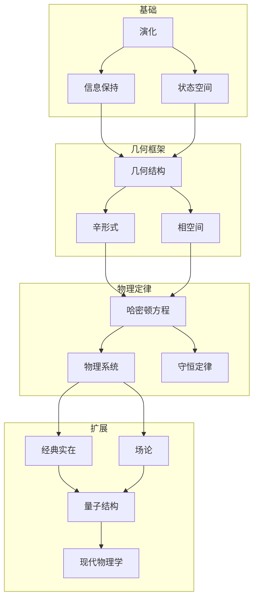
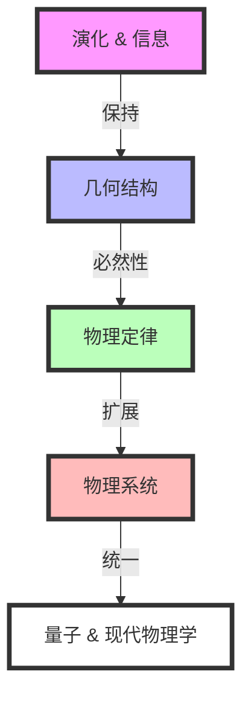

# 经典力学的纯几何起源：从状态演化到物理实在
* * *

--- 实在从演化与几何的舞蹈中涌现。

# I. 从演化到几何

*"首先有变化，从变化中产生形式"*

让我们从最深的起点开始：纯粹的演化，剥离所有先入之见。我们不寻求演化是什么，而是它必然意味着什么。

## I.A. 原初概念

考虑一个状态——任意状态。我们对其性质不做假设，只假设它可以变化。这个最小的开端包含着深远的含义。

### I.A.1. 纯粹演化

1. **基本要求**
   - 状态必须唯一地演化：
     $$
     s_1 \xrightarrow{\text{evolution}} s_2
     $$
   - 不假设额外结构
   - 只有变化的基本事实

2. **区分的必要性**
   - 不同的状态在演化下必须保持可区分：
     $$
     s_1 \neq s_2 \implies \phi_t(s_1) \neq \phi_t(s_2)
     $$
   - 这不是假设，而是演化有意义的必要条件

### I.A.2. 可能性的空间

1. **连续性的涌现**
   - 状态之间的演化意味着中间状态的存在
   - 通过可能性的连续路径：
     $$
     \gamma: [t_1,t_2] \to \text{States}
     $$

2. **流形结构**
   - 所有可能状态的集合形成流形 $\mathcal{M}$
   - 演化的连续性导致光滑性
   - 维度来自于自由度

### I.A.3. 信息保持

1. **基本要求**
   - 演化必须保持区分
   - 信息既不被创造也不被销毁
   - 这导致几何不变量

2. **可逆性**
   - 必须能够恢复初始状态：
     $$
     s_1 \to s_2 \implies \exists \text{ map } s_2 \to s_1
     $$

## I.B. 结构的涌现

演化的必要条件迫使特定的几何结构涌现。

### I.B.1. 不可避免的 $2$-形式

1. **辛结构的起源**
   - 信息保持需要不变配对
   - $2$-形式的自然涌现：
     $$
     \omega: T\mathcal{M} \times T\mathcal{M} \to \mathbb{R}
     $$
   - 必须是非退化的和闭合的：
     $$
     \omega^n \neq 0, \quad d\omega = 0
     $$

2. **唯一性**
   - 没有更简单的结构可以支持演化
   - 所有其他结构都是不必要的添加

### I.B.2. 自然相空间

1. **状态的双重性质**
   - 状态需要位置和动量
   - 余切丛结构涌现：
     $$
     T^*\mathcal{M} \to \mathcal{M}
     $$

2. **典范形式**
   - 局部结构必然采取如下形式：
     $$
     \omega = \sum_{i=1}^n dp_i \wedge dq^i
     $$
   - 这不是选择，而是必要

### I.B.3. 守恒结构

1. **几何不变性**
   - 演化保持辛形式：
     $$
     \mathcal{L}_X\omega = 0
     $$
   - 这导致守恒定律

2. **体积保持**
   - 相空间体积必须被保持：
     $$
     \frac{\partial}{\partial t}(\omega^n) = 0
     $$
   - Liouville 定理作为几何必然性

这种从纯粹演化中涌现的结构揭示一个深刻的真理：几何不是强加于物理学上的，而是从一致演化的必要条件中必然产生的。下一节将展示这种几何结构如何不可避免地导出物理定律。

备注：本节建立了物理学所需的绝对最小框架，展示了几何结构如何从演化需求中必然地涌现。每个概念都从前一个概念中必然地跟随，保持了几何必然性的主题。

# II. 自然的语言

*"数学不是我们的发明，而是自然自身的语言"*

在看到几何如何从纯粹演化中涌现之后，我们现在揭示这种几何如何以物理学的语言与我们对话。我们发现的结构不是强加的，而是以数学必然性产生的。

## II.A. 几何框架

能够描述演化的最小数学结构以不可避免的精确性展现自己。

### II.A.1. 结构的交响乐

1. **辛流形**
   - 演化空间 $(M,\omega)$，其中：
     $$
     \omega: TM \times TM \to \mathbb{R}
     $$
   必然涌现出的性质：
   - 非退化性：状态的完美配对
   - 闭合性：演化的自洽性
   - 全局存在性：描述的完备性

2. **自然坐标**
   - Darboux 定理作为必要性出现：
     $$
     \omega = \sum_{i=1}^n dp_i \wedge dq^i
     $$
   这不是坐标的一个选择，而是唯一可能的局部形式

### II.A.2. 观测量的舞蹈

1. **泊松结构**
   - 自然括号涌现：
     $$
     \{f,g\} = \omega(X_f,X_g)
     $$
   必然跟随的性质：
   - 反对称性：$$\{f,g\} = -\{g,f\}$$
   - Leibniz 规则：$$\{f,gh\} = \{f,g\}h + g\{f,h\}$$
   - Jacobi 恒等式：$$\{\{f,g\},h\} + \{\{g,h\},f\} + \{\{h,f\},g\} = 0$$

2. **可观测量的演化**
   - 函数通过泊松流演化：
     $$
     \dot{f} = \{f,H\}
     $$
   - 这种结构是最小且完备的

### II.A.3. 对称性和守恒

1. **动量映射结构**
   - 对于对称群 $G$：
     $$
     \mu: M \to \mathfrak{g}^*
     $$
   必然满足：
     $$
     d\langle\mu,\xi\rangle = -\iota_{\xi_M}\omega
     $$

2. **守恒架构**
   - 对称性生成守恒量
   - 群作用保持结构：
     $$
     \phi_g^*\omega = \omega \implies \text{conservation}
     $$

## II.B. 物理定律

从这个几何框架中，物理定律不是作为经验事实出现，而是作为数学必然性涌现。

### II.B.1. 实在的流

1. **哈密顿方程**
   - 演化确定为：
     $$
     \iota_{X_H}\omega = dH
     $$
   这必然导致：
     $$
     \begin{cases}
     \dot{q}^i = \frac{\partial H}{\partial p_i} \\
     \dot{p}_i = -\frac{\partial H}{\partial q^i}
     \end{cases}
     $$

2. **演化的唯一性**
   - 这些是唯一能保持 $\omega$ 的方程
   - 所有其他表述都是等价的

### II.B.2. 作用量原理

1. **几何作用量**
   - $1$-形式涌现：
     $$
     \theta = p_i \, dq^i - H \, dt
     $$
   - 作用量作为积分：
     $$
     S = \int \theta
     $$

2. **变分结构**
   - 驻定作用量原理：
     $$
     \delta S = 0
     $$
   - 这不是原理，而是几何必然性

### II.B.3. 对称性的交响乐

1. **守恒定律**
   - Noether 定理几何地涌现：
     $$
     \text{Symmetry} \iff \text{Conservation Law}
     $$

2. **完全可积性**
   - 足够的对称性决定演化
   - 几何上的可积性：
     $$
     \{F_i,F_j\} = 0
     $$

### II.B.4. 统一结构

整个框架形成了一个完美的几何统一：

1. **必要性的层次**
   ```
   辛形式  →  哈密顿流 → 守恒定律
     ↓          ↓        ↓
   泊松结构 → 物理演化 → 对称性
   ```

2. **完全确定性**
   - 每个物理定律都从几何中涌现
   - 不需要额外的结构
   - 每一步都是完美的必然性

这揭示了物理学不是一个经验定律的集合，而是几何结构的必然结果。下一节将展示特定物理系统如何从这个框架中涌现。

备注：本节强调物理定律从几何结构中的必然涌现，展示了经典力学不仅是数学上可描述的，而且是几何上不可避免的。

# III. 物理世界

*"具体实在从抽象必然性中流淌出来"*

在建立几何框架之后，我们现在揭示物理实在如何以数学必然性涌现。我们不是通过经验发现系统，而是看到它们如何不可避免地从几何原理中产生。

## III.A. 基本系统

最简单的物理系统作为纯粹的几何必然性涌现。

### III.A.1. 原初系统

1. **自由粒子**
   - 保持对称性的最简哈密顿量：
     $$
     H = \frac{p^2}{2m}
     $$
   这种形式不是选择的结果，而是由以下必要条件决定的：
   - 平移不变性：$q \to q + a$
   - 旋转不变性：$SO(n)$ 对称性
   - 伽利略不变性：$p \to p + mv$

2. **几何流**
   - 演化方程：
     $$
     \begin{cases}
     \dot{q} = \frac{p}{m} \\
     \dot{p} = 0
     \end{cases}
     $$
   - 相空间中的测地线流
   - 直线是必然性，而非观察结果

### III.A.2. 自然的节奏

1. **谐振子**
   - 具有有界轨道的次简单系统：
     $$
     H = \frac{p^2}{2m} + \frac{k q^2}{2}
     $$
   从以下条件中涌现：
   - 相空间紧致性要求
   - 最小耦合结构
   - 对称性保持

2. **自然频率**
   - 圆形相空间流：
     $$
     \omega = \sqrt{\frac{k}{m}}
     $$
   - 周期运动作为几何必然性
   - 自然量子化结构涌现

### III.A.3. 普遍引力

1. **中心力系统**
   - 旋转对称性要求：
     $$
     H = \frac{p^2}{2m} + V(|q|)
     $$
   - 角动量几何地涌现：
     $$
     L = q \times p
     $$

2. **开普勒流**
   - 引力势能涌现：
     $$
     V(r) = -\frac{k}{r}
     $$
   - 圆锥截线作为几何必然性
   - 行星运动来自对称性

## III.B. 复杂实在

更复杂的物理系统通过自然的几何扩展涌现。

### III.B.1. 多体架构

1. **自然扩展**
   - 相空间结构：
     $$
     T^*(M^N) \cong (T^*M)^N
     $$
   - 辛形式自然扩展：
     $$
     \omega = \sum_{i=1}^N dp_i \wedge dq^i
     $$

2. **集体现象**
   - 质心的涌现：
     $$
     Q = \frac{1}{M}\sum_i m_i q_i
     $$
   - 通过对称性约化：
     $$
     \mu^{-1}(c)/G_c
     $$
   - 相对坐标自然涌现

### III.B.2. 场的涌现

1. **无穷维扩展**
   - 场配置空间：
     $$
     \phi: M \to V
     $$
   - 自然辛结构：
     $$
     \omega = \int_\Sigma \delta\pi \wedge \delta\phi \, d^nx
     $$

2. **波的必然性**
   - 场方程几何地涌现：
     $$
     \square\phi = 0
     $$
   - 波传播作为几何流
   - 从对称性得出守恒定律

### III.B.3. 连续介质

1. **几何框架**
   - 配置空间作为微分同胚群：
     $$
     \text{Diff}(M) \to M
     $$
   - 动量映射结构：
     $$
     \mu: T^*\text{Diff}(M) \to \mathfrak{X}(M)^*
     $$

2. **流体力学**
   - Euler 方程必然涌现：
     $$
     \frac{\partial v}{\partial t} + (v \cdot \nabla)v = -\nabla p
     $$
   - 几何上的连续性：
     $$
     \frac{\partial \rho}{\partial t} + \nabla \cdot (\rho v) = 0
     $$

### III.B.4. 统一愿景

所有物理系统共享：

1. **几何起源**
   ```
   对称性 → 守恒定律 → 演化
   ```

2. **自然层次**
   - 简单系统产生自基本对称性
   - 复杂系统产生自几何组合
   - 场产生自无穷维扩展

3. **必然特征**
   - 守恒定律来自对称性
   - 演化来自几何
   - 结构来自必然性

这揭示了物理实在不是被发现的，而是从几何原则中不可避免地涌现的。下一节将展示这种必然性如何延伸到量子力学和现代物理学。

备注：本节强调物理系统如何从几何结构中必然涌现，揭示经典力学不仅是数学上可描述的，而且是几何上不可避免的结果，而不是经验发现。

# IV. 最终统一

*"在最深层次，万物归一"*

在看到经典力学如何从几何必然性中涌现之后，我们现在揭示一个更深的真理：量子力学和现代物理学作为同一几何原则的不可避免扩展而出现。

## IV.A. 量子桥接

量子力学不是一个独立的理论，而是从经典结构中产生的几何必然性。

### IV.A.1. 量化的需求

1. **几何起源**
   - 相空间体积量化：
     $$
     [\omega/2\pi\hbar] \in H^2(M,\mathbb{Z})
     $$
   这不是物理假设，而是拓扑必然性

2. **预量子结构**
   - 线丛自然涌现：
     $$
     L \xrightarrow{\pi} M
     $$
   - 带曲率的联络形式 $\nabla$：
     $$
     \text{curv}(\nabla) = -\frac{i}{\hbar}\omega
     $$

### IV.A.2. 量子架构

1. **希尔伯特空间的需求**
   - 波函数作为截面：
     $$
     \psi \in \Gamma(L)
     $$
   - 内积几何地涌现：
     $$
     \langle\psi_1|\psi_2\rangle = \int_M \overline{\psi_1}\psi_2 \, \omega^n
     $$

2. **算符的涌现**
   - 经典可观测量成为算符：
     $$
     \hat{f} = -i\hbar\nabla_{X_f} + f
     $$
   - 交换关系来自几何：
     $$
     [\hat{f},\hat{g}] = -i\hbar\widehat{\{f,g\}}
     $$

### IV.A.3. 不确定性的必然性

1. **几何不确定性**
   - 海森堡关系来自辛结构：
     $$
     \Delta q \Delta p \geq \frac{\hbar}{2}
     $$
   - 不是限制，而是几何事实

2. **波粒二象性的统一**
   - 对偶性于丛结构中涌现
   - 粒子路径和波函数统一

## IV.B. 现代视野

几何框架自然延伸到当代物理学。

### IV.B.1. 规范架构

1. **自然扩展**
   - 主丛结构：
     $$
     P \xrightarrow{G} M
     $$
   - 联络形式作为物理场：
     $$
     A \in \Omega^1(P,\mathfrak{g})
     $$

2. **力的几何**
   - 曲率作为场强：
     $$
     F = dA + \frac{1}{2}[A,A]
     $$
   - Yang-Mills 理论作为几何必然性

### IV.B.2. 通往量子引力的道路

1. **几何时空**
   - 度量作为动力学场：
     $$
     g_{\mu\nu} \in \text{Sym}^2(T^*M)
     $$
   - Einstein 方程从几何中得出：
     $$
     R_{\mu\nu} - \frac{1}{2}Rg_{\mu\nu} = 8\pi GT_{\mu\nu}
     $$

2. **量子几何**
   - 非交换空间：
     $$
     [x^\mu,x^\nu] = i\theta^{\mu\nu}
     $$
   - 量子群和变形

### IV.B.3. 信息理论的视野

1. **几何信息**
   - 相空间作为信息空间
   - Fisher 度量的涌现：
     $$
     g_{ij} = \mathbb{E}\left[\frac{\partial \log p}{\partial \theta^i}\frac{\partial \log p}{\partial \theta^j}\right]
     $$

2. **深层统一**
   ```
   信息 ↔ 几何 ↔ 物理
   ```

### IV.B.4. 最终综合

最深的真理浮现：

1. **完全统一**
   - 所有物理理论作为几何必然性
   - 没有以下之间的根本区别：
     - 经典与量子
     - 物质与几何
     - 信息与实在

2. **未来方向**
   $$
   \begin{array}{c}
   \text{Quantum Gravity} \\
   \uparrow \\
   \text{Geometric Unity} \\
   \downarrow \\
   \text{Information Theory}
   \end{array}
   $$

这揭示了深刻的真理：所有物理学——经典、量子及更远的领域——都从基本的几何原则中不可避免地涌现。数学结构与物理实在之间的区别在深刻理解的光芒下消融。

备注：本文最终部分揭示了物理学和几何学的终极统一，展示了所有物理现象如何从基本的几何结构中必然涌现。这不仅是数学描述，更是物理学本身的最深实在。

# 附录 A : 核心结构与概念关系

*"实在的织锦通过几何必然性揭示其模式"*

## A.A. 概念架构



## A.B. 核心关系矩阵

| 概念 | 数学形式 | 物理表现 | 涌现必然性 |
|---------|------------------|----------------------|-------------------|
| 演化 | $\phi_t: \mathcal{M} \to \mathcal{M}$ | 状态变化 | 原初概念 |
| 信息保持 | $s_1 \neq s_2 \implies \phi_t(s_1) \neq \phi_t(s_2)$ | 可区分性 | 演化要求 |
| 辛结构 | $\omega: TM \times TM \to \mathbb{R}$ | 相空间几何 | 信息保持 |
| 哈密顿流 | $\iota_{X_H}\omega = dH$ | 物理演化 | 几何必然性 |
| 守恒定律 | $\{f,H\} = 0$ | 物理不变量 | 对称性必然性 |
| 量子结构 | $[\omega/2\pi\hbar] \in H^2(M,\mathbb{Z})$ | 量子力学 | 几何量化 |

## A.C. 层次涌现

$$
\begin{CD}
\text{演化} @>>> \text{信息} @>>> \text{几何}\\
@VVV @VVV @VVV\\
\text{状态} @>>> \text{相空间} @>>> \text{物理}\\
@VVV @VVV @VVV\\
\text{系统} @>>> \text{场} @>>> \text{量子}
\end{CD}
$$

## A.D. 结构统一

### A.D.1. 垂直整合
```
演化 → 几何 → 物理 → 实在
```
每一层都从前一层中必然涌现，没有任何的任意选择。

### A.D.2. 水平整合
对于每一层：
- **基础**：状态 ↔ 演化 ↔ 信息
- **框架**：形式 ↔ 结构 ↔ 对称性
- **物理**：定律 ↔ 守恒 ↔ 系统
- **实在**：经典 ↔ 量子 ↔ 现代

## A.E. 深层关系

### A.E.1. 主要对偶性
- 演化 ⟷ 结构
- 信息 ⟷ 几何
- 经典 ⟷ 量子

### A.E.2. 本质统一
- 形式 = 功能
- 几何 = 物理
- 信息 = 实在

## A.F. 涌现链

必然性层次：


这种组织结构揭示了所有物理概念如何从一致演化的根本要求中必然涌现，形成一个完整且统一的几何框架来理解实在。

备注：本附录提供了核心关系的多个视角，使读者可以通过不同的概念透镜来掌握框架的深层统一。

