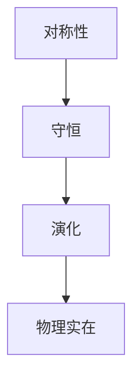
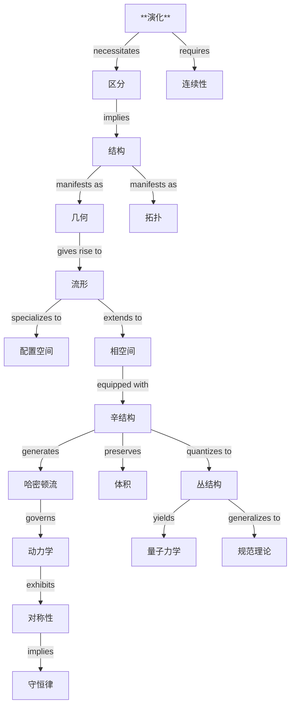

# 经典力学：从原始原理到几何和谐
* * *

--- 在演化的舞蹈中蕴含着力学的本质。

# 第一章：力学的起源
*"从单一产生多样"*

在力、空间和时间本身面前，存在一个更为根本的概念：**演化**。在寻求力学最深层次的基础时，我们不是从牛顿定律或哈密顿方程开始，而是从变化的基本概念出发。从这个原始的想法中，我们将看到整个经典力学结构如何以数学上的必然性涌现。

## 1.1 原始概念：演化

### 1.1.1 演化作为基础

考虑当我们从对物理实在的描述中剥离所有假设后剩下的是什么。我们只剩下这一点：**状态可以改变**。让我们用 $s$ 表示一个状态，不对其性质作任意假设。我们唯一赋予 $s$ 的属性是它可以演化为其他状态。

这种最小的开端包含深远的意义：
1. **唯一性**：每个状态必须唯一地演化
   $$
   s_1 \xrightarrow{\text{evolution}} s_2
   $$
2. **区分性**：不同的状态必须保持可区分
   $$
   s_1 \neq s_2 \implies \phi_t(s_1) \neq \phi_t(s_2)
   $$
    其中 $\phi_t$ 表示时间间隔 $t$ 内的演化。

### 1.1.2 有意义演化的必要条件

演化必须满足某些逻辑上的必要条件才有意义：

1. **一致性**：
   - 如果 $s_1$ 演化到 $s_2$，而 $s_2$ 演化到 $s_3$，则 $s_1$ 必须通过组合演化到 $s_3$：
     $$
     \phi_{t_2} \circ \phi_{t_1} = \phi_{t_1+t_2}
     $$

2. **可逆性**：
   - 对于每次演化，必须存在一个逆向演化：
     $$
     \forall \phi_t, \exists \phi_{-t}: \phi_t \circ \phi_{-t} = \text{id}
     $$
    这不是关于物理学的假设，而是演化被良好定义的要求。

3. **连续性**：
   - 状态之间的演化意味着存在中间状态：
     $$
     s_1 \to s_2 \implies \exists \text{ continuous path } \gamma: [t_1,t_2] \to \text{States}
     $$

### 1.1.3 区分保持的必要性

最根本的守恒律从演化必须保持状态区分性的要求中产生：

1. **信息保持**：
   - 如果状态不同，它们在演化下必须保持不同：
     $$
     d(s_1,s_2) \neq 0 \implies d(\phi_t(s_1),\phi_t(s_2)) \neq 0
     $$
    其中 $d$ 表示状态之间某种区分度量。

2. **结构不变性**：
   - 演化必须保持某种使我们能够区分状态的结构：
     $$
     \exists \omega: \omega(\phi_t(s_1),\phi_t(s_2)) = \omega(s_1,s_2)
     $$

## 1.2 结构的涌现

### 1.2.1 几何必要性

演化的必要条件迫使几何结构的涌现：

1. **局部结构**：
   - 在每个状态附近，可能的状态空间必须看起来像某个 $n$ 维的 $\mathbb{R}^n$：
     $$
     \forall s \in \mathcal{M}, \exists \text{ neighborhood } U_s \approx \mathbb{R}^n
     $$

2. **流形结构**：
   - 所有可能状态的集合自然形成一个流形 $\mathcal{M}$：
     $$
     \mathcal{M} \text{ must be a differentiable manifold}
     $$

3. **度量结构**：
   - 保持区分性需要一种测量状态间“距离”的方法：
     $$
     g: T\mathcal{M} \times T\mathcal{M} \to \mathbb{R}
     $$

### 1.2.2 配置空间作为可能性空间

配置空间 $\mathcal{M}$ 作为所有可能状态的空间涌现：

1. **坐标**：
   - 局部坐标 $(q^1,\ldots,q^n)$ 描述 $\mathcal{M}$ 中的状态
   - 这些成为力学中的“广义坐标”

2. **切空间**：
   - 在每个点 $s \in \mathcal{M}$ 处，切空间 $T_s\mathcal{M}$ 表示可能的瞬时变化：
     $$
     \dot{s} = \left.\frac{d}{dt}\right|_{t=0} \phi_t(s) \in T_s\mathcal{M}
     $$

### 1.2.3 相空间作为演化空间

演化的必要条件迫使相空间的涌现：

1. **余切丛**：
   - 相空间 $T^*\mathcal{M}$ 自然涌现为包含状态及其变化率的空间：
     $$
     T^*\mathcal{M} = \bigsqcup_{s \in \mathcal{M}} T^*_s\mathcal{M}
     $$

2. **辛结构**：
   - 保持区分性需要一个辛形式 $\omega$：
     $$
     \omega = \sum_i dp_i \wedge dq^i
     $$
    这种结构将支配所有的力学。

### 1.2.4 结构的统一性

这些结构不是任意的，而是从演化的必要条件中必然涌现：
1. 配置空间源于状态的可能性
2. 相空间源于演化的必要性
3. 辛结构源于区分性的保持

这揭示了力学不仅仅是一系列方程的集合，而是演化的必然结果。

[备注：本章建立了整个经典力学的基础，展示了其结构如何从演化的纯粹概念中必然涌现。下一章将展示这些结构如何产生熟悉的运动定律。]

# 第二章：运动的架构
*"形式追随函数，函数决定形式"*

在确立演化作为基础并见证几何结构的涌现之后，我们现在揭示运动的架构如何必然地从这些基础中产生。演化的几何本身决定物理运动的形式。

## 2.1 演化的几何

### 2.1.1 辛结构的必要性

演化过程中保持区分性的要求需要一种能够维持状态区分能力的几何结构。这一必要性唯一地导致了**辛结构**。

1. **基本 $2$-形式**：
   辛形式 $\omega$ 涌现为：
   $$
   \omega = \sum_i dp_i \wedge dq^i
   $$
   这不是一个选择而是一个必要性，源于：
   - 保持状态之间区分性的要求
   - 位置和变化率之间非退化配对的需求
   - 演化可逆性的必要性

2. **结构性质**：
   形式 $\omega$ 必须满足：
   $$
   d\omega = 0 \quad \text{(closure)}
   $$
   $$
   \omega^n \neq 0 \quad \text{(non-degeneracy)}
   $$
    这些性质源自演化的必要条件，而非物理假设。

### 2.1.2 几何中的守恒律

辛结构必然蕴含守恒律：

1. **体积保持**：
   Liouville 体积形式
   $$
   \Omega = \frac{\omega^n}{n!}
   $$
   必须在演化下保持不变：
   $$
   \mathcal{L}_X\Omega = 0
   $$
   这不是一条物理定律而是一个几何必要性。

2. **面积保持**：
   在每个辛平面 $(q^i,p_i)$ 中，面积是保持不变的：
   $$
   \int_{\gamma} p_i \, dq^i = \text{invariant}
   $$
   这导致作用量守恒和量化条件。

### 2.1.3 作用量的涌现

作用量原理从辛结构中涌现：

1. **作用量泛函**：
   $$
   S[\gamma] = \int_\gamma \theta
   $$
    其中 $\theta = \sum_i p_i \, dq^i$ 是典范 $1$-形式，满足
   $$
   d\theta = \omega
   $$

2. **极值的必要性**：
   演化路径必须使 $S[\gamma]$ 极值化因为：
   - 只有极值路径能保持区分性
   - 辛结构要求驻定性
   - 演化的一致性要求最小作用量

## 2.2 流与不变性

### 2.2.1 哈密顿流作为自然演化

相空间的几何结构迫使哈密顿流：

1. **向量场生成**：
   对于任意函数 $H$，辛形式生成唯一的向量场 $X_H$：
   $$
   \iota_{X_H}\omega = -dH
   $$
   这是保持辛结构的唯一方式。

2. **演化方程**：
   哈密顿方程几何地涌现：
   $$
   \dot{q}^i = \frac{\partial H}{\partial p_i}, \quad \dot{p}_i = -\frac{\partial H}{\partial q^i}
   $$
   这些不是物理定律而是几何必要性。

### 2.2.2 对称性作为必要性

对称性从演化的结构中涌现：

1. **几何对称性**：
   - 相空间变换 $\phi$ 必须保持 $\omega$：
     $$
     \phi^*\omega = \omega
     $$
   - 这些形成正则变换群

2. **生成元结构**：
   每个对称性都有一个生成元 $G$ 满足：
   $$
   \{G,H\} = 0
   $$
   其中 $\{-,-\}$ 是由 $\omega$ 诱导的泊松括号

### 2.2.3 守恒律作为结构

守恒律从对称性中涌现：

1. **诺特定理作为必要性**：
   - 每个连续对称性意味着一个守恒量
   - 守恒性源自几何而非物理

2. **基本守恒律**：
   - 时间平移下的能量守恒：
     $$
     \frac{dH}{dt} = \{H,H\} = 0
     $$
   - 空间平移下的动量守恒：
     $$
     \frac{dp_i}{dt} = \{p_i,H\} = 0
     $$
   - 旋转下的角动量守恒：
     $$
     \frac{dL}{dt} = \{L,H\} = 0
     $$

### 2.2.4 演化的统一性

这揭示了运动的深刻统一性：

1. **几何必要性**：
   - 所有运动方面都从演化要求中涌现
   - 除了演化本身外不需要任意物理假设

2. **结构层次**：
   ```
   演化   → 辛形式 → 哈密顿流
    ↓        ↓        ↓
   区分性 → 守恒律 → 物理运动
   ```

3. **普遍架构**：
   - 同一结构支配所有力学系统
   - 不同的哈密顿量代表不同的系统
   - 底层几何保持不变

[备注：本章揭示了运动的架构如何从演化的必要要求中必然涌现。下一章将展示具体的物理系统如何从这个几何框架中产生。]

# 第三章：物理系统作为几何必要性
*"简单中蕴含深刻"*

在确立运动的几何架构之后，我们现在揭示物理系统如何必然地从这一结构中涌现。这些基本的物理系统并非通过经验发现，而是作为对称性和拓扑的几何必要性而出现。

## 3.1 基本系统

### 3.1.1 对称性中的自由运动

最简单的物理系统从最大对称性中涌现：

1. **平移不变性**：
   - 空间均匀性的要求迫使：
     $$
     H = \frac{1}{2m}g_{ij}p^ip^j
     $$
    其中 $g_{ij}$ 是唯一保持所有平移的度量。

2. **动量守恒**：
   - 辛结构要求：
     $$
     \{q^i, p_j\} = \delta^i_j, \quad \{q^i, q^j\} = \{p_i, p_j\} = 0
     $$
   - 这些括号不是来自物理学而是来自几何学。

3. **测地线运动**：
   - 自由路径是自然度量的测地线：
     $$
     \ddot{q}^i + \Gamma^i_{jk}\dot{q}^j\dot{q}^k = 0
     $$
    这是几何必要性，而非物理定律。

### 3.1.2 拓扑封闭中的振荡

周期运动从相空间拓扑中涌现：

1. **封闭轨道**：
   - 相空间中最简单的封闭轨迹需要：
     $$
     H = \frac{p^2}{2m} + \frac{k}{2}q^2
     $$
    这种形式是由：
     - 相空间紧致性
     - 对称性保持
     - 最小耦合

2. **自然频率**：
   - 频率几何地涌现：
     $$
     \omega = \sqrt{\frac{k}{m}}
     $$
    表示相空间上最简单的封闭流。

3. **作用-角度变量**：
   - 自然坐标为：
     $$
     I = \oint p\,dq, \quad \theta = \omega t
     $$
    揭示振荡的内在结构。

### 3.1.3 旋转不变性中的中心力

球对称性迫使中心力：

1. **角动量**：
   - 旋转不变性要求：
     $$
     L = q \times p
     $$
    作为旋转的生成元。

2. **势能形式**：
   - 对称性限制势能：
     $$
     V(q) = V(|q|)
     $$
    这是几何必要性，而非选择。

3. **开普勒流**：
   - 引力势：
     $$
     V(r) = -\frac{k}{r}
     $$
    从共形对称性中涌现。

## 3.2 复杂系统

### 3.2.1 多体架构

1. **相空间结构**：
   - 对于 N 个粒子：
     $$
     T^*(M^N) \cong (T^*M)^N
     $$
    辛形式为：
     $$
     \omega = \sum_{i=1}^N dp_i \wedge dq^i
     $$

2. **约化理论**：
   - 对称性约化：
     $$
     \mu^{-1}(c)/G_c
     $$
    其中 $G_c$ 是各向同性群。

3. **相对运动**：
   - 质心分解：
     $$
     H = H_{CM} + H_{rel}
     $$
    从平移不变性中涌现。

### 3.2.2 场的涌现

场作为无限维扩展涌现：

1. **配置空间**：
   - 场配置：
     $$
     \phi: M \to V
     $$
    自然辛结构为：
     $$
     \omega = \int_\Sigma \delta\pi \wedge \delta\phi \, d^nx
     $$

2. **场方程**：
   - 波动方程从变分原理中涌现：
     $$
     \square\phi + \frac{\partial V}{\partial\phi} = 0
     $$

3. **规范结构**：
   - 局部对称性迫使：
     $$
     D_\mu\phi = \partial_\mu\phi + ieA_\mu\phi
     $$
    揭示电磁耦合。

### 3.2.3 连续介质

1. **几何框架**：
   - 微分同胚结构：
     $$
     \text{Diff}(M) \to M
     $$
    动量映射为：
     $$
     \mu: T^*\text{Diff}(M) \to \mathfrak{X}(M)^*
     $$

2. **流体力学**：
   - Euler 方程从几何不变性中涌现：
     $$
     \frac{\partial v}{\partial t} + (v \cdot \nabla)v = -\nabla p
     $$

3. **守恒律**：
   - 连续性从体积保持中涌现：
     $$
     \frac{\partial\rho}{\partial t} + \nabla \cdot (\rho v) = 0
     $$

### 3.2.4 系统的统一性

所有物理系统共享：

1. **几何起源**：


2. **自然层次**：
   - 基本对称性中的简单系统
   - 几何组合中的复杂系统
   - 无限维扩展中的场

3. **不可避免的特征**：
   - 对称性中的守恒
   - 几何中的演化
   - 必要性中的结构

[备注：本章揭示了物理系统不是被发现的，而是从几何原则中必然涌现的。下一章将展示这种必要性如何延伸到量子力学中。]

# 第四章：量子结构作为几何必要性
*"离散从连续中涌现"*

从经典力学到量子力学的过渡不是激进的断裂，而是几何的必然。当正确理解相空间的结构时，它要求量化，并揭示了波函数、不确定性关系以及整个量子力学框架的起源。

## 4.1 从几何中量化

### 4.1.1 丛结构的必要性

相空间的辛结构迫使复线丛的存在：

1. **拓扑要求**：
   - 相空间体积量化：
     $$
     [\omega/2\pi\hbar] \in H^2(M,\mathbb{Z})
     $$
    这不是一个物理假设，而是一个拓扑必要性。

2. **预量子丛**：
   - 线丛 $L \xrightarrow{\pi} M$ 涌现，带有联络 $\nabla$ 满足：
     $$
     \text{curv}(\nabla) = -\frac{i}{\hbar}\omega
     $$
   - 曲率要求来自演化的自洽性。

3. **丛截面**：
   - 波函数作为 $L$ 的截面出现：
     $$
     \psi \in \Gamma(L)
     $$
   - 复结构由辛形式决定。

### 4.1.2 波函数作为几何对象

波函数自然地于丛结构中涌现：

1. **截面性质**：
   - 内积结构：
     $$
     \langle\psi_1|\psi_2\rangle = \int_M \overline{\psi_1}\psi_2 \, \omega^n
     $$
   - 这是唯一的不变配对。

2. **算符对应**：
   - 经典可观测量成为算符：
     $$
     \hat{f} = -i\hbar\nabla_{X_f} + f
     $$
   - 形式由几何一致性决定。

3. **演化结构**：
   - Schrödinger 方程涌现：
     $$
     i\hbar\frac{\partial\psi}{\partial t} = \hat{H}\psi
     $$
    作为唯一保持丛结构的演化。

### 4.1.3 不确定性来自辛形式

不确定性原理从几何中涌现：

1. **几何起源**：
   - Heisenberg 不确定性：
     $$
     \Delta q \Delta p \geq \frac{\hbar}{2}
     $$
    源自辛面积保持。

2. **对易子结构**：
   - Poisson 括号变为对易子：
     $$
     [\hat{f},\hat{g}] = i\hbar\widehat{\{f,g\}}
     $$
    这是几何必要性，而非物理公设。

## 4.2 现代扩展

### 4.2.1 规范理论从束结构中涌现

规范理论自然地涌现：

1. **主丛**：
   - 结构群 $G$ 迫使：
     $$
     P \xrightarrow{G} M
     $$
    带有联络：
     $$
     A \in \Omega^1(P,\mathfrak{g})
     $$

2. **场强**：
   - Yang-Mills 曲率：
     $$
     F = dA + \frac{1}{2}[A,A]
     $$
    于丛几何中涌现。

3. **规范变换**：
   - 局部对称性：
     $$
     A \mapsto gAg^{-1} + gdg^{-1}
     $$
    保持丛结构。

### 4.2.2 信息几何

信息从量子结构中涌现：

1. **统计距离**：
   - Fisher 度量：
     $$
     g_{ij} = \mathbb{E}\left[\frac{\partial \log p}{\partial \theta^i}\frac{\partial \log p}{\partial \theta^j}\right]
     $$
    衡量状态的可区分性。

2. **量子信息**：
   - Von Neumann 熵：
     $$
     S = -\text{Tr}(\rho \log \rho)
     $$
    量化量子不确定性。

3. **几何相位**：
   - Berry 相位：
     $$
     \gamma = i\oint \langle\psi|\nabla|\psi\rangle
     $$
    揭示量子演化的几何性质。

### 4.2.3 通往引力的道路

量子几何通向引力：

1. **时空结构**：
   - Einstein 方程：
     $$
     R_{\mu\nu} - \frac{1}{2}Rg_{\mu\nu} = 8\pi GT_{\mu\nu}
     $$
    从量子几何中涌现。

2. **量子引力**：
   - 时空量化：
     $$
     [x^\mu,x^\nu] = i\theta^{\mu\nu}
     $$
    源自几何原则。

3. **统一框架**：
   ```mermaid
   graph TD
       A[经典几何] --> B[量子结构]
       B --> C[引力]
       C --> D[统一理论]
   ```

### 4.2.4 最终的统一

1. **深层次综合**：
   - 所有物理理论作为几何必要性
   - 以下没有基本区别：
     - 经典与量子
     - 物质与几何
     - 信息与实在

2. **未来方向**：
   $$
   \begin{array}{c}
   \text{量子引力} \\
   \uparrow \\
   \text{几何统一} \\
   \downarrow \\
   \text{信息论}
   \end{array}
   $$

这揭示了一个深刻的真理：量子力学及其扩展并不是独立于经典力学的，而是从其几何结构中必然涌现的。物理学的统一性在于演化的几何本身。

[备注：本章完成了我们从演化到量子结构的旅程，揭示了物理学的深刻几何统一性。]

# 附录 A：核心关系与概念架构
*"统一性通过相互关联显现"*

## A.1 概念的架构

经典力学的核心概念在一个深刻的层次结构中交织，揭示物理实在的深刻统一性。在此我们通过多个视角展示这一架构。

### A.1.1 层次概念图



### A.1.2 核心关系矩阵

| 概念 | 涌现自 | 必要性 | 表现于 |
|---------|-------------|--------------|--------------|
| 演化 | 原始 | 区分, 连续性 | 流, 时间 |
| 区分 | 演化要求 | 几何结构 | 辛形式 |
| 几何 | 结构要求 | 流形, 度量 | 相空间 |
| 辛结构 | 区分保持 | 哈密顿流 | 动力学 |
| 守恒 | 对称性 | 不变量 | 物理定律 |
| 量化 | 丛结构 | 波函数 | 量子理论 |

### A.1.3 理解的结构性层次

$$
\begin{array}{c}
\text{演化} \\
\downarrow \\
\text{区分 + 结构} \\
\downarrow \\
\text{几何 + 拓扑} \\
\downarrow \\
\text{辛形式 + 流} \\
\downarrow \\
\text{物理 + 量子理论}
\end{array}
$$

## A.2 关键概念的统一

1. **演化-结构统一**：
   $$
   \text{演化} \xrightarrow{\text{必要性}} \text{几何结构} \xrightarrow{\text{表现}} \text{物理定律}
   $$

2. **经典-量子桥接**：
   $$
   \text{辛形式} \xrightarrow{\text{量化}} \text{丛结构} \xrightarrow{\text{截面}} \text{波函数}
   $$

3. **对称性-守恒链**：
   $$
   \text{几何} \xrightarrow{\text{不变性}} \text{对称性} \xrightarrow{\text{诺特定理}} \text{守恒}
   $$

## A.3 公式中的基本关系

1. **演化结构**：
   $$
   \phi_{t_2} \circ \phi_{t_1} = \phi_{t_1+t_2} \quad \text{(组合)}
   $$
   $$
   \omega(\phi_t(s_1),\phi_t(s_2)) = \omega(s_1,s_2) \quad \text{(保持)}
   $$

2. **几何必要性**：
   $$
   \text{curv}(\nabla) = -\frac{i}{\hbar}\omega \quad \text{(量化)}
   $$
   $$
   \iota_{X_H}\omega = -dH \quad \text{(动力学)}
   $$

3. **结构统一**：
   $$
   \begin{array}{c}
   T^*M \xrightarrow{\text{量化}} L \xrightarrow{\text{截面}} \mathcal{H} \\
   \downarrow \\
   \text{经典} \rightarrow \text{量子} \rightarrow \text{引力}
   \end{array}
   $$

本附录揭示经典力学中概念的深刻相互关联性，展示每个概念如何必然地从更基本的原则中涌现，并不可避免地导向更复杂的结构。理解这些关系提供了对物理学本身统一性的深刻洞察。

[备注：本附录通过提供核心概念之间关系的多个视角，补充了正文内容，有助于合成和深入理解材料。]

