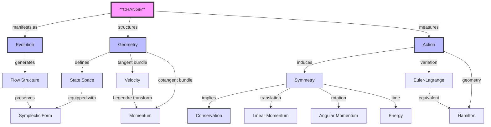
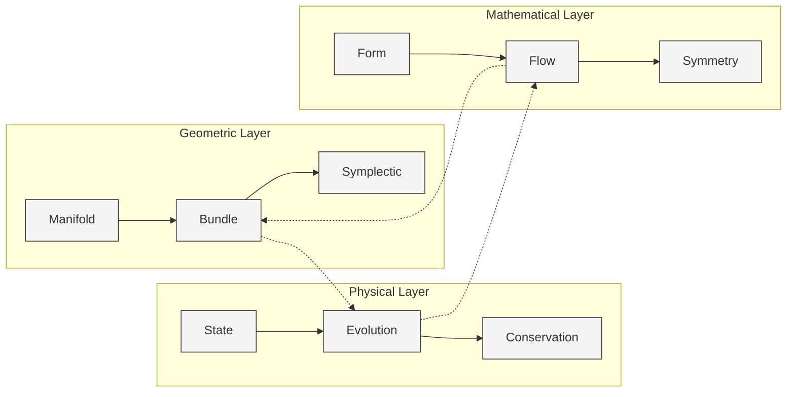

# 经典力学：变化与对称性的几何本质
* * *

--- 从变化的几何中涌现出对称性的代数

# I. 变化的本质
*"起初有变化，且变化与几何同在。"*

在最根本的层面上，物理学描述变化。在力量面前，在能量面前，甚至在空间和时间面前，都有着变化。让我们从这个原始概念出发，以绝对严谨的态度并尽量减少假设来构建理论。

## 1.1 原始概念

### 1.1.1 状态的本质
考虑一个处于状态 $s$ 的系统。在最根本的层面上，这意味着什么？一个状态是对某一时刻关于系统的所有可知道信息的完整描述。所有可能状态的集合构成了状态空间：
$$
\mathcal{S} = \{s \mid s \text{ is a possible state}\}
$$

这个定义不涉及空间、时间或任意特定的物理量。它是纯粹的存在性。

### 1.1.2 变化的结构
变化需要状态之间的映射：
$$
\Phi: \mathcal{S} \times \mathbb{R} \rightarrow \mathcal{S}
$$

这个演化算子必须满足三个基本性质：

1) **恒等性**：
$$
\Phi(s,0) = s
$$
   一个未受干扰的系统保持不变。

2) **组合性**：
$$
\Phi(\Phi(s,t_1),t_2) = \Phi(s,t_1+t_2)
$$
   顺序的变化自然地结合在一起。

3) **连续性**：
$$
\lim_{h \to 0} \Phi(s,t+h) = \Phi(s,t)
$$
   变化不能是不连续的。

### 1.1.3 变化的生成元
从这些性质中涌现出无穷小生成元：
$$
X_s = \lim_{h \to 0} \frac{\Phi(s,h) - s}{h}
$$

这导致演化的基本方程：
$$
\frac{d}{dt}\Phi(s,t) = X_{\Phi(s,t)}
$$

## 1.2 几何结构

### 1.2.1 流形结构的涌现
变化的连续性要求 $\mathcal{S}$ 是一个光滑流形。对于每个状态 $s$：

1) **局部坐标图表**：
$$
\varphi_s: U_s \rightarrow \mathbb{R}^n
$$
   其中 $U_s$ 是 $s$ 的邻域。

2) **光滑结构**：
   对于重叠的坐标图表 $(U_\alpha,\varphi_\alpha)$ 和 $(U_\beta,\varphi_\beta)$：
$$
\varphi_\beta \circ \varphi_\alpha^{-1}: \varphi_\alpha(U_\alpha \cap U_\beta) \rightarrow \varphi_\beta(U_\alpha \cap U_\beta)
$$
   必须是光滑的。

### 1.2.2 丛的必要性

1) **切丛** $TM$：
$$
TM = \bigcup_{p \in M} T_pM
$$
   表示瞬时变化。

2) **余切丛** $T^*M$：
$$
T^*M = \bigcup_{p \in M} T^*_pM
$$
   表示几何对偶性。

### 1.2.3 辛结构
演化过程中信息的保持要求一个辛形式 $\omega$：
$$
\omega: TM \times TM \rightarrow \mathbb{R}
$$

性质：
1) **闭合性**：$d\omega = 0$
2) **非退化性**：$\omega(X,Y)=0 \,\forall Y \Rightarrow X=0$

这导致基本定理：

**定理**：*每一个保持信息(辛形式)的光滑演化生成一个哈密顿流。*

数学上：
$$
\mathcal{L}_X\omega = 0 \Leftrightarrow \exists H: M \rightarrow \mathbb{R} \text{ such that } X = X_H
$$

### 1.2.4 体积结构
辛形式诱导一个自然的体积形式：
$$
\Omega = \frac{1}{n!}\omega^n
$$

这个体积在演化过程中被保持(刘维尔定理)，反映相空间体积的守恒。

### 1.2.5 关键性质

1) **Darboux 定理**：
   局部上，所有辛流形都是等价的：
$$
\omega = \sum_{i=1}^n dp_i \wedge dq^i
$$

2) **Weinstein 管状邻域**：
   在任意拉格朗日子流形附近，相空间结构是唯一的。

3) **Gromov 非挤压定理**：
   辛变换不能任意压缩相空间。

这些几何结构不是任意的数学构造 —— 它们是从变化的本质中涌现出来的必然性。它们构成经典力学的基础。

# II. 演化的几何
*"自然的道路是最小作用量的道路。"*

一个根本问题浮现：在所有可能的变化中，在自然界会发生哪些？答案在于演化本身的几何。

## 2.1 作用量原理

### 2.1.1 作用量的几何性质

作用量作为一个基本的几何度量涌现：
$$
S[\gamma] = \int_{\gamma} \alpha
$$
其中 $\alpha$ 是扩展相空间 $\mathcal{P} = T^*Q \times \mathbb{R}$ 上的基本 $1$-形式。

这种表示揭示了三个深刻的真理：

1) **作用量作为路径度量**：
   - 度量演化的“几何代价”
   - 参数化的独立
   - 内在的整体结构

2) **作用量作为连接**：
   - 连接配置空间和动量空间
   - 编码几何相位信息
   - 保持辛结构

3) **作用量作为生成元**：
   - 生成正则变换
   - 保持物理不变量
   - 控制量子相位

### 2.1.2 变分结构

作用量的变分揭示最深的原则：
$$
\delta S[\gamma] = \int_{\gamma} \mathcal{L}_X\alpha = \int_{t_1}^{t_2} \left(\frac{\partial L}{\partial q^i}\delta q^i + \frac{\partial L}{\partial \dot{q}^i}\delta \dot{q}^i\right)dt
$$

关键性质：

1) **驻定性**：
$$
\delta S = 0 \Leftrightarrow \text{Physical Path}
$$

2) **几何独立性**：
$$
S[\phi \circ \gamma] = S[\gamma]
$$
   对于正则变换 $\phi$ 成立。

3) **信息保持**：
$$
\omega = -d\alpha
$$
   确保辛结构。

## 2.2 流与结构

### 2.2.1 流的几何

演化在相空间上生成一个流：
$$
\Phi_t: \mathcal{P} \rightarrow \mathcal{P}
$$

三个基本结构涌现：

1) **向量场结构**：
$$
X_H = \omega^{-1}(dH,\cdot)
$$
   生成哈密顿流。

2) **流的不变量**：
$$
\mathcal{L}_{X_H}\omega = 0
$$
   保持辛结构。

3) **相空间体积**：
$$
\Omega = \frac{1}{n!}\omega^n
$$
   由刘维尔定理保持。

### 2.2.2 深层几何性质

1) **接触结构**：
   在扩展相空间上：
$$
\alpha = p_i \, dq^i - H \, dt
$$
   统一空间和时间。

2) **生成函数**：
   在不同表示之间转换：
$$
S_2(q,P,t): \quad p = \frac{\partial S_2}{\partial q}, \quad Q = \frac{\partial S_2}{\partial P}
$$

3) **Arnold 结构定理**：
   对于可积系统：
$$
(T^*Q,\omega) \cong (T^n \times \mathbb{R}^n, \sum dp_i \wedge dq^i)
$$

### 2.2.3 演化性质

1) **庞加莱回归**：
   对于有界系统：
$$
\exists t > 0: \|\Phi_t(x) - x\| < \epsilon
$$

2) **KAM 理论**：
   大多数可积环面在小扰动下可存活：
$$
\omega = \omega_0 + \epsilon\omega_1
$$

3) **遍历结构**：
   相空间平均等价于时间平均：
$$
\lim_{T \to \infty} \frac{1}{T}\int_0^T f(\Phi_t(x))dt = \int_{\mathcal{P}} f\,d\mu
$$

### 2.2.4 守恒结构

流保持基本量：

1) **能量守恒**：
$$
\frac{d}{dt}H \circ \Phi_t = 0
$$

2) **相空间体积**：
$$
\Phi_t^*\Omega = \Omega
$$

3) **辛形式**：
$$
\Phi_t^*\omega = \omega
$$

### 2.2.5 统一原则

所有这些结构通过以下统一：

**基本定理**：*相空间中的演化完全由保持辛结构并极化作用量来确定。*

这揭示了物理演化完全是几何的，由相空间本身的结构决定。物理定律不是从外部强加的，而是从演化的几何中涌现出来的。

# III. 对称性与守恒
*"保持不变的揭示了必须守恒的。"*

物理学中最深刻的真理不是来自于变化，而是来自于不变性。对称性和守恒之间的联系揭示物理定律的基本结构。

## 3.1 几何不变性

### 3.1.1 对称性的本质

一个对称性是一个保持物理结构不变的变换：
$$
\phi: M \rightarrow M \quad \text{such that} \quad S[\phi \circ \gamma] = S[\gamma]
$$

这导致了三个层次的对称性：

1) **离散对称性**：
   - 空间反演：$P: \vec{x} \mapsto -\vec{x}$
   - 时间反演：$T: t \mapsto -t$
   - 晶体结构中的离散旋转

2) **连续对称性**：
   - 单参数群：$\phi_t = e^{tX}$
   - 无穷小生成元：$X = \frac{d}{dt}\phi_t|_{t=0}$
   - 李代数结构：$[X,Y] = XY-YX$

3) **高阶对称性**：
   - 辛对称性：$\phi^*\omega = \omega$
   - 接触对称性：$\phi^*\alpha = \alpha$
   - 隐藏对称性：在相空间中涌现

### 3.1.2 动量映射

对称性和动力学之间的深刻联系编码在动量映射中：
$$
\mu: M \rightarrow \mathfrak{g}^*
$$

关键性质：

1) **等变性**：
$$
\mu(g \cdot x) = \text{Ad}^*_g \mu(x)
$$

2) **泊松结构**：
$$
\{\mu_\xi, \mu_\eta\} = -\mu_{[\xi,\eta]}
$$

3) **守恒**：
$$
\frac{d}{dt}\mu \circ \Phi_t = 0
$$

### 3.1.3 对称性的几何量化

对称性诱导量子结构：
$$
[\hat{\mu}_\xi, \hat{\mu}_\eta] = i\hbar\widehat{\mu_{[\xi,\eta]}}
$$

## 3.2 守恒定律

### 3.2.1 诺特定理：深层版本

对于每一个连续对称性存在一个守恒定律：

1) **无穷小版本**：
$$
\mathcal{L}_X\alpha = 0 \implies Q_X = i_X\alpha \text{ is conserved}
$$

2) **全局版本**：
$$
\phi^*S = S \implies \mu_\phi \text{ is conserved}
$$

3) **量子版本**：
$$
[H,Q] = 0 \implies \frac{d}{dt}\langle Q \rangle = 0
$$

### 3.2.2 守恒层次

三个层次的守恒涌现：

1) **初级守恒定律**：
   - 能量(时间平移)
   - 动量(空间平移)
   - 角动量(旋转)

2) **次级守恒定律**：
   - Runge-Lenz 向量(中心力)
   - 涡量(流体力学)
   - 相空间体积(刘维尔)

3) **隐藏守恒定律**：
   - KAM 环面(近可积系统)
   - 几何相位(绝热不变量)
   - 拓扑荷

### 3.2.3 统一的守恒结构

通过以下方式揭示深层次的统一：

1) **守恒代数**：
$$
\{F,G\} \text{ conserved if } F,G \text{ conserved}
$$

2) **几何结构**：
$$
dQ_X = i_X\omega
$$

3) **量子对应**：
$$
\{\cdot,\cdot\} \rightarrow \frac{1}{i\hbar}[\cdot,\cdot]
$$

### 3.2.4 综合原则

**基本定理**：*所有守恒定律都源自作用量的对称性，而所有对称性都表现为守恒定律。*

这导致：

1) **守恒复形**：
$$
\begin{CD}
\text{Symmetries} @>\mu>> \text{Constants} \\
@VVV @AAA \\
\text{Geometry} @>>\text{Evolution}> \text{Dynamics}
\end{CD}
$$

2) **统一结构**：
   - 对称性 → 守恒量
   - 几何 → 物理定律
   - 演化 → 动力学不变量

### 3.2.5 现代扩展

1) **场论**：
$$
j^\mu_a = \frac{\partial\mathcal{L}}{\partial(\partial_\mu\phi)}\delta_a\phi - K^\mu_a
$$

2) **规范理论**：
$$
D_\mu j^\mu = 0
$$

3) **量子场论**：
$$
\partial_\mu \langle j^\mu \rangle = 0
$$

深刻的含义：守恒定律不是自然的偶然事件，而是几何对称性的必然结果。它们通过不变性和守恒之间的紧密联系揭示物理现实的深层结构。

# IV. 统一框架
*"众声喧哗，同一几何。"*

机械形式主义的表面多样性掩盖了一个深刻的统一性。它们都是同一几何结构的不同视角的表现。

## 4.1 力学形式主义

### 4.1.1 基本统一

考虑每个形式主义的核心量：
$$
\begin{aligned}
\text{Newton}: & \quad \vec{F} \text{ (force vector)} \\
\text{Lagrange}: & \quad L = T - V \text{ (scalar)} \\
\text{Hamilton}: & \quad H = T + V \text{ (scalar)} \\
\text{Unified}: & \quad \omega = dp_i \wedge dq^i \text{ (2-form)}
\end{aligned}
$$

这些量通过以下关系连接：
$$
\text{Force} \xrightarrow{\text{work}} \text{Action} \xrightarrow{\text{variation}} \text{Evolution} \xrightarrow{\text{geometry}} \text{Structure}
$$

### 4.1.2 深层等价

等价性通过以下方式表现：

1) **从力到作用量**：
$$
\delta S = \int \vec{F} \cdot d\vec{r} = 0
$$

2) **从作用量到演化**：
$$
\begin{aligned}
\text{Lagrangian}: & \quad \frac{d}{dt}\frac{\partial L}{\partial \dot{q}^i} = \frac{\partial L}{\partial q^i} \\
\text{Hamiltonian}: & \quad \dot{q}^i = \frac{\partial H}{\partial p_i}, \quad \dot{p}_i = -\frac{\partial H}{\partial q^i}
\end{aligned}
$$

3) **从演化到几何**：
$$
i_{X_H}\omega = dH
$$

### 4.1.3 统一视角

统一性通过三个层次显现：

1) **几何层次**：
$$
\begin{CD}
TQ @>\mathcal{L}>> \mathbb{R} @>\text{E-L}>> TQ \\
@VV\mathbb{F}\mathcal{L}V @. @AA\mathbb{F}\mathcal{L}A \\
T^*Q @>H>> \mathbb{R} @>X_H>> T^*Q
\end{CD}
$$

2) **代数层次**：
$$
\{F,G\} = \omega(X_F,X_G) = \sum_{i=1}^n \left(\frac{\partial F}{\partial q^i}\frac{\partial G}{\partial p_i} - \frac{\partial F}{\partial p_i}\frac{\partial G}{\partial q^i}\right)
$$

3) **动力学层次**：
$$
\frac{d}{dt}F = \{F,H\}
$$

## 4.2 几何综合

### 4.2.1 基本结构

统一结构编码在三元组中：
$$
(M,\omega,H)
$$
其中：
- $M$ 是相空间
- $\omega$ 是辛形式
- $H$ 是哈密顿量

### 4.2.2 几何层次

三个层次的结构涌现：

1) **拓扑结构**：
   - 相空间拓扑
   - 纤维丛结构
   - 同伦不变量

2) **微分结构**：
   - 辛形式
   - 泊松括号
   - 哈密顿流

3) **度量结构**：
   - 能量度量
   - 信息几何
   - 统计结构

### 4.2.3 统一原则

1) **接触几何**：
   在扩展相空间上：
$$
\alpha = p_i \, dq^i - H \, dt
$$
   统一空间、动量和时间。

2) **辛约化**：
$$
J^{-1}(\mu)/G_\mu \cong T^*(Q/G)
$$
   连接对称性和动力学。

3) **几何量化**：
$$
(M,\omega) \rightarrow (\mathcal{H},[\cdot,\cdot])
$$
   桥接经典和量子。

### 4.2.4 现代综合

综合延伸到：

1) **场论**：
$$
T^*\mathcal{Q} \text{ with } \Omega = \int_\Sigma \delta\pi \wedge \delta\phi
$$

2) **规范理论**：
$$
\mathcal{A}/\mathcal{G} \text{ with natural symplectic structure}
$$

3) **弦论**：
$$
S = \int_\Sigma \sqrt{-\det(\partial_\alpha X^\mu \partial_\beta X_\mu)} \, d^2\sigma
$$

### 4.2.5 最终统一

**定理**：*所有经典力学的表述等价于保持辛结构并极化作用量。*

这导致三个深刻的含义：

1) **哲学层面**：
   - 物理定律是几何必然性
   - 不同形式主义是不同的视角
   - 统一性贯穿多样性

2) **数学层面**：
   - 几何统一了代数和分析
   - 对称性蕴含守恒
   - 结构决定动力学

3) **物理层面**：
   - 力从几何中涌现
   - 守恒来自对称性
   - 量子源于经典

最深层次的真理浮现：经典力学不仅仅是被几何描述 —— 它本身就是几何，而其各种表述仅仅是看待这一基本几何现实的不同方式。

# V. 现代扩展
*"经典通过几何指向量子。"*

经典力学的几何结构在其内部包含量子力学和场论的种子。这种涌现不是偶然的，而是底层几何的必然结果。

## 5.1 量子桥梁

### 5.1.1 几何量化

基本对应关系：
$$
(\text{Classical},\{,\}) \longrightarrow (\text{Quantum},[,])
$$
通过三个阶段涌现：

1) **预量化**：
   对于辛流形 $(M,\omega)$：
$$
L \xrightarrow{\pi} M \text{ with curvature } \frac{i}{\hbar}\omega
$$

2) **极化**：
   $TM$ 的拉格朗日叶状结构 $\mathcal{F}$ 导致：
$$
\mathcal{H} = \{\psi \in L^2(L) \mid \nabla_X\psi = 0 \text{ for } X \in \mathcal{F}\}
$$

3) **Metaplectic 校正**：
$$
\text{Quantum Bundle} = L \otimes \sqrt{\bigwedge^n\mathcal{F}^*}
$$

### 5.1.2 深层量子结构

三个基本桥接出现：

1) **路径积分结构**：
$$
K(q_f,t_f;q_i,t_i) = \int_{\text{paths}} e^{iS[\gamma]/\hbar}\mathcal{D}\gamma
$$
   连接作用量与量子振幅。

2) **几何相位**：
$$
\gamma_g = i\oint_C \langle\psi|\nabla|\psi\rangle
$$
   揭示量子拓扑。

3) **Maslov 指数**：
$$
\mu(\Lambda) = \text{topological invariant of Lagrangian paths}
$$
   连接经典和量子焦散现象。

### 5.1.3 量子涌现

量子通过以下方式涌现：

1) **形变量化**：
$$
f \star g = fg + \frac{i\hbar}{2}\{f,g\} + O(\hbar^2)
$$

2) **Moyal 括号**：
$$
[f,g]_M = \frac{f \star g - g \star f}{i\hbar}
$$

3) **相干态**：
$$
|z\rangle = e^{-|z|^2/2}\sum_{n=0}^\infty \frac{z^n}{\sqrt{n!}}|n\rangle
$$

## 5.2 场论扩展

### 5.2.1 从粒子到场

过渡通过以下方式发生：

1) **构型空间**：
$$
\mathcal{Q} = \{\phi: \Sigma \to V \mid \text{suitable regularity}\}
$$

2) **相空间**：
$$
T^*\mathcal{Q} \text{ with } \Omega = \int_\Sigma \delta\pi \wedge \delta\phi
$$

3) **作用泛函**：
$$
S[\phi] = \int_M \mathcal{L}(\phi,\partial\phi)d^nx
$$

### 5.2.2 规范结构

几何揭示了：

1) **局部对称性**：
$$
\delta\phi(x) = \epsilon^a(x)T_a\phi(x)
$$

2) **协变导数**：
$$
D_\mu = \partial_\mu + igA_\mu^aT_a
$$

3) **场强**：
$$
F_{\mu\nu} = \partial_\mu A_\nu - \partial_\nu A_\mu + ig[A_\mu,A_\nu]
$$

### 5.2.3 深层场结构

1) **喷射丛**：
$$
J^\infty(E) = \lim_{\leftarrow} J^k(E)
$$
   编码所有导数。

2) **多重辛形式**：
$$
\Omega = dq^i \wedge dp_i \wedge dt + dp_i \wedge dq^i \wedge dx
$$

3) **BV-BRST 结构**：
$$
(S,S) = 0
$$
   为主方程。

### 5.2.4 现代综合

三个层次出现：

1) **杨-米尔斯理论**：
$$
\mathcal{L} = -\frac{1}{4}F_{\mu\nu}^aF^{a\mu\nu}
$$

2) **广义相对论**：
$$
S = \int \sqrt{-g}R \, d^4x
$$

3) **弦论**：
$$
S = \int_\Sigma \sqrt{-\det(\partial_\alpha X^\mu \partial_\beta X_\mu)} \, d^2\sigma
$$

### 5.2.5 最终统一

深刻的综合出现在：

1) **量子场论**：
$$
Z = \int \mathcal{D}\phi \exp\left(\frac{i}{\hbar}S[\phi]\right)
$$

2) **高阶范畴**：
$$
\begin{CD}
\text{Classical} @>\text{Quantization}>> \text{Quantum} \\
@V\text{Field}VV @VV\text{QFT}V \\
\text{Classical Field} @>>\text{Quantization}> \text{Quantum Field}
\end{CD}
$$

3) **信息几何**：
$$
ds^2 = g_{ij}(\theta)d\theta^id\theta^j
$$

最终的信息浮现：经典力学的几何原理在其内部包含所有现代物理学的种子。从经典到量子、从粒子到场的过渡不是一个断裂，而是底层几何结构的自然延伸。

# 附录 A：核心概念及其深层关系
*"力学的统一性通过自身基本概念的相互联系显现出来。"*

## A.A. 核心概念关系

### A.A.1 主要概念层次结构

### A.A.2 基本关系矩阵

| 概念  | 几何结构          | 物理意义    | 数学形式                                           |
| --- | ------------- | ------- | ---------------------------------------------- |
| 变化  | 向量场           | 演化生成元   | $X_s = \lim_{h \to 0} \frac{\Phi(s,h) - s}{h}$ |
| 作用量 | 路径空间上的 $1$-形式 | 物理定律    | $S[\gamma] = \int_{\gamma} \alpha$             |
| 对称性 | 群作用           | 守恒定律    | $\phi^*S = S$                                  |
| 相空间 | 辛流形           | 状态 + 动量 | $(M,\omega)$                                   |
| 流   | 辛流            | 动力学     | $\Phi_t: M \rightarrow M$                      |
| 守恒  | 动量映射          | 运动常数    | $\mu: M \to \mathfrak{g}^*$                    |

### A.A.3 结构统一图

## A.B. 深层统一原则

### A.B.1 三重统一
经典力学的基本统一性通过三个深层原则显现：

1) **几何-动力学统一**：
$$
\text{Evolution} \equiv \text{Symplectic Flow} \equiv \text{Action Extremal}
$$

2) **对称性-守恒统一**：
$$
\text{Symmetry} \xrightarrow{\text{Noether}} \text{Conservation} \xrightarrow{\text{Moment Map}} \text{Dynamics}
$$

3) **形式-功能统一**：
$$
\text{Geometric Structure} \Leftrightarrow \text{Physical Law}
$$

### A.B.2 涌现层次
$$
\begin{CD}
\text{Change} @>\text{Structure}>> \text{Geometry} @>\text{Action}>> \text{Physics} \\
@VVV @VVV @VVV \\
\text{Flow} @>\text{Preservation}>> \text{Symmetry} @>\text{Noether}>> \text{Conservation}
\end{CD}
$$

这种统一视角揭示了经典力学中看似不同的概念实际上是单一的深刻的几何结构的不同方面。这些概念之间的关系不仅仅是形式上的连接，而是代表了物理现实结构中的深层次必然性。

