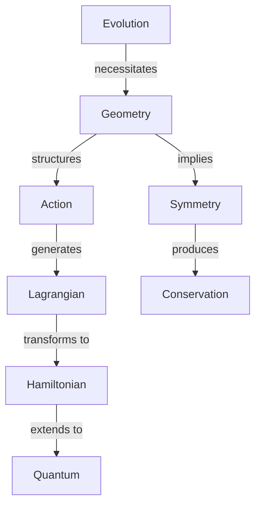

# **A Geometric Framework of Classical Mechanics: From Evolution Principles to Physical Reality**

**Motto**: *"Physical reality emerges as the geometry of evolution unfolds."*

## Core Philosophy and Vision

Classical Mechanics is not merely a collection of physical laws, but emerges necessarily from the fundamental concept of evolution and geometric principles. This reformulation reveals classical mechanics as a pure geometric framework where physical reality emerges from mathematical necessity.

## Core Concepts

1. **Evolution**: The primordial concept from which all structure emerges
2. **Geometric Necessity**: The principle that physical laws arise from geometric requirements
3. **Duality**: The fundamental pairing relationships that structure physical reality
4. **Action**: The geometric encoding of evolution paths
5. **Symmetry**: The invariances that determine physical laws
6. **Conservation**: The necessities that preserve distinctions

## Document Structure

### Chapter 1: Foundations of Evolution
*Epigraph: "From motion arises geometry, from geometry emerges physics"*

#### 1.1 The Evolution Principle
- Evolution as the fundamental concept
- Necessity of distinction preservation
- Continuity and reversibility requirements

#### 1.2 Geometric Framework
- Manifold structure emergence
- Tangent and cotangent structures
- Natural geometric invariants

[Focus: Establish evolution as the foundational concept from which geometry necessarily emerges]

### Chapter 2: The Architecture of Action
*Epigraph: "Action shapes space, space shapes motion"*

#### 2.1 Action Principle
- Geometric origin of action
- Variational principles
- Path space geometry

#### 2.2 Lagrangian Structure
- Configuration space geometry
- Euler-Lagrange equations
- Natural mechanical systems

[Focus: Show how action principles arise from geometric necessity]

### Chapter 3: The Duality of Motion
*Epigraph: "In duality lies understanding"*

#### 3.1 Phase Space Structure
- Legendre transformation
- Symplectic geometry
- Poisson brackets

#### 3.2 Hamiltonian Framework
- Hamilton's equations
- Canonical transformations
- Phase flow geometry

[Focus: Reveal the deep geometric meaning of position-momentum duality]

### Chapter 4: Symmetry and Conservation
*Epigraph: "Invariance dictates dynamics"*

#### 4.1 Geometric Symmetries
- Lie group actions
- Momentum maps
- Noether's theorem

#### 4.2 Conservation Laws
- Energy-time duality
- Angular momentum geometry
- Integrability conditions

[Focus: Demonstrate how symmetries necessitate conservation laws]

### Chapter 5: Systems and Structures
*Epigraph: "From simple principles emerge complex realities"*

#### 5.1 Fundamental Systems
- Free particle geometry
- Harmonic structures
- Central force systems

#### 5.2 Advanced Systems
- Many-body dynamics
- Field theories
- Continuous media

[Focus: Show how physical systems emerge from geometric principles]

### Chapter 6: Modern Extensions
*Epigraph: "The classical contains the quantum"*

#### 6.1 Quantum Structure
- Geometric quantization
- Bundle structures
- Wave functions as sections

#### 6.2 Contemporary Developments
- Information geometry
- Gauge theories
- Path to gravity

[Focus: Bridge classical geometry to modern physics]

## Key Relationships and Dependencies

[This structure forms the backbone of the document's logical development]

## Writing Guidelines

1. Each chapter builds necessarily from previous material
2. Emphasize geometric inevitability over historical development
3. Maintain rigorous mathematical precision with geometric intuition
4. Focus on deep unifying principles
5. Connect to modern developments naturally

[Note: This outline provides a framework for a comprehensive geometric treatment of classical mechanics, emphasizing necessity and unity over historical development.]

