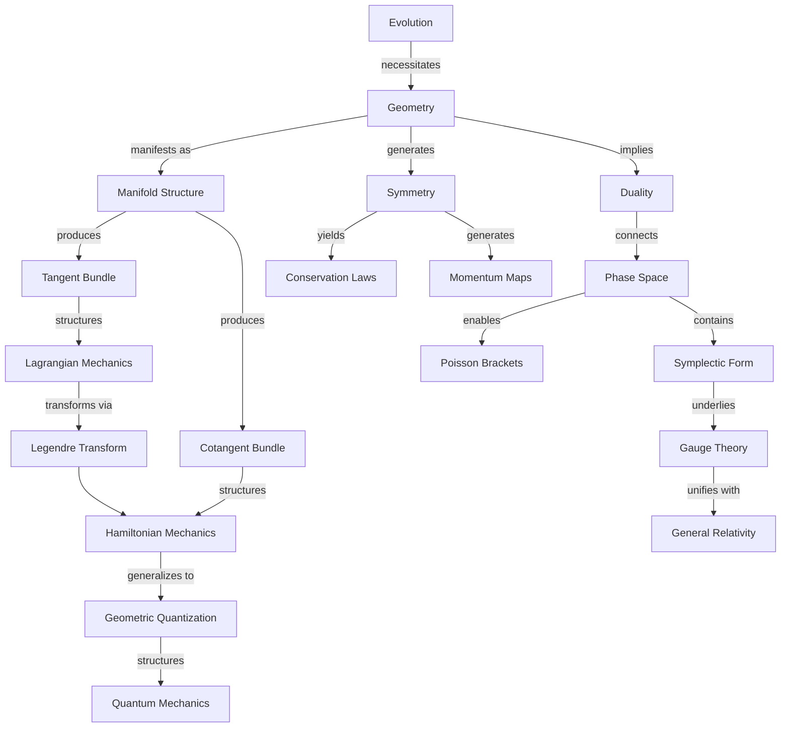

# A Geometric Framework of Classical Mechanics: From Evolution Principles to Physical Reality
* * *

--- Physical reality emerges as the geometry of evolution unfolds.

# **1. Foundations of Evolution**

*"From motion arises geometry, from geometry emerges physics"*

Let us begin our journey at the deepest possible foundation: pure evolution. We seek not what evolution is, but what it must necessarily imply. Through mathematical necessity alone, we shall witness the emergence of the entire geometric framework of classical mechanics.

## **1.1 The Evolution Principle**

### **1.1.1 The Primordial Concept**

Consider evolution in its purest form, stripped of all preconceptions. We start with only this:
- A collection of states
- The possibility of change
- Nothing more

This minimal beginning contains profound implications:

1. **The Essential Structure**:
   - States evolve uniquely:
     $$
     \phi: \mathcal{S} \times \mathbb{R} \to \mathcal{S}
     $$
   - Group property emerges necessarily:
     $$
     \phi_{t_1} \circ \phi_{t_2} = \phi_{t_1+t_2}
     $$

2. **The Flow Necessity**:
   - Evolution defines flow:
     $$
     \frac{d}{dt}\phi_t(s) = X(\phi_t(s))
     $$
    where $X$ is the vector field generating the flow

### **1.1.2 Distinction Preservation**

The evolution must preserve distinctions between states:

1. **Formal Requirement**:
   - For distinct states:
     $$
     s_1 \neq s_2 \implies \phi_t(s_1) \neq \phi_t(s_2) \quad \forall t
     $$
   - This implies the evolution map is injective:
     $$
     \ker(d\phi_t) = \{0\}
     $$

2. **Information Conservation**:
   - Distinguished states must remain distinguished
   - Evolution preserves distinguishability metric:
     $$
     d(\phi_t(s_1),\phi_t(s_2)) = F(d(s_1,s_2))
     $$
    where $F$ is a monotonic function

### **1.1.3 Continuity and Reversibility**

Evolution must satisfy fundamental requirements:

1. **Continuous Evolution**:
   - Paths through state space:
     $$
     \gamma: [t_1,t_2] \to \mathcal{S}
     $$
    are continuous and differentiable
   
2. **Reversibility Structure**:
   - For each evolution exists an inverse:
     $$
     \phi_t \circ \phi_{-t} = \text{id}_{\mathcal{S}}
     $$
   - This implies group structure of time evolution

## **1.2 Geometric Framework**

### **1.2.1 Manifold Structure Emergence**

The requirements of evolution force geometric structure:

1. **Local Structure**:
   - State space naturally forms manifold $\mathcal{M}$
   - Charts emerge from evolution paths:
     $$
     \psi_\alpha: U_\alpha \subset \mathcal{M} \to \mathbb{R}^n
     $$

2. **Differential Structure**:
   - Smooth transitions between charts:
     $$
     \psi_\beta \circ \psi_\alpha^{-1}: \psi_\alpha(U_\alpha \cap U_\beta) \to \psi_\beta(U_\alpha \cap U_\beta)
     $$
    are differentiable

### **1.2.2 Tangent and Cotangent Structure**

Evolution necessitates additional structure:

1. **Tangent Bundle**:
   - Velocity space emerges:
     $$
     T\mathcal{M} = \bigsqcup_{p \in \mathcal{M}} T_p\mathcal{M}
     $$
   - Natural projection:
     $$
     \pi: T\mathcal{M} \to \mathcal{M}
     $$

2. **Cotangent Bundle**:
   - Momentum space emerges:
     $$
     T^*\mathcal{M} = \bigsqcup_{p \in \mathcal{M}} T_p^*\mathcal{M}
     $$
   - Canonical one-form:
     $$
     \theta = p_i \, dq^i
     $$

### **1.2.3 Natural Invariants**

Geometric invariants emerge necessarily:

1. **Symplectic Structure**:
   - Two-form emerges:
     $$
     \omega = d\theta = dp_i \wedge dq^i
     $$
   - Non-degeneracy:
     $$
     \omega^n \neq 0
     $$
   - Closure:
     $$
     d\omega = 0
     $$

2. **Volume Element**:
   - Liouville form:
     $$
     \Omega = \frac{1}{n!}\omega^n
     $$
   - Volume preservation:
     $$
     \mathcal{L}_X\Omega = 0
     $$

This emergence of structure reveals a profound truth: geometry is not imposed on physics but arises necessarily from the requirements of consistent evolution. The next chapter will show how this geometric structure leads inevitably to action principles.

[Note: This chapter establishes the absolute minimum framework needed for physics, showing how geometric structure emerges necessarily from evolution requirements. Each concept follows inevitably from the previous one, maintaining mathematical rigor while emphasizing geometric necessity.]

# **2. The Architecture of Action**

*"Action shapes space, space shapes motion"*

Having established how geometry emerges from evolution, we now reveal the profound architecture of action. Here we discover that action is not merely a mathematical construct but a geometric necessity arising from the structure of evolution itself.

## **2.1 Action Principle**

### **2.1.1 The Geometric Origin of Action**

Action emerges naturally from the geometry of evolution:

1. **Fundamental One-Form**:
   - On extended phase space $T^*M \times \mathbb{R}$:
     $$
     \theta_H = p_i \, dq^i - H \, dt
     $$
   - Action defined geometrically:
     $$
     S[\gamma] = \int_{\gamma} \theta_H
     $$

2. **Geometric Structure**:
   - Action as horizontal one-form:
     $$
     \alpha: TM \times \mathbb{R} \to \mathbb{R}
     $$
   - Contact structure emerges:
     $$
     d\theta_H = dp_i \wedge dq^i - dH \wedge dt
     $$

### **2.1.2 The Necessity of Variation**

Variational principles emerge from geometric structure:

1. **Path Space Geometry**:
   - Space of paths:
     $$
     \mathcal{P}(M) = \{\gamma: [t_1,t_2] \to M\}
     $$
   - Tangent space to path space:
     $$
     T_\gamma\mathcal{P}(M) = \{\delta\gamma: [t_1,t_2] \to TM\}
     $$

2. **Variational Structure**:
   - First variation:
     $$
     \delta S[\gamma] = \int_{t_1}^{t_2} \left(\frac{\partial L}{\partial q^i}\delta q^i + \frac{\partial L}{\partial \dot{q}^i}\delta \dot{q}^i\right)dt
     $$
   - Stationary action principle:
     $$
     \delta S[\gamma] = 0
     $$

### **2.1.3 Path Space Structure**

The geometry of path space reveals deep structure:

1. **Infinite-Dimensional Manifold**:
   - Path space metric:
     $$
     G(\delta\gamma_1,\delta\gamma_2) = \int_{t_1}^{t_2} g_{\mu\nu}\dot{\gamma}_1^\mu\dot{\gamma}_2^\nu dt
     $$
   - Natural symplectic form:
     $$
     \Omega = \int_{t_1}^{t_2} \omega(\delta\gamma_1,\delta\gamma_2) dt
     $$

2. **Critical Point Theory**:
   - Action functional gradient:
     $$
     \nabla S[\gamma] = 0 \iff \text{Classical path}
     $$
   - Morse theory structure:
     $$
     \text{ind}(\gamma) = \dim\{\delta\gamma: D^2S[\gamma](\delta\gamma,\delta\gamma) < 0\}
     $$

## **2.2 Lagrangian Structure**

### **2.2.1 Configuration Space Geometry**

The geometry of configuration space emerges naturally:

1. **Tangent Bundle Structure**:
   - Velocity space:
     $$
     TM = \{(q,\dot{q}): q \in M, \dot{q} \in T_qM\}
     $$
   - Natural coordinates:
     $$
     (q^i,\dot{q}^i) \text{ on } TM
     $$

2. **Metric Structure**:
   - Kinetic energy metric:
     $$
     T = \frac{1}{2}g_{ij}(q)\dot{q}^i\dot{q}^j
     $$
   - Connection coefficients:
     $$
     \Gamma^i_{jk} = \frac{1}{2}g^{il}(\partial_jg_{kl} + \partial_kg_{jl} - \partial_lg_{jk})
     $$

### **2.2.2 The Euler-Lagrange Emergence**

Euler-Lagrange equations arise geometrically:

1. **Natural Flow**:
   - Second-order vector field:
     $$
     \Gamma = \dot{q}^i\frac{\partial}{\partial q^i} + \ddot{q}^i\frac{\partial}{\partial \dot{q}^i}
     $$
   - Euler-Lagrange equations:
     $$
     \frac{d}{dt}\frac{\partial L}{\partial \dot{q}^i} - \frac{\partial L}{\partial q^i} = 0
     $$

2. **Geometric Form**:
   - Cartan two-form:
     $$
     \omega_L = \frac{\partial^2L}{\partial \dot{q}^i\partial \dot{q}^j}dq^i \wedge dq^j
     $$
   - Energy function:
     $$
     E = \dot{q}^i\frac{\partial L}{\partial \dot{q}^i} - L
     $$

### **2.2.3 Natural Mechanical Systems**

Physical systems emerge from geometric structure:

1. **Geometric Potentials**:
   - Natural Lagrangian:
     $$
     L = \frac{1}{2}g_{ij}\dot{q}^i\dot{q}^j - V(q)
     $$
   - Potential geometry:
     $$
     dV = F_i \, dq^i
     $$

2. **System Classification**:
   - Free systems:
     $$
     L = \frac{1}{2}m\dot{q}^2
     $$
   - Harmonic structure:
     $$
     L = \frac{1}{2}m\dot{q}^2 - \frac{1}{2}kq^2
     $$
   - Central force:
     $$
     L = \frac{1}{2}m(\dot{r}^2 + r^2\dot{\theta}^2) - V(r)
     $$

This reveals action not as a principle but as a geometric necessity. The next chapter will show how this structure naturally leads to phase space and Hamiltonian mechanics through duality.

[Note: This chapter demonstrates the geometric inevitability of action principles and Lagrangian mechanics, emphasizing their emergence from fundamental structure rather than physical postulates.]

# **3. The Duality of Motion**

*"In duality lies understanding"*

Having established the geometric necessity of action and Lagrangian mechanics, we now unveil a deeper truth: the fundamental duality of motion. This duality, manifest in the position-momentum relationship, is not merely convenient but geometrically inevitable.

## **3.1 Phase Space Structure**

### **3.1.1 The Necessity of Duality**

1. **Fundamental Pairing**:
   - Natural pairing emerges:
     $$
     \langle p, v \rangle: T^*_qM \times T_qM \to \mathbb{R}
     $$
   - Canonical structure:
     $$
     \theta = p_i \, dq^i
     $$
    represents the universal dual coupling

2. **Complete Phase Space**:
   - Cotangent bundle structure:
     $$
     T^*M = \bigcup_{q \in M} T^*_qM
     $$
   - Natural projection:
     $$
     \pi: T^*M \to M
     $$
    with fiber $T^*_qM$ over each point $q$

### **3.1.2 Legendre Transform Geometry**

1. **Geometric Structure**:
   - Transform defined naturally:
     $$
     \mathcal{L}: TM \to T^*M
     $$
   - Fiber derivative:
     $$
     \mathbb{F}L: TM \to T^*M
     $$
     $$
     \mathbb{F}L(q,\dot{q})_i = \frac{\partial L}{\partial \dot{q}^i}
     $$

2. **Duality Properties**:
   - Convexity structure:
     $$
     \det\left(\frac{\partial^2 L}{\partial \dot{q}^i \partial \dot{q}^j}\right) \neq 0
     $$
   - Energy function emerges:
     $$
     H(q,p) = p_i\dot{q}^i - L(q,\dot{q})
     $$

### **3.1.3 Symplectic Geometry**

1. **Canonical Two-Form**:
   - Symplectic structure:
     $$
     \omega = dp_i \wedge dq^i = d\theta
     $$
   - Non-degeneracy:
     $$
     \omega^n \neq 0
     $$

2. **Poisson Structure**:
   - Bracket operation:
     $$
     \{F,G\} = \omega(X_F,X_G) = \frac{\partial F}{\partial q^i}\frac{\partial G}{\partial p_i} - \frac{\partial F}{\partial p_i}\frac{\partial G}{\partial q^i}
     $$
   - Properties emerge naturally:
     $$
     \begin{align*}
     &\{F,G\} = -\{G,F\} \\
     &\{F,\{G,H\}\} + \{G,\{H,F\}\} + \{H,\{F,G\}\} = 0
     \end{align*}
     $$

## **3.2 Hamiltonian Framework**

### **3.2.1 Hamilton's Equations**

1. **Geometric Flow**:
   - Hamiltonian vector field:
     $$
     X_H = \omega^{-1}(dH)
     $$
   - Evolution equations:
     $$
     \begin{cases}
     \dot{q}^i = \frac{\partial H}{\partial p_i} \\
     \dot{p}_i = -\frac{\partial H}{\partial q^i}
     \end{cases}
     $$

2. **Flow Properties**:
   - Phase space volume preservation:
     $$
     \mathcal{L}_{X_H}\omega^n = 0
     $$
   - Energy conservation:
     $$
     \frac{dH}{dt} = \{H,H\} = 0
     $$

### **3.2.2 The Architecture of Transformations**

1. **Canonical Transformations**:
   - Symplectic diffeomorphisms:
     $$
     \phi^*\omega = \omega
     $$
   - Generating functions:
     $$
     dF = P_i \, dQ^i - p_i \, dq^i
     $$

2. **Transformation Types**:
   - Type 1 ($F_1$):
     $$
     p_i = \frac{\partial F_1}{\partial q^i}, \quad P_i = -\frac{\partial F_1}{\partial Q^i}
     $$
   - Type 2 ($F_2$):
     $$
     p_i = \frac{\partial F_2}{\partial q^i}, \quad q^i = \frac{\partial F_2}{\partial P_i}
     $$

### **3.2.3 Phase Flow Geometry**

1. **Flow Structure**:
   - Phase portrait:
     $$
     \gamma(t) = (q(t),p(t))
     $$
   - Integral curves:
     $$
     \frac{d\gamma}{dt} = X_H(\gamma)
     $$

2. **Geometric Invariants**:
   - Poincaré invariants:
     $$
     \oint_\gamma p_i \, dq^i = \text{invariant}
     $$
   - Phase space topology:
     $$
     H^{-1}(E) \subset T^*M
     $$

3. **Complete Integrability**:
   - Liouville-Arnold theorem:
     $$
     \{F_i,F_j\} = 0, \quad i,j = 1,\ldots,n
     $$
   - Action-angle coordinates:
     $$
     (I_i,\theta^i) \text{ with } \dot{I}_i = 0, \dot{\theta}^i = \omega_i(I)
     $$

This deep geometric structure reveals that Hamiltonian mechanics is not merely an alternative formulation but the natural expression of phase space geometry. The next chapter will show how this framework naturally encompasses symmetry and conservation laws.

[Note: This chapter emphasizes the geometric necessity of phase space structure and Hamiltonian mechanics, showing how they emerge inevitably from the duality inherent in mechanical systems.]

# **4. Symmetry and Conservation**

*"Invariance dictates dynamics"*

Having established the duality framework of mechanics, we now reveal a deeper truth: symmetries are not mere conveniences but geometric necessities that dictate the very structure of physical law through conservation principles.

## **4.1 Geometric Symmetries**

### **4.1.1 The Architecture of Symmetry**

1. **Fundamental Group Actions**:
   - Lie group action on phase space:
     $$
     \Phi: G \times P \to P
     $$
   - Infinitesimal generators:
     $$
     \xi_P(z) = \left.\frac{d}{d\epsilon}\right|_{\epsilon=0} \Phi(\exp(\epsilon\xi),z)
     $$

2. **Symplectic Actions**:
   - Preservation of symplectic form:
     $$
     \Phi_g^*\omega = \omega \quad \forall g \in G
     $$
   - Infinitesimal condition:
     $$
     \mathcal{L}_{\xi_P}\omega = 0
     $$

### **4.1.2 Momentum Map Structure**

1. **Geometric Construction**:
   - Momentum map emergence:
     $$
     J: P \to \mathfrak{g}^*
     $$
   - Definition through:
     $$
     \langle J(z),\xi \rangle = H_{\xi}(z)
     $$
    where $H_{\xi}$ is the Hamiltonian for $\xi_P$

2. **Equivariance Properties**:
   - Coadjoint action:
     $$
     J(\Phi_g(z)) = \text{Ad}_g^* J(z)
     $$
   - Poisson property:
     $$
     \{J_{\xi},J_{\eta}\} = -J_{[\xi,\eta]}
     $$

### **4.1.3 Noether's Theorem: The Geometric Necessity**

1. **Fundamental Connection**:
   - Conservation law emergence:
     $$
     \frac{d}{dt}J_{\xi}(\gamma(t)) = \{J_{\xi},H\} = 0
     $$
   - For symmetry generator $\xi$

2. **Geometric Form**:
   - Conserved current:
     $$
     d(J_{\xi} \circ \gamma) = 0
     $$
   - Phase space foliation:
     $$
     J^{-1}(μ)/G_μ
     $$

## **4.2 Conservation Laws**

### **4.2.1 Energy-Time Duality**

1. **Temporal Structure**:
   - Extended phase space:
     $$
     \tilde{P} = T^*Q \times \mathbb{R}
     $$
   - Extended symplectic form:
     $$
     \tilde{\omega} = \omega - dH \wedge dt
     $$

2. **Energy Conservation**:
   - Time translation symmetry:
     $$
     \frac{\partial H}{\partial t} = 0 \implies \frac{dH}{dt} = 0
     $$
   - Geometric necessity:
     $$
     \mathcal{L}_{X_H}H = 0
     $$

### **4.2.2 Angular Momentum Geometry**

1. **Rotational Symmetry**:
   - $SO(3)$ action:
     $$
     \Phi: SO(3) \times T^*\mathbb{R}^3 \to T^*\mathbb{R}^3
     $$
   - Angular momentum map:
     $$
     \mathbf{L} = \mathbf{q} \times \mathbf{p}
     $$

2. **Geometric Structure**:
   - Momentum sphere:
     $$
     \|\mathbf{L}\| = \text{constant}
     $$
   - Poisson bracket algebra:
     $$
     \{L_i,L_j\} = \epsilon_{ijk}L_k
     $$

### **4.2.3 Integrability Architecture**

1. **Complete Integrability**:
   - Liouville-Arnold theorem:
     $$
     \{F_i,F_j\} = 0, \quad i,j = 1,\ldots,n
     $$
   - Action variables:
     $$
     I_k = \frac{1}{2\pi}\oint_{\gamma_k} p\,dq
     $$

2. **Integrable Structure**:
   - Invariant tori:
     $$
     T^n = \mathbb{R}^n/\mathbb{Z}^n
     $$
   - Action-angle coordinates:
     $$
     \begin{cases}
     \dot{I}_k = 0 \\
     \dot{\theta}^k = \omega_k(I)
     \end{cases}
     $$

### **4.2.4 Unified Conservation Framework**

1. **Conservation Hierarchy**:
   $$
   \begin{array}{c}
   \text{Symmetry Group } G \\
   \downarrow \\
   \text{Momentum Map } J \\
   \downarrow \\
   \text{Conserved Quantities} \\
   \downarrow \\
   \text{Reduced Dynamics}
   \end{array}
   $$

2. **Reduction Theory**:
   - Marsden-Weinstein reduction:
     $$
     P_{\mu} = J^{-1}(\mu)/G_{\mu}
     $$
   - Reduced dynamics:
     $$
     i_{X_H}\omega_{\mu} = dH_{\mu}
     $$

This reveals the profound truth that symmetries and conservation laws are not merely useful tools but geometric necessities arising from the structure of phase space itself. The next chapter will show how this framework naturally encompasses specific physical systems.

[Note: This chapter demonstrates the geometric necessity of conservation laws through symmetry, revealing them as inevitable consequences of phase space structure rather than empirical discoveries.]

# **5. Systems and Structures**

*"From simple principles emerge complex realities"*

Having established the fundamental geometric framework of mechanics through symmetry and conservation, we now reveal how physical systems emerge naturally from these geometric principles. The progression from simple to complex systems follows a path of geometric necessity.

## **5.1 Fundamental Systems**

### **5.1.1 Free Particle Geometry**

1. **Geometric Structure**:
   - Configuration space: $\mathbb{R}^3$
   - Phase space: $T^*\mathbb{R}^3$
   - Minimal Lagrangian:
     $$\mathcal{L} = \frac{1}{2}m\|\dot{\mathbf{q}}\|^2$$
   - Symplectic form:
     $$\omega = \sum_{i=1}^3 dp_i \wedge dq^i$$

2. **Geometric Flow**:
   - Hamilton's equations:
     $$\begin{cases}
     \dot{\mathbf{q}} = \frac{\mathbf{p}}{m} \\
     \dot{\mathbf{p}} = \mathbf{0}
     \end{cases}$$
   - Geodesic interpretation:
     $$\nabla_{\dot{\gamma}}\dot{\gamma} = 0$$

### **5.1.2 Harmonic Architecture**

1. **Natural Oscillator**:
   - Configuration bundle:
     $$\pi: E \to M$$
   - Harmonic Lagrangian:
     $$\mathcal{L} = \frac{1}{2}m\|\dot{\mathbf{q}}\|^2 - \frac{1}{2}k\|\mathbf{q}\|^2$$
   - Phase space foliation:
     $$H^{-1}(E) \cong S^1 \times \mathbb{R}^{2n-2}$$

2. **Oscillator Geometry**:
   - Normal modes:
     $$\ddot{\mathbf{q}} + \omega^2\mathbf{q} = 0$$
   - Action-angle coordinates:
     $$\begin{cases}
     I = \frac{1}{2\pi}\oint p\,dq \\
     \theta = \omega t + \phi_0
     \end{cases}$$

### **5.1.3 Central Force Systems**

1. **Geometric Structure**:
   - Configuration space reduction:
     $$\mathbb{R}^3 \to \mathbb{R}^+ \times S^2$$
   - Effective potential:
     $$V_{eff}(r) = V(r) + \frac{\ell^2}{2mr^2}$$

2. **Kepler Geometry**:
   - Gravitational Hamiltonian:
     $$H = \frac{\|\mathbf{p}\|^2}{2m} - \frac{k}{r}$$
   - Hidden symmetry:
     $$\mathbf{A} = \mathbf{p} \times \mathbf{L} - mk\frac{\mathbf{r}}{r}$$

## **5.2 Advanced Systems**

### **5.2.1 Many-Body Architecture**

1. **Geometric Framework**:
   - Configuration space:
     $$\mathcal{Q} = (\mathbb{R}^3)^N$$
   - Symmetry reduction:
     $$T^*(\mathbb{R}^3)^N \to T^*((\mathbb{R}^3)^N/E(3))$$

2. **Reduction Structure**:
   - Center of mass reduction:
     $$\mu: T^*\mathcal{Q} \to \mathfrak{se}(3)^*$$
   - Relative coordinates:
     $$\mathcal{Q}_{rel} = \mathcal{Q}/E(3)$$

### **5.2.2 Field Theory Emergence**

1. **Infinite-Dimensional Geometry**:
   - Field configuration space:
     $$\mathcal{C} = \{\phi: M \to V\}$$
   - Jet bundle structure:
     $$J^1\pi: J^1E \to M$$

2. **Field Dynamics**:
   - Action functional:
     $$S[\phi] = \int_M \mathcal{L}(\phi,\partial_\mu\phi)\sqrt{-g}\,d^nx$$
   - Euler-Lagrange equations:
     $$\frac{\partial\mathcal{L}}{\partial\phi} - \partial_\mu\left(\frac{\partial\mathcal{L}}{\partial(\partial_\mu\phi)}\right) = 0$$

### **5.2.3 Continuous Media**

1. **Geometric Framework**:
   - Configuration space:
     $$\text{Diff}(M)$$
   - Momentum map:
     $$J: T^*\text{Diff}(M) \to \mathfrak{X}(M)^*$$

2. **Fluid Dynamics**:
   - Euler equations:
     $$\frac{\partial\mathbf{v}}{\partial t} + (\mathbf{v}\cdot\nabla)\mathbf{v} = -\frac{1}{\rho}\nabla p$$
   - Vorticity structure:
     $$\omega = d\alpha$$
   where $\alpha$ is the velocity one-form

### **5.2.4 Unified Structure**

1. **Emergence Hierarchy**:
   $$\begin{array}{c}
   \text{Simple Systems} \\
   \downarrow \\
   \text{Many-Body Systems} \\
   \downarrow \\
   \text{Field Theories} \\
   \downarrow \\
   \text{Continuous Media}
   \end{array}$$

2. **Geometric Unity**:
   - All systems share:
     $$\begin{cases}
     \text{Symplectic Structure} \\
     \text{Conservation Laws} \\
     \text{Reduction Principles}
     \end{cases}$$

This reveals that all physical systems, from the simplest to the most complex, emerge necessarily from fundamental geometric principles. The next chapter will show how this framework naturally extends to quantum mechanics.

[Note: This chapter demonstrates how physical systems arise naturally from geometric principles, emphasizing their emergence from fundamental structures rather than empirical construction.]

# **6. Modern Extensions**

*"The classical contains the quantum"*

Having established the geometric necessity of classical mechanics, we now reveal a profound truth: quantum mechanics and modern physics emerge naturally from the geometric framework we have developed. The transition is not a break but a deeper geometric necessity.

## **6.1 Quantum Structure**

### **6.1.1 Geometric Quantization**

1. **Prequantization**:
   - Line bundle structure:
     $$\mathcal{L} \xrightarrow{\pi} M$$
   - Connection form:
     $$\nabla = d + \frac{i}{\hbar}\theta$$
   - Curvature condition:
     $$\frac{i}{\hbar}\omega = F_\nabla$$

2. **Polarization Structure**:
   - Complex polarization:
     $$\mathcal{P} \subset T_\mathbb{C}M$$
   - Polarized sections:
     $$\nabla_X\psi = 0, \quad \forall X \in \mathcal{P}$$
   - Quantum Hilbert space:
     $$\mathcal{H} = \{\psi \in \Gamma(\mathcal{L}) : \nabla_X\psi = 0, X \in \mathcal{P}\}$$

### **6.1.2 Bundle Architectures**

1. **Principal Bundle Structure**:
   - Bundle hierarchy:
     $$\begin{CD}
     U(1) @>>> P \\
     @. @VV\pi V \\
     @. M
     \end{CD}$$
   - Connection form:
     $$\omega \in \Omega^1(P, \mathfrak{u}(1))$$

2. **Associated Bundles**:
   - Wave function bundle:
     $$E = P \times_{U(1)} \mathbb{C}$$
   - Geometric phases:
     $$\gamma = \exp\left(i\oint_C A\right)$$

### **6.1.3 Wave Functions as Sections**

1. **Geometric Structure**:
   - Section space:
     $$\psi \in \Gamma(E)$$
   - Covariant derivative:
     $$\nabla_X\psi = (\partial_X + iA_X)\psi$$

2. **Quantum Evolution**:
   - Schrödinger equation:
     $$i\hbar\frac{\partial\psi}{\partial t} = \hat{H}\psi$$
   - Geometric phase evolution:
     $$\psi(t) = \exp\left(-\frac{i}{\hbar}\int_0^t H(s)ds\right)\psi(0)$$

## **6.2 Contemporary Developments**

### **6.2.1 Information Geometry**

1. **Statistical Manifolds**:
   - Fisher metric:
     $$g_{ij}(\theta) = \mathbb{E}\left[\frac{\partial \log p}{\partial \theta^i}\frac{\partial \log p}{\partial \theta^j}\right]$$
   - $\alpha$-connections:
     $$\Gamma_{ijk}^{(\alpha)} = \mathbb{E}\left[\partial_i\partial_j\log p + \frac{1-\alpha}{2}\partial_i\log p \, \partial_j\log p\right]$$

2. **Quantum Information**:
   - Quantum Fisher metric:
     $$g_{ij}^Q = \text{Re}\text{Tr}(\rho L_iL_j)$$
   - Holonomic quantum computation:
     $$U(t) = \mathcal{P}\exp\left(-i\int_0^t A(s)ds\right)$$

### **6.2.2 Gauge Theory Architecture**

1. **Yang-Mills Structure**:
   - Connection form:
     $$A = A_\mu^a T_a \, dx^\mu$$
   - Field strength:
     $$F = dA + \frac{1}{2}[A,A]$$

2. **Geometric Action**:
   - Yang-Mills action:
     $$S_{YM} = -\frac{1}{4}\int_M \text{Tr}(F \wedge *F)$$
   - Topological terms:
     $$S_\theta = \frac{\theta}{8\pi^2}\int_M \text{Tr}(F \wedge F)$$

### **6.2.3 Path to Gravity**

1. **Geometric Foundation**:
   - Einstein-Hilbert action:
     $$S_{EH} = \frac{1}{16\pi G}\int_M (R - 2\Lambda)\sqrt{-g} \, d^4x$$
   - Connection dynamics:
     $$\Gamma^\lambda_{\mu\nu} = \frac{1}{2}g^{\lambda\sigma}(\partial_\mu g_{\sigma\nu} + \partial_\nu g_{\sigma\mu} - \partial_\sigma g_{\mu\nu})$$

2. **Unification Structure**:
   - Fiber bundle universe:
     $$\begin{CD}
     G @>>> P \\
     @. @VV\pi V \\
     @. M
     \end{CD}$$
   - Unified field equations:
     $$\begin{cases}
     R_{\mu\nu} - \frac{1}{2}Rg_{\mu\nu} = 8\pi GT_{\mu\nu} \\
     D_\mu F^{\mu\nu} = J^\nu
     \end{cases}$$

### **6.2.4 Unified Framework**

1. **Emergence Structure**:
   $$\begin{array}{c}
   \text{Classical Geometry} \\
   \downarrow \\
   \text{Quantum Structure} \\
   \downarrow \\
   \text{Gauge Theory} \\
   \downarrow \\
   \text{Unified Physics}
   \end{array}$$

2. **Geometric Unity**:
   - All theories share:
     $$\begin{cases}
     \text{Bundle Structure} \\
     \text{Connection Theory} \\
     \text{Geometric Action}
     \end{cases}$$

This reveals that modern physics emerges naturally from the geometric framework of classical mechanics, demonstrating the profound unity of physical theory through geometric necessity.

[Note: This final chapter shows how modern physics naturally extends from classical geometric principles, emphasizing the continuity and necessity of physical theory through geometric structure.]

# **Appendix A: Conceptual Architecture**

*"The unity of physics emerges through geometric necessity"*

## **A.1 Core Concept Relations**

The following diagram reveals the deep interconnections between fundamental concepts in our geometric framework:

## **A.2 Conceptual Hierarchy**

The following table elucidates the nested structure of geometric concepts:

| Level | Primary Concept | Secondary Concepts | Manifestations |
|-------|----------------|-------------------|----------------|
| 1 | Evolution | Distinction Preservation, Continuity, Reversibility | Flow, Time Evolution |
| 2 | Geometry | Manifolds, Bundles, Forms | Configuration Space, Phase Space |
| 3 | Duality | Position-Momentum, Time-Energy | Legendre Transform, Canonical Pairs |
| 4 | Action | Variational Principles, Path Space | Least Action, Critical Points |
| 5 | Symmetry | Lie Groups, Conservation Laws | Noether's Theorem, Momentum Maps |
| 6 | Unification | Bundle Structures, Connections | Gauge Theory, Quantum Structure |

## **A.3 Geometric Dependencies**

The essential mathematical structures form a nested hierarchy:

$$\begin{CD}
\text{Evolution} @>>> \text{Manifold } M \\
@VVV @VVV \\
\text{Tangent Bundle } TM @>>> \text{Cotangent Bundle } T^*M \\
@VVV @VVV \\
\text{Lagrangian Mechanics} @>{\text{Legendre}}>> \text{Hamiltonian Mechanics} \\
@VVV @VVV \\
\text{Path Space} @>>> \text{Phase Space} \\
@VVV @VVV \\
\text{Quantum Bundle} @>>> \text{Gauge Structure}
\end{CD}$$

## **A.4 Key Mathematical Relations**

The fundamental mathematical structures are interconnected through:

1. **Bundle Relations**:
   $$\begin{align*}
   \pi: TM &\to M \quad \text{(Tangent)} \\
   \pi: T^*M &\to M \quad \text{(Cotangent)} \\
   \pi: P &\to M \quad \text{(Principal)}
   \end{align*}$$

2. **Structural Forms**:
   $$\begin{align*}
   \theta &= p_i \, dq^i \quad \text{(Canonical)} \\
   \omega &= d\theta \quad \text{(Symplectic)} \\
   F &= dA + \frac{1}{2}[A,A] \quad \text{(Curvature)}
   \end{align*}$$

3. **Evolution Equations**:
   $$\begin{align*}
   \frac{d}{dt}\frac{\partial L}{\partial \dot{q}^i} &= \frac{\partial L}{\partial q^i} \quad \text{(Lagrangian)} \\
   \dot{q}^i = \frac{\partial H}{\partial p_i}, \quad \dot{p}_i &= -\frac{\partial H}{\partial q^i} \quad \text{(Hamiltonian)} \\
   i\hbar\frac{\partial \psi}{\partial t} &= \hat{H}\psi \quad \text{(Quantum)}
   \end{align*}$$

This hierarchical structure reveals how physical reality emerges through successive layers of geometric necessity, each level building inevitably upon the previous through mathematical structure.

[Note: This appendix provides a unified view of the conceptual and mathematical architecture underlying our geometric framework, emphasizing the natural emergence and inevitability of physical structure.]

