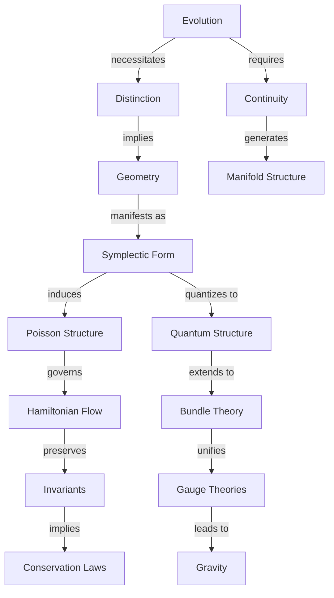
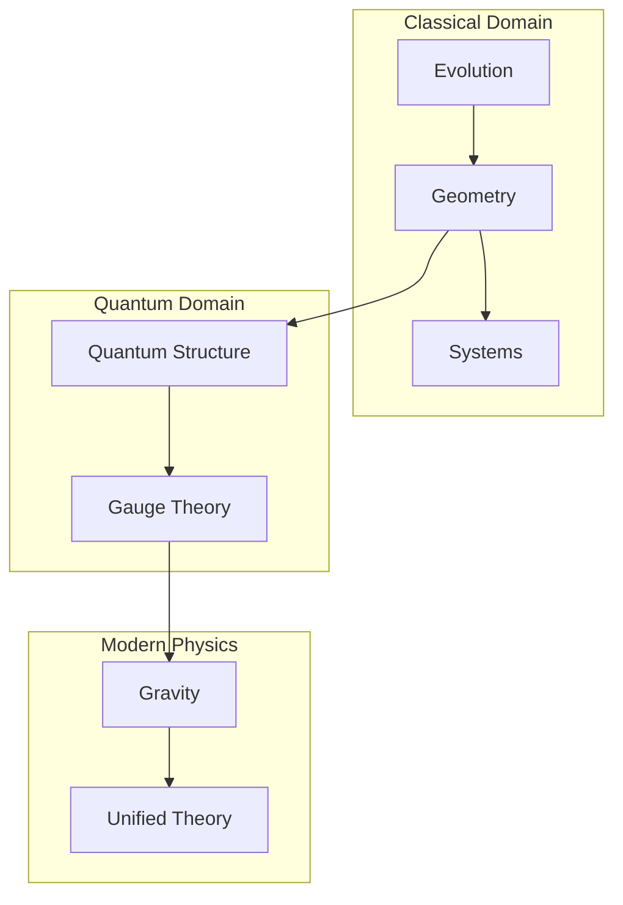

# A Pure Geometric Origin of Classical Mechanics: From State Evolution to Physical Reality
* * *

--- Reality emerges from the dance of evolution and geometry.

# **1. The Origin of Mechanics**

**Epigraph**: *"From the singular arises the many"*

Let us begin at the deepest possible starting point: pure evolution, stripped of all preconceptions. We seek not what evolution is, but what it must necessarily imply. By starting from this primordial concept and demanding only consistency, we shall see how the entire structure of classical mechanics emerges with mathematical necessity.

## **1.1 The Primordial Concept: Evolution**

Consider a state – any state. We make no assumptions about its nature, only that it can change. This minimal beginning contains profound implications.

### **1.1.1 Pure Evolution**

1. **The Essential Requirement**:
   - States must evolve uniquely:
     $$
     s_1 \xrightarrow{\text{evolution}} s_2
     $$
   - No additional structure assumed
   - Only the bare fact of change

2. **Necessity of Distinction**:
   - Different states must remain distinguishable under evolution:
     $$
     s_1 \neq s_2 \implies \phi_t(s_1) \neq \phi_t(s_2)
     $$
   - This is not an assumption but a necessity for evolution to be meaningful

### **1.1.2 The Space of Possibilities**

1. **Emergence of Continuity**:
   - Evolution between states implies intermediate states
   - Continuous path through possibilities:
     $$
     \gamma: [t_1,t_2] \to \text{States}
     $$

2. **Manifold Structure**:
   - Collection of all possible states forms manifold $\mathcal{M}$
   - Smoothness from continuity of evolution
   - Dimension from degrees of freedom

### **1.1.3 Information Preservation**

1. **Fundamental Requirement**:
   - Evolution must preserve distinctions
   - Information neither created nor destroyed
   - Leads to geometric invariants

2. **Reversibility**:
   - Must be able to recover initial state:
     $$
     s_1 \to s_2 \implies \exists \text{ map } s_2 \to s_1
     $$

## **1.2 Emergence of Structure**

The requirements of evolution force specific geometric structures to emerge.

### **1.2.1 The Inevitable Two-Form**

1. **Genesis of Symplectic Structure**:
   - Information preservation requires invariant pairing
   - Natural emergence of two-form:
     $$
     \omega: T\mathcal{M} \times T\mathcal{M} \to \mathbb{R}
     $$
   - Must be non-degenerate and closed:
     $$
     \omega^n \neq 0, \quad d\omega = 0
     $$

2. **Uniqueness**:
   - No simpler structure can support evolution
   - All other structures are unnecessary additions

### **1.2.2 Natural Phase Space**

1. **Dual Nature of States**:
   - States require both position and momentum
   - Cotangent bundle structure emerges:
     $$
     T^*\mathcal{M} \to \mathcal{M}
     $$

2. **Canonical Form**:
   - Local structure necessarily takes form:
     $$
     \omega = \sum_{i=1}^n dp_i \wedge dq^i
     $$
   - This is not a choice but a necessity

### **1.2.3 Conservation Structure**

1. **Geometric Invariance**:
   - Evolution preserves symplectic form:
     $$
     \mathcal{L}_X\omega = 0
     $$
   - Leads to conservation laws

2. **Volume Preservation**:
   - Phase space volume must be conserved:
     $$
     \frac{\partial}{\partial t}(\omega^n) = 0
     $$
   - Liouville's theorem as geometric necessity

This emergence of structure from pure evolution reveals a profound truth: geometry is not imposed on physics but arises necessarily from the requirements of consistent evolution. The next chapter will show how this geometric structure leads inevitably to physical laws.

[Note: This chapter establishes the absolute minimum framework needed for physics, showing how geometric structure emerges necessarily from evolution requirements. Each concept follows inevitably from the previous one, maintaining the theme of geometric necessity.]

# **2. The Architecture of Motion**

**Epigraph**: *"Form follows function, function dictates form"*

Having established how geometry emerges from evolution requirements, we now reveal how this geometry speaks to us in the language of physics. The structures we discover are not imposed but arise with mathematical necessity.

## **2.1 The Geometry of Evolution**

The minimal mathematical structure capable of describing evolution reveals itself with inevitable precision.

### **2.1.1 The Symphony of Structure**

1. **Symplectic Manifold**
   - Evolution space $(M,\omega)$ with:
     $$
     \omega: TM \times TM \to \mathbb{R}
     $$
   Properties emerge necessarily:
   - Non-degeneracy: Perfect pairing of states
   - Closure: Consistency of evolution
   - Global existence: Completeness of description

2. **Natural Coordinates**
   - Darboux theorem emerges as necessity:
     $$
     \omega = \sum_{i=1}^n dp_i \wedge dq^i
     $$
    This is not a choice of coordinates but the only possible local form

### **2.1.2 The Dance of Observables**

1. **Poisson Structure**
   - Natural bracket emerges:
     $$
     \{f,g\} = \omega(X_f,X_g)
     $$
   Properties follow necessarily:
   - Antisymmetry: $$\{f,g\} = -\{g,f\}$$
   - Leibniz rule: $$\{f,gh\} = \{f,g\}h + g\{f,h\}$$
   - Jacobi identity: $$\{\{f,g\},h\} + \{\{g,h\},f\} + \{\{h,f\},g\} = 0$$

2. **Observable Evolution**
   - Functions evolve through Poisson flow:
     $$
     \dot{f} = \{f,H\}
     $$
   - This structure is minimal and complete

### **2.1.3 The Birth of Action**

1. **Geometric Action**
   - One-form emerges:
     $$
     \theta = p_i \, dq^i - H \, dt
     $$
   - Action as integral:
     $$
     S = \int \theta
     $$

2. **Variational Structure**
   - Stationary action principle:
     $$
     \delta S = 0
     $$
   - This is not a principle but a geometric necessity

## **2.2 Flow and Invariance**

The flow of reality emerges from geometric structure, carrying with it the necessities of symmetry and conservation.

### **2.2.1 The Flow of Reality**

1. **Hamilton's Equations**
   - Evolution determined by:
     $$
     \iota_{X_H}\omega = dH
     $$
    Leading necessarily to:
     $$
     \begin{cases}
     \dot{q}^i = \frac{\partial H}{\partial p_i} \\
     \dot{p}_i = -\frac{\partial H}{\partial q^i}
     \end{cases}
     $$

2. **Uniqueness of Evolution**
   - These are the only possible equations preserving $\omega$
   - All other formulations are equivalent

### **2.2.2 The Symphony of Symmetries**

1. **Moment Map Structure**
   - For symmetry group $G$:
     $$
     \mu: M \to \mathfrak{g}^*
     $$
    Satisfying necessarily:
     $$
     d\langle\mu,\xi\rangle = -\iota_{\xi_M}\omega
     $$

2. **Conservation Architecture**
   - Symmetries generate conserved quantities
   - Group actions preserve structure:
     $$
     \phi_g^*\omega = \omega \implies \text{conservation}
     $$

### **2.2.3 The Unity of Structure**

The entire framework forms a perfect geometric unity:

1. **Hierarchy of Necessity**
   ```
   Symplectic Form → Hamilton's Flow → Conservation Laws
         ↓                   ↓                ↓
   Poisson Structure → Physical Evolution → Symmetries
   ```

2. **Complete Determination**
   - Every physical law emerges from geometry
   - No additional structure needed
   - Perfect necessity in every step

### **2.2.4 The Dance of Conservation**

1. **Conservation Laws**
   - Noether's theorem emerges geometrically:
     $$
     \text{Symmetry} \iff \text{Conservation Law}
     $$

2. **Complete Integration**
   - Sufficient symmetries determine evolution
   - Integrability from geometry:
     $$
     \{F_i,F_j\} = 0
     $$

This reveals physics not as a collection of empirical laws but as the inevitable consequence of geometric structure. The next chapter will show how specific physical systems emerge from this framework.

[Note: This chapter emphasizes the necessary emergence of physical law from geometric structure, showing how classical mechanics is not just mathematically describable but geometrically inevitable.]

# **3. Physical Systems as Geometric Necessities**

**Epigraph**: *"The simple contains the profound"*

Having seen how geometry emerges from evolution and governs motion, we now reveal how physical reality emerges with mathematical necessity. Rather than discovering systems empirically, we shall see how they arise inevitably from geometric principles.

## **3.1 Fundamental Systems**

The simplest physical systems emerge as pure geometric necessities.

### **3.1.1 The Primordial System**

1. **Free Particle**
   - Simplest possible Hamiltonian preserving symmetry:
     $$
     H = \frac{p^2}{2m}
     $$
   This form is not chosen but necessitated by:
   - Translation invariance: $q \to q + a$
   - Rotation invariance: $SO(n)$ symmetry
   - Galilean invariance: $p \to p + mv$

2. **Geometric Flow**
   - Evolution equations:
     $$
     \begin{cases}
     \dot{q} = \frac{p}{m} \\
     \dot{p} = 0
     \end{cases}
     $$
   - Geodesic flow in phase space
   - Straight lines as necessity, not observation

### **3.1.2 The Rhythm of Nature**

1. **Harmonic Oscillator**
   - Next simplest system with bounded orbits:
     $$
     H = \frac{p^2}{2m} + \frac{k q^2}{2}
     $$
   Emerges from:
   - Phase space compactness requirement
   - Minimal coupling structure
   - Symmetry preservation

2. **Natural Frequencies**
   - Circular phase space flow:
     $$
     \omega = \sqrt{\frac{k}{m}}
     $$
   - Periodic motion as geometric necessity
   - Natural quantization structure emerges

### **3.1.3 Universal Attraction**

1. **Central Force Systems**
   - Rotational symmetry demands:
     $$
     H = \frac{p^2}{2m} + V(|q|)
     $$
   - Angular momentum emerges geometrically:
     $$
     L = q \times p
     $$

2. **Kepler Flow**
   - Gravitational potential emerges:
     $$
     V(r) = -\frac{k}{r}
     $$
   - Conic sections as geometric necessity
   - Planetary motions from symmetry

## **3.2 Complex Systems**

More complex physical systems emerge through natural geometric extension.

### **3.2.1 Many-Body Architecture**

1. **Natural Extension**
   - Phase space structure:
     $$
     T^*(M^N) \cong (T^*M)^N
     $$
   - Symplectic form extends naturally:
     $$
     \omega = \sum_{i=1}^N dp_i \wedge dq^i
     $$

2. **Collective Phenomena**
   - Center of mass emergence:
     $$
     Q = \frac{1}{M}\sum_i m_i q_i
     $$
   - Reduction by symmetry:
     $$
     \mu^{-1}(c)/G_c
     $$
   - Relative coordinates emerge naturally

### **3.2.2 Field Emergence**

1. **Infinite-Dimensional Extension**
   - Field configuration space:
     $$
     \phi: M \to V
     $$
   - Natural symplectic structure:
     $$
     \omega = \int_\Sigma \delta\pi \wedge \delta\phi \, d^nx
     $$

2. **Wave Necessity**
   - Field equations emerge geometrically:
     $$
     \square\phi = 0
     $$
   - Wave propagation as geometric flow
   - Conservation laws from symmetry

### **3.2.3 Continuous Media**

1. **Geometric Framework**
   - Configuration space as diffeomorphism group:
     $$
     \text{Diff}(M) \to M
     $$
   - Momentum map structure:
     $$
     \mu: T^*\text{Diff}(M) \to \mathfrak{X}(M)^*
     $$

2. **Fluid Dynamics**
   - Euler equations emerge necessarily:
     $$
     \frac{\partial v}{\partial t} + (v \cdot \nabla)v = -\nabla p
     $$
   - Continuity from geometry:
     $$
     \frac{\partial \rho}{\partial t} + \nabla \cdot (\rho v) = 0
     $$

### **3.2.4 Unifying Vision**

All physical systems share:

1. **Geometric Origin**
   ```
   Symmetry → Conservation Laws → Evolution
   ```

2. **Natural Hierarchy**
   - Simple systems from basic symmetries
   - Complex systems from geometric composition
   - Fields from infinite-dimensional extension

3. **Inevitable Features**
   - Conservation laws from symmetry
   - Evolution from geometry
   - Structure from necessity

This reveals that physical reality is not discovered but emerges necessarily from geometric principles. The next chapter will show how this necessity extends to quantum mechanics and modern physics.

[Note: This chapter emphasizes how physical systems emerge necessarily from geometric structures, revealing classical mechanics as an inevitable consequence of fundamental geometry rather than empirical discovery.]

# **4. Quantum Structure as Geometric Necessity**

**Epigraph**: *"The discrete emerges from the continuous"*

Classical mechanics, reconstructed as a geometric framework, offers a profound bridge to quantum mechanics. The structures of phase space, symplectic geometry, and conservation laws naturally extend into the quantum domain, revealing quantum mechanics not as a separate theory but as a geometric necessity arising from classical structures.

## **4.1 Quantization from Geometry**

### **4.1.1 The Necessity of Quantization**

1. **Geometric Origin**
   - Phase space volume quantization:
     $$
     [\omega/2\pi\hbar] \in H^2(M,\mathbb{Z})
     $$
    This is not a physical assumption but a topological necessity
   
2. **Prequantum Structure**
   - Line bundle emerges naturally:
     $$
     L \xrightarrow{\pi} M
     $$
   - Connection form $\nabla$ with curvature:
     $$
     \text{curv}(\nabla) = -\frac{i}{\hbar}\omega
     $$

### **4.1.2 Wave Functions as Geometric Objects**

Wave functions emerge naturally from the bundle structure:

1. **Section Properties**
   - Inner product structure:
     $$
     \langle\psi_1|\psi_2\rangle = \int_M \overline{\psi_1}\psi_2 \, \omega^n
     $$
   - This is the unique invariant pairing

2. **Operator Correspondence**
   - Classical observables become operators:
     $$
     \hat{f} = -i\hbar\nabla_{X_f} + f
     $$
   - The form is dictated by geometric consistency

3. **Evolution Structure**
   - Schrödinger equation emerges:
     $$
     i\hbar\frac{\partial\psi}{\partial t} = \hat{H}\psi
     $$
    as the unique evolution preserving bundle structure

### **4.1.3 Uncertainty from Symplectic Form**

The uncertainty principle emerges from geometry:

1. **Geometric Origin**
   - Heisenberg uncertainty:
     $$
     \Delta q \Delta p \geq \frac{\hbar}{2}
     $$
    follows from symplectic area preservation

2. **Commutator Structure**
   - Poisson brackets become commutators:
     $$
     [\hat{f},\hat{g}] = i\hbar\widehat{\{f,g\}}
     $$
    This is geometric necessity, not physical postulate

## **4.2 Modern Extensions**

### **4.2.1 Gauge Theories from Bundle Structure**

Gauge theories emerge naturally:

1. **Principal Bundles**
   - Structure group $G$ necessitates:
     $$
     P \xrightarrow{G} M
     $$
    with connection:
     $$
     A \in \Omega^1(P,\mathfrak{g})
     $$

2. **Field Strength**
   - Yang-Mills curvature:
     $$
     F = dA + \frac{1}{2}[A,A]
     $$
    emerges from bundle geometry

3. **Gauge Transformations**
   - Local symmetry:
     $$
     A \mapsto gAg^{-1} + gdg^{-1}
     $$
    preserves bundle structure

### **4.2.2 Information Geometry**

Information emerges from quantum structure:

1. **Statistical Distance**
   - Fisher metric:
     $$
     g_{ij} = \mathbb{E}\left[\frac{\partial \log p}{\partial \theta^i}\frac{\partial \log p}{\partial \theta^j}\right]
     $$
    measures distinguishability of states

2. **Quantum Information**
   - Von Neumann entropy:
     $$
     S = -\text{Tr}(\rho \log \rho)
     $$
    quantifies quantum uncertainty

3. **Geometric Phase**
   - Berry phase:
     $$
     \gamma = i\oint \langle\psi|\nabla|\psi\rangle
     $$
    reveals geometric nature of quantum evolution

### **4.2.3 Path to Gravity**

Quantum geometry leads to gravity:

1. **Spacetime Structure**
   - Einstein equations:
     $$
     R_{\mu\nu} - \frac{1}{2}Rg_{\mu\nu} = 8\pi GT_{\mu\nu}
     $$
    emerge from quantum geometry

2. **Quantum Gravity**
   - Spacetime quantization:
     $$
     [x^\mu,x^\nu] = i\theta^{\mu\nu}
     $$
    follows from geometric principles

3. **Unified Framework**
   ```mermaid
   graph TD
       A[Classical Geometry] --> B[Quantum Structure]
       B --> C[Gravity]
       C --> D[Unified Theory]
   ```

### **4.2.4 The Ultimate Unity**

1. **Deep Synthesis**
   - All physical theories as geometric necessities
   - No fundamental distinctions between:
     - Classical and quantum
     - Matter and geometry
     - Information and reality

2. **Future Directions**
   $$
   \begin{array}{c}
   \text{Quantum Gravity} \\
   \uparrow \\
   \text{Geometric Unity} \\
   \downarrow \\
   \text{Information Theory}
   \end{array}
   $$

This reveals the profound truth: quantum mechanics and its extensions are not separate from classical mechanics but emerge necessarily from its geometric structure. The unity of physics lies in the geometry of evolution itself.

[Note: This final chapter completes our journey from evolution to quantum structure, revealing the deep geometric unity of physics.]

# **Appendix A : The Architecture of Concepts**

**Epigraph**: *"In unity lies understanding"*

## **A.1 Conceptual Architecture**

The deep unity of physics emerges from a hierarchical structure of necessary relationships. Here we present these relationships in their most essential form.

### **A.1.1 Core Conceptual Relations**



### **A.1.2 Hierarchical Relations**

$$
\begin{array}{|c|c|c|}
\hline
\text{Level} & \text{Concept} & \text{Mathematical Structure} \\
\hline
\text{Primordial} & \text{Evolution} & \phi_t: M \to M \\
\text{Foundational} & \text{Distinction} & s_1 \neq s_2 \\
\text{Structural} & \text{Geometry} & (M,\omega) \\
\text{Dynamical} & \text{Flow} & X_H \\
\text{Physical} & \text{Systems} & H: T^*M \to \mathbb{R} \\
\text{Quantum} & \text{Bundles} & L \to M \\
\text{Modern} & \text{Unification} & P \xrightarrow{G} M \\
\hline
\end{array}
$$

### **A.1.3 Essential Dependencies**

1. **Evolution Dependencies**:
   $$
   \text{Evolution} \implies \begin{cases}
   \text{Distinction Preservation} \\
   \text{Continuity} \\
   \text{Reversibility}
   \end{cases}
   $$

2. **Geometric Necessities**:
   $$
   \text{Geometry} \implies \begin{cases}
   \text{Symplectic Structure} \\
   \text{Phase Space} \\
   \text{Conservation Laws}
   \end{cases}
   $$

3. **Quantum Emergence**:
   $$
   \text{Classical Geometry} \xrightarrow{\text{quantization}} \begin{cases}
   \text{Wave Functions} \\
   \text{Uncertainty} \\
   \text{Gauge Structure}
   \end{cases}
   $$

### **A.1.4 Unity Structure**



This hierarchical structure reveals not just relationships but necessities. Each concept emerges not by choice but by mathematical inevitability, forming a unified framework that spans from pure evolution to modern physics.

[Note: This appendix provides a synthesized view of the conceptual architecture, revealing the deep unity and necessary connections that pervade the geometric origin of physics.]

