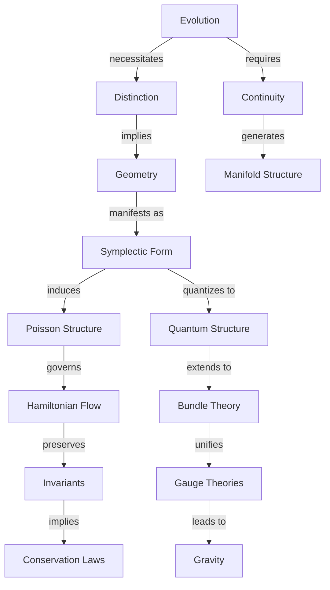
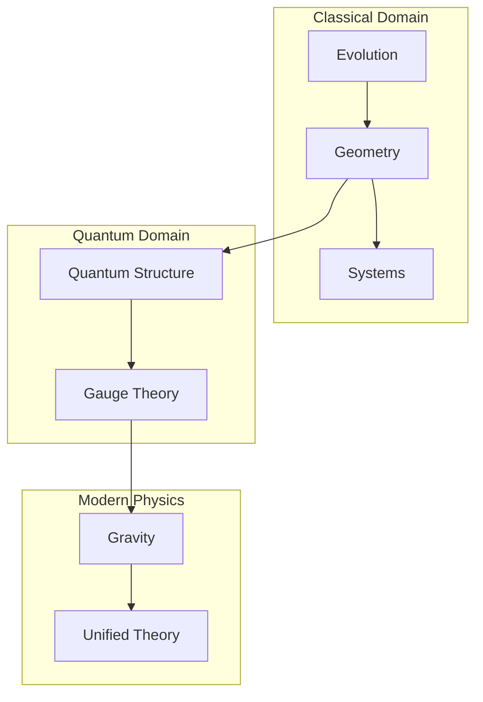

# 纯几何起源的经典力学：从状态演化到物理实在
* * *

--- 物理实在从演化与几何的舞蹈中涌现。

# **1. 力学的起源**

**题词**：*"从单一中产生多样"*

让我们从最深的起点开始：纯粹的演化，剥离所有预设概念。我们不问演化是什么，而是问它必然意味着什么。从这个原始的概念出发，并且只需求一致性，我们将看到整个经典力学结构如何以数学的必然性涌现。

## **1.1 原始概念：演化**

考虑一个状态——任何状态。我们不对它的性质做任何假设，只认为它可以变化。这个最小的开端蕴含着深远的意义。

### **1.1.1 纯粹演化**

1. **基本要求**：
   - 状态必须唯一地演化：
     $$
     s_1 \xrightarrow{\text{演化}} s_2
     $$
   - 不假设任何额外结构
   - 只有变化这一基本事实

2. **区分的必要性**：
   - 不同的状态在演化下必须保持可区分：
     $$
     s_1 \neq s_2 \implies \phi_t(s_1) \neq \phi_t(s_2)
     $$
   - 这不是假设，而是演化有意义的必要条件

### **1.1.2 可能性的空间**

1. **连续性的出现**：
   - 状态之间的演化暗示中间状态的存在
   - 通过可能性的连续路径：
     $$
     \gamma: [t_1,t_2] \to \text{States}
     $$

2. **流形结构**：
   - 所有可能状态的集合形成流形 $\mathcal{M}$
   - 由演化的连续性带来的光滑性
   - 由自由度决定的维度

### **1.1.3 信息保存**

1. **基本要求**：
   - 演化必须保存区分
   - 信息既不被创造也不被销毁
   - 导致几何不变量

2. **可逆性**：
   - 必须能够恢复初始状态：
     $$
     s_1 \to s_2 \implies \exists \text{ 映射 } s_2 \to s_1
     $$

## **1.2 结构的涌现**

演化的条件迫使特定的几何结构涌现。

### **1.2.1 不可避免的二形式**

1. **辛结构的起源**：
   - 信息保存需要不变配对
   - 自然涌现出 $2$-形式：
     $$
     \omega: T\mathcal{M} \times T\mathcal{M} \to \mathbb{R}
     $$
   - 必须是非退化的和封闭的：
     $$
     \omega^n \neq 0, \quad d\omega = 0
     $$

2. **唯一性**：
   - 没有更简单的结构可以支持演化
   - 所有其他结构都是不必要的添加

### **1.2.2 自然相空间**

1. **状态的双重性质**：
   - 状态需要同时包含位置和动量
   - 余切丛结构涌现：
     $$
     T^*\mathcal{M} \to \mathcal{M}
     $$

2. **正则形式**：
   - 局部结构必然采取如下形式：
     $$
     \omega = \sum_{i=1}^n dp_i \wedge dq^i
     $$
   - 这不是选择，而是必要性

### **1.2.3 守恒结构**

1. **几何不变性**：
   - 演化保持辛形式：
     $$
     \mathcal{L}_X\omega = 0
     $$
   - 导致守恒定律

2. **体积保存**：
   - 相空间体积必须被保存：
     $$
     \frac{\partial}{\partial t}(\omega^n) = 0
     $$
   - Liouville 定理作为几何必然性

这种从纯粹演化中涌现的结构揭示一个深刻的真理：几何并不是强加于物理学上的，而是从一致演化的条件中必然产生的。下一章将展示这种几何结构如何不可避免地导致物理定律。

[注：本章建立了物理学所需的绝对最小框架，展示了几何结构如何从演化条件中必然涌现。每个概念都不可避免地从前一个概念中得出，保持几何必然性的主题。]

# **2. 运动的架构**

**题词**：*"形式跟随函数，函数决定形式"*

已经建立几何如何从演化条件中涌现之后，我们现在揭示这种几何如何用物理学的语言向我们说话。我们发现的结构不是强加的，而是以数学的必然性涌现的。

## **2.1 演化的几何**

能够描述演化的最小数学结构以不可避免的精确性展现出来。

### **2.1.1 结构的交响乐**

1. **辛流形**
   - 演化空间 $(M,\omega)$ 具有：
     $$
     \omega: TM \times TM \to \mathbb{R}
     $$
   性质必然涌现：
   - 非退化性：状态的完美配对
   - 封闭性：演化的自洽性
   - 全局存在性：描述的完整性

2. **自然坐标**
   - Darboux 定理作为必然性出现：
     $$
     \omega = \sum_{i=1}^n dp_i \wedge dq^i
     $$
    这不是坐标的选取，而是唯一的可能局部形式

### **2.1.2 观测量的舞蹈**

1. **泊松结构**
   - 自然括号涌现：
     $$
     \{f,g\} = \omega(X_f,X_g)
     $$
   性质必然跟随：
   - 反对称性：$$\{f,g\} = -\{g,f\}$$
   - Leibniz规则：$$\{f,gh\} = \{f,g\}h + g\{f,h\}$$
   - Jacobi恒等式：$$\{\{f,g\},h\} + \{\{g,h\},f\} + \{\{h,f\},g\} = 0$$

2. **观测量的演化**
   - 函数通过泊松流演化：
     $$
     \dot{f} = \{f,H\}
     $$
   - 这种结构是最小且完整的

### **2.1.3 作用量的诞生**

1. **几何作用量**
   - $1$-形式涌现：
     $$
     \theta = p_i \, dq^i - H \, dt
     $$
   - 作用量作为积分：
     $$
     S = \int \theta
     $$

2. **变分结构**
   - 站立作用量原理：
     $$
     \delta S = 0
     $$
   - 这不是原则，而是几何必然性

## **2.2 流与不变性**

实在的流动从几何结构中涌现，伴随着对称性和守恒的必然性。

### **2.2.1 实在的流动**

1. **哈密顿方程**
   - 演化由以下确定：
     $$
     \iota_{X_H}\omega = dH
     $$
    必然导致：
     $$
     \begin{cases}
     \dot{q}^i = \frac{\partial H}{\partial p_i} \\
     \dot{p}_i = -\frac{\partial H}{\partial q^i}
     \end{cases}
     $$

2. **演化的唯一性**
   - 这些是唯一可能的保持 $\omega$ 的方程
   - 所有其他表述都是等价的

### **2.2.2 对称性的交响乐**

1. **动量映射结构**
   - 对于对称群 $G$：
     $$
     \mu: M \to \mathfrak{g}^*
     $$
    必然满足：
     $$
     d\langle\mu,\xi\rangle = -\iota_{\xi_M}\omega
     $$

2. **守恒架构**
   - 对称性生成守恒量
   - 群作用保持结构：
     $$
     \phi_g^*\omega = \omega \implies \text{守恒}
     $$

### **2.2.3 结构的统一**

整个框架形成完美的几何统一：

1. **必然性的层次**
   ```
   辛形式  → 哈密顿流 → 守恒定律
     ↓         ↓        ↓
   泊松结构 → 物理演化 → 对称性
   ```

2. **完全确定性**
   - 每个物理定律都从几何中涌现
   - 不需要额外的结构
   - 每一步都是完美的必然性

### **2.2.4 守恒的舞蹈**

1. **守恒定律**
   - Noether定理几何地涌现：
     $$
     \text{Symmetry} \iff \text{Conservation Law}
     $$

2. **完全整合**
   - 足够的对称性决定演化
   - 来自几何的可积性：
     $$
     \{F_i,F_j\} = 0
     $$

这揭示了物理学不是一个经验定律的集合，而是几何结构的必然结果。下一章将展示具体的物理系统如何从这个框架中涌现。

[注：本章强调了物理定律从几何结构中必然涌现，展示了经典力学不仅是数学上可描述的，而且是几何上不可避免的。]

# **3. 物理系统作为几何必然性**

**题词**：*"简单中蕴含深刻"*

在了解如何从演化中涌现出几何并支配运动之后，我们现在揭示物理实在如何以数学的必然性涌现。我们不是通过经验发现系统，而是看到它们如何不可避免地从几何原理中产生。

## **3.1 基本系统**

最简单的物理系统作为纯粹的几何必然性出现。

### **3.1.1 原始系统**

1. **自由粒子**
   - 保持对称性的最简哈密顿量：
     $$
     H = \frac{p^2}{2m}
     $$
   这种形式不是选择的结果，而是由以下条件决定：
   - 平移不变性：$q \to q + a$
   - 旋转不变性：$SO(n)$ 对称性
   - 伽利略不变性：$p \to p + mv$

2. **几何流**
   - 演化方程：
     $$
     \begin{cases}
     \dot{q} = \frac{p}{m} \\
     \dot{p} = 0
     \end{cases}
     $$
   - 相空间中的测地线流
   - 直线是必然的结果，而非观察

### **3.1.2 自然的节奏**

1. **谐振子**
   - 具有有界轨道的下一个最简单系统：
     $$
     H = \frac{p^2}{2m} + \frac{k q^2}{2}
     $$
   从以下条件中涌现：
   - 相空间紧致性要求
   - 最小耦合结构
   - 对称性保持

2. **自然频率**
   - 圆形相空间流：
     $$
     \omega = \sqrt{\frac{k}{m}}
     $$
   - 周期运动作为几何必然性
   - 自然量子化结构涌现

### **3.1.3 普遍引力**

1. **中心力系统**
   - 旋转对称性要求：
     $$
     H = \frac{p^2}{2m} + V(|q|)
     $$
   - 角动量几何地涌现：
     $$
     L = q \times p
     $$

2. **开普勒流**
   - 引力势能涌现：
     $$
     V(r) = -\frac{k}{r}
     $$
   - 圆锥截面作为几何必然性
   - 行星运动从对称性而来

## **3.2 复杂系统**

更复杂的物理系统通过自然的几何扩展涌现。

### **3.2.1 多体架构**

1. **自然扩展**
   - 相空间结构：
     $$
     T^*(M^N) \cong (T^*M)^N
     $$
   - 辛形式自然扩展：
     $$
     \omega = \sum_{i=1}^N dp_i \wedge dq^i
     $$

2. **集体现象**
   - 质心涌现：
     $$
     Q = \frac{1}{M}\sum_i m_i q_i
     $$
   - 通过对称性简化：
     $$
     \mu^{-1}(c)/G_c
     $$
   - 相对坐标自然涌现

### **3.2.2 场的涌现**

1. **无穷维扩展**
   - 场配置空间：
     $$
     \phi: M \to V
     $$
   - 自然辛结构：
     $$
     \omega = \int_\Sigma \delta\pi \wedge \delta\phi \, d^nx
     $$

2. **波的必然性**
   - 场方程几何地涌现：
     $$
     \square\phi = 0
     $$
   - 波传播作为几何流
   - 从对称性得到守恒定律

### **3.2.3 连续介质**

1. **几何框架**
   - 配置空间作为微分同胚群：
     $$
     \text{Diff}(M) \to M
     $$
   - 动量映射结构：
     $$
     \mu: T^*\text{Diff}(M) \to \mathfrak{X}(M)^*
     $$

2. **流体力学**
   - Euler 方程必然涌现：
     $$
     \frac{\partial v}{\partial t} + (v \cdot \nabla)v = -\nabla p
     $$
   - 几何上的连续性：
     $$
     \frac{\partial \rho}{\partial t} + \nabla \cdot (\rho v) = 0
     $$

### **3.2.4 统一视图**

所有物理系统共享：

1. **几何起源**
   ```
   对称性 → 守恒定律 → 演化
   ```

2. **自然层次**
   - 从基本对称性得到简单系统
   - 从几何组合得到复杂系统
   - 从无穷维扩展得到场

3. **不可避免的特征**
   - 从对称性得到守恒定律
   - 从几何得到演化
   - 从必然性得到结构

这揭示了物理实在不是被发现的，而是从几何原理中必然涌现的。下一章将展示这种必然性如何延伸到量子力学和现代物理学。

[注：本章强调了物理系统如何从几何结构中必然涌现，揭示了经典力学作为一个不可避免的几何结果，而不是经验发现。]

# **4. 量子结构作为几何必然性**

**题词**：*"离散从连续中涌现"*

经典力学作为几何框架的重构，提供一个通向量子力学的深刻桥梁。相空间、辛几何和守恒定律的结构自然延伸到量子领域，揭示量子力学不是一个独立的理论，而是从经典结构中产生的几何必然性。

## **4.1 从几何到量化**

### **4.1.1 量化的必然性**

1. **几何起源**
   - 相空间体积量化：
     $$
     [\omega/2\pi\hbar] \in H^2(M,\mathbb{Z})
     $$
    这不是物理假设，而是拓扑必然性

2. **预量子结构**
   - 线丛自然涌现：
     $$
     L \xrightarrow{\pi} M
     $$
   - 带曲率的连接形式 $\nabla$：
     $$
     \text{curv}(\nabla) = -\frac{i}{\hbar}\omega
     $$

### **4.1.2 波函数作为几何对象**

波函数自然地从丛结构中涌现：

1. **截面性质**
   - 内积结构：
     $$
     \langle\psi_1|\psi_2\rangle = \int_M \overline{\psi_1}\psi_2 \, \omega^n
     $$
   - 这是唯一的不变配对

2. **算符对应**
   - 经典可观测量变为算符：
     $$
     \hat{f} = -i\hbar\nabla_{X_f} + f
     $$
   - 形式由几何一致性决定

3. **演化结构**
   - Schrödinger方程涌现：
     $$
     i\hbar\frac{\partial\psi}{\partial t} = \hat{H}\psi
     $$
    作为唯一保持丛结构的演化

### **4.1.3 不确定性来自辛形式**

不确定性原理从几何中涌现：

1. **几何起源**
   - Heisenberg不确定性：
     $$
     \Delta q \Delta p \geq \frac{\hbar}{2}
     $$
    由辛面积保持得出

2. **换位子结构**
   - Poisson括号变为换位子：
     $$
     [\hat{f},\hat{g}] = i\hbar\widehat{\{f,g\}}
     $$
    这是几何必然性，而不是物理公设

## **4.2 现代扩展**

### **4.2.1 从丛结构到规范理论**

规范理论自然涌现：

1. **主丛**
   - 结构群 $G$ 必然要求：
     $$
     P \xrightarrow{G} M
     $$
    带连接：
     $$
     A \in \Omega^1(P,\mathfrak{g})
     $$

2. **场强**
   - Yang-Mills曲率：
     $$
     F = dA + \frac{1}{2}[A,A]
     $$
    从丛几何中涌现

3. **规范变换**
   - 局部对称性：
     $$
     A \mapsto gAg^{-1} + gdg^{-1}
     $$
    保持丛结构

### **4.2.2 信息几何**

信息从量子结构中涌现：

1. **统计距离**
   - Fisher度量：
     $$
     g_{ij} = \mathbb{E}\left[\frac{\partial \log p}{\partial \theta^i}\frac{\partial \log p}{\partial \theta^j}\right]
     $$
    测量状态的可区分性

2. **量子信息**
   - Von Neumann熵：
     $$
     S = -\text{Tr}(\rho \log \rho)
     $$
    量化量子不确定性

3. **几何相位**
   - Berry相位：
     $$
     \gamma = i\oint \langle\psi|\nabla|\psi\rangle
     $$
    揭示量子演化的几何本质

### **4.2.3 通往引力的道路**

量子几何导致引力：

1. **时空结构**
   - Einstein方程：
     $$
     R_{\mu\nu} - \frac{1}{2}Rg_{\mu\nu} = 8\pi GT_{\mu\nu}
     $$
    从量子几何中涌现

2. **量子引力**
   - 时空量化：
     $$
     [x^\mu,x^\nu] = i\theta^{\mu\nu}
     $$
    由几何原则得出

3. **统一框架**
   ```mermaid
   graph TD
       A[经典几何] --> B[量子结构]
       B --> C[引力]
       C --> D[统一理论]
   ```

### **4.2.4 最终的统一**

1. **深层次综合**
   - 所有物理理论作为几何必然性
   - 经典与量子之间没有根本区别
   - 物质与几何之间没有根本区别
   - 信息与实在之间没有根本区别

2. **未来方向**
   $$
   \begin{array}{c}
   \text{量子引力} \\
   \uparrow \\
   \text{几何统一} \\
   \downarrow \\
   \text{信息理论}
   \end{array}
   $$

这揭示了一个深刻的真理：量子力学及其扩展并不是独立于经典力学的，而是从其几何结构中必然涌现的。物理的统一性在于演化本身的几何性。

[注：这一最终章节完成了我们从演化到量子结构的旅程，揭示了物理学的深层几何统一性。]

# **附录 A : 概念的架构**

**题词**：*"在统一中找到理解"*

## **A.1 概念架构**

物理学的深层统一性来自于必要关系的层级结构。这里我们以最本质的形式呈现这些关系。

### **A.1.1 核心概念关系**



### **A.1.2 层级关系**

$$
\begin{array}{|c|c|c|}
\hline
\text{Level} & \text{Concept} & \text{Mathematical Structure} \\
\hline
\text{Primordial} & \text{Evolution} & \phi_t: M \to M \\
\text{Foundational} & \text{Distinction} & s_1 \neq s_2 \\
\text{Structural} & \text{Geometry} & (M,\omega) \\
\text{Dynamical} & \text{Flow} & X_H \\
\text{Physical} & \text{Systems} & H: T^*M \to \mathbb{R} \\
\text{Quantum} & \text{Bundles} & L \to M \\
\text{Modern} & \text{Unification} & P \xrightarrow{G} M \\
\hline
\end{array}
$$

### **A.1.3 必要依赖**

1. **演化依赖**：
   $$
   \text{Evolution} \implies \begin{cases}
   \text{Distinction Preservation} \\
   \text{Continuity} \\
   \text{Reversibility}
   \end{cases}
   $$

2. **几何必然性**：
   $$
   \text{Geometry} \implies \begin{cases}
   \text{Symplectic Structure} \\
   \text{Phase Space} \\
   \text{Conservation Laws}
   \end{cases}
   $$

3. **量子涌现**：
   $$
   \text{Classical Geometry} \xrightarrow{\text{quantization}} \begin{cases}
   \text{Wave Functions} \\
   \text{Uncertainty} \\
   \text{Gauge Structure}
   \end{cases}
   $$

### **A.1.4 统一结构**



这种层级结构不仅揭示了关系，还揭示了必然性。每个概念不是通过选择而是通过数学的必然性涌现，形成一个从纯粹演化到现代物理学的统一框架。

[注：本附录提供了一个综合的概念架构视图，揭示了贯穿于物理学几何起源的深层次统一性和必要联系。]

