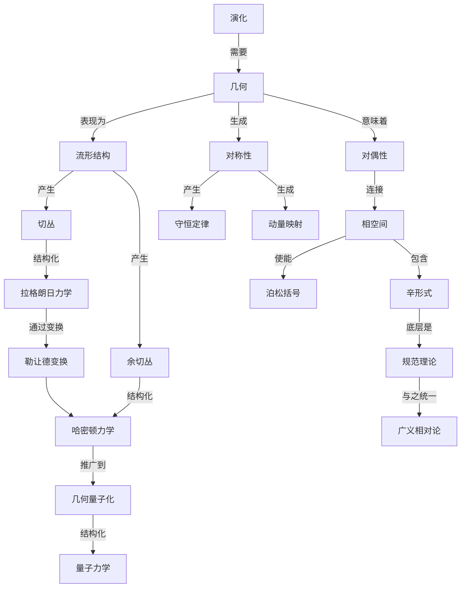

# 经典力学的几何框架：从演化原理到物理实在
* * *

--- 物理实在随着演化的几何展开而显现。

# **1. 演化的基础**

*"运动产生几何，几何孕育物理"*

让我们从最深的基础开始我们的旅程：纯粹的演化。我们不寻求演化是什么，而是它必然意味着什么。仅通过数学必要性，我们将见证整个经典力学几何框架的出现。

## **1.1 演化原理**

### **1.1.1 原始概念**

考虑最纯粹形式的演化，剥离所有先入之见。我们仅从以下几点开始：
- 一组状态
- 变化的可能性
- 别无其他

这个最小的开端包含深远的意义：

1. **基本结构**：
   - 状态唯一地演化：
     $$
     \phi: \mathcal{S} \times \mathbb{R} \to \mathcal{S}
     $$
   - 必然出现群性质：
     $$
     \phi_{t_1} \circ \phi_{t_2} = \phi_{t_1+t_2}
     $$

2. **流的必要性**：
   - 演化定义流：
     $$
     \frac{d}{dt}\phi_t(s) = X(\phi_t(s))
     $$
    其中 $X$ 是生成该流的向量场

### **1.1.2 区分保持**

演化必须保持状态之间的区别：

1. **形式要求**：
   - 对于不同的状态：
     $$
     s_1 \neq s_2 \implies \phi_t(s_1) \neq \phi_t(s_2) \quad \forall t
     $$
   - 这意味着演化映射是单射：
     $$
     \ker(d\phi_t) = \{0\}
     $$

2. **信息守恒**：
   - 区分的状态必须保持区分
   - 演化保持区分度量：
     $$
     d(\phi_t(s_1),\phi_t(s_2)) = F(d(s_1,s_2))
     $$
    其中 $F$ 是单调函数

### **1.1.3 连续性和可逆性**

演化必须满足基本要求：

1. **连续演化**：
   - 状态空间中的路径：
     $$
     \gamma: [t_1,t_2] \to \mathcal{S}
     $$
    是连续且可微的
   
2. **可逆性结构**：
   - 每个演化都有一个逆：
     $$
     \phi_t \circ \phi_{-t} = \text{id}_{\mathcal{S}}
     $$
   - 这意味着时间演化具有群结构

## **1.2 几何框架**

### **1.2.1 流形结构的出现**

演化的条件迫使几何结构的形成：

1. **局部结构**：
   - 状态空间自然形成流形 $\mathcal{M}$
   - 由演化路径产生的图表：
     $$
     \psi_\alpha: U_\alpha \subset \mathcal{M} \to \mathbb{R}^n
     $$

2. **微分结构**：
   - 图表之间的光滑过渡：
     $$
     \psi_\beta \circ \psi_\alpha^{-1}: \psi_\alpha(U_\alpha \cap U_\beta) \to \psi_\beta(U_\alpha \cap U_\beta)
     $$
    是可微的

### **1.2.2 切丛和余切丛结构**

演化需要额外的结构：

1. **切丛**：
   - 速度空间出现：
     $$
     T\mathcal{M} = \bigsqcup_{p \in \mathcal{M}} T_p\mathcal{M}
     $$
   - 自然投影：
     $$
     \pi: T\mathcal{M} \to \mathcal{M}
     $$

2. **余切丛**：
   - 动量空间出现：
     $$
     T^*\mathcal{M} = \bigsqcup_{p \in \mathcal{M}} T_p^*\mathcal{M}
     $$
   - 规范 $1$-形式：
     $$
     \theta = p_i \, dq^i
     $$

### **1.2.3 自然不变量**

几何不变量必然出现：

1. **辛结构**：
   - $2$-形式出现：
     $$
     \omega = d\theta = dp_i \wedge dq^i
     $$
   - 非退化性：
     $$
     \omega^n \neq 0
     $$
   - 封闭性：
     $$
     d\omega = 0
     $$

2. **体积元素**：
   - Liouville 形式：
     $$
     \Omega = \frac{1}{n!}\omega^n
     $$
   - 体积守恒：
     $$
     \mathcal{L}_X\Omega = 0
     $$

这种结构的出现揭示一个深刻的事实：几何不是强加给物理的，而是从一致演化的条件中必然产生的。下一章将展示这个几何结构如何不可避免地导致作用量原理。

[注：本章建立了物理学所需的绝对最小框架，展示几何结构如何从演化条件中必然出现。每个概念都不可避免地从上一个概念得出，保持数学严谨性的同时强调几何的必然性。]

# **2. 作用量的架构**

*"作用量塑造空间，空间塑造运动"*

在建立几何如何从演化中涌现之后，我们现在揭示作用量的深刻架构。在这里我们发现，作用量不仅仅是一个数学构造，而是从演化本身的结构中必然产生的几何需求。

## **2.1 作用量原理**

### **2.1.1 作用量的几何起源**

作用量自然地从演化的几何中涌现：

1. **基本一形式**：
   - 在扩展相空间 $T^*M \times \mathbb{R}$ 上：
     $$
     \theta_H = p_i \, dq^i - H \, dt
     $$
   - 几何定义的作用量：
     $$
     S[\gamma] = \int_{\gamma} \theta_H
     $$

2. **几何结构**：
   - 作用量作为水平 $1$-形式：
     $$
     \alpha: TM \times \mathbb{R} \to \mathbb{R}
     $$
   - 接触结构出现：
     $$
     d\theta_H = dp_i \wedge dq^i - dH \wedge dt
     $$

### **2.1.2 变分的必要性**

变分原理从几何结构中涌现：

1. **路径空间几何**：
   - 路径空间：
     $$
     \mathcal{P}(M) = \{\gamma: [t_1,t_2] \to M\}
     $$
   - 路径空间的切空间：
     $$
     T_\gamma\mathcal{P}(M) = \{\delta\gamma: [t_1,t_2] \to TM\}
     $$

2. **变分结构**：
   - 第一变分：
     $$
     \delta S[\gamma] = \int_{t_1}^{t_2} \left(\frac{\partial L}{\partial q^i}\delta q^i + \frac{\partial L}{\partial \dot{q}^i}\delta \dot{q}^i\right)dt
     $$
   - 作用量驻点原理：
     $$
     \delta S[\gamma] = 0
     $$

### **2.1.3 路径空间结构**

路径空间的几何揭示深层结构：

1. **无限维流形**：
   - 路径空间度量：
     $$
     G(\delta\gamma_1,\delta\gamma_2) = \int_{t_1}^{t_2} g_{\mu\nu}\dot{\gamma}_1^\mu\dot{\gamma}_2^\nu dt
     $$
   - 自然辛形式：
     $$
     \Omega = \int_{t_1}^{t_2} \omega(\delta\gamma_1,\delta\gamma_2) dt
     $$

2. **临界点理论**：
   - 作用量泛函梯度：
     $$
     \nabla S[\gamma] = 0 \iff \text{Classical path}
     $$
   - Morse 理论结构：
     $$
     \text{ind}(\gamma) = \dim\{\delta\gamma: D^2S[\gamma](\delta\gamma,\delta\gamma) < 0\}
     $$

## **2.2 拉格朗日结构**

### **2.2.1 配置空间几何**

配置空间的几何自然出现：

1. **切丛结构**：
   - 速度空间：
     $$
     TM = \{(q,\dot{q}): q \in M, \dot{q} \in T_qM\}
     $$
   - 自然坐标：
     $$
     (q^i,\dot{q}^i) \text{ on } TM
     $$

2. **度量结构**：
   - 动能度量：
     $$
     T = \frac{1}{2}g_{ij}(q)\dot{q}^i\dot{q}^j
     $$
   - 联络系数：
     $$
     \Gamma^i_{jk} = \frac{1}{2}g^{il}(\partial_jg_{kl} + \partial_kg_{jl} - \partial_lg_{jk})
     $$

### **2.2.2 Euler-Lagrange 方程的出现**

Euler-Lagrange 方程几何地出现：

1. **自然流**：
   - 二阶向量场：
     $$
     \Gamma = \dot{q}^i\frac{\partial}{\partial q^i} + \ddot{q}^i\frac{\partial}{\partial \dot{q}^i}
     $$
   - Euler-Lagrange 方程：
     $$
     \frac{d}{dt}\frac{\partial L}{\partial \dot{q}^i} - \frac{\partial L}{\partial q^i} = 0
     $$

2. **几何形式**：
   - Cartan $2$-形式：
     $$
     \omega_L = \frac{\partial^2L}{\partial \dot{q}^i\partial \dot{q}^j}dq^i \wedge dq^j
     $$
   - 能量函数：
     $$
     E = \dot{q}^i\frac{\partial L}{\partial \dot{q}^i} - L
     $$

### **2.2.3 自然机械系统**

物理系统从几何结构中涌现：

1. **几何势能**：
   - 自然拉格朗日量：
     $$
     L = \frac{1}{2}g_{ij}\dot{q}^i\dot{q}^j - V(q)
     $$
   - 势能几何：
     $$
     dV = F_i \, dq^i
     $$

2. **系统分类**：
   - 自由系统：
     $$
     L = \frac{1}{2}m\dot{q}^2
     $$
   - 谐振结构：
     $$
     L = \frac{1}{2}m\dot{q}^2 - \frac{1}{2}kq^2
     $$
   - 中心力：
     $$
     L = \frac{1}{2}m(\dot{r}^2 + r^2\dot{\theta}^2) - V(r)
     $$

这揭示了作用量不是一个原则，而是一个几何必然。下一章将展示这个结构如何通过对偶性自然地导致相空间和哈密顿力学。

[注：本章展示了作用量原理和拉格朗日力学的几何必然性，强调它们是从基本结构中涌现出来的，而不是基于物理假设。]

# **3. 运动的对偶性**

*"在对偶中蕴含理解"*

在建立作用量和拉格朗日力学的几何必然性之后，我们现在揭示一个更深层次的真理：运动的基本对偶性。这种对偶性，体现在位置-动量关系中，不仅是方便的，而且是几何上不可避免的。

## **3.1 相空间结构**

### **3.1.1 对偶性的必要性**

1. **基本配对**：
   - 自然配对出现：
     $$
     \langle p, v \rangle: T^*_qM \times T_qM \to \mathbb{R}
     $$
   - 规范结构：
     $$
     \theta = p_i \, dq^i
     $$
    表示普遍的对偶耦合

2. **完整的相空间**：
   - 余切丛结构：
     $$
     T^*M = \bigcup_{q \in M} T^*_qM
     $$
   - 自然投影：
     $$
     \pi: T^*M \to M
     $$
    在每个点 $q$ 上有纤维 $T^*_qM$

### **3.1.2 Legendre 变换几何**

1. **几何结构**：
   - 自然定义的变换：
     $$
     \mathcal{L}: TM \to T^*M
     $$
   - 纤维导数：
     $$
     \mathbb{F}L: TM \to T^*M
     $$
     $$
     \mathbb{F}L(q,\dot{q})_i = \frac{\partial L}{\partial \dot{q}^i}
     $$

2. **对偶性质**：
   - 凸性结构：
     $$
     \det\left(\frac{\partial^2 L}{\partial \dot{q}^i \partial \dot{q}^j}\right) \neq 0
     $$
   - 能量函数出现：
     $$
     H(q,p) = p_i\dot{q}^i - L(q,\dot{q})
     $$

### **3.1.3 辛几何**

1. **规范 $2$-形式**：
   - 辛结构：
     $$
     \omega = dp_i \wedge dq^i = d\theta
     $$
   - 非退化性：
     $$
     \omega^n \neq 0
     $$

2. **泊松结构**：
   - 括号运算：
     $$
     \{F,G\} = \omega(X_F,X_G) = \frac{\partial F}{\partial q^i}\frac{\partial G}{\partial p_i} - \frac{\partial F}{\partial p_i}\frac{\partial G}{\partial q^i}
     $$
   - 性质自然出现：
     $$
     \begin{align*}
     &\{F,G\} = -\{G,F\} \\
     &\{F,\{G,H\}\} + \{G,\{H,F\}\} + \{H,\{F,G\}\} = 0
     \end{align*}
     $$

## **3.2 哈密顿框架**

### **3.2.1 哈密顿方程**

1. **几何流**：
   - 哈密顿向量场：
     $$
     X_H = \omega^{-1}(dH)
     $$
   - 演化方程：
     $$
     \begin{cases}
     \dot{q}^i = \frac{\partial H}{\partial p_i} \\
     \dot{p}_i = -\frac{\partial H}{\partial q^i}
     \end{cases}
     $$

2. **流的性质**：
   - 相空间体积守恒：
     $$
     \mathcal{L}_{X_H}\omega^n = 0
     $$
   - 能量守恒：
     $$
     \frac{dH}{dt} = \{H,H\} = 0
     $$

### **3.2.2 变换的架构**

1. **规范变换**：
   - 辛微分同胚：
     $$
     \phi^*\omega = \omega
     $$
   - 生成函数：
     $$
     dF = P_i \, dQ^i - p_i \, dq^i
     $$

2. **变换类型**：
   - 第一类 ($F_1$)：
     $$
     p_i = \frac{\partial F_1}{\partial q^i}, \quad P_i = -\frac{\partial F_1}{\partial Q^i}
     $$
   - 第二类 ($F_2$)：
     $$
     p_i = \frac{\partial F_2}{\partial q^i}, \quad q^i = \frac{\partial F_2}{\partial P_i}
     $$

### **3.2.3 相流几何**

1. **流结构**：
   - 相图：
     $$
     \gamma(t) = (q(t),p(t))
     $$
   - 积分曲线：
     $$
     \frac{d\gamma}{dt} = X_H(\gamma)
     $$

2. **几何不变量**：
   - Poincaré 不变量：
     $$
     \oint_\gamma p_i \, dq^i = \text{invariant}
     $$
   - 相空间拓扑：
     $$
     H^{-1}(E) \subset T^*M
     $$

3. **完全可积性**：
   - Liouville-Arnold 定理：
     $$
     \{F_i,F_j\} = 0, \quad i,j = 1,\ldots,n
     $$
   - 作用-角度坐标：
     $$
     (I_i,\theta^i) \text{ with } \dot{I}_i = 0, \dot{\theta}^i = \omega_i(I)
     $$

这种深层的几何结构揭示了哈密顿力学不仅仅是另一种表述，而是相空间几何的自然表达。下一章将展示这个框架如何自然地涵盖对称性和守恒定律。

[注：本章强调了相空间结构和哈密顿力学的几何必然性，展示它们如何从机械系统中的固有对偶性中不可避免地涌现出来。]

# **4. 对称性和守恒**

*"不变性决定动力学"*

在建立力学的对偶框架之后，我们现在揭示一个更深层次的真理：对称性不仅是便利的工具，而是通过守恒原理决定物理定律结构的几何必然性。

## **4.1 几何对称性**

### **4.1.1 对称性的架构**

1. **基本群作用**：
   - 相空间上的李群作用：
     $$
     \Phi: G \times P \to P
     $$
   - 无穷小生成元：
     $$
     \xi_P(z) = \left.\frac{d}{d\epsilon}\right|_{\epsilon=0} \Phi(\exp(\epsilon\xi),z)
     $$

2. **辛作用**：
   - 辛形式的保持：
     $$
     \Phi_g^*\omega = \omega \quad \forall g \in G
     $$
   - 无穷小条件：
     $$
     \mathcal{L}_{\xi_P}\omega = 0
     $$

### **4.1.2 动量映射结构**

1. **几何构造**：
   - 动量映射的出现：
     $$
     J: P \to \mathfrak{g}^*
     $$
   - 通过以下定义：
     $$
     \langle J(z),\xi \rangle = H_{\xi}(z)
     $$
    其中 $H_{\xi}$ 是 $\xi_P$ 的哈密顿量

2. **等变性质**：
   - 余伴随作用：
     $$
     J(\Phi_g(z)) = \text{Ad}_g^* J(z)
     $$
   - 泊松性质：
     $$
     \{J_{\xi},J_{\eta}\} = -J_{[\xi,\eta]}
     $$

### **4.1.3 Noether 定理：几何必然性**

1. **基本联系**：
   - 守恒律的出现：
     $$
     \frac{d}{dt}J_{\xi}(\gamma(t)) = \{J_{\xi},H\} = 0
     $$
   - 对于对称生成元 $\xi$ 成立

2. **几何形式**：
   - 守恒流：
     $$
     d(J_{\xi} \circ \gamma) = 0
     $$
   - 相空间叶状结构：
     $$
     J^{-1}(μ)/G_μ
     $$

## **4.2 守恒定律**

### **4.2.1 能量-时间对偶**

1. **时间结构**：
   - 扩展相空间：
     $$
     \tilde{P} = T^*Q \times \mathbb{R}
     $$
   - 扩展辛形式：
     $$
     \tilde{\omega} = \omega - dH \wedge dt
     $$

2. **能量守恒**：
   - 时间平移对称性：
     $$
     \frac{\partial H}{\partial t} = 0 \implies \frac{dH}{dt} = 0
     $$
   - 几何必然性：
     $$
     \mathcal{L}_{X_H}H = 0
     $$

### **4.2.2 角动量几何**

1. **旋转对称性**：
   - $SO(3)$ 作用：
     $$
     \Phi: SO(3) \times T^*\mathbb{R}^3 \to T^*\mathbb{R}^3
     $$
   - 角动量映射：
     $$
     \mathbf{L} = \mathbf{q} \times \mathbf{p}
     $$

2. **几何结构**：
   - 动量球面：
     $$
     \|\mathbf{L}\| = \text{constant}
     $$
   - 泊松括号代数：
     $$
     \{L_i,L_j\} = \epsilon_{ijk}L_k
     $$

### **4.2.3 可积性架构**

1. **完全可积性**：
   - Liouville-Arnold 定理：
     $$
     \{F_i,F_j\} = 0, \quad i,j = 1,\ldots,n
     $$
   - 作用变量：
     $$
     I_k = \frac{1}{2\pi}\oint_{\gamma_k} p\,dq
     $$

2. **可积结构**：
   - 不变环面：
     $$
     T^n = \mathbb{R}^n/\mathbb{Z}^n
     $$
   - 作用-角度坐标：
     $$
     \begin{cases}
     \dot{I}_k = 0 \\
     \dot{\theta}^k = \omega_k(I)
     \end{cases}
     $$

### **4.2.4 统一的守恒框架**

1. **守恒层次**：
   $$
   \begin{array}{c}
   \text{对称群 } G \\
   \downarrow \\
   \text{动量映射 } J \\
   \downarrow \\
   \text{守恒量} \\
   \downarrow \\
   \text{约化动力学}
   \end{array}
   $$

2. **约化理论**：
   - Marsden-Weinstein 约化：
     $$
     P_{\mu} = J^{-1}(\mu)/G_{\mu}
     $$
   - 约化动力学：
     $$
     i_{X_H}\omega_{\mu} = dH_{\mu}
     $$

这揭示了一个深刻的真理：对称性和守恒定律不仅是有用的工具，而是由相空间结构本身产生的几何必然性。下一章将展示这个框架如何自然地涵盖特定的物理系统。

[注：本章通过对称性展示了守恒定律的几何必然性，揭示了它们是相空间结构的不可避免的结果，而不是经验发现。]

# **5. 系统与结构**

*"从简单原理中涌现复杂实在"*

在通过对称性和守恒建立力学的基本几何框架之后，我们现在揭示物理系统如何自然地从这些几何原理中涌现。从简单到复杂系统的进展遵循几何必然性的路径。

## **5.1 基本系统**

### **5.1.1 自由粒子几何**

1. **几何结构**：
   - 配置空间：$\mathbb{R}^3$
   - 相空间：$T^*\mathbb{R}^3$
   - 最小拉格朗日量：
     $$\mathcal{L} = \frac{1}{2}m\|\dot{\mathbf{q}}\|^2$$
   - 辛形式：
     $$\omega = \sum_{i=1}^3 dp_i \wedge dq^i$$

2. **几何流**：
   - 哈密顿方程：
     $$\begin{cases}
     \dot{\mathbf{q}} = \frac{\mathbf{p}}{m} \\
     \dot{\mathbf{p}} = \mathbf{0}
     \end{cases}$$
   - 测地线解释：
     $$\nabla_{\dot{\gamma}}\dot{\gamma} = 0$$

### **5.1.2 谐振子架构**

1. **自然谐振子**：
   - 配置丛：
     $$\pi: E \to M$$
   - 谐振子拉格朗日量：
     $$\mathcal{L} = \frac{1}{2}m\|\dot{\mathbf{q}}\|^2 - \frac{1}{2}k\|\mathbf{q}\|^2$$
   - 相空间叶状结构：
     $$H^{-1}(E) \cong S^1 \times \mathbb{R}^{2n-2}$$

2. **谐振子几何**：
   - 正常模式：
     $$\ddot{\mathbf{q}} + \omega^2\mathbf{q} = 0$$
   - 作用-角度坐标：
     $$\begin{cases}
     I = \frac{1}{2\pi}\oint p\,dq \\
     \theta = \omega t + \phi_0
     \end{cases}$$

### **5.1.3 中心力系统**

1. **几何结构**：
   - 配置空间约化：
     $$\mathbb{R}^3 \to \mathbb{R}^+ \times S^2$$
   - 有效势能：
     $$V_{eff}(r) = V(r) + \frac{\ell^2}{2mr^2}$$

2. **开普勒几何**：
   - 引力哈密顿量：
     $$H = \frac{\|\mathbf{p}\|^2}{2m} - \frac{k}{r}$$
   - 隐藏对称性：
     $$\mathbf{A} = \mathbf{p} \times \mathbf{L} - mk\frac{\mathbf{r}}{r}$$

## **5.2 高级系统**

### **5.2.1 多体架构**

1. **几何框架**：
   - 配置空间：
     $$\mathcal{Q} = (\mathbb{R}^3)^N$$
   - 对称性约化：
     $$T^*(\mathbb{R}^3)^N \to T^*((\mathbb{R}^3)^N/E(3))$$

2. **约化结构**：
   - 质心约化：
     $$\mu: T^*\mathcal{Q} \to \mathfrak{se}(3)^*$$
   - 相对坐标：
     $$\mathcal{Q}_{rel} = \mathcal{Q}/E(3)$$

### **5.2.2 场论的涌现**

1. **无限维几何**：
   - 场配置空间：
     $$\mathcal{C} = \{\phi: M \to V\}$$
   - 射流丛结构：
     $$J^1\pi: J^1E \to M$$

2. **场动力学**：
   - 作用泛函：
     $$S[\phi] = \int_M \mathcal{L}(\phi,\partial_\mu\phi)\sqrt{-g}\,d^nx$$
   - Euler-Lagrange 方程：
     $$\frac{\partial\mathcal{L}}{\partial\phi} - \partial_\mu\left(\frac{\partial\mathcal{L}}{\partial(\partial_\mu\phi)}\right) = 0$$

### **5.2.3 连续介质**

1. **几何框架**：
   - 配置空间：
     $$\text{Diff}(M)$$
   - 动量映射：
     $$J: T^*\text{Diff}(M) \to \mathfrak{X}(M)^*$$

2. **流体力学**：
   - 欧拉方程：
     $$\frac{\partial\mathbf{v}}{\partial t} + (\mathbf{v}\cdot\nabla)\mathbf{v} = -\frac{1}{\rho}\nabla p$$
   - 涡量结构：
     $$\omega = d\alpha$$
   其中 $\alpha$ 是速度 $1$-形式

### **5.2.4 统一结构**

1. **涌现层次**：
   $$\begin{array}{c}
   \text{简单系统} \\
   \downarrow \\
   \text{多体系统} \\
   \downarrow \\
   \text{场论} \\
   \downarrow \\
   \text{连续介质}
   \end{array}$$

2. **几何统一**：
   - 所有系统共享：
     $$\begin{cases}
     \text{辛结构} \\
     \text{守恒定律} \\
     \text{约化原理}
     \end{cases}$$

这揭示了所有物理系统，从最简单的到最复杂的，都必然地从基本几何原理中涌现。下一章将展示这个框架如何自然地扩展到量子力学。

[注：本章展示了物理系统如何自然地从几何原理中涌现，强调它们是从基本结构中涌现出来的，而不是通过经验构建的。]

# **6. 现代扩展**

*"经典力学包含量子力学"*

在建立经典力学的几何必然性之后，我们现在揭示一个深刻的真理：量子力学和现代物理学自然地从我们发展的几何框架中涌现。这种过渡不是断裂，而是更深层次的几何必然性。

## **6.1 量子结构**

### **6.1.1 几何量子化**

1. **预量子化**：
   - 线丛结构：
     $$\mathcal{L} \xrightarrow{\pi} M$$
   - 联络形式：
     $$\nabla = d + \frac{i}{\hbar}\theta$$
   - 曲率条件：
     $$\frac{i}{\hbar}\omega = F_\nabla$$

2. **极化结构**：
   - 复极化：
     $$\mathcal{P} \subset T_\mathbb{C}M$$
   - 极化截面：
     $$\nabla_X\psi = 0, \quad \forall X \in \mathcal{P}$$
   - 量子希尔伯特空间：
     $$\mathcal{H} = \{\psi \in \Gamma(\mathcal{L}) : \nabla_X\psi = 0, X \in \mathcal{P}\}$$

### **6.1.2 丛架构**

1. **主丛结构**：
   - 丛层次：
     $$\begin{CD}
     U(1) @>>> P \\
     @. @VV\pi V \\
     @. M
     \end{CD}$$
   - 联络形式：
     $$\omega \in \Omega^1(P, \mathfrak{u}(1))$$

2. **相关丛**：
   - 波函数丛：
     $$E = P \times_{U(1)} \mathbb{C}$$
   - 几何相位：
     $$\gamma = \exp\left(i\oint_C A\right)$$

### **6.1.3 波函数作为截面**

1. **几何结构**：
   - 截面空间：
     $$\psi \in \Gamma(E)$$
   - 协变导数：
     $$\nabla_X\psi = (\partial_X + iA_X)\psi$$

2. **量子演化**：
   - 薛定谔方程：
     $$i\hbar\frac{\partial\psi}{\partial t} = \hat{H}\psi$$
   - 几何相位演化：
     $$\psi(t) = \exp\left(-\frac{i}{\hbar}\int_0^t H(s)ds\right)\psi(0)$$

## **6.2 当代发展**

### **6.2.1 信息几何**

1. **统计流形**：
   - Fisher 度量：
     $$g_{ij}(\theta) = \mathbb{E}\left[\frac{\partial \log p}{\partial \theta^i}\frac{\partial \log p}{\partial \theta^j}\right]$$
   - $\alpha$-联络：
     $$\Gamma_{ijk}^{(\alpha)} = \mathbb{E}\left[\partial_i\partial_j\log p + \frac{1-\alpha}{2}\partial_i\log p \, \partial_j\log p\right]$$

2. **量子信息**：
   - 量子 Fisher 度量：
     $$g_{ij}^Q = \text{Re}\text{Tr}(\rho L_iL_j)$$
   - 霍洛诺米量子计算：
     $$U(t) = \mathcal{P}\exp\left(-i\int_0^t A(s)ds\right)$$

### **6.2.2 规范理论架构**

1. **杨-米尔斯结构**：
   - 联络形式：
     $$A = A_\mu^a T_a \, dx^\mu$$
   - 场强：
     $$F = dA + \frac{1}{2}[A,A]$$

2. **几何作用量**：
   - 杨-米尔斯作用量：
     $$S_{YM} = -\frac{1}{4}\int_M \text{Tr}(F \wedge *F)$$
   - 拓扑项：
     $$S_\theta = \frac{\theta}{8\pi^2}\int_M \text{Tr}(F \wedge F)$$

### **6.2.3 通往引力的路径**

1. **几何基础**：
   - Einstein-Hilbert 作用量：
     $$S_{EH} = \frac{1}{16\pi G}\int_M (R - 2\Lambda)\sqrt{-g} \, d^4x$$
   - 联络动力学：
     $$\Gamma^\lambda_{\mu\nu} = \frac{1}{2}g^{\lambda\sigma}(\partial_\mu g_{\sigma\nu} + \partial_\nu g_{\sigma\mu} - \partial_\sigma g_{\mu\nu})$$

2. **统一结构**：
   - 纤维丛宇宙：
     $$\begin{CD}
     G @>>> P \\
     @. @VV\pi V \\
     @. M
     \end{CD}$$
   - 统一场方程：
     $$\begin{cases}
     R_{\mu\nu} - \frac{1}{2}Rg_{\mu\nu} = 8\pi GT_{\mu\nu} \\
     D_\mu F^{\mu\nu} = J^\nu
     \end{cases}$$

### **6.2.4 统一框架**

1. **涌现结构**：
   $$\begin{array}{c}
   \text{经典几何} \\
   \downarrow \\
   \text{量子结构} \\
   \downarrow \\
   \text{规范理论} \\
   \downarrow \\
   \text{统一物理}
   \end{array}$$

2. **几何统一**：
   - 所有理论共享：
     $$\begin{cases}
     \text{丛结构} \\
     \text{联络理论} \\
     \text{几何作用量}
     \end{cases}$$

这揭示了现代物理学自然地从经典力学的几何框架中涌现，展示了通过几何必然性实现的物理理论的深刻统一。

[注：这一最终章节展示了现代物理学如何自然地从经典几何原理中扩展，强调了通过几何结构实现的物理理论的连续性和必然性。]

# **附录 A：概念架构**

*"物理的统一性通过几何必然性涌现"*

## **A.1 核心概念关系**

以下图表揭示我们几何框架中基本概念之间的深刻联系：

## **A.2 概念层次结构**

下表阐明几何概念的嵌套结构：

| 层级 | 主要概念 | 次要概念 | 表现 |
|-------|----------------|-------------------|----------------|
| 1 | 演化 | 区分保持，连续性，可逆性 | 流，时间演化 |
| 2 | 几何 | 流形，丛，形式 | 配置空间，相空间 |
| 3 | 对偶性 | 位置-动量，时间-能量 | 勒让德变换，正则配对 |
| 4 | 作用量 | 变分原理，路径空间 | 最小作用量，临界点 |
| 5 | 对称性 | 李群，守恒定律 | 诺特定理，动量映射 |
| 6 | 统一 | 丛结构，联络 | 规范理论，量子结构 |

## **A.3 几何依赖关系**

基本数学结构形成一个嵌套的层次结构：

$$\begin{CD}
\text{演化} @>>> \text{流形 } M \\
@VVV @VVV \\
\text{切丛 } TM @>>> \text{余切丛 } T^*M \\
@VVV @VVV \\
\text{拉格朗日力学} @>{\text{勒让德}}>> \text{哈密顿力学} \\
@VVV @VVV \\
\text{路径空间} @>>> \text{相空间} \\
@VVV @VVV \\
\text{量子丛} @>>> \text{规范结构}
\end{CD}$$

## **A.4 关键数学关系**

基本数学结构通过以下关系相互连接：

1. **丛关系**：
   $$\begin{align*}
   \pi: TM &\to M \quad \text{(切丛)} \\
   \pi: T^*M &\to M \quad \text{(余切丛)} \\
   \pi: P &\to M \quad \text{(主丛)}
   \end{align*}$$

2. **结构形式**：
   $$\begin{align*}
   \theta &= p_i \, dq^i \quad \text{(正则)} \\
   \omega &= d\theta \quad \text{(辛形式)} \\
   F &= dA + \frac{1}{2}[A,A] \quad \text{(曲率)}
   \end{align*}$$

3. **演化方程**：
   $$\begin{align*}
   \frac{d}{dt}\frac{\partial L}{\partial \dot{q}^i} &= \frac{\partial L}{\partial q^i} \quad \text{(拉格朗日)} \\
   \dot{q}^i = \frac{\partial H}{\partial p_i}, \quad \dot{p}_i &= -\frac{\partial H}{\partial q^i} \quad \text{(哈密顿)} \\
   i\hbar\frac{\partial \psi}{\partial t} &= \hat{H}\psi \quad \text{(量子)}
   \end{align*}$$

这个层次结构揭示了物理实在如何通过几何必然性的逐层涌现，每一层都不可避免地建立在前一层的基础上，通过数学结构逐步构建。

[注：本附录提供一个统一的观点，涵盖我们几何框架下的概念和数学架构，强调了物理结构的自然涌现和必然性。]

