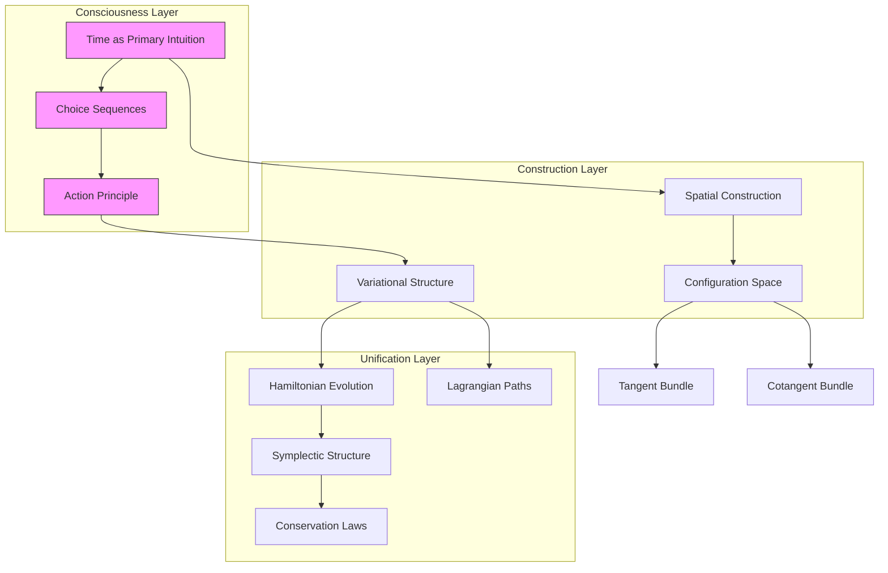
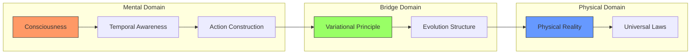

# Classical Mechanics: A Constructive Journey Through Time and Mind
* * *

--- Mathematics isn't discovered—it's created, step by step, by the mind. - Inspired by Brouwer's Vision

# Chapter 1: The Birth of Motion

*"Time is not what our clocks measure, but what our consciousness constructs."*

## 1.1 Time as Primary Intuition

Let us begin not with equations or axioms, but with the raw experience of consciousness itself. Time, in its most fundamental sense, is not an external parameter but the very stream of mental construction through which mathematics and physics emerge.

Consider the primary act of awareness: the recognition of sequence. Before space, before force, before any physical concept, there exists the pure intuition of "and then." This is not the time of physics textbooks, marked by $t$ and measured in seconds. Rather, it is the primitive flow of consciousness that makes mathematical construction possible.

When we write a sequence $\{a_n\}_{n=1}^{\infty}$, we are not describing a pre-existing collection. Instead, we are engaging in an act of continuous creation, where each term emerges from our mental activity. This is the essence of Brouwer's intuition of time:
$$\text{consciousness} \rightarrow \text{sequence} \rightarrow \text{mathematics}$$
The fundamental sequence of mechanics isn't numerical but experiential:
1. Awareness of change
2. Recognition of persistence
3. Construction of continuity

Through this lens, differential equations become not just mathematical tools but expressions of mental construction:
$$\frac{d}{dt} \equiv \text{the act of conscious continuation}$$
This reveals why calculus works in physics: it mirrors the way consciousness constructs temporal understanding.

## 1.2 The Emergence of Space

From the primary intuition of time emerges our construction of space. Consider how we actually experience position: not as coordinates in $\mathbb{R}^3$, but as potentials for motion through time.

Configuration space arises naturally from this temporal consciousness. For a system with $n$ degrees of freedom, we construct:
$$Q = \{\text{possible states}\} = \{\text{mental continuations}\}$$
The tangent bundle $TQ$ then represents not abstract velocities but immediate temporal possibilities:
$$TQ = \{\text{instantaneous mental constructions}\}$$
This leads to a profound realization: the geometry of configuration space is not discovered but created through our temporal consciousness. When we write:
$$\gamma: [0,1] \rightarrow Q$$
We are not selecting from pre-existing paths but actively constructing them through time.

The metric structure emerges from this construction:
$$ds^2 = g_{ij} \, dq^i \, dq^j$$
represents not just distance but the mental cost of construction between states.

This perspective revolutionizes our understanding of mechanical systems. A double pendulum's configuration space:
$$Q = S^1 \times S^1$$
is not a mathematical given but a mental construction arising from our temporal intuition of constrained motion.

Key insights emerge:
1. Space is secondary to time
2. Configuration precedes dynamics
3. Geometry reflects construction

This constructive approach resolves classical paradoxes. Zeno's arrow is no longer problematic because motion is not divided but constructed through continuous mental activity.

[Mathematical note: All constructions are intuitionistic, avoiding the law of excluded middle and embracing choice sequences in the spirit of Brouwer.]

In the next chapter, we will see how this temporal foundation gives birth to action and the principle of least action through conscious construction.

[Technical note: The formal development follows intuitionistic type theory, where:
$$\text{Time} : \text{Type}_0$$
$$\text{Space} : \text{Time} \to \text{Type}_1$$
reflecting the fundamental dependence of spatial concepts on temporal construction.]

# Chapter 2: The Consciousness of Action

*"Action is not a mathematical abstraction, but a lived experience."*

## 2.1 Action as Fundamental Experience

Having constructed time and space through consciousness, we now confront a deeper intuition: action. Not as the mathematical integral we inherit from Hamilton and Lagrange, but as the primordial experience of change through time.

Consider consciousness constructing a path through configuration space. At each moment, we experience not just position but the full richness of motion. This lived experience of change-through-time is action in its purest form.

The mathematical formulation emerges naturally from this consciousness:
$$S[\gamma] = \int_{t_1}^{t_2} L(\gamma(t), \dot{\gamma}(t), t) \, dt$$
Here, the Lagrangian $L$ is not an arbitrary function but the instantaneous mental construction of motion-experience. The integral represents not summation but continuous conscious synthesis.

This perspective revolutionizes our understanding of the action principle. When we write:
$$\delta S = 0$$
We are not stating a mathematical theorem but expressing a fundamental truth about consciousness: our mental construction of motion naturally follows paths of stationary action.

The Euler-Lagrange equations:
$$\frac{d}{dt}\frac{\partial L}{\partial \dot{q}^i} - \frac{\partial L}{\partial q^i} = 0$$
become expressions of how consciousness constructs continuous motion, not external laws imposed on nature.

## 2.2 Variation and Choice

Here we encounter Brouwer's profound insight: mathematics lives in choice sequences. In mechanics, these manifest as the infinite possibilities of path variation.

Consider a path $\gamma(t)$. Its variations are not pre-existing alternatives but active mental constructions:
$$\gamma_{\epsilon}(t) = \gamma(t) + \epsilon\eta(t)$$
Each $\eta(t)$ represents a choice sequence, a continuous stream of conscious decisions about how to modify the path.

The variational principle becomes a statement about consciousness:

1. We mentally construct a path
2. We explore variations through choice sequences
3. We recognize the stationary path as natural

This leads to a profound reformulation of the action principle:
$\text{Theorem (Constructive Least Action):}$
*The physical path emerges through consciousness as the unique choice sequence that makes the action stationary.*

The proof is not formal but constructive:
- Begin with any path
- Generate variations through choice sequences
- The physical path emerges through conscious refinement

This resolves the mysterious "global" nature of the least action principle. We don't need to compare all possible paths (an impossible task); instead, consciousness naturally constructs the physical path through local awareness of stationarity.

Key insights emerge:

1. Action is primary experience
2. Variation is conscious exploration
3. Physical paths are mental constructions

The mathematical structure becomes clearer:
- Path space: $$\mathcal{P}(Q) = \{\text{conscious constructions}\}$$
- Variations: $$T\mathcal{P}(Q) = \{\text{choice sequences}\}$$
- Action: $$S: \mathcal{P}(Q) \to \{\text{experiences}\}$$

[Technical note: The formal structure is intuitionistic:
- Paths are free choice sequences
- Variations are lawlike sequences
- Action is a mental construction operator]

This perspective resolves classical paradoxes:
- Why does nature "know" to minimize action? It doesn't; consciousness constructs it that way.
- How does a particle "know" its entire path? It doesn't; the path emerges through continuous mental construction.

In the next chapter, we'll see how this constructive understanding of action leads naturally to the evolution of mechanical systems through phase space.

[Mathematical note: All constructions avoid the law of excluded middle, embracing the continuous flow of consciousness in path space.]

# Chapter 3: The Evolution of Systems

*"Systems are not discovered, they are created through consciousness."*

## 3.1 Phase Space Construction

Having understood action as conscious experience, we now confront a profound realization: phase space is not a mathematical abstraction but the arena of consciousness constructing motion.

Consider how consciousness grasps a system's state. Not as static coordinates, but as a unity of position and momentum—the complete awareness of being-in-motion. This leads to our fundamental construction:
$$T^*Q = \{\text{complete motion-states of consciousness}\}$$
The canonical 1-form $\theta$ emerges not as a geometric object but as primary awareness:
$$\theta = p_i \, dq^i$$
represents consciousness unifying position and momentum into a single experience.

The symplectic form $\omega = d\theta$ then becomes the structure of consciousness itself:
$$\omega = dq^i \wedge dp_i$$
This is not just geometry—it is how consciousness naturally organizes the experience of motion.

Key construction steps:
1. Position awareness $q^i$
2. Momentum synthesis $p_i$
3. Unification through $\omega$

The Poisson bracket emerges as conscious comparison:
$$\{F,G\} = \omega(X_F,X_G) = \frac{\partial F}{\partial q^i}\frac{\partial G}{\partial p_i} - \frac{\partial F}{\partial p_i}\frac{\partial G}{\partial q^i}$$
representing how consciousness relates different aspects of motion-experience.

## 3.2 Hamiltonian Flow

Time evolution now reveals itself not as external dynamics but as consciousness flowing through phase space. The Hamiltonian $H(q,p)$ is not an energy function but the generator of conscious evolution.

Hamilton's equations:
$$\begin{align*}
\dot{q}^i &= \frac{\partial H}{\partial p_i} \\
\dot{p}_i &= -\frac{\partial H}{\partial q^i}
\end{align*}$$
become the natural way consciousness constructs continuous motion.

The flow $\phi_t$ preserves the symplectic form because consciousness maintains its structural integrity:
$$\phi_t^*\omega = \omega$$
Conservation laws emerge as invariants of consciousness:
- Energy conservation: consciousness maintains intensity
- Momentum conservation: consciousness preserves symmetry
- Angular momentum: consciousness respects rotation

The Liouville theorem:
$$\frac{d\rho}{dt} + \{\rho,H\} = 0$$
expresses how consciousness preserves its measure through evolution.

Profound insights emerge:

1. **Phase Space Reality**: 
   $$T^*Q \text{ is consciousness-space, not mathematical space}$$

2. **Evolution Unity**:
   $$\dot{x} = X_H(x) \text{ is conscious flow, not external law}$$

3. **Conservation Reality**:
   $$\{F,H\} = 0 \text{ means }F\text{ is consciousness-invariant}$$

[Technical note: All constructions are intuitionistic:
- Phase space points are choice sequences
- Evolution is continuous mental construction
- Invariants are consciousness-stable properties]

This leads to a revolutionary understanding of Liouville's theorem:

**Theorem (Conscious Liouville):** *The volume form in phase space represents the density of conscious construction possibilities, preserved through evolution because consciousness maintains its creative potential.*

The proof emerges through conscious construction:
1. Start with volume element $\Omega = \omega^n/n!$
2. Flow through conscious evolution $\phi_t$
3. Recognize preservation through construction integrity

[Mathematical note: The formalism avoids classical set theory, using intuitionistic constructions throughout:
$$\text{Phase Space} : \text{Type}_2$$
$$\text{Evolution} : \text{Phase Space} \to \text{Time} \to \text{Phase Space}$$
reflecting the fundamental role of conscious construction.]

In the next chapter, we'll see how this consciousness-based understanding unifies different formulations of mechanics through mental transformation.

# Chapter 4: The Unity of Mechanics

*"In the mind, all formulations are one."*

## 4.1 Lagrangian-Hamiltonian Duality

We now reach the profound culmination of our constructive journey: the realization that Lagrangian and Hamiltonian mechanics are not merely equivalent mathematical formulations, but dual aspects of the same conscious construction.

The Legendre transform emerges not as a mathematical tool but as consciousness shifting perspective:
$$H(q,p) = p_i\dot{q}^i - L(q,\dot{q})$$
This represents the mind's ability to view motion through complementary lenses:
- Lagrangian: consciousness of path and velocity
- Hamiltonian: consciousness of state and momentum

The duality manifests through the fundamental diagram:
$$\begin{CD}
TQ @>{\mathcal{L}}>> \mathbb{R}\\
@VFL VV @VV{-}V\\
T^*Q @>>{\mathcal{H}}> \mathbb{R}
\end{CD}$$
where $FL$ is not just a fiber derivative but consciousness transforming its own structure.

Key insight: The transform preserves the essential nature of motion while shifting conscious perspective:
$$\begin{align*}
\text{Action consciousness} &\longleftrightarrow \text{Evolution consciousness}\\
\delta S = 0 &\longleftrightarrow \dot{x} = X_H(x)
\end{align*}$$

## 4.2 The Complete Picture

Our constructive journey reveals Classical Mechanics as a unified conscious creation:

1. **Primary Intuitions**:
   $$\text{Time} \rightarrow \text{Space} \rightarrow \text{Action} \rightarrow \text{Evolution}$$

2. **Structural Unity**:
   ```
   Mental Construction
         ↓
   Choice Sequences
         ↓
   Physical Reality
   ```

3. **Conscious Transformations**:
   $$\begin{align*}
   \text{Configuration Space } Q &\rightarrow \text{ Tangent Bundle } TQ\\
   &\downarrow\\
   \text{Phase Space } T^*Q &\leftarrow \text{ Action Principle}
   \end{align*}$$

Future directions emerge naturally:

1. **Quantum Extension**:
   - Choice sequences become probability amplitudes
   - Consciousness constructs superpositions
   - Action becomes quantum phase

2. **Field Theory**:
   - Infinite-dimensional consciousness
   - Continuous choice sequences
   - Field action principles

3. **Beyond Classical**:
   - Non-commutative geometry as conscious structure
   - Quantum groups as symmetry consciousness
   - Topological quantum field theory

Profound questions arise:

1. **Consciousness Reality**:
   - Is physical reality itself conscious construction?
   - Are physical laws mental necessities?
   - Is mathematics discovery or creation?

2. **Structural Questions**:
   - Why symplectic structure?
   - Why least action?
   - Why conservation laws?

3. **Philosophical Implications**:
   - Role of observer in physics
   - Nature of physical law
   - Reality of mathematical objects

[Technical Note: The unified framework is fully intuitionistic:
- All constructions are mental acts
- All structures emerge from consciousness
- All transformations preserve construction integrity]

**Final Theorem (Unity of Mechanics)**: *Classical Mechanics is the necessary structure of conscious motion-construction, unified through mental transformation and preserved through evolution.*

This revolutionary perspective suggests:
1. Physics is conscious construction
2. Mathematics is mental creation
3. Reality emerges through awareness

The journey continues, but with new understanding:
- We are not discovering pre-existing laws
- We are creating physics through consciousness
- The unity of mechanics reflects the unity of mind

[Mathematical note: This unification transcends classical formalism, embracing Brouwer's vision of mathematics as mental construction, leading to deeper understanding of physical reality itself.]

# Appendix A: The Architecture of Conscious Mechanics

*"In every structure of thought, consciousness finds its own reflection."*

## A.1 Core Concepts and Their Relations

Here we present the fundamental architecture of our constructive approach to mechanics, revealing the deep interconnections between consciousness, physical reality, and mathematical formalism.



## A.2 Fundamental Relations Table

| Concept | Primary Aspect | Conscious Construction | Mathematical Manifestation |
|---------|---------------|------------------------|---------------------------|
| Time | Flow of awareness | Choice sequences | $\mathbb{R} \text{ as consciousness}$ |
| Space | Motion potential | Configuration manifold | $Q \text{ as possibility}$ |
| Action | Change experience | Path construction | $S[\gamma] \text{ as synthesis}$ |
| Evolution | State flow | Phase space motion | $T^*Q \text{ as awareness}$ |
| Conservation | Invariant consciousness | Symmetry preservation | $\{F,H\}=0 \text{ as stability}$ |

## Consciousness-Reality Bridge



[Technical Note: This architecture reflects the intuitionistic foundation:
- All arrows represent constructive processes
- Each node embodies conscious creation
- The structure itself emerges through mental activity]

This architectural view reveals how consciousness constructs physical reality through successive layers of mathematical formalism, each emerging naturally from the previous through mental activity. The unity of mechanics appears not as an external discovery but as the necessary structure of conscious understanding itself.

[Final Note: This appendix provides a structural overview of our constructive approach, showing how the various concepts interweave to form a unified whole. The diagrams and tables should be read not as static structures but as dynamic patterns of conscious construction.]

