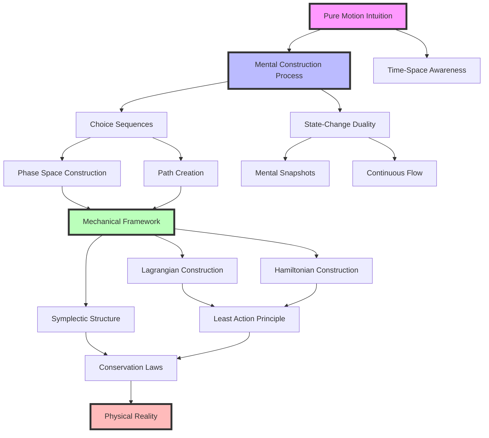

# The Mental Construction of Classical Mechanics: An Intuitionistic Reconstruction
* * *

--- Where mathematics meets motion in the mind's eye.

# Chapter 1: The First Act - Pure Motion

*"Motion exists in mind before it exists in mathematics"*

To reconstruct mechanics through intuitionistic principles, we must begin not with equations or axioms, but with the fundamental mental act that precedes all mechanical understanding: the pure intuition of motion itself.

## 1.1 The Mental Foundation of Motion

Before mathematics can capture motion, before symbols can describe trajectories, there exists in the conscious mind a primordial understanding of change. This is not learned; it is experienced. Like Brouwer's mental construction of numbers, our grasp of motion emerges from the flow of consciousness itself.

Consider: what is the most basic experience of motion? Not its mathematical description, not its formal properties, but the raw mental act of perceiving change. When we observe a falling leaf or feel our own movement through space, we encounter motion in its purest form - as a continuous mental construction that precedes any mathematical framework.

This primary intuition manifests in two fundamental aspects:

1. **The Continuity of Change**
   Motion is not a sequence of discrete states but a continuous flow in consciousness. Like Brouwer's choice sequences, it unfolds moment by moment, each instant flowing into the next without gaps or discontinuities. This mental continuity is not derived from mathematical continuity - rather, mathematical continuity is our attempt to formalize this primary experience.

2. **The Unity of Time-Space Awareness**
   Our consciousness of motion is inseparable from our awareness of time and space. But crucially, this awareness is not of abstract mathematical dimensions. Rather, time and space emerge from the mental act of experiencing motion. The "where" and "when" of motion are not predetermined coordinates but constructions of the observing mind.

## 1.2 The State-Change Duality

From this primary intuition emerges the first fundamental duality of mechanics: the interplay between states and changes. This duality is not discovered in nature but constructed in mind through three levels of mental activity:

1. **Mental Snapshots: The Construction of States**
   The mind's first act is to construct states - not as mathematical points in phase space, but as mental snapshots of reality. These are not passive observations but active constructions, like Brouwer's Creating Subject forming mathematical truths. Each state is a conscious act of attention, freezing the flow of experience into a momentary configuration.

2. **Change as Mental Activity**
   Changes are not abstract transformations between states but mental constructions of becoming. When we grasp how one state flows into another, we are not discovering an external law but performing an act of mental synthesis. This is why mechanical laws cannot be separated from the consciousness that constructs them.

3. **The Emergence of Trajectories**
   From the interplay of states and changes, trajectories emerge not as predetermined paths but as mental constructions in progress. Like Brouwer's choice sequences, they are not complete all at once but unfold through time, each segment being actively constructed by the observing mind.

This leads to a profound realization: trajectories in mechanics are not discovered truths waiting to be found but mental constructions waiting to be created. Just as Brouwer's mathematics exists only through mental construction, mechanical paths exist only through the continuous act of conscious observation and synthesis.

The implications are radical: if mechanical trajectories are mental constructions rather than discovered truths, then the entire edifice of classical mechanics must be rebuilt from this new foundation. Not as a structure of eternal laws, but as a framework of mental constructions - each building upon the previous, each emerging from the fundamental intuition of motion itself.

This sets the stage for our next chapter, where we will see how these mental constructions give rise to the mathematical framework of mechanics - not as an external discovery, but as an extension of the mind's original grasp of motion and change.

# Chapter 2: The Second Act - Mathematical Construction

*"We don't discover mechanical laws; we create them through mental construction"*

Having established motion as a primary mental intuition, we now embark on the second act: constructing the mathematical framework that captures this intuition. Like Brouwer's mathematics, this framework emerges not through discovery but through conscious creation.

## 2.1 Building the Continuum of Motion

The classical view presents phase space as a pre-existing mathematical container where motion occurs. We must radically reverse this perspective: phase space is not discovered but constructed, emerging from our mental acts of observing and predicting motion.

Consider how we actually experience mechanical systems. We don't perceive a complete phase space; we construct it point by point, path by path, through what Brouwer would call choice sequences. Each point in phase space is not a pre-existing location but a mental construction - a possibility created by consciousness.

This leads to three fundamental constructions:

1. **Choice Sequences in Phase Space**
   The phase space trajectory of a mechanical system is not predetermined but unfolds as a choice sequence - a path constructed moment by moment by the observing consciousness. Like Brouwer's real numbers, each point on the path is not given all at once but emerges through a sequence of mental acts.

   Mathematically, this means:
   $$
   \gamma(t) = \lim_{n \to \infty} \{(q_k, p_k) | k \leq n\}
   $$
   where each $(q_k, p_k)$ is not selected from a pre-existing set but created through conscious observation.

2. **The Continuous Creation of Paths**
   The continuity of mechanical motion is not a mathematical property but a mental construction. Each infinitesimal segment of a path is actively created by consciousness, linking momentary states into continuous flow:
   $$
   d\gamma = \text{Creating\_Subject}(dt)
   $$
   This explains why mechanical paths must be continuous - not because of external laws but because they are constructed by continuous consciousness.

3. **Conservation Laws as Mental Invariants**
   The emergence of conservation laws takes on new meaning: they are not discovered properties but invariants of our mental construction process. When we say energy is conserved, we're really saying our mental construction of mechanical paths preserves certain quantities:
   $$
   \frac{d}{dt}H(\gamma(t)) = 0 \iff \text{mental\_construction\_invariant}(H)
   $$

## 2.2 The Architecture of Change

The deepest principles of mechanics - the variational principles - must now be understood not as discovered laws but as expressions of how consciousness constructs motion.

1. **Constructing Variational Principles**
   The principle of least action emerges not as an external truth but as the fundamental pattern of mental construction. When consciousness creates a mechanical path, it does so through a process that minimizes action:
   $$
   \delta S = \delta \int L(q,\dot{q},t)dt = 0
   $$
   This is not a discovered law but the signature of how mind constructs continuous motion.

2. **The Mental Origin of Least Action**
   Why does nature "choose" paths of least action? This question dissolves once we recognize that these paths are mental constructions. The principle of least action is really a principle of mental economy - the way consciousness naturally constructs continuous change:
   $$
   \text{Path} = \min_{\gamma} \int_{\gamma} \text{mental\_effort}(d\gamma)
   $$

3. **Time's Dual Nature**
   The tension between time-symmetric laws and time-evolving reality reflects the dual nature of mental construction:
   - Symmetric Time: The completed mental construction, viewing paths as whole
   - Evolving Time: The active process of construction, moment by moment

   This duality manifests in the Hamilton-Jacobi equation:
   $$
   \frac{\partial S}{\partial t} + H\left(q,\frac{\partial S}{\partial q},t\right) = 0
   $$
   expressing both the timeless whole $(S)$ and the evolving construction $(\partial S/\partial t)$.

This second act reveals that the mathematical framework of mechanics is not an external discovery but a mental construction - a framework created by consciousness to capture its fundamental intuition of motion. As we move to Chapter 3, we'll see how this constructed framework gives rise to the full structure of classical mechanics.

The key insight is radical: mathematical mechanics is not discovered in nature but constructed in mind, just as Brouwer's mathematics is not discovered but created through mental acts. This changes everything about how we understand mechanical laws and their relationship to physical reality.

# Chapter 3: The Synthesis - Mechanical Framework
*"From mental constructs arise physical laws"*

Having constructed both the pure intuition of motion and its mathematical framework, we now witness how these mental constructions crystallize into the formal structures of classical mechanics. Like Brouwer's mathematics emerging from mental acts, these structures are not discovered but created through conscious synthesis.

## 3.1 Emergent Structures

The traditional view presents Lagrangian and Hamiltonian mechanics as alternative mathematical formulations. Our intuitionistic reconstruction reveals them as emergent patterns of mental construction.

1. **Mental Scaffolds of Motion**
   
   The Lagrangian framework emerges not as a mathematical convenience but as the direct expression of how consciousness constructs paths:
$$
L(q,\dot{q},t) = \text{mental\_construction\_rate}(q,\dot{q},t)
$$
   Similarly, the Hamiltonian represents the conserved aspect of this construction:
$$
H(q,p,t) = \text{mental\_construction\_invariant}(q,p,t)
$$

   Their relationship through the Legendre transform:
$$
H(q,p,t) = p\dot{q} - L(q,\dot{q},t)
$$
   reveals not a mathematical identity but the duality in our mental construction between path-making $(L)$ and state-preserving $(H)$.

2. **Symplectic Geometry as Mental Structure**

   The symplectic structure ω emerges not as a geometric discovery but as the fundamental pattern of how consciousness relates states:
$$
\omega = \sum_i dp_i \wedge dq_i = \text{mental\_relation\_structure}
$$

   This explains why mechanical systems preserve $\omega$ - it's not a physical law but the signature of conscious construction. The Poisson bracket:
$$
\{F,G\} = \sum_i \left(\frac{\partial F}{\partial q_i}\frac{\partial G}{\partial p_i} - \frac{\partial F}{\partial p_i}\frac{\partial G}{\partial q_i}\right)
$$
   represents the basic operation of mental comparison in phase space.

3. **Phase Space as Choice Sequence Space**

   Phase space itself emerges as the space of all possible mental constructions:
$$
\mathcal{P} = \{\gamma | \gamma \text{ is a choice sequence in } (q,p)\}
$$
   Each point is not a static location but a potential choice in the ongoing construction of motion.

## 3.2 The Unity of Mechanics

The diverse formulations of mechanics - Newtonian, Lagrangian, Hamiltonian - unify not through mathematical equivalence but through their common origin in mental construction.

1. **One Mind, Many Views**

   The fundamental unity:
$$
\begin{aligned}
\text{Newton: } & F = ma \\
\text{Lagrange: } & \frac{d}{dt}\frac{\partial L}{\partial \dot{q}} - \frac{\partial L}{\partial q} = 0 \\
\text{Hamilton: } & \dot{q} = \frac{\partial H}{\partial p}, \dot{p} = -\frac{\partial H}{\partial q}
\end{aligned}
$$
   These are not equivalent descriptions but different aspects of the same mental construction process.

2. **Consciousness in Mechanical Laws**

   The role of consciousness manifests in three levels:
   - Construction: Creating paths and states
   - Preservation: Maintaining invariants
   - Evolution: Generating time flow

   This explains why mechanical laws take their specific forms - they reflect the structure of conscious mechanical understanding.

3. **Beyond Classical Boundaries**

   The intuitionistic framework naturally suggests extensions:
$$
\text{Extended\_Mechanics} = \{\text{mental\_constructions} | \text{beyond classical constraints}\}
$$

   This opens new possibilities:
   - Non-deterministic paths as choice sequences
   - Quantum superpositions as simultaneous constructions
   - Relativistic effects as observer-dependent constructions

The synthesis reveals classical mechanics not as a discovered system but as the emergent pattern of how consciousness constructs motion. This understanding offers new insights:

- Conservation laws reflect mental construction invariants
- Symmetries emerge from patterns of conscious creation
- Physical laws express the structure of mechanical understanding

Most radically, this suggests that mechanical laws are not properties of an external world but patterns of mental construction - just as Brouwer's mathematics is not discovered truth but created meaning.

This reconstructed framework opens new horizons for mechanical thinking, leading us to Chapter 4's exploration of implications and future directions. The question is no longer "What are the laws of mechanics?" but "How does consciousness construct mechanical understanding?"

# Chapter 4: Implications and Horizons
*"When mechanics is mentally constructed, new possibilities emerge"*

Having reconstructed classical mechanics as a mental construction, we now stand at a threshold. Like Brouwer's mathematics opening new realms of thought, our intuitionistic approach to mechanics reveals unexplored territories beyond classical boundaries.

## 4.1 Beyond Classical Boundaries

The reconstruction of mechanics as mental construction naturally extends beyond classical limits, suggesting radical new perspectives on modern physics.

1. **Quantum Mechanics as Extended Mental Construction**

   The quantum realm, traditionally viewed as a departure from classical mechanics, emerges naturally from our mental construction framework:
$$
|\psi\rangle = \sum_i c_i|\phi_i\rangle = \text{mental\_superposition}(\{\phi_i\})
$$

   This reveals quantum superposition not as a physical mystery but as the natural extension of mental construction when classical constraints are removed. The wave function becomes a choice sequence of possibilities:
$$
\psi(x,t) = \text{Creating\_Subject}(\text{possibilities}, t)
$$

   The measurement problem transforms:
   - Classical: Single determined trajectory
   - Quantum: Spectrum of constructed possibilities
$$
\text{Measurement} = \text{mental\_selection}(\text{possibilities})
$$

2. **The Creating Subject in Physics**

   The role of consciousness in physics takes on new meaning:
$$
\text{Observer} \equiv \text{Creating\_Subject}
$$

   This explains:
   - Wave function collapse as mental selection
   - Quantum entanglement as mental correlation
   - Heisenberg uncertainty as limits of mental construction

3. **New Frontiers in Mechanical Thinking**

   The framework suggests unexplored territories:
$$
\begin{aligned}
\text{Classical} &\subset \text{Quantum} \subset \text{Mental\_Construction} \\
\text{Physical\_Laws} &= \text{Patterns\_of\_Construction}
\end{aligned}
$$

## 4.2 Future Constructions

The intuitionistic approach opens new pathways for extending mechanical understanding.

1. **Extending the Mental Framework**

   New mathematical structures emerge from relaxing construction constraints:
$$
\text{Extended\_Mechanics} = \left\{
\begin{aligned}
&\text{Non-deterministic paths} \\
&\text{Multiple simultaneous constructions} \\
&\text{Observer-dependent realities}
\end{aligned}
\right\}
$$

2. **New Mathematical Structures**

   The framework suggests novel mathematical tools:
$$
\begin{aligned}
\text{Choice\_Geometry} &= \text{geometry of mental constructions} \\
\text{Construction\_Algebra} &= \text{algebra of mental operations} \\
\text{Consciousness\_Topology} &= \text{topology of observer perspectives}
\end{aligned}
$$

3. **The Continuing Evolution**

   Future directions include:
   - Unified theory as unified mental construction
   - Consciousness as fundamental physical parameter
   - Reality as collective mental construction

The most radical implications:

1. **Ontological Revolution**
$$
\text{Reality} = \text{Mental\_Construction}(\text{possibilities})
$$
   Physical laws emerge from patterns of conscious construction.

2. **Epistemological Transformation**
$$
\text{Knowledge} = \text{Construction\_Process}
$$
   Understanding comes through active creation, not passive discovery.

3. **Methodological Innovation**
$$
\text{Research} = \text{Exploration\_of\_Construction\_Space}
$$
   Science becomes exploration of possible mental constructions.

This leads to profound questions:
- Is reality itself a mental construction?
- Are physical laws emergent patterns of consciousness?
- Can we construct new physics through new ways of thinking?

The future of mechanics lies not in discovering external laws but in exploring the infinite possibilities of mental construction. Like Brouwer's mathematics, mechanical understanding evolves through active creation rather than passive discovery.

This suggests a radical conclusion: physics itself might be reimagined not as the study of external reality but as the exploration of possible mental constructions. The boundary between mind and reality, between observer and observed, dissolves into a unified framework of conscious creation.

We end with a question that opens infinite possibilities: If mechanics is mental construction, what worlds might we yet construct?

# Appendix A: The Architecture of Mental Construction
*"In the mind's edifice, concepts interweave like threads in a quantum tapestry"*

To crystallize the mental constructions developed throughout this work, we present a unified view of how core concepts emerge and interrelate. Like Brouwer's choice sequences, these relationships themselves are mental constructions, forming a web of understanding.

## A.1 Core Concept Relations

## A.2 Conceptual Framework Matrix

| Primary Level | Secondary Level | Emergent Structures | Physical Manifestations |
|--------------|-----------------|---------------------|------------------------|
| Pure Motion | Choice Sequences | Phase Space | Conservation Laws |
| Time-Space Unity | Path Creation | Symplectic Geometry | Mechanical Laws |
| Mental Construction | State-Change Duality | Variational Principles | Physical Reality |

## A.3 Structural Relations

$$
\begin{aligned}
\text{Mental\_Structure} &= \{(\text{Intuition}, \text{Construction}, \text{Manifestation})\} \\
\text{where:} &\\
\text{Intuition} &\in \{\text{Pure\_Motion}, \text{Time\_Space}, \text{Continuity}\} \\
\text{Construction} &\in \{\text{Choice\_Sequences}, \text{Mental\_Snapshots}, \text{Path\_Creation}\} \\
\text{Manifestation} &\in \{\text{Conservation\_Laws}, \text{Physical\_Laws}, \text{Reality}\}
\end{aligned}
$$

The relationships form a triadic structure, where each level emerges from and depends on the previous:

1. **Foundation Layer**
   - Pure intuition of motion
   - Mental construction process
   - Time-space awareness

2. **Construction Layer**
   - Choice sequences
   - State-change duality
   - Continuous path creation

3. **Framework Layer**
   - Mechanical frameworks (Lagrangian, Hamiltonian)
   - Symplectic structure
   - Conservation principles

4. **Manifestation Layer**
   - Physical laws
   - Observable reality
   - Extended constructions (quantum, relativistic)

Each layer is not merely built upon but emerges from the mental constructions of the previous layer, forming what we might call a "consciousness cascade":
$$
\text{Consciousness\_Cascade} = \prod_{i=1}^{n} \text{Mental\_Construction}_i(\text{Previous\_Layer}_{i-1})
$$
This architectural view reveals how our intuitionistic reconstruction creates not just a new understanding of mechanics, but a new way of understanding understanding itself. The framework suggests that physical reality emerges not through discovery but through successive acts of mental construction, each building upon and transcending the previous.

The most profound implication is that this architecture is not fixed but evolving - a living structure that grows with each new mental construction, each new understanding. Like Brouwer's mathematics, it is not a completed edifice but a continuing process of creation.

