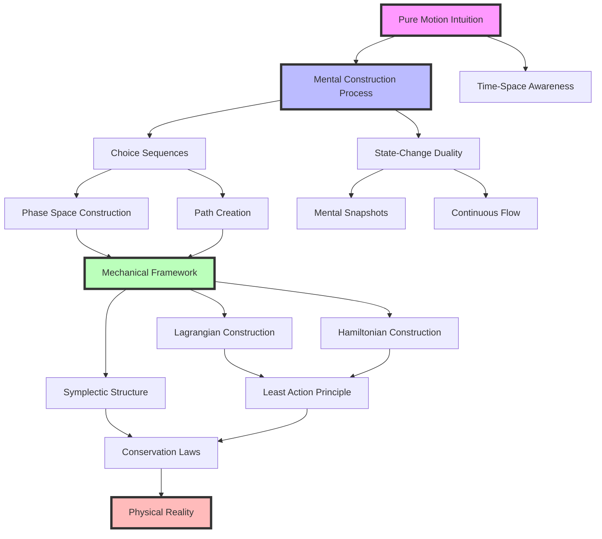

# 经典力学的思维构造：一种直觉主义重构
* * *

--- 在思维之眼中，数学与运动相遇之处。

# 第一章：第一幕 - 纯粹的运动

*"运动在数学之前存在于思维中"*

为了通过直觉主义原则重构力学，我们必须不从方程或公理开始，而是从所有机械理解之前的最基本的思维行为开始：运动本身的纯粹直觉。

## 1.1 运动的思维基础

在数学能够捕捉到运动之前，在符号能够描述轨迹之前，意识中已经存在对变化的基本理解。这不是学习得来的；而是体验出来的。就像 Brouwer 对数字的思维构造一样，我们对运动的理解源自意识本身的流。

考虑一下：最基本的运动体验是什么？不是它的数学描述，也不是其形式属性，而是感知变化的原始思维行为。当我们观察一片飘落的叶子或感受到自己在空间中的移动时，我们以最纯粹的形式遇到运动 —— 作为一种先于任何数学框架的连续思维构造。

这种基本直觉表现为两个基本方面：

1. **变化的连续性**
   运动不是一个离散状态的序列，而是在意识中的连续流。如同 Brouwer 的选择序列，它逐个瞬间展开，每一刻都流入下一刻，没有间隙或不连续。这种思维连续性并不是从数学连续性推导出来的 —— 相反，数学连续性是我们尝试将这种基本体验形式化的结果。

2. **时空意识的统一**
   我们对运动的意识与我们对时间和空间的意识密不可分。但关键在于，这种意识不是抽象的数学维度。相反，时空是从体验运动的思维行为中产生的。“哪里”和“何时”的运动不是预定的坐标，而是观察思维的构造。

## 1.2 状态-变化二元性

从这一基本直觉中产生了力学的第一个基本二元性：状态与变化之间的相互作用。这种二元性不是在自然界中发现的，而是通过三个层次的思维活动在心中构建的：

1. **思维快照：状态的构造**
   思维的第一行为是构造状态 —— 不是相空间中的数学点，而是实在的思维快照。这些不是被动的观察，而是像 Brouwer 的创造主体形成数学真理那样的主动构造。每个状态都是一个有意识的关注行为，将经验流冻结为瞬时配置。

2. **变化作为思维活动**
   变化不是状态之间抽象的变换，而是成为的思维构造。当我们理解一个状态如何流入另一个状态时，我们不是在发现外部规律，而是在进行一种思维综合的行为。这就是为什么机械定律不能与构造它们的意识分离。

3. **轨迹的出现**
   从状态和变化的相互作用中，轨迹不是作为预定路径出现的，而是作为进展中的思维构造出现的。如同 Brouwer 的选择序列，它们不会一下子全部完成，而是随着时间的推移逐步由观察思维主动构造。

这导致了一个深刻的领悟：力学中的轨迹不是等待被发现的真理，而是等待被创造的思维构造。正如 Brouwer 的数学只通过思维构造存在，机械路径也只通过持续的有意识观察和综合行为存在。

其含义是激进的：如果机械轨迹是思维构造而不是发现的真理，那么整个经典力学的大厦必须在这个新基础上重建。不是作为永恒法则的结构，而是作为思维构造的框架 —— 每个构造都建立在前一个之上，每个都从运动和变化的基本直觉中浮现。

这为我们的下一章奠定了基础，在那里我们将看到这些思维构造如何产生力学的数学框架 —— 不是作为外部发现，而是作为思维最初对运动和变化把握的延伸。

# 第二章：第二幕 - 数学构造

*"我们不是发现机械定律；而是通过思维构造创造它们"*

在确立运动作为基本的思维直觉之后，我们现在进入第二幕：构建捕捉这种直觉的数学框架。如同 Brouwer 的数学一样，这一框架不是通过发现而是通过有意识的创造而出现。

## 2.1 构造运动的连续统

经典观点将相空间呈现为一个预先存在的数学容器，在其中发生运动。我们必须彻底反转这一视角：相空间不是被发现的，而是被构造出来的，从我们观察和预测运动的思维行为中浮现。

考虑我们实际上是如何体验机械系统的。我们不会感知到完整的相空间；而是逐点、逐路径地构造它，通过 Brouwer 所谓的“选择序列”。相空间中的每个点不是一个预先存在的位置，而是思维构造 —— 由意识创造的可能性。

这导致了三个基本构造：

1. **相空间中的选择序列**
   机械系统的相空间轨迹不是预先确定的，而是作为一个选择序列展开 —— 由观察意识时刻构造的一条路径。如同 Brouwer 的实数，路径上的每个点不是一次性给出的，而是通过一系列思维行为涌现的。
   
   数学上，这意味着：
   $$
   \gamma(t) = \lim_{n \to \infty} \{(q_k, p_k) | k \leq n\}
   $$
   其中每个 $(q_k, p_k)$ 不是从预先存在的集合中选择的，而是通过有意识的观察创建的。

2. **路径的连续创造**
   机械运动的连续性不是数学性质，而是思维构造。路径的每个无穷小段都是由意识主动创造的，将瞬时状态连接成连续流：
   $$
   d\gamma = \text{Creating\_Subject}(dt)
   $$
   这解释了为什么机械路径必须是连续的 —— 不是因为外部定律，而是因为它们是由连续的意识构造的。

3. **守恒定律作为思维不变量**
   守恒定律的出现具有新的意义：它们不是被发现的性质，而是我们思维构造过程中的不变量。当我们说能量是守恒的时，实际上是说我们对机械路径的思维构造保持了某些量：
   $$
   \frac{d}{dt}H(\gamma(t)) = 0 \iff \text{mental\_construction\_invariant}(H)
   $$

## 2.2 变化的架构

力学的最深层次原理 —— 变分原理 —— 现在必须被理解为不是被发现的定律，而是意识如何构造运动的表达。

1. **构造变分原理**
   最小作用量原理不是作为一种外部真理出现，而是思维构造的基本模式。当意识创建一条机械路径时，它是通过最小化作用量的过程来实现的：
   $$
   \delta S = \delta \int L(q,\dot{q},t)dt = 0
   $$
   这不是被发现的定律，而是思维如何构造连续运动的标志。

2. **最小作用量的思维起源**
   为什么自然界“选择”最小作用量的路径？一旦我们认识到这些路径是思维构造，这个问题就消失了。最小作用量原理实际上是一种思维经济原则 —— 意识自然构造连续变化的方式：
   $$
   \text{Path} = \min_{\gamma} \int_{\gamma} \text{mental\_effort}(d\gamma)
   $$

3. **时间的二元性质**
   时间对称定律与时间演化的实在之间的张力反映了思维构造的二元性质：
   - 对称时间：完成的思维构造，视路径为整体
   - 演化时间：构造的主动过程，逐刻进行
   
   这种二元性在哈密顿-雅可比方程中的体现：
   $$
   \frac{\partial S}{\partial t} + H\left(q,\frac{\partial S}{\partial q},t\right) = 0
   $$
   既表达了永恒的整体 $(S)$，又表达了演化中的构造 $(\partial S/\partial t)$。

这个第二幕揭示了力学的数学框架不是一种外部发现，而是思维构造 —— 由意识为了捕捉其基本的运动直觉而创建的框架。当我们转向第三章时，我们将看到这个构造框架如何产生经典力学的完整结构。

关键见解是激进的：数学力学不是在自然界中被发现的，而是在思维中构造的，正如 Brouwer 的数学不是被发现而是通过思维行为创造的。这改变了我们对机械定律及其与物理实在关系的所有理解。

# 第三章：综合 - 机械框架
*"从思维构造中产生物理定律"*

在构建运动的纯粹直觉及其数学框架之后，我们现在见证这些思维构造如何结晶为经典力学的形式结构。如同 Brouwer 的数学从思维行为中浮现，这些结构不是被发现的，而是通过有意识的综合创造出来的。

## 3.1 出现的结构

传统观点将拉格朗日和哈密顿力学视为替代的数学表述。我们的思维主义重构揭示它们是思维构造出现的模式。

1. **运动的思维支架**

   拉格朗日框架不是作为数学便利出现的，而是意识如何构造路径的直接表达：
$$
L(q,\dot{q},t) = \text{mental\_construction\_rate}(q,\dot{q},t)
$$
   类似地，哈密顿量表示这种构造的守恒方面：
$$
H(q,p,t) = \text{mental\_construction\_invariant}(q,p,t)
$$

   它们之间通过勒让德变换联系：
$$
H(q,p,t) = p\dot{q} - L(q,\dot{q},t)
$$
   其揭示的不是一个数学恒等式，而是我们在思维构造中路径生成 $(L)$ 和状态保持 $(H)$ 之间的二元性。

2. **辛几何作为思维结构**

   辛结构 $\omega$ 不是作为一种几何发现出现的，而是意识如何关联状态的基本模式：
$$
\omega = \sum_i dp_i \wedge dq_i = \text{mental\_relation\_structure}
$$

   这解释了为什么机械系统保持 $\omega$ —— 这不是物理定律，而是意识构造的特征。泊松括号：
$$
\{F,G\} = \sum_i \left(\frac{\partial F}{\partial q_i}\frac{\partial G}{\partial p_i} - \frac{\partial F}{\partial p_i}\frac{\partial G}{\partial q_i}\right)
$$
   代表相空间中思维比较的基本操作。

3. **相空间作为选择序列空间**

   相空间本身作为所有可能思维构造的空间出现：
$$
\mathcal{P} = \{\gamma | \gamma \text{ is a choice sequence in } (q,p)\}
$$
   每个点不是静态位置，而是在运动的持续构造中的潜在选择。

## 3.2 力学的统一

牛顿、拉格朗日、哈密顿等不同形式的力学通过数学等价性统一，而是通过其共同的思维构造起源统一。

1. **一个思维，多个视角**

   基本统一：
$$
\begin{aligned}
\text{Newton: } & F = ma \\
\text{Lagrange: } & \frac{d}{dt}\frac{\partial L}{\partial \dot{q}} - \frac{\partial L}{\partial q} = 0 \\
\text{Hamilton: } & \dot{q} = \frac{\partial H}{\partial p}, \dot{p} = -\frac{\partial H}{\partial q}
\end{aligned}
$$
   这些不是等效描述，而是同一思维构造过程的不同方面。

2. **力学定律中的意识**

   意识的作用体现在三个层次：
   - 构造：创建路径和状态
   - 保持：维持不变量
   - 演化：生成时间流

   这解释了为什么力学定律采取特定形式 —— 它们反映有意识的机械理解结构。

3. **超越经典边界**

   思维主义框架自然地建议扩展：
$$
\text{Extended\_Mechanics} = \{\text{mental\_constructions} | \text{beyond classical constraints}\}
$$

   这开启了新的可能性：
   - 非确定路径作为选择序列
   - 量子叠加作为同时构造
   - 相对论效应作为观察者依赖的构造

综合揭示经典力学不是一种被发现的系统，而是意识如何构造运动的出现模式。这种理解提供了新的见解：

- 守恒定律反映了思维构造的不变量
- 对称性从有意识创造的模式中浮现
- 物理定律表达了机械理解的结构

最激进的是，这表明力学定律不是外部世界的属性，而是思维构造的模式 —— 正如 Brouwer 的数学不是被发现的真理，而是创造的意义。

这一重构框架为机械思维开辟了新的视野，引导我们进入第四章关于意义和未来方向的探讨。问题不再是“力学的定律是什么？”而是“意识如何构造机械理解？”

# 第四章：意义与前景
*"当力学作为思维构造时，新的可能性浮现"*

在将经典力学重构为思维构造之后，我们现在站在一个门槛上。如同 Brouwer 的数学开辟了新的思维领域，我们对力学的直觉主义方法揭示了超越经典边界的未探索领域。

## 4.1 超越经典边界

将力学重构为思维构造自然地超出了经典限制，提出了现代物理学的新视角。

1. **量子力学作为扩展的思维构造**

   传统上被视为与经典力学分离的量子领域，从我们的思维构造框架中自然浮现：
$$
|\psi\rangle = \sum_i c_i|\phi_i\rangle = \text{mental\_superposition}(\{\phi_i\})
$$

   这揭示了量子叠加不是物理谜题，而是当经典约束被移除时思维构造的自然延伸。波函数成为可能性的选择序列：
$$
\psi(x,t) = \text{Creating\_Subject}(\text{possibilities}, t)
$$

   测量问题发生了变化：
   - 经典：单一确定轨迹
   - 量子：构造的可能性谱
$$
\text{Measurement} = \text{mental\_selection}(\text{possibilities})
$$

2. **物理学中的创造主体**

   意识在物理学中的作用获得了新的意义：
$$
\text{Observer} \equiv \text{Creating\_Subject}
$$

   这解释了：
   - 波函数坍缩作为思维选择
   - 量子纠缠作为思维相关性
   - 海森堡不确定性作为思维构造的极限

3. **机械思维的新前沿**

   该框架提出了未探索的领域：
$$
\begin{aligned}
\text{Classical} &\subset \text{Quantum} \subset \text{Mental\_Construction} \\
\text{Physical\_Laws} &= \text{Patterns\_of\_Construction}
\end{aligned}
$$

## 4.2 未来构造

直觉主义方法为扩展机械理解开辟了新途径。

1. **扩展思维框架**

   通过放松构造约束，新的数学结构出现：
$$
\text{Extended\_Mechanics} = \left\{
\begin{aligned}
&\text{Non-deterministic paths} \\
&\text{Multiple simultaneous constructions} \\
&\text{Observer-dependent realities}
\end{aligned}
\right\}
$$

2. **新的数学结构**

   该框架提出了新颖的数学工具：
$$
\begin{aligned}
\text{Choice\_Geometry} &= \text{geometry of mental constructions} \\
\text{Construction\_Algebra} &= \text{algebra of mental operations} \\
\text{Consciousness\_Topology} &= \text{topology of observer perspectives}
\end{aligned}
$$

3. **持续演化**

   未来方向包括：
   - 统一理论作为统一的思维构造
   - 意识作为基本物理参数
   - 现实作为集体思维构造

最激进的意义：

1. **本体论革命**
$$
\text{Reality} = \text{Mental\_Construction}(\text{possibilities})
$$
   物理定律从有意识构造的模式中浮现。

2. **认识论转变**
$$
\text{Knowledge} = \text{Construction\_Process}
$$
   理解通过主动创造而非被动发现而来。

3. **方法论创新**
$$
\text{Research} = \text{Exploration\_of\_Construction\_Space}
$$
   科学成为可能的思维构造的探索。

这引出了一些深刻的问题：
- 实在本身是否是思维构造？
- 物理定律是否是从意识中涌现的模式？
- 我们能否通过新的思维方式构建新的物理学？

力学的未来不在于发现外部定律，而在于探索思维构造的无限可能性。如同 Brouwer 的数学，机械理解通过主动创造而非被动发现而演变。

这表明一个激进的结论：物理学本身或许应重新想象，不是对外部实在的研究，而是对可能的思维构造的探索。思维与实在、观察者与被观察者之间的界限溶解在一个统一的有意识创造框架中。

我们以一个问题结束，这个问题开启了无限的可能性：如果力学是思维构造，我们还能构造哪些世界？

# 附录 A：思维构造的架构
*"在思维的殿堂中，概念如同量子挂毯中的丝线交织在一起"*

为了具体化本工作中发展的思维构造，我们呈现了一个统一的观点，展示核心概念如何出现并相互关联。如同 Brouwer 的选择序列，这些关系本身也是思维构造，形成了理解的网络。

## A.1 核心概念关系

## A.2 概念框架矩阵

| 初级层次 | 次级层次 | 出现结构 | 物理表现 |
|--------------|-----------------|---------------------|------------------------|
| 纯运动 | 选择序列 | 相空间构造 | 守恒定律 |
| 时空统一 | 路径生成 | 辛几何 | 力学定律 |
| 思维构造 | 状态变化二元性 | 变分原理 | 物理现实 |

## A.3 结构关系

$$
\begin{aligned}
\text{Mental\_Structure} &= \{(\text{Intuition}, \text{Construction}, \text{Manifestation})\} \\
\text{where:} &\\
\text{Intuition} &\in \{\text{Pure\_Motion}, \text{Time\_Space}, \text{Continuity}\} \\
\text{Construction} &\in \{\text{Choice\_Sequences}, \text{Mental\_Snapshots}, \text{Path\_Creation}\} \\
\text{Manifestation} &\in \{\text{Conservation\_Laws}, \text{Physical\_Laws}, \text{Reality}\}
\end{aligned}
$$

这些关系形成了一种三元结构，每一层从上一层浮现并依赖于上一层：

1. **基础层**
   - 纯运动直觉
   - 思维构造过程
   - 时空意识

2. **构造层**
   - 选择序列
   - 状态变化二元性
   - 连续路径生成

3. **框架层**
   - 力学框架(拉格朗日、哈密顿)
   - 辛结构
   - 守恒原理

4. **表现层**
   - 物理定律
   - 可观测现实
   - 扩展构造(量子、相对论)

每一层不仅仅是建立在前一层之上，而是从前一层的思维构造中浮现，形成了我们可以称之为“意识瀑布”的东西：
$$
\text{Consciousness\_Cascade} = \prod_{i=1}^{n} \text{Mental\_Construction}_i(\text{Previous\_Layer}_{i-1})
$$
这种架构视图揭示了我们的直觉重建不仅创造了对力学的新理解，还创造了一种理解“理解”本身的新方式。该框架表明，物理实在不是通过发现而产生的，而是通过连续的思维构造行为产生的，每个行为都建立在并超越前一个行为。

最深远的意义在于，这种架构不是固定的，而是演化的 —— 一个随着每一个新的思维构造和每一个新的理解而成长的活生生的结构。如同 Brouwer 的数学，它不是一个完成的大厦，而是一个持续的创造过程。

