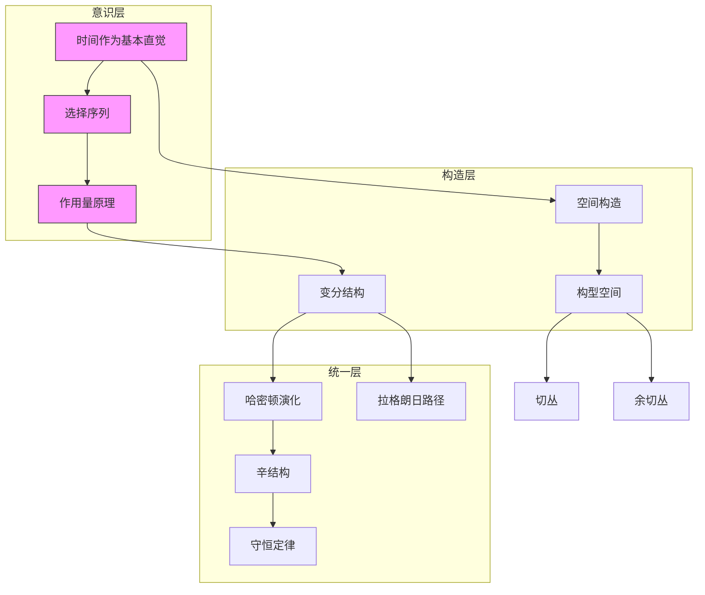
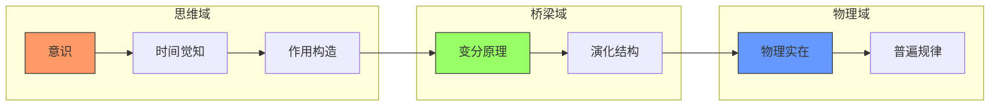

# 经典力学：穿越时间和思维的建设性旅程
* * *

--- 数学不是被发现的 —— 而是由思维一步步创造出来的。- Brouwer 视角的启发

# 第一章：运动的诞生

*"时间不是我们的钟表所测量的东西，而是我们的意识所构建的东西。”*

## 1.1 时间作为基本直觉

让我们不从方程或公理开始，而是从意识本身的原始体验开始。在最根本的意义上，时间并不是一个外部参数，而是数学和物理学从中涌现的思维构造流。

考虑最基本的觉知行为：序列的识别。在空间、力或任何物理概念之前，存在纯粹的“然后”的直觉。这并不是物理教科书中标记为 $t$ 并以秒为单位测量的时间。相反，它是使数学构造成为可能的原始意识流。

当我们写一个序列 $\{a_n\}_{n=1}^{\infty}$ 时，我们并不是在描述一个预先存在的集合。相反，我们在进行一种连续的创造行为，其中每一项都源于我们的心理活动。这是 Brouwer 关于时间的直觉的本质：
$$\text{意识} \rightarrow \text{序列} \rightarrow \text{数学}$$
力学的基本序列不是数字性的，而是经验性的：
1. 对变化的觉知
2. 对持久性的识别
3. 对连续性的构造

通过这种视角，微分方程不仅成为数学工具，还成为思维构造的表现：
$$\frac{d}{dt} \equiv \text{意识延续的行为}$$
这揭示了为什么微积分在物理学中有效：它反映了意识如何构造时间理解。

## 1.2 空间的出现

从时间的基本直觉中，我们构造出空间的概念。考虑我们实际如何体验位置：不是作为 $\mathbb{R}^3$ 中的坐标，而是作为通过时间进行运动的可能性。

构型空间自然地从这种时间意识中产生。对于具有 $n$ 个自由度的系统，我们构造：
$$Q = \{\text{可能的状态}\} = \{\text{思维延续}\}$$
切丛 $TQ$ 表示的不是抽象的速度，而是即时的时间可能性：
$$TQ = \{\text{瞬时思维构造}\}$$
这导致一个深刻的洞见：构型空间的几何结构不是被发现的，而是通过我们的时间意识创建的。当我们写出：
$$\gamma: [0,1] \rightarrow Q$$
我们不是从预先存在的路径中选择，而是通过时间主动地构造它们。

度量结构从这种构造中浮现：
$$ds^2 = g_{ij} \, dq^i \, dq^j$$
表示的不仅是距离，还是状态之间思维构造的成本。

这种视角革新了我们对机械系统的理解。双摆的构型空间：
$$Q = S^1 \times S^1$$
不是一个数学给定，而是从我们对约束运动的时间直觉中产生的思维构造。

关键见解包括：
1. 空间次于时间
2. 构型先于动力学
3. 几何反映构造

这种构造性方法解决了经典悖论。芝诺的箭不再成问题，因为运动不是被分割的，而是通过连续的思维活动构造的。

[数学注释：所有构造都是直觉主义的，避免排中律并以 Brouwer 的精神拥抱选择序列。]

在下一章中，我们将看到这种时间基础如何通过有意识的构造产生作用和最小作用量原理。

[技术注释：形式发展遵循直觉类型论，其中：
$$\text{时间} : \text{Type}_0$$
$$\text{空间} : \text{时间} \to \text{Type}_1$$
反映了空间概念对时间构造的基本依赖。]

# 第二章：作用的意识

*"作用不是数学抽象，而是生活体验。”*

## 2.1 作用作为基本体验

通过意识构建时间和空间之后，我们现在面临一个更深层次的直觉：作用。不是从哈密顿和拉格朗日继承下来的数学积分，而是作为时间中的变化的原始体验。

考虑意识在构型空间中构造一条路径。在每一时刻，我们不仅体验位置，还体验运动的全部丰富性。这种通过时间的变化的生活体验是作用最纯粹的形式。

数学表述自然地从这种意识中产生：
$$S[\gamma] = \int_{t_1}^{t_2} L(\gamma(t), \dot{\gamma}(t), t) \, dt$$
这里，拉格朗日量 $L$ 不是任意函数，而是运动体验的瞬时思维构造。积分表示的不是求和，而是连续的意识综合。

这种视角革新了我们对作用量原理的理解。当我们写出：
$$\delta S = 0$$
我们表达的不是一个数学定理，而是关于意识的基本真理：我们对运动的思维构造自然遵循驻点作用的路径。

欧拉-拉格朗日方程：
$$\frac{d}{dt}\frac{\partial L}{\partial \dot{q}^i} - \frac{\partial L}{\partial q^i} = 0$$
成为意识如何构造连续运动的表现，而不是强加于自然的外部定律。

## 2.2 变分与选择

在这里，我们遇到 Brouwer 的深刻洞见：数学存在于选择序列中。在力学中，这些表现为路径变分的无限可能性。

考虑一条路径 $\gamma(t)$。它的变分不是预先存在的替代方案，而是主动的思维构造：
$$\gamma_{\epsilon}(t) = \gamma(t) + \epsilon\eta(t)$$
每个 $\eta(t)$ 代表一个选择序列，即关于如何修改路径的一系列连续的意识决策。

变分原理成为关于意识的陈述：

1. 我们在思维中构造一条路径
2. 我们通过选择序列探索变分
3. 我们识别驻点路径为自然路径

这导致了作用量原理的一个深刻重构：
**定理(建设性的最小作用量)：**
*物理路径通过意识作为使作用量驻点的独特选择序列而出现。*

证明不是形式化的，而是建设性的：
- 从任意路径开始
- 通过选择序列生成变分
- 物理路径通过意识精炼而出现

这解决了最小作用量原理的神秘“全局”性质。我们不需要比较所有可能的路径(一项不可能的任务)；相反，意识通过局部驻点意识自然地构造物理路径。

关键见解包括：

1. 作用是主要体验
2. 变分是意识探索
3. 物理路径是思维构造

数学结构变得更加清晰：
- 路径空间：$$\mathcal{P}(Q) = \{\text{意识构造}\}$$
- 变分：$$T\mathcal{P}(Q) = \{\text{选择序列}\}$$
- 作用量：$$S: \mathcal{P}(Q) \to \{\text{体验}\}$$

[技术注释：形式结构是直觉主义的：
- 路径是自由选择序列
- 变分是有规律的序列
- 作用量是一个思维构造算子]

这种视角解决了经典悖论：
- 为什么自然“知道”最小化作用量？它并不知道；意识就是这样构造的。
- 粒子如何“知道”它的整个路径？它并不知道；路径通过连续的思维构造而出现。

在下一章中，我们将看到这种对作用量的建设性理解如何自然地引导机械系统通过相空间的演化。

[数学注释：所有构造避免排中律，拥抱路径空间中的连续意识流。]

# 第三章：系统的演化

*"系统不是被发现的，而是通过意识创造的。”*

## 3.1 相空间的构造

理解作用作为意识体验之后，我们现在面临一个深刻的洞见：相空间不是数学抽象，而是意识构造运动的场所。

考虑意识如何把握系统的状态。不是作为静态坐标，而是作为一个位置和动量的统一 —— 即对“在运动中存在”的完整觉知。这引导我们进行基本构造：
$$T^*Q = \{\text{完整的运动状态的意识}\}$$
典范 1-形式 $\theta$ 不是作为几何对象出现，而是作为初级觉知：
$$\theta = p_i \, dq^i$$
表示意识将位置和动量统一为单一体验。

辛形式 $\omega = d\theta$ 则成为意识本身的结构：
$$\omega = dq^i \wedge dp_i$$
这不仅仅是几何学 —— 它是意识如何自然地组织运动体验的方式。

关键构造步骤：
1. 位置觉知 $q^i$
2. 动量合成 $p_i$
3. 通过 $\omega$ 统一

泊松括号作为意识比较出现：
$$\{F,G\} = \omega(X_F,X_G) = \frac{\partial F}{\partial q^i}\frac{\partial G}{\partial p_i} - \frac{\partial F}{\partial p_i}\frac{\partial G}{\partial q^i}$$
表示意识如何关联运动体验的不同方面。

## 3.2 哈密顿流

时间演化现在揭示自身不是外部动力学，而是意识在相空间中的流。哈密顿量 $H(q,p)$ 不是能量函数，而是意识演化的生成元。

哈密顿方程：
$$\begin{align*}
\dot{q}^i &= \frac{\partial H}{\partial p_i} \\
\dot{p}_i &= -\frac{\partial H}{\partial q^i}
\end{align*}$$
成为意识构造连续运动的自然方式。

流 $\phi_t$ 保持辛形式，因为意识维持其结构性质：
$$\phi_t^*\omega = \omega$$
守恒定律作为意识不变量出现：
- 能量守恒：意识保持强度
- 动量守恒：意识保持对称性
- 角动量：意识尊重旋转

刘维尔定理：
$$\frac{d\rho}{dt} + \{\rho,H\} = 0$$
表示意识如何在演化过程中保持其测度。

深刻的见解包括：

1. **相空间的真实性**：
   $$T^*Q \text{ 是意识空间，而不是数学空间}$$

2. **演化的统一性**：
   $$\dot{x} = X_H(x) \text{ 是意识流，而不是外部规律}$$

3. **守恒的真实性**：
   $$\{F,H\} = 0 \text{ 意味着 }F\text{ 是意识不变量}$$

[技术注释：所有构造都是直觉主义的：
- 相空间点是选择序列
- 演化是连续的思维构造
- 不变量是意识稳定的性质]

这导致了对刘维尔定理的革命性理解：

**定理(意识刘维尔)：** *相空间中的体积形式表示意识构造可能性的密度，在演化过程中得以保持，因为意识维持其创造性潜能。*

证明通过意识构造出现：
1. 从体积元 $\Omega = \omega^n/n!$ 开始
2. 通过意识演化 $\phi_t$ 流
3. 通过构造完整性识别保存

[数学注释：形式主义避免经典集合论，使用直觉主义构造：
$$\text{相空间} : \text{Type}_2$$
$$\text{演化} : \text{相空间} \to \text{时间} \to \text{相空间}$$
反映了意识构造的基本作用。]

在下一章中，我们将看到这种基于意识的理解如何通过思维变换统一力学的不同表述。

# 第四章：力学的统一

*"在思维中，所有的表述都是一个整体。”*

## 4.1 拉格朗日-哈密顿对偶性

我们现在达到了我们建设性旅程的深刻高潮：认识到拉格朗日和哈密顿力学不仅仅是等价的数学表述，而是同一意识构造的对偶方面。

勒让德变换不是作为数学工具出现，而是作为意识转换视角：
$$H(q,p) = p_i\dot{q}^i - L(q,\dot{q})$$
这表示思维通过互补的角度看待运动的能力：
- 拉格朗日：路径和速度的意识
- 哈密顿：状态和动量的意识

这种对偶性通过基本图示表现出来：
$$\begin{CD}
TQ @>{\mathcal{L}}>> \mathbb{R}\\
@VFL VV @VV{-}V\\
T^*Q @>>{\mathcal{H}}> \mathbb{R}
\end{CD}$$
其中 $FL$ 不仅仅是一个纤维导数，而是意识转换其自身结构。

关键见解：变换在转换意识视角的同时保持运动的本质：
$$\begin{align*}
\text{作用量意识} &\longleftrightarrow \text{演化意识}\\
\delta S = 0 &\longleftrightarrow \dot{x} = X_H(x)
\end{align*}$$

## 4.2 完整的图景

我们的建设性旅程揭示了经典力学作为一个统一的意识创造：

1. **基本直觉**：
   $$\text{时间} \rightarrow \text{空间} \rightarrow \text{作用量} \rightarrow \text{演化}$$

2. **结构性统一**：
   ```
   思维构造
     ↓
   选择序列
     ↓
   物理实在
   ```

3. **意识变换**：
   $$\begin{align*}
   \text{构型空间 } Q &\rightarrow \text{ 切丛 } TQ\\
   &\downarrow\\
   \text{相空间 } T^*Q &\leftarrow \text{ 作用量原理}
   \end{align*}$$

未来方向自然浮现：

1. **量子扩展**：
   - 选择序列变为概率幅
   - 意识构造叠加态
   - 作用量变为量子相位

2. **场论**：
   - 无限维意识
   - 连续的选择序列
   - 场的作用量原理

3. **超越经典**：
   - 非交换几何作为意识结构
   - 量子群作为对称意识
   - 拓扑量子场论

深刻的疑问随之而来：

1. **意识现实**：
   - 物理实在本身是否是意识构造？
   - 物理定律是否是思维必然性？
   - 数学是发现还是创造？

2. **结构性问题**：
   - 为什么是辛结构？
   - 为什么是最小作用量？
   - 为什么有守恒定律？

3. **哲学意义**：
   - 观察者在物理学中的角色
   - 物理定律的本质
   - 数学对象的真实性

[技术注释：统一框架是完全直觉主义的：
- 所有构造都是思维行为
- 所有结构都从意识中涌现
- 所有变换都保持构造完整性]

**最终定理(力学的统一)：** *经典力学是意识运动构造的必要结构，通过思维变换统一，并通过演化得以保存。*

这一革命性的视角表明：
1. 物理学是意识构造
2. 数学是思维创造
3. 现实通过觉知而产生

旅程继续，但有了新的理解：
- 我们不是在发现预先存在的规律
- 我们通过意识创造物理学
- 力学的统一反映了思维的统一

[数学注释：这种统一超越了经典形式主义，拥抱 Brouwer 关于数学作为思维构造的视角，从而导致对物理现实本身的更深层次理解。]

# 附录 A：意识力学的架构

*"在每一个思维结构中，意识都能找到自己的映射。”*

## A.1 核心概念及其关系

这里我们展示我们对力学构造性方法的基本架构，揭示意识、物理实在和数学形式主义之间的深层互联。



## A.2 基本关系表

| 概念 | 主要方面 | 意识构造 | 数学表现 |
|---------|---------------|------------------------|---------------------------|
| 时间 | 意识流 | 选择序列 | $\mathbb{R} \text{ 作为意识}$ |
| 空间 | 运动潜力 | 构型流形 | $Q \text{ 作为可能性}$ |
| 作用量 | 变化体验 | 路径构造 | $S[\gamma] \text{ 作为综合}$ |
| 演化 | 状态流 | 相空间运动 | $T^*Q \text{ 作为觉知}$ |
| 守恒 | 不变量意识 | 对称性保持 | $\{F,H\}=0 \text{ 作为稳定性}$ |

## 意识-现实桥梁



[技术注释：此架构反映了直觉主义基础：
- 所有箭头表示构造过程
- 每个节点体现意识创造
- 结构本身通过思维活动涌现]

这种架构视图揭示了意识如何通过连续的数学形式主义层次构造物理实在，每一层次都自然地从前一层通过思维活动涌现。力学的统一不是作为外部发现出现，而是作为意识理解本身的必要结构。

[最终注释：本附录提供了我们构造性方法的结构概览，展示了各种概念如何交织形成一个统一的整体。图表和表格不应被视为静态结构，而应视为动态的意识构造模式。]

