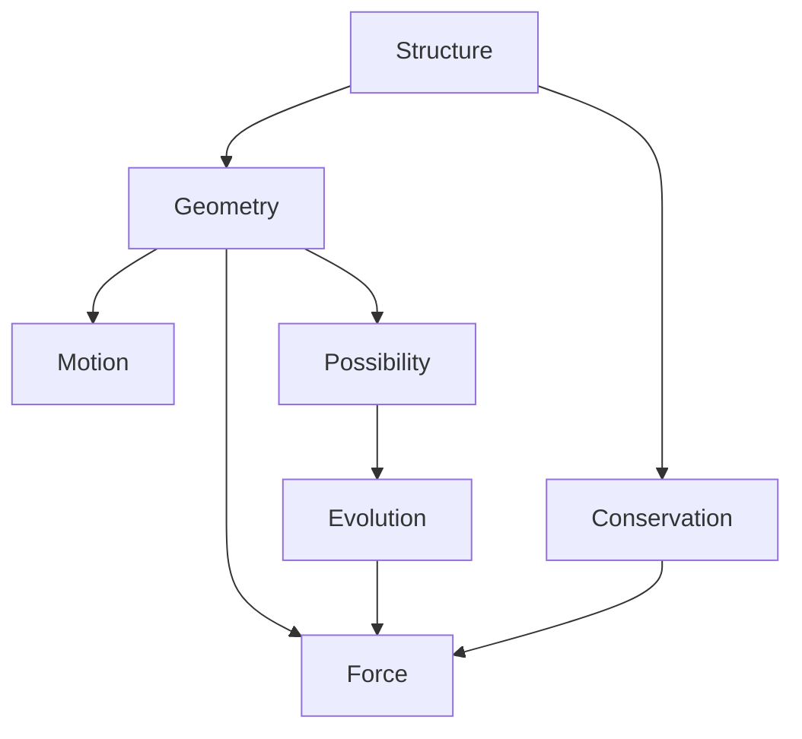

# The Geometry of Being: A Philosophical Reconstruction of Classical Mechanics

*"Reality is not driven by forces, but shaped by the geometry of possibility."*

## Core Concepts and Philosophy

### Primary Philosophical Transitions:
1. **Ontological**: From substance to structure
2. **Epistemological**: From causation to configuration
3. **Metaphysical**: From force to form

### Core Principles:
1. **Structural Primacy**: Structure precedes dynamics
2. **Geometric Necessity**: Motion follows from possibility space
3. **Emergent Causality**: Force emerges from geometry

## Document Abstract

This work reconstructs classical mechanics through modern philosophical perspectives, revealing mechanics not as a theory of forces and motion, but as the natural geometry of possibility. By elevating structure over substance and form over force, we uncover the profound unity underlying different formulations of mechanics. This geometric view transforms mechanics from a study of causation to an exploration of necessary patterns in the space of possible configurations.

## Chapter Outline

### Chapter 1: The Philosophy of Structure
*"What we call reality is but the shadow of mathematical form."*

#### 1.1 From Substance to Structure
- Transition from material ontology to structural ontology
- The primacy of relations over objects
- Mathematical structure as fundamental reality

#### 1.2 The Nature of Physical Law
- Laws as geometric necessities
- The role of symmetry in physical understanding
- The emergence of causality from structure

### Chapter 2: The Architecture of Possibility
*"Space shapes motion; force merely describes its curvature."*

#### 2.1 Configuration Space as Primary Reality
- The nature of configuration space
- From physical space to possibility space
- Constraints as geometric structure

#### 2.2 The Geometry of Evolution
- Natural motion as geodesic flow
- Symmetry and conservation
- Time as geometric parameter

### Chapter 3: The Emergence of Force
*"Force is not a cause but a shadow cast by geometry."*

#### 3.1 Geometric Origins of Force
- Force as geometric curvature
- The role of potential
- From constraint to dynamics

#### 3.2 The Unity of Formulations
- Hamilton-Jacobi theory as geometric necessity
- Lagrangian-Hamiltonian duality
- Symplectic structure as fundamental

### Chapter 4: Beyond Mechanics
*"When we understand structure, we transcend mechanics."*

#### 4.1 Quantum Geometry
- From classical to quantum structure
- Geometric phases and topology
- Information geometry

#### 4.2 The Future of Structure
- Category theory and physics
- Emergence of spacetime
- Beyond geometry

## Key Relations:

Each chapter builds on the previous, forming a continuous progression from philosophical foundations through geometric understanding to physical implications. The work maintains rigor while emphasizing deep conceptual insights over technical details.

[Note: This outline reconstructs mechanics through structural philosophy, revealing its geometric essence while maintaining mathematical precision.]

