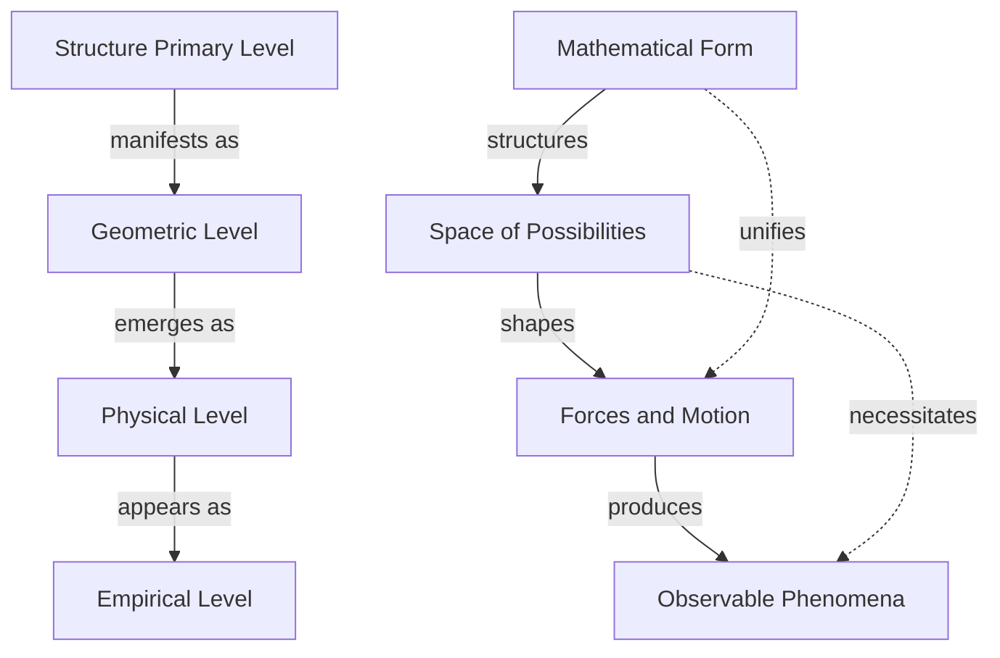
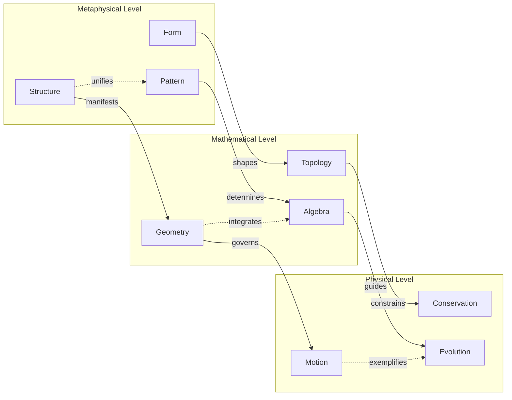
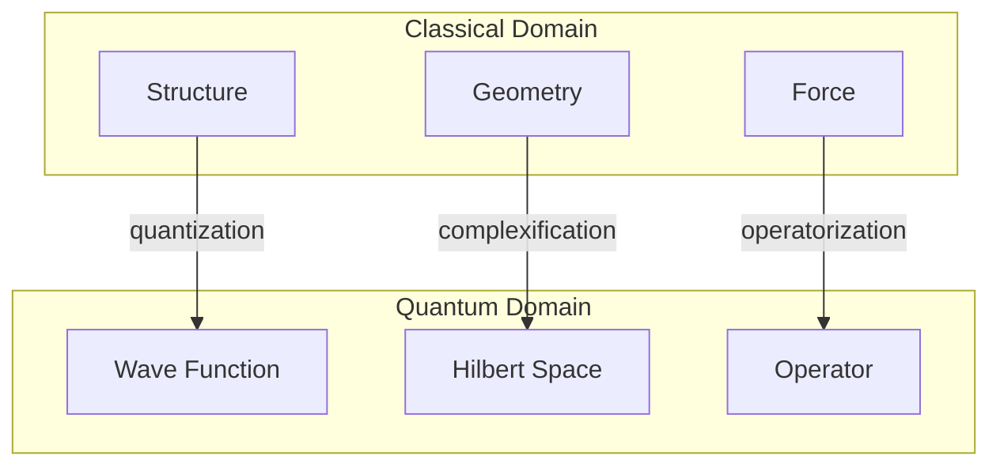
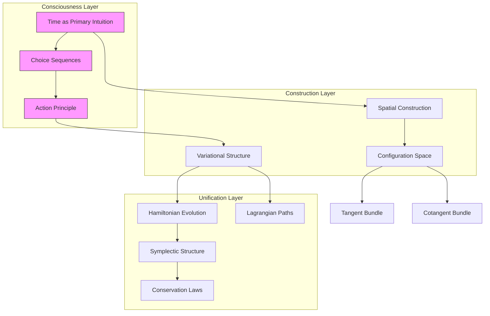
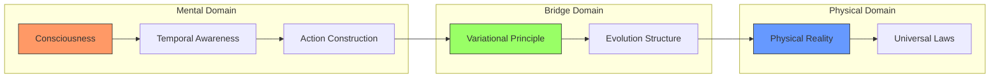

# The Geometry of Being: A Philosophical Reconstruction of Classical Mechanics
* * *

--- Reality is not driven by forces, but shaped by the geometry of possibility.

# Chapter 1: The Philosophy of Structure

*"What we call reality is but the shadow of mathematical form."*

## 1.1 From Substance to Structure

The revolution in our understanding of mechanics begins not with equations but with a profound philosophical shift. For millennia, human thought remained trapped in substance ontology—the view that reality consists of things with properties. This seemingly natural perspective led physics down a path of forces acting on objects, obscuring deeper patterns.

Consider Aristotle's conception of motion requiring a mover, or Newton's forces acting at a distance. Both emerge from substance thinking—reality as objects affecting objects. Yet this view faces insurmountable difficulties:

1. **The Problem of Interaction**: How do separate substances affect each other?
2. **The Problem of Identity**: What persists when everything changes?
3. **The Problem of Unity**: How do parts form wholes?

The mathematical structure of mechanics itself points toward a radical solution: abandon substance for structure. Consider Hamilton's equations:
$$\frac{dq^i}{dt} = \frac{\partial H}{\partial p_i}, \quad \frac{dp_i}{dt} = -\frac{\partial H}{\partial q^i}$$
These aren't descriptions of things acting on things, but rather expressions of a unified mathematical structure. The revolutionary insight: structure precedes substance.

This leads to structural realism—the view that physical reality is fundamentally mathematical structure. Objects and properties become derivative, emerging from patterns of relation. As Hermann Weyl noted: "The objective world simply is, it does not happen."

## 1.2 The Nature of Physical Law

This structural turn transforms our understanding of physical law. Consider the principle of least action:
$$\delta S = \delta \int L dt = 0$$
Traditionally interpreted as nature "choosing" optimal paths, we now recognize it as expressing geometric necessity. The path a system takes isn't caused by forces but reflects the geometry of possibility space.

Symmetry emerges as fundamental. Noether's theorem:
$$\frac{d}{dt}\left(\frac{\partial L}{\partial \dot{q}^i}\right) = \frac{\partial L}{\partial q^i}$$
reveals conservation laws not as empirical accidents but as necessary features of geometric structure. The deep insight: physical law expresses mathematical necessity.

This leads to three profound realizations:

1. **Geometric Necessity**: Physical law reflects the structure of possibility space
2. **Structural Causality**: Causation emerges from global patterns rather than local pushes
3. **Mathematical Reality**: The physical world instantiates mathematical form

[Technical note: The modern framework uses:
- Category theory for structure
- Fiber bundles for geometry
- Symplectic manifolds for dynamics]

The implications are revolutionary:

1. **For Ontology**: Reality is structure, not substance
2. **For Causality**: Necessity replaces causation
3. **For Physics**: Geometry supersedes force

[Philosophical insight: This reconstruction resolves ancient problems:
- Zeno's paradoxes dissolve in structural continuity
- Hume's causation becomes geometric necessity
- Kant's synthetic a priori becomes mathematical structure]

As we proceed, we'll see how this philosophical foundation transforms mechanics from a theory of forces to a study of geometric necessity. The next chapter explores how configuration space becomes the primary arena of physics, with motion emerging from its intrinsic geometry.

[Note: The structural perspective unifies different formulations of mechanics while suggesting deeper patterns underlying physical reality.]

# Chapter 2: The Architecture of Possibility

*"Space shapes motion; force merely describes its curvature."*

## 2.1 Configuration Space as Primary Reality

Having recognized structure as fundamental, we now confront a deeper truth: physical space is secondary to configuration space. Consider an $n$-particle system. Its configuration space:
$$Q = \{\text{all possible configurations}\} \simeq \mathbb{R}^{3n}$$
This isn't merely a mathematical convenience but the primary arena of reality. Physical space—our familiar $\mathbb{R}^3$—emerges as a projection, a shadow of this deeper structure.

The profound insight emerges through the fiber bundle structure:
$$
\pi: Q \rightarrow B
$$
where $B$ is base space and fibers represent possibilities. Reality isn't points in space but sections of this bundle—entire fields of possibility.

Constraints reveal the true nature of configuration space. Consider a rigid body:
$$
\text{SO}(3) \times \mathbb{R}^3 \hookrightarrow Q
$$
These aren't restrictions on motion but the very geometry of possibility. The allowed configurations form a submanifold whose structure determines all possible evolutions.

## 2.2 The Geometry of Evolution

Evolution emerges naturally as geodesic flow in possibility space. The action principle:
$$S[\gamma] = \int_{t_1}^{t_2} L \, dt$$
becomes a statement about the geometry of path space. Paths of least action are geodesics in a curved geometry defined by the Jacobi metric:
$$ds^2 = (E-V)(T_{ij} \, dq^i \, dq^j)$$
Time itself emerges as a parameter of this geometric flow. The Hamilton-Jacobi equation:
$$\frac{\partial S}{\partial t} + H\left(q,\frac{\partial S}{\partial q},t\right) = 0$$
reveals time as an emergent feature of configuration space geometry.

The symplectic structure crystallizes this understanding:
$$\omega = dq^i \wedge dp_i$$
Evolution preserves this structure not because of physical law but geometric necessity. The flow exists because of Darboux's theorem—a fact about manifold structure.

Three profound unifications emerge:

1. **Space-Time Unity**:
   - Time as geometric parameter
   - Evolution as geometric flow
   - Causality from structure

2. **Conservation-Symmetry**:
   ```
   Symmetry ⟺ Conservation
   ```
   Not as physical law but geometric necessity

3. **Motion-Being**:
   - Motion as geometric necessity
   - Being as structural pattern
   - Evolution as structural flow

[Technical insight: Modern geometry reveals:
- Configuration space as principal bundle
- Evolution as connection form
- Conservation as curvature]

The geometric framework unifies:
- Lagrangian paths
- Hamiltonian flows
- Jacobi metrics
Through the single concept of geodesic motion in curved possibility space.

This leads to three revolutionary perspectives:

1. **Reality is Possibility**:
   - Actuality as special case
   - Possibility as fundamental
   - Structure as primary

2. **Motion is Necessity**:
   - Geometric rather than causal
   - Global rather than local
   - Structural rather than substantial

3. **Time is Parameter**:
   - Emerging from structure
   - Measuring possibility flow
   - Geometric rather than physical

[Philosophical note: This resolves ancient paradoxes:
- Zeno's arrow exists in possibility space
- Parmenides' unchanging Being contains all change
- Heraclitus' flux follows geometric necessity]

In the next chapter, we'll see how force emerges as a derived concept—a measure of how possibility space curves, not a cause of motion.

[Mathematical note: The framework extends naturally to:
- Infinite-dimensional manifolds (field theory)
- Quantum mechanics (geometric quantization)
- Gravity (metric geometry)]

The geometry of possibility reveals mechanics not as a theory of force and motion, but as the necessary structure of reality itself.

# Chapter 3: The Emergence of Force

*"Force is not a cause but a shadow cast by geometry."*

## 3.1 Geometric Origins of Force

The profound revolution in our understanding comes when we recognize force not as a primary cause but as an emergent phenomenon—a measure of how possibility space curves. Consider the traditional equation:
$$\mathbf{F} = -\nabla V$$
Conventionally read as "potential creates force", we now understand it reversed: potential defines the geometry, force emerges as its shadow. This isn't mere reinterpretation but a fundamental ontological shift.

The geometry crystallizes through the fiber bundle structure:
$$\begin{array}{c}
E \xrightarrow{\pi} M \\
G \hookrightarrow E
\end{array}$$
Forces emerge as connection forms on this bundle:
$$\nabla_X s = (\partial_X + A_X)s$$
where $A_X$ is the connection one-form. What we call "force" is merely the curvature of this connection:
$$F = dA + \frac{1}{2}[A,A]$$
This geometric origin reveals three profound truths:

1. **Force is Curvature**:
   - Not an entity but a measure
   - Emerging from global structure
   - Geometric necessity rather than cause

2. **Potential is Primary**:
   - Defining the bundle structure
   - Determining possible motions
   - Force as derived concept

3. **Constraints Shape Reality**:
   - Not restrictions but structure
   - Defining the geometry
   - Determining dynamics

## 3.2 The Unity of Formulations

The geometric perspective reveals the unity of different mechanical formulations. The Hamilton-Jacobi equation:
$$\frac{\partial S}{\partial t} + H\left(q,\frac{\partial S}{\partial q},t\right) = 0$$
becomes a statement about the geometry of phase space. Solutions aren't "found" but emerge as geometric necessities.

The Lagrangian-Hamiltonian duality emerges through the Legendre transform:
$$H(q,p) = p_i\dot{q}^i - L(q,\dot{q})$$
This isn't merely a mathematical transformation but reveals the fundamental unity of phase and configuration space geometry.

The symplectic structure:
$$\omega = dq^i \wedge dp_i$$
emerges as the fundamental geometric object. Hamilton's equations:
$$i_{X_H}\omega = dH$$
become pure geometry—a statement about the natural flow in symplectic manifolds.

Three unifying principles emerge:

1. **Geometric Unity**:
   ```
   Configuration Space ⟺ Phase Space
   Lagrangian Paths ⟺ Hamiltonian Flows
   Constraints ⟺ Conservation Laws
   ```

2. **Structural Hierarchy**:
   $$\text{Structure} \to \text{Geometry} \to \text{Force} \to \text{Motion}$$

3. **Formal Unity**:
   - All formulations as aspects of bundle geometry
   - Different perspectives on same structure
   - Unity through geometric necessity

[Technical insight: Modern geometry reveals deeper structures:
- Ehresmann connections
- Symplectic reduction
- Momentum maps]

This leads to a revolutionary understanding:

1. **Force is Secondary**:
   - Emerging from geometry
   - Measuring structure
   - Not causing motion

2. **Motion is Natural**:
   - Following geodesics
   - Preserving structure
   - Geometric necessity

3. **Reality is Geometric**:
   - Structure as fundamental
   - Force as derived
   - Unity through geometry

[Mathematical note: The framework naturally encompasses:
- Gauge theories
- Field theories
- Quantum mechanics]

The profound implication: different formulations of mechanics aren't merely equivalent—they're necessary aspects of a single geometric reality. Force emerges not as cause but as our mind grasping the curvature of possibility space.

[Final insight: This geometric understanding transforms mechanics from a theory of causation to a revelation of necessary structure—the architecture of reality itself.]

# Chapter 4: Beyond Mechanics

*"When we understand structure, we transcend mechanics."*

## 4.1 Quantum Geometry

The geometric understanding of mechanics reveals a profound truth: quantum mechanics isn't a radical departure but a deeper layer of geometric structure. Consider the Schrödinger equation:
$$i\hbar\frac{\partial}{\partial t}|\psi\rangle = H|\psi\rangle$$
This isn't merely an evolution equation but a statement about the geometry of complex projective space $\mathbb{CP}^\infty$. Quantum states aren't mysterious entities but sections of a complex line bundle:
$$\begin{array}{c}
L \xrightarrow{\pi} \mathcal{M} \\
U(1) \hookrightarrow L
\end{array}$$
The geometric phase reveals this structure:
$$\gamma = i\oint \langle\psi|\nabla_R|\psi\rangle \cdot dR$$
This isn't an additional quantum effect but the fundamental geometry of state space itself.

Three profound unifications emerge:

1. **Quantum-Classical Unity**:
   - Both as geometric structures
   - Phase space ↔ Projective space
   - Force ↔ Connection form

2. **Phase-Topology Relations**:
   $$\exp(i\gamma) = \text{holonomy of connection}$$
   Revealing quantum effects as global geometry

3. **Information-Geometry Fusion**:
   The Fisher metric:
   $$g_{ij} = \int p(x|\theta)\frac{\partial \log p}{\partial \theta^i}\frac{\partial \log p}{\partial \theta^j}dx$$
   Unifies statistics and geometry

## 4.2 The Future of Structure

The geometric perspective points toward even deeper structures. Category theory reveals physics as natural transformation:
$$\mathcal{F}: \text{Spacetime} \to \text{Observable}$$
This isn't mathematical abstraction but the deepest level of physical reality. Consider the Yoneda embedding:
$$y: \mathcal{C} \to [\mathcal{C}^{op},\text{Set}]$$
This suggests physical reality is purely relational—structure all the way down.

Three revolutionary directions emerge:

1. **Categorical Physics**:
   ```
   Objects → Categories
   Properties → Functors
   Relations → Natural Transformations
   ```
   Physics becomes pure structure

2. **Emergent Spacetime**:
   - Space from entanglement
   - Time from correlation
   - Gravity from information

3. **Beyond Geometry**:
   - Higher categories
   - $\infty$-topoi
   - Homotopy type theory

[Technical insight: Future frameworks suggest:
- Geometric quantization → Higher quantization
- Symplectic geometry → Higher geometry
- Bundle theory → Higher bundles]

The ultimate vision crystallizes:

1. **Structure is Primary**:
   $$\text{Reality} \equiv \text{Mathematical Structure}$$
   Not as metaphor but as deepest truth

2. **Geometry Transcends Space**:
   - Abstract spaces as fundamental
   - Physical space as derived
   - Higher structures as primary

3. **Information is Physical**:
   $$S = k\log W$$
   Not just analogy but identity

[Mathematical note: The framework points toward:
- Derived geometry
- Higher topos theory
- Quantum foundations]

This leads to three profound questions:

1. **Ultimate Structure**:
   - What lies beyond category theory?
   - Is mathematics itself emergent?
   - Can we transcend structure?

2. **Reality's Nature**:
   - Is information fundamental?
   - Does consciousness play a role?
   - What is beyond mathematics?

3. **Future Physics**:
   - Quantum gravity as geometry?
   - Mind-matter unity?
   - Beyond spacetime?

[Final insight: Perhaps our journey from force to geometry was just the beginning. The true nature of reality might transcend not just mechanics, but mathematics itself, leading to structures we can barely imagine today.]

As we close, we realize: The geometric understanding of mechanics opens vistas far beyond physics—toward the very nature of reality, consciousness, and being itself.

[Ultimate note: This isn't just a new way of doing physics but a new way of understanding existence—through pure structure, pure pattern, pure form.]

# Appendix A: The Architecture of Understanding

*"Structure reveals itself through patterns of relation."*

## A.1 Conceptual Foundations

### A.1.1 Core Relations Matrix

| Concept | Geometric Form | Mathematical Structure | Philosophical Meaning |
|---------|---------------|----------------------|---------------------|
| Structure | Fiber Bundle | $E \xrightarrow{\pi} M$ | Reality's Essential Nature |
| Geometry | Connection Form | $\nabla_X s = (\partial_X + A_X)s$ | Shape of Possibility |
| Force | Curvature | $F = dA + \frac{1}{2}[A,A]$ | Emergent Pattern |
| Motion | Geodesic Flow | $\delta S = 0$ | Geometric Necessity |
| Evolution | Symplectic Flow | $i_{X_H}\omega = dH$ | Structural Dynamics |

### A.1.2 Hierarchical Relations



## A.2 Mathematical-Philosophical Integration

### A.2.1 Structural Hierarchy:
```
Level 0 (deepest): Category Theory
    ↓ emergence
Level 1: Geometric Structure
    ↓ manifestation
Level 2: Physical Law
    ↓ appearance
Level 3: Observable Reality
```

### A.2.2 Key Transformations:
$$
\begin{aligned}
\text{Reality} &= \int \text{Structure} \, d\text{Form} \\
\text{Force} &= \nabla \text{Geometry} \\
\text{Motion} &= \delta \text{Structure} = 0
\end{aligned}
$$

## A.3 Unifying Framework



### A.3.1 Meta-Relations:
- **Vertical**: Emergence and Realization
- **Horizontal**: Integration and Unity
- **Diagonal**: Cross-scale Coherence

## A.4 Quantum Extensions

The framework naturally extends to quantum domains through:
$$\text{Classical Structure} \xrightarrow{\text{quantization}} \text{Quantum Structure}$$



[Technical note: Each transition preserves structural relations while transforming their mathematical expression.]

## A.5 Philosophical Synthesis

The ultimate unity emerges through three fundamental principles:

1. **Structural Primacy**:
   $$\text{Reality} \equiv \text{Structure}$$

2. **Geometric Necessity**:
   $$\text{Evolution} = \delta\text{Structure} = 0$$

3. **Emergent Causality**:
   $$\text{Force} = -\nabla\text{Geometry}$$

[Final insight: These relations reveal mechanics not as a collection of laws but as necessary aspects of a single unified structure.]

# Appendix B: The Architecture of Conscious Mechanics

*"In every structure of thought, consciousness finds its own reflection."*

## B.1 Core Concepts and Their Relations

Here we present the fundamental architecture of our constructive approach to mechanics, revealing the deep interconnections between consciousness, physical reality, and mathematical formalism.



## B.2 Fundamental Relations Table

| Concept | Primary Aspect | Conscious Construction | Mathematical Manifestation |
|---------|---------------|------------------------|---------------------------|
| Time | Flow of awareness | Choice sequences | $\mathbb{R} \text{ as consciousness}$ |
| Space | Motion potential | Configuration manifold | $Q \text{ as possibility}$ |
| Action | Change experience | Path construction | $S[\gamma] \text{ as synthesis}$ |
| Evolution | State flow | Phase space motion | $T^*Q \text{ as awareness}$ |
| Conservation | Invariant consciousness | Symmetry preservation | $\{F,H\}=0 \text{ as stability}$ |

## B.3 Consciousness-Reality Bridge



[Technical Note: This architecture reflects the intuitionistic foundation:
- All arrows represent constructive processes
- Each node embodies conscious creation
- The structure itself emerges through mental activity]

This architectural view reveals how consciousness constructs physical reality through successive layers of mathematical formalism, each emerging naturally from the previous through mental activity. The unity of mechanics appears not as an external discovery but as the necessary structure of conscious understanding itself.

[Final Note: This appendix provides a structural overview of our constructive approach, showing how the various concepts interweave to form a unified whole. The diagrams and tables should be read not as static structures but as dynamic patterns of conscious construction.]

