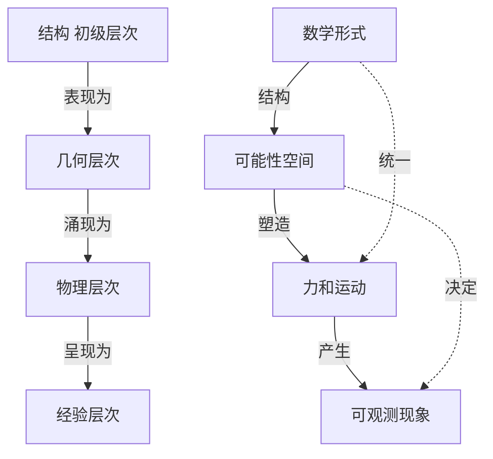
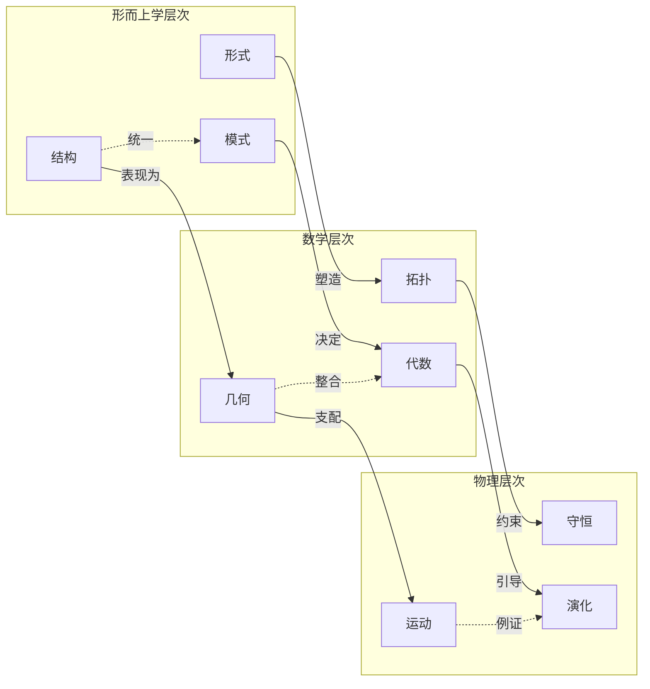
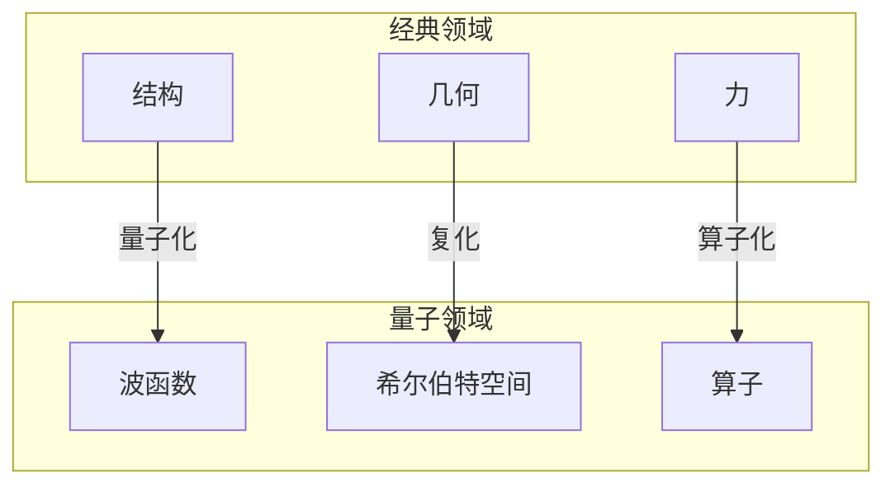

# 存在的几何：经典力学的哲学重构
* * *

--- 实在不是由力驱动的，而是由可能性的几何形状塑造的。

# 第一章：结构的哲学

*"我们所谓的实在不过是数学形式的影子。"*

## 1.1 从实体到结构

我们对力学的理解革命并非始于方程，而是源于深刻的哲学转变。几千年来，人类的思想被束缚在实体本体论中 —— 认为实在由具有属性的事物构成。这种看似自然的观点引导物理学走上了力作用于物体的道路，掩盖了更深层次的模式。

考虑亚里士多德关于运动需要推动者的观点，或牛顿关于远距离作用的力的概念。这些都是基于实体思维 —— 实在是物体影响物体。然而，这种观点面临着难以克服的困难：

1. **相互作用问题**：分离的实体如何相互影响？
2. **同一性问题**：当一切都在变化时，什么保持不变？
3. **统一性问题**：部分如何形成整体？

力学本身的数学结构指向了一个激进的解决方案：放弃实体而选择结构。考虑哈密顿方程：
$$\frac{dq^i}{dt} = \frac{\partial H}{\partial p_i}, \quad \frac{dp_i}{dt} = -\frac{\partial H}{\partial q^i}$$
这些不是描述事物作用于事物的表达式，而是统一数学结构的表现。革命性的见解在于：结构先于实体。

这导致了结构实在论 —— 认为物理实在本质上是数学结构。对象和属性成为派生的，从关系模式中涌现。正如赫尔曼·外尔所指出的：“客观世界只是存在，它不会发生。”

## 1.2 物理定律的本质

这种结构转向改变了我们对物理定律的理解。考虑最小作用原理：
$$\delta S = \delta \int L dt = 0$$
传统上将其解释为自然“选择”最优路径，我们现在认识到它是几何必然性的表达。系统采取的路径不是由力引起的，而是反映可能性空间的几何。

对称性作为基本要素出现。诺特定理：
$$\frac{d}{dt}\left(\frac{\partial L}{\partial \dot{q}^i}\right) = \frac{\partial L}{\partial q^i}$$
揭示守恒定律不是经验上的偶然，而是几何结构的必要特征。深刻的认识是：物理定律表达数学必然性。

这导致了三个深远的认识：

1. **几何必然性**：物理定律反映了可能性空间的结构
2. **结构因果性**：因果关系从全局模式而不是局部推力中涌现
3. **数学实在**：物理世界实例化数学形式

[技术注释：现代框架使用：
- 范畴论进行结构分析
- 纤维丛进行几何分析
- 辛流形进行动力学分析]

其影响是革命性的：

1. **对于本体论**：实在是结构，而不是实体
2. **对于因果性**：必然性取代因果关系
3. **对于物理学**：几何超越力

[哲学洞见：这种重构解决了古代问题：
- 芝诺悖论在结构性连续中消失
- 休谟的因果关系成为几何必然性
- 康德的先验综合判断成为数学结构]

随着我们的继续探讨，我们将看到这种哲学基础如何将力学从一种力的理论转变为几何必然性的研究。下一章将探讨配置空间如何成为物理学的主要舞台，运动从中固有的几何中涌现。

[注：结构视角统一了力学的不同表述，并暗示了物理实在背后的深层模式。]

# 第二章：可能性的架构

*"空间塑造运动；力仅描述其曲率。"*

## 2.1 配置空间作为主要实在

认识到结构是根本之后，我们现在面对一个更深层次的真理：物理空间次于配置空间。考虑一个 $n$ 粒子系统。其配置空间：
$$Q = \{\text{all possible configurations}\} \simeq \mathbb{R}^{3n}$$
这不是一个数学上的便利，而是实在的主要舞台。我们熟悉的物理空间 $\mathbb{R}^3$ 是作为这个更深层次结构的投影或影子出现的。

通过纤维丛结构这一深刻见解浮现出来：
$$
\pi: Q \rightarrow B
$$
其中 $B$ 是基空间，纤维代表可能性。实在不是空间中的点，而是该丛的截面 —— 整个可能性场。

约束揭示配置空间的真实本质。考虑一个刚体：
$$
\text{SO}(3) \times \mathbb{R}^3 \hookrightarrow Q
$$
这些不是对运动的限制，而是可能性的几何。允许的配置形成一个子流形，其结构决定所有可能的演化。

## 2.2 演化的几何

演化自然而然地表现为可能性空间中的测地流。作用原理：
$$S[\gamma] = \int_{t_1}^{t_2} L \, dt$$
成为一个关于路径空间几何的陈述。最小作用路径是在由雅可比度量定义的弯曲几何中的测地线：
$$ds^2 = (E-V)(T_{ij} \, dq^i \, dq^j)$$
时间本身作为这种几何流的一个参数出现。哈密顿-雅可比方程：
$$\frac{\partial S}{\partial t} + H\left(q,\frac{\partial S}{\partial q},t\right) = 0$$
揭示时间作为配置空间几何的涌现特征。

辛结构凝结这种理解：
$$\omega = dq^i \wedge dp_i$$
演化保持这种结构不是因为物理定律，而是几何必然性。流的存在是因为达布定理 —— 一个关于流形结构的事实。

三个深刻的统一出现：

1. **时空统一**：
   - 时间作为几何参数
   - 演化作为几何流
   - 因果性来自结构

2. **守恒-对称性**：
   ```
   对称性 ⟺ 守恒
   ```
   不是作为物理定律，而是几何必然性

3. **运动-存在**：
   - 运动作为几何必然性
   - 存在作为结构模式
   - 演化作为结构流

[技术洞见：现代几何揭示：
- 配置空间作为主丛
- 演化作为联络形式
- 守恒作为曲率]

几何框架统一了：
- 拉格朗日路径
- 哈密顿流
- 雅可比度量
通过单一概念 —— 在弯曲的可能性空间中的测地运动。

这导致三种革命性的观点：

1. **实在是可能性**：
   - 实际性作为特殊情况
   - 可能性作为根本
   - 结构作为首要

2. **运动是必然性**：
   - 几何而非因果
   - 全局而非局部
   - 结构而非实质

3. **时间是参数**：
   - 从结构中涌现
   - 测量可能性流动
   - 几何而非物理

[哲学注释：这解决了古代悖论：
- 芝诺的箭存在于可能性空间中
- 巴门尼德的不变存在包含所有变化
- 赫拉克利特的流遵循几何必然性]

在下一章中，我们将看到力如何作为一个派生概念出现 —— 衡量可能性空间的曲率，而不是运动的原因。

[数学注释：该框架自然扩展到：
- 无限维流形(场论)
- 量子力学(几何量子化)
- 引力(度量几何)]

可能性的几何揭示了力学不仅是力和运动的理论，而且是实在本身的必要结构。

# 第三章：力的涌现

*"力不是原因，而是几何投下的影子。"*

## 3.1 力的几何起源

当我们认识到力不是一种主要原因，而是一种涌现现象 —— 可能性空间曲率的一种度量时，我们对力学的理解发生深刻革命。考虑传统的方程：
$$\mathbf{F} = -\nabla V$$
传统上将其读作“势能产生力”，我们现在理解其反向：势能定义几何，力作为其影子而出现。这不仅仅是重新解释，而是根本的本体论转变。

几何通过纤维丛结构凝结：
$$\begin{array}{c}
E \xrightarrow{\pi} M \\
G \hookrightarrow E
\end{array}$$
力作为该丛上的联络形式出现：
$$\nabla_X s = (\partial_X + A_X)s$$
其中 $A_X$ 是联络 $1$-形式。我们所谓的“力”仅仅是这种联络的曲率：
$$F = dA + \frac{1}{2}[A,A]$$
这一几何起源揭示三个深刻的真理：

1. **力是曲率**：
   - 不是一个实体而是度量
   - 从全局结构中涌现
   - 几何必然性而非原因

2. **势能是首要的**：
   - 定义丛结构
   - 确定可能的运动
   - 力作为派生概念

3. **约束塑造实在**：
   - 不是限制而是结构
   - 定义几何
   - 确定动力学

## 3.2 统一的表述

几何视角揭示不同力学表述的统一。哈密顿-雅可比方程：
$$\frac{\partial S}{\partial t} + H\left(q,\frac{\partial S}{\partial q},t\right) = 0$$
成为相空间几何的陈述。方程解不是“找到”的，而是作为几何必然性而出现。

拉格朗日-哈密顿对偶通过勒让德变换显现：
$$H(q,p) = p_i\dot{q}^i - L(q,\dot{q})$$
这不仅仅是数学变换，而是揭示相空间和配置空间几何的基本统一。

辛结构：
$$\omega = dq^i \wedge dp_i$$
作为基本的几何对象出现。哈密顿方程：
$$i_{X_H}\omega = dH$$
成为纯粹的几何 —— 关于辛流形中自然流的陈述。

三个统一原则浮现：

1. **几何统一**：
   ```
   配置空间 ⟺ 相空间
   拉格朗日路径 ⟺ 哈密顿流
   约束 ⟺ 守恒定律
   ```

2. **结构层次**：
   $$\text{Structure} \to \text{Geometry} \to \text{Force} \to \text{Motion}$$

3. **形式统一**：
   - 所有表述作为丛几何的不同方面
   - 同一结构的不同视角
   - 通过几何必然性统一

[技术洞见：现代几何揭示更深的结构：
- Ehresmann 联络
- 辛约化
- 动量映射]

这导致一种革命性的理解：

1. **力是次要的**：
   - 从几何中涌现
   - 度量结构
   - 不是运动的原因

2. **运动是自然的**：
   - 跟随测地线
   - 保持结构
   - 几何必然性

3. **实在是几何的**：
   - 结构作为根本
   - 力作为派生
   - 通过几何统一

[数学注释：该框架自然涵盖：
- 规范理论
- 场论
- 量子力学]

深远的影响在于：力学的不同表述不仅是等价的 —— 它们是单一几何实在的必要方面。力不是作为原因出现，而是我们的思维把握可能性空间曲率的结果。

[最终洞见：这种几何理解将力学从因果理论转变为对必要结构的揭示 —— 实在本身的架构。]

# 第四章：超越力学

*"当我们理解结构时，我们超越了力学。"*

## 4.1 量子几何

力学的几何理解揭示一个深刻的真理：量子力学不是彻底的偏离，而是更深层次的几何结构。考虑薛定谔方程：
$$i\hbar\frac{\partial}{\partial t}|\psi\rangle = H|\psi\rangle$$
这不仅仅是演化方程，而是关于复射影空间 $\mathbb{CP}^\infty$ 几何的陈述。量子态不是神秘的实体，而是复线丛的截面：
$$\begin{array}{c}
L \xrightarrow{\pi} \mathcal{M} \\
U(1) \hookrightarrow L
\end{array}$$
几何相位揭示这种结构：
$$\gamma = i\oint \langle\psi|\nabla_R|\psi\rangle \cdot dR$$
这不是附加的量子效应，而是状态空间本身的基本几何。

三个深刻的统一浮现：

1. **量子-经典统一**：
   - 两者都是几何结构
   - 相空间 ↔ 射影空间
   - 力 ↔ 联络形式

2. **相位-拓扑关系**：
   $$\exp(i\gamma) = \text{holonomy of connection}$$
   揭示量子效应为全局几何

3. **信息-几何融合**：
   Fisher 度量：
   $$g_{ij} = \int p(x|\theta)\frac{\partial \log p}{\partial \theta^i}\frac{\partial \log p}{\partial \theta^j}dx$$
   统计学与几何学的统一

## 4.2 结构的未来

几何视角指向更深的结构。范畴论揭示物理为自然变换：
$$\mathcal{F}: \text{Spacetime} \to \text{Observable}$$
这不仅是数学抽象，也是物理实在的最深层。考虑 Yoneda嵌入：
$$y: \mathcal{C} \to [\mathcal{C}^{op},\text{Set}]$$
这表明物理实在完全是关系性的 —— 结构无处不在。

三个革命性的方向浮现：

1. **范畴物理**：
   ```
   对象 → 范畴
   属性 → 函子
   关系 → 自然变换
   ```
   物理变为纯粹的结构

2. **涌现时空**：
   - 空间来自纠缠
   - 时间来自关联
   - 引力来自信息

3. **超越几何**：
   - 更高层次的范畴
   - $\infty$-topoi
   - 同伦类型理论

[技术洞见：未来的框架建议：
- 几何量子化 → 更高层次的量子化
- 辛几何 → 更高层次的几何
- 丛理论 → 更高层次的丛]

最终愿景凝结：

1. **结构是首要的**：
   $$\text{Reality} \equiv \text{Mathematical Structure}$$
   不是隐喻而是最深的真理

2. **几何超越空间**：
   - 抽象空间作为根本
   - 物理空间作为派生
   - 更高层次的结构作为首要

3. **信息是物理的**：
   $$S = k\log W$$
   不仅是类比而是同一性

[数学注释：该框架指向：
- 导出几何
- 更高层次的拓扑理论
- 量子基础]

这导致三个深刻的问题：

1. **终极结构**：
   - 超越范畴论的是什么？
   - 数学本身是否是涌现的？
   - 我们能否超越结构？

2. **实在的本质**：
   - 信息是否是根本的？
   - 意识是否起作用？
   - 超越数学的是什么？

3. **未来的物理学**：
   - 量子引力作为几何？
   - 思维-物质统一？
   - 超越时空？

[最终洞见：也许我们从力到几何的旅程只是开始。实在的本质可能不仅超越了力学，甚至超越了数学本身，导向我们今天难以想象的结构。]

在结束时，我们意识到：力学的几何理解打开了远超物理学的视野 —— 朝向实在、意识和存在本身的本质。

[最终注释：这不仅是做物理的新方式，更是通过纯粹结构、纯粹模式、纯粹形式来理解存在的新方式。]

# 附录A：理解的架构

*"结构通过关系模式自我揭示。"*

## A.1 概念基础

### A.1.1 核心关系矩阵

| 概念 | 几何形式 | 数学结构 | 哲学意义 |
|---------|---------------|----------------------|---------------------|
| 结构 | 纤维丛 | $E \xrightarrow{\pi} M$ | 实在的本质 |
| 几何 | 联络形式 | $\nabla_X s = (\partial_X + A_X)s$ | 可能性的形状 |
| 力 | 曲率 | $F = dA + \frac{1}{2}[A,A]$ | 涌现的模式 |
| 运动 | 测地流 | $\delta S = 0$ | 几何必然性 |
| 演化 | 辛流 | $i_{X_H}\omega = dH$ | 结构动力学 |

### A.1.2 层次关系



## A.2 数学-哲学整合

### A.2.1 结构层次：
```
第0层(最深层次)：范畴论
    ↓ 涌现
第1层：几何结构
    ↓ 表现
第2层：物理定律
    ↓ 显现
第3层：可观测实在
```

### A.2.2 关键变换：
$$
\begin{aligned}
\text{Reality} &= \int \text{Structure} \, d\text{Form} \\
\text{Force} &= \nabla \text{Geometry} \\
\text{Motion} &= \delta \text{Structure} = 0
\end{aligned}
$$

## A.3 统一框架



### A.3.1 元关系：
- **垂直**：涌现与实现
- **水平**：整合与统一
- **对角线**：跨尺度的一致性

## A.4 量子扩展

该框架自然延伸到量子领域：
$$\text{Classical Structure} \xrightarrow{\text{quantization}} \text{Quantum Structure}$$



[技术注释：每次转换都保留结构关系，同时改变其数学表达。]

## A.5 哲学综合

最终的统一通过三个基本原理显现：

1. **结构优先性**：
   $$\text{Reality} \equiv \text{Structure}$$

2. **几何必然性**：
   $$\text{Evolution} = \delta\text{Structure} = 0$$

3. **涌现因果性**：
   $$\text{Force} = -\nabla\text{Geometry}$$

[最终洞见：这些关系揭示了力学不仅仅是定律的集合，而是单一统一结构的必要方面。]

