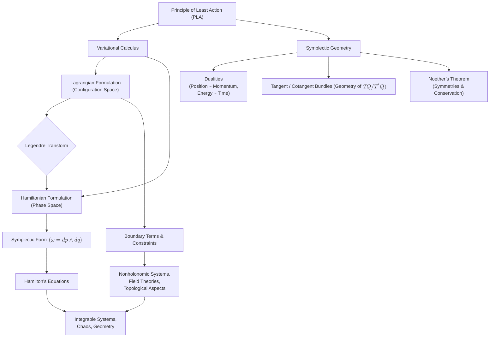

# Envisioning the Principle of Least Action: A Modern Geometric Perspective
* * *

--- Only by delving deeper into geometry can we unveil the hidden unities of physical laws.

# **1. Introduction**  
*Epigraph: “From local slope to global law: how a single principle shapes physics.”*

## 1.1 Motivation and Context

Why re-examine the Principle of Least Action (PLA)? Despite being a cornerstone of theoretical physics since Maupertuis, Euler, and Lagrange, the PLA’s geometric depth continues to unfold in modern research. Classic textbooks often focus on how to derive equations of motion, yet beneath those standard derivations lies a powerful insight: the natural laws seem “optimized” (or extremized) in a geometric sense. That insight suggests an even broader principle—one that can unify diverse fields ranging from optics to quantum mechanics and beyond.

Historically, the PLA arose from variational thinking: how to describe orbits, trajectories, or wavefronts via “the path of least measure.” Initially, mathematicians and natural philosophers debated over the principle’s scope—was it the “least time,” “least distance,” or “least energy?” Over centuries, we learned that “least” is sometimes “stationary” or “saddle point”; the concept of “action” itself also expanded to incorporate kinetic and potential energies or more abstract Lagrangians.

From a **modern vantage**, re-examining the PLA offers two major benefits:

1. **Geometric Unity**: We see that Lagrangian mechanics (focusing on velocities in configuration space) and Hamiltonian mechanics (focusing on momenta in phase space) are linked by the Legendre transform and the geometry of cotangent bundles—an insight that is not always foregrounded in standard treatments.

2. **Frontiers in Research**: Symplectic geometry, gauge theory, topological field theory, and even gravitational approaches in general relativity exploit variational or “least-action” formulations. Understanding these modern expansions demands a deeper look at how classical PLA underpins them.

Hence, our motivation is not to replicate standard derivations but to highlight the geometric synergy behind them; we aim to show how **conceptual clarity** in the variational principle can illuminate novel research directions.

## 1.2 Overview of Classical Variational Principle

In its most classical statement, the variational principle says: for a mechanical system described by coordinates $y$ (or $q$), the actual path between two configurations $\left(x_0,\,y_0\right)$ and $\left(x_1,\,y_1\right)$ is the one that extremizes the action functional
$$
J[y] \;=\; \int_{x_0}^{x_1} L\left(x,\;y,\;y'\right)\,\mathrm{d}x,
$$
where $y' = \frac{\mathrm{d}y}{\mathrm{d}x}$ and $L$ is the Lagrangian. The Euler-Lagrange equation,
$$
\frac{\partial L}{\partial y} \;-\; \frac{\mathrm{d}}{\mathrm{d}x}\!\left(\frac{\partial L}{\partial y'}\right) \;=\; 0,
$$
arises as the necessary condition for $J[y]$ to be stationary under small variations of $y$.

**Limitations & Potential:**
Although this principle elegantly yields equations of motion, certain complexities—like constraints, non-holonomic systems, or more advanced geometric structures—test the bounds of classical treatments. **Potential** arises in the interplay between boundary terms, generalized coordinates, and advanced geometries (symplectic, Poisson, or beyond). By going deeper into geometry, we see that:

- The usual “boundary conditions” encode topological and global constraints that can drastically change the system’s solutions.  
- The linear structure of variations $y \mapsto y + \epsilon\,\eta(x)$ can generalize to infinite-dimensional manifolds and more intricate transformations.  

**Reader Prerequisites & What We Aim to Deepen:**
We assume the reader is aware of basic variational calculus and the standard Euler-Lagrange approach. Here, we aim to:

1. **Revisit** the principle from a geometry-first stance, emphasizing tangent/cotangent bundles and symplectic manifolds.  
2. **Highlight** the deeper analogies—how boundary terms in the action mirror global “topological” influences, how duality emerges via Legendre transform in both Lagrangian and Hamiltonian pictures.  
3. **Bridge** to advanced ideas—why zero-torsion (in Riemannian geometry) parallels zero-boundary terms in extremal functionals, how symplectic geometry generalizes the intangible “action” concept with a closed 2-form.

Thus, the classical variational principle is more than a quick route to differential equations; it is **the** fundamental witness to the geometry hidden within physical laws. Our subsequent sections elaborate on these geometric underpinnings, stepping from the standard Lagrangian viewpoint into the broader Hamiltonian/symplectic domain.

# **2. Revisiting the Variational Calculus Foundations**  
*Epigraph: “Small changes, profound consequences: the calculus of variations.”*

## 2.1 Functionals, Differentiation, and the Euler-Lagrange Equation}

Most readers are familiar with optimizing single-variable functions $f(x)$ by setting $\mathrm{d}f/\mathrm{d}x = 0$. In **variational calculus**, we elevate this concept from “extrema of functions” to “extrema of functionals”. A **functional**
$$
J[y(x)] \;=\; \int_{x_{0}}^{x_{1}} F\left(x,\;y(x),\;y'(x)\right)\,\mathrm{d}x
$$  
maps an entire function $y(\cdot)$ to a real number. We then seek a function $y = y_{\mathrm{ext}}$ that renders $J$ stationary against small perturbations. The path that solves this stationarity condition is called an **extremal**.

### 2.1.1 Idea of Extremum in Function Space
Whereas in single-variable calculus, “stationary” means $\frac{\mathrm{d}f}{\mathrm{d}x} = 0$, in function space, “stationary” means  
$$
\left.\frac{\mathrm{d}}{\mathrm{d}\epsilon} J\left[y + \epsilon\,\eta(x)\right]\right|_{\epsilon=0} \;=\; 0,
$$  
for all admissible variations $\eta(x)$ satisfying $\eta(x_0) = \eta(x_1) = 0$. This notion of “directional derivative” in an infinite-dimensional space is the **first variation** of $J$.

### 2.1.2 Deriving the Euler-Lagrange Equation
Concretely, we write  
$$
J\left[\bar{y}\right] \;=\; \int_{x_0}^{x_1} F\!\left(x,\;\bar{y},\;\bar{y}'\right)\,\mathrm{d}x,\quad
\bar{y} \;=\; y(x)\;+\;\epsilon\,\eta(x).
$$  
Taking $\frac{\mathrm{d}}{\mathrm{d}\epsilon}\left(J[\bar{y}]\right)$ and using Leibniz’s rule plus chain rule yields  
$$
\frac{\mathrm{d}J}{\mathrm{d}\epsilon} \;=\; \int_{x_0}^{x_1} \left(\frac{\partial F}{\partial \bar{y}}\,\eta \;+\; \frac{\partial F}{\partial \bar{y}'}\,\eta'\right)\,\mathrm{d}x.
$$  
The term involving $\eta'$ can be integrated by parts:  
$$
\int_{x_0}^{x_1}\!\!\frac{\partial F}{\partial \bar{y}'}\,\eta'\,\mathrm{d}x \;=\;
\left[\frac{\partial F}{\partial \bar{y}'}\,\eta\right]_{x_0}^{x_1} \;-\; \int_{x_0}^{x_1}\!\!\eta \,\frac{\mathrm{d}}{\mathrm{d}x}\left(\frac{\partial F}{\partial \bar{y}'}\right)\mathrm{d}x.
$$  
Since $\eta(x_0)=\eta(x_1)=0,$ the boundary term vanishes, leaving  
$$
\frac{\mathrm{d}J}{\mathrm{d}\epsilon} \;=\;\int_{x_0}^{x_1}\!\left[\frac{\partial F}{\partial \bar{y}} \;-\; \frac{\mathrm{d}}{\mathrm{d}x}\!\left(\frac{\partial F}{\partial \bar{y}'}\right)\right]\eta\,\mathrm{d}x.
$$  
For this to vanish for **any** $\eta$, the integrand must be zero, yielding the **Euler-Lagrange equation**:
$$
\frac{\partial F}{\partial \bar{y}} \;-\; \frac{\mathrm{d}}{\mathrm{d}x}\!\left(\frac{\partial F}{\partial \bar{y}'}\right)\;=\;0.
$$  
Hence, from the perspective of small functional deviations, local differential equations (Euler-Lagrange) arise as the universal condition for stationarity.

## 2.2 Boundary Terms, Stationary Action, and Physical Constraints

In dealing with real physical systems, boundary conditions matter immensely. We typically fix the endpoints:
$$
y(x_0)\;=\;y_0,\quad y(x_1)\;=\;y_1,
$$
and require variations $\eta$ to vanish at these endpoints, ensuring the path truly connects the same physical states. This condition kills the otherwise non-zero boundary term from integration by parts. Physically, it means “no freedom to vary the final and initial points,” consistent with how experiments fix initial and final configurations.

In more intricate scenarios (e.g. free boundary conditions, specialized constraints, or open boundaries in field theories), boundary terms do not trivially vanish:
$$
\left[\frac{\partial F}{\partial y'}\;\eta\right]_{x_0}^{x_1}\;\neq\;0,
$$
leading to additional conditions or possibly clarifications regarding $\frac{\partial F}{\partial y'}\left(\pm\!\right)$. For instance:

- **Reflective constraints**: specifying momentum-like quantities at endpoints.  
- **Action with topological boundary terms**: bridging local dynamics with global geometry.

### 2.2.1 Physical Meaning of Stationary Action
Stationary action indicates that first-order changes in the path yield no net change to the integral. Such a perspective unifies Newtonian mechanics, optics, quantum waves, and more. Constraints become part of the “global story”: they can alter or refine the dynamics beyond the local Euler-Lagrange equations, thus establishing a synergy between “local” (differential equation) and “global” (boundary/constraint conditions).

## 2.3 Legendre Transform: The Symplectic Bridge

The **Legendre transform** is pivotal in transitioning from Lagrangian ($L$) to Hamiltonian ($H$) mechanics. From a purely algebraic view:
$$
p \;=\;\frac{\partial L}{\partial \dot{q}},\quad
H(q,p) \;=\;p\,\dot{q}\;-\;L(q,\dot{q}),
$$
where $\dot{q}$ is eliminated in favor of $p$. However, geometrically, this transform does much more: it re-maps the system from tangent bundle $(q,\dot{q})$ to cotangent bundle $(q,p)$. We thereby step from “configuration + velocity” representation to “configuration + momentum” representation.

### 2.3.1 Definition and Conceptual Meaning
Legendre transform elegantly captures how momenta are **conjugate** to velocities, bridging Lagrangian and Hamiltonian pictures. In effect, it says: change your viewpoint from “energy minus potential” to “energy in terms of momenta”. That switch is not just algebraic convenience—it reveals a deeper geometry where $p$ naturally belongs to the cotangent fiber rather than the tangent fiber.

### 2.3.2 Unifying Lagrangian and Hamiltonian Pictures
One reason the Legendre transform is crucial: **symplectic geometry** emerges naturally on the cotangent bundle. Where Lagrangian mechanics treats $(q,\dot{q})$ on the tangent bundle, Hamiltonian mechanics uses $(q,p)$ on the cotangent bundle with a symplectic form
$$
\omega \;=\; \sum_{i}\!\mathrm{d}q_{i}\,\wedge\,\mathrm{d}p_{i}.
$$
This $\omega$ is closed ($\mathrm{d}\omega=0$) and non-degenerate, granting a powerful geometric structure that fosters Hamilton’s equations of motion as geodesic-like flows on a symplectic manifold.

By this “bridge”, one sees that each approach (Lagrangian or Hamiltonian) is a partial reflection of an underlying geometry. The Legendre transform enforces the equivalence of these reflections, ensuring each yields the same physical content but in **dual** coordinate languages.

### 2.3.3 Deeper Implications
In advanced contexts—such as field theory, gauge theories, or general relativity—Legendre transforms link different functional descriptions or reveal hidden symmetries. In short, the Legendre transform is not merely a trick for rewriting differential equations, but a profound statement that the “mechanics of motion” can be cast in multiple equivalent geometric frameworks, each illuminating the physics from a new angle.

## 2.4 Conclusion

By revisiting these variational underpinnings (Euler-Lagrange derivation, boundary terms, Legendre transform), we stand on better ground to appreciate the synergy of tangent/cotangent bundles, symplectic manifolds, and ultimately the modern viewpoint that geometry and physics—far from separate—are entwined to their core.

# **3. From Configuration Space to Phase Space**  
*Epigraph: “A shift in perspective: from velocities to momenta, from tangents to cotangents.”*

## 3.1 Tangent Bundles vs. Cotangent Bundles

In classical Lagrangian mechanics, we typically describe a system’s state using **configuration space**, whose points are coordinates $\left(q^{1},\dots,q^{n}\right)$. One then appends velocities $\left(\dot{q}^{1},\dots,\dot{q}^{n}\right)$ to form an element of the **tangent bundle** $T\mathcal{Q}$. Here:
$$
T\mathcal{Q} \;\;=\;\; \{(q,\dot{q}) \mid q \in \mathcal{Q},\;\dot{q}\in T_{q}\mathcal{Q}\}.
$$
Geometrically, each fiber above $q$ is the tangent space $T_{q}\mathcal{Q}$. The Lagrangian $L(q,\dot{q},t)$ then lives on this tangent bundle plus time.

### 3.1.1 Why Cotangent Bundles?
In contrast, **phase space** is built upon the **cotangent bundle** $T^{*}\!\mathcal{Q}$. Instead of velocities, we use momenta $\left(p_{1},\dots,p_{n}\right)$ conjugate to the coordinates $q^{i}$. That is,
$$
T^{*}\!\mathcal{Q} \;\;=\;\; \{(q,p) \mid p \in T_{q}^{*}\!\mathcal{Q}\},
$$
where $p$ belongs to the cotangent space $T_{q}^{*}\!\mathcal{Q}$. This shift matters because physical measurements—like generalized forces and energies—often arise naturally in the language of $\left(q,p\right)$. More concretely:

- **Dynamics**: Hamiltonian equations revolve around $\dot{q} = \partial H/\partial p$ and $\dot{p} = -\partial H/\partial q$.  
- **Energy**: Hamiltonian $H(q,p)$ is typically an energy expression (kinetic + potential).  
- **Measurement**: Forces are $\mathrm{d}p/\mathrm{d}t$, integrals of motion appear more direct in $(q,p)$-form.

Thus, from geometry to physics, the cotangent bundle is not a mere curiosity: it underpins **Hamiltonian mechanics** precisely because momenta “live” in the dual spaces to velocities.

### 3.1.2 Configuration vs. Phase: A Depth of Perspective
Moving from $T\mathcal{Q}$ (Lagrangian viewpoint) to $T^{*}\!\mathcal{Q}$ (Hamiltonian viewpoint) is not just an algebraic Legendre transform—it is also a **change in the fundamental geometric stage** of our theory. We pass from a “velocity-based manifold” to a “momentum-based manifold,” unveiling new structures (e.g. symplectic forms) essential for advanced topics like integrable systems, geometric quantization, and much more.

## 3.2 Symplectic Geometry Essentials

While the tangent bundle captures the concept of motion (velocity), the **cotangent bundle** $T^{*}\mathcal{Q}$ typically comes equipped with a canonical **symplectic form**:
$$
\omega \;=\;\mathrm{d}q^{i}\wedge \mathrm{d}p_{i},
$$
where summation over $i$ is implied (Einstein summation convention). Let us highlight the essential properties:

1. **Non-degeneracy**: For each point $(q,p)\in T^{*}\mathcal{Q}$, $\omega$ is a bilinear $2$-form that pairs tangent vectors in a way that $\omega(v,w)=0$ for all $w$ implies $v=0$. This ensures a robust geometry—roughly speaking, $\omega$ can invert vector components to produce Hamilton’s equations.

2. **Closedness ($\mathrm{d}\omega=0$)**: A symplectic form $\omega$ is closed, meaning $\mathrm{d}\omega=0$. Hence, locally there exist “canonical coordinates” $(q^{i},p_{i})$ in terms of which $\omega$ takes the canonical expression. Closedness also underlies conservation laws and is central to the notion of “Hamiltonian flow” being volume-preserving in phase space.

### 3.2.1 Geometric Implications
The existence of a symplectic form $\omega$ on $T^{*}\mathcal{Q}$ invests phase space with a special geometry: **symplectic geometry**. In this geometry,

- Hamilton’s equations emerge as **flow lines** of a Hamiltonian vector field $X_{H}$ defined by $\iota_{X_{H}}\omega = dH$.  
- Noether’s theorem links continuous symmetries in $H$ to conserved quantities: each symmetry corresponds to a flow that preserves $\omega$. A prime example: time-translation invariance $\Rightarrow$ energy conservation.

### 3.2.2 Why “Symplectic”?
Classically, one treated $(q,p)$ as mere “$2n$-dimensional coordinates.” The symplectic viewpoint, however, shows that $(q,p)$ are not arbitrary coordinates: they come with a closed $2$-form $\omega$ that shapes the entire dynamics. This geometry helps unify wide areas—from planet orbits to quantum wavefunction “phase spaces”—under a single structural paradigm.

## 3.3 Hamilton’s Principle in Phase Space

Often we see the Principle of Least Action couched in Lagrangian coordinates $\left(q,\dot{q}\right)$. Yet there is an equivalent statement—**Hamilton’s principle**—in phase space:
$$
\delta\!\int \left[\;p_{i}\,\mathrm{d}q^{i} \;-\; H(q,p)\,\mathrm{d}t\right] \;=\; 0,
$$
where the variation is taken with respect to trajectories $(q(t),p(t))$. Because $\omega = \mathrm{d}q^{i}\wedge \mathrm{d}p_{i}$ is the underlying symplectic form, the stationarity condition recovers Hamilton’s equations as if they were geodesics on the symplectic manifold.

### 3.3.1 Geodesic Flow on a Symplectic Manifold
In differential geometry, geodesics on Riemannian manifolds are the “straightest possible lines.” Analogously, in symplectic manifolds with a Hamiltonian $H$, the flow along $(q(t),p(t))$ is “straightest” in the sense of preserving $\omega$. This perspective clarifies why classical orbits in phase space sometimes exhibit beautiful geometric behaviors—$\omega$ remains invariant along solutions, providing an incompressible flow.

### 3.3.2 Relationship to Noether’s Theorem (Brief Mention)
Noether’s theorem claims that for each continuous symmetry of the action (or Hamiltonian), there is an associated conserved quantity. In Hamiltonian form, each symmetry corresponds to a canonical transformation that leaves $\omega$ invariant. For example:

- Time invariance $\Rightarrow$ energy conservation.  
- Rotational invariance $\Rightarrow$ angular momentum conservation.

Though we will not detail every proof, the symplectic setting streamlines Noether’s argument: “symmetry” $=$ preserving $\omega$ and $H$ in a certain sense $\Rightarrow$ existence of an integral of motion.

## 3.4 Conclusion

In summary, migrating from **configuration** space to **phase** space and embracing symplectic geometry is not a mere “detail” but rather a deep conceptual shift. The tangent bundle’s velocity-based perspective gives way to a momentum-based viewpoint on the cotangent bundle, revealing symplectic forms, Hamilton’s equations, and the broader unifying geometry that underpins classical and modern mechanics.

# **4. Deep Structures and Dualities**  
*Epigraph: “In every duality hides a deeper unity.”*

## 4.1 Duality in Mechanics: Position $\sim$ Momentum, Energy $\sim$ Time

One of the most profound lessons from modern mathematical physics is that seemingly opposite quantities often come in **pairs**, united by an underlying geometry or symmetry. In classical mechanics, we see such dualities emerge through:

### 4.1.1 Position $\sim$ Momentum
In the Hamiltonian formalism, each coordinate $q^i$ has a corresponding momentum $p_i$. Although one might initially view $(q,p)$ simply as an expanded set of variables, symplectic geometry reveals a deeper structure: $p$ resides naturally in the **dual space** to velocities. This pairing is sometimes referred to as a **canonical conjugation**. In phase space, it is precisely the symplectic form
$$
\omega \;=\;\mathrm{d}q^i \wedge \mathrm{d}p_i
$$
that encodes this duality, ensuring each coordinate has a unique momentum partner.

### 4.1.2 Energy $\sim$ Time
Another classical duality manifests in the relation between energy and time. In Hamiltonian mechanics, time evolution is governed by $\dot{q}^i = \partial H/\partial p_i$ and $\dot{p}_i = -\partial H/\partial q^i$, where $H$ is identified as the total energy. The “rate of change” in time is controlled by $\frac{\partial}{\partial E}$ in certain extended formalisms, paralleling the $(q,p)$ dual structure. In quantum mechanics, this appears as the well-known energy-time complementarity (though more subtle than position-momentum).

### 4.1.3 Why Dualities Help Unify Viewpoints
Dualities often allow us to switch from one perspective to its “partner” perspective without losing any physical information. For instance:

- **Velocity-based** Lagrangian $\mapsto$ **Momentum-based** Hamiltonian.  
- “Real-space” wavefunction $\mapsto$ “Reciprocal-space” wavefunction in quantum mechanics.  

Such transformations highlight how a single phenomenon can be described in complementary ways, reinforcing the notion that many physical theories are geometric at heart, with dualities revealing different “faces” of the same underlying structure.

## 4.2 Torsion, Curvature, and Potential Extensions

In differential geometry, two crucial concepts for characterizing connections on manifolds are **torsion** and **curvature**. While standard treatments of classical mechanics typically assume a torsion-free context (e.g., Levi-Civita connection in Riemannian geometry), expansions or analogies with non-zero torsion can appear in advanced physical frameworks:

### 4.2.1 Torsion in a Connection
For a manifold $\mathcal{M}$ endowed with a connection $\nabla$, the torsion tensor $T(X,Y)$ measures how the difference $\nabla_{X}Y - \nabla_{Y}X$ compares to the Lie bracket $[X,Y]$. If torsion is zero, we say the connection is torsion-free (as in standard Riemannian geometry).

### 4.2.2 Non-Closed Forms in Symplectic Geometry
Symplectic forms $\omega$ are **closed**, $\mathrm{d}\omega=0$. A non-closed “almost symplectic” form might appear in certain extended frameworks (e.g., mechanical systems with external fields, nonholonomic constraints, or couplings that break exactness). These scenarios carry parallels to having a “torsion-like” structure in the geometry, because “non-closure” modifies how flows and integrals behave.

### 4.2.3 Further Generalizations
In trying to incorporate complexities such as topological terms, gauge fields, or exotic constraints, one might see analogies to torsionful connections:

- $\mathrm{d}\omega \neq 0$ suggests new boundary interactions or twisted symplectic structures.  
- If $\nabla$ itself is replaced by a more general connection with torsion, the usual local or global invariants (like Noether charges) can demand reinterpretation.  

While these remain somewhat beyond classical mechanics’ baseline, they point to deeper geometric expansions that unify fields (in both senses—mathematical and physical).

## 4.3 Beyond Standard Systems: Generalized Coordinates, Nonholonomic Constraints

Not all mechanical systems fit neatly into the standard Lagrangian or Hamiltonian template. In more advanced or realistic models, constraints and coordinate choices become more complicated. Geometry again is our ally:

### 4.3.1 When Geometry Becomes More Intricate
Systems with **nonholonomic constraints** (like rolling without slipping) typically require a careful handling of function spaces or distributions that define “allowed velocities.” Symplectic technique can still apply, but we may need to employ extended Dirac–Bergmann formulations or use Poisson structures instead of fully symplectic ones.

### 4.3.2 Tools from Advanced Differential Geometry

- **Fiber Bundles**: We might consider principal bundles and gauge connections if the system has internal symmetries (e.g., rotations, gauge fields).  
- **Distribution Theory and Pfaffian Constraints**: Nonholonomic constraints often appear as $\alpha(q,\dot{q})=0$ for some Pfaffian form $\alpha$. The geometry of those distributions informs the resulting “reduced” dynamics.  
- **Poisson or Dirac Structures**: Even if $\omega$ is partially degenerate or modified by constraints, generalized Poisson brackets can preserve a notion of Hamiltonian flow in an extended sense.

Hence, stepping beyond classical “clean” systems demands precisely the expansions in geometry—torsion, curvature, constraints, bundling—that reflect the deep synergy between overhead concepts, local differential equations, and global topological data.

## 4.4 Conclusion

In sum, dualities such as $(q,p)$ or $(E,t)$ are not just neat mathematical symmetries; they are gateways to a deeper geometric unification. Meanwhile, exploring torsion, curvature, and constraints reveals how small departures from “textbook” assumptions lead to big conceptual shifts—often bridging classical mechanics with advanced geometry. By recognizing and embracing these deeper structures, one sees how the Principle of Least Action might elegantly weave through complex realms, from nonholonomic kinematics to topological field theories.

# **5. Elevating Lagrangian & Hamiltonian Mechanics**  
*Epigraph: “Mechanics, at its core, is geometry in disguise.”*

## 5.1 Why Two Formulations?

Having explored Lagrangian mechanics (built on velocities in configuration space) and Hamiltonian mechanics (built on momenta in phase space), an inevitable question arises: **Why maintain two different pictures?** The historical answer is that each approach has unique strengths:

### 5.1.1 Complementary Strengths

- **Analytical Transparency (Lagrangian)**: The Euler-Lagrange equation is often straightforward to derive from a well-defined Lagrangian, especially when dealing with constraints or generalized coordinates. Its direct link to the variational principle makes it well-suited for systematically imposing boundary conditions or for coupling fields in advanced contexts (e.g., field theory).
- **Geometric / Integrals of Motion (Hamiltonian)**: Hamiltonian mechanics brings forth the notion of a **phase space** endowed with a symplectic form. This environment highlights symmetries and integrals of motion (Noether’s theorem, canonical transformations) more transparently, allowing geometric arguments about flows, conserved quantities, and integrability.
- **Interpretive Clarity**:
  - In **Lagrangian** form: “Kinetic minus potential” fosters an intuitive sense of energy trade-offs.  
  - In **Hamiltonian** form: Energy itself is frequently the Hamiltonian, making dynamical evolution in $(q,p)$-space especially direct.  

Hence, the two formulations are not so much “redundant” as complementary vantage points on the same underlying geometry.

## 5.2 Modern Insights and Possible Research Directions

Beyond classical textbooks, numerous contemporary developments leverage the synergy between Lagrangian and Hamiltonian formalisms:

### 5.2.1 Nonlinear Dynamics and Integrable Systems
Modern studies of chaos, solitons, and integrable systems often pivot between a Lagrangian “action-based” perspective and a Hamiltonian “phase-space” perspective. For instance, discovering new integrals of motion can be simpler in Hamiltonian language (via symplectic geometry), yet verifying stability or boundary constraints often reverts to Lagrangian arguments.

### 5.2.2 Geometric Quantization
For systems that eventually transition to quantum regimes, **geometric quantization** attempts to systematically “quantize” a symplectic manifold. In effect, one tries to interpret classical canonical coordinates $(q,p)$ as operators on a Hilbert space, guided by the geometry of the underlying phase space. The original Lagrangian structure sometimes re-emerges in path-integral formulations, reaffirming that each viewpoint (Lagrangian or Hamiltonian) can sparkle more strongly at different stages or conceptual layers of the theory.

### 5.2.3 Interdisciplinary Connections: Complex Systems, Robotics, Control Theory
Many fields beyond pure physics find practical uses in variational approaches and symplectic-based formulations. Control theory, for example, uses Hamilton-Jacobi methods to solve optimal trajectory problems. In robotic motion planning, “optimal path” echoes the principle of least action, albeit often in a discrete or approximate form. Rigid-body dynamics, as well, relies on Hamiltonian mechanics for analyzing multi-axis rotational symmetries and conservation laws.

## 5.3 Open Problems / Challenges

### 5.3.1 Generalizing to Field Theory
Even though Lagrangian and Hamiltonian methods extend to fields (e.g., classical field theory), subtleties proliferate: infinite-dimensional configuration spaces, gauge symmetries, boundary terms at spatial infinity, or topological effects (like instantons). Ensuring a consistent Hamiltonian structure for constrained gauge systems is famously intricate (Dirac–Bergmann method, BRST quantization). Each era of field-theoretical breakthroughs reinterprets aspects of the principle of least action in novel ways.

### 5.3.2 Gravity and Spacetime Geometry
Einstein’s general relativity can be cast in variational form (Hilbert action), but building a **Hamiltonian formulation** demands tackling the constraints of 4D spacetime geometry. Arnowitt-Deser-Misner (ADM) decomposition rewrites gravitational dynamics in a “$(3+1)$-dimensional” Hamiltonian style, revealing how subtle constraints define physical degrees of freedom. Many questions remain about quantum gravity, where unifying both Lagrangian (path integral) and Hamiltonian (canonical quantization) pictures remains an outstanding challenge.

### 5.3.3 Topological Effects and Quantum Realms
Phenomena like the quantum Hall effect or topological insulators highlight robust quantized properties that arise from global geometry. Understanding these phenomena purely from a “local differential equation” viewpoint is incomplete; topological boundary terms or “Chern-Simons actions” become crucial. Bridging local Euler-Lagrange equations with topological constraints exemplifies a major frontier in applying the principle of least action to advanced quantum systems.

## 5.4 Conclusion

In conclusion, Lagrangian and Hamiltonian mechanics constitute two coordinate charts on the same geometric manifold of physical phenomena. Modern practice shows that harnessing the synergy between them—especially when combined with symplectic geometry, boundary/constraint analysis, and topological understanding—unlocks potent new insights. From integrable systems to quantum fields, from robotics to gravitation, the interplay of these two formulations continues to inspire theoretical breakthroughs and practical innovations alike.

# **6. Conclusion and Future Outlook**  
*Epigraph: “We stand on an ever-shifting boundary—pushing the principle to new domains.”*

## 6.1 Key Takeaways

The journey undertaken across the previous sections highlights a singular thread: the Principle of Least Action (PLA) is far more than a recipe for deriving equations of motion. Rather, it provides a unifying framework that links:

1. **Variational Principle and Euler-Lagrange Equations:** At the foundation, simple functional variations yield differential equations that govern classical motion. Yet this “simple” approach conceals a powerful generality, connecting Newtonian kinematics, optics, and wave mechanics under the same umbrella.

2. **Legendre Transform and Symplectic Geometry:** The equivalence between Lagrangian ($q,\dot{q}$) and Hamiltonian ($q,p$) descriptions is systematically revealed by the Legendre transform. From a geometric perspective, $\left(q,p\right)$-based phase space is endowed with a symplectic 2-form that encodes canonical commutation relations and ties directly to momentum-position dualities.

3. **Dualities and Deeper Structures:** The existence of conjugate variables such as $(q,p)$, $(E,t)$, and their symplectic pairing underscores how the PLA helps unify classical mechanics with broader physical theories. Torsion, curvature, and other geometric concepts provide glimpses into generalizations that bind local details of a system to global or topological constraints.

Collectively, these insights demonstrate that **geometry is not merely a convenience**—it forms the backbone of advanced mechanical theory. PLA fosters an elegant synergy among variational calculus, Legendre transformations, symplectic geometry, and dualities, reminding us that the mechanics we see is deeply intertwined with a rich underlying geometric structure.

## 6.2 Potential for Discovery

While the Principle of Least Action has been a cornerstone for centuries, its complexion continues to evolve. Potential frontiers include:

### 6.2.1. Novel Physical Phenomena
In fields such as condensed matter, topological states, and gravitational wave physics, the PLA remains a powerful lens. Researchers continually discover that, when formulated in geometric terms, the principle can extend to new regimes, including effective field theories, exotic materials, and emergent quantum phases.

### 6.2.2. Cross-Disciplinary Expansion
Mechanics informed by geometric reasoning—especially symplectic, Poisson, or even non-symplectic structures—resonates beyond pure physics. Applications range from controlling robotic trajectories (optimal path planning) to analyzing large-scale structures in astrophysics, to complex systems in biology. The general “least-action” viewpoint translates smoothly into optimization problems, reinforcing strong interdisciplinary ties.

### 6.2.3. Quantum and Beyond
Though classical in origin, the PLA undergirds path-integral formulations in quantum mechanics, pointing to a true unity across scales. As theoretical physics aims for quantum gravity or invests in topological quantum field theories, the same basic variational principle—amplified by geometry—promises deeper universalities that we are only beginning to glimpse.

## 6.3 Conclusion

In sum, the Principle of Least Action endures as a living and evolving cornerstone, continually reframing how we perceive physical laws at all scales. From exploring emergent phenomena to bridging fields as disparate as robotics and quantum theory, the PLA’s geometric perspective furnishes not only a robust mathematical architecture but also an invitation to push conceptual boundaries ever further.

# **7. References & Notes (Optional or Summarized)**

Below is a curated list of references—both classical and modern—intended to guide further exploration. Citations are grouped by thematic relevance:  
1. core textbooks in classical mechanics and variational methods;  
2. historical developments and foundational papers;  
3. specialized monographs on symplectic geometry, Hamiltonian systems, and advanced topics.

## 7.1 Key Textbooks & Surveys

1. **Goldstein, H., Poole, C., & Safko, J.**  
   *Classical Mechanics.* 3rd ed., Pearson, 2002.  
   - A canonical reference covering Lagrangian and Hamiltonian mechanics in a thorough, structured style. Offers a clear elaboration of the variational principle and standard mechanical applications.

2. **Landau, L. D., & Lifshitz, E. M.**  
   *Mechanics (Course of Theoretical Physics, Vol. 1).* 3rd ed., Pergamon Press, 1976.  
   - A succinct yet rigorous treatment of classical mechanics, emphasizing elegant mathematical derivations. The Principle of Least Action is introduced early, setting a unifying framework.

3. **Arnold, V. I.**  
   *Mathematical Methods of Classical Mechanics.* 2nd ed., Springer, 1989.  
   - A definitive introduction to the geometrical viewpoint in classical mechanics. Arnold’s text masterfully links symplectic geometry, transformations, and Hamiltonian formalism.

4. **Marsden, J. E., & Ratiu, T. S.**  
   *Introduction to Mechanics and Symmetry: A Basic Exposition of Classical Mechanical Systems.* 2nd ed., Springer, 1999.  
   - Explores symplectic and Poisson geometry in mechanical systems. Particularly useful for understanding reduction, momentum maps, and advanced group-symmetry arguments.

## 7.2 Historical Foundations & Groundbreaking Papers

1. **Maupertuis, P. L. M.**  
   “Accord de différentes lois de la nature qui avaient jusqu’ici paru incompatibles,” *Mém. Acad. Roy. Sci. Berlin*, 1744.  
   - One of the earliest statements of what would become the Principle of Least Action, introducing a unifying variational idea in physics.

2. **Euler, L.**  
   *Methodus inveniendi lineas curvas...* 1744.  
   - Euler formalized variational calculus concepts, anticipating the broader framework that Lagrange would later refine.

3. **Lagrange, J. L.**  
   *Mécanique Analytique.* 1788.  
   - A landmark work presenting mechanics via the calculus of variations and partial derivatives—the basis for the Euler-Lagrange equations.

4. **Hamilton, W. R.**  
   “On a General Method in Dynamics,” *Philosophical Transactions of the Royal Society*, 1834, 1835.  
   - Introduced Hamilton’s principle and laid the foundation for Hamiltonian mechanics, bridging ideas of conjugate momenta and symplectic form.

5. **Noether, E.**  
   “Invariante Variationsprobleme,” *Nachrichten von der Gesellschaft der Wissenschaften zu Göttingen*, 1918.  
   - Established the profound link between continuous symmetries and conserved quantities, now known as Noether’s theorem; a linchpin in modern theoretical physics.

## 7.3 Advanced Geometric and Theoretical Directions

1. **Guillemin, V., & Sternberg, S.**  
   *Symplectic Techniques in Physics.* 2nd ed., Cambridge University Press, 1990.  
   - Offers an in-depth look at how symplectic geometry applies to quantum theory, integrable systems, and representation theory.

2. **Woodhouse, N. M. J.**  
   *Geometric Quantization.* Oxford University Press, 1992.  
   - Elaborates on the transition from classical symplectic geometry to quantum Hilbert space frameworks—an essential text for anyone interested in the geometric underpinnings of quantization.

3. **Faddeev, L. D., & Jackiw, R.**  
   “Hamiltonian Reduction of Unconstrained and Constrained Systems,” *Physical Review Letters*, 60 (1988).  
   - Addresses the subtleties of Hamiltonian formulations in systems with constraints and gauge symmetries—a pivotal stepping stone for understanding Dirac-Bergmann constraints.

4. **Nair, V. P.**  
   *Quantum Field Theory: A Modern Perspective.* Springer, 2005.  
   - While broader in scope, includes chapters illustrating how the Principle of Least Action generalizes in gauge theories and field quantization.

5. **Frankel, T.**  
   *The Geometry of Physics: An Introduction.* 3rd ed., Cambridge University Press, 2011.  
   - Provides a panoramic view connecting differential geometry, topology, and various physical theories—from classical mechanics to gravitation and gauge fields.

## 7.4 Notes & Further Remarks

1. **Variational Methods Across Disciplines.**  
   The least-action framework extends well beyond “traditional” mechanics, informing computational methods (finite element methods, optimal control) and advanced engineering (robotics, aerospace, large-scale design optimization).

2. **Historical vs. Modern Terminology.**  
   Terminologies (e.g., “least action,” “stationary action,” “optimal path”) have evolved. One should be mindful of the distinction between physical “minimal” action and the more mathematically precise notion of a “stationary” action (which can be a saddle point).

3. **Topological and Global Considerations.**  
   As one ventures into gauge theories, gravitational actions, or quantum anomalies, boundary terms and global obstructions may overshadow local Euler-Lagrange equations. Checking references on Chern-Simons theory or Wess-Zumino terms can open new research doors.

4. **Online Lecture Notes / Preprints.**  
   Many contemporary scholars share updated lecture notes (e.g., on arXiv) focusing on geometric mechanics, nonholonomic systems, or quantum-to-classical transitions. Staying current with such resources complements the classical textbooks listed above.

## 7.5 Conclusion

This reference section is not exhaustive but provides key starting points for both a foundational and progressive understanding of the Principle of Least Action from a modern, geometry-oriented perspective. Engaging with these works—alongside ongoing research literature—will guide the reader through core conceptual terrain and toward the continually emerging frontiers where geometry and physics converge.

# Appendix A: Core Concepts and Their Interconnections

Below is a schematic representation of the main ideas presented in this document, aiming to guide readers through the key concepts and how they dovetail into one another. The diagram highlights the flow from the Principle of Least Action through variational calculus, symplectic ideas, and the dualities that unify seemingly disparate formulations. It also underscores how boundary/constraint considerations open up advanced topics, from nonholonomic systems to field-theoretical generalizations.

**Diagram Notes**:

1. **Principle of Least Action (PLA)**: Serves as the overarching framework that ties together multiple physical formulations, from classical mechanics to broader domains in physics.

2. **Variational Calculus**: The underlying mathematical toolkit for PLA, wherein functionals are extremized and yield the Euler-Lagrange equations.

3. **Lagrangian vs. Hamiltonian Mechanics**:  
   - The Lagrangian viewpoint operates on the tangent bundle $T\mathcal{Q}$ (configuration space + velocities).  
   - The Hamiltonian viewpoint uses the cotangent bundle $T^{*}\!\mathcal{Q}$ (phase space + momenta).  
   - These two pictures are “linked” by the Legendre transform and yield equivalent dynamics.

4. **Symplectic Geometry**: Provides the geometric scaffolding for Hamiltonian mechanics; the non-degenerate, closed two-form $\omega$ encapsulates how canonical coordinates $(q,p)$ drive the evolution of a system and give rise to powerful concepts like Noether’s theorem.

5. **Dualities (Position $\sim$ Momentum, Energy $\sim$ Time)**: Reflect the deeper structural symmetries within physical laws, evident both in classical and quantum regimes.

6. **Boundary Terms & Constraints**: Indicate how global conditions (boundary conditions, constraints, or topological aspects) can alter local equations of motion and open pathways to advanced, generalized theories (e.g., nonholonomic systems, gauge fields, or topological field theories).

By consulting this diagram in tandem with the text, readers can more readily see how each of the document’s sections intersects and complements the others to form a cohesive, geometry-driven perspective on the Principle of Least Action.

# Appendix B: Philosophical and Teleological Reflections on the Principle of Least Action

In the foregoing chapters, we have emphasized the geometric and mathematical underpinnings of the Principle of Least Action (PLA). Historically, however, this principle has also incited deeper philosophical debates, raising questions about whether nature “chooses” the most elegant path for a teleological reason or whether the principle merely reflects an effective modeling stance without invoking purpose or “final causes.” In this appendix, we briefly survey these perspectives and offer some forward-looking thoughts on how they might coexist or be transcended in modern discourse.

## B.1 Historic Teleological Undercurrents

From the time of Aristotle, philosophers and natural scientists alike have been captivated by the notion that the world might operate under a unifying, optimally efficient rule. Maupertuis and Euler championed a “least” or “optimal” action principle, suggesting that this economy of effort revealed a profound elegance in the laws of nature. In some expositions, especially in the 18th and 19th centuries, these ideas took on strong teleological overtones—that is, hints that nature “aims” for an extremum as if guided by a purposeful directive.

The resonance with Aristotelian **final causality**—the idea that natural processes strive towards a goal—stirred reflection on whether the principle in itself was evidence of a cosmic design or “supreme intelligence.” Indeed, Euler wrote passionately about the principle’s capacity to demonstrate nature’s perfection or economy. Such outlooks harmonized with broader Enlightenment efforts to reconcile science with notions of inherent rationality or divine order.

## B.2 Feynman’s Model Perspective

Moving to the 20th century, Richard Feynman famously disclaimed any teleological reading of the Principle of Least Action. In his lectures, he underscored that physics is, at heart, a sophisticated **model**—one that might use an “action-minimizing” or “trajectory-integrating” viewpoint without implying that particles “know” or “choose” their future paths. Instead:

1. **Mathematical Structure, Not Purpose**: The PLA can be viewed as a formal organizing principle for deriving equations of motion which match experiments, but it need not ascribe any end-directed cause to nature.  
2. **Equivalence of Formulations**: Whether one uses Newton’s second law, Hamilton’s principle, or another axiomatic approach, the same physical predictions emerge. The PLA thus offers a unifying language but does not by itself necessitate teleological interpretation.

In Feynman’s spirit, many modern physicists would argue that the principle’s “least” or “stationary” aspect is a testament to the underlying **mathematical symmetries and variational consistencies**, rather than to an actual “aim” or “purpose” in the natural world. This perspective views action-based methods as powerful tools—particularly fertile in quantum field theory, path integrals, or symplectic geometry—yet remains agnostic about any metaphysical claims.

## B.3 Towards a Broader Synthesis

A central tension remains: is the PLA purely an economical mathematical device, or does it reflect an intrinsic “economy” in nature’s functioning? Bridging these viewpoints may require considerations that go beyond classical physics into domains where geometry, complexity, and even emergent phenomena are at play:

1. **Emergent Teleology in Complex Systems**: As we study self-organizing processes in biology or large-scale cosmological structures, “least-action-like” principles can emerge in dissipative systems or in evolutionary stable strategies. Here, “least effort” or “optimal” solutions might be viewed not as teleological in a strict sense but as the result of selection pressures or large-phase-volume dominances in path integrals.

2. **Topological and Nonlocal Aspects**: In advanced field theories, boundary terms, anomalies, and nontrivial topologies sometimes appear “fine-tuned” or “optimized.” Whether one interprets these features as a deeper natural synergy or as an artifact of modeling is open to debate. The philosophical question remains: does mathematics describe local realities meticulously enough that global “extrema” inevitably arise, or is the very concept of “global stationarity” an artifact of our representational frameworks?

3. **Quantum Limits and Beyond**: In quantum mechanics, alternative formulations (e.g., path-integral quantization) recast the PLA in terms of $\mathrm{e}^{iS}$, where **all** paths contribute, but those near the “classical” stationary-action path dominate. This interplay between a variety of paths and a stationary-phase approximation underscores that “classical teleology” might simply be an emergent phenomenon from the superposition of quantum states.

## B.4 Future Horizons

From a 21st-century vantage point, one might suggest that the “purpose” or “final cause” historically ascribed to the Principle of Least Action could be assimilated into a modern narrative of **geometric unity** and **variational consistency**. Three possible directions for reconciling or extending these debates include:

1. **Mathematical Platonism vs. Pragmatic Formalism**: The PLA might be invoked to support a Platonic realist stance—mathematical laws “exist” in some metaphysical sense, and nature partakes in them. Conversely, a pragmatic formalist sees the PLA merely as a convenient unifying method among many, with no deeper metaphysical import.

2. **Epistemic vs. Ontic Perspectives**: Some researchers argue that the PLA reflects our **epistemic limitations**—we encode physics in ways that highlight symmetries and minimal principles because such frameworks are computationally or conceptually powerful. An **ontic** stance would be that the minimal principle discloses how reality “really is,” with or without human observers. Further philosophical analysis can explore how these stances intersect with the history of science and the evolving role of mathematics.

3. **Embedding in Broader Theories**: As new frameworks emerge (e.g., holographic principles in quantum gravity, topological quantum field theories), the meaning and scope of “action” may transmute yet again. Whether future theories retain a “least action” character or reveal a more generalized concept (like extremal or stable phase volumes in large Hilbert spaces) will continue to inform debates over teleology, structure, and the ultimate rationality of the universe.

## B.5 Concluding Reflections

While this document has stressed the **geometric** and **mathematical** beauty of the Principle of Least Action—and indeed showcased how it unites fields from classical mechanics to modern physics—its philosophical resonance is equally potent. Euler and Aristotle saw the hallmark of design or elegance, whereas Feynman and his successors emphasize modeling pragmatism and the absence of intrinsic “purpose.” Perhaps the true power of the PLA lies precisely in this dual capacity:

- **Scientifically**, it operates as a precise, unifying statement of local laws and global boundary conditions.  
- **Conceptually**, it invites broader contemplation on why such an “economy of action” appears at all.

In short, the PLA can be viewed both as a rigorous computational principle **and** a deep hint toward nature’s latent geometry—without requiring that one adopt any single metaphysical stance. By fostering open-minded discourse between teleological interpretations and purely methodological ones, we advance not only our physical theories but also our philosophical understanding of how geometry, economy, and the quest for meaning weave together in the tapestry of natural law.

