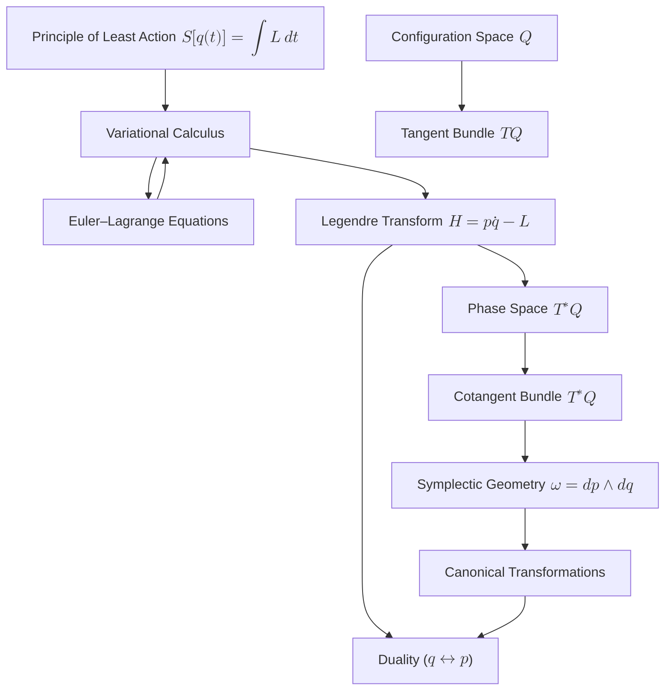

# From Least Action to Symplectic Geometry: A Deep Synthesis of Classical Mechanics
* * *

--- Unveiling the intrinsic unity of mechanics through variational principles and geometric duality.

# I. Introduction

**Epigraph:**  
*“The laws of nature are written in the language of mathematics.”*

Classical mechanics, at its inception rooted in Newton's laws, has long served as the cornerstone for understanding the physical world. Yet, as we reflect on its development, we recognize that its evolution is marked not by mere computational techniques but by a profound shift in perspective—one that elevates the study of motion from force-centric formulations to one embracing deep geometric insights.

## I.1. Historical Context and the Emergence of the Principle of Least Action

The journey began in the 18th century with the emergence of the **Principle of Least Action**, often expressed as
$$
S[q(t)] = \int_{t_1}^{t_2} L(q,\dot{q},t)\,dt,
$$
where $L(q,\dot{q},t)$ represents the Lagrangian of the system. Pioneers such as Maupertuis, Euler, and Lagrange recognized that nature operates efficiently—selecting a path that renders the action stationary. This intuition, though initially counterintuitive compared to the deterministic force-based Newtonian view, revealed a unifying principle underlying the mechanics of particles and continua alike.

## I.2. Evolution from Newtonian Dynamics to Variational Descriptions

As the analytical techniques matured, variational calculus emerged as a powerful method for deriving the equations of motion. By setting the first variation of the action $\delta S = 0$ and employing integration by parts, one obtains the Euler–Lagrange equations, which elegantly encapsulate the dynamics:
$$
\frac{d}{dt}\left(\frac{\partial L}{\partial \dot{q}}\right) - \frac{\partial L}{\partial q} = 0.
$$
This approach not only refines our understanding of classical trajectories but also forges a conceptual bridge to deeper mathematical structures.

## I.3. Transition to a Geometric Framework

The real breakthrough comes when one acknowledges that variational principles are intrinsically geometric. Through the **Legendre transform**
$$
H = p\dot{q} - L,
$$
we transition from the Lagrangian description in configuration space $Q$ to **Hamiltonian mechanics** in phase space, which is naturally modeled as the cotangent bundle $T^*Q$. Here, the coordinates $q$ and the conjugate momenta $p$ attain equal footing, reflecting a fundamental **duality**.

Within this geometric framework, concepts such as tangent and cotangent bundles provide the language to describe velocities and momenta. More importantly, the **Poincaré–Cartan one-form**
$$
\theta = p\,dq
$$
and its exterior derivative, the **symplectic form**
$$
\omega = -d\theta = dp \wedge dq,
$$
offer deep insights. These structures are invariant under canonical transformations, symbolizing the immutable conservation laws (e.g., energy conservation) that arise naturally from symplectic invariance.

## I.4. Overview of Modern Geometric Tools

This document will explore modern geometric tools that recast classical mechanics in a unifying language. We will examine:

- **Variational Calculus and Least Action:** How the minimization of an action integral reveals the underlying optimality in nature.
- **Legendre Transformation:** Transforming the description of a dynamical system from velocities to momenta, and thereby from $Q$ to $T^*Q$.
- **Symplectic Geometry:** The study of symplectic manifolds where the invariant two-form $\omega$ encodes conservation laws and supports canonical flows.
- **Duality and Invariance:** The interplay between coordinates $q$ and momenta $p$ and its manifestation in both the physical laws and the mathematical structure of phase space.

## I.5. Setting the Stage for a Deeper Exploration

In synthesizing these ideas, our aim is not just to revisit familiar territory but to escalate toward a more abstract, yet profoundly integrated, perspective on mechanics. By revealing the intrinsic unity between variational principles and symplectic geometry, this document endeavors to provide a concise yet enriched framework that may well inspire novel research directions and a deeper appreciation for the elegant structure of the physical laws governing our universe.

We invite you to journey with us from the classical notions of action minimization to the abstract realms of geometric duality—and in doing so, to rediscover the timeless symmetry and unity underlying mechanics.

# II. Variational Principles and the Principle of Least Action

**Epigraph:**  
*"In the search for simplicity, nature reveals its optimal paths."*

The Principle of Least Action is far more than an efficient computational shortcut—it is the very foundation upon which classical dynamics is built. At its core, it asserts that the evolution of a system is determined by the stationarity of an action functional, a concept that leads us into the rich field of variational calculus. This chapter is devoted to a deep exploration of the variational principle, its formal consequences, and the implications of boundary terms, which ultimately evolve into the geometric structures central to modern mechanics.

## II.1. The Action Functional and Variational Calculus

The dynamics of a system are encoded in the action functional
$$
S[q(t)] = \int_{t_1}^{t_2} L(q,\dot{q},t)\,dt,
$$
where $L(q, \dot{q}, t)$ is the Lagrangian representing the difference between kinetic and potential energies, $q(t)$ denotes the generalized coordinates, and $\dot{q}(t)$ their time derivatives. The principle postulates that the actual path $q(t)$ taken by the system renders the action stationary (typically, a minimum) relative to all nearby paths that share the same endpoints.

## II.2. Derivation of the Euler–Lagrange Equations

To formally derive the equations governing the dynamics, consider an infinitesimal variation of the path:
$$
q(t) \rightarrow q(t) + \delta q(t),
$$
with the endpoints fixed, i.e., $\delta q(t_1) = \delta q(t_2) = 0$. The resulting variation in the action is given by
$$
\delta S = \delta \int_{t_1}^{t_2} L(q, \dot{q}, t)\,dt = \int_{t_1}^{t_2} \left[ \frac{\partial L}{\partial q} \delta q + \frac{\partial L}{\partial \dot{q}} \delta \dot{q} \right] dt.
$$
Recognizing that $\delta \dot{q} = \frac{d}{dt} (\delta q)$, we integrate by parts on the term involving $\delta \dot{q}$:
$$
\int_{t_1}^{t_2} \frac{\partial L}{\partial \dot{q}} \frac{d}{dt} (\delta q) \, dt = \left.\frac{\partial L}{\partial \dot{q}} \delta q \right|_{t_1}^{t_2} - \int_{t_1}^{t_2} \frac{d}{dt} \left( \frac{\partial L}{\partial \dot{q}} \right) \delta q \, dt.
$$
Since the variations vanish at the endpoints, the boundary term
$$
\left.\frac{\partial L}{\partial \dot{q}} \delta q \right|_{t_1}^{t_2}
$$
drops out. Combining the remaining terms gives
$$
\delta S = \int_{t_1}^{t_2} \left[ \frac{\partial L}{\partial q} - \frac{d}{dt} \left( \frac{\partial L}{\partial \dot{q}} \right) \right] \delta q \, dt.
$$
For the action to be stationary for arbitrary $\delta q(t)$, the integrand must vanish. This requirement yields the celebrated Euler–Lagrange equation:
$$
\frac{d}{dt} \left( \frac{\partial L}{\partial \dot{q}} \right) - \frac{\partial L}{\partial q} = 0.
$$

## II.3. Interpretation of the Action and Its Extremal Properties

The extremal property of the action, even if it does not always correspond to a strict minimum (sometimes a saddle point), encapsulates an inherent economy in nature. It reflects an underlying optimization principle: among all conceivable trajectories, the system follows the one that renders the action stationary. This is not merely a mathematical curiosity—it constitutes an axiomatic basis for the laws of motion, connecting diverse physical phenomena via a single variational prescription.

## II.4. The Role and Implications of Boundary Terms

While the integration by parts conveniently removes the boundary contributions under fixed endpoint conditions, the boundary terms themselves hold profound significance. Reintroducing these terms when endpoints are allowed to vary, we have
$$
\delta S = \left. \frac{\partial L}{\partial \dot{q}}\, \delta q \right|_{t_1}^{t_2} + \int_{t_1}^{t_2} \left[ \frac{\partial L}{\partial q} - \frac{d}{dt}\left(\frac{\partial L}{\partial \dot{q}} \right) \right] \delta q \, dt.
$$
The term
$$
\theta = \frac{\partial L}{\partial \dot{q}} \,dq
$$
is recognized as the **Poincaré–Cartan one-form**. Although often dismissed in introductory treatments owing to the fixed-boundary conditions, this one-form is central to the geometric formulation of mechanics. Its exterior derivative,
$$
\omega = -d\theta = d\left(\frac{\partial L}{\partial \dot{q}}\right) \wedge dq,
$$
defines the **symplectic form**, a closed, nondegenerate two-form that endows phase space with its rich geometric structure.

Boundary contributions thus serve a dual role: they ensure the consistency of variational procedures when boundaries are dynamical, and they lay the groundwork for the transition from Lagrangian to Hamiltonian mechanics, revealing the duality between configuration and momentum spaces.

## II.5. Preparing for a Geometric Reinterpretation

The careful dissection of the variational principle not only clarifies the derivation of classical dynamical equations but also exposes the latent geometric structures underpinning physical theories. By recognizing that the variation of the action generates a boundary term that is intrinsically linked to the symplectic structure, we build a bridge from the local dynamics prescribed by Euler–Lagrange equations to the global geometry of phase space.

This deeper insight paves the way for subsequent discussions on the Legendre transform, symplectic invariance, and the broad concept of duality. These themes will be developed in the following chapters, ultimately leading us toward a synthesis that unifies classical mechanics with modern geometric principles.

## II.6. Conclusion

In summary, variational principles not only provide a robust route to the equations of motion but also reveal an underlying geometric order. Understanding the extremal properties of the action and the subtle role of boundary terms empowers us to transition from a local dynamical description to a global, unified geometric view of mechanical systems. Such an approach lays the foundation for exploring the symplectic structures that persist across diverse realms of physics.

# III. From Lagrangian to Hamiltonian Mechanics: The Role of the Legendre Transform

**Epigraph:**  
*"Through transformation, hidden symmetries and dualities emerge."*

The journey from Lagrangian to Hamiltonian mechanics is not a mere change of mathematical formalism—it is an unveiling of nature’s intrinsic duality. At the heart of this transformation is the **Legendre transform**, a procedure that shifts our description from velocities to momenta and reveals the symplectic structure inherent in phase space. In this chapter, we delve deeply into the mechanics of this transformation, its geometric significance, and how it bridges the language of configuration space, $Q$, with that of the cotangent bundle, $T^*Q$.

## III.1. The Legendre Transform: Definition and Formalism

Given a Lagrangian  
$$
L(q, \dot{q}, t)
$$
defined on the tangent bundle $TQ$ of the configuration space $Q$, we introduce the conjugate momenta by  
$$
p = \frac{\partial L}{\partial \dot{q}}.
$$
Under the assumption of regularity (i.e., the Hessian matrix $\frac{\partial^2 L}{\partial \dot{q}^2}$ is nondegenerate), this relation can be inverted to express $\dot{q}$ in terms of $p$ and $q$. The Hamiltonian is then defined as  
$$
H(q, p, t) = p\,\dot{q} - L(q, \dot{q}, t),
$$
where $\dot{q}$ must be understood as a function of $q$, $p$, and $t$.

This transformation is more than a change of variables; it is a duality mapping. It exchanges the roles of $\dot{q}$ (tangent vectors) with $p$ (cotangent vectors), thereby recasting dynamics into a framework where the canonical conjugate pairs $(q, p)$ govern the evolution.

## III.2. Transition from Configuration Space to Phase Space

The configuration space $Q$ represents the set of all possible positions of a system, and its tangent bundle $TQ$ naturally accommodates both positions $q$ and velocities $\dot{q}$. However, the Hamiltonian formulation requires us to work on the phase space, which is the cotangent bundle $T^*Q$. This space not only consists of position coordinates $q$ but also of the conjugate momenta $p$.

The Legendre transformation accomplishes the following:
- **Mapping $TQ$ to $T^*Q$:** By defining the momenta $p = \frac{\partial L}{\partial \dot{q}}$, each point $(q, \dot{q})$ in $TQ$ is associated with a point $(q, p)$ in $T^*Q$.
- **Establishing Duality:** The procedure establishes a natural duality where the role of velocities is replaced by momenta, allowing for a description of dynamics that is invariant under canonical transformations.

This transition not only provides a new set of coordinates but also brings with it a richer geometric structure. The cotangent bundle $T^*Q$ is inherently a symplectic manifold, endowed with canonical geometrical objects that arise directly from the Legendre transformation.

## III.3. Tangent and Cotangent Bundles: The Natural Settings for Dynamics

Before the transformation, the system’s evolution is described on the tangent bundle $TQ$, where each element is given by a pair $(q, \dot{q})$. However, once the Legendre transform is performed, the system naturally resides in the cotangent bundle $T^*Q$. This shift is not only coordinate-based but also geometrical:

- **Tangent Bundle $TQ$:**  
  The space of velocities is intimately linked with the infinitesimal displacements in configuration space. It supports the variational formulation that yields the Euler–Lagrange equations.
  
- **Cotangent Bundle $T^*Q$:**  
  The space of momenta, $T^*Q$, carries a natural symplectic structure. This is captured by the canonical one-form (also known as the Poincaré–Cartan form)
  $$
  \theta = p\,dq,
  $$
  whose exterior derivative gives the symplectic form
  $$
  \omega = -d\theta = dp \wedge dq.
  $$
  The symplectic form $\omega$ is closed and nondegenerate, properties that ensure the preservation of phase space volume (via Liouville’s theorem) and underlie the conservation of energy and other invariants in Hamiltonian systems.

The transition from $TQ$ to $T^*Q$ via the Legendre transform is thus not just a technical maneuver—it is the gateway to a deeper geometric interpretation of dynamics, where duality and symmetry play central roles.

## III.4. Geometric Duality and Hidden Symmetries

The Legendre transformation reveals the latent duality between the variables $q$ and $p$. This duality is central to many advanced topics in mechanics and field theory:
- **Canonical Transformations:**  
  These are changes of coordinates in $T^*Q$ that preserve the symplectic form $\omega$. They underscore the invariance of the physical laws under coordinate changes that reflect deeper symmetries.
  
- **Generating Functions:**  
  The transformation is often expressed in terms of generating functions, which provide a systematic method for producing canonical transformations. These functions further illustrate the intrinsic interplay between $q$ and $p$ and cement the dual nature of the system’s description.
  
- **Symplectic Geometry:**  
  The invariance of the symplectic structure under Hamiltonian flows is a key insight that links conservation laws with geometric invariance. This unification of dynamics and geometry is one of the most profound outcomes of reformulating mechanics in phase space.

By recasting the equations of motion in the Hamiltonian framework, hidden symmetries become manifest. The Legendre transform, therefore, is not simply a change of variables—it is the process by which the underlying geometric duality of classical mechanics is exposed.

## III.5. Conclusion

In summary, the Legendre transformation is a pivotal step that bridges the Lagrangian formulation, grounded in the variational calculus on the tangent bundle $TQ$, with the Hamiltonian formulation on the cotangent bundle $T^*Q$. This transformation not only shifts our perspective from positions and velocities to positions and momenta but also uncovers the deep symplectic symmetry underlying mechanical systems.  

Understanding this duality and the accompanying geometric framework is essential for exploring advanced topics in theoretical physics, where symmetry and invariance offer powerful guiding principles. As we proceed further, the established duality will serve as the foundational concept for appreciating how variational principles evolve into a unified geometric language in modern mechanics.

# IV. The Geometry of Phase Space and Symplectic Structures

**Epigraph:**  
*"In phase space we find the unyielding fabric of conservation laws."*

The language of symplectic geometry provides a profound framework to understand the underlying invariants of classical mechanics. In this chapter, we explore how the Poincaré–Cartan one-form and its exterior derivative—the symplectic form—arise from the variational principles and reveal the structural integrity of phase space. We then discuss the invariance of these forms under canonical transformations and elucidate the geometric meaning of celebrated conservation laws, such as Liouville's theorem.

## IV.1. The Poincaré–Cartan One-Form

The starting point is the variational principle, from which boundary terms play a pivotal role. When performing an integration by parts in the variation of the action
$$
S[q(t)] = \int_{t_1}^{t_2} L(q, \dot{q}, t) \, dt,
$$
one encounters a boundary term expressed as
$$
\left.\delta S \right|_{\text{boundary}} = \left. \frac{\partial L}{\partial \dot{q}}\, \delta q \right|_{t_1}^{t_2}.
$$

This term naturally defines the **Poincaré–Cartan one-form**
$$
\theta = p \, dq,
$$
where the conjugate momentum is defined by
$$
p = \frac{\partial L}{\partial \dot{q}}.
$$

The one-form $\theta$ encapsulates essential information about the dynamics of the system. It is not merely an artifact of integration by parts; it is the seed from which the entire symplectic structure of phase space grows. In this sense, $\theta$ links the local variational formulation to the global geometric description.

## IV.2. Constructing the Symplectic Form

From the Poincaré–Cartan one-form, the fundamental symplectic structure is obtained via its exterior derivative. We define the **symplectic form** as
$$
\omega = -d\theta.
$$
Substituting $\theta = p \, dq$, a direct computation yields
$$
\omega = -d(p\,dq) = dp \wedge dq.
$$
This two-form, $\omega$, is:
- **Closed:** $d\omega = 0$, ensuring that it is a bona fide symplectic form.
- **Nondegenerate:** It pairs tangent vectors in phase space in a manner that admits no nontrivial null directions.

These properties provide the cotangent bundle $T^*Q$—the natural setting for Hamiltonian mechanics—with a rigid geometric structure. This structure guarantees that the dynamics, expressed in terms of the canonical coordinates $(q, p)$, are intrinsically linked to the preservation of certain geometric quantities.

## IV.3. Canonical Transformations and the Invariance of $\omega$

A central tenet of symplectic geometry is that the physical content of Hamiltonian mechanics remains invariant under transformations that preserve the symplectic form. Such transformations are called **canonical transformations**. Mathematically, a diffeomorphism
$$
\Phi: T^*Q \to T^*Q
$$
is canonical if it satisfies
$$
\Phi^* \omega = \omega.
$$
This invariance is far-reaching:
- **Coordinate Independence:** The same physical system may be described in different coordinate systems, yet the symplectic structure remains intact.
- **Conservation Laws:** The preservation of $\omega$ under the Hamiltonian flow directly leads to conservation of phase space volume, a statement encapsulated by Liouville's theorem.

Canonical transformations often arise through generating functions, which demonstrate the deep duality between the position $q$ and conjugate momentum $p$. They provide a powerful technique to simplify problems by selecting new variables that render the system integrable or expose hidden symmetries.

## IV.4. Geometric Interpretation of Conserved Quantities and Liouville's Theorem

The invariance of the symplectic form $\omega$ under Hamiltonian evolution implies that phase space volumes are preserved. This is formalized in **Liouville's theorem**, which states that the flow generated by the Hamiltonian vector field $X_H$ conserves the phase space measure. In other words, if one follows the time evolution of a region in phase space, its volume remains constant. This result is not only a mathematical curiosity but also a reflection of the conservation of probability in statistical mechanics and the ergodic properties of Hamiltonian systems.

To see this geometrically, consider the Hamiltonian vector field $X_H$ defined by the relation
$$
\iota_{X_H} \omega = dH,
$$
where $\iota_{X_H}$ denotes the interior product with $X_H$. The flow generated by $X_H$, $\varphi_t$, satisfies
$$
\varphi_t^* \omega = \omega.
$$

Thus, the total phase space volume element, often expressed as
$$
\Omega = \frac{1}{n!} \underbrace{\omega \wedge \omega \wedge \cdots \wedge \omega}_{n \text{ times}},
$$
remains invariant under evolution. This invariance underpins the conservation of other observables (like energy) and ensures that the dynamics are time-reversible in a measure-preserving sense.

## IV.5. Bridging Variational Boundary Terms with Global Geometry

It is noteworthy that the earlier variational treatment introduces the boundary term
$$
\left. p\,\delta q \right|_{t_1}^{t_2},
$$
which, when interpreted geometrically, seeds the Poincaré–Cartan one-form. This direct line from local variational calculus to global symplectic geometry underscores the unity of classical mechanics. The maintenance of the symplectic form under canonical transformations is a geometric manifestation of the familiar conservation laws encountered in physics: energy, momentum, and angular momentum.

## IV.6. Conclusion

In summary, the construction of the symplectic form from the Poincaré–Cartan one-form provides not only a rigorous mathematical framework but also a deep insight into the nature of conservation in mechanics. The invariance of the symplectic structure under canonical transformations ensures that the physical descriptions remain coordinate-independent and that the conservation of phase space volume—a cornerstone of Liouville's theorem—is upheld. This geometric perspective bridges the gap between local variational principles and global dynamical invariants, revealing the enduring symmetry and unity at the heart of classical mechanics.

# V. Duality and Invariance in Mechanics

**Epigraph:**  
*"Duality is the key that unlocks the deeper symmetry of the universe."*

In the realm of classical mechanics, duality is not merely a convenient computational artifact—it is an expression of the deep symmetry woven into the fabric of physical law. This chapter aims to expose the inherent duality between the configuration space variable $q$ and its conjugate momentum $p$, explore how canonical transformations reveal this duality through generating functions, and examine how coordinate changes affect the Poincaré–Cartan one-form and associated boundary terms.

## V.1. The Inherent Duality Between $q$ and $p$

At the heart of Hamiltonian mechanics lies the profound observation that the dynamical variables $q$ and $p$ are dual to one another. This duality is originally manifested in the definition of the conjugate momentum: 
$$
p = \frac{\partial L}{\partial \dot{q}},
$$
which emerges naturally from the variational principle. This relationship is much more than a derivational step—it provides a one-to-one correspondence between the tangent space (related to $\dot{q}$) and the cotangent space (associated with $p$). The cotangent bundle $T^*Q$ thereby becomes the natural arena for expressing dynamics; every point in phase space is a pair $(q, p)$ that encapsulates both positional and infinitesimal directional information of the system.

This duality is pivotal because it leads to a symmetric formulation of dynamics. While the Lagrangian $L(q, \dot{q}, t)$ treats $q$ and $\dot{q}$ asymmetrically, the Hamiltonian $H(q, p, t)$ restores symmetry by treating $q$ and $p$ as independent yet interrelated coordinates. Such symmetry is not only aesthetically pleasing but also mathematically powerful—it is a cornerstone of modern geometric mechanics and is the basis for many conservation laws.

## V.2. Generating Functions and Canonical Transformations

Canonical transformations are the mathematical operations that preserve the symplectic structure of phase space. They ensure that the fundamental geometric object 
$$
\omega = dp \wedge dq
$$
remains invariant under a change of coordinates. One of the most elegant ways to characterize these transformations is through generating functions. A generating function $F$ can relate old variables $(q, p)$ to new sets of canonical variables $(Q, P)$ in several distinct ways, such as through:

- $F_1(q, Q)$,
- $F_2(q, P)$,
- $F_3(p, Q)$, or
- $F_4(p, P)$.

For example, if we use a generating function $F_2(q, P)$, the transformation equations are given by:
$$
p = \frac{\partial F_2}{\partial q}, \qquad Q = \frac{\partial F_2}{\partial P}.
$$

These transformation laws carry the essence of duality because they intertwine $q$ with $p$ and $Q$ with $P$ through derivatives. What is remarkable is that if one computes the new Poincaré–Cartan one-form, the result is
$$
p\,dq - H\,dt = P\,dQ - K\,dt + dF_2,
$$
where $dF_2$ is an exact differential. The presence of an exact differential signifies that the underlying symplectic form (the exterior derivative of the Poincaré–Cartan form) remains unchanged. This invariance, central to canonical transformations, shows how different Hamiltonian descriptions of a system are equivalent and how duality seamlessly bridges different coordinate representations while preserving the intrinsic structure of the theory.

## V.3. Coordinate Changes and the Transformation Properties of the Poincaré–Cartan One-Form

An equally important aspect of duality is how the Poincaré–Cartan one-form
$$
\theta = p\,dq
$$
transforms under changes of coordinates. Suppose we introduce a new coordinate system $Q = Q(q)$. The differential $dq$ transforms as
$$
dq = \frac{\partial q}{\partial Q}\,dQ.
$$

To preserve the geometric structure of phase space, the conjugate momentum must transform as
$$
P = p\,\frac{\partial q}{\partial Q}.
$$

Thus, the one-form becomes
$$
\theta = p\,dq = P\,dQ,
$$
demonstrating that the form retains its structure across different coordinate systems. However, when the coordinate transformation involves explicit time-dependence, additional terms proportional to $dt$ may appear. These terms can be reinterpreted as exact differentials that do not affect the symplectic two-form
$$
\omega = -d\theta.
$$

This covariance ensures that the physical content of the dynamics remains unchanged—regardless of the particular coordinate system used, the relationship between $q$ and $p$ is preserved, and the conservation of phase space volume (as expressed in Liouville's theorem) follows naturally.

The invariance of the symplectic form under such transformations is a concrete manifestation of the duality principle. It guarantees that, even though different observers or coordinate systems may express dynamics in dramatically different forms, the underlying physics—encoded in the geometry of $T^*Q$—remains immutable.

## V.4. Synthesis and Deeper Implications

The interplay of duality and invariance in mechanics reveals that the separation between $q$ and $p$ is artificial when viewed from the lens of symplectic geometry. Instead, they are best understood as dual partners forming the coordinates of a richer, unified phase space. Generating functions and canonical transformations exemplify how these dual pairs can be reconfigured without loss of information, reflecting the hidden symmetries of nature.

This duality is not confined to theoretical elegance; it is also a practical tool:
- It underlies the conservation laws that stem from Noether's theorem.
- It provides the groundwork for advanced topics such as integrable systems and even aspects of quantum mechanics where classical conjugate pairs become operators.
- It paves the way for understanding how transformations at the classical level inform modern theories like geometric quantization.

## V.5. Conclusion

In summary, the duality between $q$ and $p$ is one of the most profound insights of Hamiltonian mechanics. Through generating functions and canonical transformations, we see that this duality is preserved under a wide variety of coordinate changes, ensuring that the symplectic structure—and hence the conservation laws—remain invariant. This synthesis of duality and invariance not only consolidates our understanding of classical systems but also sets the stage for exploring deeper geometric and even quantum mechanical analogs, where similar dualities and invariances continue to play a central role.

# VI. Synthesis and Future Directions

**Epigraph:**  
*"Every conclusion is a new beginning—each symmetry hints at undiscovered realms."*

The journey through variational principles, Legendre duality, and symplectic geometry has revealed a profound unity at the heart of classical mechanics. What began as an exploration of the Principle of Least Action evolved into a rich geometric framework that unifies seemingly disparate formulations of dynamics. This synthesis is not just a retrospective summary but a launching pad for new lines of inquiry that promise to deepen our understanding of both classical and quantum systems.

## VI.1. Interweaving Variational Principles and Geometric Structures

At its core, the Principle of Least Action provides the intuitive and mathematical basis for the equations of motion through variational calculus. The derivation of the Euler–Lagrange equations from $\delta S = 0$ anchors the dynamics in a principle of optimization. This foundational idea naturally extends into the Legendre transformation, which bridges the asymmetric Lagrangian description with the symmetrically poised Hamiltonian formulation. In doing so, it not only shifts our perspective from velocities to momenta but also exposes the intrinsic duality between $q$ and $p$.

This duality is further illuminated in the construction of the Poincaré–Cartan one-form, $\theta = p\,dq$, and its exterior derivative, the symplectic form $\omega = dp \wedge dq$. These geometrical entities are not merely mathematical conveniences; they embody the conservation laws and invariance principles that are fundamental to physical systems. Invariance under canonical transformations—reflected in the symplectic form's preservation—provides the bedrock for Liouville’s theorem and underscores the universal nature of energy and momentum conservation across different formulations of mechanics.

## VI.2. Reflections on Unified Concepts

The interrelationships among variational methods, Legendre duality, and symplectic structures present a cohesive narrative that transcends traditional views of mechanics. They illustrate that the classical description of dynamics is intrinsically geometric and that the properties of phase space are as invariant and fundamental as the laws that govern physical change. This unity offers more than conceptual elegance—it provides powerful tools for analyzing complex systems, ensuring that the choice of coordinate system or representation does not alter the underlying physics.

The synthesis of these concepts suggests that classical mechanics is far from a completed subject. Instead, it is a dynamic field that continues to offer insights into modern theoretical frameworks. For instance, the duality between $q$ and $p$ is echoed in the correspondence between classical and quantum mechanics, where positions and momenta become operators with non-commutative properties, inviting methodologies like geometric quantization.

## VI.3. Future Research Directions

Building on this deep synthesis, several promising avenues emerge:

- **Extension to Quantum Mechanics:**  
  The geometric formulation of classical mechanics provides a natural pathway toward understanding quantum systems. Investigations into geometric quantization may offer a rigorous bridge between the classical phase space and the quantum Hilbert space, further illuminating the role of symplectic structures in quantum dynamics.

- **Field Theories and Infinite-Dimensional Systems:**  
  The concepts developed here can be extended to the realm of field theory, where the configuration and phase spaces become infinite-dimensional. Such extensions have the potential to unravel new symmetries and conservation laws in complex systems, ranging from fluid dynamics to gauge theories in high-energy physics.

- **Integrable Systems and Nonlinear Dynamics:**  
  The unified framework suggests novel methodologies for analyzing integrable systems. By exploiting the underlying geometric dualities, researchers can develop more robust techniques for solving nonlinear dynamical problems, with potential applications in celestial mechanics, plasma physics, and beyond.

- **Computational Advances:**  
  The inherent symplectic structure of phase space inspires the development of symplectic integrators and other numerical algorithms that preserve the geometric invariants of a system over long-term simulations. Such tools are crucial for advancing our computational understanding of highly sensitive or chaotic systems.

- **Interdisciplinary Applications:**  
  Beyond physics, the interplay between duality and geometric invariance has implications in fields as diverse as economics, biology, and network theory—where the optimization and conservation principles mirror those found in physical systems.

## VI.4. Conclusion

In synthesizing variational principles, Legendre duality, and symplectic geometry, we uncover a unifying vision of mechanics that is both profound and practical. This integrated perspective does more than recount historical ideas—it sets the stage for future discoveries. As each symmetry points to unexplored territories, we find that every conclusion in our understanding is merely the beginning of a new chapter in both theoretical exploration and applied innovation.

By bridging the concrete formulations of classical mechanics with the abstract power of modern geometry, we not only revisit the core of physical law but also pave the way toward a deeper, more comprehensive understanding of the universe. The promise of these unified concepts beckons us to venture further into the realms of quantum mechanics, field theories, and beyond, revealing that in the world of nature, every conclusion is indeed a new beginning.

# VII. Conclusion

**Epigraph:**  
*"Understanding the profound interconnectedness of nature is a journey, not merely a destination."*

Our exploration began with the simple yet profound statement of the Principle of Least Action—a declaration that nature, in its inherent wisdom, selects the most optimal paths. By unraveling the variational principles underlying classical dynamics, we derived the Euler–Lagrange equations, exposing how the minimization of an action functional leads directly to the laws of motion. This initial journey set the stage for a deeper understanding, revealing that what might seem like mere computational techniques are in fact gateways to a more unified and geometric view of the physical world.

Transitioning from the Lagrangian formulation to the Hamiltonian framework via the Legendre transform, we witnessed the emergence of a striking duality between coordinates $q$ and conjugate momenta $p$. This transformation did more than reframe the problem—it exposed an intrinsic symmetry that is elegantly expressed in the language of symplectic geometry. The configuration space $Q$ gives way to the phase space $T^*Q$, where the Poincaré–Cartan one-form $\theta = p\,dq$ and its associated symplectic form $\omega = dp \wedge dq$ serve as the immutable bedrock of all subsequent dynamics.

The invariance of the symplectic form under canonical transformations is not merely a technical curiosity; it is a deep-seated property that assures the conservation of fundamental quantities, embodies Liouville’s theorem, and guarantees that the structure of phase space remains untarnished despite the myriad changes of coordinates. Through this lens, duality and invariance are revealed as two sides of the same coin—each transformation and each symmetry not only preserves, but also illuminates, the underlying unity of the physical laws.

This synthesis of variational principles, Legendre duality, and symplectic geometry offers more than a retrospective summary—it provides a platform for future exploration. As we extend these ideas to the domains of quantum mechanics, field theories, and even interdisciplinary applications, the geometric framework we have cultivated promises to guide us toward a more complete understanding of the universe. Every symmetry uncovered, every invariant preserved, hints at deeper connections yet to be explored.

In closing, our journey through classical mechanics—tracing the evolution from the simplicity of the least action to the sophisticated elegance of symplectic geometry—reinforces the idea that the laws of nature are not fragmented. Instead, they form an intricate and coherent tapestry where every principle, every transformation, and every conservation law is interconnected. This unity not only enriches our comprehension of classical dynamics but also lays the foundation for future advances in theoretical and applied sciences.

Truly, understanding the profound interconnectedness of these ideas is an ongoing journey—one that challenges us to look beyond the surface and to continually seek the hidden symmetries that bind the cosmos together.

# Appendix A: Core Concepts Relationship Overview

This appendix section designed to help readers quickly grasp the core ideas, viewpoints, and concepts of the document and how they interrelate. The appendix includes both a relationship table and a diagram that map out these interconnections in a clear, concise manner.

## A.1. Relationship Table

| **Core Concept**                  | **Related Concepts / Dependencies**                                             | **Brief Description**                                                                                          |
| --------------------------------- | ------------------------------------------------------------------------------- | -------------------------------------------------------------------------------------------------------------- |
| **Principle of Least Action**     | Variational Calculus, Euler–Lagrange Equations                                  | The foundation of dynamics; nature minimizes the action $S[q(t)] = \int_{t_1}^{t_2} L(q,\dot{q},t)\,dt$.       |
| **Variational Calculus**          | Principle of Least Action, Euler–Lagrange Equations                             | The method for deriving equations of motion by optimizing the action.                                          |
| **Euler–Lagrange Equations**      | Variational Calculus, Principle of Least Action                                 | Differential equations that describe the dynamics in configuration space $Q$.                                  |
| **Legendre Transform**            | Euler–Lagrange Equations, Lagrangian Mechanics, Phase Space Transition          | Converts the Lagrangian formulation into the Hamiltonian description $H = p\dot{q} - L$, establishing duality. |
| **Configuration vs. Phase Space** | Legendre Transform, Tangent Bundle ($TQ$), Cotangent Bundle ($T^*Q$)            | Distinguishes the space of positions $Q$ from the space of momenta $T^*Q$.                                     |
| **Tangent and Cotangent Bundles** | Variational Calculus (Tangent Bundle), Legendre Transform (Cotangent Bundle)    | Geometric frameworks for describing velocities ($TQ$) and momenta ($T^*Q$).                                    |
| **Symplectic Geometry**           | Cotangent Bundle Structure, Poincaré–Cartan One-Form, Canonical Transformations | Studies the invariant symplectic form $\omega = dp \wedge dq$, crucial for conservation laws.                  |
| **Duality (between $q$ and $p$)** | Legendre Transform, Canonical Transformations, Symplectic Geometry              | The fundamental correspondence linking coordinates ($q$) with their conjugate momenta ($p$).                   |
| **Canonical Transformations**     | Symplectic Geometry, Generating Functions, Duality                              | Transformations that preserve the symplectic form and the underlying physics, demonstrating invariance.        |

## A.2. Diagram

Below is a flowchart that visually represents these core concepts and their relationships:

**Explanation**:

- **Principle of Least Action** underpins **Variational Calculus**, which is used to derive the **Euler–Lagrange Equations** that govern the dynamics in configuration space $Q$.  
- The **Legendre Transform** then converts this framework into the Hamiltonian formalism, transitioning from **Tangent Bundle ($TQ$)** to **Cotangent Bundle ($T^*Q$)**—i.e., from configuration space $Q$ to phase space $T^*Q$.  
- Within phase space, **Symplectic Geometry** emerges through the Poincaré–Cartan one-form and its derivative, the symplectic form $\omega = dp \wedge dq$, ensuring the invariance and conservation of physical quantities.  
- **Duality** between the coordinates $q$ and momenta $p$ is a central theme, further reinforced by **Canonical Transformations**, which preserve the symplectic structure and reveal hidden symmetries.

This appendix not only summarizes the document’s core ideas but also visually and structurally links the fundamental concepts underlying classical mechanics. Such an integrative map is designed to facilitate deeper understanding and inspire further inquiry among advanced readers.

# Appendix B: Teleological Perspectives on the Principle of Least Action

**Epigraph:**  
*"In contemplating nature's optimality, one perceives both an aesthetic elegance and a pragmatic model—hammered by time-tested philosophy and modern physics alike."*

The Principle of Least Action, as explored throughout this document, serves as a central pillar in our understanding of classical mechanics—a synthesis that bridges variational calculus, duality, and the geometric language of symplectic manifolds. Yet, beyond its mathematical formulation, this principle invites us to reflect on deeper philosophical questions regarding the nature of reality and the possible teleological character of physical phenomena.

## B.1. Teleology and the Elegance of Nature

Historically, thinkers such as Aristotle and Euler perceived the Principle of Least Action as more than a mere calculational tool. They recognized in it a hint of nature’s inherent purpose or “final cause.” Aristotle’s teleological view suggested that natural phenomena occur so as to achieve some optimal end. Similarly, Euler’s reflections implied that the paths taken by physical systems, by minimizing the action, reveal a kind of supreme elegance—a glimpse into an underlying order that seems destined or preordained. This perspective intimates a universe that is not merely a collection of arbitrary occurrences but a holistic system striving for an optimal state, where the seemingly disparate motions of the cosmos coalesce into a tapestry of profound, inherent balance.

## B.2. Physics as a Model: Feynman’s Economical Insight

In stark contrast stands Richard Feynman’s pragmatic viewpoint. Feynman, with his characteristic clarity and humor, reminded us that "physics is just a model." To him, the Principle of Least Action is best understood as an extraordinarily effective heuristic for calculating the evolution of a system, rather than as evidence of any mystical or teleological force governing the universe. In the Feynman path-integral formulation of quantum mechanics, every conceivable path is entertained, with interference effects naturally singling out the classical path of stationary action in the macroscopic limit. This model-centric approach emphasizes that the beauty and predictive power of the action principle stem from its capacity to describe nature, rather than from any inherent purpose or end-goal encoded within the laws of physics.

## B.3. Bridging the Divide: Creative Insights Beyond the Dichotomy

Rather than viewing these perspectives—teleological elegance and pragmatic modeling—as mutually exclusive, we may reinterpret them as complementary layers of our understanding:

- **Emergent Optimality and Mathematical Beauty:**  
  One can argue that the teleological language captures an intuitive response to the striking economy of nature. The fact that the universe “chooses” the path of least action is a testament to the deep, underlying symmetries, which manifest as optimality conditions within our mathematical models. In this sense, teleology is not a metaphysical imposition but a poetic reflection of the intrinsic balance that our equations reveal.

- **Models as Windows into Deeper Order:**  
  Feynman’s perspective reminds us to remain cautious of reifying models into reality. However, the very success of these models in describing natural phenomena hints at an underlying order that is both pragmatic and profoundly elegant. The path-integral formulation, for instance, encapsulates a spectrum of possibilities, yet the interference among paths leads to outcomes that echo the minimal, "economical" principle articulated by earlier philosophers.

- **Unified Framework for Classical, Quantum, and Beyond:**  
  The least action principle can be seen as a bridge not only within classical mechanics but also as an inspiration for modern theories such as quantum mechanics, field theory, and even emerging interdisciplinary frameworks. Whether one views nature through the lens of teleology or as a set of mathematical models, the consistency and ubiquity of the action principle across various domains suggest that it encapsulates a universal language—one that may ultimately reconcile our intuitive sense of purpose with the stringent demands of empirical science.

## B.4. Concluding Reflections

In contemplating the Principle of Least Action, we encounter a narrative rich with both historical insight and modern innovation. On one hand, the teleological view—championed by Aristotle and Euler—imbues the concept with a sense of natural elegance, suggesting that nature is “designed” to achieve optimality. On the other hand, Feynman’s revolutionary take reminds us that our theories are, at their core, models—tools that capture the essence of physical behavior without necessarily prescribing a purpose to it.

The real depth and beauty of the Principle of Least Action may lie in its capacity to embrace both viewpoints. It stands as an enduring bridge between the philosophical yearning for a purposeful universe and the rigorous, model-driven approach of modern physics. Ultimately, whether seen as a manifestation of nature’s inherent teleology or as an exemplary model of efficient description, the least action principle continues to inspire a profound respect for the unity and simplicity underlying the laws of mechanics.

This duality of interpretation not only enriches our understanding of classical mechanics but also invites future inquiry. As we push the frontiers of physics—from quantum mechanics to complex systems—and as we span the gap between philosophy and empirical science, the interplay between teleological elegance and pragmatic modeling will undoubtedly remain a fertile ground for creative insight and discovery.

