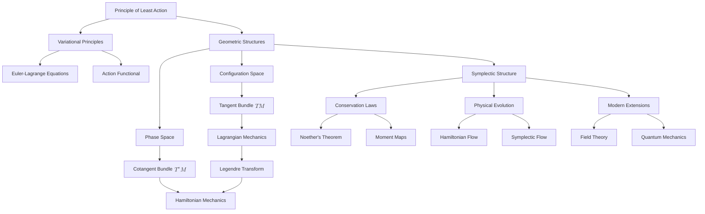
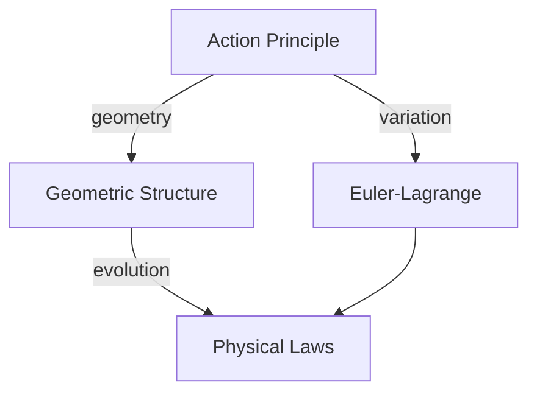
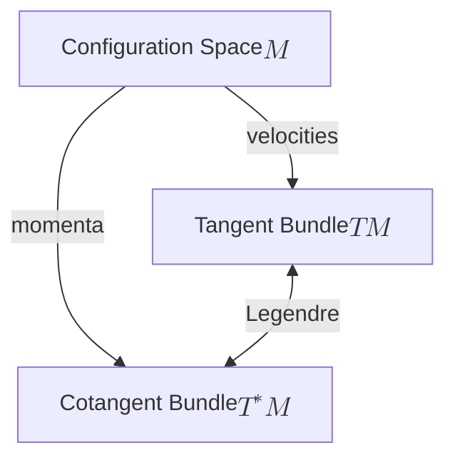
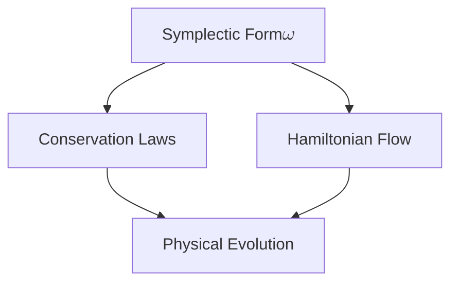
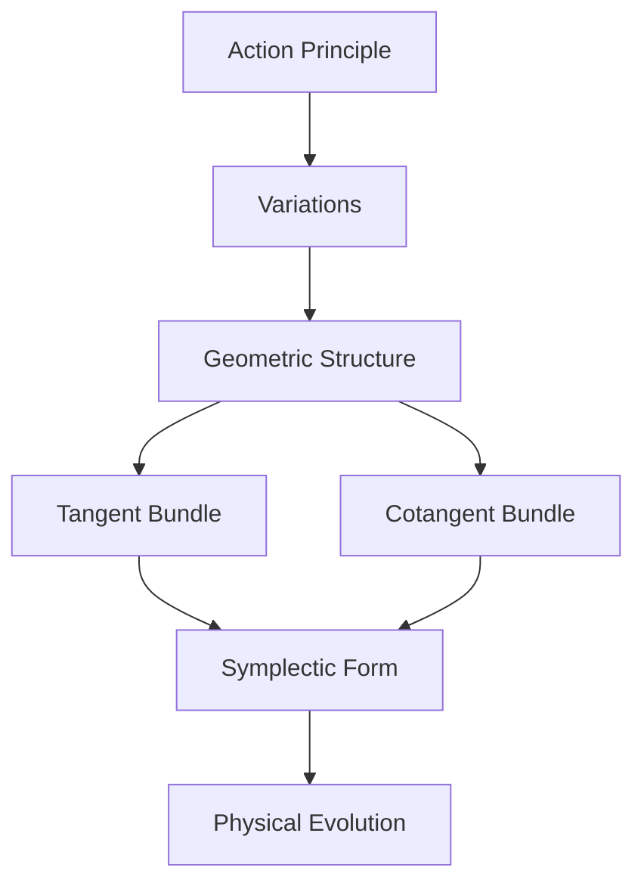
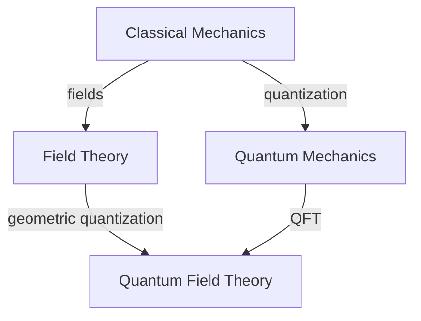

# The Geometric Nature of Physical Laws: From Variational Principles to Symplectic Structures
* * *

--- Physics flows in the geometry of symplectic manifolds

# I. The Principle of Least Action: A Geometric Foundation

The Principle of Least Action stands as one of the most profound unifying concepts in physics, revealing the deep geometric nature of physical laws. Rather than viewing it merely as a computational tool, we shall unveil its fundamental geometric character and show how it naturally leads to the rich structures of modern physics.

## I.A. Action as a Geometric Object

The **action** $S$ of a physical system, traditionally written as:
$$
S[q] = \int_{t_1}^{t_2} L(q, \dot{q}, t) \, dt
$$
is far more than an integral of the Lagrangian. It represents a fundamental geometric object measuring the "cost" of paths through configuration space.

### I.A.1 Geometric Nature of Action

1. **Configuration Space Structure**
   - The configuration space $M$ forms a smooth manifold
   - Paths $q(t)$ are curves in $M$
   - The action assigns a "weight" to each path, making it a functional on path space

2. **Natural Geometric Form**
   The action can be rewritten in a manifestly geometric form:
   $$
   S = \int \theta
   $$
   where $\theta = p_i dq^i - H dt$ is a one-form on the extended phase space.

### I.A.2 Physical Interpretation

1. **Action as Proper Time**
   In relativistic systems, the action reduces to proper time:
   $$
   S = -mc^2 \int d\tau
   $$
   revealing its intimate connection with spacetime geometry.

2. **Configuration Space Geometry**
   - The action measures the geometric "length" of paths
   - Physical trajectories are geodesics in this geometry
   - The geometric structure naturally incorporates constraints

## I.B. Variational Principles

The principle of least action states that physical paths make the action stationary:
$$
\delta S = 0
$$
This simple statement has profound geometric implications.

### I.B.1 Geometric Structure of Variations

1. **Infinitesimal Deformations**
   For a path variation $\delta q(t)$:
   $$
   \delta S = \int_{t_1}^{t_2} \left(\frac{\partial L}{\partial q^i}\delta q^i + \frac{\partial L}{\partial \dot{q}^i}\delta \dot{q}^i\right) dt
   $$
   represents a tangent vector in path space.

2. **Natural Decomposition**
   Integration by parts reveals the geometric structure:
   $$
   \delta S = \left[\frac{\partial L}{\partial \dot{q}^i}\delta q^i\right]_{t_1}^{t_2} + \int_{t_1}^{t_2} \left(\frac{\partial L}{\partial q^i} - \frac{d}{dt}\frac{\partial L}{\partial \dot{q}^i}\right)\delta q^i \, dt
   $$
   - Boundary term: geometric momentum
   - Bulk term: equations of motion

### I.B.2 Emergence of Geometric Structures

1. **Phase Space Structure**
   The variational principle naturally introduces:
   - Conjugate momenta: $p_i = \frac{\partial L}{\partial \dot{q}^i}$
   - Phase space coordinates: $(q^i, p_i)$
   - Canonical one-form: $\theta = p_i dq^i$

2. **Symplectic Geometry**
   The exterior derivative of $\theta$ yields the symplectic form:
   $$
   \omega = d\theta = dp_i \wedge dq^i
   $$
   This structure emerges naturally from the variational principle.

### I.B.3 Connection to Modern Physics

The geometric formulation of action principles extends naturally to:

1. **Field Theory**
   - Action becomes a functional on field configurations
   - Variations yield field equations as geometric conditions

2. **Quantum Mechanics**
   - Path integral formulation: $\int \mathcal{D}q \, e^{iS/\hbar}$
   - Geometric phases and topological effects

This geometric perspective on action principles sets the stage for understanding how symplectic structures naturally emerge in physical theories, leading to our next section on geometric structures.

Note: This section establishes the geometric foundation while maintaining focus on core concepts, avoiding computational details in favor of geometric insight.

# II. Natural Emergence of Geometric Structures

While the principle of least action reveals the geometric nature of physical laws, the natural mathematical structures—tangent bundles, cotangent bundles, and symplectic forms—emerge organically from physical considerations rather than being imposed externally. This emergence illuminates the profound unity between physics and geometry.

## II.A. From Configuration Space to Phase Space

The transition from configuration space to phase space is not merely a change of variables but reflects a fundamental geometric progression in our understanding of mechanical systems.

### II.A.1 Configuration Space as Base Manifold

Consider a mechanical system with $n$ degrees of freedom. Its configuration space naturally forms a smooth manifold $M$ of dimension $n$. Points in $M$ represent possible states of the system:
$$
q = (q^1, \dots, q^n) \in M
$$

However, physical evolution involves both positions and velocities (or momenta), necessitating additional geometric structure.

### II.A.2 Tangent Bundle Structure

1. **Natural Emergence**
   - At each point $q \in M$, velocities form a vector space $T_qM$
   - The collection of all velocity spaces forms the tangent bundle:
     $$
     TM = \bigcup_{q \in M} T_qM
     $$
   - Local coordinates: $(q^i, \dot{q}^i)$

2. **Geometric Meaning**
   - Velocities as tangent vectors to paths
   - Lagrangian $L: TM \to \mathbb{R}$ as a function on the tangent bundle
   - Physical trajectories as curves in $TM$

### II.A.3 Cotangent Bundle and Phase Space

The transition to phase space occurs naturally through:

1. **Momentum Definition**
   $$
   p_i = \frac{\partial L}{\partial \dot{q}^i}
   $$
   This defines a map from $TM$ to $T^*M$

2. **Natural Pairing**
   - Momentum-velocity pairing:
     $$
     \langle p, v \rangle = p_i v^i
     $$
   - Dimension: $[\text{action}] = [\text{energy}] \times [\text{time}]$

3. **Phase Space Structure**
   - Cotangent bundle $T^*M$ as phase space
   - Natural coordinates $(q^i, p_i)$
   - Canonical one-form: $\theta = p_i dq^i$

## II.B. Symplectic Structure as Natural Framework

The symplectic structure emerges not as an additional assumption but as an intrinsic property of phase space.

### II.B.1 Emergence of Symplectic Form

1. **Natural Definition**
   $$
   \omega = d\theta = dp_i \wedge dq^i
   $$
   where $\theta$ is the canonical one-form

2. **Fundamental Properties**
   - Closed: $d\omega = 0$
   - Non-degenerate: $\omega^n \neq 0$
   These properties emerge from physics, not mathematical convenience

### II.B.2 Hamiltonian Vector Fields

1. **Natural Generation**
   For any function $H: T^*M \to \mathbb{R}$:
   $$
   \iota_{X_H}\omega = dH
   $$
   uniquely defines the vector field $X_H$

2. **Physical Flow**
   - Hamilton's equations emerge naturally:
     $$
     \dot{q}^i = \frac{\partial H}{\partial p_i}, \quad \dot{p}_i = -\frac{\partial H}{\partial q^i}
     $$
   - These preserve the symplectic structure: $\mathcal{L}_{X_H}\omega = 0$

### II.B.3 Geometric Consequences

1. **Liouville's Theorem**
   - Conservation of phase space volume
   - Natural consequence of symplectic structure:
     $$
     \frac{d}{dt}(\omega^n) = 0
     $$

2. **Poisson Structure**
   - Emerges from symplectic form:
     $$
     \{f,g\} = \omega(X_f,X_g)
     $$
   - Governs dynamics: $\dot{f} = \{f,H\}$

### II.B.4 Connection to Quantum Mechanics

The symplectic structure naturally leads to:
1. **Geometric Quantization**
   - Prequantization: $[\omega/2\pi\hbar] \in H^2(M,\mathbb{Z})$
   - Quantum operators from classical observables

2. **Canonical Commutation Relations**
   - Classical Poisson brackets → Quantum commutators:
     $$
     \{q^i,p_j\} = \delta^i_j \to [\hat{q}^i,\hat{p}_j] = i\hbar\delta^i_j
     $$

This natural emergence of geometric structures from physical principles sets the stage for understanding the fundamental role of duality and the Legendre transform, which we explore in the next section.

Note: This presentation emphasizes the natural emergence of geometric structures while maintaining mathematical precision, avoiding unnecessary technical details that might obscure the core ideas.

# III. Duality and the Legendre Transform

The Legendre transform, far from being merely a computational tool for converting between Lagrangian and Hamiltonian mechanics, represents a profound geometric mapping that reveals fundamental dualities in physics. These dualities are not artificial constructs but emerge naturally from the geometric structure of mechanical systems.

## III.A. Geometric Nature of the Transform

The Legendre transform can be understood geometrically as a mapping between tangent and cotangent bundles that preserves essential physical information while revealing deeper geometric structures.

### III.A.1 Bundle Mapping Structure

1. **Geometric Framework**
   - Transform $\mathcal{L}: TM \to T^*M$ between bundles:
     $$
     \begin{array}{ccc}
     TM & \xrightarrow{\mathcal{L}} & T^*M \\
     \downarrow & & \downarrow \\
     M & = & M
     \end{array}
     $$
   - Preserves base manifold structure while exchanging velocities for momenta

2. **Natural Construction**
   For a regular Lagrangian $L: TM \to \mathbb{R}$:
   $$
   p_i = \frac{\partial L}{\partial \dot{q}^i}
   $$
   This map emerges naturally from the variational principle.

### III.A.2 Geometric Properties

1. **Fiber-wise Transform**
   - Acts independently on each fiber:
     $$
     T_qM \to T^*_qM
     $$
   - Preserves vertical structures in the bundles

2. **Natural Pairing**
   The transform preserves the fundamental pairing:
   $$
   \langle p, v \rangle = p_i v^i
   $$
   This pairing has geometric significance as action per unit time.

### III.A.3 Hamiltonian Generation

The Hamiltonian emerges geometrically:
$$
H(q,p) = \sup_v \{\langle p, v \rangle - L(q,v)\}
$$
This supremum has geometric meaning as a dual function.

## III.B. Fundamental Dualities

The Legendre transform reveals several fundamental dualities in physics, each with deep geometric significance.

### III.B.1 Position-Momentum Duality

1. **Geometric Origin**
   - Positions $(q^i)$ as coordinates on base manifold
   - Momenta $(p_i)$ as fiber coordinates in $T^*M$
   - Natural pairing through symplectic form:
     $$
     \omega = dp_i \wedge dq^i
     $$

2. **Physical Manifestation**
   - Complementary roles in dynamics:
     $$
     \{q^i, p_j\} = \delta^i_j
     $$
   - Geometric basis for uncertainty principles in quantum mechanics

### III.B.2 Energy-Time Duality

1. **Extended Phase Space**
   - Time as parameter → coordinate
   - Energy as conjugate variable:
     $$
     \theta_{ext} = p_i dq^i - H dt
     $$

2. **Geometric Structure**
   - Extended symplectic form:
     $$
     \omega_{ext} = dp_i \wedge dq^i + dH \wedge dt
     $$
   - Conservation of energy as geometric invariance

### III.B.3 Lagrangian-Hamiltonian Duality

1. **Geometric Correspondence**
   - Lagrangian: $L: TM \to \mathbb{R}$
   - Hamiltonian: $H: T^*M \to \mathbb{R}$
   Connected through:
   $$
   \frac{\partial L}{\partial \dot{q}^i} \leftrightarrow p_i \leftrightarrow \frac{\partial H}{\partial p_i}
   $$

2. **Physical Interpretation**
   - Lagrangian: Local dynamics (velocities)
   - Hamiltonian: Global invariants (momenta)
   These dual perspectives are geometrically equivalent.

### III.B.4 Deeper Implications

1. **Symmetry-Conservation Duality**
   - Geometric symmetries ↔ Conserved quantities
   - Through Noether's theorem:
     $$
     \delta S = 0 \leftrightarrow \text{Conservation Law}
     $$

2. **Quantum Dualities**
   The classical dualities extend to quantum mechanics:
   - Position-momentum: $[\hat{q}, \hat{p}] = i\hbar$
   - Energy-time: $\Delta E \Delta t \geq \hbar/2$
   These quantum dualities inherit geometric structure.

### III.B.5 Connection to Modern Physics

These fundamental dualities extend naturally to:
1. **Field Theory**
   - Fields ↔ Conjugate field momenta
   - Gauge transformations ↔ Constraints

2. **String Theory**
   - T-duality
   - S-duality
   Reflecting deeper geometric structures.

This geometric understanding of duality through the Legendre transform provides the foundation for understanding physical evolution as geometric flow, which we explore in the next section.

Note: This presentation emphasizes the geometric nature of duality while maintaining focus on fundamental physical insights, avoiding unnecessary technical complexity.

# IV. Physical Evolution as Geometric Flow

The evolution of physical systems reveals its deepest nature through geometric flow on symplectic manifolds. This perspective unifies dynamics and geometry, showing how conservation laws emerge naturally from geometric invariance.

## IV.A. Hamiltonian Flow

The flow of a physical system through phase space preserves fundamental geometric structures, revealing the intimate connection between geometry and physical evolution.

### IV.A.1 Geometric Structure of Flow

1. **Hamiltonian Vector Fields**
   For any function $H: T^*M \to \mathbb{R}$, the associated vector field $X_H$ is defined by:
   $$
   \iota_{X_H}\omega = dH
   $$
   This geometric equation completely determines the system's evolution.

2. **Flow Properties**
   The flow $\phi_t$ generated by $X_H$ preserves:
   - Symplectic form: $\phi_t^*\omega = \omega$
   - Energy surfaces: $H \circ \phi_t = H$
   - Phase space volume: $\mathcal{L}_{X_H}\omega^n = 0$

### IV.A.2 Preservation of Geometric Structure

1. **Symplectic Invariance**
   - The flow preserves the symplectic form:
     $$
     \mathcal{L}_{X_H}\omega = 0
     $$
   - This ensures canonical commutation relations remain invariant

2. **Liouville's Theorem**
   Phase space volume preservation:
   $$
   \frac{\partial}{\partial t}(\omega^n) = 0
   $$
   emerges as a geometric necessity.

## IV.B. Conservation Laws as Geometric Invariants

Conservation laws are not additional constraints but emerge naturally from geometric symmetries of the system.

### IV.B.1 Noether's Theorem: Geometric Formulation

1. **Symmetry-Conservation Correspondence**
   For any one-parameter group of symmetries $\phi_s$:
   $$
   \phi_s^*\omega = \omega \implies \exists \text{ conserved quantity }
   $$

2. **Moment Map Construction**
   The moment map $\mu: T^*M \to \mathfrak{g}^*$ encodes conserved quantities:
   $$
   \langle \mu(x), \xi \rangle = H_\xi(x)
   $$
   where $H_\xi$ is the Hamiltonian generating the symmetry.

### IV.B.2 Geometric Invariants

1. **Action Invariants**
   For any cycle $\gamma$ in phase space:
   $$
   \oint_\gamma p_i dq^i = \text{invariant}
   $$
   This geometric invariant underlies quantum conditions.

2. **Poincaré-Cartan Integral Invariants**
   More generally:
   $$
   \int_\Sigma \omega^k = \text{invariant}
   $$
   for any $2k$-dimensional surface $\Sigma$ flowing with the system.

### IV.B.3 Physical Conservation Laws

The geometric framework reveals the origin of fundamental conservation laws:

1. **Energy Conservation**
   - Time translation symmetry
   - Generated by the Hamiltonian
   - Geometric invariant: $\frac{dH}{dt} = 0$

2. **Angular Momentum**
   - Rotational symmetry
   - Moment map for $SO(3)$ action
   - Geometric conservation: $\mathcal{L}_{X_H}J = 0$

3. **Linear Momentum**
   - Translational symmetry
   - Moment map for $\mathbb{R}^3$ action
   - Geometric invariance of spatial translations

### IV.B.4 Implications for Modern Physics

1. **Field Theory**
   - Conservation laws from gauge symmetries
   - Infinite-dimensional moment maps
   - Geometric origin of Ward identities

2. **Quantum Systems**
   - Geometric quantization preserves symmetries
   - Quantum numbers from geometric invariants
   - Conservation laws in operator form

### IV.B.5 Deep Geometric Unity

The preservation of geometric structure reveals:

1. **Unified Framework**
   - Dynamics ↔ Geometric flow
   - Symmetries ↔ Conservation laws
   - Evolution ↔ Symplectic diffeomorphisms

2. **Physical Principles**
   All emerge from geometry:
   - Conservation laws
   - Evolution equations
   - Quantum conditions

This geometric understanding of physical evolution and conservation laws provides the foundation for extending these ideas to modern physics, which we explore in the next section.

Note: This presentation emphasizes the geometric origin of physical principles while maintaining mathematical precision, avoiding unnecessary technical complexity that might obscure the fundamental insights.

# V. Modern Perspectives

The geometric framework developed for classical mechanics extends naturally to modern physics, revealing deeper connections between geometry and physical laws. This extension illuminates both field theories and quantum mechanics, showing how geometric structures persist at all levels of physical description.

## V.A. Field Theory and Gauge Theory

The transition from particle mechanics to field theory requires extending our geometric framework to infinite dimensions, revealing new structures while preserving fundamental geometric principles.

### V.A.1 Infinite-Dimensional Extensions

1. **Field Configuration Space**
   - Fields as sections of fiber bundles:
     $$
     \phi: M \to E
     $$
   where $M$ is spacetime and $E$ is the field bundle.

2. **Symplectic Structure**
   - Infinite-dimensional phase space:
     $$
     \omega = \int_\Sigma \delta\pi \wedge \delta\phi \, d^nx
     $$
   - Preserves geometric properties in infinite dimensions

3. **Action Principle**
   $$
   S[\phi] = \int_M \mathcal{L}(\phi,\partial_\mu\phi) \, d^nx
   $$
   retains geometric meaning as integral over jet bundle.

### V.A.2 Gauge Theory Structure

1. **Principal Bundles**
   - Gauge group $G$ acting on principal bundle $P \to M$
   - Connection forms $\mathcal{A}$ as fundamental objects
   - Curvature $F = dA + A \wedge A$ as geometric invariant

2. **Geometric Framework**
   - Configuration space: $\mathcal{A}/\mathcal{G}$
   - Symplectic reduction:
     $$
     T^*\mathcal{A}/\mathcal{G} \cong \mathcal{M}
     $$
   preserving geometric structure

3. **Yang-Mills Theory**
   - Action:
     $$
     S[A] = -\frac{1}{4} \int_M \text{Tr}(F_{\mu\nu}F^{\mu\nu}) \, d^4x
     $$
   - Geometric origin of gauge invariance

## V.B. Quantum Aspects

The geometric structures of classical mechanics provide the foundation for understanding quantum mechanics through geometric quantization and path integrals.

### V.B.1 Geometric Quantization

1. **Prequantization**
   - Line bundle $L \to M$ with connection $\nabla$:
     $$
     \text{curv}(\nabla) = -\frac{i}{\hbar}\omega
     $$
   - Quantum condition: $[\omega/2\pi\hbar] \in H^2(M,\mathbb{Z})$

2. **Polarization**
   - Quantum states as polarized sections
   - Vertical polarization → Position representation
   - Horizontal polarization → Momentum representation

3. **Quantum Operators**
   - Classical observables $f \to \hat{f}$:
     $$
     \hat{f} = -i\hbar\nabla_{X_f} + f
     $$
   - Preserving geometric structure:
     $$
     [\hat{f},\hat{g}] = -i\hbar\widehat{\{f,g\}}
     $$

### V.B.2 Path Integral Formulation

1. **Quantum Propagator**
   $$
   K(q_f,t_f;q_i,t_i) = \int \mathcal{D}q \, \exp\left(\frac{i}{\hbar}S[q]\right)
   $$
   geometrically interpreted through infinite-dimensional manifolds.

2. **Phase Space Path Integrals**
   $$
   \int \mathcal{D}p\mathcal{D}q \, \exp\left(\frac{i}{\hbar}\int (p\dot{q} - H(p,q))dt\right)
   $$
   preserving symplectic structure.

### V.B.3 Modern Applications

1. **String Theory**
   - Worldsheet symplectic structure
   - Target space geometry
   - T-duality as geometric symmetry

2. **Quantum Field Theory**
   - Geometric quantization of fields
   - BRST cohomology
   - Ward identities from moment maps

3. **Topological Quantum Field Theory**
   - Geometric invariants
   - Category theory interpretation
   - Quantum geometric invariants

### V.B.4 Emerging Perspectives

1. **Quantum Geometry**
   - Non-commutative geometry
   - Quantum groups
   - Geometric phases

2. **Information Geometry**
   - Geometric quantum mechanics
   - Fisher information metric
   - Quantum entanglement

This modern perspective reveals how geometric structures:
- Persist in quantum theories
- Extend to infinite dimensions
- Unify seemingly disparate physical phenomena

The geometric framework thus provides not just a mathematical tool but a fundamental language for describing physical reality at all scales.

Note: This section maintains focus on geometric intuition while showing how classical geometric structures naturally extend to modern physics, avoiding unnecessary technical details while preserving mathematical precision.

# Appendix A : Moment Maps

## A.1. Mathematical Definition

A **moment map** is a geometric object that encodes the relationship between symmetries and conserved quantities in a symplectic manifold.

### A.1.1. Formal Definition
For a Lie group $G$ acting on a symplectic manifold $(M,\omega)$, a moment map is a map:
$$
\mu: M \to \mathfrak{g}^*
$$
where $\mathfrak{g}^*$ is the dual of the Lie algebra $\mathfrak{g}$ of $G$, satisfying two key properties:

1. **Equivariance**:
   For all $g \in G$:
   $$
   \mu(g \cdot x) = \text{Ad}^*_g(\mu(x))
   $$
   where $\text{Ad}^*$ is the coadjoint action.

2. **Fundamental Vector Field Property**:
   For all $\xi \in \mathfrak{g}$:
   $$
   d\langle\mu,\xi\rangle = -\iota_{\xi_M}\omega
   $$
   where $\xi_M$ is the fundamental vector field generated by $\xi$.

## A.2. Physical Significance

### A.2.1. Conservation Laws
The moment map connects geometric symmetries to physical conservation laws:

- **Angular Momentum**:
  For rotational symmetry ($G = SO(3)$):
  $$
  \mu(q,p) = q \times p
  $$
  representing angular momentum as a conserved quantity.

- **Linear Momentum**:
  For translational symmetry ($G = \mathbb{R}^3$):
  $$
  \mu(q,p) = p
  $$
  representing linear momentum conservation.

### A.2.2. Hamiltonian Action
The moment map generates the Hamiltonian action of the symmetry group:
$$
\{\langle\mu,\xi\rangle,f\} = \xi_M[f]
$$
for any function $f$ on $M$.

### A.2.3. Reduction Theory
The moment map facilitates symplectic reduction:
$$
M//G = \mu^{-1}(0)/G
$$
This reduced space represents the physical system with symmetry constraints imposed.

## A.3. Applications in Physics

### A.3.1. Classical Mechanics
- **Phase Space Reduction**:
  $$
  \mu^{-1}(c)/G_c
  $$
  where $G_c$ is the isotropy group of $c \in \mathfrak{g}^*$.

### A.3.2. Field Theory
- **Gauge Theory**:
  The moment map encodes Gauss's law:
  $$
  \mu(A,E) = \nabla \cdot E - \rho
  $$
  where $A$ is the gauge potential and $E$ is the electric field.

### A.3.3. Geometric Quantization
The moment map plays a crucial role in:
- Quantum operators from classical observables
- Representation theory of symmetry groups
- Quantum conservation laws

## A.4. Geometric Understanding

The moment map provides:
1. **Unified Framework**:
   - Symmetries → Conserved quantities
   - Group actions → Physical constraints
   - Reduction → Physical degrees of freedom

2. **Physical Interpretation**:
   For each symmetry generator $\xi$:
   $$
   H_\xi = \langle\mu,\xi\rangle
   $$
   represents the corresponding conserved quantity.

This geometric perspective through moment maps reveals the deep connection between symmetry and conservation in physical systems, providing a powerful tool for understanding both classical and quantum physics.

Note: This annotation provides the mathematical precision needed while maintaining focus on physical significance and geometric intuition.

# Appendix B : Core Relationship

Here's a core relationship table:

| Primary Concept | Related Concepts | Geometric Manifestation | Physical Significance |
|----------------|------------------|------------------------|---------------------|
| Action Principle | Variational Methods, Path Space | Functional on Path Space | Determines Physical Evolution |
| Configuration Space | Tangent Bundle, Velocity Space | $TM$ (Positions + Velocities) | Lagrangian Dynamics |
| Phase Space | Cotangent Bundle, Momentum Space | $T^*M$ (Positions + Momenta) | Hamiltonian Dynamics |
| Legendre Transform | Fiber Bundle Maps | $TM$ ↔ $T^*M$ | Lagrangian ↔ Hamiltonian |
| Symplectic Structure | Canonical $2$-Form, Poisson Brackets | $\omega = dp \wedge dq$ | Preserves Physical Evolution |
| Conservation Laws | Symmetries, Moment Maps | Geometric Invariants | Physical Conservation |
| Hamiltonian Flow | Vector Fields, Symplectic Maps | Preserves $\omega$ | Time Evolution |
| Geometric Quantization | Line Bundles, Polarization | Prequantum Bundle | Quantum Mechanics |

Key Unifying Themes:
1. **Emergence**: Geometric structures naturally emerge from physical principles
2. **Duality**: Fundamental pairs (position-momentum, energy-time) reflect geometric duality
3. **Preservation**: Physical evolution preserves geometric structure
4. **Extension**: Classical geometric structures extend to quantum and field theories

This organization emphasizes how the geometric framework naturally unifies various aspects of physics, from classical mechanics to modern theories.

# Appendix C : Visualize Geometric Framework

1. **Fundamental Structure and Flow**

The action principle leads to both equations of motion and geometric structure

2. **Geometric Spaces and Their Relationships**

Different geometric spaces are connected through natural mappings:

3. **Symplectic Structure and Conservation**

Symplectic structure preserves physical evolution:

4. **Core Dualities**

Fundamental dualities exist at multiple levels:

| Physical Space   |      | Dual Space        |
|------------------|------|-------------------|
| Position ($q$)   | <--> | Momentum ($p$)    |
| Velocity ($v$)   | <--> | Force ($F$)       |
| Energy ($H$)     | <--> | Time ($t$)        |
| Configuration    | <--> | Phase Space       |
| Lagrangian ($L$) | <--> | Hamiltonian ($H$) |

5. **Emergence Flow**
Geometric structures emerge naturally from physical principles:

6. **Modern Extensions**

Classical concepts extend to modern theories:

# Appendix D: Deeper Reflections on the Principle of Least Action

## D.1. Historical Perspectives and Philosophical Implications

The Principle of Least Action stands at a fascinating intersection of physics, mathematics, and philosophy. Its interpretation has evolved from teleological considerations to modern geometric understanding, yet fundamental questions about its meaning persist.

### D.1.1. Historical Evolution of Understanding

1. **Aristotelian-Euler Perspective**
   - Nature exhibits a fundamental "economy" or "elegance"
   - Action minimization reflects cosmic purpose
   - Mathematical beauty suggests deeper truth
   $$
   \text{Nature's elegance} \rightarrow \text{Mathematical principle} \rightarrow \text{Physical law}
   $$

2. **Modern Scientific View**
   - Feynman's perspective: "Physics is just a model"
   - Action principle as mathematical structure
   - Geometric necessity rather than purpose
   $$
   \text{Geometric structure} \rightarrow \text{Physical evolution} \rightarrow \text{Observed behavior}
   $$

## D.2. Beyond Traditional Interpretations

### D.2.1. Synthesis of Perspectives

The apparent conflict between teleological and modern views might be reconciled through deeper geometric understanding:

1. **Geometric Necessity**
   - Action principle emerges from symplectic structure
   - Not "minimum" but "stationary" action
   - Geometry dictates dynamics:
     $$
     \text{Symplectic geometry} \implies \text{Action principle} \implies \text{Physical laws}
     $$

2. **Information Theoretic View**
   - Action as information measure
   - Stationary points as maximum entropy configurations
   - Natural connection to quantum mechanics:
     $$
     \text{Classical action} \rightarrow \frac{S}{\hbar} \rightarrow \text{Quantum phase}
     $$

### D.2.2. Transcendent Understanding

Moving beyond the traditional dichotomy:

1. **Geometric Unity**
   - Action principle reflects geometric completeness
   - Symmetries and conservation laws unified
   - Natural emergence of quantum structures
   $$
   \begin{array}{c}
   \text{Geometric Structure} \\
   \downarrow \\
   \text{Physical Evolution} \\
   \downarrow \\
   \text{Quantum Reality}
   \end{array}
   $$

2. **Beyond Purpose and Mechanism**
   - Geometry as fundamental reality
   - Physical laws as geometric necessities
   - Transcending the purpose/mechanism divide

## D.3. Modern Implications

### D.3.1. Quantum Foundations

1. **Path Integral Formulation**
   - All paths contribute
   - Classical path emerges from interference
   - Quantum geometry more fundamental:
     $$
     \int \mathcal{D}q \, e^{iS/\hbar} \rightarrow \text{Classical limit as } \hbar \to 0
     $$

2. **Information and Geometry**
   - Quantum entanglement as geometric property
   - Action principle in quantum information
   - Geometric phase as fundamental concept

### D.3.2. Emerging Perspectives

1. **Holographic Principle**
   - Action on boundary determines bulk evolution
   - Geometric encoding of information
   - New understanding of space-time:
     $$
     \text{Boundary action} \leftrightarrow \text{Bulk geometry}
     $$

2. **Quantum Gravity**
   - Action principle in emergent space-time
   - Geometric origin of gravity
   - Fundamental role of information

## D.4. Synthesis: A New Understanding

The Principle of Least Action might be understood as revealing a deeper unity:

1. **Geometric Necessity**
   - Not teleological purpose
   - Not mere mathematical convenience
   - Fundamental geometric reality

2. **Information Structure**
   - Action as information measure
   - Physical evolution as information flow
   - Quantum reality as geometric information

3. **Transcendent View**
   $$
   \begin{array}{c}
   \text{Geometric Reality} \\
   \downarrow \\
   \text{Information Flow} \\
   \downarrow \\
   \text{Physical Evolution}
   \end{array}
   $$

This perspective suggests that the apparent conflict between teleological and mechanistic views dissolves in a deeper understanding where geometry, information, and physical reality are unified aspects of a more fundamental structure.

The beauty that Aristotle and Euler perceived might be understood as reflecting not cosmic purpose but the profound unity of geometry and physics—a unity that quantum mechanics and modern physics continue to reveal in ever deeper ways.

Note: This reflection maintains mathematical precision while exploring deeper philosophical implications, appropriate for advanced readers familiar with both the technical and conceptual aspects of physics.

