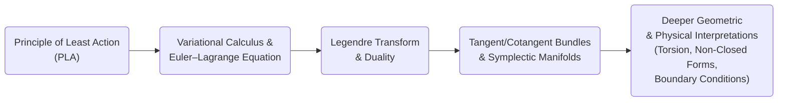

# Toward the Essence of the Principle of Least Action: A Unified Geometric and Physical Perspective
* * *

--- In each differential step lies the summation of all possible worlds—navigate it with least action, and you grasp the core of nature’s economy.

# Chapter 1. Foundations of Variational Principles

**Epigraph:**  
“A small variation can alter the fate of an entire system. The calculus of variations guides this transformation.”

## 1.1. Revisiting the Principle of Least Action

Summarize the Principle of Least Action (PLA)’s classical statement, touching on its historical development, philosophical importance, and impact on physics and mathematics.

1. **Historical Glimpses**  
   - The PLA can be traced back to G. W. Leibniz, P. Maupertuis, and L. Euler, and was systematically developed by P. S. de Laplace and J. L. Lagrange.  
   - Pioneers recognized the surprising economy of nature’s “path preference” in many phenomena, from optical refraction to planetary orbits.  

2. **Classical Statement**  
   - In its simplest mechanical form, the PLA states: a physical system traverses a path in configuration space that extremizes (usually minimizes) an integral known as the _action_.  
   - Let 
   $$
   S[q(t)] \;=\; \int_{t_{0}}^{t_{1}} L\left(t,\, q(t),\, \dot{q}(t)\right)\, dt ,
   $$
   where $L$ is the Lagrangian. The true path makes $\delta S=0$.  

3. **Philosophical Meaning & Broad Impact**  
   - Philosophically, the PLA unifies local dynamics (differential equations) with a global economy principle. It suggests that nature “chooses” an optimal route under constraints.  
   - It permeates fundamental physics—optics (Fermat’s principle), quantum field theory (path integrals), general relativity (Hilbert action), etc.

4. **Nature of “Least”**  
   - Strict minimization may be replaced by stationarity: the actual path is a stationary point (minimum, maximum, or saddle) of $S$.  
   - This insight clarifies that $\delta S = 0$ is the crucial mathematical condition.

Taken together, these elements reveal why the PLA is often considered the “master principle” guiding much of theoretical physics.

## 1.2. Single-Variable Minimization vs. Functional Optimization

Draw parallels between elementary single-variable calculus $\left(\tfrac{d}{dx}=0\right)$ and the deeper realm of variational calculus $\left(\tfrac{\delta}{\delta y}=0\right)$. Demonstrate how discrete variables transition to continuous functionals.

1. **Analogy with Single-Variable Calculus**  
   - For a single-variable function $f(x)$, local extrema occur where 
   $$
   \frac{df}{dx} = 0 .
   $$
    A small increment in $x$ around an extremum yields no first-order change in $f$.  

2. **Extension to Functionals**  
   - A _functional_ $\displaystyle J[y]$ takes an entire function $y(\cdot)$ as input, returning a real number.  
   - The condition 
   $$
   \frac{\delta J}{\delta y} = 0
   $$
    is the infinite-dimensional analogue of $\tfrac{df}{dx}=0$. Here, variations $\delta y$ are “directions” in function space.

3. **Discrete $\rightarrow$ Continuous**  
   - Replacing discrete sums by integrals: If 
   $$
   J[y] \;=\; \int_{x_{0}}^{x_{1}} F\left(x,\;y(x),\;y'(x)\right)\,dx ,
   $$
    then “differentiating” wrt $y$ means testing small deformations $\eta(x)$ such that $\delta y = \eta$.  

4. **Geometric & Physical Interpretation**  
   - In geometry, one seeks curves in $\mathbb{R}^n$ or on manifolds that minimize certain lengths or energies.  
   - In physics, the path that the system follows in configuration space is found by extremizing the action functional.

Through this analogy, readers see how single-variable calculus methods generalize to entire curves, unveiling powerful methods of discovering system trajectories or shapes governed by “optimality” conditions.

## 1.3. Building Towards the Euler–Lagrange Equation

Present the standard derivation route—chiefly integration by parts and boundary conditions—and show how local Euler–Lagrange conditions connect to global constraints (boundary terms).

1. **Setting Up the Variation**  
   - Suppose we vary $y(x)$ to $\bar{y}(x) = y(x) + \epsilon\,\eta(x)$ with fixed endpoints $\eta(x_{0})=\eta(x_{1})=0$.  
   - The functional becomes 
   $$
   J[\bar{y}] = \int_{x_{0}}^{x_{1}} F\left(x,\;\bar{y}(x),\;\bar{y}'(x)\right)\,dx\;.
   $$

2. **First Variation & Boundary Terms**  
   - Compute 
   $$
   \left.\frac{dJ}{d\epsilon}\right|_{\epsilon=0} \;=\;\int_{x_{0}}^{x_{1}} \left(\frac{\partial F}{\partial y}\,\eta \;+\;\frac{\partial F}{\partial y'}\,\eta'\right)\,dx\;.
   $$
   - Use integration by parts on $\tfrac{\partial F}{\partial y'}\,\eta'$, leading to boundary terms that vanish due to $\eta(x_{0})=\eta(x_{1})=0$.  

3. **Euler–Lagrange Equation**  
   - Factor out $\eta(x)$:
   $$
   \int_{x_{0}}^{x_{1}}\left[\frac{\partial F}{\partial y} \;-\;\frac{d}{dx}\!\left(\frac{\partial F}{\partial y'}\right)\right]\eta(x)\,dx=0\;.
   $$
   - Since $\eta(x)$ is arbitrary (except at boundaries), the integrand must vanish:
   $$
   \frac{\partial F}{\partial y} - \frac{d}{dx}\!\left(\frac{\partial F}{\partial y'}\right) = 0\;,
   $$
    the celebrated Euler–Lagrange equation.  

4. **Local ↔ Global Interplay**  
   - Locally, $\frac{\partial F}{\partial y}-\frac{d}{dx}\left(\frac{\partial F}{\partial y'}\right)=0$ ensures a “stationary path.”  
   - Globally, boundary conditions (fixed endpoints) enforce the boundary term to vanish, embodying the “total path” constraints.

Hence, one sees how local differential equations (the Euler–Lagrange form) arise naturally when restricting global variations to vanish at endpoints—tying boundary conditions to the resulting motion in a unified conceptual sweep.

# Chapter 2. Legendre Transform & Hamiltonian Dualities

**Epigraph:**  
“Where speed is replaced by momentum, a different horizon emerges—equal in truth, but dual in form.”

## 2.1. Legendre Transform Essentials

Recap the algebraic definition and geometric interpretation of Legendre transforms, emphasizing how one moves from a Lagrangian to a Hamiltonian. Demonstrate the emergence of dual variables $\left(q \leftrightarrow p\right)$.

1. **Algebraic Definition**  
   - Given a function 
     $$
       L \;=\; L(q,\,\dot{q}), 
     $$
    define the generalized momentum
     $$
       p \;=\; \frac{\partial L}{\partial \dot{q}}. 
     $$
    The Legendre transform $H$ is
     $$
       H(q,\,p) \;=\; p\,\dot{q} \;-\; L(q,\,\dot{q}) 
     $$
    with the understanding that $\dot{q}$ must be expressed in terms of $p$.

2. **Path from Lagrangian to Hamiltonian**  
   - The process of “inverting” $\dot{q}\mapsto p$ typically requires 
     $$\tfrac{\partial^2 L}{\partial \dot{q}^2}\neq 0,$$
    ensuring invertibility.  
   - Once 
     $$\dot{q}=\dot{q}(q,p)$$ 
    is found, we rewrite 
     $$
       H(q,\,p) \;=\; p\,\dot{q}(q,p)\;-\;L\left(q,\dot{q}(q,p)\right).
     $$
    This new function $H$ is the Hamiltonian, naturally expressed in variables $(q,p)$.

3. **Geometric Interpretation**  
   - Consider the tangent bundle $TQ$ with coordinates $(q,\dot{q})$. The map 
     $$\dot{q}\;\mapsto\;p=\partial L/\partial \dot{q}$$ 
    is a differential, identifying points in $TQ$ with points in $T^*Q$.  
   - The Legendre transform thus corresponds to an exchange of roles between velocity and momentum—a quintessential example of duality in physics and geometry.

4. **Dual Variables $\left(q \leftrightarrow p\right)$**  
   - $\dot{q}$ (velocity) is “natural” in Lagrangian mechanics, while $p$ (momentum) is “natural” in Hamiltonian mechanics.  
   - Both sets of variables describe the same underlying physics but highlight different invariants (e.g. energy vs. difference of kinetic and potential energies).

Overall, the Legendre transform is the algebraic and geometric engine that carries us from a velocity-centered viewpoint $\left(q,\dot{q}\right)$ to a momentum-centered viewpoint $\left(q,p\right)$. This “switch” underpins the Hamiltonian formulation of mechanics.

## 2.2. Configuration Space vs. Phase Space

Clarify why Legendre transforms shift perspective from tangent bundles $\left(TQ\right)$ to cotangent bundles $\left(T^*Q\right)$. Illustrate how position–velocity pairs differ from position–momentum pairs and how each viewpoint captures different invariants in the system.

1. **From $TQ$ to $T^*Q$**  
   - Lagrangian mechanics naturally lives on the tangent bundle 
     $$
       TQ \;=\; \left\{(q,\dot{q}) \mid q\in Q,\quad \dot{q}\in T_qQ \right\}.
     $$
   - The Legendre map 
     $$\dot{q}\mapsto p=\partial L/\partial \dot{q}$$ 
    identifies points of $TQ$ with points in the cotangent bundle 
     $$
       T^*Q \;=\; \left\{(q,p) \mid q\in Q,\quad p\in T_q^*Q \right\},
     $$
    provided that $\partial^2L/\partial\dot{q}^2\neq 0$.

2. **Configuration vs. Phase Spaces**  
   - **Configuration Space** $Q$: a manifold whose points represent all possible positions (or configurations) of the system. The tangent bundle $TQ$ then captures positions and velocities.  
   - **Phase Space** $T^*Q$: a manifold whose points represent all possible $(q,p)$. This viewpoint is central for Hamiltonian mechanics, where one tracks positions and momenta, and energy function $H(q,p)$ becomes the principal object.

3. **Symplectic Two-Form and Invariants**  
   - On $T^*Q$, the canonical $1$-form 
     $$\theta=\sum_i p_i\,dq^i$$
    gives rise to the canonical symplectic $2$-form 
     $$
       \omega \;=\; d\theta \;=\; \sum_i dp_i\wedge dq^i.
     $$
    This form is fundamental in Hamiltonian dynamics.  
   - **Energy vs. Action**: In Lagrangian form, we often focus on action integrals $\int L\,dt$. In Hamiltonian form, energy functions (or Hamiltonians) take primacy, being integrals of motion or generating flows in phase space.

4. **Why Make the Switch?**  
   - Hamiltonian analyses can better expose conserved quantities (momentum, total energy, angular momentum).  
   - Phase-space geometry (symplectic form, Poisson brackets) reveals deeper structure—e.g. integrability, chaos, geometric quantization.

This distinction between $TQ$ and $T^*Q$ highlights that one mechanical system can be viewed through two powerful lenses, each revealing complementary invariants and symmetries.

## 2.3. Examples & Illustrations

Reinforce concepts with concrete mechanical models. Show explicit transformations from a Lagrangian $\left(L\right)$ to a Hamiltonian $\left(H\right)$, and interpret small expansions or equilibrium scenarios.

1. **Simple Harmonic Oscillator**  
   1. **Lagrangian**: 
      $$
        L(q,\dot{q}) \;=\; \tfrac12\,m\dot{q}^2 \;-\; \tfrac12\,k\,q^2\,.
      $$
   2. **Generalized Momentum**:
      $$
        p \;=\; \frac{\partial L}{\partial\dot{q}} \;=\; m\,\dot{q}\,.
      $$
   3. **Hamiltonian**:
      $$
        H(q,\;p) \;=\; p\,\dot{q} \;-\;L \;=\; \frac{p^2}{2\,m} \;+\;\frac12\,k\,q^2\,.
      $$
   - **Interpretation**: This is the total energy; $\dot{q}=p/m$ is the velocity.

2. **Pendulum near Equilibrium**  
   - Lagrangian of a (small-angle) pendulum:
     $$
       L(\theta,\dot{\theta}) \;=\; \tfrac12\,m\,\ell^2\,\dot{\theta}^2 \;-\; mg\ell\,\tfrac{\theta^2}{2}\;.
     $$
    For small oscillations, it mimics the harmonic oscillator. The moment of inertia $I=m\ell^2$.  
   - Momentum: 
     $\;\;p_\theta = I\,\dot{\theta}$.  
   - Hamiltonian: 
     $\;\;H = \frac{p_\theta^2}{2I} + mg\ell\,\tfrac{\theta^2}{2}.$

3. **Nonlinear Example: Small Expansion**  
   - If $L(q,\dot{q})$ is nonlinear, the Legendre inversion might be more involved. Yet one can do an expansion about a known solution and illustrate how the Hamiltonian emerges from the partial derivatives of $L$.

These examples make the Legendre transform concrete: from a “velocity-based” dynamic law to a “momentum-based” energy function. Linear or small-amplitude expansions highlight how the simplest models confirm the power of the formalism.

# Chapter 3. Symplectic Manifolds & Geometric Foundations of Mechanics

**Epigraph:**  
“In each $2$-form, a hidden world of geometry shapes the rhythms of classical evolution.”

## 3.1. Tangent Bundles and Cotangent Bundles

Introduce $T(M)$ and $T^*(M)$ as fiber bundles and their relevance to mechanics. Outline basic definitions, local trivializations, and the physical meaning of tangent/cotangent structures.

1. **Fiber-Bundle Basics**  
   - A manifold $M$ of dimension $n$: points in $M$ represent _configurations_ of a system.  
   - The **tangent bundle** 
   $$
     T(M) \;=\; \left\{(m,\,v)\;\big|\;m\in M,\;v\in T_{m}M\right\}
   $$
    is itself a $(2n)$-dimensional manifold, with fibers $T_{m}M$ “attached” to each $m$.  
   - Similarly, the **cotangent bundle** 
   $$
     T^{*}(M) \;=\; \left\{(m,\,\alpha)\;\big|\;m\in M,\;\alpha\in T_{m}^*M\right\}
   $$
   has fibers $T_{m}^{*}M$ (linear functionals on $T_mM$).  

2. **Local Trivialization**  
   - Around a point $m_0\in M$, pick coordinates $\left(x^1,\dots,x^n\right)$. Then a local patch of $T(M)$ looks like $\mathbb{R}^{n}\times\mathbb{R}^{n}$. In physics language, $\left(x^i,\,\dot{x}^j\right)$.  
   - For the cotangent bundle, local coordinates become $\left(x^i,\,p_j\right)$ where $p_j$ acts dual to $\dot{x}^j$.  

3. **Physical Relevance**  
   - **Tangent bundle viewpoint**: Lagrangian mechanics uses $\dot{x}^j$ (velocities) as fundamental. The Lagrangian $L$ is defined on $T(M)$.  
   - **Cotangent bundle viewpoint**: Hamiltonian mechanics uses $p_j$ (momenta) as fundamental. The Hamiltonian $H$ is defined on $T^{*}(M)$.  
   - A Legendre transform bridges these two perspectives and deeply relies on the geometry of tangent vs. cotangent bundles.

The interplay between these two bundles underpins much of classical mechanics, each offering distinct yet equivalent ways to encode a system’s dynamics.

## 3.2. Symplectic Forms & Hamiltonian Flows

Show how symplectic 2-forms define Hamiltonian dynamics. Emphasize non-degeneracy, closeness of $\omega$, and how Hamilton’s equations arise from vector fields preserving $\omega$.

1. **Symplectic $2$-Form**  
   - A **symplectic form** $\omega$ on a $2n$-dimensional manifold $M$ is a closed, non-degenerate $2$-form, i.e. 
   $$
     d\omega = 0, 
     \quad
     \text{and}
     \quad
     \omega\left(v,\, w\right)\;=\; 0\;\;\;\forall\,w\;\Longrightarrow\;v=0.
   $$
   - In local coordinates $\left(q^1,\dots,q^n,p_1,\dots,p_n\right)$ on a cotangent bundle, the canonical symplectic form is 
   $$
     \omega = \sum_{i=1}^{n} \,dq^i \wedge dp_i.
   $$

2. **Hamiltonian Dynamics**  
   - A Hamiltonian function $H\colon M\to\mathbb{R}$ defines a vector field $X_H$ via 
   $$
     \iota_{X_H}\,\omega \;=\; dH.
   $$
    Equivalently, 
   $$\dot{q}^i = \tfrac{\partial H}{\partial p_i} \text{ and } $\dot{p}_i = -\,\tfrac{\partial H}{\partial q^i}.$$
   - This pair of equations is how the **symplectic geometry** encodes Hamilton’s canonical equations. Locally, 
   $$
     \omega(X_H,\cdot)\;=\;dH(\cdot).
   $$
   - Because $\omega$ is **non-degenerate**, each Hamiltonian $H$ has a unique flow $X_H$.

3. **Geometry of Preserved $\omega$**  
   - Hamiltonian flows preserve $\omega$: $\mathcal{L}_{X_H}\,\omega=0$.  
   - Hence, phase volume is preserved ($\omega^n$ is the Liouville volume form). This underlies Liouville’s theorem in Hamiltonian mechanics and is a cornerstone of ergodic theory and statistical mechanics.
   
These properties illustrate how $\omega$ becomes the geometric “engine” of Hamiltonian mechanics: each Hamiltonian function spawns a canonical flow that respects the symplectic structure.

## 3.3. Torsion, Non-Symmetric Extensions & Generalized Symplectic Views

Provide hints on how torsion or non-closed forms might generalize standard symplectic geometry. Offer broad sketches of what happens if $\omega$ is not closed and note potential research directions.

1. **Motivation for Generalizations**  
   - Standard symplectic geometry requires $d\omega=0$. But in certain extended contexts—fields with gauge potentials, magnetically charged backgrounds (monopoles)—$\omega$ might fail to be exact or closed.  
   - Similarly, one can impose a connection with torsion on the manifold, making the geometry deviate from the usual Levi-Civita framework.

2. **Torsion & Non-Holonomic Constraints**  
   - In differential geometry, torsion arises when a chosen connection fails to be symmetric in lower indices. For mechanics, torsion can appear in models with non-holonomic constraints or in geometric scenarios beyond Riemannian spaces.  
   - A “non-symmetric symplectic” structure might emerge if we assign a certain skewness that modifies the local form $\omega$. The system might exhibit unusual parallel transport or additional degrees of freedom.

3. **Non-Closed $\omega$**  
   - If $d\omega\neq0$, the usual Hamiltonian picture changes; conservation laws or Liouville’s theorem might need adaptation.  
   - Some advanced field theories (e.g. topological $\sigma$-models with $B$-fields) exploit a **twisted symplectic form** $\omega+B$. The condition $\,d(\omega+B)=0$ can be replaced by more general cohomological constraints.

4. **Directions of Exploration**  
   - **Generalized complex geometry**: merges complex and symplectic structures.  
   - **Courant algebroids**: unify Poisson, symplectic, and Dirac structures under broader “generalized geometric” umbrellas.  
   - **Possible mechanical systems**: unconventional constraints, extended phase spaces, or quantum-like modifications where torsion plays an active role in wavefunction phase evolution.

Hence, beyond standard symplectic manifolds lie essential frontiers for modern theoretical physics: from gauge fields that break exactness to geometric frameworks with torsion, each potentially generating novel mechanical “phases” or interactions.

# Chapter 4. Deeper Thematic Insights & New Directions

**Epigraph:**  
“To go deeper is to unify: bridging classical and quantum, local and global, geometry and physics.”

## 4.1. The Power of Boundary Conditions & Global Constraints

Reiterate that boundary terms in variational principles reveal hidden symmetries or global constraints. Provide illustrative examples—free vs. fixed endpoints, gauge constraints, topological boundary terms—and show how they shape deeper structures in mechanics.

1. **Role of Boundary Terms in Variational Calculus**  
   - In the standard derivation of the Euler–Lagrange equation, one often discards or “vanishes out” boundary terms by imposing conditions on variations $\eta$. However, if those boundary conditions differ, the leftover boundary terms can impose global constraints or reveal symmetry-based conservation laws.  
   - Mathematically, if  
     $$
       \delta S \;=\;\left[\alpha\,\eta \right]_{\,x_0}^{\,x_1}\;+\;\int_{x_0}^{x_1} \dots\, dx,
     $$
    then under specific boundary conditions $\eta$ might not vanish, so the term $[\alpha\,\eta]_{\,x_0}^{\,x_1}$ holds physical meaning (e.g.\ boundary flux).

2. **Free vs. Fixed Endpoints**  
   - **Fixed endpoints**: $\eta(x_0)=\eta(x_1)=0$. The boundary term vanishes, yielding local equations $\frac{\partial F}{\partial y} - \frac{d}{dx}\left(\frac{\partial F}{\partial y'}\right)=0$.  
   - **Free endpoints**: $\eta$ may not be zero at boundaries. Additional “natural boundary conditions” arise, sometimes leading to momentum being zero at boundary or constraints that ensure no external forces at endpoints.  

3. **Gauge Constraints and Topological Boundary Terms**  
   - **Gauge Constraints**: In electromagnetism or Yang–Mills theory, boundary terms linked to gauge fields can illuminate conserved charges (electric flux, etc.). These boundary conditions encode global gauge constraints, ensuring the gauge potential is well-defined modulo boundary data.  
   - **Topological Terms**: In certain field theories (Chern–Simons, BF theories), action functionals contain topological boundary terms $\int \omega$. These do not affect local equations of motion but drastically affect global properties (anyonic statistics in 2D, etc.).  

4. **Global Constraints**  
   - Boundary conditions can break or preserve symmetries. Preserved symmetries yield Noether charges, while broken symmetries may lead to interesting boundary excitations or anomalies.  
   - In higher-dimensional systems, boundary terms can generate lower-dimensional effective theories on the boundary, bridging local-bulk boundaries in a nontrivial way.

Overall, boundary conditions in a variational principle are not simply a technical step to nullify integrals; they embody potent global data shaping the entire solution space and possibly revealing hidden symmetries or topological richness.

## 4.2. Duality & Extended Systems

Unfold the idea that dual Lagrangian/Hamiltonian perspectives can generalize beyond ordinary mechanics to field theory or more exotic mechanical structures. Provide a brief mention of how partial derivatives and expansions in additional dimensions extend the entire scheme—“one dimension higher.”

1. **Why Dual Perspectives Matter**  
   - Lagrangian vs. Hamiltonian mechanics is a microcosm of dual formalisms. In field theory, one can similarly recast the action principle in terms of canonical momenta associated with fields.  
   - Dual formalisms (configuration vs. phase space) often highlight complementary invariants: local gauge potentials vs. global charges, or velocity-based vs. momentum-based constraints.

2. **Field Theoretic Extensions**  
   - Replace ordinary variables $(q,\dot{q})$ by field variables $\phi(\mathbf{x},t)$ with partial derivatives $\,\partial_\mu \phi$. The action integral becomes
     $$
       S[\phi] \;=\;\int \!\!\int \left(\mathcal{L}\left(\phi,\partial_\mu \phi\right)\right)\,d^nx\,dt.
     $$
   - Legendre transforms then define canonical momenta $\pi = \frac{\partial \mathcal{L}}{\partial (\partial_0 \phi)}$, moving from the Lagrangian picture $\,(\phi,\partial_\mu \phi)$ to the Hamiltonian one $\,(\phi,\pi)$.

3. **Extended Systems & “One Dimension Higher”**  
   - The phrase “one dimension higher” signals that partial derivatives $\partial_\mu\phi$ generalize the concept of velocity to multiple space and time directions.  
   - Similarly, boundary conditions in field theory become boundary or surface integrals in higher-dimensional manifolds, possibly revealing novel phenomena (e.g.\ topological insulators, quantum Hall systems).

4. **Exotic Examples**  
   - **Rigid body** or **coset space** models with constraints that enlarge or reduce degrees of freedom.  
   - **Higher-form gauge theories** in modern high-energy physics, where generalized potentials couple to extended objects (strings, branes).

By appreciating how dualities persist and broaden in field theories or extended systems, one sees that the principle of least action scales elegantly into more complex scenarios, linking local Lagrangian densities to global Hamiltonian structures (and sometimes beyond).

## 4.3. Beyond the Standard Model?

Speculate on how advanced insights might reveal new mechanical paradigms or geometric structures. Discuss open problems, possible “torsion-rich” applications, or emergent phenomena in continuum or quantum systems.

1. **Open Problems & Speculative Theories**  
   - **Geometric structures**: Torsionful geometries, non-holonomic constraints, and non-commutative phase spaces might push beyond the conventional Riemann–Cartan/Hamilton frameworks.  
   - **Null boundary expansions**: Exploring how boundary conditions in curved spacetimes or quantum gravity contexts alter the meaning of action stationarity.

2. **Torsion-Rich Applications**  
   - In continuum mechanics or in spin-lattice systems, torsion might encode defects or dislocations. The action principle can incorporate “twisted” or “torsion-laden” connections.  
   - Some gravitational theories (e.g. Einstein–Cartan) allow torsion, leading to microscopic spin-coupled curvature effects—still part of ongoing research in high-energy physics.

3. **Emergent Phenomena**  
   - **Quantum Field Theories** with topological sectors or boundary excitations: how advanced variations in action reveal fractional charges or anyonic statistics.  
   - **Non-standard manifolds**: Mirror symmetry, generalized complex geometry, or extended Poisson structures might serve as new scaffolds for physical theories that unify classical and quantum pictures.

This vantage suggests that far from being “just another reformulation,” advanced geometric re-interpretations of least action might open pathways to eventually bridging classical mechanics with quantum and emergent collective phenomena. Torsion, non-closed forms, and higher-dimensional expansions stand poised to shift established paradigms.

# Chapter 5. Consolidation & Perspectives

**Epigraph:**  
“From the least action soared a unifying geometry; from geometry, we glean the shape of possible futures.”

## 5.1. Summation of Key Concepts

Present a crisp overview of the main pillars—Principle of Least Action (PLA), Euler–Lagrange framework, Legendre transforms, and symplectic geometry—serving as a quick cross-reference and final coherence check.

1. **Principle of Least Action (PLA)**  
   - States that physical trajectories (in configuration space or more general setups) make the action functional stationary (often minimal).  
   - Unifies classical dynamics, optics, and field equations via the same fundamental principle of extremal variation.

2. **Variational Calculus & Euler–Lagrange Equation**  
   - Functional approach: 
     $$
       \delta \left(\int L\,dt \right) = 0 
       \;\implies\;
       \frac{d}{dt}\!\left(\frac{\partial L}{\partial \dot{q}}\right) - \frac{\partial L}{\partial q} = 0.
     $$
   - Boundary conditions crucially decide physical constraints or natural boundary conditions.

3. **Legendre Transform & Duality**  
   - Algebraic mechanism linking Lagrangian (~ velocity-based) and Hamiltonian (~ momentum-based) pictures.  
   - Creates dual variables $\left(q,\dot{q}\right)$ $\leftrightarrow$ $\left(q,p\right)$, each perspective revealing complementary invariants (action vs. energy).

4. **Symplectic Geometry & Hamiltonian Mechanics**  
   - Symplectic form $\omega$ on phase space $\left(T^*Q\right)$ defines Hamiltonian flows: 
     $$
       \iota_{X_H}\omega = dH.
     $$
   - Non-degeneracy + closeness $\left(d\omega = 0\right)$ ensure canonical structure preserving volume (Liouville’s theorem) and generating integrals of motion.

5. **Deeper Geometric & Physical Interpretations**  
   - Boundary terms → hidden global constraints (e.g. topological boundary conditions).  
   - Fiber-bundle viewpoint → tangent vs. cotangent bundles, torsion, and possibly non-closed forms ($\omega\neq d\theta$) for generalized theories.  
   - Potential new frontiers: advanced geometry, extended systems, quantum/topological formulations.

Taken together, these principles highlight how the PLA serves as an apex that unites local differential equations, global constraints, and sophisticated geometric structures, bridging classical and quantum frontiers.

## 5.2. Future Research Outlook

Suggest directions for heightened investigation: quantum geometry, advanced symplectic geometry, and topological methods bridging classical & quantum, local & global structures.

1. **Quantum Geometry & Geometric Quantization**  
   - Explore how symplectic manifolds become quantized via geometric quantization procedures (e.g. Kostant–Souriau).  
   - Investigate “prequantum line bundles,” half-forms, and other advanced constructs to encode quantum wavefunctions on top of classical phase space.

2. **Advanced Symplectic Understanding**  
   - **Generalized Symplectic**: We have glimpsed how torsion or non-closed forms might generalize standard symplectic geometry. More systematic exploration may uncover new mechanics beyond Hamilton’s equations.  
   - **Poisson & Dirac Structures**: In modern geometry, Poisson and Dirac structures unify constraints, gauge transformations, and partial symplectic forms. These frameworks might reveal novel integrable systems or chaotic regimes.

3. **Topological & Global Methods**  
   - **Chern–Simons** and other topological action terms show that boundary terms and global invariants can yield new phenomena (anyonic statistics, fractional charges).  
   - Gauge anomalies or topological obstructions in field theories may find deeper expression in an extended PLA viewpoint.

4. **Continuum Mechanics & Emergent Phenomena**  
   - Torsion-laden theories might describe defects or dislocations in elasticity or spin-lattice systems.  
   - Emergent structures in condensed matter (e.g.\ nontrivial Berry phases, quantum Hall effect) often hinge on symplectic-like forms, boundaries, and gauge fields.

In short, the PLA can serve as a conceptual engine driving investigation into quantum–classical transitions, higher-complexity systems, and unanticipated geometric intricacies.

## 5.3. Concluding Remarks

Emphasize the enduring role of minimal action thinking in unifying mathematics and physics. Provide final discussions on how these ideas continue to pioneer deeper understandings.

1. **Recurrent Unifier**  
   - From optics to quantum field theory, the PLA remains a unifier: the same variational logic recurs in multiple guises across centuries of physics.  
   - Each new perspective—Legendre, symplectic, or boundary-centric—reflects the same deep principle, expressed in varied tongues.

2. **Vision for the Future**  
   - Ongoing overlap of geometry and physics suggests that the principle of least action still has uncharted territories—particularly in nontrivial topological spaces, higher categorical frameworks, and interdisciplinary contexts (e.g.\ data optimization, machine learning structurally echoing action minimization).

3. **Final Thoughts**  
   - Indeed, “In each differential step lies the summation of all possible worlds”—the PLA is each system’s implicit dialogue between local forces and global constraints. By refining our mastery of these dialogues, we stand better poised to push the boundaries of both mathematics and physics, chasing new unifications and creative breakthroughs.

Thus, the minimal action principle stands not as a static artifact of classical science but as a dynamic bridge—ever expanding into quantum, topological, and emergent realms, beckoning us to discover further harmonies in nature’s grand design.

# Appendix A: Conceptual Relationship Mapping

To help readers quickly grasp the central ideas and see how the core concepts interrelate, this appendix provides an at-a-glance schematic. The following diagram illustrates the logical flow from the Principle of Least Action (PLA) all the way to advanced geometric considerations (e.g. torsion, boundary terms, non-closed forms).

**Diagram Key & Commentary:**

1. **Principle of Least Action (A)**  
   The conceptual starting point: classical and modern formulations unify many physical theories under the single notion that real-world trajectories/extrema are found by minimizing an action functional.

2. **Variational Calculus & Euler–Lagrange Equation (B)**  
   The local/differential mechanism behind PLA. The Euler–Lagrange equation emerges by imposing stationarity $\delta S=0$ on the action integral and underpins the link between boundary conditions and force equations.

3. **Legendre Transform & Duality (C)**  
   Shifts view from velocity-based Lagrangian mechanics to momentum-based Hamiltonian mechanics. The dual variables $(q,\dot{q})$ ↔ $(q,p)$ open the door to distinct yet complementary descriptions of the same physical system.

4. **Tangent Bundles, Cotangent Bundles & Symplectic Manifolds (D)**  
   The geometric backbone of classical mechanics. Tangent bundles capture velocities, cotangent bundles capture momenta, and symplectic forms $\omega$ define Hamiltonian flows and conservation principles (e.g. Liouville’s theorem).

5. **Deeper Geometric & Physical Interpretations (E)**  
   Extensions into torsion, non-symmetric forms, boundary constraints, and topological terms expand the standard symplectic framework. Here, advanced areas—like gauge anomalies, geometric quantization, or topological boundary excitations—further unify and enrich the classical-quantum bridge.

By tracking each node, the reader can visualize how the fundamental principle (A) dictates a variational machinery (B), which leads into dual Hamiltonian perspectives (C), eventually grounding in geometric formulations (D), and broadening into future research horizons (E). This flow also highlights where boundary conditions, topology, and generalized geometric structures come into play, underscoring the document’s overarching theme of connecting local equations with global constraints.

# Appendix B: Further Reflections on Teleology and the Principle of Least Action

In the history of the Principle of Least Action (PLA), debates have occasionally surfaced regarding whether it implies a teleological (or “purpose-driven”) character to nature, or whether it is more accurately perceived as a succinct mathematical formalism that we humans construct to model the world.

## B.1. Classical Glimpses of Teleology

From antiquity through the Enlightenment, thinkers such as Aristotle and, much later, Euler envisioned a universe that seemed to favor certain elegantly minimal or optimal pathways. To them, the “least action” notion fit hand in glove with an overarching principle of natural economy—an apparent inclination for nature to “choose” the most efficient course. Some, influenced by **final causation** (Aristotelian teleology) or general theological inclinations, saw in the PLA a reflection of a cosmic design or a higher rational principle at work.

Euler’s arguments carried this line of thought into a more geometric and analytic setting: he found it philosophically satisfying that the same principle that yields the elliptical orbits of planets, or the law of refraction in optics, emerges from a single unifying integral optimization. Such observations seemed to underscore the notion that nature “aims” to do the least—thereby reinforcing the teleological reading.

## B.2. Feynman’s Pragmatic Perspective

Fast-forwarding to the twentieth century, Richard Feynman—while celebrating the elegance of action-based formulations—often stressed that physical theories are “just models,” constructed by us to account for observed phenomena. From Feynman’s pragmatic vantage, the PLA is neither teleological nor truly a statement about nature’s hidden intentions; it is simply a powerful unifying principle that happens to succinctly encode the underlying dynamics across many domains of physics. 

To Feynman, the success of these action-based models is a testament to their mathematical potency (and to experiment matching predictions), not necessarily evidence that the universe “prefers” such minimality in any purposeful sense. Thus, the PLA emerges as a brilliant—yet human-chosen—framework: owed more to symmetrical forms of mathematics than to an a priori natural “aim.”

## B.3. Reconciling Views & Extension Beyond Current Understandings

1. **Mathematical “Necessity” vs. Metaphysical “Ends”**  
   - Some argue that integrals of motion or minimal action criteria are mathematically unavoidable once one sets up consistent, local-differential equations with boundary conditions—i.e., these forms are less about teleology and more about internal coherence.  
   - Others point out that “summing over paths” (in quantum field theory, for instance) can be read in a purely operational way: the path integral approach does not rely on any overarching “purpose” but on the superposition principle and how all paths contribute to an amplitude.

2. **Emergent Teleology & Topological Constraints**  
   - Interestingly, modern research in topological field theories (or systems with strong boundary conditions or anomalies) hints that boundary or global constraints might create “apparently teleological” behaviors if one interprets them from a purely local viewpoint. Such emergent “purpose” is effectively a byproduct of deeper geometric constraints—thereby bridging the classical notion of teleology with advanced quantum or topological frameworks.  
   - This perspective suggests that teleology, in modern terms, could be a macro-level manifestation of deeper boundary or topological conditions: an emergent “optimal design” springing not from conscious ends but from the structural consistency of the entire manifold, field, or potential landscape.

3. **Extrapolations into Cognitive and AI Realms**  
   - Beyond physics, the PLA notion of “cost minimization” resonates with certain neural or AI models (e.g., free-energy principle in theoretical neuroscience or optimization in machine learning). While these might seem teleological (“the brain aims to minimize free energy”), they are more convincingly cast as recursive updating rules that yield stable solutions or minimize surprise.  
   - Such parallels further blur the line between a genuine “aim” in nature versus a “mathematical best-fit” description. They underscore how an observer (or organism) might interpret the emergent stable states as “purposeful” or “telos-driven,” while, from a modeling standpoint, the system is simply seeking stable, low-energy or low-surprise configurations.

## B.4. Toward a New Synthesis

Contemporary thinkers might do well to neither rigidly dismiss older teleological hints nor read them too literally. The PLA—and variational concepts in general—occupies a rare vantage point that can be framed in multiple ways:

- **The “Minimalist Depth” Thesis**: Nature, in revealing consistent integral minimization, might reflect deeper unities or hidden symmetries that we have yet to fully comprehend.  
- **The “Constructionist” Thesis**: The PLA stems from the success of a powerful formal toolset—variational calculus—that elegantly captures local and global constraints without implying nature itself has “aims.”

Amid such reflections lies a fertile domain for new thought: might advanced or generalized action principles (e.g., with torsion, boundary anomalies, or non-commutative geometry) suggest a partial return to teleological language—albeit in a more modern, rigorous sense? Or does it reaffirm that the language of “choice” or “purpose” is a heuristic veneer over the deeper, unconsciously enforced mathematics of the universe?

Looking forward, reconciling these perspectives will likely yield richer conceptual frameworks. We can anticipate that further frontiers—quantum gravity, holographic duals, topological phase transitions—will refine how we interpret both “action” and “minimization.” In these new regimes, perhaps teleology and minimalism will find a revised, thoroughly contemporary expression: not in dogmatic doctrine, but as an expanded horizon where advanced mathematics and philosophical curiosity converge.

## B.5. Summary

In sum, the question of whether the PLA is teleological or simply a potent, human-chosen formalism remains an instructive tension. Far from resolved, it may be best to view that tension as a generative dynamic—spurring us on to deepen both the mathematical foundations and the philosophical underpinnings of action principles. If anything, this tension only amplifies the mystery and elegance of the PLA: the principle remains as relevant to modern frontier research as it was to the luminaries of centuries past, continuing to provoke new insights into how and why our universe might “favor” certain paths over others.

