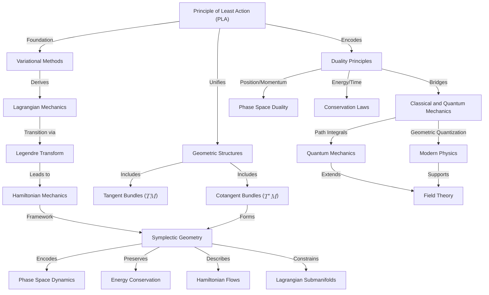

# Unifying Physics and Geometry: The Principle of Least Action, Dualities, and Symplectic Structures
* * *

--- Nature’s elegance lies in the harmony of action, geometry, and duality.

# **I. Introduction: The Geometric Nature of Physical Laws**

Classical mechanics offers an elegant and unified framework for describing the motion of physical systems, ranging from celestial bodies to subatomic particles. At its heart lies the **Principle of Least Action (PLA)**, a profound variational principle that not only governs the dynamics of physical systems but also reveals the intrinsic geometric nature of physical laws. Far from being just a computational tool, PLA connects the seemingly disparate phenomena of the natural world through a shared mathematical foundation. This section introduces PLA, traces its historical development, and highlights its role as a bridge between physics and geometry.

## **I.1. Historical Development of the Principle of Least Action**

The Principle of Least Action represents one of the most profound and enduring ideas in physics. Its historical evolution reflects humanity's search for simplicity and fundamental truths in nature.

1. **Heron of Alexandria (40 AD)**:
   - Heron proposed the **Principle of Least Distance** to describe the path of light, asserting that light travels along the shortest geometric path between two points.
   - Although limited to straight-line motion, this early observation hinted at a deeper principle governing nature's tendency toward optimization.

2. **Pierre de Fermat (17th Century)**:
   - Fermat extended Heron’s idea by introducing the **Principle of Least Time**, which states that light follows the path that minimizes the time it takes to travel between two points.
   - This principle explained the phenomenon of refraction, as light changes speed in different media, altering the shortest path into one of minimal time.

3. **Maupertuis and Euler (18th Century)**:
   - **Pierre-Louis Maupertuis** proposed the Principle of Least Action, suggesting that nature operates in the most efficient manner. He defined action as the product of an object's "vis viva" (kinetic energy) and time.
   - **Leonhard Euler** formalized this idea mathematically, providing a general framework for applying variational principles to mechanics.

4. **Joseph-Louis Lagrange (18th Century)**:
   - Lagrange redefined the action in terms of the **Lagrangian**, $L = T - V$, where $T$ is the kinetic energy and $V$ the potential energy.
   - He derived the **Euler-Lagrange equations**, which generalized Newtonian mechanics to systems with constraints and generalized coordinates.

5. **William Rowan Hamilton (19th Century)**:
   - Hamilton extended PLA into the **Hamiltonian framework**, emphasizing phase space and energy conservation.
   - He introduced the **Legendre transform** to connect Lagrangian and Hamiltonian mechanics, providing a unified view of classical dynamics.

Through these historical developments, PLA evolved from a philosophical idea into a rigorous mathematical principle, offering a universal framework for physics.

## **I.2. The Principle of Least Action as the Variational Foundation of Mechanics**

At its core, the Principle of Least Action asserts that the path taken by a physical system between two states is the one for which the **action functional** is stationary (i.e., its first variation vanishes). The action functional is defined as:
$$
S[q] = \int_{t_1}^{t_2} L(q, \dot{q}, t) \, dt,
$$
where:
- $q = q(t)$ represents the generalized coordinates of the system,
- $\dot{q} = \frac{dq}{dt}$ denotes the generalized velocities,
- $L(q, \dot{q}, t)$ is the **Lagrangian**, defined as:
  $$
  L(q, \dot{q}, t) = T - V,
  $$
  with $T$ being the kinetic energy and $V$ the potential energy.

The **variational principle** requires that:
$$
\delta S = 0,
$$
which leads to the **Euler-Lagrange equations**:
$$
\frac{d}{dt} \frac{\partial L}{\partial \dot{q}^i} - \frac{\partial L}{\partial q^i} = 0.
$$

These equations describe the motion of the system, unifying Newton's laws with a broader geometric framework. PLA thus serves as the variational foundation of classical mechanics, replacing Newtonian forces with the optimization of a scalar quantity: the action.

## **I.3. The Geometric Nature of Physical Principles**

The Principle of Least Action offers a geometric perspective on physical laws, transforming mechanics into a study of optimal paths in configuration space.

1. **Action as a Path Optimization Problem**:
   - The action functional $S[q]$ measures the "cost" of a trajectory in configuration space.
   - Among all possible paths connecting two points, the physical trajectory minimizes (or makes stationary) the action, akin to finding a geodesic in a curved manifold.

2. **Configuration Space and Tangent Bundles**:
   - The **configuration space** $M$ represents all possible positions of the system.
   - The **tangent bundle** $TM$ extends this space to include velocities, with each point $(q, \dot{q})$ representing a state of the system.
   - The Lagrangian $L(q, \dot{q}, t)$ is a scalar function defined on $TM$, encapsulating the system's dynamics.

3. **Geometric Invariance**:
   - The action $S[q]$ is invariant under coordinate transformations, reflecting its geometric nature.
   - The Euler-Lagrange equations derived from PLA are inherently coordinate-independent, emphasizing the universality of the variational principle.

This geometric formulation reveals the deep connection between physical laws and mathematical structures, laying the groundwork for advanced concepts like symplectic geometry and quantum mechanics.

## **I.4. Motivation for Exploring the Geometric Foundations of Mechanics**

PLA is more than a computational tool; it is a unifying principle that connects diverse areas of physics through a shared geometric framework. Exploring its geometric and variational underpinnings provides several key insights:

1. **Unification of Physical Laws**:
   - PLA serves as the foundation for both classical mechanics and modern theories like quantum mechanics and general relativity.
   - Its geometric nature bridges configuration space (Lagrangian mechanics) and phase space (Hamiltonian mechanics).

2. **Optimization in Nature**:
   - PLA reveals the inherent optimization principles underlying natural processes, from the motion of particles to the evolution of fields.
   - This perspective provides a deeper understanding of symmetries, conservation laws, and dualities in physics.

3. **Connections to Modern Physics**:
   - PLA generalizes to field theories, where it governs the dynamics of fields and spacetime itself (e.g., Einstein-Hilbert action in general relativity).
   - In quantum mechanics, PLA transitions to the **path integral formulation**, where it underpins Feynman’s sum-over-paths approach.

By exploring the geometric and variational foundations of PLA, we gain a unified framework for understanding mechanics, symmetries, and conservation laws, setting the stage for advanced topics like symplectic geometry and quantum extensions.

## **I.5. Connections to Subsequent Chapters**

1. **Transition to Variational Methods**:
   - The variational nature of PLA leads to the Euler-Lagrange equations, which form the foundation of Lagrangian mechanics.
2. **Introduction to Geometric Structures**:
   - The configuration space and tangent bundle introduced here naturally extend to the cotangent bundle and symplectic geometry in Hamiltonian mechanics.
3. **Bridging Classical and Quantum Mechanics**:
   - The geometric perspective of PLA connects classical mechanics to quantum mechanics through path integrals and geometric quantization.

## **I.6. Conclusion**

The Principle of Least Action is a cornerstone of classical mechanics, uniting physics and geometry through its variational and geometric nature. From its historical origins to its modern applications, PLA reveals the underlying elegance of physical laws, providing a unifying framework for understanding the dynamics of systems. By viewing PLA as a path optimization problem in configuration space, we uncover its geometric essence and set the stage for exploring advanced topics like tangent and cotangent bundles, symplectic geometry, and quantum mechanics. This foundation will guide us as we delve deeper into the geometric and variational principles that form the bedrock of modern physics.

# **II. Variational Methods: The Principle of Least Action**

The **Principle of Least Action (PLA)** lies at the heart of classical mechanics, providing an elegant and unified framework for deriving the equations of motion for physical systems. Its foundation in **variational calculus** not only simplifies the formulation of mechanics but also reveals the deep geometric structure underlying physical laws. This section explores the mathematical foundation of PLA, its geometric interpretation, and illustrative examples that showcase its power and universality.

## **II.1. The Principle of Least Action**

The Principle of Least Action asserts that the actual trajectory of a physical system between two points in time is the one for which the **action functional** is stationary. The action $S$ is defined as:
$$
S[q] = \int_{t_1}^{t_2} L(q, \dot{q}, t) \, dt,
$$
where:
- $q(t)$ represents the **generalized coordinates** of the system,
- $\dot{q}(t) = \frac{dq}{dt}$ denotes the **generalized velocities**,
- $L(q, \dot{q}, t)$ is the **Lagrangian**, a scalar function defined as:
  $$
  L(q, \dot{q}, t) = T - V,
  $$
  with $T$ being the **kinetic energy** and $V$ the **potential energy**.

The variational principle requires that the action $S[q]$ be stationary under small perturbations of the trajectory $q(t)$:
$$
\delta S = 0.
$$

## **II.2. Euler-Lagrange Equations from Variational Principles**

To derive the equations of motion, consider a small variation of the trajectory:
$$
q(t) \to q(t) + \epsilon \eta(t),
$$
where:
- $\epsilon$ is a small parameter,
- $\eta(t)$ is a smooth function representing the perturbation, with $\eta(t_1) = \eta(t_2) = 0$ to fix the endpoints.

The variation of the action is:
$$
\delta S = \frac{d}{d\epsilon} S[q + \epsilon \eta] \bigg|_{\epsilon=0}.
$$
Substituting into the action:
$$
\delta S = \int_{t_1}^{t_2} \left( \frac{\partial L}{\partial q} \delta q + \frac{\partial L}{\partial \dot{q}} \delta \dot{q} \right) dt.
$$
Using integration by parts on the term involving $\delta \dot{q}$ and noting that $\delta q(t_1) = \delta q(t_2) = 0$, we obtain:
$$
\delta S = \int_{t_1}^{t_2} \left( \frac{\partial L}{\partial q} - \frac{d}{dt} \frac{\partial L}{\partial \dot{q}} \right) \delta q \, dt.
$$
For $\delta S = 0$ to hold for arbitrary $\delta q$, the integrand must vanish:
$$
\frac{\partial L}{\partial q} - \frac{d}{dt} \frac{\partial L}{\partial \dot{q}} = 0.
$$
These are the **Euler-Lagrange equations**, which provide the equations of motion for the system.

## **II.3. Geometric Interpretation**

The Principle of Least Action can be understood geometrically as an optimization problem in **configuration space**.

1. **Configuration Space as a Manifold**:
   - The **configuration space** $M$ represents all possible positions $q$ of a system. For a system with $n$ degrees of freedom, $M$ is an $n$-dimensional manifold.
   - The trajectory $q(t)$ of the system corresponds to a **curve** in $M$.

2. **Action as a Path Functional**:
   - The action functional $S[q]$ assigns a scalar value to each possible trajectory in configuration space.
   - Among all possible paths connecting two points $q(t_1)$ and $q(t_2)$, the physical trajectory is the one that extremizes $S[q]$.

3. **Geodesics in Configuration Space**:
   - The physical trajectory can be interpreted as a **geodesic** in a space where the "distance" is measured by the action functional.
   - This geometric view highlights the connection between the Principle of Least Action and the optimization principles underlying natural phenomena.

4. **Tangent Bundles and Velocity Space**:
   - The **tangent bundle** $TM$ extends configuration space to include velocities $\dot{q}$. Each point in $TM$ is specified by $(q, \dot{q})$, representing a state of the system.
   - The Lagrangian $L(q, \dot{q}, t)$ is a scalar function defined on $TM$, encapsulating the system's dynamics.

## **II.4. Examples**

To illustrate the power of the Principle of Least Action, we consider two classic examples: the free particle and the harmonic oscillator.

### **II.4.1. Free Particle Motion**

A free particle moves without external forces. Its Lagrangian is:
$$
L = \frac{1}{2} m \dot{q}^2,
$$
where $m$ is the mass and $\dot{q}$ is the velocity.

1. **Action Functional**:
   $$
   S[q] = \int_{t_1}^{t_2} \frac{1}{2} m \dot{q}^2 \, dt.
   $$

2. **Euler-Lagrange Equations**:
   - Compute the derivatives:
     $$
     \frac{\partial L}{\partial q} = 0, \quad \frac{\partial L}{\partial \dot{q}} = m \dot{q}.
     $$
   - Substituting into the Euler-Lagrange equation:
     $$
     \frac{d}{dt}(m \dot{q}) = 0 \quad \Rightarrow \quad m \ddot{q} = 0.
     $$
   - The solution is:
     $$
     q(t) = q_0 + v_0 t,
     $$
     where $q_0$ and $v_0$ are constants representing the initial position and velocity.

3. **Geometric View**:
   - In configuration space, the trajectory is a straight line, reflecting the uniform motion of the particle.

### **II.4.2. Harmonic Oscillator**

The harmonic oscillator describes a system with a restoring force proportional to displacement. Its Lagrangian is:
$$
L = \frac{1}{2} m \dot{q}^2 - \frac{1}{2} k q^2,
$$
where $k$ is the spring constant.

1. **Action Functional**:
   $$
   S[q] = \int_{t_1}^{t_2} \left( \frac{1}{2} m \dot{q}^2 - \frac{1}{2} k q^2 \right) dt.
   $$

2. **Euler-Lagrange Equations**:
   - Compute the derivatives:
     $$
     \frac{\partial L}{\partial q} = -k q, \quad \frac{\partial L}{\partial \dot{q}} = m \dot{q}.
     $$
   - Substituting into the Euler-Lagrange equation:
     $$
     \frac{d}{dt}(m \dot{q}) + k q = 0 \quad \Rightarrow \quad m \ddot{q} + k q = 0.
     $$
   - The solution is:
     $$
     q(t) = A \cos(\omega t) + B \sin(\omega t),
     $$
     where $\omega = \sqrt{\frac{k}{m}}$ is the angular frequency, and $A$, $B$ are constants determined by initial conditions.

3. **Geometric View**:
   - In configuration space, the trajectory is periodic, corresponding to oscillations around the equilibrium point.
   - In phase space $(q, p)$, the trajectory forms a closed curve (an ellipse) on a constant energy surface.

## **II.5. Implications**

The Principle of Least Action provides a unifying framework for understanding the motion of physical systems:

1. **Derivation of Equations of Motion**:
   - PLA replaces Newtonian forces with the optimization of a scalar quantity (the action), simplifying the derivation of equations of motion.

2. **Coordinate Independence**:
   - The Euler-Lagrange equations are invariant under changes in coordinates, highlighting the geometric nature of PLA.

3. **Foundation for Advanced Mechanics**:
   - PLA forms the basis for Lagrangian mechanics and sets the stage for the transition to Hamiltonian mechanics via the **Legendre transform**.

4. **Connection to Symmetry and Conservation Laws**:
   - Through Noether’s theorem, the symmetries of the action functional are directly linked to conservation laws, such as energy, momentum, and angular momentum.

## **II.6. Connections to Subsequent Topics**

1. **Transition to Legendre Transforms**:
   - The examples above showcase the role of velocity $\dot{q}$ in Lagrangian mechanics. The next step is to replace $\dot{q}$ with its conjugate momentum $p = \frac{\partial L}{\partial \dot{q}}$, achieved through the **Legendre transform**.

2. **Symplectic Geometry and Phase Space**:
   - The configuration space and tangent bundle introduced here naturally extend to the cotangent bundle and symplectic geometry, which form the geometric setting for Hamiltonian mechanics.

## **II.7. Conclusion**

The Principle of Least Action is a cornerstone of classical mechanics, providing a geometric and variational foundation for understanding the motion of physical systems. By extremizing the action functional, PLA unifies the dynamics of systems in a way that is both elegant and coordinate-independent. Through its connection to variational methods and the Euler-Lagrange equations, PLA bridges the intuitive principles of Newtonian mechanics with the geometric structures of modern physics, setting the stage for deeper explorations into Hamiltonian mechanics, symplectic geometry, and quantum mechanics.

# **III. The Legendre Transform: A Geometric Bridge**

The **Legendre transform** is a cornerstone of classical mechanics, serving as the mathematical and geometric bridge between **Lagrangian mechanics** and **Hamiltonian mechanics**. Beyond its computational role, the Legendre transform reveals the intrinsic duality between velocity and momentum and provides the foundation for the transition from configuration space to phase space. This section introduces the Legendre transform, explores its geometric interpretation, and illustrates its role in unifying physical principles.

## **III.1. Definition and Physical Significance**

The Legendre transform provides a systematic way to replace generalized velocities $\dot{q}^i$ with generalized momenta $p_i$ as the primary variables in mechanics. This substitution is central to transitioning from the Lagrangian to the Hamiltonian formulation.

1. **Mapping Velocity to Momentum**:
   - For a system described by the Lagrangian $L(q, \dot{q}, t)$, the **generalized momentum** $p_i$ conjugate to each coordinate $q^i$ is defined as:
     $$
     p_i = \frac{\partial L}{\partial \dot{q}^i}.
     $$
   - This equation encapsulates the dependence of the Lagrangian on the generalized velocities $\dot{q}^i$, replacing them with momenta as the conjugate variables.

2. **Construction of the Hamiltonian**:
   - The **Hamiltonian** $H(q, p, t)$ is obtained as the Legendre transform of the Lagrangian:
     $$
     H(q, p, t) = \sum_i p_i \dot{q}^i - L(q, \dot{q}, t),
     $$
     where $\dot{q}^i$ is expressed as a function of $q^i$, $p_i$, and $t$ by inverting the momentum relation $p_i = \frac{\partial L}{\partial \dot{q}^i}$.
   - The Hamiltonian represents the **total energy** of the system when the Lagrangian has the standard form $L = T - V$ (kinetic energy minus potential energy).

3. **Physical Significance**:
   - In **Lagrangian mechanics**, the dynamics are described in terms of generalized coordinates $q^i$ and velocities $\dot{q}^i$, forming a natural framework for understanding forces and energy exchange.
   - In **Hamiltonian mechanics**, the dynamics are expressed in terms of generalized coordinates $q^i$ and conjugate momenta $p_i$, providing a phase space perspective that emphasizes energy conservation and symplectic structure.
   - The Legendre transform bridges these two formulations, enabling a transition from velocity-based to momentum-based descriptions of dynamics.

## **III.2. Geometric Interpretation**

The Legendre transform is not merely an algebraic operation but a profound geometrical mapping between **tangent bundles** and **cotangent bundles**, which are natural spaces for Lagrangian and Hamiltonian mechanics, respectively.

1. **Tangent Bundle ($TM$)**:
   - The tangent bundle $TM$ consists of all possible positions $q^i$ and velocities $\dot{q}^i$, representing the state space in Lagrangian mechanics.
   - Each point $(q^i, \dot{q}^i) \in TM$ specifies a configuration and its rate of change.

2. **Cotangent Bundle ($T^*M$)**:
   - The cotangent bundle $T^*M$ consists of all possible positions $q^i$ and momenta $p_i$, serving as the phase space in Hamiltonian mechanics.
   - Each point $(q^i, p_i) \in T^*M$ represents a state of the system in terms of position and momentum.

3. **The Legendre Transform as a Bundle Map**:
   - The Legendre transform $\mathcal{L}: TM \to T^*M$ is a **fiber-preserving map**:
     $$
     \begin{array}{ccc}
     TM & \xrightarrow{\mathcal{L}} & T^*M \\
     \downarrow & & \downarrow \\
     M & = & M
     \end{array}
     $$
   - It maps a point $(q^i, \dot{q}^i) \in TM$ to a point $(q^i, p_i) \in T^*M$ by defining $p_i = \frac{\partial L}{\partial \dot{q}^i}$.

4. **Natural Pairing Structure**:
   - The geometric significance of the Legendre transform emerges from the **canonical pairing** between tangent vectors (velocities) and cotangent vectors (momenta):
     $$
     \langle p, v \rangle = p_i v^i.
     $$
   - This pairing is intrinsic to the geometry of the cotangent bundle, independent of any specific coordinate system.

5. **Symplectic Preservation**:
   - The Legendre transform preserves the **symplectic structure** of phase space:
     $$
     \mathcal{L}^*\omega = d(p_i dq^i) = dp_i \wedge dq^i,
     $$
     ensuring consistency between the Lagrangian and Hamiltonian formulations.

## **III.3. Examples**

To illustrate the Legendre transform, we consider its application in two classic examples: the free particle and the simple pendulum.

### **III.3.1. Free Particle**

1. **Lagrangian**:
   $$
   L = \frac{1}{2} m \dot{q}^2,
   $$
   where $m$ is the mass and $\dot{q}$ is the velocity.

2. **Generalized Momentum**:
   $$
   p = \frac{\partial L}{\partial \dot{q}} = m \dot{q}.
   $$

3. **Hamiltonian**:
   $$
   H = p \dot{q} - L = \frac{p^2}{2m}.
   $$

4. **Geometric View**:
   - In $TM$, the state is described by $(q, \dot{q})$, where the Lagrangian represents the kinetic energy.
   - In $T^*M$, the state is $(q, p)$, with the Hamiltonian representing the total energy.

### **III.3.2. Simple Pendulum**

1. **Lagrangian**:
   $$
   L = \frac{1}{2} m l^2 \dot{\theta}^2 - m g l (1 - \cos \theta),
   $$
   where $\theta$ is the angle, $l$ is the pendulum length, and $g$ is the gravitational acceleration.

2. **Generalized Momentum**:
   $$
   p = \frac{\partial L}{\partial \dot{\theta}} = m l^2 \dot{\theta}.
   $$

3. **Hamiltonian**:
   $$
   H = p \dot{\theta} - L = \frac{p^2}{2 m l^2} + m g l (1 - \cos \theta).
   $$

4. **Geometric View**:
   - In $TM$, the pendulum’s motion is described by $(\theta, \dot{\theta})$, with the Lagrangian capturing the balance of kinetic and potential energy.
   - In $T^*M$, the motion is reformulated as $(\theta, p)$, emphasizing energy conservation and phase space dynamics.

## **III.4. Duality in Mechanics**

The Legendre transform encapsulates fundamental **duality principles** in mechanics:

1. **Position-Momentum Duality**:
   - Position $q^i$ and momentum $p_i$ are **conjugate variables**, reflecting complementary aspects of a system’s state.
   - This duality is intrinsic to the phase space formulation of mechanics.

2. **Energy-Time Duality**:
   - In Hamiltonian mechanics, the Hamiltonian $H$ generates the system’s time evolution, linking energy and time as conjugate variables.

3. **Geometric Duality**:
   - The Legendre transform reveals the duality between the tangent bundle ($TM$) and cotangent bundle ($T^*M$), unifying velocity-based and momentum-based descriptions of motion.

4. **Lagrangian-Hamiltonian Duality**:
   - Lagrangian mechanics focuses on trajectories and forces, while Hamiltonian mechanics emphasizes states and energy conservation.
   - The Legendre transform bridges these frameworks, providing a dual perspective on the same physical phenomena.

## **III.5. Connections to Symplectic Geometry**

The Legendre transform naturally introduces the **cotangent bundle** $T^*M$, which is equipped with a **symplectic structure**:
- The symplectic form $\omega = dp_i \wedge dq^i$ governs the geometry of phase space.
- Hamiltonian flows preserve $\omega$, reflecting the conservation of phase space volume (Liouville’s theorem).

By transitioning from $TM$ to $T^*M$, the Legendre transform sets the stage for symplectic geometry, providing the mathematical framework for Hamiltonian mechanics and bridging classical mechanics with quantum mechanics.

## **III.6. Conclusion**

The Legendre transform is far more than an algebraic tool; it is a profound geometric map that bridges Lagrangian and Hamiltonian mechanics. By transitioning from the tangent bundle to the cotangent bundle, it reveals the duality between velocity and momentum, unifying the principles of action optimization and energy conservation. This geometric perspective lays the foundation for symplectic geometry, Hamiltonian flows, and the deeper structures of phase space, setting the stage for exploring the symplectic framework in the next section.

# **IV. Symplectic Geometry: The Natural Setting for Hamiltonian Mechanics**

Symplectic geometry serves as the natural mathematical framework for Hamiltonian mechanics, revealing the deep geometric structure underlying phase space dynamics. The symplectic structure not only governs the equations of motion for physical systems but also ensures the preservation of fundamental quantities like energy and phase space volume. In this section, we explore the defining features of symplectic geometry, its role in Hamiltonian flows, and its connections to conservation laws and variational principles.

## **IV.1. Symplectic Forms**

The symplectic form is the cornerstone of symplectic geometry, providing the geometric structure that underpins Hamiltonian mechanics.

1. **Definition**:
   - A **symplectic manifold** $(M, \omega)$ consists of a smooth, even-dimensional manifold $M$ equipped with a non-degenerate, closed 2-form $\omega$, known as the **symplectic form**.
   - In local coordinates $(q^i, p_i)$ on the **cotangent bundle** $T^*M$ (the natural phase space of a mechanical system), the canonical symplectic form is:
     $$
     \omega = \sum_{i=1}^n dp_i \wedge dq^i.
     $$

2. **Properties**:
   - **Non-degeneracy**: For any non-zero vector $v$ in the tangent space $T_pM$, there exists a vector $w$ such that $\omega(v, w) \neq 0$. This ensures that $\omega$ provides a pairing between tangent vectors, making it invertible.
   - **Closedness**: $d\omega = 0$, where $d$ is the exterior derivative. This property implies that $\omega$ is preserved under continuous deformations, reflecting the conservation laws inherent in Hamiltonian flows.

3. **Physical Interpretation**:
   - The symplectic form $\omega$ measures the "area" in phase space. For example, in classical mechanics, $\omega$ encodes the relationship between position and momentum, ensuring their complementary nature.
   - The pairing $dp_i \wedge dq^i$ reflects the intrinsic duality between coordinates $q^i$ and momenta $p_i$.

4. **Exactness**:
   - On $T^*M$, the symplectic form $\omega$ is exact, meaning it can be expressed as the exterior derivative of the **canonical one-form** $\theta$:
     $$
     \omega = -d\theta, \quad \theta = \sum_{i=1}^n p_i \, dq^i.
     $$
   - The one-form $\theta$ plays a central role in variational principles and geometric quantization.

## **IV.2. Phase Space as a Symplectic Manifold**

In Hamiltonian mechanics, the **phase space** $T^*M$ is naturally a symplectic manifold, equipped with the canonical symplectic form $\omega$. This structure ensures that the dynamics of physical systems are inherently geometric.

1. **Canonical Coordinates**:
   - Phase space is described by **canonical coordinates** $(q^i, p_i)$, where $q^i$ are generalized positions and $p_i$ are the conjugate momenta.
   - These coordinates satisfy the fundamental **Poisson bracket relations**:
     $$
     \{q^i, p_j\} = \delta^i_j, \quad \{q^i, q^j\} = 0, \quad \{p_i, p_j\} = 0.
     $$

2. **Preservation of Phase Space Structure**:
   - The symplectic form $\omega$ defines the geometric structure of phase space and is preserved under Hamiltonian evolution.
   - **Liouville's Theorem** states that the volume of any region in phase space, defined by $\omega^n/n!$, remains constant over time:
     $$
     \mathcal{L}_{X_H} \omega = 0,
     $$
     where $\mathcal{L}_{X_H}$ is the Lie derivative along the Hamiltonian vector field $X_H$. This reflects the conservation of phase space density.

3. **Geometric Role of the Hamiltonian**:
   - The Hamiltonian $H(q, p, t)$ generates the system's time evolution in phase space. The dynamics are given by **Hamilton's equations**:
     $$
     \dot{q}^i = \frac{\partial H}{\partial p_i}, \quad \dot{p}_i = -\frac{\partial H}{\partial q^i}.
     $$
   - These equations describe the flow of the system in phase space, preserving the symplectic structure.

## **IV.3. Hamiltonian Flows**

A key aspect of symplectic geometry is the concept of **Hamiltonian flows**, which describe the time evolution of a system in phase space under the influence of the Hamiltonian.

1. **Hamiltonian Vector Fields**:
   - Associated with every Hamiltonian function $H: T^*M \to \mathbb{R}$ is a **Hamiltonian vector field** $X_H$, defined by:
     $$
     \iota_{X_H} \omega = dH,
     $$
     where $\iota_{X_H}$ denotes the interior product of $X_H$ with the symplectic form $\omega$.
   - This equation defines $X_H$ such that $\omega$ pairs $X_H$ with any other vector field in a way that mirrors the gradient of $H$.

2. **Preservation of Symplectic Form**:
   - The flow $\phi_t$ generated by $X_H$ preserves the symplectic structure:
     $$
     \phi_t^* \omega = \omega.
     $$
   - This invariance under Hamiltonian flow reflects the conservation of physical quantities like energy and angular momentum.

3. **Liouville's Theorem**:
   - The conservation of phase space volume under Hamiltonian flows is a direct consequence of the preservation of $\omega$:
     $$
     \mathcal{L}_{X_H} (\omega^n) = 0.
     $$
   - This theorem ensures that the density of trajectories in phase space remains constant over time.

4. **Noether’s Theorem**:
   - Symmetries of the Hamiltonian are directly linked to conserved quantities through **Noether’s theorem**:
     - For every continuous symmetry of $H$, there exists a conserved quantity (e.g., energy, momentum, angular momentum).
     - These conserved quantities are geometric invariants under Hamiltonian flow.

## **IV.4. Geometric Quantities in Symplectic Geometry**

Symplectic geometry introduces several important geometric objects and concepts that govern the dynamics of Hamiltonian systems.

1. **Lagrangian Submanifolds**:
   - A **Lagrangian submanifold** $\mathcal{L} \subset T^*M$ is a maximal submanifold on which the symplectic form $\omega$ vanishes:
     $$
     \omega|_{\mathcal{L}} = 0, \quad \dim(\mathcal{L}) = \frac{1}{2} \dim(T^*M).
     $$
   - Classical trajectories of a system often lie on Lagrangian submanifolds, reflecting the variational principles that govern their motion.

2. **Action and Symplectic Geometry**:
   - The **action integral** $S[q] = \int p_i dq^i - H \, dt$ can be viewed as a geometric quantity defined on trajectories in phase space.
   - The Principle of Least Action ensures that physical trajectories are those that extremize the action, corresponding to geodesics on Lagrangian submanifolds.

3. **Energy Level Sets**:
   - The level sets of the Hamiltonian, defined by $H(q, p) = E$, are $(2n-1)$-dimensional hypersurfaces in phase space.
   - Dynamics are confined to these energy level sets, illustrating how symplectic geometry constrains physical motion.

## **IV.5. Connections to Modern Physics**

Symplectic geometry not only provides the mathematical foundation for classical mechanics but also bridges to modern physics, including quantum mechanics and field theory.

1. **Quantum Mechanics**:
   - Symplectic geometry underpins the transition from classical Poisson brackets to quantum commutators:
     $$
     \{q^i, p_j\} \to \frac{1}{i\hbar} [\hat{q}^i, \hat{p}_j] = \delta^i_j.
     $$
   - Geometric quantization builds on the symplectic structure to define quantum states and operators.

2. **Field Theory**:
   - Symplectic geometry extends to infinite-dimensional phase spaces, enabling the study of Hamiltonian field theories and gauge theories.
   - The symplectic structure governs the dynamics of fields, including the interplay of constraints and conserved charges.

## **IV.6. Conclusion**

Symplectic geometry is the natural setting for Hamiltonian mechanics, embedding the dynamics of physical systems in a rich geometric framework. The symplectic form $\omega = dp_i \wedge dq^i$ encodes the fundamental relationships between position and momentum, ensuring the preservation of phase space structure and conservation laws. Through Hamiltonian flows, Lagrangian submanifolds, and energy level sets, symplectic geometry provides a unifying perspective that bridges variational principles, classical mechanics, and modern physics. This geometric foundation sets the stage for exploring deeper connections between classical and quantum mechanics in subsequent sections.

# **V. Energy Conservation, Level Sets, and Phase Space Dynamics**

In Hamiltonian mechanics, energy conservation is a central principle that governs the dynamics of physical systems. The geometric structure of phase space provides a natural framework to visualize and understand these dynamics, where the **Hamiltonian function** acts as both a conserved quantity and a generator of motion. This section explores how energy conservation is reflected geometrically in phase space, highlights the role of **level sets** of the Hamiltonian, and examines the dynamics of trajectories constrained to these surfaces. Finally, we connect these ideas to the broader framework of **symplectic geometry**.

## **V.1. Energy Conservation in Hamiltonian Mechanics**

1. **Hamiltonian as a Conserved Quantity**:
   - In Hamiltonian mechanics, the Hamiltonian $H(q, p, t)$ typically represents the **total energy** (kinetic + potential) of the system. For an autonomous system (where $H$ does not explicitly depend on time), the Hamiltonian is conserved along trajectories in phase space:
     $$
     \frac{dH}{dt} = \frac{\partial H}{\partial t} + \{H, H\} = 0.
     $$
     - Here, $\{H, H\} = 0$ refers to the Poisson bracket of $H$ with itself, which vanishes identically.
   - Conservation of $H$ implies that the motion of the system is confined to a **hypersurface** in phase space, defined by the equation:
     $$
     H(q, p) = E,
     $$
     where $E$ is the total energy.

2. **Geometric Implications**:
   - The hypersurface $H(q, p) = E$, known as an **energy level set**, represents the space of all possible states (positions and momenta) accessible to the system at a given energy $E$.
   - Energy conservation reduces the dimensionality of the phase space trajectory, confining the system's motion to a specific energy manifold.

## **V.2. Level Sets of the Hamiltonian**

The **level sets** of the Hamiltonian, $H(q, p) = E$, are geometric objects that encapsulate the dynamics of the system and provide a visual and analytical tool for understanding its behavior.

1. **Definition**:
   - A level set of the Hamiltonian is the set of all points in phase space $(q, p)$ that satisfy $H(q, p) = E$ for a fixed value of $E$.
   - These level sets are geometric constraints on the system's motion.

2. **Dimensionality**:
   - For a system with $n$ degrees of freedom, the phase space is $2n$-dimensional, and the energy level sets are $(2n-1)$-dimensional hypersurfaces.
   - Examples:
     - A one-dimensional system has a two-dimensional phase space $(q, p)$, and its energy level sets are curves in the $(q, p)$ plane.
     - A two-dimensional system (e.g., a particle moving in two dimensions) has a four-dimensional phase space, with three-dimensional energy level sets.

3. **Isoenergetic Surfaces**:
   - Level sets are often referred to as **isoenergetic surfaces** because they represent states with constant total energy.
   - The topology of these surfaces depends on the form of the Hamiltonian and the energy value $E$:
     - For bounded systems (e.g., harmonic oscillators), the level sets are typically compact (e.g., ellipses or tori).
     - For unbounded systems (e.g., free particles), the level sets may extend to infinity.

4. **Examples**:
   - **Harmonic Oscillator**:
     $$
     H = \frac{p^2}{2m} + \frac{1}{2}kq^2.
     $$
     The energy level sets are ellipses in the $(q, p)$ plane:
     $$
     \frac{p^2}{2m} + \frac{1}{2}kq^2 = E.
     $$
   - **Central Force Problems**:
     For a particle in a central potential $V(r)$, the level sets are determined by the total energy $E$ and angular momentum $L$, leading to conic sections in configuration space.

## **V.3. Phase Space Dynamics**

The dynamics of a Hamiltonian system are confined to energy level sets and are governed by the Hamiltonian flow, which describes the time evolution of the system in phase space.

1. **Trajectories and Hamiltonian Flows**:
   - The motion of the system in phase space is described by **Hamilton's equations**:
     $$
     \dot{q}^i = \frac{\partial H}{\partial p_i}, \quad \dot{p}_i = -\frac{\partial H}{\partial q^i}.
     $$
   - These equations define a **vector field** on phase space. The trajectories of the system are the integral curves of this vector field.

2. **Dynamics on Energy Level Sets**:
   - The trajectories of the system are confined to the intersections of the energy level sets $H(q, p) = E$ with the Hamiltonian flow.
   - For integrable systems, trajectories on energy level sets often form **tori** in phase space, corresponding to quasi-periodic motion.

3. **Visualization**:
   - In one-dimensional systems, trajectories can be visualized as oscillations or closed loops in the $(q, p)$ plane.
   - In higher-dimensional systems, trajectories form more complex patterns on energy level sets, such as nested tori in integrable systems.

4. **Examples**:
   - **Harmonic Oscillator**:
     - The trajectories are closed ellipses in the $(q, p)$ plane, reflecting periodic motion.
   - **Central Force Problems**:
     - The trajectories correspond to orbits in configuration space (e.g., ellipses, parabolas, or hyperbolas), while in phase space, they form more complex curves.

## **V.4. Symplectic Geometry Integration**

The connection between energy conservation, level sets, and phase space dynamics is deeply rooted in symplectic geometry.

1. **Symplectic Form and Volume Conservation**:
   - The symplectic form $\omega = dp_i \wedge dq^i$ ensures the preservation of phase space structure under Hamiltonian flow.
   - Liouville's theorem states that the phase space volume, defined by $\omega^n/n!$, is conserved along trajectories.

2. **Lagrangian Submanifolds**:
   - The level sets of the Hamiltonian often serve as **Lagrangian submanifolds**, where the symplectic form $\omega$ vanishes.
   - Trajectories confined to these submanifolds satisfy the variational principles of mechanics, reflecting the optimization inherent in the Principle of Least Action.

3. **Energy Conservation as a Geometric Constraint**:
   - Energy conservation restricts the motion of the system to specific regions of phase space, reducing the effective dimensionality of the dynamics.
   - The symplectic structure ensures that these constraints are compatible with the geometric evolution of the system.

## **V.5. Conclusion**

Energy conservation, as encoded in the Hamiltonian, provides a geometric framework for understanding the motion of physical systems. The level sets of the Hamiltonian define isoenergetic surfaces in phase space, where trajectories are confined and governed by Hamiltonian flows. These dynamics are deeply intertwined with the symplectic structure of phase space, which ensures the preservation of geometric properties like phase space volume and energy hypersurfaces. By integrating energy conservation, Hamiltonian flows, and symplectic geometry, we gain a unified perspective on the structure and evolution of physical systems. This geometric foundation sets the stage for exploring the deeper implications of symplectic geometry in classical and quantum mechanics.

# **VI. Critical Analysis and Advanced Insights**

The mathematical elegance and conceptual power of the **Principle of Least Action (PLA)**, **Legendre transforms**, and **symplectic geometry** are undeniable. However, imprecise interpretations and oversimplifications often obscure their deeper geometric and physical significance. This section critically examines common misconceptions, clarifies the advanced insights that emerge from these principles, and highlights their broader implications for modern physics, particularly in bridging classical and quantum mechanics.

## **VI.1. Misconceptions**

### **VI.1.1. "Least" Action vs. Stationary Action**

One of the most persistent misconceptions about PLA lies in its characterization as the **Principle of Least Action**. While the term suggests that action is always minimized, this is not universally true.

1. **Stationary Action**:
   - The correct interpretation of PLA is that the action functional $S[q] = \int_{t_1}^{t_2} L(q, \dot{q}, t) \, dt$ is **stationary** under small variations of the trajectory:
     $$
     \delta S = 0.
     $$
   - A stationary action means the variation $\delta S$ vanishes, corresponding to a minimum, maximum, or saddle point of the action.

2. **Physical Examples**:
   - **Minimum Action**: For most mechanical systems, the action is minimized (e.g., a free particle follows a straight-line path in space).
   - **Non-Minimum Action**: In some cases, such as certain relativistic or quantum systems, the action may correspond to a saddle point.

3. **Implication**:
   - The term "least action" persists due to historical reasons but risks oversimplifying the principle. Recognizing that PLA refers to **stationary action** highlights its universality across classical mechanics, field theory, and quantum mechanics.

### **VI.1.2. Misinterpretation of Legendre Transforms as Algebraic**

The **Legendre transform** is often introduced as a purely algebraic tool for transitioning between Lagrangian and Hamiltonian mechanics. This perspective neglects its deeper geometric significance.

1. **Legendre Transform as a Geometric Map**:
   - The Legendre transform is fundamentally a **geometric mapping** between the **tangent bundle** ($TM$) and the **cotangent bundle** ($T^*M$), preserving the symplectic structure of phase space:
     $$
     \mathcal{L}: TM \to T^*M.
     $$
   - This map replaces velocities $\dot{q}^i$ with conjugate momenta $p_i = \frac{\partial L}{\partial \dot{q}^i}$, transitioning from velocity-based to momentum-based descriptions of motion.

2. **Natural Pairing and Symplectic Consistency**:
   - The Legendre transform ensures consistency with the symplectic form:
     $$
     \omega = dp_i \wedge dq^i,
     $$
     preserving the geometric relationships between position and momentum.

3. **Implication**:
   - Viewing the Legendre transform as purely algebraic obscures its role in unifying Lagrangian and Hamiltonian mechanics within the geometric framework of tangent and cotangent bundles.

## **VI.2. Advanced Insights**

### **VI.2.1. Symplectic Geometry as a Unifying Framework**

**Symplectic geometry** provides the mathematical and conceptual foundation for Hamiltonian mechanics, extending its applicability to quantum mechanics and field theory.

1. **Phase Space as a Symplectic Manifold**:
   - The cotangent bundle $T^*M$, equipped with the symplectic form $\omega = dp_i \wedge dq^i$, is the natural setting for Hamiltonian mechanics.
   - The symplectic structure governs the evolution of trajectories, ensuring the conservation of phase space volume (Liouville’s theorem).

2. **Geometric Quantization**:
   - Symplectic geometry bridges classical and quantum mechanics via **geometric quantization**, where classical Poisson brackets $\{q^i, p_j\}$ are replaced by quantum commutators $[\hat{q}^i, \hat{p}_j]$.
   - The symplectic structure encodes the transition from classical trajectories to quantum states.

3. **Extension to Field Theory**:
   - Symplectic geometry generalizes to infinite-dimensional phase spaces, underpinning Hamiltonian field theories and gauge theories.

4. **Implication**:
   - Symplectic geometry unifies classical mechanics, quantum mechanics, and field theory, providing a common language for understanding physical systems.

### **VI.2.2. Duality Principles and Geometric Quantization**

Duality is a recurring theme in physics, and PLA, Legendre transforms, and symplectic geometry embody this principle at multiple levels.

1. **Position-Momentum Duality**:
   - Position $q^i$ and momentum $p_i$ are conjugate variables, forming the basis for the phase space description of mechanics.
   - This duality is expressed geometrically in the symplectic structure:
     $$
     \omega = dp_i \wedge dq^i.
     $$
   - The natural pairing $\langle p, v \rangle = p_i v^i$ links configuration space and phase space.

2. **Energy-Time Duality**:
   - The Hamiltonian $H$ generates time evolution, reflecting the duality between energy and time:
     $$
     \dot{q}^i = \frac{\partial H}{\partial p_i}, \quad \dot{p}_i = -\frac{\partial H}{\partial q^i}.
     $$
   - This duality underpins the conservation of energy and the symmetries of time translation.

3. **Geometric Quantization**:
   - Quantization relies on dualities encoded in the symplectic structure:
     - Classical observables become quantum operators.
     - The symplectic form determines the phase space measure used in the path integral formulation of quantum mechanics.

4. **Implication**:
   - Duality principles reveal the complementary perspectives of physical systems, unifying classical and quantum descriptions within a geometric framework.

## **VI.3. Broader Implications in Modern Physics**

The insights from PLA, Legendre transforms, and symplectic geometry extend far beyond classical mechanics, influencing modern physics and mathematics.

1. **Quantum Mechanics**:
   - **Path Integral Formulation**: In quantum mechanics, the Principle of Least Action generalizes to Feynman’s path integral formulation, where the quantum amplitude is computed as a sum over all possible paths:
     $$
     \int e^{iS[q]/\hbar} \mathcal{D}[q].
     $$
   - The classical trajectory arises as the stationary phase of this integral, connecting classical and quantum dynamics.

2. **Field Theory and Gauge Theories**:
   - PLA extends to field theories, where the action functional governs the dynamics of fields:
     $$
     S[\phi] = \int \mathcal{L}(\phi, \partial_\mu \phi) \, d^4x,
     $$
     with $\mathcal{L}$ being the Lagrangian density.
   - Symplectic geometry provides the framework for understanding constraints, conserved charges, and gauge symmetries in field theories.

3. **General Relativity**:
   - The Einstein-Hilbert action in general relativity is a direct application of PLA to spacetime geometry:
     $$
     S = \int R \sqrt{-g} \, d^4x,
     $$
     where $R$ is the Ricci scalar. Symplectic methods aid in understanding the constraints and dynamics of the gravitational field.

4. **Emergent Physics**:
   - Symplectic geometry and PLA guide the development of emergent theories, such as string theory and holography, where dualities play a central role.

## **VI.4. Conclusion**

This critical analysis highlights the depth and breadth of the **Principle of Least Action**, **Legendre transforms**, and **symplectic geometry** as foundational principles in physics. By addressing misconceptions, emphasizing their geometric and physical significance, and exploring their extensions to quantum mechanics and field theory, we gain a more unified and profound understanding of the interplay between physics and geometry. These insights not only refine our conceptual understanding but also open new avenues for research in classical and modern physics. Through PLA and its associated geometric structures, we uncover the profound elegance and unity underlying the laws of nature.

# **VII. Conclusion and Reflections**

The exploration of the **Principle of Least Action (PLA)** and its geometric and variational foundations reveals a profound unity underlying the laws of nature. This document has traced the connections between PLA, variational methods, Legendre transforms, symplectic geometry, and modern physics, culminating in a cohesive framework that emphasizes the harmony between physical principles and mathematical structures. In this conclusion, we synthesize these key ideas, reflect on their broader implications, and highlight how they inform our understanding of classical mechanics, quantum mechanics, and field theory.

## **VII.1. Recap of PLA, Variational Methods, and Symplectic Geometry**

1. **The Principle of Least Action**:
   - PLA provides a unifying principle for classical mechanics, asserting that the motion of a system is determined by the extremization of the action functional:
     $$
     S[q] = \int_{t_1}^{t_2} L(q, \dot{q}, t) \, dt.
     $$
   - By minimizing (or making stationary) the action, PLA governs the dynamics of physical systems, from free particles to complex constrained systems.
   - The Euler-Lagrange equations derived from PLA provide a coordinate-independent description of motion, encapsulating the essence of Newtonian mechanics in a variational framework.

2. **Variational Methods and Geometric Insights**:
   - Variational principles highlight the optimization inherent in natural processes, where trajectories in configuration space represent paths of "least resistance."
   - The geometric interpretation of PLA transforms mechanics into a study of optimal paths and geodesics in configuration and phase space.

3. **Legendre Transforms as a Bridge**:
   - The Legendre transform connects Lagrangian and Hamiltonian mechanics by transitioning from velocity-based descriptions in the **tangent bundle** ($TM$) to momentum-based descriptions in the **cotangent bundle** ($T^*M$).
   - This transition reveals the duality between velocities and momenta, unifying two complementary formulations of mechanics.

4. **Symplectic Geometry and Phase Space**:
   - Symplectic geometry provides the natural setting for Hamiltonian mechanics, where phase space is structured by the symplectic form:
     $$
     \omega = dp_i \wedge dq^i.
     $$
   - Through Hamiltonian flows, the symplectic structure preserves phase space volume (Liouville’s theorem) and governs the dynamics of trajectories confined to energy hypersurfaces.
   - Symplectic geometry not only governs classical mechanics but also bridges to quantum mechanics via geometric quantization.

5. **Energy Conservation and Level Sets**:
   - The Hamiltonian, as a conserved quantity, restricts motion to isoenergetic surfaces in phase space, where trajectories reflect the interplay of conservation laws, symmetries, and geometric constraints.

## **VII.2. Reflection on Geometric and Physical Unity in Mechanics**

The journey through PLA and its geometric underpinnings reveals a profound unity between physics and geometry. This unity manifests in several ways:

1. **Geometry as the Language of Physics**:
   - The principles of classical mechanics are deeply geometric, where configuration space, tangent bundles, and cotangent bundles provide the natural settings for describing motion.
   - The symplectic structure of phase space ensures the invariance of physical laws under canonical transformations, emphasizing the geometric consistency of Hamiltonian mechanics.

2. **Duality as a Fundamental Principle**:
   - The duality between position and momentum, energy and time, and configuration space and phase space reflects the complementary perspectives inherent in physical systems.
   - These dualities are not merely mathematical constructs but are deeply woven into the fabric of the universe, offering multiple viewpoints to describe the same phenomena.

3. **Symmetry and Conservation Laws**:
   - Noether’s theorem underscores the intrinsic connection between symmetries and conserved quantities, such as energy, momentum, and angular momentum.
   - The geometric invariants of symplectic geometry provide a unified framework to understand these conservation laws across classical and quantum domains.

4. **Optimization and Natural Efficiency**:
   - PLA and variational principles reveal the optimization and efficiency inherent in natural processes, where physical systems evolve along paths that minimize or extremize action.
   - This idea extends from classical trajectories to quantum paths, where constructive interference in Feynman’s path integrals selects the stationary points of the action.

## **VII.3. Broader Implications for Modern Physics**

The insights gained from PLA and symplectic geometry extend far beyond classical mechanics, influencing cutting-edge developments in quantum mechanics, field theory, and beyond.

1. **Quantum Mechanics**:
   - PLA forms the basis for the **path integral formulation** of quantum mechanics, where the quantum amplitude is computed as a sum over all possible paths, weighted by $e^{iS[q]/\hbar}$:
     $$
     \psi(q_f, t_f) = \int \mathcal{D}[q] \, e^{iS[q]/\hbar}.
     $$
   - The classical trajectory emerges as the stationary phase of this integral, connecting classical mechanics to quantum dynamics.
   - Symplectic geometry underpins the transition from Poisson brackets in classical mechanics to commutators in quantum mechanics, forming the foundation of quantum operators and states.

2. **Field Theory and General Relativity**:
   - PLA generalizes to field theories, where the action governs the dynamics of fields over spacetime:
     $$
     S[\phi] = \int \mathcal{L}(\phi, \partial_\mu \phi) \, d^4x.
     $$
     - Examples include the Einstein-Hilbert action in general relativity and the Yang-Mills action in gauge theory.
   - Symplectic geometry extends to infinite-dimensional phase spaces, enabling the study of Hamiltonian field theories and the constraints of general relativity.

3. **String Theory and Beyond**:
   - In string theory, the action principle governs the dynamics of one-dimensional objects (strings) in higher-dimensional spacetime.
   - Symplectic geometry plays a critical role in understanding the phase space of string states and the dualities connecting different string theories.

4. **Holography and Emergent Physics**:
   - The holographic principle, exemplified by the AdS/CFT correspondence, reflects the deep geometric relationships between bulk spacetime and boundary field theories.
   - These relationships are rooted in variational principles and the conservation laws of symplectic geometry.

## **VII.4. A Forward-Looking Perspective**

The exploration of PLA and symplectic geometry offers several avenues for future research and interdisciplinary applications:

1. **Generalizations to Non-Hamiltonian Systems**:
   - Extending PLA and symplectic methods to systems with non-conservative forces, dissipation, or stochastic dynamics remains an open challenge.
   - Generalized variational principles and modified symplectic structures may provide new insights.

2. **Quantum Field Theory and Geometric Quantization**:
   - The interplay between classical and quantum mechanics, mediated by geometric quantization, continues to inspire advances in quantum field theory and topological quantum field theory (TQFT).
   - Applications of symplectic geometry in quantum computing and condensed matter physics are likely to grow.

3. **Educational and Conceptual Clarity**:
   - Revisiting foundational principles like PLA and symplectic geometry with a focus on their geometric essence can enhance education in mechanics and physics, helping future researchers develop a deeper appreciation for the unity of physical laws.

4. **Interdisciplinary Applications**:
   - Beyond physics, the principles of PLA and symplectic geometry have found applications in optimization, control theory, and machine learning, highlighting their universality.

## **VII.5. Closing Thoughts**

The **Principle of Least Action** and its geometric foundations are more than tools for solving problems in mechanics; they are windows into the underlying elegance and coherence of the physical world. By uniting physics and geometry, PLA bridges classical mechanics, quantum mechanics, and field theory, revealing the profound simplicity and efficiency of natural laws.

As we continue to push the boundaries of physics and mathematics, the insights gained from PLA and symplectic geometry will remain central to our understanding of the universe. These principles remind us that nature operates with elegance, where motion, duality, and geometry align in the harmony of least action. Through this lens, we glimpse the timeless and unifying nature of physical laws, guiding us toward deeper discoveries in the ever-evolving landscape of science.

# Appendix A : Core Relationship

## **A.1 Core Concept Relationship Visualization**

This diagram highlights how the **Principle of Least Action (PLA)** serves as the foundation for variational methods, geometric structures, and modern physics, linking key concepts such as **Lagrangian mechanics**, **Hamiltonian mechanics**, **symplectic geometry**, and **duality principles**.

**Explanation of the Diagram**:

1. **Core Foundation**:
   - The **Principle of Least Action (PLA)** is the central concept, providing the foundation for all subsequent ideas.
   - PLA governs **variational methods**, which in turn derive the equations of motion in **Lagrangian mechanics**.

2. **Transition to Hamiltonian Mechanics**:
   - The **Legendre transform** acts as a bridge between **Lagrangian mechanics** (based on velocity) and **Hamiltonian mechanics** (based on momentum).
   - Hamiltonian mechanics introduces **phase space** as the primary framework, leading to the development of **symplectic geometry**.

3. **Symplectic Geometry and Phase Space**:
   - **Symplectic geometry** provides the mathematical structure for phase space, encoding energy conservation, Hamiltonian flows, and the constraints of Lagrangian submanifolds.
   - It ensures the preservation of geometric properties like **phase space volume** (Liouville's theorem) and describes the evolution of trajectories on **energy level sets**.

4. **Geometric Structures**:
   - PLA naturally leads to the emergence of **geometric structures**, including **tangent bundles ($TM$)** and **cotangent bundles ($T^*M$)**.
   - The cotangent bundle forms the foundation of **symplectic geometry**, while tangent bundles underpin **Lagrangian mechanics**.

5. **Duality Principles**:
   - Duality principles, such as **position-momentum duality** (phase space) and **energy-time duality** (conservation laws), are encoded in PLA and symplectic geometry.
   - These dualities bridge classical and quantum mechanics, linking **Poisson brackets** to quantum commutators.

6. **Quantum Mechanics and Modern Physics**:
   - The geometric and variational foundations extend naturally to **quantum mechanics** via path integrals and **geometric quantization**.
   - These frameworks support **field theory**, including general relativity and gauge theories, highlighting their relevance to **modern physics**.

## **A.2 Table of Core Concept Relationships**

Below is a tabular representation of the relationships among the core concepts:

| **Concept**               | **Directly Related To**                                                                                           | **Role**                                                                                           |
|----------------------------|------------------------------------------------------------------------------------------------------------------|----------------------------------------------------------------------------------------------------|
| Principle of Least Action  | Variational Methods, Geometric Structures, Duality Principles                                                    | Foundational principle unifying mechanics and geometry                                             |
| Variational Methods        | Lagrangian Mechanics                                                                                             | Provides equations of motion via the Euler-Lagrange equations                                      |
| Lagrangian Mechanics       | Tangent Bundles, Legendre Transform                                                                              | Describes dynamics in configuration space, leads to Hamiltonian mechanics                         |
| Legendre Transform         | Hamiltonian Mechanics, Cotangent Bundles                                                                         | Bridge between velocity-based and momentum-based descriptions                                      |
| Hamiltonian Mechanics      | Symplectic Geometry, Phase Space Dynamics                                                                        | Describes dynamics in phase space, governed by symplectic structure                                |
| Symplectic Geometry        | Phase Space Dynamics, Energy Conservation, Hamiltonian Flows, Duality Principles                                 | Encodes the geometric structure of phase space, bridges classical and quantum mechanics           |
| Geometric Structures       | Tangent Bundles, Cotangent Bundles                                                                               | Provide the mathematical framework for Lagrangian and Hamiltonian mechanics                       |
| Duality Principles         | Position-Momentum Duality, Energy-Time Duality, Symplectic Geometry, Conservation Laws                          | Highlight complementary descriptions of physical systems                                           |
| Quantum Mechanics          | Path Integrals, Geometric Quantization                                                                           | Extends classical principles to the quantum domain                                                 |
| Modern Physics             | Field Theory, Symplectic Geometry, Quantum Mechanics                                                             | Builds on PLA, geometric structures, and symplectic geometry to describe advanced physical theories|

**Key Insights**:

- **PLA as the Core**:
   - The Principle of Least Action lies at the heart of classical mechanics, providing a unifying framework for variational principles, geometric structures, and dualities.

- **Geometric Framework**:
   - The interplay between tangent and cotangent bundles, symplectic geometry, and phase space dynamics reveals the elegance and consistency of physical laws.

- **Dualities and Extensions**:
   - Duality principles link classical mechanics to quantum mechanics, while symplectic geometry provides the mathematical foundation for modern physics.

# Appendix B: Reflections on the Principle of Least Action and Teleological Interpretations

The **Principle of Least Action (PLA)** stands as one of the most profound and unifying principles in physics, connecting the motion of physical systems to variational and geometric structures. Its elegance and generality have inspired centuries of thought, from Aristotle's musings on nature's intrinsic purpose to Euler’s assertion of the universe’s inherent efficiency. Yet, the PLA also raises philosophical questions about whether it reflects a deeper teleological order in nature or is simply an emergent feature of human-devised mathematical models. This appendix explores the broader significance of PLA, its possible teleological implications, and what these discussions reveal about the nature of physical laws.

## **B.1. The Elegance of Natural Laws**

The PLA’s formulation, which states that the actual path taken by a system is the one for which the action functional is stationary, reveals a remarkable simplicity and universality. Its implications extend across vast domains, from the motion of particles to the evolution of fields and spacetime itself. This apparent elegance has led many to question whether PLA reflects an underlying purpose or optimality in nature.

### **B.1.1. Aristotle’s Influence and Teleological Interpretations**

In Aristotle’s philosophy, nature was viewed as striving toward specific ends, with motion and change guided by an inherent purpose. Although classical mechanics replaced such teleological explanations with Newtonian causality, the PLA rekindled discussions of natural efficiency:

1. **Maupertuis and Euler’s Perspective**:
   - Maupertuis famously declared that "Nature always acts in the simplest way possible," interpreting PLA as evidence of an inherent economy in natural processes.
   - Similarly, Euler saw the principle as a manifestation of divine wisdom, where the universe operates with maximal efficiency, minimizing unnecessary expenditure of energy or time.

2. **Modern Resonance**:
   - The PLA’s mathematical elegance, coupled with its ability to unify diverse phenomena, evokes a sense of purposefulness in nature. This has led some to describe it as a "teleological principle," suggesting that nature is guided by an intrinsic drive toward optimality.

### **B.1.2. The Pragmatic Model of Feynman**

In stark contrast to teleological interpretations, **Richard Feynman** emphasized that physics is not a search for purpose but rather the construction of models that describe observed phenomena. In his **path integral formulation**, Feynman reinterpreted PLA in terms of quantum mechanics: all possible paths contribute to a system’s behavior, with the stationary points of the action emerging as dominant due to constructive interference. For Feynman:

- **PLA as a Computational Tool**:
  - The principle is not a reflection of nature’s intent but a mathematical framework that captures the probabilistic behavior of systems.
  - The apparent "optimality" of PLA arises not from purpose but from the superposition of quantum amplitudes, where paths with stationary action dominate.

- **Physics as a Model**:
  - Feynman argued that physics is inherently a model—a set of rules that works but does not necessarily reveal why nature behaves as it does. In this view, the PLA’s elegance reflects its utility, not an underlying purpose.

## **B.2. Reconciling Teleology and Pragmatism**

The apparent tension between teleological interpretations and pragmatic modeling raises fundamental questions about the nature of physical laws: Are they merely descriptive tools, or do they uncover something deeper about the universe? The PLA offers a unique lens through which to explore this question.

### **B.2.1. The Emergence of Optimality**

The PLA’s ability to describe diverse systems—classical, relativistic, and quantum—suggests that optimality may not be a "purpose" but an emergent property arising from the interplay of fundamental principles:

1. **Symmetry and Conservation**:
   - Noether’s theorem reveals that the PLA’s variational nature directly encodes symmetries and conservation laws. For example:
     - Time invariance $\Rightarrow$ Energy conservation.
     - Spatial invariance $\Rightarrow$ Momentum conservation.
   - These symmetries suggest that minimal action is not a goal but a consequence of deeper invariances in physical laws.

2. **Geometric Foundations**:
   - The PLA’s connection to symplectic geometry and phase space dynamics highlights that "least action" is a geometric property of the universe rather than an imposed teleological principle.
   - The geometric perspective reframes PLA as a constraint arising from the structure of spacetime and phase space.

### **B.2.2. PLA in the Context of Quantum Mechanics**

Feynman’s path integral formulation offers a quantum reinterpretation of PLA, where optimization emerges not as a purpose but as a statistical phenomenon:

1. **Stationary Paths as Emergent Phenomena**:
   - In the path integral formalism, all paths contribute to the quantum amplitude, but paths near stationary points of the action constructively interfere, dominating the system’s behavior.
   - This probabilistic framework suggests that the "least action" principle is not imposed by nature but arises from the wave-like behavior of quantum systems.

2. **PLA Beyond the Classical Domain**:
   - In quantum mechanics, PLA transitions from a deterministic principle to a probabilistic rule. This shift underscores that PLA is not a teleological law but a statistical result of quantum evolution.

## **B.3. Transcending Teleological and Pragmatic Views**

The tension between teleological and pragmatic interpretations invites a deeper exploration of what PLA reveals about the universe. Neither view fully captures the richness of PLA’s implications, suggesting the need for a broader perspective.

### **B.3.1. PLA as a Bridge Between Scales**

The PLA’s universality lies in its ability to connect phenomena across vastly different scales:

1. **Microscopic to Macroscopic**:
   - At the quantum level, PLA governs the probabilistic evolution of wavefunctions through Feynman’s path integrals.
   - At the classical level, PLA describes deterministic trajectories in configuration space, unifying Newtonian mechanics and field theory.

2. **Classical to Relativistic**:
   - Relativistic corrections to PLA reveal its adaptability, where proper time replaces classical action, ensuring Lorentz invariance and consistency with general relativity.

3. **Classical to Quantum Field Theory**:
   - In field theory, PLA generalizes to systems with infinite degrees of freedom, governing the evolution of fields and spacetime itself (e.g., the Einstein-Hilbert action in general relativity).

### **B.3.2. The Dual Nature of PLA**

The PLA’s dual nature—descriptive and predictive—suggests that it may transcend both teleological and pragmatic frameworks:

1. **Descriptive Power**:
   - PLA provides a concise description of natural phenomena, unifying diverse systems under a single variational principle.

2. **Predictive Utility**:
   - By encoding symmetries and conservation laws, PLA predicts the behavior of systems across classical, quantum, and relativistic domains.

3. **A Deeper Layer?**:
   - PLA’s universality raises the possibility that it captures an underlying principle of the universe—one that transcends human notions of purpose or utility.

## **B.4. Toward a Transcendent Perspective**

The Principle of Least Action serves as a powerful reminder of the elegance and coherence of physical laws. Whether interpreted as a teleological principle or a pragmatic tool, PLA challenges us to think deeply about the relationship between mathematics and the natural world. A transcendent perspective might recognize that:

1. **PLA Reflects the Interplay of Structure and Dynamics**:
   - The principle arises from the geometric and variational nature of physical laws, encoding both the constraints and freedoms inherent in the universe.

2. **Purpose and Pragmatism Are Complementary**:
   - Teleological interpretations capture the aesthetic and philosophical resonance of PLA, while pragmatic views emphasize its operational and predictive power. Together, they highlight the richness of PLA as a conceptual framework.

3. **The Universality of PLA Points to Unity**:
   - PLA unites classical mechanics, quantum mechanics, and field theory, suggesting that it may be a manifestation of a deeper, unifying principle yet to be fully understood.

## **B.5. Conclusion**

The Principle of Least Action continues to inspire both scientific and philosophical inquiry. Its elegance evokes a sense of purpose, yet its pragmatic utility underscores its role as a powerful mathematical framework. Whether reflecting nature’s intrinsic harmony or serving as a model of human ingenuity, PLA reminds us of the enduring mystery and beauty of the universe. By exploring PLA through the lenses of teleology and pragmatism, we gain not only a deeper understanding of physical laws but also a renewed appreciation for the interplay of mathematics, geometry, and nature’s inherent elegance.

