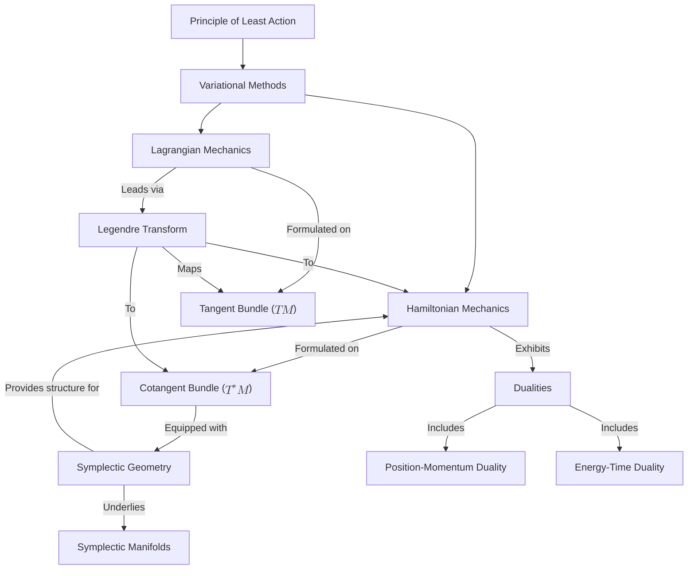

# Unveiling the Geometric Foundations of Classical Mechanics: From the Principle of Least Action to Symplectic Dualities
* * *

--- Discovering the Elegance of Physics through Geometry and Dualities

# **Introduction**

Classical mechanics has long stood as a pillar of physics, providing profound insights into the motion of objects ranging from celestial bodies to everyday phenomena. Originating with the works of Newton, Euler, and Lagrange, it laid the groundwork for understanding the fundamental laws governing the physical world. However, as the field evolved, it became clear that a deeper, more unifying approach was essential to fully comprehend the complexities of mechanical systems.

One of the most significant advancements in this pursuit is the **principle of least action**. This principle elegantly states that the actual path taken by a mechanical system between two states is the one that extremizes (typically minimizes) the action integral. Far from being a mere mathematical abstraction, the principle of least action encapsulates the entirety of a system's dynamics within a single scalar quantity—the action. It serves as a unifying thread weaving through various formulations of mechanics, from the Newtonian to the Lagrangian and Hamiltonian perspectives.

The motivation for a **geometric exploration** of classical mechanics arises from the desire to understand these formulations within a cohesive and intuitive framework. Geometry, with its emphasis on shapes, structures, and transformations, provides the ideal language for this endeavor. By interpreting physical concepts geometrically, we unlock powerful tools that reveal the underlying symmetries and invariances of mechanical systems.

Historically, the geometric approach has led to profound discoveries. The development of **variational methods** and the calculus of variations allowed mathematicians and physicists to derive the equations of motion from the principle of least action. This not only provided a more general method for tackling mechanical problems but also highlighted the interconnectedness of different areas of physics.

A pivotal concept in this geometric framework is the **Legendre transform**. This mathematical operation facilitates the transition between the Lagrangian and Hamiltonian formulations of mechanics. Geometrically, it bridges the **tangent bundle**—the space of positions and velocities—and the **cotangent bundle**—the space of positions and momenta. This transition is more than a change of variables; it reflects the deep **duality** inherent in classical mechanics, such as that between position and momentum or energy and time.

The exploration of **symplectic geometry** further enhances our understanding of Hamiltonian mechanics. Symplectic manifolds provide the natural setting for the flow of Hamiltonian systems, where the symplectic form encapsulates the conservation laws and fundamental properties of motion. This geometric structure is crucial for the formulation of mechanics in higher dimensions and plays a significant role in modern theoretical physics.

In this document, we aim to delve into these geometric foundations, uncovering how the principle of least action leads us to a richer understanding of classical mechanics through geometry and dualities. We will journey through the historical context to appreciate the evolution of these ideas and systematically build up the mathematical formalism required.

**Topics to be Explored:**

- **The Principle of Least Action:** Understanding its foundational role and how it unifies different mechanical systems.
- **Variational Methods:** Delving into the calculus of variations and its application in deriving equations of motion.
- **Lagrangian Mechanics and the Tangent Bundle:** Examining the geometric interpretation of Lagrangian mechanics within configuration space.
- **Legendre Transform and the Cotangent Bundle:** Exploring the transformation to Hamiltonian mechanics and its geometric significance.
- **Hamiltonian Mechanics and Symplectic Geometry:** Introducing symplectic manifolds and their role in the formulation of Hamilton's equations.
- **Dualities in Mechanics:** Investigating the fundamental relationships between physical quantities and their geometric manifestations.
- **Implications and Applications:** Discussing the broader impact of these concepts on modern physics and their connections to quantum mechanics.

By providing a comprehensive and integrated perspective, this document is designed for experienced educators and researchers who seek a deeper appreciation of the elegance and unity that geometry brings to classical mechanics. The geometric approach not only enriches the theoretical understanding but also enhances problem-solving techniques, offering new avenues for research and teaching in physics.

As we unravel these concepts, we invite you to rediscover classical mechanics not just as a collection of equations and principles but as a harmonious interplay of geometry and physics—a testament to the enduring beauty of the natural world as described through mathematics.

# **2. The Principle of Least Action**

The principle of least action stands as a cornerstone of classical mechanics, providing a unifying framework that elegantly encapsulates the laws governing the motion of physical systems. At its heart, this principle asserts that the actual path taken by a system between two states is the one for which the action integral is stationary (usually a minimum). This concept not only offers profound physical insights but also connects deeply with the geometric structures underlying mechanics.

## **2.1. Historical Development**

The evolution of the principle of least action is a rich tapestry woven through centuries of scientific thought, with contributions from some of the most prominent figures in mathematics and physics.

### **2.1.1. Pierre de Maupertuis**

In the 18th century, **Pierre de Maupertuis** (1698–1759) is often credited with formulating an early version of the principle. Maupertuis introduced the concept of minimizing a quantity he called "action" to explain natural processes. In his work, he proposed that nature operates in such a way that the action is minimized, encapsulated in his **Principle of Least Action**:

> "Nature is thrifty in all its actions."

Maupertuis applied this idea to understand the laws of reflection and refraction, suggesting that light follows the path that minimizes action.

### **2.1.2. Leonhard Euler**

**Leonhard Euler** (1707–1783), a contemporary of Maupertuis, expanded upon this notion by providing mathematical rigor. Euler formalized the concept of action and developed the calculus of variations, a mathematical framework essential for analyzing problems involving optimization of functionals.

In 1744, Euler published "Methodus Inveniendi Lineas Curvas Maximi Minive Proprietate Gaudentes" ("A method for finding curved lines enjoying properties of maximum or minimum"), where he introduced the fundamental equation now known as the **Euler-Lagrange equation**.

### **2.1.3. Joseph-Louis Lagrange**

**Joseph-Louis Lagrange** (1736–1813) further advanced the principle by systematically applying variational methods to mechanics. In his seminal work, "Mécanique Analytique" (1788), Lagrange reformulated classical mechanics without reference to geometric concepts like force and acceleration, instead using generalized coordinates and energies.

Lagrange introduced the **Lagrangian function** $L(q, \dot{q}, t) = T - V$, where $T$ is kinetic energy and $V$ is potential energy. By expressing mechanics in terms of $L$ and applying the principle of stationary action, he derived the equations of motion for a system.

### **2.1.4. William Rowan Hamilton**

**William Rowan Hamilton** (1805–1865) extended the principle into what is now known as **Hamiltonian mechanics**. Hamilton introduced the **Hamiltonian function** $H(q, p, t)$, representing the total energy of the system in terms of coordinates $q$ and conjugate momenta $p$.

Hamilton's formulation emphasized the importance of symplectic geometry and set the stage for the development of quantum mechanics. His work highlighted how the principle of least action could unify optics and mechanics, leading to new insights and mathematical techniques.

### **2.1.5. Legacy and Impact**

The collective contributions of Maupertuis, Euler, Lagrange, and Hamilton established the principle of least action as a fundamental tenet of physics. It has since become a guiding principle not only in classical mechanics but also in fields like quantum mechanics, field theory, and general relativity.

## **2.2. Mathematical Formalism**

To fully appreciate the power of the principle of least action, it is essential to delve into its mathematical foundation. This involves understanding functionals, variational calculus, and the derivation of the Euler-Lagrange equations.

### **2.2.1. The Action Integral**

In classical mechanics, the **action** $S$ is a functional that assigns a real number to a path taken by a system over time. It is defined as the integral of the Lagrangian function along the path:
$$
S[q] = \int_{t_1}^{t_2} L(q(t), \dot{q}(t), t) \, dt,
$$
where:

- $q(t)$ is the generalized coordinate of the system at time $t$.
- $\dot{q}(t) = \frac{dq}{dt}$ is the generalized velocity.
- $[t_1, t_2]$ is the time interval of interest.

The action depends on the entire function $q(t)$, making it a functional rather than a simple function.

### **2.2.2. Physical Significance**

The principle of least action posits that the actual path taken by a system between two states is the one for which the action $S$ is stationary (i.e., the first variation $\delta S$ is zero). This means that small variations around the true path do not lead to a first-order change in the action.

Physically, this principle encapsulates how nature operates in the most "economical" way, balancing kinetic and potential energies to determine the motion of systems.

### **2.2.3. Variational Calculus**

To find the path that makes $S$ stationary, we employ the tools of variational calculus.

#### **2.2.3.1. Functionals and Variations**

A **functional** $S[q]$ assigns a scalar value to a function $q(t)$. A **variation** $\delta q(t)$ is a small change in $q(t)$, subject to the condition that $\delta q(t_1) = \delta q(t_2) = 0$ (fixed endpoints).

The **first variation** $\delta S$ is given by:
$$
\delta S = S[q + \delta q] - S[q] = \int_{t_1}^{t_2} \left( \frac{\partial L}{\partial q} \delta q + \frac{\partial L}{\partial \dot{q}} \delta \dot{q} \right) dt.
$$
Using integration by parts on the term involving $\delta \dot{q}$ and applying the fixed endpoint condition, we obtain:
$$
\delta S = \int_{t_1}^{t_2} \left( \frac{\partial L}{\partial q} - \frac{d}{dt} \left( \frac{\partial L}{\partial \dot{q}} \right) \right) \delta q \, dt.
$$
The term arising from the boundary conditions vanishes due to $\delta q(t_1) = \delta q(t_2) = 0$.

#### **2.2.3.2. Euler-Lagrange Equations**

The requirement that $\delta S = 0$ for arbitrary $\delta q(t)$ leads directly to the **Euler-Lagrange equations**:
$$
\frac{d}{dt} \left( \frac{\partial L}{\partial \dot{q}} \right) - \frac{\partial L}{\partial q} = 0.
$$
These differential equations are the equations of motion for the system.

### **2.2.4. Derivation of the Equations of Motion**

#### **2.2.4.1. Single Degree of Freedom**

Consider a system with a single generalized coordinate $q(t)$. The action is:
$$
S[q] = \int_{t_1}^{t_2} L(q, \dot{q}, t) \, dt.
$$
Applying the variational principle, we find:
$$
\delta S = \int_{t_1}^{t_2} \left( \frac{\partial L}{\partial q} - \frac{d}{dt} \left( \frac{\partial L}{\partial \dot{q}} \right) \right) \delta q \, dt = 0.
$$
Since $\delta q(t)$ is arbitrary, the integrand must vanish identically, yielding the Euler-Lagrange equation.

#### **2.2.4.2. Multiple Degrees of Freedom**

For a system with $n$ generalized coordinates $q^i(t)$, $i = 1, 2, ..., n$, the action becomes:
$$
S[q^1, q^2, ..., q^n] = \int_{t_1}^{t_2} L(q^i, \dot{q}^i, t) \, dt.
$$
Following a similar procedure, we obtain a set of Euler-Lagrange equations:
$$
\frac{d}{dt} \left( \frac{\partial L}{\partial \dot{q}^i} \right) - \frac{\partial L}{\partial q^i} = 0, \quad i = 1, 2, ..., n.
$$

### **2.2.5. Examples**

#### **2.2.5.1. Free Particle**

For a free particle of mass $m$, the Lagrangian is purely kinetic:
$$
L = \frac{1}{2} m \dot{q}^2.
$$
Applying the Euler-Lagrange equation:
$$
\frac{d}{dt} \left( m \dot{q} \right) = 0 \implies m \ddot{q} = 0.
$$
This yields the equation of motion for a free particle moving at constant velocity.

#### **2.2.5.2. Simple Harmonic Oscillator**

For a particle in a harmonic potential, the Lagrangian is:
$$
L = \frac{1}{2} m \dot{q}^2 - \frac{1}{2} k q^2.
$$
The Euler-Lagrange equation becomes:
$$
m \ddot{q} + k q = 0,
$$
describing simple harmonic motion with angular frequency $\omega = \sqrt{\frac{k}{m}}$.

### **2.2.6. Conservation Laws and Symmetries**

The principle of least action naturally leads to conservation laws through **Noether's theorem**, which states that every continuous symmetry of the action corresponds to a conserved quantity.

#### **2.2.6.1. Time Translation Symmetry**

- **Symmetry**: If $L$ does not explicitly depend on time $t$, the action is invariant under time translations.
- **Conserved Quantity**: Energy $E$.

#### **2.2.6.2. Spatial Translation Symmetry**

- **Symmetry**: If $L$ does not explicitly depend on a coordinate $q$, the action is invariant under translations in that coordinate.
- **Conserved Quantity**: Momentum $p$.

#### **2.2.6.3. Rotational Symmetry**

- **Symmetry**: If $L$ is invariant under rotations, the action remains unchanged.
- **Conserved Quantity**: Angular momentum $L$.

### **2.2.7. Advantages of the Action Principle**

- **Unified Framework**: Provides a single principle from which all equations of motion can be derived.
- **Generalization to Fields**: Extends naturally to classical fields and relativistic mechanics.
- **Quantum Mechanics Foundation**: Forms the basis for the path integral formulation of quantum mechanics.

### **2.2.8. Connection to Geometry**

While the traditional formulation focuses on functions and their variations, the principle of least action sets the stage for a geometric interpretation of mechanics. By considering the space of all possible paths and identifying the true path as the one for which the action is stationary, we begin to see the emergence of geometric structures that become more explicit in advanced formulations like Hamiltonian mechanics and symplectic geometry.

## **2.3. Conclusion**

**In Summary**, the principle of least action is a profound and encompassing principle that not only predicts the behavior of mechanical systems but also reveals the underlying unity of physical laws. Its development through the works of Maupertuis, Euler, Lagrange, and Hamilton reflects a journey toward deeper understanding and abstraction, culminating in a formalism that is both powerful and elegant. The mathematical framework provided by variational calculus and the Euler-Lagrange equations facilitates the analysis of a vast array of physical systems, making the principle of least action an indispensable tool in theoretical physics.

# 3. Variational Methods in Mechanics

Classical mechanics is fundamentally grounded in the principle of least action, which asserts that the dynamics of a system can be determined by finding the path that extremizes (typically minimizes) the action functional. To explore these extremal paths, we employ variational methods—a collection of mathematical techniques that analyze how small changes in functions affect the value of functionals. This section delves into the calculus of variations, the mathematical backbone of variational methods, and demonstrates its application to mechanical systems.

## 3.1. Fundamentals of the Calculus of Variations

The calculus of variations is a field of mathematical analysis that deals with optimizing functionals, which are mappings from a space of functions to the real numbers. Unlike standard calculus, which focuses on functions of finite-dimensional variables, the calculus of variations considers variations of functions themselves.

### 3.1.1. Functionals and Their Variations

A **functional** $\mathcal{J}[y]$ assigns a real number to a function $y(x)$. For example, consider the functional:
$$
\mathcal{J}[y] = \int_{x_1}^{x_2} F(x, y(x), y'(x)) \, dx,
$$
where $F$ is a function of $x$, $y(x)$, and the derivative $y'(x)$. The goal is to find the function $y(x)$ that makes $\mathcal{J}[y]$ stationary (i.e., a minimum, maximum, or saddle point).

A **variation** $\delta y(x)$ represents an infinitesimal change in the function $y(x)$:
$$
y(x) \rightarrow y(x) + \varepsilon \eta(x),
$$
where $\varepsilon$ is a small parameter and $\eta(x)$ is an arbitrary differentiable function that vanishes at the endpoints ($\eta(x_1) = \eta(x_2) = 0$) to satisfy fixed boundary conditions.

### 3.1.2. Functional Derivatives and Stationary Action

The **variation of the functional** $\delta \mathcal{J}$ due to $\delta y(x)$ is given by:
$$
\delta \mathcal{J} = \mathcal{J}[y + \varepsilon \eta] - \mathcal{J}[y] = \varepsilon \int_{x_1}^{x_2} \left( \frac{\partial F}{\partial y} \eta + \frac{\partial F}{\partial y'} \eta' \right) dx + \mathcal{O}(\varepsilon^2).
$$
Integrating the second term by parts and applying the boundary conditions yields:
$$
\delta \mathcal{J} = \varepsilon \int_{x_1}^{x_2} \left( \frac{\partial F}{\partial y} - \frac{d}{dx} \frac{\partial F}{\partial y'} \right) \eta(x) \, dx.
$$
For $\mathcal{J}[y]$ to be stationary for arbitrary $\eta(x)$, the **Euler-Lagrange equation** must be satisfied:
$$
\frac{\partial F}{\partial y} - \frac{d}{dx} \left( \frac{\partial F}{\partial y'} \right) = 0.
$$
This differential equation determines the function $y(x)$ that extremizes the functional $\mathcal{J}[y]$.

### 3.1.3. Concept of Stationary Action in Mechanics

In mechanics, the action $S$ is a functional defined as:
$$
S[q] = \int_{t_1}^{t_2} L(q(t), \dot{q}(t), t) \, dt,
$$
where $L$ is the Lagrangian of the system, $q(t)$ the generalized coordinates, and $\dot{q}(t)$ the generalized velocities. Applying the calculus of variations to $S[q]$, we find that the stationary action principle ($\delta S = 0$) leads to the Euler-Lagrange equations:
$$
\frac{\partial L}{\partial q^i} - \frac{d}{dt} \left( \frac{\partial L}{\partial \dot{q}^i} \right) = 0,
$$
for each generalized coordinate $q^i$. These equations are the equations of motion for the system.

## 3.2. Applications to Mechanical Systems

The power of variational methods becomes evident when applied to specific problems. Here, we explore two classic examples: the brachistochrone problem and geodesic motion.

### 3.2.1. The Brachistochrone Problem

**Problem Statement:**

Determine the curve between two points $A$ and $B$ (with $B$ lower than $A$) along which a particle slides frictionlessly under gravity in the least time.

**Formulation:**

Let the curve be described by $y(x)$, with $y_A = y(x_A)$ and $y_B = y(x_B)$. The time $T$ taken to traverse the curve is:
$$
T = \int_{x_A}^{x_B} \frac{ds}{v},
$$
where $ds = \sqrt{dx^2 + dy^2}$ is the arc length element, and $v$ is the speed of the particle. Applying conservation of energy:
$$
\frac{1}{2} m v^2 = m g y_0 - m g y,
$$
where $y_0$ is the initial height and $y \leq y_0$. Solving for $v$:
$$
v = \sqrt{2 g (y_0 - y)}.
$$
Substituting back into $T$:
$$
T = \int_{x_A}^{x_B} \frac{\sqrt{dx^2 + dy^2}}{\sqrt{2 g (y_0 - y)}}.
$$
This integral represents the functional to be minimized.

**Application of the Calculus of Variations:**

Let $y$ be a function of $x$, and set:
$$
F(y, y') = \frac{\sqrt{1 + y'^2}}{\sqrt{2 g (y_0 - y)}}.
$$
The Euler-Lagrange equation becomes:
$$
\frac{\partial F}{\partial y} - \frac{d}{dx} \left( \frac{\partial F}{\partial y'} \right) = 0.
$$
Due to the complexity of $F$, solving this directly is challenging. However, note that $F$ does not explicitly depend on $x$, allowing us to use the **Beltrami identity**:
$$
F - y' \frac{\partial F}{\partial y'} = C,
$$
where $C$ is a constant. Substituting $F$ and simplifying, we find that the curve satisfying the brachistochrone problem is a cycloid described parametrically by:
$$
\begin{aligned}
x(\theta) &= x_0 + R (\theta - \sin \theta), \\
y(\theta) &= y_0 - R (1 - \cos \theta),
\end{aligned}
$$
where $R$ is a constant related to $C$, and $0 \leq \theta \leq \theta_1$.

**Physical Insight:**

The cycloid provides the path of quickest descent, illustrating how variational methods can reveal optimal paths dictated by the physics of the problem.

### 3.2.2. Geodesic Motion on a Surface

**Problem Statement:**

Find the shortest path (geodesic) between two points on a surface defined by a metric.

**Formulation:**

Consider a surface with a line element (metric):
$$
ds^2 = E(u, v) du^2 + 2F(u, v) du \, dv + G(u, v) dv^2,
$$
where $(u, v)$ are coordinates on the surface. The length of a path $C$ is:
$$
S[C] = \int_{C} ds = \int_{a}^{b} \sqrt{E \left( \frac{du}{dt} \right)^2 + 2F \left( \frac{du}{dt} \right) \left( \frac{dv}{dt} \right) + G \left( \frac{dv}{dt} \right)^2 } \, dt.
$$
We seek the functions $u(t)$ and $v(t)$ that minimize $S[C]$.

**Application of the Calculus of Variations:**

Define the integrand $L(u, v, \dot{u}, \dot{v})$ as:
$$
L = \sqrt{E \dot{u}^2 + 2F \dot{u} \dot{v} + G \dot{v}^2}.
$$
The Euler-Lagrange equations for $u(t)$ and $v(t)$ are:
$$
\frac{d}{dt} \left( \frac{\partial L}{\partial \dot{u}} \right) - \frac{\partial L}{\partial u} = 0, \quad \frac{d}{dt} \left( \frac{\partial L}{\partial \dot{v}} \right) - \frac{\partial L}{\partial v} = 0.
$$

**Example: Geodesics on a Sphere**

For a sphere of radius $R$, the metric in spherical coordinates ($\theta, \phi$) is:
$$
ds^2 = R^2 d\theta^2 + R^2 \sin^2 \theta \, d\phi^2.
$$
The Lagrangian becomes:
$$
L = R \sqrt{ \dot{\theta}^2 + \sin^2 \theta \, \dot{\phi}^2 }.
$$
Since $L$ does not explicitly depend on $\phi$, the corresponding conjugate momentum is conserved:
$$
p_{\phi} = \frac{\partial L}{\partial \dot{\phi}} = \frac{R^2 \sin^2 \theta \, \dot{\phi}}{L} = \text{constant}.
$$
This conservation allows us to reduce the problem to a single variable and solve for the geodesic paths (great circles).

**Physical Insight:**

Geodesics represent the paths of shortest distance, and in mechanics, they can describe natural motion in curved spaces, such as the trajectory of a free particle in general relativity.

## **3.3. Conclusion**

By applying variational methods to these classical problems, we gain not only mathematical solutions but also deeper physical understanding. The calculus of variations reveals how the principles of least action and minimality underpin the behavior of mechanical systems, guiding particles along optimal paths determined by the interplay of geometry and dynamics.

# **4. Lagrangian Mechanics and the Tangent Bundle**

Classical mechanics, at its core, describes how physical systems evolve over time based on their initial conditions and the forces acting upon them. The Lagrangian formulation provides a powerful framework for this description, emphasizing the roles of energy differences and variational principles. To fully appreciate the elegance and depth of Lagrangian mechanics, it is essential to examine it from a geometric standpoint using the concept of the **tangent bundle**. This approach not only enriches our understanding of the mechanics but also lays the groundwork for more advanced topics in physics and mathematics.

## **4.1. Geometry of Configuration Space**

**Writing Goal:** Describe the structure of configuration space and its tangent spaces.

At the heart of classical mechanics lies the concept of **configuration space**, a mathematical construct that represents all possible positions—or configurations—of a mechanical system. To rigorously define and work within this space, we employ the language of differential geometry, particularly the concepts of **manifolds**, **charts**, and **tangent spaces**.

### **4.1.1. Manifolds and Charts**

A **manifold** $M$ is a mathematical space that, on a small scale, resembles Euclidean space and allows for a consistent definition of concepts like continuity, differentiability, and curvature. More formally, an $n$-dimensional manifold is a topological space where each point has a neighborhood that is homeomorphic (topologically equivalent) to an open subset of $\mathbb{R}^n$.

To work on manifolds, we use **charts** or **coordinate maps**. A chart $(U, \varphi)$ consists of an open subset $U \subset M$ and a homeomorphism $\varphi: U \rightarrow V \subset \mathbb{R}^n$, where $V$ is an open subset of $\mathbb{R}^n$. The collection of all charts that cover $M$ forms an **atlas**, providing a way to navigate and perform calculations on the manifold.

In the context of mechanics, the configuration space $M$ represents all possible positions $q$ of the system. For a system with $N$ degrees of freedom, $M$ is an $N$-dimensional manifold. Each point $q \in M$ specifies a unique configuration.

### **4.1.2. Tangent Spaces**

At each point $q \in M$, we can define a **tangent space** $T_q M$, which intuitively represents all possible directions in which one can tangentially pass through $q$. Formally, the tangent space is a vector space consisting of tangent vectors at $q$, capturing the idea of velocities at that point.

A tangent vector $\dot{q} \in T_q M$ can be defined in several equivalent ways:

1. **As a Velocity Vector:** If $\gamma(t)$ is a smooth curve on $M$ with $\gamma(0) = q$, then the derivative $\dot{\gamma}(0)$ is a tangent vector at $q$.

2. **As a Derivation:** A tangent vector $v \in T_q M$ can be viewed as a linear map $v: C^\infty(M) \rightarrow \mathbb{R}$ satisfying the Leibniz rule:
   $$
   v(fg) = v(f)g(q) + f(q)v(g),
   $$
   for all smooth functions $f, g$ on $M$.

3. **Using Coordinates:** In a chart $(U, \varphi)$ with coordinates $q^i$, a tangent vector $v \in T_q M$ can be expressed as:
   $$
   v = v^i \frac{\partial}{\partial q^i} \Big|_q,
   $$
   where $v^i$ are the components of $v$.

### **4.1.3. The Tangent Bundle**

The **tangent bundle** $TM$ is the union of all tangent spaces at every point in $M$:
$$
TM = \bigcup_{q \in M} T_q M.
$$
It is a $2N$-dimensional manifold when $M$ is $N$-dimensional. Each element of $TM$ is a pair $(q, \dot{q})$, where $q \in M$ and $\dot{q} \in T_q M$.

In mechanics, the tangent bundle serves as the **state space** for Lagrangian mechanics. Each point $(q, \dot{q})$ in $TM$ represents a possible state of the system, specifying both its configuration and the rate at which it is changing—its velocity.

### **4.1.4. Velocities as Tangent Vectors**

Interpreting velocities as tangent vectors is natural within this geometric framework:

- **Physical Interpretation:** The velocity $\dot{q}$ at point $q$ describes how the system moves through configuration space $M$.
- **Mathematical Representation:** In local coordinates $q^i$, the velocity components $\dot{q}^i$ serve as the components of the tangent vector $\dot{q} \in T_q M$.

This interpretation allows us to leverage the rich structure of differential geometry to analyze the motion of mechanical systems, treating velocities as geometric objects that transform appropriately under coordinate changes.

## **4.2. Euler-Lagrange Equations Revisited**

**Writing Goal:** Derive the equations of motion using geometric concepts.

The **Euler-Lagrange equations** form the backbone of Lagrangian mechanics, providing the equations of motion for a system derived from a variational principle. By re-expressing these equations using the language of the tangent bundle and differential geometry, we gain deeper insights into their structure and significance.

### **4.2.1. The Lagrangian Function on the Tangent Bundle**

The **Lagrangian** $L$ is a function defined on the tangent bundle $TM$:
$$
L: TM \rightarrow \mathbb{R}, \quad (q, \dot{q}) \mapsto L(q, \dot{q}).
$$
It encapsulates the dynamics of the system, typically expressed as the difference between kinetic and potential energies:
$$
L(q, \dot{q}) = T(q, \dot{q}) - V(q).
$$

- **Kinetic Energy $T(q, \dot{q})$:** Often a quadratic form in velocities, representing the energy due to motion.
- **Potential Energy $V(q)$:** A function of positions, representing the stored energy due to configuration.

### **4.2.2. Action Functional and Variational Principle**

The **action functional** $S$ assigns a real number to each possible path $q(t)$ of the system over a time interval $[t_0, t_1]$:
$$
S[q] = \int_{t_0}^{t_1} L(q(t), \dot{q}(t)) \, dt.
$$
The **principle of least action** states that the actual path taken by the system is the one that makes $S$ stationary (i.e., a local minimum, maximum, or saddle point) under variations of $q(t)$.

### **4.2.3. Derivation of the Euler-Lagrange Equations**

To derive the Euler-Lagrange equations, we consider a family of smooth curves $q_\epsilon(t)$ parameterized by $\epsilon$, such that:

- $q_0(t)$ is the actual path.
- $q_\epsilon(t) = q_0(t) + \epsilon \eta(t)$, where $\eta(t)$ is a smooth variation satisfying $\eta(t_0) = \eta(t_1) = 0$.

The variation of the action is:
$$
\delta S = \left. \frac{d}{d\epsilon} S[q_\epsilon] \right|_{\epsilon=0} = \int_{t_0}^{t_1} \left( \frac{\partial L}{\partial q^i} \delta q^i + \frac{\partial L}{\partial \dot{q}^i} \delta \dot{q}^i \right) dt.
$$
Integrating the second term by parts and using $\delta q^i(t_0) = \delta q^i(t_1) = 0$, we get:
$$
\delta S = \int_{t_0}^{t_1} \left( \frac{\partial L}{\partial q^i} - \frac{d}{dt} \frac{\partial L}{\partial \dot{q}^i} \right) \delta q^i \, dt.
$$
For $\delta S = 0$ for arbitrary $\delta q^i$, the integrand must vanish:
$$
\frac{d}{dt} \frac{\partial L}{\partial \dot{q}^i} - \frac{\partial L}{\partial q^i} = 0.
$$
These are the **Euler-Lagrange equations**, which describe the dynamics of the system.

### **4.2.4. Geometric Interpretation on the Tangent Bundle**

From a geometric perspective, the Euler-Lagrange equations describe how the system's trajectory moves through the tangent bundle $TM$:

- **Flow on $TM$:** The motion of the system corresponds to a curve $(q(t), \dot{q}(t))$ in $TM$.
- **Contact Structure:** The Lagrangian $L$ defines a **contact structure** on $TM$, specifying allowable directions for the system's evolution.
- **Legendre Transform and Fiber Bundles:** Although the Legendre transform primarily relates to the transition to Hamiltonian mechanics, within the Lagrangian framework, it helps define the mapping between velocities and momenta:
  $$
  p_i = \frac{\partial L}{\partial \dot{q}^i}.
  $$
  This mapping remains within the tangent bundle context until we consider the full transition to the cotangent bundle in Hamiltonian mechanics.

### **4.2.5. Example: Simple Pendulum**

Consider a simple pendulum of length $l$ and mass $m$ moving under gravity.

- **Configuration Space $M$:** The circle $S^1$, representing angles $\theta$.
- **Tangent Bundle $TM$:** Pairs $(\theta, \dot{\theta})$.

**Lagrangian:**
$$
L(\theta, \dot{\theta}) = T - V = \frac{1}{2} m l^2 \dot{\theta}^2 - m g l (1 - \cos \theta).
$$

**Euler-Lagrange Equation:**
$$
\frac{d}{dt} \left( \frac{\partial L}{\partial \dot{\theta}} \right) - \frac{\partial L}{\partial \theta} = 0 \implies m l^2 \ddot{\theta} + m g l \sin \theta = 0.
$$
Simplifying:
$$
\ddot{\theta} + \frac{g}{l} \sin \theta = 0.
$$
This equation describes the motion of the pendulum, derived within the geometric framework of the tangent bundle.

### **4.2.6. Advantages of the Geometric Approach**

- **Coordinate Independence:** The geometric formulation does not depend on a specific choice of coordinates, making the equations covariant under coordinate transformations.
- **Intrinsic Understanding:** By considering velocities as geometric objects (tangent vectors), we gain an intrinsic understanding of the system's motion.
- **Foundation for Advanced Topics:** This perspective is essential for generalizations to relativistic mechanics, field theory, and the formulation of mechanics on more complex manifolds.

## **4.3. Conclusion**

**In Summary**, examining Lagrangian mechanics through the lens of the tangent bundle enriches our comprehension of classical mechanics. It allows us to see the equations of motion not merely as differential equations but as natural consequences of the geometrical structures inherent in the configuration space and its tangent spaces. This approach underscores the unity between physics and geometry, revealing deeper insights into the nature of motion and setting the stage for further exploration into Hamiltonian mechanics and symplectic geometry.

# **5. Legendre Transform and Transition to the Cotangent Bundle**

The Legendre transform serves as a fundamental bridge between the Lagrangian and Hamiltonian formulations of classical mechanics. It not only provides a means to transition from one formalism to the other but also highlights the underlying geometric structures that govern mechanical systems. In this section, we present the Legendre transform as a geometric operation that facilitates the move from the tangent bundle to the cotangent bundle, thereby transitioning from velocities to momenta and from configuration space to phase space.

## **5.1. Mathematical Definition and Properties**

The Legendre transform is a mathematical operation that transforms a function of one variable into a function of a conjugate variable. It is particularly useful in mechanics for changing variables from velocities to momenta. 

### **5.1.1. Definition**

Let $f: \mathbb{R} \rightarrow \mathbb{R}$ be a differentiable convex function. The Legendre transform $f^*$ of $f$ is defined as:
$$
f^*(p) = \sup_{x \in \mathbb{R}} \left( p x - f(x) \right),
$$
where $p$ is the variable conjugate to $x$, and the supremum is taken over all $x$ in the domain of $f$.

In the context of mechanics, consider the Lagrangian $L(q, \dot{q}, t)$, a function of generalized coordinates $q = (q^1, q^2, \dots, q^n)$, generalized velocities $\dot{q} = (\dot{q}^1, \dot{q}^2, \dots, \dot{q}^n)$, and time $t$. The Legendre transform of $L$ with respect to $\dot{q}$ yields the Hamiltonian $H(q, p, t)$:
$$
H(q, p, t) = \sup_{\dot{q}} \left( p_i \dot{q}^i - L(q, \dot{q}, t) \right),
$$
where $p_i$ are the conjugate momenta defined by:
$$
p_i = \frac{\partial L}{\partial \dot{q}^i}.
$$

### **5.1.2. Convex Functions and Invertibility**

For the Legendre transform to be well-defined and invertible, the function $f$ (or $L$ in mechanics) must be convex with respect to the variables being transformed. Convexity ensures that the supremum exists and is unique, which allows for the inversion of the transformation.

In mechanics, convexity of the Lagrangian with respect to $\dot{q}$ implies:
$$
\frac{\partial^2 L}{\partial \dot{q}^i \partial \dot{q}^j} \geq 0,
$$
for all $i, j$. This condition guarantees that the mapping from $\dot{q}^i$ to $p_i$ is invertible, allowing us to express velocities in terms of momenta:
$$
\dot{q}^i = \dot{q}^i(q, p, t).
$$

### **5.1.3. Role in Changing Variables**

The Legendre transform changes the variables of a function from one set to their conjugate counterparts. In mechanics, it transitions the description of a system from dependence on velocities $\dot{q}$ to dependence on momenta $p$. This shift is crucial because it moves us from the tangent bundle $TM$, where velocities reside, to the cotangent bundle $T^*M$, where momenta reside.

This transformation simplifies the equations of motion and exposes the symplectic structure inherent in Hamiltonian mechanics. It allows for the utilization of powerful mathematical techniques in phase space, facilitating analyses of stability, integrability, and conservation laws.

## **5.2. Geometric Interpretation**

The Legendre transform's geometric interpretation reveals how it serves as a map between the tangent and cotangent bundles of the configuration manifold $M$, emphasizing the duality between velocities and momenta.

### **5.2.1. Tangent and Cotangent Bundles**

- **Tangent Bundle ($TM$)**: At each point $q \in M$, the tangent space $T_q M$ consists of all possible velocity vectors $\dot{q}$ at $q$. The collection of all tangent spaces forms the tangent bundle $TM$, which is the natural setting for Lagrangian mechanics.

- **Cotangent Bundle ($T^*M$)**: At each point $q \in M$, the cotangent space $T_q^* M$ consists of all linear functionals (covectors) acting on $T_q M$. This space contains the momenta $p$, and the collection of all cotangent spaces forms the cotangent bundle $T^*M$, the natural setting for Hamiltonian mechanics.

### **5.2.2. Mapping via Legendre Transform**

The Legendre transform maps vectors in $TM$ to covectors in $T^*M$ by associating to each velocity $\dot{q}$ its conjugate momentum $p$:
$$
p_i = \frac{\partial L}{\partial \dot{q}^i}.
$$
This mapping is intrinsically geometric:

- **At Each Point $q \in M$**: The Legendre transform defines a map $\mathcal{L}_q: T_q M \rightarrow T_q^* M$.

- **Fiber-wise Mapping**: The mapping occurs within the fibers over $q$, transforming the tangent vector $\dot{q}$ in $T_q M$ to the cotangent vector $p$ in $T_q^* M$.

### **5.2.3. Duality Between Velocities and Momenta**

The Legendre transform encapsulates the duality between velocities and momenta:

- **Velocities $\dot{q}$**: Elements of the tangent space $T_q M$, representing directions of motion.

- **Momenta $p$**: Elements of the cotangent space $T_q^* M$, representing quantities conserved under symmetries (via Noether's theorem).

- **Pairing**: The natural pairing between $T_q M$ and $T_q^* M$ is given by $p_i \dot{q}^i$, which appears in the Legendre transform and the action integral.

### **5.2.4. Visualization in Phase Space**

In phase space, each point represents a state of the system characterized by positions $q$ and momenta $p$. The Legendre transform facilitates the move from the Lagrangian description in configuration space with velocities to the Hamiltonian description in phase space with momenta.

- **Symplectic Structure**: The cotangent bundle $T^*M$ naturally carries a symplectic structure $\omega = dp_i \wedge dq^i$, essential for Hamiltonian mechanics.

- **Canonical Coordinates**: The variables $(q^i, p_i)$ are canonical coordinates that simplify the equations of motion and make the symplectic geometry explicit.

### **5.2.5. Implications for Mechanics**

- **Equations of Motion**: In the Hamiltonian formalism, the equations of motion are first-order differential equations expressed in terms of $q$ and $p$:
  $$
  \dot{q}^i = \frac{\partial H}{\partial p_i}, \quad \dot{p}_i = -\frac{\partial H}{\partial q^i}.
  $$

- **Conservation Laws**: The symmetries of the Hamiltonian lead to conservation laws through the symplectic structure, with momenta playing a central role.

- **Geometric Insights**: Understanding the Legendre transform geometrically clarifies how different formulations of mechanics are connected and how physical quantities correspond to geometric objects.

## **5.3. Conclusion**

**In summary**, the Legendre transform is more than an algebraic trick; it is a profound geometric operation that transitions mechanics from the tangent bundle to the cotangent bundle, mirroring the shift from velocities to momenta. It highlights the duality inherent in mechanical systems and sets the stage for the rich symplectic geometry that underpins Hamiltonian mechanics. This geometric perspective not only provides deeper insights into classical mechanics but also forms the foundation for advanced theories in physics and mathematics.

# **6. Hamiltonian Mechanics and Symplectic Geometry**

In the evolution of classical mechanics, the transition from the Lagrangian framework to the Hamiltonian formulation marked a significant advancement in both mathematical elegance and physical insight. Hamiltonian mechanics not only reexpresses the equations of motion but also reveals the underlying geometric structures that govern dynamical systems. Central to this geometric perspective is **symplectic geometry**, a branch of differential geometry that provides the natural language for describing the phase space of Hamiltonian systems.

In this section, we delve into the rich interplay between Hamiltonian mechanics and symplectic geometry, exploring how the cotangent bundle emerges as the natural phase space and how the symplectic form encapsulates the fundamental properties of mechanical systems. We will illuminate how Hamilton's equations can be viewed as expressions of symplectic structures and discuss the profound implications of this viewpoint for both classical and modern physics.

## **6.1. The Cotangent Bundle as Phase Space**

The phase space of a mechanical system is the arena in which its states and evolution are described. In Hamiltonian mechanics, the **cotangent bundle** $T^*M$ of the configuration manifold $M$ serves as this phase space. The choice of $T^*M$ is not arbitrary but is grounded in both physical reasoning and geometric necessity.

### **6.1.1. Canonical Coordinates**

Within the cotangent bundle $T^*M$, each point is specified by a pair $(q^i, p_i)$, where:

- $q^i$ are the **generalized coordinates**, representing positions in the configuration space $M$.
- $p_i$ are the **conjugate momenta**, elements of the cotangent space $T_q^*M$, associated with each coordinate $q^i$.

These pairs $(q^i, p_i)$ are called **canonical coordinates**, and they provide a complete description of the system's state in phase space. The choice of momenta as coordinates aligns naturally with physical observables and allows for a seamless integration of geometric and dynamical concepts.

### **6.1.2. The Symplectic Form $\omega = dp_i \wedge dq^i$**

At the heart of the symplectic structure on $T^*M$ is the **symplectic form** $\omega$, defined as:
$$
\omega = \sum_{i=1}^n dp_i \wedge dq^i,
$$
where $\wedge$ denotes the exterior product, and $n$ is the dimension of the configuration manifold $M$. This two-form $\omega$ encodes essential information about the geometric and dynamical properties of the system.

**Properties of the Symplectic Form:**

1. **Non-degeneracy:** For any non-zero tangent vector $v$ at a point in phase space, there exists another tangent vector $u$ such that $\omega(v, u) \neq 0$. This property ensures that $\omega$ pairs vectors in a way that reflects the underlying mechanics.

2. **Closedness:** The symplectic form is closed, meaning $d\omega = 0$, where $d$ is the exterior derivative. This condition implies the conservation of certain quantities and is fundamental to the formulation of Hamiltonian mechanics.

### **6.1.3. Hamilton's Equations as Expressions of Symplectic Structures**

Hamilton's equations of motion are traditionally written as:
$$
\dot{q}^i = \frac{\partial H}{\partial p_i}, \quad \dot{p}_i = -\frac{\partial H}{\partial q^i},
$$
where $H(q^i, p_i, t)$ is the Hamiltonian function representing the total energy of the system (assuming conservative forces). These equations can be elegantly expressed using the symplectic form.

**Symplectic Interpretation:**

- **Hamiltonian Vector Field $X_H$:** Corresponding to the Hamiltonian $H$, there exists a vector field $X_H$ on $T^*M$ defined by:
  $$
  \iota_{X_H} \omega = dH,
  $$
  where $\iota_{X_H}$ denotes the interior product (contraction) of $\omega$ with $X_H$.

- **Equations of Motion:** The integral curves of $X_H$ in phase space represent the evolution of the system. Thus, Hamilton's equations describe how the system moves along these curves, preserving the symplectic structure.

### **6.1.4. Preservation of Symplectic Structure Under Hamiltonian Flow**

A fundamental property of Hamiltonian mechanics is that the flow generated by the Hamiltonian vector field $X_H$ preserves the symplectic form $\omega$. Mathematically, this is expressed as:
$$
\mathcal{L}_{X_H} \omega = 0,
$$
where $\mathcal{L}_{X_H}$ is the Lie derivative along $X_H$. This condition signifies that the phase space volume is conserved over time—a manifestation of **Liouville's theorem**. The preservation of $\omega$ under Hamiltonian flow reflects the time-reversal symmetry and deterministic nature of classical mechanics.

## **6.2. Symplectic Manifolds**

To fully appreciate the geometric foundations of Hamiltonian mechanics, we delve into the concept of **symplectic manifolds**. These manifolds provide the natural setting for the dynamics of Hamiltonian systems and reveal the deep interplay between geometry and mechanics.

### **6.2.1. Definition of Symplectic Manifolds**

A **symplectic manifold** $(M, \omega)$ is a smooth even-dimensional manifold $M$ equipped with a closed, non-degenerate differential two-form $\omega$. Formally, this means:

1. **Non-degeneracy:** The map $\omega^\flat: TM \rightarrow T^*M$ defined by $\omega^\flat(v) = \omega(v, \cdot)$ is an isomorphism at each point in $M$.

2. **Closedness:** $d\omega = 0$, so $\omega$ is a closed form.

These conditions ensure that $\omega$ provides a rich geometric structure, enabling the formulation of Hamiltonian dynamics in terms of differential forms and vector fields.

### **6.2.2. Darboux's Theorem**

A pivotal result in symplectic geometry is **Darboux's theorem**, which states that:

*In the neighborhood of any point on a symplectic manifold $(M, \omega)$, there exist local coordinates $(Q^i, P_i)$ such that the symplectic form $\omega$ takes the standard form:*
$$
\omega = \sum_{i=1}^n dP_i \wedge dQ^i.
$$
This theorem implies that all symplectic manifolds are locally indistinguishable from the standard symplectic structure on $\mathbb{R}^{2n}$. Consequently, the local behavior of Hamiltonian systems is universal, independent of the specific form of $\omega$ or the manifold $M$. Darboux's theorem emphasizes that symplectic geometry lacks local invariants—its richness lies in its global properties.

### **6.2.3. Significance of Non-degeneracy and Closedness**

**Non-degeneracy:**

- Ensures that the pairing between vectors and covectors is perfect, enabling the inversion between velocities and momenta.
- Allows for the definition of a unique Hamiltonian vector field $X_H$ for any given Hamiltonian function $H$.

**Closedness:**

- Implies the conservation laws inherent in Hamiltonian mechanics.
- Leads to the symplectic form being exact in certain cases (i.e., $\omega = d\theta$ for some one-form $\theta$), which is essential for defining the action integral.

### **6.2.4. Examples of Symplectic Manifolds**

1. **Cotangent Bundles $T^*M$:**

   - As discussed, $T^*M$ naturally carries a symplectic structure $\omega = dp_i \wedge dq^i$.
   - The canonical one-form $\theta = p_i dq^i$ satisfies $\omega = -d\theta$.

2. **Complex Projective Spaces:**

   - Certain complex manifolds, equipped with the Kähler form, are symplectic manifolds.
   - Illustrates the connection between symplectic geometry and complex geometry.

3. **Symplectic Submanifolds:**

   - Submanifolds of a symplectic manifold can inherit a symplectic structure under specific conditions, leading to reduced phase spaces in systems with symmetries.

### **6.2.5. Symplectic Transformations and Canonical Transformations**

Transformations that preserve the symplectic form are of particular interest:

- **Symplectomorphisms:** Diffeomorphisms $\phi: M \rightarrow M$ satisfying $\phi^*\omega = \omega$.
- **Canonical Transformations:** In classical mechanics, transformations between canonical coordinates that preserve the form of Hamilton's equations.

These transformations are instrumental in simplifying problems, identifying conserved quantities, and exploring the symmetries of mechanical systems.

## **6.3. Conclusion**

By embracing symplectic geometry, Hamiltonian mechanics transcends its analytical roots to reveal a profound geometric structure underlying classical dynamics. The cotangent bundle $T^*M$ emerges not just as a convenient phase space but as the natural symplectic manifold capturing the essence of mechanical systems. The symplectic form $\omega$ encapsulates the fundamental relationships between positions and momenta, and its properties of non-degeneracy and closedness are not mere mathematical curiosities but are deeply connected to the conservation laws and symmetries of physics.

Understanding Hamilton's equations as expressions of symplectic structures empowers us to see beyond the equations themselves, recognizing the invariant geometric framework that governs all Hamiltonian systems. This perspective not only unifies a vast array of mechanical phenomena but also lays the groundwork for advancements in modern physics, from quantum mechanics to dynamical systems theory.

In the subsequent sections, we will delve deeper into the dualities inherent in mechanics and explore the far-reaching implications of the geometric approach, further unveiling the elegance and unity that symplectic geometry brings to our understanding of the physical world.

# **7. Dualities in Mechanics**

Classical mechanics, at its core, is a tapestry woven from fundamental dualities that reflect the intrinsic symmetries and structures of the physical world. These dualities not only manifest in the mathematical formulations but also provide deep insights into the nature of physical laws. In this section, we delve into two pivotal dualities: the **position-momentum duality** and the **energy-time duality**. Through exploring these pairs, we uncover how they are elegantly encoded within the symplectic structure of phase space, shaping the formulation and evolution of mechanical systems.

## **7.1. Position-Momentum Duality**

### **7.1.1. Canonical Conjugate Variables**

In Hamiltonian mechanics, the state of a mechanical system is described by a set of canonical variables $(q^i, p_i)$, where $q^i$ represents the generalized coordinates (positions) and $p_i$ the corresponding generalized momenta. These pairs are known as **canonical conjugate variables**. The conjugate momentum $p_i$ is defined through the Legendre transform of the Lagrangian $L(q, \dot{q}, t)$:
$$
p_i = \frac{\partial L}{\partial \dot{q}^i}.
$$
This definition establishes a direct relationship between the velocities $\dot{q}^i$ and the momenta $p_i$, encapsulating the dynamical information of the system.

### **7.1.2. Symplectic Structure and Poisson Brackets**

The phase space of a Hamiltonian system is a symplectic manifold $(T^*M, \omega)$, with $T^*M$ being the cotangent bundle of the configuration manifold $M$ and $\omega$ the symplectic form:
$$
\omega = \sum_{i} dp_i \wedge dq^i.
$$
This non-degenerate, closed 2-form provides the geometric foundation for the dynamics. The symplectic form induces a natural pairing between the position and momentum variables, embodying their duality.

The Poisson bracket $\{f, g\}$ of two smooth functions $f$ and $g$ on phase space is defined as:
$$
\{f, g\} = \sum_{i} \left( \frac{\partial f}{\partial q^i} \frac{\partial g}{\partial p_i} - \frac{\partial f}{\partial p_i} \frac{\partial g}{\partial q^i} \right).
$$
The fundamental Poisson brackets between the canonical variables are:
$$
\{q^i, p_j\} = \delta^i_j, \quad \{q^i, q^j\} = 0, \quad \{p_i, p_j\} = 0,
$$
where $\delta^i_j$ is the Kronecker delta. These relations highlight the intertwined nature of positions and momenta in the phase space structure.

### **7.1.3. Hamilton's Equations and Flow on Phase Space**

Hamilton's equations of motion are elegantly expressed using the symplectic structure:
$$
\dot{q}^i = \frac{\partial H}{\partial p_i}, \quad \dot{p}_i = -\frac{\partial H}{\partial q^i},
$$
where $H(q, p, t)$ is the Hamiltonian function representing the total energy of the system. These first-order differential equations describe the flow of the system's state in phase space along trajectories that preserve the symplectic structure—symplectomorphisms.

### **7.1.4. Geometric Interpretation of Position-Momentum Duality**

The position-momentum duality is geometrically manifested in the cotangent bundle $T^*M$:

- **Cotangent Vectors as Momenta**: At each point $q \in M$, the cotangent space $T_q^*M$ consists of linear functionals (covectors) acting on the tangent space $T_qM$. The momentum $p_i$ is a cotangent vector, encoding how infinitesimal displacements in position affect the action.
- **Symplectic Pairing**: The symplectic form $\omega$ provides a bilinear pairing between vectors and covectors, reinforcing the duality.
- **Canonical One-Form**: The Liouville 1-form $\theta = \sum_{i} p_i dq^i$ leads to the symplectic form via $\omega = -d\theta$, indicating how the structure of phase space is built upon this fundamental pairing.

### **7.1.5. Implications for Mechanics**

This duality has profound consequences:

- **Quantization**: In quantum mechanics, the position and momentum operators satisfy commutation relations reflecting the classical Poisson brackets:
  $$
  [\hat{q}^i, \hat{p}_j] = i\hbar \delta^i_j.
  $$

- **Uncertainty Principle**: The Heisenberg uncertainty principle emerges from this fundamental duality:
  $$
  \Delta q^i \Delta p_i \geq \frac{\hbar}{2}.
  $$

- **Fourier Transform**: The position and momentum representations of quantum states are related via the Fourier transform, embodying the duality in functional space.

## **7.2. Energy-Time Duality**

While the position-momentum duality is prominently featured in classical mechanics, the energy-time duality is more subtle but equally significant. Unlike positions and momenta, time is not an operator in classical mechanics but serves as an independent parameter. However, the interplay between energy and time reveals deep insights into the system's dynamics.

### **7.2.1. Action-Angle Variables**

In integrable systems, one can introduce **action-angle variables** $(J_i, \theta^i)$, where:

- $J_i$ are the action variables, conserved quantities associated with the system's motion.
- $\theta^i$ are the angle variables, cyclic coordinates increasing linearly with time.

The action variables are defined as:
$$
J_i = \oint p_i \, dq^i,
$$
where the integral is taken over a complete period of motion. This formulation separates the dynamics into conserved quantities and periodic motions, highlighting the energy-time relationship.

### **7.2.2. Hamilton-Jacobi Equation**

The Hamilton-Jacobi equation offers a bridge between classical mechanics and wave mechanics. It is given by:
$$
H\left(q^i, \frac{\partial S}{\partial q^i}, t\right) + \frac{\partial S}{\partial t} = 0,
$$
where $S(q, t)$ is Hamilton's principal function (the action). Solutions to this equation allow for the determination of the system's evolution by treating the action as a generating function.

**Implications for Energy-Time Duality:**

- **Time Evolution from Energy**: The partial derivative $\partial S / \partial t$ relates energy to the rate of change of action with respect to time, indicating how energy governs temporal evolution.
- **Quantum Analogy**: In quantum mechanics, the Hamilton-Jacobi equation corresponds to the eikonal approximation, and its full counterpart is the Schrödinger equation, where energy and time are also connected through the wavefunction's phase evolution.

### **7.2.3. Phase Space Flow and Time**

Energy conservation plays a critical role in the system's temporal behavior:

- **Conservation Laws**: If the Hamiltonian does not explicitly depend on time ($\partial H / \partial t = 0$), energy is conserved, and the flow in phase space preserves energy levels.
- **Time as a Parameter**: Time evolution in Hamiltonian mechanics is generated by the Hamiltonian through its role as the system's energy function.

### **7.2.4. Canonical Transformations and Time-Dependent Hamiltonians**

When dealing with time-dependent Hamiltonians or performing canonical transformations involving time, the energy-time duality becomes more apparent:

- **Extended Phase Space**: One can consider an extended phase space where time $t$ and energy $E$ are treated as conjugate variables, augmenting the symplectic structure.
- **Generating Functions with Time**: Time-dependent generating functions $F(q, P, t)$ can lead to new Hamiltonians $K$ that include terms like $-\partial F / \partial t$, modifying the energy landscape and reflecting the energy-time interplay.

### **7.2.5. Classical-Quantum Correspondence**

The energy-time duality in classical mechanics sets the stage for its quantum mechanical counterpart:

- **Time-Energy Uncertainty Principle**: Though not an uncertainty principle in the strict operator sense, it suggests a fundamental limit on the precision with which energy and timing of events can be known:
  $$
  \Delta E \Delta t \gtrsim \hbar.
  $$

- **Spectral Analysis**: The energy spectrum of a system influences the time evolution of its quantum states, demonstrating the inseparability of energy and time in determining dynamical behavior.

## **7.3. Conclusion**

**In Summary**, the dualities of position-momentum and energy-time are woven into the very fabric of classical mechanics through the symplectic structure of phase space. The position-momentum duality is explicit and directly encoded in the symplectic form, governing the fundamental relationships and evolution equations of mechanical systems. The energy-time duality, while more implicit, emerges through integrable systems, the Hamilton-Jacobi formulation, and considerations of time-dependent transformations. Together, these dualities reveal the deep geometric and physical symmetries that underlie classical mechanics, providing a seamless connection to modern theoretical constructs and quantum mechanics.

# **8. Implications and Applications**

The geometric perspective of classical mechanics, rooted in the principle of least action and articulated through symplectic geometry, extends far beyond a mere reformulation of Newtonian mechanics. It provides profound insights into the underlying structure of physical laws and offers powerful tools that have significantly influenced modern physics. This section explores the broader significance of this geometric framework, highlighting its impact on advanced topics such as canonical transformations, symplectic maps, and the foundations of quantum mechanics.

## **8.1. Canonical Transformations and Symplectic Maps**

**Writing Goal:** Present the importance of transformations preserving symplectic structure.

In Hamiltonian mechanics, the phase space of a mechanical system is endowed with a symplectic structure, characterized by the symplectic form $\omega = dp_i \wedge dq^i$. This structure is not merely a mathematical abstraction; it encapsulates the fundamental Poisson brackets and dictates the evolution of the system through Hamilton's equations. Transformations that preserve this symplectic structure are known as **canonical transformations**, and they play a crucial role in simplifying mechanical problems and uncovering conserved quantities.

### **8.1.1. Definition of Canonical Transformations**

A canonical transformation is a change of coordinates in phase space $(q^i, p_i) \rightarrow (Q^i, P_i)$ that preserves the form of Hamilton's equations. Mathematically, this means that the new coordinates $(Q^i, P_i)$ also satisfy Hamilton's equations with a possibly new Hamiltonian $K(Q,P,t)$. The essential requirement is that the transformation preserves the symplectic form:
$$
\omega = dp_i \wedge dq^i = dP_i \wedge dQ^i.
$$
This preservation ensures that the fundamental Poisson brackets remain invariant:
$$
\{ Q^i, P_j \} = \delta^i_j.
$$

### **8.1.2. Generating Functions**

Canonical transformations can be systematically constructed using **generating functions**. These are functions that depend on a mix of old and new variables and encapsulate the relationship between them. There are four standard types of generating functions, classified based on their dependence on the variables:

1. **First Type:** $F_1(q, Q, t)$
2. **Second Type:** $F_2(q, P, t)$
3. **Third Type:** $F_3(p, Q, t)$
4. **Fourth Type:** $F_4(p, P, t)$

For example, using a generating function of the second type $F_2(q, P, t)$, the canonical transformation is defined by:
$$
p_i = \frac{\partial F_2}{\partial q^i}, \quad Q^i = \frac{\partial F_2}{\partial P_i}.
$$
These equations establish the link between the old and new variables, ensuring the transformation is canonical.

### **8.1.3. Simplifying Mechanical Problems**

Canonical transformations are powerful tools for simplifying Hamiltonian systems, particularly in the search for integrable solutions or in the application of perturbation theory. By choosing an appropriate generating function, one can transform a complex Hamiltonian into a simpler form, possibly even reducing it to one where the equations of motion can be solved by quadrature.

An important application is in the process of **action-angle variables** for integrable systems. Through canonical transformation, the Hamiltonian is expressed in terms of actions $J_i$ (constants of motion) and angles $\theta^i$ (cyclic coordinates). The transformed Hamiltonian depends only on the actions:
$$
H = H(J),
$$
and Hamilton's equations simplify to:
$$
\dot{J}_i = -\frac{\partial H}{\partial \theta^i} = 0, \quad \dot{\theta}^i = \frac{\partial H}{\partial J_i}.
$$
This reveals the conservation of actions and linear evolution of angles, greatly simplifying the analysis of the system's dynamics.

### **8.1.3. Symplectic Maps**

Canonical transformations are the finite counterpart of infinitesimal symplectomorphisms generated by Hamiltonian flows. In the language of differential geometry, canonical transformations are **symplectic maps**: diffeomorphisms of phase space that preserve the symplectic form.

The group of symplectic diffeomorphisms forms the **symplectic group**, which plays a fundamental role in the study of dynamical systems. Symplectic maps preserve the phase space volume due to Liouville's theorem, a critical result in statistical mechanics and ergodic theory.

### **8.1.4. Illustration: Harmonic Oscillator**

Consider the one-dimensional harmonic oscillator with Hamiltonian:
$$
H(q, p) = \frac{1}{2m}p^2 + \frac{1}{2} m \omega^2 q^2.
$$
Using a generating function of the second type:
$$
F_2(q, P) = \frac{1}{2} m \omega q^2 \cot \phi - q P \csc \phi,
$$
where $\phi$ is a constant parameter, we obtain a canonical transformation to new variables $(Q, P)$ that can simplify the analysis of the oscillator's dynamics.

## **8.2. Pathways to Quantum Mechanics**

**Writing Goal:** Connect classical geometric concepts to quantum theory.

The geometric structures underlying classical mechanics, particularly symplectic geometry, form the bedrock upon which quantum mechanics is constructed. The transition from classical to quantum mechanics is not merely a change in equations but involves a profound shift in the understanding of physical reality, where classical phase space structures are quantized.

### **8.2.1. Quantization Procedures**

**Canonical Quantization** is one of the primary methods for transitioning from classical to quantum mechanics. The procedure involves promoting classical observables to quantum operators and replacing Poisson brackets with commutators:
$$
\{ q^i, p_j \} \rightarrow \frac{1}{i \hbar} [ \hat{q}^i, \hat{p}_j ] = \delta^i_j.
$$
This correspondence hinges on the symplectic structure of phase space, where the classical variables $q^i$ and $p_i$ become operators acting on a Hilbert space.

**Geometric Quantization** is a more sophisticated approach that aims to systematically construct a quantum theory from a given classical phase space with symplectic structure. The process involves:

1. **Prequantization:** Associating a Hilbert space to the symplectic manifold and representing classical observables as operators.
2. **Polarization:** Selecting a suitable subspace to reduce the infinite degrees of freedom, often through choosing a Lagrangian foliation of phase space.
3. **Quantization:** Constructing the appropriate Hilbert space of physical states and ensuring that the operators satisfy the necessary commutation relations.

Geometric quantization preserves the geometric structures of classical mechanics, providing a direct link between the symplectic manifold $(T^*M, \omega)$ and the quantum theory.

### **8.2.2. The Correspondence Principle**

Niels Bohr's **correspondence principle** states that the behavior of quantum systems must align with classical physics in the limit of large quantum numbers or, equivalently, as $\hbar \rightarrow 0$. This principle ensures continuity between classical and quantum descriptions.

The symplectic structure facilitates this transition by serving as the common geometric framework for both theories. Classical trajectories can be seen as limiting cases of quantum wave packets, and conserved quantities in classical mechanics correspond to symmetries and conservation laws in quantum mechanics via Noether's theorem.

### **8.2.3. Symplectic Geometry in Quantum Mechanics**

The role of symplectic geometry extends into quantum mechanics in several ways:

- **Phase Space Formulation:** In the Wigner-Weyl formulation, quantum mechanics is expressed in phase space, and quantum states are represented by quasi-probability distributions (e.g., Wigner functions). The symplectic structure is essential in defining the star-product and Moyal brackets, which are the quantum analogs of the Poisson bracket.

- **Symmetries and Conservation Laws:** Symplectic transformations correspond to unitary operations in quantum mechanics. The symplectic group underlies the symmetries of quantum systems, influencing selection rules and spectral properties.

- **Path Integral Formulation:** Richard Feynman's path integral approach to quantum mechanics is deeply connected to the principle of least action. The action functional in the exponent of the path integral weighs classical paths, and the symplectic structure influences the interference patterns and contributions of different trajectories.

### **8.2.4. Example: Quantum Harmonic Oscillator**

The quantum harmonic oscillator serves as a paradigmatic example where classical and quantum mechanics intersect. The energy levels are quantized, with energies:
$$
E_n = \hbar \omega \left( n + \frac{1}{2} \right), \quad n = 0, 1, 2, \dots
$$
In the classical limit $n \rightarrow \infty$, the energy spacing becomes negligible relative to the total energy, and the system's behavior approaches that of the classical oscillator.

The creation and annihilation operators $\hat{a}^\dagger$ and $\hat{a}$ satisfy commutation relations derived from the underlying symplectic structure:
$$
[ \hat{a}, \hat{a}^\dagger ] = 1.
$$
These operators facilitate the analysis of quantum states and transitions, reflecting the deep connection between classical symplectic geometry and quantum mechanics.

## **8.3. Conclusion**

The geometric perspective on classical mechanics, centered on the principle of least action and symplectic structures, is not merely an elegant reformulation but a powerful framework that illuminates the path to modern physics. Canonical transformations and symplectic maps provide vital tools for simplifying complex mechanical systems and uncovering conserved quantities, demonstrating the utility of preserving symplectic structure.

Moreover, the symplectic geometry inherent in classical mechanics lays the foundational groundwork for quantum mechanics. Through quantization procedures and the correspondence principle, the transition from the deterministic world of classical trajectories to the probabilistic realm of quantum states is orchestrated by the very geometric structures explored in classical theory. The insights gained from this geometric approach continue to influence contemporary research in theoretical physics, from quantum field theory to string theory, highlighting the enduring significance of symplectic dualities and the principle of least action in our quest to understand the fundamental nature of the universe.

# **9. Conclusion**

In this exploration of the geometric foundations of classical mechanics, we have journeyed from the principle of least action to the rich landscape of symplectic geometry, unveiling the profound connections that underpin the dynamics of physical systems. The principle of least action, serving as the cornerstone of classical mechanics, not only provides a unifying framework for deriving the equations of motion but also reveals the inherent elegance and economy with which nature operates.

By employing variational methods, we have seen how the action integral encapsulates the entirety of a system's dynamics, leading naturally to the Euler-Lagrange equations in the Lagrangian formulation. This approach emphasizes the significance of the configuration space and velocities, framed within the geometric structure of the tangent bundle. The geometric perspective illuminates how physical trajectories correspond to paths that extremize the action, highlighting the deep interplay between physics and geometry.

The **Legendre transform** emerged as a pivotal tool, bridging the Lagrangian and Hamiltonian formulations. This transformation is not merely an algebraic convenience but reflects a fundamental duality between velocities and momenta, effectively mapping the tangent bundle to the cotangent bundle. Through this lens, we transitioned to the Hamiltonian framework, embracing the phase space description of mechanics where positions and momenta coexist as canonical variables.

**Symplectic geometry** provided the mathematical backbone of Hamiltonian mechanics. The cotangent bundle, endowed with a natural symplectic form, offered an ideal setting for exploring the conservation laws and invariance properties of mechanical systems. Hamilton's equations, expressed in terms of symplectic structures, underscored the preservation of the symplectic form under time evolution, embodying the essence of classical dynamics within a geometric framework.

The exploration of **dualities**, particularly between position and momentum as well as energy and time, illuminated the intrinsic relationships inherent in classical mechanics. These dualities are elegantly encapsulated within the symplectic structure, reinforcing the notion that geometry is not merely a mathematical abstraction but a fundamental aspect of physical reality. The canonical conjugate variables and their symplectic relations exemplify how physical quantities are interconnected through underlying geometric principles.

By unifying these concepts, we recognize that the geometric approach offers a cohesive and comprehensive understanding of classical mechanics. It allows us to see beyond the equations and perceive the structural beauty of the physical laws governing motion. This perspective not only enriches our appreciation of classical mechanics but also serves as a foundational platform for further exploration in modern physics.

Looking forward, the geometric insights gained from classical mechanics pave the way toward advanced theories, including quantum mechanics and general relativity. The symplectic structures and dualities we have discussed find echoes in the quantization of physical systems and the geometric formulation of gravitational theories. By continuing to delve into the geometric underpinnings of physical laws, we can deepen our understanding of the universe's fundamental workings, potentially unlocking new discoveries and innovations.

In conclusion, the journey from the principle of least action to symplectic dualities reveals a tapestry of connections that elegantly intertwine physics and geometry. This holistic view underscores the unifying power of the geometric approach, affirming that at the heart of classical mechanics lies a profound simplicity and coherence reflective of the natural world's inherent order and symmetry. By embracing this perspective, we not only honor the legacy of the great thinkers who shaped our understanding but also inspire future endeavors to further unravel the mysteries of the cosmos through the harmonious language of geometry.

# **10. References Encompass**

## **10.1. References**

1. **Lagrange, J. L.** (1788). *Mécanique Analytique*. Chez la Veuve Desaint. Reprinted by Dover Publications (2005).
   - A foundational work introducing the principles of analytical mechanics and the formulation of the Lagrangian framework.

2. **Hamilton, W. R.** (1834). "On a General Method in Dynamics." *Philosophical Transactions of the Royal Society of London*, **124**, 247–308.
   - Hamilton's seminal paper establishing the Hamiltonian formulation of mechanics and introducing the concept of phase space.

3. **Goldstein, H., Poole, C. P., & Safko, J. L.** (2002). *Classical Mechanics* (3rd ed.). Addison-Wesley.
   - A comprehensive textbook covering classical mechanics, including detailed treatments of Lagrangian and Hamiltonian dynamics, variational principles, and canonical transformations.

4. **Arnold, V. I.** (1989). *Mathematical Methods of Classical Mechanics* (2nd ed.). Springer-Verlag.
   - An advanced text exploring the mathematical foundations of classical mechanics using differential geometry and symplectic methods.

5. **Marsden, J. E., & Ratiu, T. S.** (1999). *Introduction to Mechanics and Symmetry: A Basic Exposition of Classical Mechanical Systems* (2nd ed.). Springer-Verlag.
   - Discusses mechanical systems with symmetries using geometric and symplectic approaches, including momentum maps and reduction theory.

6. **Abraham, R., & Marsden, J. E.** (1978). *Foundations of Mechanics* (2nd ed.). Benjamin/Cummings Publishing.
   - A rigorous and comprehensive treatment of mechanics from a geometric perspective, emphasizing the role of symplectic geometry.

7. **Libermann, P., & Marle, C.-M.** (1987). *Symplectic Geometry and Analytical Mechanics*. D. Reidel Publishing Company.
   - Provides an in-depth look at symplectic geometry and its applications to analytical mechanics, including Hamiltonian systems and Poisson manifolds.

8. **Joshi, A. W.** (1997). *Mathematical Physics* (3rd ed.). Wiley Eastern.
   - Covers mathematical methods used in physics, including variational principles, Legendre transforms, and differential geometry.

9. **de León, M., & Rodrigues, P. R.** (1989). *Methods of Differential Geometry in Analytical Mechanics*. North-Holland Publishing.
   - Explores the application of differential geometry to mechanics, focusing on the geometric formulation of Lagrangian and Hamiltonian systems.

10. **Woodhouse, N. M. J.** (1991). *Geometric Quantization* (2nd ed.). Clarendon Press.
    - Discusses the connection between classical and quantum mechanics through the process of geometric quantization, highlighting the role of symplectic manifolds.

11. **Guillemin, V., & Sternberg, S.** (1984). *Symplectic Techniques in Physics*. Cambridge University Press.
    - Introduces symplectic geometry with applications to physics, including classical mechanics and geometric quantization.

12. **Souriau, J.-M.** (1997). *Structure of Dynamical Systems: A Symplectic View of Physics*. Birkhäuser.
    - Provides a comprehensive view of dynamical systems using symplectic geometry, discussing momentum maps and canonical transformations.

13. **Marsden, J. E., & Weinstein, A.** (1974). "Reduction of Symplectic Manifolds with Symmetry." *Reports on Mathematical Physics*, **5**(1), 121–130.
    - Introduces the concept of symplectic reduction in systems with symmetry, an important technique in Hamiltonian mechanics.

14. **Meyer, K. R., Hall, G. R., & Offin, D.** (2009). *Introduction to Hamiltonian Dynamical Systems and the N-Body Problem* (2nd ed.). Springer.
    - Discusses Hamiltonian systems with applications to celestial mechanics and the N-body problem, emphasizing geometric methods.

15. **Cannas da Silva, A.** (2008). *Lectures on Symplectic Geometry* (2nd ed.). Springer-Verlag.
    - An accessible introduction to symplectic geometry, covering fundamental concepts and their applications to mechanics.

16. **Butterfield, J., & Pagonis, C.** (Eds.). (1999). *From Physics to Philosophy*. Cambridge University Press.
    - A collection discussing philosophical aspects of physics, including the foundations of mechanics and the principle of least action.

17. **Hall, B. C.** (2013). *Quantum Theory for Mathematicians*. Springer.
    - Bridges the gap between mathematics and quantum theory, providing insights into the mathematical structures underlying quantum mechanics.

18. **Kibble, T. W. B., & Berkshire, F. H.** (2004). *Classical Mechanics* (5th ed.). Imperial College Press.
    - A textbook covering classical mechanics with chapters on the principle of least action, Hamiltonian mechanics, and canonical transformations.

19. **Leonard, A. E., & Felsager, B.** (2011). *Geometry, Particles, and Fields*. Springer.
    - Explores the geometrical structures in classical field theory and mechanics, including symplectic and differential geometry.

20. **Frankel, T.** (2011). *The Geometry of Physics: An Introduction* (3rd ed.). Cambridge University Press.
    - Provides an extensive overview of the geometric concepts in physics, linking classical mechanics, field theory, and general relativity.

## **10.2. Historical Papers**

1. **Maupertuis, P. L. M. de** (1744). "Accord de différentes lois de la nature qui avaient jusqu'ici paru incompatibles." *Mémoires de l'Académie Royale des Sciences*.
   - One of the earliest formulations of the principle of least action, proposing a unifying principle for natural laws.

2. **Euler, L.** (1744). *Methodus Inveniendi Lineas Curvas Maximi Minimive Proprietate Gaudentes*. Apud Marcum-Michaelem Bousquet.
   - Euler's work on the calculus of variations, laying the groundwork for variational methods in mechanics.

3. **Jacobi, C. G. J.** (1842). "Vorlesungen über Dynamik." In *Gesammelte Werke* (Vol. 2). Berlin: Reimer.
   - Jacobi's lectures on dynamics, introducing important concepts in analytical mechanics and the Hamilton-Jacobi equation.

## **10.3. Contemporary Research Articles**

1. **Marsden, J. E., & West, M.** (2001). "Discrete Mechanics and Variational Integrators." *Acta Numerica*, **10**, 357–514.
   - Discusses the development of discrete analogs of variational principles and their applications in numerical simulations.

2. **Lee, J. M.** (2013). *Introduction to Smooth Manifolds* (2nd ed.). Springer.
   - A comprehensive introduction to smooth manifolds and differential geometry, providing the mathematical foundation for modern mechanics.

3. **Gotay, M. J., Isenberg, J., & Marsden, J. E.** (2004). "Momentum Maps and Classical Relativistic Fields Part I: Covariant Field Theory." *arXiv preprint* arXiv:physics/9801019.
   - Explores the extension of symplectic geometry and momentum maps to field theory, connecting classical mechanics to modern physics.

4. **Arnold, V. I., Kozlov, V. V., & Neishtadt, A. N.** (2006). *Mathematical Aspects of Classical and Celestial Mechanics* (3rd ed.). Springer.
   - Covers advanced topics in classical mechanics, including perturbation theory and stability analysis, with a geometric perspective.

5. **de León, M., & Lacomba, E. A.** (Eds.). (1996). *Symplectic Geometry and Quantization Problems*. Springer.
   - A collection of papers on symplectic geometry and its role in quantization, reflecting contemporary research directions.

## **10.4. Online Resources**

1. **David Tong**. *Lectures on Classical Dynamics*. University of Cambridge. Retrieved from [http://www.damtp.cam.ac.uk/user/tong/dynamics.html](http://www.damtp.cam.ac.uk/user/tong/dynamics.html)
   - Comprehensive lecture notes providing a modern introduction to classical dynamics, including discussions on variational principles and symplectic geometry.

2. **MIT OpenCourseWare**. *Classical Mechanics (8.01)*. Taught by Professor Walter Lewin. Retrieved from [https://ocw.mit.edu/courses/8-01-classical-mechanics-fall-1999/](https://ocw.mit.edu/courses/8-01-classical-mechanics-fall-1999/)
   - Free lecture videos and course materials covering foundational topics in classical mechanics.

3. **Math StackExchange**. Discussions on symplectic geometry and Legendre transforms. Available at [https://math.stackexchange.com/](https://math.stackexchange.com/)
   - An online forum where various concepts related to mechanics and geometry are discussed by a community of mathematicians and physicists.

## **10.5. Further Readings**

1. **Brandon Carter**. (2012). "The Classical Mechanics and Symplectic Geometry of Moving Bodies." *arXiv preprint* arXiv:1205.5857.
   - Explores the interplay between classical mechanics and symplectic geometry in the context of moving bodies and reference frames.

2. **Ketov, S. V.** (1995). *Geometric Methods in Quantum Field Theory and String Theory*. World Scientific.
   - Discusses how geometric concepts are applied in quantum field theory and string theory, building upon classical mechanics foundations.

3. **Hörmander, L.** (1995). *Symplectic Classification of Quadratic Forms, and General Mehler Formulas*. *Mathematical Zeitschrift*, **219**, 413–449.
   - Provides advanced mathematical treatments of symplectic structures and their applications.

## **10.6. Conclusion**

These references encompass a range of materials from classical texts to modern research articles, offering both foundational knowledge and insights into current developments in the field. They are intended to provide readers with resources to deepen their understanding of the geometric structures underlying classical mechanics and to explore further applications in physics and mathematics.

# Appendix A : Core Relationship

## **A.1. Concept Map**



## **A.2. Relationship Table**

| **Core Concept**              | **Related Concepts**                                         | **Relationship Description**                                                                                                 |
|-------------------------------|--------------------------------------------------------------|------------------------------------------------------------------------------------------------------------------------------|
| Principle of Least Action     | Variational Methods, Lagrangian Mechanics, Hamiltonian Mechanics | The foundational principle using variational methods to derive the equations of motion in both formulations.             |
| Variational Methods           | Principle of Least Action, Calculus of Variations            | Mathematical tools used to extremize the action integral, leading to the equations of motion.                                |
| Lagrangian Mechanics          | Principle of Least Action, Tangent Bundle ($TM$, Legendre Transform | Formulated on the tangent bundle; utilizes variational methods; connected to Hamiltonian mechanics via Legendre Transform. |
| Hamiltonian Mechanics         | Principle of Least Action, Cotangent Bundle ($T^*M$), Symplectic Geometry | Formulated on the cotangent bundle; inherently relies on symplectic geometry; related to Lagrangian mechanics through Legendre Transform. |
| Legendre Transform            | Lagrangian Mechanics, Hamiltonian Mechanics, Dualities       | Mathematical operation that transitions from velocities to momenta; bridges Lagrangian and Hamiltonian mechanics; reflects dualities. |
| Tangent Bundle ($TM$)           | Lagrangian Mechanics, Legendre Transform                     | Geometric space of positions and velocities; Lagrangian mechanics is formulated here; mapped to cotangent bundle via Legendre Transform. |
| Cotangent Bundle ($T^*M$)        | Hamiltonian Mechanics, Legendre Transform, Symplectic Manifolds | Geometric space of positions and momenta; Hamiltonian mechanics is formulated here; naturally forms a symplectic manifold. |
| Symplectic Geometry           | Cotangent Bundle ($T^*M$), Hamiltonian Mechanics, Dualities     | Mathematical framework describing the structure of phase space in Hamiltonian mechanics; captures the essence of dualities.  |
| Symplectic Manifolds          | Cotangent Bundle ($T^*M$), Symplectic Geometry                  | Manifolds equipped with a symplectic form; the cotangent bundle is a primary example; foundational for Hamiltonian mechanics. |
| Dualities                     | Legendre Transform, Symplectic Geometry                      | Fundamental pairings like position-momentum and energy-time; manifested through Legendre Transform and symplectic structure.  |
| Position-Momentum Duality     | Hamiltonian Mechanics, Symplectic Geometry, Dualities        | Canonical conjugate variables in phase space; central to Hamiltonian mechanics; exemplifies the symplectic structure.        |
| Energy-Time Duality           | Dualities, Advanced Topics (e.g., Hamilton-Jacobi Theory)    | Reflects deeper relationships in physics; important in the context of action-angle variables and quantum mechanics.          |

## **A.3. Explanation of Interrelationships**

- **Principle of Least Action** is the cornerstone of classical mechanics, asserting that the actual path taken by a system minimizes (or extremizes) the action integral. It is the starting point from which both **Lagrangian Mechanics** and **Hamiltonian Mechanics** are derived using **Variational Methods**.

- **Variational Methods** involve the calculus of variations, providing the mathematical foundation to extremize functionals like the action. These methods lead to the **Euler-Lagrange equations** in Lagrangian mechanics and underpin the transition to Hamiltonian mechanics.

- **Lagrangian Mechanics** is formulated on the **Tangent Bundle ($TM$)**, where the state of the system is described by positions $q$ and velocities $\dot{q}$. The **Lagrangian function** $L(q, \dot{q}, t)$ encapsulates the dynamics of the system.

- The **Legendre Transform** is a key mathematical operation that maps the Lagrangian $L(q, \dot{q}, t)$ to the Hamiltonian $H(q, p, t)$, effectively transitioning from the tangent bundle to the **Cotangent Bundle ($T^*M$)**. This transform reflects the duality between velocities and momenta.

- **Hamiltonian Mechanics** is formulated on the cotangent bundle, where the state of the system is described by positions $q$ and momenta $p$. The cotangent bundle naturally carries a **Symplectic Structure**, making it a **Symplectic Manifold**.

- **Symplectic Geometry** provides the mathematical framework for Hamiltonian mechanics, involving a closed, non-degenerate 2-form called the **symplectic form** $\omega$. This structure is essential for defining canonical transformations and understanding conservation laws.

- **Dualities** such as **Position-Momentum Duality** are inherent in the symplectic structure of phase space. They reflect fundamental physical relationships and are mathematically expressed through Poisson brackets and canonical commutation relations.

- **Energy-Time Duality** is another fundamental duality, more pronounced in advanced topics like the Hamilton-Jacobi theory and quantum mechanics. It highlights the deep connections between energy levels and temporal evolution.

## **A.4. Additional Aids for Understanding**

### **A.4.1. Hierarchical Structure of Concepts**

1. **Foundational Principles**
   - Principle of Least Action
   - Variational Methods

2. **Mechanics Frameworks**
   - Lagrangian Mechanics
     - Formulated on Tangent Bundle ($TM$)
   - Hamiltonian Mechanics
     - Formulated on Cotangent Bundle ($T^*M$)
     - Utilizes Symplectic Geometry

3. **Mathematical Bridges**
   - Legendre Transform
     - Connects Lagrangian and Hamiltonian Mechanics
     - Reflects Dualities

4. **Geometric Structures**
   - Tangent Bundle ($TM$)
   - Cotangent Bundle ($T^*M$)
   - Symplectic Manifolds

5. **Fundamental Dualities**
   - Position-Momentum Duality
   - Energy-Time Duality

### **A.4.2. Flow of Concepts**

- **Principle of Least Action** → **Variational Methods** → **Lagrangian Mechanics** (on **$TM$**) → **Legendre Transform** → **Hamiltonian Mechanics** (on **$T^*M$**) → **Symplectic Geometry** → **Dualities**

## **A.5. Summary**

By visualizing the relationships between these core concepts, readers can see how classical mechanics is built upon a robust geometric foundation. The **principle of least action** serves as the unifying thread, with **variational methods** providing the tools to derive the equations of motion. The **Legendre transform** acts as a bridge between the two main formulations of mechanics, highlighting the duality between positions and momenta.

The **tangent and cotangent bundles** are not just abstract mathematical constructs but are the natural settings for Lagrangian and Hamiltonian mechanics, respectively. **Symplectic geometry** emerges as the essential language for describing the evolution of systems in phase space, encapsulating the conservation laws and symmetries of physics.

Understanding these relationships enhances appreciation of the elegance and coherence of classical mechanics, providing a foundation for further study in advanced topics such as quantum mechanics and symplectic topology.

# Appendix B : Visualize Geometric Framework

## **B.1. Conceptual Diagram**

```plaintext
+-------------------+                      +---------------------+
|                   |                      |                     |
|   Principle of    |    Variational       |    Variational      |
|   Least Action    +--------------------->+      Methods        |
|                   |      Leads to        |                     |
+-------------------+                      +---------------------+
        |
        | Derive                           +---------------------+
        v                                  |                     |
+-------------------+     Legendre         |    Euler-Lagrange   |
|                   |     Transform        |      Equations      |
|    Lagrangian     +--------------------->+     (on $TM$)       |
|    Mechanics      |                      |                     |
|   (on Tangent     |                      +---------------------+
|     Bundle $TM$)  |
+-------------------+
        |
        | Legendre Transform
        v
+-------------------+                      +---------------------+
|                   |                      |                     |
|   Hamiltonian     |    Symplectic        |     Hamilton's      |
|    Mechanics      +--------------------->+      Equations      |
|  (on Cotangent    |      Structure       |     (on $T^*M$)     |
|   Bundle $T^*M$)  |                      |                     |
+-------------------+                      +---------------------+
        |
        | Embodies
        v
+-------------------+                      +---------------------+
|                   |                      |                     |
|    Symplectic     +--------------------->+      Dualities      |
|    Geometry       |   Reveals Deep       | (Position-Momentum, |
|                   |     Dualities        |    Energy-Time)     |
+-------------------+                      +---------------------+

```

## **B.2. Explanation of the Diagram**

- **Principle of Least Action** is the foundational concept that leads to the use of **Variational Methods** in mechanics.

- **Variational Methods** are mathematical techniques that enable the derivation of the **Euler-Lagrange Equations**, which are central to **Lagrangian Mechanics** formulated on the **Tangent Bundle ($TM$)**.

- **Legendre Transform** serves as a bridge that transforms **Lagrangian Mechanics** into **Hamiltonian Mechanics**, transitioning from the tangent bundle to the **Cotangent Bundle ($T^*M$)**.

- **Hamiltonian Mechanics** is underpinned by **Symplectic Geometry**, which provides the **Symplectic Structure** necessary for the formulation of **Hamilton's Equations**.

- **Symplectic Geometry** also reveals fundamental **Dualities** in mechanics, such as the **Position-Momentum Duality** and **Energy-Time Duality**.

## **B.3. Detailed Relationships**

1. **Principle of Least Action ⇒ Variational Methods**

   - The principle states that the actual path taken by a mechanical system minimizes (or extremizes) the action integral.

2. **Variational Methods ⇒ Euler-Lagrange Equations**

   - By applying variational calculus to the action integral, we derive the Euler-Lagrange equations, which govern the dynamics in Lagrangian Mechanics.

3. **Lagrangian Mechanics (on $TM$)**

   - Formulated on the tangent bundle, where the state of the system is described by positions $q$ and velocities $\dot{q}$.

4. **Legendre Transform ⇒ Hamiltonian Mechanics**

   - Converts the Lagrangian $L(q, \dot{q})$ to the Hamiltonian $H(q, p)$ by transitioning from velocities $\dot{q}$ to momenta $p$, moving from the tangent bundle to the cotangent bundle.

5. **Hamiltonian Mechanics (on $T^*M$)**

   - Formulated on the cotangent bundle, with states described by positions $q$ and momenta $p$.

6. **Symplectic Geometry ⇒ Hamilton's Equations**

   - The cotangent bundle $T^*M$ has a natural symplectic structure, and Hamilton's equations express the dynamics preserving this structure.

7. **Symplectic Geometry ⇒ Dualities**

   - The symplectic form encodes the fundamental dual relationships between conjugate variables, revealing the position-momentum and energy-time dualities.

## **B.4. Supplementary Diagram: Relationships among Core Concepts**

```plaintext
          +-----------------------------------------------+
          |                                               |
          |            Principle of Least Action          |
          |                                               |
          +---------------------------+-------------------+
                                      |
                                      v
                         +------------+-------------+
                         |                          |
                         |     Variational Methods  |
                         |                          |
                         +------------+-------------+
                                      |
                         +------------+-------------+
                         |                          |
                         | Euler-Lagrange Equations |
                         |                          |
                         +------------+-------------+
                                      |
                         +------------+-------------+
                         |                          |
                         |    Lagrangian Mechanics  |
                         |      (on Tangent Bundle) |
                         |                          |
                         +------------+-------------+
                                      |
                         Legendre Transform (changes variables)
                                      |
                         +------------+-------------+
                         |                          |
                         |   Hamiltonian Mechanics  |
                         |    (on Cotangent Bundle) |
                         |                          |
                         +------------+-------------+
                                      |
                         +------------+-------------+
                         |                          |
                         |     Symplectic Geometry  |
                         |   (Symplectic Manifolds) |
                         |                          |
                         +------------+-------------+
                                      |
                                      v
                         +------------+-------------+
                         |                          |
                         |        Dualities         |
                         | (Position-Momentum, etc.)|
                         |                          |
                         +--------------------------+

```

## **B.5. Mathematical Relationships**

1. **Legendre Transform**

   - Momentum $p_i = \dfrac{\partial L}{\partial \dot{q}^i}$

   - Hamiltonian $H(q, p) = p_i \dot{q}^i - L(q, \dot{q})$

2. **Euler-Lagrange Equations**

   - $\dfrac{d}{dt} \left( \dfrac{\partial L}{\partial \dot{q}^i} \right) - \dfrac{\partial L}{\partial q^i} = 0$

3. **Hamilton's Equations**

   - $\dot{q}^i = \dfrac{\partial H}{\partial p_i}$

   - $\dot{p}_i = -\dfrac{\partial H}{\partial q^i}$

4. **Symplectic Form**

   - $\omega = dp_i \wedge dq^i$

   - Preserved under Hamiltonian flow.

5. **Poisson Brackets**

   - $\{ q^i, p_j \} = \delta^i_j$

## **B.6. Additional Explanations**

- **Tangent Bundle ($TM$)**: The collection of all possible positions $q$ and velocities $\dot{q}$. It is the natural setting for Lagrangian mechanics.

- **Cotangent Bundle ($T^*M$)**: The collection of all possible positions $q$ and momenta $p$. It provides the phase space for Hamiltonian mechanics with a symplectic structure.

- **Symplectic Geometry**: A branch of differential geometry concerned with symplectic manifolds; structures that are foundational to Hamiltonian mechanics.

- **Dualities**: Pairs of physical quantities that are naturally related through the symplectic structure. For example:

  - **Position-Momentum Duality**: Positions $q$ and momenta $p$ are canonically conjugate variables.

  - **Energy-Time Duality**: While time is not treated on equal footing in classical mechanics, in quantum mechanics, energy and time are conjugate variables.

## **B.7. Conclusion**

These diagrams and explanations aim to provide a visual and conceptual summary of the core concepts and their interconnections within the document. By illustrating how each concept leads to and transforms into the next, readers can develop a deeper understanding of the geometric foundations of classical mechanics and the role of symplectic dualities.

# **Appendix C : The Teleological Interpretations of the Principle of Least Action**

## **C.1. A Deepened Exploration of Purpose and Elegance in Nature**

### **C.1.1. Introduction**

The **Principle of Least Action** stands as a pillar of classical mechanics, offering a unifying thread that weaves through the tapestry of physics and mathematics. Throughout history, this principle has not only shaped our scientific understanding but has also sparked profound philosophical debates about the nature of reality. In this appendix, we delve into the teleological interpretations of the principle, examining historical perspectives and contemporary viewpoints. By engaging with the ideas of Aristotle, Euler, and Feynman, we aim to provide creative insights that transcend current understanding, enriching our appreciation of the profound elegance inherent in the laws of nature.

### **C.1.2. Historical Perspectives on Teleology in Physics**

#### **C.1.2.1. Aristotelian Teleology**

Aristotle posited that natural processes are directed toward definite ends or purposes (*telos*). In his view, nature inherently strives for perfection, and every object and process has an intrinsic purpose guiding its development. This teleological perspective suggests that the laws governing the natural world are not arbitrary but are oriented toward optimal outcomes.

#### **C.1.2.2. Euler's Embrace of Minimal Principles**

Leonhard Euler extended this teleological viewpoint into the realm of mathematics and physics. He believed that the principle of least action reflects a divine efficiency in the workings of nature. Euler saw the minimization of action as evidence of a supreme intelligence orchestrating the universe with utmost elegance and simplicity. His writings often allude to the notion that the mathematical beauty of physical laws is a manifestation of a higher rational order.

### **C.1.3. The Principle of Least Action as an Expression of Natural Elegance**

The principle asserts that the actual path a system takes between two states is the one for which the action integral is minimized (or extremized). Mathematically, for a system described by the Lagrangian $L$:
$$
S = \int_{t_1}^{t_2} L(q, \dot{q}, t) \, dt,
$$
the true trajectory minimizes $S$. This minimization embodies a form of optimality, suggesting that nature operates in the most efficient way possible. Such optimality resonates with the teleological idea that natural processes aim toward the best possible outcomes.

### **C.1.4. Feynman's Perspective: Physics as a Model**

#### **C.1.4.1. The Challenge to Teleology**

Richard Feynman, a towering figure in modern physics, adopted a more pragmatic stance. He emphasized that physics provides models that predict experimental outcomes but cautioned against ascribing inherent purposes or meanings to these models. In his path integral formulation, all possible paths contribute to the system's evolution, with the least action path being the most significant due to constructive interference. This interpretation avoids teleological implications, framing the principle as a result of quantum mechanical underpinnings rather than a manifestation of purposeful design.

#### **C.1.4.2. Physics as a Tool for Understanding**

Feynman's approach reflects an instrumentalist view: theories and principles are tools for organizing observations and making predictions. The success of the principle of least action lies not in revealing a cosmic purpose but in its utility and consistency with empirical data.

### **C.1.5. Reconciling Teleological and Instrumentalist Views**

#### **C.1.5.1. A Synthesis of Perspectives**

The tension between teleological interpretations and the instrumentalist view invites a deeper examination. While the principle of least action can be seen as embodying natural efficiency and elegance, attributing purpose to this efficiency extends beyond the empirical scope of physics. However, the undeniable mathematical beauty and effectiveness of the principle suggest that there may be underlying reasons for such optimality.

#### **C.1.5.2. Emergent Teleology from Physical Laws**

One could argue that what appears as teleological behavior emerges naturally from the fundamental laws themselves. The symmetries and variational principles in physics give rise to conservation laws and optimal paths without the need for external purposes. In this sense, teleology is not an imposed notion but an emergent property of the mathematical structures governing the universe.

### **C.1.6. Creative Insights Surpassing Current Understanding**

#### **C.1.6.1. The Principle of Least Action as a Unifying Framework**

By viewing the principle of least action through the lens of modern symplectic geometry and dualities, we recognize it as more than a mathematical convenience. It serves as a unifying framework that bridges classical and quantum mechanics, hinting at deeper connections yet to be fully understood. The geometric structures, such as the symplectic manifolds underlying Hamiltonian mechanics, suggest that the efficiency observed in nature is intrinsic to its geometric fabric.

#### **C.1.6.2. Information Theory and Physical Laws**

An emerging perspective is the interplay between physics and information theory. The principle of least action could be interpreted as the path of least informational complexity. Nature might favor paths that optimize not just energy or action but also informational efficiency. This viewpoint opens avenues for incorporating principles of entropy and information into the foundational laws, potentially leading to a more comprehensive understanding of physical phenomena.

#### **C.1.6.3. Towards a Teleonomy in Physics**

Introducing the concept of **teleonomy**—purposefulness derived from natural processes—provides a middle ground. Teleonomy acknowledges the goal-directed behavior observed in systems without invoking predetermined purposes. In biology, for instance, evolution produces organisms that appear purposefully adapted to their environments through natural selection. Similarly, in physics, the apparent optimality could be the result of intrinsic properties of space, time, and matter, leading to systems that naturally evolve toward states of minimal action.

### **C.1.7. Implications for Future Research**

#### **C.1.7.1. Exploring the Foundations of Quantum Mechanics**

The principle of least action's success in both classical and quantum realms suggests that further exploration into its geometric and informational aspects could yield significant advancements. Investigating the role of action in quantum field theory and gravity might unveil new principles guiding the unification of forces.

#### **C.1.7.2. Mathematical Structures and Physical Reality**

The profound effectiveness of certain mathematical frameworks in describing physical reality raises philosophical questions about the relationship between mathematics and the physical world. This "unreasonable effectiveness," as phrased by physicist Eugene Wigner, may indicate that the structures we uncover are fundamental aspects of reality rather than mere inventions.

### **C.1.8. Conclusion**

The principle of least action remains a cornerstone of physics, embodying both the elegance and the profound efficiency of natural laws. While historical perspectives imbued it with teleological significance, modern interpretations emphasize its emergent properties arising from fundamental principles. By integrating geometric, informational, and philosophical insights, we move toward a more nuanced understanding that transcends traditional viewpoints.

This exploration underscores the importance of remaining open to multiple interpretations and the value of synthesizing ideas across disciplines. As we deepen our understanding of the principle of least action, we not only unravel the mysteries of the physical world but also enrich our philosophical contemplation of the universe's inherent order and beauty.

## **C.2. References**

- Aristotle. *Physics*. Translated by R. P. Hardie and R. K. Gaye.
- Euler, L. (1744). *Methodus Inveniendi Lineas Curvas Maximi Minive Proprietate Gaudentes*.
- Feynman, R. P., Hibbs, A. R., & Styer, D. F. (2010). *Quantum Mechanics and Path Integrals*. Dover Publications.
- Wigner, E. P. (1960). "The Unreasonable Effectiveness of Mathematics in the Natural Sciences." *Communications on Pure and Applied Mathematics*, 13(1), 1–14.
- Lanczos, C. (1986). *The Variational Principles of Mechanics*. Dover Publications.
- Frankel, T. (2011). *The Geometry of Physics: An Introduction*. Cambridge University Press.

