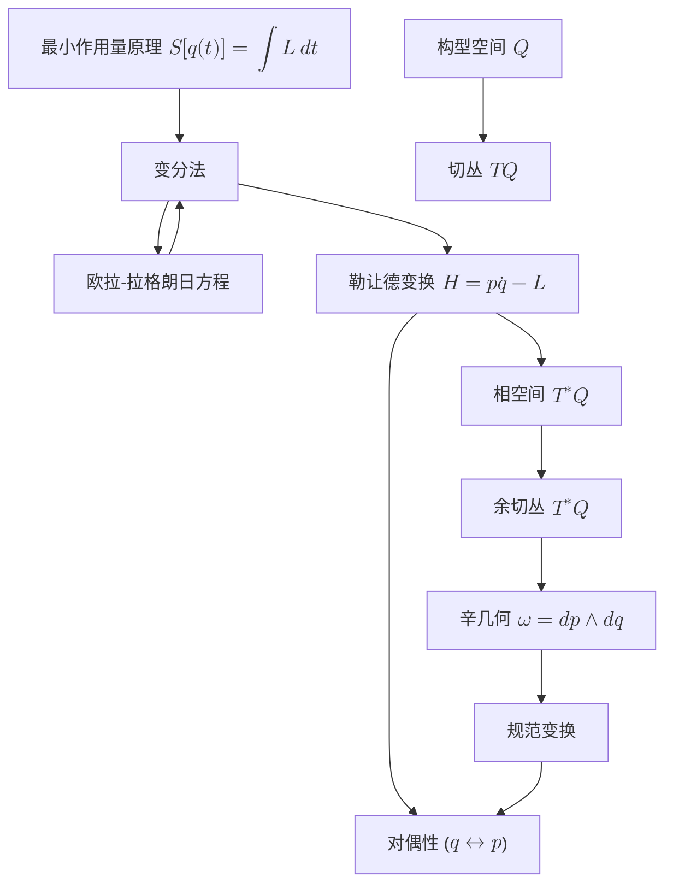

# 从最小作用量到辛几何：经典力学的深刻综合
* * *

--- 通过变分原理和几何对偶揭示力学的内在统一。

# I. 引言

**题词：**  
*“自然界的规律是以数学的语言书写的。”*

经典力学自诞生之初便根植于牛顿定律，长期以来一直是理解物理世界的基础。然而，当我们回顾其发展时，我们认识到其演进并非仅仅依赖于计算技术的进步，而是伴随着视角的深刻转变 —— 这一转变将运动的研究从以力为中心的表述提升为拥抱深层几何洞见的理论体系。

## I.1. 历史背景与最小作用量原理的出现

这一旅程始于 18 世纪，随着**最小作用量原理**的出现而展开，通常表示为
$$
S[q(t)] = \int_{t_1}^{t_2} L(q,\dot{q},t)\,dt,
$$
其中 $L(q,\dot{q},t)$ 表示系统的拉格朗日量。包括莫佩尔蒂、欧拉和拉格朗日在内的一批先驱者认识到，自然界运行高效 —— 选择使作用量驻定化的路径。尽管这种直观认识在最初与确定性的基于力的牛顿观点相比显得反直觉，但它揭示了粒子和连续介质力学背后的统一原则。

## I.2. 从牛顿动力学到变分描述的演进

随着分析技术的成熟，变分法作为一种推导运动方程的强大方法应运而生。通过设定作用量的一阶变分为零 $\delta S = 0$ 并运用分部积分法，可以得到欧拉-拉格朗日方程，优雅地封装了动力学：
$$
\frac{d}{dt}\left(\frac{\partial L}{\partial \dot{q}}\right) - \frac{\partial L}{\partial q} = 0.
$$
这种方法不仅深化了我们对经典轨迹的理解，还构建了通向更深层次数学结构的概念桥梁。

## I.3. 向几何框架的过渡

真正的突破在于认识到变分原理本质上是几何的。通过**勒让德变换**
$$
H = p\dot{q} - L,
$$
我们从构型空间 $Q$ 中的拉格朗日描述过渡到相空间中的**哈密顿力学**，后者自然建模为余切丛 $T^*Q$。在此框架下，坐标 $q$ 和共轭动量 $p$ 获得同等地位，反映了根本的**对偶性**。

在这个几何框架中，诸如切丛和余切丛等概念提供了描述速度和动量的语言。更重要的是，**庞加莱-嘉当 $1$-形式**
$$
\theta = p\,dq
$$
及其外导数，即**辛形式**
$$
\omega = -d\theta = dp \wedge dq,
$$
提供了深刻的洞察。这些结构在正则变换下保持不变，象征着自然涌现的不变守恒律(例如能量守恒)，它们源于辛不变性。

## I.4. 现代几何工具概述

本文将探讨现代几何工具，这些工具以统一的语言重构经典力学。我们将考察：

- **变分法与最小作用量**：最小化作用量积分如何揭示自然界中的底层最优性。
- **勒让德变换**：将动力学系统的描述从速度转换为动量，从而从 $Q$ 转换到 $T^*Q$。
- **辛几何**：辛流形的研究，其中不变的 $2$-形式 $\omega$ 编码守恒律并支持正则流动。
- **对偶性与不变性**：坐标 $q$ 和动量 $p$ 的相互作用及其在物理定律和相空间数学结构中的体现。

## I.5. 深入探索的铺垫

综合这些思想，我们的目标不仅仅是重温熟悉的领域，而是迈向更加抽象但深刻整合的力学视角。通过揭示变分原理与辛几何之间的内在统一，本文力求提供一个简洁而丰富的框架，这或许能激发新的研究方向，并加深对支配我们宇宙物理定律的优雅结构的欣赏。

我们邀请你与我们一起，从经典的最小作用量概念出发，迈向几何对偶的抽象领域，并在这一过程中重新发现力学背后永恒的对称性和统一性。

# II. 变分原理与最小作用量原理

**题词：**  
*“在追寻简单性的过程中，自然界揭示其最优路径。”*

最小作用量原理远不止是一种高效的计算捷径 —— 它是经典动力学赖以建立的基石。其核心断言系统的演化由作用量泛函的驻定性决定，这一概念引导我们进入变分法的丰富领域。本章致力于深入探讨变分原理、其形式化结果以及边界项的影响，这些最终演变为现代力学的核心几何结构。

## II.1. 作用量泛函与变分法

系统的动力学编码在作用量泛函中
$$
S[q(t)] = \int_{t_1}^{t_2} L(q,\dot{q},t)\,dt,
$$
其中 $L(q, \dot{q}, t)$ 是拉格朗日量，表示动能与势能之差，$q(t)$ 表示广义坐标，$\dot{q}(t)$ 是其时间导数。该原理假设系统实际取的路径 $q(t)$ 使作用量相对于所有具有相同端点的邻近路径达到驻定(通常是极小值)。

## II.2. 欧拉-拉格朗日方程的推导

为了形式化地推导支配动力学的方程，考虑路径的无穷小变分：
$$
q(t) \rightarrow q(t) + \delta q(t),
$$
其中端点固定，即 $\delta q(t_1) = \delta q(t_2) = 0$。作用量的变化由下式给出：
$$
\delta S = \delta \int_{t_1}^{t_2} L(q, \dot{q}, t)\,dt = \int_{t_1}^{t_2} \left[ \frac{\partial L}{\partial q} \delta q + \frac{\partial L}{\partial \dot{q}} \delta \dot{q} \right] dt.
$$
注意到 $\delta \dot{q} = \frac{d}{dt} (\delta q)$，我们对涉及 $\delta \dot{q}$ 的项进行分部积分：
$$
\int_{t_1}^{t_2} \frac{\partial L}{\partial \dot{q}} \frac{d}{dt} (\delta q) \, dt = \left.\frac{\partial L}{\partial \dot{q}} \delta q \right|_{t_1}^{t_2} - \int_{t_1}^{t_2} \frac{d}{dt} \left( \frac{\partial L}{\partial \dot{q}} \right) \delta q \, dt.
$$
由于变分在端点处为零，边界项
$$
\left.\frac{\partial L}{\partial \dot{q}} \delta q \right|_{t_1}^{t_2}
$$
消失。将剩余项合并后得到：
$$
\delta S = \int_{t_1}^{t_2} \left[ \frac{\partial L}{\partial q} - \frac{d}{dt} \left( \frac{\partial L}{\partial \dot{q}} \right) \right] \delta q \, dt.
$$
为了使作用量对任意 $\delta q(t)$ 驻定，被积函数必须为零。这一要求产生了著名的欧拉-拉格朗日方程：
$$
\frac{d}{dt} \left( \frac{\partial L}{\partial \dot{q}} \right) - \frac{\partial L}{\partial q} = 0.
$$

## II.3. 作用量及其极值性质的解释

即使作用量的极值性质并不总是对应于严格极小值(有时是鞍点)，它依然封装了自然界内在的经济性。它反映一种底层优化原则：在所有可想象的轨迹中，系统遵循使作用量驻定化的那一条。这不仅仅是一个数学奇观 —— 它构成了运动定律的公理基础，通过单一的变分描述连接了多样化的物理现象。

## II.4. 边界项的作用与意义

虽然在固定端点条件下分部积分方便地去除了边界贡献，但边界项本身具有深远的意义。当允许端点变化时重新引入这些项，我们有：
$$
\delta S = \left. \frac{\partial L}{\partial \dot{q}}\, \delta q \right|_{t_1}^{t_2} + \int_{t_1}^{t_2} \left[ \frac{\partial L}{\partial q} - \frac{d}{dt}\left(\frac{\partial L}{\partial \dot{q}} \right) \right] \delta q \, dt.
$$
该项
$$
\theta = \frac{\partial L}{\partial \dot{q}} \,dq
$$
被识别为**庞加莱-嘉当 $1$-形式**。尽管在初等处理中常因固定边界条件而被忽略，但这个 $1$-形式是力学几何表述的核心。其外导数，
$$
\omega = -d\theta = d\left(\frac{\partial L}{\partial \dot{q}}\right) \wedge dq,
$$
定义了**辛形式**，这是一个封闭且非退化的 $2$-形式，赋予相空间丰富的几何结构。

边界贡献因此具有双重作用：它们确保在动态边界条件下的变分程序的一致性，并为从拉格朗日力学到哈密顿力学的过渡奠定基础，揭示构型空间与动量空间之间的对偶性。

## II.5. 几何重新诠释的准备

对变分原理的细致剖析不仅阐明了经典动力学方程的推导，还暴露了支撑物理理论的潜在几何结构。通过认识到作用量的变分生成一个与辛结构内在相关的边界项，我们构建了一座桥梁，将欧拉-拉格朗日方程所规定的局部动力学与相空间的整体几何联系起来。

这种更深层次的洞察为后续关于勒让德变换、辛不变性及广义对偶性的讨论铺平了道路。这些主题将在接下来的章节中展开，最终引领我们走向一个统一经典力学与现代几何原则的综合框架。

## II.6. 结论

总之，变分原理不仅提供了一条通往运动方程的稳健途径，还揭示了底层的几何秩序。理解作用量的极值性质和边界项的微妙作用，使我们能够从局部动力学描述过渡到机械系统的全局、统一几何视图。这种方法为探索贯穿物理学各领域的辛结构奠定基础。

# III. 从拉格朗日力学到哈密顿力学：勒让德变换的作用

**题词：**  
*“通过变换，隐藏的对称性和对偶性涌现出来。”*

从拉格朗日力学到哈密顿力学的旅程并非仅仅是数学形式主义的改变 —— 它是自然界内在对偶性的揭示。这一转变的核心是**勒让德变换**，它将我们的描述从速度转换为动量，并揭示相空间中固有的辛结构。在本章中，我们将深入探讨这一变换的机制、其几何意义，以及它如何连接构型空间 $Q$ 的语言与余切丛 $T^*Q$ 的语言。

## III.1. 勒让德变换：定义与形式化

给定一个定义在构型空间 $Q$ 的切丛 $TQ$ 上的拉格朗日量
$$
L(q, \dot{q}, t),
$$
我们通过以下关系引入共轭动量：
$$
p = \frac{\partial L}{\partial \dot{q}}.
$$
在正则性假设下(即 Hessian 矩阵 $\frac{\partial^2 L}{\partial \dot{q}^2}$ 是非退化的)，这一关系可以根据 $p$ 和 $q$ 逆向表达 $\dot{q}$。哈密顿量随后定义为
$$
H(q, p, t) = p\,\dot{q} - L(q, \dot{q}, t),
$$
其中 $\dot{q}$ 必须理解为 $q$、$p$ 和 $t$ 的函数。

这一变换不仅仅是变量的变化；它是一种对偶映射。它交换 $\dot{q}$ (切向量)和 $p$ (余切向量)的角色，从而将动力学重新表述为一个框架，在该框架中规范共轭对 $(q, p)$ 决定演化。

## III.2. 从构型空间到相空间的过渡

构型空间 $Q$ 表示系统所有可能位置的集合，而其切丛 $TQ$ 自然包含位置 $q$ 和速度 $\dot{q}$。然而，哈密顿表述要求我们在相空间上工作，即余切丛 $T^*Q$。这个空间不仅包含位置坐标 $q$，还包含共轭动量 $p$。

勒让德变换完成以下任务：
- **将 $TQ$ 映射到 $T^*Q$**：通过定义动量 $p = \frac{\partial L}{\partial \dot{q}}$，每个 $TQ$ 中的点 $(q, \dot{q})$ 被关联到 $T^*Q$ 中的一个点 $(q, p)$。
- **建立对偶性**：该过程建立一种自然的对偶性，其中速度的角色被动量取代，允许我们给出一种在规范变换下不变的动力学描述。

这一过渡不仅提供一组新的坐标，还带来更丰富的几何结构。余切丛 $T^*Q$ 本质上是一个辛流形，配备由勒让德变换直接产生的规范几何对象。

## III.3. 切丛与余切丛：动力学的自然环境

在变换之前，系统的演化是在切丛 $TQ$ 上描述的，其中每个元素由一个配对 $(q, \dot{q})$ 给出。然而，一旦执行勒让德变换，系统自然地存在于余切丛 $T^*Q$ 中。这种转变不仅是基于坐标的，也是几何的：

- **切丛 $TQ$:**  
  速度的空间与构型空间中的无穷小位移密切相关。它支持产生欧拉-拉格朗日方程的变分公式。

- **余切丛 $T^*Q$:**  
  动量的空间 $T^*Q$ 携带自然的辛结构。这由规范 $1$-形式(也称为庞加莱-嘉当形式)
  $$
  \theta = p\,dq,
  $$
  及其外导数给出的辛形式
  $$
  \omega = -d\theta = dp \wedge dq,
  $$
  描述。辛形式 $\omega$ 是封闭且非退化的，这些性质确保相空间体积的守恒(通过刘维尔定理)，并构成了哈密顿系统中能量和其他不变量守恒的基础。

因此，通过勒让德变换从 $TQ$ 转换到 $T^*Q$ 不仅仅是一个技术手段 —— 它是通往动力学更深几何解释的大门，在那里对偶性和对称性扮演着核心角色。

## III.4. 几何对偶性与隐藏的对称性

勒让德变换揭示变量 $q$ 和 $p$ 之间的潜在对偶性。这种对偶性是许多力学和场论高级主题的核心：
- **规范变换:**  
  这些是 $T^*Q$ 中保持辛形式 $\omega$ 不变的坐标变化。它们强调物理定律在反映深层对称性的坐标变化下的不变性。

- **生成函数:**  
  变换通常用生成函数表示，这些函数提供一种系统的方法来产生规范变换。这些函数进一步展示 $q$ 和 $p$ 之间的内在相互作用，并巩固了系统描述的对偶性质。

- **辛几何:**  
  辛结构在哈密顿流下保持不变，这是将守恒律与几何不变性联系起来的关键见解。这种动力学与几何的统一是用相空间重新表述力学的最深刻结果之一。

通过在哈密顿框架中重新表述运动方程，隐藏的对称性变得明显。因此，勒让德变换不仅仅是一个变量的变化 —— 它是揭示经典力学底层几何对偶性的过程。

## III.5. 结论

总之，勒让德变换是关键一步，它连接了基于切丛 $TQ$ 上变分法的拉格朗日表述与余切丛 $T^*Q$ 上的哈密顿表述。这一变换不仅将我们的视角从位置和速度转移到位置和动量，还揭示了机械系统中深层的辛对称性。

理解这种对偶性及其伴随的几何框架对于探索理论物理学中的高级主题至关重要，因为在这些领域中，对称性和不变性提供了强大的指导原则。随着我们进一步深入，所建立的对偶性将成为欣赏变分原理如何演变为现代力学统一几何语言的基础概念。

# IV. 相空间的几何与辛结构

**题词：**  
*“在相空间中，我们发现守恒定律的不变织体。”*

辛几何的语言为理解经典力学的底层不变量提供一个深刻的框架。在本章中，我们探讨庞加莱-嘉当 $1$-及其外导数 —— 辛形式 —— 如何从变分原理中产生，并揭示相空间的结构性质。随后，我们讨论这些形式在规范变换下的不变性，并阐明著名的守恒定律(如刘维尔定理)的几何意义。

## IV.1. 庞加莱-嘉当 $1$-形式

起点是变分原理，其中边界项起着关键作用。在对作用量的变化进行分部积分时
$$
S[q(t)] = \int_{t_1}^{t_2} L(q, \dot{q}, t) \, dt,
$$
会遇到一个边界项，表达为
$$
\left.\delta S \right|_{\text{boundary}} = \left. \frac{\partial L}{\partial \dot{q}}\, \delta q \right|_{t_1}^{t_2}.
$$

这一项自然定义了**庞加莱-嘉当 $1$-形式**
$$
\theta = p \, dq,
$$
其中共轭动量由
$$
p = \frac{\partial L}{\partial \dot{q}}
$$
定义。

该 $1$-形式 $\theta$ 包含关于系统动力学的基本信息。它不仅仅是分部积分的结果；它是整个相空间辛结构的种子。在这个意义上，$\theta$ 将局部变分公式与整体几何描述联系起来。

## IV.2. 构造辛形式

从庞加莱-嘉当 $1$-形式出发，通过其外导数可以得到基本的辛结构。我们定义**辛形式**为
$$
\omega = -d\theta.
$$
代入 $\theta = p \, dq$，直接计算得
$$
\omega = -d(p\,dq) = dp \wedge dq.
$$
这个 $2$-形式 $\omega$ 具有以下性质：
- **封闭性：** $d\omega = 0$，确保它是一个真正的辛形式。
- **非退化性：** 它以不允许非平凡零方向的方式配对相空间中的切向量。

这些性质为余切丛 $T^*Q$ —— 哈密顿力学的自然环境 —— 提供刚性的几何结构。这种结构保证用规范坐标 $(q, p)$ 表示的动力学与某些几何量的保持内在相关。

## IV.3. 规范变换与 $\omega$ 的不变性

辛几何的核心信条之一是，哈密顿力学的物理内容在保持辛形式不变的变换下保持不变。这样的变换称为**规范变换**。数学上，一个微分同胚
$$
\Phi: T^*Q \to T^*Q
$$
是规范的，如果它满足
$$
\Phi^* \omega = \omega.
$$
这种不变性具有深远的意义：
- **坐标独立性**：同一物理系统可以用不同的坐标系描述，但辛结构保持不变。
- **守恒定律**：在哈密顿流下 $\omega$ 的保持直接导致相空间体积的守恒，这由刘维尔定理表述。

规范变换通常通过生成函数产生，这展示了位置 $q$ 和共轭动量 $p$ 之间的深刻对偶性。它们提供一种强大的技术，通过选择新的变量简化问题，从而使系统可积或暴露隐藏的对称性。

## IV.4. 守恒量与刘维尔定理的几何解释

在哈密顿演化下辛形式 $\omega$ 的不变性意味着相空间体积被保持。这在**刘维尔定理**中形式化，该定理表明由哈密顿向量场 $X_H$ 生成的流保持相空间测度。换句话说，如果跟踪相空间中某个区域的时间演化，其体积保持不变。这一结果不仅是数学上的奇观，也是统计力学中概率守恒和哈密顿系统遍历性质的反映。

从几何上看，考虑由关系
$$
\iota_{X_H} \omega = dH,
$$
定义的哈密顿向量场 $X_H$，其中 $\iota_{X_H}$ 表示与 $X_H$ 的内积。由 $X_H$ 生成的流 $\varphi_t$ 满足
$$
\varphi_t^* \omega = \omega.
$$

因此，总相空间体积元素，通常表示为
$$
\Omega = \frac{1}{n!} \underbrace{\omega \wedge \omega \wedge \cdots \wedge \omega}_{n \text{ 次}},
$$
在演化下保持不变。这种不变性支撑了其他可观测量(如能量)的守恒，并确保动力学在保测意义下是时间可逆的。

## IV.5. 连接变分边界项与整体几何

值得注意的是，早期的变分处理引入的边界项
$$
\left. p\,\delta q \right|_{t_1}^{t_2},
$$
从几何上看，这一项是庞加莱-嘉当 $1$-形式的种子。从局部变分微积分到整体辛几何的这条直接路径强调了经典力学的统一性。在规范变换下辛形式的保持是物理学中熟悉的守恒定律(如能量、动量和角动量)的几何体现。

## IV.6. 结论

总之，从庞加莱-嘉当 $1$-形式构造辛形式不仅提供了一个严格的数学框架，还深入洞察了力学中守恒的本质。辛结构在规范变换下的不变性确保物理描述的坐标独立性，并维护刘维尔定理中相空间体积守恒这一核心内容。这种几何视角弥合了局部变分原理与整体动力学不变量之间的差距，揭示了经典力学中心的持久对称性和统一性。

# V. 力学中的对偶性与不变性

**题词：**  
*“对偶性是解锁宇宙深层对称性的关键。”*

在经典力学的领域中，对偶性不仅仅是方便的计算工具 —— 它是物理定律织体中深藏对称性的表达。本章旨在揭示构型空间变量 $q$ 与其共轭动量 $p$ 之间的内在对偶性，探讨规范变换如何通过生成函数揭示这种对偶性，并考察坐标变化如何影响庞加莱-嘉当 $1$-形式及相关边界项。

## V.1. $q$ 和 $p$ 的内在对偶性

哈密顿力学的核心在于一个深刻的观察：动力学变量 $q$ 和 $p$ 是彼此对偶的。这种对偶性最初体现在共轭动量的定义中：
$$
p = \frac{\partial L}{\partial \dot{q}},
$$
它自然地从变分原理中出现。这种关系远不止是一个推导步骤 —— 它提供切空间(与 $\dot{q}$ 相关)和余切空间(与 $p$ 相关)之间的一一对应关系。因此，余切丛 $T^*Q$ 成为表达动力学的自然场所；相空间中的每一点 $(q, p)$ 都封装了系统的位形信息及其无穷小方向信息。

这种对偶性至关重要，因为它导致了动力学的对称表述。虽然拉格朗日量 $L(q, \dot{q}, t)$ 对待 $q$ 和 $\dot{q}$ 是不对称的，但哈密顿量 $H(q, p, t)$ 恢复了对称性，将 $q$ 和 $p$ 视为独立却相互关联的坐标。这种对称性不仅在美学上令人愉悦，在数学上也极为强大 —— 它是现代几何力学的基石，并且是许多守恒定律的基础。

## V.2. 生成函数与规范变换

规范变换是保持相空间辛结构的数学操作。它们确保基本的几何对象
$$
\omega = dp \wedge dq
$$
在坐标变换下保持不变。描述这些变换最优雅的方式之一是通过生成函数。生成函数 $F$ 可以以几种不同的方式将旧变量 $(q, p)$ 与新规范变量 $(Q, P)$ 联系起来，例如通过：

- $F_1(q, Q)$,
- $F_2(q, P)$,
- $F_3(p, Q)$, 或
- $F_4(p, P)$.

例如，如果使用生成函数 $F_2(q, P)$，变换方程由以下给出：
$$
p = \frac{\partial F_2}{\partial q}, \qquad Q = \frac{\partial F_2}{\partial P}.
$$

这些变换法则承载对偶性的本质，因为它们通过导数交织 $q$ 与 $p$、$Q$ 与 $P$。值得注意的是，如果计算新的庞加莱-嘉当 $1$-形式，结果为
$$
p\,dq - H\,dt = P\,dQ - K\,dt + dF_2,
$$
其中 $dF_2$ 是一个恰当微分。恰当微分的存在表明底层的辛形式(庞加莱-嘉当形式的外导数)保持不变。这种不变性是规范变换的核心，它展示了系统的不同哈密顿描述是等价的，并且对偶性如何无缝连接不同的坐标表示，同时保持理论的内在结构。

## V.3. 坐标变化与庞加莱-嘉当 $1$-形式的变换性质

对偶性的另一个重要方面是庞加莱-嘉当 $1$-形式
$$
\theta = p\,dq
$$
在坐标变化下的变换行为。假设我们引入一个新的坐标系 $Q = Q(q)$。微分 $dq$ 的变换为
$$
dq = \frac{\partial q}{\partial Q}\,dQ.
$$

为了保持相空间的几何结构，共轭动量必须变换为
$$
P = p\,\frac{\partial q}{\partial Q}.
$$

因此，$1$-形式变为
$$
\theta = p\,dq = P\,dQ,
$$
这表明该形式在不同坐标系中保持其结构。然而，当坐标变换涉及显式的时间依赖时，可能会出现与 $dt$ 成比例的附加项。这些项可以被重新解释为不影响辛 $2$-形式
$$
\omega = -d\theta
$$
的恰当微分。

这种协变性确保了动力学的物理内容保持不变 —— 无论使用何种特定坐标系，$q$ 和 $p$ 的关系得以保留，并且相空间体积的守恒(如刘维尔定理所表达的)自然成立。

辛形式在这种变换下的不变性是对偶性原则的具体体现。它保证了，即使不同的观测者或坐标系可能以截然不同的形式表达动力学，底层物理学 —— 编码在 $T^*Q$ 的几何中 —— 仍然不变。

## V.4. 综合与更深层次的影响

力学中对偶性与不变性的相互作用揭示了从辛几何的角度看，$q$ 和 $p$ 的分离是人为的。相反，它们最好被视为形成更丰富统一相空间的对偶伙伴。生成函数和规范变换展示这些对偶对如何在不丢失信息的情况下重新配置，反映自然界的隐藏对称性。

这种对偶性不仅限于理论上的优雅；它也是一种实用工具：
- 它是诺特定理所衍生的守恒定律的基础。
- 它为可积系统等高级主题甚至量子力学中经典共轭对成为算符的方面奠定基础。
- 它为理解经典层面的变换如何告知现代理论(如几何量子化)铺平道路。

## V.5. 结论

总之，$q$ 和 $p$ 之间的对偶性是哈密顿力学中最深刻的见解之一。通过生成函数和规范变换，我们看到这种对偶性在广泛的坐标变化下得以保持，确保辛结构以及守恒定律的不变性。这种对偶性与不变性的综合不仅巩固我们对经典系统的理解，还为探索更深的几何甚至量子力学类比奠定基础，在这些类比中，类似的对偶性和不变性继续发挥核心作用。

# VI. 综合与未来方向

**题词：**  
*“每一个结论都是新的开始 —— 每一种对称性都暗示着未被发现的领域。”*

通过变分原理、勒让德对偶性和辛几何的旅程，揭示了经典力学核心深处的深刻统一。从最小作用量原理的探索开始，逐渐演变为一个丰富的几何框架，将看似不同的动力学表述统一起来。这种综合不仅仅是回顾性的总结，而是为新的研究方向提供了起点，这些方向有望加深我们对经典和量子系统的理解。

## VI.1. 变分原理与几何结构的交织

在核心层面，最小作用量原理通过变分法为运动方程提供了直观和数学基础。从 $\delta S = 0$ 推导出欧拉-拉格朗日方程，将动力学锚定在一个优化原则之上。这一基本思想自然延伸到勒让德变换，它将不对称的拉格朗日描述与对称的哈密顿表述连接起来。通过这样做，它不仅将我们的视角从速度转移到动量，还揭示了 $q$ 和 $p$ 的内在对偶性。

这种对偶性在庞加莱-嘉当 $1$-形式 $\theta = p\,dq$ 及其外导数 —— 辛形式 $\omega = dp \wedge dq$ 的构建中得到了进一步阐明。这些几何实体不仅仅是数学上的便利工具；它们体现了物理系统中的守恒定律和不变性原则。规范变换下的不变性 —— 反映在辛形式的保持上 —— 为刘维尔定理提供了坚实的基础，并强调了能量和动量守恒在不同力学表述中的普遍性质。

## VI.2. 统一概念的反思

变分方法、勒让德对偶性和辛结构之间的相互关系呈现了一个超越传统力学观的连贯叙述。它们表明，经典的动力学描述本质上是几何化的，相空间的性质与支配物理变化的定律一样具有不变性和根本性。这种统一不仅仅提供了概念上的优雅，还提供了强大的工具来分析复杂系统，确保坐标系或表示的选择不会改变底层物理学。

这些概念的综合表明，经典力学远不是一个已完成的主题。相反，它是一个动态领域，继续为现代理论框架提供洞察。例如，$q$ 和 $p$ 的对偶性在经典与量子力学的对应中得到回响，其中位置和动量成为具有非交换性质的算符，邀请了几何量子化等方法。

## VI.3. 未来研究方向

基于这种深刻的综合，出现了几个有前景的研究方向：

- **向量子力学的扩展：**  
  经典力学的几何表述为理解量子系统提供了一条自然途径。对几何量子化的研究可能提供一个严谨的桥梁，连接经典相空间与量子希尔伯特空间，进一步阐明辛结构在量子动力学中的作用。

- **场论与无穷维系统：**  
  这里发展的概念可以扩展到场论领域，其中构型和相空间变为无穷维。这样的扩展有可能揭示复杂系统中的新对称性和守恒定律，范围从流体力学到高能物理中的规范理论。

- **可积系统与非线性动力学：**  
  统一框架建议了分析可积系统的新方法。通过利用底层的几何对偶性，研究人员可以开发更强大的技术来解决非线性动力学问题，潜在应用包括天体力学、等离子体物理及其他领域。

- **计算进展：**  
  相空间的固有辛结构激发了辛积分器和其他数值算法的发展，这些算法在长期模拟中保留系统的几何不变量。这些工具对于推进我们对高度敏感或混沌系统的计算理解至关重要。

- **跨学科应用：**  
  超越物理学，对偶性与几何不变性的相互作用在经济学、生物学和网络理论等领域也有影响，其中优化和守恒原则与物理系统中的原则相似。

## VI.4. 结论

通过综合变分原理、勒让德对偶性和辛几何，我们揭示了一个既深刻又实用的力学统一愿景。这种整合视角不仅仅复述历史思想，还为未来的发现奠定了基础。正如每一种对称性指向未探索的领域，我们发现理解中的每一个结论仅仅是新章节的开始，无论是理论探索还是应用创新。

通过将经典力学的具体表述与现代几何的抽象力量结合，我们不仅重新审视了物理定律的核心，还为更深入、更全面地理解宇宙铺平了道路。这些统一概念的承诺引导我们进一步进入量子力学、场论及其他领域的领域，揭示了在自然界中，每一个结论确实是一个新的开始。

# VII. 结论

**题词：**  
*“理解自然的深刻互联性是一段旅程，而不仅仅是一个目的地。”*

我们的探索始于简单却深刻的最小作用量原理陈述 —— 大自然以其固有的智慧选择最优化路径。通过解开经典动力学背后的变分原理，我们推导出欧拉-拉格朗日方程，揭示了如何通过作用量泛函的最小化直接得出运动定律。这段初始旅程为更深入的理解奠定了基础，揭示了那些看似单纯的计算技巧实际上是通往物理世界更统一和几何化视图的大门。

通过勒让德变换从拉格朗日表述过渡到哈密顿框架，我们见证了坐标 $q$ 和共轭动量 $p$ 之间引人注目的对偶性的出现。这种变换不仅仅重构了问题，还暴露了用辛几何语言优雅表达的内在对称性。构型空间 $Q$ 让位于相空间 $T^*Q$，其中庞加莱-嘉当 $1$-形式 $\theta = p\,dq$ 及其相关的辛形式 $\omega = dp \wedge dq$ 成为所有后续动力学的不可动摇基础。

辛形式在规范变换下的不变性不仅仅是技术上的好奇；它是深植于性质中的特性，确保基本量的守恒，体现刘维尔定理，并保证尽管坐标变化万千，相空间的结构依然完好无损。通过这个视角，对偶性和不变性被揭示为同一硬币的两面 —— 每次变换和每次对称性不仅保持了底层物理定律的统一性，并且还照亮这种统一性。

变分原理、勒让德对偶性和辛几何的综合提供的不仅仅是回顾性总结 —— 它为未来的探索提供平台。随着我们将这些思想扩展到量子力学、场论甚至跨学科应用领域，我们培养的几何框架承诺引导我们走向对宇宙更完整的理解。每一种对称性的发现，每一种不变量的保存，都暗示着有待探索的更深联系。

最后，我们穿越经典力学的旅程 —— 追溯从最小作用量的简单性到辛几何的精致优雅的演变 —— 强化了这样一个观点：自然法则不是支离破碎的。相反，它们形成一幅复杂而连贯的织锦，在其中每个原理、每次变换和每个守恒定律都是相互关联的。这种统一不仅丰富我们对经典动力学的理解，还为理论和应用科学的未来发展奠定基础。

实际上，理解这些思想的深刻互联性是一项持续的旅程 —— 它挑战我们超越表象，不断寻找将宇宙编织在一起的隐藏对称性。

# 附录 A：核心概念关系概述

本附录部分旨在帮助读者快速掌握文档的核心思想、观点和概念，以及它们之间的相互关系。附录包括一个关系表和一个图表，以清晰简洁的方式描绘这些相互联系。

## A.1. 关系表

| **核心概念**              | **相关概念 / 依赖关系**              | **简要描述**                                                          |
| --------------------- | ---------------------------- | ----------------------------------------------------------------- |
| **最小作用量原理**           | 变分法，欧拉-拉格朗日方程                | 动力学的基础；自然界最小化作用量 $S[q(t)] = \int_{t_1}^{t_2} L(q,\dot{q},t)\,dt$. |
| **变分法**               | 最小作用量原理，欧拉-拉格朗日方程            | 通过优化作用量推导运动方程的方法。                                                 |
| **欧拉-拉格朗日方程**         | 变分法，最小作用量原理                  | 描述构型空间 $Q$ 中动力学的微分方程。                                             |
| **勒让德变换**             | 欧拉-拉格朗日方程，拉格朗日力学，相空间转换       | 将拉格朗日表述转换为哈密顿描述 $H = p\dot{q} - L$，建立对偶性。                         |
| **构型空间与相空间**          | 勒让德变换，切丛 ($TQ$)，余切丛 ($T^*Q$) | 区分位置空间 $Q$ 和动量空间 $T^*Q$。                                          |
| **切丛与余切丛**            | 变分法(切丛)，勒让德变换(余切丛)           | 描述速度 ($TQ$) 和动量 ($T^*Q$) 的几何框架。                                   |
| **辛几何**               | 余切丛结构，庞加莱-嘉当 $1$-形式，规范变换     | 研究不变的辛形式 $\omega = dp \wedge dq$，对守恒定律至关重要。                       |
| **对偶性($q$ 和 $p$ 之间)** | 勒让德变换，规范变换，辛几何               | 连接坐标 ($q$) 与其共轭动量 ($p$) 的基本对应关系。                                  |
| **规范变换**              | 辛几何，生成函数，对偶性                 | 保持辛形式和底层物理的变换，展示不变性。                                              |

## A.2. 图表

以下是用流程图表示这些核心概念及其关系的图示：

**说明**：

- **最小作用量原理**支撑了**变分法**，后者用于推导支配构型空间 $Q$ 中动力学的**欧拉-拉格朗日方程**。
- **勒让德变换** 将此框架转换为哈密顿形式，从**切丛 ($TQ$)** 转换到**余切丛 ($T^*Q$)**，即从构型空间 $Q$ 转换到相空间 $T^*Q$。
- 在相空间中，通过庞加莱-嘉当 $1$-形式及其导数 —— 辛形式 $\omega = dp \wedge dq$，**辛几何**出现，确保物理量的不变性和守恒性。
- **对偶性** 是坐标 $q$ 和动量 $p$ 之间的中心主题，进一步由**规范变换**加强，这些变换保持辛结构并揭示隐藏的对称性。

本附录不仅总结了文档的核心思想，还通过视觉和结构方式将经典力学的基本概念链接起来。这种整合性的地图旨在加深高级读者的理解，并激发进一步探究。

# 附录 B：最小作用量原理的目的论视角

**题词：**  
*“在思考自然的最优性时，我们既能感受到一种美学上的优雅，也能看到一种实用性的模型 —— 这一观点既被时间检验过的哲学所锤炼，也被现代物理学所支持。”*

如本文档中所探讨的，最小作用量原理是我们理解经典力学的核心支柱之一，它将变分法、对偶性以及辛流形的几何语言融为一体。然而，超越其数学表述之外，这一原理还邀请我们反思关于现实本质以及物理现象可能具有的目的论特征的更深层次哲学问题。

## B.1. 目的论与自然的优雅

历史上，像亚里士多德和欧拉这样的思想家认为，最小作用量原理不仅仅是一个计算工具。他们从中看到了自然界内在目的或“最终原因”的暗示。亚里士多德的目的论观点认为，自然现象的发生是为了实现某种最优的结果。类似地，欧拉的思考表明，物理系统所采取的路径通过最小化作用量揭示了一种至高的优雅 —— 这是对底层秩序的一瞥，这种秩序似乎注定或预先安排好了。这一观点暗示了一个宇宙，它不仅仅是一系列任意事件的集合，而是一个追求最优状态的整体系统，其中宇宙看似分散的运动汇聚成一幅深刻的、内在平衡的画卷。

## B.2. 物理学作为一种模型：费曼的经济洞察

与此形成鲜明对比的是理查德·费曼的务实观点。费曼以其特有的清晰和幽默提醒我们，“物理学只是一个模型”。对他而言，最小作用量原理最好被理解为一种极其有效的启发式方法，用于计算系统演化，而不是作为任何神秘或目的论力量支配宇宙的证据。在费曼路径积分量子力学表述中，每一条可想象的路径都被考虑在内，而在宏观极限下，干涉效应自然地挑选出作用量为驻值的经典路径。这种以模型为中心的方法强调，作用量原理的美丽和预测能力源于其描述自然的能力，而非物理定律中编码的任何内在目的或目标。

## B.3. 超越二元对立：创造性的综合见解

与其将这些视角 —— 目的论的优雅与务实建模 —— 视为相互排斥的，不如将它们重新解读为我们理解的不同层次：

- **涌现的最优性和数学之美：**  
  可以认为，目的论的语言捕捉了对自然惊人经济性的直观反应。宇宙“选择”最小作用量路径的事实是深层底层对称性的证明，这些对称性在我们的数学模型中表现为最优性条件。从这个意义上说，目的论不是一种形而上学的强加，而是对我们方程所揭示的内在平衡的一种诗意反映。

- **模型作为窥探深层秩序的窗口：**  
  费曼的观点提醒我们要谨慎地将模型等同于现实。然而，这些模型成功描述自然现象的事实暗示了一种既务实又深刻优雅的底层秩序。例如，路径积分表述包含了一系列可能性，但路径之间的干涉导致的结果呼应了早期哲学家所阐述的最小、“经济”的原则。

- **经典、量子及其他领域的统一框架：**  
  最小作用量原理不仅在经典力学内部起到桥梁作用，还为现代理论(如量子力学、场论甚至新兴跨学科框架)提供了灵感。无论我们将自然视为通过目的论的镜头观察还是视为一组数学模型，作用量原理在各个领域的一致性和普遍性表明，它封装了一种通用语言 —— 这种语言可能最终调和我们对目的的直观感受与经验科学的严格要求。

## B.4. 结论性反思

在思考最小作用量原理时，我们遇到了一个充满历史洞见和现代创新的丰富叙事。一方面，亚里士多德和欧拉所倡导的目的论观点赋予这一概念一种自然优雅的感觉，暗示自然界“设计”为追求最优性。另一方面，费曼的革命性观点提醒我们，我们的理论本质上是模型 —— 捕捉物理行为本质的工具，而不一定为其规定目的。

最小作用量原理的真正深度和美丽可能在于其容纳这两种观点的能力。它作为一座持久的桥梁，连接了对有目的宇宙的哲学渴望与现代物理学严谨的模型驱动方法。最终，无论是将其视为自然界内在目的论的表现，还是作为一种高效描述的典范模型，最小作用量原理继续激发我们对力学定律背后统一性和简单性的深刻尊重。

这种解释的二重性不仅丰富了我们对经典力学的理解，还邀请未来的探究。随着我们在物理学前沿的推进 —— 从量子力学到复杂系统 —— 并在哲学与经验科学之间架起桥梁，目的论优雅与务实建模之间的互动无疑将继续成为创造性洞见和发现的肥沃土壤。

