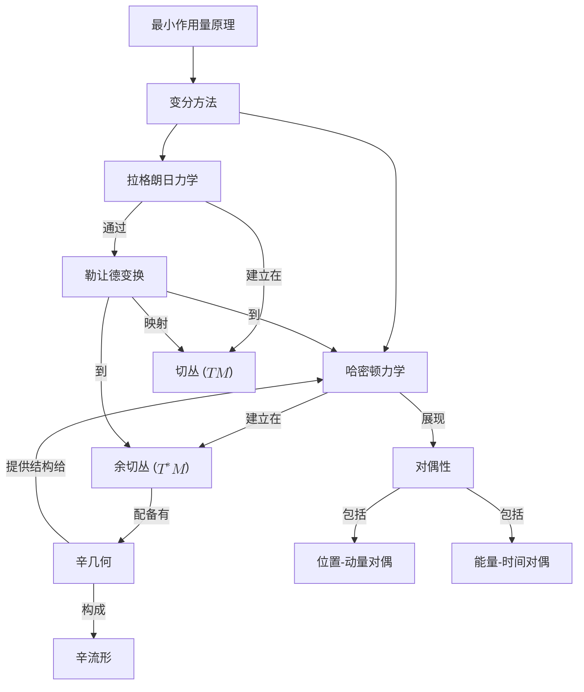

# 揭开经典力学的几何基础：从最小作用原理到辛对偶
* * *

--- 通过几何和对偶探索物理的优雅

# **引言**

经典力学长期以来一直是物理学的支柱，提供了对从天体到日常现象的物体运动的深刻见解。起源于牛顿、欧拉和拉格朗日的工作，它为理解支配物理世界的根本定律奠定了基础。然而，随着领域的发展，人们越来越清楚地认识到，为了充分理解机械系统的复杂性，需要一种更深入、更具统一性的方法。

在这个追求中最显著的进展之一是**最小作用量原理**。该原理优雅地指出，一个机械系统在两个状态之间所采取的实际路径是使作用积分极值化(通常是极小化)的路径。最小作用量原理远非仅仅是数学抽象，它将系统的全部动力学封装在一个单一的标量量 —— 作用中。它作为一条统一的线索贯穿于各种力学表述之中，从牛顿力学到拉格朗日力学和哈密顿力学视角。

对经典力学进行**几何探索**的动力来自于希望在连贯且直观的框架内理解这些表述。几何学，以其对形状、结构和变换的强调，为这一努力提供了理想的语言。通过几何解释物理概念，我们解锁了强大的工具，揭示了机械系统的潜在对称性和不变性。

历史上，几何方法导致了深刻的发现。**变分方法**和变分法的发展使得数学家和物理学家能够从最小作用量原理推导出运动方程。这不仅提供了一种更为通用的方法来解决力学问题，还突显了不同物理领域之间的相互联系。

在这个几何框架中的一个关键概念是**勒让德变换**。这种数学操作促进了从拉格朗日力学到哈密顿力学的过渡。几何上，它连接了**切丛** —— 位置和速度的空间 —— 和**余切丛** —— 位置和动量的空间。这种过渡不仅仅是变量的变化；它反映了经典力学中固有的深层**对偶性**，例如位置与动量或能量与时间之间的对偶性。

对**辛几何**的探索进一步增强了我们对哈密顿力学的理解。辛流形为哈密顿系统的流提供了自然的设置，其中辛形式封装了守恒定律和运动的基本属性。这种几何结构对于高维力学的表述至关重要，并在现代理论物理学中扮演着重要角色。

在本文中，我们旨在深入探讨这些几何基础，揭示最小作用量原理如何通过几何和对偶性引导我们获得对经典力学的更丰富理解。我们将回顾历史背景以欣赏这些思想的演变，并系统地构建所需的数学形式主义。

**将要探讨的主题：**

- **最小作用量原理**：理解其基础性作用以及它如何统一不同的力学系统。
- **变分方法**：深入探讨变分法及其在推导运动方程中的应用。
- **拉格朗日力学与切丛**：研究配置空间内拉格朗日力学的几何解释。
- **勒让德变换与余切丛**：探索向哈密顿力学的转变及其几何意义。
- **哈密顿力学与辛几何**：介绍辛流形及其在哈密顿方程表述中的作用。
- **力学中的对偶性**：研究物理量之间的基本关系及其几何表现。
- **影响与应用**：讨论这些概念对现代物理学的广泛影响及其与量子力学的联系。

通过提供全面而综合的视角，本文档旨在为经验丰富的教育工作者和研究人员提供更深层次的欣赏，展示几何为经典力学带来的优雅和统一性。几何方法不仅丰富了理论理解，还增强了问题解决技巧，为物理学的研究和教学提供了新的途径。

当我们解开这些概念时，我们邀请你重新发现经典力学不仅仅是一组方程和原则，而是几何与物理学和谐互动的体现 —— 这是通过数学描述的自然世界持久之美的见证。

# **2. 最小作用量原理**

最小作用量原理是经典力学的基石，提供了一个统一的框架，优雅地封装了支配物理系统运动的定律。其核心主张是，一个系统在两个状态之间所采取的实际路径是使作用积分保持不变(通常是极小值)的路径。这一概念不仅提供了深刻的物理见解，还与力学背后的几何结构密切相关。

## **2.1. 历史发展**

最小作用量原理的发展是一幅由几个世纪的科学思想编织而成的丰富画卷，汇聚了数学和物理学领域一些最杰出人物的贡献。

### **2.1.1. 皮埃尔·德·莫佩尔蒂**

在18世纪，**皮埃尔·德·莫佩尔蒂**(1698–1759)常被认为是最早提出该原理的人之一。莫佩尔蒂引入了最小化他称为“作用”的量来解释自然过程的概念。在他的工作中，他提出自然界以最小化作用的方式运作，这被概括为他的**最小作用量原理**：

> “自然界在其所有行为中都是节俭的。”

莫佩尔蒂应用这一理念来理解反射和折射定律，建议光沿着使作用最小化的路径传播。

### **2.1.2. 莱昂哈德·欧拉**

**莱昂哈德·欧拉**(1707–1783)，莫佩尔蒂的同时代人，通过提供数学严谨性扩展了这一概念。欧拉形式化了作用的概念，并发展了变分法，这是分析泛函优化问题的重要数学框架。

1744年，欧拉发表了《寻找具有最大或最小性质的曲线的方法》("Methodus Inveniendi Lineas Curvas Maximi Minive Proprietate Gaudentes")，其中引入了现在称为**欧拉-拉格朗日方程**的基本方程。

### **2.1.3. 约瑟夫-路易斯·拉格朗日**

**约瑟夫-路易斯·拉格朗日**(1736–1813)进一步推进了该原理，系统地将变分方法应用于力学。在他的杰作《分析力学》("Mécanique Analytique"，1788年)中，拉格朗日重新表述了经典力学，不再依赖于力和加速度等几何概念，而是使用广义坐标和能量。

拉格朗日引入了**拉格朗日函数** $L(q, \dot{q}, t) = T - V$，其中 $T$ 是动能，$V$ 是势能。通过用 $L$ 表示力学并应用最小作用量原理，他推导出了系统的运动方程。

### **2.1.4. 威廉·罗恩·哈密顿**

**威廉·罗恩·哈密顿**(1805–1865)将该原理扩展到现在的**哈密顿力学**。哈密顿引入了**哈密顿函数** $H(q, p, t)$，表示系统总能量，以坐标 $q$ 和共轭动量 $p$ 来描述。

哈密顿的表述强调了辛几何的重要性，并为量子力学的发展奠定了基础。他的工作展示了最小作用量原理如何统一光学和力学，带来了新的见解和数学技术。

### **2.1.5. 遗产与影响**

莫佩尔蒂、欧拉、拉格朗日和哈密顿的集体贡献确立了最小作用量原理作为物理学的基本原则。它不仅在经典力学中成为指导原则，还在量子力学、场论和广义相对论等领域发挥了重要作用。

## **2.2. 数学形式主义**

为了充分欣赏最小作用量原理的力量，深入理解其数学基础是必不可少的。这涉及到理解泛函、变分法以及欧拉-拉格朗日方程的推导。

### **2.2.1. 作用积分**

在经典力学中，**作用** $S$ 是一个泛函，它将一个实数赋给系统随时间变化的路径。它定义为沿路径的拉格朗日函数的积分：
$$
S[q] = \int_{t_1}^{t_2} L(q(t), \dot{q}(t), t) \, dt,
$$
其中：

- $q(t)$ 是系统在时间 $t$ 的广义坐标。
- $\dot{q}(t) = \frac{dq}{dt}$ 是广义速度。
- $[t_1, t_2]$ 是感兴趣的时间区间。

作用依赖于整个函数 $q(t)$，因此它是一个泛函而不是简单的函数。

### **2.2.2. 物理意义**

最小作用量原理断言，系统在两个状态之间所采取的实际路径是使作用 $S$ 保持不变(即一阶变分 $\delta S$ 为零)的路径。这意味着围绕真实路径的小变动不会导致作用的一阶变化。

从物理上讲，这一原理描述了自然界如何以最“经济”的方式运作，通过平衡动能和势能来决定系统的运动。

### **2.2.3. 变分法**

为了找到使 $S$ 保持不变的路径，我们使用变分法的工具。

#### **2.2.3.1. 泛函与变分**

一个**泛函** $S[q]$ 将一个标量值赋给函数 $q(t)$。一个**变分** $\delta q(t)$ 是 $q(t)$ 的微小变化，受条件 $\delta q(t_1) = \delta q(t_2) = 0$ (固定端点)的约束。

**一阶变分** $\delta S$ 给出为：
$$
\delta S = S[q + \delta q] - S[q] = \int_{t_1}^{t_2} \left( \frac{\partial L}{\partial q} \delta q + \frac{\partial L}{\partial \dot{q}} \delta \dot{q} \right) dt.
$$
对涉及 $\delta \dot{q}$ 的项进行分部积分并应用固定端点条件，我们得到：
$$
\delta S = \int_{t_1}^{t_2} \left( \frac{\partial L}{\partial q} - \frac{d}{dt} \left( \frac{\partial L}{\partial \dot{q}} \right) \right) \delta q \, dt.
$$
由于边界条件的影响，边界项消失，因为 $\delta q(t_1) = \delta q(t_2) = 0$。

#### **2.2.3.2. 欧拉-拉格朗日方程**

要求 $\delta S = 0$ 对任意 $\delta q(t)$ 成立，直接导出**欧拉-拉格朗日方程**：
$$
\frac{d}{dt} \left( \frac{\partial L}{\partial \dot{q}} \right) - \frac{\partial L}{\partial q} = 0.
$$
这些微分方程是系统的运动方程。

### **2.2.4. 运动方程的推导**

#### **2.2.4.1. 单自由度系统**

考虑一个具有单个广义坐标 $q(t)$ 的系统。作用为：
$$
S[q] = \int_{t_1}^{t_2} L(q, \dot{q}, t) \, dt.
$$
应用变分原理，我们得到：
$$
\delta S = \int_{t_1}^{t_2} \left( \frac{\partial L}{\partial q} - \frac{d}{dt} \left( \frac{\partial L}{\partial \dot{q}} \right) \right) \delta q \, dt = 0.
$$
由于 $\delta q(t)$ 是任意的，被积函数必须恒等于零，从而得出欧拉-拉格朗日方程。

#### **2.2.4.2. 多自由度系统**

对于具有 $n$ 个广义坐标 $q^i(t)$，$i = 1, 2, ..., n$ 的系统，作用变为：
$$
S[q^1, q^2, ..., q^n] = \int_{t_1}^{t_2} L(q^i, \dot{q}^i, t) \, dt.
$$
遵循类似的过程，我们得到一组欧拉-拉格朗日方程：
$$
\frac{d}{dt} \left( \frac{\partial L}{\partial \dot{q}^i} \right) - \frac{\partial L}{\partial q^i} = 0, \quad i = 1, 2, ..., n.
$$

### **2.2.5. 例子**

#### **2.2.5.1. 自由粒子**

对于质量为 $m$ 的自由粒子，拉格朗日函数仅为动能：
$$
L = \frac{1}{2} m \dot{q}^2.
$$
应用欧拉-拉格朗日方程：
$$
\frac{d}{dt} \left( m \dot{q} \right) = 0 \implies m \ddot{q} = 0.
$$
这给出了以恒定速度运动的自由粒子的运动方程。

#### **2.2.5.2. 简谐振子**

对于处于谐振势中的粒子，拉格朗日函数为：
$$
L = \frac{1}{2} m \dot{q}^2 - \frac{1}{2} k q^2.
$$
欧拉-拉格朗日方程变为：
$$
m \ddot{q} + k q = 0,
$$
描述角频率为 $\omega = \sqrt{\frac{k}{m}}$ 的简谐运动。

### **2.2.6. 守恒定律与对称性**

最小作用量原理自然地通过**诺特定理**导出守恒定律，该定理指出，作用的每一个连续对称性对应一个守恒量。

#### **2.2.6.1. 时间平移对称性**

- **对称性**：如果 $L$ 不显式依赖于时间 $t$，则作用在时间平移下不变。
- **守恒量**：能量 $E$。

#### **2.2.6.2. 空间平移对称性**

- **对称性**：如果 $L$ 不显式依赖于坐标 $q$，则作用在该坐标下的平移下不变。
- **守恒量**：动量 $p$。

#### **2.2.6.3. 旋转对称性**

- **对称性**：如果 $L$ 在旋转下不变，则作用保持不变。
- **守恒量**：角动量 $L$。

### **2.2.7. 作用原理的优势**

- **统一框架**：提供了一个可以从其导出所有运动方程的单一原则。
- **场论的推广**：自然地扩展到经典场论和相对论力学。
- **量子力学的基础**：构成了量子力学路径积分表述的基础。

### **2.2.8. 与几何的联系**

尽管传统表述侧重于函数及其变分，但最小作用量原理为力学的几何解释奠定了基础。通过考虑所有可能路径的空间，并识别使作用保持不变的真实路径，我们开始看到几何结构的出现，这些结构在哈密顿力学和辛几何等高级表述中变得更加明显。

## **2.3. 结论**

**综上所述**，最小作用量原理是一个深刻而广泛的原理，它不仅预测了机械系统的行为，还揭示了物理定律的内在统一性。通过莫佩尔蒂、欧拉、拉格朗日和哈密顿的工作发展而来的这一原理，反映了对更深层次理解和抽象的探索历程，并最终形成了一个既强大又优雅的形式主义。变分法和欧拉-拉格朗日方程所提供的数学框架便于分析大量的物理系统，使得最小作用量原理成为理论物理学中不可或缺的工具。

# 3. 变分法在力学中的应用

经典力学从根本上基于最小作用量原理，该原理断言系统的动力学可以通过找到使作用泛函极值化(通常是最小化)的路径来确定。为了探索这些极值路径，我们使用变分法 —— 一组分析函数的小变化如何影响泛函值的数学技术。本节深入探讨了变分法的数学基础，并展示了其在力学系统中的应用。

## 3.1. 变分法的基础

变分法是数学分析的一个领域，它处理优化泛函的问题，即从函数空间到实数的映射。与标准微积分不同，后者专注于有限维变量的函数，变分法则考虑函数本身的变化。

### 3.1.1. 泛函及其变分

一个**泛函** $\mathcal{J}[y]$ 将一个实数赋给函数 $y(x)$。例如，考虑泛函：
$$
\mathcal{J}[y] = \int_{x_1}^{x_2} F(x, y(x), y'(x)) \, dx,
$$
其中 $F$ 是 $x$、$y(x)$ 和导数 $y'(x)$ 的函数。目标是找到使 $\mathcal{J}[y]$ 极值化的函数 $y(x)$ (即最小值、最大值或鞍点)。

一个**变分** $\delta y(x)$ 表示函数 $y(x)$ 的无穷小变化：
$$
y(x) \rightarrow y(x) + \varepsilon \eta(x),
$$
其中 $\varepsilon$ 是一个小参数，$\eta(x)$ 是一个任意可微函数，在端点处为零($\eta(x_1) = \eta(x_2) = 0$)，以满足固定边界条件。

### 3.1.2. 泛函导数和作用量的极值

由于 $\delta y(x)$ 引起的**泛函变分** $\delta \mathcal{J}$ 给出为：
$$
\delta \mathcal{J} = \mathcal{J}[y + \varepsilon \eta] - \mathcal{J}[y] = \varepsilon \int_{x_1}^{x_2} \left( \frac{\partial F}{\partial y} \eta + \frac{\partial F}{\partial y'} \eta' \right) dx + \mathcal{O}(\varepsilon^2).
$$
对第二项进行分部积分并应用边界条件，得到：
$$
\delta \mathcal{J} = \varepsilon \int_{x_1}^{x_2} \left( \frac{\partial F}{\partial y} - \frac{d}{dx} \frac{\partial F}{\partial y'} \right) \eta(x) \, dx.
$$
为了使 $\mathcal{J}[y]$ 对任意 $\eta(x)$ 都保持极值，必须满足**欧拉-拉格朗日方程**：
$$
\frac{\partial F}{\partial y} - \frac{d}{dx} \left( \frac{\partial F}{\partial y'} \right) = 0.
$$
这个微分方程决定了使泛函 $\mathcal{J}[y]$ 极值化的函数 $y(x)$。

### 3.1.3. 力学中作用量的极值概念

在力学中，作用量 $S$ 定义为：
$$
S[q] = \int_{t_1}^{t_2} L(q(t), \dot{q}(t), t) \, dt,
$$
其中 $L$ 是系统的拉格朗日函数，$q(t)$ 是广义坐标，$\dot{q}(t)$ 是广义速度。将变分法应用于 $S[q]$，我们发现，使作用量极值化的原则 ($\delta S = 0$) 导致欧拉-拉格朗日方程：
$$
\frac{\partial L}{\partial q^i} - \frac{d}{dt} \left( \frac{\partial L}{\partial \dot{q}^i} \right) = 0,
$$
对于每个广义坐标 $q^i$。这些方程是系统的运动方程。

## 3.2. 在力学系统中的应用

变分法的强大之处在应用于具体问题时尤为明显。这里，我们探讨两个经典例子：最速降线问题和测地线运动。

### 3.2.1. 最速降线问题

**问题描述：**

确定两点 $A$ 和 $B$ ($B$ 低于 $A$)之间的一条曲线，使得粒子在重力作用下无摩擦滑下的时间最短。

**公式化：**

设曲线由 $y(x)$ 描述，其中 $y_A = y(x_A)$ 和 $y_B = y(x_B)$。粒子沿着曲线滑行所需的时间 $T$ 为：
$$
T = \int_{x_A}^{x_B} \frac{ds}{v},
$$
其中 $ds = \sqrt{dx^2 + dy^2}$ 是弧长元素，$v$ 是粒子的速度。应用能量守恒：
$$
\frac{1}{2} m v^2 = m g y_0 - m g y,
$$
其中 $y_0$ 是初始高度，且 $y \leq y_0$。解得 $v$：
$$
v = \sqrt{2 g (y_0 - y)}.
$$
代入 $T$ 中：
$$
T = \int_{x_A}^{x_B} \frac{\sqrt{dx^2 + dy^2}}{\sqrt{2 g (y_0 - y)}}.
$$
这个积分表示要最小化的泛函。

**变分法的应用：**

设 $y$ 是 $x$ 的函数，并设：
$$
F(y, y') = \frac{\sqrt{1 + y'^2}}{\sqrt{2 g (y_0 - y)}}.
$$
欧拉-拉格朗日方程变为：
$$
\frac{\partial F}{\partial y} - \frac{d}{dx} \left( \frac{\partial F}{\partial y'} \right) = 0.
$$
由于 $F$ 不显式依赖于 $x$，我们可以使用**贝特朗米恒等式**：
$$
F - y' \frac{\partial F}{\partial y'} = C,
$$
其中 $C$ 是一个常数。代入 $F$ 并简化后，我们发现满足最速降线问题的曲线是一个摆线，其参数方程为：
$$
\begin{aligned}
x(\theta) &= x_0 + R (\theta - \sin \theta), \\
y(\theta) &= y_0 - R (1 - \cos \theta),
\end{aligned}
$$
其中 $R$ 是与 $C$ 相关的常数，且 $0 \leq \theta \leq \theta_1$。

**物理见解：**

摆线提供了最快下降路径，展示了变分法如何揭示由物理问题决定的最优路径。

### 3.2.2. 曲面上的测地线运动

**问题描述：**

在一个由度量定义的曲面上，找到两点之间的最短路径(测地线)。

**公式化：**

考虑一个具有线元(度量)的曲面：
$$
ds^2 = E(u, v) du^2 + 2F(u, v) du \, dv + G(u, v) dv^2,
$$
其中 $(u, v)$ 是曲面上的坐标。路径 $C$ 的长度为：
$$
S[C] = \int_{C} ds = \int_{a}^{b} \sqrt{E \left( \frac{du}{dt} \right)^2 + 2F \left( \frac{du}{dt} \right) \left( \frac{dv}{dt} \right) + G \left( \frac{dv}{dt} \right)^2 } \, dt.
$$
我们寻求使 $S[C]$ 最小化的函数 $u(t)$ 和 $v(t)$。

**变分法的应用：**

定义被积函数 $L(u, v, \dot{u}, \dot{v})$ 为：
$$
L = \sqrt{E \dot{u}^2 + 2F \dot{u} \dot{v} + G \dot{v}^2}.
$$
对于 $u(t)$ 和 $v(t)$ 的欧拉-拉格朗日方程为：
$$
\frac{d}{dt} \left( \frac{\partial L}{\partial \dot{u}} \right) - \frac{\partial L}{\partial u} = 0, \quad \frac{d}{dt} \left( \frac{\partial L}{\partial \dot{v}} \right) - \frac{\partial L}{\partial v} = 0.
$$

**例子：球面上的测地线**

对于半径为 $R$ 的球体，在球坐标系 ($\theta, \phi$) 中，度量为：
$$
ds^2 = R^2 d\theta^2 + R^2 \sin^2 \theta \, d\phi^2.
$$
拉格朗日函数变为：
$$
L = R \sqrt{ \dot{\theta}^2 + \sin^2 \theta \, \dot{\phi}^2 }.
$$
由于 $L$ 不显式依赖于 $\phi$，相应的共轭动量守恒：
$$
p_{\phi} = \frac{\partial L}{\partial \dot{\phi}} = \frac{R^2 \sin^2 \theta \, \dot{\phi}}{L} = \text{常数}.
$$
这种守恒性允许我们将问题简化为单个变量，并求解测地线路径(大圆弧)。

**物理见解：**

测地线代表最短距离路径，在力学中，它们可以描述曲率空间中的自然运动，如广义相对论中自由粒子的轨迹。

## **3.3. 结论**

通过将变分法应用于这些经典问题，我们不仅获得了数学上的解决方案，还加深了对物理现象的理解。变分法揭示了最小作用量原理和极小化原则如何支配力学系统的行为，指导粒子沿由几何和动力学相互作用决定的最优路径运动。

# **4. 拉格朗日力学与切丛**

经典力学的核心在于描述物理系统如何根据其初始条件和作用在其上的力随时间演化。拉格朗日表述为这种描述提供了一个强大的框架，强调了能量差异和变分原理的作用。为了充分欣赏拉格朗日力学的优雅和深度，从几何角度使用**切丛**的概念进行考察是至关重要的。这种方法不仅丰富了我们对力学的理解，还为物理学和数学中的更高级主题奠定了基础。

## **4.1. 配置空间的几何**

本小节描述配置空间及其切空间的结构。

经典力学的核心概念是**配置空间**，这是一个数学构造，表示机械系统所有可能的位置或配置。为了严格定义并在此空间中工作，我们采用微分几何的语言，特别是**流形**、**图册**和**切空间**的概念。

### **4.1.1. 流形与图册**

一个**流形** $M$ 是一个数学空间，在小尺度上类似于欧几里得空间，并允许一致地定义诸如连续性、可微性和曲率等概念。更正式地说，一个 $n$-维流形是一个拓扑空间，其中每个点都有一个邻域，该邻域同胚(拓扑等价)于 $\mathbb{R}^n$ 的一个开子集。

为了在流形上工作，我们使用**图册**或**坐标映射**。一个图册 $(U, \varphi)$ 由一个开子集 $U \subset M$ 和一个同胚 $\varphi: U \rightarrow V \subset \mathbb{R}^n$ 组成，其中 $V$ 是 $\mathbb{R}^n$ 的一个开子集。覆盖 $M$ 的所有图册的集合形成一个**图集**，提供了在流形上导航和进行计算的方法。

在力学的背景下，配置空间 $M$ 表示系统所有可能的位置 $q$。对于一个具有 $N$ 个自由度的系统，$M$ 是一个 $N$-维流形。每个点 $q \in M$ 确定了一个唯一的配置。

### **4.1.2. 切空间**

在每个点 $q \in M$，我们可以定义一个**切空间** $T_q M$，它直观地表示所有可以沿着 $q$ 切向通过的方向。形式上，切空间是一个向量空间，由 $q$ 处的切向量组成，捕捉速度的概念。

一个切向量 $\dot{q} \in T_q M$ 可以用几种等价的方式定义：

1. **作为速度向量：** 如果 $\gamma(t)$ 是 $M$ 上的一条光滑曲线，且 $\gamma(0) = q$，则导数 $\dot{\gamma}(0)$ 是在 $q$ 处的一个切向量。

2. **作为导子：** 一个切向量 $v \in T_q M$ 可以视为一个线性映射 $v: C^\infty(M) \rightarrow \mathbb{R}$，满足莱布尼茨规则：
   $$
   v(fg) = v(f)g(q) + f(q)v(g),
   $$
   对于 $M$ 上的所有光滑函数 $f, g$ 成立。

3. **使用坐标：** 在图册 $(U, \varphi)$ 中，坐标为 $q^i$，一个切向量 $v \in T_q M$ 可以表示为：
   $$
   v = v^i \frac{\partial}{\partial q^i} \Big|_q,
   $$
   其中 $v^i$ 是 $v$ 的分量。

### **4.1.3. 切丛**

**切丛** $TM$ 是 $M$ 中每个点的切空间的并集：
$$
TM = \bigcup_{q \in M} T_q M.
$$
当 $M$ 是 $N$-维时，$TM$ 是一个 $2N$-维流形。每个 $TM$ 的元素是一个对 $(q, \dot{q})$，其中 $q \in M$ 且 $\dot{q} \in T_q M$。

在力学中，切丛作为拉格朗日力学的**状态空间**。每个点 $(q, \dot{q})$ 在 $TM$ 中表示系统的可能状态，指定其配置和变化速率 —— 即速度。

### **4.1.4. 速度作为切向量**

在这一几何框架内，将速度解释为切向量是很自然的：

- **物理解释：** 点 $q$ 处的速度 $\dot{q}$ 描述系统如何通过配置空间 $M$ 运动。
- **数学表示：** 在局部坐标 $q^i$ 中，速度分量 $\dot{q}^i$ 作为切向量 $\dot{q} \in T_q M$ 的分量。

这种解释使我们能够利用微分几何的丰富结构来分析机械系统的运动，将速度视为在坐标变换下适当变换的几何对象。

## **4.2. 再论欧拉-拉格朗日方程**

本小节使用几何概念推导运动方程。

**欧拉-拉格朗日方程**构成了拉格朗日力学的支柱，提供了从变分原理得出的系统运动方程。通过使用切丛和微分几何的语言重新表达这些方程，我们对其结构和意义有了更深的了解。

### **4.2.1. 切丛上的拉格朗日函数**

**拉格朗日函数** $L$ 是定义在切丛 $TM$ 上的函数：
$$
L: TM \rightarrow \mathbb{R}, \quad (q, \dot{q}) \mapsto L(q, \dot{q}).
$$
它包含了系统的动力学信息，通常表示为动能和势能之差：
$$
L(q, \dot{q}) = T(q, \dot{q}) - V(q).
$$
其中
- **动能 $T(q, \dot{q})$：** 通常是速度的二次形式，表示由于运动产生的能量。
- **势能 $V(q)$：** 仅依赖于位置的函数，表示由于配置存储的能量。

### **4.2.2. 作用泛函与变分原理**

**作用泛函** $S$ 将一个实数赋给系统在时间区间 $[t_0, t_1]$ 上的每一条可能路径 $q(t)$：
$$
S[q] = \int_{t_0}^{t_1} L(q(t), \dot{q}(t)) \, dt.
$$
**最小作用量原理**指出，系统实际走过的路径是使 $S$ 极值化(即局部最小值、最大值或鞍点)的路径。

### **4.2.3. 欧拉-拉格朗日方程的推导**

为了推导欧拉-拉格朗日方程，我们考虑一族由 $\epsilon$ 参数化的光滑曲线 $q_\epsilon(t)$，使得：

- $q_0(t)$ 是实际路径。
- $q_\epsilon(t) = q_0(t) + \epsilon \eta(t)$，其中 $\eta(t)$ 是一个满足 $\eta(t_0) = \eta(t_1) = 0$ 的光滑变分。

作用的变分为：
$$
\delta S = \left. \frac{d}{d\epsilon} S[q_\epsilon] \right|_{\epsilon=0} = \int_{t_0}^{t_1} \left( \frac{\partial L}{\partial q^i} \delta q^i + \frac{\partial L}{\partial \dot{q}^i} \delta \dot{q}^i \right) dt.
$$
对第二项进行分部积分并使用 $\delta q^i(t_0) = \delta q^i(t_1) = 0$，得到：
$$
\delta S = \int_{t_0}^{t_1} \left( \frac{\partial L}{\partial q^i} - \frac{d}{dt} \frac{\partial L}{\partial \dot{q}^i} \right) \delta q^i \, dt.
$$
为了使 $\delta S = 0$ 对任意 $\delta q^i$ 成立，被积函数必须为零：
$$
\frac{d}{dt} \frac{\partial L}{\partial \dot{q}^i} - \frac{\partial L}{\partial q^i} = 0.
$$
这些就是**欧拉-拉格朗日方程**，它们描述了系统的动力学行为。

### **4.2.4. 切丛上的几何解释**

从几何角度来看，欧拉-拉格朗日方程描述了系统轨迹如何在切丛 $TM$ 中移动：

- **$TM$ 上的流：** 系统的运动对应于 $TM$ 中的一条曲线 $(q(t), \dot{q}(t))$。
- **接触结构：** 拉格朗日函数 $L$ 在 $TM$ 上定义了一个**接触结构**，规定了系统演化的允许方向。
- **勒让德变换与纤维丛：** 虽然勒让德变换主要与哈密顿力学的过渡有关，但在拉格朗日框架内，它帮助定义了速度和动量之间的映射：
  $$
  p_i = \frac{\partial L}{\partial \dot{q}^i}.
  $$
  这种映射保持在切丛的上下文中，直到我们考虑完全过渡到余切丛的哈密顿力学。

### **4.2.5. 示例：简单摆**

考虑一个长度为 $l$、质量为 $m$ 的简单摆在重力作用下的运动。

- **配置空间 $M$：** 圆 $S^1$，表示角度 $\theta$。
- **切丛 $TM$：** $(\theta, \dot{\theta})$ 配对。

**拉格朗日函数：**
$$
L(\theta, \dot{\theta}) = T - V = \frac{1}{2} m l^2 \dot{\theta}^2 - m g l (1 - \cos \theta).
$$

**欧拉-拉格朗日方程：**
$$
\frac{d}{dt} \left( \frac{\partial L}{\partial \dot{\theta}} \right) - \frac{\partial L}{\partial \theta} = 0 \implies m l^2 \ddot{\theta} + m g l \sin \theta = 0.
$$
简化后：
$$
\ddot{\theta} + \frac{g}{l} \sin \theta = 0.
$$
这个方程描述了摆的运动，是在切丛的几何框架内推导出来的。

### **4.2.6. 几何方法的优势**

- **坐标独立性：** 几何表述不依赖于特定的坐标选择，使方程在坐标变换下协变。
- **内在理解：** 通过将速度视为几何对象(切向量)，我们获得了系统运动的内在理解。
- **高级主题的基础：** 这一视角对于相对论力学、场论以及在更复杂流形上构建力学的推广至关重要。

## **4.3. 结论**

**综上所述**，通过切丛的视角考察拉格朗日力学丰富了我们对经典力学的理解。它使我们能够将运动方程不仅视为微分方程，而且视为配置空间及其切空间中固有的几何结构的自然结果。这种方法强调了物理与几何之间的统一，揭示了运动本质的更深层次见解，并为深入探索哈密顿力学和辛几何奠定了基础。

# **5. 勒让德变换与过渡到余切丛**

勒让德变换在经典力学的拉格朗日表述和哈密顿表述之间起到了基本的桥梁作用。它不仅提供了一种从一个表述转换到另一个表述的方法，还突显了支配机械系统的底层几何结构。在本节中，我们将勒让德变换呈现为一种几何操作，该操作促进了从切丛到余切丛的转变，从而实现了从速度到动量以及从配置空间到相空间的过渡。

## **5.1. 数学定义和性质**

勒让德变换是一种将一个变量的函数转换为其共轭变量的函数的数学操作。在力学中，它特别适用于将变量从速度转换为动量。

### **5.1.1. 定义**

设 $f: \mathbb{R} \rightarrow \mathbb{R}$ 是一个可微的凸函数。$f$ 的勒让德变换 $f^*$ 定义为：
$$
f^*(p) = \sup_{x \in \mathbb{R}} \left( p x - f(x) \right),
$$
其中 $p$ 是与 $x$ 共轭的变量，而上确界是在 $f$ 的定义域中的所有 $x$ 上取的。

在力学的背景下，考虑拉格朗日函数 $L(q, \dot{q}, t)$，它是广义坐标 $q = (q^1, q^2, \dots, q^n)$、广义速度 $\dot{q} = (\dot{q}^1, \dot{q}^2, \dots, \dot{q}^n)$ 和时间 $t$ 的函数。关于 $\dot{q}$ 的 $L$ 的勒让德变换得到哈密顿函数 $H(q, p, t)$：
$$
H(q, p, t) = \sup_{\dot{q}} \left( p_i \dot{q}^i - L(q, \dot{q}, t) \right),
$$
其中 $p_i$ 是由下式定义的共轭动量：
$$
p_i = \frac{\partial L}{\partial \dot{q}^i}.
$$

### **5.1.2. 凸函数与可逆性**

为了使勒让德变换明确定义且可逆，函数 $f$ (或力学中的 $L$)必须相对于被变换的变量是凸的。凸性确保了上确界的存在性和唯一性，从而使变换可以逆向进行。

在力学中，拉格朗日函数相对于 $\dot{q}$ 的凸性意味着：
$$
\frac{\partial^2 L}{\partial \dot{q}^i \partial \dot{q}^j} \geq 0,
$$
对于所有的 $i, j$。这个条件保证了从 $\dot{q}^i$ 到 $p_i$ 的映射是可逆的，使我们能够用动量表示速度：
$$
\dot{q}^i = \dot{q}^i(q, p, t).
$$

### **5.1.3. 变量变换的作用**

勒让德变换改变了函数的变量集，将其从一组变量转换为它们的共轭变量。在力学中，它将系统的描述从依赖于速度 $\dot{q}$ 转变为依赖于动量 $p$。这种转变至关重要，因为它使我们从速度所在的切丛 $TM$ 移动到动量所在的余切丛 $T^*M$。

这种变换简化了运动方程，并揭示了哈密顿力学中固有的辛结构。它允许我们在相空间中使用强大的数学技术，促进对稳定性、可积性和守恒律的分析。

## **5.2. 几何解释**

勒让德变换的几何解释揭示了它是如何作为配置流形 $M$ 的切丛和余切丛之间的映射，强调了速度和动量之间的对偶性。

### **5.2.1. 切丛和余切丛**

- **切丛 ($TM$)**：在每个点 $q \in M$，切空间 $T_q M$ 包含所有可能的速度向量 $\dot{q}$。所有切空间的集合形成切丛 $TM$，这是拉格朗日力学的自然设置。

- **余切丛 ($T^*M$)**：在每个点 $q \in M$，余切空间 $T_q^* M$ 包含所有作用在 $T_q M$ 上的线性泛函(余向量)。这个空间包含动量 $p$，所有余切空间的集合形成余切丛 $T^*M$，这是哈密顿力学的自然设置。

### **5.2.2. 通过勒让德变换的映射**

勒让德变换通过将每个速度 $\dot{q}$ 与其共轭动量 $p$ 相关联，将 $TM$ 中的向量映射到 $T^*M$ 中的余向量：
$$
p_i = \frac{\partial L}{\partial \dot{q}^i}.
$$
这种映射本质上是几何的：

- **在每个点 $q \in M$**：勒让德变换定义了一个映射 $\mathcal{L}_q: T_q M \rightarrow T_q^* M$。

- **纤维内映射**：映射发生在 $q$ 上的纤维内，将 $T_q M$ 中的切向量 $\dot{q}$ 转换为 $T_q^* M$ 中的余切向量 $p$。

### **5.2.3. 速度与动量的对偶性**

勒让德变换包含了速度和动量之间的对偶性：

- **速度 $\dot{q}$**：切空间 $T_q M$ 的元素，表示运动方向。

- **动量 $p$**：余切空间 $T_q^* M$ 的元素，表示在对称性下的守恒量(通过诺特定理)。

- **配对**：$T_q M$ 和 $T_q^* M$ 之间的自然配对由 $p_i \dot{q}^i$ 给出，这出现在勒让德变换和作用积分中。

### **5.2.4. 在相空间中的可视化**

在相空间中，每个点代表一个由位置 $q$ 和动量 $p$ 表征的系统状态。勒让德变换促进了从配置空间中带有速度的拉格朗日描述到相空间中带有动量的哈密顿描述的转变。

- **辛结构**：余切丛 $T^*M$ 自然携带一个辛结构 $\omega = dp_i \wedge dq^i$，这是哈密顿力学的基础。

- **正则坐标**：变量 $(q^i, p_i)$ 是正则坐标，简化了运动方程并使辛几何明确化。

### **5.2.5. 对力学的影响**

- **运动方程**：在哈密顿形式中，运动方程是关于 $q$ 和 $p$ 的一阶微分方程：
  $$
  \dot{q}^i = \frac{\partial H}{\partial p_i}, \quad \dot{p}_i = -\frac{\partial H}{\partial q^i}.
  $$

- **守恒律**：哈密顿量的对称性通过辛结构导致守恒律，动量在其中起着核心作用。

- **几何洞见**：从几何角度理解勒让德变换澄清了不同力学表述之间的联系以及物理量与几何对象的对应关系。

## **5.3. 结论**

**综上所述**，勒让德变换不仅仅是一个代数技巧；它是一个深刻的几何操作，它使力学从切丛过渡到余切丛，反映了从速度到动量的转变。它突显了机械系统中固有的对偶性，并为哈密顿力学所依赖的丰富的辛几何奠定了基础。这种几何视角不仅提供了对经典力学的更深层次的理解，还为物理学和数学中的高级理论奠定了基础。

# **6. 哈密顿力学与辛几何**

在经典力学的发展过程中，从拉格朗日框架到哈密顿表述的转变标志着数学优雅性和物理洞见的重大进步。哈密顿力学不仅重新表达了运动方程，还揭示了支配动力系统的底层几何结构。这一几何视角的核心是**辛几何**，这是微分几何的一个分支，提供了描述哈密顿系统相空间的自然语言。

在本节中，我们将深入探讨哈密顿力学与辛几何之间的丰富互动，探索余切丛如何作为自然的相空间出现，以及辛形式如何封装机械系统的根本性质。我们将阐明如何将哈密顿方程视为辛结构的表达，并讨论这种观点对经典和现代物理学的深远影响。

## **6.1. 余切丛作为相空间**

机械系统的相空间是其状态和演化的描述场所。在哈密顿力学中，配置流形 $M$ 的**余切丛** $T^*M$ 作为这个相空间。选择 $T^*M$ 并非随意，而是基于物理推理和几何必要性。

### **6.1.1. 正则坐标**

在余切丛 $T^*M$ 中，每个点由一个配对 $(q^i, p_i)$ 指定，其中：

- $q^i$ 是**广义坐标**，表示配置空间 $M$ 中的位置。
- $p_i$ 是**共轭动量**，是余切空间 $T_q^*M$ 的元素，与每个坐标 $q^i$ 相关联。

这些对 $(q^i, p_i)$ 称为**正则坐标**，它们提供了相空间中系统状态的完整描述。选择动量作为坐标与物理可观测量自然对齐，并允许几何和动力学概念的无缝结合。

### **6.1.2. 辛形式 $\omega = dp_i \wedge dq^i$**

在 $T^*M$ 上辛结构的核心是**辛形式** $\omega$，定义为：
$$
\omega = \sum_{i=1}^n dp_i \wedge dq^i,
$$
其中 $\wedge$ 表示外积，$n$ 是配置流形 $M$ 的维数。这个 $2$-形式 $\omega$ 编码了关于系统几何和动力学性质的基本信息。

**辛形式的性质：**

1. **非退化性**：对于相空间中的任意非零切向量 $v$，存在另一个切向量 $u$ 使得 $\omega(v, u) \neq 0$。这一性质确保了 $\omega$ 以反映底层力学的方式配对向量。

2. **闭合性**：辛形式是闭的，即 $d\omega = 0$，其中 $d$ 是外导数。这一条件意味着某些量的守恒，并且是哈密顿力学表述的基础。

### **6.1.3. 哈密顿方程作为辛结构的表达**

哈密顿运动方程传统上写为：
$$
\dot{q}^i = \frac{\partial H}{\partial p_i}, \quad \dot{p}_i = -\frac{\partial H}{\partial q^i},
$$
其中 $H(q^i, p_i, t)$ 是表示系统总能量的哈密顿函数(假设保守力)。这些方程可以使用辛形式优雅地表达。

**辛解释：**

- **哈密顿向量场 $X_H$**：对应于哈密顿函数 $H$，存在一个 $T^*M$ 上的向量场 $X_H$，定义为：
  $$
  \iota_{X_H} \omega = dH,
  $$
  其中 $\iota_{X_H}$ 表示 $\omega$ 与 $X_H$ 的内积(收缩)。

- **运动方程**：$X_H$ 在相空间中的积分曲线代表系统的演化。因此，哈密顿方程描述了系统沿着这些曲线的移动，保持辛结构不变。

### **6.1.4. 哈密顿流下辛结构的保持**

哈密顿力学的一个基本性质是，由哈密顿向量场 $X_H$ 生成的流保持辛形式 $\omega$。数学上，这表示为：
$$
\mathcal{L}_{X_H} \omega = 0,
$$
其中 $\mathcal{L}_{X_H}$ 是沿着 $X_H$ 的李导数。这一条件表明相空间体积随时间保持不变 —— 这是**刘维尔定理**的表现。哈密顿流下 $\omega$ 的保持反映了经典力学的时间反演对称性和确定性。

## **6.2. 辛流形**

为了充分理解哈密顿力学的几何基础，我们深入探讨**辛流形**的概念。这些流形为哈密顿系统的动力学提供了自然设置，并揭示了几何与力学之间的深刻互动。

### **6.2.1. 辛流形的定义**

一个**辛流形** $(M, \omega)$ 是一个光滑偶数维流形 $M$，配备了一个闭的、非退化的微分 $2$-形式 $\omega$。形式上，这意味着：

1. **非退化性**：映射 $\omega^\flat: TM \rightarrow T^*M$ 定义为 $\omega^\flat(v) = \omega(v, \cdot)$ 在 $M$ 的每一点都是同构。

2. **闭合性**：$d\omega = 0$，因此 $\omega$ 是闭形式。

这些条件确保了 $\omega$ 提供了丰富的几何结构，使得可以用微分形式和向量场来表述哈密顿动力学。

### **6.2.2. 达布定理**

辛几何中的一个关键结果是**达布定理**，它指出：

*在辛流形 $(M, \omega)$ 的任何点的邻域内，存在局部坐标 $(Q^i, P_i)$，使得辛形式 $\omega$ 取标准形式：*
$$
\omega = \sum_{i=1}^n dP_i \wedge dQ^i.
$$
这个定理意味着所有辛流形在局部上无法与在 $\mathbb{R}^{2n}$ 上的标准辛结构区分。因此，哈密顿系统的局部行为是普遍的，独立于 $\omega$ 或流形 $M$ 的具体形式。达布定理强调了辛几何缺乏局部不变量 —— 其丰富性在于其全局性质。

### **6.2.3. 非退化性和闭合性的意义**

**非退化性：**

- 确保了向量和余向量之间的配对是完美的，使得速度和动量之间可以互逆。
- 允许为任何给定的哈密顿函数 $H$ 定义唯一的哈密顿向量场 $X_H$。

**闭合性：**

- 意味着哈密顿力学中固有的守恒律。
- 在某些情况下，导致辛形式是精确的(即 $\omega = d\theta$ 对于某个$1$-形式 $\theta$)，这对于定义作用积分至关重要。

### **6.2.4. 辛流形的例子**

1. **余切丛 $T^*M$**：

   - 如前所述，$T^*M$ 自然携带辛结构 $\omega = dp_i \wedge dq^i$。
   - 正则 $1$-形式 $\theta = p_i \, dq^i$ 满足 $\omega = -d\theta$。

2. **复射影空间**：

   - 某些配备凯勒形式的复流形是辛流形。
   - 说明了辛几何与复几何之间的联系。

3. **辛子流形**：

   - 辛流形的子流形在特定条件下可以继承辛结构，导致具有对称性的系统的约化相空间。

### **6.2.5. 辛变换与正则变换**

保持辛形式的变换特别重要：

- **辛同胚**：满足 $\phi^*\omega = \omega$ 的微分同胚 $\phi: M \rightarrow M$。
- **正则变换**：在经典力学中，保持哈密顿方程形式的正则坐标之间的变换。

这些变换在简化问题、识别守恒量和探索机械系统的对称性方面起着重要作用。

## **6.3. 结论**

通过拥抱辛几何，哈密顿力学超越了其分析根源，揭示了经典动力学背后的深刻几何结构。余切丛 $T^*M$ 不仅是一个方便的相空间，而且是捕捉机械系统本质的自然辛流形。辛形式 $\omega$ 封装了位置和动量之间的基本关系，其非退化性和闭合性不仅仅是数学上的奇异性，而是与物理学中的守恒律和对称性密切相关。

将哈密顿方程视为辛结构的表达使我们能够超越方程本身，认识到支配所有哈密顿系统的不变几何框架。这一视角不仅统一了大量的机械现象，还为现代物理学的进步奠定了基础，从量子力学到动力系统理论。

在后续章节中，我们将更深入地探讨力学中固有的对偶性，并探索几何方法的深远影响，进一步揭示辛几何为我们理解物理世界带来的优雅和统一。

# **7. 力学中的对偶性**

经典力学在其核心处是一幅由反映物理世界内在对称性和结构的基本对偶性编织而成的锦缎。这些对偶性不仅体现在数学表述中，还为物理定律的本质提供了深刻的见解。在本节中，我们将深入探讨两个关键的对偶性：**位置-动量对偶性**和**能量-时间对偶性**。通过探索这些对，我们揭示了它们如何优雅地编码在相空间的辛结构中，塑造了机械系统的表述和演化。

## **7.1. 位置-动量对偶性**

### **7.1.1. 正则共轭变量**

在哈密顿力学中，机械系统的状态由一组正则变量 $(q^i, p_i)$ 描述，其中 $q^i$ 表示广义坐标(位置)，$p_i$ 表示相应的广义动量。这些对称为**正则共轭变量**。共轭动量 $p_i$ 通过拉格朗日量 $L(q, \dot{q}, t)$ 的勒让德变换定义：
$$
p_i = \frac{\partial L}{\partial \dot{q}^i}.
$$
这个定义建立了速度 $\dot{q}^i$ 和动量 $p_i$ 之间的直接关系，封装了系统的动力学信息。

### **7.1.2. 辛结构与泊松括号**

哈密顿系统的相空间是一个辛流形 $(T^*M, \omega)$，其中 $T^*M$ 是配置流形 $M$ 的余切丛，$\omega$ 是辛形式：
$$
\omega = \sum_{i} dp_i \wedge dq^i.
$$
这个非退化、闭的 $2$-形式为动力学提供了几何基础。辛形式诱导了位置和动量变量之间的自然配对，体现了它们的对偶性。

相空间上两个光滑函数 $f$ 和 $g$ 的泊松括号 $\{f, g\}$ 定义为：
$$
\{f, g\} = \sum_{i} \left( \frac{\partial f}{\partial q^i} \frac{\partial g}{\partial p_i} - \frac{\partial f}{\partial p_i} \frac{\partial g}{\partial q^i} \right).
$$
正则变量之间的基本泊松括号是：
$$
\{q^i, p_j\} = \delta^i_j, \quad \{q^i, q^j\} = 0, \quad \{p_i, p_j\} = 0,
$$
其中 $\delta^i_j$ 是克罗内克尔 delta。这些关系突显了位置和动量在相空间结构中的交织性质。

### **7.1.3. 哈密顿方程与相空间上的流**

哈密顿运动方程可以使用辛结构优雅地表达：
$$
\dot{q}^i = \frac{\partial H}{\partial p_i}, \quad \dot{p}_i = -\frac{\partial H}{\partial q^i},
$$
其中 $H(q, p, t)$ 是表示系统总能量的哈密顿函数。这些一阶微分方程描述了系统状态在相空间中的流，沿着保持辛结构的轨迹 —— 辛同胚。

### **7.1.4. 位置-动量对偶性的几何解释**

位置-动量对偶性在几何上体现于余切丛 $T^*M$ 中：

- **余切向量作为动量**：在每个点 $q \in M$ 处，余切空间 $T_q^*M$ 由作用于切空间 $T_qM$ 上的线性泛函(余向量)组成。动量 $p_i$ 是一个余切向量，编码位置的无穷小位移如何影响作用量。
- **辛配对**：辛形式 $\omega$ 提供向量和余向量之间的双线性配对，强化了对偶性。
- **正则 $1$-形式**：刘维尔 $1$-形式 $\theta = \sum_{i} p_i \, dq^i$ 通过 $\omega = -d\theta$ 导致辛形式，表明相空间的结构是如何基于这一基本配对构建的。

### **7.1.5. 对力学的影响**

这种对偶性有深远的后果：

- **量子化**：在量子力学中，位置和动量算符满足交换关系，反映经典的泊松括号：
  $$
  [\hat{q}^i, \hat{p}_j] = i\hbar \delta^i_j.
  $$

- **不确定性原理**：海森堡不确定性原理从这一基本对偶性中浮现：
  $$
  \Delta q^i \Delta p_i \geq \frac{\hbar}{2}.
  $$

- **傅里叶变换**：量子态的位置和动量表示通过傅里叶变换相关联，体现函数空间中的对偶性。

## **7.2. 能量-时间对偶性**

虽然位置-动量对偶性在经典力学中占据显著地位，但能量-时间对偶性更为微妙但也同样重要。不同于位置和动量，时间在经典力学中不是算符而是独立参数。然而，能量和时间之间的相互作用揭示了系统动力学的深刻见解。

### **7.2.1. 作用-角度变量**

在可积系统中，可以引入**作用-角度变量** $(J_i, \theta^i)$，其中：

- $J_i$ 是作用变量，与系统的运动相关的守恒量。
- $\theta^i$ 是角度变量，随时间线性增加的循环坐标。

作用变量定义为：
$$
J_i = \oint p_i \, dq^i,
$$
积分取遍一个完整的运动周期。这种表述将动力学分离为守恒量和周期运动，突显了能量-时间关系。

### **7.2.2. 哈密顿-雅可比方程**

哈密顿-雅可比方程提供了经典力学与波动力学之间的桥梁。它由下式给出：
$$
H\left(q^i, \frac{\partial S}{\partial q^i}, t\right) + \frac{\partial S}{\partial t} = 0,
$$
其中 $S(q, t)$ 是哈密顿主函数(作用量)。该方程的解允许通过将作用量视为生成函数来确定系统的演化。

**能量-时间对偶性的意义：**

- **能量决定时间演化**：偏导数 $\partial S / \partial t$ 将能量与作用量随时间的变化率联系起来，表明能量如何支配时间演化。
- **量子类比**：在量子力学中，哈密顿-雅可比方程对应于短波近似，其完整对应物是薛定谔方程，其中能量和时间也通过波函数的相位演化相连。

### **7.2.3. 相空间流与时间**

能量守恒在系统的时序行为中起着关键作用：

- **守恒律**：如果哈密顿量不显式依赖于时间 ($\partial H / \partial t = 0$)，能量是守恒的，相空间中的流保持能量水平不变。
- **时间作为参数**：哈密顿力学中的时间演化由哈密顿量作为系统的能量函数生成。

### **7.2.4. 正则变换与时间依赖的哈密顿量**

在处理时间依赖的哈密顿量或涉及时间的正则变换时，能量-时间对偶性变得更加明显：

- **扩展相空间**：可以考虑一个扩展相空间，其中时间 $t$ 和能量 $E$ 被视为共轭变量，增强了辛结构。
- **含时间的生成函数**：时间依赖的生成函数 $F(q, P, t)$ 可以导致新的哈密顿量 $K$，包括 $-\partial F / \partial t$ 项，修改了能量景观并反映了能量-时间的相互作用。

### **7.2.5. 经典-量子对应**

经典力学中的能量-时间对偶性为其量子力学对应奠定了基础：

- **时间和能量的不确定性原理**：尽管不是严格意义上的算符不确定性原理，但它暗示了能量和事件发生时间的精度之间存在基本限制：
  $$
  \Delta E \Delta t \gtrsim \hbar.
  $$

- **谱分析**：系统的能量谱影响其量子态的时间演化，展示了能量和时间在决定动力学行为中的不可分割性。

## **7.3. 结论**

**综上所述**，位置-动量对偶性和能量-时间对偶性通过相空间的辛结构编织进了经典力学的核心。位置-动量对偶性是明确的，并直接编码在辛形式中，支配着机械系统的基本关系和演化方程。能量-时间对偶性虽然较为隐含，但通过可积系统、哈密顿-雅可比表述以及时间依赖变换的考虑而显现。这些对偶性揭示了经典力学背后的深层几何和物理对称性，提供了与现代理论构造和量子力学的无缝连接。

# **8. 意义与应用**

经典力学的几何视角，植根于最小作用量原理并通过辛几何阐述，远不止是对牛顿力学的简单重新表述。它提供了对物理定律基本结构的深刻见解，并提供了强大的工具，显著影响了现代物理学。本节探讨这一几何框架的更广泛意义，强调其对正则变换、辛映射以及量子力学基础等高级主题的影响。

## **8.1. 正则变换与辛映射**

本小节阐述保持辛结构变换的重要性。

在哈密顿力学中，机械系统的相空间被赋予了一个由辛形式 $\omega = dp_i \wedge dq^i$ 特征化的辛结构。这种结构不仅仅是数学抽象；它封装了基本泊松括号并决定了系统通过哈密顿方程的演化。保持这种辛结构的变换被称为**正则变换**，它们在简化机械问题和揭示守恒量方面起着关键作用。

### **8.1.1. 正则变换的定义**

正则变换是相空间中的坐标变换 $(q^i, p_i) \rightarrow (Q^i, P_i)$，它保持哈密顿方程的形式不变。数学上，这意味着新坐标 $(Q^i, P_i)$ 也满足哈密顿方程，可能具有新的哈密顿量 $K(Q,P,t)$。其基本要求是变换必须保持辛形式：
$$
\omega = dp_i \wedge dq^i = dP_i \wedge dQ^i.
$$
这种保持确保基本泊松括号保持不变：
$$
\{ Q^i, P_j \} = \delta^i_j.
$$

### **8.1.2. 生成函数**

正则变换可以系统地使用**生成函数**构造。这些函数依赖于旧变量和新变量的混合，并封装了它们之间的关系。根据变量的依赖性，生成函数分为四种标准类型：

1. **第一类：** $F_1(q, Q, t)$
2. **第二类：** $F_2(q, P, t)$
3. **第三类：** $F_3(p, Q, t)$
4. **第四类：** $F_4(p, P, t)$

例如，使用第二类生成函数 $F_2(q, P, t)$，正则变换由以下公式定义：
$$
p_i = \frac{\partial F_2}{\partial q^i}, \quad Q^i = \frac{\partial F_2}{\partial P_i}.
$$
这些方程建立了旧变量和新变量之间的联系，确保变换是正则的。

### **8.1.3. 简化机械问题**

正则变换是简化哈密顿系统、特别是在寻找可积解或应用摄动理论时的强大工具。通过选择适当的生成函数，可以将复杂的哈密顿量转换为更简单的形式，甚至将其简化到可以通过积分求解运动方程的形式。

一个重要的应用是在可积系统中引入**作用-角度变量**。通过正则变换，哈密顿量可以用动作 $J_i$ (运动常数)和角度 $\theta^i$ (循环坐标)表示。变换后的哈密顿量仅依赖于动作：
$$
H = H(J),
$$
哈密顿方程简化为：
$$
\dot{J}_i = -\frac{\partial H}{\partial \theta^i} = 0, \quad \dot{\theta}^i = \frac{\partial H}{\partial J_i}.
$$
这揭示了动作的守恒和角度的线性演化，极大地简化系统动力学的分析。

### **8.1.4. 辛映射**

正则变换是无穷小辛同胚(由哈密顿流生成)的有限对应物。在微分几何的语言中，正则变换是**辛映射**：保持辛形式的相空间微分同胚。

辛微分同胚群形成**辛群**，在动力系统的研究中起着根本作用。根据刘维尔定理，辛映射保持相空间体积，这是统计力学和遍历理论中的一个重要结果。

### **8.1.5. 例示：谐振子**

考虑一维谐振子，其哈密顿量为：
$$
H(q, p) = \frac{1}{2m}p^2 + \frac{1}{2} m \omega^2 q^2.
$$
使用第二类生成函数：
$$
F_2(q, P) = \frac{1}{2} m \omega q^2 \cot \phi - q P \csc \phi,
$$
其中 $\phi$ 是常数参数，我们得到一个新的变量 $(Q, P)$ 的正则变换，可以简化谐振子动力学的分析。

## **8.2. 通往量子力学的路径**

本小节将经典几何概念与量子理论连接起来。

经典力学的几何结构，特别是辛几何，构成了构建量子力学的基础。从经典到量子力学的过渡不仅仅是方程的变化，而是对物理现实理解的深刻转变，其中经典相空间结构被量化。

### **8.2.1. 量化程序**

**正则量化**是从经典到量子力学的主要方法之一。该过程包括将经典可观测量提升为量子算符，并用交换子替换泊松括号：
$$
\{ q^i, p_j \} \rightarrow \frac{1}{i \hbar} [ \hat{q}^i, \hat{p}_j ] = \delta^i_j.
$$
这种对应关系依赖于相空间的辛结构，其中经典变量 $q^i$ 和 $p_i$ 成为作用在希尔伯特空间上的算符。

**几何量化**是一种更为复杂的方法，旨在从给定的经典相空间及其辛结构系统地构建量子理论。该过程包括：

1. **预量化：** 将希尔伯特空间关联到辛流形，并将经典可观测量表示为算符。
2. **极化：** 选择合适的子空间以减少无限自由度，通常通过选择相空间的拉格朗日叶状结构。
3. **量化：** 构建物理态的适当希尔伯特空间，并确保算符满足必要的交换关系。

几何量化保留经典力学的几何结构，提供一种直接的链接，将辛流形 $(T^*M, \omega)$ 与量子理论联系起来。

### **8.2.2. 对应原理**

尼尔斯·玻尔的**对应原理**指出，在大量子数极限下或等效地在 $\hbar \rightarrow 0$ 时，量子系统的性质必须与经典物理一致。这一原理确保了经典和量子描述之间的连续性。

辛结构通过作为两种理论的共同几何框架促进了这一过渡。经典轨迹可以看作是量子波包的极限情况，而经典力学中的守恒量通过诺特定理对应于量子力学中的对称性和守恒律。

### **8.2.3. 量子力学中的辛几何**

辛几何在量子力学中的作用体现在多个方面：

- **相空间表述：** 在 Wigner-Weyl 表述中，量子力学在相空间中表达，量子态由准概率分布(如 Wigner 函数)表示。辛结构在定义星积和 Moyal 括号中起着至关重要的作用，后者是泊松括号的量子类似物。

- **对称性和守恒律：** 辛变换对应于量子力学中的幺正操作。辛群奠定了量子系统的对称性基础，影响选择规则和谱特性。

- **路径积分表述：** 理查德·费曼的路径积分方法与最小作用量原理密切相关。路径积分指数中的作用泛函加权经典路径，辛结构影响不同轨迹的干涉模式和贡献。

### **8.2.4. 例子：量子谐振子**

量子谐振子是一个典范的例子，展示了经典和量子力学的交汇点。能量水平是量子化的，能量为：
$$
E_n = \hbar \omega \left( n + \frac{1}{2} \right), \quad n = 0, 1, 2, \dots
$$
在经典极限 $n \rightarrow \infty$ 下，能量间距相对于总能量变得可以忽略不计，系统的性质接近经典谐振子。

创建和湮灭算符 $\hat{a}^\dagger$ 和 $\hat{a}$ 满足由底层辛结构导出的交换关系：
$$
[ \hat{a}, \hat{a}^\dagger ] = 1.
$$
这些算符有助于分析量子态和跃迁，反映了经典辛几何与量子力学之间的深刻联系。

## **8.3. 小结**

经典力学的几何视角，以最小作用量原理和辛结构为中心，不仅仅是一种优雅的重新表述，而是一个强大的框架，照亮了通往现代物理学的道路。正则变换和辛映射提供简化复杂机械系统和揭示守恒量的重要工具，展示了保持辛结构的实用性。

此外，经典力学中固有的辛几何为量子力学奠定基础。通过量化程序和对应原理，从经典轨迹的确定性世界到量子态的概率领域的过渡是由经典理论中探讨的几何结构编排的。从这一几何方法获得的见解继续影响着当代理论物理的研究，从量子场论到弦理论，突显了辛对偶性和最小作用量原理在我们探索宇宙基本性质的过程中所具有的持久意义。

# **9. 结论**

在对经典力学几何基础的探索中，我们从最小作用量原理出发，进入辛几何的丰富领域，揭示了支撑物理系统动力学的深刻联系。最小作用量原理作为经典力学的基石，不仅提供了一个推导运动方程的统一框架，还展示了自然界运作的内在优雅和经济性。

通过使用变分方法，我们看到作用量积分如何囊括一个系统的全部动力学特性，自然地引导出拉格朗日表述中的欧拉-拉格朗日方程。这种方法强调配置空间和速度的重要性，这些都在切丛的几何结构中得到了框架化。几何视角阐明了物理轨迹如何对应于使作用量极值化的路径，突显了物理与几何之间的深刻互动。

**勒让德变换**作为连接拉格朗日表述和哈密顿表述的关键工具出现。这种变换不仅仅是一个代数上的便利，它反映速度和动量之间的一种基本对偶性，有效地将切丛映射到余切丛。通过这一视角，我们过渡到了哈密顿框架，接纳了相空间描述的力学，在其中位置和动量共存为正则变量。

**辛几何**为哈密顿力学提供数学骨干。赋予自然辛形式的余切丛，为探讨机械系统的守恒律和不变性性质提供了理想的环境。用辛结构表达的哈密顿方程强调辛形式在时间演化下的保持，体现了经典动力学的本质在一个几何框架内的体现。

对于**对偶性**的探索，特别是位置与动量以及能量与时间之间的对偶性，照亮了经典力学中固有的内在关系。这些对偶性被优雅地封装在辛结构中，强化了几何不仅仅是数学抽象的概念，而是物理现实的基本方面。正则共轭变量及其辛关系展示了物理量如何通过底层几何原则相互关联。

通过统一这些概念，我们认识到几何方法提供了对经典力学连贯而全面的理解。它使我们能够超越方程，感知支配运动的物理定律的结构之美。这一视角不仅丰富了我们对经典力学的欣赏，还为现代物理学的进一步探索奠定了基础平台。

展望未来，从经典力学中获得的几何洞见为包括量子力学和广义相对论在内的先进理论铺平了道路。我们讨论的辛结构和对偶性在物理系统的量化和引力理论的几何表述中找到了回响。通过继续深入研究物理定律的几何基础，我们可以加深对宇宙基本运作的理解，可能解锁新的发现和创新。

总之，从最小作用量原理到辛对偶性的旅程揭示了一幅将物理与几何优雅交织的画卷。这一整体观点强调了几何方法的统一力量，证实了经典力学的核心在于一种反映自然世界固有序列和对称性的深刻简洁性和一致性。通过拥抱这一视角，我们不仅致敬那些塑造我们理解的伟大思想家，也激励未来的努力，以通过几何的和谐语言进一步解开宇宙的奥秘。

# 附录 A : 核心关系

## **A.1. 概念图**



## **A.2. 关系表**

| **核心概念**              | **相关概念**                                         | **关系描述**                                                                                                 |
|-------------------------------|--------------------------------------------------------------|------------------------------------------------------------------------------------------------------------------------------|
| 最小作用量原理     | 变分方法, 拉格朗日力学, 哈密顿力学 | 使用变分方法推导两种表述中的运动方程的基础原理。             |
| 变分方法           | 最小作用量原理, 变分学            | 用于极值化作用量积分的数学工具，导致运动方程。                                |
| 拉格朗日力学          | 最小作用量原理, 切丛 ($TM$, 勒让德变换) | 建立在切丛上；利用变分方法；通过勒让德变换与哈密顿力学相连。 |
| 哈密顿力学         | 最小作用量原理, 余切丛 ($T^*M$), 辛几何 | 建立在余切丛上；本质上依赖于辛几何；通过勒让德变换与拉格朗日力学相关。 |
| 勒让德变换            | 拉格朗日力学, 哈密顿力学, 对偶性       | 数学运算，从速度过渡到动量；连接拉格朗日和哈密顿力学；反映对偶性。 |
| 切丛 ($TM$)           | 拉格朗日力学, 勒让德变换                     | 位置和速度的几何空间；拉格朗日力学在此建立；通过勒让德变换映射到余切丛。 |
| 余切丛 ($T^*M$)        | 哈密顿力学, 勒让德变换, 辛流形 | 位置和动量的几何空间；哈密顿力学在此建立；自然形成一个辛流形。 |
| 辛几何           | 余切丛 ($T^*M$), 哈密顿力学, 对偶性     | 描述哈密顿力学相空间结构的数学框架；捕捉对偶性的本质。  |
| 辛流形          | 余切丛 ($T^*M$), 辛几何                  | 配备辛形式的流形；余切丛是一个主要例子；是哈密顿力学的基础。 |
| 对偶性                     | 勒让德变换, 辛几何                      | 如位置-动量和能量-时间等基本配对；通过勒让德变换和辛结构体现。  |
| 位置-动量对偶     | 哈密顿力学, 辛几何, 对偶性        | 相空间中的正则共轭变量；哈密顿力学的核心；体现了辛结构。        |
| 能量-时间对偶           | 对偶性, 高级主题(如哈密顿-雅可比理论)    | 反映物理中的深层关系；在作用量-角度变量和量子力学的背景下重要。          |

## **A.3. 关系解释**

- **最小作用量原理**是经典力学的基石，断言系统实际采取的路径使作用量积分最小化(或极值化)。它是通过**变分方法**推导出**拉格朗日力学**和**哈密顿力学**的起点。

- **变分方法**涉及变分学，提供了极值化泛函(如作用量)的数学基础。这些方法导致了拉格朗日力学中的**欧拉-拉格朗日方程**，并支撑了向哈密顿力学的过渡。

- **拉格朗日力学**建立在**切丛 ($TM$)** 上，系统的状态由位置 $q$ 和速度 $\dot{q}$ 描述。**拉格朗日函数** $L(q, \dot{q}, t)$ 封装系统的动力学特性。

- **勒让德变换**是一个关键的数学操作，将拉格朗日 $L(q, \dot{q}, t)$ 映射到哈密顿 $H(q, p, t)$，有效地从切丛过渡到**余切丛 ($T^*M$)**。这种变换反映了速度和动量之间的对偶性。

- **哈密顿力学**建立在余切丛上，系统的状态由位置 $q$ 和动量 $p$ 描述。余切丛自然携带一个**辛结构**，使其成为一个**辛流形**。

- **辛几何**为哈密顿力学提供了数学框架，涉及一个闭且非退化的 $2$-形式称为**辛形式** $\omega$。这一结构对于定义正则变换和理解守恒律至关重要。

- **对偶性**如**位置-动量对偶**内在于相空间的辛结构中。它们反映基本的物理关系，并通过泊松括号和正则交换关系数学表达。

- **能量-时间对偶**是另一个基本对偶，在高级主题如哈密顿-雅可比理论和量子力学中更为明显。它突显了能级和时间演化的深层联系。

## **A.4. 理解辅助**

### **A.4.1. 概念的层次结构**

1. **基础原理**
   - 最小作用量原理
   - 变分方法

2. **力学框架**
   - 拉格朗日力学
     - 建立在切丛 ($TM$)
   - 哈密顿力学
     - 建立在余切丛 ($T^*M$)
     - 利用辛几何

3. **数学桥梁**
   - 勒让德变换
     - 连接拉格朗日和哈密顿力学
     - 反映对偶性

4. **几何结构**
   - 切丛 ($TM$)
   - 余切丛 ($T^*M$)
   - 辛流形

5. **基本对偶性**
   - 位置-动量对偶
   - 能量-时间对偶

### **A.4.2. 概念流程**

- **最小作用量原理** → **变分方法** → **拉格朗日力学** (在 **$TM$** 上) → **勒让德变换** → **哈密顿力学** (在 **$T^*M$** 上) → **辛几何** → **对偶性**

## **A.5. 总结**

通过可视化这些核心概念之间的关系，读者可以看到经典力学是如何建立在一个坚实的几何基础上的。**最小作用量原理**作为统一的线索，**变分方法**提供推导运动方程的工具。**勒让德变换**作为连接两种主要力学表述的桥梁，突出位置和动量之间的对偶性。

**切丛和余切丛**不仅仅是抽象的数学构造，而是拉格朗日和哈密顿力学的自然设置。**辛几何**作为描述相空间系统演化的本质语言，封装物理学的守恒律和对称性。

理解这些关系增强了对经典力学优雅和连贯性的欣赏，为深入研究如量子力学和辛拓扑等高级主题奠定了基础。

# 附录 B : 几何框架可视化

## **B.1. 概念图**

```plaintext
+-------------------+                      +---------------------+
|                   |                      |                     |
|   最小作用量原理    |    变分方法           |    变分方法          |
|                   +--------------------->+                     |
|                   |      导致            |                     |
+-------------------+                      +---------------------+
        |
        | 推导                             +---------------------+
        v                                  |                     |
+-------------------+                      |    欧拉-拉格朗日方程  |
|                   |      勒让德变换       |     (在 $TM$ 上)     |
|    拉格朗日力学     +--------------------->+                     |
|   (在切丛 $TM$ 上) |                      +---------------------+
+-------------------+
        |
        | 勒让德变换
        v
+-------------------+                      +---------------------+
|                   |                      |                     |
|   哈密顿力学       |      辛结构           |     哈密顿方程       |
| (在余切丛 $T^*M$ 上)+--------------------->+   (在 $T^*M$ 上)    |
+-------------------+                      +---------------------+
        |
        | 包含
        v
+-------------------+                      +---------------------+
|                   |                      |                     |
|    辛几何          +--------------------->+      对偶性         |
|                   |   揭示深层次的        | (位置-动量,          |
|                   |     对偶关系          |    能量-时间)        |
+-------------------+                      +---------------------+

```

## **B.2. 图解说明**

- **最小作用量原理**是导致力学中使用**变分方法**的基础概念。

- **变分方法**是数学技术，能够推导出**欧拉-拉格朗日方程**，这是建立在**切丛 ($TM$)** 上的**拉格朗日力学**的核心。

- **勒让德变换**作为桥梁，将**拉格朗日力学**转化为**哈密顿力学**，从切丛过渡到**余切丛 ($T^*M$)**。

- **哈密顿力学**由**辛几何**支撑，后者提供必要的**辛结构**以表述**哈密顿方程**。

- **辛几何**还揭示力学中的基本**对偶性**，如**位置-动量对偶**和**能量-时间对偶**。

## **B.3. 详细关系**

1. **最小作用量原理 ⇒ 变分方法**

   - 该原理指出，机械系统实际采取的路径使作用量积分最小化(或极值化)。

2. **变分方法 ⇒ 欧拉-拉格朗日方程**

   - 通过对作用量积分应用变分微积分，我们推导出欧拉-拉格朗日方程，这些方程支配拉格朗日力学中的动力学。

3. **拉格朗日力学 (在 $TM$ 上)**

   - 建立在切丛上，系统的状态由位置 $q$ 和速度 $\dot{q}$ 描述。

4. **勒让德变换 ⇒ 哈密顿力学**

   - 将拉格朗日 $L(q, \dot{q})$ 转换为哈密顿 $H(q, p)$，通过从速度 $\dot{q}$ 到动量 $p$ 的转换，从切丛移动到余切丛。

5. **哈密顿力学 (在 $T^*M$ 上)**

   - 建立在余切丛上，状态由位置 $q$ 和动量 $p$ 描述。

6. **辛几何 ⇒ 哈密顿方程**

   - 余切丛 $T^*M$ 具有自然的辛结构，哈密顿方程表达了保持这一结构的动力学。

7. **辛几何 ⇒ 对偶性**

   - 辛形式编码共轭变量之间的基本对偶关系，揭示位置-动量和能量-时间对偶。

## **B.4. 补充图：核心概念间的关系**

```plaintext
          +-----------------------------------------------+
          |                                               |
          |            最小作用量原理                       |
          |                                               |
          +---------------------------+-------------------+
                                      |
                                      v
                         +------------+-------------+
                         |                          |
                         |     变分方法              |
                         |                          |
                         +------------+-------------+
                                      |
                         +------------+-------------+
                         |                          |
                         | 欧拉-拉格朗日方程          |
                         |                          |
                         +------------+-------------+
                                      |
                         +------------+-------------+
                         |                          |
                         |    拉格朗日力学            |
                         |      (在切丛上)           |
                         |                          |
                         +------------+-------------+
                                      |
                         勒让德变换 (改变变量)
                                      |
                         +------------+-------------+
                         |                          |
                         |   哈密顿力学              |
                         |    (在余切丛上)           |
                         |                          |
                         +------------+-------------+
                                      |
                         +------------+-------------+
                         |                          |
                         |     辛几何                |
                         |   (辛流形)                |
                         |                          |
                         +------------+-------------+
                                      |
                                      v
                         +------------+-------------+
                         |                          |
                         |        对偶性             |
                         | (位置-动量, 等等)         |
                         |                          |
                         +--------------------------+

```

## **B.5. 数学关系**

1. **勒让德变换**

   - 动量 $p_i = \dfrac{\partial L}{\partial \dot{q}^i}$

   - 哈密顿函数 $H(q, p) = p_i \dot{q}^i - L(q, \dot{q})$

2. **欧拉-拉格朗日方程**

   - $\dfrac{d}{dt} \left( \dfrac{\partial L}{\partial \dot{q}^i} \right) - \dfrac{\partial L}{\partial q^i} = 0$

3. **哈密顿方程**

   - $\dot{q}^i = \dfrac{\partial H}{\partial p_i}$

   - $\dot{p}_i = -\dfrac{\partial H}{\partial q^i}$

4. **辛形式**

   - $\omega = dp_i \wedge dq^i$

   - 在哈密顿流下保持不变。

5. **泊松括号**

   - $\{ q^i, p_j \} = \delta^i_j$

## **B.6. 额外解释**

- **切丛 ($TM$)**: 所有可能的位置 $q$ 和速度 $\dot{q}$ 的集合。它是拉格朗日力学的自然设置。

- **余切丛 ($T^*M$)**: 所有可能的位置 $q$ 和动量 $p$ 的集合。它提供了带有辛结构的哈密顿力学的相空间。

- **辛几何**: 微分几何的一个分支，关注辛流形；这些结构是哈密顿力学的基础。

- **对偶性**: 通过辛结构自然相关的物理量对。例如：

  - **位置-动量对偶**: 位置 $q$ 和动量 $p$ 是正则共轭变量。

  - **能量-时间对偶**: 尽管时间在经典力学中不被平等对待，在量子力学中，能量和时间是共轭变量。

## **B.7. 结论**

这些图解和说明旨在提供文档中核心概念及其相互联系的视觉和概念总结。通过展示每个概念如何导致并转化为下一个概念，读者可以更深入地理解经典力学的几何基础以及辛对偶性的角色。

# **附录 C : 最小作用量原理的目的论解释**

## **C.1. 对自然界目的性和优雅性的深入探讨**

### **C.1.1. 引言**

**最小作用量原理**作为经典力学的支柱，提供了一条贯穿物理学和数学织锦的统一线索。在历史上，这一原理不仅塑造了我们的科学理解，还引发了关于现实本质的深刻哲学辩论。在本附录中，我们将深入探讨该原理的目的论解释，考察历史视角和现代观点。通过与亚里士多德、欧拉和费曼的思想互动，我们旨在提供超越当前理解的创造性见解，丰富我们对自然法则所固有的深刻优雅性的欣赏。

### **C.1.2. 物理学中目的论的历史视角**

#### **C.1.2.1. 亚里士多德的目的论**

亚里士多德提出，自然过程是朝着明确的终点或目的(*telos*)发展的。他认为，自然界本质上追求完美，每个物体和过程都有一个内在的目的指导其发展。这种目的论视角暗示，支配自然世界的定律不是任意的，而是指向最优结果。

#### **C.1.2.2. 欧拉对最小原则的接受**

莱昂哈德·欧拉将这种目的论观点扩展到数学和物理学领域。他相信，最小作用量原理反映了自然界运作中的神效率。欧拉认为，作用量的最小化是最高智慧以最优雅和简单的方式编排宇宙的证据。他的著作常常暗示，物理定律的数学美是更高理性秩序的表现。

### **C.1.3. 最小作用量原理作为自然优雅性的表达**

该原理断言，系统在两个状态之间实际采取的路径是使作用量积分最小化(或极值化)的路径。数学上，对于由拉格朗日量 $L$ 描述的系统：
$$
S = \int_{t_1}^{t_2} L(q, \dot{q}, t) \, dt,
$$
真实轨迹使 $S$ 最小化。这种最小化体现了某种最优性，表明自然界以最有效的方式运作。这种最优性与目的论思想相呼应，即自然过程旨在达到最佳可能的结果。

### **C.1.4. 费曼的观点：物理学作为一种模型**

#### **C.1.4.1. 对目的论的挑战**

理查德·费曼，现代物理学的巨匠，采取了更为务实的立场。他强调，物理学提供了预测实验结果的模型，但警告不要赋予这些模型内在的目的或意义。在他的路径积分表述中，所有可能的路径都对系统的演化有所贡献，而最小作用量路径由于建设性干涉最为显著。这种解释避免了目的论的含义，将原理视为量子力学基础的结果，而非有目的设计的体现。

#### **C.1.4.2. 物理学作为一种理解工具**

费曼的方法反映了工具主义的观点：理论和原理是组织观察和做出预测的工具。最小作用量原理的成功不在于揭示宇宙的目的，而在于其实用性和与实证数据的一致性。

### **C.1.5. 目的论与工具主义观点的调和**

#### **C.1.5.1. 观点的综合**

目的论解释与工具主义观点之间的张力邀请我们进行更深入的考察。虽然最小作用量原理可以被视为体现了自然效率和优雅性，但将目的归因于这种效率超出了物理学的经验范围。然而，该原理不可否认的数学美和有效性表明，可能存在导致这种最优性的潜在原因。

#### **C.1.5.2. 从物理定律中涌现的目的论**

有人可以争辩说，看似目的论的行为自然地从基本定律本身中涌现。物理学中的对称性和变分原理产生了守恒定律和最优路径，无需外部目的。在这种意义上，目的论不是一个强加的概念，而是治理宇宙的数学结构的涌现属性。

### **C.1.6. 超越当前理解的创造性见解**

#### **C.1.6.1. 最小作用量原理作为一个统一框架**

通过现代辛几何和对偶性的视角看待最小作用量原理，我们认识到它不仅仅是一个数学便利。它作为一个统一框架，连接了经典力学和量子力学，暗示了尚未完全理解的更深层次联系。诸如哈密顿力学背后的辛流形等几何结构表明，自然界中观察到的效率是其几何结构的内在属性。

#### **C.1.6.2. 信息论与物理定律**

一个新兴的视角是物理学与信息论之间的相互作用。最小作用量原理可以被解释为信息复杂度最小的路径。自然界可能偏好不仅优化能量或作用量，也优化信息效率的路径。这种观点开辟了将熵和信息原则纳入基础定律的新途径，可能引导我们对物理现象有一个更全面的理解。

#### **C.1.6.3. 物理学中的目的论**

引入**目的论**(teleonomy) —— 源自自然过程的目的性 —— 提供了一个中间立场。目的论承认系统中观察到的目标导向行为，而不涉及预定的目的。例如，在生物学中，进化通过自然选择产生似乎适应环境的生物体。同样，在物理学中，明显的最优性可能是空间、时间和物质内在属性的结果，导致系统自然地演变为最小作用量的状态。

### **C.1.7. 对未来研究的影响**

#### **C.1.7.1. 探索量子力学的基础**

最小作用量原理在经典和量子领域的成功表明，进一步探索其几何和信息方面可能会带来重大进展。研究作用量在量子场论和引力中的角色，可能会揭示新的原则，指导力的统一。

#### **C.1.7.2. 数学结构与物理现实**

某些数学框架在描述物理现实方面的深刻有效性引发了关于数学与物理世界关系的哲学问题。正如物理学家尤金·维格纳所说的“不合理的效果”，这可能表明我们发现的结构是现实的基本方面，而不是纯粹的发明。

### **C.1.8. 结论**

最小作用量原理仍然是物理学的基石，体现了自然法则的优雅和深刻效率。尽管历史视角赋予了它目的论的意义，现代解释强调了其从基本原则中涌现的属性。通过整合几何、信息和哲学见解，我们朝着超越传统观点的更细致理解迈进。

这一探索强调了保持多种解释开放的重要性以及跨学科综合思想的价值。随着我们对最小作用量原理的理解不断加深，我们不仅解开了物理世界的奥秘，还丰富了我们对宇宙固有序列和美的哲学思考。

## **C.2. References**

- Aristotle. *Physics*. Translated by R. P. Hardie and R. K. Gaye.
- Euler, L. (1744). *Methodus Inveniendi Lineas Curvas Maximi Minive Proprietate Gaudentes*.
- Feynman, R. P., Hibbs, A. R., & Styer, D. F. (2010). *Quantum Mechanics and Path Integrals*. Dover Publications.
- Wigner, E. P. (1960). "The Unreasonable Effectiveness of Mathematics in the Natural Sciences." *Communications on Pure and Applied Mathematics*, 13(1), 1–14.
- Lanczos, C. (1986). *The Variational Principles of Mechanics*. Dover Publications.
- Frankel, T. (2011). *The Geometry of Physics: An Introduction*. Cambridge University Press.

