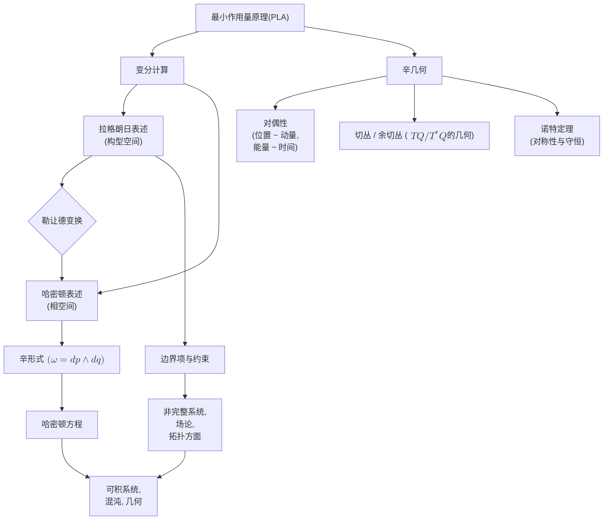

# 最小作用量原理的展望：现代几何视角
* * *

--- 唯有深入探究几何，我们才能揭示物理定律的隐藏统一性。

# **1. 引言**  
*题词: “从局部斜率到全局定律：单一原理如何塑造物理学。”*

## 1.1 动机与背景

为什么重新审视最小作用量原理(PLA)？尽管自莫佩尔蒂、欧拉和拉格朗日以来，PLA 一直是理论物理学的基石，但其几何深度在现代研究中仍在不断展开。经典教科书通常侧重于如何推导运动方程，但在这些标准推导之下隐藏着一个强大的洞见：自然定律似乎在几何意义上被“优化”(或极值化)。这一洞见暗示了一个更为广泛的原则 —— 它可以统一从光学到量子力学乃至更广泛的领域。

历史上，PLA 源于变分思维：如何通过“最小度量路径”来描述轨道、轨迹或波前。最初，数学家和自然哲学家对这一原则的范围进行了辩论 —— 它是“最短时间”，“最短距离”，还是“最小能量”？经过几个世纪的发展，我们了解到“最小”有时是“驻点”或“鞍点”；“作用量”概念本身也扩展到包含动能和势能或更抽象的拉格朗日量。

从**现代视角**来看，重新审视 PLA 有两个主要好处：

1. **几何统一性**：我们看到，拉格朗日力学(关注构型空间中的速度)和哈密顿力学(关注相空间中的动量)通过勒让德变换和余切丛的几何结构联系在一起 —— 这一洞见在标准处理中并不总是被突出。

2. **研究前沿**：辛几何、规范理论、拓扑场论以及广义相对论中的引力方法都利用了变分或“最小作用量”表述。理解这些现代扩展需要更深入地探讨经典 PLA 如何支撑它们。

因此，我们的动机不是复制标准推导，而是突出其背后的几何协同效应；我们旨在展示变分原理的概念清晰性如何照亮新的研究方向。

## 1.2 经典变分原理概述

在其最经典的表述中，变分原理指出：对于由坐标 $y$ (或 $q$)描述的机械系统，两个构型 $\left(x_0,\,y_0\right)$ 和 $\left(x_1,\,y_1\right)$ 之间的实际路径是使作用量泛函
$$
J[y] \;=\; \int_{x_0}^{x_1} L\left(x,\;y,\;y'\right)\,\mathrm{d}x,
$$
取极值的路径，其中 $y' = \frac{\mathrm{d}y}{\mathrm{d}x}$，$L$ 是拉格朗日量。欧拉-拉格朗日方程，
$$
\frac{\partial L}{\partial y} \;-\; \frac{\mathrm{d}}{\mathrm{d}x}\!\left(\frac{\partial L}{\partial y'}\right) \;=\; 0,
$$
作为 $J[y]$ 在 $y$ 的小扰动下保持不变的必要条件而出现。

**局限性与潜力：**
尽管这一原理优雅地得出运动方程，但某些复杂性 —— 如约束、非完整系统或更高级的几何结构 —— 测试经典处理的边界。**势**产生于边界项、广义坐标和高级几何结构(辛几何、泊松几何等)之间的相互作用。通过深入几何，我们看到：

- 通常的“边界条件”编码拓扑和全局约束，这些约束可以极大地改变系统的解。
- 变分的线性结构 $y \mapsto y + \epsilon\,\eta(x)$ 可以推广到无限维流形和更复杂的变换。

**读者的前提与我们的深化目标：**
我们假设读者熟悉基本的变分微积分和标准的欧拉-拉格朗日方法。在这里，我们旨在：

1. **重新审视**该原理，强调从几何角度出发，重点关注切丛和余切丛以及辛流形。
2. **突出**更深层次的类比 —— 例如，作用量中的边界项如何反映全局“拓扑”影响，拉格朗日和哈密顿图景中通过勒让德变换如何产生对偶性。
3. **连接**到高级概念 —— 为什么黎曼几何中的零挠率平行于极值泛函中的零边界项，辛几何如何通过闭合 $2$-形式将难以捉摸的“作用量”概念推广。

因此，经典变分原理不仅仅是通往微分方程的快捷途径；它是物理定律中隐藏几何结构的根本见证。后续章节将详细阐述这些几何基础，从标准的拉格朗日观点步入更广阔的哈密顿/辛域。

# **2. 重温变分法基础**
*题词：“微小的变化，深远的影响：变分法。”*

## 2.1 泛函、微分与欧拉-拉格朗日方程

大多数读者熟悉通过设置 $\mathrm{d}f/\mathrm{d}x = 0$ 来优化单变量函数 $f(x)$。在**变分法**中，我们将这一概念从“函数的极值”提升到“泛函的极值”。一个**泛函**
$$
J[y(x)] \;=\; \int_{x_{0}}^{x_{1}} F\left(x,\;y(x),\;y'(x)\right)\,\mathrm{d}x
$$  
将整个函数 $y(\cdot)$ 映射为一个实数。然后我们寻找一个使 $J$ 对小扰动保持驻定的函数 $y = y_{\mathrm{ext}}$。求解这个驻定条件的路径称为**极值曲线**。

### 2.1.1 函数空间中的极值概念
在单变量微积分中，“驻定”意味着 $\frac{\mathrm{d}f}{\mathrm{d}x} = 0$，而在函数空间中，“驻定”意味着  
$$
\left.\frac{\mathrm{d}}{\mathrm{d}\epsilon} J\left[y + \epsilon\,\eta(x)\right]\right|_{\epsilon=0} \;=\; 0,
$$  
对于所有满足 $\eta(x_0) = \eta(x_1) = 0$ 的允许变化 $\eta(x)$。这种无限维空间中的“方向导数”概念是 $J$ 的**一阶变分**。

### 2.1.2 欧拉-拉格朗日方程的推导
具体地，我们写为  
$$
J\left[\bar{y}\right] \;=\; \int_{x_0}^{x_1} F\!\left(x,\;\bar{y},\;\bar{y}'\right)\,\mathrm{d}x,\quad
\bar{y} \;=\; y(x)\;+\;\epsilon\,\eta(x).
$$  
取 $\frac{\mathrm{d}}{\mathrm{d}\epsilon}\left(J[\bar{y}]\right)$ 并使用莱布尼茨法则和链式法则得到  
$$
\frac{\mathrm{d}J}{\mathrm{d}\epsilon} \;=\; \int_{x_0}^{x_1} \left(\frac{\partial F}{\partial \bar{y}}\,\eta \;+\; \frac{\partial F}{\partial \bar{y}'}\,\eta'\right)\,\mathrm{d}x.
$$  
涉及 $\eta'$ 的项可以通过部分积分处理：  
$$
\int_{x_0}^{x_1}\!\!\frac{\partial F}{\partial \bar{y}'}\,\eta'\,\mathrm{d}x \;=\;
\left[\frac{\partial F}{\partial \bar{y}'}\,\eta\right]_{x_0}^{x_1} \;-\; \int_{x_0}^{x_1}\!\!\eta \,\frac{\mathrm{d}}{\mathrm{d}x}\left(\frac{\partial F}{\partial \bar{y}'}\right)\mathrm{d}x.
$$  
由于 $\eta(x_0)=\eta(x_1)=0$，边界项消失(为零)，留下  
$$
\frac{\mathrm{d}J}{\mathrm{d}\epsilon} \;=\;\int_{x_0}^{x_1}\!\left[\frac{\partial F}{\partial \bar{y}} \;-\; \frac{\mathrm{d}}{\mathrm{d}x}\!\left(\frac{\partial F}{\partial \bar{y}'}\right)\right]\eta\,\mathrm{d}x.
$$  
为了对**任意** $\eta$ 都成立，被积函数必须为零，从而得出**欧拉-拉格朗日方程**：
$$
\frac{\partial F}{\partial \bar{y}} \;-\; \frac{\mathrm{d}}{\mathrm{d}x}\!\left(\frac{\partial F}{\partial \bar{y}'}\right)\;=\;0.
$$  
因此，从微小泛函偏差的角度来看，局部微分方程(欧拉-拉格朗日方程)作为驻定性的普遍条件出现。

## 2.2 边界项、驻定作用量与物理约束

在处理实际物理系统时，边界条件至关重要。我们通常固定端点：
$$
y(x_0)\;=\;y_0,\quad y(x_1)\;=\;y_1,
$$
并要求变化 $\eta$ 在这些端点处消失(为零)，确保路径确实连接相同的物理状态。这一条件消除了部分积分产生的非零边界项。物理上，这意味着“没有自由度来改变初始和最终点”，这与实验如何固定初始和最终配置一致。

在更复杂的情景下(例如自由边界条件、特殊约束或场论中的开放边界)，边界项不会轻易消失(为零)：
$$
\left[\frac{\partial F}{\partial y'}\;\eta\right]_{x_0}^{x_1}\;\neq\;0,
$$
导致额外的条件或关于 $\frac{\partial F}{\partial y'}\left(\pm\!\right)$ 的澄清。例如：

- **反射约束**：在端点指定类似动量的量。
- **带有拓扑边界项的作用量**：将局部动力学与全局几何联系起来。

### 2.2.1 驻定作用量的物理意义
驻定作用量表明路径的第一阶变化不会导致积分的整体变化。这种视角统一了牛顿力学、光学、量子波等。约束成为“全局故事”的一部分：它们可以超越局部欧拉-拉格朗日方程来改变或细化动力学，从而建立“局部”(微分方程)和“全局”(边界/约束条件)之间的协同作用。

## 2.3 勒让德变换：辛桥接

**勒让德变换**在从拉格朗日 ($L$) 到哈密顿 ($H$) 力学的过渡中起关键作用。从纯代数的观点看：
$$
p \;=\;\frac{\partial L}{\partial \dot{q}},\quad
H(q,p) \;=\;p\,\dot{q}\;-\;L(q,\dot{q}),
$$
其中用 $p$ 替代 $\dot{q}$。然而，几何上，这个变换做了更多：它将系统从切丛 $(q,\dot{q})$ 重新映射到余切丛 $(q,p)$。由此，我们从“构型 + 速度”表示转换到“构型 + 动量”表示。

### 2.3.1 定义与概念意义
勒让德变换优雅地捕捉了动量如何与速度**共轭**，从而连接拉格朗日和哈密顿图像。实际上，它说的是：将你的视角从“能量减去势能”转变为“以动量表示的能量”。这种转变不仅仅是代数上的方便 —— 它揭示了一个深层次的几何结构，在该结构中 $p$ 自然属于余切纤维而非正切纤维。

### 2.3.2 统一拉格朗日与哈密顿图像
勒让德变换至关重要的一个原因是：**辛几何**在余切丛上自然出现。拉格朗日力学处理切丛上的 $(q,\dot{q})$，而哈密顿力学使用余切丛上的 $(q,p)$ 和辛形式
$$
\omega \;=\; \sum_{i}\!\mathrm{d}q_{i}\,\wedge\,\mathrm{d}p_{i}.
$$
这个 $\omega$ 是闭合的($\mathrm{d}\omega=0$)且非退化的，赋予一种强大的几何结构，促进哈密顿运动方程作为辛流形上的测地线流。

通过这座“桥梁”，人们可以看到每种方法(拉格朗日或哈密顿)都是潜在几何的一种部分反映。勒让德变换强制这些反映的等价性，确保每种方法都给出相同的物理内容，但使用**对偶**坐标语言。

### 2.3.3 更深层的意义
在高级背景下 —— 如场论、规范理论或广义相对论 —— 勒让德变换链接不同的泛函描述或揭示隐藏的对称性。简而言之，勒让德变换不仅仅是重写微分方程的技巧，而是深刻的陈述，即“运动的力学”可以用多个等效的几何框架表达，每个框架都从新的角度照亮物理。

## 2.4 结论

通过重温这些变分基础(欧拉-拉格朗日方程的推导、边界项、勒让德变换)，我们可以更好地欣赏切丛/余切丛、辛流形的协同作用，并最终认识到现代观点认为几何与物理 —— 远非分离 —— 在其核心是交织在一起的。

# **3. 从构型空间到相空间**
*题词：“视角的转变：从速度到动量，从切丛到余切丛。”*

## 3.1 切丛与余切丛

在经典拉格朗日力学中，我们通常使用**构型空间**来描述系统的状态，其点是坐标 $\left(q^{1},\dots,q^{n}\right)$。然后添加速度 $\left(\dot{q}^{1},\dots,\dot{q}^{n}\right)$ 来形成**切丛** $T\mathcal{Q}$ 的一个元素。这里：
$$
T\mathcal{Q} \;\;=\;\; \{(q,\dot{q}) \mid q \in \mathcal{Q},\;\dot{q}\in T_{q}\mathcal{Q}\}.
$$
几何上，每个纤维上的点是切空间 $T_{q}\mathcal{Q}$。拉格朗日量 $L(q,\dot{q},t)$ 则存在于这个切丛加上时间上。

### 3.1.1 为什么选择余切丛？
相比之下，**相空间**建立在**余切丛** $T^{*}\!\mathcal{Q}$ 上。我们不使用速度，而是使用与坐标 $q^{i}$ 共轭的动量 $\left(p_{1},\dots,p_{n}\right)$。即，
$$
T^{*}\!\mathcal{Q} \;\;=\;\; \{(q,p) \mid p \in T_{q}^{*}\!\mathcal{Q}\},
$$
其中 $p$ 属于余切空间 $T_{q}^{*}\!\mathcal{Q}$。这种转变很重要，因为物理测量 —— 如广义力和能量 —— 往往自然地用 $\left(q,p\right)$ 的语言表示。更具体地说：

- **动力学**：哈密顿方程围绕 $\dot{q} = \partial H/\partial p$ 和 $\dot{p} = -\partial H/\partial q$。
- **能量**：哈密顿量 $H(q,p)$ 通常是能量表达式(动能 + 势能)。
- **测量**：力为 $\mathrm{d}p/\mathrm{d}t$，运动积分在 $(q,p)$ 形式下显得更为直接。

因此，从几何到物理，余切丛不仅仅是好奇心：它支撑了**哈密顿力学**，正是因为动量“存在于”速度的对偶空间中。

### 3.1.2 构型空间 vs 相空间：视角的深度
从 $T\mathcal{Q}$ (拉格朗日观点)移动到 $T^{*}\!\mathcal{Q}$ (哈密顿观点)不仅是勒让德变换 —— 也是我们理论基础几何舞台的**改变**。我们从一个基于“速度”的流形转向一个基于“动量”的流形，揭示出新的结构(例如辛形式)，这对高级主题如可积系统、几何量子化等至关重要。

## 3.2 辛几何要点

虽然切丛捕捉了运动的概念(速度)，但**余切丛** $T^{*}\mathcal{Q}$ 通常配备一个典范的**辛形式**：
$$
\omega \;=\;\mathrm{d}q^{i}\wedge \mathrm{d}p_{i},
$$
其中对 $i$ 求和(爱因斯坦求和约定)。让我们强调其基本性质：

1. **非退化性**：对于每个点 $(q,p)\in T^{*}\mathcal{Q}$，$\omega$ 是一个双线性 $2$-形式，它以一种方式配对切向量，使得如果 $\omega(v,w)=0$ 对所有 $w$ 成立，则 $v=0$。这确保了几何的稳健性 —— 粗略地说，$\omega$ 可以反转向量分量以产生哈密顿方程。

2. **封闭性 ($\mathrm{d}\omega=0$)**：辛形式 $\omega$ 是封闭的，意味着 $\mathrm{d}\omega=0$。因此，局部存在“典范坐标” $(q^{i},p_{i})$，依据 $\omega$ 具有典范表达式。封闭性还支持守恒律，并且是“哈密顿流”在相空间中保持体积这一概念的核心。

### 3.2.1 几何意义
余切丛 $T^{*}\mathcal{Q}$ 上辛形式 $\omega$ 的存在赋予相空间一种特殊几何：**辛几何**。在这种几何中，

- 哈密顿方程作为由 $\iota_{X_{H}}\omega = \mathrm{d}H$ 定义的哈密顿向量场 $X_{H}$ 的**流线**出现。
- 诺特定理将 $H$ 中的连续对称性与守恒量联系起来：每个对称性对应一个保留 $\omega$ 的流。一个主要例子：时间平移不变性 $\Rightarrow$ 能量守恒。

### 3.2.2 为什么是“辛的”？
经典上，人们将 $(q,p)$ 视为简单的“$2n$-坐标”。然而，辛观点表明 $(q,p)$ 不是任意坐标：它们伴随着一个封闭的 $2$-形式 $\omega$，这个形式塑造整个动力学。这种几何帮助统一广泛领域 —— 从行星轨道到量子波函数的“相空间” —— 在一个单一的结构范式下。

## 3.3 相空间中的哈密顿原理

我们经常看到最小作用量原理以拉格朗日坐标 $\left(q,\dot{q}\right)$ 表述。然而，有一个等价的陈述 —— **哈密顿原理** —— 在相空间中：
$$
\delta\!\int \left[\;p_{i}\,\mathrm{d}q^{i} \;-\; H(q,p)\,\mathrm{d}t\right] \;=\; 0,
$$
其中变分相对于轨迹 $(q(t),p(t))$ 进行。因为 $\omega = \mathrm{d}q^{i}\wedge \mathrm{d}p_{i}$ 是底层的辛形式，驻定条件恢复了哈密顿方程，就像它们是在辛流形上的测地线一样。

### 3.3.1 辛流形上的测地流
在微分几何中，黎曼流形上的测地线是最“直”的可能线。类似地，在具有哈密顿量 $H$ 的辛流形上，沿着 $(q(t),p(t))$ 的流动在保持 $\omega$ 的意义上是最“直”的。这种视角阐明了为什么相空间中的经典轨道有时表现出美丽的几何行为 —— $\omega$ 沿着其解保持不变，提供不可压缩的流。

### 3.3.2 与诺特定理的关系(简要提及)
诺特定理声称，对于作用量(或哈密顿量)的每个连续对称性，都有一个相关的守恒量。在哈密顿形式中，每个对称性对应一个保持 $\omega$ 不变的典范变换。例如：

- 时间不变性 $\Rightarrow$ 能量守恒。
- 旋转不变性 $\Rightarrow$ 角动量守恒。

尽管我们不会详细说明每一个证明，但辛设定简化了诺特定理的论证：“对称性” $=$ 在某种意义上保持 $\omega$ 和 $H$ $\Rightarrow$ 存在一个运动积分。

## 3.4 结论

总之，从**构型空间**迁移到**相空间**并接受辛几何不仅仅是一个“细节”，而是一个深刻的概念转变。切丛的速度视角让位于余切丛上的动量视角，揭示辛形式、哈密顿方程以及支撑经典和现代力学的更广泛的统一几何。

# **4. 深层结构与对偶性**
*题词：“每个对偶性中都隐藏着更深的统一。”*

## 4.1 力学中的对偶性：位置 $\sim$ 动量，能量 $\sim$ 时间

现代数学物理中最深刻的教训之一是，看似对立的量通常以**配对**的形式出现，由底层几何或对称性统一。在经典力学中，我们通过以下方式看到这些对偶性的出现：

### 4.1.1 位置 $\sim$ 动量
在哈密顿形式主义中，每个坐标 $q^i$ 都有一个对应的动量 $p_i$。虽然最初可能将 $(q,p)$ 视为扩展变量集，但辛几何揭示了更深层次的结构：$p$ 自然地存在于速度的**对偶空间**中。这种配对有时被称为**典范共轭**。在相空间中，正是辛形式
$$
\omega \;=\;\mathrm{d}q^i \wedge \mathrm{d}p_i
$$
编码这种对偶性，确保每个坐标都有一个唯一的动量伙伴。

### 4.1.2 能量 $\sim$ 时间
另一个经典的对偶性体现在能量和时间之间的关系中。在哈密顿力学中，时间演化由 $\dot{q}^i = \partial H/\partial p_i$ 和 $\dot{p}_i = -\partial H/\partial q^i$ 控制，其中 $H$ 被识别为总能量。在某些扩展形式中，“时间的变化率”由 $\frac{\partial}{\partial E}$ 控制，类似于 $(q,p)$ 的对偶结构。在量子力学中，这表现为著名的能量-时间互补性(尽管比位置-动量更为微妙)。

### 4.1.3 对偶性如何帮助统一视角
对偶性通常允许我们在不丢失任何物理信息的情况下从一个视角切换到其“伙伴”视角。例如：

- **基于速度的**拉格朗日 $\mapsto$ **基于动量的**哈密顿。
- “实空间”波函数 $\mapsto$ 量子力学中的“倒易空间”波函数。

这些变换强调了同一现象可以用互补的方式描述，强化了许多物理理论本质上是几何的观点，对偶性揭示相同底层结构的不同“面孔”。

## 4.2 扭率、曲率及潜在扩展

在微分几何中，两个用于刻画流形上联络的关键概念是**扭率**和**曲率**。虽然经典力学的标准处理通常假设无扭率环境(例如黎曼几何中的列维-奇维塔联络)，但在高级物理框架中可能会出现具有非零扭率的扩展或类比：

### 4.2.1 联络中的扭率
对于带有联络 $\nabla$ 的流形 $\mathcal{M}$，扭率张量 $T(X,Y)$ 测量 $\nabla_{X}Y - \nabla_{Y}X$ 与李括号 $[X,Y]$ 之间的差异。如果扭率为零，我们说该联络是无扭率的(如标准黎曼几何)。

### 4.2.2 辛几何中的非闭合形式
辛形式 $\omega$ 是**闭合**的，$\mathrm{d}\omega=0$。在某些扩展框架中(例如带有外部场的机械系统、非完整约束或破坏精确性的耦合)，可能出现非闭合的“几乎为辛的”形式。这些情况与几何中的“类似扭率”的结构平行，因为“非闭合性”修改了流和积分的行为。

### 4.2.3 进一步的推广
在尝试纳入复杂性如拓扑项、规范场或奇异约束时，可以看到与带扭率联络的类比：

- $\mathrm{d}\omega \neq 0$ 暗示新的边界相互作用或扭曲的辛结构。
- 如果 $\nabla$ 被更一般的具有扭率的联络取代，通常的局部或全局不变量(如诺特定理荷)可能需要重新解释。

虽然这些仍有些超出经典力学的基础，但它们指向了统一领域(无论是数学还是物理意义上)的深层几何扩展。

## 4.3 超越标准系统：广义坐标、非完整约束

并非所有机械系统都能整齐地纳入标准拉格朗日或哈密顿模板。在更高级或现实的模型中，约束和坐标选择变得更加复杂。几何再次成为我们的盟友：

### 4.3.1 当几何变得更为复杂
具有**非完整约束**(如滚动而不滑动)的系统通常需要仔细处理定义“允许速度”的函数空间或分布。辛技术仍然适用，但我们可能需要采用扩展的狄拉克-伯格曼公式或使用泊松结构而不是完全辛结构。

### 4.3.2 来自高级微分几何的工具

- **纤维丛**：如果系统具有内部对称性(如旋转、规范场)，我们可以考虑主丛和规范联络。
- **分布理论和帕夫连科约束**：非完整约束常表现为 $\alpha(q,\dot{q})=0$ 对于某个帕夫连科形式 $\alpha$。这些分布的几何形状决定了结果的“约化”动力学。
- **泊松或狄拉克结构**：即使 $\omega$ 部分退化或被约束修改，广义泊松括号可以在扩展意义上保留哈密顿流的概念。

因此，超越经典“干净”系统的需求正是几何扩展 —— 扭率、曲率、约束、丛 —— 反映了高层概念、局部微分方程和全局拓扑数据之间的深层协同作用。

## 4.4 结论

总之，像 $(q,p)$ 或 $(E,t)$ 这样的对偶性不仅仅是整洁的数学对称性；它们是通往更深层次几何统一的门户。同时，探索扭率、曲率和约束揭示了来自“教科书”的假设，小偏离如何导致大概念上的转变 —— 这通常架起了经典力学与高级几何之间的桥梁。通过识别并拥抱这些深层结构，人们可以看到最小作用量原理如何优雅地编织通过复杂领域，从非完整的运动学到拓扑场论。

# **5. 提升拉格朗日与哈密顿力学**
*题词：“力学，在核心处，就是伪装的几何。”*

## 5.1 为什么要两种表述？

在探讨了基于构型空间中速度的拉格朗日力学和基于相空间中动量的哈密顿力学之后，一个不可避免的问题出现了：**为什么维持两种不同的图像？** 历史上的答案是每种方法都有其独特的优点：

### 5.1.1 互补的优点

- **分析透明性(拉格朗日)**：从定义良好的拉格朗日导出欧拉-拉格朗日方程通常非常直接，尤其是在处理约束或广义坐标时。它与变分原理的直接联系使其非常适合系统地施加边界条件或在高级背景下耦合场(例如，场论)。
- **几何 / 运动积分(哈密顿)**：哈密顿力学引入带有辛形式的**相空间**的概念。这种环境更透明地突显对称性和运动积分(诺特定理、典范变换)，允许关于流、守恒量和可积性的几何论证。
- **解释清晰度**：
  - 在**拉格朗日形式**中：“动能减去势能”促进了能量交换的直观理解。
  - 在**哈密顿形式**中：能量本身通常是哈密顿量，使得 $(q,p)$ 空间中的动力学演化特别直接。

因此，这两种表述与其说是“冗余”的，不如说是同一底层几何的不同视角。

## 5.2 现代见解和可能的研究方向

除了经典教科书之外，许多当代发展利用了拉格朗日和哈密顿形式主义之间的协同作用：

### 5.2.1 非线性动力学与可积系统
现代对混沌、孤子和可积系统的研究经常在基于拉格朗日的“作用量”视角和基于哈密顿的“相空间”视角之间切换。例如，在哈密顿语言中(通过辛几何)发现新的运动积分通常更为简单，但在验证驻定性或边界约束时往往回归到拉格朗日论证。

### 5.2.2 几何量子化
对于最终过渡到量子区域的系统，**几何量子化**试图系统地“量子化”一个辛流形。实际上，人们尝试将经典的典范坐标 $(q,p)$ 解释为希尔伯特空间上的算子，由底层相空间的几何引导。原始的拉格朗日结构有时在路径积分公式中重新出现，再次确认每个视角(拉格朗日或哈密顿)在理论的不同阶段或概念层面上都能闪耀光芒。

### 5.2.3 跨学科连接：复杂系统、机器人学、控制理论
许多超出纯粹物理学领域的学科在变分方法和基于辛的方法中找到了实际应用。例如，控制理论使用哈密顿-雅可比方法解决最优轨迹问题。在机器人运动规划中，“最优路径”反映了最小作用量原理，尽管通常是离散或近似形式。刚体动力学也依赖于哈密顿力学来分析多轴旋转对称性和守恒律。

## 5.3 开放问题 / 挑战

### 5.3.1 推广到场论
即使拉格朗日和哈密顿方法扩展到场(例如，经典场论)，复杂性也会增加：无限维构型空间、规范对称性、空间无穷远处的边界项或拓扑效应(如瞬子)。确保受约束的规范系统的哈密顿结构一致是非常复杂的(狄拉克-伯格曼方法、BRST 量子化)。每个场论突破的时代都以新颖的方式重新解释最小作用量原理的各个方面。

### 5.3.2 引力与时空几何
爱因斯坦的广义相对论可以以变分形式(希尔伯特作用量)表示，但构建一个**哈密顿表述**需要处理 4D 时空几何的约束。阿诺威特-德瑟-米斯纳(ADM)分解以“$(3+1)$ 维”哈密顿风格重写引力动力学，揭示了如何微妙的约束定义物理自由度。关于量子引力的许多问题仍然存在，其中统一拉格朗日(路径积分)和哈密顿(正则量子化)图像仍然是一个突出的挑战。

### 5.3.3 拓扑效应与量子领域
像量子霍尔效应或拓扑绝缘体这样的现象强调了源自全局几何的稳健量子化性质。仅从“局部微分方程”的角度理解这些现象是不完整的；拓扑边界项或“陈-西蒙斯作用量”变得至关重要。将局部欧拉-拉格朗日方程与拓扑约束联系起来，展示了将最小作用量原理应用于先进量子系统的一个主要前沿。

## 5.4 结论

总之，拉格朗日和哈密顿力学构成了物理现象同一几何流形上的两个坐标图。现代实践表明，利用它们之间的协同作用 —— 特别是结合辛几何、边界/约束分析和拓扑理解 —— 解锁了强大的新见解。从可积系统到量子场，从机器人学到引力，这两种表述的相互作用继续激发理论突破和实际创新。

# **6. 结论与未来展望**
*题词：“我们站在一个不断变化的边界上 —— 将原理推向新的领域。”*

## 6.1 关键要点

在前面各节中所进行的旅程突出了一条主线：最小作用量原理(PLA)不仅仅是导出运动方程的配方。相反，它提供了一个统一的框架，该框架连接了：

1. **变分原理与欧拉-拉格朗日方程**：在基础层面，简单的函数变分产生控制经典运动的微分方程。然而这种“简单”的方法掩盖了一种强大的普遍性，将牛顿动力学、光学和波动力学统一在一个伞下。

2. **勒让德变换与辛几何**：通过勒让德变换系统地揭示了拉格朗日($q,\dot{q}$)描述与哈密顿 $(q,p)$ 描述之间的等价性。从几何角度来看，基于 $\left(q,p\right)$ 的相空间被赋予一个辛 $2$-形式，该形式编码典范对易关系，并直接与动量-位置对偶性相关联。

3. **对偶性与深层结构**：共轭变量如 $(q,p)$, $(E,t)$ 及其辛配对的存在强调了 PLA 如何帮助将经典力学与更广泛的物理理论统一起来。扭转、曲率及其他几何概念提供了洞察，将系统的局部细节与全局或拓扑约束联系起来。

总体而言，这些见解表明**几何不仅仅是方便的工具** —— 它是高级机械理论的支柱。PLA 促进了变分计算、勒让德变换、辛几何和对偶性之间的优雅协同作用，提醒我们看到的力学深深植根于丰富的底层几何结构中。

## 6.2 发现潜力

尽管最小作用量原理几个世纪以来一直是基石，但其复杂性仍在不断发展。潜在的前沿包括：

### 6.2.1 新物理现象
在凝聚态物理、拓扑状态和引力波物理等领域，PLA 仍然是一个强大的视角。研究人员不断发现，当以几何术语表述时，该原理可以扩展到新领域，包括有效场论、奇异材料和涌现量子相。

### 6.2.2 跨学科扩展
由几何推理指导的力学 —— 特别是辛结构、泊松结构甚至非辛结构 —— 在纯物理学之外产生了共鸣。应用范围从控制机器人轨迹(最优路径规划)到分析天体物理学中的大规模结构，再到生物学中的复杂系统。一般性的“最小作用”观点光滑地转化为优化问题，加强了跨学科的紧密联系。

### 6.2.3 量子及超越
虽然起源于经典，PLA 支撑了量子力学中的路径积分公式，指向了跨越尺度的真实统一。随着理论物理致力于量子引力或投资于拓扑量子场论，同样的基本变分原理 —— 通过几何放大 —— 承诺了我们才刚刚开始窥见的深层次普遍性。

## 6.3 结论

总之，最小作用量原理作为一门活着且不断发展的基石，持续重新定义我们如何看待所有尺度上的物理定律。从探索涌现现象到桥接如机器人技术和量子理论这样不同的领域，PLA 的几何视角不仅提供了稳健的数学架构，也邀请我们进一步拓展概念边界。

# 附录 A：核心概念及其相互关系

以下是本文档中主要思想的示意图，旨在引导读者了解关键概念以及它们如何相互衔接。该图示强调了从最小作用量原理到变分计算、辛几何和统一看似不同的表述的对偶性的流程。它还强调了边界/约束考虑如何开启高级主题，从非完整系统到场论推广。

**图注**：

1. **最小作用量原理(PLA)**：作为将多个物理表述联系在一起的总体框架，从经典力学到物理学更广泛的领域。

2. **变分计算**：PLA 的基础数学工具包，在其中函数被极值化并产生欧拉-拉格朗日方程。

3. **拉格朗日 vs 哈密顿力学**：
   - 拉格朗日视角在切丛 $T\mathcal{Q}$ (构型空间 + 速度)上操作。
   - 哈密顿视角使用余切丛 $T^{*}\!\mathcal{Q}$ (相空间 + 动量)。
   - 这两种图像通过勒让德变换“连接”，并产生等价的动力学。

4. **辛几何**：为哈密顿力学提供几何框架；非退化的闭合 $2$-形式 $\omega$ 描述了典范坐标 $(q,p)$ 如何驱动系统的演化，并引出如诺特定理等强大概念。

5. **对偶性(位置 $\sim$ 动量，能量 $\sim$ 时间)**：反映了物理定律中的深层结构对称性，无论是在经典还是量子领域都显而易见。

6. **边界项与约束**：指示全局条件(边界条件、约束或拓扑方面)如何改变局部运动方程，并打开通向高级、推广理论(例如，非完整系统、规范场或拓扑场论)的路径。

通过结合文本查阅此图，读者可以更容易地看到文档各部分如何相互交叉和补充，形成一个以几何为导向的关于最小作用量原理的一致视角。

# 附录 B：关于最小作用量原理的哲学与目的论思考

在前面的章节中，我们强调了最小作用量原理(PLA)的几何和数学基础。然而，历史上这一原理也引发了更深层次的哲学辩论，提出了自然是否“选择”最优雅的路径出于某种目的论的原因，或者这一原理仅仅反映了有效的建模立场而不涉及目的或“最终原因”。在本附录中，我们将简要探讨这些观点，并对未来如何在现代讨论中共同存在或超越提出一些展望。

## B.1 历史上的目的论潜流

自亚里士多德时代以来，哲学家和自然科学家都被世界可能在一个统一、最优效率的规则下运作的观点所吸引。莫佩尔蒂和欧拉倡导一种“最少”或“最优”的作用量原理，认为这种经济的努力揭示了自然法则中的深刻优雅。特别是在 18 世纪和 19 世纪的一些阐述中，这些思想带有强烈的目的论色彩 —— 即暗示自然“追求”一个极端，仿佛受到有目的指令的引导。

与亚里士多德的**最终因**概念 —— 自然过程努力达到目标 —— 的共鸣引发了关于该原理本身是否是宇宙设计或“最高智慧”的证据的反思。实际上，欧拉热情洋溢地写道，该原理展示了自然的完美或经济性。这种观点与启蒙时代的广泛努力相协调，试图调和科学与内在理性或神圣秩序的概念。

## B.2 费曼的模型视角

进入 20 世纪，理查德·费曼明确拒绝了对最小作用量原理的任何目的论解读。在他的讲座中，他强调物理学本质上是一个复杂的**模型** —— 这个模型可能使用“作用量最小化”或“轨迹积分”的视角，但并不意味着粒子“知道”或“选择”它们的未来路径。相反：

1. **数学结构，而非目的**：PLA 可以被视为一个正式的组织原则，用于导出与实验匹配的运动方程，但它不需要赋予自然界任何目的导向的原因。
2. **表述的等价性**：无论是使用牛顿第二定律、哈密顿原理还是其他公理方法，都会产生相同的物理预测。因此，PLA 提供了一种统一的语言，但本身并不必然需要目的论解释。

按照费曼的精神，许多现代物理学家会认为该原理的“最小”或“驻定”特性是对潜在**数学对称性和变分一致性**的证明，而不是自然界中的实际“目标”或“目的”。这种视角将基于作用的方法视为强大的工具 —— 特别是在量子场论、路径积分或辛几何中 —— 但对任何形而上学主张保持中立。

## B.3 向更广泛的综合迈进

一个核心张力依然存在：PLA 纯粹是一种经济的数学工具，还是它反映了自然界功能中的固有“经济性”？弥合这些观点可能需要超出经典物理学的考虑，进入几何、复杂性和甚至涌现现象发挥作用的领域：

1. **复杂系统中的涌现目的论**：当我们研究生物学中的自组织过程或大规模宇宙结构时，“类似最小作用量”的原则可以在耗散系统或进化驻定策略中显现。在这里，“最小努力”或“最优”解决方案可能不被视为严格意义上的目的论结果，而是选择压力或路径积分中大相体积优势的结果。
2. **拓扑和非局域方面**：在先进的场论中，边界项、异常和非平凡拓扑有时显得“精细调整”或“优化”。无论将这些特征视为更深层次的自然协同效应还是建模的人工产物仍有待讨论。哲学问题仍然存在：数学是否描述了局部现实如此细致以至于全局“极值”不可避免地出现，还是“全局驻定性”的概念本身就是我们表示框架的产物？
3. **量子极限及以外**：在量子力学中，替代表述(例如，路径积分量子化)将 PLA 重新表述为 $\mathrm{e}^{iS}$，其中**所有**路径都有贡献，但那些接近“经典”驻定作用量路径的占主导地位。这种多种路径与驻定相近似之间的相互作用表明，“经典目的论”可能只是量子态叠加的一个涌现现象。

## B.4 未来的视野

从 21 世纪的角度来看，可以说历史上归因于最小作用量原理的“目的”或“最终原因”可以融入现代的**几何统一**和**变分一致性**叙述中。三个可能的方向来调和或扩展这些辩论包括：

1. **数学柏拉图主义 vs 实用形式主义**：PLA 可能被用来支持一种柏拉图实在论立场 —— 数学法则以某种形而上的方式“存在”，而自然界参与其中。相反，实用形式主义者仅将 PLA 视为众多方便的统一方法之一，没有更深的形而上学意义。
2. **认识论 vs 本体论视角**：一些研究者认为 PLA 反映了我们的**认识论局限性** —— 我们以突出对称性和最小原则的方式编码物理学，因为这些框架在计算或概念上非常强大。一种**本体论**立场则是最小原则揭示了现实“真正是什么”，无论有没有人类观察者。进一步的哲学分析可以探讨这些立场如何与科学发展史和数学不断演变的角色相交。
3. **嵌入更广泛的理论中**：随着新框架的出现(例如，量子引力中的全息原理，拓扑量子场论)，“作用”的含义和范围可能会再次变化。未来理论是否会保留“最小作用量”的特性，还是会揭示更普遍的概念(例如，大希尔伯特空间中的极值或驻定相体积)将继续影响关于目的论、结构和宇宙终极合理性的辩论。

## B.5 结论性反思

虽然本文档强调了最小作用量原理的**几何**和**数学**之美 —— 并且确实展示了它如何从经典力学到现代物理学统一各个领域 —— 其哲学共鸣同样强烈。欧拉和亚里士多德看到了设计或优雅的标志，而费曼及其后续者则强调建模的实用性和内在“目的”的缺失。也许 PLA 真正的力量恰恰在于这种对偶能力：

- **科学上**，它作为局部定律和全局边界条件的精确、统一表述。
- **概念上**，它邀请我们更广泛地思考为什么会出现这样的“作用经济”。

简而言之，PLA 既可以被视为一种严格的计算原则**也可以**视为对自然界潜在几何的一种深刻暗示 —— 而不需要采纳任何单一的形而上学立场。通过促进目的论解释与纯粹方法论解释之间的开放讨论，我们不仅推进了物理理论，还深化了我们对几何、经济和意义追求如何在自然法则的织锦中交织在一起的哲学理解。

