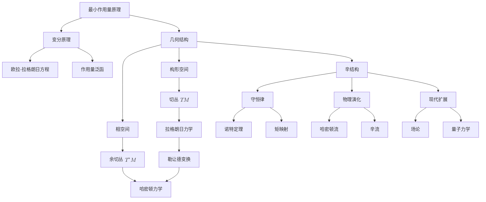
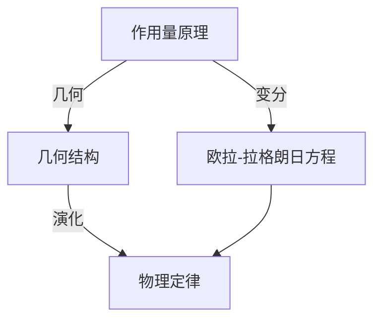
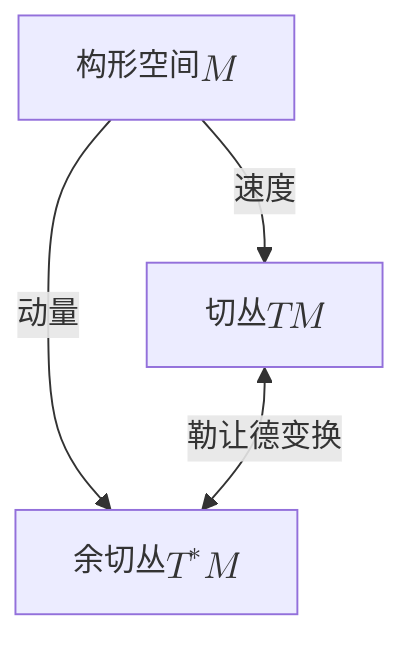
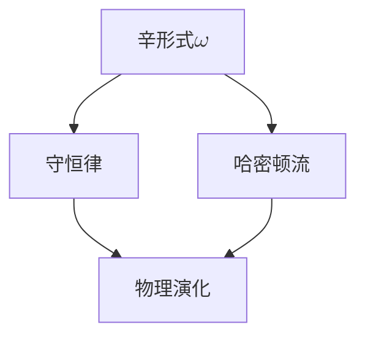
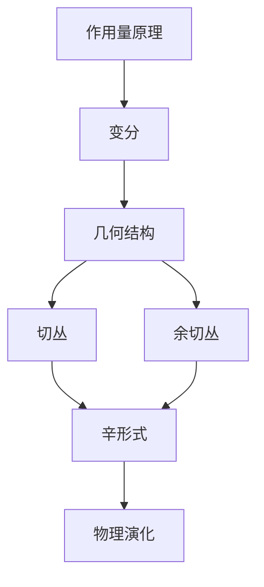
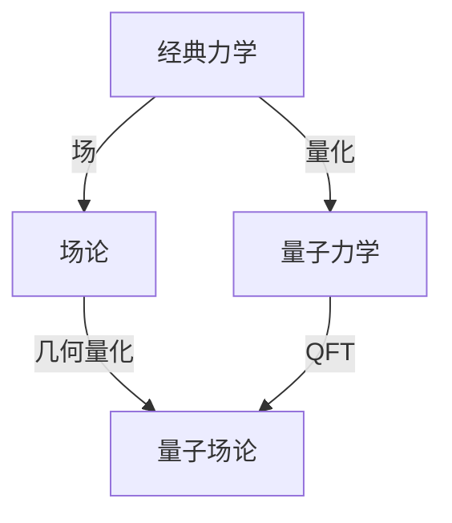

# 物理定律的几何本质：从变分原理到辛结构
* * *

--- 物理在辛流形的几何中流淌

# I. 最小作用原理：几何基础

最小作用原理是物理学中最深刻统一的概念之一，揭示物理定律的深层几何本质。我们不仅将其视为一种计算工具，还将揭开其基本的几何特征，并展示它如何自然地引出现代物理学的丰富结构。

## I.A. 作用量作为几何对象

物理系统的**作用量** $S$ 传统上表示为：
$$
S[q] = \int_{t_1}^{t_2} L(q, \dot{q}, t) \, dt
$$
它远不止是拉格朗日量的积分。它代表了一个测量构形空间中路径“成本”的基本几何对象。

### I.A.1 作用量的几何性质

1. **构形空间结构**
   - 构形空间 $M$ 形成一个光滑流形
   - 路径 $q(t)$ 是 $M$ 中的曲线
   - 作用量为每条路径分配一个“权重”，使其成为路径空间上的泛函

2. **自然几何形式**
   作用量可以重写为明显的几何形式：
   $$
   S = \int \theta
   $$
   其中 $\theta = p_i dq^i - H dt$ 是扩展相空间上的一个 $1$-形式。

### I.A.2 物理解释

1. **作用量作为固有时**
   在相对论系统中，作用量简化为固有时：
   $$
   S = -mc^2 \int d\tau
   $$
   揭示了它与时空几何的紧密联系。

2. **构形空间几何**
   - 作用量测量路径的几何“长度”
   - 物理轨迹是该几何中的测地线
   - 几何结构自然地包含约束条件

## I.B. 变分原理

最小作用原理指出，物理路径使作用量保持驻定：
$$
\delta S = 0
$$
这一简单陈述具有深远的几何意义。

### I.B.1 变分的几何结构

1. **无穷小变形**
   对于路径变分 $\delta q(t)$：
   $$
   \delta S = \int_{t_1}^{t_2} \left(\frac{\partial L}{\partial q^i}\delta q^i + \frac{\partial L}{\partial \dot{q}^i}\delta \dot{q}^i\right) dt
   $$
   表示路径空间中的切向量。

2. **自然分解**
   分部积分揭示几何结构：
   $$
   \delta S = \left[\frac{\partial L}{\partial \dot{q}^i}\delta q^i\right]_{t_1}^{t_2} + \int_{t_1}^{t_2} \left(\frac{\partial L}{\partial q^i} - \frac{d}{dt}\frac{\partial L}{\partial \dot{q}^i}\right)\delta q^i \, dt
   $$
   - 边界项：几何动量
   - 体项：运动方程

### I.B.2 几何结构的涌现

1. **相空间结构**
   变分原理自然引入：
   - 共轭动量：$p_i = \frac{\partial L}{\partial \dot{q}^i}$
   - 相空间坐标：$(q^i, p_i)$
   - 正则一次形式：$\theta = p_i dq^i$

2. **辛几何**
   $\theta$ 的外导数给出辛形式：
   $$
   \omega = d\theta = dp_i \wedge dq^i
   $$
   这一结构自然地从变分原理中涌现。

### I.B.3 与现代物理学的联系

作用量原理的几何表述自然扩展到：

1. **场论**
   - 作用量成为场配置上的泛函
   - 变分产生场方程作为几何条件

2. **量子力学**
   - 路径积分表述：$\int \mathcal{D}q \, e^{iS/\hbar}$
   - 几何相位和拓扑效应

这种对作用量原理的几何视角为理解辛结构如何在物理理论中自然涌现奠定基础，引导我们进入下一节关于几何结构的讨论。

注：本节建立几何基础，同时保持对核心概念的关注，侧重于几何直觉。

# II. 几何结构的自然涌现

尽管最小作用原理揭示了物理定律的几何本质，但诸如切丛、余切丛和辛形式等自然数学结构是从物理考虑中有机地涌现出来，而不由外部强加。这种涌现照亮了物理与几何之间的深刻统一。

## II.A. 从构形空间到相空间

从构形空间到相空间的转变不仅仅是变量的变化，而是反映了我们对力学系统理解中的基本几何进展。

### II.A.1 构形空间作为基底流形

考虑一个具有 $n$ 个自由度的力学系统。其构形空间自然形成一个 $n$ 维光滑流形 $M$。在 $M$ 中的点表示系统的可能状态：
$$
q = (q^1, \dots, q^n) \in M
$$

然而，物理演化涉及位置和速度(或动量)，因此需要额外的几何结构。

### II.A.2 切丛结构

1. **自然涌现**
   - 在每个点 $q \in M$，速度形成一个向量空间 $T_qM$
   - 所有速度空间的集合构成切丛：
     $$
     TM = \bigcup_{q \in M} T_qM
     $$
   - 局部坐标：$(q^i, \dot{q}^i)$

2. **几何意义**
   - 速度作为路径的切向量
   - 拉格朗日量 $L: TM \to \mathbb{R}$ 作为切丛上的函数
   - 物理轨迹作为 $TM$ 中的曲线

### II.A.3 余切丛和相空间

过渡到相空间自然地通过：

1. **动量定义**
   $$
   p_i = \frac{\partial L}{\partial \dot{q}^i}
   $$
   这定义了一个从 $TM$ 到 $T^*M$ 的映射。

2. **自然配对**
   - 动量-速度配对：
     $$
     \langle p, v \rangle = p_i v^i
     $$
   - 维数：$[\text{action}] = [\text{energy}] \times [\text{time}]$

3. **相空间结构**
   - 余切丛 $T^*M$ 作为相空间
   - 自然坐标 $(q^i, p_i)$
   - 正则一次形式：$\theta = p_i dq^i$

## II.B. 辛结构作为自然框架

辛结构不是作为额外假设出现，而是相空间的内在属性。

### II.B.1 辛形式的涌现

1. **自然定义**
   $$
   \omega = d\theta = dp_i \wedge dq^i
   $$
   其中 $\theta$ 是正则一次形式。

2. **基本性质**
   - 闭性：$d\omega = 0$
   - 非退化：$\omega^n \neq 0$
   这些性质源自物理，而非数学便利。

### II.B.2 哈密顿向量场

1. **自然生成**
   对于任意函数 $H: T^*M \to \mathbb{R}$：
   $$
   \iota_{X_H}\omega = dH
   $$
   唯一定义了向量场 $X_H$ 。

2. **物理流**
   - 哈密顿方程自然涌现：
     $$
     \dot{q}^i = \frac{\partial H}{\partial p_i}, \quad \dot{p}_i = -\frac{\partial H}{\partial q^i}
     $$
   - 这些保持辛结构：$\mathcal{L}_{X_H}\omega = 0$

### II.B.3 几何后果

1. **刘维尔定理**
   - 相空间体积守恒
   - 辛结构的自然结果：
     $$
     \frac{d}{dt}(\omega^n) = 0
     $$

2. **泊松结构**
   - 由辛形式涌现：
     $$
     \{f,g\} = \omega(X_f,X_g)
     $$
   - 控制动力学：$\dot{f} = \{f,H\}$

### II.B.4 与量子力学的联系

辛结构自然引出：
1. **几何量化**
   - 预量化：$[\omega/2\pi\hbar] \in H^2(M,\mathbb{Z})$
   - 从经典可观测量得到量子算子

2. **正则对易关系**
   - 经典泊松括号 → 量子对易子：
     $$
     \{q^i,p_j\} = \delta^i_j \to [\hat{q}^i,\hat{p}_j] = i\hbar\delta^i_j
     $$

这种从物理原则自然涌现的几何结构为理解对偶性和勒让德变换的基本作用奠定基础，我们在下一节中探讨这些内容。

注：本节强调几何结构的自然涌现，同时保持数学精确性。

# III. 对偶性与勒让德变换

勒让德变换远不只是在拉格朗日力学和哈密顿力学之间转换的计算工具，它表示一种深刻的几何映射，揭示物理中的基本对偶性。这些对偶性不是人为构造的，而是从力学系统的几何结构中自然涌现出来的。

## III.A. 变换的几何性质

勒让德变换可以从几何上理解为切丛和余切丛之间的映射，该映射保留基本的物理信息，同时揭示更深层次的几何结构。

### III.A.1 丛映射结构

1. **几何框架**
   - 在丛之间进行变换 $\mathcal{L}: TM \to T^*M$：
     $$
     \begin{array}{ccc}
     TM & \xrightarrow{\mathcal{L}} & T^*M \\
     \downarrow & & \downarrow \\
     M & = & M
     \end{array}
     $$
   - 保持基底流形结构，同时将速度交换为动量

2. **自然构造**
   对于正则拉格朗日量 $L: TM \to \mathbb{R}$：
   $$
   p_i = \frac{\partial L}{\partial \dot{q}^i}
   $$
   这个映射自然地从变分原理中产生。

### III.A.2 几何性质

1. **纤维上的变换**
   - 独立作用于每个纤维：
     $$
     T_qM \to T^*_qM
     $$
   - 保持丛中的垂直结构

2. **自然配对**
   变换保持基本配对：
   $$
   \langle p, v \rangle = p_i v^i
   $$
   这个配对在几何上有重要意义，表示单位时间内的作用量。

### III.A.3 哈密顿量的生成

哈密顿量从几何上涌现：
$$
H(q,p) = \sup_v \{\langle p, v \rangle - L(q,v)\}
$$
这个上确界具有作为对偶函数的几何意义。

## III.B. 基本对偶性

勒让德变换揭示物理中的几个基本对偶性，每个对偶性都有深刻的几何意义。

### III.B.1 位置-动量对偶性

1. **几何起源**
   - 位置 $(q^i)$ 作为基底流形上的坐标
   - 动量 $(p_i)$ 作为 $T^*M$ 中纤维的坐标
   - 通过辛形式的自然配对：
     $$
     \omega = dp_i \wedge dq^i
     $$

2. **物理表现**
   - 在动力学中的互补角色：
     $$
     \{q^i, p_j\} = \delta^i_j
     $$
   - 量子力学中不确定性原理的几何基础

### III.B.2 能量-时间对偶性

1. **扩展相空间**
   - 时间作为参数 → 坐标
   - 能量作为共轭变量：
     $$
     \theta_{ext} = p_i dq^i - H dt
     $$

2. **几何结构**
   - 扩展辛形式：
     $$
     \omega_{ext} = dp_i \wedge dq^i + dH \wedge dt
     $$
   - 能量守恒作为几何不变性

### III.B.3 拉格朗日-哈密顿对偶性

1. **几何对应**
   - 拉格朗日量：$L: TM \to \mathbb{R}$
   - 哈密顿量：$H: T^*M \to \mathbb{R}$
   通过以下关系连接：
   $$
   \frac{\partial L}{\partial \dot{q}^i} \leftrightarrow p_i \leftrightarrow \frac{\partial H}{\partial p_i}
   $$

2. **物理解释**
   - 拉格朗日量：局部动力学(速度)
   - 哈密顿量：全局不变量(动量)
   这些对偶视角在几何上是等价的。

### III.B.4 更深层次的含义

1. **对称性-守恒量对偶性**
   - 几何对称性 ↔ 守恒量
   - 通过诺特定理：
     $$
     \delta S = 0 \leftrightarrow \text{Conservation Law}
     $$

2. **量子对偶性**
   经典对偶性延伸到量子力学：
   - 位置-动量：$[\hat{q}, \hat{p}] = i\hbar$
   - 能量-时间：$\Delta E \Delta t \geq \hbar/2$
   这些量子对偶性继承了几何结构。

### III.B.5 与现代物理学的联系

这些基本对偶性自然地延伸到：
1. **场论**
   - 场 ↔ 共轭场动量
   - 规范变换 ↔ 约束条件

2. **弦理论**
   - T-对偶
   - S-对偶
   反映更深层次的几何结构。

这种通过对偶性的几何理解为理解物理演化作为几何流奠定基础，我们在下一节中探讨这一内容。

注：本节强调对偶性的几何性质，同时保持对基本物理洞见的关注。

# IV. 物理演化作为几何流

物理系统的演化通过辛流形上的几何流揭示其最深层的本质。这一视角统一了动力学和几何，展示了守恒律如何自然地从几何不变性中涌现。

## IV.A. 哈密顿流

物理系统在相空间中的流保持基本的几何结构，揭示几何与物理演化之间的紧密联系。

### IV.A.1 流的几何结构

1. **哈密顿向量场**
   对于任意函数 $H: T^*M \to \mathbb{R}$，相关的向量场 $X_H$ 由以下方程定义：
   $$
   \iota_{X_H}\omega = dH
   $$
   这个几何方程完全确定了系统的演化。

2. **流的性质**
   由 $X_H$ 生成的流 $\phi_t$ 保持：
   - 辛形式：$\phi_t^*\omega = \omega$
   - 能量曲面：$H \circ \phi_t = H$
   - 相空间体积：$\mathcal{L}_{X_H}\omega^n = 0$

### IV.A.2 几何结构的保持

1. **辛不变性**
   - 流保持辛形式：
     $$
     \mathcal{L}_{X_H}\omega = 0
     $$
   - 这确保正则对易关系保持不变

2. **刘维尔定理**
   相空间体积的保持：
   $$
   \frac{\partial}{\partial t}(\omega^n) = 0
   $$
   作为几何必然性出现。

## IV.B. 守恒律作为几何不变量

守恒律不是额外的约束条件，而是从系统的几何对称性中自然涌现出来的。

### IV.B.1 诺特定理：几何表述

1. **对称性-守恒对应**
   对于任意单参数对称群 $\phi_s$：
   $$
   \phi_s^*\omega = \omega \implies \exists \text{ conserved quantity }
   $$

2. **矩映射构造**
   矩映射 $\mu: T^*M \to \mathfrak{g}^*$ 编码守恒量：
   $$
   \langle \mu(x), \xi \rangle = H_\xi(x)
   $$
   其中 $H_\xi$ 是生成对称性的哈密顿量。

### IV.B.2 几何不变量

1. **作用量不变量**
   对于相空间中的任意闭合路径 $\gamma$：
   $$
   \oint_\gamma p_i dq^i = \text{invariant}
   $$
   这个几何不变量是量子条件的基础。

2. **庞加莱-嘉当积分不变量**
   更一般地：
   $$
   \int_\Sigma \omega^k = \text{invariant}
   $$
   对于随着系统流动的任意 $2k$ 维曲面 $\Sigma$ 成立。

### IV.B.3 物理守恒律

几何框架揭示了基本守恒律的起源：

1. **能量守恒**
   - 时间平移对称性
   - 由哈密顿量生成
   - 几何不变性：$\frac{dH}{dt} = 0$

2. **角动量**
   - 旋转对称性
   - $SO(3)$ 作用的矩映射
   - 几何守恒：$\mathcal{L}_{X_H}J = 0$

3. **线动量**
   - 平移对称性
   - $\mathbb{R}^3$ 作用的矩映射
   - 空间平移的几何不变性

### IV.B.4 对现代物理学的影响

1. **场论**
   - 由规范对称性产生的守恒律
   - 无限维矩映射
   - Ward 恒等式的几何起源

2. **量子系统**
   - 几何量化保持对称性
   - 量子数来自几何不变量
   - 算符形式的守恒律

### IV.B.5 深层几何统一

保持几何结构揭示了：

1. **统一框架**
   - 动力学 ↔ 几何流
   - 对称性 ↔ 守恒律
   - 演化 ↔ 辛微分同胚

2. **物理原理**
   所有这些都源自几何：
   - 守恒律
   - 演化方程
   - 量子条件

这种对物理演化和守恒律的几何理解为将这些思想扩展到现代物理学奠定了基础，我们在下一节中探讨这一内容。

注：本节强调了物理原理的几何起源，同时保持数学精确性。

# V. 现代视角

为经典力学发展起来的几何框架自然地延伸到现代物理学，揭示了几何与物理定律之间的更深层次联系。这一扩展照亮了场论和量子力学，展示了几何结构在所有物理描述层次上的持久性。

## V.A. 场论和规范理论

从粒子力学过渡到场论需要将我们的几何框架扩展到无限维，揭示新的结构同时保持基本的几何原理。

### V.A.1 无限维扩展

1. **场构形空间**
   - 场作为纤维丛的截面：
     $$
     \phi: M \to E
     $$
    其中 $M$ 是时空，$E$ 是场丛。

2. **辛结构**
   - 无限维相空间：
     $$
     \omega = \int_\Sigma \delta\pi \wedge \delta\phi \, d^nx
     $$
   - 保持无限维中的几何性质

3. **作用量原理**
   $$
   S[\phi] = \int_M \mathcal{L}(\phi,\partial_\mu\phi) \, d^nx
   $$
    其保留了作为射流丛积分的几何意义。

### V.A.2 规范理论结构

1. **主丛**
   - 规范群 $G$ 作用于主丛 $P \to M$
   - 连接形式 $\mathcal{A}$ 作为基本对象
   - 曲率 $F = dA + A \wedge A$ 作为几何不变量

2. **几何框架**
   - 构形空间：$\mathcal{A}/\mathcal{G}$
   - 辛约化：
     $$
     T^*\mathcal{A}/\mathcal{G} \cong \mathcal{M}
     $$
    保持几何结构

3. **杨-米尔斯理论**
   - 作用量：
     $$
     S[A] = -\frac{1}{4} \int_M \text{Tr}(F_{\mu\nu}F^{\mu\nu}) \, d^4x
     $$
   - 规范不变性的几何起源

## V.B. 量子方面

经典力学的几何结构为通过几何量化和路径积分理解量子力学提供基础。

### V.B.1 几何量化

1. **预量化**
   - 带有连接 $\nabla$ 的线丛 $L \to M$：
     $$
     \text{curv}(\nabla) = -\frac{i}{\hbar}\omega
     $$
   - 量子条件：$[\omega/2\pi\hbar] \in H^2(M,\mathbb{Z})$

2. **极化**
   - 量子态作为极化截面
   - 垂直极化 → 位置表示
   - 水平极化 → 动量表示

3. **量子算子**
   - 经典可观测量 $f \to \hat{f}$：
     $$
     \hat{f} = -i\hbar\nabla_{X_f} + f
     $$
   - 保持几何结构：
     $$
     [\hat{f},\hat{g}] = -i\hbar\widehat{\{f,g\}}
     $$

### V.B.2 路径积分表述

1. **量子传播子**
   $$
   K(q_f,t_f;q_i,t_i) = \int \mathcal{D}q \, \exp\left(\frac{i}{\hbar}S[q]\right)
   $$
   通过无限维流形进行几何解释。

2. **相空间路径积分**
   $$
   \int \mathcal{D}p\mathcal{D}q \, \exp\left(\frac{i}{\hbar}\int (p\dot{q} - H(p,q))dt\right)
   $$
   保持辛结构。

### V.B.3 现代应用

1. **弦理论**
   - 世界表辛结构
   - 目标空间几何
   - T-对偶作为几何对称性

2. **量子场论**
   - 场的几何量化
   - BRST 上同调
   - 由矩映射产生的 Ward 恒等式

3. **拓扑量子场论**
   - 几何不变量
   - 范畴论解释
   - 量子几何不变量

### V.B.4 新兴视角

1. **量子几何**
   - 非交换几何
   - 量子群
   - 几何相位

2. **信息几何**
   - 几何量子力学
   - Fisher 信息度量
   - 量子纠缠

这种现代视角揭示了几何结构如何：
- 在量子理论中持续存在
- 扩展到无限维
- 统一表面上不同的物理现象

因此，几何框架不仅提供了一种数学工具，还提供了一种描述所有尺度物理现实的基本语言。

注：本节保持对几何直觉的关注，展示了经典几何结构如何自然地延伸到现代物理学，同时保持数学精确性。

# 附录 A : 矩映射

## A.1. 数学定义

**矩映射**是一个几何对象，它编码了辛流形中对称性和守恒量之间的关系。

### A.1.1. 正式定义
对于作用在辛流形 $(M,\omega)$ 上的李群 $G$，一个矩映射是一个映射：
$$
\mu: M \to \mathfrak{g}^*
$$
其中 $\mathfrak{g}^*$ 是李群 $G$ 的李代数 $\mathfrak{g}$ 的对偶空间，满足两个关键性质：

1. **等变性**：
   对于所有 $g \in G$：
   $$
   \mu(g \cdot x) = \text{Ad}^*_g(\mu(x))
   $$
   其中 $\text{Ad}^*$ 是共轭作用。

2. **基本向量场性质**：
   对于所有 $\xi \in \mathfrak{g}$：
   $$
   d\langle\mu,\xi\rangle = -\iota_{\xi_M}\omega
   $$
   其中 $\xi_M$ 是由 $\xi$ 生成的基本向量场。

## A.2. 物理意义

### A.2.1. 守恒律
矩映射将几何对称性与物理守恒律联系起来：

- **角动量**：
  对于旋转对称性 ($G = SO(3)$)：
  $$
  \mu(q,p) = q \times p
  $$
  表示角动量作为守恒量。

- **线动量**：
  对于平移对称性 ($G = \mathbb{R}^3$)：
  $$
  \mu(q,p) = p
  $$
  表示线动量守恒。

### A.2.2. 哈密顿作用
矩映射生成对称群的哈密顿作用：
$$
\{\langle\mu,\xi\rangle,f\} = \xi_M[f]
$$
对于 $M$ 上的任意函数 $f$ 成立。

### A.2.3. 约化理论
矩映射有助于辛约化：
$$
M//G = \mu^{-1}(0)/G
$$
这个约化空间表示已施加对称性约束的物理系统。

## A.3. 在物理学中的应用

### A.3.1. 经典力学
- **相空间约化**：
  $$
  \mu^{-1}(c)/G_c
  $$
  其中 $G_c$ 是 $c \in \mathfrak{g}^*$ 的各向同性群。

### A.3.2. 场论
- **规范理论**：
  矩映射编码高斯定律：
  $$
  \mu(A,E) = \nabla \cdot E - \rho
  $$
  其中 $A$ 是规范势，$E$ 是电场。

### A.3.3. 几何量化
矩映射在以下方面起着关键作用：
- 从经典可观测量得到量子算子
- 对称群的表示理论
- 量子守恒律

## A.4. 几何理解

矩映射提供了：
1. **统一框架**：
   - 对称性 → 守恒量
   - 群作用 → 物理约束
   - 约化 → 物理自由度

2. **物理解释**
   对于每个对称性生成元 $\xi$：
   $$
   H_\xi = \langle\mu,\xi\rangle
   $$
   表示相应的守恒量。

通过矩映射的几何视角揭示对称性和守恒在物理系统之间的深刻联系，为理解和研究经典及量子物理提供一个强大的工具。

注：本注释提供了矩映射的数学精确性，同时保持对物理意义和几何直觉的关注。

# 附录 B : 核心关系

以下是一个核心关系表：

| 主要概念   | 相关概念              | 几何表现                | 物理意义         |
|-----------|----------------------|------------------------|-----------------|
| 作用量原理 | 变分方法，路径空间      | 路径空间上的泛函         | 确定物理演化      |
| 构形空间   | 切丛，速度空间         | $TM$ (位置 + 速度)      | 拉格朗日动力学    |
| 相空间    | 余切丛，动量空间        | $T^*M$ (位置 + 动量)    | 哈密顿动力学      |
| 勒让德变换 | 纤维丛映射            | $TM$ ↔ $T^*M$           | 拉格朗日 ↔ 哈密顿 |
| 辛结构    | 正则 $2$-形式，泊松括号 | $\omega = dp \wedge dq$ | 保持物理演化     |
| 守恒律    | 对称性，矩映射         | 几何不变量                | 物理守恒        |
| 哈密顿流  | 向量场，辛映射          | 保持 $\omega$           | 时间演化         |
| 几何量化  | 线丛，极化             | 预量子丛                 | 量子力学         |

关键统一主题：
1. **涌现**：几何结构自然地从物理原理中涌现
2. **对偶性**：基本对(位置-动量，能量-时间)反映几何对偶性
3. **保持**：物理演化保持几何结构
4. **扩展**：经典几何结构扩展到量子和场论

这种组织方式强调几何框架如何自然地统一物理学的各个方面，从经典力学到现代理论。

# 附录 C : 几何框架的可视化

1. **基本结构和流**

作用量原理引出运动方程和几何结构

2. **几何空间及其关系**

不同的几何空间通过自然映射相互连接：

3. **辛结构和守恒**

辛结构保持物理演化：

4. **核心对偶性**

基本对偶性存在于多个层次：

| 物理空间        |      | 对偶空间       |
|----------------|------|---------------|
| 位置 ($q$)      | <--> | 动量 ($p$)    |
| 速度 ($v$)      | <--> | 力 ($F$)      |
| 能量 ($H$)      | <--> | 时间 ($t$)    |
| 构形空间         | <--> | 相空间        |
| 拉格朗日量 ($L$) | <--> | 哈密顿量 ($H$) |

5. **流的涌现**
几何结构从物理原理中自然涌现：

6. **现代扩展**

经典概念扩展到现代理论：

# 附录 D：对最小作用量原理的深入思考

## D.1. 历史视角与哲学意义

最小作用量原理站在物理学、数学和哲学的迷人交汇点上。对其解释从目的论考虑演变为现代几何理解，但关于其意义的基本问题仍然存在。

### D.1.1. 理解的历史演变

1. **亚里士多德-欧拉视角**
   - 自然展示出一种基本的“经济性”或“优雅性”
   - 作用量最小化反映了宇宙的目的
   - 数学美暗示了更深层次的真理
   $$
   \text{自然的优雅} \rightarrow \text{数学原理} \rightarrow \text{物理定律}
   $$

2. **现代科学观点**
   - 费曼的观点：“物理学只是一个模型”
   - 作用量原理作为数学结构
   - 几何必要性而非目的
   $$
   \text{几何结构} \rightarrow \text{物理演化} \rightarrow \text{观察到的行为}
   $$

## D.2. 超越传统解释

### D.2.1. 观点的综合

目的论和现代观点之间的表面冲突可以通过更深层次的几何理解来调和：

1. **几何必要性**
   - 作用量原理从辛结构中涌现
   - 不是“最小”而是“驻定”作用量
   - 几何决定动力学：
     $$
     \text{辛几何} \implies \text{作用量原理} \implies \text{物理定律}
     $$

2. **信息理论视角**
   - 作用量作为信息度量
   - 驻定点作为最大熵配置
   - 与量子力学的自然联系：
     $$
     \text{经典作用量} \rightarrow \frac{S}{\hbar} \rightarrow \text{量子相位}
     $$

### D.2.2. 超越的理解

超越传统的二分法：

1. **几何统一**
   - 作用量原理反映了几何完整性
   - 对称性和守恒定律的统一
   - 量子结构的自然涌现
   $$
   \begin{array}{c}
   \text{几何结构} \\
   \downarrow \\
   \text{物理演化} \\
   \downarrow \\
   \text{量子现实}
   \end{array}
   $$

2. **超越目的与机制**
   - 几何作为根本现实
   - 物理定律作为几何必要性
   - 超越目的/机制的划分

## D.3. 现代意义

### D.3.1. 量子基础

1. **路径积分表述**
   - 所有路径都有贡献
   - 经典路径从干涉中涌现
   - 量子几何更为根本：
     $$
     \int \mathcal{D}q \, e^{iS/\hbar} \rightarrow \text{当 } \hbar \to 0 \text{ 时的经典极限}
     $$

2. **信息与几何**
   - 量子纠缠作为几何性质
   - 量子信息中的作用量原理
   - 几何相位作为基本概念

### D.3.2. 新兴视角

1. **全息原理**
   - 边界上的作用量决定体演化的
   - 信息的几何编码
   - 对时空的新理解：
     $$
     \text{边界作用量} \leftrightarrow \text{体几何}
     $$

2. **量子引力**
   - 涌现时空中的作用量原理
   - 引力的几何起源
   - 信息的根本作用

## D.4. 综合：新的理解

最小作用量原理可以被理解为揭示了一种更深层次的统一：

1. **几何必要性**
   - 不是目的论的目的
   - 不是纯粹的数学便利
   - 根本的几何现实

2. **信息结构**
   - 作用量作为信息度量
   - 物理演化作为信息流
   - 量子现实作为几何信息

3. **超越的观点**
   $$
   \begin{array}{c}
   \text{几何现实} \\
   \downarrow \\
   \text{信息流} \\
   \downarrow \\
   \text{物理演化}
   \end{array}
   $$

这种视角表明，目的论和机械论观点之间的表面冲突在更深层次的理解中消解，其中几何、信息和物理现实是更根本结构的统一方面。

亚里士多德和欧拉所感知的美可以被理解为不是反映宇宙的目的，而是几何和物理的深刻统一 —— 这种统一在量子力学和现代物理学中不断以更深的方式揭示出来。

注：此反思在保持数学精确性的同时探讨了更深层次的哲学意义，适合熟悉物理学技术和概念方面的高级读者。
