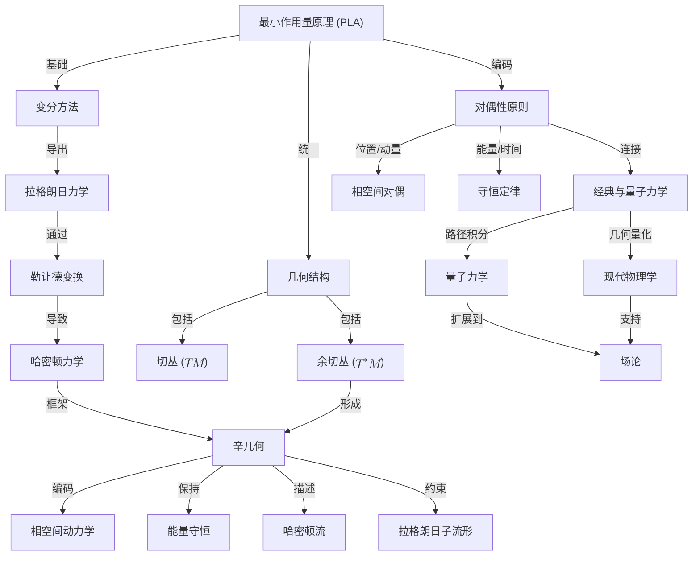

# 统一物理与几何：最小作用量原理、对偶性与辛结构
* * *

--- 自然的优雅在于作用量、几何与对偶性的和谐。

# **I. 引言：物理定律的几何本质**

经典力学提供了一个优雅且统一的框架，用于描述从天体到亚原子粒子的物理系统的运动。其核心是**最小作用量原理 (PLA)**，这是一个深刻的变化原理，不仅支配着物理系统的动力学，还揭示了物理定律的内在几何本质。远不止是一个计算工具，PLA 通过共享的数学基础将自然界的看似不同的现象联系起来。本节介绍 PLA，追溯其历史发展，并强调它作为物理学与几何学之间桥梁的作用。

## **I.1. 最小作用量原理的历史发展**

最小作用量原理代表了物理学中最深刻和持久的思想之一。其历史演变反映了人类对自然界简单性和基本真理的探索。

1. **亚历山大的希罗 (40 AD)**：
   - 希罗提出了**最短距离原理**来描述光的路径，断言光沿着两点之间的最短几何路径传播。
   - 尽管仅限于直线运动，这一早期观察暗示了自然界倾向于优化的更深层次原理。

2. **皮埃尔·德·费马 (17世纪)**：
   - 费马扩展了希罗的想法，引入了**最短时间原理**，指出光沿使两定点间传播时间最小的路径传播。
   - 这一原理解释了折射现象，因为光在不同介质中改变速度，使得最短路径变为最小时间路径。

3. **莫佩尔蒂和欧拉 (18世纪)**：
   - **皮埃尔-路易·莫佩尔蒂**提出了最小作用量原理，认为自然界以最有效的方式运作。他定义作用为物体的“活力”(动能)与时间的乘积。
   - **莱昂哈德·欧拉**将这一思想数学化，提供了一个应用变分原理到力学的一般框架。

4. **约瑟夫-路易·拉格朗日 (18世纪)**：
   - 拉格朗日重新定义了作用，用**拉格朗日量** $L = T - V$ 表示，其中 $T$ 是动能，$V$ 是势能。
   - 他推导了**欧拉-拉格朗日方程**，将牛顿力学推广到有约束条件和广义坐标的系统。

5. **威廉·罗文·哈密顿 (19世纪)**：
   - 哈密顿将 PLA 扩展到**哈密顿框架**，强调相空间和能量守恒。
   - 他引入了**勒让德变换**，连接了拉格朗日力学和哈密顿力学，提供了经典动力学的统一视图。

通过这些历史发展，PLA 从一个哲学思想演变为一个严格的数学原理，为物理学提供了一个普遍的框架。

## **I.2. 最小作用量原理作为力学的变分基础**

在其核心，最小作用量原理断言，物理系统在两个状态之间所取的路径是使**作用泛函**保持驻定(即其一阶变分为零)的路径。作用泛函定义为：
$$
S[q] = \int_{t_1}^{t_2} L(q, \dot{q}, t) \, dt,
$$
其中：
- $q = q(t)$ 表示系统的广义坐标，
- $\dot{q} = \frac{dq}{dt}$ 表示广义速度，
- $L(q, \dot{q}, t)$ 是**拉格朗日量**，定义为：
  $$
  L(q, \dot{q}, t) = T - V,
  $$
  其中 $T$ 是动能，$V$ 是势能。

**变分原理**要求：
$$
\delta S = 0,
$$
这导致了**欧拉-拉格朗日方程**：
$$
\frac{d}{dt} \frac{\partial L}{\partial \dot{q}^i} - \frac{\partial L}{\partial q^i} = 0.
$$

这些方程描述了系统的运动，将牛顿定律统一在一个更广泛的几何框架内。因此，PLA 作为经典力学的变分基础，用标量量 —— 作用的优化替代了牛顿力。

## **I.3. 物理原理的几何本质**

最小作用量原理提供了一种物理定律的几何视角，将力学转化为构形空间中最佳路径的研究。

1. **作用作为一个路径优化问题**：
   - 作用泛函 $S[q]$ 测量了构形空间中轨迹的“成本”。
   - 在所有连接两点的可能路径中，物理轨迹使作用最小化(或保持驻定)，类似于在弯曲流形上找到测地线。

2. **构形空间和切丛**：
   - **构形空间** $M$ 表示系统的所有可能位置。
   - **切丛** $TM$ 扩展了这个空间以包含速度，每个点 $(q, \dot{q})$ 表示系统的状态。
   - 拉格朗日量 $L(q, \dot{q}, t)$ 是定义在 $TM$ 上的标量函数，包含了系统的动力学。

3. **几何不变性**：
   - 作用 $S[q]$ 在坐标变换下不变，反映了其几何性质。
   - 由 PLA 导出的欧拉-拉格朗日方程本质上是坐标无关的，强调了变分原理的普遍性。

这种几何表述揭示了物理定律与数学结构之间的深刻联系，为辛几何和量子力学等高级概念奠定了基础。

## **I.4. 探索力学几何基础的动机**

PLA 不仅仅是一个计算工具；它是一个统一的原则，通过共享的几何框架将物理学的不同领域联系起来。探索其几何和变分基础提供了几个关键见解：

1. **物理定律的统一**：
   - PLA 是经典力学和现代理论如量子力学和广义相对论的基础。
   - 其几何性质连接了构形空间(拉格朗日力学)和相空间(哈密顿力学)。

2. **自然界中的优化**：
   - PLA 揭示了自然过程背后的固有优化原则，从粒子的运动到场的演化。
   - 这一视角提供了对物理学中对称性、守恒律和对偶性的更深入理解。

3. **与现代物理学的联系**：
   - PLA 推广到场论，其中它支配场和时空本身的动力学(例如，广义相对论中的爱因斯坦-希尔伯特作用)。
   - 在量子力学中，PLA 过渡到**路径积分表述**，支撑了费曼的路径求和方法。

通过探索 PLA 的几何和变分基础，我们获得了一个理解力学、对称性和守恒律的统一框架，为辛几何和量子扩展等高级主题奠定了基础。

## **I.5. 与后续章节的联系**

1. **向变分方法的过渡**：
   - PLA 的变分性质导致了欧拉-拉格朗日方程，这些方程构成了拉格朗日力学的基础。
2. **几何结构的介绍**：
   - 本章引入的构形空间和切丛自然扩展到余切丛和哈密顿力学中的辛几何。
3. **连接经典和量子力学**：
   - PLA的几何视角通过路径积分和几何量化将经典力学连接到量子力学。

## **I.6. 结论**

最小作用量原理是经典力学的基石，通过其变分和几何性质将物理学与几何学统一起来。从其历史起源到现代应用，PLA 揭示了物理定律的内在优雅，提供了一个理解系统动力学的统一框架。通过将 PLA 视为构形空间中的路径优化问题，我们揭示了其几何本质，并为探索切丛、余切丛、辛几何和量子力学等高级主题铺平了道路。这一基础将指导我们深入探讨构成现代物理学基石的几何和变分原理。

# **II. 变分方法：最小作用量原理**

**最小作用量原理 (PLA)** 是经典力学的核心，提供了一个优雅且统一的框架，用于推导物理系统的运动方程。其在**变分微积分**中的基础不仅简化了力学的表述，还揭示了物理定律背后的深刻几何结构。本节探讨 PLA 的数学基础、其几何解释以及展示其威力和普遍性的示例。

## **II.1. 最小作用量原理**

最小作用量原理断言，物理系统在两个时间点之间的实际轨迹是使**作用泛函**保持驻定(即其一阶变分为零)的轨迹。作用 $S$ 定义为：
$$
S[q] = \int_{t_1}^{t_2} L(q, \dot{q}, t) \, dt,
$$
其中：
- $q(t)$ 表示系统的**广义坐标**，
- $\dot{q}(t) = \frac{dq}{dt}$ 表示**广义速度**，
- $L(q, \dot{q}, t)$ 是**拉格朗日量**，一个标量函数，定义为：
  $$
  L(q, \dot{q}, t) = T - V,
  $$
  其中 $T$ 是**动能**，$V$ 是**势能**。

变分原理要求作用 $S[q]$ 在轨迹 $q(t)$ 的小扰动下保持驻定：
$$
\delta S = 0.
$$

## **II.2. 从变分原理导出欧拉-拉格朗日方程**

为了推导运动方程，考虑轨迹的一个小扰动：
$$
q(t) \to q(t) + \epsilon \eta(t),
$$
其中：
- $\epsilon$ 是一个小参数，
- $\eta(t)$ 是一个表示扰动的光滑函数，满足 $\eta(t_1) = \eta(t_2) = 0$ 以固定端点。

作用的变分是：
$$
\delta S = \frac{d}{d\epsilon} S[q + \epsilon \eta] \bigg|_{\epsilon=0}.
$$
代入作用泛函：
$$
\delta S = \int_{t_1}^{t_2} \left( \frac{\partial L}{\partial q} \delta q + \frac{\partial L}{\partial \dot{q}} \delta \dot{q} \right) dt.
$$
对涉及 $\delta \dot{q}$ 的项进行分部积分，并注意到 $\delta q(t_1) = \delta q(t_2) = 0$，我们得到：
$$
\delta S = \int_{t_1}^{t_2} \left( \frac{\partial L}{\partial q} - \frac{d}{dt} \frac{\partial L}{\partial \dot{q}} \right) \delta q \, dt.
$$
为了使 $\delta S = 0$ 对任意 $\delta q$ 成立，被积函数必须为零：
$$
\frac{\partial L}{\partial q} - \frac{d}{dt} \frac{\partial L}{\partial \dot{q}} = 0.
$$
这些是**欧拉-拉格朗日方程**，提供了系统的运动方程。

## **II.3. 几何解释**

最小作用量原理可以从**构形空间**中的优化问题的角度来理解。

1. **构形空间作为流形**：
   - **构形空间** $M$ 表示系统所有可能的位置 $q$。对于具有 $n$ 个自由度的系统，$M$ 是一个 $n$ 维流形。
   - 系统的轨迹 $q(t)$ 对应于 $M$ 中的一条**曲线**。

2. **作用作为一个路径泛函**：
   - 作用泛函 $S[q]$ 为构形空间中的每条可能轨迹分配一个标量值。
   - 在连接两点 $q(t_1)$ 和 $q(t_2)$ 的所有可能路径中，物理轨迹是使 $S[q]$ 极值化的那一条。

3. **构形空间中的测地线**：
   - 物理轨迹可以解释为一个“距离”由作用泛函测量的空间中的**测地线**。
   - 这种几何观点突出了最小作用量原理与自然现象背后的优化原则之间的联系。

4. **切丛和速度空间**：
   - **切丛** $TM$ 扩展了构形空间以包含速度 $\dot{q}$。每个点 $(q, \dot{q})$ 表示系统的状态。
   - 拉格朗日量 $L(q, \dot{q}, t)$ 是定义在 $TM$ 上的标量函数，包含了系统的动力学。

## **II.4. 示例**

为了展示最小作用量原理的威力，我们考虑两个经典示例：自由粒子和简谐振子。

### **II.4.1. 自由粒子运动**

自由粒子不受外力作用。其拉格朗日量为：
$$
L = \frac{1}{2} m \dot{q}^2,
$$
其中 $m$ 是质量，$\dot{q}$ 是速度。

1. **作用泛函**：
   $$
   S[q] = \int_{t_1}^{t_2} \frac{1}{2} m \dot{q}^2 \, dt.
   $$

2. **欧拉-拉格朗日方程**：
   - 计算导数：
     $$
     \frac{\partial L}{\partial q} = 0, \quad \frac{\partial L}{\partial \dot{q}} = m \dot{q}.
     $$
   - 代入欧拉-拉格朗日方程：
     $$
     \frac{d}{dt}(m \dot{q}) = 0 \quad \Rightarrow \quad m \ddot{q} = 0.
     $$
   - 其解为：
     $$
     q(t) = q_0 + v_0 t,
     $$
    其中 $q_0$ 和 $v_0$ 是常数，分别表示初始位置和速度。

3. **几何视角**：
   - 在构形空间中，轨迹是一条直线，反映了粒子的匀速运动。

### **II.4.2. 简谐振子**

简谐振子描述了一个恢复力与位移成正比的系统。其拉格朗日量为：
$$
L = \frac{1}{2} m \dot{q}^2 - \frac{1}{2} k q^2,
$$
其中 $k$ 是弹簧常数。

1. **作用泛函**：
   $$
   S[q] = \int_{t_1}^{t_2} \left( \frac{1}{2} m \dot{q}^2 - \frac{1}{2} k q^2 \right) dt.
   $$

2. **欧拉-拉格朗日方程**：
   - 计算导数：
     $$
     \frac{\partial L}{\partial q} = -k q, \quad \frac{\partial L}{\partial \dot{q}} = m \dot{q}.
     $$
   - 代入欧拉-拉格朗日方程：
     $$
     \frac{d}{dt}(m \dot{q}) + k q = 0 \quad \Rightarrow \quad m \ddot{q} + k q = 0.
     $$
   - 其解为：
     $$
     q(t) = A \cos(\omega t) + B \sin(\omega t),
     $$
    其中 $\omega = \sqrt{\frac{k}{m}}$ 是角频率，$A$ 和 $B$ 是由初始条件确定的常数。

3. **几何视角**：
   - 在构形空间中，轨迹是周期性的，对应于围绕平衡点的振动。
   - 在相空间 $(q, p)$ 中，轨迹形成一个封闭曲线(椭圆)，位于恒定能量曲面上。

## **II.5. 含义**

最小作用量原理为理解物理系统的运动提供了一个统一的框架：

1. **运动方程的推导**：
   - PLA 用一个标量量(作用)的优化替代了牛顿力，简化了运动方程的推导。

2. **坐标无关性**：
   - 欧拉-拉格朗日方程在坐标变换下不变，突显了 PLA 的几何性质。

3. **高级力学的基础**：
   - PLA 是拉格朗日力学的基础，并通过**勒让德变换**为过渡到哈密顿力学铺平了道路。

4. **对称性和守恒律的联系**：
   - 通过诺特定理，作用泛函的对称性直接与守恒律(如能量、动量和角动量)联系起来。

## **II.6. 与后续主题的联系**

1. **向勒让德变换的过渡**：
   - 上述示例展示了速度 $\dot{q}$ 在拉格朗日力学中的作用。下一步是用其共轭动量 $p = \frac{\partial L}{\partial \dot{q}}$ 替换 $\dot{q}$，这通过**勒让德变换**实现。

2. **辛几何和相空间**：
   - 本章引入的构形空间和切丛自然扩展到余切丛和辛几何，这些构成了哈密顿力学的几何背景。

## **II.7. 结论**

最小作用量原理是经典力学的基石，提供了一个理解和描述物理系统运动的几何和变分基础。通过极值化作用泛函，PLA 以一种既优雅又坐标无关的方式统一了系统的动力学。通过其与变分方法和欧拉-拉格朗日方程的联系，PLA 将牛顿力学的直观原理与现代物理学的几何结构联系起来，为深入探索哈密顿力学、辛几何和量子力学奠定了基础。

# **III. 勒让德变换：几何桥梁**

**勒让德变换**是经典力学的基石，作为**拉格朗日力学**和**哈密顿力学**之间的数学和几何桥梁。除了其计算角色外，勒让德变换揭示速度与动量之间的内在对偶性，并为从构形空间到相空间的过渡提供基础。本节介绍勒让德变换，探讨其几何解释，并说明其在统一物理原理中的作用。

## **III.1. 定义与物理意义**

勒让德变换提供一种系统的方法，将广义速度 $\dot{q}^i$ 替换为广义动量 $p_i$ 作为力学中的主要变量。这种替换是从拉格朗日公式向哈密顿公式过渡的核心。

1. **速度映射到动量**：
   - 对于由拉格朗日量 $L(q, \dot{q}, t)$ 描述的系统，每个坐标 $q^i$ 的**共轭动量** $p_i$ 定义为：
     $$
     p_i = \frac{\partial L}{\partial \dot{q}^i}.
     $$
   - 这个方程概括拉格朗日量对广义速度 $\dot{q}^i$ 的依赖关系，并用动量作为共轭变量替换它们。

2. **哈密顿量的构造**：
   - **哈密顿量** $H(q, p, t)$ 是拉格朗日量的勒让德变换：
     $$
     H(q, p, t) = \sum_i p_i \dot{q}^i - L(q, \dot{q}, t),
     $$
    其中 $\dot{q}^i$ 通过逆动量关系 $p_i = \frac{\partial L}{\partial \dot{q}^i}$ 表示为 $q^i$、$p_i$ 和 $t$ 的函数。
   - 当拉格朗日量具有标准形式 $L = T - V$ (动能减去势能)时，哈密顿量表示系统的**总能量**。

3. **物理意义**：
   - 在**拉格朗日力学**中，动力学用广义坐标 $q^i$ 和速度 $\dot{q}^i$ 描述，形成理解力和能量交换的自然框架。
   - 在**哈密顿力学**中，动力学用广义坐标 $q^i$ 和共轭动量 $p_i$ 表达，提供一个强调能量守恒和辛结构的相空间视角。
   - 勒让德变换连接了这两种表述，使从基于速度的动力学描述过渡到基于动量的描述成为可能。

## **III.2. 几何解释**

勒让德变换不仅仅是代数运算，而是**切丛**和**余切丛**之间的深刻几何映射，后者分别是拉格朗日力学和哈密顿力学的自然空间。

1. **切丛 ($TM$)**：
   - 切丛 $TM$ 包含所有可能的位置 $q^i$ 和速度 $\dot{q}^i$，表示拉格朗日力学中的状态空间。
   - 每个点 $(q^i, \dot{q}^i) \in TM$ 指定一个构形及其变化率。

2. **余切丛 ($T^*M$)**：
   - 余切丛 $T^*M$ 包含所有可能的位置 $q^i$ 和动量 $p_i$，作为哈密顿力学中的相空间。
   - 每个点 $(q^i, p_i) \in T^*M$ 以位置和动量表示系统的状态。

3. **勒让德变换作为丛映射**：
   - 勒让德变换 $\mathcal{L}: TM \to T^*M$ 是一个**纤维保持映射**：
     $$
     \begin{array}{ccc}
     TM & \xrightarrow{\mathcal{L}} & T^*M \\
     \downarrow & & \downarrow \\
     M & = & M
     \end{array}
     $$
   - 它将一个点 $(q^i, \dot{q}^i) \in TM$ 映射到一个点 $(q^i, p_i) \in T^*M$，通过定义 $p_i = \frac{\partial L}{\partial \dot{q}^i}$。

4. **自然配对结构**：
   - 勒让德变换的几何意义来自于**典范配对**，即切向量(速度)和余切向量(动量)之间的配对：
     $$
     \langle p, v \rangle = p_i v^i.
     $$
   - 这个配对是余切丛几何的一部分，独立于任意特定的坐标系。

5. **辛结构保持**：
   - 勒让德变换保持相空间的**辛结构**：
     $$
     \mathcal{L}^*\omega = d(p_i dq^i) = dp_i \wedge dq^i,
     $$
    确保拉格朗日和哈密顿表述之间的一致性。

## **III.3. 示例**

为了说明勒让德变换，我们考虑它在两个经典示例中的应用：自由粒子和单摆。

### **III.3.1. 自由粒子**

1. **拉格朗日量**：
   $$
   L = \frac{1}{2} m \dot{q}^2,
   $$
   其中 $m$ 是质量，$\dot{q}$ 是速度。

2. **广义动量**：
   $$
   p = \frac{\partial L}{\partial \dot{q}} = m \dot{q}.
   $$

3. **哈密顿量**：
   $$
   H = p \dot{q} - L = \frac{p^2}{2m}.
   $$

4. **几何视角**：
   - 在 $TM$ 中，状态由 $(q, \dot{q})$ 描述，其中拉格朗日量表示动能。
   - 在 $T^*M$ 中，状态由 $(q, p)$ 描述，哈密顿量表示总能量。

### **III.3.2. 单摆**

1. **拉格朗日量**：
   $$
   L = \frac{1}{2} m l^2 \dot{\theta}^2 - m g l (1 - \cos \theta),
   $$
   其中 $\theta$ 是角度，$l$ 是摆长，$g$ 是重力加速度。

2. **广义动量**：
   $$
   p = \frac{\partial L}{\partial \dot{\theta}} = m l^2 \dot{\theta}.
   $$

3. **哈密顿量**：
   $$
   H = p \dot{\theta} - L = \frac{p^2}{2 m l^2} + m g l (1 - \cos \theta).
   $$

4. **几何视角**：
   - 在 $TM$ 中，单摆的运动由 $(\theta, \dot{\theta})$ 描述，拉格朗日量捕捉动能和势能的平衡。
   - 在 $T^*M$ 中，运动被重新表述为 $(\theta, p)$，强调能量守恒和相空间动力学。

## **III.4. 力学中的对偶性**

勒让德变换概括力学中的基本**对偶原则**：

1. **位置-动量对偶**：
   - 位置 $q^i$ 和动量 $p_i$ 是**共轭变量**，反映系统状态的互补方面。
   - 这种对偶性是相空间表述的固有特征。

2. **能量-时间对偶**：
   - 在哈密顿力学中，哈密顿量 $H$ 生成系统的演化，将能量和时间作为共轭变量联系起来。

3. **几何对偶**：
   - 勒让德变换揭示切丛 ($TM$) 和余切丛 ($T^*M$) 之间的对偶性，统一基于速度和基于动量的运动描述。

4. **拉格朗日-哈密顿对偶**：
   - 拉格朗日力学关注轨迹和力，而哈密顿力学强调状态和能量守恒。
   - 勒让德变换连接这些框架，提供对同一物理现象的双重视角。

## **III.5. 与辛几何的联系**

勒让德变换自然引入**余切丛** $T^*M$，其配备**辛结构**：
- 辛形式 $\omega = dp_i \wedge dq^i$ 控制相空间的几何。
- 哈密顿流保持 $\omega$，反映相空间体积的守恒(刘维尔定理)。

通过从 $TM$ 转换到 $T^*M$，勒让德变换为辛几何奠定基础，提供哈密顿力学的数学框架，并连接经典力学与量子力学。

## **III.6. 结论**

勒让德变换不仅仅是一个代数工具；它是连接拉格朗日力学和哈密顿力学的深刻几何映射。通过从切丛过渡到余切丛，它揭示速度与动量之间的对偶性，统一作用优化和能量守恒的原则。这种几何视角为辛几何、哈密顿流以及相空间的更深层次结构奠定基础，为探索下一节中的辛框架铺平道路。

# **IV. 辛几何：哈密顿力学的自然框架**

辛几何作为哈密顿力学的自然数学框架，揭示相空间动力学背后的深刻几何结构。辛结构不仅支配物理系统的运动方程，还确保诸如能量和相空间体积等基本量的守恒。在本节中，我们将探讨辛几何的定义特征、其在哈密顿流中的作用以及它与守恒定律和变分原理的联系。

## **IV.1. 辛形式**

辛形式是辛几何的基石，提供支撑哈密顿力学的几何结构。

1. **定义**：
   - 一个**辛流形** $(M, \omega)$ 由一个光滑的偶数维流形 $M$ 和其上的非退化闭 $2$-形式 $\omega$ 组成，$\omega$ 称为**辛形式**。
   - 在**余切丛** $T^*M$ (机械系统的自然相空间)的局部坐标 $(q^i, p_i)$ 中，典范辛形式为：
     $$
     \omega = \sum_{i=1}^n dp_i \wedge dq^i.
     $$

2. **性质**：
   - **非退化性**：对于切空间 $T_pM$ 中的任意非零向量 $v$，存在一个向量 $w$ 使得 $\omega(v, w) \neq 0$。这保证了 $\omega$ 提供一个切向量之间的配对，使其可逆。
   - **封闭性**：$d\omega = 0$，其中 $d$ 是外导数。这一性质意味着 $\omega$ 在连续变形下保持不变，反映在哈密顿流中固有的守恒律。

3. **物理解释**：
   - 辛形式 $\omega$ 测量相空间中的“面积”。例如，在经典力学中，$\omega$ 编码位置和动量之间的关系，确保它们的互补性。
   - 配对 $dp_i \wedge dq^i$ 反映坐标 $q^i$ 和动量 $p_i$ 之间的内在对偶性。

4. **精确性**：
   - 在 $T^*M$ 上，辛形式 $\omega$ 是精确的，即它可以表示为**典范 $1$-形式** $\theta$ 的外导数：
     $$
     \omega = -d\theta, \quad \theta = \sum_{i=1}^n p_i \, dq^i.
     $$
   - $1$-形式 $\theta$ 在变分原理和几何量子化中起着核心作用。

## **IV.2. 相空间作为一个辛流形**

在哈密顿力学中，**相空间** $T^*M$ 自然是一个辛流形，配备典范辛形式 $\omega$。这种结构确保物理系统的动力学本质上是几何的。

1. **典范坐标**：
   - 相空间由**典范坐标** $(q^i, p_i)$ 描述，其中 $q^i$ 是广义位置，$p_i$ 是共轭动量。
   - 这些坐标满足基本的**泊松括号关系**：
     $$
     \{q^i, p_j\} = \delta^i_j, \quad \{q^i, q^j\} = 0, \quad \{p_i, p_j\} = 0.
     $$

2. **相空间结构的保持**：
   - 辛形式 $\omega$ 定义相空间的几何结构，并在哈密顿演化下保持不变。
   - **刘维尔定理**指出，由 $\omega^n/n!$ 定义的相空间中任意区域的体积随时间保持不变：
     $$
     \mathcal{L}_{X_H} \omega = 0,
     $$
    其中 $\mathcal{L}_{X_H}$ 是沿着哈密顿向量场 $X_H$ 的李导数。这反映相空间密度的守恒。

3. **哈密顿量的几何角色**：
   - 哈密顿量 $H(q, p, t)$ 生成系统在相空间中的时间演化。动力学由**哈密顿方程**给出：
     $$
     \dot{q}^i = \frac{\partial H}{\partial p_i}, \quad \dot{p}_i = -\frac{\partial H}{\partial q^i}.
     $$
   - 这些方程描述系统在相空间中的流，保持辛结构。

## **IV.3. 哈密顿流**

辛几何的一个关键方面是**哈密顿流**的概念，它描述系统在相空间中受哈密顿量影响的时间演化。

1. **哈密顿向量场**：
   - 与每个哈密顿函数 $H: T^*M \to \mathbb{R}$ 相关联的是一个**哈密顿向量场** $X_H$，定义为：
     $$
     \iota_{X_H} \omega = dH,
     $$
    其中 $\iota_{X_H}$ 表示 $X_H$ 与辛形式 $\omega$ 的内积。
   - 这个方程定义 $X_H$，使得 $\omega$ 将 $X_H$ 与其他任意向量场配对的方式类似于 $H$ 的梯度。

2. **辛形式的保持**：
   - 由 $X_H$ 生成的流 $\phi_t$ 保持辛结构：
     $$
     \phi_t^* \omega = \omega.
     $$
   - 这种在哈密顿流下的不变性反映如能量和角动量等物理量的守恒。

3. **刘维尔定理**：
   - 哈密顿流下相空间体积的守恒是 $\omega$ 保持不变的直接结果：
     $$
     \mathcal{L}_{X_H} (\omega^n) = 0.
     $$
   - 这一定理确保相空间中轨迹密度随时间保持不变。

4. **诺特定理**：
   - 哈密顿量的对称性通过**诺特定理**直接与守恒量联系起来：
     - 对于 $H$ 的每一个连续对称性，存在一个守恒量(例如，能量、动量、角动量)。
     - 这些守恒量在哈密顿流下是几何不变的。

## **IV.4. 辛几何中的几何量**

辛几何引入几个重要的几何对象和概念，这些对象和概念支配哈密顿系统的动力学。

1. **拉格朗日子流形**：
   - 一个**拉格朗日子流形** $\mathcal{L} \subset T^*M$ 是一个最大子流形，在其上辛形式 $\omega$ 消失(为零)：
     $$
     \omega|_{\mathcal{L}} = 0, \quad \dim(\mathcal{L}) = \frac{1}{2} \dim(T^*M).
     $$
   - 系统的经典轨迹通常位于拉格朗日子流形上，反映支配其运动的变分原理。

2. **作用量和辛几何**：
   - **作用量积分** $S[q] = \int p_i \, dq^i - H \, dt$ 可以视为相空间中轨迹上的几何量。
   - 最小作用量原理确保物理轨迹是最小化作用量的轨迹，对应于拉格朗日子流形上的测地线。

3. **能量水平集**：
   - 由 $H(q, p) = E$ 定义的哈密顿量的水平集是相空间中的 $(2n-1)$ 维超曲面。
   - 动力学被限制在这些能量水平集上，说明了辛几何如何约束物理运动。

## **IV.5. 与现代物理学的联系**

辛几何不仅为经典力学提供数学基础，还连接到现代物理学，包括量子力学和场论。

1. **量子力学**：
   - 辛几何支撑从经典泊松括号到量子对易子的过渡：
     $$
     \{q^i, p_j\} \to \frac{1}{i\hbar} [\hat{q}^i, \hat{p}_j] = \delta^i_j.
     $$
   - 几何量子化基于辛结构定义量子态和算符。

2. **场论**：
   - 辛几何扩展到无限维相空间，使研究哈密顿场论和规范理论成为可能。
   - 辛结构支配了场的动力学，包括约束和守恒荷之间的相互作用。

## **IV.6. 结论**

辛几何是哈密顿力学的自然框架，将物理系统的动力学嵌入到一个丰富的几何结构中。辛形式 $\omega = dp_i \wedge dq^i$ 编码位置和动量之间的基本关系，确保相空间结构和守恒律的保持。通过哈密顿流、拉格朗日子流形和能量水平集，辛几何提供一个统一的视角，连接变分原理、经典力学和现代物理学。这一几何基础为后续章节中探索经典力学与量子力学之间的更深层次联系奠定基础。

# **V. 能量守恒、水平集和相空间动力学**

在哈密顿力学中，能量守恒是一个核心原则，支配着物理系统的动力学。相空间的几何结构提供一个自然的框架来可视化和理解这些动力学，其中**哈密顿函数**既作为守恒量又作为运动的生成元。本节探讨能量守恒如何在相空间中几何地反映出来，强调哈密顿量的**水平集**的作用，并考察被限制在这些表面上的轨迹的动力学。最后，我们将这些概念与更广泛的**辛几何**框架联系起来。

## **V.1. 哈密顿力学中的能量守恒**

1. **哈密顿量作为一个守恒量**：
   - 在哈密顿力学中，哈密顿量 $H(q, p, t)$ 通常表示系统的**总能量**(动能+势能)。对于一个自治系统(即 $H$ 不显式依赖于时间)，哈密顿量沿着相空间中的轨迹是守恒的：
     $$
     \frac{dH}{dt} = \frac{\partial H}{\partial t} + \{H, H\} = 0.
     $$
    这里，$\{H, H\} = 0$ 表示 $H$ 与自身的泊松括号，它恒为零。
   - $H$ 的守恒意味着系统的运动被限制在一个由方程定义的**超曲面**上：
     $$
     H(q, p) = E,
     $$
    其中 $E$ 是总能量。

2. **几何含义**：
   - 超曲面 $H(q, p) = E$，称为**能量水平集**，代表系统在给定能量 $E$ 下所有可能的状态(位置和动量)的空间。
   - 能量守恒减少相空间轨迹的维数，将系统的运动限制在一个特定的能量流形上。

## **V.2. 哈密顿量的水平集**

哈密顿量的**水平集** $H(q, p) = E$ 是几何对象，它们封装系统的动力学，并提供理解和分析其行为的视觉和分析工具。

1. **定义**：
   - 哈密顿量的一个水平集是由满足 $H(q, p) = E$ 的相空间 $(q, p)$ 中的所有点组成的集合，其中 $E$ 是固定的值。
   - 这些水平集是对系统运动的几何约束。

2. **维数**：
   - 对于一个具有 $n$ 个自由度的系统，相空间是 $2n$ 维的，而能量水平集是 $(2n-1)$ 维的超曲面。
   - 例子：
     - 一维系统有一个二维相空间 $(q, p)$，其能量水平集是 $(q, p)$ 平面上的曲线。
     - 二维系统(例如，在二维空间中运动的粒子)有一个四维相空间，其能量水平集是三维的。

3. **等能面**：
   - 水平集常被称为**等能面**，因为它们代表了具有恒定总能量的状态。
   - 这些面的拓扑结构取决于哈密顿量的形式和能量值 $E$：
     - 对于有界系统(例如，谐振子)，水平集通常是紧致的(例如，椭圆或环面)。
     - 对于无界系统(例如，自由粒子)，水平集可能延伸到无穷远。

4. **例子**：
   - **谐振子**：
     $$
     H = \frac{p^2}{2m} + \frac{1}{2}kq^2.
     $$
    能量水平集是 $(q, p)$ 平面上的椭圆：
     $$
     \frac{p^2}{2m} + \frac{1}{2}kq^2 = E.
     $$
   - **中心力问题**：
    对于处于中心势 $V(r)$ 中的粒子，水平集由总能量 $E$ 和角动量 $L$ 确定，导致配置空间中的圆锥截面。

## **V.3. 相空间动力学**

哈密顿系统的动力学被限制在能量水平集上，并由哈密顿流控制，哈密顿流描述系统在相空间中的时间演化。

1. **轨迹和哈密顿流**：
   - 系统在相空间中的运动由**哈密顿方程**描述：
     $$
     \dot{q}^i = \frac{\partial H}{\partial p_i}, \quad \dot{p}_i = -\frac{\partial H}{\partial q^i}.
     $$
   - 这些方程定义在相空间上的一个**向量场**。系统的轨迹是这个向量场的积分曲线。

2. **能量水平集上的动力学**：
   - 系统的轨迹被限制在能量水平集 $H(q, p) = E$ 与哈密顿流的交集上。
   - 对于可积系统，能量水平集上的轨迹常常形成相空间中的**环面**，对应于准周期运动。

3. **可视化**：
   - 在一维系统中，轨迹可以被可视化为 $(q, p)$ 平面上的振荡或闭合环路。
   - 在高维系统中，轨迹在能量水平集上形成更复杂的图案，例如在可积系统中形成的嵌套环面。

4. **例子**：
   - **谐振子**：
     - 轨迹是在 $(q, p)$ 平面上的闭合椭圆，反映周期运动。
   - **中心力问题**：
     - 轨迹对应于配置空间中的轨道(例如，椭圆、抛物线或双曲线)，而在相空间中，它们形成更复杂的曲线。

## **V.4. 辛几何的整合**

能量守恒、水平集和相空间动力学之间的联系深深植根于辛几何。

1. **辛形式和体积守恒**：
   - 辛形式 $\omega = dp_i \wedge dq^i$ 确保哈密顿流下相空间结构的保持。
   - 刘维尔定理指出，由 $\omega^n/n!$ 定义的相空间体积沿着轨迹是守恒的。

2. **拉格朗日子流形**：
   - 哈密顿量的水平集通常作为**拉格朗日子流形**，在这些流形上辛形式 $\omega$ 消失。
   - 限制在这些子流形上的轨迹满足力学的变分原理，反映最小作用量原理中的优化性质。

3. **能量守恒作为一种几何约束**：
   - 能量守恒将系统的运动限制在相空间的特定区域，减少动力学的有效维数。
   - 辛结构确保这些约束与系统的几何演化兼容。

## **V.5. 结论**

编码在哈密顿量中的能量守恒提供一个理解物理系统运动的几何框架。哈密顿量的水平集定义相空间中的等能面，轨迹被限制在这些面上并由哈密顿流控制。这些动力学与相空间的辛结构紧密交织，辛结构确保几何属性如相空间体积和能量超曲面的保持。通过整合能量守恒、哈密顿流和辛几何，我们获得对物理系统结构和演化的统一视角。这一几何基础为探索辛几何在经典力学和量子力学中的更深层次意义奠定基础。

# **VI. 批判性分析与高级见解**

**最小作用量原理(PLA)**、**勒让德变换**和**辛几何**的数学优雅性和概念力量是无可否认的。然而，不精确的解释和过度简化往往掩盖它们更深层次的几何和物理意义。本节批判性地审视常见的误解，澄清从这些原理中涌现的高级见解，并强调其对现代物理学的广泛影响，特别是在连接经典力学和量子力学方面。

## **VI.1. 误解**

### **VI.1.1. “最小”作用量 vs. 驻定作用量**

关于 PLA 最常见的误解之一在于将其描述为**最小作用量原理**。虽然这一术语暗示作用量总是被最小化，但这并不是普遍正确的。

1. **驻定作用量**：
   - PLA 的正确解释是作用泛函 $S[q] = \int_{t_1}^{t_2} L(q, \dot{q}, t) \, dt$ 在轨迹的小变化下是**驻定的**：
     $$
     \delta S = 0.
     $$
   - 驻定的作用量意味着变分 $\delta S$ 消失(为零)，对应于作用量的最小值、最大值或鞍点。

2. **物理例子**：
   - **最小作用量**：对于大多数机械系统，作用量是最小化的(例如，自由粒子在空间中沿直线路径运动)。
   - **非最小作用量**：在某些情况下，如某些相对论或量子系统，作用量可能对应于鞍点。

3. **含义**：
   - “最小作用量”这一术语由于历史原因而持续存在，但可能会简化该原理。认识到 PLA 指的是**驻定作用量**突显其在经典力学、场论和量子力学中的普遍适用性。

### **VI.1.2. 将勒让德变换误解为代数工具**

**勒让德变换**通常被介绍为一种纯粹的代数工具，用于在拉格朗日力学和哈密顿力学之间转换。这种观点忽视了其更深的几何意义。

1. **勒让德变换作为几何映射**：
   - 勒让德变换本质上是一个**几何映射**，它在**切丛**($TM$) 和**余切丛**($T^*M$) 之间保持相空间的辛结构：
     $$
     \mathcal{L}: TM \to T^*M.
     $$
   - 这个映射将速度 $\dot{q}^i$ 替换为共轭动量 $p_i = \frac{\partial L}{\partial \dot{q}^i}$，从而从基于速度的运动描述过渡到基于动量的描述。

2. **自然配对与辛一致性**：
   - 勒让德变换确保与辛形式的一致性：
     $$
     \omega = dp_i \wedge dq^i,
     $$
    保持位置和动量之间的几何关系。

3. **含义**：
   - 将勒让德变换视为纯粹代数工具会掩盖其在统一拉格朗日力学和哈密顿力学中的几何框架内的作用。

## **VI.2. 高级见解**

### **VI.2.1. 辛几何作为统一框架**

**辛几何**为哈密顿力学提供数学和概念基础，并扩展其在量子力学和场论中的应用。

1. **相空间作为辛流形**：
   - 余切丛 $T^*M$ 配备辛形式 $\omega = dp_i \wedge dq^i$ 是哈密顿力学的自然设置。
   - 辛结构控制轨迹的演化，确保相空间体积的守恒(刘维尔定理)。

2. **几何量化**：
   - 辛几何通过**几何量化**连接经典力学和量子力学，其中经典泊松括号 $\{q^i, p_j\}$ 被量子对易子 $[\hat{q}^i, \hat{p}_j]$ 取代。
   - 辛结构编码从经典轨迹到量子态的过渡。

3. **场论的推广**：
   - 辛几何推广到无穷维相空间，支撑哈密顿场论和规范理论的基础。

4. **含义**：
   - 辛几何统一经典力学、量子力学和场论，提供一种理解物理系统的共同语言。

### **VI.2.2. 对偶原理与几何量化**

对偶是物理学中反复出现的主题，PLA、勒让德变换和辛几何在多个层面上体现这一原则。

1. **位置-动量对偶**：
   - 位置 $q^i$ 和动量 $p_i$ 是共轭变量，构成力学相空间描述的基础。
   - 这种对偶在辛结构中几何地表达为：
     $$
     \omega = dp_i \wedge dq^i.
     $$
   - 自然配对 $\langle p, v \rangle = p_i v^i$ 连接配置空间和相空间。

2. **能量-时间对偶**：
   - 哈密顿量 $H$ 生成时间演化，反映能量和时间之间的对偶：
     $$
     \dot{q}^i = \frac{\partial H}{\partial p_i}, \quad \dot{p}_i = -\frac{\partial H}{\partial q^i}.
     $$
   - 这种对偶支撑能量守恒和时间平移对称性。

3. **几何量化**：
   - 量化依赖于辛结构中编码的对偶：
     - 经典可观测量成为量子算符。
     - 辛形式决定路径积分表述中使用的相空间测度。

4. **含义**：
   - 对偶原理揭示物理系统的互补视角，在几何框架内统一经典和量子描述。

## **VI.3. 现代物理学中的广泛影响**

PLA、勒让德变换和辛几何的见解远远超出了经典力学，影响了现代物理学和数学。

1. **量子力学**：
   - **路径积分表述**：在量子力学中，最小作用量原理推广到费曼的路径积分表述，其中量子振幅是所有可能路径的总和：
     $$
     \int e^{iS[q]/\hbar} \mathcal{D}[q].
     $$
   - 经典轨迹作为这个积分的驻定相出现，连接了经典和量子动力学。

2. **场论和规范理论**：
   - PLA 扩展到场论，其中作用泛函控制场的动力学：
     $$
     S[\phi] = \int \mathcal{L}(\phi, \partial_\mu \phi) \, d^4x,
     $$
    其中 $\mathcal{L}$ 是拉格朗日密度。
   - 辛几何为理解场论中的约束、守恒荷和规范对称性提供了框架。

3. **广义相对论**：
   - 广义相对论中的爱因斯坦-希尔伯特作用是 PLA 在时空几何中的直接应用：
     $$
     S = \int R \sqrt{-g} \, d^4x,
     $$
    其中 $R$ 是里奇标量。辛方法有助于理解引力场的约束和动力学。

4. **涌现物理学**：
   - 辛几何和 PLA 指导了弦理论和全息理论等涌现理论的发展，其中对偶起着核心作用。

## **VI.4. 结论**

本节这一批判性分析突显了**最小作用量原理**、**勒让德变换**和**辛几何**作为物理学基础原理的深度和广度。通过解决误解，强调其几何和物理意义，并探索其在量子力学和场论中的扩展，我们获得了对物理与几何之间相互作用的更加统一和深刻的理解。这些见解不仅精炼我们的概念理解，还为经典和现代物理学的研究开辟新的途径。通过 PLA 及其相关的几何结构，我们揭示了自然法则背后的深刻优雅和统一。

# **VII. 结论与反思**

对**最小作用量原理 (PLA)** 及其几何和变分基础的探索揭示了自然法则背后的深刻统一性。本文追溯了 PLA、变分方法、勒让德变换、辛几何与现代物理学之间的联系，最终形成一个强调物理原理与数学结构之间和谐性的连贯框架。在本结论中，我们将综合这些关键思想，反思其更广泛的含义，并突出它们如何影响我们对经典力学、量子力学和场论的理解。

## **VII.1. PLA、变分方法和辛几何的回顾**

1. **最小作用量原理**：
   - PLA 为经典力学提供一个统一的原则，断言系统的运动由作用泛函的极值决定：
     $$
     S[q] = \int_{t_1}^{t_2} L(q, \dot{q}, t) \, dt.
     $$
   - 通过最小化(或使其驻定)作用量，PLA 控制从自由粒子到复杂约束系统的物理系统动力学。
   - 从 PLA 导出的欧拉-拉格朗日方程提供与运动的坐标无关的描述，将牛顿力学的本质封装在一个变分框架内。

2. **变分方法与几何见解**：
   - 变分原理突出自然过程中的优化特性，其中配置空间中的轨迹代表“阻力最小”的路径。
   - PLA 的几何解释将力学转化为研究配置空间和相空间中的最优路径和测地线。

3. **勒让德变换作为桥梁**：
   - 勒让德变换通过从基于速度的描述(在**切丛** $TM$ 中)过渡到基于动量的描述(在**余切丛** $T^*M$ 中)，连接拉格朗日力学和哈密顿力学。
   - 这种过渡揭示速度与动量之间的对偶性，统一两种互补的力学表述。

4. **辛几何与相空间**：
   - 辛几何为哈密顿力学提供自然的设置，其中相空间由辛形式结构化：
     $$
     \omega = dp_i \wedge dq^i.
     $$
   - 通过哈密顿流，辛结构保持相空间体积(刘维尔定理)，并控制受限于能量超曲面的轨迹的动力学。
   - 辛几何不仅支配经典力学，还通过几何量化连接到量子力学。

5. **能量守恒与水平集**：
   - 作为守恒量的哈密顿量将运动限制在相空间的等能面上，其中轨迹反映守恒定律、对称性和几何约束之间的相互作用。

## **VII.2. 力学中几何与物理统一性的反思**

通过对 PLA 及其几何基础的探索，揭示物理学与几何学之间的深刻统一性。这种统一性以多种方式表现出来：

1. **几何作为物理学的语言**：
   - 经典力学的原则是深刻的几何性，其中配置空间、切丛和余切丛为描述运动提供自然的环境。
   - 相空间的辛结构确保物理定律在正则变换下的不变性，强调哈密顿力学的几何一致性。

2. **对偶作为基本原理**：
   - 位置与动量、能量与时间、配置空间与相空间之间的对偶性反映物理系统固有的互补视角。
   - 这些对偶性不仅仅是数学构造，而是深深嵌入宇宙的结构中，提供描述同一现象的多个角度。

3. **对称性与守恒定律**：
   - 诺特定理强调对称性与守恒量之间的内在联系，如能量、动量和角动量。
   - 辛几何的几何不变量为理解这些守恒定律在经典和量子领域中的统一提供框架。

4. **优化与自然效率**：
   - PLA 和变分原理揭示自然过程中固有的优化和效率，其中物理系统沿着使作用量最小化或极化的路径演化。
   - 这一思想从经典轨迹扩展到量子路径，在费曼路径积分中，建设性干涉选择作用量的驻定点。

## **VII.3. 现代物理学中的广泛影响**

从 PLA 和辛几何获得的见解远远超出了经典力学，影响了量子力学、场论及其他前沿发展。

1. **量子力学**：
   - PLA 构成**路径积分表述**的基础，其中量子振幅是所有可能路径的总和，加权因子为 $e^{iS[q]/\hbar}$：
     $$
     \psi(q_f, t_f) = \int \mathcal{D}[q] \, e^{iS[q]/\hbar}.
     $$
   - 经典轨迹作为这个积分的稳定相出现，连接经典力学与量子动力学。
   - 辛几何支撑从经典力学中的泊松括号到量子力学中的对易子的过渡，形成量子算符和态的基础。

2. **场论与广义相对论**：
   - PLA 推广到场论，其中作用量支配时空上的场的动力学：
     $$
     S[\phi] = \int \mathcal{L}(\phi, \partial_\mu \phi) \, d^4x.
     $$
    其例子包括广义相对论中的爱因斯坦-希尔伯特作用和规范理论中的杨-米尔斯作用。
   - 辛几何扩展到无穷维相空间，使得能够研究哈密顿场论和广义相对论的约束。

3. **弦理论及更远**：
   - 在弦理论中，作用原理支配一维对象(弦)在高维时空中的动力学。
   - 辛几何在理解弦态的相空间和连接不同弦理论的对偶性方面发挥着关键作用。

4. **全息原理与涌现物理学**：
   - 全息原理，例如 AdS/CFT 对应，反映体时空与边界场论之间的深层几何关系。
   - 这些关系植根于变分原理和辛几何的守恒定律。

## **VII.4. 展望未来**

对 PLA 和辛几何的探索为未来的科研和跨学科应用提供了几条途径：

1. **非哈密顿系统的推广**：
   - 将 PLA 和辛方法推广到具有非保守力、耗散或随机动力学的系统仍然是一个开放的挑战。
   - 广义变分原理和修改后的辛结构可能会提供新的见解。

2. **量子场论与几何量化**：
   - 通过几何量化介导的经典与量子力学之间的相互作用继续激励量子场论和拓扑量子场论(TQFT)的进步。
   - 辛几何在量子计算和凝聚态物理中的应用可能会增加。

3. **教育与概念清晰度**：
   - 重新审视像 PLA 和辛几何这样的基础原则，重点放在其几何本质，可以增强力学和物理学的教育，帮助未来的研究人员更深入地欣赏物理定律的统一性。

4. **跨学科应用**：
   - 除了物理学，PLA 和辛几何的原则已在优化、控制理论和机器学习中找到应用，突显它们的普遍性。

## **VII.5. 结语**

**最小作用量原理**及其几何基础不仅仅是解决力学问题的工具；它们是窥视自然世界底层优雅与一致性的窗口。通过将物理学与几何学统一，PLA 连接经典力学、量子力学和场论，揭示自然法则的深刻简单性和效率。

随着我们继续推动物理学和数学的边界，从 PLA 和辛几何获得的见解将继续成为我们理解宇宙的核心。这些原则提醒我们，自然界以优雅的方式运作，其中运动、对偶性和几何性在最小作用的和谐中对齐。通过这一视角，我们瞥见了物理定律的时间性和统一性，指引我们在不断演变的科学景观中进行更深入的发现。

# 附录 A : 核心关系

## **A.1 核心概念关系可视化**

该图展示了**最小作用量原理(PLA)** 如何作为变分方法、几何结构和现代物理学的基础，连接了诸如**拉格朗日力学**、**哈密顿力学**、**辛几何**和**对偶性原则**等关键概念。

**图解说明**：

1. **核心基础**：
   - **最小作用量原理 (PLA)** 是中心概念，提供了所有后续思想的基础。
   - PLA 支配**变分方法**，后者进而导出**拉格朗日力学**中的运动方程。

2. **过渡到哈密顿力学**：
   - **勒让德变换**充当**拉格朗日力学**(基于速度)和**哈密顿力学**(基于动量)之间的桥梁。
   - 哈密顿力学引入**相空间**作为主要框架，导致**辛几何**的发展。

3. **辛几何与相空间**：
   - **辛几何**为相空间提供数学结构，编码能量守恒、哈密顿流和拉格朗日子流形的约束。
   - 它确保几何性质如**相空间体积**(刘维尔定理)的保持，并描述在**能量水平集**上的轨迹演化。

4. **几何结构**：
   - PLA 自然引出**几何结构**，包括**切丛 ($TM$)** 和**余切丛 ($T^*M$)**。
   - 余切丛构成**辛几何**的基础，而切丛支撑**拉格朗日力学**。

5. **对偶性原则**：
   - 对偶性原则，如**位置-动量对偶**(相空间)和**能量-时间对偶**(守恒定律)，被编码在 PLA 和辛几何中。
   - 这些对偶性连接了经典力学和量子力学，将**泊松括号**与量子对易子联系起来。

6. **量子力学与现代物理学**：
   - 几何和变分基础自然地延伸到**量子力学**，通过路径积分和**几何量化**。
   - 这些框架支持**场论**，包括广义相对论和规范理论，突显它们在**现代物理学**中的相关性。

## **A.2 核心概念关系表**

以下是核心概念之间关系的表格表示：

| **概念**               | **直接相关于**                                                                                           | **角色**                                                                                           |
|------------------------|----------------------------------------------------------------------------------------------------------|----------------------------------------------------------------------------------------------------|
| 最小作用量原理         | 变分方法、几何结构、对偶性原则                                                                          | 统一力学和几何的基础原理                                                                           |
| 变分方法               | 拉格朗日力学                                                                                            | 通过欧拉-拉格朗日方程提供运动方程                                                                  |
| 拉格朗日力学           | 切丛、勒让德变换                                                                                        | 描述配置空间中的动力学，引导至哈密顿力学                                                           |
| 勒让德变换             | 哈密顿力学、余切丛                                                                                       | 速度描述与动量描述之间的桥梁                                                                       |
| 哈密顿力学             | 辛几何、相空间动力学                                                                                    | 描述相空间中的动力学，由辛结构控制                                                                 |
| 辛几何                 | 相空间动力学、能量守恒、哈密顿流、对偶性原则                                                             | 编码相空间的几何结构，连接经典和量子力学                                                           |
| 几何结构               | 切丛、余切丛                                                                                            | 为拉格朗日力学和哈密顿力学提供数学框架                                                             |
| 对偶性原则             | 位置-动量对偶、能量-时间对偶、辛几何、守恒定律                                                          | 突出物理系统的互补描述                                                                             |
| 量子力学               | 路径积分、几何量化                                                                                      | 将经典原理扩展到量子领域                                                                           |
| 现代物理学             | 场论、辛几何、量子力学                                                                                  | 建立在 PLA、几何结构和辛几何之上，描述先进的物理理论                                               |

**关键见解**：

- **PLA为核心**：
   - 最小作用量原理位于经典力学的核心，提供一个统一的框架，涵盖变分原理、几何结构和对偶性。

- **几何框架**：
   - 切丛和余切丛、辛几何与相空间动力学之间的相互作用揭示物理定律的优雅和一致性。

- **对偶性和扩展**：
   - 对偶性原则连接经典力学与量子力学，而辛几何为现代物理学提供数学基础。

# 附录 B：关于最小作用量原理与目的论解释的反思

**最小作用量原理 (PLA)** 是物理学中最深刻和统一的原则之一，它将物理系统的运动与变分和几何结构联系起来。其优雅和普遍性激发了从亚里士多德对自然内在目的的思考到欧拉对宇宙固有效率的断言，几个世纪以来的思想。然而，PLA 也引发了关于它是否反映了自然界中更深层次的目的论秩序，还是仅仅是人类设计的数学模型的涌现特征的哲学问题。本附录探讨了 PLA 的更广泛意义、其可能的目的论含义，以及这些讨论揭示了物理定律的本质。

## **B.1. 自然定律的优雅**

PLA 的表述指出，系统实际采取的路径是使作用量泛函为驻点的路径，这揭示了一种非凡的简单性和普遍性。其影响涵盖了从粒子运动到场和时空演化的广阔领域。这种明显的优雅使得许多人质疑 PLA 是否反映了自然中的某种内在目的或最优性。

### **B.1.1. 亚里士多德的影响与目的论解释**

在亚里士多德的哲学中，自然被视为朝着特定目标努力，运动和变化由内在目的引导。尽管经典力学用牛顿因果律取代了这样的目的论解释，但 PLA 重新点燃了关于自然效率的讨论：

1. **莫佩尔蒂和欧拉的观点**：
   - 莫佩尔蒂著名地宣称“自然总是以最简单的方式行动”，将 PLA 解释为自然过程中的内在经济性的证据。
   - 同样，欧拉认为该原则是神智的表现，其中宇宙以最大效率运作，最小化不必要的能量或时间消耗。

2. **现代共鸣**：
   - PLA 的数学优雅及其统一不同现象的能力，在自然界中唤起了一种目的感。这导致一些人将其描述为“目的论原则”，暗示自然界受到一种内在驱动力向最优性发展的引导。

### **B.1.2. 费曼的实用模型**

与目的论解释形成鲜明对比的是，**理查德·费曼**强调物理学不是寻找目的，而是构建描述观察现象的模型。在他的**路径积分表述**中，费曼从量子力学的角度重新解释了 PLA：所有可能的路径都对系统的行为有所贡献，而作用量的驻点由于建设性干涉而成为主导。对于费曼来说：

- **PLA 作为计算工具**：
  - 该原则不是反映自然的意图，而是一个捕捉系统概率行为的数学框架。
  - PLA 的表观“最优性”不是来自目的，而是来自量子幅度的叠加，其中具有驻点作用量的路径占主导地位。

- **物理学作为模型**：
  - 费曼认为物理学本质上是一个模型 —— 一套行之有效的规则，但它不一定揭示自然为何如此行为。在这种观点下，PLA 的优雅反映了其实用性，而不是潜在的目的。

## **B.2. 和解目的论与实用主义**

目的论解释和实用建模之间的明显紧张关系提出了关于物理定律本质的根本问题：它们仅仅是描述性工具，还是揭示了宇宙的某些深层东西？PLA 提供了一个独特的视角来探索这个问题。

### **B.2.1. 最优性的涌现**

PLA 描述各种系统 —— 经典、相对论和量子 —— 的能力表明，最优性可能不是“目的”，而是从基本原理的相互作用中涌现出来的属性：

1. **对称性和守恒**：
   - 诺特定理揭示了 PLA 的变分性质直接编码了对称性和守恒定律。例如：
     - 时间不变性 $\Rightarrow$ 能量守恒。
     - 空间不变性 $\Rightarrow$ 动量守恒。
   - 这些对称性表明最小作用量不是目标，而是物理定律中更深层次不变性的结果。

2. **几何基础**：
   - PLA 与辛几何和相空间动力学的联系强调“最小作用量”是宇宙的几何属性，而不是强加的目的论原则。
   - 几何视角将 PLA 重新框定为源自时空和相空间结构的约束。

### **B.2.2. 量子力学背景下的 PLA**

费曼的路径积分表述提供了对 PLA 的量子重新解释，其中优化不是作为目的出现，而是作为一种统计现象：

1. **驻点路径作为涌现现象**：
   - 在路径积分形式中，所有路径都对量子幅度有所贡献，但接近作用量驻点的路径建设性干涉，主导系统的行为。
   - 这个概率框架表明“最小作用量”原则不是由自然强加的，而是源于量子系统的波状行为。

2. **超越经典领域的 PLA**：
   - 在量子力学中，PLA 从确定性原则转变为概率规则。这一转变强调了 PLA 不是目的论法则，而是量子演化的统计结果。

## **B.3. 超越目的论与实用主义观点**

目的论和实用主义解释之间的紧张关系邀请我们深入探讨 PLA 对宇宙的启示。任何一种观点都无法完全捕捉 PLA 暗示的丰富性，这表明需要更广阔的视角。

### **B.3.1. PLA 作为尺度间的桥梁**

PLA 的普遍性在于它能够连接不同尺度的现象：

1. **微观到宏观**：
   - 在量子水平上，PLA 通过费曼的路径积分支配波函数的概率演化。
   - 在经典水平上，PLA 描述配置空间中的确定性轨迹，统一牛顿力学和场论。

2. **经典到相对论**：
   - 相对论对 PLA 的修正揭示了它的适应性，其中固有时取代经典作用量，确保洛伦兹不变性和与广义相对论的一致性。

3. **经典到量子场论**：
   - 在场论中，PLA 推广到具有无限自由度的系统，支配场和时空本身的演化(例如，广义相对论中的爱因斯坦-希尔伯特作用量)。

### **B.3.2. PLA 的双重性质**

PLA 的双重性质 —— 描述性和预测性 —— 暗示它可能超越目的论和实用主义框架：

1. **描述能力**：
   - PLA 提供对自然现象的简洁描述，将不同的系统统一在一个单一的变分原则下。

2. **预测效用**：
   - 通过编码对称性和守恒定律，PLA 预测系统在经典、量子和相对论域中的行为。

3. **更深层次？**：
   - PLA 的普遍性提出了它可能捕捉到一个超越人类目的或实用概念的宇宙底层原则的可能性。

## **B.4. 朝向超越性的视角**

最小作用量原理作为物理定律优雅和一致性的有力提醒。无论将其解释为目的论原则还是实用工具，PLA 都挑战我们深入思考数学与自然世界之间的关系。一个超越性的视角可能会认识到：

1. **PLA 反映结构与动力学的相互作用**：
   - 该原则源于物理定律的几何和变分性质，编码宇宙中固有的约束和自由。

2. **目的和实用是互补的**：
   - 目的论解释捕捉 PLA 的美学和哲学共鸣，而实用观点强调其操作和预测能力。两者共同突出 PLA 作为概念框架的丰富性。

3. **PLA 的普遍性指向统一**：
   - PLA 统一经典力学、量子力学和场论，暗示它可能是尚未完全理解的更深层次统一原则的体现。

## **B.5. 结论**

最小作用量原理继续激发科学和哲学探究。其优雅唤起了目的感，而其实用效用则强调了它作为强大数学框架的角色。无论是反映自然的内在和谐还是作为人类智慧的模型，PLA 都提醒我们宇宙的持久神秘和美丽。通过目的论和实用主义的视角探讨 PLA，我们不仅获得了对物理定律的更深入理解，还重新欣赏了数学、几何与自然固有优雅之间的相互作用。

