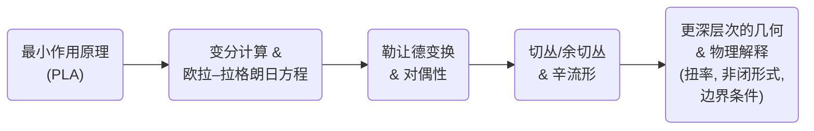

# 走向最小作用量原理的本质：统一的几何与物理视角
* * *

--- 在每个微分步骤中蕴含着所有可能世界的总和 —— 以最小作用量导航，你便掌握自然界的经济核心。

# 第一章. 变分原理的基础

**题词：**  
“微小的变化可以改变整个系统的命运。变分微积分引导这一转变。”

## 1.1. 重温最小作用量原理

本节总结最小作用量原理(PLA)的经典陈述，涉及其历史发展、哲学重要性及其对物理和数学的影响。

1. **历史片段**  
   - PLA 可以追溯到 G. W. 莱布尼茨、P. 莫佩尔蒂和 L. 欧拉，并由 P. S. 拉普拉斯和 J. L. 拉格朗日系统地发展。  
   - 先驱者们认识到自然在许多现象中表现出令人惊讶的“路径偏好”经济性，从光学折射到行星轨道。

2. **经典表述**  
   - 在最简单的力学形式中，PLA 表述为：一个物理系统在配置空间中通过一条使称为_作用量_的积分极值化(通常是最小化)的路径。  
   - 设
   $$
   S[q(t)] \;=\; \int_{t_{0}}^{t_{1}} L\left(t,\, q(t),\, \dot{q}(t)\right)\, dt ,
   $$
    其中 $L$ 是拉格朗日函数。真实路径使得 $\delta S=0$ 。

3. **哲学意义与广泛影响**  
   - 哲学上，PLA 统一了局部动力学(微分方程)与全局经济原则。它暗示自然在约束下“选择”最优路径。  
   - 它渗透到基础物理学 —— 光学(费马原理)、量子场论(路径积分)、广义相对论(希尔伯特作用量)等。

4. **“最小”的性质**  
   - 严格的最小化可能被替换为驻定性：实际路径是 $S$ 的驻定点(最小值、最大值或鞍点)。  
   - 这一见解澄清了 $\delta S = 0$ 是关键的数学条件。

综上所述，这些元素揭示了为什么 PLA 常被视为指导大部分理论物理的“主原理”。

## 1.2. 单变量极小化与泛函优化

本节在初等单变量微积分 $\left(\tfrac{d}{dx}=0\right)$ 与更深层次的变分微积分 $\left(\tfrac{\delta}{\delta y}=0\right)$ 之间建立类比。展示离散变量如何过渡到连续泛函。

1. **与单变量微积分的类比**  
   - 对于单变量函数 $f(x)$ ，局部极值发生在
   $$
   \frac{df}{dx} = 0 .
   $$
    在极值附近 $x$ 的小增量不会导致 $f$ 的一阶变化。

2. **扩展到泛函**  
   - 一个**泛函** $\displaystyle J[y]$ 以整个函数 $y(\cdot)$ 为输入，返回一个实数。  
   - 条件
   $$
   \frac{\delta J}{\delta y} = 0
   $$
    是 $\tfrac{df}{dx}=0$ 的无穷维类比。这里，变分 $\delta y$ 是函数空间中的“方向”。

3. **离散  $\rightarrow$  连续**  
   - 用积分代替离散和：如果
   $$
   J[y] \;=\; \int_{x_{0}}^{x_{1}} F\left(x,\;y(x),\;y'(x)\right)\,dx ,
   $$
    则关于 $y$ 的“微分”意味着测试小变形 $\eta(x)$ 使得 $\delta y = \eta$ 。

4. **几何与物理解释**  
   - 在几何中，寻求 $\mathbb{R}^n$ 或流形上的曲线，使其某些长度或能量最小化。  
   - 在物理中，系统在配置空间中遵循的路径通过极化作用量泛函找到。

通过这种类比，读者可以看到单变量微积分方法如何推广到整个曲线，揭示出发现由“最优”条件支配的系统轨迹或形状的强大方法。

## 1.3. 向欧拉-拉格朗日方程的构建

本节呈现标准推导路线 —— 主要是分部积分和边界条件 —— 并展示局部欧拉-拉格朗日条件如何连接到全局约束(边界项)。

1. **设置变分**  
   - 假设我们对 $y(x)$ 进行变分至 $\bar{y}(x) = y(x) + \epsilon\,\eta(x)$ ，且端点固定 $\eta(x_{0})=\eta(x_{1})=0$ 。  
   - 泛函变为
   $$
   J[\bar{y}] = \int_{x_{0}}^{x_{1}} F\left(x,\;\bar{y}(x),\;\bar{y}'(x)\right)\,dx\;.
   $$

2. **一阶变分与边界项**  
   - 计算
   $$
   \left.\frac{dJ}{d\epsilon}\right|_{\epsilon=0} \;=\;\int_{x_{0}}^{x_{1}} \left(\frac{\partial F}{\partial y}\,\eta \;+\;\frac{\partial F}{\partial y'}\,\eta'\right)\,dx\;.
   $$
   - 对 $\tfrac{\partial F}{\partial y'}\,\eta'$ 使用分部积分，由于 $\eta(x_{0})=\eta(x_{1})=0$ ，边界项消失(为零)。

3. **欧拉-拉格朗日方程**  
   - 提取 $\eta(x)$ ：
   $$
   \int_{x_{0}}^{x_{1}}\left[\frac{\partial F}{\partial y} \;-\;\frac{d}{dx}\!\left(\frac{\partial F}{\partial y'}\right)\right]\eta(x)\,dx=0\;.
   $$
   - 由于 $\eta(x)$ 除边界外为任意变分，被积函数必须为零：
   $$
   \frac{\partial F}{\partial y} - \frac{d}{dx}\!\left(\frac{\partial F}{\partial y'}\right) = 0\;,
   $$
    即著名的欧拉-拉格朗日方程。

4. **局部 ↔ 全局相互作用**  
   - 局部上， $\frac{\partial F}{\partial y}-\frac{d}{dx}\left(\frac{\partial F}{\partial y'}\right)=0$ 确保一条“驻定路径”。  
   - 全局上，边界条件(固定端点)强制边界项为零，体现“总路径”约束。

因此，可以看出当限制全局变分在端点处消失时，局部微分方程(欧拉-拉格朗日形式)自然产生 —— 将边界条件与由此产生的运动在概念上统一起来。

# 第二章. 勒让德变换与哈密顿对偶性

**题词：**  
“当速度被动量取代时，展现出不同的视野 —— 在本质上相等，但在形式上对偶。”

## 2.1. 勒让德变换基础

本节回顾勒让德变换的代数定义和几何解释，强调如何从拉格朗日函数过渡到哈密顿函数。展示对偶变量 $\left(q \leftrightarrow p\right)$ 的出现。

1. **代数定义**  
   - 给定函数
     $$
       L \;=\; L(q,\,\dot{q}), 
     $$
    定义广义动量
     $$
       p \;=\; \frac{\partial L}{\partial \dot{q}}. 
     $$
    勒让德变换 $H$ 是
     $$
       H(q,\,p) \;=\; p\,\dot{q} \;-\; L(q,\,\dot{q}) 
     $$
    这里可理解为 $\dot{q}$ 必须用 $p$ 表示。

2. **从拉格朗日到哈密顿的路径**  
   - “反转” $\dot{q}\mapsto p$ 的过程通常要求 $\tfrac{\partial^2 L}{\partial \dot{q}^2}\neq 0$ ，以确保可逆性。  
   - 一旦
     $$\dot{q}=\dot{q}(q,p)$$
    被找到，我们重写
     $$
       H(q,\,p) \;=\; p\,\dot{q}(q,p)\;-\;L\left(q,\dot{q}(q,p)\right).
     $$
    这个新函数 $H$ 是哈密顿函数，自然地用变量 $(q,p)$ 表示。

3. **几何解释**  
   - 考虑切丛 $TQ$ 有坐标 $(q,\dot{q})$ 。映射
     $$\dot{q}\;\mapsto\;p=\partial L/\partial \dot{q}$$ 
    是一个微分，将 $TQ$ 中的点与余切丛 $T^*Q$ 中的点对应起来。  
   - 因此，勒让德变换对应于速度和动量角色的交换 —— 这是物理和几何中对偶性的经典例子。

4. **对偶变量  $\left(q \leftrightarrow p\right)$**  
   - $\dot{q}$ (速度)在拉格朗日力学中是“自然”的，而 $p$ (动量)在哈密顿力学中是“自然”的。  
   - 两组变量描述相同的底层物理但强调不同的不变量(例如能量与动能和势能之差)。

总体而言，勒让德变换是代数和几何引擎，使我们从以速度为中心的观点 $\left(q,\dot{q}\right)$ 转向以动量为中心的观点 $\left(q,p\right)$ 。这种“切换”构成哈密顿力学表述的基础。

## 2.2. 配置空间与相空间

本节阐明为什么勒让德变换会从切丛 $\left(TQ\right)$ 视角转换到余切丛 $\left(T^*Q\right)$ 视角。说明位置-速度对与位置-动量对的区别以及每种视角捕捉系统不同不变量的方式。

1. **从 $TQ$ 到 $T^*Q$**  
   - 拉格朗日力学自然地存在于切丛
     $$
       TQ \;=\; \left\{(q,\dot{q}) \mid q\in Q,\quad \dot{q}\in T_qQ \right\}.
     $$
   - 勒让德映射
      $$\dot{q}\mapsto p=\partial L/\partial \dot{q}$$ 
    将 $TQ$ 中的点与余切丛
     $$
       T^*Q \;=\; \left\{(q,p) \mid q\in Q,\quad p\in T_q^*Q \right\},
     $$
    中的点对应起来，前提是 $\partial^2L/\partial\dot{q}^2\neq 0$ 。

2. **配置空间与相空间**  
   - **配置空间** $Q$ : 一个流形，其点代表系统所有可能的位置(或配置)。切丛  $TQ$  则捕捉位置和速度。  
   - **相空间** $T^*Q$ : 一个流形，其点代表所有可能的 $(q,p)$ 。这个视角对于哈密顿力学至关重要，在其中跟踪位置和动量，能量函数 $H(q,p)$ 成为主要对象。

3. **辛 $2$-形式与不变量**  
   - 在 $T^*Q$ 上，典范 $1$-形式
     $$\theta=\sum_i p_i\,dq^i$$
    导致典范辛 $2$-形式
     $$
       \omega \;=\; d\theta \;=\; \sum_i dp_i\wedge dq^i.
     $$
    这个形式在哈密顿动力学中是基本的。  
   - **能量 vs. 作用量**: 在拉格朗日形式中，我们常关注作用量积分 $\int L\,dt$ 。在哈密顿形式中，能量函数(或哈密顿量)占据主导地位，作为运动积分或相空间中的流生成器。

4. **为什么进行切换？**  
   - 哈密顿分析可以更好地揭示守恒量(动量、总能量、角动量)。  
   - 相空间几何(辛形式、泊松括号)揭示了更深层次的结构 —— 例如可积性、混沌、几何量子化。

这种 $TQ$ 与 $T^*Q$ 之间的区别突显了一个机械系统可以通过两个强大的视角来观察，每个视角揭示互补的不变量和对称性。

## 2.3. 例子与图解

本节通过具体的机械模型强化概念。显示从拉格朗日函数 $\left(L\right)$ 到哈密顿函数 $\left(H\right)$ 的具体变换，并解释小展开或平衡场景。

1. **简谐振子**  
   1. **拉格朗日函数**:
      $$
        L(q,\dot{q}) \;=\; \tfrac12\,m\dot{q}^2 \;-\; \tfrac12\,k\,q^2\,.
      $$
   2. **广义动量**:
      $$
        p \;=\; \frac{\partial L}{\partial\dot{q}} \;=\; m\,\dot{q}\,.
      $$
   3. **哈密顿函数**:
      $$
        H(q,\;p) \;=\; p\,\dot{q} \;-\;L \;=\; \frac{p^2}{2\,m} \;+\;\frac12\,k\,q^2\,.
      $$
    - **解释**: 这是总能量；$\dot{q}=p/m$ 是速度。

2. **接近平衡的摆**  
   - (小角度)摆的拉格朗日函数：
     $$
       L(\theta,\dot{\theta}) \;=\; \tfrac12\,m\,\ell^2\,\dot{\theta}^2 \;-\; mg\ell\,\tfrac{\theta^2}{2}\;.
     $$
    对于小振荡，它模拟简谐振子。转动惯量 $I=m\ell^2$ 。  
   - 动量：
      $\;\;p_\theta = I\,\dot{\theta}$ .  
   - 哈密顿函数：
      $\;\;H = \frac{p_\theta^2}{2I} + mg\ell\,\tfrac{\theta^2}{2}.$ 

3. **非线性例子：小展开**  
   - 如果 $L(q,\dot{q})$ 是非线性的，勒让德反演可能会更加复杂。然而，可以在已知解附近进行展开，并说明哈密顿函数如何从 $L$ 的偏导数中出现。

这些例子使勒让德变换具体化：从基于“速度”的动态定律到基于“动量”的能量函数。线性或小幅度展开突出最简单模型如何确认该形式主义的力量。

# 第三章. 辛流形与力学的几何基础

**题词：**  
“在每个 $2$-形式中，隐藏着一个几何世界，它塑造经典演化的节奏。”

## 3.1. 切丛与余切丛

本节介绍 $T(M)$ 和 $T^*(M)$ 作为纤维丛及其对力学的相关性。概述基本定义、局部平凡化以及切结构/余切结构的物理意义。

1. **纤维丛基础**  
   - $n$ 维流形 $M$：$M$ 中的点表示系统的**配置**。  
   - **切丛**
   $$
     T(M) \;=\; \left\{(m,\,v)\;\big|\;m\in M,\;v\in T_{m}M\right\}
   $$
    本身是一个 $(2n)$-维流形，带有纤维 $T_{m}M$ “附着”于每个 $m$。  
   - 类似地，**余切丛**
   $$
     T^{*}(M) \;=\; \left\{(m,\,\alpha)\;\big|\;m\in M,\;\alpha\in T_{m}^*M\right\}
   $$
    有纤维 $T_{m}^{*}M$ ($T_mM$ 上的线性泛函)。

2. **局部平凡化**  
   - 在点 $m_0\in M$ 附近，选取坐标 $\left(x^1,\dots,x^n\right)$。则 $T(M)$ 的一个局部区域看起来像 $\mathbb{R}^{n}\times\mathbb{R}^{n}$。在物理学语言中，$\left(x^i,\,\dot{x}^j\right)$。  
   - 对于余切丛，局部坐标变为 $\left(x^i,\,p_j\right)$，其中 $p_j$ 作用为 $\dot{x}^j$ 的对偶。

3. **物理相关性**  
   - **切丛视角**：拉格朗日力学使用 $\dot{x}^j$ (速度)作为基本量。拉格朗日函数 $L$ 定义在 $T(M)$ 上。  
   - **余切丛视角**：哈密顿力学使用 $p_j$ (动量)作为基本量。哈密顿函数 $H$ 定义在 $T^{*}(M)$ 上。  
   - 勒让德变换连接这两种视角，并深刻依赖于切丛与余切丛之间的几何关系。

这两个丛之间的相互作用构成经典力学的基础，各自提供编码系统动力学的不同但等价的方式。

## 3.2. 辛 $2$-形式与哈密顿流

展示辛 $2$-形式如何定义哈密顿动力学。强调 $\omega$ 的非退化性和闭性，以及哈密顿方程如何从保持 $\omega$ 的向量场中产生。

1. **辛 $2$-形式**  
   - $2n$-维流形 $M$ 上的**辛形式** $\omega$ 是一个闭的且非退化的 $2$-形式，即
   $$
     d\omega = 0, 
     \quad
     \text{and}
     \quad
     \omega\left(v,\, w\right)\;=\; 0\;\;\;\forall\,w\;\Longrightarrow\;v=0.
   $$
   - 在余切丛上的局部坐标 $\left(q^1,\dots,q^n,p_1,\dots,p_n\right)$ 中，典范辛形式是
   $$
     \omega = \sum_{i=1}^{n} \,dq^i \wedge dp_i.
   $$

2. **哈密顿动力学**  
   - 哈密顿函数 $H\colon M\to\mathbb{R}$ 通过
   $$
     \iota_{X_H}\,\omega \;=\; dH.
   $$
    定义一个向量场 $X_H$。等价地，
   $$\dot{q}^i = \tfrac{\partial H}{\partial p_i} \text{ and } $\dot{p}_i = -\,\tfrac{\partial H}{\partial q^i}.$$
   - 这一对方程是**辛几何**编码哈密顿正则方程的方式。局部上，
   $$
     \omega(X_H,\cdot)\;=\;dH(\cdot).
   $$
   - 因为 $\omega$ 是**非退化的**，每个哈密顿函数 $H$ 都有一个唯一的流 $X_H$。

3. **保持 $\omega$ 的几何**  
   - 哈密顿流保持 $\omega$：$\mathcal{L}_{X_H}\,\omega=0$。  
   - 因此，相体积得以保持($\omega^n$ 是刘维尔体积形式)。这构成了哈密顿力学中的刘维尔定理的基础，并且是遍历理论和统计力学的基石。

这些性质说明了 $\omega$ 如何成为哈密顿力学的几何“引擎”：每个哈密顿函数生成一个尊重辛结构的规范流。

## 3.3. 扭率、非对称扩展与广义辛视图

本节提供关于扭率或非闭形式如何推广标准辛几何的提示。简要勾勒如果 $\omega$ 不闭合时会发生什么，并指出潜在的研究方向。

1. **推广的动机**  
   - 标准辛几何要求 $d\omega=0$。但在某些扩展背景下 —— 具有规范势的场、磁荷背景(单极子) —— $\omega$ 可能不精确或不闭合。  
   - 同样，可以在流形上施加一个带有扭率的联络，使几何偏离通常的 Levi-Civita 框架。

2. **扭率与非完整约束**  
   - 在微分几何中，当选择的联络在下标中不对称时，就会出现扭率。对于力学，扭率可以出现在具有非完整约束的模型中或超越黎曼空间的几何场景中。  
   - 如果我们赋予一定的偏斜来修改局部形式 $\omega$，可能会出现“非对称辛”结构。系统可能表现出异常的平行移动或额外的自由度。

3. **非闭 $\omega$**  
   - 如果 $d\omega\neq0$，通常的哈密顿图像发生变化；守恒定律或刘维尔定理可能需要调整。  
   - 某些高级场论(例如带 $B$-场的拓扑 $\sigma$-模型)利用**扭率辛形式** $\omega+B$。条件 $d(\omega+B)=0$ 可以被更一般的上同调约束所替代。

4. **探索方向**  
   - **广义复几何**：合并复结构和辛结构。  
   - **Courant代数胚**：在更广泛的“广义几何”范围下统一泊松、辛和 Dirac 结构。  
   - **可能的力学系统**：非常规约束、扩展相空间或量子类修改，其中扭率在波函数相位演化中起积极作用。

因此，在标准辛流形之外，现代理论物理存在重要的前沿领域：从破坏精确性的规范场到带有扭率的几何框架，每一种都可能生成新的机械“相位”或相互作用。

# 第四章. 更深层次的主题洞察与新方向

**题词：**  
“深入探究即为统一：连接经典与量子、局部与整体、几何与物理。”

## 4.1. 边界条件与全局约束的力量

本节重申变分原理中的边界项揭示了隐藏的对称性或全局约束。提供说明性的例子 —— 自由端点与固定端点、规范约束、拓扑边界项 —— 并展示它们如何塑造力学中更深层次的结构。

1. **变分计算中边界项的作用**  
   - 在标准的欧拉-拉格朗日方程推导中，通常通过施加变化 $\eta$ 的条件来忽略或“消去”边界项。然而，如果这些边界条件不同，剩余的边界项可以施加全局约束或揭示基于对称性的守恒定律。  
   - 数学上，如果
     $$
       \delta S \;=\;\left[\alpha\,\eta \right]_{\,x_0}^{\,x_1}\;+\;\int_{x_0}^{x_1} \dots\, dx,
     $$
    则在特定的边界条件下 $\eta$ 可能不会消失(为零)，因此项 $[\alpha\,\eta]_{\,x_0}^{\,x_1}$ 具有物理意义(例如边界通量)。

2. **自由端点与固定端点**  
   - **固定端点**：$\eta(x_0)=\eta(x_1)=0$。边界项消失(为零)，得到局部方程 $\frac{\partial F}{\partial y} - \frac{d}{dx}\left(\frac{\partial F}{\partial y'}\right)=0$。  
   - **自由端点**：$\eta$ 在边界处可能不为零。额外的“自然边界条件”出现，有时导致边界上的动量为零或确保端点没有外部力的约束。

3. **规范约束与拓扑边界项**  
   - **规范约束**：在电磁学或杨-米尔斯理论中，与规范场相关的边界项可以阐明守恒荷(电通量等)。这些边界条件编码全局规范约束，确保规范势在模边界数据下良好定义。  
   - **拓扑项**：在某些场论(Chern-Simons, BF 理论)中，作用泛函包含拓扑边界项 $\int \omega$。这些项不影响局部运动方程，但显著影响全局性质(二维中的任意子统计等)。

4. **全局约束**  
   - 边界条件可以打破或保持对称性。保持的对称性产生诺特定律，而被打破的对称性可能导致有趣的边界激发或反常。  
   - 在高维系统中，边界项可以在边界上生成低维的有效理论，以非平凡的方式连接局部体边界。

总体而言，变分原理中的边界条件不仅仅是用于消除积分的技术步骤；它们体现了强大的全局数据，塑造整个解空间，并可能揭示隐藏的对称性或拓扑丰富性。

## 4.2. 对偶性与扩展系统

本节展开对偶拉格朗日/哈密顿视角可以超越普通力学推广到场论或更奇特的机械结构。简要提及如何在额外维度中扩展偏导数和展开，从而将整个方案提升到“更高一维”。

1. **为什么对偶视角重要**  
   - 拉格朗日与哈密顿力学是对偶形式的一个微观世界。在场论中，可以类似地用与场关联的正则动量重新表述作用原理。  
   - 对偶形式(配置空间与相空间)通常强调互补不变量：局部规范势与全局荷，或基于速度的约束与基于动量的约束。

2. **场论扩展**  
   - 用场变量 $\phi(\mathbf{x},t)$ 和偏导数 $\partial_\mu \phi$ 替换普通变量 $(q,\dot{q})$。作用积分变为
     $$
       S[\phi] \;=\;\int \!\!\int \left(\mathcal{L}\left(\phi,\partial_\mu \phi\right)\right)\,d^nx\,dt.
     $$
   - 勒让德变换定义正则动量 $\pi = \frac{\partial \mathcal{L}}{\partial (\partial_0 \phi)}$，从拉格朗日图景 $(\phi,\partial_\mu \phi)$ 转移到哈密顿图景 $(\phi,\pi)$。

3. **扩展系统与“更高一维”**  
   - “更高一维”的说法表明偏导数 $\partial_\mu\phi$ 将速度的概念推广到多个空间和时间方向。  
   - 同样，场论中的边界条件成为高维流形中的边界或曲面积分，可能揭示新的现象(例如拓扑绝缘体、量子霍尔系统)。

4. **奇异例子**  
   - **刚体**或**陪集空间**模型，具有扩大或减少自由度的约束。  
   - 现代高能物理学中的**高阶形式规范理论**，其中广义势耦合到扩展对象(弦、膜)。

通过欣赏对偶性如何在场论或扩展系统中持续并扩展，可以看到最小作用原理优雅地扩展到更复杂的场景，将局部拉格朗日密度链接到全局哈密顿结构(有时甚至超越)。

## 4.3. 超越标准模型？

本节推测高级见解如何揭示新的机械范式或几何结构。讨论开放问题、可能的“富含扭率”应用，或连续或量子系统中的涌现现象。

1. **开放问题与推测理论**  
   - **几何结构**：带扭率的几何、非完整约束和非交换相空间可能超越传统的黎曼-卡丹/哈密顿框架。  
   - **零边界展开**：探讨在弯曲时空或量子引力背景下边界条件如何改变作用量驻点的意义。

2. **富含扭率应用**  
   - 在连续介质力学或自旋晶格系统中，扭率可能编码缺陷或位错。作用原理可以纳入“扭曲”或“带扭率”的联络。  
   - 某些引力理论(例如爱因斯坦-嘉当)允许扭率，导致微观自旋耦合的曲率效应 —— 仍然是高能物理学研究的一部分。

3. **涌现现象**  
   - **量子场论**中的拓扑扇区或边界激发：如何通过作用的高级变分揭示分数荷或任意子统计。  
   - **非标准流形**：镜像对称、广义复几何或扩展泊松结构可能作为新的物理理论框架，统一经典和量子图像。

这一视角表明，远非“仅仅是另一种表述”，最小作用原理的高级几何重新解释可能开辟最终连接经典力学与量子和涌现集体现象的路径。扭率、非闭形式和高维扩展有望转变已建立的范式。

# 第五章. 综合与展望

**题词：**  
“从最小作用原理中升腾起统一的几何；从几何中，我们窥见可能未来的形状。”

## 5.1. 关键概念总结

本节提供一个简洁的概述，涵盖主要支柱 —— 最小作用原理(PLA)、欧拉-拉格朗日框架、勒让德变换和辛几何 —— 作为快速交叉引用和最终一致性检查。

1. **最小作用原理(PLA)**  
   - 断言物理轨迹(在配置空间或更一般设置中)使作用泛函保持驻定(通常是极小值)。  
   - 通过相同的极值变分基本原理统一经典动力学、光学和场方程。

2. **变分计算与欧拉-拉格朗日方程**  
   - 泛函方法：
     $$
       \delta \left(\int L\,dt \right) = 0 
       \;\implies\;
       \frac{d}{dt}\!\left(\frac{\partial L}{\partial \dot{q}}\right) - \frac{\partial L}{\partial q} = 0.
     $$
   - 边界条件至关重要地决定物理约束或自然边界条件。

3. **勒让德变换与对偶性**  
   - 代数机制连接拉格朗日图景(~基于速度)和哈密顿图景(~基于动量)。  
   - 创建对偶变量 $\left(q,\dot{q}\right)$ $\leftrightarrow$ $\left(q,p\right)$，每个视角揭示互补不变量(作用量 vs. 能量)。

4. **辛几何与哈密顿力学**  
   - 相空间 $\left(T^*Q\right)$ 上的辛形式 $\omega$ 定义哈密顿流：
     $$
       \iota_{X_H}\omega = dH.
     $$
   - 非退化性和闭性 $\left(d\omega = 0\right)$ 确保规范结构保持体积(刘维尔定理)并生成运动积分。

5. **更深层次的几何与物理解释**  
   - 边界项 → 隐藏的全局约束(例如拓扑边界条件)。  
   - 纤维丛视角 → 切丛与余切丛、扭率，以及可能非闭形式 ($\omega\neq d\theta$) 的广义理论。  
   - 潜在的新前沿：高级几何、扩展系统、量子/拓扑表述。

综上所述，这些原则突显了 PLA 如何作为一个顶点，将局部微分方程、全局约束和复杂的几何结构统一起来，架起了经典与量子边界的桥梁。

## 5.2. 未来研究展望

本节建议深入研究的方向：量子几何、高级辛几何，以及连接经典与量子、局部与整体结构的拓扑方法。

1. **量子几何与几何量化**  
   - 探索辛流形如何通过几何量化程序(例如 Kostant–Souriau)实现量子化。  
   - 研究“预量子线丛”、半形式和其他高级构造，以在经典相空间之上编码量子波函数。

2. **高级辛理解**  
   - **广义辛几何**：我们已经瞥见了扭率或非闭形式如何推广标准辛几何。更系统的探索可能会发现超越哈密顿方程的新力学。  
   - **泊松与 Dirac 结构**：在现代几何中，泊松和 Dirac 结构统一了约束、规范变换和部分辛形式。这些框架可能会揭示新的可积系统或混沌区域。

3. **拓扑与全局方法**  
   - **Chern-Simons** 和其他拓扑作用项表明，边界项和全局不变量可以产生新现象(任意子统计、分数荷)。  
   - 场论中的规范反常或拓扑障碍可能在扩展的 PLA 视角下找到更深的表现。

4. **连续介质力学与涌现现象**  
   - 带扭率的理论可能描述弹性或自旋晶格系统中的缺陷或位错。  
   - 凝聚态物质中的涌现结构(例如非平凡贝里相位、量子霍尔效应)往往依赖于类似辛的形式、边界和规范场。

简而言之，PLA 可以作为推动量子-经典过渡、更高复杂度系统和未预见几何复杂性的概念引擎。

## 5.3. 结语

强调最小作用思想在统一数学和物理学中的持久作用。提供关于这些思想如何继续开拓更深层次理解的最终讨论。

1. **重新的统一者**  
   - 从光学到量子场论，PLA 仍然是一个统一者：相同的变分逻辑在几个世纪的物理学中以多种形式重现。  
   - 每个新视角 —— 勒让德、辛或边界中心 —— 反映了相同的基本原则，用不同的语言表达。

2. **未来的愿景**  
   - 几何与物理学的持续重叠表明，最小作用原理仍有未探索的领域 —— 特别是在非平凡拓扑空间、高阶范畴框架和跨学科背景(例如数据优化、机器学习结构上回响着作用最小化)中。

3. **最终思考**  
   - 确实，“在每个微分步骤中都包含所有可能世界的总和” —— PLA 是每个系统在局部力和全局约束之间隐含对话。通过精炼我们对这些对话的掌握，我们更有能力推动数学和物理学的边界，追寻新的统一和创造性的突破。

因此，最小作用原理不仅是一个静态的经典科学遗产，而是一座动态的桥梁 —— 不断扩展到量子、拓扑和涌现领域，召唤我们去发现自然界宏大设计中的更多和谐。

# 附录 A: 概念关系映射

为了帮助读者快速掌握核心思想并看到主要概念是如何相互关联的，本附录提供一个一目了然的示意图。以下图示展示了从最小作用原理(PLA)到高级几何考虑(例如扭率、边界项、非闭形式)的逻辑流程。

**图例与评注：**

1. **最小作用原理 (A)**  
   概念的起点：经典和现代表述将许多物理理论统一在单一的概念下，即现实世界的轨迹/极值是通过使作用泛函极小化找到的。

2. **变分计算与欧拉-拉格朗日方程 (B)**  
   最小作用原理背后的局部/微分机制。通过在作用积分上施加驻定条件 $\delta S=0$，欧拉-拉格朗日方程浮现出来，并构成边界条件与力方程之间的联系。

3. **勒让德变换与对偶性 (C)**  
   从基于速度的拉格朗日力学转向基于动量的哈密顿力学。对偶变量 $(q,\dot{q})$ ↔ $(q,p)$ 打开了同一物理系统的不同但互补描述的大门。

4. **切丛、余切丛与辛流形 (D)**  
   经典力学的几何支柱。切丛捕捉速度，余切丛捕捉动量，而辛形式 $\omega$ 定义哈密顿流和守恒原则(例如刘维尔定理)。

5. **更深层次的几何与物理解释 (E)**  
   扩展到扭率、非对称形式、边界约束和拓扑项，扩展了标准的辛框架。在这里，高级领域 —— 如规范反常、几何量化或拓扑边界激发 —— 进一步统一并丰富了经典-量子桥梁。

通过追踪每个节点，读者可以可视化基本原理(A)如何规定变分机制(B)，进而引出对偶的哈密顿视角(C)，最终扎根于几何表述(D)，并扩展到未来的研究前沿(E)。这种流程还突出了边界条件、拓扑和广义几何结构的作用，强调了文档贯穿始终的主题，即连接局部方程与全局约束。

# 附录 B: 关于目的论与最小作用原理的进一步思考

在最小作用原理(PLA)的历史中，偶尔会出现关于它是否意味着自然具有目的论(或“目的驱动”)特征的争论，或者它更准确地被看作是我们人类为了建模世界而构建的一种简洁的数学形式主义。

## B.1. 经典的目的论一瞥

从古代到启蒙时期，像亚里士多德和后来的欧拉这样的思想家设想了一个似乎倾向于某些优雅最小化或最优路径的宇宙。对他们来说，“最小作用”的概念与自然经济的整体原则 —— 即自然“选择”最有效路径的明显倾向 —— 相辅相成。受**终极因**(亚里士多德目的论)或一般神学倾向的影响，一些人认为 PLA 反映了宇宙设计或更高理性原则的工作。

欧拉的论点将这一思路带入了更为几何和分析的环境：他觉得哲学上令人满意的是，行星椭圆轨道的定律或光学中的折射定律都可以从一个统一的积分优化中得出。这种观察似乎强调了自然“旨在”做最少的事情 —— 从而强化了目的论的解读。

## B.2. 费曼的实用主义视角

快进到二十世纪，理查德·费曼 —— 在庆祝基于作用量表述的优雅的同时 —— 经常强调物理理论是“模型”，由我们构建以解释观察现象。从费曼的实用主义角度来看，PLA 既不是目的论也不是关于自然界隐藏意图的真实陈述；它只是一个恰好简洁地编码了物理学多个领域底层动力学的强大统一原理。

对费曼而言，这些基于作用量的模型的成功是对它们数学能力的证明(以及实验与预测的一致性)，而不一定是证据表明宇宙“偏好”这种最小化有任何目的性的意义。因此，PLA 作为一个辉煌但由人类选择的框架出现：更多归功于数学的对称形式，而不是先验的自然“目标”。

## B.3. 观点调和与超越当前理解的扩展

1. **数学“必然性”与形而上学“目的”**  
   - 有人认为，一旦设置了带有边界条件的一致局部微分方程，运动积分或最小作用准则在数学上是不可避免的 —— 即这些形式更多是关于内部一致性而非目的论。  
   - 其他人指出，“路径求和”(例如在量子场论中)可以纯粹操作性地阅读：路径积分方法不依赖于任何整体的“目的”，而是依赖于叠加原理以及所有路径对振幅的贡献。

2. **涌现目的论与拓扑约束**  
   - 有趣的是，现代拓扑场论研究(或具有强边界条件或反常的系统)暗示，如果从纯局部视角解释，边界或全局约束可能会创造“看似目的论”的行为。这种涌现的“目的”实际上是更深几何约束的结果 —— 从而将经典的目的论概念与先进的量子或拓扑框架联系起来。  
   - 这种观点表明，现代意义上的目的论可能是更深层次边界或拓扑条件的宏观表现：一种从结构一致性的整个流形、场或势能景观中涌现的“最佳设计”。

3. **向认知与人工智能领域的外推**  
   - 超出物理学，PLA 的“成本最小化”概念与某些神经或 AI 模型(例如理论神经科学中的自由能原理或机器学习中的优化)产生共鸣。虽然这些可能看起来像是目的论(“大脑旨在最小化自由能”)，但更可信的是将它们视为递归更新规则，这些规则产生稳定解或最小化惊喜。  
   - 这些平行之处进一步模糊了自然界中真正的“目标”与“数学最佳拟合”描述之间的界限。它们强调了观察者(或有机体)如何将涌现的稳定状态解释为“有目的的”或“目的驱动的”，而从建模的角度来看，系统只是寻求稳定、低能量或低惊喜的配置。

## B.4. 通向新的综合

当代思想家们或许应该既不要僵硬地否定旧的目的论暗示，也不要过于字面地解读它们。PLA —— 以及一般的变分概念 —— 占据了一个可以从多种方式框架化的罕见视角：

- **“极简深度”论题**：自然通过揭示一致的积分最小化，可能反映了我们尚未完全理解的更深层次的统一或隐藏对称性。  
- **“建构主义”论题**：PLA 源于强大的形式工具集 —— 变分计算 —— 的成功，它优雅地捕捉局部和全局约束，而不暗示自然本身有“目标”。

在这类反思中存在着新思想的肥沃领域：高级或广义的作用原理(例如，带扭率、边界反常或非交换几何的作用原理)是否暗示了部分返回目的论语言 —— 尽管是在更现代、严格的意义上？还是它重申了“选择”或“目的”的语言是覆盖宇宙深层无意识强制数学的启发式外衣？

展望未来，调和这些视角很可能会产生更丰富的概念框架。我们可以预期，进一步的前沿——量子引力、全息对偶、拓扑相变——将细化我们如何解释“作用”和“最小化”。在这些新领域中，也许目的论和极简主义将以修订后彻底现代的方式找到表达：不是在教条主义的教条中，而是作为高级数学和哲学好奇心汇聚的扩大的视野。

## B.5. 总结

总之，PLA 是目的论还是仅仅是一个有力的人类选择的形式主义的问题仍然是一个有益的张力。远未解决，最好将这种张力视为一种生成的动力 —— 促使我们深化对作用原理的数学基础和哲学基础的理解。如果有什么的话，这种张力只放大了 PLA 的神秘和优雅：该原理对于现代前沿研究的相关性就像它对于过去几个世纪的杰出人物一样，继续引发关于我们宇宙为何可能“偏爱”某些路径而非其他路径的新见解。

