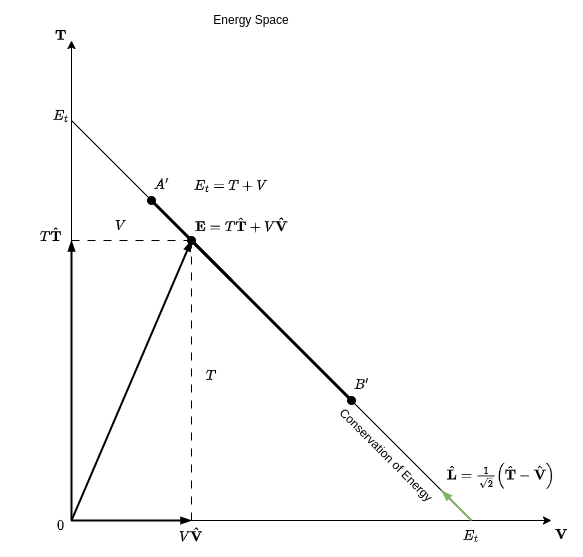

支撑起整个物理学的单一原理
拉格朗日力学 - 观察世界的美丽方式

# 声明与推导

最小作用原理(principle of least action) —— 也称为稳定作用原理(stationary-action principle) —— 是一种变分原理，当应用于机械系统的作用(action)时，会产生该系统的运动方程。该原理表明，轨迹(即运动方程的解)是系统的作用泛函(action functional)的驻点(stationary points)。

该原理可用于推导牛顿、拉格朗日和哈密顿运动方程，甚至广义相对论，以及经典电动力学和量子场论，是现代物理学和数学的核心。

## 一般声明

一个物理系统的作用(action)，标志为$\mathcal{S}$，定义为时间$t_{1}$和$t_{2}$的两个瞬间之间的拉格朗日$L$积分 —— 技术上是$N$个广义坐标$\mathbf{q}=\left(q_{1},q_{2},\ldots,q_{N}\right)$的函数，它们是时间的函数，并定义了系统的配置：
$$
\begin{aligned} & \mathbf{q}:\mathbf{R}\rightarrow\mathbf{R}^{N}\\
 & \mathcal{S}\left[\mathbf{q},t_{1},t_{2}\right]=\int_{t_{1}}^{t_{2}}L(\mathbf{q}(t),\dot{\mathbf{q}}(t),t)dt
\end{aligned}
$$
其中上标点标志时间导数，并且$t$标志时间。

数学上，该原理是
$$
\delta\mathcal{S}=0,
$$
其中 $\delta$ (小写希腊字母delta)表示**小的**变化。描述文字为：

“系统在时间$t_{1}$和$t_{2}$以及配置$q_{1}$和$q_{2}$之间所采取的路径是作用(action)相对于一阶(first order)是稳定的(stationary)、没有变化的(no change)。”

稳定作用并不总是一个最小值，尽管历史上称为最小作用：它是有限维系统路径中足够短的、有限段的最小原理。通常，该点有可能是最小值或鞍点(saddle points)，很少可能是最大值。

+-----------------------------------------------+
|     |
+-----------------------------------------------+
| 随着系统的演化，$\mathbf{q}$ 通过配置空间跟踪一条路径(只显示了一些)。在系统配置 $(\delta\mathbf{q})$ 的微小变化之下，系统(红色)所采用的路径具有稳定作用 $(\delta S=0)$。  |
+-----------------------------------------------+

在应用中，作用的陈述和定义在“哈密顿原理”中结合在一起，以现代形式写为：
$$
\delta\int_{t_{1}}^{t_{2}}L(\mathbf{q},\dot{\mathbf{q}},t)dt=0.
$$
作用和拉格朗日函数都包含系统的动力学。术语“路径”仅指系统根据配置空间中的坐标绘制的曲线，即曲线 $\mathbf{q}(t)$，通过时间参数化。

下面将展示如何推导欧拉-拉格朗日方程，但首先从一个更熟悉的概念开始：单变量函数的优化。

## 最小化函数

在单变量微积分中，如何找到给定函数 $f(x)$ 的局部最大值和最小值？局部最小值或最大值可以出现在其切线斜率 $df/dx$ 等于 $0$ 的任意点。
$$
\frac{df}{dx}=0
$$
这是一个非常重要的概念：在局部最小值或最大值处，函数输入的任意小变化都会导致输出值沿着同一方向远离之前的输出。在变分法中，我们关注的不是函数的固定点，而是泛函的固定点。

## 泛函

以上讨论的函数具有一些特定的属性。它们的定义域和值域都是实数。基本上，可以把这类函数看作一台机器，输入一个实数，输出一个实数。
$$
\mathbb{R} \rightarrow \boxed{f(x)} \rightarrow \mathbb{R}
$$

泛函则有点不同，输入一个函数，输出一个实数。为了区分函数和泛函，我们通常用方括号而不是圆括号表示它们的输入。
$$
f(x) \rightarrow \boxed{J[f(x)]} \rightarrow \mathbb{R}
$$

这里有一个关键的变化：
由于泛函接受一个函数作为输入，我们的值可以依赖于 $x, y$ 和其导数 $x, f(x), f'(x)$ 的任意函数。它本质上包含了更多的信息。

下面将重点讨论一种特定形式的泛函， $J[y(x)]$ 等于 $F(x, y, y')$ 的积分。
$$
J[y(x)] = \int_{x_0}^{x_1} F(x, y, y') dx
$$
如果我们给定一条曲线 $y$，$F$ 就成为关于 $x$ 的函数，当我们对其进行积分时，实际上是在曲线 $y(x)$ 上对 $F$ 的所有值进行求和。虽然这看起来可能没什么意义，但实际上这是一个非常重要的概念。

一个例子是求曲线的弧长。弧长公式为：
$$
S[y(x)] = \int_{x_0}^{x_1} \sqrt{1 + (y')^2}\, dx
$$
注意，这完美地符合 $J[y]$ 的形式。另一个例子是速降线问题。
$$
T[y(x)] = \int_{x_0}^{x_1} \sqrt{\frac{1 + (y')^2}{2g(h-y)}}\, dx
$$
我们可以将沿着一条曲线滚动所需的时间写成这个积分。另一个重要的例子是拉格朗日力学中的作用量。
$$
S[q(x)] = \int_{t_0}^{t_1} L(t, q, \dot{q}) dx
$$
拉格朗日证明了一个粒子会沿着使其动能减去势能(通常称为拉格朗日量)的积分最小的路径运动。这也符合 $J[y]$ 的形式。

## 推导欧拉-拉格朗日方程

通过以上对泛函的初步了解，让我们来看一看变分法的核心问题。对于两点 $A(x_0, y_0)$ 和 $B(x_1, y_1)$，有无数条曲线经过它们。我们希望找到使得 $J[y]$ 具有极值的那条曲线。
$$
J[y(x)] = \int_{x_0}^{x_1} 2F(x, y, y') dx
$$
从根本上说，我们要找的是在 $A$ 和 $B$ 之间使 $F$ 的积分最小的曲线。我们将考虑当我们在输入中添加一个小变化时会发生什么，在这种情况下，任意小变化都是一个函数。

假设 $y$ 是 $J[y]$ 的一个极值点，即 $y$ 使得 $J[y]$ 最优。我们设 $\bar{y}$ 为：
$$
\bar{y}(x,\epsilon) = y(x) + \epsilon \cdot \eta(x)
$$
这里， $\epsilon$ 是变分参数，与 $x$ 无关，而 $\eta$ 是在 $x-y$ 平面中的任意函数，则 $\epsilon \cdot \eta$ 是在函数中的小变化，即虚位移(virtual displacement)。为了确保 $\bar{y}$ 仍然满足边界条件，我们需要设 $\eta(x_0)$ 和 $\eta(x_1)$ 都等于零，
$$
\eta(x_0) = \eta(x_1) = 0
$$
注意到 $J[\bar{y}]$ 现在只是 $\epsilon$ 的函数，记为 $J(\epsilon)$，
$$
J[\bar{y}] = J(\epsilon)
$$
由于 $\epsilon$ 等于零时是 $J$ 的一个极值点，
$$
\epsilon = 0 \rightarrow \bar{y} = y
$$
我们知道 $J'(\epsilon)$ 在 $\epsilon$ 等于零时等于零，
$$
J'(\epsilon = 0) = 0
$$
这就意味着“最小作用量原理”，即路径会选择一个极值点。

现在我们来简化 $dJ/d(\epsilon)$，
$$
\frac{dJ}{d\epsilon} = \frac{d}{d\epsilon} \int_{x_0}^{x_1} 2F(x, \bar{y}, \bar{y}') dx
$$
根据莱布尼茨规则，我们可以将其重写为从 $x_0$ 到 $x_1$ 的 $\partial F/\partial \epsilon$ 的积分。
$$
\int_{x_0}^{x_1} 2 \frac{\partial F}{\partial \epsilon} dx
$$
利用多变量链式法则，
$$
\int_{x_0}^{x_1} \left( \frac{\partial F}{\partial \bar{y}} \frac{\partial \bar{y}}{\partial \epsilon} + \frac{\partial F}{\partial \bar{y}'} \frac{\partial \bar{y}'}{\partial \epsilon} \right)dx
$$

根据 $\bar{y}$ 的定义，我们有 $\eta = \frac{\partial \bar{y}}{\partial \epsilon}, \eta' = \frac{\partial \bar{y}'}{\partial \epsilon}$，上式可以再次简化为
$$
\int_{x_0}^{x_1} \left( \frac{\partial F}{\partial \bar{y}} \eta + \frac{\partial F}{\partial \bar{y}'} \eta' \right) dx
$$
对于右侧这个项，$\frac{\partial F}{\partial \bar{y}'} \eta'$，我们可以使用分部积分法进一步分解这个积分，
$$
\int_{x_0}^{x_1} \frac{\partial F}{\partial \bar{y}'} \eta' \,dx
$$

我们设：
$$
u = \frac{\partial F}{\partial \bar{y}'},~ dv = \eta' \, dx
$$
则，
$$
du = \frac{d}{dx}\left( \frac{\partial F}{\partial \bar{y}'} \right),~ v = \eta
$$
根据分部积分法则，我们可以将这个积分重写，
$$
\left[ \frac{\partial F}{\partial \bar{y}'} \eta \right]_{x_0}^{x_1} - \int_{x_0}^{x_1} \eta \frac{d}{dx}\left( \frac{\partial F}{\partial \bar{y}'} \right) dx
$$
注意到左侧第一项为 $0$，因为边界条件， $\eta(x_0)$ 和 $\eta(x_1)$ 都等于 $0$。
$$
0 - \int_{x_0}^{x_1} \eta \frac{d}{dx}\left( \frac{\partial F}{\partial \bar{y}'} \right) dx
$$
将这个结果代入原来的积分并提取两项中的 $\eta$，我们得到，
$$
\frac{dJ}{d\epsilon} = \int_{x_0}^{x_1} \left[ \frac{\partial F}{\partial \bar{y}} - \frac{d}{dx} \frac{\partial F}{\partial \bar{y}'} \right] \eta \, dx
$$
因为 $\eta$ 为任意函数，为了让这个积分一般情况下等于 $0$，我们需要括号内的项等于 $0$。这就得到了欧拉-拉格朗日方程。
$$
\frac{\partial F}{\partial \bar{y}} - \frac{d}{dx} \frac{\partial F}{\partial \bar{y}'} = 0
$$
可以说这是最重要的方程之一，它彻底改变了数学和物理学。

## 备注

对于 $\bar{y}$ 的定义
$$
\bar{y}(x,\epsilon) = y(x) + \epsilon\eta(x)
$$
其中：
- $y(x)$ 是基路径。
- $\epsilon$ 是变分参数，即虚维度(virtual dimension)。
- $\eta(x)$ 是满足边界条件 $\eta(x_0) = \eta(x_1) = 0$ 的变分函数。在这里， $\eta(x)$ 必须是 $x$ 的函数，以便允许在路径上不同的点有不同的变分。

因此，虚位移的定义为：
$$
\delta y = \bar{y}(x,\epsilon) - y(x) = \epsilon\eta(x)
$$
这表明：
1) 虚位移与 $\epsilon$ 成比例。虚位移本质上是一阶变分，这解释了它与 $\epsilon$ 的线性关系。
2) 方向由 $\eta(x)$ 决定。
3) 幅值由 $\epsilon$ 控制。

理解这些关系的关键在于认识到：

1) 变分过程涉及方向 $\eta(x)$ 和幅值 $\epsilon$
2) 线性假设是变分法的基础
3) $\eta(x)$ 的边界条件确保变分路径满足端点约束

虚位移与 $\epsilon$ 的关系可以通过线性近似来理解：
$$
\delta y = \epsilon\eta(x) = \epsilon\left.\frac{\partial \bar{y}}{\partial \epsilon}\right|_{\epsilon=0}
$$
这建立了“虚位移($\delta y$)”相对于“虚维度($\epsilon$)”的“线性关系”，显示了变分本质上是函数空间中的方向导数。

由此进一步地，我们可以从几何直觉上理解 $(dJ/d\epsilon)$ 。

根据泛函：
$$J[y] = \int_{x_0}^{x_1} F(x,y,y')\,dx$$
当我们引入变分 $\bar{y} = y + \epsilon\eta(x)$ 时：
$$J[\bar{y}] = \int_{x_0}^{x_1} F(x,y+\epsilon\eta,y'+\epsilon\eta')\,dx$$
则 $dJ/d\epsilon$ 表示：
$$\frac{dJ}{d\epsilon} = \frac{d}{d\epsilon}\int_{x_0}^{x_1} F(x,y+\epsilon\eta,y'+\epsilon\eta')\,dx$$
我们可以将 $dJ/d\epsilon$ 视为测量 $J$ 在变分 $\eta(x)$ 方向上的“斜率”，这类似于有限维中的方向导数，但现在位于无限维的函数空间中。从函数空间视角：
- 每个 $\epsilon$ 值给出一条不同的路径 $\bar{y}(x)$ 。
- $J[\bar{y}]$ 测量这条路径上的某些性质(如长度、面积、能量等)。
- $dJ/d\epsilon$ 测量路径变形时这些性质变化的速度。
- $dJ/d\epsilon$ 在 $\epsilon=0$ 处称为 $J$ 的“一阶变分”，将其设为零 $(dJ/d\epsilon=0)$ 给出极值的必要条件。

可以这样理解：最小作用量原理实际上是求解一个泛函极值的问题。在数学中，我们熟悉的是函数的最大值和最小值问题，而作用量是一个关于路径的泛函。寻找作用量极值的过程，类似于在函数中寻找最大值或最小值，只不过这里的“函数”依赖于整个路径而非单个点的位置。

```
   J
   ↑
   |     不同路径
   |    /   /   /
   |   /   /   /
   |  /   /   /
   | /   /   /
   |/   /   /
   +------------→ ε
   
   dJ/dε 测量在 ε = 0 处的斜率
```

在 $\epsilon=0$ 处的条件 $\frac{dJ}{d\epsilon}=0$ 意味着：

1) 我们处于函数空间中的一个驻点
2) 任意方向上的小变分在一阶近似下不会改变 $J$
3) 这类似于通过 $\frac{df}{dx}=0$ 寻找常规函数的极值

对于我们关心的，在力学中的作用量泛函：
$$J[q] = \int_{t_1}^{t_2} L(q,\dot{q},t)\,dt$$
则 $dJ/d\epsilon$ 测量作用量在虚位移下的变化。精确的数学表达式是：
$$\left.\frac{dJ}{d\epsilon}\right|_{\epsilon=0} = \int_{x_0}^{x_1} \left[\frac{\partial F}{\partial y}\eta - \frac{d}{dx}\left(\frac{\partial F}{\partial y'}\right)\eta\right]dx = 0$$
这必须对所有允许的变分 $\eta(x)$ 成立，从而得出欧拉-拉格朗日方程：
$$\frac{\partial F}{\partial y} - \frac{d}{dx}\left(\frac{\partial F}{\partial y'}\right) = 0.$$

## 关于目的论的争议

运动微分方程及其积分方程的数学等价性具有重要的哲学意义。微分方程是关于定域到空间中某一点或某一时刻的量的表述。例如，牛顿第二定律
$$
\mathbf{F}=m\mathbf{a}
$$
说明施加在一个质量 $m$ 上的瞬时的(instantaneous)力 $\mathbf{F}$ 在同一瞬间(instant)产生一个加速度 $\mathbf{a}$。相反，作用原理不是局限于某一点；而是它涉及时间间隔上的积分和(对于场)空间的扩展域。

此外，在经典作用原理的通常公式中，系统的初始和最终状态是固定的，例如，假定粒子在时间 $t_{1}$ 从位置 $x_{1}$ 开始，在时间 $t_{2}$ 从位置 $x_{2}$ 结束，连接这两个端点的物理轨迹是作用积分的一个极值。

特别是，最终状态的确定被解释为赋予作用原理目的论性质，这在历史上一直有争议。反对者的观点是：目的论方法假定变分原理本身具有事实上不具备的数学特性。此外，一些批评家认为，这种明显的目的论是由于问题的提出方式而产生的。通过指定初始条件和最终条件(位置而不是速度)的某些方面(而不是所有方面)，我们从最终条件对初始条件进行了一些推断，正是这种“反向”推断可以被视为一种目的论解释。

## 参考资料

以上内容来自于经过现代的数学和物理修饰后的表述，因规整和严谨而隔阂，不容易把握。为了把握概念并培养直觉，我们有时候需要上溯到概念的起源，了解概念的流变，并且要回答几个基础且重要的问题。

如下的参考资料[1]介绍了最小作用原理的发展与演变，最后推导出一个让人意想不到的结果，让我们回过头来更深刻地理解了力学系统。参考资料[2]也是类似的讲解，得出了类似的结果，但是最终却提出了一个争论很久的问题，反过来对于最小作用原理的影响有了超越领域的深刻思考。

1. [The single principle that underpins all of physics](https://www.youtube.com/watch?v=Q10_srZ-pbs)
2. [Lagrangian Mechanics - A beautiful way to look at the world](https://www.youtube.com/watch?v=dPxhTiiq-1A)
3. [Is ACTION The Most Fundamental Property in Physics?](https://www.youtube.com/watch?v=Q_CQDSlmboA)
4. [Action principles](https://en.wikipedia.org/wiki/Action_principles)
5. [Calculus of variations](https://en.wikipedia.org/wiki/Calculus_of_variations)

# 最小作用原理的发展与演变

对于最小作用原理的认识，起源于约翰·伯努利对于最速降线研究时所产生的非常有创意、优雅的解法。

一般认为，是莫佩尔蒂斯制定了最小作用原理，他提出的版本被称为莫佩尔蒂斯原理。在18世纪40年代，他提出了一种新的量，他称之为作用量(action)。它是质量乘以速度乘以距离。

他的思路大致如下：
- 物体行进的距离越远，作用量就越大。
- 它移动得越快，作用量就越大。
- 如果是粒子，那么粒子的质量越大，作用量就越大。
$$
\text{action: }S_0 = \sum mvs
$$

但是，莫佩尔蒂斯原理的提出更像是凭空臆想。没有任何明显理由说明为什么自然界应该关心质量乘以速度乘以距离，或者类似的量，为什么这个量应该被最小化。

而且数学上，当时的最小作用量原理也不够严谨。最后是欧拉完成了这部分工作。

欧拉做的第一件事就是用积分替换求和，这样就可以在速度或方向连续变化的情况下计算作用量。
$$
\sum mvs \rightarrow \int mv\,ds
$$
$$
\text{action: }S_0 = \int mv\,ds
$$
他利用这一点来寻找围绕中心质量的粒子路径，比如行星绕恒星的轨道。解决这个问题意味着在两点之间每一条可能的路径中，他必须找到作用量最小的那个。

通过这个过程，欧拉意识到最小作用量原理只有在总能量守恒且所有路径的能量相同的情况下才成立。这是莫佩尔蒂斯没有意识到的两个必要条件。

1) 能量守恒
2) 所有路径的能量相同
$$\mathrm{E}_1 = \mathrm{E}_2 =  \mathrm{E}_3 = \cdots = \mathrm{E}_n$$

因此，欧拉改进了该原理的数学严谨性。他发现了两个额外的条件，并提供了具体的示例。

1. 改进了数学严谨性

2. 发现了两个额外的条件：

   i) 能量守恒

   ii) 路径之间的能量固定

3. 提供了一个具体的工作示例

但是，最后是拉格朗日成功地提供了一般的证明。所以最终得到的方程被称为欧拉-拉格朗日方程。

为以直观的方式来思考作用量我们分三步走。

1. 一般方法

2. 现代形式

3. 为什么它有效

## 解决这些问题的一般方法

所以首先是一般方法。

如果 $A$ 和 $B$ 两点之间有无限多的可能路径，如何找到作用量最小的那一条？

欧拉和拉格朗日意识到，可以采用类似寻找函数最小值的方法。在那里，取导数并令其等于$0$。
$$
f(x): \frac{df}{dx}=0
$$
在斜率为零的地方，那一定是最小值。

同样地，如果有一个作用量最小的路径，那么如果你稍微改变它，想象我们在最小作用量路径上加一个小函数$\eta$，那么作用量基本上不应该改变，因为我们处于一个非常特殊的位置，即最小作用量路径。如果那是作用量最小的最优路径，那么任何其他路径的作用量都必须更大。


这里的一个关键假设是：所有这些都是线性的。所以如果是与 $\eta$ (偏差)成比例的一阶项，则一阶作用量的变化将是 $0$，即 $\eta$ 的系数必须是 $0$。

但因为现在处于最小值，它更像是一个抛物线，所以它可以与$\eta$的平方或更高阶项成比例。


所以作用量有一个很小的偏差，但它不与 $\eta$ 成比例。因此在一阶上，最优路径与试验路径之间的作用量变化是 $0$。所以试验路径的作用量减去真实路径的作用量在一阶上等于 $0$，可以写为
$$
\begin{aligned}
S_0[q(t)] - S_0[x(t)] &= 0 \\
\delta S_0 & = 0
\end{aligned}
$$
这是一种简洁地书写最小作用量原理的方法，也是解决所有这些问题的一般方法。


## 将原理写成现代形式

有了这些知识，让我们将原理重写成现代形式，从莫佩尔蒂斯的作用量开始，它是质量乘以速度乘以距离的总和。

但是欧拉将其改成了积分的形式，因此它是质量乘以速度对距离的积分。
$$
\begin{aligned}
\delta S_0 & = 0 \\
\delta \int mv\,ds & = 0
\end{aligned}
$$
现在速度等于 $ds$ 除以 $dt$，我们可以重新排列得到 $ds$ 等于 $v\,dt$。将此代入，我们得到时间上的 $mv$ 平方的积分。
$$
\begin{aligned}
v=\frac{ds}{dt} & \rightarrow ds=v\,dt \\
\delta \int mv^2\,dt & = 0
\end{aligned}
$$
在这里，这只是动能的两倍。

正如欧拉指出的，总能量必须守恒。
$$
\begin{aligned}
\delta \int mv^2\,dt & = 0 \\
\delta \int 2T\,dt & = 0 \\
\delta \int (T + T)dt & = 0
\end{aligned}
$$
总能量就是动能加上势能。
$$
E = T + V
$$
因此我们可以将其重写为 $T$ 等于 $E$ 减去 $V$。
$$
T = E - V
$$
将上式中的第二个 $T$ 替换为 $E - V$，我们得到作用量的变化 $T + E - V$ 对时间的积分等于 $0$。
$$
\begin{aligned}
\delta \int mv^2\,dt & = 0 \\
\delta \int (T + T)dt & = 0 \\
E = T + V & \rightarrow T = E - V \\
\delta \int (T + E - V)dt & = 0
\end{aligned}
$$
现在我们可以将这个积分拆分为两个部分，由于能量是常数，我们可以将这项对时间进行积分。
$$
\begin{aligned}
\delta \int (T + E - V)dt & = 0 \\
\delta \int (T - V)dt + \delta \int E\,dt & = 0 \\
\delta \int (T - V)dt + \delta (Et) & = 0
\end{aligned}
$$
我们将做进一步简化。就像普通的导数一样，我们可以将 $E$ 乘以 $t$ 的变化写成 $E$ 乘以 $t$ 的变化加上 $t$ 乘以 $E$ 的变化。
$$
\begin{aligned}
\delta \int (T - V)dt + \delta (Et) & = 0 \\
\delta (Et) &= E\delta t + t\delta E \\
\delta \int (T - V)dt + E\delta t + t\delta E & = 0
\end{aligned}
$$
但是请注意，正如欧拉发现的，不同路径的能量必须相同，因此它们之间的变化为 $0$，这项 $t\delta E$ 就会消失为零。
$$
\begin{aligned}
\delta \int (T - V)dt + \delta (Et) & = 0 \\
\delta (Et) &= E\delta t + t\delta E \\
\delta \int (T - V)dt + E\delta t + \cancel{t\delta E} & = 0 \\
\delta \int (T - V)dt + E\delta t & = 0
\end{aligned}
$$
重新排列，我们会发现这个积分的变化等于负的能量乘以时间的变化。
$$
\begin{aligned}
\delta \int (T - V)dt + E\delta t & = 0 \\
\delta \int (T - V)dt  & = - E\delta t
\end{aligned}
$$
现在我们可以通过只考虑具有相同旅行时间的路径来使它等于 $0$。如果这样做，时间将不再有任何变化，这项 $E\delta t$ 就会消失。
$$
\begin{aligned}
\delta \int (T - V)dt & = \cancel{- E\delta t}  \\
\delta \int (T - V)dt &= 0
\end{aligned}
$$
我们发现莫佩尔蒂斯的原理已经变形成了另一种形式，现在动能减去势能的时间积分等于 $0$。
$$
\delta \int (T - V)dt = 0
$$

回顾一下，我们从质量乘以速度对距离的积分开始，现在我们得到了动能减去势能对时间的积分。并且，这两种方式都可以用来表述最小作用量原理。
$$
\begin{aligned}
\delta \int mv\,ds & = 0  \\
\delta \int (T - V)dt &= 0
\end{aligned}
$$
但这同时也意味着这里的积分，$T$ 减 $V$ 对时间的积分，是另一种表示作用量的方式。
$$
\begin{aligned}
S &= \int (T - V)dt \\
L &= T - V
\end{aligned}
$$
第一个以这种方式写出最小作用量原理的人是哈密顿，他在1834年完成了这项工作，也因此使得该原理以他的名字命名。我们现在写的最小作用量原理是 $L\,dt$ 的积分，$\int L \,dt$，其中 $L$ 是拉格朗日量，即动能减去势能，人们称其为哈密顿原理，而不是拉格朗日原理，主要是哈密顿是在此基础上扩展了拉格朗日的工作。

哈密顿原理是现代表述最小作用量原理的方式，几乎所有的物理书中都会找到这种表述。
$$
\begin{aligned}
\delta S &= 0 \\
S &= \int_{t_1}^{t_2} (T - V)dt
\end{aligned}
$$
这两个原理之间的重要区别在于：
1. 哈密顿原理告诉你物体是如何从一个地方移动到另一个地方的，而不仅仅是给出路径的形状。即哈密顿原理给出了轨迹，而莫佩尔蒂斯原理仅给出路径。

2. 现在作用量是对时间而非空间的积分。哈密顿原理的一个结果是你现在需要一个起点和终点，以及一个开始时间和结束时间。

3. 在莫佩尔蒂斯原理中，你需要保持不同路径的能量相同，但时间可以变化。而在哈密顿原理中，能量可以不同，但路径之间的时间必须相同。


## 为什么最小作用量原理有效

现在我们有了通用方法和现代表述原理的方式，让我们通过一个简单的例子来看看为什么它有效。
$$
\begin{aligned}
S_0[q(t)] - S_0[x(t)] &= 0 \\
\delta S_0 & = 0
\end{aligned}
$$
$$
\begin{array}{c}
\delta \int mv\,ds = 0  \\
\boxed{\delta \int (T - V)dt = 0} \\
\text{哈密顿原理}
\end{array}
$$


假设我们将一个小球直直向上扔，因此它从某个起点出发，在一定时间内到达不同的终点。如果我们称球的高度为 $y$ 关于 $t$ 的函数，那么我们可以像这样绘制这两个点，然后我们可以想象无数条可能连接这两个点的轨迹。有些轨迹会高一点，有些低一点，有些有波动，有些则没有。唯一的条件是所有路径必须有相同的起点和终点，并且它们之间经过的时间相同。


现在要找到真实的轨迹，我们按照之前的方法进行。我们假设真实的路径为 $y(t)$，也就是作用量最小的路径。然后我们想象对这条路径进行微小的变动，比如在这里推高一点，在那里推低一点，如此这般，在每个时间步长上做出微小的改变，我们将这些改变称为 $\eta(t)$。当我们将 $y$ 和 $\eta$ 相加时，就会得到一个新的试验路径，我们称它为 $q(t)$。

由于这些变动很小，这两条路径之间的作用量差异为 $0$。
$$
\begin{aligned}
q(t) & = y(t) + \eta(t) \\
\delta S & = S[q(t)] - S[y(t)] = 0
\end{aligned}
$$

接下来的任务是解这个方程。为此，我们需要计算每条路径的作用量。

我们需要表述每条路径的动能和势能，并将它们写成 $y$ 和 $\eta$ 的函数。
$$
\begin{aligned}
v&=q(t) \\
T&=\frac{1}{2} m v^2 \\
& =\frac{1}{2} m\left(\frac{d q}{d t}\right)^2 \\
& =\frac{1}{2} m\left(\frac{d}{d t}(y+\eta)\right)^2 \\
& =\frac{1}{2} m\left(\frac{d y}{d t}\right)^2 + m \frac{d y}{d t} \frac{d \eta}{d t} + \frac{1}{2} m\left(\frac{d \eta}{d t}\right)^2 \\
& \approx \frac{1}{2} m\left(\frac{d y}{d t}\right)^2 + m \frac{d y}{d t} \frac{d \eta}{d t}
\end{aligned}
$$

$$
\begin{aligned}
V & =V(q) \\
V(q) & =V(y+\eta) \\
V(q) & =V(y)+\eta V^{\prime}(y)+\eta^2 V^{\prime \prime}(y)+\ldots \\
V(q) & \approx V(y)+\eta V^{\prime}(y)
\end{aligned}
$$

$$
\begin{aligned}
S[q(t)] & =\int_{t_1}^{t_2}(T-V) d t \\
S[q(t)] & =\int_{t_1}^{t_2}\left(\frac{1}{2} m\left(\frac{d y}{d t}\right)^2+m \frac{d y}{d t} \frac{d \eta}{d t}-V(y)-\eta V^{\prime}(y)\right) d t \\
& =\int_{t_1}^{t_2}\left(\frac{1}{2} m\left(\frac{d y}{d t}\right)^2-V(y)\right) d t+\int_{t_1}^{t_2}\left(m \frac{d y}{d t} \frac{d \eta}{d t}-\eta V^{\prime}(y)\right) d t
\end{aligned}
$$

$$
\begin{aligned}
v&=y(t) \\
T&=\frac{1}{2} m v^2 \\
 &=\frac{1}{2} m\left(\frac{d y}{d t}\right)^2
\end{aligned}
$$

$$
V=V(y)
$$
$$
\begin{aligned}
S[y(t)] & =\int_{t_1}^{t_2}(T-V) d t \\
        & =\int_{t_1}^{t_2}\left(\frac{1}{2} m\left(\frac{d y}{d t}\right)^2-V(y)\right) d t 
\end{aligned}
$$

将这些代入，我们得到作用量的差异等于以下结果。
$$
\begin{aligned}
q(t) & = y(t) + \eta(t) \\
\delta S& =S[q(t)]-S[y(t)]=0 \\
S[q(t)]& =\int_{t_1}^{t_2}\left(\frac{1}{2} m\left(\frac{d y}{d t}\right)^2-V(y)\right) d t+\int_{t_1}^{t_2}\left(m \frac{d y}{d t} \frac{d \eta}{d t}-\eta V^{\prime}(y)\right) d t \\
S[y(t)]& =\int_{t_1}^{t_2}\left(\frac{1}{2} m\left(\frac{d y}{d t}\right)^2-V(y)\right) d t \\
\delta S& =\int_{t_1}^{t_2}\left(\frac{1}{2} m\left(\frac{d y}{d t}\right)^2-V(y)\right) d t+\int_{t_1}^{t_2}\left(m \frac{d y}{d t} \frac{d \eta}{d t}-\eta V^{\prime}(y)\right) d t-\int_{t_1}^{t_2}\left(\frac{1}{2} m\left(\frac{d y}{d t}\right)^2-V(y)\right) d t\\
&=0
\end{aligned}
$$

在这里，第一个积分项就是真实路径的作用量，所以这些积分相互抵消，剩下的就是这部分，
$$
\delta S =\int_{t_1}^{t_2}\left(m \frac{d y}{d t} \frac{d \eta}{d t}-\eta V^{\prime}(y)\right) d t =0
$$
即 $m$ 乘以 $\frac{dy}{dt}$ 乘以 $\frac{d\eta}{dt}$ 减去 $\eta$ 乘以势能的导数对时间的积分等于 $0$。

我们可以通过分部积分进一步改写这个表达式，
$$
\begin{aligned}
\int_{t_1}^{t_2} m \frac{d y}{d t} \frac{d \eta}{d t} d t& =\left.m \frac{d y}{d t} \eta\right|_{t_1} ^{t_2}-\int_{t_1}^{t_2} m \frac{d^2 y}{d t^2} \eta\, d t \\
\int_{t_1}^{t_2} m \frac{d y}{d t} \frac{d \eta}{d t} d t& =-\int_{t_1}^{t_2} m \frac{d^2 y}{d t^2} \eta\, d t
\end{aligned}
$$
这允许我们做一些替换，
$$
\begin{aligned}
\delta S &=\int_{t_1}^{t_2}\left(m \frac{d y}{d t} \frac{d \eta}{d t}-\eta V^{\prime}(y)\right) d t =0 \\
\delta S &=\int_{t_1}^{t_2}\left(\left[-m \frac{d^2 y}{d t^2}-V^{\prime}(y)\right] \eta\right) d t=0
\end{aligned}
$$
我们代入这个表达式，我们现在得到了一个函数，当它乘以 $\eta$ 并对时间积分时必须等于 $0$。但由于 $\eta$ 可以是任意值，这意味着中间这一部分必须为 $0$。所以我们发现作用量最小的路径满足这个奇特的微分方程。
$$
-m \frac{d^2 y}{d t^2}-V^{\prime}(y) = 0
$$
看起来可能复杂，但实际上并不复杂。

势能的导数的负值就是力。
$$
-V^{\prime}(y) = F(y)
$$
高度的二阶导数呢？那就是加速度。
$$
-m \frac{d^2 y}{d t^2} = -m a
$$
因此，如果我们重新排列这个方程，我们发现满足最小作用量原理的路径就是遵循 $F$ 等于 $ma$ 的路径。
$$
\begin{aligned}
-m \frac{d^2 y}{d t^2} - V^{\prime}(y) & = 0 \\
-m a + F(y) & = 0
\end{aligned}
$$
换句话说，最小作用量原理等价于牛顿第二定律，
$$
F = ma.
$$

我们还可以进行反向验证。我们有
$$m \frac{d^2 y}{d t^2} = \frac{d}{dt}\left(m \dot{y}\right) = \frac{d}{d t} \frac{\partial}{\partial \dot{y}}\left(\frac{m \dot{y}^{2}}{2}\right)=\frac{d}{d t} \frac{\partial E_{k}}{\partial \dot{y}}$$
以及
$$F=-\frac{\partial V}{\partial y}$$
组合两个式子
$$-\frac{\partial V}{\partial y}=\frac{d}{d t} \frac{\partial E_{k}}{\partial \dot{y}}$$
由于势能是位置($y$)的函数，而不是速度的函数，同样地，动能是速度($\dot{y}$)的函数，而不是位置的函数，因此很明显，如果我们使用哈密顿原理来定义拉格朗日量：
$$L(y, \dot{y})=E_{k}(\dot{y})-V(y)$$
将其应用于上式立即得到欧拉-拉格朗日方程
$$\frac{\partial L}{\partial y} = \frac{d}{dt}\frac{\partial L}{\partial \dot{y}}$$
这个方程是连接拉格朗日量 $L$ 和物理系统运动规律的桥梁，它告诉我们如何从一个给定的拉格朗日量出发，找到描述系统动力学行为的微分方程。通过它即可捕捉到系统的全部动力学行为，而不需要分别考虑每个力的作用。

我们还可以进一步验证守恒律。例如，如果没有外力作用在物体上，
$$0=F=-\frac{\partial V}{\partial y}=\frac{\partial L}{\partial y}.$$
因为这两项相等，所以
$$0=\frac{d}{d t} \frac{\partial L}{\partial \dot{y}}=\frac{d}{d t} \frac{\partial E_{k}}{\partial \dot{y}}=\frac{d p}{d t} \Rightarrow p= \text{const}.$$
我们还可以考虑系统的总能量(机械能)，
$$U=E_{k}+V=\frac{m \dot{y}^{2}}{2}+V=m \dot{y}-\left(\frac{m \dot{y}^{2}}{2}-V\right)=\frac{\partial L}{\partial \dot{y}} \dot{y}-L$$
取时间导数
$$
\frac{d U}{d t}=\frac{d}{d t}\left(\frac{\partial L}{\partial \dot{y}} \dot{y}-L\right)=\frac{\partial L}{\partial \dot{y}} \ddot{y}+\frac{d}{d t} \frac{\partial L}{\partial \dot{y}} \dot{y}-\frac{\partial L}{\partial \dot{y}} \ddot{y}-\frac{\partial L}{\partial y} \dot{y}-\frac{\partial L}{\partial t}
$$
由于我们所考虑的拉格朗日量并不明确依赖于时间，因此我们可以消除最后一项。此外，第一项和第三项相消，剩下的就是：
$$\frac{d U}{d t}=\dot{y}\left(\frac{d}{d t} \frac{\partial L}{\partial \dot{y}}-\frac{\partial L}{\partial y}\right)=0 \Rightarrow U= \text{const}.$$
因此我们证明了能量是守恒的。

由此，我们证明了拉格朗日力学与牛顿力学是相容的。但是最小作用量原理涵盖的范围不仅仅限于力学。通过这个单一原理，我们突然可以描述一切，从光的反射和折射，到钟摆的摆动，再到行星绕太阳运行和恒星绕银河系核心运行。以前被视为完全独立的物理学领域现在都被统一在一个简单的规则下：作用量的变化为 $0$，
$$
\delta S = 0.
$$

# 力学等价性问题的另一种验证途径

## SO(3) 公式的推导

如今的牛顿力学系统全称应该是牛顿-欧拉力学系统，因为是欧拉完善了旋转方面的方程。

前面章节的推导过程针对的是单自由度直线运动，我们需要将其推广到三维旋转运动。用最小作用量原理推导出旋转运动方程 $\boldsymbol\tau = \boldsymbol I \boldsymbol\alpha$，这是一个很有意思的问题。

三维旋转运动的推导比单自由度直线运动复杂得多，主要是因为旋转运动涉及到角速度、角加速度和转动惯量等概念，而且转动惯量是一个张量，而不是一个标量。对于旋转运动对应的牛顿第二定律形式：
$$\boldsymbol\tau = \boldsymbol I \boldsymbol\alpha$$
其中，
- $\boldsymbol\tau$ 是**力矩向量**(扭矩)，即施加在物体上的力矩，即力对旋转轴的力臂乘积；
- $\boldsymbol I$ 是**转动惯量矩阵(张量矩阵)**，表示物体相对于旋转轴的质量分布；
- $\boldsymbol \alpha$ 是**角加速度向量**，表示物体角速度变化的速率。

一. 定义作用量和拉格朗日量

在旋转运动中，作用量(Action)依然是时间上的积分，并且拉格朗日量 $L$ 依然是动能 $T$ 与势能 $V$ 的差值。对于三维旋转运动，拉格朗日量可以表示为：
$$
L = T - V
$$
其中：
- $T$ 是旋转运动的动能。
- $V$ 是势能，在这里是角位移向量 $\boldsymbol{\theta}$ 的函数 $V(\boldsymbol{\theta})$。

对于刚体的三维旋转运动，动能 $T$ 是角速度 $\boldsymbol{\omega}$ 的二次型函数，其形式为：
$$
T = \frac{1}{2} \dot{\boldsymbol{\theta}}^T \boldsymbol{I} \dot{\boldsymbol{\theta}} = \frac{1}{2} \boldsymbol{\omega}^T \boldsymbol{I} \boldsymbol{\omega}
$$
其中：
- $\boldsymbol{\omega}$ 是**角速度向量**，表示刚体的旋转速率。
- $\boldsymbol I$ 是**转动惯量矩阵(张量矩阵)**，它是关于旋转轴的惯性张量。

二. 计算作用量

作用量 $S$ 是拉格朗日量在时间上的积分：
$$
S = \int_{t_1}^{t_2} L \, dt = \int_{t_1}^{t_2} \left( T - V \right) dt
$$
将动能 $T$ 代入，可以得到：
$$
\begin{aligned}
S &= \int_{t_1}^{t_2} \left( \frac{1}{2} \dot{\boldsymbol{\theta}}^T \boldsymbol{I} \dot{\boldsymbol{\theta}} - V(\boldsymbol{\theta}) \right) dt \\
 &= \int_{t_1}^{t_2} \left( \frac{1}{2} \boldsymbol{\omega}^T \boldsymbol{I} \boldsymbol{\omega} - V(\boldsymbol{\theta}) \right) dt
\end{aligned}
$$
其中：
- $\boldsymbol{\theta}$ 是**角位移向量**，表示物体绕轴旋转的角度。
- $V(\boldsymbol{\theta})$ 是角位移的势能函数。

三. 最小作用原理与欧拉-拉格朗日方程

为了得到旋转运动的方程，我们要对作用量 $S$ 取变分 $\delta S = 0$。

考虑一个变分 $\boldsymbol\theta + \boldsymbol\eta$：
$$
q(t) = \boldsymbol{\theta}(t) + \boldsymbol{\eta}(t)
$$
计算变分路径的动能：
$$
\begin{aligned}
T &= \frac{1}{2} \left(\frac{d}{dt}(\boldsymbol{\theta}+\boldsymbol{\eta})\right)^T \boldsymbol{I} \left(\frac{d}{dt}(\boldsymbol{\theta}+\boldsymbol{\eta})\right) \\
&= \frac{1}{2} \dot{\boldsymbol{\theta}}^T \boldsymbol{I} \dot{\boldsymbol{\theta}} + \dot{\boldsymbol{\theta}}^T \boldsymbol{I} \dot{\boldsymbol{\eta}} + \frac{1}{2} \dot{\boldsymbol{\eta}}^T \boldsymbol{I} \dot{\boldsymbol{\eta}} \\
& \approx \frac{1}{2} \dot{\boldsymbol{\theta}}^T \boldsymbol{I} \dot{\boldsymbol{\theta}} + \dot{\boldsymbol{\theta}}^T \boldsymbol{I} \dot{\boldsymbol{\eta}}
\end{aligned}
$$
计算势能变分：
$$
\begin{aligned}
V(\boldsymbol{\theta}+\boldsymbol{\eta}) & = V(\boldsymbol{\theta}) + \boldsymbol{\eta} \cdot \nabla V(\boldsymbol{\theta}) + O(\boldsymbol\eta^2) \\
& \approx V(\boldsymbol{\theta}) + \boldsymbol{\eta} \cdot \nabla V(\boldsymbol{\theta})
\end{aligned}
$$
计算作用量变分
$$
\begin{aligned}
S[q(t)]& =\int_{t_1}^{t_2}\left(\frac{1}{2} \dot{\boldsymbol{\theta}}^T \boldsymbol{I} \dot{\boldsymbol{\theta}} + \dot{\boldsymbol{\theta}}^T \boldsymbol{I} \dot{\boldsymbol{\eta}} - V(\boldsymbol{\theta}) - \boldsymbol{\eta} \cdot \nabla V(\boldsymbol{\theta})\right) d t \\
S[\boldsymbol{\theta}(t)]&= \int_{t_1}^{t_2} \left( \frac{1}{2} \dot{\boldsymbol{\theta}}^T \boldsymbol{I} \dot{\boldsymbol{\theta}} - V(\boldsymbol{\theta}) \right) dt 
\end{aligned}
$$
作用量的变化 $\delta S$ 为：
$$
\delta S = \delta \int_{t_1}^{t_2} \left( \dot{\boldsymbol{\theta}}^T \boldsymbol{I} \dot{\boldsymbol{\eta}} - \boldsymbol{\eta} \cdot \nabla V(\boldsymbol{\theta}) \right) dt = 0
$$
对第一项使用分部积分：
$$
\int_{t_1}^{t_2} \dot{\boldsymbol{\theta}}^T \boldsymbol{I} \dot{\boldsymbol{\eta}}\,dt = \left[\dot{\boldsymbol{\theta}}^T \boldsymbol{I} \boldsymbol{\eta}\right]_{t_1}^{t_2} - \int_{t_1}^{t_2} \boldsymbol{\eta}^T \boldsymbol{I} \ddot{\boldsymbol{\theta}}\,dt
$$
由于 $\boldsymbol\eta(t_1) = \boldsymbol\eta(t_2) = 0$，边界项消失。作用量的变化变为：
$$
\delta S = \int_{t_1}^{t_2} \boldsymbol{\eta}^T \left(-\boldsymbol{I}\ddot{\boldsymbol{\theta}} - \nabla V(\boldsymbol{\theta})\right)\,dt = 0
$$
由于这必须对任意变分 $\boldsymbol\eta$ 成立，我们得到：
$$
-\boldsymbol{I}\ddot{\boldsymbol{\theta}} - \nabla V(\boldsymbol{\theta}) = 0
$$
认识到势能的负梯度 $-\nabla V(\theta )$ 是力矩 $\boldsymbol{\tau}$，$\ddot{\boldsymbol{\theta}}$ 是角加速度 $\boldsymbol{\alpha}$：
$$
\begin{aligned}
-\nabla V(\boldsymbol{\theta}) &= \boldsymbol{I}\ddot{\boldsymbol{\theta}} \\
\boldsymbol{\tau} &= \boldsymbol{I}\boldsymbol{\alpha}
\end{aligned}
$$
这是牛顿第二定律的旋转类比，从最小作用原理推导而来。与线性情况的主要区别在于：
- 惯性张量 $\boldsymbol{I}$ 替代了质量 $m$
- 角加速度 $\boldsymbol{\alpha}$ 替代了线性加速度 $a$
- 力矩 $\boldsymbol{\tau}$ 替代了力 $F$
- 方程为向量或张量形式

这个推导展示了最小作用原理如何自然地引出旋转运动的基本方程，就像它在线性运动中所做的那样。

## SE(3) 公式的推导

我们需要将上述推导扩展到 SE(3) 情形，这时候需要一个复杂一点的物理建模抽象。

在线性运动中，我们将物体抽象为位于质心处的一个质点对其进行研究，这种物理建模很简单直观。在旋转运动中，物体的每一点的线性速度是不一样的，这时只能将物体抽象为有形状的刚体对其进行研究，在这种物理建模中，物体的每一点 $P$ 的线性速度向量 $\boldsymbol v_P$ 不一样，但是角速度向量 $\boldsymbol{\omega}$ 是自由向量，即在一个刚体中只有一个值。另外，当旋转轴 $l$ 不穿过质心时，还有一个平行轴定理需要考虑。

当我们需要进一步抽象，将一个3维刚体抽象为一个6维的点时，需要将旋量理论 (The theory of screws) 和空间向量代数(Spatial (6D) Vector Algebra)相结合。这时候空间速度、空间力、空间动量都是 $6\times 1$ 向量，而空间转动惯量为 $6 \times 6$ 矩阵。

理解这种抽象的关键在于理解此时的线速度 $\boldsymbol v_O$ 不是刚体上某一个固定点的速度，而是想象刚体可以无限扩展，在每一个瞬间总有一个点流过坐标系原点 $O$，此时在坐标系原点 $O$ 测量得到的刚体该点的瞬时速度。由此，我们可以构建空间速度向量
$$
{\hat{\boldsymbol{v}}}=\left[\begin{array}{c}
{\boldsymbol{\omega}}\\
{\boldsymbol{v}}_{O}
\end{array}\right]
$$
空间位移向量
$$
{\hat{\boldsymbol{r}}}=\left[\begin{array}{c}
{\boldsymbol{\theta}}\\
{\boldsymbol{r}}_{O}
\end{array}\right]
$$
以及空间加速度
$$
\hat{\boldsymbol{a}}=\left[\begin{array}{c} \dot{\boldsymbol{\omega}}\\ \dot{\boldsymbol{v}}_{O} \end{array}\right]=\left[\begin{array}{c} \dot{\boldsymbol{\omega}}\\ \ddot{\boldsymbol{r}}-\boldsymbol{\omega}\times\dot{\boldsymbol{r}} \end{array}\right]
$$

关于动量，则要复杂一些。

刚体的线动量(linear momentum) $\vec{\boldsymbol{h}}$ 是其质量 $m$ 与其质心 $C$ 处线速度 $\vec{\boldsymbol{v}}_{C}$ 的乘积。
$$\vec{\boldsymbol{h}}=m\vec{\boldsymbol{v}}_{C}$$
线动量是线向量。

刚体的固有角动量(intrinsic angular momentum) $\vec{\boldsymbol{h}}_{C}$ 是其角速度 $\vec{\boldsymbol{\omega}}$ 和围绕质心 $C$ 的转动惯量 $\bar{\boldsymbol{I}}_{C}$ 的乘积。
$$\vec{\boldsymbol{h}}_{C}=\bar{\boldsymbol{I}}_{C}\vec{\boldsymbol{\omega}}$$
角动量是一个自由向量。

刚体关于一个给定点 $O$ 的动量矩(moment of momentum) $\vec{\boldsymbol{h}}_{O}$ 是关于其固有角动量和该点的线动量矩之和。
$$
\begin{aligned}
\overrightarrow{OC}	&=\vec{\boldsymbol{c}}
\vec{\boldsymbol{h}}_{O}	\\&=\vec{\boldsymbol{h}}_{C}+\vec{\boldsymbol{c}}\times\vec{\boldsymbol{h}}
\end{aligned}
$$

刚体的空间动量(spatial momentum)是同时描述其线性动量和角动量的空间动力向量(动力旋量)。用Plücker坐标表示为：
$$
\boldsymbol{h}_{O}	=\left[\begin{array}{c}
\vec{\boldsymbol{h}}_{O}\\
\vec{\boldsymbol{h}}
\end{array}\right]
$$

刚体的空间惯量(spatial inertia)是其质量 $m$、质心(CoM) $C$ 和围绕质心的转动惯量 $\bar{\boldsymbol{I}}_{C}$ 的函数。

空间惯量提供了刚体惯量特性的完整描述。在Plücker坐标中，空间刚体惯量为一个 $6\times6$ 矩阵：
$$
\boldsymbol{I}_{O}=\left[\begin{array}{cc}
\bar{\boldsymbol{I}}_{O} & m\vec{\boldsymbol{c}}\times\\
m\vec{\boldsymbol{c}}\times^{\mathrm{T}} & m\boldsymbol{1}
\end{array}\right]
$$
其中
- $\bar{\boldsymbol{I}}_{O}=\bar{\boldsymbol{I}}_{C}-m\vec{\boldsymbol{c}}\times\vec{\boldsymbol{c}}\times$
- $\boldsymbol{c}\times$ 为反对称矩阵(skew symetry matrix)
$$
\begin{array}{cccc}
\text{If} & \boldsymbol{c}=\left[\begin{array}{c}
x\\
y\\
z
\end{array}\right] & \text{then} & \boldsymbol{c}\times=\left[\begin{array}{ccc}
0 & -z & y\\
z & 0 & -x\\
-y & x & 0
\end{array}\right]\end{array}
$$
- $\boldsymbol{1}$ 为 $3 \times 3$ 单位矩阵

因为本节后面推导主要使用6维向量，为行文方便，将空间量上的帽子符号去掉，空间速度为 $\boldsymbol{v}$、空间加速度为 $\boldsymbol{a}$、空间位移为 $\boldsymbol{r}$、空间动量为 $\boldsymbol{h}$、空间转动惯量为 $\boldsymbol{I}$。

由此，动量(Momentum)方程为：
$$ 
\boldsymbol{h}=\boldsymbol{I}\boldsymbol{v}
$$
动能(Kinetic Energy)为：
$$
T=\frac{1}{2}\boldsymbol{v}\cdot\boldsymbol{I}\boldsymbol{v}=\frac{1}{2}\boldsymbol{v}^T \boldsymbol{I}\boldsymbol{v}
$$
对于空间力 $\hat{\boldsymbol{F}}$
$$
{\hat{\boldsymbol{F}}}=\left[\begin{array}{c}
{\boldsymbol{\tau}}_{O}\\
{\boldsymbol{F}}
\end{array}\right]
$$
其构建要复杂一些
$$
\hat{\boldsymbol{F}}=\frac{\mathrm{d}}{\mathrm{d}t}\left(\boldsymbol{I}\boldsymbol{v}\right)=\boldsymbol{I}\boldsymbol{a}+\boldsymbol{v}\times^{*}\,\boldsymbol{I}\boldsymbol{v}
$$
其中 $\boldsymbol{v}\times^{*}$ 为
$$
{\boldsymbol{v}}\times^{*}=\left[\begin{array}{cc}
\boldsymbol{\omega}\times & \boldsymbol{v}_{O}\times\\
\boldsymbol{0} & \boldsymbol{\omega}\times
\end{array}\right]
$$
下面使用空间力时则采用简化符号 ${\boldsymbol{F}}$。

以上的空间力 ${\boldsymbol{F}}$ 和空间加速度为 $\boldsymbol{a}$ 的公式有些出乎意料，这是因为这种建模抽象去掉了科里奥利项或离心力项，使得空间力向量和空间加速度向量是真向量，可以跨越机械关节和连杆进行加减，应用起来十分方便。

基于以上建模，在SE(3)运动中，作用量(Action)依然是时间上的积分，并且拉格朗日量 $L$ 依然是动能 $T$ 与势能 $V$ 的差值。对于SE(3)运动，拉格朗日量可以表示为：
$$
L = T - V
$$
其中：
- $T$ 是旋转运动的动能。
- $V$ 是势能，现在是空间位移的函数 $V(\boldsymbol r)$。

因为SE(3)的动能方程与旋转的类似(这也是此种抽象的目的之一)，所以证明的推导过程与上一节类似。为避免重复，下面只采用快速的验证方法进行推导。

作用量 $S$ 是拉格朗日量在时间上的积分：
$$
S = \int_{t_1}^{t_2} L \, dt = \int_{t_1}^{t_2} \left( T - V \right) dt
$$
将动能 $T$ 代入，可以得到：
$$
S = \int_{t_1}^{t_2} \left( \frac{1}{2} \boldsymbol{v}^T \boldsymbol{I}\boldsymbol{v} - V(\boldsymbol{r}) \right) dt
$$
其中：
- $\boldsymbol{r}$ 是**空间位移向量**，表示物体在6维坐标系中的位移。
- $V(\boldsymbol{r})$ 是空间位移的势能函数。

为了得到SE(3)运动的方程，我们要对作用量 $S$ 取变分 $\delta S = 0$，即：
$$
\delta S = \delta \int_{t_1}^{t_2} \left( \frac{1}{2} \boldsymbol{v}^T \boldsymbol{I}\boldsymbol{v} - V(\boldsymbol{r}) \right) dt = 0
$$
根据欧拉-拉格朗日方程：
$$
\frac{d}{dt} \left( \frac{\partial L}{\partial \dot{\boldsymbol{r}}} \right) - \frac{\partial L}{\partial \boldsymbol{r}} = 0
$$
我们需要计算拉格朗日量 $L$ 对 $\dot{\boldsymbol{r}}$ 和 $\boldsymbol{r}$ 的偏导数。

1. **对 $\dot{\boldsymbol{r}}$ 的偏导数**：

   动能 $T$ 只依赖于空间速度 $\boldsymbol{v} = \dot{\boldsymbol{r}}$，因此有：
$$
\frac{\partial L}{\partial \dot{\boldsymbol{r}}} = \frac{\partial}{\partial \dot{\boldsymbol{r}}} \left( \frac{1}{2} \boldsymbol{v}^T \boldsymbol{I}\boldsymbol{v} \right) = \boldsymbol{I} \dot{\boldsymbol{r}} = \boldsymbol{I} \boldsymbol{v}
$$

2. **对 $\boldsymbol{r}$ 的偏导数**：

   势能 $V$ 是空间位移 $\boldsymbol{r}$ 的函数，因此：
$$
\frac{\partial L}{\partial \boldsymbol{r}} = - \frac{\partial V}{\partial \boldsymbol{r}} = \boldsymbol{F}(\boldsymbol{r})
$$
   其中 $\boldsymbol{F}(\boldsymbol{r})$ 是势能对空间位移的负梯度，对应于**空间力向量**。

将上述结果代入欧拉-拉格朗日方程：
$$
\frac{d}{dt} \left( \boldsymbol{I} {\boldsymbol{v}} \right) - \left(\boldsymbol{F}(\boldsymbol{r}) \right) = 0
$$
这给出空间力方程：
$$
\boldsymbol{F} = \frac{d}{dt} \left( \boldsymbol{I} {\boldsymbol{v}} \right)
$$
因此，通过以上最小作用原理的推导，我们得到了SE(3)运动的方程：
$$
\boldsymbol{F} = \frac{d}{dt} \left( \boldsymbol{I} {\boldsymbol{v}} \right)
$$
这与线性运动中的 $F = ma$ 对应，表明最小作用原理不仅适用于线性运动，还可以推广到旋转运动，得出相应的旋转运动定律。

## 将旋转运动方程推广到非惯性参考系

前面一节的物理建模抽象将科里奥利项或离心力项去除之后使得公式简单，本节将简单探讨如果考虑这些项，最小作用原理会产生什么样的公式。为简单起见，本节只讨论 SO(3) 旋转运动的情况。

为了将旋转运动方程($\boldsymbol{\tau} = \boldsymbol{I} \boldsymbol{\alpha}$)推广到**非惯性参考系**，我们必须考虑由于参考系自身加速而产生的**虚拟力**(也称为**伪力**)。惯性参考系和非惯性参考系之间的主要区别在于，后者需要在运动方程中包含这些额外的力。

在非惯性参考系中，**最小作用量原理**仍然适用，但**拉格朗日量**必须进行修改以纳入加速参考系的影响。这些影响表现为**虚拟力**，如**科里奥利力**、**离心力**和**欧拉力**。在这个扩展推导中，我们将包括这些力的贡献。

### 非惯性参考系的关键概念

1. **惯性参考系**：
   - 在这个参考系中，牛顿定律无需修改即可成立，即不存在虚拟力。

2. **非惯性参考系**：
   - 相对于惯性参考系加速或旋转的参考系。在这种参考系中，必须包括虚拟力以考虑参考系的加速度。

3. **虚拟力**：
   - **离心力(Centrifugal force)**：出现在旋转参考系中，使物体远离旋转中心的力。
   - **科里奥利力(Coriolis force)**：作用于旋转参考系内移动物体上的力，垂直于运动方向和旋转轴。
   - **欧拉力(Euler force)**：由于参考系非均匀旋转(即角速度变化)而出现的力。

### 非惯性参考系的修正拉格朗日量

为了将非惯性参考系的影响纳入**拉格朗日量**公式中，我们需要添加考虑虚拟力的项。非惯性参考系中的**拉格朗日量**表示为：
$$
L_{\text{non-inertial}} = L_{\text{inertial}} + L_{\text{fictitious}}
$$
其中：
- $L_{\text{inertial}} = T - V$ 是惯性参考系的标准拉格朗日量，$T$ 是动能，$V$ 是势能。
- $L_{\text{fictitious}}$ 考虑了非惯性参考系特有的虚拟力。

对于旋转参考系，总动能 $T$ 在惯性参考系中的表达式需要修改以包括旋转参考系的影响。旋转参考系中的动能变为：
$$
T_{\text{rotating}} = \frac{1}{2} \boldsymbol{\omega}^T I \boldsymbol{\omega} + T_{\text{fictitious}}
$$
其中 $T_{\text{fictitious}}$ 包括**离心力**、**科里奥利力**和**欧拉力**的贡献。

1. **离心力贡献**：
   - 旋转参考系中的离心力 $\boldsymbol{F}_{\text{cf}}$ 与旋转轴的距离成正比，并且与角速度的平方成正比：
   $$
     \boldsymbol{F}_{\text{cf}} = m \boldsymbol{\omega} \times (\boldsymbol{\omega} \times \boldsymbol{r})
     $$
    离心力项在拉格朗日量中贡献于动能：
   $$
     T_{\text{cf}} = \frac{1}{2} m (\boldsymbol{\omega} \times \boldsymbol{r})^2
     $$

2. **科里奥利力贡献**：
   - 科里奥利力 $\boldsymbol{F}_{\text{cor}}$ 作用于旋转参考系内的移动物体，表达式为：
   $$
     \boldsymbol{F}_{\text{cor}} = -2m (\boldsymbol{\omega} \times \dot{\boldsymbol{r}})
     $$
    科里奥利力项作为速度依赖的势能项贡献于拉格朗日量：
   $$
     T_{\text{cor}} = - m (\boldsymbol{\omega} \times \dot{\boldsymbol{r}}) \cdot \dot{\boldsymbol{r}}
     $$

3. **欧拉力贡献**：
   - 当参考系的角速度随时间变化时，会出现欧拉力 $\boldsymbol{F}_{\text{euler}}$：
   $$
     \boldsymbol{F}_{\text{euler}} = -m \frac{d\boldsymbol{\omega}}{dt} \times \boldsymbol{r}
     $$
    欧拉力项类似于时间依赖的势能项贡献于拉格朗日量：
   $$
     T_{\text{euler}} = - m \frac{d\boldsymbol{\omega}}{dt} \times \boldsymbol{r} \cdot \dot{\boldsymbol{r}}
     $$

### 非惯性参考系中的总拉格朗日量

因此，非惯性参考系中的总拉格朗日量为：
$$
L_{\text{non-inertial}} = \frac{1}{2} \boldsymbol{\omega}^T I \boldsymbol{\omega} + \frac{1}{2} m (\boldsymbol{\omega} \times \boldsymbol{r})^2 - m (\boldsymbol{\omega} \times \dot{\boldsymbol{r}}) \cdot \dot{\boldsymbol{r}} - m \frac{d\boldsymbol{\omega}}{dt} \times \boldsymbol{r} \cdot \dot{\boldsymbol{r}} - V(\boldsymbol{r})
$$
其中：
- $\boldsymbol{\omega}$ 是旋转参考系的角速度。
- $V(\boldsymbol{r})$ 是旋转参考系中的势能。
- $\boldsymbol{r}$ 是旋转参考系中的位置矢量。

### 非惯性参考系中的欧拉-拉格朗日方程

为了在非惯性参考系中推导运动方程，我们对这个修正后的拉格朗日量应用欧拉-拉格朗日方程：
$$
\frac{d}{dt} \left( \frac{\partial L_{\text{non-inertial}}}{\partial \dot{\boldsymbol{r}}} \right) - \frac{\partial L_{\text{non-inertial}}}{\partial \boldsymbol{r}} = 0
$$
通过进行变分，得到的运动方程将包括**离心力**、**科里奥利力**和**欧拉力**的项，以及原始的惯性力：
$$
I \boldsymbol{\alpha} = \boldsymbol{\tau} - m \boldsymbol{\omega} \times (\boldsymbol{\omega} \times \boldsymbol{r}) - 2m (\boldsymbol{\omega} \times \dot{\boldsymbol{r}}) - m \frac{d\boldsymbol{\omega}}{dt} \times \boldsymbol{r}
$$
其中：
- 第一项，$\boldsymbol{\tau}$，表示外部扭矩。
- 第二项，$- m \boldsymbol{\omega} \times (\boldsymbol{\omega} \times \boldsymbol{r})$，是**离心力**。
- 第三项，$- 2m (\boldsymbol{\omega} \times \dot{\boldsymbol{r}})$，是**科里奥利力**。
- 第四项，$- m \frac{d\boldsymbol{\omega}}{dt} \times \boldsymbol{r}$，是**欧拉力**。

### 非惯性参考系中旋转系统的最终运动方程

非惯性参考系中的最终运动方程为：
$$
\boldsymbol{\tau} = \boldsymbol{I} \boldsymbol{\alpha} + m \boldsymbol{\omega} \times (\boldsymbol{\omega} \times \boldsymbol{r}) + 2m (\boldsymbol{\omega} \times \dot{\boldsymbol{r}}) + m \frac{d\boldsymbol{\omega}}{dt} \times \boldsymbol{r}
$$
该方程将旋转运动推广到**非惯性参考系**，考虑了由于参考系加速和旋转而产生的虚拟力。

### 小结

通过将**虚拟力**纳入拉格朗日量，我们将旋转运动方程的推导扩展到了**非惯性参考系**。最终方程包括了**离心力**、**科里奥利力**和**欧拉力**的项，这些项对于描述旋转或加速参考系中系统的运动是必要的。这个扩展推导仍然遵循最小作用量原理，但这些附加力的存在反映该参考系的非惯性特性。

## 非惯性参考系中的角动量守恒

因为最小作用原理与诺特定理有紧密联系，所以对于上一节的内容，需要简单探讨非惯性参考系的角动量守恒问题。

在**惯性参考系**中，角动量守恒已经被很好地理解和直接由**诺特定理**得出，该定理指出，拉格朗日量的对称性(如旋转对称性)会导致守恒量(如角动量)。特别是，在没有外力矩作用的情况下，惯性参考系中的角动量 $\boldsymbol{L}$ 是守恒的：
$$
\frac{d\boldsymbol{L}}{dt} = \frac{d}{dt}(\boldsymbol I \boldsymbol{\omega}) = 0
$$
然而，在**非惯性参考系**(如旋转参考系)中，情况更为复杂，因为存在**虚拟力**，如离心力、科里奥利力和欧拉力。这些力会影响系统的运动，并在运动方程中引入额外的项，从而修改守恒定律。

### 非惯性参考系中的角动量重新审视

在非惯性参考系中，角动量 $\boldsymbol{L}$ 的定义与惯性参考系相似：
$$
\boldsymbol{L} = \boldsymbol{I} \boldsymbol{\omega}
$$
然而，非惯性参考系中**角动量的时间导数**受到虚拟力的影响，以及参考系本身可能正在加速或旋转的事实。非惯性参考系中角动量的总时间导数可以分为两个部分：

1. **旋转参考系中的时间导数** ($\frac{d\boldsymbol{L}}{dt}$)：这是在旋转参考系中测量的角动量变化率。
2. **由于参考系旋转引起的时间导数** ($\boldsymbol{\omega}_{\text{frame}} \times \boldsymbol{L}$)：这项考虑了参考系自身的旋转如何影响观察到的角动量变化率。

因此，非惯性参考系中角动量的总时间导数为：
$$
\frac{d\boldsymbol{L}}{dt} = \boldsymbol{\tau}_{\text{ext}} + \frac{d\boldsymbol{L}}{dt}\bigg|_{\text{rot}} + \boldsymbol{\omega}_{\text{frame}} \times \boldsymbol{L}
$$
其中：
- $\boldsymbol{\tau}_{\text{ext}}$ 表示作用在系统上的**外部力矩**。
- $\frac{d\boldsymbol{L}}{dt}\bigg|_{\text{rot}}$ 是由于系统内部动力学引起的角动量导数。
- $\boldsymbol{\omega}_{\text{frame}}$ 是旋转参考系的角速度。

### 非惯性修正：虚拟力及其影响

非惯性参考系中的**虚拟力**引入了影响角动量守恒的额外项。这些项可以视为由于参考系加速或旋转而产生的**伪力矩**。让我们看看每种虚拟力是如何贡献的：

1. **离心力**：
   - 离心力在旋转参考系中沿径向向外作用，不会直接在旋转轴上产生力矩。然而，它会影响沿径向移动的物体的动力学。
   - 离心力对角动量的影响是间接的，主要改变系统的运动，而不是直接贡献一个力矩。

2. **科里奥利力**：
   - 科里奥利力作用于旋转参考系内移动的物体，并通过有效作用为一个**伪力矩**来影响角动量的变化。
   - 科里奥利力是速度依赖的，导致角动量随时间变化。它可以写为：
     $$
     \boldsymbol{\tau}_{\text{cor}} = 2m (\dot{\boldsymbol{r}} \times \boldsymbol{\omega}_{\text{frame}})
     $$

   - 这项引入了一个**非保守力矩**，改变了旋转参考系内角动量的守恒。

3. **欧拉力**：
   - 当旋转参考系自身的角速度发生变化时(即 $\dot{\boldsymbol{\omega}}_{\text{frame}} \neq 0$)，就会出现欧拉力。
   - 这个力有效地在角动量的时间导数中引入了一个额外项，修改了角动量随时间的演化方式。

### 非惯性参考系中的修正角动量方程

考虑到虚拟力的贡献，旋转参考系中角动量的时间导数变为：
$$
\frac{d\boldsymbol{L}}{dt} = \boldsymbol{\tau}_{\text{ext}} + \boldsymbol{\tau}_{\text{cor}} + \boldsymbol{\tau}_{\text{euler}} + \boldsymbol{\omega}_{\text{frame}} \times \boldsymbol{L}
$$
其中：
- $\boldsymbol{\tau}_{\text{cor}} = 2m (\dot{\boldsymbol{r}} \times \boldsymbol{\omega}_{\text{frame}})$ 是**科里奥利力矩**。
- $\boldsymbol{\tau}_{\text{euler}} = m \frac{d\boldsymbol{\omega}_{\text{frame}}}{dt} \times \boldsymbol{r}$ 是**欧拉力矩**。
- $\boldsymbol{\omega}_{\text{frame}}$ 表示旋转参考系自身的角速度。

这个方程表明，在非惯性参考系中，角动量不再以简单的形式 $\frac{d\boldsymbol{L}}{dt} = \boldsymbol{\tau}_{\text{ext}}$ 守恒。相反，必须考虑由参考系的非惯性性质(科里奥利力、欧拉力和旋转效应)引起的额外伪力矩。

### 非惯性参考系中的角动量守恒

- 在**惯性参考系**中，如果没有任何外部力矩，角动量是守恒的：
  $$
  \frac{d\boldsymbol{L}}{dt} = 0 \quad (\text{if }\boldsymbol{\tau}_{\text{ext}} = 0)
  $$

- 然而在**非惯性参考系**中，由于虚拟力的存在，角动量**并不严格守恒**，除非我们考虑由旋转或加速参考系引入的伪力矩。非惯性参考系中角动量的修正方程为：
  $$
  \frac{d\boldsymbol{L}}{dt} = \boldsymbol{\tau}_{\text{ext}} + \boldsymbol{\tau}_{\text{cor}} + \boldsymbol{\tau}_{\text{euler}} + \boldsymbol{\omega}_{\text{frame}} \times \boldsymbol{L}
  $$

因此，**角动量守恒**在非惯性参考系中被修改，角动量的变化现在不仅由外部力矩驱动，还由参考系的非惯性性质引起的伪力矩驱动。

### 小结：非惯性参考系中的角动量

- **角动量**在非惯性参考系中**并不严格守恒**，因为存在**虚拟力**。
- 这些虚拟力(科里奥利力、离心力、欧拉力)引入了额外的**伪力矩**，修改了角动量的时间演化：
  $$
  \frac{d\boldsymbol{L}}{dt} = \boldsymbol{\tau}_{\text{ext}} + \boldsymbol{\tau}_{\text{cor}} + \boldsymbol{\tau}_{\text{euler}} + \boldsymbol{\omega}_{\text{frame}} \times \boldsymbol{L}
  $$
- 在**惯性参考系**中，角动量守恒不需要这些额外项。
- 在**非惯性参考系**中，角动量守恒受到**科里奥利力**、**离心力**和**欧拉力**的影响，这些力作为伪力矩必须被考虑，以便正确描述系统的动力学。

# 最小作用量原理中的边界项

在**最小作用量原理**的背景下，**边界项的消失**在导出物理系统的**运动方程**中扮演着至关重要的角色。以下我们通过详细推导来探讨为什么边界项必须消失(为零)。

## 边界项消失(为零)的配置

**最小作用量原理**表明，系统在两个时间点之间的实际轨迹使**作用量** $S$ 最小化(或使其驻定)，作用量 $S$ 定义为拉格朗日量 $L$ 的时间积分：
$$
S[q(t)] = \int_{t_1}^{t_2} L(q(t), \dot{q}(t), t) \, dt
$$
其中：
- $q(t)$ 是广义坐标(系统随时间变化的位置)，
- $\dot{q}(t)$ 是广义速度，
- $L(q, \dot{q}, t)$ 是拉格朗日量，通常 $L = T - V$，动能 $T$ 和势能 $V$ 之差。

为了找到运动方程，我们应用**变分法**。通过引入一个小扰动 $\eta(t)$ 来变分路径 $q(t)$：
$$
q(t) \to q(t) + \epsilon \eta(t)
$$
其中 $\epsilon$ 是一个小参数，$\eta(t)$ 是一个任意的光滑函数，描述路径的变分，边界条件为：
$$
\eta(t_1) = \eta(t_2) = 0
$$
这些边界条件非常重要，因为它们确保了初始时间和最终时间的变分为零，即路径的端点是固定的。

我们现在计算作用量 $S$ 在此扰动下的变分：
$$
\delta S = \frac{d}{d\epsilon} S[q(t) + \epsilon \eta(t)] \bigg|_{\epsilon = 0}
$$
将 $q(t) + \epsilon \eta(t)$ 代入 $S$ 的表达式，我们得到：
$$
\delta S = \int_{t_1}^{t_2} \left( \frac{\partial L}{\partial q} \eta(t) + \frac{\partial L}{\partial \dot{q}} \dot{\eta}(t) \right) dt
$$
我们可以对第二项进行部分积分。使用部分积分公式：
$$
\int_{t_1}^{t_2} \frac{\partial L}{\partial \dot{q}} \dot{\eta}(t) \, dt = \left[ \frac{\partial L}{\partial \dot{q}} \eta(t) \right]_{t_1}^{t_2} - \int_{t_1}^{t_2} \frac{d}{dt} \left( \frac{\partial L}{\partial \dot{q}} \right) \eta(t) \, dt
$$
因此，作用量的变分变为：
$$
\delta S = \left[ \frac{\partial L}{\partial \dot{q}} \eta(t) \right]_{t_1}^{t_2} + \int_{t_1}^{t_2} \left( \frac{\partial L}{\partial q} - \frac{d}{dt} \left( \frac{\partial L}{\partial \dot{q}} \right) \right) \eta(t) \, dt
$$
右侧的项为拉格朗日项，而左侧的项即为边界项。

这个边界项 $\left[ \frac{\partial L}{\partial \dot{q}} \eta(t) \right]_{t_1}^{t_2}$ 表示作用量变分的**边界贡献**。为了使作用量驻定(即 $\delta S = 0$)，这个边界项必须消失(为零)。这通过**边界条件**实现：
$$
\eta(t_1) = \eta(t_2) = 0
$$
这些条件表明初始时间和最终时间的变分为零，即路径的端点是固定的。因此，边界项：
$$
\left[ \frac{\partial L}{\partial \dot{q}} \eta(t) \right]_{t_1}^{t_2} = \frac{\partial L}{\partial \dot{q}}(t_2) \eta(t_2) - \frac{\partial L}{\partial \dot{q}}(t_1) \eta(t_1) = 0
$$
这确保了边界贡献消失，我们得到了**欧拉-拉格朗日方程**的体项(bulk term)：
$$
\frac{d}{dt} \left( \frac{\partial L}{\partial \dot{q}} \right) - \frac{\partial L}{\partial q} = 0
$$

## 边界项消失(为零)的物理意义

边界项消失(为零)有几个重要的物理含义：

a) **固定的端点(边界条件)**

边界项消失是因为我们施加了条件，即变分 $\eta(t)$ 在端点 $t_1$ 和 $t_2$ 处为零。这意味着系统的**初态和终态位置**是固定的。物理上，这反映了我们在求解两个固定点(或配置)之间的时间路径，这意味着作用量的变分不依赖于路径在端点的行为，而是仅依赖于区间 $(t_1, t_2)$ 内的变分，即路径的独立性。这确保了最小作用量原理与初始和最终状态固定的物理约束一致。例如，在经典力学中，如果我们确定一个粒子在两个点之间的运动，通常会给定粒子在初始和结束时间的位置。作用量原理然后找到这两个固定点之间的路径(轨迹)。

b) **边界处无外力**

在边界条件不固定的情况下，边界项可能不会消失。在这种情况下，边界项可以对应于作用在边界上的外力或约束。然而，通过施加条件 $\eta(t_1) = \eta(t_2) = 0$，我们实际上是在声明**初始和最终位置没有外力**作用。当边界项消失后，作用量的变分 $\delta S$ 只依赖于路径内部的拉格朗日量 $L$。这意味着，系统遵循的真实路径是由路径上每一点的局部性质(动能和势能)决定的，而不是由边界条件直接决定的。最小作用量原理关注的是系统在运动过程中的能量转换和守恒，即能量守恒定律，而不是起点和终点的具体状态。

c) **作用量的驻定性**

为了使作用量在小变分下**驻定**，边界项必须消失(为零)。如果边界项不消失，则作用量在路径变分下不会驻定，最小作用量原理将不成立。物理上，这意味着系统在边界处不受任何额外外部影响，允许系统的内部动力学决定其演化。边界项为零使得最小作用量原理可以推导出牛顿第二定律 $F=ma$ 或旋转运动方程 $\boldsymbol\tau = \boldsymbol I \boldsymbol\alpha$。这些方程都是描述系统在受力作用下如何运动的局部规律，它们并不直接依赖于边界条件。最小作用量原理与牛顿力学在固定边界条件下的等价性，也体现了物理规律的普适性和一致性。

### 小结

**边界项的消失**是**最小作用量原理**中的一个重要要求。它确保了作用量在两个固定点之间的小变分下是驻定的。物理上，这意味着系统的运动完全由其内部动力学决定，边界处没有外部影响。这一条件使我们能够导出**欧拉-拉格朗日方程**，根据最小作用量原理描述系统的演化。

同时，边界项的消失也暗示了物理系统演化的某种“目的性”或“最优性”。系统会“选择”一条使得作用量取极值的路径，这就像系统在“试图”最小化某种“成本”或“努力”。这种“目的性”并非是系统有意识的选择，而是自然规律的体现。最小作用量原理提供了一种简洁而优美的描述物理系统演化的方法，它揭示了自然界中隐藏的深刻对称性和守恒律。

总之，边界项消失为零并非偶然，而是最小作用量原理成立的必要条件。它使得最小作用量原理能够聚焦于路径内部的物理规律，并与牛顿力学等其他物理理论保持一致。同时，它也简化了变分问题的求解，并保证了物理规律的普适性和唯一性。

## 当边界项不消失(为零)

如果**边界项不消失(为零)**，通常意味着以下情况之一：

a) 端点不是固定的

在某些物理问题中，端点 $q(t_1)$ 和 $q(t_2)$ 不是固定的，这意味着变分 $\eta(t_1)$ 和 $\eta(t_2)$ 可能是非零的。在这种情况下，边界项会对作用量的变分产生贡献。

非零的边界项：
$$
\left[ \frac{\partial L}{\partial \dot{q}} \eta \right]_{t_1}^{t_2}
$$
意味着在端点处必须满足边界条件。这些边界条件可能是**自然边界条件**或**自由边界条件**。我们不是固定 $q(t_1)$ 和 $q(t_2)$ 的值，而是得到将广义动量 $\frac{\partial L}{\partial \dot{q}}$ 与变分 $\eta(t_1)$ 和 $\eta(t_2)$ 相关的条件。或者说，边界项和积分项必须相加为零，系统具有额外的自由度，边界条件直接从变分原理中产生。

例如，在某些问题中，广义动量必须在边界处守恒，导致如下条件：
$$
\frac{\partial L}{\partial \dot{q}}(t_1) = \text{常数}, \quad \frac{\partial L}{\partial \dot{q}}(t_2) = \text{常数}
$$
这些条件反映了**自由边界条件**，即系统在边界处可以自由变化，但动量必须满足特定条件。

b) 边界处存在外力或约束

如果边界处存在**外力**或**约束** (例如，在 $t_1$ 或 $t_2$ 处)，边界项可能表示这些外力在初始和最终位置所做的功。

例如，如果边界处有外力作用，边界项 $\frac{\partial L}{\partial \dot{q}} \eta$ 可以解释为**外力做的功**。在这种情况下，最小作用量原理必须考虑边界功，导致包含这些外力影响的修正运动方程。

例如，在某些系统中，我们可能有一个依赖于边界条件的势能项，或者我们可能在边界处施加仅适用的附加约束，如涉及**表面张力**或**边缘效应**的问题。

### 边界项不消失(为零)的例子

a) 自由粒子的自由边界

考虑一个自由粒子，其拉格朗日量为：
$$
L = \frac{1}{2} m \dot{q}^2
$$
作用量的变分为：
$$
\delta S = \int_{t_1}^{t_2} \left( - m \ddot{q} \right) \eta \, dt + \left[ m \dot{q} \, \eta \right]_{t_1}^{t_2}
$$
边界项为 $\left[ m \dot{q} \, \eta \right]_{t_1}^{t_2}$。如果边界是**自由的** (即 $\eta(t_1)$ 和 $\eta(t_2)$ 不受约束为零)，则必须考虑边界项。由此产生的条件是：
$$
m \dot{q}(t_1) = \text{常数}, \quad m \dot{q}(t_2) = \text{常数}
$$
这对应于边界处**动量守恒**的要求。粒子在边界处不受任何外力或约束的作用，因此其动量在端点处必须保持不变。

b) 经典场论中的表面项

在**经典场论**中，当处理定义在空间区域内的场时，边界项起着重要作用。例如，作用量 $S$ 可能涉及描述场与区域边界相互作用的表面积分。

如果场在边界处有非零变分，这些边界项可能导致重要的物理效应。例如，在**电磁学**中，表面积分描述了电磁场通过区域边界处的通量。

在**广义相对论**中，**爱因斯坦-希尔伯特作用量**也包括描述时空在区域边界行为的边界项。这些项对于当时空有边界时使变分原理良好定义是必要的。

### 边界项不消失(为零)的物理解释

当边界项不消失时，它们通常对应于**自然边界条件**(也称为**横截条件**)。这些条件出现在边界不是固定的系统中，系统在端点处可以自由变化。在这种情况下，边界条件不是外部施加的，而是从作用量原理本身导出的。

在物理学中，这些自然边界条件通常对应于物理系统的**自由端**或必须在边界处满足的**对称条件**。例如，振动弦的端点可能是自由移动的，导致涉及弦在端点处动量的边界条件。

### 小结

如果在**最小作用量原理**中**边界项不消失**，会导致重要的后果：

- **自由边界条件**：系统可能具有自由或自然边界条件，其中端点处的变量不是固定的，而是遵循从作用量原理导出的具体条件。
- **外力或约束**：边界项可能表示作用在系统边界上的外力或约束的影响。
- **修正的运动方程**：非零边界项的存在可能导致系统运动的附加条件，这些条件在求解运动方程时必须考虑。

总之，边界项不消失通常出现在边界不是固定的系统中，或在边界处存在外力作用的系统中。非零边界项出现在端点处的变分不为零(自由端点)时。这些项提供了关于系统边界行为的重要见解，并可能导致额外的物理约束或守恒量。自然边界条件在这些情况下确保作用量的驻定性是必要的。这些条件与欧拉-拉格朗日方程一起完全确定系统的运动，包括在边界处的行为。

## 总结: 作用量驻定与边界条件

最小作用量原理的核心概念是作用量的驻定性，而边界项的消失与否在确定这一原理的本质和含义方面起着关键作用。作用量驻定的概念基于这样一个想法：系统实际跟随的路径是使得作用量在路径的小变分下(一阶近似)不变的路径。换句话说，实际路径是作用量泛函的临界点。

**边界项**与**作用量驻定**之间的关系可以描述如下：

- **边界项消失**：当边界处的变分为零($\eta(t_1) = \eta(t_2) = 0$)时，边界项无贡献，作用量相对于固定端点的变分是驻定的。这导致系统的标准欧拉-拉格朗日方程。在这种情况下，最小作用量原理采取标准形式：实际路径是使得作用量相对于在端点处消失(为零)的任意变分驻定的路径。边界项的消失是作用量真正驻定的必要条件。

- **边界项不消失**：边界项不消失意味着作用量不是相对于任意变分真正驻定的。相反，它仅相对于满足某些边界条件的变分才是驻定的。通常，当边界处的变分为非零时，边界项必须满足**自然边界条件**(如自由边界)或表示**外力**作用在边界处。在这种情况下，只有当这些附加条件满足时，作用量才是驻定的，导致修正的运动方程或约束。此时，最小作用量原理必须做出修改。我们不再寻找使作用量相对于任意变分驻定的路径，而是寻找使作用量相对于保持在新的约束下端点固定并满足适当边界条件的变分驻定的路径。

这种修改后的原理称为固定端点的作用量驻定原理。它指出，实际路径是使作用量相对于保持端点固定并满足必要边界条件的变分驻定的路径。在上述两种情况下，作用量驻定原理提供了一个强大的框架来确定运动方程，但具体的边界条件在决定这些方程的最终形式中起着关键作用。而边界项不消失对变分原理的性质和系统的动力学行为有着深远的影响。边界项的存在反映了系统不再是封闭的，其动力学受到与外部世界相互作用的影响。这意味着系统可以在边界处与其环境交换动量和能量，且运动方程必须补充适当的边界条件。

换句话说，边界项反映了系统上的物理约束，不同的边界条件导致不同的物理场景。当边界项消失(为零) ，推导出系统的能量、动量和角动量守恒；当边界项不消失，推导出修改后新系统的守恒定律。

这种关系揭示了一个更深层次的原则：**对称临界原理**。作用量的驻定性质根据允许的变分类型不同而表现不同。

我们回顾作用量的变分方程：
$$
\delta S = \left[ \frac{\partial L}{\partial \dot{q}} \eta(t) \right]_{t_1}^{t_2} + \int_{t_1}^{t_2} \left( \frac{\partial L}{\partial q} - \frac{d}{dt} \left( \frac{\partial L}{\partial \dot{q}} \right) \right) \eta(t) \, dt = 0
$$
右侧的项为拉格朗日项，表示局部动力学(运动方程)，左侧的项为边界项，表示全局约束(边界条件)，物理在单一原则下统一。这暗示了物理定律的本质：定律从驻定性的需求中产生；边界条件不是任意的，而是自然产生的。对于对称性的作用来说：不同的边界条件反映了不同的对称性，而对称性决定了守恒量。因此，边界项与作用量驻定之间的联系不仅仅是一个数学细节，而是自然界在其最深层次上运作的一个基本方面。

# 最小作用量原理的可视化

在最小作用量原理支配下，系统遵循的真实路径是由路径上每一点的局部性质(动能和势能)决定的，而不是由边界条件直接决定的。最小作用量原理关注的是系统在运动过程中的能量转换和守恒，即能量守恒定律，而不是起点和终点的具体状态。

下面我们将尝试可视化上述最小作用量原理的相关观点，以便能让我们直观地理解 $L = T- V$ 的含义。因为很多人会有疑问：既然最小作用量原理关注能量守恒，为什么我们最后关注的是动能与势能的差值 $L = T- V$，而不是它们的和值 $E = T + V$ ？

其中一个最直接(但是最无用)的回答就是： $L = T- V$ 是一个推导出来的结果。作用量最初的定义是：$S = \int mv \, ds$。经过拉格朗日神奇的推导，我们得到了 $S = \int L \, dt$。因为这个结果太过于简洁有力，以至于我们都忘了本来的定义。而这个项 $L = T- V$ 因此也以拉格朗日命名。

其实，不论是 $L = T- V$ ，还是 $E = T + V$ ，我们都共同关注。前者是拉格朗日力学的中心量，而后者是哈密顿力学的中心量。

在由动能 $T$ 和势能 $V$ 构成的能量空间中，对于总能量为 $E_t = T + V$ 且能量守恒的情况，当系统状态 $\mathbf E$ 从 $A'$ 变化到 $B'$ 的时候，其轨迹为角度 $-\pi/4$ 的直线，即只有一个自由度。


在图中，还设置有 3 个基向量，$\hat{\mathbf{T}}, \hat{\mathbf{V}}, \hat{\mathbf{L}}$，其中位于能量守恒线上的基向量 $\hat{\mathbf{L}}$ 归一化后为
$$\hat{\mathbf{L}}=\frac{1}{\sqrt{2}}\left(\hat{\mathbf{T}}-\hat{\mathbf{V}}\right)$$
其中 $\frac{1}{\sqrt{2}}$ 为缩放系数。

对于状态 $\mathbf E$ ，可以分解为
$$\mathbf E = T\hat{\mathbf{T}} + V\hat{\mathbf{V}}$$



还可以分解为
$$\mathbf E = E_t\hat{\mathbf{V}} + l\hat{\mathbf{L}}$$


所以我们有
$$\mathbf E = T\hat{\mathbf{T}} + V\hat{\mathbf{V}} = E_t\hat{\mathbf{V}} + l\hat{\mathbf{L}}$$
将归一化后的基向量 $\hat{\mathbf{L}}$ 代回上式得到
$$T\hat{\mathbf{T}} + V\hat{\mathbf{V}} = E_t\hat{\mathbf{V}} + l\frac{1}{\sqrt{2}}\left(\hat{\mathbf{T}}-\hat{\mathbf{V}}\right)$$
重新排列之后，我们得到
$$
\begin{aligned}
V &= E_t - \frac{1}{\sqrt{2}}l \\
T &= \frac{1}{\sqrt{2}}l \\
T - V &= \sqrt{2}l - E_t \\
\end{aligned}
$$
并且在能量守恒线上的向量模长 $l$ 为
$$l = \frac{1}{\sqrt{2}}(T - V) + \frac{1}{\sqrt{2}}E_t$$
去除缩放系数 $\frac{1}{\sqrt{2}}$ 后，其中右侧的项表示系统的总能量，在能量守恒的时候为常数。我们将左侧项命名为 $L$，
$$L = T - V$$
则状态 $\mathbf E$ ，可以再次分解为
$$
\begin{aligned}
\mathbf E &= \frac{1}{\sqrt{2}}(T - V)\hat{\mathbf{L}} + \frac{1}{\sqrt{2}}E_t(\hat{\mathbf{T}} + \hat{\mathbf{V}}) \\
\mathbf E &= \frac{1}{\sqrt{2}} L \hat{\mathbf{L}} + \frac{1}{\sqrt{2}}E_t(\hat{\mathbf{T}} + \hat{\mathbf{V}})
\end{aligned}
$$
也就是，当能量守恒的时候，系统状态 $\mathbf E$ 就由拉格朗日量 $L = T - V$ 确定！


最小作用量原理的基础公式为
$$\begin{aligned}S & = \int_{t_1}^{t_2} L \, dt \\\delta S & =  0\end{aligned}$$
当我们考虑时间 $t$ 的维度，系统状态 $\mathbf E$ 在 $t_1$ 时刻从点 $A$ 起始，在 $t_2$ 时刻到点 $B$ 结束，其运动轨迹都限制在一个能量守恒平面(energy level sets)内。其中 $x(t)$  为真实路径，$\eta(t)$ 为变分，则变分路径和最小作用量公式为
$$\begin{aligned}q(t) & = x(t) + \eta(t) \\\delta S & = S[q(t)] - S[x(t)] = 0\end{aligned}$$
求解上述公式就得到作用量的变分方程：
$$
\delta S = \left[ \frac{\partial L}{\partial \dot{q}} \eta(t) \right]_{t_1}^{t_2} + \int_{t_1}^{t_2} \left( \frac{\partial L}{\partial q} - \frac{d}{dt} \left( \frac{\partial L}{\partial \dot{q}} \right) \right) \eta(t) \, dt = 0
$$
当边界项消失(为零)，即能量守恒，我们就得到**欧拉-拉格朗日方程**的体项(bulk term)：
$$
\frac{d}{dt} \left( \frac{\partial L}{\partial \dot{q}} \right) - \frac{\partial L}{\partial q} = 0
$$


如果我们想象有一个 Action-Path 的超平面，在这个超平面中有一条代表路径的曲线，在这条曲线上每一个点都代表一种可能的路径，我们就在寻找路径曲线上的驻点，即作用量的极值对应于最有可能的路径。


我们考虑系统能量不守恒的情况，此时边界项不消失(为零)。从作用量的变分方程我们知道，拉格朗日项表示局部动力学(运动方程)，边界项表示全局约束(边界条件)。系统状态 $\mathbf E$ 的变化如下图所示：


其中的向量 $\delta \mathbf E$ 就对应于边界项。此时我们看到系统状态变化增加了一个自由度。因此我们需要增加约束或额外条件，以约化系统，减少自由度，满足作用量驻定性的要求，使得最小作用量原理在新的约化系统再次显现。

**进一步地讨论**

从以上图示中我们可以发现能量的核心作用：

- 拉格朗日函数 $L$ 描述动能和势能的差值 ($T - V$)。拉格朗日力学更适合描述系统的全局行为(如作用量的极值路径)。
- 哈密顿函数 $H$ 描述动能和势能的和值 ($T + V$)。哈密顿力学更适合描述局部的动力学演化(如辛几何下的流)。
- Legendre 变换将系统的动力学从路径优化切换到能量守恒的框架。

而从物理视角看 Legendre 变换，我们将讨论最小作用原理视角下的以下问题：

- 拉格朗日力学关注路径优化，适合描述系统的全局行为。
- 哈密顿力学关注能量分布和辛流演化，适合描述系统的局部演化。
- Legendre 变换通过动量的引入，将两种描述统一到一个几何框架中。

# 最小作用原理视角下的 Legendre 变换初步

## 1. 力学系统的中心量

### 1.1 拉格朗日力学系统与作用量
- 拉格朗日力学基于**最小作用原理**，即系统的实际路径是作用量 $S$ 的极值路径。
- 作用量 $S$ 是拉格朗日函数 $L(q, \dot{q}, t)$ 关于时间的积分：
  $$
  S = \int_{t_1}^{t_2} L(q, \dot{q}, t) \, dt.
  $$
- 拉格朗日力学的核心是优化 $S$，通过变分 $\delta S = 0$ 得到欧拉-拉格朗日方程：
  $$
  \frac{d}{dt} \frac{\partial L}{\partial \dot{q}} - \frac{\partial L}{\partial q} = 0.
  $$
因此，拉格朗日力学是以作用量为核心的力学系统。

### 1.2 哈密顿力学系统与能量
- 哈密顿力学的核心是**哈密顿函数** $H(q, p, t)$，它通常是系统的总能量(动能加势能)。通过哈密顿方程，系统的动力学由能量直接决定：
  $$
  \dot{q} = \frac{\partial H}{\partial p}, \quad \dot{p} = -\frac{\partial H}{\partial q}.
  $$
- 哈密顿力学直接描述了系统的状态(位置 $q$ 和动量 $p$)如何随时间演化，而这一演化完全由 $H$ 决定。因此，哈密顿力学是以能量为核心的力学系统。

### 1.3 两者的联系

拉格朗日力学通过最小作用原理优化作用量，从而隐含了能量的约束；而哈密顿力学则直接以能量为系统动力学的核心变量。这两种表述是等价的，但哈密顿力学更偏向描述瞬时动力学状态，而拉格朗日力学偏向描述系统的整体运动规律。

## 2. Legendre 变换的本质

###  2.1 Legendre 变换的数学本质

Legendre 变换是一种从一个变量(通常是速度 $\dot{q}$)切换到其共轭变量(动量 $p$)的变换。在微分几何视角，是切丛 $TM$ 和余切丛 $T^*M$ 之间的映射。具体地：
- 给定拉格朗日函数 $L(q, \dot{q}, t)$，定义动量：
  $$
  p = \frac{\partial L}{\partial \dot{q}}.
  $$
- 用 $p$ 替代 $\dot{q}$ 作为独立变量，构造哈密顿函数：
  $$
  H(q, p, t) = p \dot{q} - L(q, \dot{q}, t).
  $$
- 通过这种方式，动力学从 $(q, \dot{q})$ 的描述变换为 $(q, p)$ 的描述。
- Legendre 变换的结果是哈密顿力学的动力学方程：
$$
\dot{q} = \frac{\partial H}{\partial p}, \quad \dot{p} = -\frac{\partial H}{\partial q}.
$$

###  2.2 Legendre 变换的物理意义

1. **从速度描述切换到动量描述**：
   - 拉格朗日力学中，速度 $\dot{q}$ 是系统的独立变量。
   - 哈密顿力学中，共轭动量 $p$ 是系统的独立变量。
   - Legendre 变换实现了从速度到动量的转换，使得动力学在相空间中表达。

2. **能量重新分配**：
   - 拉格朗日函数 $L$ 是动能和势能的差值($T - V$)。
   - 哈密顿函数 $H$ 是动能和势能的和值($T + V$)。
   - Legendre 变换将系统的动力学从“作用量优化”切换为“能量守恒”框架。

3. **几何意义**：
   - 在拉格朗日力学中，系统运动定义在配置空间 $Q$ 上。
   - 在哈密顿力学中，系统运动定义在相空间 $T^*Q$ 上。Legendre 变换可以看作从配置空间到相空间的映射。

## 3. Legendre 变换与对偶性

Legendre 变换体现了物理量之间的对偶性，例如位置与动量的对偶、能量与时间的对偶。

### 3.1 位置和动量的对偶性

- 在拉格朗日力学中，系统的状态由位置 $q$ 和速度 $\dot{q}$ 描述。
- 在哈密顿力学中，系统的状态由位置 $q$ 和动量 $p$ 描述。
- 通过 Legendre 变换，速度 $\dot{q}$ 和动量 $p$ 之间建立了对偶关系：
  $$
  p = \frac{\partial L}{\partial \dot{q}}.
  $$
- 物理意义：
  - 速度 $\dot{q}$ 是切向量，描述系统在配置空间中的运动方向。
  - 动量 $p$ 是速度的对偶变量，描述系统在相空间中的动量状态。

### 3.2 能量和时间的对偶性

- 作用量 $S$ 的定义是作用量积分：
  $$
  S = \int L \, dt.
  $$
  量纲为能量乘以时间($[S] = [\text{能量}] \cdot [\text{时间}]$)。
- 在哈密顿力学中，哈密顿函数 $H$ 是系统的能量，时间 $t$ 是其对偶变量。
- 对偶性体现为能量是作用量对时间的变化率：
  $$
  H = -\frac{\partial S}{\partial t}.
  $$
- 物理意义：
  - 时间描述系统的演化，能量描述系统的状态。
  - 动力学系统中，时间和能量的对偶性反映了系统的演化规律与守恒量之间的联系。

### 3.3 配置空间与相空间的对偶性

- 配置空间 $Q$ 是系统的广义坐标 $q$ 所在的空间。
- 相空间 $T^*Q$ 是系统的广义坐标 $q$ 和广义动量 $p$ 所在的空间。
- Legendre 变换将配置空间中的变量($q, \dot{q}$)映射到相空间中的变量($q, p$)，体现了两者之间的几何对偶性。


## 4. 最小作用原理视角

### 4.1 最小作用原理的核心

最小作用原理指出：系统的实际演化路径是作用量 $S$ 的极值路径。作用量的定义是：
$$
S = \int_{t_1}^{t_2} L(q, \dot{q}, t) \, dt.
$$
这一原则是拉格朗日力学和哈密顿力学的统一基础。

### 4.2 最小作用原理与量纲分析

- 作用量 $S$ 的量纲是能量乘以时间，反映了系统在时间间隔内的整体动力学行为。
- 能量 $H$ 则是作用量的时间导数，描述系统的瞬时动力学状态。因此，作用量和能量是两个互补的物理量：一个是全局的，一个是局部的。

### 4.3 最小作用原理与拉格朗日力学

- 拉格朗日力学直接通过优化作用量 $S$ 来描述系统的演化，因此它是关于作用量的力学系统。
- 拉格朗日方程是作用量 $S$ 的变分方程，揭示了系统的最优路径必须满足的条件。

### 4.4 最小作用原理与哈密顿力学 

- 哈密顿力学从作用量的优化中导出，并通过 Legendre 变换切换到以能量 $H$ 为核心的相空间描述。
- 虽然哈密顿力学不直接以作用量为变量，但它是最小作用原理的另一种表述：通过哈密顿方程，系统的演化由能量守恒和辛几何结构决定。

###  4.5 Legendre 变换的最小作用视角

- Legendre 变换在最小作用原理中，将作用量 $S$ 的优化从配置空间 $Q$ (拉格朗日描述)切换到相空间 $T^*Q$ (哈密顿描述)。
- 在这一过程中，动量 $p = \partial L / \partial \dot{q}$ 被引入为变量，作用量的形式变为：
  $$
  S = \int_{t_1}^{t_2} (p \dot{q} - H) \, dt.
  $$
- 这种形式表明，哈密顿力学通过能量函数 $H$ 和共轭变量 $(q, p)$ 的演化，等价地实现了作用量的优化。

## 5. 小结

1. **作用量与能量的关系**：
   - 作用量是能量随时间的积分，量纲为 $[\text{能量}] \cdot [\text{时间}]$。能量是描述系统瞬时状态的量，而作用量描述系统全局行为。

2. **拉格朗日力学与哈密顿力学的区别**：
   - 拉格朗日力学以作用量为核心，通过优化作用量描述系统的运动。
   - 哈密顿力学以能量为核心，通过哈密顿方程描述系统的动力学状态。

3. **Legendre 变换的本质**：
   - 从最小作用原理的视角，Legendre 变换切换了作用量的优化变量，从速度 $\dot{q}$ 切换到动量 $p$，从配置空间切换到相空间。
   - 它将拉格朗日描述的路径优化转化为哈密顿描述的能量守恒。

4. **最小作用原理的统一性**：
   - 最小作用原理是拉格朗日力学和哈密顿力学的共同基础。
   - 拉格朗日力学强调作用量的优化过程，哈密顿力学则通过辛几何和能量函数直接刻画系统的演化。两者在最小作用原理的框架下具有完全等价性。

# 作用量与对偶关系

## 1. 量纲分析

我们分析作用量(action)的量纲，从定义上看，作用量有两种定义：
$$
\begin{aligned}
S &= \int mv \, ds \\
S &= \int L \, dt
\end{aligned}
$$
其中 $L$ 是拉格朗日函数(动能减去势能)，量纲为 $[L] = [\text{能量}]$。因此：
  $$
  [S] = [L] \cdot [t] = [\text{能量}] \cdot [\text{时间}].
  $$
而在第一种定义中，$mv$ 为动量，$ds$ 为位置变化。因此，作用量(action)的量纲可以拆解为2种：
$$
\begin{align}
[\text{作用量}] &= [\text{位置}] \cdot [\text{动量}] \\
[\text{作用量}] &= [\text{能量}] \cdot [\text{时间}]
\end{align}
$$
其中，位置向量与动量向量，能量与时间，分别是现代力学中两个核心的对偶关系。

由此可知，作用量与能量的关系：作用量是能量在时间上的积累，即作用量可以看作是能量的时间积分。物理上，这反映了系统在时间间隔内的整体动力学行为，而能量是系统在某一时刻的瞬时状态。

## 2. 核心的对偶关系

### 2.1 位置与动量的对偶关系

- **拉格朗日力学**：系统的状态由广义坐标 $q$ 和广义速度 $\dot{q}$ 描述。
- **哈密顿力学**：系统的状态由广义坐标 $q$ 和广义动量 $p$ 描述。

**对偶性**：
- 动量 $p$ 是速度 $\dot{q}$ 的对偶变量，通过拉格朗日函数定义：
  $$
  p = \frac{\partial L}{\partial \dot{q}}.
  $$
- 数学上，速度 $\dot{q}$ 是定义在切丛 $TM$ 上的切向量，而动量 $p$ 是定义在余切丛 $T^*M$ 上的 $1$-形式(即切向量的对偶)。

**物理意义**：
- 速度 $\dot{q}$ 描述系统在配置空间中的运动状态。
- 动量 $p$ 是速度的对偶量，描述了系统的动量状态(与力学能量相关)。

### 2.2 时间与能量的对偶关系

虽然时间在经典力学中没有与 $q$ 和 $p$ 平等对待，但能量与时间之间存在类似的对偶性。

- **作用量**：作用量 $S$ 是时间 $t$ 上的积分：
  $$
  S = \int L \, dt.
  $$
- **能量**：能量 $H$ 是作用量对时间的导数：
  $$
  H = -\frac{\partial S}{\partial t}.
  $$
- **哈密顿方程：**
  $$
  \dot{q}^i = \frac{\partial H}{\partial p_i}, \quad \dot{p}_i = -\frac{\partial H}{\partial q^i}.
  $$

这些方程描述了系统如何随时间演化，哈密顿量 $H$ 在此过程中起类似能量的作用。
  
**对偶性**：
- 时间 $t$ 和能量 $H$ 是对偶变量。
- 时间描述了系统的演化过程，而能量描述了系统的守恒量。

**物理意义**：
- 时间和能量的对偶性反映了系统的演化规律：能量守恒导致系统在时间上的规律性运动。
- 在量子力学中，这一对偶性通过傅里叶变换进一步体现(时间和能量的正则共轭关系)。

## 3. 其它物理量之间的对偶关系

###  3.1 动能与势能的对偶关系

- **拉格朗日力学**：拉格朗日函数 $L$ 是动能 $T$ 和势能 $V$ 的差：
  $$
  L = T - V.
  $$
- **哈密顿力学**：哈密顿函数 $H$ 是动能 $T$ 和势能 $V$ 的和：
  $$
  H = T + V.
  $$

**对偶性**：
- 拉格朗日函数 $L$ 和哈密顿函数 $H$ 在动力学描述上是对偶的，分别强调了动力学系统的不同方面：
  - $L$ 强调路径优化(通过最小作用量)。
  - $H$ 强调能量守恒(通过瞬时状态)。

**物理意义**：
- 动能 $T$ 是速度的二次函数，反映了运动的动量属性。
- 势能 $V$ 是位置的函数，反映了系统的力场特性。

### 3.2 配置空间与相空间的对偶关系

- 配置空间 $Q$ 是系统的广义坐标 $q$ 所在的空间。
- 相空间 $T^*Q$ 是系统的广义坐标 $q$ 和广义动量 $p$ 所在的空间。

**对偶性**：
- 配置空间中的运动(由 $q$ 和 $\dot{q}$ 描述)与相空间中的运动(由 $q$ 和 $p$ 描述)是对偶的：
  - $TM$ (切丛)：描述系统的运动方向(速度)。
  - $T^*M$ (余切丛)：描述系统的状态(动量)。

**物理意义**：
- 配置空间强调系统的几何特性(位置)。
- 相空间强调系统的动力学特性(位置与动量的结合)。

### 3.3 广义力与广义速度的对偶关系

- 广义力 $F$ 是作用在系统上的外力。
- 广义速度 $\dot{q}$ 是系统的运动状态。

**对偶性**：
- 广义力 $F$ 和广义速度 $\dot{q}$ 是对偶变量，其功率具有明确的物理意义：
  $$
  P = F \cdot \dot{q},
  $$
  表示单位时间内外力所做的功。

**物理意义**：
- 广义速度描述系统的运动，广义力描述作用在系统上的外部影响。
- 广义力和广义速度的对偶性反映了动力学中的功和能量的关系。

## 4. 对偶关系的核心

### 4.1 数学核心：对偶变量的定义

- 对偶关系的核心是数学上的对偶性，特别是切向量和 $1$-形式之间的对偶关系：
  - $\dot{q}$ 是定义在切丛 $TM$ 中的切向量。
  - $p$ 是定义在余切丛 $T^*M$ 中的 $1$-形式。
- 这种对偶性通过拉格朗日函数 $L$ 和哈密顿函数 $H$ 的变换建立。

### 4.2 几何核心：从切丛到余切丛的映射

- 拉格朗日力学定义在切丛 $TM$ 上，其变量是 $(q, \dot{q})$。
- 哈密顿力学定义在余切丛 $T^*M$ 上，其变量是 $(q, p)$。
- Legendre 变换通过对偶关系将 $TM$ 中的变量映射到 $T^*M$ 中的变量，表现为：
  $$
  p = \frac{\partial L}{\partial \dot{q}}, \quad \dot{q} = \frac{\partial H}{\partial p}.
  $$

### 4.3 动力学核心：正则对易关系

- 对偶变量之间的关系满足正则对易关系：
  $$
  \{q^i, p_j\} = \delta^i_j.
  $$
- 这一关系反映了位置和动量在动力学系统中的对偶属性。

### 4.4 物理核心：作用量的极值化

对偶关系的物理核心是作用量的极值化：
- 在拉格朗日力学中，作用量 $S$ 是路径的时间积分，优化 $S$ 得到欧拉-拉格朗日方程。
- 在哈密顿力学中，作用量通过 Legendre 变换被重新表达，系统的演化由能量函数 $H$ 决定。

## 5. 小结

### 5.1 对偶关系的物理量汇总

| 量 1            | 对偶量        | 物理意义                  |
| -------------- | ---------- | --------------------- |
| 位置 $q$         | 动量 $p$     | 配置空间中的位置与相空间中的动量的对偶关系 |
| 速度 $\dot{q}$   | 动量 $p$     | 切向量和 $1$-形式的对偶        |
| 动能 $T$         | 势能 $V$     | 动力学属性(运动)与静态属性(力场)的对偶 |
| 时间 $t$         | 能量 $H$     | 系统的演化变量与守恒量之间的对偶关系    |
| 配置空间 $Q$       | 相空间 $T^*Q$ | 几何空间与动力学空间的对偶         |
| 广义速度 $\dot{q}$ | 广义力 $F$    | 运动状态和外部作用之间的对偶关系      |

### 5.2 对偶关系的核心

1. **几何对偶：切向量与余切向量**
   - 切空间(速度)和余切空间(动量)的对偶性是几何学的核心。
   - Legendre 变换是这种对偶性的数学实现。

2. **动力学对偶：作用量最小化与能量守恒**
   - 动力学系统的演化可以通过作用量最小化(拉格朗日力学)或能量守恒(哈密顿力学)描述。
   - 对偶关系体现了两种描述的等价性。

3. **物理对偶：静态与动态变量**
   - 位置与动量、时间与能量、动能与势能的对偶关系反映了系统的静态属性和动态属性之间的平衡。

总之，拉格朗日力学和哈密顿力学中的对偶关系贯穿了经典力学的整个理论体系，其核心体现在：
1. **数学上**：切丛与余切丛的对偶性，速度与动量的映射。
2. **几何上**：配置空间与相空间的对偶性，Legendre 变换实现了两者的联系。
3. **物理上**：作用量与能量的关系，拉格朗日优化与哈密顿动力学的统一。

对偶关系不仅是数学上的工具，也揭示了物理系统的深层规律，是理解经典力学的重要桥梁。而对偶关系的物理核心是作用量的极值化。我们一般认为，动量是力在时间曲线下的积分，而作用量(action) $S$ 是能量在时间曲线下的积分。考虑到最小作用原理，$\delta S = 0$，因此最小作用量原理可以被解释为自然界选择了“最优”或“最经济”的路径。这种路径在某种意义上是“完美的”，因为它极大地减少了系统的能量浪费，并且系统总是沿着使作用量最小的路径运动。从哲学的角度来看，这种几何最优化的思想，反映了一种宇宙的经济性原理。自然界总是以最经济、最有效的方式运行。而这种经济性，正是通过几何学的极值原理来实现的。

# 最小作用原理视角下的 Legendre 变换深入

## 1. Legendre 变换的几何解释(从切丛到余切丛的映射)

Legendre 变换在理论物理中是一种从拉格朗日力学系统切丛($TM$)切换到哈密顿力学系统余切丛($T^*M$)的数学工具。几何上，它反映了对偶性：在动力学系统中，位置 $q$ 和速度 $\dot{q}$ 定义在切丛 $TM$ 上，而位置 $q$ 和动量 $p$ 定义在余切丛 $T^*M$ 上。Legendre 变换通过对偶关系将两者联系起来。

以下我们从数学公式的角度详细说明这种几何对偶性，并且 Legendre 变换做为从切丛到余切丛的映射，还表现了：

- Legendre 变换将拉格朗日力学的切丛 $TM$ 映射到哈密顿力学的余切丛 $T^*M$，反映了系统变量(能量与时间、位置与动量)的对偶关系。
- 拉格朗日描述强调系统的路径优化，而哈密顿描述则更加直接地体现了能量守恒和动力学规律。
- Legendre 变换通过对偶变量(速度和动量)的转换，实现了动力学在不同几何框架下的统一表述，是切丛和余切丛对偶性的具体体现。

###  1.1 切丛 $TM$ 和余切丛 $T^*M$

**切丛 $TM$**
- 给定一个 $n$-维光滑流形 $M$ (例如配置空间)，其切丛 $TM$ 是由流形上所有点的切空间拼接而成的总空间。
- 每个点 $q \in M$ 的切空间 $T_qM$ 包含了所有可能的速度方向(即切向量)。
- 切丛的局部坐标可以表示为 $(q, \dot{q})$，其中：
  - $q$ 是位置坐标。
  - $\dot{q}$ 是速度坐标。

拉格朗日力学定义在切丛 $TM$ 上，拉格朗日函数 $L(q, \dot{q}, t)$ 是 $TM$ 上的一个标量函数。

**余切丛 $T^*M$**
- 余切丛 $T^*M$ 是流形 $M$ 的对偶丛，由所有点的余切空间(即对偶空间)拼接而成。
- 每个点 $q \in M$ 的余切空间 $T_q^*M$ 包含了所有 $1$-形式(即切向量的对偶)。
- 余切丛的局部坐标可以表示为 $(q, p)$，其中：
  - $q$ 是位置坐标。
  - $p$ 是动量坐标，对应于广义速度 $\dot{q}$ 的对偶变量。

哈密顿力学定义在余切丛 $T^*M$ 上，哈密顿函数 $H(q, p, t)$ 是 $T^*M$ 上的一个标量函数。

###  1.2 Legendre 变换：从切丛 $TM$ 到余切丛 $T^*M$

**基本思想**

Legendre 变换是一种将拉格朗日力学中的广义速度 $\dot{q}$ 转换为哈密顿力学中的广义动量 $p$ 的数学工具。这种变换通过对偶关系建立了切丛 $TM$ 和余切丛 $T^*M$ 之间的映射。

**定义广义动量**

在拉格朗日力学中，定义广义动量 $p$ 为拉格朗日函数 $L(q, \dot{q}, t)$ 对广义速度 $\dot{q}$ 的偏导数：
$$
p = \frac{\partial L}{\partial \dot{q}}.
$$
其中：
- $p = (p_1, p_2, \dots, p_n)$ 是每个坐标 $q^i$ 的共轭动量。
- 这体现了速度 $\dot{q}$ 和动量 $p$ 的对偶关系：速度是切向量，而动量是其对偶的 $1$-形式。

**哈密顿函数的定义**

Legendre 变换通过广义动量 $p$ 将拉格朗日函数 $L(q, \dot{q}, t)$ 转换为哈密顿函数 $H(q, p, t)$：
$$
H(q, p, t) = p \dot{q} - L(q, \dot{q}, t),
$$
其中 $\dot{q}$ 是广义速度，作为 $q$ 和 $p$ 的函数给出，通过关系 $p = \partial L / \partial \dot{q}$ 求解得到。

### 1.3 几何意义

- **切丛到余切丛的映射**：Legendre 变换实现了从切丛坐标 $(q, \dot{q}) \in TM$ 到余切丛坐标 $(q, p) \in T^*M$ 的映射。
- **能量的重新分配**：在拉格朗日力学中，拉格朗日函数 $L(q, \dot{q}, t)$ 表示动能减去势能(即 $T - V$)；而在哈密顿力学中，哈密顿函数 $H(q, p, t)$ 表示动能加上势能(即 $T + V$)。

## 2. Legendre 变换与辛几何

Legendre 变换是经典力学、微分几何和辛几何中一个基础而深刻的工具。它不仅是拉格朗日力学与哈密顿力学之间的桥梁，还揭示了切丛 $TM$ 和余切丛 $T^*M$ 的几何关系。通过 Legendre 变换，辛几何的核心结构(如辛形式、对偶性、哈密顿流等)得以在物理系统的动力学描述中自然体现。

**辛几何**是研究辛流形的学科，辛流形是配备有封闭且非退化的微分 $2$-形式(称为**辛形式** $\omega$)的偶数维光滑流形。这一结构为哈密顿力学提供了数学基础。

**辛几何的关键概念：**

- **辛流形：** 一对 $(M, \omega)$，其中 $M$ 是光滑流形，$\omega$ 是 $M$ 上的辛形式。

- **辛形式：** 封闭的 ($d\omega = 0$) 且非退化的 $2$-形式 $\omega$。

- **余切丛 $T^*M$：** 经典力学中的自然辛流形，带有典范辛形式。

以下从几何框架、动力学描述和物理意义三个层面，解析 Legendre 变换与辛几何的深层联系。

### 2.1 几何框架：从切丛到余切丛

**切丛与余切丛的几何背景**

- **切丛 $TM$**：切丛描述流形 $M$ 上的速度空间，局部坐标为 $(q, \dot{q})$，其中 $q$ 是广义位置，$\dot{q}$ 是广义速度。
- **余切丛 $T^*M$**：余切丛是流形上切向量的对偶空间，局部坐标为 $(q, p)$，其中 $p$ 是广义动量。

**Legendre 变换的几何意义**

Legendre 变换通过定义动量 $p = \frac{\partial L}{\partial \dot{q}}$，将切丛上的坐标 $(q, \dot{q})$ 转化为余切丛上的坐标 $(q, p)$。这一过程的几何意义为：
- 在切丛 $TM$ 上，广义速度 $\dot{q}$ 是自然的变量，但其对偶变量需要通过拉格朗日函数 $L$ 的偏导数引入。
- 通过 Legendre 变换，我们从切丛的速度描述切换到余切丛的对偶空间描述，动量 $p$ 成为余切丛的自然变量。

**辛几何中的余切丛**

- 余切丛 $T^*M$ 是辛几何的典范例子(典型辛流形)，因为它天然配备了 Liouville $1$-形式：
  $$
  \theta = p_i \, dq^i,
  $$
  以及辛形式：
  $$
  \omega = d\theta = dp_i \wedge dq^i.
  $$
- Legendre 变换通过将 $\dot{q}$ 转化为 $p$，将拉格朗日力学从切丛上的描述嵌入到余切丛的辛几何框架中。

总之，Legendre 变换本质上是切丛 $TM$ 和余切丛 $T^*M$ 之间的一种几何映射，它桥接了速度($\dot{q}$)和动量($p$)的空间，完成了动力学从配置空间到其对偶对象(相空间)的转化。

### 2.2 动力学描述：从拉格朗日力学到哈密顿力学

**从作用量到辛几何**

- 拉格朗日力学通过最小作用原理描述动力学：
  $$
  S = \int_{t_1}^{t_2} L(q, \dot{q}, t) \, dt.
  $$
- 在 Legendre 变换下，作用量可以重新表述为：
  $$
  S = \int_{t_1}^{t_2} (p \dot{q} - H(q, p, t)) \, dt,
  $$
  其中 $H(q, p, t) = p \dot{q} - L(q, \dot{q}, t)$ 是哈密顿函数。
- 这一表述表明，Legendre 变换将动力学的描述从拉格朗日函数 $L$ 的框架转化为哈密顿函数 $H$ 的框架。

**哈密顿力学与辛几何**

在辛几何中，哈密顿力学的运动方程由辛形式 $\omega$ 给出：
$$
\iota_{X_H} \omega = dH,
$$
其中 $X_H$ 是哈密顿向量场，描述系统的动力学流。
- Hamilton 方程：
  $$
  \dot{q} = \frac{\partial H}{\partial p}, \quad \dot{p} = -\frac{\partial H}{\partial q}.
  $$
- 这些动力学方程完全由余切丛上的辛结构 $\omega = dp \wedge dq$ 和哈密顿函数 $H$ 决定。

**Legendre 变换的动力学意义**

- 在拉格朗日框架中，动力学由欧拉-拉格朗日方程描述：
  $$
  \frac{d}{dt} \frac{\partial L}{\partial \dot{q}} - \frac{\partial L}{\partial q} = 0.
  $$
- 通过 Legendre 变换，动力学切换到哈密顿框架，由哈密顿方程描述。
- 辛几何的引入使得动力学的几何意义更加清晰：系统的演化是余切丛上的辛流(symplectic flow)。

总之，Legendre 变换不仅仅是变量的代换，更是动力学描述的几何化过程。它将拉格朗日力学中的欧拉-拉格朗日方程转化为哈密顿力学中的辛流方程，辛几何成为动力学演化的自然舞台。

### 2.3 辛几何的核心结构与 Legendre 变换的联系

**Liouville $1$-形式与辛形式**

- 余切丛 $T^*M$ 上的 Liouville $1$-形式 $\theta = p_i \, dq^i$ 和辛形式 $\omega = d\theta$ 是辛几何的核心结构。
- Legendre 变换通过定义动量 $p = \frac{\partial L}{\partial \dot{q}}$，将速度 $\dot{q}$ 转化为动量 $p$，使得 Liouville $1$-形式成为作用量的自然构成部分：
  $$
  S = \int_{t_1}^{t_2} \theta - H \, dt.
  $$

**对偶性与辛形式的不变性**

- 辛形式 $\omega = dp_i \wedge dq^i$ 定义了位置 $q$ 和动量 $p$ 的对偶性，并在哈密顿流下保持不变。
- Legendre 变换的核心是引入动量 $p$，使得动力学能够在辛几何的对偶框架中自然表达。

**动力学中的守恒律**

- 辛几何通过 Noether 定理自然地连接对称性与守恒律：
  - 对于时间平移对称性，哈密顿函数(总能量)是守恒量。
  - 对于空间平移对称性，总动量是守恒量。
- Legendre 变换将拉格朗日力学(基于时间和路径的优化)转化为哈密顿力学(基于能量和对偶性)，使得这些守恒律在辛几何框架下具有更清晰的表达。

### 2.4 物理与几何的统一：Legendre 变换的深层意义

**从物理视角看 Legendre 变换**

- 拉格朗日力学关注路径优化(最小作用原理)，适合描述系统的全局行为。
- 哈密顿力学关注能量分布和辛流演化，适合描述系统的局部演化。
- Legendre 变换通过动量的引入，将两种描述统一到一个几何框架中。

**从几何视角看 Legendre 变换**

- 切丛与余切丛的几何性质通过 Legendre 变换联系起来：切丛描述速度，余切丛描述动量。
- 辛几何为动力学提供了一个全局框架，确保动力学方程在辛形式下的自然性和一致性。

**Legendre 变换的普适性**

- 在量子力学中，Legendre 变换是路径积分和相空间量子化的基础。
- 在场论中，Legendre 变换连接拉格朗日场论与哈密顿场论，为规范场和广义相对论的动力学描述提供了几何语言。

### 2.5 小结：Legendre 变换与辛几何的深层联系

1. **几何桥梁**：
   - Legendre 变换是切丛和余切丛之间的映射，使得速度 $\dot{q}$ 和动量 $p$ 的对偶关系在几何上自然表达。
   - 它将拉格朗日力学从切丛 $TM$ 转化为余切丛 $T^*M$ 上的哈密顿力学。

2. **辛几何的引入**：
   - 辛几何为动力学提供了统一的框架，动量 $p$ 的引入使得辛形式 $\omega = dp \wedge dq$ 成为动力学的核心工具。
   - Legendre 变换确保动力学方程在辛几何框架下具有一致性。

3. **动力学的几何化**：
   - 拉格朗日力学强调路径优化，而哈密顿力学强调辛流演化。Legendre 变换完成了从全局优化到局部动力学的几何化转换。

4. **自然法则的统一性**：
   - Legendre 变换通过辛几何揭示了自然界的对偶性和守恒律，是物理与几何深层统一的最佳体现。

综上，Legendre 变换不仅是一个动力学工具，更是辛几何的核心操作。它将物理系统的动力学规律嵌入到几何结构中，确保了从 $TM$ 到 $T^*M$ 的过渡保留了底层的物理和几何结构，为我们理解自然界的对称性和统一性提供了一个深刻的桥梁。

## 3. 最小作用量原理中的边界项与辛几何的关系

**最小作用量原理 (PLA)** 与**辛几何**有着深刻的联系，特别是通过其边界项。这些边界项在 PLA 的变分公式中自然出现，并在辛几何的背景下具有直接的几何和物理解释。以下我们将详细探讨这种关系，分析边界项如何编码相空间结构、辛形式以及哈密顿力学中的守恒律。

### 3.1 最小作用量原理中的边界项

在 PLA 的变分公式中，**作用泛函**定义为：
$$
S[q] = \int_{t_1}^{t_2} L(q, \dot{q}, t) \, dt,
$$
其中 $L(q, \dot{q}, t)$ 是拉格朗日量。为了找到满足运动方程的物理轨迹 $q(t)$，我们考虑作用 $S[q]$ 在路径的小扰动下的变化：
$$
q(t) \to q(t) + \epsilon \eta(t),
$$
其中 $\eta(t)$ 是一个任意的光滑函数，在端点处为零：$\eta(t_1) = \eta(t_2) = 0$。

作用的变分为：
$$
\delta S = \int_{t_1}^{t_2} \left( \frac{\partial L}{\partial q} \eta(t) + \frac{\partial L}{\partial \dot{q}} \dot{\eta}(t) \right) dt.
$$
对第二项进行分部积分得到：
$$
\delta S = \left[ \frac{\partial L}{\partial \dot{q}} \eta(t) \right]_{t_1}^{t_2} + \int_{t_1}^{t_2} \left( \frac{\partial L}{\partial q} - \frac{d}{dt} \frac{\partial L}{\partial \dot{q}} \right) \eta(t) \, dt.
$$

- 第一项，$\left[ \frac{\partial L}{\partial \dot{q}} \eta(t) \right]_{t_1}^{t_2}$，是**边界项**。
- 第二项导致了**欧拉-拉格朗日方程**：
  $$
  \frac{d}{dt} \frac{\partial L}{\partial \dot{q}} - \frac{\partial L}{\partial q} = 0.
  $$

当施加边界条件 $\eta(t_1) = \eta(t_2) = 0$ 时，边界项消失，只剩下支配系统局部动力学的体项。然而，边界项包含了重要的几何和物理信息，特别是在哈密顿框架下解释时。

### 3.2 边界项与 Legendre 变换

从拉格朗日框架过渡到哈密顿框架，我们执行 **Legendre 变换**，引入广义动量：
$$
p = \frac{\partial L}{\partial \dot{q}}.
$$
在哈密顿表述中，作用可以重写为：
$$
S[q, p] = \int_{t_1}^{t_2} \left( p \dot{q} - H(q, p, t) \right) \, dt,
$$
其中 $H(q, p, t)$ 是哈密顿量，定义为：
$$
H(q, p, t) = p \dot{q} - L(q, \dot{q}, t).
$$

在这个表述中：边界项 $\left[ \frac{\partial L}{\partial \dot{q}} \eta(t) \right]_{t_1}^{t_2}$ 变为 $\left[ p \eta(t) \right]_{t_1}^{t_2}$，这反映了广义动量 $p$ 对作用的边界贡献。

哈密顿作用中的 $p \dot{q}$ 项揭示其与**辛几何**的联系，因为它引入了**典范辛形式** $\omega = dp \wedge dq$。

### 3.3 辛几何与相空间

辛几何是哈密顿力学的自然数学框架。辛几何中的关键结构是**辛形式** $\omega$，它编码相空间的几何以及位置 $q$ 和动量 $p$ 之间的关系。

1. **辛形式**：
   - 相空间 $(q, p)$ 上的辛形式为：
     $$
     \omega = dp \wedge dq.
     $$
   - 这个 $2$-形式是闭的($d\omega = 0$)且非退化的，意味着它定义了位置和动量之间的唯一配对。

2. **典范 $1$-形式**：
   - 哈密顿作用中的 $p \dot{q}$ 项对应于**典范 $1$-形式** $\theta = p \, dq$，其外导数给出了辛形式：
     $$
     \omega = d\theta = d(p \, dq).
     $$
   - 典范 $1$-形式 $\theta$ 编码了作用中的边界贡献 $\left[ p \eta(t) \right]_{t_1}^{t_2}$。

3. **边界项与辛结构**：
   - PLA 中的边界项直接与相空间的辛结构相关。具体来说：
     - 边界项 $\left[ p \eta(t) \right]_{t_1}^{t_2}$ 编码了轨迹如何与相空间流形的边界相互作用。
     - 固定 $p$ 或 $q$ 在边界上对应于约束轨迹在相空间的特定子流形上。

4. **拉格朗日子流形**：
   - 在辛几何中，**拉格朗日子流形**是相空间的一个子流形，其上的辛形式 $\omega$ 消失(为零)。PLA 中的边界条件可以解释为将轨迹约束在特定的拉格朗日子流形上：
     - 固定 $q(t_1)$ 和 $q(t_2)$ 对应于配置空间约束。
     - 固定 $p(t_1)$ 和 $p(t_2)$ 对应于动量空间约束。

### 3.4 边界项、辛流与哈密顿动力学

在辛几何中，哈密顿系统的动力学由**哈密顿流**描述，这些流保持辛结构。

1. **哈密顿流**：
   - 相空间轨迹由哈密顿量 $H(q, p, t)$ 生成，演化方程为：
     $$
     \dot{q} = \frac{\partial H}{\partial p}, \quad \dot{p} = -\frac{\partial H}{\partial q}.
     $$
   - 这些流保持辛形式 $\omega$，确保相空间体积的守恒(刘维尔定理)。

2. **边界项的作用**：
   - PLA 中的边界项定义系统在相空间中的初始和最终状态。它们编码边界的辛结构，并确保 $t_1$ 到 $t_2$ 之间的哈密顿流尊重辛几何。

3. **守恒律与对称性**：
   - 通过**诺特定理**，边界项与守恒量密切相关：
     - 如果作用在对称变换下不变，边界项编码了守恒量(例如，能量、动量或角动量)。
   - 辛结构确保这些守恒量沿着轨迹保持不变。

### 3.5 物理与几何见解

PLA 中的边界项与辛几何的关系揭示了深刻的物理和几何见解：

1. **相空间作为动力学的舞台**：
   - 边界项突显了从配置空间(拉格朗日力学)到相空间(哈密顿力学)的转变，其中辛几何支配动力学。

2. **位置与动量的对偶性**：
   - 边界项 $\left[ p \eta(t) \right]_{t_1}^{t_2}$ 反映了位置 $q$ 和动量 $p$ 之间的对偶性，这是辛几何中的核心主题。

3. **全局约束与局部动力学**：
   - 边界项编码全局约束(初始和最终条件)，这些约束塑造轨迹内部的局部动力学，体现辛几何中全局与局部性质之间的相互作用。

4. **拉格朗日子流形与路径优化**：
   - 通过固定特定的边界条件，系统的轨迹被约束在拉格朗日子流形上，辛形式在那里消失(为零)。作用原理确保轨迹最优地连接这些子流形。

### 3.6 小结

最小作用量原理中的边界项不仅仅是数学上的副产物；它们编码了相空间的几何结构和支配哈密顿力学的辛形式。通过将这些项与辛几何联系起来，我们获得了关于全局约束(边界条件)和局部动力学(欧拉-拉格朗日或哈密顿方程)如何统一的更深层次理解。这种关系突显了几何与物理之间的深刻相互作用，其中辛结构充当变分原理与基本运动定律之间的桥梁。

# 几何学视角下的最小作用原理

最小作用原理(Principle of Least Action)是物理学的核心原理之一，它不仅是动力学的基础，也深刻地反映了几何学的思想。其本质是寻找物理系统在某种几何约束下的最优路径，从而揭示了几何与对称性之间的深刻联系。以下从不同角度分析最小作用原理与几何学的联系，并结合对称性的几何意义说明。

## **1. 最小作用原理的几何本质**

### 1.1 作用量和路径优化的几何意义

最小作用原理表述为：**系统实际的演化路径使作用量 $S$ 取极值**：
$$
S[q(t)] = \int_{t_1}^{t_2} L(q, \dot{q}, t) \, dt.
$$
在几何学上，这可以理解为：
1. **路径优化问题**：作用量 $S$ 是一个泛函，其优化问题等价于在几何空间中寻找某种最优路径或极值轨迹。例如，在经典力学中，粒子在配置空间中的运动可以看作是寻找一条使作用量最小的曲线。
2. **类比测地线**：在微分几何中，测地线是给定度量下两点之间的最短路径。最小作用原理则是动力学系统中的“测地线”，其最优路径由系统的动力学(通过拉格朗日函数或哈密顿函数)决定。

### 1.2 配置空间与相空间的几何结构

最小作用原理定义在系统的几何空间中：
1. 配置空间 $Q$：由系统的广义坐标 $q$ 构成，是描述系统位置的几何空间。
2. 相空间 $T^*Q$：由广义坐标 $q$ 和广义动量 $p$ 构成，是系统的动力学空间，具有辛几何结构。

作用量的优化实际上是配置空间或相空间中寻求满足物理约束的最优路径，这一过程深刻地依赖于几何结构。

## 2. 对称性与几何学的联系

### 2.1 几何学中的对称性

几何学的核心是研究不变性和对称性。例如：
- **欧几里得几何**：研究空间中平移、旋转等变换下的不变性。
- **微分几何**：研究曲面上曲率或测地线等几何量在局部坐标变换下的不变性。
- **辛几何**：研究相空间中辛形式 $\omega = dp \wedge dq$ 在哈密顿流下的不变性。

### 2.2 最小作用原理中的对称性

最小作用原理的核心在于：作用量 $S$ 的形式在某些几何变换(如时间平移、空间平移、旋转等)下保持不变。这种形式不变性直接反映了几何对称性：
1. **时间平移对称性**：对应于能量守恒。
2. **空间平移对称性**：对应于动量守恒。
3. **旋转对称性**：对应于角动量守恒。

这些对称性反映了自然界的几何规律，而 Noether 定理进一步揭示了对称性(几何性质)与守恒律(物理规律)之间的桥梁。

## 3. 最小作用原理与几何学具体联系

### 3.1 配置空间中的测地线

在经典力学中，最小作用路径可以看作是配置空间中的测地线：
- 物理系统的实际路径是作用量最小的路径，类似于测地线是两点之间的最短路径。
- 配置空间中的度量由系统的动力学特性(如拉格朗日函数)决定。

### 3.2 相空间中的辛几何

在哈密顿力学中，最小作用原理的几何背景是辛几何：
1. 相空间 $T^*Q$ 是一个辛流形，其核心是辛形式 $\omega = dp \wedge dq$，它定义了相空间的几何结构。
2. 哈密顿方程可以用辛几何的语言描述为：
   $$
   \iota_{X_H} \omega = dH,
   $$
   其中 $X_H$ 是哈密顿向量场，描述系统的动力学演化。

### 3.3 拉格朗日和哈密顿框架的几何解释

1. **拉格朗日框架**：在配置空间 $Q$ 上，最小作用原理描述的是路径优化问题，其几何意义是寻找一种使作用量 $S$ 极小的曲线。
2. **哈密顿框架**：在相空间 $T^*Q$ 上，最小作用原理通过 Legendre 变换转化为以能量为核心的描述，其几何意义是系统的动力学演化由辛几何约束。

## 4. 具体例子：几何与对称性的结合

### 4.1 简单谐振子

- **系统描述**：简单谐振子的拉格朗日函数为：
  $$
  L = \frac{1}{2}m\dot{q}^2 - \frac{1}{2}kq^2.
  $$
- **配置空间几何**：最小作用原理对应于在一维配置空间中寻找作用量极小的路径，其路径是一条振荡曲线，满足欧拉-拉格朗日方程：
  $$
  m\ddot{q} + kq = 0.
  $$
- **相空间几何**：通过 Legendre 变换得到哈密顿函数：
  $$
  H = \frac{p^2}{2m} + \frac{1}{2}kq^2.
  $$
  系统的轨迹在相空间中是一条椭圆，面积由辛形式 $\omega = dp \wedge dq$ 给出，这是系统的几何约束。

### 4.2 旋转刚体

- **系统描述**：旋转刚体的动能(即拉格朗日函数)为：
  $$
  L = \frac{1}{2} \left( I_1\Omega_1^2 + I_2\Omega_2^2 + I_3\Omega_3^2 \right),
  $$
  其中 $\Omega_1, \Omega_2, \Omega_3$ 是角速度分量，$I_1, I_2, I_3$ 是主转动惯量。
- **对称性**：
  - 如果 $I_1 = I_2 \neq I_3$ (对称刚体)，系统具有绕对称轴的旋转对称性。
  - 对应守恒量是绕对称轴的角动量分量 $L_3$：
    $$
    \frac{dL_3}{dt} = 0.
    $$
- **几何解释**：刚体的运动轨迹在相空间中受角动量守恒约束，其路径是相空间中的某条流线。

### 4.3 广义相对论中的测地线

- **系统描述**：粒子在引力场中的运动可以通过最小作用原理描述：
  $$
  S = \int g_{\mu\nu} \frac{dx^\mu}{d\tau} \frac{dx^\nu}{d\tau} \, d\tau,
  $$
  其中 $g_{\mu\nu}$ 是时空的度量张量。
- **几何解释**：最小作用原理对应于曲面上的测地线方程，粒子的路径是时空中的测地线，满足：
  $$
  \frac{d^2 x^\mu}{d\tau^2} + \Gamma^\mu_{\nu\lambda} \frac{dx^\nu}{d\tau} \frac{dx^\lambda}{d\tau} = 0,
  $$
  其中 $\Gamma^\mu_{\nu\lambda}$ 是 Christoffel 符号。

## 5. 小结

### 5.1 几何与最小作用原理的联系

1. **路径优化的几何意义**：最小作用原理本质是寻找作用量的极值路径，与测地线或变分法密切相关。
2. **几何空间的结构**：最小作用原理定义在配置空间 $Q$ 或相空间 $T^*Q$ 上，其几何性质决定了系统的动力学行为。

### 5.2 对称性在几何中的体现

1. **作用量的形式不变性**：对称性表现在作用量对某些变换(时间平移、空间平移、旋转等)的不变性。
2. **守恒律的几何解释**：Noether 定理将对称性与守恒律联系起来，守恒量是几何对称性的直接结果。

### 5.3 物理学中的统一性

最小作用原理将几何与物理学统一在一个框架中：
- 在经典力学中，它通过对称性和守恒律揭示自然规律的几何本质。
- 在广义相对论中，它通过测地线描述粒子的运动。
- 在量子场论中，它通过作用量的优化反映场的对称性和守恒律。

这种几何与对称性的统一性体现了现代物理学的核心思想。

# 对称性与守恒律：Noether 定理的数学与物理解析

Noether 定理是现代物理学的重要基石之一，它揭示了物理系统中的**对称性**与**守恒律**之间的深刻联系。这一定理表明，如果作用量具有某种对称性，则系统中一定存在一个对应的守恒量。Noether 定理不仅是现代物理学的核心工具，也是理解最小作用原理、对称性和守恒律之间关系的关键。

以下详细讲解**对称性与守恒律**的数学与物理公式，并结合最小作用量原理解释其形式不变性如何体现物理定律的对称性。

## 1. 最小作用原理与作用量的形式 

### 1.1 作用量的定义

作用量 $S$ 是从初始时间 $t_1$ 到终止时间 $t_2$，系统拉格朗日函数 $L(q, \dot{q}, t)$ 的时间积分：
$$
S[q(t)] = \int_{t_1}^{t_2} L(q, \dot{q}, t) \, dt,
$$
其中：
- $q(t)$ 是广义坐标，描述系统的位置变量。
- $\dot{q}(t) = dq/dt$ 是广义速度。
- $L(q, \dot{q}, t)$ 是拉格朗日函数，通常为动能减去势能：$L = T - V$。

### 1.2 最小作用原理

最小作用原理指出：系统的实际路径是作用量 $S$ 的极值路径。通过变分 $\delta S = 0$，得到欧拉-拉格朗日方程：
$$
\frac{d}{dt} \frac{\partial L}{\partial \dot{q}} - \frac{\partial L}{\partial q} = 0.
$$

## 2. 对称性与作用量的形式不变性

### 2.1 对称性的定义

对称性是指物理系统在某种变换下保持不变。例如：
- **时间平移对称性**：系统的拉格朗日函数对时间平移 $t \to t + \epsilon$ 不变。
- **空间平移对称性**：系统的拉格朗日函数对位置平移 $q \to q + \epsilon$ 不变。
- **旋转对称性**：系统的拉格朗日函数对坐标旋转 $\mathbf{q} \to \mathbf{R} \mathbf{q}$ 不变。

### 2.2 作用量的形式不变性

如果作用量 $S[q]$ 在某种变换 $q \to q'$ 下保持不变：
$$
S[q] = S[q'],
$$
则称该变换是作用量的对称变换。

例如，对于一个时间平移对称的系统，拉格朗日函数满足：
$$
L(q, \dot{q}, t) = L(q, \dot{q}, t + \epsilon),
$$
从而作用量 $S$ 不变：
$$
S[q] = \int_{t_1}^{t_2} L(q, \dot{q}, t) \, dt = \int_{t_1 + \epsilon}^{t_2 + \epsilon} L(q, \dot{q}, t) \, dt.
$$

作用量的形式不变性是物理定律的体现，也是 Noether 定理的基础。

## 3. Noether 定理的数学表述

### 3.1 Noether 定理的结论

如果作用量 $S$ 对某连续变换具有不变性，则一定存在一个对应的守恒量。

### 3.2 连续变换

考虑一个连续变换：
$$
q \to q' = q + \epsilon \eta(q, t), \quad t \to t' = t,
$$
其中：
- $\epsilon$ 是一个小参数。
- $\eta(q, t)$ 是变换的生成元，描述变换的方向和大小。

在这一变换下，拉格朗日函数的变化为：
$$
\delta L = \frac{\partial L}{\partial q} \delta q + \frac{\partial L}{\partial \dot{q}} \delta \dot{q}.
$$

### 3.3 守恒量的推导

通过变换作用量 $S$：
$$
\delta S = \int_{t_1}^{t_2} \delta L \, dt,
$$
并结合欧拉-拉格朗日方程，可以导出一个守恒量：
$$
\frac{d}{dt} \left( \frac{\partial L}{\partial \dot{q}} \eta - L \xi \right) = 0,
$$
其中 $\xi$ 和 $\eta$ 是变换参数。

这表明：
$$
C = \frac{\partial L}{\partial \dot{q}} \eta - L \xi
$$
是一个守恒量。

## 4. Noether 定理的物理意义

### 4.1 时间平移对称性与能量守恒

- **对称性**：如果拉格朗日函数 $L$ 不显含时间 $t$：
  $$
  \frac{\partial L}{\partial t} = 0,
  $$
  则系统具有时间平移对称性。
- **守恒量**：对应的守恒量是系统的总能量(哈密顿函数)：
  $$
  H = \frac{\partial L}{\partial \dot{q}} \dot{q} - L.
  $$

### 4.2 空间平移对称性与动量守恒

- **对称性**：如果拉格朗日函数 $L$ 不显含位置 $q$：
  $$
  \frac{\partial L}{\partial q} = 0,
  $$
  则系统具有空间平移对称性。
- **守恒量**：对应的守恒量是系统的广义动量：
  $$
  p = \frac{\partial L}{\partial \dot{q}}.
  $$

### 4.3 旋转对称性与角动量守恒

- **对称性**：如果拉格朗日函数 $L$ 在坐标旋转下保持不变：
  $$
  L(\mathbf{q}, \dot{\mathbf{q}}, t) = L(\mathbf{R}\mathbf{q}, \mathbf{R}\dot{\mathbf{q}}, t),
  $$
  则系统具有旋转对称性。
- **守恒量**：对应的守恒量是系统的角动量：
  $$
  \mathbf{J} = \mathbf{q} \times \frac{\partial L}{\partial \dot{\mathbf{q}}}.
  $$

## 5. 简单例子：简单谐振子的能量守恒

### 5.1 系统定义

简单谐振子的拉格朗日函数为：
$$
L = \frac{1}{2}m\dot{q}^2 - \frac{1}{2}kq^2.
$$

### 5.2 时间平移对称性

拉格朗日函数不显含时间 $t$，因此系统具有时间平移对称性。

### 5.3 守恒量：总能量

通过 Noether 定理，对应的守恒量是哈密顿函数(总能量)：
$$
H = \frac{\partial L}{\partial \dot{q}} \dot{q} - L.
$$
计算得：
$$
H = m\dot{q}^2 - \left( \frac{1}{2}m\dot{q}^2 - \frac{1}{2}kq^2 \right) = \frac{1}{2}m\dot{q}^2 + \frac{1}{2}kq^2.
$$

总能量 $H$ 在时间演化中保持不变。

## 6. 小结

### 6.1 对称性与守恒律的关系

Noether 定理以数学形式揭示了对称性和守恒律之间的关系：
- 每一个连续对称性都对应一个守恒量。
- 这些守恒律是作用量形式不变性的直接结果。

### 6.2 最小作用原理的作用

最小作用原理为对称性和守恒律之间的联系提供了统一的框架：
- 通过优化作用量，系统的实际路径反映了物理定律的对称性。
- 作用量的形式不变性体现了自然界的基本规律(如能量守恒、动量守恒、角动量守恒)。

### 6.3 现代物理的意义

Noether 定理不仅适用于经典力学，也适用于量子场论和广义相对论。它构成了现代物理中对称性和守恒律研究的核心基础，为解释基本粒子、场的相互作用以及宇宙的对称性提供了重要工具。

# 扩展：旋转刚体中的对称性与守恒律

旋转刚体是经典力学中一个复杂且重要的系统，其动力学方程涉及角动量和转动惯量张量的非线性关系。通过研究旋转刚体的对称性与守恒律，可以深入理解 Noether 定理如何应用于更复杂的系统。以下将从旋转刚体的动力学出发，结合 Noether 定理，分析系统的**对称性**和**守恒量**。

## 1. 旋转刚体的动力学描述

### 1.1 配置与自由度

- 旋转刚体的运动通过角动量 $\mathbf{L} = (L_1, L_2, L_3)$ 和刚体坐标系中的转动惯量张量 $\mathbf{I}$ 描述。
- 刚体的配置可以用欧拉角 $(\phi, \theta, \psi)$ 或直接用角动量分量 $(L_1, L_2, L_3)$ 表示。

### 1.2 动能(拉格朗日函数)

刚体的动能 $T$ 是角速度 $\boldsymbol{\Omega}$ 的二次型函数，其中 $\boldsymbol{\Omega} = ( \Omega_1, \Omega_2, \Omega_3 )$ 是刚体在自身坐标系中的角速度分量。动能表达为：
$$
T = \frac{1}{2} \left( I_1 \Omega_1^2 + I_2 \Omega_2^2 + I_3 \Omega_3^2 \right),
$$
其中 $I_1, I_2, I_3$ 是刚体的主转动惯量。

在刚体坐标系中，角动量和角速度的关系为：
$$
L_1 = I_1 \Omega_1, \quad L_2 = I_2 \Omega_2, \quad L_3 = I_3 \Omega_3.
$$
将其代入动能公式，得到：
$$
T = \frac{1}{2} \left( \frac{L_1^2}{I_1} + \frac{L_2^2}{I_2} + \frac{L_3^2}{I_3} \right).
$$

### 1.3 拉格朗日函数

假设刚体处于无外力矩作用下，拉格朗日函数 $L$ 仅由动能 $T$ 构成：
$$
L = T = \frac{1}{2} \left( \frac{L_1^2}{I_1} + \frac{L_2^2}{I_2} + \frac{L_3^2}{I_3} \right).
$$

## 2. 对称性与 Noether 定理的应用

### 2.1 对称性：旋转对称性

旋转刚体的运动在刚体坐标系中具有 **SO(3)** 对称性：
1. **旋转对称性**：刚体在空间中的旋转不改变其拉格朗日函数的形式。
2. **数学表述**：如果拉格朗日函数 $L$ 在任意坐标旋转 $\mathbf{q} \to \mathbf{R}\mathbf{q}$ 下保持不变，则系统具有旋转对称性。

### 2.2 Noether 定理与角动量守恒

根据 Noether 定理，旋转对称性对应于角动量的守恒：
1. **守恒量**：角动量 $\mathbf{L} = (L_1, L_2, L_3)$ 是守恒量。
2. **物理解释**：在无外力矩作用下，刚体的总角动量在时间演化中保持不变。

我们具体分析不同类型的对称性及其对应的守恒量。

## 3. 具体分析：旋转刚体的对称性与守恒律

### 3.1 空间中的旋转对称性与总角动量的守恒

**对称性描述**

系统的拉格朗日函数在空间坐标系下具有旋转对称性，即：
$$
L(\mathbf{q}, \dot{\mathbf{q}}, t) = L(\mathbf{R}\mathbf{q}, \mathbf{R}\dot{\mathbf{q}}, t),
$$
其中 $\mathbf{R} \in SO(3)$ 是任意的旋转矩阵。

**Noether 定理的应用**

根据 Noether 定理：
- 旋转对称性对应于角动量守恒。
- 守恒量为刚体在空间坐标系中的总角动量 $\mathbf{L}$，即：
  $$
  \mathbf{L} = \mathbf{I} \boldsymbol{\Omega}.
  $$

**角动量守恒的数学表达**

在无外力矩作用下，角动量 $\mathbf{L}$ 满足：
$$
\frac{d}{dt} \mathbf{L} = 0.
$$

这表明刚体的总角动量(大小和方向)在时间演化中保持不变。

### 3.2 刚体坐标系中的旋转对称性与角动量大小的守恒

**对称性描述**

在刚体坐标系中，拉格朗日函数对刚体绕自身对称轴的旋转不敏感。例如，如果刚体的转动惯量满足 $I_1 = I_2 \neq I_3$ (对称顶)，则系统在绕对称轴($z$-轴)旋转时具有对称性。

**Noether 定理的应用**

根据 Noether 定理：
- 自身旋转对称性对应于角动量的某个分量(例如 $L_3$)的守恒。
- 守恒量为绕对称轴的角动量分量 $L_3$，即：
  $$
  \frac{d}{dt} L_3 = 0.
  $$

**物理意义**

这表明刚体绕对称轴的旋转速度(角速度)在时间演化中保持不变。

### 3.3 时间平移对称性与能量守恒

**对称性描述**

系统的拉格朗日函数 $L$ 不显含时间 $t$，即：
$$
\frac{\partial L}{\partial t} = 0.
$$

**Noether 定理的应用**

根据 Noether 定理：
- 时间平移对称性对应于总能量的守恒。
- 守恒量为哈密顿函数 $H$，即系统的总动能：
  $$
  H = \frac{1}{2} \left( \frac{L_1^2}{I_1} + \frac{L_2^2}{I_2} + \frac{L_3^2}{I_3} \right).
  $$

**能量守恒的数学表达**

在无外力矩作用下，总能量 $H$ 满足：
$$
\frac{dH}{dt} = 0.
$$

这表明刚体的总动能在时间演化中保持不变。

## 4. 动力学方程与守恒律的验证

在具体分析中，旋转刚体的运动满足欧拉方程：
$$
\frac{d\mathbf{L}}{dt} = \mathbf{L} \times \boldsymbol{\Omega},
$$
其中 $\boldsymbol{\Omega}$ 是角速度向量，满足：
$$
\mathbf{L} = \mathbf{I} \boldsymbol{\Omega}.
$$

### 4.1 角动量守恒

在无外力矩作用下，欧拉方程变为：
$$
\frac{d\mathbf{L}}{dt} = 0.
$$
这直接验证了总角动量 $\mathbf{L}$ 的守恒。

### 4.2 能量守恒

总能量为：
$$
H = \frac{1}{2} \mathbf{L} \cdot \boldsymbol{\Omega}.
$$
在无外力矩作用下，系统的运动不改变 $\mathbf{L}$ 和 $\boldsymbol{\Omega}$ 的相对关系，因此 $H$ 在时间演化中保持不变。

## 5. 具体例子：对称顶的角动量守恒

### 5.1 系统定义

对于对称顶，其转动惯量满足 $I_1 = I_2 \neq I_3$。哈密顿函数为：
$$
H = \frac{1}{2} \left( \frac{L_1^2}{I_1} + \frac{L_2^2}{I_2} + \frac{L_3^2}{I_3} \right).
$$

### 5.2 对称性与守恒律

1. **时间平移对称性**：总能量 $H$ 守恒。
2. **绕对称轴旋转对称性**：角动量分量 $L_3$ 守恒。

### 5.3 运动方程

欧拉方程为：
$$
\dot{L}_1 = \frac{I_2 - I_3}{I_2} L_2 L_3, \quad \dot{L}_2 = \frac{I_3 - I_1}{I_1} L_3 L_1, \quad \dot{L}_3 = 0.
$$
这表明：
1. $L_3$ (绕对称轴的角动量分量)保持不变。
2. $L_1$ 和 $L_2$ 的运动是周期性的。

## 6. 小结

在旋转刚体系统中，Noether 定理清晰地揭示了对称性与守恒律之间的对应关系：
1. **旋转对称性**：对应于总角动量守恒。
2. **时间平移对称性**：对应于总能量守恒。
3. **内在旋转对称性**：对应于绕对称轴的角动量分量守恒。

通过 Noether 定理，我们不仅能够从对称性的角度理解守恒律，还能够通过守恒律反推出系统的基本对称性，这为分析复杂动力学系统提供了强大工具。旋转刚体的分析是 Noether 定理在经典力学中的一个典型应用，同时也为量子力学和场论中的对称性研究提供了启发。

# 微分几何视角下的最小作用原理

我们通过具体比较最小作用原理公式与扭率张量公式(Torsion Tensor Formula)之间的相似，探讨最小作用原理与微分几何联系。

## 1. 扭率张量公式

扭率张量公式(Torsion Tensor Formula)是描述李导数和协变导数之间关系的一个重要公式。它揭示了流形上向量场之间的相互作用与流形的几何属性之间的联系。

扭率张量公式给出了李导数与协变导数之间的关系，具体地，对于流形 $M$ 上的两个向量场 $X$ 和 $Y$，以及流形上的联络 $\nabla$ ，扭率张量公式可以写作：
$$
\mathcal{L}_{X}Y=\nabla_{X}Y-\nabla_{Y}X+T(X,Y)
$$
其中：

- $\mathcal{L}_{X}Y$ 是向量场 $Y$ 沿着向量场 $X$ 的李导数。

- $\nabla_{X}Y$ 和 $\nabla_{Y}X$ 分别是向量场 $Y$ 和 $X$ 沿着向量场 $X$ 和 $Y$ 的协变导数。

- $T(X,Y)$ 是联络 $\nabla$  的挠率张量(torsion tensor)，定义为：
$$
T(X,Y)=\nabla_{X}Y-\nabla_{Y}X-[X,Y]
$$
其中 $[X,Y]=XY-YX$ 是李括号，李括号测量两个向量场的“不可交换性”，而向量场 $X$ 和 $Y$ 之间的李导数，也可以理解为这两个向量场的流线之间的无穷小相对变化。

扭率张量公式揭示了李导数和协变导数之间的紧密联系:它们之间的差恰好由挠率张量给出。

### 1.1 几何直觉

- 李导数: $\mathcal{L}_{X}Y$ 描述了向量场 $Y$ 在沿着向量场 $X$ 的流线方向上随时间的变化率。这种变化是通过流形上的无穷小微分同胚来描述的，它反映了流形的拓扑和光滑结构。它刻画了向量场在流形上的“动力学演化”。

- 协变导数: $\nabla_{X}Y$ 描述了向量场 $Y$ 沿着向量场 $X$ 方向的瞬时变化率，反之，$\nabla_{Y}X$ 描述了向量场 $X$ 沿着向量场 $Y$ 方向的瞬时变化率，他们都考虑流形的曲率和联络性。协变导数通过 Christoffel 符号来反映流形的几何属性，这些属性决定了向量场如何随位置变化。两个协变导数之间的差异，即协变导数的反对称部分，刻画了向量场在流形上的“几何变化”。

- 挠率张量: $T(X,Y)$ 描述了流形上的联络是否具有挠率。如果挠率为零，则联络是无挠率的(torsion-free)，这是流形上最常用的联络类型，例如 Levi-Civita 联络就是无挠率的。如果挠率不为零，则联络具有某种形式的不对称性。挠率张量度量了流形上的“非整体平行性”。它刻画了向量场在沿着不同路径平行移动时的差异。

### 1.2 扭率张量公式的解释

- 李导数与协变导数的对比：扭率张量公式显示了李导数与协变导数之间的联系，即李导数可以表示为协变导数的组合加上挠率张量的贡献。

- 因此,李导数可以分解为两部分:一部分是协变导数,描述了向量场的瞬时几何变化;另一部分是挠率张量,描述了向量场在平行移动过程中的差异。这种分解体现了“动力学演化”与“几何变化”之间的平衡。

- 几何直觉：李导数描述了向量场 $Y$ 在沿着向量场 $X$ 流动方向的变化，而协变导数则考虑了流形的几何属性。扭率张量公式表明，当流形的联络是无挠率的时($T(X,Y)=0$)，李导数可以简单地表示为两个协变导数的差。

- 无挠率联络下的简化形式：如果联络是无挠率的，则扭率张量公式简化为：
$$
\mathcal{L}_{X}Y=\nabla_{X}Y-\nabla_{Y}X
$$
  这时，“动力学演化”完全由“几何变化”决定。

### 1.3 小结

- 扭率张量公式 描述了李导数与协变导数之间的关系，并引入了挠率张量来刻画流形上联络的不对称性。

- 几何直觉：扭率张量公式将李导数与流形的几何属性联系起来，揭示了李导数如何通过协变导数和挠率张量来表示。

### 1.4 问题

我们回顾作用量的变分方程和扭率张量公式(Torsion Tensor Formula)，他们两个公式在形式上有些相似之处。他们都分解为两个部分，其中，边界项对应于挠率张量项，表示全局约束(边界条件)，表示非整体平行性，而拉格朗日项对应于协变导数的反对称项，表示系统的局部动力学，或局部动力学演化。并且当两端的边界条件固定不变时，动力学演化完全由几何变化决定。由此，这体现了最小作用原理与微分几何的深刻联系。

## 2. 最小作用量原理与挠率张量公式之间的深层联系

**最小作用量原理 (PLA)** 和**挠率张量公式**可能看似属于物理和几何的不同领域。然而，深入分析揭示了它们在概念和结构上的深刻相似性。这些相似性源于它们共同依赖于**变分原理**、**几何结构**以及**辛几何和微分几何的解释**。以下我们将探讨这两个框架之间的联系，并探索它们在辛几何、微分几何及更广泛的物理直觉中提供的启示。

### 2.1. PLA 与挠率张量公式之间的联系

从高层次来看，**PLA** 和**挠率张量公式 (TTF)** 都描述了系统中**局部动力学**与**全局约束**之间的相互作用由几何量介导。

#### 2.1.1 共同的结构分解

PLA 和 TTF 都将其控制方程分解为两个关键部分：
- **体项/局部动力学 (欧拉-拉格朗日方程 vs. 反对称协变导数)**：
  - 在 PLA 中，**欧拉-拉格朗日方程**描述系统的局部动力学。这些方程源自作用量的驻定条件，完全由拉格朗日量 $L(q, \dot{q}, t)$ 确定。
  - 在 TTF 中，**协变导数的反对称部分**描述流形上两个向量场 $X$ 和 $Y$ 之间的局部几何变化。这反映了流形的几何如何约束这些向量场的相互作用。

- **边界/全局约束 (边界项 vs. 挠率张量)**：
  - 在 PLA 中，**边界项** $\left[\frac{\partial L}{\partial \dot{q}} \eta(t)\right]_{t_1}^{t_2}$ 编码系统边界条件的影响。当边界条件固定时，这些项消失，确保动力学仅由局部运动方程决定。
  - 在 TTF 中，**挠率张量** $T(X, Y)$ 测量流形无挠失败的程度。它代表了影响向量场演化的流形的全局几何性质。

#### 2.1.2 全局-局部相互作用

- 在 PLA 中，**边界条件**从全局上约束系统的行为，而欧拉-拉格朗日方程则在体内部支配局部动力学。
- 在 TTF 中，**挠率张量**反映了流形的全局几何性质，而反对称协变导数描述向量场如何局部相互作用。挠率张量决定了流形的联络是否无挠，影响局部导数与全局几何一致性之间的关系。

#### 2.1.3 变分原理与驻定性

两个系统都根本上依赖于变分原理：
- **PLA** 最小化(或使其驻定的)作用泛函 $S[q]$，确保系统沿着最优轨迹演化。
- **TTF** 可以理解为流形上向量场变分的几何条件。挠率张量测量协变导数对称性的偏差，自然地将几何演化分解为对称和反对称成分。

### 2.2. 辛几何中的物理见解

PLA 与 TTF 之间的联系反映了**辛几何**的基本原理，后者支配了哈密顿力学中相空间的结构。以下是关键见解：

#### 2.2.1 边界项与辛结构

- 在 PLA 中，边界项 $\left[\frac{\partial L}{\partial \dot{q}} \eta(t)\right]_{t_1}^{t_2}$ 与**辛结构**相关。动量 $p_i = \frac{\partial L}{\partial \dot{q}^i}$ 出现在这些边界项中，定义了余切丛 $T^*M$ 上的典范坐标，辛几何自然存在于其中。
- 辛形式 $\omega = dp_i \wedge dq^i$ 编码了相空间的几何结构，并确保相空间体积的守恒(刘维尔定理)。PLA 中的边界项突显了辛几何在约束系统全局行为中的作用。

#### 2.2.2 几何约束与挠率

- 在 TTF 中，挠率张量 $T(X, Y)$ 反映对辛条件的偏离。例如，无挠联络对应于平行移动对称的流形，类似于辛流形中辛形式 $\omega$ 是非退化且闭合的。
- 辛几何确保运动方程保持相空间结构，类似于无挠联络在微分几何中确保向量场平行移动的一致性。

#### 2.2.3 哈密顿流与挠率

- 在哈密顿力学中，辛结构支配**哈密顿流**，描述系统在相空间中的演化。这些流保持辛形式，并类似于微分几何中无挠条件下的联络，确保向量场平行移动的一致性。

### 2.3. 微分几何中的几何直觉

PLA 与 TTF 之间的联系还反映微分几何中更深层次的几何直觉。两个框架都强调流形的局部和全局性质如何相互作用以决定系统的演化。

#### 2.3.1 挠率为非积分性的度量

- 挠率张量 $T(X, Y)$ 测量流形上向量场的**非积分性**。它量化了矢量平行移动对路径的依赖性，反映流形的几何结构。
- 类似地，PLA 中的边界项测量由于边界约束导致的作用量偏离驻定性的程度。这些项反映边界条件对局部动力学的全局影响。

#### 2.3.2 平行移动与曲率

- 在 TTF 中，挠率张量描述流形的几何如何影响向量场的平行移动。在无挠流形中，平行移动是路径无关的，类似于哈密顿力学中辛结构确保相空间演化的自洽性。
- 在 PLA 中，欧拉-拉格朗日方程描述作用泛函的局部“曲率”，而边界项编码系统状态跨域边界的传输效应。

#### 2.3.3 对称性与守恒

- 在两个框架中，对称性都扮演核心角色。在 PLA 中，作用泛函的对称性通过诺特定理导致守恒量。在 TTF 中，流形的对称性(例如，无挠联络)简化了向量场的几何演化。
- 对称性与守恒之间的联系是微分几何和辛几何中的统一主题。

## 2.4. 统一的物理与几何见解

#### 2.4.1 约束的作用

PLA 和 TTF 都突出了局部动力学与全局约束之间的相互作用。在 PLA 中，边界项约束系统的全局行为，而欧拉-拉格朗日方程支配局部动力学。在 TTF 中，挠率张量约束流形的全局几何，而反对称协变导数描述局部相互作用。

#### 2.4.2 一致性原则

两个框架都强调**一致性原则**：系统的动力学必须与其全局约束一致。在 PLA 中，这意味着作用量在变分下必须驻定，确保边界条件与运动方程之间的一致性。在 TTF 中，这意味着联络必须尊重流形的挠率性质，确保向量场平行移动的一致性。

#### 2.4.3 物理与几何的统一

PLA 和 TTF 展示了物理定律与几何结构的深刻交织。哈密顿力学中相空间的辛结构反映了微分几何中的无挠条件，突显了物理与几何的统一。

## 3. 结论

最小作用量原理和挠率张量公式在**辛几何**和**微分几何**的基础上共享深刻的理论联系，包括结构的保持、对称性的作用以及局部与全局性质的相互作用。通过一起考察这些框架，我们获得了关于物理定律如何从几何原理中涌现，以及几何如何编码物理系统约束和动力学的更丰富理解。这种综合提供了探索经典、相对论和量子背景下物理与几何统一的强大视角。

# 最小作用原理与牛顿第二定律的等价性：物理与几何视角的总结

最小作用原理(Principle of Least Action)是物理学的普适原理，它在经典力学、量子力学、场论甚至广义相对论中都扮演着核心角色。经典力学中的最小作用原理与牛顿第二定律等价，这一等价性不仅构建了物理学的统一框架，也揭示了自然界深层的对称性和几何本质。以下从现代物理学和微分几何的视角，综合总结这一等价性所蕴含的意义、观点、动机与几何直觉。

## 1. 最小作用原理等价于牛顿第二定律意味着什么？

### 1.1 动力学描述的等价性

牛顿第二定律 $F = ma$ 是经典力学的核心方程，直接描述了粒子在外力作用下的运动规律。最小作用原理通过优化作用量 $S$ 的变分 $\delta S = 0$，导出了与牛顿第二定律完全等价的欧拉-拉格朗日方程：
$$
\frac{d}{dt} \frac{\partial L}{\partial \dot{q}} - \frac{\partial L}{\partial q} = 0.
$$
这一点表明，**最小作用原理与牛顿第二定律是经典力学的两种等价描述**：
- 牛顿第二定律从局部角度，直接描述了粒子在每一时刻的受力和加速度关系。
- 最小作用原理从全局角度，描述了粒子在起点到终点之间的整体运动路径是作用量的极值路径。

### 1.2 动力学的几何化表述

最小作用原理提供了一种几何化的视角，将动力学问题转化为几何空间中的路径优化问题：
- 牛顿第二定律是粒子在配置空间中受力的局部微分描述。
- 最小作用原理则从全局变分的角度，寻找配置空间中的最优路径(类似于测地线)。

### 1.3 对称性与守恒律的体现

最小作用原理强调了作用量的形式不变性，这直接揭示了物理系统的对称性。通过 Noether 定理，对称性与守恒律的对应关系自然包含在最小作用原理中，而这种对称性在牛顿第二定律的描述中是隐含的。

## 2. 物理的观点

### 2.1 动力学的统一性

最小作用原理与牛顿第二定律的等价性体现了动力学描述的统一性：
- 牛顿力学、拉格朗日力学、哈密顿力学等不同形式的动力学描述实际上是等价的。
- 不同的形式侧重于不同的物理和数学特性，例如：牛顿描述局部受力，拉格朗日描述路径优化，哈密顿描述能量与辛几何。

### 2.2 全局与局部的统一

- 牛顿第二定律是局部的微分方程描述，而最小作用原理是全局的路径优化问题。
- 现代物理学强调局部与全局的统一，表明局部规律可以通过全局原理推导得出，而全局原理也依赖局部规律的构造。

### 2.3 对称性与守恒律的核心作用

- 最小作用原理的形式不变性直接体现了对称性，而 Noether 定理揭示了对称性与守恒律的深刻联系。
- 在现代物理中，对称性是理解自然规律的核心思想。例如，时间平移对称性对应能量守恒，空间平移对称性对应动量守恒。

### 2.4 物理学的几何化

- 现代物理学中，几何化是一个重要的趋势。最小作用原理通过作用量的优化，将动力学问题转化为几何问题。
- 例如，相对论中的测地线、量子力学中的路径积分都可以看作是最小作用原理的延伸。

## 3. 物理动机

### 3.1 统一动力学框架的动机

最小作用原理提供了一个高度抽象的框架，能够统一各种动力学规律：
- 在经典力学中，它等价于牛顿第二定律。
- 在量子力学中，它是路径积分的基础。
- 在广义相对论中，它是粒子沿测地线运动的几何解释。
- 在场论中，它用于描述电磁场、规范场等系统的演化。

### 3.2 追求对称性与守恒律的动机

- 最小作用原理的形式不变性反映了物理系统的对称性，而对称性是现代物理学的核心动机。
- 通过 Noether 定理，作用量的对称性直接对应守恒律，例如能量、动量、角动量的守恒。

### 3.3 统一全局与局部的动机

- 物理学既需要全局的抽象原理，又需要局部的具体方程。最小作用原理作为全局原理，与牛顿第二定律的局部描述形成互补。
- 这种统一动机在广义相对论中尤为明显：物质的运动由局部的引力场方程决定，但其路径是全局测地线的结果。

### 3.4 几何化与抽象化的动机

- 现代物理的一个重要动机是用几何语言描述物理规律，例如广义相对论中的弯曲时空、辛几何在哈密顿力学中的应用。
- 最小作用原理将动力学问题转化为几何路径问题，是这种几何化动机的体现。

## 4. 几何直觉

### 4.1 配置空间中的路径优化

- 在微分几何中，测地线是给定度量下的最短路径，而最小作用原理的优化过程与此类似。
- 配置空间中的粒子运动可以看作是在某种“拉格朗日度量”下的测地线。

### 4.2 相空间中的辛几何结构

- 最小作用原理通过 Legendre 变换将拉格朗日力学转化为哈密顿力学，而哈密顿力学的几何背景是辛几何。
- 相空间中的辛形式 $\omega = dp \wedge dq$ 是系统的核心几何结构，粒子的运动是相空间中保持辛形式不变的流。

### 4.3 对称性与几何不变量

- 微分几何的核心在于研究几何量在某些变换下的不变性，例如曲率在坐标变换下的不变性。
- 最小作用原理中的作用量在对称变换下的不变性，直接对应了微分几何中的不变量思想。

### 4.4 流形上的变分问题

- 最小作用原理是流形上的变分问题，其路径优化类似于寻找极值曲线。
- 这种几何直觉在现代物理中广泛应用，例如广义相对论中粒子沿测地线运动，规范场论中作用量的优化。

## 5. 总结

### 5.1 最小作用原理等价于牛顿第二定律的意义

最小作用原理从全局的角度揭示了物理系统的演化规律，与牛顿第二定律从局部角度的描述等价。这种等价性表明动力学规律既可以通过全局变分描述，也可以通过局部微分方程描述。

### 5.2 现代物理的观点

最小作用原理体现了：
1. **动力学的统一性**：不同形式的动力学描述(如牛顿、拉格朗日、哈密顿)是等价的。
2. **对称性的重要性**：自然界的对称性决定了物理规律，而对称性通过最小作用原理自然体现。
3. **几何化的趋势**：物理规律可以用几何语言统一描述，例如测地线、辛几何等。

### 5.3 现代物理的动机

1. 统一局部与全局的描述。
2. 通过对称性揭示守恒律。
3. 用抽象的几何框架描述自然规律。

### 5.4 现代微分几何的直觉

最小作用原理与微分几何之间的联系体现在：
1. **路径优化与测地线**：作用量的极小化类似于测地线。
2. **辛几何的描述**：相空间中的运动遵循辛形式的不变性。
3. **对称性与不变量**：作用量的形式不变性体现了几何不变性的思想。

最小作用原理不仅是物理学的核心原理，也是将物理学与几何学深刻联系起来的重要桥梁。它体现了自然界的统一性与对称性，同时也为现代物理提供了几何化的直觉和工具。

# 从最小作用量原理到自由能原理：为何宇宙和生命趋向于能量最小化？

从物理学的最小作用量原理到生物学中的自由能原理，能量最小化的原则贯穿了自然界的方方面面。这一现象表明，宇宙的规律和生命的行为似乎都在遵循某种“最优路径”或“最小代价”的深层逻辑。那么，为什么能量最小化成为如此普遍的原则？以下从现代数学、物理学和复杂系统理论的角度，系统地解释这一问题，并提出深刻的洞见。

## 1. 最小作用量原理的普适性：宇宙动力学的基础

### 1.1 最小作用量的数学与物理背景

最小作用量原理(Principle of Least Action)是经典力学、量子力学、广义相对论等理论的核心原则。其基本思想是：**物理系统总是沿着使作用量 $S$ 极小的路径演化**，其中作用量由拉格朗日函数 $L(q, \dot{q}, t)$ 定义：
$$
S = \int_{t_1}^{t_2} L(q, \dot{q}, t) \, dt.
$$
通过变分 $\delta S = 0$，可以导出欧拉-拉格朗日方程，描述系统的动力学规律。

### 1.2 最小作用量与能量最小化

在物理系统中，作用量最小化和能量最小化密切相关：
- **静态系统**：系统趋向于势能最小的状态，例如弹簧在最低点保持静止。
- **动态系统**：最小作用量优化了能量与时间的分配，使得系统的演化路径具有“最优效率”。
- **量子力学**：费曼路径积分表明，粒子沿着所有路径传播，但最小作用路径对最终结果具有主导作用。

### 1.3 宇宙为何遵循最小作用量？

最小作用量原理可以被视为宇宙动力学的一种几何约束：
- **几何本质**：最小作用原理类似于测地线问题，它寻找的是某种“最优路径”或“最优曲线”的几何规律。
- **对称性与守恒律**：Noether 定理表明，作用量的对称性对应于能量、动量、角动量等守恒量。这种对称性深刻地嵌入宇宙的几何结构中。

### 1.4 洞见 1

最小作用量原理不仅是物理规律的结果，还可能是宇宙几何结构的内在属性。宇宙的演化可能是能量和时间之间的一种几何优化过程，最小作用量是这种优化的自然表现。

## 2. 从物理到生物：自由能原理与能量最小化

### 2.1 自由能与生物系统

在生物学中，自由能(Free Energy)是系统的总能量减去系统的无序度(熵)的权重部分：
$$
F = U - TS,
$$
其中：
- $F$ 是自由能。
- $U$ 是系统的内能。
- $T$ 是温度，$S$ 是系统的熵。

生物系统的核心特性是：**趋向于最小化自由能**。这一原则在以下方面表现尤为明显：
- **化学反应**：生物化学反应(如 ATP 水解)通过降低自由能驱动生命活动。
- **细胞代谢**：细胞通过代谢过程不断耗散能量，最小化自由能以维持功能。
- **认知行为**：自由能原理(Free Energy Principle)提出，大脑通过预测与感知之间的误差最小化自由能，从而优化对环境的适应。

### 2.2 自由能最小化的动力学基础

自由能最小化的动力学可以类比于物理中的最小作用量：
- 在热力学中，自由能最小化使系统从高能态向低能态演化，同时增加熵(系统无序度)。
- 在生物系统中，自由能最小化的动力学驱动了代谢、适应和学习等过程。

### 2.3 为什么生物系统最小化自由能？

生物系统的能量最小化原则可以理解为以下几方面的综合结果：
1. **生存效率**：生命需要最小化能量消耗以维持自身的稳定性和功能。
2. **熵的不可逆增长**：根据热力学第二定律，孤立系统的总熵总是趋于增加。生物系统通过自由能最小化，将熵的增长转化为有序结构的维持。
3. **信息处理与预测**：自由能原理将能量最小化与信息最优处理联系起来，表明生物体通过最小化认知误差来适应环境。

### 2.4 洞见 2

自由能最小化原则是生命系统与物理系统之间的桥梁。生物系统通过能量耗散和熵的增加，维持自身的有序性，这种过程根植于物理学的热力学规律和最优路径思想。

## 3. 能量最小化原则的普适性：从宇宙到生命

### 3.1 能量最小化原则的数学普适性

能量最小化的原则可以用数学上的优化问题统一表述：
- 在物理系统中，最小作用量对应于路径积分中的极值问题。
- 在热力学和生物学中，自由能最小化是一个动力学规划问题，涉及多变量的优化。

这种普适性表明：
- 自然界的演化本质上是一种优化过程。
- 能量最小化原则可能反映了自然界在不同尺度上存在的某种一致性。

### 3.2 能量最小化与复杂系统

复杂系统(如生态系统、经济系统、生物体)的行为也可以用能量最小化原则解释：
- 在生态系统中，能量流动和物质循环遵循自由能的耗散规律。
- 在经济系统中，个体和群体的行为可以被视为资源(能量)的最优分配。

### 3.3 熵与信息的最大化

能量最小化并不总是孤立的，而是与熵最大化(无序度)和信息最大化(有序度)相平衡：
- 物理系统中，熵的增加不可避免，但系统通过耗散结构形成局部有序状态。
- 生物系统中，信息的获取与处理(如自由能原理中的预测误差最小化)直接依赖于能量最小化。

### 3.4 洞见 3

能量最小化原则不仅适用于孤立的物理系统，还适用于开放的复杂系统。在这种系统中，能量最小化与熵最大化共同作用，推动系统向更高复杂性和更优适应性演化。

## 4. 深刻洞见：为什么宇宙和生命遵循能量最小化？

### 4.1 统一的优化原则

最小作用量原理和自由能原理可能是更普遍优化原则的不同表现：
- 在物理系统中，最小作用量优化了系统的路径和能量分配。
- 在生物系统中，自由能最小化优化了系统的稳定性和适应性。
- 在复杂系统中，这种优化原则可能表现为多目标优化，包括能量、熵和信息的动力学平衡。

### 4.2 自然的自组织与复杂性演化

能量最小化原则并不意味着简单化，而是推动自然系统从低级结构向更高复杂性演化：
- 物理系统中，耗散结构(如湍流、贝纳德对流)通过能量耗散形成局部有序状态。
- 生物系统中，自由能的耗散推动了生命从简单分子到复杂生物体的演化。

### 4.3 多变量优化的几何本质

能量最小化的几何背景可能暗示了自然界更深层的几何规律：
- 最小作用量对应路径优化或测地线问题。
- 自由能最小化对应高维状态空间中的流形演化问题。
- 这些几何过程可能反映了宇宙几何结构的基本属性。

### 4.4 洞见 4

能量最小化原则并非孤立的规律，而是自然界多变量优化过程的外显现象。这种优化不仅涉及能量和时间，还可能涉及熵、信息和复杂性，是宇宙自组织的核心驱动力。

## 5. 结论：从能量最小化到宇宙的深层逻辑

### 5.1 最小作用量与自由能的统一性

最小作用量原理和自由能原理虽然适用于不同尺度的系统，但它们都反映了自然界的优化本质：
- 最小作用量是物理系统的路径优化原则。
- 自由能原理是生物系统的稳定性和适应性优化原则。
- 两者可能是同一优化规律在不同尺度上的表现。

### 5.2 自然界优化规律的深层逻辑

能量最小化原则体现了自然界的深层逻辑：
- 宇宙通过最小化作用量和能量耗散，维持对称性和守恒律。
- 生命通过最小化自由能，维持稳定性和适应性，同时推动复杂性演化。

### 5.3 超越当前认知的洞见

- **元优化原则**：最小作用量和自由能最小化可能是更高维度优化过程的投影，涉及能量、时间、熵、信息的动力学平衡。
- **几何统一性**：能量最小化原则可能暗示了自然界的几何本质，宇宙的演化是高维几何结构在不同尺度上的展开。

最终，能量最小化原则不仅是物理和生物系统的基础规律，也可能是揭示宇宙深层逻辑的一把钥匙。这一原则为我们提供了一个统一的框架，将物理、生命和复杂系统的规律纳入同一优化视角之下。

# 最小作用原理的意义

最小作用原理是物理学中最深刻且普遍的原理之一。亚里士多德与欧拉将其视为自然界优雅的体现，而费曼则认为物理学只是人类对自然的一种建模方式。结合这些观点，我们可以从更深层次的哲学、物理学和几何学角度，提出超越当前认知的洞见。

## 1. 最小作用原理：自然的优雅与数学的普遍性

### 1.1 亚里士多德与欧拉的观点：自然的优雅

亚里士多德和欧拉的观点强调最小作用原理体现了自然界的“优雅”或“至高无上的规律”：
- 自然界以最小代价或最优路径运行，仿佛遵循某种“美学原则”。
- 最小作用原理的数学形式(如变分优化)与自然界的动力学规律高度一致，暗示了自然界在某种意义上是“简化的”或“最优的”。

### 1.2 数学的普遍性

最小作用原理不仅适用于经典力学，还适用于量子力学、广义相对论和场论。这种普遍性表明：
- 数学不仅仅是描述自然的工具，更可能是自然本身的“语言”。
- 最小作用原理背后的优化思想可能反映了自然界的某种深层机制：即自然倾向于以最优的方式演化。

### 1.3 洞见 1

自然界是否真正遵循“最小”或“最优”的原则，可能取决于我们如何定义“作用量”。作用量是否是唯一的优化目标？是否存在更高维度的“元作用量”，其中最小作用只是更大优化过程的一部分？

## 2. 费曼的观点：物理学只是模型

### 2.1 费曼路径积分与最小作用原理

费曼提出，在量子力学中，粒子并非总是沿着最小作用路径运动，而是沿着所有可能路径运动。最小作用路径只是路径积分中对所有路径的相干叠加后表现出来的主导路径。

从这一角度看：
- 最小作用原理是经典极限下的结果，而不是自然界的本质。
- 物理学模型(如最小作用原理)只是我们理解自然的有效工具，不能被简单等同于自然本身的运行机制。

### 2.2 模型与现实之间的差距

费曼的观点提醒我们，最小作用原理的“优雅”可能并不是真实世界的本质，而是我们对自然建模的选择：
- 自然可能并不“优雅”，而是我们在观察和建模中筛选出了“优雅”的规律。
- 最小作用原理可能只是更大、更复杂的自然规律的一个近似结果。

### 2.3 洞见 2

最小作用原理是否是我们认知的偏见？我们是否忽略了某些“非最优”的行为？例如，复杂系统中可能存在多种“作用量”，它们共同竞争、共存，而我们只看到了某种“显性”的优化结果。

## 3. 超越当前认知：最小作用原理的扩展与反思

### 3.1 最小作用原理的更广意义

最小作用原理可能不仅仅适用于物理系统，也适用于更一般的动力学系统，例如：
- 生物系统中的演化路径是否遵循某种“最小进化代价”？
- 社会系统中的经济行为是否也是某种最优行为的变体？

在更高维度或更复杂的系统中，最小作用原理可能不再表现为单一的优化，而是多目标、多约束的优化过程。这些过程可能不仅包含最小化代价，还包含最大化复杂性、信息熵或其他目标。

### 3.2 洞见 3

最小作用原理的普遍性可能反映了一种更深层的“多目标优化”本质。在复杂系统中，“最优路径”可能是多个作用量之间的动力学平衡，而非单一的最小化过程。

### 3.3 对称性与破缺：最小作用原理的动力学扩展

Noether 定理表明，对称性对应守恒律，而最小作用原理天然包含对称性。然而，自然界中的很多现象(如对称破缺)表明：
- 对称性并非总是绝对的，而是局部或动态的。
- 最小作用原理可能并不总是“最小”的，而是某种动力学平衡的结果。

例如，在早期宇宙中，对称性自发破缺导致了粒子质量的生成，这可能对应于某种“非最优”但更普适的作用量。

### 3.4 洞见 4

最小作用原理可能需要扩展为“动力学作用原理”，即系统的优化目标是动态变化的，可能从“最优”转化为“次优”或“局部最优”，以适应系统的整体演化。

### 3.5 多维度视角：作用量的几何化与元作用

微分几何和辛几何为最小作用原理提供了深刻的几何背景：
- 在拉格朗日力学中，最小作用原理对应配置空间中的优化路径。
- 在哈密顿力学中，作用量与相空间中的辛几何结构密切相关。

然而，几何学本身也在不断扩展，现代物理学中的弦理论、量子引力等暗示：
- 作用量可能不仅存在于经典的 $3+1$ 维时空中，还可能嵌套在更高维的几何结构中。
- 最小作用原理可能只是更高维空间中某种“元作用量”的低维投影。

### 3.6 洞见 5

最小作用原理可能需要重新定义为高维几何中的“元作用原理”。经典的最小作用可能只是更高维作用的投影，而非最终的优化目标。

## 4. 综合洞见：超越“优雅”与“建模”的局限

### 4.1 自然是否真的优雅？

亚里士多德与欧拉认为自然追求优雅，而费曼认为物理学只是建模。或许，这两种观点并不矛盾：
- 自然的“优雅”可能只是某种认知上的简化，而非绝对的真理。
- 我们理解的“优雅”可能是更复杂系统的外显结果，而非其本质。

### 4.2 最小作用原理的局限与扩展

最小作用原理的核心思想是优化，但优化不一定意味着“最小”：
- 在开放系统中，最小作用原理可能表现为“最大熵”或“最大复杂性”。
- 在非平衡系统中，最小作用原理可能需要扩展为“多目标动力学优化”。

### 4.3 几何与物理统一的未来

最小作用原理的几何背景为我们提供了一种理解自然的工具，但几何本身可能并非最终答案：
- 在高维空间(如弦理论)中，经典的作用量可能只是更高维几何的投影。
- 自然的“优雅”可能不是几何学的静态对称，而是动态的几何变形。

## 5. 总结：最小作用原理的意义与未来方向

### 5.1 意义

最小作用原理的意义不仅在于其在物理学中的普遍性和对称性，更在于它为我们提供了理解自然的一种抽象框架：
- 它揭示了局部与全局的统一性。
- 它体现了自然界对称性与守恒律的深层联系。
- 它为自然规律的几何化描述提供了基础。

### 5.2 超越当前认知的可能方向

1. **作用量的扩展**：是否存在更高维度的“元作用量”，经典的最小作用只是其特殊情况？
2. **动态对称性**：作用量的对称性是否是动态的，其优化目标是否会随系统演化而改变？
3. **复杂系统中的最优性**：在多目标、多约束的复杂系统中，最小作用原理可能表现为“多目标动力学优化”。
4. **几何与物理的更高维统一**：最小作用原理可能需要在更高维几何中重新表述，比如弦理论中的作用量或量子引力中的路径积分。

最小作用原理不仅揭示了自然界的深层规律，也为现代物理和几何学提供了无尽的探索方向。真正的超越可能在于，我们需要跳出“最优”或“优雅”的思维定式，以更动态、更复杂的视角重新理解自然与物理学的关系。

老师笑我看不穿，学生只在其中颠倒颠。

